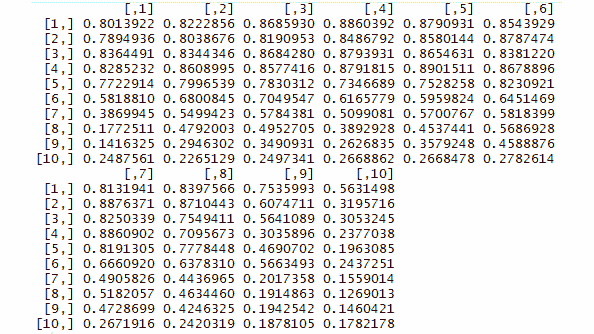
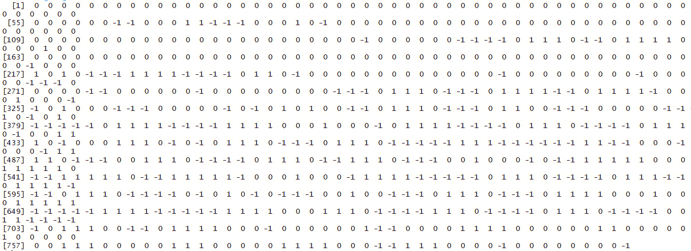
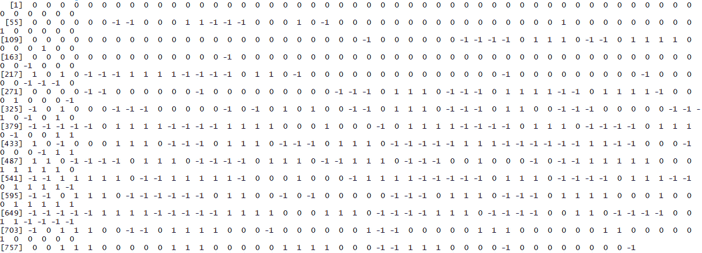
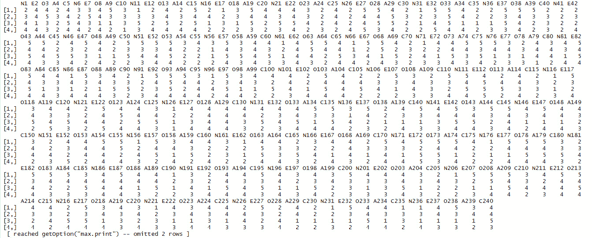
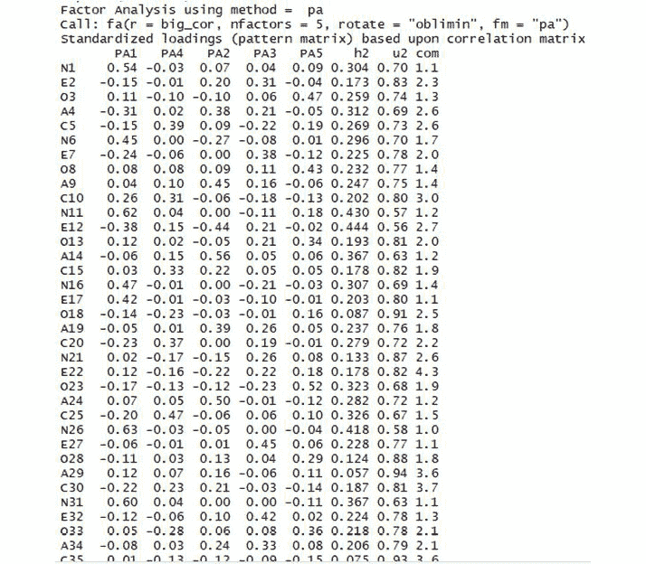
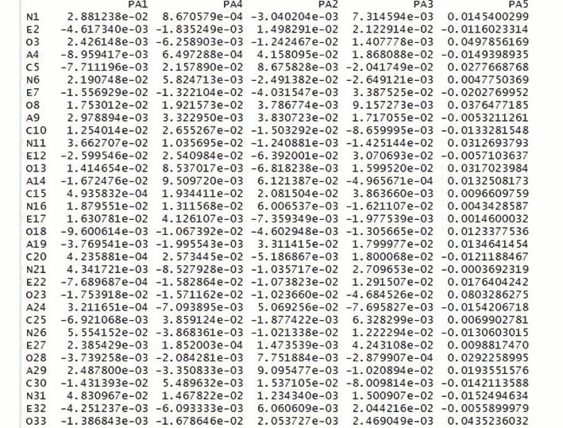
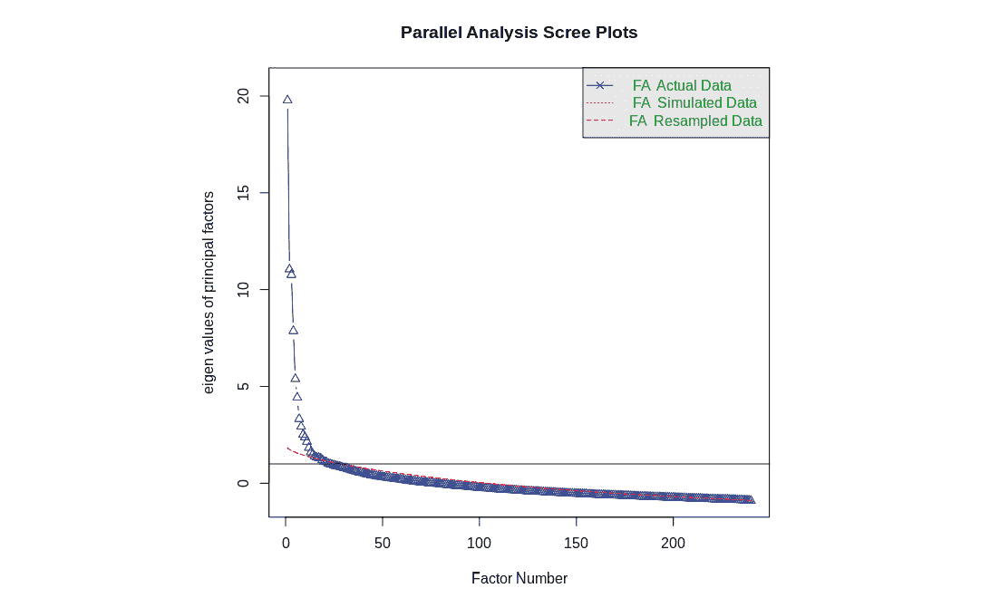

# 第六章：*第五章*

# 数据比较方法

## 学习目标

到本章结束时，你将能够：

+   创建数据哈希

+   创建图像签名

+   比较图像数据集

+   执行因子分析以隔离潜在变量

+   使用因子分析比较调查和其他数据集

在本章中，我们将探讨不同的数据比较方法。

## 简介

无监督学习关注于分析数据的结构以得出有用的结论。在本章中，我们将探讨使我们能够利用数据结构来比较数据集的方法。我们将重点研究的方法包括哈希函数、分析签名和潜在变量模型。

### 哈希函数

假设你想把一个 R 脚本发送给你的朋友。然而，你和你的朋友在文件上遇到了技术问题——也许你们的电脑被恶意软件感染了，或者也许有黑客正在篡改你的文件。所以，你需要一种方法来确保你的脚本在发送给朋友时是完整的，没有被损坏或更改。检查文件是否完整的一种方法就是使用**哈希函数**。

哈希函数可以为数据创建类似指纹的东西。我们所说的指纹是指一种小而易于检查的东西，使我们能够验证数据是否具有我们认为是其身份的东西。因此，在你创建想要发送的脚本之后，你将对脚本应用哈希函数并获取其指纹。然后，你的朋友可以在收到文件后使用相同的哈希函数对文件进行处理，并确保指纹匹配。如果发送的文件指纹与接收到的文件指纹匹配，那么这两个文件应该是相同的，这意味着文件是完整发送的。以下练习展示了如何创建和使用一个简单的哈希函数。

### 练习 29：创建和使用哈希函数

在这个练习中，我们将创建和使用一个哈希函数：

1.  指定需要使用哈希函数的数据。我们一直在探讨你想发送的 R 脚本场景。以下是一个简单的 R 脚本示例：

    ```py
    string_to_hash<-"print('Take the cake')"
    ```

    在这里，我们有一个打印字符串`Take the cake`的脚本。我们将其保存为名为`string_to_hash`的变量。

1.  指定可能的哈希值总数。我们的目标是为我们脚本创建一个指纹。我们需要指定我们将允许存在的指纹总数。我们希望指定一个足够低以便于操作，但又足够高以至于不同脚本偶然具有相同指纹的可能性不大的数字。在这里，我们将使用 10,000：

    ```py
    total_possible_hashes<-10000
    ```

1.  将脚本（目前是一个字符串）转换为数值。哈希函数通常是算术性的，因此我们需要用数字而不是字符串来工作。幸运的是，R 有一个内置函数可以为我们完成这项工作：

    ```py
    numeric<-utf8ToInt(string_to_hash)
    ```

    这已经将我们的脚本中的每个字符转换为整数，基于每个字符在 UTF-8 编码方案中的编码。我们可以通过打印到控制台来查看结果：

    ```py
    print(numeric)
    ```

    输出如下：

    ```py
      [1] 112 114 105 110 116  40  39  84  97 107 101  32 116 104 101  32  99  97 107[20] 101  39  41
    ```

1.  应用我们的散列函数。我们将使用以下函数来生成我们的最终散列，或者说，脚本的指纹：

    ```py
    hash<-sum((numeric+123)²) %% total_possible_hashes
    ```

    在 R 中运行这一行后，我们发现`hash`的最终值是 2702。由于我们使用了模运算符（在 R 中为`%%`），`hash`的值将始终在 0 到 10,000 之间。

我们用来将数值向量转换为最终散列值的简单函数并不是唯一的散列函数。专家们设计了许多具有不同复杂程度的此类函数。好的散列函数应该具有许多属性，其中之一是最重要的属性是**抗碰撞性**，这意味着很难找到两个产生相同散列值的数据集。

### 练习 30：验证我们的散列函数

在这个练习中，我们将验证我们的散列函数是否使我们能够有效地比较不同的数据，通过检查不同的信息产生不同的散列值。这个练习的结果将是不同信息的散列函数，我们将比较以验证不同的信息产生不同的散列值：

1.  创建一个执行散列的函数。我们将把前面练习中引入的代码组合到一个函数中：

    ```py
    get_hash<-function(string_to_hash, total_possible_hashes){
    numeric<-utf8ToInt(string_to_hash)
    hash<-sum((numeric+123)²) %% total_possible_hashes
    return(hash)
    }
    ```

    这个函数接收我们想要散列的字符串和可能的散列总数，然后应用我们在上一个练习中使用的相同的散列计算来计算散列值，并返回该散列值。

1.  比较不同输入的散列值。我们可以如下比较来自不同输入的散列值：

    ```py
    script_1<-"print('Take the cake')"
    script_2<-"print('Make the cake')"
    script_3<-"print('Take the rake')"
    script_4<-"print('Take the towel')"
    ```

    在这里，我们有四个不同的字符串，表达不同的信息。我们可以看到它们的散列值如下：

    ```py
    print(get_hash(script_1,10000))
    print(get_hash(script_2,10000))
    print(get_hash(script_3,10000))
    print(get_hash(script_4,10000))
    ```

    第一个脚本返回散列值 2702，正如我们在前面的练习中找到的那样。第二个脚本，尽管它只与第一个脚本有一个字符不同，返回的散列值是 9853，第三个脚本，也只与第一个脚本有一个字符不同，返回的散列值是 9587。最后一个脚本返回的散列值是 5920。尽管这四个脚本有相当大的相似性，但它们有不同的指纹，我们可以使用这些指纹来比较和区分它们。

这些散列对于您和您的消息接收者来说很有用，可以用来验证您的脚本在发送过程中未被篡改。当您发送脚本时，您可以告诉您的朋友确保脚本的散列值是 2702。如果您的朋友收到的脚本散列值不是 2702，那么您的朋友可以得出结论，脚本在发送和接收过程中被篡改了。如果您的朋友能够可靠地检测文件是否损坏，那么您可以避免传播恶意软件或与您的朋友因误解而争吵。

在线分发的软件有时会附带一个用户可以用来检查文件损坏的哈希值。为此，专业人士使用比前面练习中简单函数更高级的哈希函数。专业人士使用的其中一个哈希函数称为 MD5，在 R 中使用`digest`包可以非常容易地应用它：

```py
install.packages('digest')
library(digest)
print(digest(string_to_hash,algo='md5'))
```

输出如下：

```py
[1] "a3d9d1d7037a02d01526bfe25d1b7126"
```

在这里，我们可以看到我们简单 R 脚本的 MD5 哈希值。您可以自由尝试其他数据的 MD5 哈希值，以比较结果。

## 分析签名

在*第四章*，*降维*中，我们讨论了降维——这些方法使我们能够以给我们数据洞察力的方式简洁地表达数据。之前讨论的哈希函数是另一种实现降维的方法。哈希函数在许多用途中都很有用，包括我们讨论的文件验证用例。在那个场景中，我们感兴趣的是确定两个脚本是否完全相同。即使数据有细微的差异，例如将“take”一词改为“make”，也可能完全破坏预期的信息，因此需要精确性。

在其他情况下，我们可能希望在不需要比较的两个数据集具有完全相同性的情况下，进行有意义的比较。考虑检测版权侵犯的情况。假设一个网站托管了来自其用户的图像。它想要确保用户没有提交受版权保护的图像。因此，每次它收到上传时，它都希望检查该上传是否与大型版权图像数据库中的任何图像相同。

仅检查图像是否完全相同是不够的，因为一些不择手段的上传者可能会进行细微的修改并仍然尝试上传。例如，他们可能会改变一个像素的颜色，或者非常轻微地裁剪图像，或者将其压缩到比原始图像大或小。即使有这些细微的修改，图像仍然会违反版权法。一个检查完全相同性的哈希函数将无法识别这些版权侵犯。因此，图像托管网站将想要检查代表两张图片的数据中是否存在任何实质上相似的底层结构。

我们提到，哈希函数创建了一种类似于数据指纹的东西。指纹应该在每次观察时都完全相同，即使两个指纹在大多数方面相似，除非它们完全匹配，否则我们不会认为它们彼此匹配。

在这种情况下，我们需要的更像是一个签名，而不是指纹。每次您签名时，您的签名应该看起来或多或少相同。但是，即使是同一个人在尝试匹配之前的签名时，每个签名之间也会有细微的差异。为了验证签名是否匹配，我们需要检查实质性的相似性，而不是完美的身份。我们在这里提供的代码将展示如何将任何大小图像编码为一个小巧且健壮的编码，这允许在数据集之间进行快速且准确的近似比较。这种编码图像数据的方法可以被称为创建**分析签名**。

我们创建图像签名的步骤如下。首先，我们将图像分成一个 10x10 的网格。然后，我们将测量网格每个部分的亮度。之后，我们将比较每个部分的亮度与其相邻部分的亮度。最终的签名将包含一个向量，该向量包含每个网格部分与其每个相邻部分的比较。这种方法是由 Wong、Bern 和 Goldberg 发明的，并在一篇名为《任何类型图像的图像签名》的论文中发表。

在我们创建分析签名之前，我们需要进行一些数据准备，如下一练习所述。

### 练习 31：为创建图像分析签名进行数据准备

在这个练习中，我们将为阿拉莫的照片创建分析签名进行数据准备。

#### 注意

对于所有需要导入外部 CSV 文件或图像的练习和活动，请转到**RStudio**-> **会话**-> **设置工作目录**-> **到源文件位置**。您可以在控制台中看到路径已自动设置。

1.  首先，我们需要配置 R 以能够读取并处理我们的图像数据。我们需要安装`imager`包。您可以在 R 控制台中执行`install.packages('imager')`来安装此包，然后您可以通过在控制台中运行`library('imager')`来加载它。

1.  接下来，我们需要读取数据。在我们的例子中，我们将使用这张阿拉莫的照片：

    ###### 图 5.1：阿拉莫图像

    首先，从[`github.com/TrainingByPackt/Applied-Unsupervised-Learning-with-R/`](https://github.com/TrainingByPackt/Applied-Unsupervised-Learning-with-R/blob/master/Lesson05/Exercise31/alamo.jpg)Lesson05/Exercise31/alamo.jpg 下载到您的计算机上，并将其保存为`alamo.jpg`。确保它保存在 R 的工作目录中。如果它不在 R 的工作目录中，那么请使用`setwd()`函数更改 R 的工作目录。然后，您可以将此图像加载到名为`im`（代表图像）的变量中，如下所示：

    ```py
    filepath<-'alamo.jpg'
    im <- imager::load.image(file =filepath) 
    ```

    我们将要探索的其余代码将使用这个名为`im`的图像。在这里，我们已经将阿拉莫的照片加载到`im`中。然而，你可以通过将图像保存到你的工作目录并在`filepath`变量中指定其路径来运行其余的代码。

1.  我们正在开发的签名是为了用于灰度图像。因此，我们将使用`imager`包中的函数将此图像转换为灰度：

    ```py
    im<-imager::rm.alpha(im)
    im<-imager::grayscale(im)
    im<-imager::imsplit(im,axis = "x", nb = 10)   
    ```

    这段代码的第二行是将图像转换为灰度。最后一行将图像分割成 10 等份。

1.  以下代码创建了一个空矩阵，我们将用有关我们 10x10 网格每个部分的详细信息来填充它：

    ```py
    matrix <- matrix(nrow = 10, ncol = 10)
    ```

    接下来，我们将运行以下循环。这个循环的第一行使用了`imsplit`命令。这个命令之前也被用来将 x 轴分成 10 等份。这次，对于 x 轴的每个 10 等份，我们将在 y 轴上进行分割，也将它分成 10 等份：

    ```py
    for (i in 1:10) {
      is <- imager::imsplit(im = im[[i]], axis = "y", nb = 10)
      for (j in 1:10) {
        matrix[j,i] <- mean(is[[j]])
      }
    }
    ```

    在沿 y 轴分割后，矩阵通过`mean(is[[j]])`更新。这是所选部分的平均亮度的度量。

    这段代码的结果是一个 10x10 的矩阵，其中`i-j`元素包含原始照片`i-j`部分的平均亮度。

    如果你打印这个矩阵，你可以看到照片每个部分的亮度数字：

    ```py
    print(matrix)
    ```

    输出应该看起来像以下这样：



###### 图 5.2：输出矩阵的截图

你可以将这些亮度数字与原始照片的外观进行比较。

我们可以在这里停止，因为我们已经生成了一个复杂数据集的压缩编码。然而，我们可以采取一些进一步的步骤来使这个编码更有用。

我们可以做的事情之一是创建一个`brightnesscomparison`函数。这个函数的目的是比较图像中两个不同部分的相对亮度。最终，我们将比较我们分析的每张图像的所有不同部分。我们的最终指纹将包含许多这样的亮度比较。这个练习的目的是创建一个亮度比较函数，这将最终使我们能够创建最终的指纹。

请注意，这个练习是在上一个练习的基础上构建的，这意味着你应该在运行这个练习的代码之前运行上一个练习中的所有代码。

### 练习 32：创建亮度比较函数

1.  在这个函数中，我们传递两个参数，`x`和`y`：每个参数代表图片中特定部分的亮度。如果`x`和`y`相当相似（小于 10%的差异），那么我们可以说它们基本上是相同的，我们返回 0，表示亮度差异大约为 0。如果`x`比`y`大 10%以上，我们返回 1，表示`x`比`y`亮，如果`x`比`y`小 10%以上，我们返回-1，表示`x`比`y`暗。

1.  创建亮度比较函数。`brightnesscomparison` 函数的代码如下：

    ```py
    brightnesscomparison<-function(x,y){
    compared<-0
    if(abs(x/y-1)>0.1){
    if(x>y){
    compared<-1
    }
    if(x<y){
    compared<-(-1)
    }
    }
    return(compared)
    }
    ```

1.  我们可以使用这个函数来比较我们为图片形成的 10x10 网格的两个部分。例如，为了找到与直接左侧部分的亮度比较，我们可以执行以下代码：

    ```py
    i<-5
    j<-5
    left<-brightnesscomparison(matrix[i,j-1],matrix[i,j])
    ```

    在这里，我们查看矩阵的第 5 行和第 5 列。我们将这个部分与它左侧直接的部分进行比较——第 5 行和第 4 列，我们通过指定 `j-1` 来访问这个部分。

1.  使用亮度比较函数来比较图像部分与其上面的邻居。我们可以进行类似的操作来比较这个部分与其上面的部分：

    ```py
    i<-5
    j<-5
    top<-brightnesscomparison(matrix[i-1,j],matrix[i,j])
    ```

在这里，`top` 是第五部分与它上面紧邻的节点的亮度比较，我们通过指定 `i-1` 来访问这个节点。

这个练习的重要输出是 `top` 和 `left` 的值，它们都是图像部分与其他相邻部分的比较。在这种情况下，`left` 等于零，意味着我们选择的图像部分的亮度与左侧的图像部分大致相同。同样，`top` 等于 1，意味着我们选择的节点的直接上方部分比我们选择的节点亮度更高。

在下一个练习中，我们将创建一个 `neighborcomparison` 函数。这个函数将比较我们 10x10 网格中的每个节点的亮度，与它的邻居进行比较。这些邻居包括我们刚才比较过的左侧邻居，以及上面的邻居。总的来说，我们图片的每个部分（顶部、底部、左侧、右侧、左上、右上、左下和右下）都有八个邻居。我们想要这个邻居比较函数的原因是，它将使我们很容易得到最终的解析特征。

请注意，这个练习建立在之前的练习之上，你应该在运行这段代码之前运行所有之前的代码。

### 练习 33：创建一个函数来比较图像部分与所有相邻部分

在这个练习中，我们将创建一个 `neighborcomparison` 函数来比较图像部分与其他所有相邻部分。为此，执行以下步骤：

1.  创建一个函数，比较图像部分与其左侧的邻居。我们在之前的练习中做过这个操作。对于任何图像部分，我们可以比较其亮度与其左侧邻居的亮度，如下所示：

    ```py
    i<-5
    j<-5
    left<-brightnesscomparison(matrix[i,j-1],matrix[i,j])
    ```

1.  创建一个函数，比较图像部分与其上面的邻居。我们在之前的练习中做过这个操作。对于任何图像部分，我们可以比较其亮度与其上方邻居的亮度，如下所示：

    ```py
    i<-5
    j<-5
    top<-brightnesscomparison(matrix[i-1,j],matrix[i,j])
    ```

1.  如果你查看 S*tep 1*和 S*tep 2*，你可以开始注意到这些邻居比较中的模式。要比较图像部分与其左侧的部分，我们需要访问矩阵的`j-1`索引部分。要比较图像部分与其右侧的部分，我们需要访问矩阵的`j+1`索引部分。要比较图像部分与其上方的部分，我们需要访问矩阵的`i-1`索引部分。要比较图像部分与其下方的部分，我们需要访问矩阵的`i+1`索引部分。

    因此，我们将有每个图像部分与其上方、下方、左侧和右侧的每个邻居的比较。以下代码显示了我们将进行的比较，除了在 S*tep 1*和 S*tep 2*中进行的顶部和左侧比较：

    ```py
    i<-5
    j<-5
    top_left<-brightnesscomparison(matrix[i-1,j-1], matrix[i,j])
    bottom_left<-brightnesscomparison(matrix[i+1,j-1],matrix[i,j])
    top_right<-brightnesscomparison(matrix[i-1,j+1],matrix[i,j])
    right<-brightnesscomparison(matrix[i,j+1],matrix[i,j])
    bottom_right<-brightnesscomparison(matrix[i+1,j+1],matrix[i,j])
    bottom<-brightnesscomparison(matrix[i+1,j],matrix[i,j])
    ```

1.  初始化一个向量，该向量将包含部分与其每个邻居的最终比较：

    ```py
    comparison<-NULL
    ```

    我们将使用这个`comparison`向量来存储我们最终生成的所有邻居比较。它将包含图像部分与其每个邻居的比较。

1.  在步骤 1-4 中，我们展示了邻居比较函数的各个部分。在这个步骤中，我们将它们组合起来。你可以看到的邻居比较函数接受一个图像矩阵作为参数，并且还有`i`和`j`值，指定我们正在关注的图像矩阵的部分。该函数使用我们为`top`和`left`比较编写的代码，并为其他邻居添加了其他比较，例如`top_left`，它比较图像亮度级别与上方左侧部分的图像亮度。总的来说，每个图像部分应该有八个邻居：左上、上、右上、左、右、左下、下和右下。在这个步骤中，我们将进行这八个比较并将它们存储在`comparison`向量中。最后，有一个`return`语句，它返回所有比较。

    这里是我们可以使用来获取所有邻居比较的函数：

    ```py
    neighborcomparison<-function(mat,i,j){
    comparison<-NULL
    top_left<-0
    if(i>1 & j>1){
    top_left<-brightnesscomparison(mat[i-1,j-1],mat[i,j])
    }
    left<-0
    if(j>1){
    left<-brightnesscomparison(mat[i,j-1],mat[i,j])
    }
    bottom_left<-0
    if(j>1 & i<nrow(mat)){
    bottom_left<-brightnesscomparison(mat[i+1,j-1],mat[i,j])
    }
    top_right<-0
    if(i>1 & j<nrow(mat)){
    top_right<-brightnesscomparison(mat[i-1,j+1],mat[i,j])
    }
    right<-0
    if(j<ncol(mat)){
    right<-brightnesscomparison(mat[i,j+1],mat[i,j])
    }
    bottom_right<-0
    if(i<nrow(mat) & j<ncol(mat)){
    bottom_right<-brightnesscomparison(mat[i+1,j+1],mat[i,j])
    }
    top<-0
    if(i>1){
    top<-brightnesscomparison(mat[i-1,j],mat[i,j])
    }
    bottom<-0
    if(i<nrow(mat)){
    bottom<-brightnesscomparison(mat[i+1,j],mat[i,j])
    }
    comparison<-c(top_left,left,bottom_left,bottom,bottom_right,right,top_right,top)
    return(comparison)
    }
    ```

此函数返回一个包含八个元素的向量：每个元素对应于我们网格中特定部分的邻居。你可能已经注意到，10x10 网格的一些部分似乎没有八个邻居。例如，10x10 网格的 1-1 元素下面有一个邻居，但没有上面的邻居。对于没有特定邻居的网格位置，我们说它们对该邻居的亮度比较为 0。这降低了创建和解释亮度比较的复杂性水平。

最终输出是一个名为`comparison`的向量，它包含图像部分与其八个邻居之间的亮度级别比较。

在下一个练习中，我们将完成创建我们的分析签名。每个图像的分析签名将包括每个图像部分与其八个邻居的比较。我们将使用两个嵌套的 `for` 循环来遍历我们 10x10 网格的每个部分。本练习的预期输出将是一个生成图像分析签名的函数。

### 练习 34：创建一个生成图像分析签名的函数

在这个练习中，我们将创建一个函数，用于为图像生成一个分析签名。为此，请执行以下步骤：

1.  我们首先创建一个名为 `signature` 的变量，并用 `NULL` 值初始化它：

    ```py
    signature<-NULL
    ```

    当我们完成时，这个 `signature` 变量将存储完整的签名。

1.  现在，我们可以遍历我们的网格。对于网格的每个部分，我们向签名中添加八个新元素。我们添加的元素是我们之前介绍的 `neighborcomparison` 函数的输出：

    ```py
    for (i in 1:nrow(matrix)){
    for (j in 1:ncol(matrix)){
    signature<-c(signature,neighborcomparison(matrix,i,j))
    }
    }
    ```

    我们可以通过在控制台中运行 `print(signature)` 来查看我们的指纹是什么样的。它是一个包含 800 个值的向量，所有这些值都等于 0（表示相似的亮度或没有邻居）、1（表示某个区域比其邻居更亮）或 -1（表示某个区域比其邻居更暗）。

1.  将 S*tep 1* 和 S*tep 2* 结合在一个函数中，该函数可以生成任何图像矩阵的签名：

    ```py
    get_signature<-function(matrix){
    signature<-NULL
    for (i in 1:nrow(matrix)){
    for (j in 1:ncol(matrix)){
    signature<-c(signature,neighborcomparison(matrix,i,j))
    }
    }
    return(signature)
    }
    ```

    此代码定义了一个名为 `get_signature` 的函数，它使用来自 S*tep 1* 和 S*tep 2* 的代码来获取该签名。我们可以使用之前创建的图像矩阵来调用此函数。

1.  由于我们稍后还将创建更多签名，我们将把这个签名保存到一个变量中，该变量指明了它代表的是什么。在这种情况下，我们将称之为 `building_signature`，因为它是一个建筑图像的签名。我们可以这样做：

    ```py
    building_signature<-get_signature(matrix)
    building_signature
    ```

    输出如下：



###### 图：5.3：building_signature 矩阵

存储在 `building_signature` 中的向量是这个练习的最终输出，也是我们在本章中一直试图开发的图像签名。

这个签名旨在类似于人类的亲笔签名：小巧且表面上与其他签名相似，但足够独特，使我们能够将其与数百万其他现有签名区分开来。

我们可以通过读取一个完全不同的图像并比较生成的签名来检查我们找到的签名解决方案的鲁棒性。这就是以下活动的场景。

### 活动 11：为人物照片创建图像签名

让我们尝试为这张图像创建一个图像指纹，这是一张伟大的豪尔赫·路易斯·博尔赫斯的照片。

要完成这个活动，您可以遵循本章中我们已经遵循的所有步骤。以下步骤将为您概述这个过程。请记住，在我们之前进行的图像签名练习中，我们使用了一个 10x10 的亮度测量矩阵。然而，10x10 的矩阵可能不适合某些情况，例如，如果我们处理的图像特别小，或者我们有数据存储限制，或者我们期望使用不同的矩阵大小可以获得更高的精度。因此，在以下活动中，我们也将使用 9x9 矩阵计算一个签名：

#### 注意

这可以在任何给定的矩阵大小上执行。它可能是一个 5x5 的矩阵用于数据存储，或者是一个 20x20 的矩阵用于精确的签名。


###### 图 5.4：豪尔赫·路易斯·博尔赫斯图像

这些步骤将帮助我们完成活动：

1.  将图像加载到您的 R 工作目录中。将其保存到名为 `im` 的变量中。

1.  将您的图像转换为灰度并分成 100 个部分。

1.  创建一个亮度值矩阵。

1.  使用我们之前创建的 `get_signature` 函数创建一个签名。将 Borges 图像的签名保存为 `borges_signature`。

    #### 注意

    这个活动的解决方案可以在第 227 页找到。

这个活动的最终输出是 `borges_signature` 变量，它是 Borges 照片的分析签名。此外，我们还创建了 `borges_signature_ninebynine` 变量，它也是一个分析签名，但基于 9x9 而不是 10x10 的矩阵。我们可以在分析中使用它们中的任何一个，但我们将使用 `borges_signature` 变量。如果您已经完成了迄今为止的所有练习和活动，那么您应该有两个分析签名：一个名为 `building_signature`，另一个名为 `borges_signature`。

## 签名比较

接下来，我们可以比较这两个签名，看看它们是否将我们的不同图像映射到不同的签名值。

您可以使用以下一行 R 代码比较签名：

```py
comparison<-mean(abs(borges_signature-building_signature))
```

这种比较计算了两个签名中每个元素之间的差的绝对值，然后计算这些值的平均值。如果两个签名完全相同，那么这个差值将为 0。`comparison` 的值越大，两个图像的差异就越大。

在这种情况下，`comparison` 的值为 0.644，这表明平均而言，相应的签名条目之间大约相差 0.644。对于值仅在 1 和 -1 之间变化的数据库来说，这种差异是显著的。因此，我们看到我们的签名创建方法为非常不同的图像创建了非常不同的签名，正如我们所期望的那样。

现在，我们可以计算一个与我们的原始图像非常相似但又不完全相同的图像的签名：


###### 图 5.5：标记的阿拉莫图像

为了获得这张图像，我从一个原始的阿拉莫图像开始，并在四个地方添加了单词**水印**，模拟了有人可能对图像进行的修改。由于图像现在与原始图像不同，简单的版权检测软件可能会被这个水印欺骗。我们的分析签名方法不应该如此天真。我们将在以下活动中完成这项任务。

### 活动十二：为水印图像创建图像签名

在这个活动中，我们将为水印图像创建一个图像签名：

1.  将图像加载到您的 R 工作目录中。将其保存到名为`im`的变量中。

1.  将您的图像转换为灰度并分成 100 个部分。

1.  创建一个亮度值矩阵。

1.  使用我们之前创建的`get_signature`函数创建一个签名。将阿拉莫图像的签名保存为`watermarked_signature`。

1.  将水印图像的签名与原始图像的签名进行比较，以确定签名方法是否能够区分图像。

    输出将如下所示：



###### 图 5.6：预期水印图像的签名

#### 注意

本活动的解决方案可以在第 230 页找到。

为了检测版权侵权，我们可以计算数据库中每个受版权保护图像的签名。然后，对于每个新上传的图像，我们将新上传图像的签名与数据库中的签名进行比较。如果任何受版权保护的图像的签名与新上传的图像的签名相同或非常接近，我们将它们标记为潜在的匹配项，需要进一步调查。比较签名可能比比较原始图像快得多，并且它具有对水印等小变化具有鲁棒性的优点。

我们刚才执行签名方法是一种将数据编码以实现不同数据集之间比较的方法。有许多其他编码方法，包括一些使用神经网络的方法。每种编码方法都将具有其独特的特征，但它们都将共享一些共同特征：它们都将尝试返回压缩数据，以便于在不同数据集之间进行简单和准确的比较。

### 将其他无监督学习方法应用于分析签名

到目前为止，我们只使用了哈希和分析签名来比较两张图像或四个简短字符串。然而，可以应用于哈希或分析签名的无监督学习方法没有限制。为一系列图像创建分析签名可能是深入分析的第一步，而不是最后一步。在为一系列图像创建分析签名之后，我们可以尝试以下无监督学习方法：

+   **聚类**：我们可以将第一、二章节中讨论的任何聚类方法应用于由分析特征组成的数据库。这可能使我们能够找到所有倾向于彼此相似的一组图像，可能是因为它们是同一类型物体的照片。有关聚类方法的更多信息，请参阅第一、二章节。

+   **异常检测**：我们可以将*第六章*中描述的异常检测方法应用于由分析特征组成的数据库。这将使我们能够找到与数据集中其他图像非常不同的图像。

## 潜在变量模型 – 因子分析

本节将介绍潜在变量模型。潜在变量模型试图用少量隐藏或潜在的变量来表示数据。通过找到与数据集相对应的潜在变量，我们可以更好地理解数据，甚至可能理解数据来源或生成方式。

考虑到学生在各种不同课程中获得的分数，从数学到音乐、外语到化学。心理学家或教育工作者可能对使用这些数据更好地理解人类智力感兴趣。研究人员可能想要在数据中测试几种不同的智力理论，例如：

+   **理论 1**：有两种不同类型的智力，拥有一种类型的人将在一组课程中表现出色，而拥有另一种类型的人将在其他课程中表现出色。

+   **理论 2**：只有一种类型的智力，拥有它的人将在所有类型的课程中表现出色，而没有它的人则不会。

+   **理论 3**：一个人可能在一个或几个他们所学的课程标准下非常聪明，但在其他标准下并不聪明，每个人都会有一套不同的课程，他们在这些课程中表现出色。

这些理论中的每一个都表达了一个潜在变量的概念。数据只包含学生成绩，这可能是智力的表现，但不是智力本身的直接衡量标准。这些理论表达了不同类型的智力如何以潜在的方式影响成绩。即使我们不知道哪个理论是正确的，我们也可以使用无监督学习工具来理解数据的结构以及哪个理论最适合数据。

任何记得自己曾是学生的人可能都厌倦了别人评价他们的智力。因此，我们将使用一个稍微不同的例子。我们不会评价智力，而是评价个性。我们不会寻找左右脑，而是寻找人们个性的不同特征。但我们将采取相同的方法——使用潜在变量来识别复杂数据是否可以由少数几个因素解释。

为了为我们的分析做准备，我们需要安装和加载正确的包。下一个练习将涵盖如何加载因子分析所需的包。

### 练习 35：准备因子分析

在这个练习中，我们将为因子分析准备数据：

1.  安装必要的包：

    ```py
    install.packages('psych')
    install.packages('GPArotation')
    install.packages('qgraph')
    ```

1.  然后，你可以运行以下行将它们加载到你的 R 工作空间中：

    ```py
    library(psych)
    library(GPArotation)
    library(qgraph)
    ```

1.  接下来，加载数据。我们将使用的数据是 500 份对名为“修订版 NEO 人格问卷”的人格测试的记录。该数据集包含在名为 `qgraph` 的 R 包中。首先，将数据读入你的 R 工作空间。以下代码将允许你将其作为名为 `big5` 的变量访问：

    ```py
    data(big5)
    ```

1.  你可以通过在 R 控制台中运行以下行来查看数据的顶部部分：

    ```py
    print(head(big5))
    ```

    输出如下：

    ![图 5.7：数据顶部部分]

    

    ###### 图 5.7：数据顶部部分

1.  你可以通过以下方式查看你的数据行和列的数量：

    ```py
    print(nrow(big5))
    ```

    输出如下：

    ```py
    500
    ```

    要检查列，执行以下操作：

    ```py
    print(ncol(big5))
    ```

    输出如下：

    ```py
    240
    ```

    这份数据包含 500 行和 240 列。每一行是与一个调查受访者相关的完整记录。每一列记录了一个问题的答案。因此，有 500 名调查受访者每人回答了 240 个问题。每个答案都是数值型的，你可以看到以下回答的范围：

    ```py
    print(range(big5))
    ```

    输出如下：

    ```py
    [1] 1 5
    ```

    答案的范围是 1 到 5。

    本练习的预期输出是一个已加载 `big5` 数据的 R 工作空间。你可以确信数据已加载，因为当你控制台中运行 `print(range(big5))` 时，你会得到 `1 5` 作为输出。

在这个调查中，问题是通过向调查受访者展示一个问题并询问他们同意该答案的程度来提出的，其中 5 代表强烈同意，1 代表强烈不同意。这些陈述是关于一个人特定特征的说法，例如：

“我喜欢结识新朋友。”

“我有时会犯错误。”

“我喜欢修理东西。”

你可以想象，其中一些问题可能会测量相同的潜在“潜在”人格特质。例如，我们经常描述人们为好奇，从他们喜欢学习和尝试新事物的意义上来说。那些强烈同意“我喜欢结识新朋友”这一说法的人，如果这两个说法都在测量潜在的好奇心，那么他们很可能也会同意“我喜欢修理东西”这一说法。或者，可能是有些人具有对人们感兴趣的人格特质，而其他人则具有对事物感兴趣的人格特质。如果是这样，那些同意“我喜欢结识新朋友”的人就不太可能也同意“我喜欢修理东西”。在这里，因子分析的目的在于发现哪些问题对应于一个潜在的想法，并了解这些潜在想法是什么。

你可以看到，大多数列都以字母表中的一个字母以及一个数字开头。目前，你可以忽略这些标签，只需记住每个问题都有细微的差别，但其中许多是相似的。

我们现在准备好开始我们的潜在变量模型。在这种情况下，我们将执行因子分析。因子分析是一种强大且非常常见的方法，可以执行我们之前讨论过的潜在变量分析。因子分析假设存在某些潜在因子控制数据集，然后向我们展示这些因子是什么以及它们如何与我们的数据相关。

要开始我们的因子分析，我们需要指定我们要找多少个因子。有几种方法可以决定我们应该寻找多少个因子。目前，我们将从查看五个因子开始，因为这项数据被称为大五因子，然后我们稍后会检查是否其他数量的因子更好。

我们需要为我们新的数据创建一个相关矩阵。相关矩阵是一个矩阵，其中`i-j`项是存储在列`i`中的变量和存储在列`j`中的变量之间的相关系数。这与我们在*第四章*，*降维*中讨论的协方差矩阵类似。你可以按照以下方式创建这个数据的相关矩阵：

```py
big_cor <- cor(big5)
```

现在，因子分析本身相当简单。我们可以通过使用`fa`命令来完成它，这是`psych` R 包的一部分：

```py
solution <- fa(r = big_cor, nfactors = 5, rotate = "oblimin", fm = "pa") 
```

你会注意到这个命令中有几个参数。首先，我们指定`r=big_cor`。在这种情况下，R 的`psych`包的作者决定使用小写`r`来指代因子分析中使用的协方差矩阵。下一个参数是`nfactors=5`。这指定了我们在因子分析中要寻找的因子数量。这次我们选择了五个因子，但稍后我们会看看使用更多或更少的因子。

最后两个参数对我们这里的目的是不太重要的。第一个参数说`rotate="oblimin"`。因子分析在向我们展示结果之前，在幕后对我们的数据进行旋转，这就是所谓的旋转。有许多技术可以用来完成这种幕后旋转，而`oblimin`是`fa`函数的作者选择作为默认的旋转方法。你可以自由地尝试其他旋转方法，但它们通常会产生实质上相似的结果。最后一个参数，就像旋转参数一样，指定了一个在幕后使用的方法。在这里，`fm`代表因子分解方法，`pa`代表主成分。你也可以尝试其他因子分解方法，但再次强调，它们应该会产生实质上相似的结果。

#### 注意

你可以使用 R 中的`?`命令查找与任何其他命令相关的文档。在这种情况下，如果你对我们刚刚使用的`fa`命令感到好奇，你可以运行`?fa`来从你的 R 控制台加载文档。

现在，我们可以查看我们的因子分析输出：

```py
print(solution)
```

输出如下：



###### 图 5.8：输出的一部分

当我们这样做时，大部分输出是一个包含 240 行，标签为`Standardized loadings`的 DataFrame。这个数据框的每一行对应于我们原始数据框中的一列，例如`N1`。请记住，这些是我们数据来源的个性测试问题。这个数据框的前五行标签为`PA1`至`PA5`。这些对应于我们要找的五个因素。特定个性问题和特定因素的数量称为负载。例如，我们在数据框中有 0.54 的条目，对应于个性问题`N1`和因素`PA1`。我们说问题`N1`在因素`PA1`上的负载为 0.54。

我们可以将负载解释为对总分有贡献的因素。为了得到最终分数，你可以将每个特定负载乘以调查受访者对每个问题的回答，并将结果相加。用方程式表示，我们可以写成以下形式：

受访者 1 的因素 1 得分 =

（问题 1 上的因素 1 负载）*（受访者 1 对问题 1 的回答）+

（问题 2 上的因素 1 负载）*（受访者 1 对问题 2 的回答）+

...

（问题 240 上的因素 1 负载）*（受访者 1 对问题 240 的回答）

因此，如果一个特定问题的因素 1 负载很高，那么受访者对该问题的回答将对总因素 1 得分有较大的贡献。如果负载较低，那么该问题的回答对因素 1 得分的贡献就不那么大，换句话说，它对因素 1 的影响就不那么重要。这意味着每个负载都是衡量每个特定问题在因素测量中的重要程度的度量。

每个因素都有 240 个总负载——对应于个性调查中的每个问题。如果你查看负载矩阵，你可以看到许多问题在一个因素上有很大的负载，而在所有其他因素上的负载都很小（接近零）。研究人员经常试图根据每个因素的最高负载问题来假设每个因素的解释。

在我们的案例中，我们可以看到第一个因子，称为`PA1`，对第一个问题（标记为`N1`）有较高的负荷（0.54）。它还对第六个问题（`N6`）有相对较高的负荷（0.45），以及第十一题（`N11`）有较高的负荷（0.62）。在这里很容易看出一个模式——标记为`N`的问题往往对这个第一个因子有较高的负荷。结果证明，原始测试上的这些`N`问题都是为了衡量心理学家所说的“神经质”。神经质是一种基本的人格特质，使人们在面对困难时产生强烈的负面反应。调查中的`N`问题各不相同，但每个问题都是旨在衡量这种人格特质。我们在因子分析中发现，这个第一个因子往往对神经质问题有较高的负荷——因此我们可以称这个因子为“神经质因子”。

我们可以在其他负荷中看到类似的模式：

+   因素 2 似乎对“A”问题有较高的负荷，这些问题是用来衡量宜人性的。

+   因素 3 似乎对“E”问题有较高的负荷，这些问题是用来衡量外向性的。

+   因素 4 似乎对“C”问题有较高的负荷，这些问题是用来衡量尽责性的。

+   因素 5 似乎对“O”问题有较高的负荷，这些问题是用来衡量开放性的。

这些标签对应于“大五”人格理论，该理论认为这五种人格特质是人格最重要的最基本方面。在这种情况下，我们的五因素分析产生了与数据集中预先存在的标签相匹配的因子负荷模式。然而，我们不需要标记的问题来从因子分析中学习。如果我们获得了未标记的问题数据，我们仍然可以运行因子分析，并仍然可以在特定问题的特定因子负荷中找到模式。在找到这些模式后，我们必须仔细查看在相同因子上有高负荷的问题，并试图找出这些问题的共同之处。

### 因子分析背后的线性代数

因子分析是一种强大且灵活的方法，可以用多种方式使用。在以下练习中，我们将更改我们使用的因子分析命令的一些细节，以便更好地了解因子分析是如何工作的。

请注意：以下练习基于之前的因子分析代码。您必须运行之前突出显示的代码，特别是`big_cor <- cor(big5)`，才能成功运行以下练习中的代码。

### 练习 36：使用因子分析的进一步探索

在这个练习中，我们将详细探讨因子分析：

1.  我们可以改变`fa`函数中的几个参数以获得不同的结果。记住上次我们运行以下代码来创建我们的解决方案：

    ```py
    solution <- fa(r = big_cor, nfactors = 5, rotate = "oblimin", fm = "pa") 
    ```

    这次，我们可以更改`fa`函数的一些参数，如下所示：

    ```py
    solution <- fa(r = big_cor, nfactors = 3, rotate = "varimax", fm = "minres")
    ```

    在这种情况下，我们将旋转方法更改为`varimax`，将因素化方法更改为`minres`。这些都是对函数背后使用的方法的改变。对我们来说最重要的是，我们将因素数量（`nfactors`）从 5 更改为 3。检查此模型中的因素载荷：

    ```py
    print(solution)
    ```

    输出如下：

    

    ###### 图 5.9：输出的一部分

    你也可以尝试在这些载荷中寻找模式。如果你发现有三个、四个或其他一些数量的载荷存在一个显著的载荷模式，你甚至可能拥有一个新的个性心理学理论。

1.  确定在因子分析中要使用的因素数量。在这个时候，一个自然的问题是要问：我们应该如何选择我们寻找的因素数量？最简单的答案是，我们可以使用 R 的`psych`包中的另一个命令，称为`fa.parallel`。我们可以用以下方式运行此命令：

    ```py
    parallel <- fa.parallel(big5, fm = 'minres', fa = 'fa')
    ```

    再次，我们对函数背后的行为做出了选择。你可以尝试不同的`fm`和`fa`参数的选择，但你应该每次都看到实质上相似的结果。

    `fa.parallel`命令的一个输出是以下斯克里普图：




###### 图 5.10：平行分析斯克里普图

我们在*第四章*，*降维*中讨论了斯克里普图。标记为**主成分特征值**的 y 轴显示了每个因素在解释我们模型方差中的重要性。在大多数因子分析中，前几个因素具有相对较高的特征值，然后特征值急剧下降，并出现一个长长的平台期。这种急剧下降和长长的平台期共同形成了一个类似肘部的图像。因子分析中的常见做法是选择一个接近这种模式形成的肘部的因素数量。心理学家们共同选择了五个作为通常用于个性调查表的因素数量。你可以检查这个斯克里普图，看看你是否认为这是正确的数量，并且可以自由尝试使用不同数量的因素进行因子分析。

我们刚刚进行的练习的最终重要结果是斯克里普图。

你可能已经注意到，因子分析似乎与主成分分析有一些共同之处。特别是，两者都依赖于绘制特征值作为衡量不同向量重要性的方法之一的斯克里普图。

本书中对因子分析和主成分分析之间的全面比较超出了本书的范围。只需说明的是，它们具有相似的线性代数基础：两者都是为了创建协方差矩阵的近似，但每种方法实现这一点的途径略有不同。我们在因子分析中找到的因子与我们在主成分分析中找到的主成分类似。我们鼓励您尝试在相同的数据集上使用因子分析和主成分分析，并比较结果。结果通常非常相似，但并非完全相同。在大多数实际应用中，可以使用任何一种方法——您使用的具体方法将取决于您自己的偏好以及您对哪种方法最适合当前问题的判断。

### 活动 13：执行因子分析

在这个活动中，我们将使用因子分析对新的数据集进行分析。您可以在[`github.com/TrainingByPackt/Applied-Unsupervised-Learning-with-R/tree/master/Lesson05/Activity13`](https://github.com/TrainingByPackt/Applied-Unsupervised-Learning-with-R/tree/master/Lesson05/Activity13)找到数据集。

#### 注意

此数据集来自 UCI 机器学习仓库。您可以在[`archive.ics.uci.edu/ml/machine-learning-databases/00484/tripadvisor_review.csv`](http://archive.ics.uci.edu/ml/machine-learning-databases/00484/tripadvisor_review.csv)找到数据集。我们已经下载了文件并将其保存到[`github.com/TrainingByPackt/Applied-Unsupervised-Learning-with-R/tree/master/Lesson05/Activity13/factor.csv`](https://github.com/TrainingByPackt/Applied-Unsupervised-Learning-with-R/tree/master/Lesson05/Activity13/factor.csv)。

此数据集由 Renjith、Sreekumar 和 Jathavedan 编制，可在 UCI 机器学习仓库中找到。此数据集包含有关个人对旅游目的地所写评论的信息。每一行对应一个特定的唯一用户，总共有 980 个用户。列对应旅游景点的类别。例如，第二列记录每个用户的艺术画廊平均评分，第三列记录每个用户的舞厅平均评分。共有 10 个旅游景点类别。您可以在[`archive.ics.uci.edu/ml/datasets/Travel+Reviews`](http://archive.ics.uci.edu/ml/datasets/Travel+Reviews)找到关于每列记录的文档。

通过因子分析，我们将寻求确定不同类别用户评分之间的关系。例如，果汁吧（第 4 列）和餐厅（第 5 列）的用户评分可能相似，因为它们都由相同的潜在因素决定——用户对食物的兴趣。因子分析将尝试找到这些控制用户评分的潜在因素。我们可以遵循以下步骤进行因子分析：

1.  下载数据并将其读入 R。

1.  加载 `psych` 包。

1.  选择记录用户评分的列子集。

1.  为数据创建一个相关矩阵。

1.  确定应使用的因子数量。

1.  使用`fa`命令进行因子分析。

1.  检查并解释因子分析的结果。

    输出应类似于以下内容：

![图 5.11：因子分析预期结果

![img/C12628_05_12.jpg]

###### 图 5.11：因子分析预期结果

#### 注意

本活动的解决方案可以在第 231 页找到。

## 摘要

在本章中，我们讨论了与数据比较相关的话题。我们首先讨论了数据指纹的概念。为了说明数据指纹，我们引入了一个可以将任何字符串转换为固定范围内数字的哈希函数。这种哈希函数很有用，因为它使我们能够确保数据具有正确的身份——就像现实生活中的指纹一样。在介绍哈希函数之后，我们讨论了数据签名的重要性。数据签名或分析签名很有用，因为它使我们能够看到两个数据集是否是近似匹配的——指纹需要精确匹配。我们通过图像数据说明了分析签名的作用。我们通过介绍潜在变量模型来结束本章。我们讨论的潜在变量模型是因子分析。我们讨论了因子分析的一个应用，该应用使用心理调查数据来确定人们性格之间的差异。在下一章中，我们将讨论异常检测，这将使我们能够找到与数据集其他部分不匹配的观测值。
