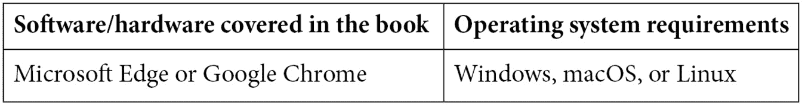

# 前言

《使用 Microsoft Azure 的自动化机器学习》将帮助你以创纪录的时间构建高性能、准确的机器学习模型。它允许任何人轻松利用人工智能的力量，提高其业务的效率和盈利能力。通过一系列点击图形用户界面（GUI），新手和经验丰富的数据科学家都可以轻松训练和部署机器学习解决方案到生产环境中。

本书将教你如何仔细、逐步地使用 Azure AutoML 的图形用户界面（GUI）和 Azure 机器学习 Python SDK。首先，你将学习如何准备数据、训练模型并将它们注册到你的 Azure 机器学习工作区。然后，你将学习如何使用这些模型创建既包含机器学习管道的自动化批量解决方案，又包含使用**Azure Kubernetes 服务**（**AKS**）的实时评分解决方案。

当你完成《使用 Microsoft Azure 的自动化机器学习》一书时，你将能够使用 AutoML 处理自己的数据，不仅能够训练回归、分类和预测模型，还能利用它们解决各种商业问题。你将能够通过自动生成的图表和图形向商业伙伴展示你的机器学习模型是如何进行预测的，从而赢得他们的信任和尊重。

# 本书面向对象

数据科学家、有志成为数据科学家的人、机器学习工程师以及任何希望在业务中应用人工智能或机器学习的人会发现这本书很有用。在开始学习这本书之前，你需要具备人工智能的入门级知识以及计算机科学、统计学或信息技术方面的技术背景。拥有 Python 背景将有助于你实现本书的更高级功能，但即使数据分析师和 SQL 专家在完成本书后也能训练机器学习模型。

# 本书涵盖内容

*第一章*，*介绍 AutoML*，首先解释了工业界数据科学和人工智能的现状以及为什么许多公司在从数据中提取价值方面如此困难。它解释了数据科学家是如何工作的，为什么他们的流程本质上很慢，以及为什么需要加快这些流程。最后，它介绍了 AutoML 作为满足工业界投资回报要求的解决方案。

*第二章*，*Azure 机器学习服务的入门*，深入解释了 Azure 机器学习的不同组件以及它们如何集成以形成端到端的机器学习解决方案。你将了解数据存储、数据集、计算实例、计算集群、环境和实验，以及如何使用它们在 Azure 上创建机器学习解决方案。

*第三章*，*训练您的第一个 AutoML 模型*，将指导您使用公开可用的泰坦尼克号数据创建您的第一个 AutoML 模型。您将使用 Azure 机器学习工作室 GUI 将数据上传到您的工作区，创建数据集，并运行一个 AutoML 分类作业来预测泰坦尼克号幸存者。最后，您将使用 AutoML 的可解释性功能来查看哪些因素对预测生存最为关键。

*第四章*，*构建 AutoML 回归解决方案*，将帮助您使用 Python 中的 Azure 机器学习 SDK 训练 AutoML 回归模型。您将学习如何访问 Azure 机器学习中的 Jupyter 笔记本，使用计算集群在云上进行远程训练，并创建一个预测数字的 AutoML 模型。到本章结束时，您将能够为未来遇到的任何回归问题复制这项工作。

*第五章*，*构建 AutoML 分类解决方案*，将帮助您使用 Python 中的 Azure 机器学习 SDK 以两种方式训练 AutoML 分类模型。首先，您将训练一个二元分类模型来预测两个类别中的一个。然后，您将训练一个多类分类模型来预测三个类别中的一个。到本章结束时，您将成为训练所有类型分类模型的 AutoML 专家。

*第六章*，*构建 AutoML 预测解决方案*，探讨了预测，这是最常见的机器学习问题之一，也是最难掌握的。在本章中，您将学习如何使用 AutoML 编写预测解决方案，利用高级预测特定算法和功能。您将了解预测的方方面面，并能够避免人们在预测时犯的许多常见错误。

*第七章*，*使用多模型解决方案加速器*，扩展了**多模型解决方案加速器**（**MMSA**）是如何作为一种前沿的 Azure 技术，让公司能够快速轻松地训练数十万个模型。在这里，您将学习如何访问 MMSA 并将其适应您自己的问题。这是一个仅针对经验丰富的数据科学家的强大代码解决方案，但即使是新手到本章结束时也能使用它。

*第八章*，*选择实时评分与批量评分*，探讨了实时解决方案和批量解决方案是如何代表评分机器学习模型的两种方式。本章深入分析了常见的商业场景，并解释了您应该如何选择要创建哪种类型的解决方案。本章末尾有一个测验，将测试您将业务问题与正确类型解决方案匹配的能力，从而节省您的时间和金钱。

*第九章*，*实现批量评分解决方案*，强调机器学习管道是 Azure 机器学习的首选批量评分解决方案。机器学习管道是容器化的代码，一旦创建，你可以轻松地重新运行并自动安排它们。本章将指导你使用之前章节中创建的 AutoML 模型来创建强大的批量评分解决方案，这些解决方案可以在你选择的计划上运行。

*第十章*，*创建端到端 AutoML 解决方案*，强调**Azure 数据工厂**（**ADF**）是一个无需编写代码的数据编排工具，可以轻松与机器学习管道集成。在本章中，你将学习如何无缝地将数据移动到 Azure 中，以及如何将此流程与你的评分管道集成。到本章结束时，你将了解 ADF 和 AMLS 如何结合以创造最佳的数据科学体验。

*第十一章*，*实现实时评分解决方案*，教你如何在 AKS 和**Azure 容器实例**（**ACI**）上创建实时评分端点。你将学习如何通过 Azure 机器学习工作室 GUI 的单击操作以及 Jupyter 笔记本中的 Python 代码将 AutoML 模型部署到端点，完成你的 AutoML 训练。

*第十二章*，*利用 AutoML 实现商业价值*，重点关注创建端到端解决方案只是实现商业价值的第一步；你还需要赢得最终用户的信任。本章重点关注如何通过架构图、模型可解释性和以直观、易于理解的方式展示结果来赢得这种信任。你将学习如何成为并被视为你业务的可信、可靠的合作伙伴。

# 为了充分利用本书

你需要满足以下要求：



为了使用*使用 Microsoft Azure 的自动化机器学习*，你需要一个有效的互联网连接。我们建议使用 Microsoft Edge 或 Google Chrome 以获得最佳的 Azure 门户体验。此外，如果你还没有，你将需要创建一个 Azure 账户（免费）。

如果你使用的是本书的数字版，我们建议你亲自输入代码或通过 GitHub 仓库（下一节中提供链接）访问代码。这样做将帮助你避免与代码复制粘贴相关的任何潜在错误。

在你阅读本书的过程中，请随时尝试使用自己的数据使用 AutoML。解决你感兴趣的问题将极大地帮助你学习体验。在每个章节的结尾，尝试将你的数据集适应到示例代码中。

# 下载示例代码文件

您可以从 GitHub 下载本书的示例代码文件 [`github.com/PacktPublishing/Automated-Machine-Learning-with-Microsoft-Azure`](https://github.com/PacktPublishing/Automated-Machine-Learning-with-Microsoft-Azure)。如果代码有更新，它将在现有的 GitHub 仓库中更新。

我们还提供了一系列来自我们丰富图书和视频目录的代码包，可在 [`github.com/PacktPublishing/`](https://github.com/PacktPublishing/) 找到。查看它们吧！

# 下载彩色图像

我们还提供了一份包含本书中使用的截图/图表彩色图像的 PDF 文件。您可以从这里下载：[`static.packt-cdn.com/downloads/9781800565319_ColorImages.pdf`](https://static.packt-cdn.com/downloads/9781800565319_ColorImages.pdf)。

# 使用的约定

本书使用了多种文本约定。

`文本中的代码`：表示文本中的代码词汇、数据库表名、文件夹名、文件名、文件扩展名、路径名、虚拟 URL、用户输入和 Twitter 昵称。以下是一个示例：“您这里还有一个辅助函数，`get_forecasting_output`。”

代码块设置如下：

```py
from azureml.core import Workspace, Dataset, Datastore
from azureml.core import Experiment
from azureml.core.compute import ComputeTarget
from azureml.train.automl import AutoMLConfig
from azureml.train.automl.run import AutoMLRun
from azureml.widgets import RunDetails
```

任何命令行输入或输出都应如下编写：

```py
from azureml.pipeline.core import PipelineRun
experiment = Experiment(ws, 'your-experiment_name')
pipeline_run = PipelineRun(experiment, 'your-pipeline-run-id')
```

**粗体**：表示新术语、重要词汇或屏幕上出现的词汇。例如，菜单或对话框中的文字会以这种方式显示。以下是一个示例：“在 Azure Machine Learning Studio 的**资产**下的**实验**中，点击您的实验名称，选择您的运行 ID，点击**模型**选项卡，选择性能最高的算法，然后点击**指标**选项卡。”

小贴士或重要提示

看起来像这样。

# 联系我们

欢迎读者反馈。

**一般反馈**：如果您对本书的任何方面有疑问，请在邮件主题中提及书名，并给我们发送电子邮件至 customercare@packtpub.com。

**勘误**：尽管我们已经尽最大努力确保内容的准确性，但错误仍然可能发生。如果您在本书中发现错误，我们将非常感激您能向我们报告。请访问 [www.packtpub.com/support/errata](http://www.packtpub.com/support/errata)，选择您的书，点击勘误提交表单链接，并输入详细信息。

**盗版**：如果您在互联网上发现我们作品的任何非法副本，我们将非常感激您能提供位置地址或网站名称。请通过 copyright@packt.com 联系我们，并提供材料的链接。

**如果您有兴趣成为作者**：如果您在某个领域有专业知识，并且有兴趣撰写或为本书做出贡献，请访问 [authors.packtpub.com](http://authors.packtpub.com)。

# 评论

请留下您的评价。一旦您阅读并使用了这本书，为何不在购买它的网站上留下评价呢？潜在读者可以查看并使用您的客观意见来做出购买决定，我们 Packt 可以了解您对我们产品的看法，而我们的作者也可以看到他们对书籍的反馈。谢谢！

如需了解 Packt 的更多信息，请访问[packt.com](http://packt.com)。
