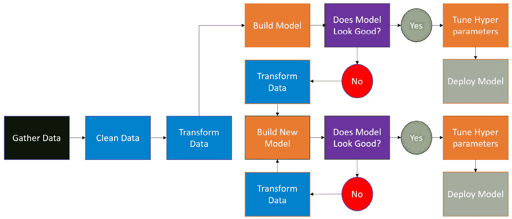
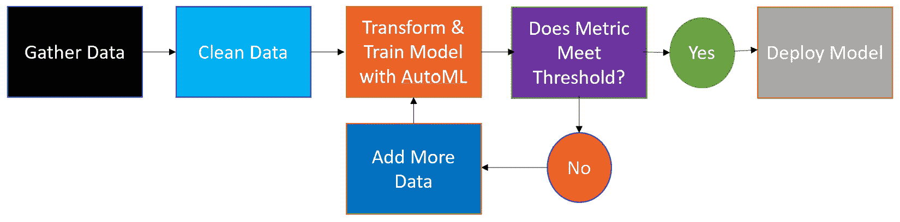

# 第一章：介绍 AutoML

人工智能无处不在。从推荐你最喜欢的网站上的产品到优化《财富》500 强公司的供应链，再到预测各种规模商店的需求，人工智能已经成为一股主导力量。然而，随着人工智能在职场中越来越普遍，一个令人担忧的趋势已经出现：大多数人工智能项目都失败了。

失败可能由各种技术和非技术原因引起。有时，这是因为人工智能模型表现不佳。其他时候，则是由于数据问题。机器学习算法需要可靠、准确、及时的数据，有时你的数据未能达到这些标准。当数据不是问题，且你的模型表现良好时，失败通常是因为最终用户根本不相信人工智能能指导他们的决策。

然而，对于每一个令人担忧的趋势，都有一个有希望的解决方案。微软和其他许多公司已经开发了**自动化机器学习**（**AutoML**）来提高你人工智能项目的成功率。在这本书中，你将学习如何在微软的 Azure 云平台上使用 AutoML。如果你是数据科学家，这本书将教你如何提高你的生产力。如果你不是数据科学家，这本书将使你能够构建机器学习模型并利用人工智能的力量。

在本章中，我们将首先了解人工智能和机器学习是什么，并解释为什么公司在看到他们在人工智能上的投资回报方面如此困难。然后，我们将深入探讨数据科学家的工作方式，以及为什么从项目成功角度来看，这种工作流程本质上是缓慢且容易出错的。最后，我们将通过介绍 AutoML 作为解锁机器学习项目生产力的关键来结束本章。

在本章中，我们将涵盖以下主题：

+   解释数据科学的投资回报率问题

+   分析 AI 项目失败的原因

+   使用 AutoML 解决投资回报率问题

# 解释数据科学的投资回报率问题

**数据科学家**自 2016 年至 2019 年一直被福布斯杂志评为美国**最佳工作**，然而这份最佳工作并没有为雇佣他们的公司带来最佳结果。根据 VentureBeat 的数据，87%的数据科学项目未能进入生产阶段。这意味着数据科学家所做的许多工作对他们的雇主没有任何实质性的影响。

单独来看，这并不是一个问题。如果数据科学家既便宜又充足，公司就会看到他们的投资回报。然而，事实并非如此。根据 2020 年 LinkedIn 薪酬统计，美国所有职业级别的数据科学家总收入约为 111,000 美元。他们也很容易找到工作。

美国的一家高管招聘公司 Burtch Works 报告称，截至 2018 年，数据科学家平均在其岗位上工作了 2.6 年，那年有 17.6%的数据科学家更换了工作。数据科学家既昂贵又难以留住。

同样，如果数据科学家工作速度快，即使 87%的项目未能产生影响，**投资回报率**（**ROI**）仍然有可能实现。快速失败意味着许多项目仍然进入生产阶段，部门是成功的。缓慢失败意味着部门未能交付。

不幸的是，大多数数据科学部门都缓慢失败。要理解为什么，你必须首先了解机器学习是什么，它与传统软件开发有何不同，以及所有机器学习项目共有的五个步骤。

## 定义机器学习、数据科学和人工智能

**机器学习** 是一个通过使用数据来训练统计模型进行预测的过程。它是人工智能的一个类别。**人工智能** 被定义为执行认知任务（如决策）的计算机程序，这些任务通常由人类完成。**数据科学** 是一个职业领域，它结合了计算机科学、机器学习和其他统计技术来解决商业问题。

数据科学家使用各种机器学习算法来解决商业问题。**机器学习算法**最好被看作是一组在数据上执行以进行预测的数学计算。你可能在日常生活中遇到的机器学习的常见应用包括预测你的信用卡何时被用于欺诈交易、确定申请贷款时应获得多少金额，以及在线购物时推荐给你的商品。所有这些大小决策都是通过机器学习机制性地确定的。

算法有很多种，但对你来说，了解它们所有并不重要。随机森林、XGBoost、LightGBM、深度学习、CART 决策树、多元线性回归、朴素贝叶斯、逻辑回归和 k 近邻都是机器学习算法的例子。这些算法之所以强大，是因为它们通过学习数据中的模式来工作，这些模式对于任何人类来说都过于复杂或微妙，无法自行检测。

对你来说重要的是了解监督学习和无监督学习之间的区别。**监督学习**使用历史标记数据来做出未来的预测。

想象你是一位餐厅经理，你想通过运行广告活动来预测下个月你能赚多少钱。要使用机器学习完成这项任务，你需要收集过去几年的所有销售数据，包括以前活动的结果。由于你有过去的结果，并且正在使用它们来做出预测，这是一个监督学习的例子。

**无监督学习**只是将相似的数据点分组在一起。当你拥有大量关于客户的信息，并希望将他们分组到不同的桶中以便更精准地对他们进行广告宣传时，这很有用。然而，Azure AutoML 严格用于监督学习任务。因此，在创建新的 AutoML 模型时，你总是需要确保数据中包含过去的结果。

## 机器学习与传统软件的比较

传统软件开发与机器学习开发差异巨大。程序员习惯于创建基于明确定义的规则接收输入并产生输出的软件。另一方面，数据科学家首先收集所需的输出，然后再编写程序。然后，他们使用这些输出数据以及输入数据来创建一个程序，该程序学会如何从输入预测输出。

例如，你可能想构建一个算法，预测在特定城市特定一天会发生多少交通事故。首先，你会开始收集历史数据，例如交通事故的数量（所需的输出）以及你认为在预测该数量时可能有用的任何数据（输入数据）。天气数据、星期几、交通量以及与城市事件相关的数据都可以用作输入。

收集数据后，你的下一步是创建一个统计程序，该程序在输入和输出数据之间寻找隐藏的模式；这被称为**模型训练**。在训练好你的模型后，你的下一步是设置一个**推理程序**，该程序使用新的输入数据，利用训练好的模型来预测当天将发生多少交通事故。

另一个主要区别是，在机器学习中，在尝试之前，你永远不知道你需要什么数据来创建解决方案，你也不知道你将得到什么，直到你构建了一个解决方案。由于数据科学家永远不知道他们需要什么数据来解决任何给定的问题，他们需要向业务专家寻求建议，并使用他们的直觉来识别收集正确数据的方法。

这些差异很重要，因为成功的机器学习项目与传统软件项目的成功看起来非常不同；混淆两者会导致项目失败。具有 IT 背景但缺乏数据科学背景的管理人员常常试图遵循不适合机器学习项目的方法和时间表。

实际上，在不知道你需要什么数据或哪些算法会起作用的过程中设定硬性时间表是不现实的，许多数据科学项目之所以失败，仅仅是因为它们没有得到足够的时间和资源。然而，成功有一个秘诀。

## 机器学习成功的五个步骤

现在我们已经了解了机器学习是什么以及它与传统软件开发的不同之处，下一步是学习典型的机器学习项目是如何构建的。你可以以许多方式划分这个过程，但大致可以分为五个部分，如下面的图所示：

图 1.1 – 任何机器学习项目的五个步骤

让我们依次看看这些步骤。

### 理解业务问题

*第一步*，理解业务问题，意味着与最终用户交谈，了解他们试图解决的问题，并将其转化为机器学习问题。

例如，在职业篮球的世界中，一个问题可能是：“我们在挑选欧洲篮球运动员方面真的很糟糕。我们希望提高为我们的球队挑选正确球员的能力。”你需要弄清楚业务上所说的“好球员”是什么意思。在这个过程中，你可能会发现，从欧洲带来的大多数球员只打了几场比赛就被送回家，这给球队造成了数百万美元的浪费。

拥有这些信息后，你需要将问题转化为机器学习可以解决的问题。明确地思考。例如，“我们将使用球员的历史比赛统计数据和人口统计信息来预测他们在 NBA 职业生涯中的寿命”将是一个好的机器学习项目。将业务问题转化为 AI 问题总是意味着使用数据来尝试预测一个数字（在 NBA 中比赛的场次）或一个类别（球员在打了几场比赛后是否会回家）。

### 收集和清洗数据

*第二步*，收集和清洗数据，包括以下步骤：

1.  识别和获取数据源

1.  获取所有你想要的数据

1.  将所有数据合并在一起

1.  删除数据中的错误

1.  应用业务逻辑以创建一个即使是外行人也能理解的干净数据集

这比听起来要难。数据通常很脏且难以找到。

以我们的篮球案例为例，这意味着从网络上抓取公开数据以获取每位球员的比赛统计数据和人口统计信息。错误几乎是不可避免的，因此你将不得不运用逻辑来删除或修复无意义的数字。例如，没有人能长到 190 英寸，但厘米和英寸经常被混淆。

检验你是否已正确清洗数据集并使其清晰的最佳方法是将其交给一个外行人并询问简单的问题。例如：“球员 Y 有多高？球员 X 在其职业生涯中参加了多少场 NBA 比赛？”如果他们能回答，你就成功了。

### 为机器学习转换数据

一旦你有一个易于理解的、清洗过的数据集，下一步就是为机器学习转换数据，这被称为**特征工程**。特征工程是为机器学习算法改变数据的过程。一些特征对于算法运行是必要的，而其他特征则使算法更容易找到模式。常见的特征工程技术包括对分类变量进行独热编码、缩放数值、移除异常值和填充空值。

一个复杂的问题是，不同的算法需要不同类型的特征工程。与大多数算法不同，XGBoost 不需要你填写空值。决策树对异常值的影响不大，但异常值会干扰回归模型。回到我们的篮球问题，你可能需要替换空值，对数值进行缩放，使得每一列只包含从 0 到 1 的数字范围，并对分类变量进行独热编码。

重要提示

独热编码分类变量简单来说就是将一个包含许多类别的列转换成多个列，每个列要么是 1 要么是 0。例如，如果你有一个包含值 *USA*、*Canada* 或 *Mexico* 的列，独热编码这一列将创建三个列，每个国家一个。来自美国的产品的行将在 *USA* 列中有一个 *1*，而在 *Canada* 和 *Mexico* 列中有一个 *0*。

### 训练机器学习模型

现在你有了数据，并且数据格式正确，是时候训练一个机器学习模型了。尽管这一步得到了很多光彩和炒作，但训练机器学习模型是一个既快又慢的过程。利用今天的技术，大多数机器学习模型只需几行代码就可以训练。

相比之下，**超参数调整**可能需要非常长的时间。每个机器学习算法都有你可以控制的设置，称为**超参数**。超参数调整是多次重新训练机器学习算法，直到找到正确的参数集。

一些算法，如随机森林，从超参数调整中获益不多。其他算法，如 XGBoost 或 LightGBM，通常会有显著改进。根据你的数据量、使用的算法以及可用的计算量，超参数调整可能需要几天到几周才能完成。

注意你需要了解多少关于个别算法的知识才能成为一名成功的数据科学家？这是该领域有如此高的入门门槛的原因之一。不要感到害怕，但请记住，当我们介绍 AutoML 时，这一点很重要。

### 向最终用户交付结果

你现在已经训练了你的模型并调整了其参数，你可以自信地预测 NBA 球队应该签下哪些欧洲球员。也许你已经达到了 80%的准确率，也许达到了 90%，但你的预测肯定会对业务有所帮助。尽管你的结果如此，你仍然需要让最终用户接受你的模型，信任你的模型，并使用它。与传统软件不同，这可能需要巨大的努力。

首先，最终用户将想知道模型为什么给出这样的预测，如果你使用了错误的算法，这是不可能的。**黑盒模型**使用本质上无法知晓的算法。然后，即使你可以给出业务解释，用户可能对那个 80%的准确率数字感到不舒服。“那是什么意思？”他们会问。

可视化是缓解他们部分恐惧的关键。对于你的篮球模型，你决定简单地展示他们应该选的球员的商业图片，以及一些简单的图表，显示我们的模型准确预测了多少名球员将成为 NBA 明星，以及我们的模型未能预测多少名欧洲 NBA 明星。

## 整合所有内容

你现在知道了机器学习是什么，它与传统软件开发有何不同，以及任何机器学习项目固有的五个步骤。不幸的是，行业内许多人并不了解这些。大多数企业都是数据科学的新手。许多企业认为数据科学比软件开发更相似，这干扰了机器学习项目的过程。

最终用户被数据科学家的问题弄糊涂了，因为他们没有意识到数据科学家正在尝试将他们的业务问题转化为机器学习问题。IT 部门对数据科学家为什么要求访问如此多的数据感到困惑，因为他们没有意识到在尝试之前，数据科学家并不知道他们需要哪些数据。管理层对他们的数据科学家花很少的时间构建模型而花大量时间清洗和转换数据感到困惑。

因此，机器学习过程中的**步骤 1**和**步骤 2**往往比预期的要花费更长的时间。商业用户未能以有用的方式将他们的业务问题传达给数据科学家，IT 部门缓慢地授予数据科学家访问数据的权限，而数据科学家在理解他们接收到的数据时也遇到了困难。**步骤 5**也很复杂，因为最终用户期望模型像典型的软件程序一样完美可解释，赢得他们的信任需要时间。

由于误解会减缓其他步骤，数据科学过程的其余部分必须快速进行，以便公司能够看到投资回报。毕竟，数据转换和模型训练是数据科学工作的核心。这正是他们接受培训要做的，而且应该快速完成。正如我们将在下一节中看到的，这很少是情况。

# 慢慢分析为什么 AI 项目失败

数据科学家通常来自研究背景，并以系统的方法构建机器学习模型。在获得业务问题和确定人工智能解决方案的样子后，这个过程看起来是这样的：

1.  收集数据。

1.  清洗数据。

1.  转换数据。

1.  构建机器学习模型。

1.  确定模型是否可接受。

1.  调整超参数。

1.  部署模型。

如果模型在**步骤 5**中可接受，数据科学家将继续进行**步骤 6**。如果模型不可接受，他们将返回到**步骤 3**并尝试不同的模型和转换。这个过程可以在**图 1.2**中看到：

图 1.2 – 构建机器学习解决方案的传统方法

虽然这个过程遵循了**图 1.1**中概述的五个步骤，但它既长又繁琐。还有与转换数据、构建模型、调整超参数和部署模型相关的特定缺点。现在，我们将更详细地探讨这一过程中固有的缺点，这些缺点导致数据科学项目缓慢失败而不是快速失败，从而极大地影响了投资回报率问题：

+   **数据必须由不同的算法进行转换**。数据转换可能是一个繁琐的过程。学习如何填充空值、对分类变量进行独热编码、去除异常值以及适当地缩放数据集并不容易，需要多年的经验才能掌握。这也需要大量的代码，新手程序员很容易出错，尤其是在学习一门新的编程语言时。

    此外，不同的算法需要不同的数据转换。有些算法可以处理空值，而有些则不能。有些可以处理高度不平衡的数据集，那些你只拥有少量样本的类别，而其他算法则无法处理。

    如果你在去除异常值时，一个算法可能表现良好，而另一个则可能完全不受影响。无论你何时选择尝试一个新的模型，都有很高的可能性你需要花时间重新设计你的数据以适应你的算法。

+   **某些算法需要调整超参数才能表现良好**。与随机森林不同，使用 XGBoost 和 LightGBM 等算法构建的模型只有在调整它们的超参数时才能表现良好，但它们可以表现得非常好。

    因此，你有两个选择：坚持使用无需调整就能表现不错的模型，或者花费数天到数周的时间调整具有高潜力但无成功保证的模型。此外，你需要大量的算法特定知识，才能使用传统方法成为一名成功的数据科学家。

+   **超参数调整需要大量的计算时间**。训练单个机器学习模型可能需要几天到几周，这似乎有些夸张，但在实践中这是常见的。在大多数公司，GPU 和 CPU 是有限的资源，数据集可能相当大。某些公司有专线来获取计算能力，而数据科学家需要大量的计算能力。

    在超参数调整时，通常会进行一种称为**网格搜索**的操作，其中在指定的数值空间中训练每个可能的参数组合。例如，假设算法*X*有参数*A*、*B*和*C*，你想要尝试将*A*设置为*1*、*2*和*3*，将*B*设置为*0*和*1*，将*C*设置为*0.5*、*1*和*1.5*。调整这个模型需要构建 3 x 2 x 3 = 15 个机器学习模型来找到理想的组合。

    现在，15 个模型可能需要几分钟到几天的时间来训练，这取决于你使用的数据大小、你希望采用的算法以及你的计算能力。然而，15 个模型是非常少的。许多现代机器学习算法要求你在广泛的值范围内调整五到六个参数，产生数百到数千个模型以寻找最佳性能。

+   **部署模型很困难，学校也没有教授这方面的知识**。即使你正确地转换了数据并找到了具有最佳超参数集的完美模型，你仍然需要将其部署以供业务使用。当新数据到来时，它需要通过模型进行评分并交付到某个地方。监控是必要的，因为机器学习模型偶尔会出故障，必须重新训练。然而，数据科学家很少接受模型部署方面的培训。这被认为更多的是一个 IT 功能。

    由于缺乏培训，许多公司使用一些临时拼凑的架构和一系列的技术来部署机器学习。数据库查询可能由第三方软件在触发器上触发。数据可能使用一种计算机语言进行转换，存储在文件共享上的文件中，然后由另一个进程以另一种语言评分模型并将其保存回文件共享。脆弱的、临时的解决方案是常态，对于大多数数据科学家来说，这些都是工作中的培训内容。

+   **数据科学家更关注准确性而非可解释性**。从根本上说，数据科学家被训练去构建尽可能准确的 AI。Kaggle 竞赛全都是关于准确性，新的算法也是根据它们与过去解决方案相比的表现来评判的。

    与此相反，商界人士通常更关心预测背后的*原因*。忘记包含可解释性会削弱最终用户对机器学习的信任，结果，许多模型最终被闲置不用。

总的来说，构建机器学习模型需要花费大量时间，而当 87% 的人工智能项目未能进入生产阶段时，这就浪费了大量的时间。收集数据和清洗数据是本身就需要花费大量时间的过程。

为每个模型转换数据、调整超参数以及找出并实施部署方案可能需要更长的时间。在这种情况下，很容易专注于寻找尽可能好的模型，而忽略了项目最重要的部分：赢得最终用户的信任并确保您的解决方案被使用。幸运的是，有许多问题的解决方案。

# 利用 AutoML 解决投资回报率问题

由于人工智能项目的失败率很高，企业对机器学习工作原理的理解不足，以及每个项目所需的时间很长，微软和其他公司一直在努力开发能够实现更快开发和更高成功率的解决方案。其中之一就是 AutoML。

通过自动化数据科学家的大量工作，并利用云计算的力量，Azure 上的 AutoML 允许数据科学家更快地工作，甚至允许非专业人士构建人工智能解决方案。

具体来说，Azure 上的 AutoML 会为您转换数据、构建模型和调整超参数。部署只需点击几个按钮即可，并且可解释性内置到解决方案中。与 *图 1.2* 中的传统机器学习过程相比，*图 1.3* 中的 AutoML 流程要简单得多：

图 1.3 – 构建机器学习解决方案的 AutoML 方法

采用 AutoML 方法可以使您更快地失败，并达到需要决定是添加更多数据还是放弃项目的状态。与其浪费时间调整没有可能成功的模型，AutoML 只需一次运行就能给出明确的答案。让我们更详细地了解一下 AutoML 的优势。

### Azure 上 AutoML 的优势

让我们来看看 AutoML 的一些优势：

+   **AutoML 自动转换数据**：一旦您拥有一个清洗干净、无错误的、易于理解的格式化数据集，您只需将其加载到 AutoML 中即可。您不需要填写空值、对分类值进行 one-hot 编码、缩放数据、移除异常值，或者担心数据集的平衡，除非在极端情况下。所有这些操作都通过 AutoML 的智能特征工程完成。甚至还有数据护栏，可以自动检测数据集中可能导致构建不良模型的问题。

+   **AutoML 使用最佳算法训练模型**：在你将数据加载到 AutoML 之后，它将开始使用最新的算法来训练模型。根据你的设置和计算资源的大小，AutoML 将使用 Azure 云并行训练这些模型。在运行结束时，AutoML 甚至还会构建复杂的集成模型，结合你表现最好的模型的结果。

+   **AutoML 为你调整超参数**：当你使用 Azure 上的 AutoML 时，你会注意到它经常会反复使用相同的算法来创建模型。

    你可能会注意到，在运行初期，它尝试了广泛的算法，但在运行结束时，它只专注于一个或两个。这是因为它在测试不同的超参数。虽然它可能无法在任何一次运行中找到绝对最佳的超参数组合，但它很可能会提供一个性能高、调优良好的模型。

+   **AutoML 具有超快的发展速度**：使用 Azure 上的 AutoML 构建的模型只需几点击就可以部署到 REST API 端点。附带的脚本详细说明了你需要传递到端点的数据模式。一旦你创建了 REST API，你就可以将其部署到任何地方，轻松地对数据进行评分并将结果存储在你选择的数据库中。

+   **AutoML 具有内置的可解释性**：最近，微软专注于负责任的 AI。负责任 AI 的关键要素之一是能够解释你的机器学习模型是如何做出决策的。

    AutoML 生成的模型附带一个仪表板，显示模型使用的不同特征的重要性。这适用于你使用 AutoML 训练的所有模型，除非你开启了使用黑盒深度学习算法的选项。甚至单个数据点也可以被解释，这极大地帮助你的模型赢得业务最终用户的信任和接受。

+   **AutoML 使数据科学家能够更快地迭代**：通过智能特征工程、并行模型训练和自动超参数调整，AutoML 让数据科学家能够更快地失败和成功。如果你无法使用 AutoML 获得良好的性能，你就知道你需要添加更多数据。

    相反，如果你使用 AutoML 实现了出色的性能，你可以选择直接部署模型，或者将 AutoML 作为基准来比较你手动编写的模型。在这个时候，预计最好的数据科学家将能够手动构建在某些情况下优于 AutoML 的模型。

+   **AutoML 使非数据科学家能够进行数据科学**：传统的机器学习有很高的入门门槛。你必须精通统计学、计算机编程和数据工程才能在数据科学领域取得成功，而这些只是硬技能。

    与此相反，AutoML 可以由任何了解如何处理数据的人执行。只要具备一点 SQL 和数据库知识，你就可以利用 AI 的力量，快速构建和部署能够带来商业价值的机器学习模型。

+   **AutoML 是未来的趋势**：正如人工智能从一句口号发展成为一种实践一样，机器学习解决方案的创建方式也需要从研究项目发展到成熟的机器。AutoML 是这台成熟机器的关键部分，Azure 上的 AutoML 拥有许多功能，可以帮助您更快地失败和成功。从数据转换到部署再到最终用户的接受，AutoML 使机器学习比以往任何时候都更容易、更易于访问。

+   **AutoML 广泛可用**：微软的 AutoML 不仅可在 Azure 上使用，还可以在 Power BI、ML.NET、SQL Server、Synapse 和 HDInsight 中使用。随着其进一步成熟，预计它将被整合到越来越多的 Azure 和非 Azure 微软服务中。

# 摘要

人工智能和机器学习可能已经吸引了全世界的想象力，但人工智能的空中楼阁般的承诺与现实中的 AI 项目之间存在很大的差距。特别是机器学习项目，往往失败且缓慢。传统的管理者将数据科学项目视为软件工程项目，而数据科学家以手动、耗时的方式工作。幸运的是，AutoML 作为一种加快项目的方法已经出现，微软也根据您的需求创建了其 AutoML 产品。

您现在已准备好进入*第二章**，开始使用 Azure 机器学习服务*，该章节将向您介绍微软 Azure 机器学习工作区。您将创建一个 Azure 机器学习工作区以及启动 AutoML 项目所需的所有必要组件。到本章结束时，您将牢固掌握 Azure 机器学习工作室的所有不同组件以及它们是如何相互作用的。
