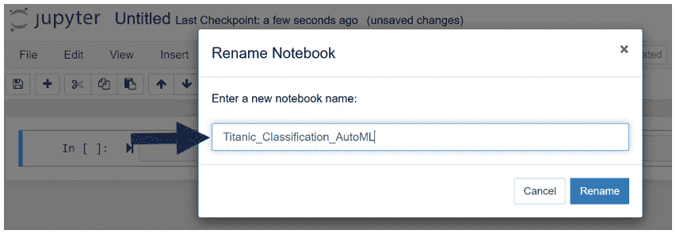
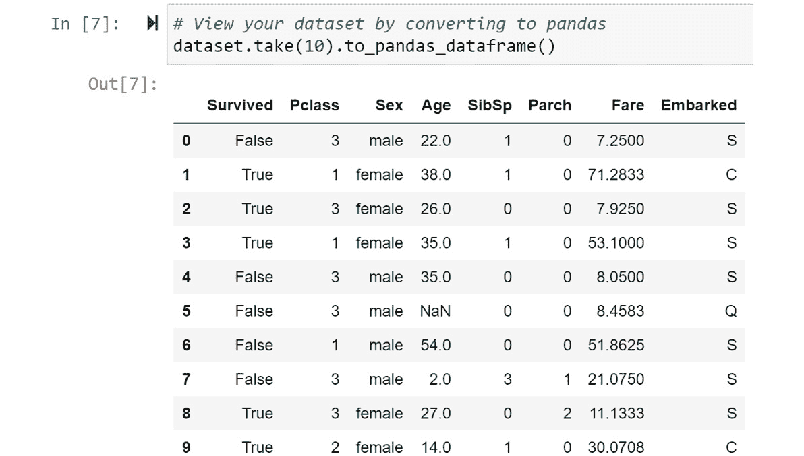
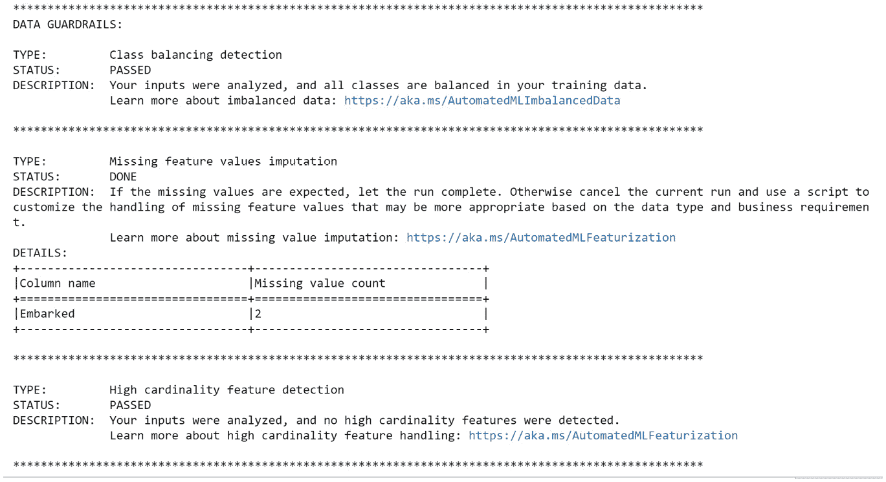
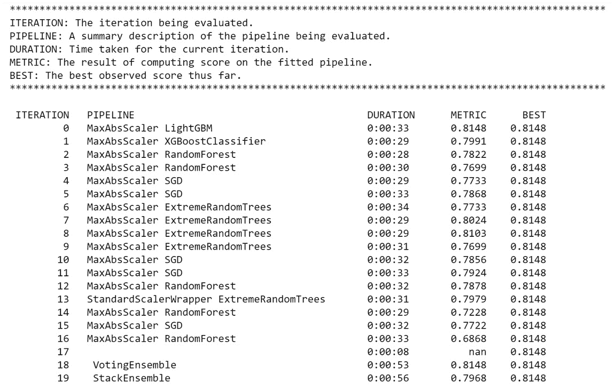
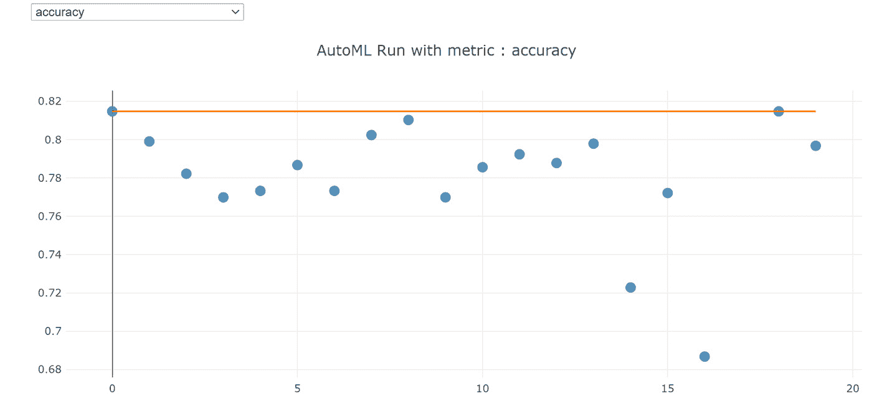
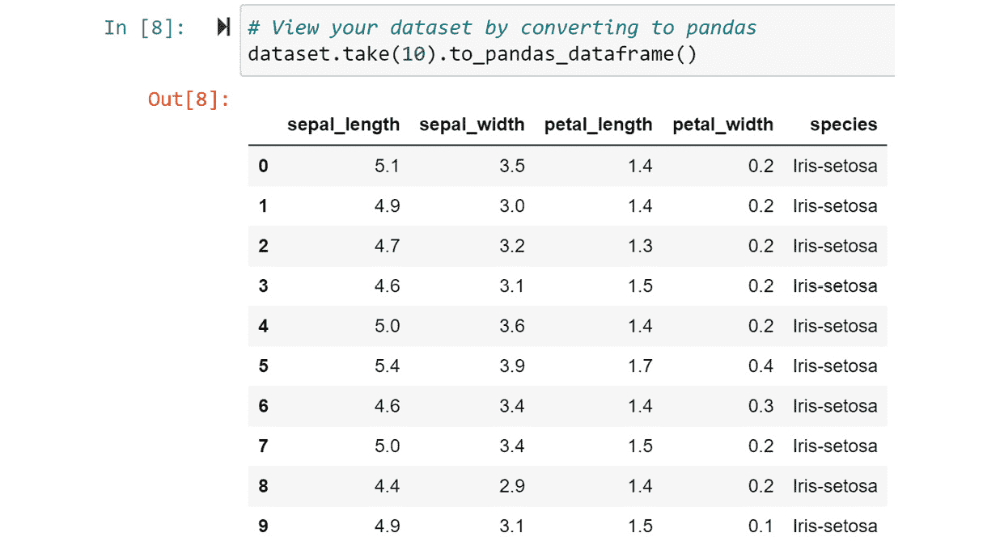
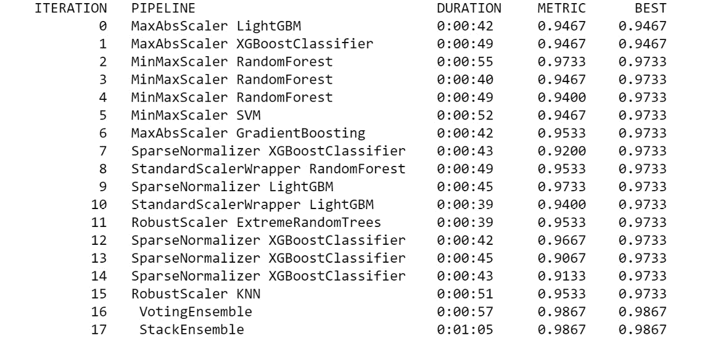
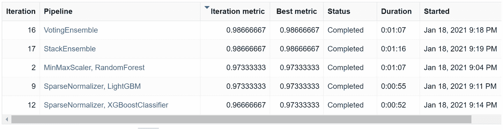
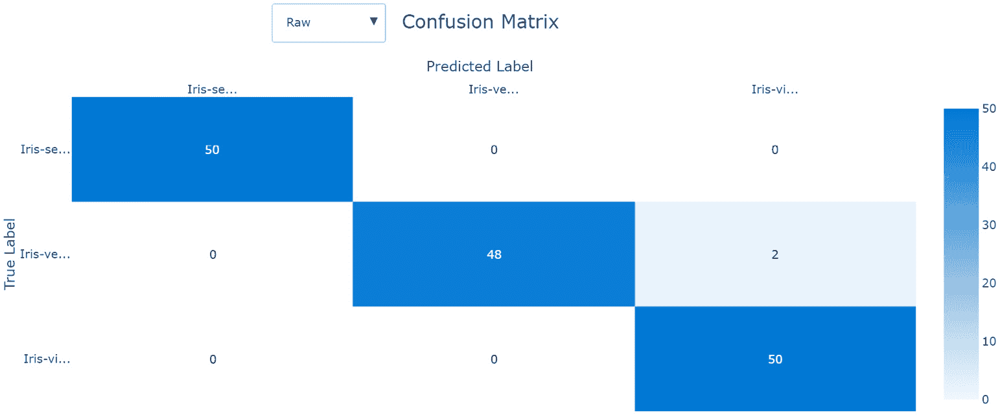
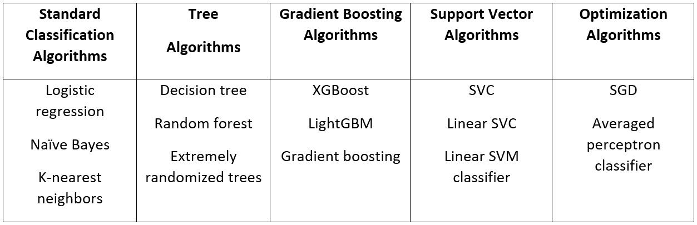

# 第五章：构建 AutoML 分类解决方案

在使用 Python 在 *第四章**，构建 AutoML 回归解决方案* 中构建您的 AutoML 回归解决方案之后，您应该对自己的编码能力感到自信。在本章中，您将构建一个分类解决方案。与回归不同，**分类**用于预测感兴趣对象的类别。例如，如果您试图预测在接下来的五年内谁有可能成为房主，那么分类是正确的机器学习方法。

**二元分类**是指您试图预测两个类别，例如房主或非房主，而**多类分类**涉及尝试预测三个或更多类别，例如房主、租房者或与家人同住。您可以使用 Azure AutoML 利用这两种技术，本章将教会您如何使用不同的数据集训练这两种类型的模型。

在本章中，您将首先直接导航到 Jupyter 环境，就像您在 *第四章**，构建 AutoML 回归解决方案* 中做的那样。然后，您将加载与您在 *第三章**，训练您的第一个 AutoML 模型* 中构建模型相同的泰坦尼克号数据。重新训练相同的模型会令人感到无聊，因此您将通过添加一些派生列来丰富数据集。

一旦您做到了这一点，您将训练、检查并注册您的二元分类模型。然后，您将使用流行的、公开可用的 Iris 数据集训练一个多类分类模型，该模型将根据其尺寸预测单个植物的花的类型。您将在本章结束时学习一些关于如何微调分类模型的小技巧和窍门。请注意，即使是经验丰富的数据科学家也常常未能修改他们的分类模型以符合手头的业务问题。

到本章结束时，您将能够轻松地独立构建所有类型的分类模型，无论您之前的机器学习经验如何。

在本章中，我们将涵盖以下主题：

+   准备 AutoML 分类数据

+   训练 AutoML 分类模型

+   注册您的训练好的分类模型

+   训练 AutoML 多类模型

+   微调您的 AutoML 分类模型

# 技术要求

对于本章，您将通过 Jupyter 笔记本中的 Python 代码在 **Azure 机器学习** (**AML**) **工作室** 中构建模型。此外，您将使用您在之前章节中应该已经创建的数据集和 Azure 资源。因此，完整的要求列表如下：

+   上网访问

+   一个网络浏览器，最好是 Google Chrome 或 Microsoft Edge Chromium

+   一个 Microsoft Azure 账户

+   一个 **Azure 机器学习** 工作区

+   在*第二章**，Azure 机器学习入门*中创建的`titanic-compute-instance`计算实例

+   在*第二章**，Azure 机器学习入门*中创建的`compute-cluster`计算集群

+   来自*第三章**，训练你的第一个 AutoML 模型*的`Titanic Training Data`数据集

+   理解如何从 Azure 计算实例导航到 Jupyter 环境，如*第四章**，构建 AutoML 回归解决方案*中所示

# 准备 AutoML 分类数据

分类，或根据其属性预测某物的类别，是机器学习的关键技术之一。就像回归一样，在用 AutoML 训练之前，你首先需要准备你的数据。在本节中，你将首先导航到你的 Jupyter 笔记本，加载你的数据，并将其转换为 AutoML 使用。

正如你通过 Jupyter 笔记本加载`Diabetes Sample`数据集进行回归一样，你将同样地加载`Titanic Training Data`数据集。然而，这一次，在训练你的 AutoML 模型之前，你将进行更广泛的数据转换。这是为了巩固你的学习；分类数据集不一定需要比它们的回归对应物更多的转换。与上一章相同，你将首先从你的计算实例打开一个 Jupyter 笔记本。

## 导航到你的 Jupyter 环境

与*第四章**，构建 AutoML 回归解决方案*类似，你将首先创建一个新的 Jupyter 笔记本来创建你的分类模型，如下所示：

1.  首先，通过导航到[`ml.azure.com`](http://ml.azure.com)打开 AML 工作室。

1.  一旦你进入工作室，在**管理**下点击右侧的**计算**。

1.  如果你的计算实例当前处于暂停状态，请检查`titanic-compute-instance`旁边的圆形复选框，并点击**启动**按钮。

1.  然后，点击之前创建的`Diabetes_Regression_AutoML`笔记本。每次你创建一个 Jupyter 笔记本，它都会在你的 AMLS 工作区中持久保存，即使你或其他用户从不同的计算实例访问 Jupyter 也是如此。在这个空间里，你可以随意创建尽可能多的笔记本，并仔细命名它们，这样你就可以轻松跟踪不同的项目。

1.  在屏幕右上角点击**新建**以访问下拉菜单。

1.  从下拉菜单中选择**Python 3.6 – AzureML**。

1.  点击屏幕左上角出现的新的 Jupyter 笔记本，`Untitled.ipynb`。

1.  通过点击结果文本框中的`Titanic_Classification_AutoML`并将`Untitled.ipynb`重命名为`Titanic Classification_AutoML`，然后点击**重命名**，如以下截图所示：



图 5.2 – 重命名你的 Jupyter 笔记本

你的笔记本创建完成后，你现在可以加载你的 Titanic 数据。

## 加载数据并进行转换

所有 AutoML 解决方案都使用大致相同的模板代码。如果你完成了*第四章**，构建 AutoML 回归解决方案*，请逐行复制你的代码单元格。完成之后，只需按步骤操作，并在必要时修改你的代码。如果你直接跳到这一章，你将不得不从头开始编写代码。

就像之前一样，你将加载 Python 库并设置你的工作区、数据存储、计算集群和数据集。然后按照以下方式转换和注册你的增强数据：

1.  加载运行所有代码所需的全部库。请参阅*第四章**，构建 AutoML 回归解决方案*，以了解所有这些包的详细解释：

    ```py
    from azureml.core import Workspace, Dataset, Datastore
    from azureml.core import Experiment
    from azureml.core.compute import ComputeTarget
    from azureml.train.automl import AutoMLConfig
    from azureml.train.automl.run import AutoMLRun
    from azureml.widgets import RunDetails
    ```

1.  使用`pandas`和`numpy`加载数据。这些是流行的 Python 包，可以帮助你转换数据。特别是`pandas`对于查看数据集中的数据是必要的：

    ```py
    import pandas as pd
    import numpy as np
    ```

1.  将你的 Jupyter 笔记本连接到你的 AutoML 工作区：

    ```py
    ws = Workspace.from_config()
    ```

1.  设置你的计算集群：

    ```py
    compute_name = 'compute-cluster'
    compute_target = ComputeTarget(ws, compute_name)
    ```

1.  设置你的`datastore`。对于这个练习，我们将使用随 AutoML 工作区提供的默认数据存储。如果你想使用不同的数据存储，你可以替换名称：

    ```py
    datastore = Datastore.get_default(ws)
    my_datastore_name = 'workspaceblobstore'
    my_datastore = Datastore.get(ws, my_datastore_name)
    ```

1.  设置你的`dataset`：

    ```py
    dataset_name = "Titanic Training Data"
    dataset = Dataset.get_by_name(ws, dataset_name, version='latest')
    ```

    注意

    *第 6 步*是第一次你应该修改代码的地方。每次你在 Azure 中创建一个新的分类或回归 AutoML 解决方案时，都应使用此模板。

1.  以下代码用于查看数据的前 10 行。请确保它看起来是正确的：

    ```py
    dataset.take(10).to_pandas_dataframe()
    ```

    前十行应该如下所示：

    

    图 5.3 – 查看你的 Titanic 数据集

1.  将你的数据集转换为`Age`列。乘客的年龄很可能与其他列（如`Sex`）有关。我们不是用整个`Age`列的平均值替换这些空值，而是用按性别划分的平均年龄来替换。

1.  计算你的`Titanic`数据集中男性和女性的平均年龄：

    ```py
    dfRaw = dataset.to_pandas_dataframe()
    round(dfRaw.groupby(['Sex'])['Age'].mean())
    ```

    这段代码将显示女性的平均年龄为 28 岁，男性的平均年龄为 31 岁。你将在下一个单元格中使用这些数字。

1.  使用以下条件 Python 代码用每个性别适当的数字替换`Age`列中的空值：

    ```py
    dfRaw['Age'] = dfRaw.apply(
       lambda row: 31 if np.isnan(row['Age'])\
        and row['Sex']=='male'\
        else (28 if np.isnan(row['Age'])\
              and row['Sex']=='female'\
        else row['Age']),axis=1)
    ```

    另一个常见的转换是将数值数据分箱。**分箱**数值数据意味着从一个数值列创建多个分类列，例如，将年龄列分割成年龄范围。当你怀疑数字的范围比绝对数值更重要时，你应该对数值数据进行分箱。

    例如，如果你怀疑一个人的年龄（年轻或年老）是否对他们在泰坦尼克号上是否幸存有影响，但不是他们的确切年龄，你应该将数据分箱到不同的组中。AutoML 不会自动为你分箱数据，但某些算法，如决策树，不需要分箱就能达到类似的效果。

1.  将`Age`列分箱到四个不同的年龄组：15 岁以下，15-35 岁，35-60 岁，以及 60 岁以上：

    ```py
    dfRaw['BinUnder15'] = np.where(dfRaw.Age < 15,1,0)
    dfRaw['Bin15to34'] = np.where((dfRaw.Age>14)\
                                & (dfRaw.Age < 35),1,0)
    dfRaw['Bin35to60'] = np.where((dfRaw.Age>34)\
                                & (dfRaw.Age < 61),1,0)
    dfRaw['BinOver60'] = np.where(dfRaw.Age > 60,1,0)
    ```

    如果你喜欢，可以尝试不同的年龄组合。

1.  现在你已经将`Age`列分箱了，可以将其删除。这将是你最终的 DataFrame：

    ```py
    df = dfRaw.drop(['Age'],axis=1)
    ```

1.  重新注册你的修改后的数据，并给数据集一个新的名字，`Titanic Transformed`。这将把你的转换后的 pandas DataFrame 保存到你的数据存储中，在磁盘上创建一个新文件：

    ```py
    Dataset.Tabular.register_pandas_dataframe(df, datastore,
                                "Titanic Transformed")
    ```

    你可能会收到一个警告，即`register_pandas_dataframe`是一个实验性方法，因为它是 AML SDK 的新特性。你可以安全地忽略这个警告。

如果你刚开始接触 Python，一些代码可能会让你感到困惑，这是正常的。你会发现学习`pandas`和`numpy`库非常有价值，因为它们是两个最受欢迎的数据转换包。每次你学习一个新的`pandas`或`numpy`函数时，将示例保存到你的个人代码库中以便以后使用。即使你永远不会成为 Python 专家，你仍然可以使用 Azure AutoML 交付一个优秀的模型。然而，Python 专家仍然可以通过仔细、细致和精明的数据转换来交付最佳模型。

你现在可以使用 Titanic 数据集训练另一个模型了。在智能填充空值和分箱`Age`列之间，你可能期望产生一个比你在*第三章**，训练你的第一个 AutoML 模型*中构建的模型更优越。让我们看看这是否成立。

# 训练一个 AutoML 分类模型

训练一个 AutoML 分类模型与训练一个 AutoML 回归模型非常相似，但有一些关键的区别。在*第四章**，构建 AutoML 回归解决方案*中，你首先为你的实验设置了一个名字。之后，你设置了目标列，随后设置了 AutoML 配置。最后，你使用 AutoML 训练了一个模型，执行了数据守卫检查，并产生了结果。

本节中的所有步骤几乎都是相同的。然而，请特别注意数据守卫检查和结果，因为在训练分类模型时它们有显著的不同：

1.  设置你的`experiment`并给它起一个名字：

    ```py
    experiment_name = 'Titanic-Transformed-Classification'
    exp = Experiment(workspace=ws, name=experiment_name) 
    ```

1.  将你的`dataset`设置为你的转换后的`Titanic`数据：

    ```py
    dataset_name = "Titanic Transformed"
    dataset = Dataset.get_by_name(ws, dataset_name, version='latest')
    ```

1.  设置你的目标列，`Survived`。大小写很重要：

    ```py
    target_column = 'Survived'
    ```

1.  为你的`task`创建一个变量：现在，`task`是你试图训练的 AutoML 模型类型。对于预测类别，输入`classification`：

    ```py
    task = 'classification'
    ```

    重要提示

    你总是可以将回归问题转换为分类问题，这通常是一个更容易解决的机器学习问题。例如，对于糖尿病问题，你可以基于`Y`列创建一个新列。设置一个数值阈值，并将超过阈值的任何患者分配为`1`，低于阈值的任何患者分配为`0`。然后，尝试使用 AutoML 训练一个分类模型。

1.  为你的主要指标创建一个变量：**主要指标**是评估你的模型的方式。使用**准确率**。此指标将你的模型准确预测类（生还或未生还）的案例数量除以总案例数量。分数越高，你的模型越好。分类的其他选项包括**加权 AUC**、**加权平均精确率分数**、**归一化宏召回率**和**加权精确率分数**：

    ```py
    primary_metric = 'accuracy'
    ```

1.  为`特征化`创建一个变量并将其设置为`auto`：

    ```py
    featurization = 'auto'
    ```

    你可以将`特征化`设置为`auto`或`off`。如果你将`特征化`设置为`off`，你将不得不删除高基数特征，填充空值，对数据进行独热编码，并自己生成额外的特征。

    使用分类时，你还需要平衡你的类别，这意味着你应该重新采样你的数据，以便在泰坦尼克号上生还和死亡乘客的数量接近相等。除非你是经验丰富的数据科学家并且能够自己舒适地完成所有工作，否则始终将其设置为`auto`：

1.  设置类别数量：

    ```py
    num_classes = df[target_column].nunique()  
    ```

    这是在训练分类模型时的主要区别。通过以下代码以编程方式执行此操作，你将永远不会像手动输入数字时那样犯错误。

    重要提示

    AutoML 可以处理大量类别，但如果你有过度不平衡的类别，可能会遇到麻烦。当你最大的案例数量是最小案例数量的 20 倍时，你可能想要重新采样你的数据或对目标列进行分箱以减少差异。

1.  配置你的 AutoML 运行：在这里，你将传递你的任务、主要指标、特征化设置、计算目标、数据集、目标列和类别数量。所有这些你之前都创建过。你还将传递实验将运行多长时间，如果模型性能没有提高，它是否会提前停止，交叉验证的数量，以及你的实验是否会记录模型解释。

    此外，你将传递是否想要使用`5`和`20`分割：

    ```py
    config = AutoMLConfig(task=task,
                         primary_metric=primary_metric,
                         num_classes=num_classes,
                         featurization=featurization,
                         compute_target=compute_target,
                         training_data=dataset,
                         label_column_name=target_column,
                         experiment_timeout_minutes=15,
                         enable_early_stopping=True,
                         n_cross_validations=5,
                         model_explainability=True,
                         enable_stack_ensemble=True,
                         enable_voting_ensemble=True)
    ```

1.  训练你的模型并实时查看结果：

    ```py
    AutoML_run = exp.submit(config, show_output = True)
    RunDetails(remote_run).show()
    ```

大多数代码应该感觉熟悉。启动你的 AutoML 运行，为自己泡杯咖啡，回来，观看你的模型运行。然后你会看到如图 5.4 所示的数据守卫检查。注意它如何为分类而改变。

首先，它将检查你的目标列以确保类别平衡。然后，它将填充缺失值。在这里，`Embarked`列中有两个缺失值。由于它是一个分类列，它将被填充为最常见的值。最后，就像回归一样，它寻找具有**高基数**或给定数据集中有太多唯一值的分类列：



图 5.4 – 数据边界检查用于分类

就像之前一样，完成数据边界检查后，AutoML 将开始使用不同组合的特征转换、算法和超参数来训练模型。其中一些算法是用于分类的独特算法，例如朴素贝叶斯、线性 SVC 和**逻辑回归**，而其他如**随机森林**、**LightGBM**和**XGBoost**则与回归共享。你的输出应该类似于*图 5.5*：



图 5.5 – 用于分类的 AutoML 结果

这些结果有两个引人注目之处：第一个训练的模型是最好的模型，而你训练的算法在*第三章**，训练你的第一个 AutoML 模型*中略有改进。当模型对于机器学习找到模式相对简单时，你的第一个模型可能是最好的模型。我们尝试通过自己填充空值并对`Age`列进行分箱来超越 AutoML 的尝试失败了。

尽管我们没有成功生成模型，但展示 AutoML 的内在力量是一个很好的练习。通常，保持数据不变会产生一个优秀的模型。有时，从现有特征中创建新特征会产生更优秀的模型。尝试实验，看看你是否可以用`Titanic`数据集获得更高的性能结果。参见*图 5.6*以查看可视化结果，并注意你可以在左上角的下拉菜单中选择其他指标：



图 5.6 – 用于分类的 AutoML 结果可视化

一旦你彻底实验了`Titanic`数据并达到了最高的准确率，你就可以进入下一节以注册你的模型。注册的模型对于以后通过机器学习管道或实时端点评分新数据是必要的。

# 注册你的训练分类模型

注册分类模型的代码与您在*第四章**，构建一个 AutoML 回归解决方案*中用于注册回归模型的代码相同。始终注册新模型，因为您将使用它们来对新数据进行评分，具体取决于您的用例，使用实时评分端点或批量执行推理管道。这将在*第九章**，实现批量评分解决方案*和*第十一章**，实现实时评分解决方案*中解释。同样，在注册模型时，始终添加标签和描述以便于跟踪：

1.  首先，为您的模型命名、添加描述和标签：

    ```py
    description = 'Best AutoML Classification Run using Transformed Titanic Data.' 
    tags = {'project' : "Titanic", "creator" : "your name"} 
    model_name = 'Titanic-Transformed-Classification-AutoML' 
    ```

    标签让您能够轻松搜索模型，因此在实现它们时请仔细思考。

1.  接下来，将您的模型注册到您的 AMLS 工作区，传入您的模型名称、标签和描述。使用上一节中训练的`AutoML_run`实例：

    ```py
    AutoML_run.register_model(model_name=model_name, \
    description=description, tags=tags)
    ```

1.  尝试使用以下方法基于`AutoML_run`注册不同的模型：

    `ID.experiment_name = 'Titanic-Transformed-Classification-AutoML'`

    `exp = Experiment(workspace=ws, name=experiment_name)`

    `AutoML_run = AutoMLRun(experiment = exp, run_id = 'your_run_id')`

您已注册了您的模型，并且它已准备好使用。您创建了一个分类模型，可以用来预测在不幸的泰坦尼克号航程中谁幸存谁未幸存。它略逊于您在*第三章**，训练您的第一个 AutoML 模型*中构建的分类模型，但在此过程中，您学到了很多。带着您的教训，我们可以继续学习在将来训练更多模型时可以改进分类模型的小技巧和窍门。

# 训练一个 AutoML 多类模型

多类分类涉及预测三个或更多类别，而不是标准的二分类。使用定制机器学习，训练多类模型通常是一个混乱、复杂的过程，您必须仔细考虑您试图预测的类别数量，这些类别相对于彼此的不平衡程度，是否应该将类别组合在一起，以及您应该如何展示您的结果。幸运的是，AutoML 为您处理了所有这些考虑，使得训练一个多类模型与训练一个二分类模型一样简单。

在本节中，您将使用公开可用的 Iris 数据集加载数据。然后，您将为多类分类设置 AutoML 分类，训练并注册一个模型，并检查您的结果。您会注意到大部分代码与上一节相同。通过理解 AutoML 中二类和多类分类之间的差异，您将获得信心去应对任何类型的分类问题，无论其复杂程度如何。

1.  从 GitHub 仓库下载`Iris.csv`文件，[`github.com/PacktPublishing/Automated-Machine-Learning-with-Microsoft-Azure`](https://github.com/PacktPublishing/Automated-Machine-Learning-with-Microsoft-Azure)。

1.  按照与*第三章**，训练你的第一个 AutoML 模型*相同的步骤，将`Iris.csv`加载到 Azure 中，并创建一个名为`Iris Training`的数据集。

1.  导入你将需要运行所有代码的所有库。注意，这些库与你在二分类中使用的库相同：

    ```py
    from azureml.core import Workspace, Dataset, Datastore
    from azureml.core import Experiment
    from azureml.core.compute import ComputeTarget
    from azureml.train.automl import AutoMLConfig
    from azureml.train.automl.run import AutoMLRun
    from azureml.widgets import RunDetails
    ```

1.  导入`pandas`和`numpy`。无论你处理什么数据，你都会发现这些包非常有用：

    ```py
    Import pandas as pd
    import numpy as np
    ```

1.  将你的 Jupyter 笔记本连接到你的 AMLS 工作区：

    ```py
    ws = Workspace.from_config()
    ```

1.  设置你的计算集群：

    ```py
    compute_name = 'compute-cluster'
    compute_target = ComputeTarget(ws, compute_name)
    ```

1.  设置你的`datastore`：

    ```py
    datastore = Datastore.get_default(ws)
    my_datastore_name = 'workspaceblobstore'
    my_datastore = Datastore.get(ws, my_datastore_name)
    ```

1.  设置你的`dataset`。注意，这是与二分类不同的第一段代码，因为你正在使用一个完全不同的数据集：

    ```py
    dataset_name = "Iris Training"
    dataset = Dataset.get_by_name(ws, dataset_name, version='latest')
    ```

1.  使用以下代码查看你的数据的前 10 行。确保它看起来正确。在使用 Iris 数据时，你试图预测`species`列：

    ```py
    dataset.take(10).to_pandas_dataframe()
    ```

    前十行应该类似于*图 5.7*：

    

    图 5.7 – Iris 数据

1.  使用 pandas 的`unique`函数在`species`列上查看你需要预测多少个类别。你应该看到三个类别，*Iris-setosa*，*Iris-versicolor*，和*Iris-virginica*：

    ```py
    dataset.to_pandas_dataframe().species.unique()
    ```

1.  设置你的实验并给它命名：

    ```py
    experiment_name = 'Iris-Multi-Classification'
    exp = Experiment(workspace=ws, name=experiment_name) 
    ```

    尝试在命名你的实验时尽量描述性，以便于轻松追踪，例如，明确指出这次训练运行是为了多类分类。

1.  将你的目标列设置为`species`。大小写很重要：

    ```py
    target_column = 'species'
    ```

    与大多数自定义机器学习代码不同，你不需要将三个不同的类别转换为整数。AutoML 在后台处理所有这些。

1.  为你的任务创建一个变量：任务是你要尝试训练的 AutoML 模型类型。对于预测类别，输入`classification`：

    ```py
    task = 'classification'
    ```

    对于二分类和多类分类问题，`task`都应该设置为`classification`。

1.  为你的主要指标创建一个变量。使用`accuracy`：

    ```py
    primary metric = 'accuracy'
    ```

    对于二分类和多类分类问题，所有指标都是相同的，除了某些指标是通过平均每个类别的指标而不是简单地比较真阳性与真阴性来计算的不同。然而，准确率无论问题是否为二分类或多类分类，计算方式都是相同的。

1.  为`featurization`创建一个变量并将其设置为`auto`：

    ```py
    featurization = 'auto'
    ```

    你可以将`featurization`设置为`auto`或`off`。对于多类问题，将`featurization`设置为`auto`特别重要，以确保类别得到适当的平衡。如果不这样做，将影响模型性能。

1.  将类别数设置为`3`：

    ```py
    num_classes = 3  
    ```

    虽然你可以通过编程方式完成此操作，但在你已知并已确认类别数量时，你也可以将其设置为数字。

    重要提示

    当训练多类分类问题时，有时你应该硬编码类别的数量。这确保了如果损坏的数据进入你的系统并给你一个额外的、意外的类别，你的训练运行将失败。

1.  配置你的 AutoML 运行。在配置运行本身方面，多类和二类分类问题之间没有区别。一个注意事项是，多类分类问题通常从稍微更高的交叉验证设置中受益。这有助于确保每个训练分割中的类别更加均匀。将其设置为 `10`：

    ```py
    config = AutoMLConfig(task=task,
                         primary_metric=primary_metric,
                         num_classes=num_classes,
                         featurization=featurization,
                         compute_target=compute_target,
                         training_data=dataset,
                         label_column_name=target_column,
                         experiment_timeout_minutes=15,
                         enable_early_stopping=True,
                         n_cross_validations=10,
                         model_explainability=True,
                         enable_stack_ensemble=True,
                         enable_voting_ensemble=True)
    ```

1.  训练你的模型并实时查看结果：

    ```py
    AutoML_run = exp.submit(config, show_output = True)
    RunDetails(remote_run).show()
    ```

1.  一旦你的模型完成训练，注册你的模型：

    ```py
    description = 'AutoML Multiclass Run using Iris Data.' 
    tags = {'project' : "Iris", "creator" : "your name"} 
    model_name = 'Iris-Multi-Classification-AutoML' 
    AutoML_run.register_model(model_name=model_name,description=\
    description,tags=tags)
    ```

当你的 AutoML 模型运行时，它将执行通常的数据护栏检查，然后是。对于二类和多元分类，这是相同的，检查类别平衡、缺失特征和高基数。你的 Iris 数据应该轻松通过所有这些检查。

一旦数据护栏检查完成，AutoML 将像往常一样开始训练模型。比较在多类 Iris 数据上训练的模型与二类 Titanic 数据上训练的模型。你应该注意到大多数模型是相同的。你的输出应该类似于 *图 5.8*：



图 5.8 – 多类分类的 AutoML 结果

结果非常出色。AutoML 在 Iris 数据集上表现异常出色。还有一种简单的方法可以直接从你的 Jupyter 笔记本中绘制你的性能。将鼠标稍微向下滚动到你的模型输出之后，直到你看到指向每个模型的蓝色链接，如图 *图 5.9* 所示。点击你表现最好的模型。对于示例，它是投票集成模型，但你的情况可能不同：



图 5.9 – 模型链接

点击此链接将展示大量针对你的 AutoML 分类实验的可视化。特别是，有一个 **精确率-召回率曲线**、一个 **ROC 曲线**、一个 **提升曲线**、一个 **增益曲线**、一个 **校准曲线** 和一个 **混淆矩阵**。商业用户最容易理解混淆矩阵，它显示了准确分类的类别数量以及错误分类的数量。如图 *图 5.10* 所示，AutoML 只错误地将 150 个数据点中的两个分类错误。在两种情况下，模型错误地将 Iris-versicolor 分类为 Iris-virginica：



图 5.10 – Iris 分类模型的混淆矩阵

现在您已经使用 AutoML 训练了二进制和多类分类模型，您可以将这些技术应用到您自己的数据和业务问题上。如果您正在训练定制的机器学习模型，您将不得不记住二进制和多类分类之间许多小的差异，但 Azure AutoML 为您处理了所有这些复杂性。您甚至不需要将分类列转换为整数。

因此，您应该对使用 AutoML 解决任何分类问题感到舒适。最后一节为您提供了提高模型性能的技巧和窍门。

# 微调您的 AutoML 分类模型

在本节中，您将首先回顾提高您的 AutoML 分类模型的技巧和窍门，然后回顾 AutoML 用于二进制和多类分类的算法。

## 提高 AutoML 分类模型

记住第四章中的技巧和窍门*构建 AutoML 回归解决方案*，以下是一些特定于分类的新技巧：

+   与回归问题不同，在现实世界中，几乎所有分类问题都需要你权衡你的目标列。原因是，对于大多数商业问题，一个类别几乎总是比其他类别更重要。

    例如，假设您正在经营一家企业，您试图预测哪些客户会停止与您做生意，转而与竞争对手合作。这是一个常见的称为客户流失或客户周转的问题。如果您错误地将客户识别为可能流失，您浪费的只是一个不必要的电话或电子邮件。然而，如果您的算法错过了一个即将流失的客户，您就会失去那个客户及其资金。

    如果您在 AutoML 中使用正常准确率指标，那么对于这个问题来说，这是一个很差的指标。这是因为将某人误认为是*可能转换*的人，比误认为是*可能留下*的人要好得多。解决这个问题的方法是使用 AutoML 中的`weight_column_name`功能。这允许您创建一个对命中和失误进行不同权重的列。

    例如，如果您的算法错过了一个可能流失的客户，您可以比算法错误地表示客户将流失而实际上不会流失时，对该失误进行 100 倍的惩罚。将流失客户的权重设置为 100，未流失客户的权重设置为 1。这将训练出一个在不会错过即将流失的客户方面表现优异的模型，尽管它也会有大量的误报。

+   熟悉所有 AutoML 分类配置选项。您可以在以下链接中找到它们：[`docs.microsoft.com/en-us/python/api/azureml-train-automl-client/azureml.train.automl.automlconfig.automlconfig?view=azure-ml-py`](https://docs.microsoft.com/en-us/python/api/azureml-train-automl-client/azureml.train.automl.automlconfig.automlconfig?view=azure-ml-py)。

+   如果你的目标列的比率超过 20 比 1，收集更多来自较小类别的数据或重新采样你的数据以达到 20 比 1 的比率是一个好主意。

+   研究五种不同的主要指标，以了解哪些指标最适合你的问题。分类需要更深入地理解业务问题，以便做出明智的指标选择。

+   使用[`docs.microsoft.com/en-us/azure/machine-learning/how-to-understand-automated-ml`](https://docs.microsoft.com/en-us/azure/machine-learning/how-to-understand-automated-ml)来了解一个好的分类模型是什么样的。混淆矩阵在确定你的模型是否更擅长预测一个类别而不是另一个类别时特别有价值。根据你的业务用例，这可能是也可能不是一个问题。

+   在 AML studio 中，转到**资产**下的**实验**，点击你的实验名称，选择**运行 ID**，点击**模型**标签，选择性能最高的算法，然后点击**指标**标签。这将为你提供评估算法所需的所有不同指标和图表。

+   探索使用`weight_column_name`配置选项来权衡你的数据。理解这一点非常重要。如果某些观察结果比其他观察结果更重要，你应该始终为这些观察结果分配更高的权重。

    这对于分类模型尤其重要，因为如前所述，某些观察结果几乎总是比其他观察结果更重要。尝试使用泰坦尼克号数据将`0.1`分配给幸存者，将`1`分配给受害者来构建模型。然后，尝试相反的操作。

+   **过拟合**，即你产生了一个非常好的模型，但不能推广到新的数据点，在分类和回归中都是一个同样的问题。如果你遇到这种情况，尝试添加更多历史数据或从你的数据集中删除列。如果你的目标列有超过 2 个类别，尝试将其分箱以创建一个更不易过拟合的简单模型。

+   在处理分类问题时，要注意模型偏差。**偏差**可能发生在你的模型为了另一个类别牺牲了一个类别的性能时。最糟糕的偏差发生在模型只预测一个类别的情况下，例如，总是预测泰坦尼克号乘客死亡。这些模型有时由于类别不平衡而可能非常准确。在泰坦尼克号数据中，这样的模型准确率可达 61.6%。

+   当处理大型数据集时，你的计算实例的大小并不重要，但你的计算集群的大小非常重要。这是因为你的计算实例仅用于编写和提交代码，而 AutoML 训练作业是在计算集群上远程运行的。确保你使用适当大小的**虚拟机（VM**）来训练 AutoML 非常重要。

+   你计算集群上虚拟机的大小应该由用于训练的数据集大小决定。大致来说，你的虚拟机 RAM 应该是你以未压缩 CSV 格式训练的数据大小的 20 倍，或者是在 pandas DataFrame 中训练的数据大小的两倍。这是因为 CSV 文件在转换为 DataFrame 时大小会增长到原来的 10 倍。这保证了运行过程的顺畅。

    例如，如果你的基础 CSV 文件大小为 5 GB，那么你计算集群中每个虚拟机的 RAM 至少应该是 100 GB。相比之下，如果你的数据在转换为 pandas DataFrame 后大小为 5 GB，那么你只需要具有 10 GB RAM 的虚拟机。

+   `AutoMLConfig`有许多选项，你应该熟悉它们。其中一个选项是`max_cores_per_iteration`。将其设置为`-1`，以便每个模型训练运行充分利用每个虚拟机上的所有核心，给你提供更多的处理能力。

+   你可以通过另一个名为`max_concurrent_iterations`的`AutoMLConfig`选项并行训练 AutoML 模型。这决定了 AutoML 并行训练多少个模型。将此设置为计算集群上的最大节点数。如果你计算集群上有 8 个节点，并将`max_concurrent_iterations`设置为`8`，那么 AutoML 将一次训练 8 个模型。

这些只是你可以使用 AutoML 微调分类模型的好几种方法中的一部分。你可以通过阅读机器学习的科学文章、博客文章和教程来学习更多技术。当然，没有什么能比经验更宝贵了。

尝试下载尽可能多的开源分类数据集，将它们加载到 Azure 中，并使用它们来训练和微调 AutoML 模型。经验带来智慧，智慧带来使用自动化机器学习技术解决甚至最棘手商业问题的能力。了解 AutoML 分类算法的细节对于你发展数据科学知识也是非常重要的。

## 理解 AutoML 分类算法

AutoML 用于分类的许多算法与用于回归的算法相同。与回归一样，某些算法在特定情况下表现更好。与回归不同，AutoML 在分类中使用了更多种类的算法，包括神经网络。

AutoML 用于分类的**树**、**梯度提升**和**最近邻**算法与用于回归的算法相同，你可以在*第四章*“构建 AutoML 回归解决方案”中查看它们。唯一的区别是，分类版本预测的是概率而不是值。**随机梯度下降**（**SGD**）也被 AutoML 用于分类。独特的分类算法包括逻辑回归、朴素贝叶斯、平均感知器分类器和三种使用**支持向量机**（**SVM**）的算法。

**逻辑回归**使用逻辑函数，一个 s 形的 sigmoid 曲线，来模拟你的数据属于某一类别的概率。尽管其名称如此，它与回归无关。与用于回归的弹性网络类似，逻辑回归通过调整输入变量的系数来使用**L1**（**lasso**）和**L2**（**ridge**）正则化创建更简单的模型。逻辑回归简单易用，但它在处理小数据集或数据具有非线性关系时表现不佳。

**朴素贝叶斯**是另一种简单的分类算法。它使用贝叶斯定理来计算给定数据行中每个输入特征的类别概率。然后，在决定类别时，它对每个输入特征给予相同的权重。它之所以被称为“朴素”，是因为它假设输入特征之间相互独立。朴素贝叶斯即使在数据量小的情况下也能表现良好，但它在现实生活中的主要假设——独立性——几乎总是被违反。

**平均感知器分类器**是一种简单的**神经网络**类型，它使用一组权重和线性函数来做出预测。与逻辑回归类似，它最适合具有输入变量和目标列之间线性关系的数据库。它仅用于二元分类。

**支持向量算法**通过在数据超平面上绘制分割来对数据进行分类。想象一下，在你的输入列数 n 的 n 维空间中可视化你的数据。SVM 通过找到最佳划分数据的线来工作。它们适用于线性和非线性数据，甚至适用于高维数据。AutoML 使用这三种算法中的三种：**支持向量分类**（**SVC**）、线性 SVC 和线性 SVM 分类器。

SVC 是支持向量机的一个标准实现，适用于多类和二元分类问题。线性 SVC 是一种将数据线性划分的实现，与可以使用非线性核函数划分数据的 SVC 不同。另一方面，线性 SVM 分类器与线性 SVC 相似，但只能用于二元分类。

以下表格提供了 14 种算法的总结：



图 5.11 – AutoML 分类算法

与回归类似，AutoML 在每个 AutoML 训练运行的末尾执行**模型集成**。**投票集成**通过取预测类别概率的加权平均来预测单个输入数据行的类别。相比之下，**堆叠集成**使用其他模型的输出训练逻辑回归模型。通常，这两种集成模型中的任何一个都将是你的最佳模型。

关于这些模型的更多信息，请参阅位于[`docs.microsoft.com/en-us/azure/machine-learning/how-to-configure-auto-train#configure-your-experiment-settings`](https://docs.microsoft.com/en-us/azure/machine-learning/how-to-configure-auto-train#configure-your-experiment-settings)的 AutoML 文档。

# 摘要

你已经通过使用 AML Python SDK 成功训练了一个分类模型，丰富了你的技能库。你已加载数据，使用 pandas 和 Numpy 进行了大量转换，并构建了一个玩具 AutoML 模型。然后，你将该模型注册到你的 AMLS 工作区。

你现在可以使用自己的数据开始构建分类模型。你可以轻松解决二元和多类分类问题，并且你可以通过混淆矩阵以他们理解的方式展示结果。许多最常见的商业问题，如客户流失，都是分类问题，而通过本章所学到的知识，你可以解决这些问题，并在你的组织中赢得信任和尊重。

下一章，*第六章**，构建 AutoML 预测解决方案*，将与前两章有很大不同。与分类和回归问题相比，预测问题有更多的设置需要使用和理解，并且它们总是要求你对你的数据集有更深入的了解。新手数据科学家在训练此类模型时也会犯许多错误，而 AutoML 将使你避免所有这些错误。
