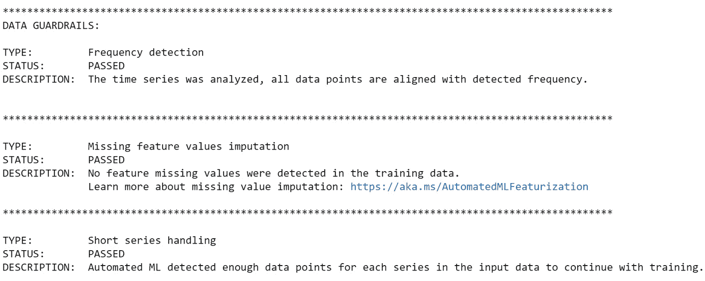
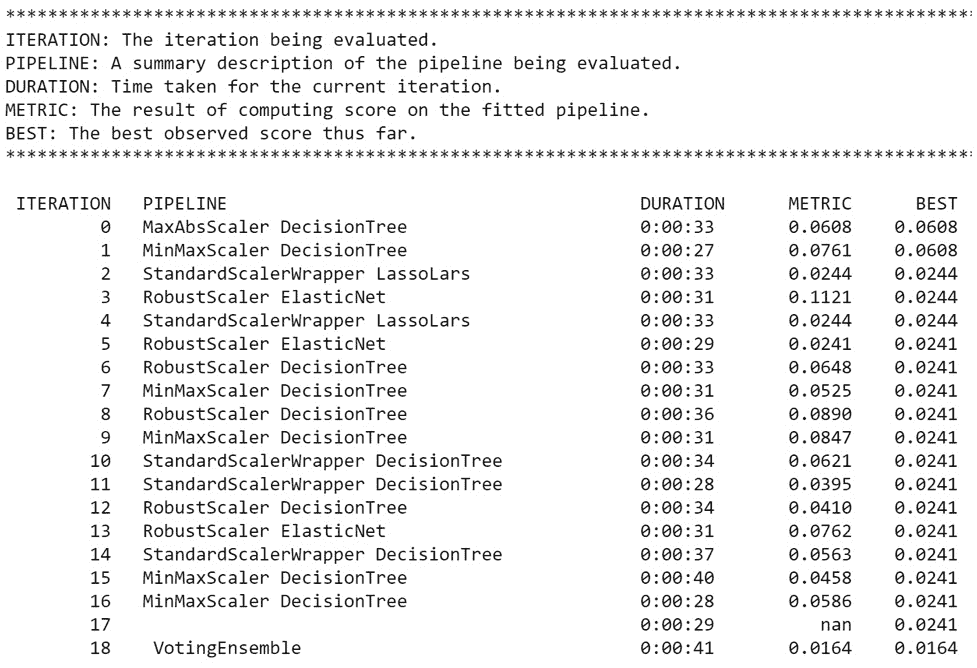
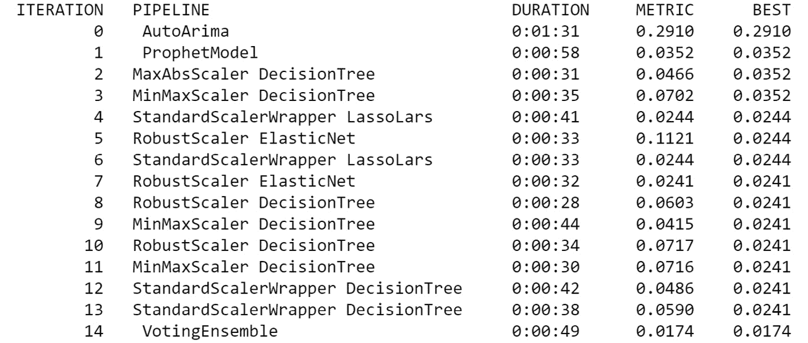
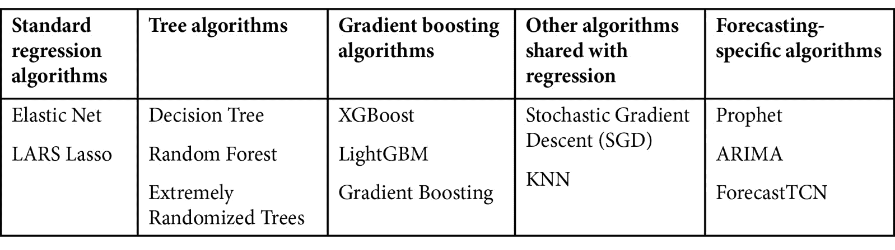

# 第六章: 构建一个 AutoML 预测解决方案

在构建了 AutoML 回归和分类解决方案之后，你现在准备好解决一个更复杂的问题：**预测**。预测本质上比分类或回归复杂得多。那两种**机器学习**（**ML**）问题类型假设时间是不相关的。无论时间过去多久，你的糖尿病模型总是能够准确预测谁的病情会随着时间的推移而恶化。你的泰坦尼克号模型总是能够预测谁会生存谁会死亡。相比之下，在预测问题中，你总是试图根据过去的事件来预测未来的事件；时间总是你模型中的一个因素。

你将像开始*第四章*，*构建一个 AutoML 回归解决方案*和*第五章*，*构建一个 AutoML 分类解决方案*一样开始这一章。首先，你将导航到你的 Jupyter 环境，加载数据，训练一个模型，并评估结果。你将学习两种本质上不同的使用 AutoML 训练预测模型的方法。一种方法仅使用**ARIMA**和**Prophet**算法；另一种方法使用所有其他可用的算法。

在本章结束时，你将学习如何通过调整 AutoML 设置来微调你的预测模型；有许多特定于预测的设置，因此你将花费大量时间来覆盖它们的各种用例。

到本章结束时，你将能够使用 AutoML 训练预测模型而不会出错。与其他技术相比，预测问题更容易出错，所以这是一个相当大的成就。你将了解如何转换和安排你的数据以进行预测，以及如何调整 AutoML 设置以产生更准确、更可靠的模型，巩固你在 Azure AutoML 方面的专业知识。

在本章中，我们将涵盖以下主题：

+   准备 AutoML 预测数据

+   训练一个 AutoML 预测模型

+   注册你的训练好的预测模型

+   微调你的 AutoML 预测模型

# 技术要求

与*第四章*，*构建一个 AutoML 回归解决方案*一样，你将在运行在 Azure 计算实例上的 Jupyter 笔记本中用 Python 代码创建和训练模型。因此，你需要一个有效的互联网连接，一个**Azure 机器学习服务**（**AMLS**）**工作区**和一个计算实例。同样，当你继续在笔记本上工作时，你需要一个可工作的计算集群来远程训练模型。完整的要求列表如下：

+   访问互联网。

+   一个网络浏览器，最好是 Google Chrome 或 Microsoft Edge Chromium。

+   一个 Microsoft Azure 账户。

+   你应该已经创建了一个 AMLS 工作区。

+   你应该已经创建了一个计算实例。

+   你应该在 *第二章*，*Azure Machine Learning 服务入门* 中创建了计算集群。

+   你应该了解如何从 Azure 计算实例导航到 Jupyter 环境，如 *第四章*，*构建 AutoML 回归解决方案* 中所示。

本章的代码在此处可用：[`github.com/PacktPublishing/Automated-Machine-Learning-with-Microsoft-Azure/tree/master/Chapter06`](https://github.com/PacktPublishing/Automated-Machine-Learning-with-Microsoft-Azure/tree/master/Chapter06)。

# 准备 AutoML 预测数据

预测与分类或回归非常不同。回归或分类的机器学习模型基于一些输入数据预测某些输出。另一方面，预测的机器学习模型基于过去发现的模式预测未来状态。这意味着在塑造数据时，你需要注意一些关键的时间相关细节。

对于这个练习，你将使用 `OJ Sales Simulated Data` Azure 开放数据集进行预测。与用于回归的 `Diabetes Sample` Azure 开放数据集类似，`OJ Sales Simulated Data` 只需拥有 Azure 账户即可获取。你将使用这些数据创建一个模型，预测不同品牌和商店未来橙汁的销售情况。

有一个额外的关键区别；`OJ Sales Simulated Data` 是一个 **文件数据集**，而不是 **表格数据集**。虽然表格数据集由一个包含列和行的文件组成，但文件数据集由许多文件组成，可以是表格或其他类型。

就像你在 AMLS 工作区中执行的所有其他编码工作一样，你将首先从计算实例打开 Jupyter，创建一个新的 Jupyter 笔记本。然后，你将加载数据，将其转换为 pandas 数据框，并将其注册为数据集，这样你就可以使用它来训练一个 AutoML 机器学习模型。

## 导航到你的 Jupyter 环境

你将按照以下步骤开始创建一个新的 Jupyter 笔记本：

1.  首先，通过导航到 [`ml.azure.com`](http://ml.azure.com) 打开你的 **Azure Machine Learning** (**AML**) **工作室**。

1.  从左侧面板点击 **Compute**。

1.  选择你的计算实例。如果它没有运行，请点击 **Start**。

    重要提示

    在 Azure 上工作以节省金钱时，当你不使用计算实例时请关闭它。计算实例按小时计费。

1.  点击 **Jupyter** 进入你的 Jupyter 环境。

1.  通过点击屏幕右侧的 **New** 创建一个新的 Jupyter 笔记本，并选择 **Python 3.6 – AzureML**。由于更新，Python 的版本可能不同。

1.  将你的 Jupyter 笔记本重命名为 `OJ Forecasting_AutoML`。如果你需要复习如何这样做，请参阅 *第四章*，*构建 AutoML 回归解决方案*。

在创建好笔记本之后，你现在可以准备加载橙汁销售数据，并用 Python 进行转换。

## 加载数据和转换数据

现在是时候使用你的数据了，按照你在*第四章*，*构建 AutoML 回归解决方案*和*第五章*，*构建 AutoML 分类解决方案*中使用的模式进行操作。本节的目的是从包含许多文件的文件数据集中提取一个子集，将所有文件合并在一起，并创建一个新的表格数据集。执行以下步骤：

1.  使用以下代码加载你需要的所有 Azure 库：

    ```py
    from azureml.core import Workspace, Dataset, Datastore
    from azureml.core import Experiment
    from azureml.core.compute import ComputeTarget
    from azureml.train.automl import AutoMLConfig
    from azureml.train.automl.run import AutoMLRun
    from azureml.widgets import RunDetails
    from azureml.opendatasets import OjSalesSimulated
    from azureml.automl.core.forecasting_parameters import ForecastingParameters
    ```

    你应该能识别出从*第四章*，*构建 AutoML 回归解决方案*中提到的`Workspace`、`Dataset`、`Datastore`、`Experiment`、`ComputeTarget`、`AutoMLConfig`、`AutoMLRun`和`RunDetails`。

    `OjSalesSimulated`允许你通过`ForecastingParameters`直接访问`OJ Sales Simulated Data` Azure Open Dataset，对于 AutoML 预测任务来说，这是必要的，因为你不能简单地将预测特定的参数传递给`AutoMLConfig`对象。你必须首先将它们分配给`ForecastingParameters`，然后将这些参数传递到你的 AutoML 配置中。

    重要提示

    如果你加载任何 Azure 库时遇到问题，请通过运行此处找到的`Update` `AzureML` `SDK.ipynb`笔记本来更新 Azure ML SDK：https://github.com/PacktPublishing/Automated-Machine-Learning-with-Microsoft-Azure/blob/master/Update-AzureML-SDK.ipynb。

1.  使用以下代码加载`pandas`、`numpy`、`os`和`path`：

    ```py
    import pandas as pd
    import numpy as np
    import os
    from pathlib import Path
    ```

    你应该能从*第四章*，*构建 AutoML 回归解决方案*中识别出`pandas`和`numpy`。`os`和`Path`对你来说将是新的。这些包允许你在 Jupyter 笔记本中创建和操作文件和文件夹。此外，当与`OjSimulatedSales`等文件数据集一起工作时，它们是必要的，可以将它们转换为 AutoML 训练的表格数据集。

1.  将你的 Jupyter 笔记本连接到你的 AMLS 工作区：

    ```py
    ws = Workspace.from_config()
    ```

    如果你被提示登录，请按照指示进行操作。

1.  设置你的计算集群：

    ```py
    compute_name = 'compute-cluster'
    compute_target = ComputeTarget(ws, compute_name)
    ```

    你在*第二章*，*Azure 机器学习服务入门*中创建了此计算集群。

1.  设置你的数据存储。对于这个练习，我们将使用与你的 AMLS 工作区一起提供的默认数据存储：

    ```py
    datastore = Datastore.get_default(ws)
    ```

1.  使用此代码从`OJ Sales Simulated Data`中拉取`10`个文件：

    ```py
    oj_sales_files = OjSalesSimulated.get_file_dataset()
    oj_sales = oj_sales_files.take(10)
    ```

    重要技巧

    `OJ Sales Simulated Data` Azure Open Dataset 中有超过 4,000 个文件。拉取所有这些文件可能会导致训练时间延长。

1.  使用以下代码创建一个文件夹，以便将文件下载到你的 Jupyter 环境中：

    ```py
    folder_name = "OJ_Sales"
    os.makedirs(folder_name, exist_ok=True)
    ```

    为了使用文件数据集，你首先需要将它们下载到你的本地 Jupyter 环境中。然后，你可以通过连接文件来将它们作为 pandas dataframe 读取。

1.  使用以下代码将 10 个文件下载到您新创建的`OJ_Sales`文件夹：

    ```py
    oj_sales.download(folder_name, overwrite=True)
    ```

    如果您在 Jupyter 环境中导航到`OJ Sales`文件夹，您应该在运行此代码后看到那里的文件。

1.  使用以下代码将 10 个文件作为一个单独的 pandas 数据框读取：

    ```py
    OJ_file_path = Path('OJ_Sales').rglob('*.csv')
    OJ_files = [x for x in OJ_file_path]
    df = pd.concat((pd.read_csv(f) for f in OJ_files))
    ```

    为了实现这一点，我们需要使用`Path`包来指定文件夹和文件扩展名，以及`pandas`将 10 个文件合并成一个单一的数据框。请注意，此代码将读取您`OJ Sales`文件夹中的所有内容。请不要在此文件夹中放置其他文件，否则将损坏此部分的代码。

1.  查看您数据的前 10 行。确保其看起来正确：

    ```py
    df.head(10)
    ```

    橙汁销售数据有七个列：`WeekStarting`、`Store`、`Brand`、`Quantity`、`Advert`、`Price`和`Revenue`。`Advert`表示该周是否有针对该品牌橙汁的广告活动。其他列是自解释的。数据的前 10 行如下所示：

    

    图 6.1 – 查看您的橙汁销售数据集

1.  将您的 pandas 数据框注册为数据集：

    ```py
    Dataset.Tabular.register_pandas_dataframe(df, datastore,
                                "OJ Sales Sample")
    ```

    虽然将文件数据集注册为表格数据集可能看起来很奇怪，但表格数据集本身更容易处理。文件数据集只是指向包含大量文件的文件夹的指针；在使用它们之前，必须在文件上执行大量数据预处理工作。另一方面，表格数据集是格式化的，并准备好与 AutoML 立即使用。

在这里，重要的是要注意`WeekStarting`的主要区别。时间列需要某种定期的节奏，例如每天、每周、每月或每年。在这种情况下，是每周四。

某些算法，如*Prophet*和*ARIMA*，要求您拥有一个无间隔的时间列。其他 AutoML 算法可以处理间隔，但前提是您在目标列中未启用某些功能，例如时间滞后。 

重要提示

时间列中的间隔也会阻止您使用某些特定于预测的功能，特别是目标列的滞后和这些滞后的移动平均。这些功能通常可以提高性能。仔细研究您的数据，以消除间隔以在预测解决方案中获得最佳性能。

时间序列数据的其他基本元素是您的`Store`和`Brand`是您的粒度列；每个商店和品牌的组合都有单独的时间序列。

如果 AutoML 在单个粒度上检测到多个时间序列，它将自动失败。换句话说，您不能为单个粒度有重复的日期。因此，在使用 AutoML 预测时，仔细研究您的数据，以消除同一粒度上的重复日期。

考虑到这些因素，您现在可以训练一个 AutoML 预测模型。首先，您将训练一个不使用*ARIMA*和*Prophet*的模型。然后，您将使用这两个算法训练一个模型。

# 训练 AutoML 预测模型

训练 AutoML 预测模型与训练 AutoML 回归模型最为相似。与回归不同，而与分类不同，你试图预测一个数字。与回归不同，这个数字总是基于过去发现的模式在未来。此外，与回归不同，你可以预测一系列数字到未来。例如，你可以选择预测未来一个月，或者你可以选择预测 6 个月、12 个月、18 个月甚至 24 个月。

重要提示

你尝试预测的时间越远，你的预测模型就越不准确。

按照你在*第四章*，“构建 AutoML 回归解决方案”和*第五章*，“构建 AutoML 分类解决方案”中看到的相同步骤进行。首先，为你的实验设置一个名称。然后，设置你的目标列和 AutoML 配置。

对于预测，还有一个额外的步骤：设置你的**预测参数**。这是你设置时间列、粒度列和滞后设置的地方。然后，这些设置需要作为单个预测参数对象传递到你的 AutoML 配置中。一旦完成这一步，你才能使用 AutoML 来训练一个预测模型。

在本节中，你将重复这个过程两次，首先是通过使用 AutoML 中可用的标准预测算法正常训练一个模型，其次，你将使用略微不同的设置来启用 ARIMA 和 Prophet，并比较两个 AutoML 模型的性能。

## 使用标准算法训练预测模型

要使用 AutoML 训练你的预测模型，请按照以下步骤操作，继续在`OJ 预测 AutoML` Jupyter 笔记本中：

1.  使用以下代码设置你的实验并给它命名：

    ```py
    experiment_name = 'OJ-Sales-Forecasting'
    exp = Experiment(workspace=ws, name=experiment_name)
    ```

    有一个重要的事情要记住，一个实验可以是一组多个训练运行，而不仅仅是一个单独的训练运行。换句话说，我们可以在同一个实验名称下使用不同的设置来训练多个模型。

1.  使用以下代码检索你的`OJ 销售样本`数据集：

    ```py
    dataset_name = "OJ Sales Sample"
    dataset = Dataset.get_by_name(ws, dataset_name, version='latest')
    ```

1.  将你的目标列设置为`数量`：

    ```py
    target_column = 'Quantity'
    ```

    在 Python 中，大小写很重要；请记住这一点。

1.  为你的 AutoML 任务创建一个变量。`task`是你试图训练的 AutoML 模型类型。要预测未来的数字，输入`forecasting`：

    ```py
    task = 'forecasting'
    ```

    重要说明

    将预测问题作为回归问题来训练总是不正确的。尽管它们在名义上都做同样的事情，即预测一个数字，但预测需要更加谨慎的方法，以避免在训练模型时包含未来的值。用于回归的标准交叉验证方法不适用于预测问题，因此请确保将`task`设置为`forecasting`。

1.  为你的主要指标创建一个变量。**主要指标**是评估你的模型的方式。使用 **标准化均方根误差**（**normalized RMSE**）。此指标将预测值从每个观察的实际值中减去，然后平方，并平均所有观察值的分数。分数越低，你的模型越好。预测的其他选项包括 **R2 分数**、**Spearman 相关系数**和 **标准化平均绝对误差**（**normalized MAE**）。请注意，这些与回归指标相同：

    ```py
    primary_metric = 'normalized_root_mean_squared_error'
    ```

1.  为 `featurization` 创建一个变量。你可以将 `featurization` 设置为 `auto` 或 `off`。设置为 `auto`：

    ```py
    featurization = 'auto'
    ```

    如果你将 `featurization` 设置为 `off`，你将不得不删除高基数特征，填充空值，对数据进行独热编码，并自己生成额外的特征。当将 `featurization` 设置为 `auto` 时，AutoML 会自动为你处理这些。

1.  在预测中，特征化也会从你的时间列创建各种日期/时间特征，包括年份、月份、星期、星期几、上午/下午和一天中的小时。除非你是能够自己完成所有工作的专家数据科学家，否则始终将 `featurization` 设置为 `auto`。

    设置你的预测参数。这些参数有很多，我们将逐一介绍如下：

    a) `country_or_region_for_holidays` 决定了使用哪个国家来生成表示不同国家假日的列。你可以将此参数设置为无、单个国家或国家列表。设置为 `US` 以表示美国。你将为每个假日得到一个单独的列。

    b) `drop_columns_names` 允许你在训练预测模型之前输入要删除的列的列表。在这里删除 `Revenue` 列，因为它部分来自你的目标列 `Quantity`。

    ```py
    params=\
    ForecastingParameters.from_parameters_dict( 
    {'country_or_region_for_holidays':'US',\
                    'drop_columns_names':'Revenue',\
                    'forecast_horizon': 6,\
                    'target_rolling_window_size': 'auto',\
                    'target_lags': 'auto',\
                    'feature_lags': 'auto',\
                    'seasonality': 'auto',\
                    'short_series_handling': True,\
                    'use_stl': 'season_trend',\
                    'time_column_name':'WeekStarting',\
                    'time_series_id_column_names':\
                    ['Store','Brand'],\
                   'short_series_handling_configuration':\
                    'auto'},\
                    validate_params=True)
    ```

    重要注意事项

    有相当多的特定于预测的参数。花时间通过阅读以下位置的 *Azure AutoML ForecastingParameters* 文档来深入了解这些设置：[`docs.microsoft.com/en-us/python/api/azureml-automl-core/azureml.automl.core.forecasting_parameters.forecastingparameters?view=azure-ml-py`](https://docs.microsoft.com/en-us/python/api/azureml-automl-core/azureml.automl.core.forecasting_parameters.forecastingparameters?view=azure-ml-py)。

1.  配置你的 AutoML 运行。在这里，你需要传入你的任务、主要指标、特征化设置、计算目标、数据集、目标列和预测参数。所有这些你之前都已经创建好了。你还需要传入实验将运行多长时间，如果模型性能没有提高，是否将提前停止，交叉验证的次数，以及模型可解释性设置。

    此外，你将决定是否使用`3`个拆分；与分类或回归不同，当将交叉验证设置为较低数值时，预测运行更准确。这是由于 AutoML 将数据拆分为不同集合以评分性能的本质：

    ```py
    config = AutoMLConfig(task=task,
                         primary_metric=primary_metric,
                         featurization=featurization,
                         compute_target=compute_target,
                         training_data=dataset,
                         label_column_name=target_column,
                         experiment_timeout_minutes=15,
                         enable_early_stopping=True,
                         n_cross_validations=3,
                         model_explainability=True,
                         enable_stack_ensemble=False,
                         enable_voting_ensemble=True,
                         forecasting_parameters=params)
    ```

    重要提示

    `False`。这与回归或分类不同。

1.  训练你的模型并实时查看结果：

    ```py
    AutoML_run = exp.submit(config, show_output = True)
    RunDetails(AutoML_run).show()
    ```

如前所述，启动你的 AutoML 运行，为自己泡杯咖啡，然后回来实时观看模型训练。你会看到一个**数据边界**检查，如图*图 6.2*所示。注意它如何用于预测：



图 6.2 – 预测的数据边界检查

首先，数据边界将检查你的时间列，以确保所有数据点都与正确的频率对齐。对于你的`OJ 销售样本`数据，这意味着确保每个数据点都落在星期四，并且每周间隔 1 周。

然后，数据边界将以与分类和回归相同的方式进行缺失值插补。在这里，任何列中都没有缺失值。最后，它将寻找训练设置中时间序列太短的情况。如果 AutoML 检测到短序列，它将创建更简单的模型来处理这些情况。

完成数据边界检查后，AutoML 将开始使用不同的特征转换、算法和超参数组合来训练模型。如果没有除了时间列、粒度列和目标列之外的其他特征，它将除了其标准的预测模型套件外，还会训练 ARIMA 和 Prophet 模型。你的输出应该类似于*图 6.3*：



图 6.3 – 预测的 AutoML 结果

## 使用 Prophet 和 ARIMA 训练预测模型

预测与其他两种 AutoML 问题类型的一个重要区别是 Prophet 和 ARIMA 算法。Prophet 和 ARIMA 与所有其他算法本质上不同，因为为了训练它们，你只需要粒度列、目标列和时间列。仅此而已。添加任何其他列都将限制 AutoML 使用这些算法。

Prophet 与 ARIMA 的不同之处在于，它们只使用目标列中找到的模式进行预测。其他变量被忽略。有时，它们会优于其他算法；有时则不会。不尝试很难知道。

由于很难知道 ARIMA 和 Prophet 相对于其他算法的表现如何，建议如果你有时间，总是尝试训练它们。也就是说，如果你的时间序列数据在时间列中没有缺失，总是首先训练 ARIMA 和 Prophet 模型作为你的基线。它们需要更长的时间来训练，所以建议你增加你的实验超时时间，特别是对于更大的数据集。

使用 ARIMA 和 Prophet 构建 AutoML 预测解决方案的步骤如下：

1.  从上一节复制*步骤 1-6*，直到你到达预测参数。

1.  在预测参数中，移除所有的特征列，只留下你的时间、粒度和目标列。此外，通过将它们设置为`None`来关闭所有 AutoML 生成的特征，如节假日、特征滞后和目标滞后，如下面的代码块所示：

    ```py
    params=\
    ForecastingParameters.from_parameters_dict(\
    {'country_or_region_for_holidays':None,\
                      'drop_columns_names':\
                      ['Revenue','Price','Advert'],\
                      'forecast_horizon': 6,\
                      'target_rolling_window_size': None,\
                      'target_lags': None,\
                      'feature_lags': None,\
                      'seasonality': 'auto',\
                      'short_series_handling': True,\
                      'use_stl': 'season_trend',\
                      'time_column_name':'WeekStarting',\
                      'time_series_id_column_names':\
                      ['Store','Brand'],
                   'short_series_handling_configuration':\
                      'auto'},\
                      validate_params=True)
    ```

    特征滞后和目标滞后通过创建额外的变量来工作。这就是为什么为了使 AutoML 能够运行 Prophet 和 ARIMA，它们需要从你的数据中移除。

1.  按照你在*步骤 8*中做的那样配置你的 AutoML 运行，传递你的更新后的预测参数。

1.  训练你的模型并实时查看结果：

    ```py
    Prophet_ARIMA_run = exp.submit(config, show_output = True)
    RunDetails(Prophet_ARIMA_run).show()
    ```

重新运行 AutoML 后，你的结果应该类似于**图 6.4**。注意，对于这个问题，ARIMA 和 Prophet 没有返回更好的结果，并且投票集成通常优于所有模型：



**图 6.4 – 使用 ARIMA 和 Prophet 的 AutoML 预测结果**

你现在已经使用`OJ Sales Sample`数据训练了两套模型，并实现了相当低的标准化 RMSE。你现在可以进入下一节注册你的模型。注册的模型对于以后在 ML 管道或实时端点中评分新数据是必要的。

# 注册你的训练好的预测模型

注册预测模型的代码与你在*第四章*中使用的代码相同，*构建一个 AutoML 回归解决方案*，以注册你的回归模型，以及在*第五章*中使用的代码，*构建一个 AutoML 分类解决方案*，以注册你的分类模型。始终注册新模型，因为根据你的业务场景，你将在实时评分端点或批量执行推理管道中使用它们。同样，始终添加标签和描述以方便跟踪：

1.  首先，给你的模型起一个名字，一个描述，以及一些标签。**标签**让你可以轻松地搜索模型，所以在实现时要仔细思考：

    ```py
    description = 'Best AutoML Forecasting Run using OJ Sales Sample Data.' 
    tags = {'project' : "OJ Sales", "creator" : "your name"} 
    model_name = 'OJ-Sales-Sample-Forecasting-AutoML' 
    ```

1.  接下来，将你的模型注册到你的 AMLS 工作区，传递你的模型名称、标签和描述。使用你在*训练一个 AutoML 预测模型*部分中训练的`AutoML_run`模型：

    ```py
    AutoML_run.register_model(model_name=model_name, description=description, tags=tags)
    ```

1.  尝试根据 R2 分数注册不同的模型。给它一个稍微不同的名字，添加一个额外的标签，并使用相同的描述：

    ```py
    description = 'Best AutoML Forecasting Run using OJ Sales Sample Data.'
    tags = {'project' : "OJ Sales", "creator" : "your name", "metric" : "R2 Score"} 
    model_name = 'OJ-Sales-Sample-Forecasting-AutoML-R2'
    AutoML_run.register_model(model_name=model_name, description=description, tags=tags, metric = 'r2_score')
    ```

在某些情况下，您将执行 AutoML 训练运行，但您会忘记注册模型。不要担心。您可以使用实验名称和运行 ID 检索 AutoML 训练运行，并从那里注册模型。请使用以下代码：

```py
experiment_name = 'OJ-Sales-Forecasting'
exp = Experiment(workspace=ws, name=experiment_name) 
AutoML_run = AutoMLRun(experiment = exp, run_id = 'your_run_id') 
description = 'Retrieved AutoML Forecasting Run for OJ Sales Data.'
tags = {'project' : "OJ Sales", "creator" : "your name"} 
model_name = 'OJ-Sales-Sample-Forecasting-AutoML-Retrieved'
AutoML_run.register_model(model_name=model_name, description=description, tags=tags)
```

您现在已注册了预测模型，并且它已准备好使用。您可以使用它来预测未来 6 周内各种商店和品牌的橙汁需求。您还可以以多种方式对其进行修改，例如预测 3 周、12 周或仅仅是下周的销售情况。

预测是一门艺术，比分类或回归更为复杂，这使得下一节的内容尤为重要：微调 AutoML 预测模型的小技巧和窍门。

# 微调您的 AutoML 预测模型

在本节中，您将首先回顾提升您的 AutoML 预测模型的小技巧和窍门，然后回顾 AutoML 用于预测的算法。

## 提升 AutoML 预测模型

预测很容易出错。一个模型可能在开发阶段看起来似乎有效，但一旦部署到生产环境中，就无法做出准确的预测。许多数据科学家，即使是经验丰富的，也会犯错误。虽然 AutoML 可以帮助您避免一些常见的错误，但还有一些错误需要您谨慎行事。为了避开这些陷阱并制作出尽可能好的模型，请遵循以下小技巧和窍门：

+   您用任何特征列进行训练时，都必须在您进行预测时可用。对于`OJ Sales Sample`，这意味着如果您想预测 6 周后的销售数量并将价格作为输入变量，您需要知道每个产品 6 周后的价格。

    请与您的商业伙伴和 IT 人员确认，以了解您将有哪些数据可用于进行预测。如果您无法在尝试预测的时间框架内知道特征列的值，请从您的训练数据集中删除该列。

+   标准交叉验证技术不适用于预测。如果您试图进行未来状态预测，AutoML 使用`task`设置为`forecasting`。将其设置为回归可能会给您一些结果，但由于它们忽略了时间成分，因此这些结果将没有意义。

+   熟悉所有不同的 AutoML 预测配置选项。您可以在以下链接中找到它们：[`docs.microsoft.com/en-us/python/api/azureml-train-automl-client/azureml.train.automl.automlconfig.automlconfig?view=azure-ml-py`](https://docs.microsoft.com/en-us/python/api/azureml-train-automl-client/azureml.train.automl.automlconfig.automlconfig?view=azure-ml-py)。

+   总是首先尝试仅使用 ARIMA 和 Prophet 构建预测模型。这两个模型提供了一个良好的基线，因为它们只使用您的时间列和目标列来构建机器学习模型。如果使用额外特征的模型没有优于 ARIMA 和 Prophet，那么您知道这些额外特征与您的业务问题不相关。从您的数据集中删除这些特征。

+   在决定预测范围时，请仔细思考。通常，预测算法在预测短期范围时表现更好，无论是下一个或两个时间段。当预测更长的范围时，您应该预期准确性会随着预测范围的扩大而降低。了解这一点后，当您的业务伙伴要求您预测很多时间段时，请向他们提出反对意见。

    一般而言，人们总是想知道未来，而且您能预测得越远，他们就越高兴。请解释他们应该比长期预测更信任短期预测。

+   当现状与过去相似时，预测未来效果最佳。冲击事件通常会破坏甚至表现良好的预测模型。当这种情况发生时，尝试仅使用最近的数据点来训练模型。这是一个迭代过程，因为通常很难判断哪些训练点仍然相关。

    在某些情况下，最好的做法是仅使用冲击事件开始的数据来训练模型。例如，许多商店在冠状病毒大流行期间与疫情前的条件相比，经历了截然不同的产品需求。

+   当冲击事件过去，事情恢复正常时，尝试使用 AutoML 中的加权列特征来训练预测模型。将冲击事件期间的时间段设置为`0`。

    记住，不应在时间列存在空缺的情况下训练 AutoML 预测模型。然而，在冲击事件期间发生的数据点与正常情况不相关。通过使用加权列并将权重设置为`0`和`1`，您可以训练一个有效地忽略冲击事件而不违反无空缺规则的预测模型。

+   同样，使用权重列来更重视近期数据而不是更远期的数据。对于许多问题，近期数据比过去数据更相关。采访您的业务伙伴，找到您的行业发生变革的关键日期。

+   此外，只有当过去的情况与现在的情况相似时，更多的数据才能帮助预测模型。当您仅使用最近的相关数据来训练模型时，预测模型通常会产生更好的结果。不要害怕丢弃那些对预测当前情况帮助太小的过去数据点。

    再次强调，通过采访业务伙伴来找到您的行业经历重大变革的关键日期。丢弃在重大变革之前发生的数据通常会生成更优的模型。

+   预测非常挑剔，比回归或分类问题更挑剔。这是因为公司喜欢预测的事物类型是由市场需求和人们的需求驱动的，而人们的需求往往会发生变化。市场上流行的东西可能会在几乎没有预警的情况下迅速变化，因此，预测模型需要不断地重新训练，每次获取最新数据时都要这样做。

+   当你使用 AutoML 训练的预测模型进行预测时，它总是从预测下一个时间段的值开始。正因为如此，当你评分数据时，你的数据必须从下一个时间段开始。例如，如果你在一个以 1 月 5 日结束的数据上训练了一个日预测模型，你的评分数据必须从 1 月 6 日开始。

+   如果你的时间列以 2 月结束，并且你正在预测两个时间段的值，AutoML 将预测 3 月和 4 月。你不能使用该模型来预测 5 月或 6 月。为了做到这一点，你必须使用结束日期更晚的训练数据重新训练模型。因此，你需要不断地重新训练 AutoML 预测模型，以确保你的预测是最新的。

+   为了确定季节性，在使用 AutoML 之前，将目标列绘制出来，寻找任何重复的季节性模式。这将让你知道是否应该使用季节性特征。

+   当你试图在全球范围内进行预测时，确保在生成假日特征时包含所有国家。假日通常在预测需求和市场需求趋势时非常重要。想想圣诞节如何影响美国的销售，或者中国新年如何影响中国的旅行模式。

这就结束了技巧和窍门的列表。这绝对不是完整的；你只需将其视为一个起点。预测是一个丰富且有趣的领域，有很多注意事项。然而，考虑到这些事项将使你能够产生准确、可靠的预测，并避免许多新手数据科学家犯的错误。

无论如何，请记住预测本身就是一门艺术，与其他类型的机器学习问题不同，要以这种方式来对待它。最后，你将了解 AutoML 用于预测的算法。

## 理解 AutoML 预测算法

AutoML 预测算法几乎与 AutoML 回归算法相同。预测使用与回归相同的所有**树**、**标准回归**、**梯度提升**和**最近邻**算法，并且也使用**随机梯度下降**。有关参考，请参阅*第四章*，*构建 AutoML 回归解决方案*。

除了这些算法之外，还有三个特定的预测算法：Auto-ARIMA、Prophet 和 ForecastTCN。你已经在本章前面学习了某些关键差异，这些差异使 ARIMA 和 Prophet 与其他算法不同。ForecastTCN 是一种**时间卷积网络**，一种神经网络类型。

**Auto-ARIMA**（**自回归积分移动平均**）使用目标列的移动平均进行预测。与标准 ARIMA 不同，Auto-ARIMA 优化 ARIMA 参数以创建最佳模型。它在只有关于目标列的可靠信息的单变量时间序列中表现极好。

**Prophet**与 Auto-ARIMA 类似，它专门用于单变量时间序列。此外，当你的数据具有强烈的季节性模式时，它表现得非常好。与许多预测算法不同，Prophet 对异常值和你的数据集中的剧烈波动具有鲁棒性。与 Auto-ARIMA 一样，你应该在预测项目的开始阶段始终使用 Prophet 来建立基线模型。

在你的 AutoML 预测参数中将`enable_dnn`设置为`True`。这个算法非常适合最复杂的预测任务，因为它可以捕捉到数据中的极其复杂的非线性趋势。深度学习是一个复杂的话题，即使在一个章节中也很难解释清楚，因此它超出了本书的范围。ForecastTCN，像其他深度学习模型一样，在训练时使用大量数据时表现最佳。

在*图 6.5*中提供了这 13 种算法的摘要：



图 6.5 – AutoML 预测算法

与回归一样，AutoML 在每个 AutoML 训练运行结束时执行**模型集成**。**投票集成**会对你的预测模型进行加权平均，并使用该结果进行预测。相比之下，**堆叠集成**使用其他模型的输出训练弹性网络模型。在使用堆叠集成进行预测时存在过拟合的风险；因此，建议将其关闭。

有关这些模型的更多信息，请参阅位于[`docs.microsoft.com/en-us/azure/machine-learning/how-to-configure-auto-train#configure-your-experiment-settings`](https://docs.microsoft.com/en-us/azure/machine-learning/how-to-configure-auto-train#configure-your-experiment-settings)的 AutoML 文档。

# 摘要

现在，你已经成功训练了所有三种类型的 AutoML 模型 – 分类、回归和预测。你不仅可以训练一个简单的预测模型，而且你还知道如何使用各种预测参数改进模型，以及如何使用 ARIMA 和 Prophet 构建高性能的基线模型。

此外，你已经获得了大量关于预测与其他问题有何不同以及如何避免常见陷阱的知识。通过明智地利用预测范围功能，你可以预测未来几天、几个月或几年，现在是时候向你的工具箱中添加一个强大的工具了。

在*第七章*《使用多模型解决方案加速器》中，您将能够为每个时间序列粒度构建单独的模型。您不必构建一个预测模型，而是一次性构建数千个模型，并像对待一个模型一样对它们进行评分。您会发现这种方法可以极大地提高模型的表现，而这只有云原生技术才能实现。
