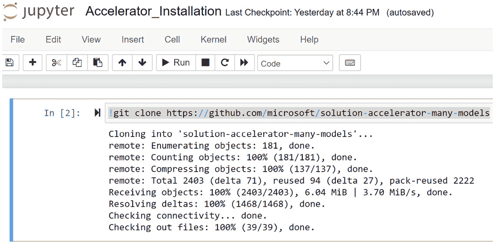
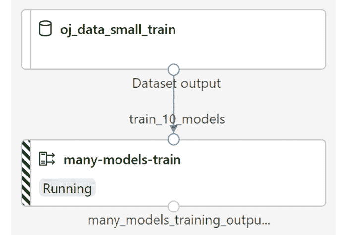
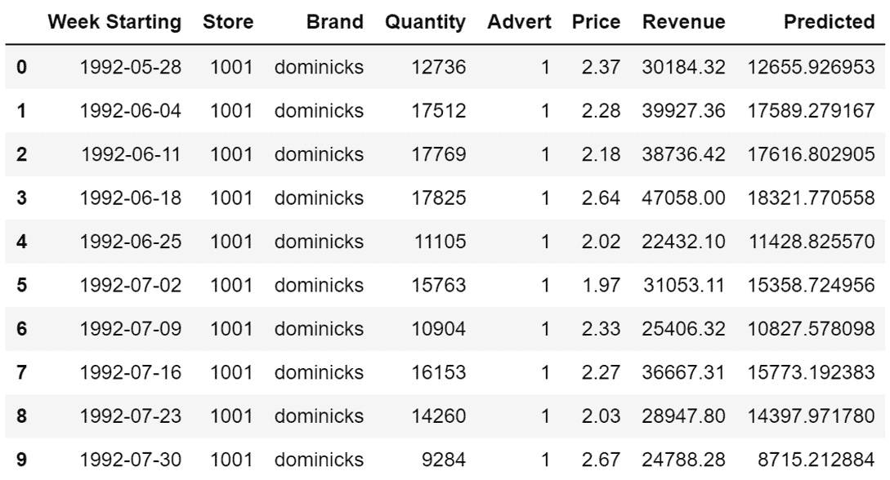
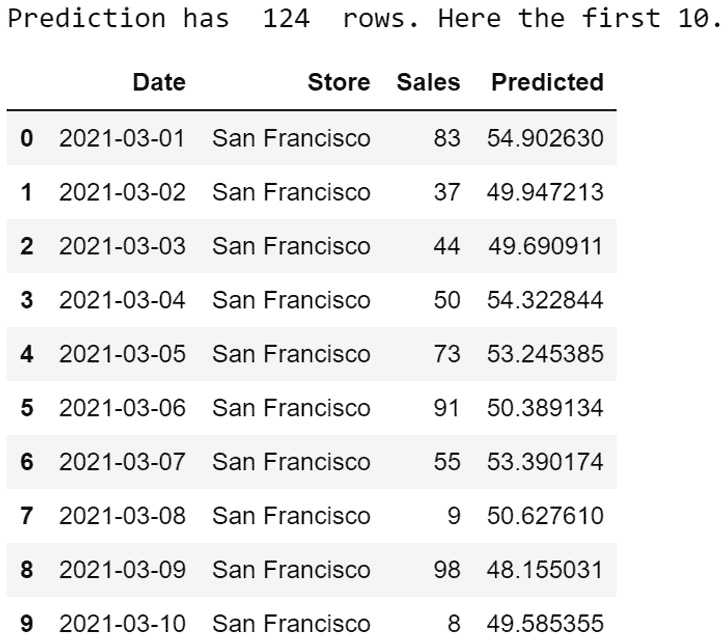

# 第七章：使用多个模型解决方案加速器

现在你已经体验了使用 AutoML 构建回归、分类和预测模型，现在是时候学习如何在实际业务场景中部署和利用这些模型了。然而，在着手之前，我们首先将向你介绍一个全新的、非常强大的解决方案，那就是**多个模型解决方案加速器**（**MMSA**）。

MMSA 让你能够一次性构建数百到数千个**机器学习**（**ML**）模型，并且可以轻松扩展到数十万个模型。它是机器学习前沿的先进技术。你不仅可以构建数十万个模型，还可以使用 MMSA 轻松地将它们部署到生产环境中。

在本章中，你将首先安装加速器，并了解它适用的各种用例。然后，你将逐个笔记本地运行加速器的三个部分：准备数据、训练模型和预测新数据。

在每个部分中，你将使用加速器内找到的样本数据以及你用 Python 代码生成的样本数据。这将为你提供使用 MMSA 与文件和表格数据集的示例。最后，你将了解如何使用加速器来最大化性能的技巧和窍门，你还将被介绍到**分层预测**等概念。

到本章结束时，你将掌握使用 AutoML 的 MMSA。你将能够将你的数据带入 MMSA，使其处于正确的形状，并训练数千个模型。这个解决方案非常适合你希望在大量产品或商店上训练类似模型的情况，例如，为每种产品和商店的组合构建一个单独的预测模型。全美的大型公司都在使用它，到本章结束时，你也将能够使用它。

在本章中，我们将涵盖以下主题：

+   安装多个模型解决方案加速器

+   为多个模型准备数据

+   同时训练多个模型

+   为多个模型评分新数据

+   提高你的多个模型结果

# 技术要求

在本章中，你将登录到你的**Azure 机器学习工作室**（**AMLS**），在一个计算实例上打开一个 Jupyter 笔记本，并从 GitHub 上的位置安装 MMSA。然后，你将依次运行 MMSA 的三个部分，准备数据、远程训练模型和预测数据。因此，你需要一个 Azure 账户、一个用于编写 Python 代码的计算实例和一个用于远程训练的计算集群。完整的要求列表如下：

+   上网权限。

+   一个网络浏览器，最好是 Google Chrome 或 Microsoft Edge Chromium。

+   一个微软 Azure 账户。

+   你应该已经创建了一个 AMLS 工作区。

+   你应该在*第二章*“Azure 机器学习服务入门”中创建了一个计算实例。

+   您应该在*第二章*“Azure 机器学习服务入门”中创建了计算集群。

+   您应该了解如何从 AMLS 计算实例导航到 Jupyter 环境，如*第四章*“构建 AutoML 回归解决方案”中所示。

本章的代码在此处可用：[`github.com/PacktPublishing/Automated-Machine-Learning-with-Microsoft-Azure/tree/master/Chapter07`](https://github.com/PacktPublishing/Automated-Machine-Learning-with-Microsoft-Azure/tree/master/Chapter07)。

# 安装许多模型解决方案加速器

MMSA 是由微软在 2019 年构建的，旨在满足越来越多的客户需求，他们希望同时训练数十万个类似的机器学习模型。这对于产品需求预测尤为重要，因为您试图在许多不同地点对许多不同的产品进行预测。

加速器的动力是**模型精度**。虽然您可以训练一个模型来预测所有产品线以及所有商店的产品需求，但您会发现为每个产品和商店的组合训练单独的模型往往会产生更好的性能。这是因为许多因素都取决于您的算法和数据。当您处理分布在全球各地的数十万个不同产品时，某些算法可能很难找到有意义的模式。

此外，相同的列可能与您试图预测的目标列有不同的甚至相反的关系。想象一下天气和产品销售。当外面下雪时，某些产品，如冬季帽子、手套或靴子，很可能会出现销售激增。而其他产品，如冰淇淋，很可能会出现销售下降。虽然一些算法可以处理产品线之间的这些相反关系，但许多算法不能，并且使用 MMSA 为每个产品构建单独的模型通常会产生更好的指标。

除了预测 MMSA 的产品需求之外，其他常见用例还包括在工厂车间数千台设备和机器上的预测性维护、数百个商店的人力资源优化模型、美国各州的文本分析用例和法律文件搜索模型，以及许多其他类似场景。尽管如此，预测仍然是最常见的用例。连锁店尤其发现 MMSA 很有吸引力。

从技术角度讲，决定是否使用 MMSA 的关键因素是您的数据中是否存在一个或多个列，您可以使用这些列将数据分割成多个文件。例如，商店、产品和地区等列是分割的理想目标。如果您的数据中不存在这样的列，就没有必要使用 MMSA。

同样，如果你预期你的数据中的模式在产品、分组和地区等列中相对稳定，你应该像处理任何其他问题一样，使用 AutoML 训练一个单独的 ML 模型。

在本节中，你将在你的 Jupyter 环境中安装 MMSA。首先，你将创建一个仅用于安装的新 Jupyter 笔记本。然后，你将在你的 Jupyter 环境中安装 MMSA。这将创建一系列文件和文件夹。最后，你将能够确认 MMSA 已成功安装，并识别你将在本章剩余部分使用的笔记本。

## 在你的 Jupyter 环境中创建一个新的笔记本

执行以下步骤在你的计算实例上创建一个新的 Jupyter 笔记本：

1.  首先，通过导航到 [`ml.azure.com`](http://ml.azure.com) 打开你的 AML 工作室实例。

1.  点击 **Compute**，启动一个计算实例，并打开一个 Jupyter 环境。

1.  创建一个新的 Jupyter 笔记本，并将其命名为 `Accelerator_Installation`。如果你需要复习，请查看 *第四章*，*构建 AutoML 回归解决方案*。

在创建好笔记本后，你现在可以安装来自 GitHub 的加速器。

## 从 GitHub 安装 MMSA

MMSA 是由微软开发的一个公开可用的解决方案，托管在 GitHub 仓库上。使用以下代码在你的 Jupyter 环境中安装 MMSA：

1.  使用以下代码将 MMSA 仓库克隆到你的 Jupyter 笔记本文件系统中：

    ```py
    !git clone https://github.com/microsoft/solution-accelerator-many-models
    ```

1.  所有文件现在都已加载到一个名为 `solution-accelerator-many-models` 的新文件夹中。点击屏幕顶部的 Jupyter 图标以导航到你的文件目录，如图 *图 7.1* 所示：

    图 7.1 – 导航到你的文件目录

1.  通过点击打开 `solution-accelerator-many-models` 文件夹。

1.  打开文件夹后，你会看到许多文件和文件夹。在 *为多个模型准备数据* 部分你将使用的第一个文件是 `01_Data_Preparation.ipynb`。如果你希望为 MMSA 设置一个新的计算集群，你应该首先运行 `00_Setup_AML_Workspace.ipynb`。注意这些信息。

1.  接下来，打开 `Automated_ML` 文件夹。这个文件夹包含两个子文件夹，分别称为 `02_AutoML_Training_Pipeline` 和 `03_AutoML_Forecasting_Pipeline`。

1.  打开每个 AutoML 管道。每个管道都包含一个与文件夹同名的 Jupyter 笔记本。注意这些信息。

在本章的剩余部分，你将只与这三个 Jupyter 笔记本交互，即`01_Data_Preparation.ipynb`、`02_AutoML_Training_Pipeline`和`03_AutoML_Forecasting_Pipeline`。在每种情况下，首先以默认样本数据集的方式运行笔记本。然后，你将创建另一个笔记本并使用类似的代码训练不同的数据集。这将教会你如何使用 MMSA 处理文件和表格数据集，以及如何处理你自己的数据。你将从准备数据开始。

# 为许多模型准备数据

虽然同时训练成千上万的机器学习模型听起来很复杂，但 MMSA（多模型学习算法）使其变得简单。笔记本中包含的示例使用了你在*第六章*“构建 AutoML 预测解决方案”中使用的`OJ Sales`数据。你只需打开并运行`01_Data_Preparation.ipynb`即可准备数据。通过仔细阅读说明并逐步在笔记本中缓慢工作，你将能够理解每个部分的内容。

一旦你能够理解每个部分的作用并且已经加载了`OJ Sales`数据，你将能够将新的数据集加载到你的 Jupyter 笔记本中。这样，在本节结束时，你将能够将你的数据加载到 Azure 中，为 MMSA 修改它，并掌握使用这个强大解决方案的能力。

## 准备样本 OJ 数据集

要了解第一个笔记本是如何工作的，请按照以下顺序遵循这些说明：

1.  打开`01_Data_Preparation.ipynb`。

1.  运行笔记本中`1.0`部分的全部单元格。这些单元格在你的文件目录中创建一个名为`oj_sales_data`的文件夹，并将`OJ Sales`数据下载到那里。运行`1.0`部分后，检查你新文件夹中的文件；`oj_sales_data`将位于`01_Data_Preparation.ipynb`相同的目录级别。

1.  运行笔记本中`2.0`部分的单个单元格。这个单元格根据日期将数据分割成训练数据和推理数据。它在`oj_sales_data`文件夹中创建两个文件夹，一个名为`upload_train_data`，另一个名为`upload_inference_data`。运行单元格后，查看每个文件夹的内容。你应该会看到名为`Store1000_dominicks.csv`等文件的文件。点击其中一个文件，查看数据的样子。

1.  运行笔记本中`3.0`部分的全部单元格。这些单元格将你的计算实例上的文件目录中的数据复制到你的数据存储的文件目录中。这将复制文件结构，你最终会在你的数据存储上得到`oj_sales_data`文件夹以及`upload_train_data`和`upload_inference_data`子文件夹。如果你愿意，打开你的 Azure 存储账户并尝试定位这些文件夹。记住，它们将位于以`azureml-blobstore`开头的容器中。

1.  运行笔记本中`4.0`节的单个单元格。此单元格创建两个文件数据集，一个名为`oj_data_small_train`，另一个名为`oj_data_small_inference`。这些是您将在`02_AutoML_Training_Pipeline`和`03_AutoML_Forecasting_Pipeline`中使用的数据集。

1.  运行笔记本中`5.0`节的所有单元格以查看您的数据。

    重要提示

    如果您直接运行笔记本，您将使用 10 个文件训练少量模型。您可以将`dataset_maxfiles`设置为`11793`，在笔记本的`1.0`节中训练更多的模型。在这种情况下，您的数据集将被称为`oj_data_inference`和`oj_data_train`。

您现在已准备好`OJ Sales`数据以供加速器使用。为了将您自己的数据带入加速器，您需要遵循一些重要的注意事项。最重要的是，`OJ Sales`数据是预先按商店和橙汁品牌分割的。您需要使用自己的数据在一个新的 Jupyter 笔记本中模仿这种结构。

## 准备 pandas 数据框

将自己的数据带入 MMSA 的过程并不明确。毕竟，`OJ Sales`是一个由 11,793 个文件组成的文件数据集。您更有可能使用单个文件或来自数据库中单个表的数据。此外，您最有可能通过 pandas（最常用的 Python 包）来读取它。要学习如何使用 pandas 数据框与 MMSA 一起使用，请执行以下步骤：

1.  从*Automated-Machine-Learning-on-Microsoft-Azure* GitHub 仓库下载`ManyModelsSampleData.csv`文件。

1.  导航到您的 Jupyter 环境。

1.  打开`solution-accelerator-many-models`文件夹。

1.  将`ManyModelsSampleData.csv`文件拖到您的 Jupyter 环境中。

1.  创建一个新的 Jupyter 笔记本并打开它。将其重命名为`01_Data_PreparationMy-Data.ipynb`。

1.  要加载所有库，您需要以下代码：

    ```py
    import pandas as pd
    import numpy as np
    import os
    import datetime as dt
    from azureml.core import Workspace, Dataset, Datastore
    from scripts.helper import split_data
    ```

    您应该能从*第四章*，*构建 AutoML 回归解决方案*中识别出`pandas`、`numpy`、`Workspace`、`Dataset`和`Datastore`。您也在*第六章*，*构建 AutoML 预测解决方案*中使用了`os`。

    新增的`split_data`函数是一个`datetime`，它允许您将字符串对象转换为正确的 Python 日期时间对象。这是必需的，因为`split_data`需要日期时间对象才能正常工作。

1.  使用以下代码将`ManyModelsSampleData.csv`文件读入 pandas 数据框：

    ```py
    ManyModelsSample =\
    pd.read_csv('ManyModelsSampleData.csv', header = 0)
    ```

    将标题设置为`0`将使用 CSV 文件的第一行作为列名。

1.  使用以下代码创建一个名为`MMSA_Sample_Folder`的文件夹：

    ```py
    target_path = 'MMSA_Sample_Folder' 
    os.makedirs(target_path, exist_ok=True)
    ```

1.  查看您的数据集：

    ```py
    ManyModelsSample
    ```

    您会发现这个数据集有三个列：`日期`、`商店`和`销售额`。这是一个非常简单的预测数据集。有四个商店，每个商店都有一个时间序列，从 2020 年 1 月 1 日延伸到 2021 年 3 月 31 日。您希望预测未来的销售额。

1.  使用以下代码将您的`日期`列转换为`datetime`对象：

    ```py
    ManyModelsSample['Date'] =\
    ManyModelsSample['Date'].apply(lambda x:\
    dt.datetime.strptime(x, '%m/%d/%Y'))
    ```

    此代码将您的`日期`列作为字符串，并使用`datetime`包应用一个函数来将其转换为`datetime`对象。

1.  使用以下代码将 pandas 数据框分割成四个单独的 CSV 文件，每个商店一个，并将它们放置在 MMSA 样本文件夹中：

    ```py
    for x, y in ManyModelsSample.groupby('Store'):
        y.to_csv('MMSA_Sample_Folder/{}.csv'.format(x),\
     header=True, index_label=False)
    ```

    理解`x`是您的`ManyModelsSample`数据框中的单个商店，而`y`是只包含该商店值的 pandas 数据框。此代码遍历所有四个商店，并逐个在`MMSA_Sample_Folder`内创建带有标题的 CSV 文件。每个文件将是商店的名称。在这种情况下，商店是以它们所在的城市的名称命名的：纽约、华盛顿特区、旧金山和西雅图。

    重要提示

    您用于分割数据的时间列绝对必须是 datetime 对象，而不是字符串。如果您的时间列保持为字符串，则会导致后续的预测运行失败。

1.  为您的时间列以及训练和评分数据的截止日期设置变量：

    ```py
    timestamp_column = 'Date'
    split_date = '2021-03-01'
    ```

    MMSA 文档将评分数据称为推理数据。`split_date`，请记住，您指定的日期及其之后的每个日期将用于评分，而所有早于此日期的日期将用于训练。您的`split_date`函数必须使用此处使用的格式。

1.  使用以下代码将数据分割为训练和推理文件：

    ```py
    train_path, inference_path = split_data(target_path, \
    timestamp_column, split_date)
    ```

    此代码使用您的`split_data`辅助函数。在`MMSA_Sample_Folder`中，将创建两个新的文件夹，每个文件夹包含四组训练和评分文件。

1.  将您的 Jupyter 笔记本连接到您的 AMLS 工作区：

    ```py
    ws = Workspace.from_config()
    ```

    如果您被提示登录，请按照说明进行操作。

1.  将您的数据存储设置为与您的 AMLS 工作区一起提供的默认数据存储：

    ```py
    datastore = ws.get_default_datastore()
    ```

    此代码与您在*第四章*中使用的代码略有不同，*构建 AutoML 回归解决方案*。在 AzureML SDK 中，经常有具有相同用途的函数。

1.  使用以下代码将您的训练数据上传到默认数据存储：

    ```py
    ds_train_path = target_path + '_train'
    datastore.upload(src_dir=train_path, \
    target_path=ds_train_path, overwrite=True)
    ```

    此代码将您的训练文件写入默认数据存储中名为`MMSA_Sample_Folder_train`的文件夹。

1.  使用以下代码将您的评分数据上传到默认数据存储：

    ```py
    ds_inference_path = target_path + '_inference'
    datastore.upload(src_dir=inference_path, \
    target_path=ds_inference_path, overwrite=True)
    ```

    此代码将您的训练文件写入默认数据存储中名为`MMSA_Sample_Folder_inference`的文件夹。

1.  使用以下代码为您的训练和评分数据创建文件数据集：

    ```py
    ds_train = \
    Dataset.File.from_files(path=\
    datastore.path(ds_train_path), validate=False)
    ds_inference = Dataset.File.from_files(path=\
    datastore.path(ds_inference_path), validate=False)
    ```

    MMSA 需要文件数据集才能工作。因此，您需要将默认数据存储上的文件夹注册为文件数据集。这将注册整个文件夹及其所有内容。

1.  为注册数据集时使用的名称创建变量：

    ```py
    dataset_name = 'MMSA_Sample'
    train_dataset_name = dataset_name + '_train'
    inference_dataset_name = dataset_name + '_inference'
    ```

    使用此代码将确保您使用名称`MMSA_Sample_train`和`MMSA_Sample_inference`注册您的数据集。

1.  使用以下代码注册您的文件数据集：

    ```py
    ds_train.register(ws, train_dataset_name, create_new_version=True)
    ds_inference.register(ws, inference_dataset_name, create_new_version=True)
    ```

    你现在应该在 AML 工作室中有两个额外的数据集。通过点击左侧面板上的**数据集**来检查。

确保保存你的笔记本，因为这段代码将来在你希望使用 MMSA 处理自己的数据时非常有用。你现在已经准备好了`OJ Sales`数据以及简单的样本数据，并将它们作为单独的训练和评分文件数据集保存。这是使用加速器的第一步。现在你已经准备好了数据，是时候训练大量模型了。

# 同时训练多个模型

就像为多个模型准备数据一样，训练多个模型只是简单地导航到正确的笔记本并运行单元格。不需要自定义代码，你只需要更改一些设置。

就像准备数据一样，你首先需要逐步运行笔记本，以仔细了解其工作原理。一旦你有了这种理解，你将创建一个新的笔记本，其中包含使用从样本数据创建的集合的代码。这将极大地帮助你，因为你将确切地知道需要更改代码的哪些部分以促进你自己的项目。

## 训练样本 OJ 数据集

要使用 OJ 数据训练多个模型并了解底层过程，请按以下步骤操作：

1.  从`solution-accelerator-many-models`文件夹中，点击`Automated_ML`文件夹。

1.  从`Automated_ML`文件夹中，点击`02_AutoML_Training_Pipeline`文件夹。

1.  打开`02_AutoML_Training_Pipeline.ipynb`。

1.  运行`section` `1.0`中的所有单元格。这会设置你的数据存储和你的工作区，并且给你的多个模型实验分配一个名称。请注意，这段代码还会输出一个漂亮的表格，列出你的 AMLS 工作区详情以及你的数据存储名称。如果你愿意，可以将此表格添加到所有代码中，或者你可以使用本书中的模板来采用更直接、简洁的编码方法。

    提示

    如果你遇到加载任何 Azure 库的问题，请通过运行以下链接中找到的`Update AzureML SDK.ipynb`笔记本来更新 Azure MLSDK：https://github.com/PacktPublishing/Automated-Machine-Learning-with-Microsoft-Azure/blob/master/Update-AzureML-SDK.ipynb。

1.  运行`section` `2.0`中的单个单元格。这将检索你的训练数据集，`oj_data_small_train`。请注意，数据集在这里被设置两次，首先作为典型数据集，然后作为**命名输入**。命名输入是某些 ML 管道用于处理数据集的 Azure 工具。MMSA 的底层是一个**并行运行 ML 管道**。这个 ML 管道允许你并行运行不同类型的作业。

    重要提示

    MMSA 经常使用**AzureML 贡献者包**。这些包处于开发中。你可能需要取消注释单元格并安装本节中的包，具体取决于你的 AzureML SDK 版本。你需要安装的所有包都会在代码中列出。

1.  运行 `section` `3.0` 中的所有单元格。这些单元格创建一个计算集群以训练所有模型，设置您的 AutoML 预测设置，并设置您的多个模型 `Store` 和 `Brand`。如果您的 Azure 订阅无法使用 `STANDARD_D16S_V3` `STANDARD_DS3_V2`。

    重要提示

    您的并行运行设置的 *节点计数* 应设置为您的计算集群中的节点数。您的 *每个节点的进程计数* 不应超过每个节点上的核心数。例如，如果您使用的是 `Standard_DS3_v2` VM，则每个节点的进程计数不应超过 `4`。

1.  运行 `section` `4.0` 中的两个单元格。这些单元格训练了您的所有模型。

1.  运行 `section` `6.0` 中的单元格以获取您的 AutoML 运行列表及其注册的标签。这样您可以跟踪所有已注册的不同模型。MMSA 会自动为您分区列生成标签。

1.  通过取消注释第一个单元格并运行它来发布您的多个模型训练管道。不要运行第二个单元格，因为这会将您的管道安排为自动按计划运行。尽管这个功能在生产环境中很有用，但它确实会增加成本。

在 15 到 30 分钟内，您应该已经训练并注册了所有 10 个模型。与正常的 AutoML 运行不同，MMSA 会自动为每个分组（在本例中为橙汁品牌和商店）训练的最佳模型进行注册。这个功能扩展得非常好，一些微软客户正在使用它来持续训练和重新训练数十万个模型。

您可以通过点击蓝色链接来检查门户中的运行，这将带您到以下截图所示的管道可视化：



图 7.2 – MMSA 在行动

接下来，您将创建一个新的笔记本，并使用您加载的样本数据（作为 pandas 数据框）训练许多模型。您将大大简化第二个笔记本中的代码以实现相同的结果。这将帮助您在未来轻松地将 MMSA 应用于您自己的问题。

## 使用 MMSA 训练您的样本数据集

正如您修改了第一个笔记本一样，您需要修改第二个笔记本以使用您自己的代码。所有步骤都将相同，但代码将更加简洁且易于阅读。以下是一些步骤：

1.  打开 `solution-accelerator-many-models` 文件夹。

1.  打开 `Automated_ML` 文件夹。

1.  打开 `02_AutoML_Training_Pipeline` 文件夹。

1.  创建一个新的 Jupyter 笔记本并打开它。将其重命名为 `02_AutoML_Training_Pipeline-My-Data.ipynb`。

1.  使用以下代码加载您将需要的所有熟悉库：

    ```py
    from azureml.core import Workspace, Datastore, Dataset
    from azureml.core import Experiment
    from azureml.core.compute import ComputeTarget
    import pandas as pd
    import os
    ```

    您应该熟悉大多数这些包来自 *为多个模型准备数据* 部分。`ComputeTarget` 用于设置用于远程训练的计算集群，并在 *第四章*，*构建 AutoML 回归解决方案* 中进行了介绍。

1.  使用以下代码加载您将需要用于训练 MMSA 解决方案的新库：

    ```py
    from azureml.contrib.automl.pipeline.steps import AutoMLPipelineBuilder
    from azureml.pipeline.core import Pipeline
    from scripts.helper import get_training_output
    import logging
    ```

    `AzureMLPipelineBuilder` 允许您构建多个模型训练运行，并且是一个贡献包。如果您还没有使用原始 MMSA 训练笔记本中注释掉的代码来安装它，请确保使用 pip 在此处安装它。`Pipeline` 允许您构建机器学习管道，这对于在底层运行 MMSA 是必要的。

    最后，`get_training_output` 是另一个辅助函数，允许您检索有关您训练的模型的信息，而 `logging` 允许收集有关训练运行的更详细日志。

1.  将您的 Jupyter 笔记本连接到您的 AMLS 工作区：

    ```py
    ws = Workspace.from_config()
    ```

    如果您被提示登录，请按照说明进行操作。

1.  将您的数据存储设置为与您的 AMLS 工作区一起提供的默认数据存储：

    ```py
    dstore = ws.get_default_datastore()
    ```

    请注意，数据存储变量名与其他 Jupyter 笔记本不同。

1.  使用以下代码设置您的实验并为其命名：

    ```py
    experiment = Experiment(ws, 'manymodels-training-pipeline-pandas-data')
    ```

1.  使用以下代码指定您的训练数据集：

    ```py
    filedst_10_models = Dataset.get_by_name(ws, name = 'MMSA_Sample_train')
    filedst_10_models_input =\
    filedst_10_models.as_named_input('MMSA_Sample_train')
    ```

    您给您的命名输入起什么名字无关紧要。重要的是底层数据集。MMSA 将找到正确的数据集。

1.  使用以下代码设置您的计算集群，该集群将用于远程训练：

    ```py
    compute = "compute-cluster"
    ```

    如果您为多个模型训练创建了一个不同的计算集群，请使用该集群。

1.  设置您的分区列名称：

    ```py
    partition_column_names = ['Store']  
    ```

    您可以根据您的业务问题需要设置尽可能多的分区列。`OJ Sales` 有两个。样本数据有一个。

1.  根据需要调整您的 AutoML 设置。具体来说，将 `label_column_name` 设置为 `Sales`。这是您试图预测的列。将 `debug_log` 的名称更改为与 `OJ Sales` 的训练运行区分开来。将 `time_column_name` 设置为 `Date`。将 `grain_column_names` 设置为 `Store`。

    关于 MMSA 的一项令人困惑的事情是，您还应该将您的分区列传递给 `grain_column_names`。有关这些设置的更多信息，请参阅*第六章*，*构建 AutoML 预测解决方案*：

    ```py
    automl_settings = {
        "task" : 'forecasting',
        "primary_metric" : \
        'normalized_root_mean_squared_error',
        "iteration_timeout_minutes" : 10, 
        "iterations" : 15,
        "experiment_timeout_hours" : 1,
        "label_column_name" : 'Sales',
        "n_cross_validations" : 3,
        "verbosity" : logging.INFO, 
        "debug_log": 'automl_pandas_debug.txt',
        "time_column_name": 'Date',
        "max_horizon" : 31,
        "track_child_runs": False,
        "partition_column_names": partition_column_names,
        "grain_column_names": ['Store'],
        "pipeline_fetch_max_batch_size": 15
    }
    ```

    重要提示

    MMSA 也可以用于 AutoML 问题的回归和分类。在这种情况下，请确保传递针对每种问题类型特定的相关设置。

1.  通过以下代码传递您的 MMSA 配置。确保您调整 `node_count` 和 `process_count_per_node` 以匹配您的计算集群上的节点数和单个虚拟机上的核心数。

    ```py
    train_steps =\
    AutoMLPipelineBuilder.get_many_models_train_steps(
    experiment=experiment,
                       automl_settings=automl_settings,
                       train_data=filedst_10_models_input,
                       compute_target=compute,
                       partition_column_names=\
                       partition_column_names,
                       node_count=4,
                       process_count_per_node=4,
                       run_invocation_timeout=3700,
                       output_datastore=dstore)
    ```

1.  使用以下代码提交您的 MMSA 训练运行：

    ```py
    pipeline = Pipeline(workspace=ws, steps=train_steps)
    run = experiment.submit(pipeline)
    ```

1.  使用以下代码获取有关您的 MMSA 训练运行的附加详细信息：

    ```py
    run.wait_for_completion(show_output=True) 
    ```

1.  使用以下代码发布您的 MMSA 管道：

    ```py
    published_pipeline = pipeline.publish(name = \
    'MMSA_pandas', description = 'MMSA Solution using a pandas dataframe', \
    version = '1', continue_on_step_failure = False)
    ```

    此代码将发布您的管道，以便您可以在方便的时候安排它。将 `continue_on_step_failure` 设置为 `False` 将防止此代码发布出错的管道。

1.  如果你愿意，你可以从原始的 MMSA 训练笔记本中复制代码来安排 MMSA 管道按节奏运行。你还可以复制代码来查看整体运行的成果；这对于调试错误非常有用。

你现在已经成功使用`OJ Sales`数据和作为 pandas dataframe 读取的样本文件训练了多个模型。除了从头开始修改 MMSA 代码外，你还有一个简化的笔记本在手，你可以轻松地使用它来构建自己的解决方案。接下来，你将学习如何使用加速器训练的模型评分新数据。这将完成你对 MMSA 使用 AutoML 的介绍。

# 为多个模型评分新数据

使用 MMSA 评分新数据是一项相对直接的任务。一旦你的模型训练完成，只需导航到正确的笔记本，将你的变量更改为与你的训练笔记本匹配，然后点击运行按钮。由于与训练笔记本相比，可更改的设置很少，因此使用自己的代码使用起来甚至更简单。

在本节中，与其他部分一样，首先你将运行带有`OJ Sales`的现成评分笔记本。然后，你将创建一个新的笔记本来评分样本数据。

## 使用 MMSA 评分 OJ 销售数据

要使用你训练的多个模型评分`OJ Sales`数据，请按照以下步骤操作：

1.  从`solution-accelerator-many-models`文件夹中，打开`Automated_ML`文件夹。

1.  从`Automated_ML`文件夹中，打开`03_AutoML_Forecasting_Pipeline`文件夹。

1.  打开`03_AutoML_Forecasting_Pipeline.ipynb`。

1.  运行`section` `1.0`中的所有单元格。这些单元格设置你的 AMLS 工作区、计算集群、数据存储和实验。与之前的训练笔记本一样，预测笔记本也是一个机器学习管道。有关你的机器学习管道运行的信息，如你的训练运行，都保存在实验工件中。

    小贴士

    你运行以训练多个模型的*训练实验*与你现在运行的*推理实验*不同。请确保它们有不同的名称。

1.  运行`section` `2.0`中的单个单元格。此单元格调用使用数据准备笔记本创建的推理数据集；这是你将使用训练模型评分的数据。

1.  在`section` `3.0`中，设置你之前运行的`02_AutoML_Training_Pipeline.ipynb`训练笔记本或在 AMLS 的**实验**部分。你的管道运行 ID 是训练所有模型实验的 ID：

    ```py
    training_pipeline_run_id ="your pipeline run id"
    training_experiment_name = "your training experiment name" 
    ```

1.  运行`section` `3.0`中的第二个单元格。此单元格配置了你的多个模型评分管道的设置。最重要的是，这里传递了你的分区列、你试图预测的目标列以及时间列，这些列决定了你预测的节奏。

1.  运行`section` `4.0`中的两个单元格以评分新数据。这是一个机器学习管道运行，你的计算集群需要一些时间来启动。然而，一旦启动并开始机器学习管道，评分你的数据将会非常快。

1.  运行`5.0`部分的单个单元格以查看您的结果，如图所示：

    图 7.3 – MMSA 结果

1.  如果您想发布您的机器学习管道以供以后使用，请运行`6.0`部分的第一个单元格。请避免运行第二个单元格，因为这会为您的管道创建一个自动化的时间表，这可能会随着时间的推移变得相当昂贵。

您现在已经从开始到结束完成了 MMSA `OJ Sales`笔记本。您已经准备数据并将其塑造成正确的格式，将其分割成多个文件。然后，您并行训练了 10 个模型，并使用这些模型对数据进行评分。

是时候用简化的笔记本对您的样本数据集进行评分并查看输出了。请记住，输出不应该特别出色，因为销售数字是随机生成的。然而，这将为您提供一个使用自己的数据生成结果的模板。

## 使用多个模型对样本数据集进行评分

为了对您的样本数据集中的数据进行评分，请遵循以下说明：

1.  打开`solution-accelerator-many-models`文件夹。

1.  打开`Automated_ML`文件夹。

1.  打开`03_AutoML_Forecasting_Pipeline`文件夹。

1.  创建一个新的 Jupyter 笔记本并打开它。将其重命名为`03_AutoML_Forecasting_Pipeline-My-Data.ipynb`。

1.  使用以下代码加载本章中已经使用过的所有库：

    ```py
    from azureml.core import Workspace, Datastore, Dataset
    from azureml.core import Experiment
    import pandas as pd
    import os
    from azureml.core.compute import ComputeTarget
    from azureml.contrib.automl.pipeline.steps import AutoMLPipelineBuilder
    from azureml.pipeline.core import Pipeline
    ```

    如果您需要任何这些内容的复习，请参阅**同时训练多个模型**部分。

1.  使用以下代码加载本节中引入的所有库：

    ```py
    import shutil
    import sys 
    from scripts.helper import get_forecasting_output
    ```

    您还有一个辅助函数`get_forecasting_output`。这个函数让您可以轻松检索 MMSA 生成的预测，而无需任何麻烦。`get_forecasting_output`使用了`sys`和`shutil`。虽然`shutil`让您可以像`os`一样操作文件和文件夹，但`sys`让您可以与 Python 运行时环境进行交互。

1.  将您的 Jupyter 笔记本连接到您的 AMLS 工作区：

    ```py
    ws = Workspace.from_config()
    ```

    如果您被提示登录，请按照说明进行操作。

1.  将您的数据存储设置为与您的 AMLS 工作区一起提供的默认数据存储：

    ```py
    dstore = ws.get_default_datastore()
    ```

    这使用与训练笔记本相同的存储变量名。

1.  使用以下代码设置您的实验并给它命名：

    ```py
    experiment = Experiment(ws, 'manymodels-forecasting-pipeline-pandas-data')
    ```

1.  使用以下代码指定您的训练数据集：

    ```py
    filedst_10_models = Dataset.get_by_name(ws, name = 'MMSA_Sample_inference')
    filedst_10_models_input =\
    filedst_10_models.as_named_input('MMSA_Sample_inference')
    ```

    您给命名输入起什么名字都无关紧要。重要的是底层的数据集。MMSA 将找到正确的数据集。

1.  使用以下代码设置您的计算集群，该集群将用于远程训练：

    ```py
    compute = "compute-cluster"
    ```

1.  从您用于训练模型的机器学习管道中检索您的实验名称和运行 ID。您可以在 AML 工作室的**实验**下找到运行 ID：

    ```py
    training_experiment_name = "manymodels-training-pipeline-pandas-data"
    training_pipeline_run_id ="your-run-ID"
    ```

1.  设置您的分区列名称：

    ```py
    partition_column_names = ['Store']
    ```

1.  传递您的 MMSA 配置。确保您将 `time_column_name` 设置为 `Date`，将您试图预测的目标列设置为 `Sales`，将 `node_count` 设置为您计算集群上的最大节点数，并将 `process_count_per_node` 设置为单个 VM 上的核心数，如下面的代码所示：

    ```py
    inference_steps =\
    AutoMLPipelineBuilder.get_many_models_batch_inference_steps(\
                        experiment=experiment,
                        inference_data=\
                        filedst_10_models_input,
                        compute_target=compute,
                        node_count=4,
                        process_count_per_node=4,
                        run_invocation_timeout=300,
                        train_experiment_name=\
                        training_experiment_name,
                        train_run_id=\
                        training_pipeline_run_id,
                        partition_column_names=\
                        partition_column_names,
                        time_column_name="Date",
                        target_column_name="Sales")
    ```

1.  使用以下代码提交您的 MMSA 评分运行：

    ```py
    pipeline = Pipeline(workspace=ws, steps=train_steps)
    run = experiment.submit(pipeline)
    ```

1.  使用以下代码获取有关您的 MMSA 评分运行的更多详细信息：

    ```py
    run.wait_for_completion(show_output=True) 
    ```

    这应该只需要几分钟就能运行完成。

1.  一旦您的 ML 管道完成，使用以下代码发布您的 ML 管道：

    ```py
    published_pipeline = pipeline.publish(name = 'automl_score_many_models_pandas',
                       description = \
                      'MMSA Solution using x data',
                       version = '1',
                       continue_on_step_failure = False)
    ```

    发布您的评分管道将让您在未来非常容易地再次运行它。您将在 *第九章*，“实现批量评分解决方案”中了解更多关于 ML 管道的信息。

1.  使用以下代码查看您结果的前 10 行：

    ```py
    forecasting_results_name = "forecasting_results"
    forecasting_output_name =\
    "many_models_inference_output"
    forecast_file = get_forecasting_output(run,\
    forecasting_results_name, forecasting_output_name)
    df = pd.read_csv(forecast_file, delimiter=" ",\
    header=None)
    df.columns = ["Date", "Store", "Sales", "Predicted" ]
    df.head(10)
    ```

    要使此代码正常工作，您需要手动输入数据集的列名。最后一列将始终是您的解决方案生成的预测。您的结果应类似于以下截图。由于数据是随机的，所以它可能不会很好：



图 7.4 – 样本数据上的多个模型结果

成功！您已经达到了使用作为 pandas dataframe 读取的样本数据创建完整 MMSA 解决方案的最高目标。现在您处于最佳位置，可以使用自己的数据使用此解决方案。

第一次仅使用“OJ 销售数据”运行 MMSA 时，它似乎非常简单，没有什么难度。尽管很简单，但您会发现它产生的结果比您在 *第六章*，“构建预测解决方案”中训练的单个模型要好得多。通过简单地按正确顺序运行几个笔记本，您就能创建一个高性能的模型。

经验已经教会您如何调整 MMSA 以与您自己的数据一起工作，而且这也很简单。然而，第一次您尝试将您自己的数据应用到它上面时，您可能会发现它有点棘手。将您的数据格式化到正确的格式可能会令人沮丧。为了帮助使您的体验顺利，本章的最后部分涵盖了提高您解决方案的技巧和窍门。

# 提高多个模型的结果

现在您已经将所有三个笔记本调整到运行您自己的代码，您应该对自己的使用 MMSA 的能力感到相当自信。尽管如此，很容易陷入困境。多个模型是一个复杂的框架，您数据中的小错误可能导致错误。

此外，有时在处理成千上万的您希望训练的文件时，很难知道您的数据将是什么样子。以下是一些好的建议，以确保您在使用 MMSA 与您自己的数据时不会陷入僵局：

+   在使用加速器之前，始终先尝试使用整个数据集创建一个单独的模型。检查你模型的性能。只有当单个模型的性能低于你的期望或在需要获得最佳准确率对项目至关重要的情形下，才使用 MMSA。有时，复杂性和性能之间的权衡并不值得。

+   在使用加速器之前，花大量时间确保你的数据被正确分割。每个分区列的组合都需要有自己的文件。仔细考虑你希望用作分区的列。或者，尝试几种不同的组合，看看哪种组合能提供最佳性能。

+   当使用日期列分割数据以进行预测时，务必确保它是以日期时间格式而不是字符串格式。通常，数据科学家会犯在字符串列上分割数据的错误。有时当这种情况发生时，前两个笔记本可以正常运行，并且你可以训练模型。然而，当你到达第三个笔记本进行数据预测时，你会遇到错误并不得不从头开始。

+   在数据准备笔记本中，不要硬编码`split_date`。相反，让它根据当前日期时间、你期望的训练数据量以及你想要预测的小时数、天数、周数或月数来变化。这样，当你重新训练 MMSA 解决方案时，你会得到适当时间段的预测。记住，这仅适用于预测问题。

+   对于所有问题，在将数据传递到解决方案之前，仔细研究你的数据。虽然 AutoML 可以处理空值和许多其他错误，但它对其他问题（如预测问题时间列中的大缺口）的处理较少。在将数据传递到 MMSA 之前，尽可能多地清理你的数据。

+   虽然 MMSA 笔记本是使用预测示例创建的，但它很容易适应回归和分类问题。由于这些问题的本质比预测简单，因此为这些问题导入自己的代码相对容易。你不必担心日期。

+   熟悉日志文件。当你导航它们时，请确保首先点击失败的管道步骤。然后，点击`logs`并展开它。然后，寻找一个名为`user`的文件夹。在`user`文件夹中，你需要搜索名为`error`的文件夹。`error`文件夹包含一系列由点号分隔的数字文件夹，例如`10.0.0.5`。

    这些文件夹包含调试目的最重要的文件。每个文件都以`process`开头并以`.txt`结尾。打开这些文件并使用它们来查找代码中的任何错误。

+   在使用 MMSA 训练模型时，不要害怕使用非常大的计算集群。虽然更大的虚拟机每小时的使用成本更高，但它们的训练速度也比便宜的虚拟机快得多。

+   请记住，当你使用 MMSA 训练模型时，运行它的计算集群将根据你训练的模型数量，在相对较长时间内达到最大容量。因此，确保你用于训练多个模型的计算集群不负责同时运行其他工作是有意义的。

+   MMSA 解决的关键问题是，当你拥有多个高维度的分类列时，许多传统的机器学习算法由于数学原因表现不佳。随着你的业务扩张，你的产品、地点和劳动力都在扩张，MMSA 对你的业务变得越来越合适。

+   定期重新训练你的模型。监控数十万个机器学习模型以确定哪些需要重新训练是非常困难的。相反，每周或每月重新训练所有模型以确保高性能。

尽管你已经收到了许多有助于使用 MMSA 构建解决方案的技巧和窍门，但最好的建议就是尽可能多地练习。尽可能多地探索解决方案，并尽可能多地发现潜在的问题。

无论如何，请记住，MMSA 和 AutoML 在你传入干净数据时表现最佳。本节总结了本章内容。你现在拥有了实施真正颠覆性解决方案在自动化机器学习领域的专业知识、知识和实践。

# 摘要

类似于 MMSA 的高级解决方案处于机器学习和人工智能的前沿。这是一项真正处于技术前沿的技术，现在它又成了你手中的另一件工具。

你不仅运行了 `OJ Sales` 数据上的所有三个笔记本，还将代码转换为可以接受其他数据集并理解其工作原理。使用 MMSA 准备数据、训练模型和预测未来都是你已经做过的事情，也可以再次做。你可能已经有一个可以应用它的用例，或者你可能需要再等几年，直到你的公司准备好，但你已经准备好了。

*第八章*，*选择实时评分与批量评分*，继续你在机器学习世界前沿的旅程。一旦你在 AutoML 中构建了一个模型，下一步就是部署它，有两种选择：批量评分与实时评分。你将学习何时使用批量评分，何时使用实时评分，以及两者之间的主要区别。掌握这些概念对于成功将你的 AutoML 模型应用于现实世界的商业场景至关重要。
