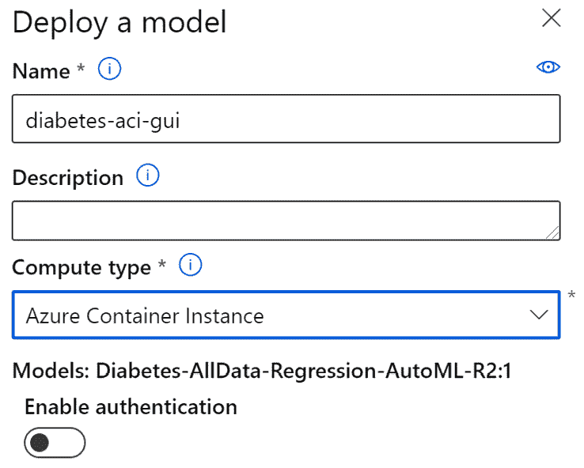
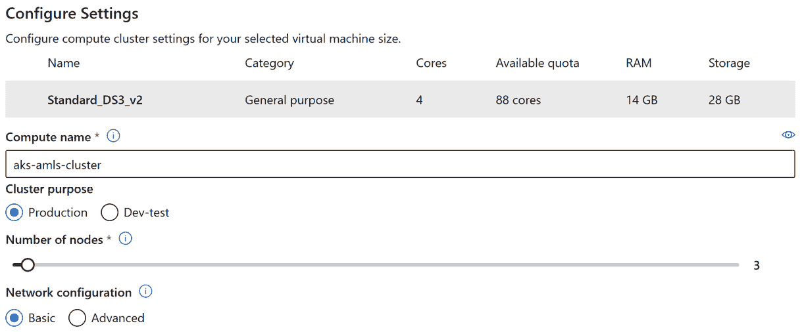
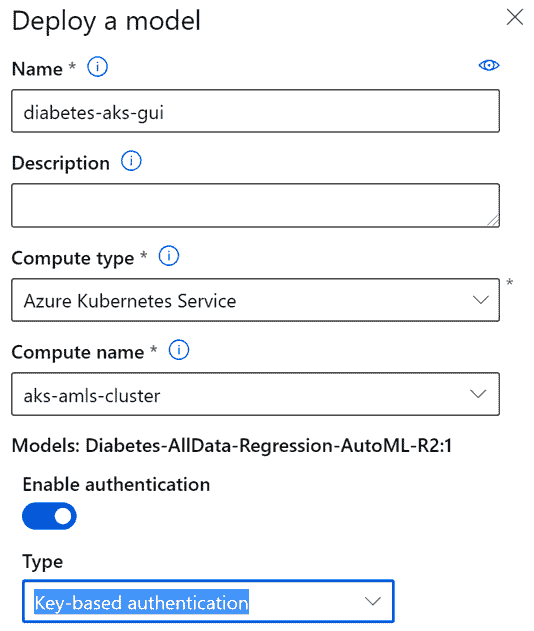
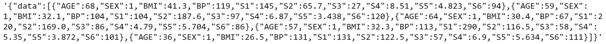

# 第十一章：实现实时评分解决方案

虽然大多数**机器学习（ML**）项目涉及**批量评分**，但最复杂的 ML 项目使用**实时解决方案**。想想看，有哪些模型可以确定信用卡交易是否欺诈，有哪些模型可以决定向在线购物者展示哪些广告，以及有哪些模型可以决定汽车经销商的顾客是否有信用。所有这些情况都需要实时评分解决方案，并且确保您的模型既快速又准确至关重要。

幸运的是，无论您选择用 Python 编写代码还是使用**Azure 机器学习**（**AML**）工作室**图形用户界面**（**GUI**），在 AutoML 中创建快速、可靠的实时评分解决方案都很容易。

您将开始本章，通过 AML 工作室 GUI 创建实时评分端点。**实时评分端点**是通过它们传递数据并快速接收结果的 Web 服务。继续，您将通过 Python 代码使用 AzureML SDK 在 Jupyter 笔记本中创建实时评分端点。最后，您将学习如何提高实时评分端点的性能，以更好地服务您的最终用户。

到本章结束时，您将拥有更完整的数据科学技能集。能够训练模型、批量评分模型、按计划重新训练模型以及实时评分模型都是您将拥有的基本 ML 工程技能。这种技能集需求很高。此外，您将能够创建可以嵌入复杂场景中的实时评分端点。

在本章中，我们将涵盖以下主题：

+   通过 UI 创建实时端点

+   通过 SDK 创建实时端点

+   提高 AKS 集群的性能

# 技术要求

在本章中，您将创建在*第四章*，*构建 AutoML 回归解决方案*中创建的`Diabetes-AllData-Regression-AutoML`。

因此，您需要一个有效的互联网连接、一个**Azure 机器学习服务**（**AMLS**）工作区和一个计算实例。您还需要有创建 AKS 集群的权限。如果您使用的是个人账户，这不会成为问题。

以下是为本章准备的前提条件：

+   拥有互联网访问权限

+   拥有一个网络浏览器，最好是 Google Chrome 或 Microsoft Edge Chromium

+   拥有微软 Azure 账户

+   已创建一个 AMLS 工作区

+   已在*第二章*，*Azure 机器学习服务入门*中创建了`compute-cluster`计算集群

+   了解如何从 Azure 计算实例导航到 Jupyter 环境，如*第四章*，*构建 AutoML 回归解决方案*中所示

+   在*第四章*，“构建 AutoML 回归解决方案”中已训练并注册了`Diabetes-AllData-Regression-AutoML`机器学习模型。

本章的代码在此处可用：[`github.com/PacktPublishing/Automated-Machine-Learning-with-Microsoft-Azure/tree/master/Chapter11`](https://github.com/PacktPublishing/Automated-Machine-Learning-with-Microsoft-Azure/tree/master/Chapter11)。

# 通过 UI 创建实时端点

任何实时评分解决方案的核心都是一个实时评分端点，这是一个可以通过它传递数据并立即检索机器学习预测的 Web URL。端点托管在全天候运行、每周 7 天、等待接收请求的容器化服务上。

**Requests**可以将数据发送到端点进行评分，并且可以用任何计算机语言编写，包括 Python。一旦请求通过，你的端点将自动执行底层代码并返回结果。

你可以在任何地方使用这些端点；从 C#到 Python 到 Java 的任何编程语言都可以使用实时评分端点。因此，一旦你获得了托管端点的 URL，你就可以在任意其他代码中实现它。通常，实时评分端点被集成在流式作业、Web 应用程序和移动应用程序中。

当使用基于 AutoML 模型的实时评分端点时，有几个关键点需要注意，这些点使它们与你在*第九章*，“实现批量评分解决方案”中创建的批量评分管道有很大不同。具体如下：

+   首先，当将数据传递给使用 AutoML 训练模型进行评分的端点时，你必须以 JSON 格式传递输入数据，这是通过端点发送数据的最常见格式。Pandas 数据框或除 JSON 以外的任何格式都会失败。

+   其次，你不需要为评分 AutoML 训练模型编写 Python 脚本。Azure AutoML 会自动为你生成一个。因此，你传递给端点的数据必须具有评分所需的正确形状。除非你想更改 AutoML 生成的底层脚本，否则你无法在端点内部进行数据预处理。

AMLS 使用两个主要服务来托管端点，**Azure 容器实例**（**ACI**）和 AKS。两者都是容器化的，并使用 Docker。它们都可以通过 AML studio 中的 GUI 或通过 Jupyter 笔记本中的 Python SDK 来创建。ACI 轻量级、成本低，主要用于测试。AKS 功能强大、成本高，用于生产。

重要提示

ACI 和 AKS 之间的一个关键区别是身份验证。ACI 仅支持基于**密钥的认证**，而 AKS 支持基于密钥和**基于令牌的认证**。

在本节中，您将使用 AML 工作室 GUI 创建一个端点，使用您在 *第四章* 中构建的 `Diabetes-AllData-Regression-AutoML` ML 模型，该模型托管在 ACI 上。然后，您将通过 UI 创建一个**AKS 集群**；AKS 集群是一组**虚拟机**（VMs），它们全天候运行以托管您的端点。您将通过创建托管在您的 AKS 集群上的端点来结束本节。

总体而言，本节的目标是向您介绍端点，并展示您如何通过 AutoML 训练模型在几秒钟内轻松创建它们。

## 通过用户界面创建 ACI 托管的端点

首先，使用以下步骤创建一个使用 AI 的 Azure 容器实例：

1.  通过导航到 [`ml.azure.com/`](https://ml.azure.com/) 打开您的 AML 工作室。

1.  点击左侧面板下**资产**中的**模型**。

1.  您将看到在 AMLS 工作空间中训练的所有 ML 模型的列表。点击 `Diabetes-AllData-Regression-AutoML` 的蓝色链接。

1.  点击 `AutoML_` 下的蓝色链接，后面跟着一个唯一字符的字符串（GUID）。

1.  点击屏幕顶部的**部署**。

1.  给您的端点命名为 `diabetes-aci-gui`。端点名称只能由小写字母、数字和破折号组成。

1.  选择**Azure 容器实例**作为**计算类型**。

1.  确认您的设置与以下截图匹配后，点击**部署**：

    图 11.1 – ACI 设置

1.  您的模型需要几分钟才能部署。等待足够的时间后，点击左侧面板下**资产**中的**端点**。

    重要提示

    第一次在 ACI 或 AKS 中创建端点时，AMLS 将创建一个容器注册表来托管它们。在任何情况下都不要删除此注册表，因为从那时起您将无法部署端点。

1.  点击 `diabetes-aci-gui` 的蓝色链接。

1.  点击屏幕顶部的**消费**按钮。

1.  将 `REST` 端点 URL 复制到文本编辑器，如记事本。请注意，这里还有用于 C#、Python 和 R 中使用模型的代码。您现在已创建了一个在 ACI 上托管的运行得分端点。

在构建了 ACI 之后，您现在有一个可以用来评估新数据的运行端点。ACI 对于测试目的来说很棒，但为了创建一个生产就绪的解决方案，您需要 AKS。

## 通过用户界面创建 AKS 集群

在您可以在 AKS 上托管端点之前，您首先需要构建一个 AKS 集群。按照以下步骤使用 GUI 创建一个：

1.  在**管理**下的左侧面板中点击**计算**。

1.  点击屏幕顶部的**推理集群**。

1.  点击**创建**。

1.  选择**中北部美国**作为**位置**或您的 AMLS 工作空间所在的任何 Azure 位置。

1.  使用右侧的搜索框搜索 `Standard_DS3_v2`。

1.  选择 `Standard_DS3_v2` 作为您的虚拟机并点击**下一步**。

1.  给你的 AKS 集群起一个名字。可以叫`aks-amls-cluster`。它的长度只能为 16 个字符。

1.  选择**开发/测试**作为**集群用途**。

1.  设置`3`。

    重要提示

    在创建 AKS 集群时，确保你的 VM 类型的核心数乘以节点数等于或大于 12。`Standard_DS3_v2` VM 每个有 4 个核心，因此我们将节点数设置为`4`。这是一个最小要求。

1.  一旦将你的设置与以下截图进行比较并确保它们匹配，点击**创建**：

图 11.2 – AKS 集群设置

现在你已成功创建了一个 AKS 集群。你可以使用这个集群来托管大量的 ML 模型。虽然 ACI 只适合运行大小不超过 1 GB 的模型，但你可以使用 AKS 集群来托管更大的模型。接下来，你将在该集群上创建一个端点。

## 通过 UI 创建 AKS 托管端点

为了创建一个托管在 AKS 上的实时评分端点，你需要遵循几乎与创建一个托管在 ACI 上的端点相同的步骤。首先，从以下步骤开始：

1.  通过导航到[`ml.azure.com/`](https://ml.azure.com/)打开你的 AML 工作室。

1.  点击**资产**下左侧面板中的**模型**。

1.  你将看到在这个 AML 工作空间中你训练的所有 ML 模型的列表。点击蓝色的链接打开`Diabetes-AllData-Regression-AutoML`。

1.  点击`AutoML_`下的蓝色链接，后面跟着一个 GUID，一个独特的字符字符串。

1.  点击屏幕顶部的**部署**。

1.  给你的端点命名为`diabetes-aks-gui`。端点名称只能由小写字母、数字和破折号组成。

1.  选择**Azure Kubernetes Service**作为**计算类型**。

1.  打开**启用身份验证**开关。

1.  选择**基于密钥的身份验证**作为**类型**。

1.  在确认你的设置与以下截图匹配后，点击**部署**：

    图 11.3 – AKS 设置

1.  你的模型将需要几分钟的时间来部署，与你的 ACI 托管模型相同。一旦准备就绪，点击**资产**下左侧面板中的**端点**。

1.  点击蓝色的链接打开`diabetes-aks-gui`。

1.  点击屏幕顶部的**消费**。

1.  将`REST`端点 URL 复制到文本编辑器，如记事本。同时，复制一个密钥。你可以使用主密钥或辅助密钥。任一密钥都可以用于身份验证。

通过本节，你现在已创建了两个实时评分端点，一个托管在 ACI 中，另一个托管在 AKS 中。你还有一个 AKS 集群来托管你的端点，并已将基于密钥的身份验证分配给你的 AKS 托管端点。通过 AML 工作室，通过点击**消费**，你也可以轻松找到用于在 C#、Python 和 R 中部署你的端点的代码。

在下一节，你将使用代码做同样的事情。此外，你还将测试你的端点以查看它们的工作情况。

# 通过 SDK 创建实时端点

通过 AML Studio 的一键部署非常简单，但大多数组织将要求你通过代码开发你的解决方案。幸运的是，通过 AzureML Python SDK 创建 AutoML 模型的实时评分端点几乎和通过 UI 创建它们一样简单。此外，你将更深入地了解你的端点是如何工作的，以及如何格式化你的 JSON 测试，以便将数据作为请求传递到端点。

在本节中，你将首先进入你的 Jupyter 环境，创建一个新的笔记本。首先，你将通过 ACI 部署你的 `Diabetes-AllData-Regression-AutoML` 模型，对其进行测试，一旦你确认测试成功，就通过代码创建一个新的 AKS 集群并将其部署在那里。你将通过测试你的 AKS 部署来结束本节，并确认一切按预期工作。

本节的目标是进一步加深你对实时评分端点的理解，教你如何通过代码创建一切，并使你能够构建和测试复杂的实时解决方案。

## 使用 Python 通过 ACI 创建和测试实时端点

每次你打算实时部署一个 ML 模型时，你应该首先将你的模型部署到 ACI 并对其进行测试。这样，你可以了解你的数据需要如何格式化，你的端点需要多长时间才能响应评分，以及你的模型是否正常工作。首先创建一个端点。

### 在 ACI 上创建一个实时评分端点

和前面的章节一样，你首先需要在你的计算实例上打开一个 Jupyter 笔记本。然后，按照以下步骤构建一个实时评分端点：

1.  通过导航到 [`ml.azure.com/`](https://ml.azure.com/) 打开你的 AML Studio。

1.  点击 **Compute**，启动一个计算实例，并打开一个 Jupyter 环境。

1.  创建一个新的 Jupyter 笔记本，并将其命名为 `real-time-endpoints`。如果你需要复习，请查阅 *第四章*，*构建 AutoML 回归解决方案*。

1.  使用以下代码导入你的标准 Azure 库：

    ```py
    from azureml.core import Workspace, Dataset, Datastore
    from azureml.core import Experiment, Environment, Model
    from azureml.core.compute import ComputeTarget, AksCompute
    ```

    所有这些包你现在都应该很熟悉，除了 `AksCompute`。如果你需要复习，请查阅 *第四章*，*构建 AutoML 回归解决方案*，关于 `Workspace`、`Dataset`、`Datastore`、`Experiment` 和 `ComputeTarget`，以及 *第九章*，*实现批量评分解决方案*，关于 `Environment` 和 `Model`。`AksCompute` 允许你通过代码创建一个 AKS 集群。

1.  使用以下代码导入你用于创建 ACI 端点的 Azure 库：

    ```py
    from azureml.core.model import InferenceConfig
    from azureml.core.webservice import AciWebservice
    from azureml.core.webservice import AksWebservice
    from azureml.train.automl.run import AutoMLRun
    ```

    `InferenceConfig` 允许你指定你将用于创建端点部署的 Python 脚本和环境。这个包与基于 AKS 和 ACI 的部署一起使用。

    `AciWebservice`是您用于在 ACI 上创建端点的方式，而`AksWebservice`是您用于在 AKS 上创建端点的方式。`AutoMLRun`将允许您访问之前的 AutoML 训练运行。您将需要恢复在训练模型时创建的 Python 脚本。

    重要提示

    如果您在加载 Azure 库时遇到问题，请通过运行位于此处的`Update AzureML SDK.ipynb`笔记本来更新 AzureML SDK：[`github.com/PacktPublishing/Automated-Machine-Learning-with-Microsoft-Azure/blob/master/Update-AzureML-SDK.ipynb`](https://github.com/PacktPublishing/Automated-Machine-Learning-with-Microsoft-Azure/blob/master/Update-AzureML-SDK.ipynb)。

1.  使用以下代码导入非 Azure 库：

    ```py
    import pandas as pd
    import numpy as np
    import random as r
    import requests
    import json
    import os
    ```

    您已经熟悉`pandas`、`numpy`、`os`和`random`。如果您需要复习，请参阅*第四章*，*构建 AutoML 回归解决方案*，或*第九章*，*实现批量评分解决方案*，以了解`os`和`random`。

    在新包中，`requests`允许您向您的部署端点发送网络请求。此包将允许您测试您的部署并使用端点评分数据，而`json`允许您将数据转换为网络请求使用的 JSON 格式。

1.  使用以下代码将您的 Jupyter 笔记本连接到您的 AMLS 工作区：

    ```py
    ws = Workspace.from_config()
    ```

    如果提示您登录，请按照指示操作。

1.  使用以下代码的第一行将您的数据存储设置为默认值。如果您想使用不同的数据存储，请使用第二行和第三行代码代替，替换`workspaceblobstore`：

    ```py
    datastore = Datastore.get_default(ws)
    my_datastore_name = 'workspaceblobstore'
    my_datastore = Datastore.get(ws, my_datastore_name)
    ```

1.  使用以下代码将您的计算集群设置为在*第二章*，*Azure 机器学习服务入门*中创建的集群：

    ```py
    compute_name = 'compute-cluster'
    compute_target = ComputeTarget(ws, compute_name)
    ```

1.  使用以下代码将您的环境设置为`AzureML-AutoML`：

    ```py
    environment = Environment.get(ws, 'AzureML-AutoML')
    ```

    `AzureML-AutoML`是随 AzureML SDK 一起提供的标准环境。您可以使用此环境进行任何实时 AutoML 部署。

    提示

    AzureML SDK 附带了许多不同的标准环境。您可以通过使用`Environment.list`函数访问它们的列表。

1.  使用以下代码设置您的`Diabetes-AllData-Regression-AutoML`模型：

    ```py
    model = Model(ws, 'Diabetes-AllData-Regression-AutoML')
    ```

    这是您将部署到端点以实时评分糖尿病数据的模型。

1.  导航到您的 AML 工作室，在左侧面板上单击**模型**。您需要检索与您的模型关联的实验和运行 ID。

1.  点击蓝色链接打开`Diabetes-AllData-Regression-AutoML`。

1.  如果您在*第四章*，*构建 AutoML 回归解决方案*中逐字逐句遵循了指示，请复制`Diabetes-Sample-Regression`。

1.  使用以下代码设置您的实验和运行 ID：

    ```py
    experiment = Experiment(ws, 'Diabetes-Sample-Regression') 
    runID = 'AutoML_your_run_ID' 
    ```

1.  使用以下代码检索您的 AutoML 运行：

    ```py
    run = AutoMLRun(experiment, runID)
    ```

    你检索旧运行的原因是为了从中提取用于部署模型的 Python 脚本。这是用于通过 GUI 部署你的模型的相同脚本。

    重要提示

    你可以使用此代码始终检索旧模型运行。如果你忘记注册模型，这很重要。你可以类似地检索旧的 ML 管道运行。

1.  使用以下代码提取由 AutoML 最佳拟合的模型：

    ```py
    best_run, fitted_model = run.get_output()
    ```

    此代码检索两个对象，最佳运行以及模型。你将只使用最佳运行，但 `get_output()` 需要你传递两个对象，否则函数将返回错误。

1.  使用以下代码创建一个文件夹来保存所有你的实时脚本：

    ```py
    os.makedirs('Real_Time_Scripts', exist_ok=True)
    ```

1.  使用以下代码检索你将用于实时评分数据的 Python 脚本：

    ```py
    script_path =\
    'Real_Time_Scripts/Diabetes_Inference.py'
    best_run.download_file('outputs/scoring_file_v_1_0_0.py', script_path)
    ```

    当 AutoML 训练模型时，它会输出一个用于实时推理的评分文件。此文件始终称为 `scoring_file_v_1_0_0.py`，位于 `outputs` 文件夹中。此代码获取该文件并将其保存为 `Diabetes_Inference.py`。

1.  设置一个变量来命名你的 ACI 部署：

    ```py
    aci_service_name = 'diabetes-scoring-aci'
    ```

1.  使用以下代码配置端点以使用你的 Python 脚本和 `Azure-AutoML` 环境：

    ```py
    inference_config =\
    InferenceConfig(entry_script=script_path,\
    environment = environment)
    ```

1.  使用以下代码配置你的 ACI 部署：

    ```py
    aci_config =\
    AciWebservice.deploy_configuration(\
    cpu_cores = 1, memory_gb = 1,\
    tags = {'Project': 'Diabetes'},\
    description = 'Diabetes Real-Time ACI Deployment')
    ```

    注意你需要设置用于部署的核心数以及要保留的内存量。你还可以设置标签并添加描述。

1.  使用以下代码创建你的 ACI 端点：

    ```py
    aci_service =\
    Model.deploy(ws, aci_service_name,\
    [model], inference_config, aci_config,overwrite=True)\
    aci_service.wait_for_deployment(True)
    ```

此代码要求你传递你的 AMLS 工作空间、你的 ACI 部署名称、你的 ML 模型、你的端点（推理）配置、你的 ACI 配置，并将 `overwrite` 标志设置为 `True` 或 `False`。你的端点部署应花费 5 到 10 分钟。

### 测试你的实时评分端点

现在你已经在 ACI 上创建了一个实时评分端点，是时候测试它了。首先，你需要创建一些数据来测试它，然后你需要将其转换为 JSON 并按照以下步骤将其传递到端点：

1.  要创建一些随机的 `Diabetes` 数据，首先，使用你在 *第二章*，*Azure Machine Learning Service 入门* 中创建的 `Diabetes` 样本数据集的最小值和最大值来为每个变量创建一个可能的值范围，使用以下代码：

    ```py
    AGE_range = np.arange(19,79,1)
    SEX_range = np.arange(1,2,1)
    BMI_range = np.arange(18.0,42.2,0.1)
    BP_range = np.arange(62, 133, 1)
    S1_range = np.arange(97, 301, 1)
    S2_range = np.arange(41.6, 242.4, 0.1)
    S3_range = np.arange(22, 99, 1)
    S4_range = np.arange(2, 9.09, 0.01)
    S5_range = np.arange(3.258, 6.107, 0.001)
    S6_range = np.arange(58, 124, 1)
    ```

1.  创建一个空列表以帮助生成样本数据。这与你在 *第九章*，*实现批量评分解决方案* 中创建样本 `Iris` 数据的方法类似。此外，创建一个空的 pandas dataframe 并使用以下代码将其列分配给它：

    ```py
    DiabetesList = []
    columns =\
    ['AGE', 'SEX', 'BMI', 'BP', 'S1', 'S2', 'S3', 'S4', 'S5', 'S6']
    DiabetesDF = pd.DataFrame(columns=columns)
    ```

1.  使用以下代码使用 `for` 循环创建示例糖尿病数据：

    ```py
    for i in range(0,5):
        values = [r.choice(AGE_range),\
    r.choice(SEX_range),r.choice(BMI_range),\
    r.choice(BP_range), r.choice(S1_range),\
    r.choice(S2_range), r.choice(S3_range),\
    r.choice(S4_range), r.choice(S5_range),\
    r.choice(S6_range)]
        DiabetesDict = pd.DataFrame(dict(zip(columns, values)), index=[0])
        DiabetesList.append(DiabetesDict)
    DiabetesDF = DiabetesDF.append(DiabetesList,True)
    ```

    此代码与用于创建 `Iris` 数据的代码相同。请参阅 *第九章*，*实现批量评分解决方案*，以获取详细说明。

1.  使用以下代码将你的样本数据注册为名为 `Diabetes Scoring`：

    ```py
    Dataset.Tabular.register_pandas_dataframe(\
    DiabetesDF, datastore, 'Diabetes Scoring')
    ```

    这将把底层数据写入你的默认数据存储，并注册为名为 `Diabetes Scoring` 的数据集。

1.  将 `DiabetesDF` 转换为以 `{"data":` 开头和 `}` 结尾的 JSON 对象。每个 AutoML 真实时部署都需要以这种格式的数据：

    ```py
    test = '{"data":' +\
    DiabetesDF.to_json(orient='records') + '}'
    ```

    重要提示

    在创建 JSON 文件时，始终将 `orient` 设置为 `records`。任何其他 JSON 格式都可能导致错误。

1.  查看你的数据以了解你的传入数据应该是什么样子：

    ```py
    Test
    ```

    你的数据应该类似于 *图 11.4*，尽管值将根据你的数据而有所不同。关键点是 JSON 值需要以键值对的形式存在，以确保正确的预测：

    

    图 11.4 – JSON 格式

1.  导航到你的 AML 工作室首页并点击 **端点**。

1.  点击蓝色链接到 `diabetes-scoring-aci` 并点击 **消费**。复制链接到你的端点的 URL 并将其粘贴到文本编辑器，如记事本。

1.  返回到你的代码，将 URL 和头信息设置为变量：

    ```py
    aci_url = 'your-aci-endpoint-url'
    headers = {'Content-Type': 'application/json'}
    ```

    虽然你需要输入你的 URL，但头信息对于每次部署都是相同的。

1.  使用以下代码测试你的 ACI 部署：

    ```py
    response =\
    requests.post(aci_url, test, headers=headers)
    print(resp.text)
    ```

你现在已经通过代码创建了一个在 ACI 上托管的真实时评分端点，并且已经成功测试了它。此外，你还了解你的数据需要以 JSON 格式进行塑形和格式化，以便进行评分。一旦你确认你的实时端点在 ACI 中工作正常，下一步就是创建一个 AKS 集群，并将生产版本部署在那里，就像你接下来要做的那样。

## 通过 Python 创建 AKS 集群

通过代码创建 AKS 集群与通过 GUI 创建一样简单直接。许多组织要求所有基础设施都通过代码创建，你可以使用以下步骤作为模板：

1.  在你的 Jupyter 笔记本中继续操作，为你的虚拟机大小、所需节点数量、AKS 集群位置和 AKS 集群名称设置变量：

    ```py
    aks_cluster_name = 'aks-code-cluster'
    vm_type = 'Standard_DS3_v2'
    node_count = 3
    AKS_location = 'northcentralus'
    ```

1.  使用以下代码设置你的 AKS 集群配置：

    ```py
    prov_config =\
    AksCompute.provisioning_configuration(vm_size =\
    vm_type, agent_count = node_count, location =\
    AKS_location)
    ```

    在设置配置时，请记住，你的节点数乘以每个虚拟机上的核心数必须大于或等于 12。同时，在设置 Azure 位置时，考虑数据将从哪里传入。

1.  使用以下代码创建你的 AKS 集群：

    ```py
    aks_target =\
    ComputeTarget.create(workspace = ws, name =\
    aks_cluster_name, provisioning_configuration =\
    prov_config)
    aks_target.wait_for_completion(show_output = True)
    ```

    你必须传入你的 AMLS 工作区、AKS 集群名称和 AKS 集群配置。启动你的集群大约需要 5-10 分钟。

你已经通过代码创建了一个 AKS 集群。一旦它启动并运行，你就可以将评分端点部署到你的 AKS 集群，并使用你已创建的许多相同变量进行测试。因此，建议你在同一个 Jupyter 笔记本中创建 ACI 和 AKS 端点。这将节省你大量复制代码的工作。

## 通过 Python 使用 AKS 创建和测试实时端点

您在本节中的最后一个任务是部署您的实时评分端点到 AKS 集群，获取 URL 和访问密钥，并测试您的部署。只有几个步骤，因为您在部署到 ACI 时已经创建了大部分代码。

在本章结束时，请记住删除您的 AKS 端点和集群，因为它们可能相当昂贵，并可能产生账单。在同一个 Jupyter 笔记本中，继续以下步骤：

1.  使用以下代码设置您的目标 AKS 集群：

    ```py
    aks_cluster = AksCompute(ws, 'aks-code-cluster')
    ```

1.  为您的 AKS 部署设置一个变量名：

    ```py
    aks_service_name = 'diabetes-scoring-aks' 
    ```

1.  使用以下代码配置您的 AKS 部署：

    ```py
    aks_config =\
    AksWebservice.deploy_configuration(cpu_cores = 1,\
                      memory_gb = 1, tags = {'Project':\
                      'Diabetes'}, description =\
                      'Diabetes Real-Time ACI Deployment')
    ```

    注意，这些配置与您用于 ACI 部署的配置相同。

1.  使用以下代码创建您的 AKS 端点：

    ```py
    aks_service =\
    Model.deploy(ws, aks_service_name, [model],\
    inference_config, aks_config, aks_cluster,\
    overwrite=True)
    aks_service.wait_for_deployment(show_output = True)
    ```

    注意，此代码几乎与您用于创建 ACI 部署的代码相同；唯一的区别是您还必须传入 AKS 集群。这是因为 AKS 是托管在您管理的 VM 集群上，而 ACI 是一个无服务器容器服务。

1.  导航到您的 AML 工作室首页并点击 **端点**。

1.  点击蓝色链接打开 `diabetes-scoring-aks` 并点击 **消费**。复制链接到您的端点的 URL 并将其粘贴到文本编辑器（如记事本）中。同样，对于访问密钥，您可以使用主密钥或辅助密钥，任选其一。两者都适用。

1.  回到您的代码，将您的 URL、密钥和头信息设置为变量：

    ```py
    aks_url = 'your-aks-endpoint-url'
    key = 'your-aks-key'
    headers = {'Content-Type': 'application/json'}
    headers['Authorization'] = f'Bearer {key}'
    ```

    在这里，您需要添加一个额外的头信息用于授权。**Bearer 函数**通过授予提供正确密钥的任何人访问权限来工作。

    重要提示

    在生产环境中，请确保将所有密钥存储在 **Azure Key Vault** 中，不要在公开代码中暴露您的密码和密钥。这是一个最佳实践，可以保护您。

1.  使用以下代码测试您的 AKS 部署：

    ```py
    resp = requests.post(aks_url, test, headers=headers)
    print(resp.text)
    ```

    您应该看到与您的 ACI 测试相同的结果，因为它们使用相同的数据输入。确保输出匹配，您就可以称您的测试为成功。

您现在已经学到了成功在 Azure 中创建实时评分端点所需的所有知识。这些端点可以在任何其他代码片段中使用。确保推送到端点的任何数据都处于正确的 JSON 格式，您的项目将取得成功。

本章的最后部分处理优化 AKS 集群的性能。涉及一些微调，可以大大提高评分解决方案的响应时间。

# 提高 AKS 集群的性能

有时您会在 AKS 上部署一个端点，但它并不按您期望的方式运行。可能超时，可能太慢，可能是一个之前运行良好的端点突然面临无法处理的更多流量。这些情况会发生，您必须准备好应对它们。

幸运的是，AKS 部署有很多额外的配置，您可以利用这些配置来解决这些问题。本节将介绍一些更常见的情况，如下所示：

+   根据您的模型复杂度、您尝试评分的数据点数量以及虚拟机的大小，AKS 模型有时可能需要一段时间才能评分或甚至超时。在这种情况下，您有很多事情可以做。

    首先，您可以尝试增加您虚拟机的尺寸，选择一个具有更多 RAM 的虚拟机。接下来，您可以在部署配置中添加一个额外的设置，`scoring_timeout_ms`。此设置默认为`60000`毫秒，即 1 分钟。您可以将其调整为最多`300000`毫秒，即 5 分钟。有时，调整`memory_gb`或增加`cpu_cores`的数量也可能有所帮助。

+   使用 AML studio 检查您模型的大小。您可以通过点击部署配置中的`memory_gb`设置来完成此操作。

+   在您的端点突然遇到无法处理的流量激增的情况下，尝试开启自动扩展并增加其扩展能力。在部署配置中将`autoscale_enabled`设置为`True`。

    您还可以使用`autoscale_min_replicas`和`autoscale_max_replicas`手动调整自动扩展将创建的最小和最大副本数。这些默认值分别为`1`和`10`。在流量高峰的情况下，尝试将这两个值都提高以增加性能。

带着这些信息，您可以轻松创建满足您业务和性能要求的强大 AKS 部署。当流量繁忙时，提高自动扩展。当您的应用程序超时时，调整超时设置。当您的 AKS 端点运行缓慢时，尝试使用更大的虚拟机或调整内存设置。最重要的是，在 AKS 上部署之前，始终在 ACI 上测试您的部署，并确保输入数据以正确的 JSON 格式以键值对的形式传入。

# 摘要

您现在已创建并测试了使用 AutoML 训练模型的真实时评分解决方案。首先在 ACI 上部署，然后在 AKS 上部署，您理解了创建实时评分端点的完整端到端过程。

此外，您还了解为了使用这些端点生成预测，数据必须如何塑形和格式化，这些可以集成到任何使用各种计算机语言的代码中，以创建强大、创新解决方案。

在下一章，*第十二章*，*利用 AutoML 实现商业价值*，本书的最后一章，你将学习如何以一种能够赢得非技术业务伙伴信任的方式展示 AutoML 解决方案。毕竟，他们的信任和接受是解锁组织中机器学习和人工智能力量与价值的基础。
