# 第十二章：利用 AutoML 实现商业价值

在这本书中，您已经获得了各种各样的技术技能。现在，您能够使用 AutoML 训练回归、分类和预测模型。您可以使用 Jupyter 笔记本在 Python 中编码 AutoML 解决方案，您知道如何导航 **Azure Machine Learning** **Studio**，甚至可以将机器学习管道集成到 **Azure Data Factory** (**ADF**) 中。然而，仅凭技术技能并不能保证您项目的成功。为了实现商业价值，您必须赢得最终用户的信任和接受。

在本章中，您将首先学习如何以使最终用户易于理解的方式展示端到端架构。然后，您将学习使用哪些可视化工具和指标来展示您模型的表现，之后您将学习如何可视化和解释 AutoML 内置的可解释性功能。

您还将探索在 **Azure Machine Learning Service (AMLS)** 之外运行 AutoML 的选项，并在本章结束时添加一个关于通过将您的信息与您提供的解决方案类型对齐来赢得最终用户信任的部分。

到本章结束时，您将准备好取得成功。您将获得一些必要的软技能，以便向最终用户传达您的解决方案，从而增加您的端到端解决方案被您的组织采用和使用的可能性。未能赢得最终用户信任是数据科学项目失败的主要原因之一，通过遵循本章中的指南，您将更有可能为您的解决方案创造兴奋点。

本章将涵盖以下主题：

+   架构 AutoML 解决方案

+   可视化 AutoML 模型结果

+   向您的业务解释 AutoML 结果

+   在其他 Microsoft 产品中使用 AutoML

+   实现商业价值

# 技术要求

在本章中，您将使用您在前面章节中创建的模型来检索图表、图表和指标。因此，您需要一个有效的互联网连接、Azure 账户和 AMLS 工作空间。您还需要完成 *第四章**，构建 AutoML 回归解决方案* 和 *第五章**，构建 AutoML 分类解决方案* 中的练习。

本章的先决条件如下：

+   上网权限。

+   一个网络浏览器，最好是 Google Chrome 或 Microsoft Edge Chromium。

+   一个 Microsoft Azure 账户。

+   一个 AMLS 工作空间。

+   您需要在 *第四章**，构建 AutoML 回归解决方案* 中训练并注册 `Diabetes-AllData-Regression-AutoML` 机器学习模型。

+   您需要在 *第五章**，构建 AutoML 分类解决方案* 中训练并注册了 `Iris-Multi-Classification` 机器学习模型。

本章没有新的代码。

# 架构 AutoML 解决方案

**架构 AutoML**解决方案是指绘制端到端图。这些图作为构建解决方案的蓝图，也可以用来向最终用户解释整个工作流程。虽然许多 IT 解决方案复杂且形式多样，但基于 AutoML 的解决方案遵循标准模式，需要你做出一些重要的决策。

在本节中，你将首先学习在架构决策之前需要做出哪些决策。然后，你将学习如何架构一个易于向最终用户解释的端到端批处理评分解决方案和端到端实时评分解决方案。尽管架构可能被简化，但越标准化，就越容易实施、解释和理解。

## 为 AutoML 解决方案做出关键架构决策

在绘制架构图时，你需要考虑几个关键因素，其中最重要的是你是否需要构建批处理或实时解决方案。批处理解决方案与实时解决方案的要求大不相同，通常遵循涉及 AMLS 和 ADF 的模板。另一方面，实时解决方案则更加定制化。

首先，我们将检查在构建批处理解决方案时需要提出的关键问题，因为它们更容易理解。你只需要考虑数据从哪里来，你的解决方案应该多久评分一次新数据，何时应该重新训练模型，以及最终用户将如何接收结果。就是这样。

同时，还有一个问题，那就是在你将各种**机器学习**（**ML**）管道安排在 AMLS 或 ADF 中进行调度时，应该如何协调。ADF 通常是最佳选择，因为它可以让你轻松地将数据移动到 Azure 中。以下表格提供了构建批处理解决方案的关键问题和答案的摘要：

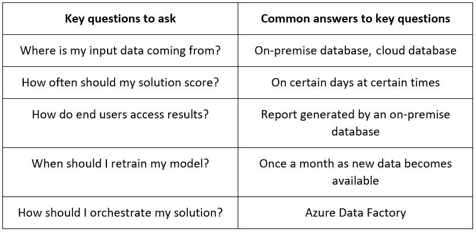

图 12.1 – 批处理解决方案的关键考虑因素

另一方面，实时解决方案要复杂得多。你仍然需要询问输入数据从哪里来，你应该多久重新训练一次 AutoML 模型。此外，你还应该弄清楚你的端点将在哪里评分数据。这可能非常复杂，因为你在几乎任何地方都会使用你的端点。最常见的情况是，这将是一种某种类型的 Web 应用程序或无服务器代码片段。

最后，你需要弄清楚你的端点一次需要服务多少请求，最终用户需要多快的响应速度，以及你的**Azure Kubernetes 服务**（**AKS**）集群应该有多大，以便满足解决方案的需求。以下表格提供了构建实时解决方案的关键问题和答案的摘要：

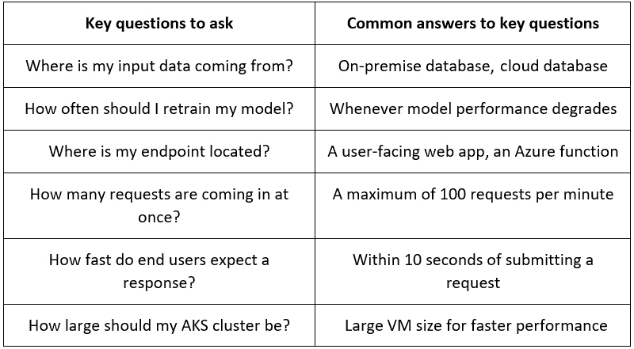

图 12.2 – 实时解决方案的关键考虑因素

一旦您提出并回答了这些问题，您就可以开始构建架构图。首先，您将学习批处理解决方案的常见模式。

## 架构批处理解决方案

一旦您回答了输入数据来源和结果存放位置的问题，AutoML 批处理解决方案就相对容易构建。它们总是遵循大致相同的模式。首先，您将通过 ADF 从本地和云源摄取数据，并将数据存放在**Azure Data Lake Storage Gen 2 (ADLS Gen 2)**存储账户中。这使得您的数据可被 AMLS 访问。

一旦数据进入数据湖，您就可以在 AMLS 中使用 AutoML 来训练和注册一个机器学习模型。您的下一步是使用该模型创建评分管道和训练管道。然后，您通过 ADF 编排这两个机器学习管道，为评分管道和训练管道分别决定一个调度计划。

训练管道会自动在 AMLS 中注册您模型的最新版本，但您需要决定将评分管道的最终输出放置在哪里。默认情况下，评分管道被设计为将数据存放在 ADLS Gen 2 中。一旦数据在那里，您应该设置一个 ADF 复制活动，将数据从数据湖移动到其最终目的地。完整的端到端架构在以下图中展示：

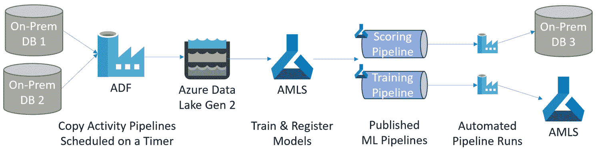

图 12.3– 常见的批处理架构

为您制作的每个批处理 AutoML 解决方案创建类似的图，并在需要时重复使用它们。遵循模板架构将随着时间的推移使您和您的团队更加高效。

接下来，您将学习实时解决方案的常见架构。仔细注意相似之处和不同之处。虽然开始部分与批处理架构相同，但结尾部分却截然不同。

## 架构实时解决方案

实时解决方案架构需要更加仔细的考虑。如果有的话，您的最终用户将如何与您的端点交互？您是否正在设计一个用户可以随时评分数据的 Web 应用程序？您是否有一个一次向端点发送数千个信号的流系统？一旦这些问题得到解答，您就可以完全完善架构。

对于批处理解决方案，第一步涉及使用 ADF 将数据摄取到 ADLS Gen 2 中，并使用 AMLS 进行 AutoML 模型的训练和注册。这部分是相同的。一旦模型训练完成，您需要创建一个实时评分端点和机器学习训练管道。您将像往常一样在 ADF 中安排重新训练，以定期更新模型。

您还需要决定端点将驻留在何处。在这个架构中，它位于面向用户的 Web 应用程序上。用户可以在任何时间将数据传递到 Web 应用程序中，此时结果将在屏幕上显示，并立即发送到 ADLS Gen 2。以下图显示了完整的端到端架构：

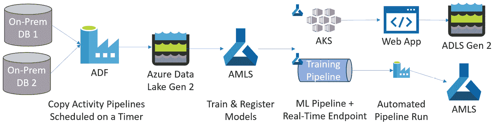

图 12.4 – 常见的实时架构

向最终用户展示架构是获得解决方案接受的关键部分。最终用户需要以一般的方式了解一切是如何连接和工作的。在展示你的架构之后，你应该接着展示你的 AutoML 模型的结果。教用户如何使所有部件配合在一起只是一个介绍。以最终用户能够理解的方式展示你的模型结果，将大大有助于他们支持你的解决方案。

# 可视化 AutoML 建模结果

向你的业务展示你的 AutoML 模型的结果对于解决方案的采用至关重要。毕竟，如果你的最终用户不能确信它符合某些性能标准，他们不太可能采用你的解决方案。有几种方式可以展示 ML 模型的结果；展示结果最有效的方式是通过可视化。

幸运的是，AutoML 运行提供了回归、分类和预测结果的自动可视化。回归和预测具有相同的可视化，而分类则相当不同。在每种情况下，你只想与最终用户分享一个可视化；同一结果的多个视图可能会引起混淆。

在本节中，你将首先了解在分类之前向最终用户展示什么，然后转向回归和预测。

## 可视化分类结果

混淆矩阵，如*第五章**，构建 AutoML 分类解决方案*中所示，是展示 AutoML 分类训练运行结果的关键。最终，用户通常关心的是你的模型有多准确，以及是否存在假阳性或假阴性的倾向。为了获取这些信息，请按照以下步骤操作：

1.  导航到[`ml.azure.com`](https://ml.azure.com)的 AML 工作室。

1.  在左侧面板的**资产**下点击**实验**。

1.  点击**Iris-Multi-Classification**的蓝色链接。这是你在*第五章**，构建 AutoML 分类解决方案*中用来训练分类模型的实验。

1.  点击最新的运行蓝色的链接。这个链接位于`AutoML_`之后，跟着一个唯一的标识字符串。如果有多个运行，请使用最新的。

1.  在屏幕顶部附近点击**模型**。

1.  在**算法名称**下点击你性能最高的模型的名称的蓝色链接。它可能是**StackEnsemble**或**VotingEnsemble**。你会知道它是你的最高性能模型，因为它将是唯一一个带有**查看解释**链接的模型。

1.  在屏幕顶部附近点击**度量**。

1.  选择**准确度**和**混淆矩阵**的复选框。

1.  在混淆矩阵中，点击下拉框并选择**标准化**。您应该会看到一个类似于以下图所示的图表：

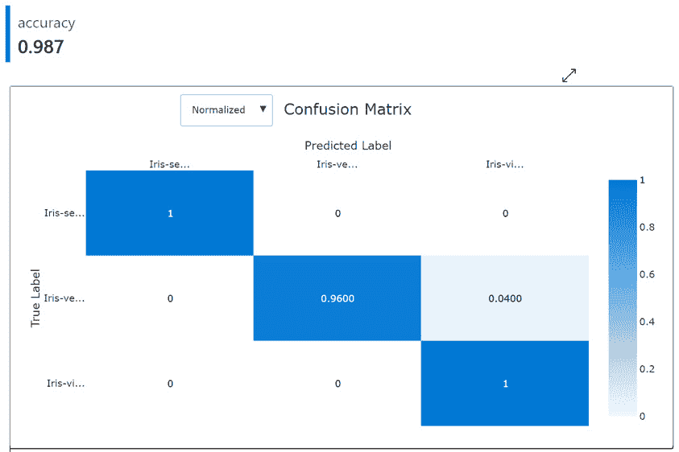

图 12.5 – 为您的业务用户提供的分类结果

此图表包含您的最终用户所需的所有信息。首先，模型准确率为 98.7%。其次，它总是正确地识别**Iris-setosa**和**Iris-virginica**。最后，有 4%的可能性您的模型将错误地将**Iris-versicolor**识别为**Iris-virginica**。

在向您的业务用户解释结果时，保持这一级别的细节。解释说这是基于训练数据，并且您预计当应用于模型以前从未见过的数据时，结果可能会稍微差一些。

重要提示

样本量越大，您的样本数据越能代表现实世界，您的训练结果对新数据点的评分就越适用。这也是为什么始终重要的是收集尽可能多的好数据，并确保您的数据没有采样偏差。

通常，此图表将满足大多数最终用户对您的模型性能的疑问。由于 AutoML 生成的图表可能难以阅读，您可以采取的一个改进方法是使用其他工具（如 PowerPoint）重新创建此图表。回归和预测也有一个用于展示结果的非常强大的图表。

## 可视化预测和回归的结果

预测值与真实值图，首次在*第四章**，构建 AutoML 回归解决方案*中介绍，是展示这两种问题类型结果的关键。此图显示了您的模型在一系列分数上的性能。然而，它比混淆矩阵稍微难解释一些，需要您仔细向最终用户解释。要访问它，请按照以下步骤操作：

1.  导航到[`ml.azure.com`](https://ml.azure.com)的 AML 工作室。

1.  在左侧面板的**资产**下点击**实验**。

1.  点击蓝色链接以打开`Diabetes-Sample Regression`。这是您在*第四章**，构建 AutoML 回归解决方案*中用于训练回归模型的实验。

1.  点击蓝色链接以打开您的最新运行。此链接位于`AutoML_`之后，跟一个唯一的标识符字符串。如果有多个运行，请使用您的最新运行。

1.  点击屏幕顶部的**模型**。

1.  点击**算法名称**下的蓝色链接以打开您最高性能模型的名称。它可能是**StackEnsemble**或**VotingEnsemble**。您将知道它是您的最高性能模型，因为它将是唯一一个带有**查看解释**链接的模型。

1.  点击屏幕顶部的**指标**。

1.  勾选**平均绝对百分比误差**和**预测真实值**的复选框。您应该看到以下图中类似的图表：

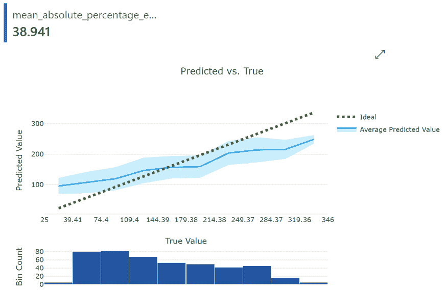

图 12.6 – 为您的业务最终用户提供的回归/预测结果

**平均绝对百分比误差**（**MAPE**）通常是与商业误差一起使用的最佳回归指标。在这种情况下，它表明您的 AutoML 模型通常偏离了 39.4%，与您几乎完美的 Iris 模型相比并不特别令人印象深刻。商人往往认为 MAPE 是最容易理解的指标，因为它不需要统计学背景或对标准差或方差的深入了解。

预测值与真实值图显示了您的模型在预测一系列值时的表现如何。理想情况下，您希望您的蓝色线（**平均预测值**）与绿色线（**理想**）相匹配。至少，您希望大部分绿色线（**理想**）落在蓝色线（**平均预测值**）周围的阴影边界内。

您想要解释的是，对于 74.4 分到大约 250 分的分数，您的模型在预测真实分数方面做得相当不错。在这个范围之外，您的模型表现较差，倾向于高估 74.4 分以下的真实分数，低估 250 分以上的分数。使用以下直方图指出训练数据的分布情况。也许在光谱的更高端和低端收集更多的样本数据点将改善您的模型。

有时，一些有统计学背景的用户可能会成为您的最终用户之一。如果是这种情况，您还希望向他们展示通过勾选**残差**框可以获得的残差图。他们想知道您的模型是否显示出偏差的证据，通过展示以下图中所示的钟形残差直方图，您可以让他们放心：

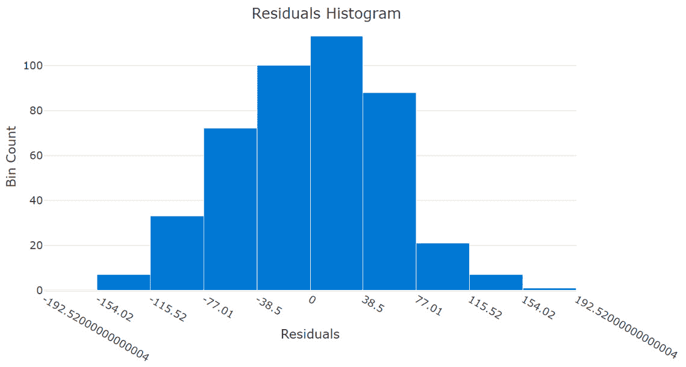

图 12.7 – 回归和预测的残差直方图

预测在呈现结果方面与回归相同；它们使用相同的图表。通过向最终用户展示正确的可视化，您可以消除他们对性能的任何担忧。然而，他们通常会问一个后续问题。*您的模型实际上是如何工作的？* 要回答这个问题，您需要使用 AutoML 的内置可解释性功能。

# 向您的业务解释 AutoML 结果

要实现商业价值，您的 AutoML 模型必须被业务实施并使用。实施的一个常见障碍是缺乏对机器学习工作原理的理解而产生的信任缺失。同时，解释个别机器学习算法的来龙去脉并不是赢得信任的好方法。将数学符号和复杂的统计数据抛向最终用户不会奏效，除非他们已经拥有深厚的数学背景。

相反，使用 AutoML 内置的可解释性。只要在训练模型时启用可解释性，您就可以确切地说出 AutoML 正在使用哪些特征来生成预测。通常，以下四个做法是好的：

+   在训练任何 AutoML 模型时，始终启用可解释性。

+   在向业务展示结果时，首先展示性能，然后展示可解释性。

+   按照重要程度从高到低排列特征。

+   从未来的训练运行中删除任何不重要的特征。

简单的模型更容易理解，并且更容易被最终用户接受。因此，您应该始终强调模型正在使用的特征。

为了访问可解释性，使用以下步骤：

1.  导航到 AML 工作室在[`ml.azure.com`](https://ml.azure.com)。

1.  在左侧面板的**资产**下点击**实验**。

1.  点击蓝色链接打开`Diabetes-Sample Regression`。这是您在*第四章**，构建 AutoML 回归解决方案*中用于训练回归模型的实验。

1.  点击蓝色链接打开您的最新运行。此链接位于`AutoML_`之后，跟随着一个唯一的标识字符串。如果有多个运行，请使用最新的。

1.  在屏幕顶部附近点击**模型**。

1.  点击**查看解释**。

1.  在**解释 ID**下点击第一个 ID 号。这些是 AutoML 用于训练您的模型的原始特征的解释。

1.  点击**聚合特征重要性**以查看在训练您的 AutoML 模型时哪些原始特征最重要。

1.  使用滚动条查看用于训练您的模型的顶级 10 个特征，如图所示：

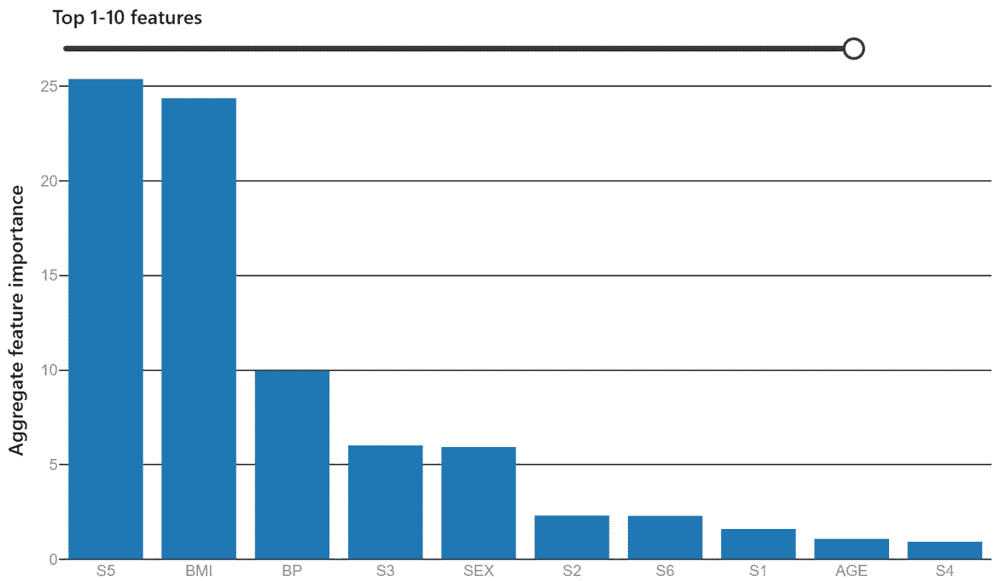

图 12.8 – 可解释性可视化

此可视化显示，用于训练`Diabetes-AllData-Regression-AutoML`模型的最重要两个特征是`S5`和`BMI`。血压(`BP`)、`S3`和`SEX`也很重要，但远不如`S5`和`BMI`重要。为了训练模型，`S5`和`BMI`的重要性是`SEX`的近 5 倍。剩余的五个特征，`S2`、`S6`、`S1`、`AGE`和`S4`，只是您机器学习模型的小贡献者；模型没有发现它们很重要。

重要提示

很可能您的商业伙伴会试图从这个图中推断因果关系。重要的是要记住，在没有受控的科学实验的情况下，任何机器学习模型中的可解释性只能显示相关性，而不能显示因果关系。

将此图表展示给您的最终用户以赢得他们的信任；它易于理解，并清楚地显示了 AutoML 正在使用哪些功能进行预测。您不仅可以看到正在使用哪些功能，还可以展示您数据集中每一列的相对重要性。使用此图表讲述一个引人入胜且有意义的故事；您甚至可以从向您的商业受众展示此图表并询问他们的解读开始。让他们讲述故事并自行制定解决方案。

在解释了架构和性能之后，最好展示可解释性幻灯片。架构以端到端格式解释了解决方案是如何工作的，而没有深入到技术细节。性能使您的用户对模型在任何给定时间可以预期的准确性有信心。从逻辑上讲，您的用户将询问您的 AutoML 模型是如何进行预测的。这就是您展示可解释性图表而不是深入到统计和算法错误的地方。

在涵盖了架构、性能可视化以及可解释性之后，您现在拥有了赢得最终用户信任和接受所需的所有工具。下一节将扩展您可以使用 AutoML 来扩展您可开发解决方案的范围的各种地方。即使在 AMLS 之外使用 AutoML，也要记住始终使用可解释性。

# 在其他 Microsoft 产品中使用 AutoML

在这本书中，您已经学习了如何在 Azure 上使用 AutoML，但您也可以在更广泛的 Microsoft 产品套件中使用 AutoML。虽然您可以根据本章“架构 AutoML 解决方案”部分中的架构模式轻松创建和产品化几乎任何 AutoML 解决方案，但在某些场景中，您可能希望在其他 Microsoft 平台上使用 AutoML。您可以在以下位置找到 AutoML：

+   PowerBI

+   Azure Synapse Analytics

+   ML.NET

+   HDInsight

+   SQL Server

+   Azure Databricks

尽管 AutoML 可用于这些服务，但您应该注意许多差异。一些服务是无代码的，而另一些则是仅限代码。一些服务阻止您训练预测算法，而另一些则基于完全不同的 ML 框架。在本节中，您将按服务逐一了解其一般功能。

## 在 PowerBI 中使用 AutoML

**PowerBI**是微软的商业分析解决方案，允许用户可视化数据以快速获得洞察。它是市场上最受欢迎且功能强大的仪表板工具之一，软件的*Power BI Premium*和*Power BI Embedded*许可证都允许您直接使用 AutoML。这是一个无代码版本的 AutoML，其工作方式类似于您在 AML studio 中找到的 AutoML GUI，如*图 12.7*所示：

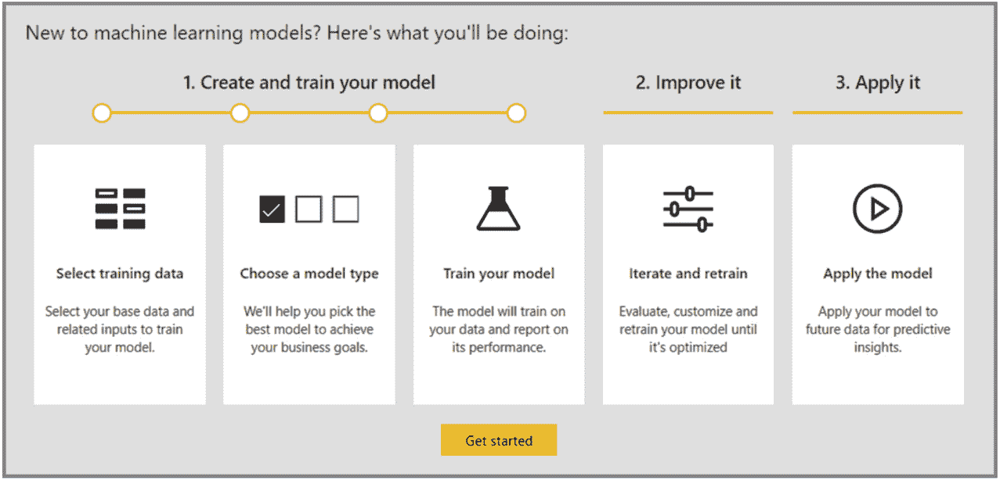

图 12.9 – PowerBI 中的 AutoML

在这种情况下，AutoML 与 **PowerBI 数据流**集成，这是一个自助式数据准备工具。与 Azure 上的 AutoML 一样，你可以用它来训练模型、保存（注册）模型，并使用模型进行预测，这些预测可以保存为数据中的新列。与 Azure 上的 AutoML 不同，它只支持回归和分类问题，不支持预测。这两个服务共有的另一个特性是模型可解释性。

如果你是一名经常构建数据可视化仪表板的数据分析师，PowerBI 上的 AutoML 是一个很好的工具，可以添加到你的工具箱中。你可以轻松地将预测直接添加到数据中，并花费很少的努力来可视化它们。PowerBI 上的 AutoML 对于一次性的 ML 作业也非常出色。Azure Synapse Analytics 是数据分析师使用 AutoML 的另一个常见服务。

## 在 Azure Synapse Analytics 中使用 AutoML

**Azure Synapse Analytics**（**ASA**）是 Azure 的顶级数据分析服务。它提供了一个用于大数据的 SQL 数据仓库、基于 Spark 的分析以及类似 ADF 风格的 ETL 管道，所有这些都在一个地方。如果你有一个 AMLS 工作空间，并且使用类似于 ADF 的链接服务将其链接到 ASA，你还可以在 Synapse 中直接使用 Azure AutoML。

为了使用 AutoML，你需要有一个 Spark 集群，并从你的数据中创建 Spark 表。**Spark** 是一个开源的分析引擎，用于通过在虚拟机集群中分配工作负载来快速处理大数据。使用 ASA，你可以使用 PySpark（Python 的一个版本）、C#、Spark SQL 或 Scala 编写 Spark 解决方案。Spark 表只是在这个框架内创建的数据表。

一旦你有了 Spark 表，你所需要做的就是右键点击它，点击**机器学习**，然后点击**使用新模型丰富**。随后你会看到一个非常熟悉的界面：你最初在*第三章**，训练你的第一个 AutoML 模型*中使用的 AutoML GUI。由于 ASA 直接使用你的 AMLS 工作空间通过 AutoML 训练模型，因此其功能和用户体验是相同的。你还可以在 ASA 中使用 PySpark（Python 的一个版本）、C#、Spark SQL 或 Scala 编写 AutoML 解决方案。

最好将 Synapse 的 AutoML 功能视为一种快捷方式，而不是与 AMLS 不同的体验。当你已经在 ASA 中工作，并希望快速使用 ASA 数据仓库中的数据训练一个 ML 模型时，请使用它。

## 使用 ML.NET 与 AutoML

**.NET 框架**是一个软件开发框架，允许你使用 C#、F# 和 Visual Basic 构建应用程序。**ML.NET** 允许你将 ML 功能添加到 .NET 框架中，而 AutoML 是其众多功能之一。你可以在应用程序中编码 ML.NET 解决方案，或者使用 **ML.NET 模型构建器**通过引导式用户界面创建 AutoML 解决方案。

ML.NET 模型构建器的一个有趣方面是，你可以为各种预定义场景使用 AutoML，包括回归、分类、图像分类、文本分类和目标检测。因此，你不仅限于仅使用表格数据，还可以使用带有图像的自动机器学习。

如果你正在构建 .NET 应用程序并希望轻松地将机器学习添加到其中，请尝试在 ML.NET 中使用 AutoML。这是最合适的用例，并且假设你在 .NET 框架中开发有丰富的经验。如果你不是 .NET 开发者，你最好在 AMLS 工作区中开发你的 AutoML 解决方案。

## 在 SQL Server、HDInsight 和 Azure Databricks 上使用 AutoML

AutoML 还可在多种其他服务上使用，包括 **SQL Server**、**HDInsight** 和 **Azure Databricks**。SQL Server 是微软知名的 **关系数据库管理系统**（**RDBMS**），而 HDInsight 是 Azure 的 Hadoop 版本，用于处理大数据。Azure Databricks 是 Azure 上用于大数据处理和分析的顶级云基础 Spark 工具。这三个服务都可以通过 Python 使用 Azure AutoML。 

当使用这些工具时，你首先需要创建一个 AMLS 工作区，安装 AzureML-SDK，并将你的 AMLS 工作区连接到其他服务。然后，你需要编写一个解决方案。在 HDInsight 和 Databricks 中，你将使用 Spark，而在 SQL Server 中，你需要使用 `sp_execute_external_script` 存储过程来运行 Python 代码。**存储过程**是可以保存并重复使用的 SQL 代码片段。

这三个服务与 ASA、PowerBI 和 ML.NET 之间的重要区别是，AutoML 没有引导用户界面选项。你必须使用代码创建解决方案。如果你已经在 SQL Server、HDInsight 或 Azure Databricks 中构建应用程序或数据管道，并希望将 AutoML 作为该解决方案的一部分，那么在那些服务中进行模型训练是自由的。

Azure Databricks 的另一个特定用例是当你想要使用非常大的数据（100 GB 数据框）训练 AutoML 模型时；这时使用 Spark 分布式框架运行 AutoML 是合适的。

现在你已经熟悉了 AutoML 可用的许多不同工具，你将在构建 AutoML 解决方案时拥有更多的灵活性。然而，仅仅因为你已经构建了一个解决方案，并不意味着人们会使用它。为了总结本章和本书，最后一节将关注获得最终用户接受的战略和技术，这是实现商业价值的关键。

# 实现商业价值

实现商业价值最终取决于你的商业伙伴是否选择根据你的 ML 模型的预测采取行动。没有行动，数据科学家的工作就只是科学实验。你的商业伙伴必须被激励并愿意将你的预测纳入他们的决策过程中。赢得他们的信任至关重要。

为了赢得公司决策领导层的信任，你首先必须确定你使用 AutoML 构建的是哪种解决方案。一些解决方案很容易且迅速地被采用，而其他解决方案可能会遇到强烈的阻力。

有两个关键因素决定了你的 AutoML 解决方案被接受的程度：你的工具是否在替换现有的解决方案，以及你的工具是否直接参与自动化决策过程或是在协助人类决策者。*图 12.8*显示了基于这些因素获得接受度有多困难：

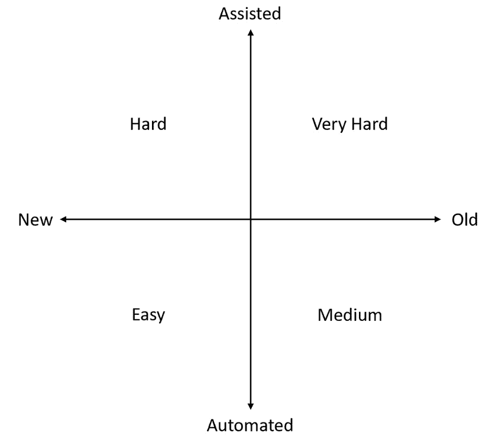

图 12.10–基于关键因素获得商业用户支持难度

你的解决方案越自动化，就越容易获得接受。毕竟，在引擎盖下运行的流程不受人类监督。没有人类手动决定每笔信用卡交易是否欺诈；这项任务只能通过自动化流程来完成。

由于一开始就没有人在循环中，所以在尝试使用 ML 模型改进自动化流程时，你不太可能遇到阻力。相反，当你尝试用 AI 生成的预测来增强人类决策者的决策时，你很可能会遇到怀疑和阻力。

同样，全新的解决方案比替换旧解决方案的工具更容易被接受。虽然用 AI 解决方案替换现有的自动化系统也是如此，但当你在尝试替换高管和经理用来做决策的现有系统时，这一点更为明显。许多人对于他们不完全理解的变化反应迟缓。

在本节中，我们将介绍基于关键因素赢得信任并让商业用户采用基于 AutoML 的解决方案的策略。

## 让商业用户采用新的自动化解决方案

这很简单。想象一下，如果你的公司正在构建一个新的销售门户，他们希望创建一个系统，当在线购物者在你的网站上浏览商品时，自动为它们生成产品推荐。你提议构建一个推荐系统，使用 AutoML 训练 ML 模型，并使用托管在 AKS 上的实时评分端点对模型进行评分。

很可能，你对提案的回应将会得到压倒性的积极反馈。你的高管团队会对你采用尖端 AI 技术的举措印象深刻。负责该项目的商业管理团队仅仅拥有一个高性能的解决方案就会感到高兴。你的 IT 部门会对学习新技术感兴趣，并且非常乐意帮助你实施一个新的大型项目。

如果有任何阻力，那将来自那些想要更好地理解你的 AI 解决方案工作原理的人。因此，建议你提供模型解释，以及 ML 和 AutoML 是如何工作的概述。如果人们能够向其他人解释它是如何工作的，他们更有可能支持你的项目，所以努力发展这种理解。

## 让企业替换旧的自动化流程

用基于 ML 的新解决方案替换旧的自动化解决方案比创建一个全新的流程要困难一些。这通常是因为商业用户已经理解了旧流程的工作方式。如果你试图替换一个基于一系列 if-then 语句的规则系统，这会更加困难，因为旧流程对人类来说更容易理解。

在这种情况下，你的最佳策略是将你的基于 AutoML 的新解决方案的结果与旧解决方案的结果并排比较几周或几个月。不要立即关闭旧流程；你应该同时运行这两个流程，直到你的最终用户确信并对你的 ML 模型的输出有信心。只有在这种情况下，你才应该关闭并永久关闭旧解决方案。

你可能认为解释 ML 和 AutoML 的工作原理将是你的最佳策略，但习惯于一个系统的最终用户可能会错误地假设 AI 的工作方式与旧解决方案相似。消除这种观念可能很困难，而且极端的方法差异可能会让一些用户失去信任。因此，在提供深入详细的解释之前，最好首先引导你的最终用户关注结果。一旦他们信任你的结果，他们自然会开放地接受这个过程。

## 让企业采用新的决策辅助工具

在向一群决策者提供 AI 生成的建议或预测时，一个关键的认识是，对于当前的问题，他们已经做出了多年的决策。他们可能还没有工具，但他们确实有自己的直觉和多年的经验。因此，他们通常对新工具或技术持怀疑态度，这些工具或技术声称可以帮助他们在工作中。记住，没有人是通过做出糟糕的决策而上升到公司高层的。

在这种情况下，最好的办法是试图通过向他们保证这只是一个提供预测或建议的工具来平息他们的恐惧。这是建议。它可能是 AI 生成的，但最终，建议就是建议，最终的决定仍然掌握在他们手中。

一个有用的类比是，在棋类世界中，AI 可能打败大师，但由 AI 辅助的大师可以打败 AI。人类最终仍然掌握着控制权。

你还应该强调 ML 生成的预测的统计性质。它们并不完美，也不是不可犯错的。如果你预测下个月市场份额将下降到 11.3%，置信区间为±0.2%，但实际上下降到 11.1%，那么你的模型是正确的，并且处于预期范围内。

如果你的模型告诉你某个篮球运动员有 70%的机会在你的球队中表现良好，但那个球员失败了，那么你的模型仍然是正确的，但 30%的机会发生了。

重要提示

在制作决策辅助的 AI，如大多数预测模型时，确保你的模型尽可能准确，并且不会在准确性上出现大幅波动非常重要。没有任何事情比一个波动很大的模型更快地失去信任。

通过强调你只提供建议，并且这些建议具有统计性质，你的模型有更高的可能性在长时间内被商业界使用。如果它只是建议，他们不会感到受到威胁，而且当统计上不太可能的事情发生时，他们也不会停止使用你的模型，因为他们理解这偶尔会发生。

## 让商业界替换旧决策辅助工具

在获得商业受众接受方面，最困难的项目之一是当你用 ML 驱动的工具替换一个旧的工具时。在这种情况下，你正在替换的工具可能已经存在了很多年。

许多经验丰富的用户可能会反对新的流程或解决方案，无论它如何改善当前状态。这是由于**熟悉度偏差**，即人类对熟悉事物比对不熟悉事物的偏好。

克服熟悉度偏差，并让商业用户采用你的解决方案是一项相当大的挑战，需要系统性地进行。首先，就像替换一个较旧的自动化流程一样，你不应该关闭旧解决方案；你需要让它继续运行，这样你才能对比结果。如果你不这样做，经验丰富的用户可能会负面且不公平地将你的工具与旧解决方案进行比较；他们需要看到这比旧解决方案有所改进。

比较结果并排是必要的，但不足以获得最终用户的接受。此外，你需要让用户理解你生成的 AutoML 解决方案。

对 AI 解决方案的一种常见批评是难以理解它们是如何工作的。相比之下，你正在替换的系统已经拥有了数年的时间来向其用户传授其细节。因此，你应该将可解释性幻灯片放在你的解决方案的最前沿；你还应该解释架构，并确切地说明 AutoML 是如何工作的，你计划何时重新训练模型，以及你计划如何持续评估和监控解决方案。

逐个建立信任的方法对你的解决方案的成功也大有裨益。在你与所有最终用户分别进行一系列一对一会议之后，再向整个团队展示你的解决方案。

如果最终用户太多，识别并会见群体中最有影响力的人。通过解决他们的担忧，对他们进行解决方案培训，并鼓励他们与其他最终用户交谈，你将能够建立一个支持你的解决方案的群体，增加其长期成功的可能性。

按难度顺序，从最容易到最困难，以下是获得最终用户信任并保证长期采用解决方案类型的列表：为新自动化流程设计的 AutoML 解决方案，替代自动化流程的 AutoML 解决方案，帮助人类做出决策的 AutoML 解决方案，替代现有决策辅助工具的 AutoML 解决方案。以下表格提供了总结：

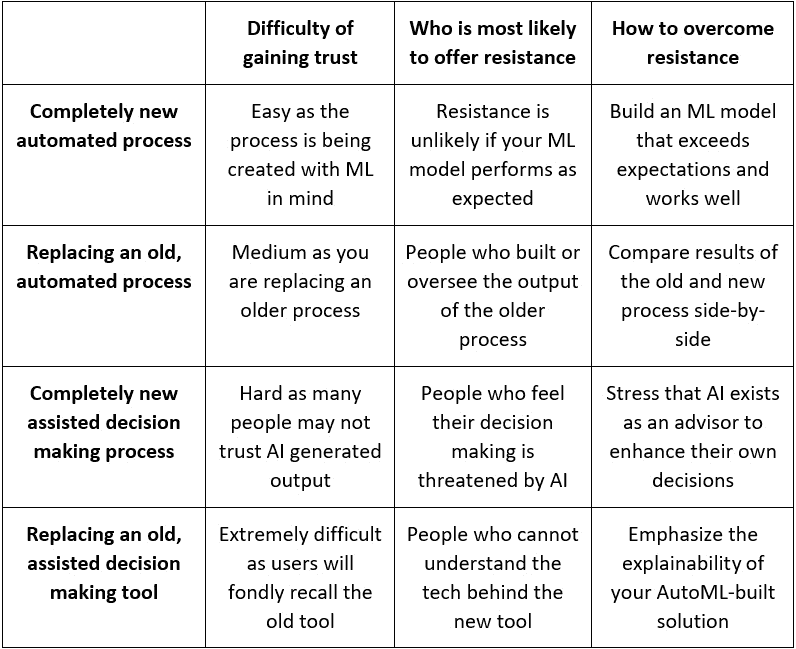

图 12.11 – 基于 AutoML 解决方案类型如何建立信任

如您所见，仅仅因为你构建了一个高性能的 AutoML 解决方案，并不意味着它会被业务采用。你还需要同样努力地赢得最终用户的信任。通过确定你正在构建的 AutoML 解决方案类型并遵循适当的指南，你将能够一次赢得一个最终用户的信任。一旦足够多的人支持你的解决方案，它将朝着成为长期成功和采用的信任工具集迈进。

# 摘要

获得最终用户的接受可能很困难，但采用正确的方法可以使这变得容易得多。通过向最终用户展示架构图，仔细地使用正确的指标向他们解释模型的性能，并花时间解释模型用于做出预测的特征，这些都是向最终用户销售你的解决方案的关键。此外，你可以根据你正在构建的解决方案类型定制你的信息，以赢得最终用户的信任。

你现在已到达本书的结尾，我希望你能回顾这段旅程。你已经掌握了许多技术技能，包括训练 AutoML 模型、批量部署 AutoML 模型进行评分以及实时评分，以及设计、创建和实施全栈式 AutoML 解决方案的能力。你还有一套方法向你的商业伙伴推销这些解决方案，赢得他们的信任，并最终实现价值。通过在 Azure 上使用 AutoML 构建强大的解决方案，你将能够产生持久的影响并推进你的职业生涯。
