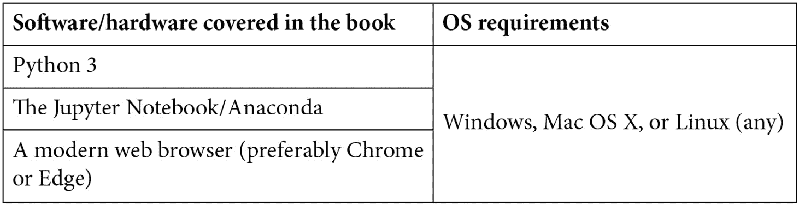
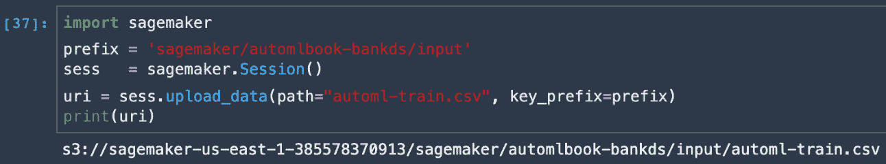

# 前言

每个机器学习工程师都要处理具有超参数的系统，**自动机器学习**（**AutoML**）中最基本的任务就是自动设置这些超参数以优化性能。最新的深度神经网络具有广泛的超参数，用于其架构、正则化和优化，这些超参数可以有效地定制以节省时间和精力。

本书回顾了自动特征工程、模型和超参数调整、基于梯度的方法等技术的基础，你将探索在不同开源工具中实现这些技术的不同方式。接下来，你将专注于企业工具，了解在三大云服务提供商——**Microsoft Azure**、**Amazon Web Services**（**AWS**）和**Google Cloud Platform**（**GCP**）——中实现 AutoML 的不同方式。随着你的进步，你将通过使用 AutoML 构建机器学习模型来探索云 AutoML 平台的功能。后面的章节将展示如何通过自动化机器学习开发生命周期中耗时且重复的任务来开发准确模型。

到这本书的结尾，你将能够构建和部署既准确又能提高生产力、允许互操作性和最小化特征工程任务的 AutoML 模型。

# 本书面向的对象

公民数据科学家、机器学习开发者、AI 爱好者或任何希望利用开源工具、Microsoft Azure Machine Learning、AWS 和 Google Cloud Platform 提供的功能自动构建机器学习模型的人会发现这本书很有用。

# 本书涵盖的内容

*第一章*，*自动机器学习概览*，通过为新手提供坚实的概述并为经验丰富的机器学习从业者提供参考，详细介绍了 AutoML 方法。本章从机器学习开发生命周期开始，探讨了 AutoML 解决的问题——超参数优化问题。

*第二章*，*自动机器学习、算法和技术*，允许公民数据科学家在没有丰富经验的情况下构建 AI 解决方案。在本章中，我们根据三个类别回顾了 AutoML 的当前发展：**自动特征工程**（**AutoFE**）、**自动模型和超参数学习**（**AutoMHL**）和**自动深度学习**（**AutoDL**）。这三个类别中采用的最新技术包括贝叶斯优化、强化学习、进化算法和基于梯度的方法。在本章中，我们将总结流行的 AutoML 框架，并以 AutoML 当前面临的开放挑战结束。

*第三章*, *使用开源工具和库进行自动化机器学习*，介绍了自动化预测模型从构思、概念化、开发到部署整个生命周期的 AutoML 开源软件（OSS）工具和库。从数据准备到模型训练、验证以及部署，这些工具几乎无需人工干预就能完成所有工作。在本章中，我们将回顾主要的 OSS 工具，包括 TPOT、AutoKeras、Auto-Sklearn、Featuretools、H2O AutoML、Auto-PyTorch、Microsoft NNI 和 Amazon AutoGluon，并帮助您理解每个库中使用的不同价值主张和方法。

*第四章*, *Azure 机器学习入门*，介绍了 Azure 机器学习，它利用 Windows Azure 平台和服务的能力来加速端到端机器学习生命周期。在本章中，我们将回顾如何开始使用企业级机器学习服务来构建和部署模型，以加快开发人员和数据科学家构建、训练和部署机器学习模型的速度。通过示例，我们将为构建和部署 AutoML 解决方案打下基础。

*第五章*, *使用 Microsoft Azure 进行自动化机器学习*，详细介绍了如何使用 Azure 机器学习堆栈自动化模型开发的耗时和迭代任务，并使用 Azure AutoML 执行回归、分类和时间序列分析等操作。本章将使您能够执行超参数调整，以找到最佳参数，并使用 Azure AutoML 找到最佳模型。

*第六章*, *使用 Amazon Web Services 进行机器学习*，涵盖了 Amazon SageMaker Studio、Amazon SageMaker Autopilot、Amazon SageMaker Ground Truth 和 Amazon SageMaker Neo，以及 AWS 提供的其他 AI 服务和框架。除了超大规模云服务提供商之外，AWS 还提供了一组最广泛和最深入的机器学习服务和支持云基础设施，将机器学习的能力交到每一位开发人员、数据科学家和专家实践者的手中。AWS 提供机器学习服务、AI 服务、深度学习框架和学习工具，以快速构建、训练和部署机器学习模型。

*第七章*, *使用 Amazon SageMaker Autopilot 进行自动化机器学习*，带我们深入探索 Amazon SageMaker Studio，使用 SageMaker Autopilot 运行多个候选方案，以确定数据预处理步骤、机器学习算法和超参数的最佳组合。本章提供了一个动手的、说明性的概述，用于训练推理管道，以便轻松部署到实时端点或批量处理。

*第八章*, *使用 Google Cloud Platform 进行机器学习*，回顾了谷歌的 AI 和机器学习产品和服务。谷歌云在可信和可扩展的平台基础上提供创新的机器学习产品和服务。这些服务包括 AI Hub、AI 构建块如视觉、语言、对话和结构化数据服务，以及 AI 平台。在本章中，您将熟悉这些产品和服务，并了解 AI 平台如何支持 Kubeflow，谷歌的开源平台，它允许开发者使用 TensorFlow、TPUs 和 TFX 工具等前沿谷歌 AI 技术构建可移植的机器学习管道，并将您的 AI 应用程序部署到生产环境中。

*第九章*, *使用 GCP Cloud AutoML 进行自动化机器学习*，展示了如何通过最小努力和机器学习专业知识来训练定制的业务特定机器学习模型。通过实际案例和代码讲解，我们将探索 Google Cloud AutoML 平台，以创建自然语言、视觉、非结构化数据、语言翻译和视频智能的定制深度学习模型，无需任何数据科学或编程知识。

*第十章*, *企业中的 AutoML*，将 AutoML 在企业环境中呈现为一个通过生成包含数据分析、预测模型及其性能比较的完全自动化的报告来自动化数据科学的系统。AutoML 的一个独特之处在于它提供了适合机器学习非专家的自然语言描述。我们强调通过讨论在实际问题上表现良好的方法以及确定最佳整体方法来操作 MLOps 管道。本章详细介绍了现实世界挑战背后的想法和概念，并提供了解决这些问题的路线图。

# 为了充分利用这本书

这本书是 AutoML 的入门指南。熟悉数据科学、机器学习和深度学习方法将对理解 AutoML 如何改进现有方法有所帮助。

**如果你使用的是本书的数字版，我们建议你亲自输入代码或通过 GitHub 仓库（下一节中提供链接）访问代码。这样做将有助于你避免与代码的复制和粘贴相关的任何潜在错误。**

# 下载彩色图像

我们还提供了一个包含本书中使用的截图/图表的彩色 PDF 文件。您可以从这里下载：[`static.packt-cdn.com/downloads/9781800567689_ColorImages.pdf`](https://static.packt-cdn.com/downloads/9781800567689_ColorImages.pdf)。

# 使用的约定

本书使用了多种文本约定。

**文本中的代码**: 表示文本中的代码单词、数据库表名、文件夹名、文件名、文件扩展名、路径名、虚拟 URL、用户输入和 Twitter 昵称。以下是一个示例：“从`amazonsagemaker-examples/autopilot`文件夹中打开`autopilot_customer_churn`笔记本。”

代码块设置如下：

**粗体**: 表示新术语、重要单词或屏幕上看到的单词。例如，菜单或对话框中的单词在文本中显示如下。以下是一个示例：“从 Amazon SageMaker Studio 开始，通过点击**Python 3**按钮来启动数据科学笔记本。”

小贴士或重要注意事项

显示如下。

# 联系我们

我们欢迎读者的反馈。

**一般反馈**: 如果您对本书的任何方面有疑问，请在邮件主题中提及书名，并通过 customercare@packtpub.com 与我们联系。

**勘误**: 尽管我们已经尽一切努力确保内容的准确性，但错误仍然可能发生。如果您在这本书中发现了错误，我们将不胜感激，如果您能向我们报告，我们将非常感谢。请访问[www.packtpub.com/support/errata](http://www.packtpub.com/support/errata)，选择您的书籍，点击勘误提交表单链接，并输入详细信息。

**盗版**: 如果你在互联网上以任何形式遇到我们作品的非法副本，如果你能提供位置地址或网站名称，我们将不胜感激。请通过版权@packt.com 与我们联系，并提供材料的链接。

**如果您有兴趣成为作者**: 如果您在某个主题上具有专业知识，并且您有兴趣撰写或为本书做出贡献，请访问[authors.packtpub.com](http://authors.packtpub.com)。

# 评论

请留下评论。一旦您阅读并使用过本书，为何不在您购买它的网站上留下评论？潜在的读者可以查看并使用您的客观意见来做出购买决定，Packt 公司可以了解您对我们产品的看法，我们的作者也可以看到他们对书籍的反馈。谢谢！

有关 Packt 的更多信息，请访问[packt.com](http://packt.com)。
