# 第五章：使用微软 Azure 进行自动化机器学习

“迄今为止，人工智能最大的危险是人们过早地得出他们理解它的结论。”

– 以利亚泽·尤德科夫斯基

微软 Azure 平台及其相关工具集种类繁多，是更大企业生态系统的一部分，这是一个不容忽视的力量。它通过改善沟通、资源管理和促进高级可操作分析来加速增长，使企业能够专注于他们最擅长的事情。在前一章中，您被介绍到 Azure 机器学习平台及其服务。您学习了如何开始使用 Azure 机器学习，并使用微软 Azure 平台及其服务瞥见了端到端机器学习生命周期。这实际上是（在非字面意义上的词）冰山一角。

在本章中，我们将通过了解微软 Azure 中的**自动化机器学习**（**AutoML**）来开始。您将构建一个分类模型，并使用 Azure 的 AutoML 功能进行时间序列预测。本章将为您提供构建和部署 AutoML 解决方案所需的所有技能。

在本章中，我们将涵盖以下主题：

+   微软 Azure 中的 AutoML

+   使用 Azure AutoML 和 JupyterLab 进行时间序列预测

让我们开始吧！

# 微软 Azure 中的 AutoML

在 Azure 平台中，AutoML 被视为一等公民。特征工程、网络架构搜索和超参数调整的基本思想与我们在*第二章*“自动化机器学习、算法和技术”和*第三章*“使用开源工具和库进行自动化机器学习”中讨论的内容相同。然而，用于民主化这些技能的抽象层使它们对非机器学习专家更具吸引力。

Azure 平台中 AutoML 的关键原则如下所示图所示。用户输入，如数据集、目标指标和约束（作业运行时间、计算分配的预算等）驱动 AutoML“引擎”，通过迭代找到最佳模型，并根据**训练成功**的分数对其进行排名：

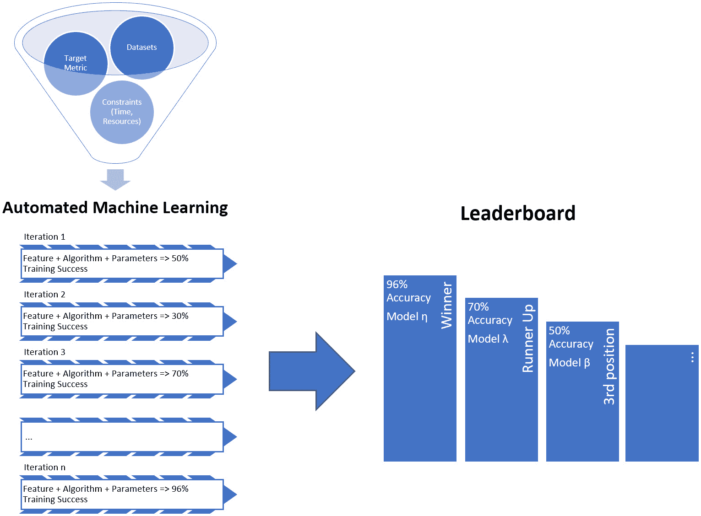

Figure 5.1 – Azure AutoML workflow – how AutoML works

在本节中，我们将提供 AutoML 方法的逐步说明。在*第四章*“开始使用 Azure 机器学习”中，您看到了 Azure 机器学习的主页。在那里，我们创建了一个分类模型，并使用笔记本对其进行测试：

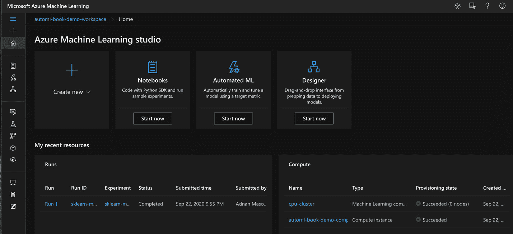

Figure 5.2 – Azure Machine Learning portal

现在，让我们探索基于 AutoML 的模型开发在训练和调整模型时的运作方式：

1.  从 Azure 门户，点击 **自动机器学习** | **立即开始**。您将被带到以下屏幕，在那里您可以创建一个新的自动机器学习运行：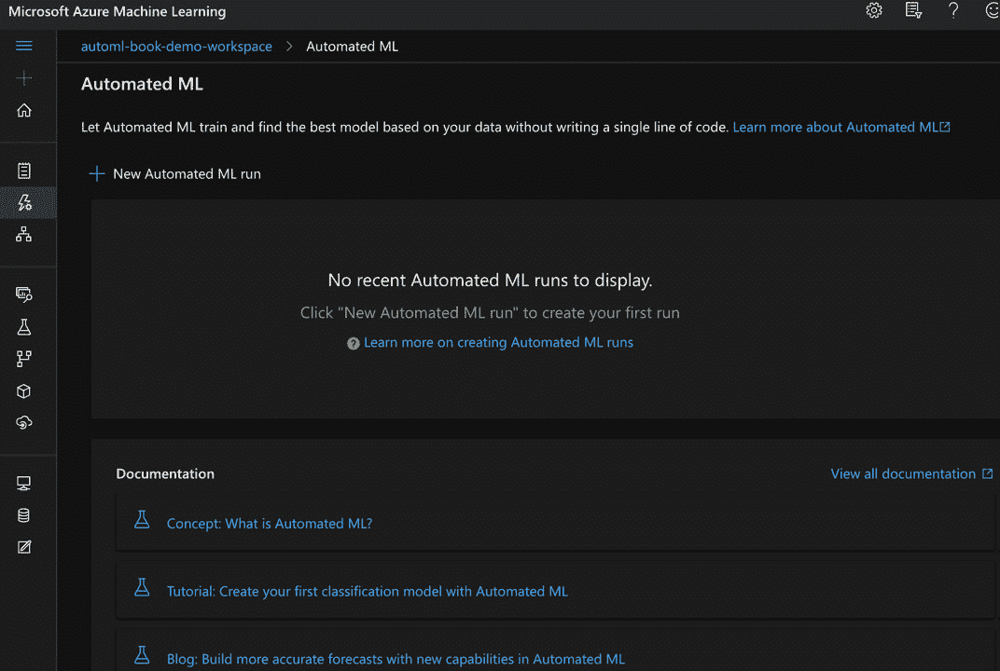

    图 5.3 – Azure 机器学习 – 创建自动机器学习运行

1.  创建自动机器学习运行的第一步是选择要工作的数据集。在这里，您可以选择创建自己的数据集，或者——更好的是——从 Azure 提供的公共数据集存储库中选择现有的一个：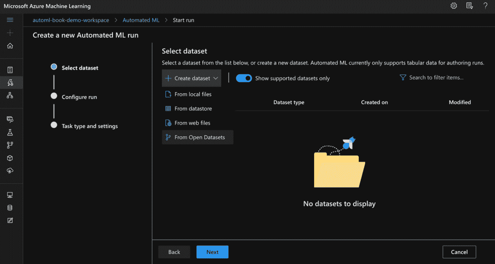

    图 5.4 – AutoML 数据集选择页面

1.  可以从开放数据集中创建数据集。在这种情况下，我们将使用我们经过测试的 MNIST 数据集来创建 AutoML 运行，如下面的截图所示：

    MNIST 数据集

    Yann LeCun（纽约大学柯朗研究所）和 Corinna Cortes（纽约谷歌实验室）拥有 MNIST 数据集的版权，该数据集是原始 NIST 数据集的派生作品。MNIST 数据集已在 Creative Commons Attribution-Share Alike 3.0 许可证下提供。

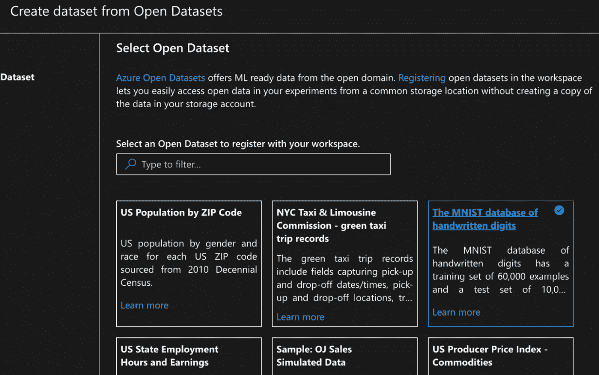

图 5.5 – 从开放数据集创建数据集页面

一旦您选择了数据集，它将作为您运行的一部分出现，您还可以预览它。除了指定数据集的版本外，您还可以指定您是否希望使用整个数据集，或者它应该注册为表格数据源或文件类型数据源：

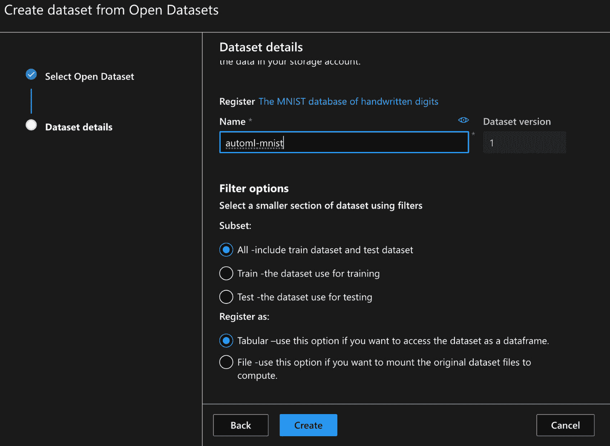

图 5.6 – 来自 Azure 机器学习数据集存储库的精选数据集

选择 **创建** 后，您将看到以下屏幕，因为数据集已成为您运行的一部分：

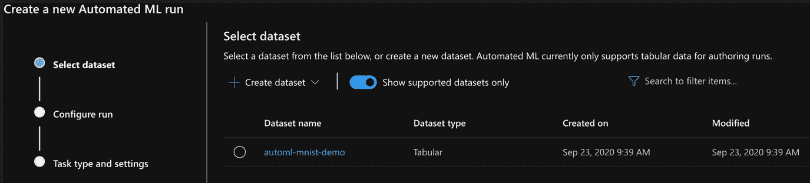

图 5.7 – 来自 Azure 机器学习数据集存储库的精选数据集

如果您点击数据集的名称，MNIST 数据集也可以作为数据预览的一部分查看，如下面的截图所示：

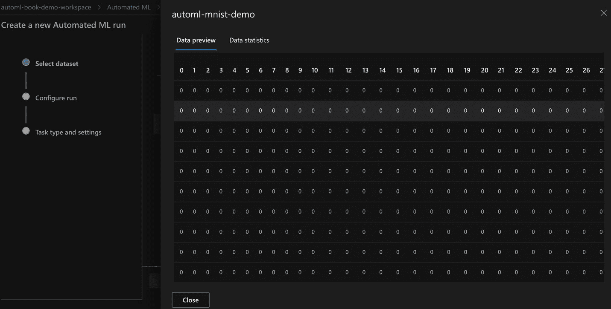

图 5.8 – 来自 Azure 机器学习数据集存储库的精选数据集的预览

让我们面对现实——这个 MNIST 像素数据集的预览并不那么令人兴奋，但如果您有一些更具代表性的数据（如医疗保健、零售或金融数据等），预览将帮助我们了解数据导入过程进行得很好，我们没有运行分隔符灾难的风险。

类似地，数据统计在以下屏幕截图中显示。如果你熟悉 pandas，可以将其视为 `describe()` 功能。由于其基于图像的特性，这并不完全相关，但当我们在本章后面使用一些其他数据集时，它却非常有用：

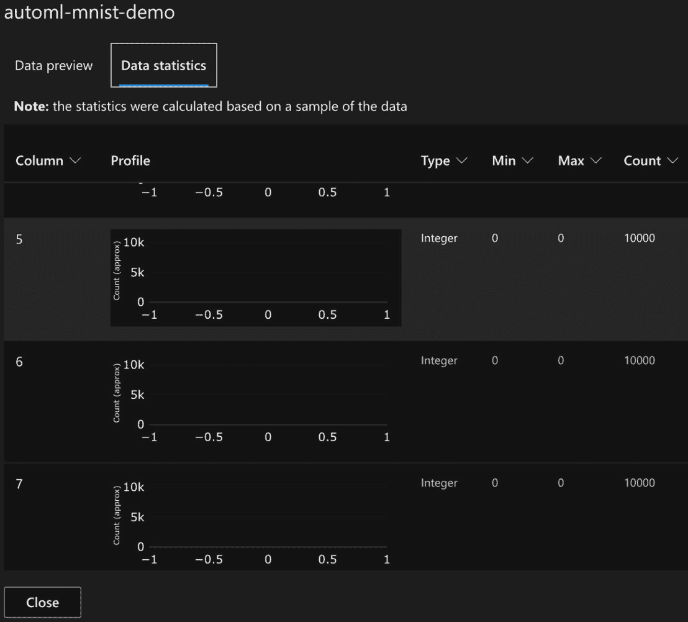

图 5.9 – Azure AutoML 中数据统计的预览

1.  现在我们已经选择了数据集，我们可以通过提供实验名称、目标列（用于训练和分类的标记特征）和计算集群来配置运行，如下面的屏幕截图所示：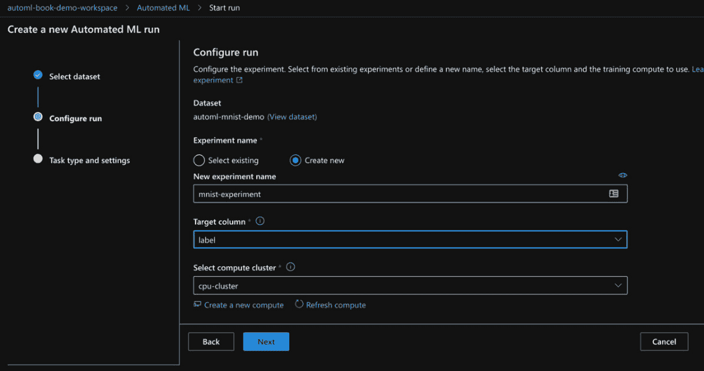

    图 5.10 – 配置 AutoML 运行

1.  第三步和最后一步是选择任务类型 – 分类、回归或时间序列预测。在这种情况下，我们根据关联的标签对数字进行分类。你将在未来的示例中学习如何使用其他任务类型：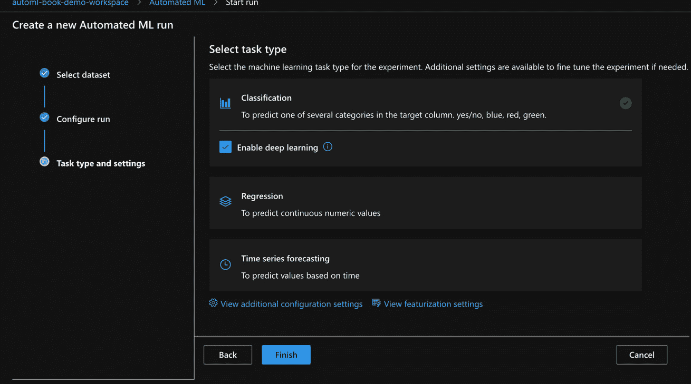

    图 5.11 – 选择 AutoML 运行的任务类型

1.  考虑额外的配置是很重要的。在这里，你可以选择主要指标、其可解释性、任何允许的算法（默认情况下，所有算法都允许）、退出标准和任何验证分割信息，如下面的屏幕截图所示：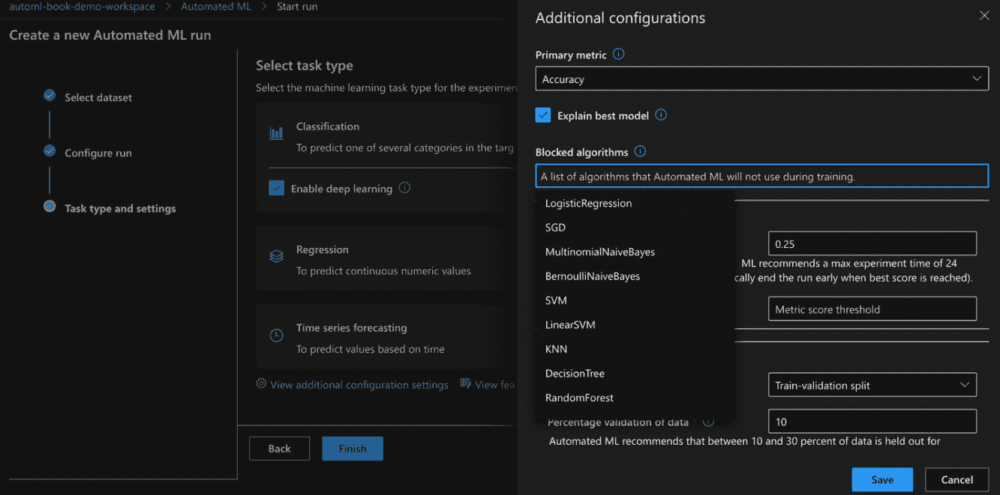

    图 5.12 – AutoML 运行的任务类型额外配置

    额外的配置根据任务类型而有所不同。以下屏幕截图显示了回归配置元素：

    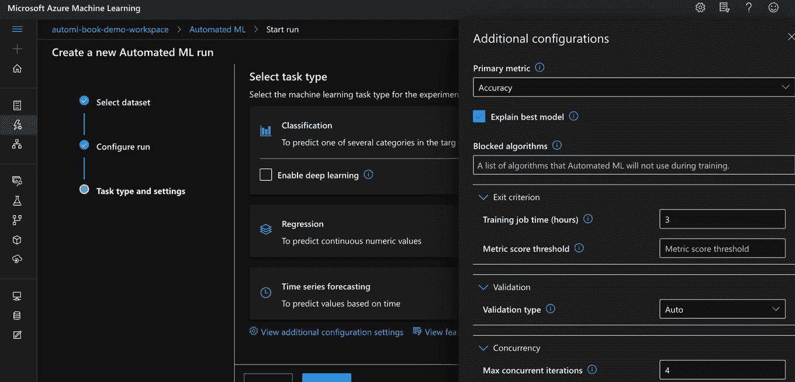

    图 5.13 – AutoML 运行的任务类型额外配置

    **特征化** – 即选择和转换特征 – 是你在处理数据集时需要考虑的重要因素。当你点击 **查看特征化设置** 链接时，Azure 机器学习会为你提供以下屏幕。从这里，你可以选择特征的类型，分配特定的数据类型，并指定你希望用哪些数据来填充特征：

    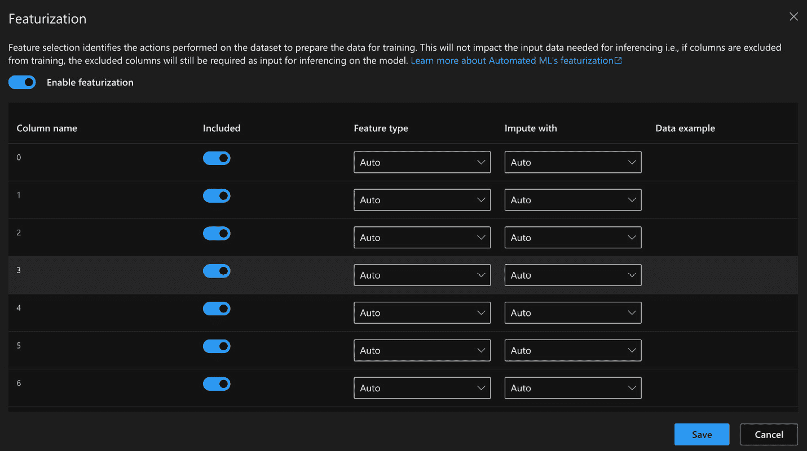

    图 5.14 – AutoML 运行的特征化

    **自动特征化** – 即将不同的数据类型转换为数值向量 – 是任何数据科学工作流程的典型部分。以下图表显示了在特征化开启时自动应用于数据集的技术（参见前一个截图顶部的蓝色切换按钮）。以下图表显示了自动特征化过程中采取的一些关键步骤。您可以在[`docs.microsoft.com/en-us/azure/machine-learning/how-to-configure-auto-features`](https://docs.microsoft.com/en-us/azure/machine-learning/how-to-configure-auto-features)了解更多关于枚举的特征化技术。

    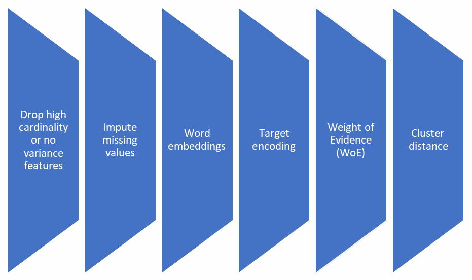

    图 5.15 – AutoML 运行的特征化方法

    **缩放**和**归一化**（有时也称为**正则化**和**标准化**）是处理将数据转换为共同值范围的两种重要特征化方法。以下图表显示了自动特征化算法中使用的缩放和归一化技术。您可以在[`docs.microsoft.com/en-us/azure/machine-learning/how-to-configure-auto-features`](https://docs.microsoft.com/en-us/azure/machine-learning/how-to-configure-auto-features)了解更多关于各种枚举的缩放和特征化技术。

    

    图 5.16 – Azure AutoML – 缩放和特征化

    在不提及护栏的情况下，特征化的话题就不完整。数据护栏是 AutoML 引擎的一部分，有助于识别和解决数据集的问题，如缺失特征值、处理高基数特征（许多唯一值）、类别不平衡（少数类和异常值）等。以下图表概述了您应该熟悉的这些护栏。您可以在 Azure 文档中进一步了解这些护栏的详细信息（[`docs.microsoft.com/en-us/azure/machine-learning/how-to-configure-auto-features`](https://docs.microsoft.com/en-us/azure/machine-learning/how-to-configure-auto-features)）：

    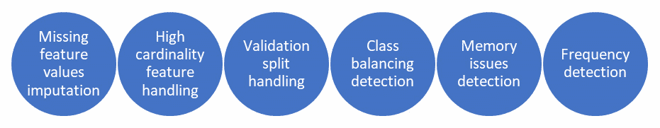

    图 5.17 – AutoML 运行的数据护栏

1.  现在，当您点击**完成**按钮，如图 5.10 所示，在设置任务类型和任何附加配置项的给定参数后，您将看到以下屏幕，该屏幕验证运行：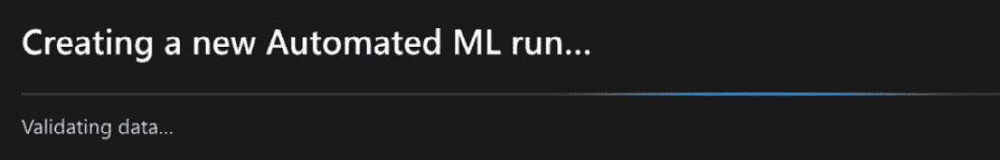

    图 5.18 – AutoML 运行的数据护栏

    需要记住的一个重要观点是，您需要有良好的计算资源来运行实验；否则，它将失败。例如，在这个实验中，我将训练时间设置为 0.25 小时；即 15 分钟。这对于给定的计算资源来说时间不够，这意味着运行注定要失败，如下面的截图所示：

    ![Figure 5.19 – AutoML experiment run settings

    ![img/Figure_5.19_B16890.jpg]

    图 5.19 – AutoML 实验运行设置

    以下截图显示，由于我们没有为运行 AutoML 实验分配正确的计算资源，它失败了：

    ![Figure 5.20 – AutoML experiment run failure message

    ![img/Figure_5.20_B16890.jpg]

    图 5.20 – AutoML 实验运行失败信息

    以下错误信息详细说明了用户错误，以及可能的解决方案，例如增加计算资源、应用实验超时以及进行数据集采样更改：

    ![Figure 5.21 – AutoML experiment run failure message

    ![img/Figure_5.21_B16890.jpg]

    图 5.21 – AutoML 实验运行失败信息

    将时间限制增加到 5 小时会有所帮助，正如您将在以下步骤中看到的那样。Azure AutoML 现在已经拥有了足够的时间和资源来执行多个实验。这教会了您，在时间和/或资源上节省成本并不是一个好的 AutoML 策略。

1.  在 AutoML 子运行的下个屏幕中显示了单个迭代。它清楚地展示了如何使用不同的数据预处理方法，如 `StandardScalerWrapper`、`RobustScaler` 和 `MaxAbsScaler`/`MinMaxScaler`，以及预测算法，如 `RandomForest`、`LightGB`、`ElasticNet`、`DecisionTree` 和 `LassoLars`。以下截图中的运行 `54` 和 `53` 展示了如何通过点击相关的标签查看集成算法及其权重：![Figure 5.22 – AutoML experiment run details

    ![img/Figure_5.22_B16890.jpg]

    图 5.22 – AutoML 实验运行详情

1.  点击 **模型** 标签，可以看到哪个模型提供了什么程度的准确度以及它关联的运行，如下面的截图所示：

![Figure 5.23 – AutoML experiment run details

![img/Figure_5.23_B16890.jpg]

图 5.23 – AutoML 实验运行详情

运行指标也是获取有关相关运行更详细信息的绝佳方式。例如，您可以看到算法的名称、相关的准确度、AUC 分数、精确度、F1 分数等：

![Figure 5.24 – AutoML experiment run details

![img/Figure_5.24_B16890.jpg]

图 5.24 – AutoML 实验运行详情

通过点击相应的标签，可以看到为保护数据质量所采取的数据边界措施，如下面的截图所示。此页面显示了为确保用于训练模型的输入数据质量高，使用了哪些边界技术：

![Figure 5.25 – AutoML experiment data guardrails

![img/Figure_5.25_B16890.jpg]

图 5.25 – AutoML 实验数据边界

从主运行摘要页面，您可以查看最佳模型及其总结的结果。在这种情况下，基于软投票的`VotingEnsemble()`方法是明显的赢家。它是 Azure AutoML 当前支持的两种集成方法之一。另一种是`StackEnsemble`，它从先前运行的迭代中创建集合。集成方法是用于结合多个模型以获得最佳结果的技巧；投票、堆叠、袋装和提升是集成方法的一些可用类别：

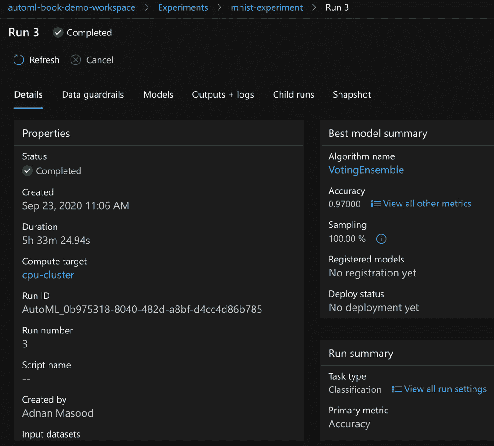

图 5.26 – AutoML 实验摘要页面

假设您已经跟随了这些实验，并亲自尝试了这些步骤，那么应该很明显，每次运行都有几个子运行——也就是说，每个模型都有单独的迭代。因此，当我们查看**运行**摘要页面的**指标**选项卡时，我们不仅看到不同的指标，还有一个精确度召回率图：

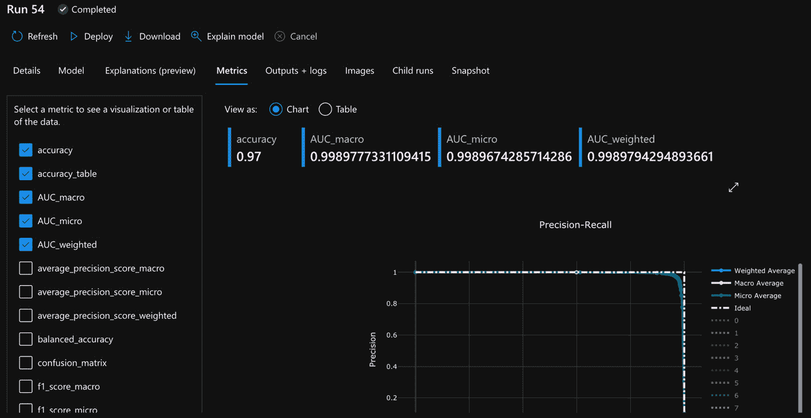

图 5.27 – AutoML 实验准确度指标和 PR 曲线

现在，让我们看看模型解释。机器学习模型的可解释性非常重要，尤其是在 AutoML 中。这是因为您作为领域专家，希望了解哪些特征在结果中发挥了关键作用。在下面的屏幕截图中，您可以看到一个表格形式的特征重要性解释，对于前*k*个特征，以及它们如何用于预测 0-9 的数字：

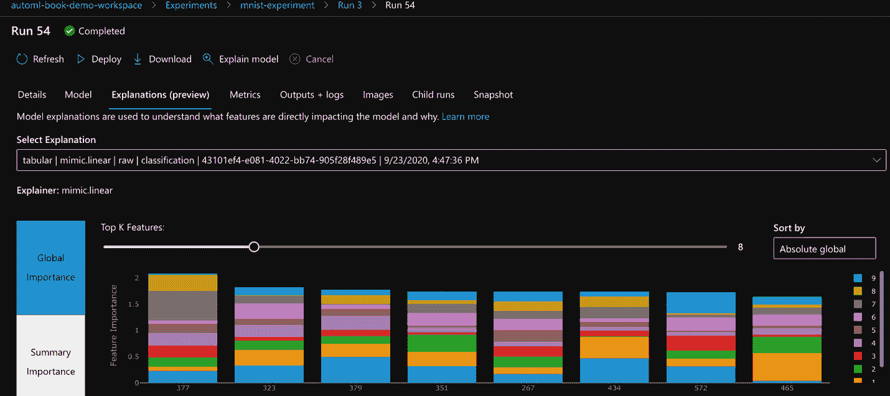

图 5.28 – AutoML 实验特征解释

上述截图显示了哪些特征在预测数字中扮演了什么角色。特征 377 在预测数字 7 时很重要，特征 379 和 434 在预测 9 时很重要，等等。这个 MNIST 数据集可能看起来与您无关，但让我们想象您正在查看一个 HR 招聘数据集，性别、种族或年龄成为重要的特征。这将引发警报，因为这会违反您的公司关于性别偏见、种族主义或年龄相关歧视的政策。这也可能违反法律，并且您可能会因为机器中的偏见而在合规性和声誉方面陷入严重麻烦。更不用说，基于与员工完成工作能力无关的属性进行歧视是不道德的（而且说实话是荒谬的）。

这种可解释性还提供了特征的摘要重要性，您可以可视化全局和局部特征中单个 k 特征的相对重要性。以下截图所示的蜂群图在非常细粒度级别上可视化相同的数据。它显示了 MNIST 数据集中元素的数量与它们对应的特征之间的一对一映射，类似于前一个截图中的表格表示：

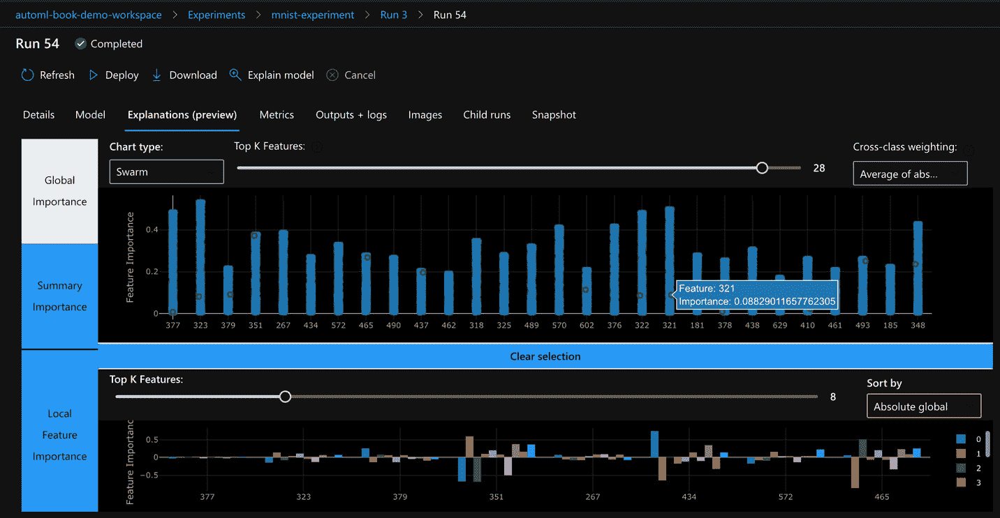

图 5.29 – Azure 机器学习 top k 特征摘要重要性图

在对自动机器学习分类的概述之后，让我们继续前进，并将相同的技巧应用于时间序列预测。

# 使用 AutoML 进行时间序列预测

预测能源需求是工业界的一个实际问题，能源供应商喜欢提前预测消费者的预期需求。在这个例子中，我们将使用纽约市能源需求数据集，该数据集可在公共领域获得。我们将使用历史时间序列数据并应用 AutoML 进行预测；即预测未来 48 小时的能源需求。

机器学习笔记本是 Azure 模型仓库的一部分，可以在 GitHub 上访问，网址为[`github.com/Azure/MachineLearningNotebooks/`](https://github.com/Azure/MachineLearningNotebooks/)。让我们开始吧：

1.  在您的本地磁盘上克隆上述 GitHub 仓库并导航到`forecasting-energy-demand`文件夹：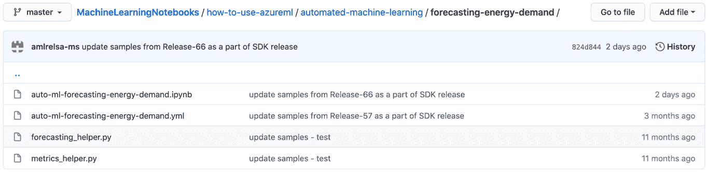

    图 5.30 – Azure 机器学习笔记本 GitHub 仓库

1.  点击以下截图所示的 Azure 笔记本仓库中的`forecasting-energy-demand`文件夹：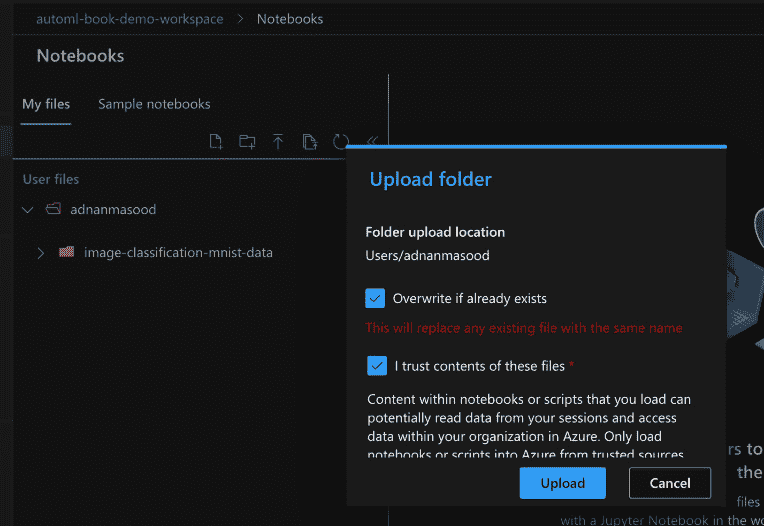

    图 5.31 – 在 Azure 机器学习笔记本工作区上传文件夹

1.  一旦文件夹上传完成（参见以下截图左侧的文件），双击`ipynb`（笔记本）文件并打开它。您将看到以下屏幕：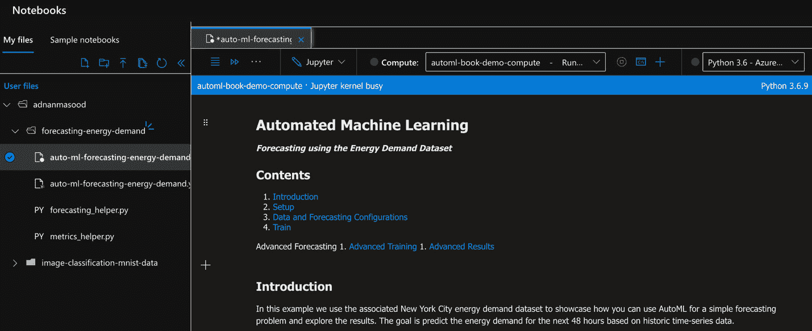

    图 5.32 – 在 AutoML 笔记本工作区上传文件

1.  现在，通过点击相应的下拉菜单，如图以下截图所示，在 JupyterLab 中打开它。重要的是要记住，尽管您在 JupyterLab 中运行文件，但自动机器学习实验是在 Azure 机器学习工作区中运行的，您始终可以跟踪并查看那里的每个实验。这展示了与第三方工具无缝集成的强大功能：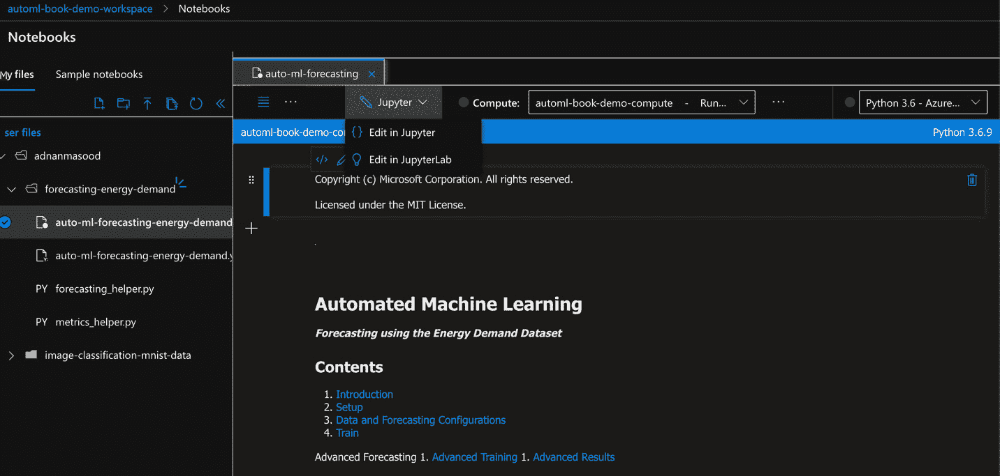

    图 5.33 – 在 AutoML 笔记本工作区上传文件并在 JupyterLab 中打开

    现在，文件正在一个非常熟悉的环境中运行，内核是 Python 3.6 – Azure 机器学习运行时。这种与笔记本的无缝集成是 Azure 机器学习的一个强大功能：

    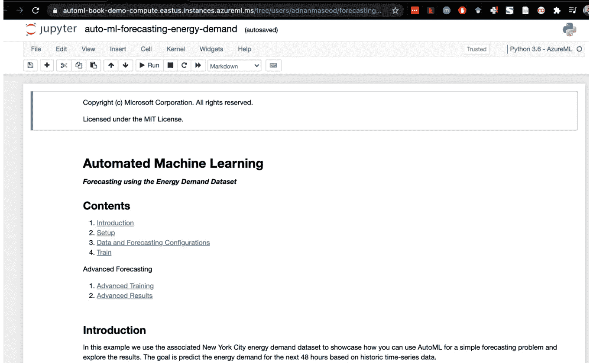

    图 5.34 – 在 AutoML 笔记本工作区上传文件并在 JupyterLab 中打开

    由于我们正在处理时间序列数据，值得注意的是 Azure AutoML 提供了各种原生时间序列以及深度学习模型来支持与时间序列相关的分析工作负载。以下截图显示了这些算法的列表：

    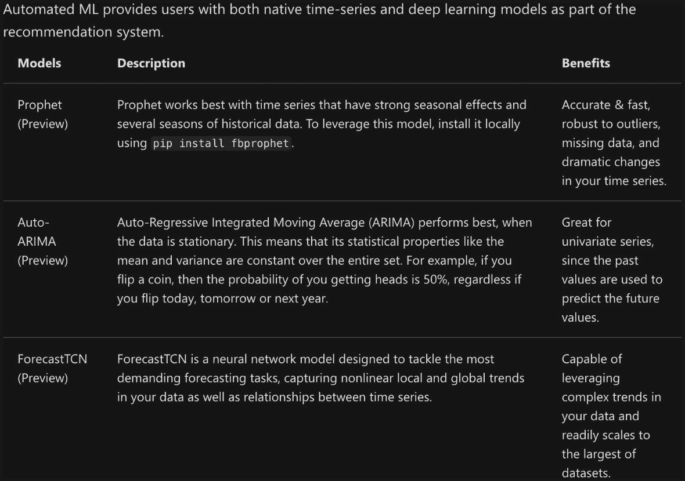

    图 5.35 – Azure AutoML 时间序列功能

    Azure 自动化机器学习提供了各种回归、分类和时间序列预测算法以及评分机制，并且您可以始终添加自定义指标。以下截图显示了 Azure AutoML 分类、回归和时间序列预测算法和措施的列表：

    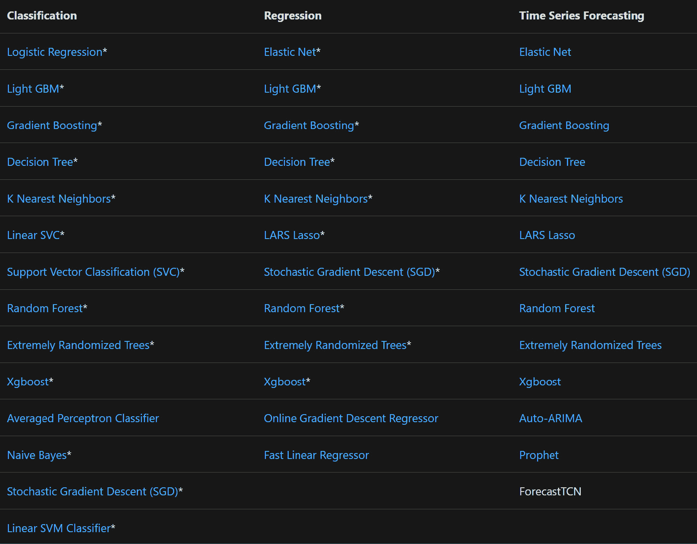

    图 5.36 – Azure AutoML 分类、回归和时间序列预测算法

    以下是一系列用于衡量上述方法准确性的指标：

    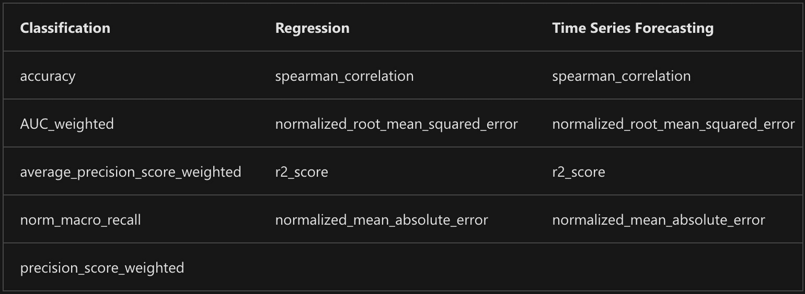

    图 5.37 – Azure AutoML 的分类、回归和时间序列预测度量

1.  快速浏览一下样板设置代码，我们可以通过设置目标列为目标和将时间列的名称设置为时间戳来设置实验。完成这些操作后，数据将被下载并成为 pandas DataFrame 的一部分，如下面的截图所示：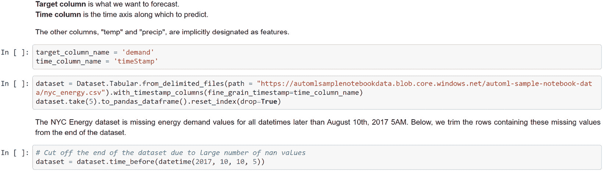

    图 5.38 – 在笔记本中为纽约市电力供应加载数据

1.  现在，让我们将数据拆分为训练集和测试集：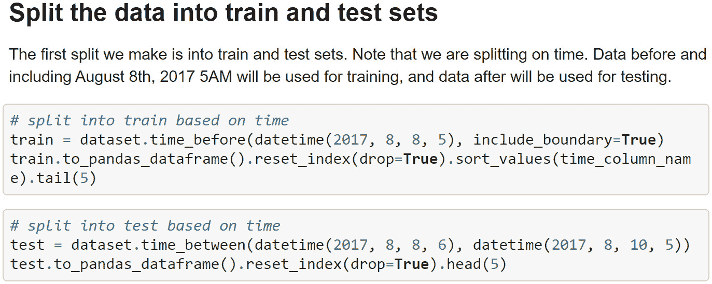

    图 5.39 – 在笔记本中为纽约市电力供应进行数据拆分

1.  在这个练习中，您将必须设置的一个关键参数是预测范围；也就是说，您希望预测多远未来的数据。自动化机器学习算法足够智能，可以根据数据集的时间序列频率知道使用什么单位（小时、天数或月份）。根据我们的业务问题，我们将预测范围设置为 `48`（小时）并提交作业，如下面的截图所示：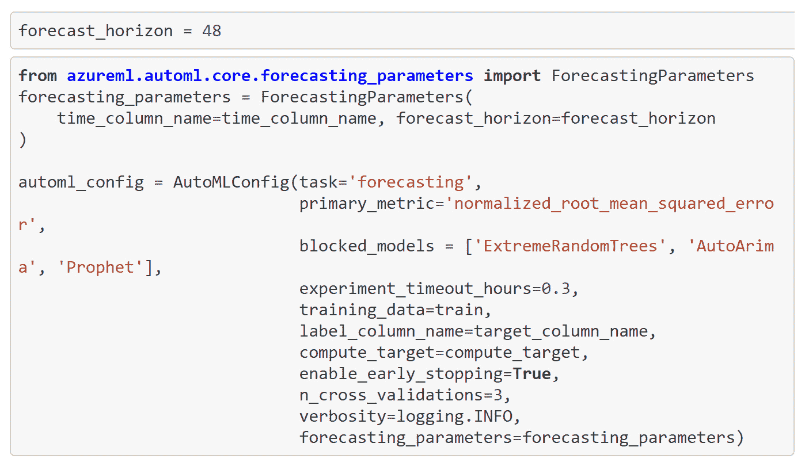

    图 5.40 – 为预测作业创建 AutoML 配置

1.  现在我们已经创建了配置，让我们提交实验，如下所示屏幕截图所示：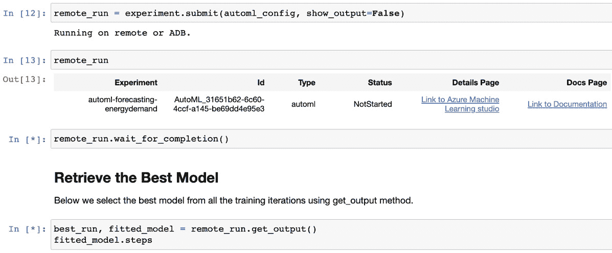

    图 5.41 – 将 AutoML 实验提交到远程服务器执行

1.  要演示 Jupyterlab 与 Azure Machine Learning 服务的集成，请点击 ML 服务门户中的 **实验** 选项卡，如下所示屏幕截图。在这里，您可以看到实验已被提交，现在正准备使用关联的配置运行 AutoML 参数：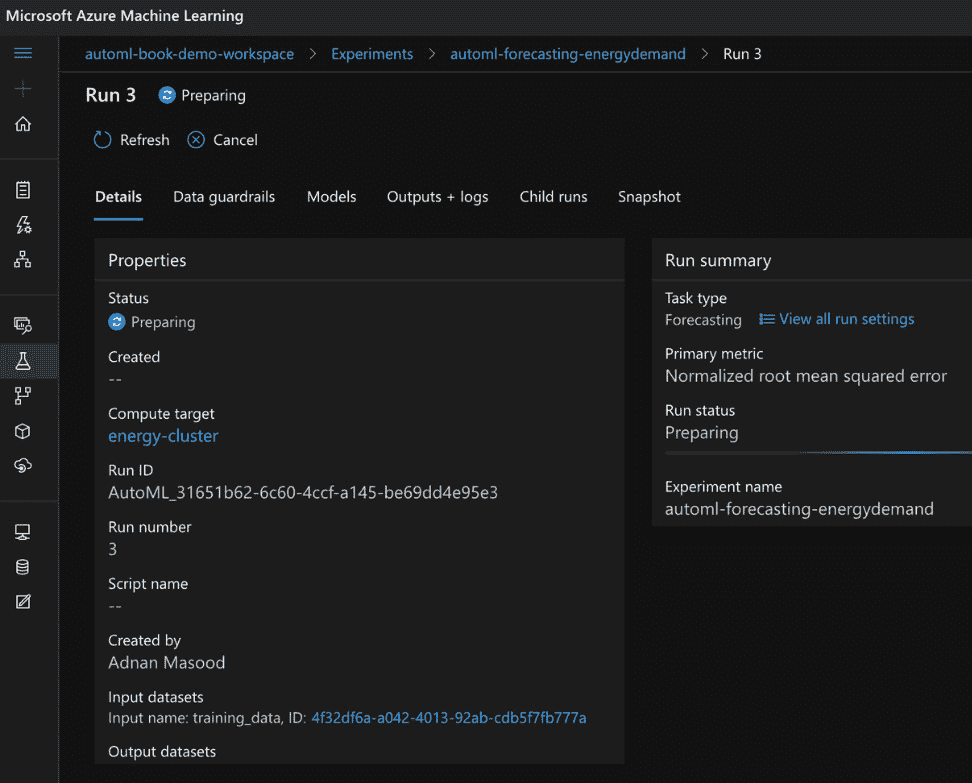

    图 5.42 – 在远程服务器上进行的 AutoML 实验的实验面板视图

    当您等待作业完成时，AutoML 配置元素也可以作为笔记本的一部分观察到：

    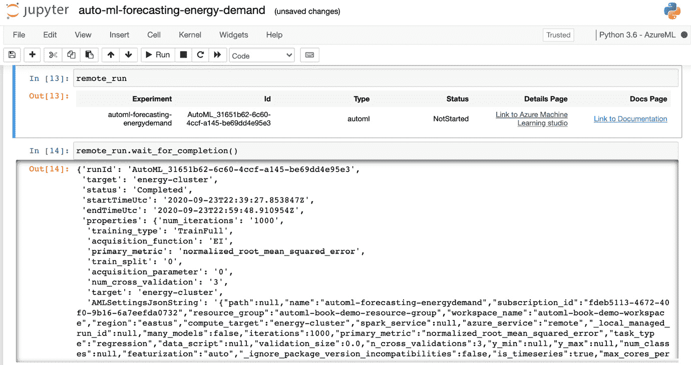

    图 5.43 – 提交作业后运行 wait_for_completion() 方法的笔记本

1.  笔记本与相应实验之间的这种内在集成也可以在以下屏幕截图中看到。在这里，我们可以看到 **实验** 笔记本如何在实验控制台中反映：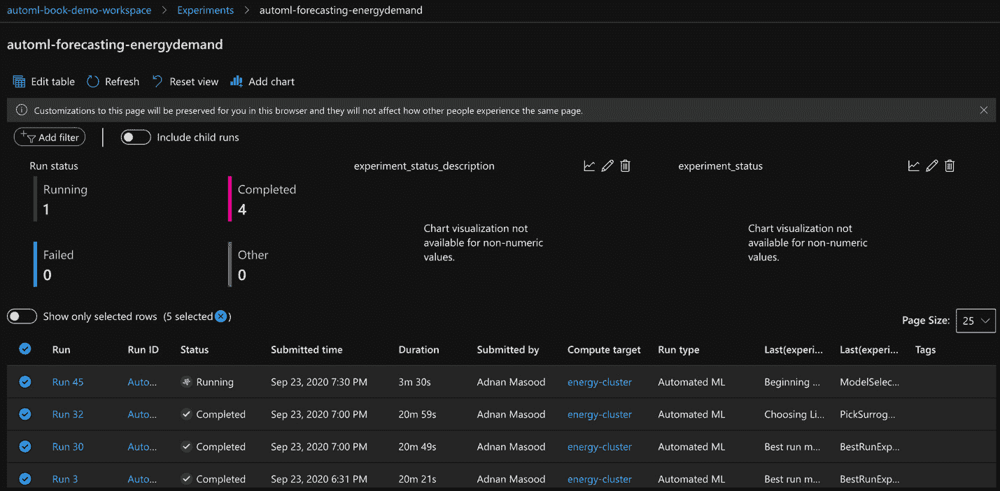

    图 5.44 – 在 Azure Machine Learning 的实验面板中显示的笔记本中的实验

    每次运行都会概述算法的名称和错误详情，并显示出错误率的持续降低。以下屏幕截图显示了 MNIST 分类中归一化 RMSE 和准确度指标：

    

    图 5.45 – 在 Azure Machine Learning 的实验面板中显示的笔记本中的实验

    数据护栏类型也值得关注。在以下屏幕截图中，您可以看到它们与我们之前在分类练习中使用的护栏不同。在这种情况下，数据通过频率检测和缺失特征值插补进行验证。AutoML 引擎足够智能，能够学习针对不同类型实验和数据集需要应用哪些类型的护栏：

    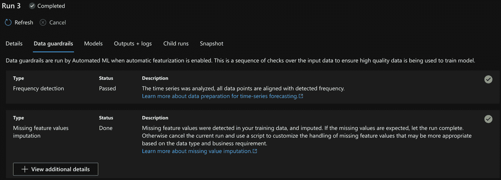

    图 5.46 – Azure Machine Learning 实验面板的护栏

1.  现在实验已完成，我们可以在笔记本中检索最佳模型，如下所示屏幕截图（或如果您更倾向于视觉方式，在机器学习服务控制台中）：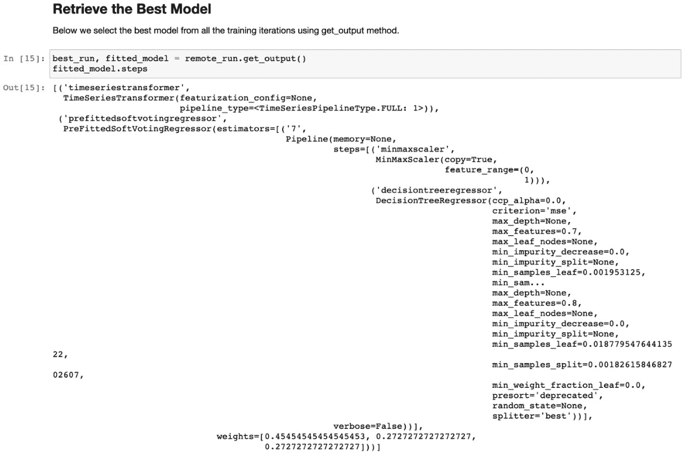

    图 5.47 – 笔记本中的模型检索

1.  你可能还记得在前几章中介绍了深度特征搜索或自动化特征工程。你可以通过在模型上调用`get_engineered_feature_names()`方法，并按照以下步骤从笔记本中访问和检索工程化特征：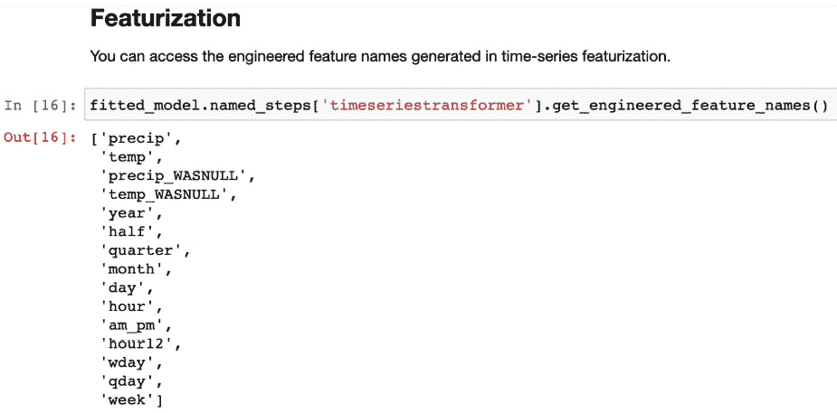

    图 5.48 – 通过 get_engineered_feature_names 检索工程化特征

    查看这些特征的工程化摘要，包括有机特征，为你提供了构建这些特征的推理依据，如下面的截图所示：

    

    图 5.49 – 通过 get_featurization_summary()查看工程化特征摘要

1.  使用评分方法，我们可以在图表上创建测试得分并绘制预测点，如下面的截图所示：

图 5.50 – 为测试数据得分构建散点图

预测数据测试得分用蓝色表示，实际得分用绿色表示：

注意

这张图片对你来说可能是黑白相间的。当你实际在示例上工作时，你会更好地理解颜色参考。

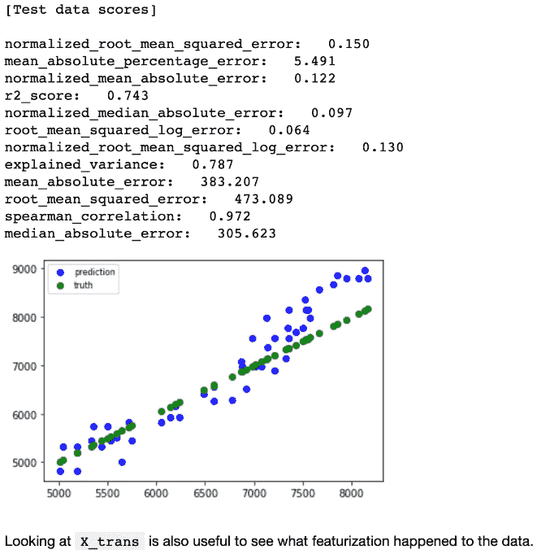

图 5.51 – 测试数据得分及其相关图表

`X_trans` 捕获了工程化，包括数据集中自动特征工程的变化，如下面的截图所示：

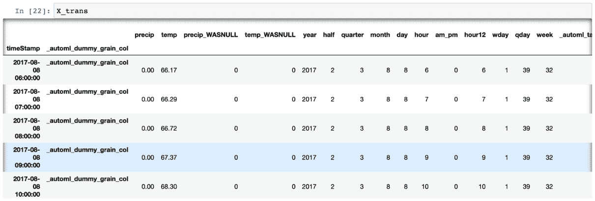

图 5.52 – X_trans 显示能源预测的时间序列特征

尽管 MNIST 数据集的可解释性并不那么直观，但在探索能源需求数据集时，你可以可视化不同的模型并看到哪些特征对预测使用影响最大。很明显，温度与全球电力使用的全局重要性呈正相关。更高的温度会导致空调使用量增加，从而增加电力使用。模型还认为一天中的时间和一周中的某一天也很重要，如下面的图表所示：

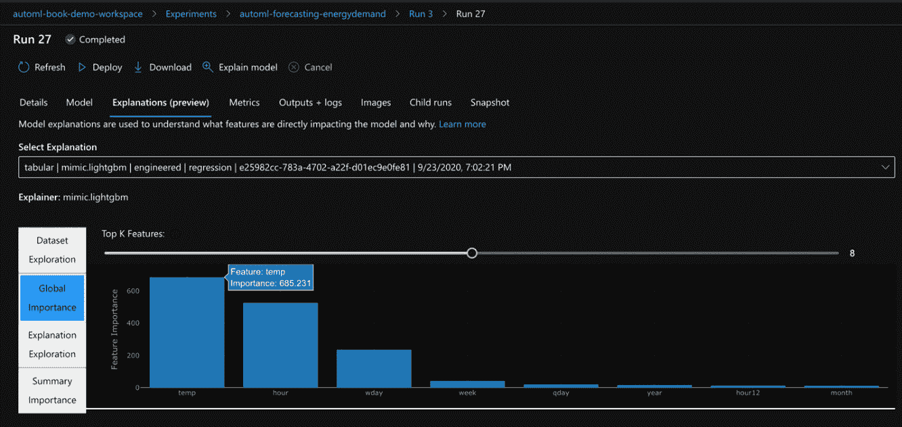

图 5.53 – 全局重要性解释图

在下面的截图中，不同的解释模型（工程化特征与原始特征）将结果与 Y 的不同预测值进行映射。模型解释视图帮助我们理解哪些特征直接影响了模型：

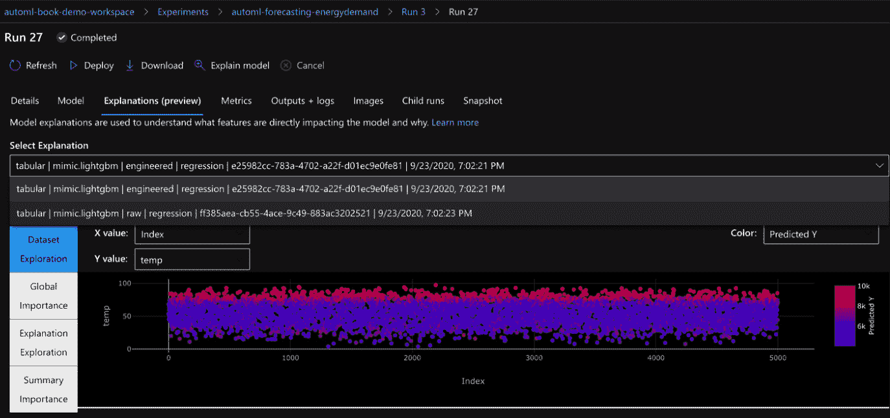

图 5.54 – 全局重要性解释图

这是我们使用 Azure 中的 AutoML 进行时间序列预测演示的结束。

# 摘要

在本章中，你学习了如何在 Azure 中应用 AutoML 来解决分类问题和时间序列预测问题。你能够在 Azure 机器学习环境中使用 Azure 笔记本和 JupyterLab 构建模型。然后你了解了整个工作空间如何与实验和运行相关联。你还看到了这些自动化运行期间的可视化；这正是特征重要性、特征的全球和局部影响以及基于原始和工程特征的解释提供直观理解的地方。除了你对工具的亲和力之外，平台与你的企业路线图相一致也很重要。Azure 是一个整体上很棒的平台，拥有全面的工具集，我们希望你喜欢探索其自动化 ML 功能。

# 进一步阅读

关于本章所涉及主题的更多信息，请查看以下链接：

+   Azure AutoML:

    [`docs.microsoft.com/en-us/azure/machine-learning/concept-automated-ml`](https://docs.microsoft.com/en-us/azure/machine-learning/concept-automated-ml)

+   Azure 上的实用 AutoML：

    [`github.com/PracticalAutomatedMachineLearning/Azure`](https://github.com/PracticalAutomatedMachineLearning/Azure)
