# 第六章: 使用 AWS 进行机器学习

“无论你现在在学习什么，如果你没有跟上深度学习、神经网络等，你就会落后。我们正在经历一个过程，其中软件将自动化软件，自动化将自动化自动化。”

– 马克·库班

在上一章中，您被介绍了 Azure 的**机器学习**（**ML**）景观以及如何在 Azure 平台上进行自动机器学习。在本章中，您将学习如何使用**亚马逊网络服务**（**AWS**）开始机器学习之旅，以及不同的产品和服务，以及对庞大的 AWS 云堆栈的深入了解。

本章的主题是通过介绍 AWS 机器学习功能来开始，以提供一个更广泛的视角，不仅限于 AWS 作为超大规模云服务提供商，还包括该领域的广泛性。许多用例和排列需要专门的解决方案，没有一种解决方案可以满足企业的 AI 和 ML 需求。这就是为什么在您开始自动机器学习之旅时，了解每个云服务提供者的知识广度非常重要。

在本章中，我们将涵盖以下主题：

+   AWS 景观中机器学习的概述

+   开始使用 AWS 机器学习

+   与 AWS SageMaker Autopilot 协作

# AWS 景观中的机器学习

Gartner 是少数几家定期审查技术景观并在其魔力象限报告中提供其发现全面概述的主要咨询公司之一。在其最新发布中，魔力象限包含 Anaconda 和 Altair 作为利基玩家，Microsoft、DataRobot、KNIME、Google、H2O.ai、RapidMiner 和 Domino 作为愿景家，IBM 作为挑战者，以及 Alteryx、SAS、Databricks、MathWorks、TIBCO 和 Dataiku 作为数据科学和机器学习领域的领导者。

看不到 AWS 在这里被提及，这让我们感到惊讶。由于他们在数据科学和人工智能解决方案交付方面的一致记录，有六家公司位于领导象限，而七家公司被归类为愿景家。然而，AWS 未能进入愿景家和/或领导者象限，这归因于公告延迟。AWS 的旗舰人工智能产品 SageMaker Studio 和 SageMaker Autopilot 是在 Gartner 提交截止日期之后宣布的；因此，它们未能入选。由于 AWS 解决方案景观的广泛性，没有看到 AWS 在名单上令人惊讶。作为一个具有先发优势的云服务提供商，AWS 的市场份额超过了其最接近的三家竞争对手的总和。

AWS 为开发者、数据科学家、机器学习工程师和爱好者提供了一套全面的工具，以帮助他们与人工智能和机器学习进行工作。这些工具包括框架和基础设施组件、机器学习服务、人工智能服务、**集成开发环境**（**IDEs**）和 API，以及培训和教程，帮助您在 AWS 提供的不断增长的世界中开始您的旅程。以下是对 AWS 机器学习堆栈的鸟瞰图：

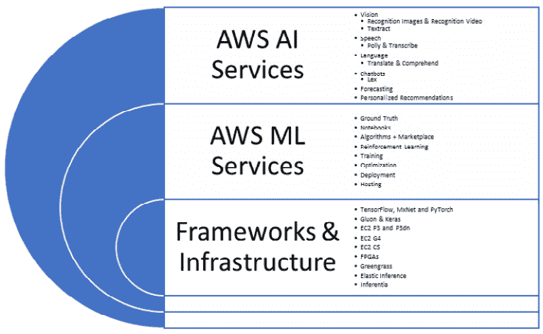

图 6.1 – Amazon ML 栈 – 一系列 AI 和 ML 服务和功能 – 由 Amazon re:Invent 提供

由于这些众多服务的深度和广度，每个服务都至少值得拥有一章，但那样我们就无法满足那些滑稽的截止日期了。因此，为了节省时间和简洁，我们只会关注自动 ML 部分，即 Amazon SageMaker 及其 Autopilot 服务。请参阅 *进一步阅读* 部分，以获取更多关于 Amazon ML 栈的链接。

SageMaker 是一个完全托管、基于云的 ML 平台，通过启用端到端 ML 工作流程，提供 AI 运营能力，无需比喻性的泪水。在下图中，您将看到用于准备、构建、训练、调整、部署和管理模型的 AWS 端到端 ML 组件。您还将注意到 SageMaker Autopilot 如何在整个范围内提供自动构建和训练模型的能力，以及在整个生命周期中准备、构建和维护这些模型：

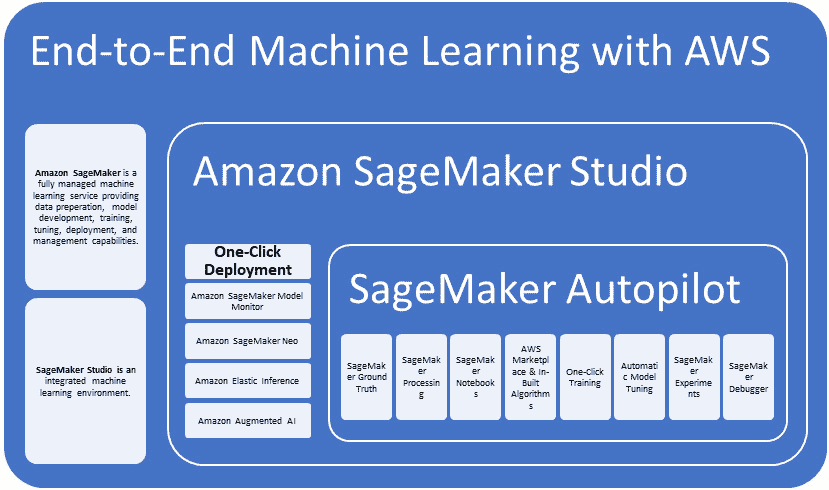

图 6.2 – 使用 AWS 的端到端 ML

尽管我们的重点是自动 ML 功能，但探索 Amazon SageMaker 的生态系统仍然值得。其中一项关键服务是 Amazon SageMaker Studio，这是一个基于 Web 的 ML 集成开发环境（IDE），用于准备、构建、部署和运营模型。当提到 SageMaker 时，大多数人首先想到的就是这个 IDE，但您会发现它只是更大生态系统的一部分。

笔记本是数据科学家的瑞士军刀。Amazon SageMaker Studio 笔记本提供了数据科学家所熟知和喜爱的舒适环境，大部分情况下是这样的。Amazon SageMaker Ground Truth 提供训练数据集，而 Amazon **增强 AI** (**A2I**) 则实现了 **人机协同** (**HITL**)，需要碳基生命体来审查 ML 预测，尤其是那些置信度分数较低的预测。Amazon SageMaker Experiments 与您之前在其他超大规模云服务提供商中探索的类似，它有助于跟踪数据，使实验的重建和共享成为可能，并为审计目的提供跟踪信息。Amazon SageMaker 内置了各种算法，用于分类、回归、文本分析、主题建模、预测、聚类以及更多用例，如下图所示：

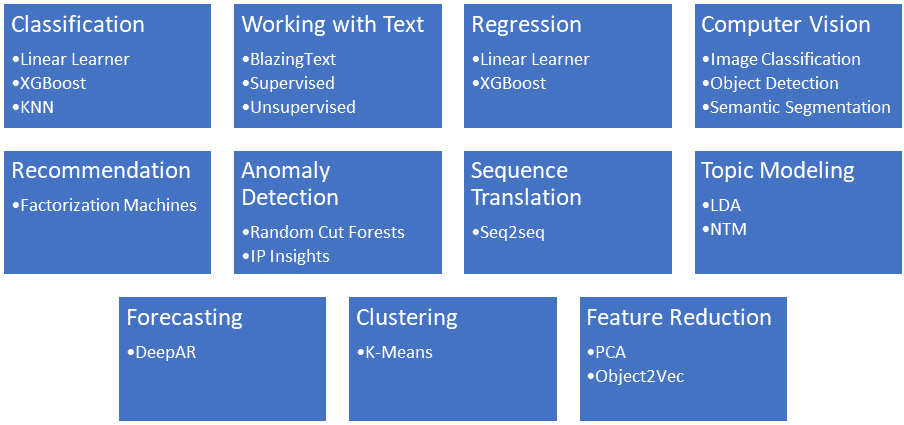

图 6.3 – Amazon SageMaker 内置算法

Amazon SageMaker Debugger 帮助检查参数和数据，而 Amazon SageMaker Model Monitor 则关注模型在生产中的行为。由于数据漂移可能会严重影响模型质量，因此模型监控最近受到了大量关注。在线学习可能存在风险；让 Tay 成为我们的教训。Amazon SageMaker 为人工智能民主化提供的某些功能可以在以下图中看到：

![Figure 6.4 – 不同类型的 Amazon SageMaker 功能 – 由 Amazon re:Invent 提供

![img/Figure_6.4_B16890.jpg]

图 6.4 – 不同类型的 Amazon SageMaker 功能 – 由 Amazon re:Invent 提供

亚马逊 SageMaker 还提供了强化学习、批量转换和弹性推理功能。Amazon SageMaker Neo 实现了“一次训练，到处运行”的能力，并有助于分离训练和推理基础设施。Neo 由 Apache 许可的 Neo-AI-DLR 公共运行时提供支持，支持常见的框架（TensorFlow、MXNet、PyTorch、ONNX 和 XGBoost），甚至声称可以加速它们。最后，我们还有 Amazon SageMaker Autopilot，本书的重点，公民数据科学家可以在此构建、训练和测试机器学习模型，使我们更接近人工智能的民主化。

我们将在本章的后半部分更详细地讨论 SageMaker Autopilot。首先，让我们探索在 AWS SageMaker 中编写一些代码。

# AWS ML 入门

在本节中，我们将对 AWS 管理控制台进行操作演示，并逐步指导您如何使用 AWS SageMaker。让我们开始吧。AWS ML 环境相当直观且易于使用：

1.  要开始，首先通过在浏览器中访问 [aws.amazon.com](http://aws.amazon.com) 打开 AWS 管理控制台。现在，点击 **登录到控制台**，或者如果您是回头客，请重新登录：![Figure 6.5 – AWS 管理控制台

    ![img/Figure_6.5_B16890.jpg]

    图 6.5 – AWS 管理控制台

1.  在 **根用户电子邮件地址** 字段中输入您的根（账户）用户电子邮件地址以继续：![Figure 6.6 – AWS 管理控制台登录

    ![img/Figure_6.6_B16890.jpg]

    图 6.6 – AWS 管理控制台登录

1.  登录成功后，您将被带到以下屏幕，即 AWS 管理控制台：![Figure 6.7 – AWS 管理控制台

    ![img/Figure_6.7_B16890.jpg]

    图 6.7 – AWS 管理控制台

1.  AWS 拥有一系列众多不同的服务。在 AWS 管理控制台中，找到服务搜索框，然后输入 `sagemaker` 以找到 `Amazon SageMaker` 服务，如以下截图所示，并点击它：![Figure 6.8 – 在 AWS 管理控制台中搜索 SageMaker

    ![img/Figure_6.8_B16890.jpg]

    图 6.8 – 在 AWS 管理控制台中搜索 SageMaker

1.  这将带您到下面的截图所示的 SageMaker 主页。在这里，您可以了解不同的服务，如地面实况、笔记本、作业处理等：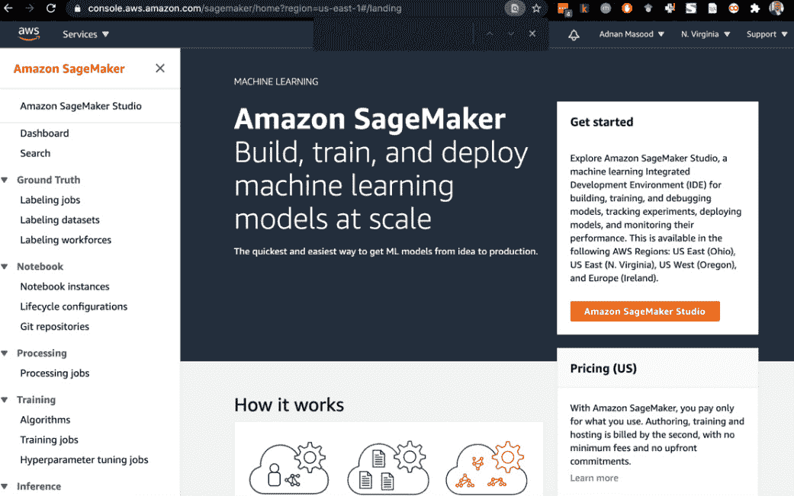

    图 6.9 – Amazon SageMaker 主页

    AWS 团队投入了大量工作来构建文档、培训视频和合作伙伴培训计划，以便让开发者跟上进度。您可以在章节末尾的 *进一步阅读* 部分中查看一些这些课程。例如，在这里，当您点击左侧面板顶部的链接时，它将显示有关如何使用 Amazon SageMaker Studio 构建、训练和部署模型的信息。上下文文档，相当不错吧！

    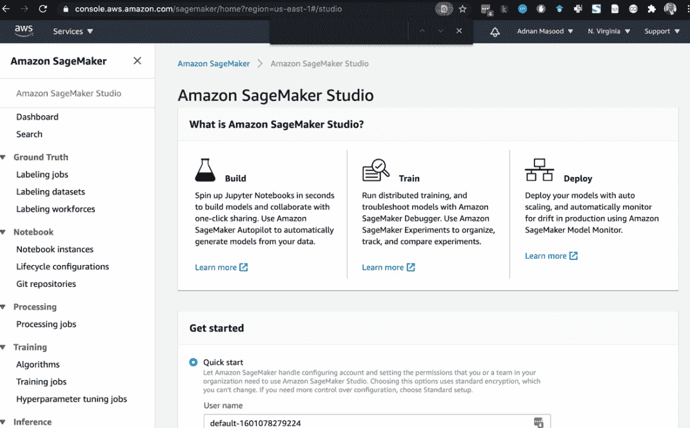

    图 6.10 – Amazon SageMaker Studio 主页

1.  现在，让我们探索 SageMaker Studio，我们将在这里为我们的最爱数据集开发一个分类模型。在 **入门** 部分，您将创建一个用户名并定义执行 **身份和访问管理**（**IAM**）角色。IAM 角色为您提供了细粒度的权限，以确定您可以在 AWS 平台上做什么和不能做什么。点击 **执行角色** 下拉菜单以选择您打算使用的角色（或创建一个新角色）：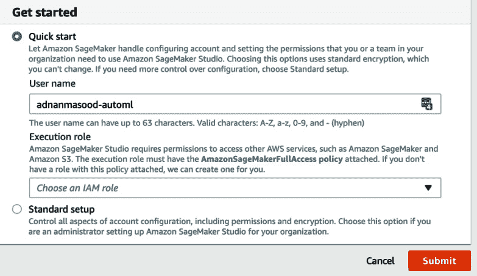

    图 6.11 – Amazon SageMaker Studio 入门屏幕

1.  如果您还没有 IAM 角色，可以创建一个并授予适当的权限，如下面的截图所示。S3 是 AWS 存储机制之一，下面的屏幕允许您创建 IAM 角色以访问 S3 存储桶。这是一个一次性设置过程，除非您计划进行更改：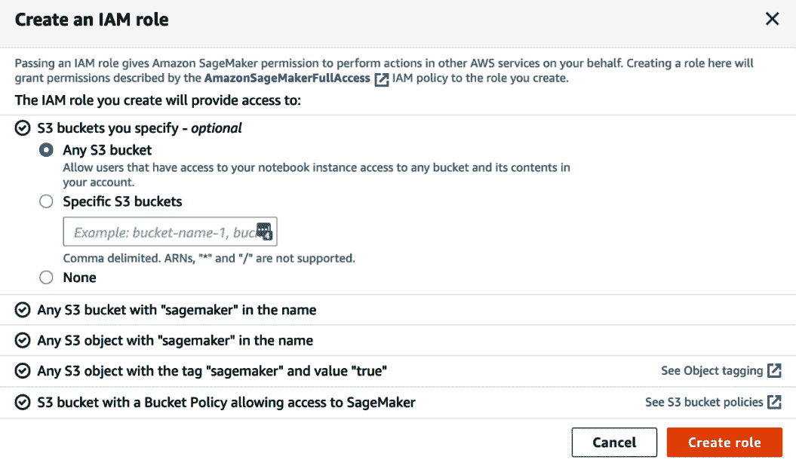

    图 6.12 – Amazon SageMaker Studio IAM 角色创建屏幕

1.  创建 IAM 角色完成后，您将看到以下成功消息。按 **提交** 键导航到下一屏幕：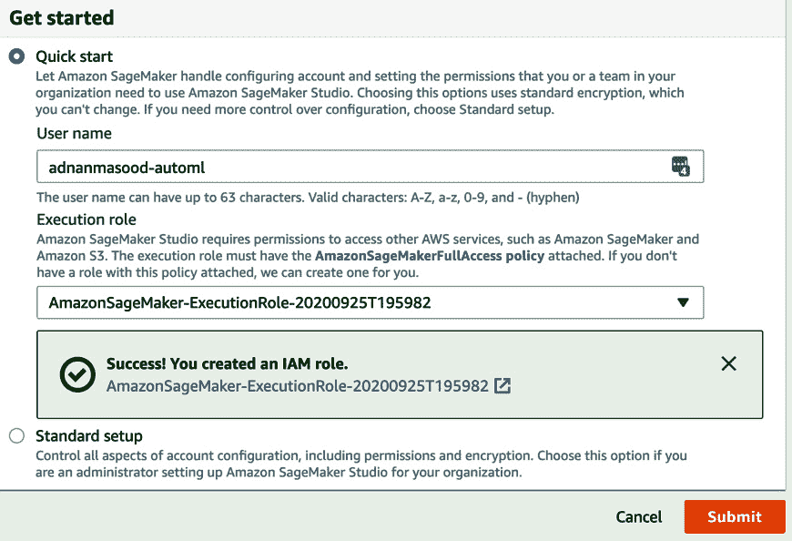

    图 6.13 – Amazon SageMaker Studio IAM 角色创建成功

1.  一旦创建了角色，您将被带到 SageMaker 仪表板，在那里您将看到可用的服务，如下面的截图所示：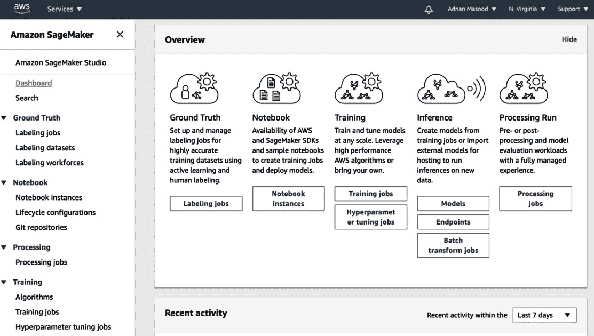

    图 6.14 – Amazon SageMaker Studio 仪表板

1.  从这个早期的屏幕，您现在可以导航到 **控制面板** 来查看您的关联用户并点击 **打开工作室**，这将最终带您到 SageMaker Studio：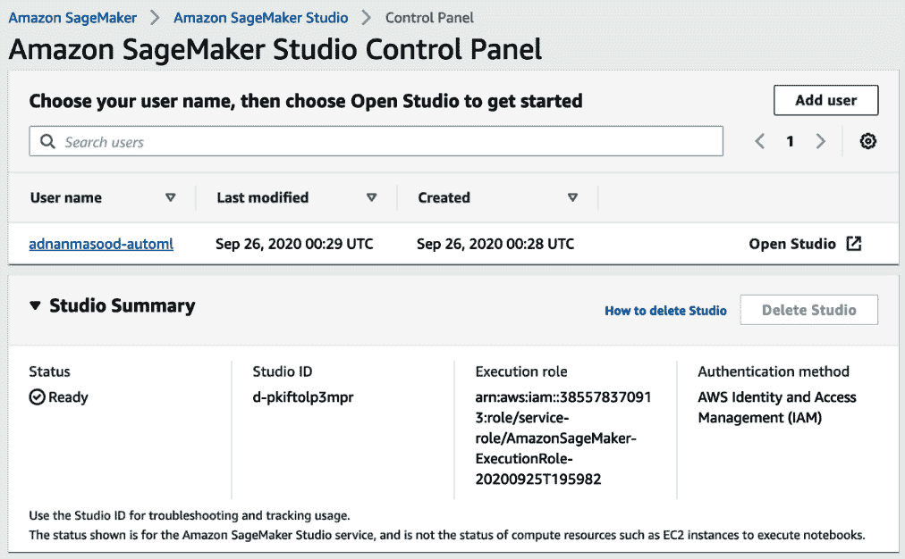

    图 6.15 – Amazon SageMaker Studio 仪表板

    以下截图显示了 SageMaker Studio 的外观。它类似于你可能在之前的章节中看到的，以及未来关于超大规模服务器的章节中可能看到的其他在线云 ML IDE。在这里，你可以创建笔记本，构建实验，部署并监控你的 ML 服务：

    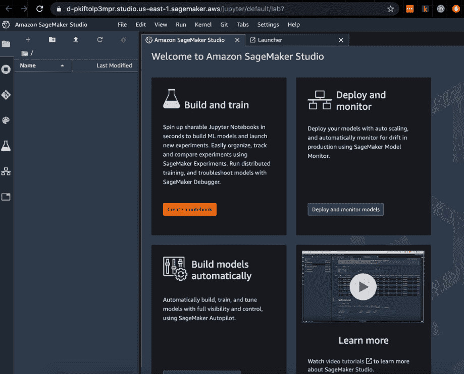

    图 6.16 – Amazon SageMaker Studio 仪表板

1.  点击 **创建笔记本** 按钮，你将看到以下屏幕，这将打开 Jupyter Notebook：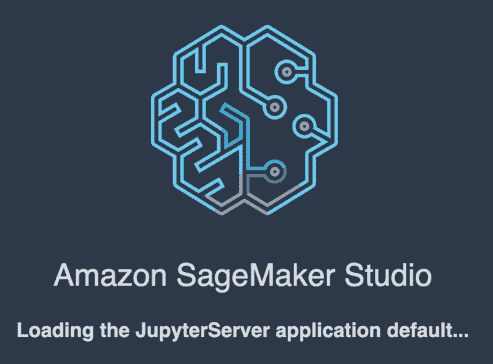

    图 6.17 – Amazon SageMaker Studio 加载

1.  一旦你看到以下启动器屏幕，你将能够创建笔记本。在我们的案例中，我们将克隆 GitHub 上的 AWS SageMaker `examples` 仓库 ([`GitHub.com/awslabs/amazon-sagemaker-examples`](https://GitHub.com/awslabs/amazon-sagemaker-examples))：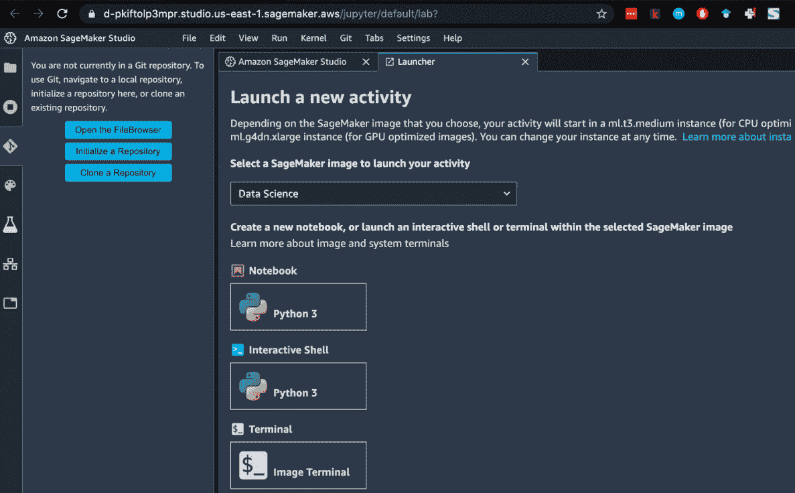

    图 6.18 – Amazon SageMaker 笔记本活动启动器

1.  点击 **克隆仓库** 并提供 GitHub 仓库以本地下载，你将看到以下窗口弹出。点击 **克隆** 以克隆仓库：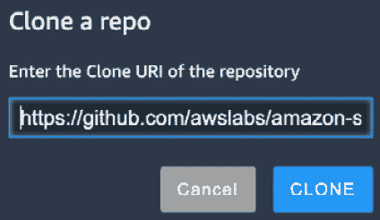

    图 6.19 – Amazon SageMaker 克隆仓库对话框

1.  一旦仓库被克隆，你将能够在 AWS SageMaker 中看到以下树状结构：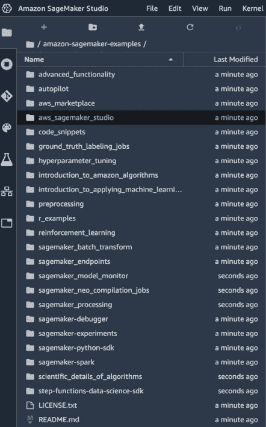

    图 6.20 – Amazon SageMaker 克隆仓库目录视图

1.  导航到 `/aws_sagemaker_studio/getting_started/` 文件夹并打开 `xgboost_customer_churn_studio.ipynb` 笔记本。打开此笔记本时，你需要选择一个首选的 Python 内核来运行它。选择 **Python 3 (数据科学**) 内核：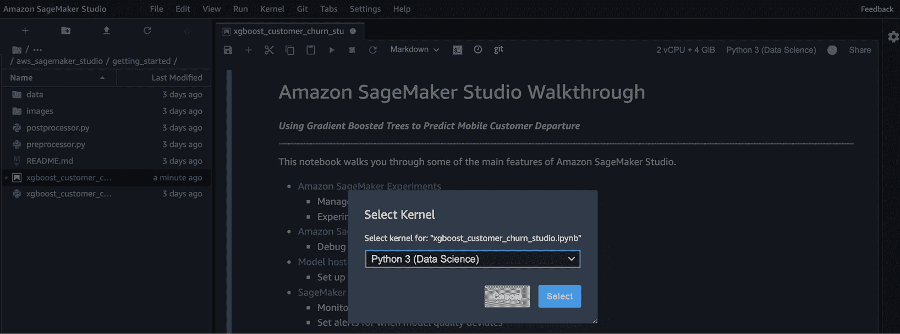

    图 6.21 – Amazon SageMaker 仓库 – 选择首选内核

1.  现在你已经选择了内核，你会注意到你仍然无法运行笔记本。为什么？因为你需要一个计算资源！现在是时候选择你想要使用的计算实例了。在我们的案例中，我们选择了 `ml.t3.medium` 通用实例（在撰写本文时每小时费用为 0.05 美元），但你可以选择更大更好的机器以加快你的实验运行速度。定价详情请见此处：[`aws.amazon.com/sagemaker/pricing/`](https://aws.amazon.com/sagemaker/pricing/)。点击 **保存并继续** 以继续：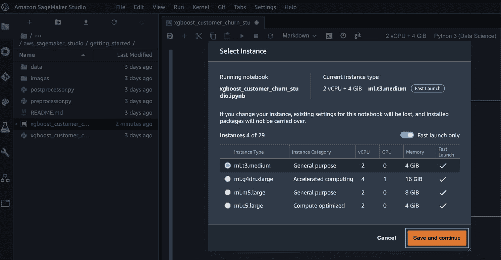

    图 6.22 – Amazon SageMaker 仓库 – 选择首选计算实例

1.  可能存在需要更改计算实例类型的情况。在这种情况下，您需要删除之前的实例，因为您的账户可能不允许同时运行多个实例。您可以在以下截图中的链接中查看删除应用程序的方法：

    图 6.23 – Amazon SageMaker 仓库 – 选择首选计算实例

1.  计算资源和内核已识别；现在您已经准备好使用以下截图中的控制工具栏运行此笔记本，并安装 Python 以及其他相关 SDK。这个 Amazon SageMaker Studio 初学者指南是一个很好的起点，因为它会向您介绍 SageMaker Studio 的一些关键功能。这里的关键用例是**使用梯度提升树预测移动客户流失**，包括数据集的准备和上传到 Amazon S3，使用 Amazon SageMaker XGBoost 算法进行训练，构建 S3 实验，调试，托管和监控。我们将把这个指南作为您的作业：

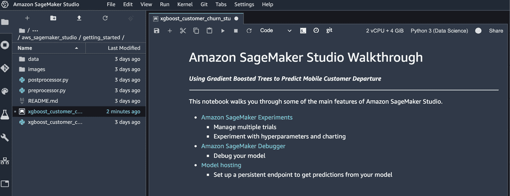

图 6.24 – Amazon SageMaker Studio 浏览笔记本

在本节中，您已经学习了如何开始使用 AWS SageMaker，并进行了快速浏览。这并不是对 SageMaker 功能的全面总结，这正是 Amazon SageMaker 开发者指南所提供的。您可以从这里下载：[`docs.aws.amazon.com/sagemaker/latest/dg/sagemaker-dg.pdf`](https://docs.aws.amazon.com/sagemaker/latest/dg/sagemaker-dg.pdf)。

在下一节中，我们将探讨 AWS SageMaker 的自动化机器学习功能。

# AWS SageMaker 自动驾驶仪

如同其名，SageMaker 自动驾驶仪是一个**完全托管系统，提供自动机器学习解决方案**。其目标，就像任何自动化机器学习解决方案一样，是尽可能地将大部分冗余和耗时的工作转移到机器上，而人类可以从事更高层次的认知任务。在以下图中，您可以查看 SageMaker 自动驾驶仪覆盖的机器学习生命周期部分：

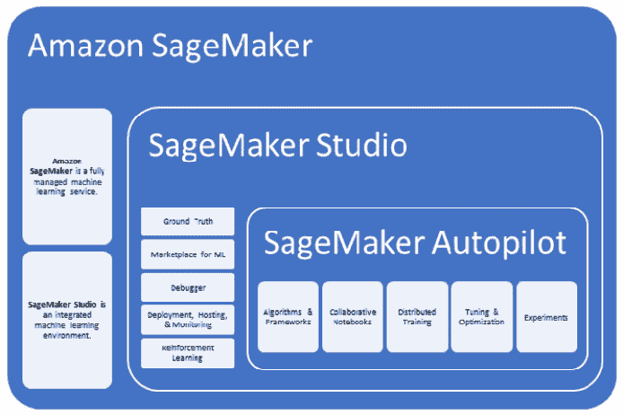

图 6.25 – Amazon SageMaker 的生命周期

作为 SageMaker 生态系统的一部分，SageMaker Autopilot 被赋予成为自动化机器学习引擎的任务。以下图中定义了一个典型的自动化机器学习用户流程，其中用户分析表格数据，选择目标预测列，然后让 Autopilot 执行其寻找正确算法的魔法。这里的秘诀是底层贝叶斯优化器，如 Das 等人在其论文《Amazon SageMaker Autopilot：大规模白盒 AutoML 解决方案》中定义的那样（[`www.amazon.science/publications/amazon-sagemaker-autopilot-a-white-box-automl-solution-at-scale`](https://www.amazon.science/publications/amazon-sagemaker-autopilot-a-white-box-automl-solution-at-scale)）:

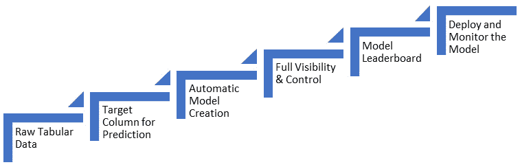

图 6.26 – Amazon SageMaker Autopilot 生命周期

自动模型创建阶段完成后，它为模型笔记本提供了全面的可见性。以下图中的工作流程显示了机器学习管道的作业处理。提供结构化数据集和目标列，AWS SageMaker Autopilot 将数据分割为训练和验证折，通过管道执行转换数据，审查模型列表，并按质量指标对它们进行排名：

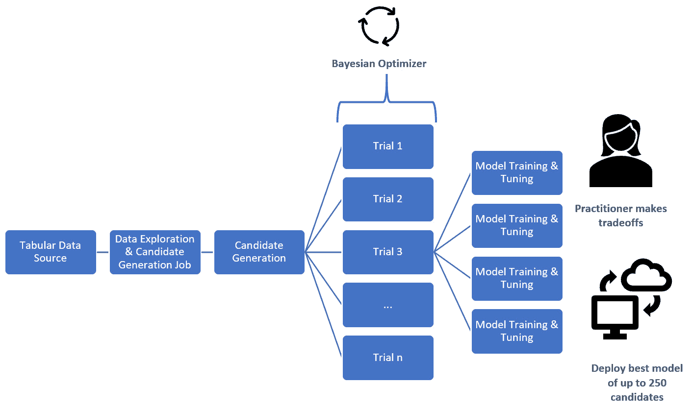

图 6.22 – Amazon SageMaker Autopilot – 内部结构

贝叶斯优化器和基于候选笔记本的多次试验是此超参数优化的根本。以下内部图显示了如何从一个候选笔记本产生多个试验，以及更多的模型训练和调整实例。这个过程最终生成了一组候选模型，可以根据模型准确率、延迟和其他权衡进行选择和排名。

以下图中可以看到权衡。模型 #1 和 #2 之间的准确率差异为 2%；然而，延迟，即模型响应所需的时间，增加了 250 毫秒，这是一个相当大的变化：

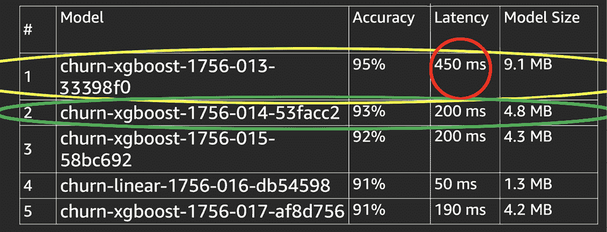

图 6.28 – 自动驾驶作业准确率与延迟权衡 – 感谢 Amazon re:Invent

SageMaker Autopilot 发布最终模型，即显示超参数、算法和相关指标的管道。这个演示有助于从 MLOps 角度使这些模型透明化，并创建高质量、可编辑的机器学习模型，这些模型具有良好的可扩展性。这些模型可以在 SageMaker 生态系统中发布和监控漂移，并且可以随意选择和部署替代模型。这些功能是 AWS 机器学习生态系统的前沿，使开发者能够为客户构建和部署有价值的解决方案。

# AWS JumpStart

2020 年 12 月，亚马逊宣布 SageMaker JumpStart 作为一个功能，可以访问预构建模型库，也称为模型动物园，以加速模型开发。作为 Amazon SageMaker 的一部分集成，JumpStart 提供了用于预测性维护、计算机视觉、自动驾驶、欺诈检测、信用风险预测、从文档中提取和分析数据的 OCR、客户流失预测以及个性化推荐的预构建模板。

JumpStart 为开发者提供了一个绝佳的起点，让他们可以使用这些现成的模板来快速启动（寓意如此）他们的开发。这些加速器和入门套件可在 GitHub 上找到，[`github.com/awslabs/`](https://github.com/awslabs/)，并提供使用 Amazon SageMaker 模型开发和部署机制的食谱和最佳实践。

关于使用 AWS JumpStart 的更多详细信息，请参阅此处。[`docs.aws.amazon.com/sagemaker/latest/dg/studio-jumpstart.html`](https://docs.aws.amazon.com/sagemaker/latest/dg/studio-jumpstart.html)

# 摘要

在本章中，您了解了 AWS ML 堆栈以及如何开始使用 AWS SageMaker 和笔记本开发。您还熟悉了 SageMaker Autopilot 及其自动 ML 工作流程功能。我们为您提供了内置算法、SageMaker ML 生命周期以及 SageMaker 自动 ML 使用的算法和技术的概述。本介绍为您提供了进一步探索和学习 AWS ML 堆栈和 SageMaker 自动 ML 生命周期的背景知识。

在下一章中，我们将实际使用 SageMaker Autopilot 的一些功能来运行分类、回归和时间序列分析。

# 进一步阅读

关于以下主题的更多信息，您可以参考以下链接：

+   Piali Das 等人撰写的《*Amazon SageMaker Autopilot：大规模的白盒 AutoML 解决方案*》：[`www.amazon.science/publications/amazon-sagemaker-autopilot-a-white-box-automl-solution-at-scale`](https://www.amazon.science/publications/amazon-sagemaker-autopilot-a-white-box-automl-solution-at-scale)

+   *使用 Amazon SageMaker 构建、训练和部署 ML 模型*：[`aws.amazon.com/getting-started/hands-on/build-train-deploy-machine-learning-model-sagemaker/`](https://aws.amazon.com/getting-started/hands-on/build-train-deploy-machine-learning-model-sagemaker/)

+   *Amazon SageMaker Studio - 使用 Amazon SageMaker AutoPilot 进行 AutoML（第一部分）*：[`www.youtube.com/watch?v=qMEtqJPhqpA`](https://www.youtube.com/watch?v=qMEtqJPhqpA)

+   *SageMaker Studio - 使用 Amazon SageMaker AutoPilot 进行 AutoML（第二部分）*：[`www.youtube.com/watch?v=qMEtqJPhqpA&ab_channel=JulienSimon`](https://www.youtube.com/watch?v=qMEtqJPhqpA&ab_channel=JulienSimon)

+   *SageMaker Studio - 使用 Amazon SageMaker AutoPilot 进行 AutoML（第三部分）*：[`www.youtube.com/watch?v=KZSTsWrDGXs&ab_channel=JulienSimon`](https://www.youtube.com/watch?v=KZSTsWrDGXs&ab_channel=JulienSimon)

+   *SageMaker Studio - 使用 Amazon SageMaker AutoPilot 进行 AutoML (第四部分)*: [`www.youtube.com/watch?v=vRHyX3kDstI&ab_channel=JulienSimon`](https://www.youtube.com/watch?v=vRHyX3kDstI&ab_channel=JulienSimon)
