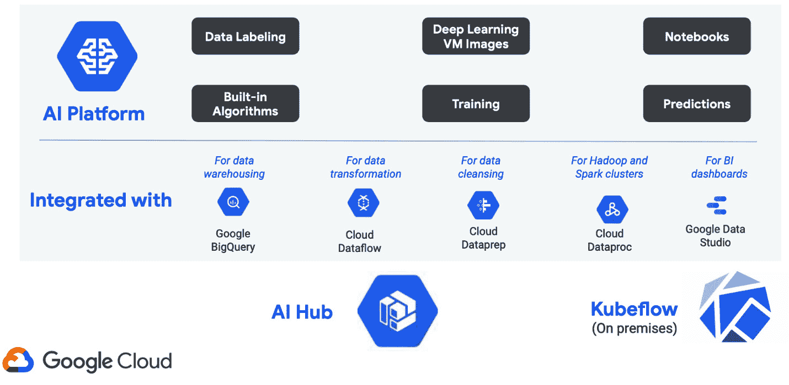
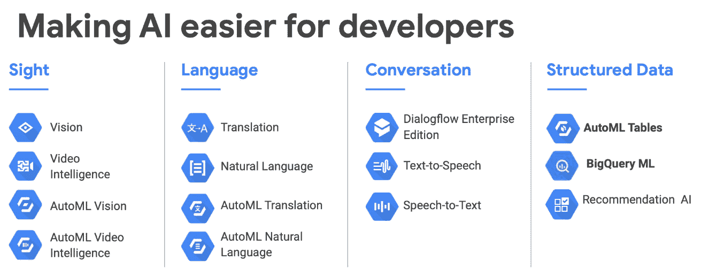
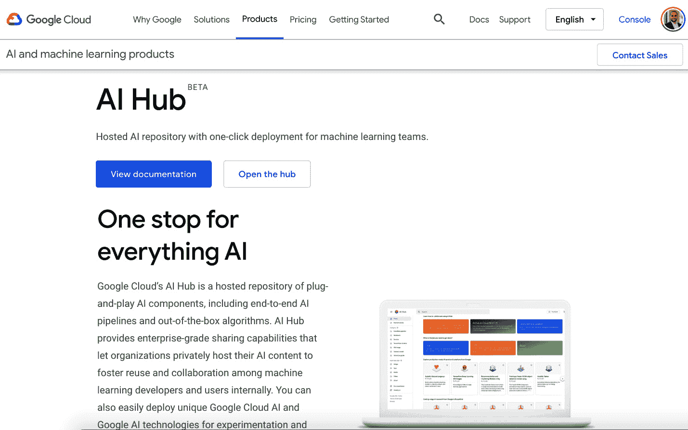
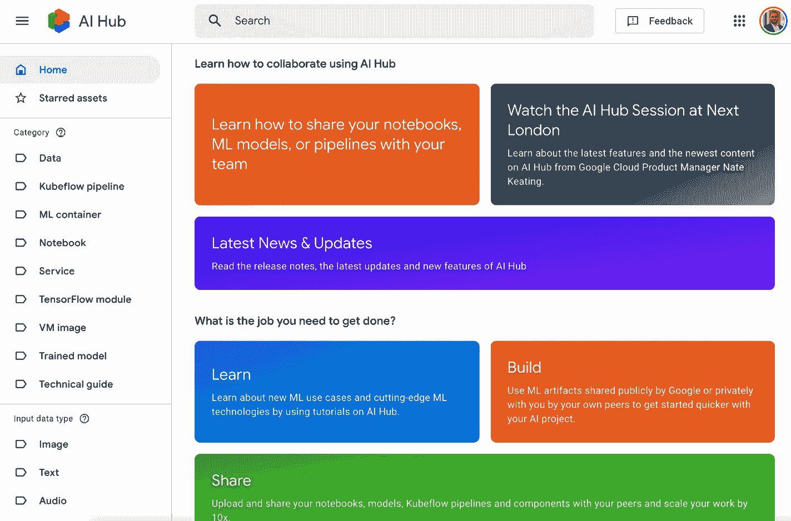
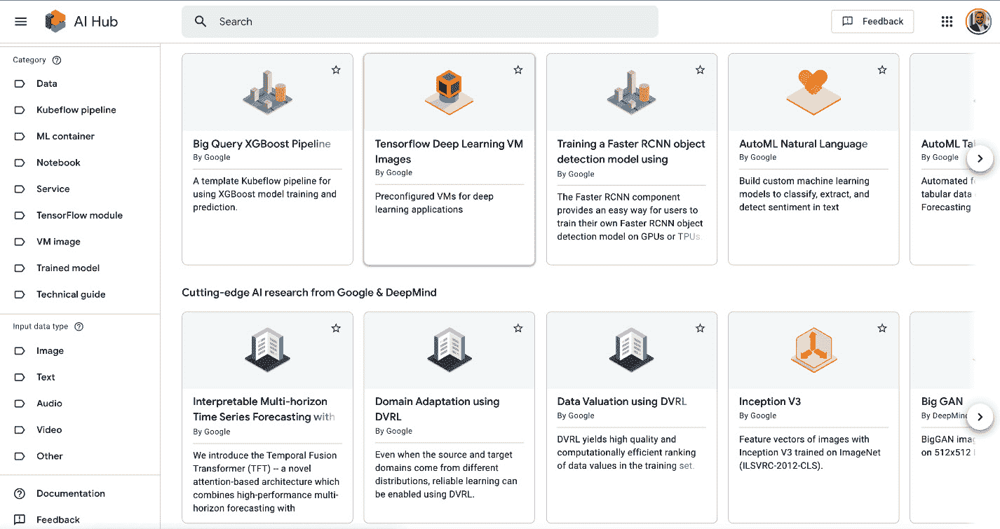
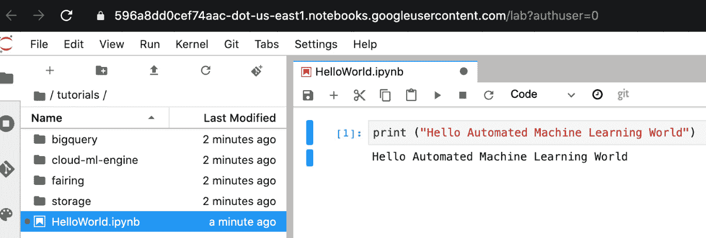
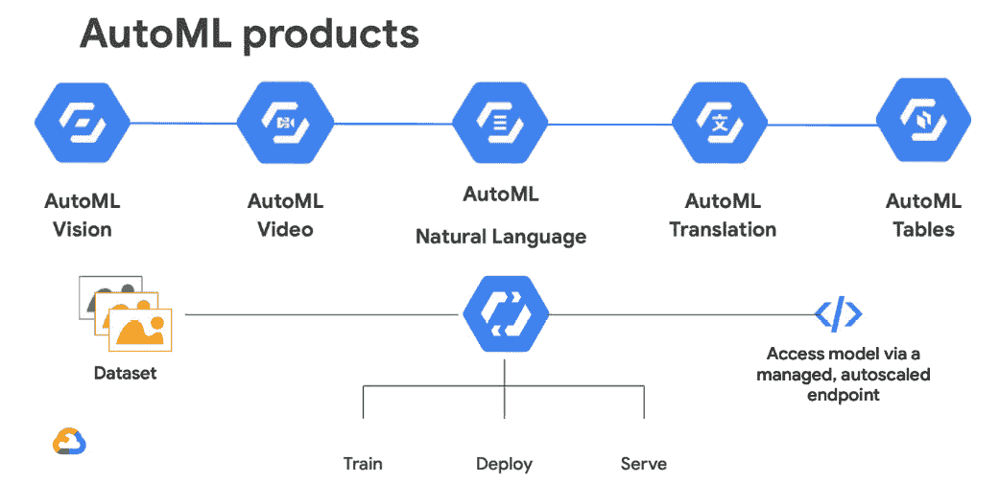

# 第八章：使用 Google Cloud Platform 进行机器学习

“我一直坚信，要让人工智能工作，唯一的方法是以类似于人脑的方式进行计算。这就是我一直追求的目标。我们在进步，尽管我们仍然有很多关于大脑实际工作方式的知识需要学习。”

– 几何夫·辛顿

在上一章中，你被介绍了主要的超大规模云服务提供商，即**亚马逊网络服务**（**AWS**）平台，AWS SageMaker，以及其自动化的**机器学习**（**ML**）能力，即 AWS SageMaker Autopilot。

Gartner 在其 2020 年云基础设施和平台服务魔力象限报告中将 Google 评为领导者。Google 的计算服务提供了一套计算技术、工具和服务，以支持使用与 Google 自身产品和服务相同基础设施的企业。在本章中，我们将回顾 Google 的计算服务及其**人工智能**（**AI**）和 ML 产品，特别是云 AutoML Tables 的自动化 ML 能力。

在本章中，我们将涵盖以下主题：

+   开始使用 Google Cloud Platform 服务

+   Google Cloud Platform 上的 AI 和 ML

+   Google Cloud AI 平台和 AI Hub

+   开始使用 Google Cloud AI 平台

+   使用 Google Cloud 进行自动化 ML

# 开始使用 Google Cloud Platform 服务

与其他超大规模云服务提供商和云计算平台一样，Google Cloud 的计算服务也提供了一系列通用计算、分析、存储和安全服务。除了众所周知的 App Engine、Cloud Run、Compute Engine、Cloud Functions、存储、安全、网络和物联网服务外，**Google Cloud Platform**（**GCP**）产品页面列出了 100 多个产品。你可以通过输入[console.cloud.google.com](http://console.cloud.google.com)来访问 GCP 控制台，如下面的图所示：

![Figure 8.1 – GCP 控制台

![img/Figure_8.1_B16890.jpg]

图 8.1 – GCP 控制台

关键产品和提供的服务被分为计算、存储、数据库、网络、运营、大数据、AI 和通用开发工具等类别。GCP 服务摘要([`cloud.google.com/terms/services`](https://cloud.google.com/terms/services))提供了 GCP 所有服务和提供的最新列表。这些服务的范围和广度非常巨大，超出了本书的范围。然而，为了介绍，以下是一个简要概述：

+   **计算**：在这个类别中，GCP 提供 App Engine、Compute Engine、Kubernetes Engine、Cloud Functions、Cloud Run 和 VMware Engine 等服务。这些服务涵盖了广泛的计算能力，包括 CPU、GPU 或云 TPU 等不同模式。

+   **存储**: 通过 Cloud Storage、Cloud Filestore、Persistent Disk、Cloud Storage for Firebase 和高级数据传输功能，GCP 实现了与其他云存储提供商的功能对等。这些存储库可以根据需要从 Compute Engine 访问。

+   **数据库**: 在数据库领域，GCP 提供的产品包括 Cloud Bigtable、Datastore、Firestore（一个 NoSQL 文档数据库）、Memorystore（用于 Redis 和 Memcached）、Cloud Spanner（一个关系型数据库）和 Cloud SQL。凭借庞大的市场提供的产品，您可以通过 Cloud SQL 在 Compute Engine 上迁移和运行 Microsoft SQL Server。GCP Cloud SQL 提供的产品有助于在 GCP 上迁移、维护、管理和管理关系型数据库，如 MySQL、PostgreSQL 和 SQL Server。

+   **网络**: GCP 的网络服务与其他任何超大规模云服务提供商相当。它们流行的网络服务包括 Cloud Load Balancing、Cloud DNS、Cloud VPN（虚拟私有云）、Cloud **CDN**（内容分发网络）、Cloud Router、Cloud Armor（策略框架）、Cloud **NAT**（网络地址转换）、Service Directory、Traffic Director 和 Virtual Private Cloud。GCP 提供的网络服务提供混合连接、网络安全和智能服务。

+   **运维**: 在运维领域，GCP 并不逊色。无论是监控、调试、错误报告、日志记录、性能分析还是跟踪，Cloud Debugger、Cloud Logging、Cloud Monitoring、Cloud Profiler 和 Cloud Trace 等工具都提供用于正常运行时间检查的仪表板和警报，确保您的系统可靠运行。

+   **开发者工具**: 这些工具包括 Artifact Registry（用于管理容器）、Cloud SDK、Container Registry、Cloud Build（用于与 GitHub 和 Bitbucket 集成进行 CI/CD，创建如 Docker 容器或 Java 归档等工件）、Cloud Source Repositories、Firebase Test Lab（移动应用测试）和 Test Lab。

    其他工具包括用于构建管理的 Cloud Build、Cloud Tasks、Container Registry、Artifact Registry、Cloud Scheduler、Deployment Manager、API Gateway、Endpoints、Identity Platform、Source Repositories、Workflows 和 Private Catalog。

+   **数据分析**: GCP 提供的产品包括托管数据分析服务，如 BigQuery，以及托管工作流程编排服务，包括 Cloud Composer、Cloud Data Fusion（集成服务）、Dataflow（数据处理管道）、Datalab（**探索性数据分析**（EDA）和可视化）、Dataproc（托管 Spark 和 Hadoop）、Pub/Sub（异步消息）、Data Catalog（元数据管理）和 Cloud Life Sciences（用于处理生命科学数据）。

+   **API 管理服务**，包括完整的 API 管理生命周期，由 Apigee 提供。其他工具包括用于混合和多云管理的 Cloud Endpoints 和 Anthos 产品。**Google Kubernetes Engine**（**GKE**）是开源容器调度器，而 Connect 和 Hub 用于管理客户注册集群上的功能和服务。

+   **迁移和数据传输**：迁移工具包括 BigQuery 数据传输服务，它有助于将数据从 HTTP/S 可达位置传输，包括 **亚马逊简单存储服务**（**Amazon S3**）和谷歌云产品。传输设备是一种使用硬件和软件将数据传输到 GCP 的解决方案。

+   **安全和身份**：这里提供的服务包括空间、访问透明度、政府保证工作负载、二进制授权、证书授权服务、云资产库存、云数据丢失预防、**云外部密钥管理器**（**Cloud EKM**）、**云硬件安全模块**（**Cloud HSM**）、云密钥管理服务、事件威胁检测、安全命令中心、VPC 服务控制、秘密管理器和用于漏洞扫描的网络安全扫描器。

+   `*reCAPTCHA` 和 Web 风险 API。

+   **无服务器计算**：在无服务器计算领域，GCP 提供云运行（无状态容器）、云函数、云函数（Firebase）、云调度器和云任务（用于分布式任务管理）。还有作为完全托管服务提供的 **物联网**（**IoT**）核心。

+   **管理工具**：这些工具包括云控制台应用（原生移动应用）、云部署管理器、云壳和推荐器（用于推荐和预测使用）。还有作为基础平台构建的服务基础设施组件，包括服务管理 API、服务消费者管理 API 和服务控制 API。

GCP 提供了各种合作伙伴解决方案和垂直服务。在医疗保健和生命科学领域的垂直服务包括云医疗保健，而对于媒体和游戏行业，GCP 提供游戏服务器。GCP 高级软件和合作伙伴解决方案包括 Redis Enterprise、Confluent 上的 Apache Kafka、DataStax Astra、Elasticsearch 服务、MongoDB Atlas 和云卷。

这是对 GCP 在信息系统不同类别中提供的产品的一个简要列举。在下一节中，我们将讨论 GCP 提供的 AI 和 ML 服务。

# GCP 上的 AI 和 ML

在早期以 AI 为先的公司中，谷歌在构建和维护高级 AI 平台、加速器和 AI 构建块方面具有先发优势。谷歌云 AI 平台是一个高度综合的基于云的认知计算产品，您可以在其中构建模型和笔记本，执行数据标注，创建 ML 作业和管道，并访问 AI Hub：

图 8.2 – Google Cloud AI 平台功能

AI 平台和加速器包括构建 ML 管道、部署等功能。它包含数据标注能力、平台笔记本、神经架构搜索、训练和预测功能。

自动化机器学习也是关键构建块之一，包括 AutoML 自然语言、AutoML 表格、AutoML 翻译、AutoML 视频、AutoML 视觉和推荐 AI。其他 AI 产品还包括 Cloud Natural Language API、Cloud Translation、Cloud Vision、Dialogflow（提供基础版和客户体验版）、Document AI、媒体翻译 API、语音转文本和文本转语音服务以及视频智能 API。

如下图中所示，您可以通过[`console.cloud.google.com/ai-platform/dashboard`](https://console.cloud.google.com/ai-platform/dashboard)访问 AI 平台：

图 8.3 – AI 平台的主屏幕

作为开发者的一个一站式商店，AI 平台充当一个门户，从这里您可以导航到其他区域进行数据标注、自然语言处理、推荐、翻译和其他功能。自动化机器学习的重点领域包括视觉、语言、对话和结构化数据：

图 8.4 – 包括 AutoML 在内的 AI 平台组件

为了本书的目的，我们将专注于结构化数据中的 AutoML 功能，特别是 AutoML 表格。

# Google Cloud AI 平台和 AI Hub

作为更大 AI 平台服务的一部分，Google Cloud AI Hub 是所有 AI 相关事物的一站式商店——主页上甚至也这样宣称。AI Hub 在撰写本文时处于测试阶段。然而，这不应该阻止你尝试其惊人的单点部署功能。AI Hub 和 AI 平台可能会让人困惑；区别在于 GCP 如何定义问题。AI Hub 专注于企业级共享能力，以实现私有协作和托管，而 AI 平台是一个更大的 AI 生态系统，包括笔记本、作业和平台等。这并不是说这些能力没有重叠，GCP 营销团队可能会有一天提出一个连贯的战略——但在此之前，这种双重性仍在继续。

以下截图显示了 AI Hub 主页。您可以通过点击 AI 平台页面上的 AI Hub 链接[`console.cloud.google.com/ai-platform/dashboard`](https://console.cloud.google.com/ai-platform/dashboard)或直接在浏览器中输入[`aihub.cloud.google.com/`](https://aihub.cloud.google.com/)来导航到这个页面：

图 8.5 – AI Hub 的主屏幕

AI Hub 主页以最简单的方式阐述其问题陈述。它为你提供入门套件、关于机器学习用例的最新新闻、前沿机器学习技术和教程。在这里，你可以构建 Kubeflow 管道和机器学习容器，启动虚拟机 (VM) 映像，使用训练好的模型，探索和分享他人构建的食谱，所有这些都在一个地方：

图 8.6 – AI Hub 的主屏幕，涵盖协作、学习、构建和分享

Google Cloud AI Hub 旨在提供对世界上最强大的算法的全面理解，以及如何利用 Google DeepMind 的前沿人工智能研究来优化它们。你可能还记得 Google DeepMind，它在 AlphaGo 中，DeepMind 团队试图教会一个 AI “学习”，最终能够首次击败人类围棋选手。同一家公司还提供了关于时间序列预测、生成对抗网络、计算机视觉、文本分析和自动化机器学习等领域的尖端研究和可用模型，所有这些都可以作为 AI Hub 的一部分使用。

你可以在以下屏幕截图中看到 AI Hub 中列出的一些产品：

图 8.7 – 使用预构建模型和探索 DeepMind 的新研究

在对 AI Hub 和 AI 平台进行初步介绍之后，让我们深入了解如何使用 Cloud AI 平台制作一个简单的笔记本，这是一个你非常熟悉的工具。

# 开始使用 Google Cloud AI 平台

你可以使用 Google Cloud AI 平台做一些事情，包括创建笔记本和 Kubeflow 管道，或者启动预安装的虚拟机 (VM)。Kubeflow 是一个用于 Kubernetes 的机器学习框架，它是一个易于学习的流程管理系统，在构建机器学习管道时表现出色。这可以在以下图所示的**开始使用 Cloud AI 平台**主页上看到：

图 8.8 – 开始使用 Cloud AI 平台

为了开始使用 AI 平台笔记本，导航到 [`cloud.google.com/ai-platform-notebooks`](http://cloud.google.com/ai-platform-notebooks)，在那里你会看到如图 8.9 所示的屏幕。

这是构建 AI 平台笔记本的起点。点击**进入控制台**按钮，导航到如图所示的平台控制台：

图 8.9 – AI 平台笔记本页面

或者，你可以在 AI 平台主页的左侧面板中点击**笔记本**链接，如图所示：

图 8.10 – 开始使用 Google Cloud AI 平台

任何这些操作都会带你到**笔记本实例**页面，如下面的图所示。

现在，要创建一个笔记本，你需要创建一个新的实例，然后可以根据你的需求进行定制。你可以选择特定的语言（Python 2 或 3）和框架（TensorFlow 或 PyTorch 等），如下面的图所示。为了本次演示的目的，我们将创建一个简单的 Python 笔记本。从下面的图中所示的下拉菜单中选择**Python 2 和 3**选项，然后点击**下一步**：

![Figure 8.11 – 在 AI 平台上创建笔记本实例

![img/Figure_8.11_B16890.jpg]

图 8.11 – 在 AI 平台上创建笔记本实例

现在你会被要求选择笔记本实例的参数。这包括你希望部署笔记本的区域和区域。通常，你会选择离你最近的一个。接下来是操作系统和环境选项。在我们的案例中，我们将选择**Debian Linux 发行版和 Intel 处理器**，实际上，这对于打印 Hello World 消息非常有效。你将在屏幕上看到如下环境信息：

![Figure 8.12 – 创建 AI 平台笔记本实例 – 设置环境

![img/Figure_8.12_B16890.jpg]

图 8.12 – 创建 AI 平台笔记本实例 – 设置环境

一旦你选择了环境变量，你就可以看到运行此笔记本实例可能产生的预估成本。说到金钱，你应该小心不要在云中留下闲置资源运行——这可能会对你的财务状况造成不利影响。

点击*图 8.12*中所示的`CREATE`以继续操作，GCP 将为你实例化一个具有指定参数的笔记本。你将在主**笔记本实例**页面上看到所有你的笔记本实例，如下面的图所示：

![Figure 8.13 – AI 平台笔记本实例枚举

![img/Figure_8.13_B16890.jpg]

图 8.13 – AI 平台笔记本实例枚举

笔记本及其相关的计算资源已准备就绪。现在点击前面截图所示的`OPEN JUPYTERLAB`链接以启动熟悉的 Jupyter 环境，它将如下所示。点击以下截图下**笔记本**标题下的**Python 3**图标：

![Figure 8.14 – AI 平台笔记本选项 – Jupyter Notebook 环境

![img/Figure_8.14_B16890.jpg]

图 8.14 – AI 平台笔记本选项 – Jupyter Notebook 环境

一旦你选择了 Python 3 笔记本，你将被带到一个新的 Jupyter 笔记本——这是一个你应该非常熟悉的环境。在这里，你可以编写 Python 代码，导入库，并执行各种数据科学操作。当然，为了本次演示的目的，我们决定保持简单，并打印**Hello World**。你可以在下面的图中看到这个演示：

图 8.15 – AI 平台笔记本实例 – 运行一个简单的 Jupyter 笔记本

这就结束了我们对如何开始使用 AI Hub 和运行简单笔记本的基本介绍，这是进入令人惊叹的 GCP 世界的第一步。AI 平台充满了令人惊叹的工具，我们将在下一节中探索其自动化机器学习部分。

# 基于 Google Cloud 的自动化机器学习

自动化机器学习是 Google Cloud AI 平台的关键构建块之一。自动化机器学习产品套件包括 AutoML 自然语言、AutoML 表格、AutoML 翻译、AutoML 视频、AutoML 视觉，如下图中所示：

图 8.16 – 作为 Google Cloud AI 平台一部分提供的 AutoML 产品

Google Cloud 自动化机器学习产品的基础组件包括神经架构搜索和超参数优化方法。然而，通过抽象出所有复杂性，它使得消费者使用起来变得容易。

Google Cloud AutoML 视觉是一种基于计算机视觉的能力，它可以帮助在自定义标签上训练机器学习模型。您还可以使用 AutoML 视觉边缘服务在边缘设备上执行相同的操作。

AutoML 视频智能产品系列提供了分类和对象跟踪功能。目前处于预 GA（测试版），您可以使用这些服务来训练您的模型，根据您自己的自定义标签定义识别视频中的特定对象、镜头和片段。这些结果可以扩展到视频的其余部分，以发现、检测和跟踪类似标签。

AutoML 自然语言是一种非结构化文本分析服务，它可以帮助您构建、管理和部署处理文本文件和文档的模型。自然语言处理是行业专业人士和研究人员都非常感兴趣的一个领域，如果您计划执行诸如单标签或多标签分类实体提取，或使用定制标签进行情感分析等任务，AutoML 可以使这一切变得非常简单。

AutoML 翻译是自动化机器学习方法与**Google 神经机器翻译**（**Google NMT**）的结合。Google Cloud AutoML 翻译允许您上传自己的数据集并增强翻译。通过计算 BLEU、base-BLEU 和 BLEU 增益，AutoML 翻译为定制模型开发和测试提供了一个复杂的环境。

AutoML 表格真正体现了我们迄今为止关于自动化机器学习的了解——将经过实战检验、全球规模的神经网络算法的威力从 Google 带到非结构化数据上。以下图中展示了 Google Cloud AutoML 表格的工作流程：

图 8.17 – Google Cloud AutoML 表格工作流程

获取结构化数据（表格输入）后，自动机器学习表格通过分析输入特征（特征工程），选择模型（神经架构搜索），执行超参数调整，并反复评估模型行为以确保一致性、准确性和可靠性而迅速行动。谷歌自动机器学习表格在各种场景中得到广泛应用，从最大化收入到优化金融组合以及理解客户流失。自动机器学习表格实现了在结构化数据上构建和部署最先进机器学习模型的承诺，并成为谷歌云自动机器学习套件自助服务部分的瑰宝。

# 摘要

在本章中，您学习了如何开始使用谷歌云人工智能平台，并了解了 AI Hub，如何创建笔记本实例，以及如何运行简单的程序。您还了解了 GCP 提供的不同类型的自动机器学习，包括自动机器学习自然语言、自动机器学习表格、自动机器学习翻译、自动机器学习视频和自动机器学习视觉。如果您对 GCP 提供的广泛的产品、功能和服务的范围感到不知所措，那么您并不孤单。

在下一章中，我们将深入探讨谷歌云自动机器学习表格（Google Cloud AutoML Tables）。我们将构建模型并解释自动机器学习功能如何与自动机器学习表格协同工作，也就是说，如何将非结构化数据进行分析（特征工程），选择模型（神经架构搜索），以及进行超参数调整。我们将在 GCP 上部署这些模型，并通过网络服务进行测试，以展示这些功能的实际应用。敬请期待。

# 进一步阅读

如需了解更多关于以下主题的信息，您可以访问以下链接：

+   *使用机器学习探索神经网络架构*：

    [`ai.googleblog.com/2017/05/using-machine-learning-to-explore.html`](https://ai.googleblog.com/2017/05/using-machine-learning-to-explore.html)

+   **云自动机器学习** – 以最少的努力和机器学习专业知识训练高质量的定制机器学习模型：

    [`cloud.google.com/automl`](https://cloud.google.com/automl)
