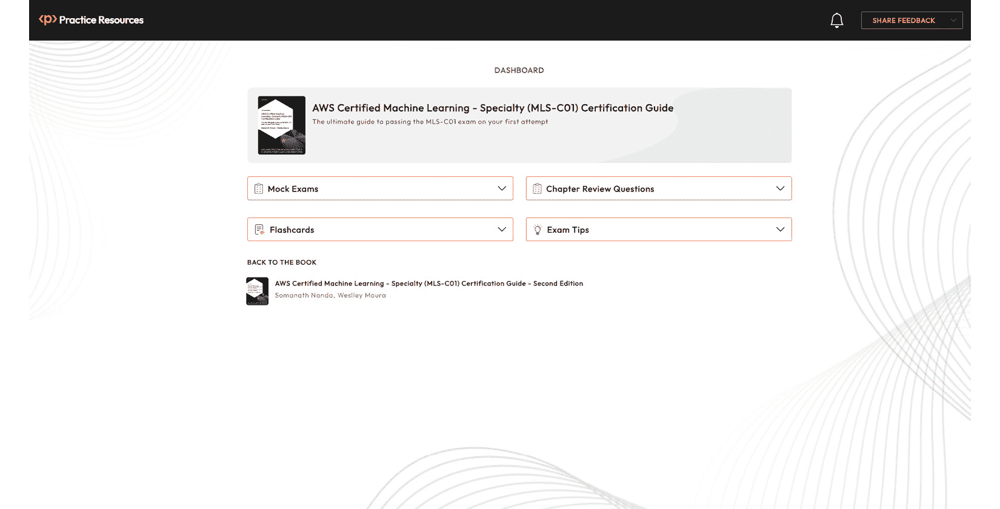

# 前言

AWS 机器学习专业认证考试测试您在 AWS 基础设施上执行**机器学习**（**ML**）的能力。本书通过使用实际示例深入覆盖整个考试大纲，以帮助您在 AWS 上进行实际的机器学习项目。

从 AWS 机器学习的介绍开始，您将学习机器学习的基础知识，并探索重要的 AWS 服务，用于**人工智能**（**AI**）。然后您将了解如何使用多个 AWS 服务，如 S3 和 EMR，来存储和处理机器学习数据。

您还将学习如何为机器学习准备数据，并发现针对不同类型变量的数据操作和转换的不同技术。本书涵盖了处理缺失数据和异常值，并带您通过各种机器学习任务，如分类、回归、聚类、预测、异常检测、文本挖掘和图像处理，以及您需要了解以通过考试的具体机器学习算法。最后，您将探索模型评估、优化和部署，并掌握在生产环境中部署模型和监控它们的方法。

在本书结束时，您将掌握机器学习所有关键领域的知识，以及 AWS 为每个领域发布的解决方案，包括每个 AWS 机器学习领域常用的工具、方法和技术。本书不仅旨在支持您通过 AWS 机器学习专业认证考试，而且还能使您的机器学习专业旅程变得更加容易。

# 本书面向对象：

这本书旨在为准备参加 AWS 认证机器学习专业考试的学生和专业人士提供帮助，同时也能增强他们对机器学习的理解，特别强调 AWS。建议读者熟悉机器学习基础知识以及 AWS 服务，以便充分利用本书。

# 本书涵盖内容：

*第一章**，机器学习基础*，涵盖了机器学习的定义、不同的建模方法类型，以及构建机器学习产品所需的所有步骤。

*第二章**，AWS 数据存储服务*，介绍了用于机器学习数据存储的 AWS 服务。您将了解多种不同的 S3 存储类别及其适用场景。您还将学习如何处理数据加密，以及如何在静态和传输过程中保护您的数据。最后，您还将了解其他值得了解的考试相关数据存储服务类型。

*第三章**，AWS 数据迁移和处理服务*，介绍了用于机器学习数据处理 AWS 服务。您将学习如何处理批处理和实时处理，如何直接查询 Amazon S3 上的数据，以及如何在 EMR 上创建大数据应用程序。

*第四章**，数据准备和转换*，处理分类和数值特征，并应用不同的技术来转换您的数据，例如独热编码、二进制编码、有序编码、分箱和文本转换。您还将了解如何处理数据中的缺失值和异常值，这两个对于构建良好的机器学习模型非常重要的话题。

*第五章**，数据理解和可视化*，教您如何根据不同的变量类型和业务需求选择最合适的数据可视化技术。您还将了解 AWS 的数据可视化服务。

*第六章**，应用机器学习算法*，涵盖了不同类型的机器学习任务，如分类、回归、聚类、预测、异常检测、文本挖掘和图像处理。每个任务都有特定的算法，您应该了解这些算法才能通过考试。您还将了解集成模型的工作原理以及如何处理维度诅咒。

*第七章**，评估和优化模型*，教您如何选择模型指标来评估模型结果。您还将学习如何通过调整其超参数来优化您的模型。

*第八章**，AWS 人工智能/机器学习应用服务*，涵盖了 AWS 提供的 AI/ML 应用程序的详细信息，您需要了解这些信息才能通过考试。

*第九章**，Amazon SageMaker 模型构建*，教您如何启动笔记本进行探索性数据分析，以及如何在 Amazon SageMaker 上训练您的模型。您将了解您的训练数据应存储在哪里以及如何通过 SageMaker 访问，并探索您可以使用的不同数据格式。

*第十章**，模型部署*，介绍了几个 AWS 模型部署选项。您将回顾 SageMaker 部署选项，创建带有 Lambda 函数的替代管道，使用 Step Functions 进行操作，配置自动扩展，以及保护 SageMaker 应用程序。

# 如何使用本书

这本 AWS 认证机器学习专业研究指南使用现实生活中的示例和全面的理论知识，解释了考试大纲中的每个概念。这本书是您在自信地通过 AWS 认证机器学习专业考试时的首选资源。

# 在线实践资源

使用本书，您将解锁无限访问我们的在线考试准备平台（*图 0**.1*）。这是您练习本书中学到的所有内容的场所。

如何访问资源

要了解如何访问在线资源，请参阅本书末尾的 **第十一章**，访问在线实践资源*。



图 0.1 – 桌面设备上的在线考试准备平台

通过多套模拟考试、交互式闪卡和来自所有现代网络浏览器的考试技巧，加深您对 MLS-C01 概念的理解。

# 下载彩色图像

我们还提供了一个包含本书中使用的截图/图表的彩色图像的 PDF 文件。您可以从这里下载：[`packt.link/ky8E8`](https://packt.link/ky8E8)。

# 使用的约定

本书中使用了多种文本约定。

`文本中的代码`：表示文本中的代码单词、数据库表名、文件夹名、文件名、文件扩展名、路径名、虚拟 URL、用户输入和 Twitter 昵称。以下是一个示例：“您将在代码中使用 Amazon Rekognition 的`detect_labels` API。”

代码块设置如下：

```py
from sagemaker.predictor import Predictor
```

```py
predictor = Predictor(endpoint_name='your-endpoint-name', sagemaker_session=sagemaker_session)
```

```py
predictor.predict('input_data')
```

任何命令行输入或输出都应如下编写：

```py
sh-4.2$ cd ~/SageMaker/ sh-4.2$ git clone https://github.com/PacktPublishing/ AWS-Certified-Machine-Learning-Specialty-MLS-C01- Certification-Guide-Second-Edition.git
```

**粗体**：表示新术语、重要单词或您在屏幕上看到的单词。例如，菜单或对话框中的单词在文本中显示如下。以下是一个示例：“在**CloudWatch**中，每个**Lambda 函数**都将有一个**日志组**，在该日志组内部，有许多**日志流**。”

提示或重要注意事项

看起来像这样。

# 联系我们

我们读者的反馈总是受欢迎的。

**一般反馈**：如果您对本书的任何方面有疑问，请在邮件主题中提及书名，并通过 mailto:customercare@packt.com 与我们联系。

**勘误**：尽管我们已经尽最大努力确保内容的准确性，但错误仍然可能发生。如果您在这本书中发现了错误，我们非常感谢您能向我们报告。请访问[www.packtpub.com/support/errata](http://www.packtpub.com/support/errata)，选择您的书籍，点击勘误提交表单链接，并输入详细信息。我们确保所有有效的勘误都会及时更新在 GitHub 仓库中，相关信息可在 Readme.md 文件中找到。您可以通过以下链接访问 GitHub 仓库：[`packt.link/QFk6t`](https://packt.link/QFk6t)。

**盗版**：如果您在互联网上以任何形式遇到我们作品的非法副本，我们非常感谢您能提供位置地址或网站名称。请通过 mailto:copyright@packt.com 与我们联系，并提供材料的链接。

**如果您有兴趣成为作者**：如果您在某个领域有专业知识，并且您有兴趣撰写或为书籍做出贡献，请访问[authors.packtpub.com](http://authors.packtpub.com)。

分享您的想法

一旦您阅读了*AWS Certified Machine Learning - Specialty (MLS-C01) Certification Guide, Second Edition*，我们很乐意听到您的想法！请[点击此处直接进入此书的亚马逊评论页面](https://packt.link/r/1835082203)并分享您的反馈。

您的评论对我们和科技社区非常重要，并将帮助我们确保我们提供高质量的内容。

# 下载此书的免费 PDF 副本

感谢您购买此书！

您喜欢在路上阅读，但无法携带您的印刷书籍到处走吗？

您的电子书购买是否与您选择的设备不兼容？

别担心，现在，您每购买一本 Packt 书籍，都可以免费获得该书的 DRM 免费 PDF 版本。

在任何地方、任何地点、任何设备上阅读。直接从您喜欢的技术书籍中搜索、复制和粘贴代码到您的应用程序中。

优惠远不止于此，您还可以获得独家折扣、时事通讯和每日免费内容的每日电子邮件。

按照以下简单步骤获取福利：

1.  扫描下面的二维码或访问以下链接：


[`packt.link/free-ebook/9781835082201`](https://packt.link/free-ebook/9781835082201)

1.  提交您的购买证明。

1.  就这样！您将直接通过电子邮件发送免费 PDF 和其他福利。
