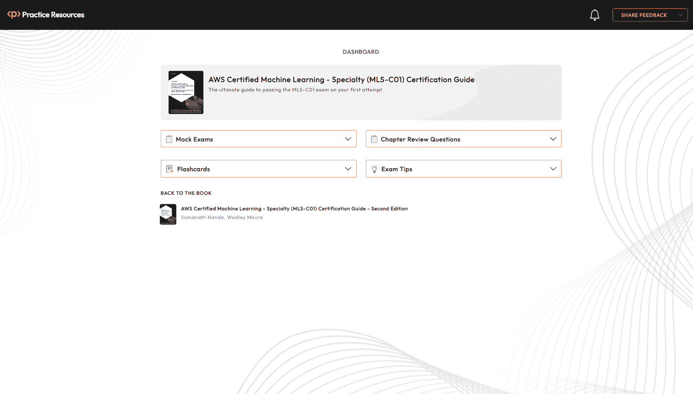
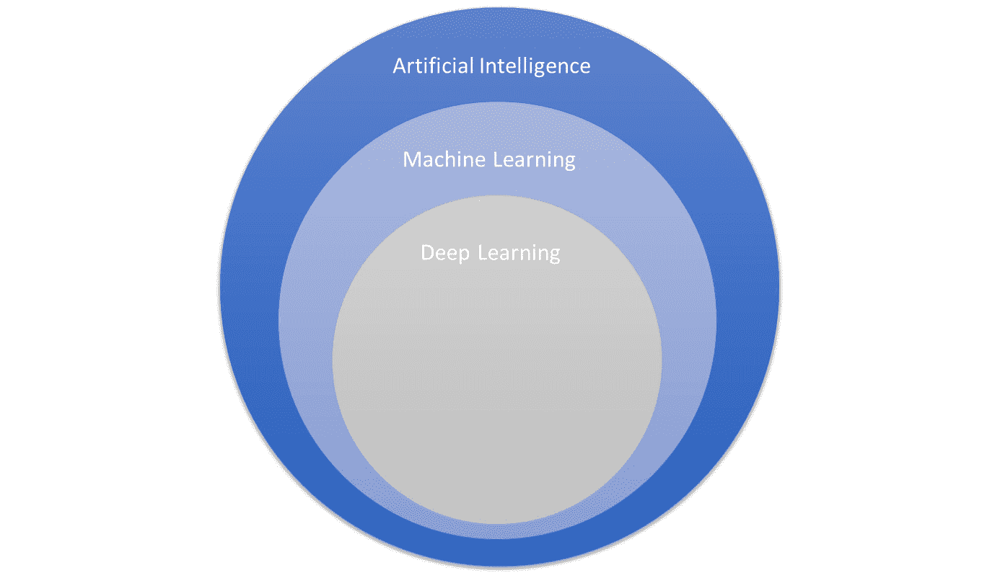
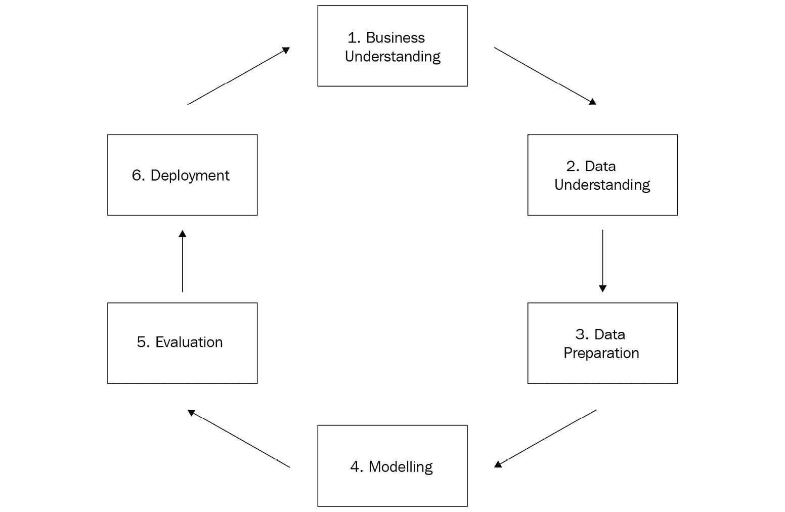
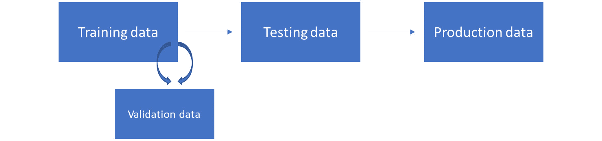
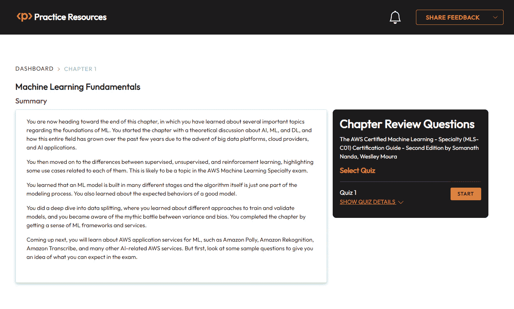

# 第一章：机器学习基础

几十年来，研究人员一直在通过被称为**人工智能**（或简称**AI**）的领域来模拟人类大脑活动。1956 年，一群人在达特茅斯夏季人工智能研究项目上会面，这一事件被广泛接受为今天所知的第一次关于人工智能的集体讨论。研究人员试图证明学习过程的许多方面可以被精确描述，因此可以被机器自动化和复制。今天，你知道他们是正确的！

在这个领域还出现了许多其他术语，例如**机器学习**（**ML**）和**深度学习**（**DL**）。这些 AI 的子领域也已经发展了几十年（当然，这里没有什么是对科学界来说是新的）。然而，随着信息社会的自然进步，以及最近**大数据**平台的兴起，AI 应用程序以更广泛的应用性重生——力量（因为现在有更多的计算资源来模拟和实现它们）和适用性（因为现在信息无处不在）。

更近一些，云服务提供商已经将 AI 带入云端。这有助于各种规模的公司降低其运营成本，甚至让他们能够尝试 AI 应用程序，考虑到对于一家小公司来说，维护自己的数据中心以扩展 AI 应用程序可能成本过高。

随着大数据和云服务的普及，出现了构建尖端 AI 应用程序的不凡之旅。2020 年 6 月，一项具体的技术引起了广泛关注，并将 AI 列为技术行业中最受讨论的话题之一——它的名字叫 ChatGPT。

ChatGPT 是一种流行的 AI 应用程序，它使用在大量文本数据上训练的大型语言模型（更具体地说，是**生成式预训练转换器**）来理解和生成类似人类的语言。这些模型旨在处理和理解人类语言的复杂性，包括语法、上下文和语义。

大型语言模型利用深度学习技术（例如，基于转换器架构的深度神经网络）来学习文本数据中的模式和关系。它们由数百万个参数组成，这使得它们高度复杂，能够捕捉非常具体的语言结构。

这种术语和不同类别的用例的混合可能会让人在理解实施 AI 应用程序的实用步骤时感到困惑。这把你带到了本章的目标：能够描述 AI、ML 和 DL 这些术语的含义，以及理解 ML 管道的所有细微差别。避免对这些术语的混淆，并确切了解 ML 管道是什么，将允许你正确选择服务，开发你的应用程序，并掌握 AWS 机器学习专业考试。

## 充分利用这本书——你的认证以及更远

这本书及其附带在线资源旨在成为你**MLS-C01 考试**的完整准备工具。

这本书是以一种方式编写的，你可以在认证后应用在这里学到的所有内容。这本书附带在线实践资源（*图 1**.1*）旨在提高你的应试技巧。它们包含了定时模拟考试、互动闪卡和考试技巧，帮助你从现在开始直到考试当天准备考试。

在继续之前

要了解如何访问这些资源，请前往书的末尾的*第十一章*，*访问在线实践资源*。

图 1.1 – 在线实践资源的仪表板界面

以下是一些如何充分利用这本书以通过你的认证并在考试后保留知识的技巧：

1.  仔细阅读每一部分。

1.  从仪表板到**Packt Reader**中访问书籍的`BACK TO THE BOOK`链接。你可以在那里突出显示书籍的特定部分。

1.  **章节复习题**：在本章末尾，你会找到一个链接来查看本章的复习题。这些题目旨在测试你对本章的知识。目标是在进入下一章之前至少得分**75%**。你可以在本章末尾的*考试准备练习 - 章节复习题*部分找到如何充分利用这些题目的详细说明。这样，你就可以在每一章之后提高你的应试技巧，而不是在最后。

1.  **闪卡**：在你阅读完本书并在每个章节复习题中得分提高**75%**之后，开始复习在线闪卡。它们将帮助你记住关键概念。

1.  **模拟考试**：在考试当天之前，解决书中附带的所有模拟考试。如果你有一些答案错误，回到书中并重新审视你薄弱的概念。

1.  **考试技巧**：不时回顾这些内容，以进一步提高你的考试准备。

本章的主要内容包括以下内容：

+   比较人工智能、机器学习和深度学习

+   对监督学习、无监督学习和强化学习进行分类

+   CRISP-DM 建模生命周期

+   数据拆分

+   建模预期

+   介绍机器学习框架

+   云中的机器学习

# 比较人工智能、机器学习和深度学习

人工智能是一个广泛的研究领域，研究通过模拟人类智能来创建系统和机器以解决问题的不同方法。创建这些程序和机器的复杂性不同，从简单的基于规则的引擎到复杂的自我学习系统。人工智能涵盖了但不限于以下子领域：

+   机器人技术

+   **自然语言处理**（NLP）

+   基于规则的系统

+   机器学习（ML）

+   计算机视觉

这项认证考试关注的领域是机器学习（ML）。

## 检验机器学习

机器学习是人工智能的一个子领域，旨在创建可以从经验中学习，而不需要明确编程的系统。正如其名称所暗示的，系统可以观察其底层环境，学习并适应自身，而不需要人为干预。机器学习系统背后的算法通常从它们可用的数据和条件下提取和改进知识。

图 1.2 – 人工智能、机器学习和深度学习的层次结构

你应该记住，存在不同类别的机器学习算法。例如，基于决策树的模型、基于概率的模型和神经网络模型。这些类别中的每一个都可能包含数十种特定的算法或架构（其中一些将在本书的后续章节中介绍）。

正如你可能已经在*图 1.2*中注意到的，你可以更加具体，并将机器学习领域分解为机器学习专业考试中另一个非常重要的主题：深度学习，或简称 DL。

## 检查深度学习

深度学习是机器学习的一个子集，旨在提出将多个层连接起来以解决特定问题的算法。然后，知识逐层传递，直到找到最佳解决方案。最常见类型的深度学习算法是深度神经网络。

在撰写本书时，深度学习是机器学习领域的一个非常热门的话题。目前大多数最先进的机器翻译、图像标题和计算机视觉算法都是在过去几年中提出的，并且是深度学习领域的一部分（ChatGPT 应用中使用的 GPT-4 就是这些算法之一）。

现在你已经了解了人工智能的类型概述，让我们看看你可以如何对机器学习进行分类。

# 对监督学习、无监督学习和强化学习进行分类

机器学习是一个非常广泛的研究领域；这就是为什么清晰地定义其子领域非常重要。从非常广泛的角度来看，你可以将机器学习算法分为两大类：监督学习和无监督学习。

## 介绍监督学习

监督算法使用来自输入数据的类别或标签作为支持来寻找和验证最佳解决方案。在*表 1.1*中，有一个数据集旨在从一家金融公司分类欺诈交易。

| **星期** | **小时** | **交易金额** | **商户类型** | **是否欺诈** |
| --- | --- | --- | --- | --- |
| 周一 | 09:00 | $1000 | 零售 | 否 |
| 周二 | 23:00 | $5500 | 电子商务 | 是 |
| 周五 | 14:00 | $500 | 旅行 | 否 |
| 周一 | 10:00 | $100 | 零售 | 否 |
| 周二 | 22:00 | $100 | 电子商务 | 否 |
| 周二 | 22:00 | $6000 | 电子商务 | 是 |

表 1.1 – 监督学习样本数据集

前四列被称为**特征**或**自变量**，它们可以被监督算法用来寻找欺诈模式。例如，通过结合这四个特征（星期几、东部标准时间小时、交易金额和商家类型）以及六个观察值（每一行在技术上是一个观察值），你可以推断出价值超过$5,000 且在夜间处理的电子商务交易可能是欺诈案例。

重要提示

在实际场景中，你将拥有更多的观察值，以便有统计支持来做出这种类型的推断。

关键点在于，你能够仅仅因为事先知道什么是欺诈以及什么不是欺诈，就推断出一个潜在的欺诈模式。这种信息在*表 1.1*的最后一列中，通常被称为目标变量、标签、响应变量或因变量。如果输入数据集有一个目标变量，你应该能够应用监督学习。

在监督学习中，目标变量可能存储不同类型的数据。例如，它可能是一个二元列（是或否），一个多类列（A 类、B 类或 C 类），甚至是一个数值列（任何实数，如交易金额）。根据目标变量的数据类型，你可以找到你的问题属于哪种类型的监督学习。*表 1.2*展示了如何将监督学习分为两大组：**分类**和**回归**算法：

| **目标变量的数据类型** | **目标变量的子数据类型** | **适用的监督学习类型** |
| --- | --- | --- |
| 分类 | 二元 | 二元分类 |
| 分类 | 多类 | 多分类 |
| 数值 | N/A | 回归 |

表 1.2 – 根据目标变量选择合适的监督学习类型

虽然分类算法预测一个类别（要么是二分类，要么是多分类），回归算法预测一个实数（要么是连续的，要么是离散的）。

理解数据类型对于在机器学习项目中做出正确的决策非常重要。你可以将数据类型分为两大类：数值数据和分类数据。数值数据可以进一步分为连续或离散子类，而分类数据可能指的是有序或无序数据：

+   **数值/离散数据**指的是单个和可数的项目（例如，教室里的学生数量或在线购物车中的商品数量）。

+   **数值/连续数据**指的是无限可能的测量值，它们通常带有小数点（例如，温度）。

+   **分类/名义数据**指的是没有数量值的标签变量（例如，姓名或性别）。

+   **分类/有序数据**为标签变量增加了一种顺序感（例如，教育水平或员工职称级别）。

换句话说，在选择项目中的算法时，你应该问自己：*我有一个目标变量吗？它存储的是分类数据还是数值数据？* 回答这些问题将使你处于更好的位置，以便选择一个可能解决问题的潜在算法。

然而，如果你没有目标变量怎么办？在这种情况下，你面临的是一个无监督学习问题。无监督问题不提供标记数据；相反，它们提供所有独立的变量（或特征），这将允许无监督算法在数据中找到模式。最常见的一种无监督学习是**聚类**，它旨在根据特征将数据集的观测值分组到不同的簇中，纯粹基于它们的特征。来自同一簇的观测值预计将彼此相似，但与其他簇的观测值非常不同。聚类将在本书未来的章节中详细介绍。

**半监督学习**也存在于机器学习文献中。这类算法可以从部分标记的数据中学习（一些观测值包含标签，而另一些则没有）。

最后，另一类机器学习算法采用的学习方法是**强化学习**。这种方法根据系统自主做出的良好决策进行奖励；换句话说，系统通过经验学习。

你一直在非常广泛地学习算法的途径和类别。然而，现在是时候具体化并介绍术语**模型**了。

# CRISP-DM 建模生命周期

在机器学习中，当你想要指定解决特定问题的步骤时，**建模**是一个非常常见的术语。例如，你可以创建一个二元分类模型来预测*表 1.1*中的交易是否欺诈。

在这个背景下，一个模型代表创建解决方案的所有步骤，作为一个整体，包括（但不限于）算法。《跨行业数据挖掘标准流程》，更常被称为**CRISP-DM**，是提供指导的方法之一，指导你应遵循的常见步骤来创建模型。这种方法在市场上被广泛使用，并在 AWS 机器学习专业考试中有所涉及：

图 1.3 – CRISP-DM 方法

一切始于业务理解，这将产生业务目标（包括成功标准）、情况评估、数据挖掘目标以及项目计划（包括对工具和技术的初步评估）。在情况评估期间，你还应该考虑资源清单、需求、假设和约束、风险、术语、成本和收益。当你建模时，每一个假设和成功标准都很重要。

下一个步骤被称为数据理解，在这个阶段，你将收集原始数据，描述它，探索它，并检查其质量。这是对将要用于创建模型的数据的初步评估。再次强调，数据科学家必须保持怀疑态度。你必须确保你理解数据的所有细微差别及其来源。

数据准备阶段实际上是建模过程中通常消耗最多时间的一个阶段。在这个阶段，你需要选择和过滤数据，根据需要执行的任务对其进行清理，提出新的属性，将数据与其他数据源集成，并按照将要应用的算法的预期格式化。这些任务通常被称为**特征工程**。

一旦数据准备就绪，你就可以最终开始建模阶段。这是算法发挥作用的地方。你应该首先确保选择正确的技术。记住：根据目标变量（及其数据类型）的存在与否，你将拥有不同的算法可供选择。每种建模技术可能都包含一些你必须注意的隐含假设。例如，如果你选择多重线性回归算法来预测房价，你应该意识到这种类型的模型期望你的数据变量之间存在线性关系。

现在有数百种算法，每种算法可能都有自己的假设。在选择你想要在项目中测试的算法之后，你应该花一些时间检查它们的特定细节。在本书的后续章节中，你将了解其中的一些。

重要提示

一些算法在其逻辑中集成了称为**特征选择**的子过程。这是一个选择最重要的特征以构建最佳模型的过程。决策树是自动执行特征选择的算法的例子。你将在稍后更详细地了解特征选择，因为选择模型最佳变量的方法有很多种。

在建模阶段，你还应该为模型设计一个测试方法，定义将使用哪些评估指标以及数据将如何分割。有了这些，你就可以通过设置算法的超参数并使用数据来喂养模型，最终构建模型。这个过程被称为**训练过程**，用于喂养模型的数据被称为**训练数据**。有不同方式来组织训练和**测试数据**，你将在本章中了解这些内容。

重要提示

机器学习算法由参数和超参数组成。参数是从数据中学习的；例如：一个基于决策树的算法可能会从训练数据中学习到，根据信息增益评估，某个特征应该组成其根级别。另一方面，超参数用于控制学习过程。以相同的决策树为例，你可以指定树的最大允许深度（无论训练数据如何）。超参数调整是考试中的一个非常重要的话题，将在稍后进行详细讨论。

模型训练完成后，你可以评估和审查结果，以便提出下一步行动。如果结果不可接受（基于业务成功标准），你应该回到早期步骤，检查还可以做些什么来提高模型的结果。这可能包括算法超参数的微妙调整、新的数据准备步骤，甚至重新定义业务驱动因素。另一方面，如果模型质量可接受，你可以进入部署阶段。

在 CRISP-DM 方法论的最后一个阶段，你必须考虑模型的部署计划、监控和维护。你可以从两个角度看待这一步：训练和推理。**训练管道**包括训练模型所需的步骤，包括数据准备、超参数定义、数据拆分和模型训练本身。无论如何，你必须将所有模型工件存储在某个地方，因为它们将被下一个需要开发的管道使用：**推理管道**。

推理管道仅使用模型工件来对全新的观测值（在训练阶段从未被模型见过的数据）执行模型。例如，如果模型被训练来识别欺诈交易，那么这就是新交易将通过模型进行分类的时候。

通常，模型只训练一次（通过训练管道）并执行多次（通过推理管道）。然而，经过一段时间后，预计会出现一些模型退化，也称为**模型漂移**。这种现象发生是因为模型通常在静态训练集上训练，旨在代表某一时间点的业务场景；然而，业务在不断发展，可能需要使用更近期的数据进行模型重新训练，以捕捉新的业务方面。这就是为什么在模型部署后，跟踪模型性能同样重要的原因。

CRISP-DM 方法论对于 AWS 机器学习专业考试的内容至关重要，如果你查看 AWS 涵盖的四个领域，你会意识到它们是从 CRISP-DM 阶段概括出来的：数据工程、探索性数据分析、建模和机器学习实施与运营。

你现在已经理解了建模流程的所有关键阶段，并且知道算法本身只是更大流程的一部分！接下来，你将了解如何拆分数据以创建和验证机器学习模型。

# 数据拆分

训练和评估机器学习模型是建模流程中的关键任务。机器学习算法需要数据来找到特征之间的关系以便进行推断，但这些推断在移动到生产环境之前需要得到验证。

用于训练机器学习模型的集合通常被称为训练集。这些训练数据必须能够代表模型将被使用的真实环境；如果不符合这一要求，它们将毫无用处。

回到*表 1.1*中提到的欺诈示例，根据训练数据，你发现价值超过$5,000 且在夜间处理的电子商务交易可能是欺诈案例。考虑到这一点，在将模型应用于生产环境后，模型应该标记出在训练过程中学习到的类似案例。

因此，如果这些案例仅存在于训练集中，模型在生产环境中将标记**假阳性**案例。相反的情况也是真实的：如果生产数据中存在某个欺诈案例，而在训练数据中没有反映出来，模型将标记大量**假阴性**案例。假阳性和假阴性比率只是许多可用于模型验证的质量指标中的两个。这些指标将在稍后的内容中详细讨论。

到目前为止，你应该已经清楚地理解了拥有一个好的训练集的重要性。现在，假设你确实有一个有效的训练集，你如何能够有一定程度的信心认为这个模型将在生产环境中表现良好？答案是使用测试集和验证集：

图 1.4 – 数据拆分

*图 1.4*展示了在训练和推理管道中可能遇到的不同数据拆分类型。训练数据用于创建模型；测试数据用于提取最终的模型质量指标。出于任何原因，测试数据*不能*在训练过程中使用，除了提取模型指标。

避免在训练过程中使用测试数据的原因很简单：你*不能*让模型在用于验证的数据上学习。这种保留一部分数据用于测试的技术通常被称为**保留验证**。

*图 1.4*右侧的框代表生产数据。生产数据通常连续不断地到来，你必须执行推理管道以从中提取模型结果。在生产数据上不进行任何训练，也不进行任何其他类型的重新计算；你只需将其按原样通过推理管道即可。

从技术角度来看，大多数机器学习库使用`.fit`方法实现训练步骤，而推理步骤则通过`.transform`或`.predict`方法实现。再次强调，这只是一个大多数机器学习库使用的常见模式，但请注意，你可能会在不同的机器学习库中找到不同的命名约定。

仍然参考*图 1.4*，还有一个靠近训练数据的数据框，名为**验证数据**。这是训练集的一个子集，通常用于在进入测试阶段之前支持最佳模型的选择。你将更详细地了解验证集，但首先，你应该了解为什么你需要它们。

## 过拟合和欠拟合

机器学习模型可能会遭受两种类型的拟合问题：**过拟合**和**欠拟合**。过拟合意味着你的模型在训练数据上表现非常好，但不能推广到其他数据集，如测试数据，甚至更糟糕的是，生产数据。换句话说，如果你有一个过拟合的模型，它只在你训练的数据上工作。

当你在构建机器学习模型时，你希望创建能够推广他们所学的知识并推断出其他遵循相同数据分布的数据集的决策的解决方案。一个只在其训练数据上工作的模型是无用的。过拟合通常是由于特征数量过多或算法超参数配置不足造成的。

另一方面，欠拟合模型在训练阶段无法拟合数据。因此，它们过于通用，无法在训练、测试或生产数据中表现良好。欠拟合通常是由于缺乏良好的特征/观察结果，或者由于缺乏训练模型的时间（某些算法需要更多的迭代来正确拟合模型）。

需要避免过拟合和欠拟合。有许多建模技术可以解决这些问题。例如，你将了解常用的**交叉验证**技术及其与图*1.4*中显示的验证数据框的关系。

## 应用交叉验证和测量过拟合

交叉验证是一种将训练集分成训练集和验证集的技术。然后，模型在训练集上训练并在验证集上测试。最常用的交叉验证策略被称为**k 折交叉验证**，其中 k 是训练集分割的数量。

使用 k 折交叉验证并假设 k 的值为 10，你将训练集分成 10 个部分。模型将被训练和测试 10 次。在每次迭代中，它使用 9 个部分进行训练，留下一个部分进行测试。经过 10 次执行后，从每个迭代中提取的评估指标将被平均，并将代表训练阶段的最终模型性能，如图*1.5*所示：

图 1.5 – 交叉验证的实际应用

另一种常见的交叉验证技术被称为**留一法交叉验证**（**LOOCV**）。在这种方法中，模型被多次执行，并且在每次迭代中，一个观测值被分离出来用于测试，其余的用于训练。

在训练期间使用交叉验证有许多优点：

+   你通过在特定数据块上训练模型并在另一个未用于训练的数据块上测试来减轻训练数据中的过拟合问题。

+   你避免了测试数据中的过拟合，因为不需要继续使用测试数据来优化模型。

+   你揭示了过拟合或欠拟合的存在。如果模型在训练/验证数据中的性能与在测试数据中观察到的性能非常不同，那么有问题。

值得注意的是，列表上的第三项在 AWS 机器学习专业考试中被广泛涉及。例如，假设你正在创建一个二元分类模型，在训练期间使用交叉验证，并使用测试集来提取最终指标（保留验证）。如果你在交叉验证结果中得到 80%的准确率，在测试集中得到 50%的准确率，这意味着模型过度拟合了训练集，因此不能推广到测试集。

另一方面，如果你在训练集中得到 50%的准确率，在测试集中得到 80%的准确率，那么数据中存在系统性问题。很可能训练集和测试集没有遵循相同的分布。

重要注意事项

准确率是分类模型中常用的模型评估指标。它衡量模型在推理过程中做出正确决策的频率。该指标仅用于演示目的，但请注意，有许多其他适用于每种类型模型的评估指标（将在适当的时候介绍）。

## 自举方法

交叉验证是验证机器学习模型的好策略，你应该作为数据科学家在日常活动中尝试它。然而，你也应该了解其他可用的重采样技术。**自举**就是其中之一。

虽然交叉验证是无替换的，但自举方法是有替换的。有替换意味着，当你从总体数据集中抽取多个随机样本时，相同的观测值可能会在样本中重复出现。

通常，自举不会像在传统的交叉验证方法中那样用于验证模型。原因是简单的：因为它是有替换的，用于训练的相同观测值可能会被用于测试。这会导致模型性能指标膨胀，因为估计器在预测训练集中已经看到的观测值时很可能是正确的。

自举法通常被机器学习算法以嵌入式方式使用，这需要重采样能力来处理数据。在这种情况下，自举法不是用来**验证**模型，而是用来**创建**模型。将在*第六章*“应用机器学习算法”中介绍的**随机森林**是那些在模型构建内部使用自举法的算法之一。

设计一个好的数据分割/采样策略对于模型或算法的成功至关重要。你应该想出不同的方法来分割你的数据，检查模型在每个分割上的表现，并确保这些分割代表了模型将被使用的真实场景。

## 方差与偏差权衡

任何机器学习模型都应包含错误。你可以在模型中找到三种类型的错误：**偏差**错误、**方差**错误和**未解释**错误。最后一个，正如预期的那样，无法解释。它通常与问题的上下文和变量之间的关系有关（你无法控制它）。

其他两种类型的错误可以在建模过程中进行控制。你可以这样说，偏差和方差错误之间存在权衡，因为一种将影响另一种。在这种情况下，增加偏差将减少方差，反之亦然。

偏差错误与模型为了学习目标函数（即你想要解决的问题）所采取的假设相关。某些类型的算法，如线性算法，通常携带这种类型的错误，因为它们在模型训练期间做出了很多假设。例如，线性模型假设数据中存在线性关系。线性回归和逻辑回归是通常包含高偏差的算法类型。另一方面，决策树是关于数据做出较少假设并包含较少偏差的算法类型。

方差与模型在不同训练数据上执行估计的差异相关。具有高方差的模型通常会过度拟合训练集。决策树是具有高方差（通常过度依赖训练集的特定信息，未能泛化）的算法的例子，而线性回归和逻辑回归是具有低方差的算法的例子。这并不意味着决策树是差的估计器；这只是意味着你需要在训练过程中对其进行修剪（优化）。

话虽如此，任何模型的目标都是最小化偏差和方差。然而，如前所述，每一个都会以相反的方向影响另一个。为了演示这种权衡是如何工作的，考虑一个决策树。

决策树是非线性算法，通常具有低偏差和高方差。为了降低方差，你可以剪枝树并设置`max_depth`超参数（树的最大允许深度）为 10。这将迫使模型更加通用，从而降低方差。然而，这种变化也将迫使模型做出更多假设（因为它现在更加通用）并增加偏差。

## 洗牌你的训练集

现在你已经了解了方差和数据拆分，你可以对训练数据集的要求进行更深入的了解。你很可能在考试中会遇到关于数据洗牌的问题。这个过程包括在你开始使用训练数据拟合算法之前对其进行随机化。

数据洗牌将帮助算法通过创建一个更具泛化能力的模型来减少方差。例如，假设你的训练数据代表一个二元分类问题，并且它是按照目标变量排序的（所有属于类别“0”的案例首先出现，然后是所有属于类别“1”的案例）。

当你在这些排序后的数据上拟合一个算法（尤其是那些依赖于**批量处理**的算法）时，它将对某一类别的模式做出强烈的假设，因为很可能它无法创建出能良好代表两类数据的随机批次。一旦算法对训练数据建立了强烈的假设，它可能很难改变这些假设。

重要提示

一些算法能够通过将数据分块拟合来执行训练过程，也称为批次。这种方法让模型能够更频繁地学习，因为它会在处理完每一批次数据后做出部分假设（而不是在处理整个数据集之后做出决策）。

另一方面，没有必要洗牌测试集，因为它将仅用于推理过程以检查模型性能。

# 建模期望

到目前为止，你已经学习了模型构建、验证和管理。现在，你可以通过学习建模时的其他一些期望来完善机器学习的基础。

第一个原则是**简约性**。简约性描述的是那些提供最简单解释并且与其他模型相比拟合最佳结果的模型。这里有一个例子：在创建线性回归模型时，你意识到添加 10 个更多特征只会使你的模型性能提高 0.001%。在这种情况下，你应该考虑这种性能提升是否值得简约性的成本（因为你的模型将变得更加复杂）。有时这是值得的，但大多数时候并不值得。你需要保持怀疑态度，并根据你的业务案例进行思考。

简约性直接支持**可解释性**。你的模型越简单，解释它就越容易。然而，在**可解释性**和**预测性**之间存在着一场斗争：如果你专注于预测能力，你很可能会失去一些可解释性。再次强调，你必须选择最适合你用例的最佳情况。

# 介绍机器学习框架

了解一些机器学习框架将使你在通过 AWS 机器学习专业考试时处于更有利的地位。没有必要掌握这些框架，因为这不是针对特定框架的认证；然而，了解一些常见术语和解决方案将有助于你理解问题/问题的背景。

**scikit-learn**可能是你应该了解的最流行的机器学习框架。它是一个开源的 Python 包，提供了诸如决策树、支持向量机、线性回归等机器学习算法的实现。它还实现了数据预处理类，例如，独热编码、标签编码器、主成分分析等。本书后面的章节将涵盖所有这些预处理方法（以及许多其他方法）。

scikit-learn 的缺点是需要定制才能通过多台机器进行扩展。还有一个非常流行的机器学习库，因为它可以直接处理多进程：**Spark 的 ML 库**。

如其名所示，它是一个在**Apache Spark**上运行的机器学习库，Apache Spark 是一个用于在多台机器上处理数据的统一分析多处理框架。AWS 提供了一种特定服务，允许开发者通过几点击就能创建 Spark 集群，称为**EMR**。此外，SageMaker（AWS 提供的一个完全托管的机器学习服务，你将在单独的章节中介绍）与 Apache Spark 很好地集成。

Spark ML 库正在不断发展。截至本书编写时，它支持许多机器学习算法类别，如分类和回归、聚类和协同过滤。它还提供了基本统计计算的支持，例如相关性和一些假设检验，以及许多数据转换，如独热编码、主成分分析、最小-最大缩放等。

另一个非常流行的机器学习框架被称为**TensorFlow**。这个机器学习框架是由谷歌团队创建的，用于数值计算和大规模机器学习模型开发。TensorFlow 不仅实现了传统的机器学习算法，还实现了深度学习模型。

TensorFlow 被认为是一个用于模型开发的低级 API，这意味着开发更复杂的模型，例如**transformers**（用于文本挖掘），可能会非常复杂。为了便于模型开发，其他机器学习框架被构建在 TensorFlow 之上，使其更容易使用。其中之一的高级框架是**Keras**。使用 Keras，开发者只需几行代码就能创建复杂的深度学习模型。最近，Keras 被整合到 TensorFlow 中，现在可以在 TensorFlow 库内部调用。

**MXNet**是另一个开源的深度学习库。使用 MXNet，你可以通过在多台机器上运行多个 GPU 来扩展基于神经网络的模型。它还支持不同的编程语言，如 Python、R、Scala 和 Java。

**图形处理单元**（**GPU**）支持在深度学习库如 TensorFlow 和 MXNet 中尤为重要。这些库允许开发者创建和部署具有多个层的神经网络模型。神经网络训练过程很大程度上依赖于矩阵运算，这些运算在 GPU 上比在 CPU 上表现更好。这就是为什么这些深度学习库通常提供 GPU 支持。AWS 还提供启用 GPU 的 EC2 实例。

这些机器学习框架需要一个特殊的通道来与 GPU 单元通信。NVIDIA，目前最常见的 GPU 供应商，创建了一个名为**Compute Unified Device Architecture**（**CUDA**）的 API。CUDA 用于配置 NVIDIA 设备上的 GPU 单元；例如，设置缓存内存和训练神经网络模型所需的线程数。对于 AWS 机器学习专业考试，不需要掌握 CUDA 或 GPU 架构，但你确实需要了解它们是什么以及深度学习模型如何利用它们。

最后，但同样重要的是，你还应该了解一些数据科学社区广泛使用的开发框架，但并不一定用于创建机器学习模型。这些框架与机器学习库交互，以促进数据处理和计算。例如：**pandas**是一个提供数据处理能力的 Python 库，**NumPy**是一个提供数值计算的开放源代码 Python 库。

这些术语和库已经如此融入数据科学家的日常工作中，以至于它们可能在考试中用来为你解释某个问题领域。了解它们将有助于你快速理解问题的上下文。

# 云端机器学习

机器学习已经走向云端，开发者现在可以将其作为一项服务使用。AWS 在不同的抽象级别上实现了机器学习服务。例如，机器学习应用服务旨在为特定问题领域提供即插即用的解决方案。**AWS Lex**是一个机器学习作为服务的非常清晰的例子，人们可以用最少的开发来实现聊天机器人。

**AWS Rekognition**是另一个例子，旨在识别图像和视频中的对象、人物、文本、场景和活动。AWS 提供许多其他机器学习应用服务，将在本书的下一章中介绍。

除了应用服务之外，AWS 还提供机器学习开发平台，例如**SageMaker**。与 AWS Lex 和 Rekognition 等现成服务不同，SageMaker 是一个开发平台，它将允许你以更大的灵活性构建、训练和部署自己的模型。

SageMaker 通过自动处理模型训练和推理管道所需的基础设施来加速开发和部署过程。在幕后，SageMaker 协调其他 AWS 服务（如 EC2 实例、负载均衡器、自动扩展等）以创建一个可扩展的机器学习项目环境。SageMaker 可能是你应该掌握的 AWS 机器学习专业考试中最重要的服务之一，它将在单独的部分中详细说明。目前，你应该专注于理解 AWS 提供与机器学习相关的服务所采用的不同方法。

AWS 提供的用于部署机器学习模型的第三种选项是最通用和灵活的：你可以通过组合不同的 AWS 服务并单独管理它们来部署机器学习模型。这本质上就是 SageMaker 为你做的事情，从头开始构建你的应用程序。例如，你可以使用 EC2 实例、负载均衡器、自动扩展和 API 网关来为特定模型创建推理管道。如果你愿意，你也可以使用 AWS 无服务器架构来部署你的解决方案，例如，使用**AWS** **Lambda 函数**。

# 摘要

你现在正走向本章的结尾，其中你学习了关于机器学习基础的一些重要主题。你以关于人工智能、机器学习和深度学习以及这一整个领域在过去几年中由于大数据平台、云提供商和人工智能应用的兴起而不断增长的理论讨论开始本章。

然后你转向监督学习、无监督学习和强化学习之间的区别，强调了与每个相关的一些用例。这可能是 AWS 机器学习专业考试中的一个主题。

你了解到机器学习模型是在许多不同的阶段构建的，算法本身只是建模过程的一部分。你还了解了良好模型预期的行为。

你深入研究了数据拆分，学习了训练和验证模型的不同方法，并意识到了方差和偏差之间的神话之战。你通过了解机器学习框架和服务完成了这一章节。

接下来，你将了解 AWS 机器学习应用服务，例如 Amazon Polly、Amazon Rekognition、Amazon Transcribe 以及许多其他与 AI 相关的 AWS 服务。但在那之前，先看看一些样题，以了解你在考试中可以期待什么。

# 考试准备练习 – 章节复习题

除了对关键概念有扎实的理解外，能够在时间压力下快速思考是一项帮助你通过认证考试的重要技能。这就是为什么在学习的早期阶段就练习这些技能是关键。

章节复习题旨在随着你学习并复习每个章节来逐步提高你的应试技巧，同时复习章节中的关键概念。你可以在每个章节的末尾找到这些题目。

如何访问这些资源

要了解如何访问这些资源，请参阅标题为 *第十一章* 的章节，*访问在线练习资源*。

要打开本章的章节复习题，请执行以下步骤：

1.  点击链接 – [`packt.link/MLSC01E2_CH01`](https://packt.link/MLSC01E2_CH01)。

    或者，你可以扫描以下 **二维码** (*图 1.6*)：

图 1.6 – 为登录用户打开章节复习题的二维码

1.  登录后，你将看到一个类似于 *图 1.7* 所示的页面：

图 1.7 – 第一章章节复习题

1.  准备就绪后，开始以下练习，多次重新尝试测验。

## 考试准备练习

对于前三次尝试，不要担心时间限制。

### 尝试 1

第一次尝试，目标至少达到 **40%**。看看你答错的答案，并再次阅读章节中相关的部分，以修复你的学习差距。

### 尝试 2

第二次尝试，目标至少达到 **60%**。看看你答错的答案，并再次阅读章节中相关的部分，以修复任何剩余的学习差距。

### 尝试 3

第三次尝试，目标至少达到 **75%**。一旦得分达到 75% 或以上，你就可以开始练习时间管理。

小贴士

你可能需要超过 **三次** 尝试才能达到 75%。没关系。只需复习章节中的相关部分，直到达到目标。

# 练习时间管理

目标：你的目标是保持分数不变，同时尽可能快地回答这些问题。以下是一个你接下来尝试应该看起来像的例子：

| **尝试** | **得分** | **用时** |
| --- | --- | --- |
| 尝试 5 | 77% | 21 分 30 秒 |
| 尝试 6 | 78% | 18 分 34 秒 |
| 尝试 7 | 76% | 14 分 44 秒 |

表 1.3 – 在线平台上的样本时间练习

注意

上表中显示的时间限制只是示例。根据网站上的测验时间限制，为每次尝试设定自己的时间限制。

每次新的尝试，你的得分应保持在**75%**以上，同时完成所需的时间“应减少”。你可以重复尽可能多的尝试，直到你觉得自己能够自信地应对时间压力。
