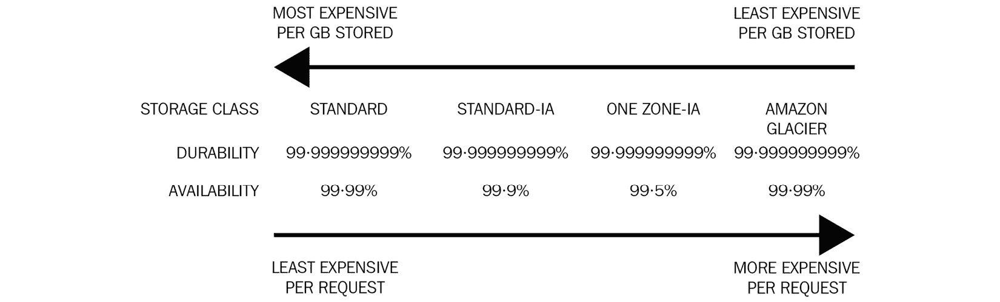
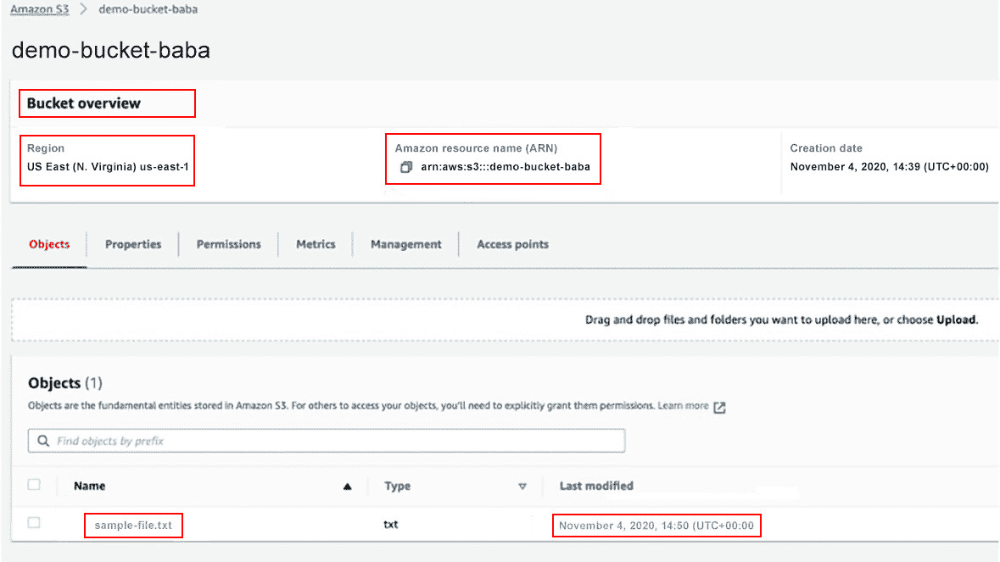
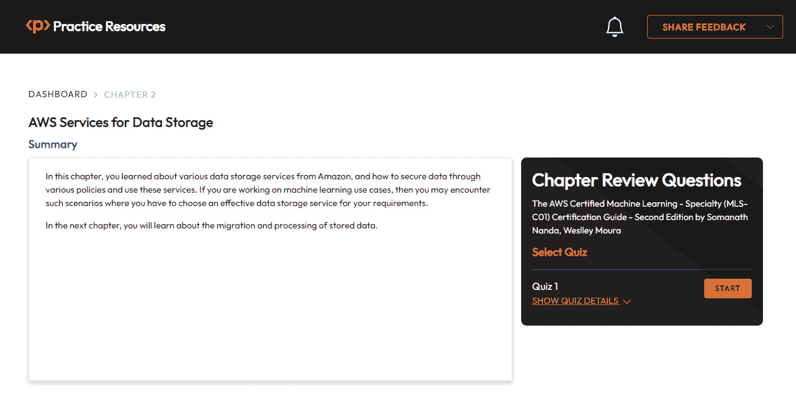

# 第二章：AWS 数据存储服务

AWS 提供了一系列服务来安全地存储你的数据。在 AWS 上提供了各种存储选项，例如块存储、文件存储和对象存储。由于硬件投资较高、管理开销和系统升级管理，本地数据存储管理成本较高。使用 AWS 存储服务，你只需为所使用的付费，无需管理硬件。你还将了解 Amazon S3 提供的各种存储类别，以实现数据的智能访问和降低成本。你可以期待在考试中关于存储类别的相关问题。随着你继续阅读本章，你将掌握 Amazon RDS 的**单可用区**和**多可用区**实例，以及**恢复时间目标**（**RTO**）和**恢复点目标**（**RPO**）的概念。

在本章中，你将学习如何在以下几节中安全地存储你的数据，以便进行进一步的分析：

+   在 Amazon S3 上存储数据

+   控制 S3 存储桶和对象的访问

+   保护 Amazon S3 上的数据

+   在静止和传输过程中保护 S3 对象

+   使用其他类型的数据存储

+   **关系数据库** **服务**（**RDS**）

+   管理 Amazon RDS 中的故障转移

+   自动备份、RDS 快照、恢复和读取副本

+   使用具有多主能力的 Amazon Aurora 进行写入

+   在 Amazon Redshift 上存储列式数据

+   作为服务的 NoSQL 数据库 Amazon DynamoDB

# 技术要求

本章所需的所有内容只是一个 AWS 账户和配置好的 AWS CLI。配置 AWS CLI 的步骤在 Amazon 这里有详细的解释：[`docs.aws.amazon.com/cli/latest/userguide/cli-chap-configure.html`](https://docs.aws.amazon.com/cli/latest/userguide/cli-chap-configure.html)。

你可以从 GitHub 下载代码示例，这里：[`github.com/PacktPublishing/AWS-Certified-Machine-Learning-Specialty-MLS-C01-Certification-Guide-Second-Edition/tree/main/Chapter02`](https://github.com/PacktPublishing/AWS-Certified-Machine-Learning-Specialty-MLS-C01-Certification-Guide-Second-Edition/tree/main/Chapter02)。

# 在 Amazon S3 上存储数据

S3 是 Amazon 基于云的对象存储服务，可以通过互联网从任何地方访问。它是大型数据集的理想存储选项。它是基于区域的，因为你的数据存储在特定的区域，直到你将数据移动到不同的区域。你的数据将永远不会离开该区域，直到它被配置为这样做。在特定区域，数据在该区域的可用区中进行复制；这使得 S3 在区域上具有弹性。如果该区域中的任何可用区失败，则其他可用区将处理你的请求。S3 可以通过 AWS 控制台 UI、AWS CLI、AWS API 请求或通过标准 HTTP 方法访问。

S3 有两个主要组件：**存储桶**和**对象**。

+   存储桶是在特定的 AWS 区域中创建的。存储桶可以包含对象，但不能包含其他存储桶。

+   对象有两个主要属性。一个是**键**，另一个是**值**。值是存储的内容，键是名称。对象的最大大小为 5 TB。根据亚马逊 S3 文档（[`docs.aws.amazon.com/AmazonS3/latest/dev/UsingObjects.html`](https://docs.aws.amazon.com/AmazonS3/latest/dev/UsingObjects.html)），对象还有版本 ID、元数据、访问控制信息和子资源。

重要提示

根据亚马逊的文档，S3 为新的 PUT 操作提供了写后一致性读取，这意味着如果你上传了一个新的对象或者创建了一个新的对象，然后立即尝试使用其键读取该对象，那么你会得到你刚刚上传的确切数据。然而，对于覆盖和删除操作，它以**最终一致性**的方式表现。这意味着如果你在删除或覆盖操作后立即读取一个对象，那么你可能会读取到旧副本或过时的对象版本。将对象的内容复制到三个可用区需要一些时间。

可以通过使用前缀来逻辑上维护文件夹结构。以一个例子来说明，一个图片被上传到一个名为`bucket-name-example`的桶中，前缀为`folder-name`，对象名为`my-image.jpg`。整个结构看起来是这样的：`/bucket-name-example/folder-name/my-image.jpg`。

可以使用`bucket-name-example`的桶名和`/folder-name/my-image.jpg`的键来读取对象的内容。

亚马逊为存储在 S3 中的对象提供了几种存储类别：

+   **标准存储（S3 Standard）**：这是频繁访问的对象和快速访问的存储类别。S3 标准具有毫秒级的首字节延迟，并且对象可以被公开访问。

+   **标准低频访问（S3 Standard-IA）**：当需要快速返回数据但不是频繁访问时，使用此选项。对象大小必须至少为 128 KB。最小存储时间为 30 天。如果对象在 30 天内被删除，你仍然会被收取 30 天的费用。Standard-IA 对象对可用区的丢失具有弹性。

+   **单区低频访问（S3 One Zone-IA）**：这个存储类别的对象只存储在一个可用区，这使得它比**Standard-IA**更便宜。最小对象大小和存储时间与 Standard-IA 相同。这个存储类别的对象可用性和弹性较低。当你有另一个副本，或者数据可以被重新创建时，使用这个存储类别。应该为长期存储的非关键且可替换的数据使用**One Zone-IA**存储类别，并且访问频率较低。

+   **Amazon S3 Glacier Flexible Retrieval（之前称为 S3 Glacier）**：此选项用于长期存档和备份。在此存储类别中检索对象可能需要从几分钟到几小时不等。最小存储时间为 90 天。对于不需要立即访问但需要能够检索大量数据集而不产生额外费用的存档数据，例如在备份或灾难恢复场景中，S3 Glacier Flexible Retrieval（之前称为 S3 Glacier）是完美的存储选项。

+   **Amazon S3 Glacier Instant Retrieval**：此存储类别为不常访问的长期数据提供经济高效、高速的存储。与 S3 Standard-Infrequent Access 相比，如果数据每季度访问一次，可以降低高达 68%的存储费用。此存储类别非常适合快速检索存档数据，如医学图像、新闻媒体资产或用户生成内容存档。您可以直接上传数据或使用 S3 生命周期策略将其从其他 S3 存储类别移动过来。

+   **Glacier Deep Archive**：此类别的最小存储时间为 180 天。这是最经济的存储类别，默认检索时间为 12 小时。

+   **S3 Intelligent-Tiering**：此存储类别旨在降低运营成本。用户支付监控费用，AWS 根据对象的访问模式在 Standard（频繁访问层）和 Standard-IA（成本较低、不频繁访问层）之间选择存储类别。此选项适用于具有未知或不可预测访问模式的长期数据。

通过一系列规则，可以轻松管理存储类别之间的转换和对象的删除，这些规则被称为**S3 生命周期配置**。这些规则包括操作。这些操作可以应用于一个存储桶或该存储桶中由前缀或标签定义的一组对象。操作可以是**转换操作**或**过期操作**。转换操作定义了在创建*用户定义的*天数后对象的存储类别转换。过期操作配置了版本化对象的删除，或删除标记或未完成的分片上传。这对于管理成本非常有用。

在*图 2.1*中给出了说明。更多详细信息请见：[`docs.aws.amazon.com/AmazonS3/latest/dev/storage-class-intro.html`](https://docs.aws.amazon.com/AmazonS3/latest/dev/storage-class-intro.html)。



图 2.1 – S3 存储类别的比较表

## 创建存储桶以存储数据

现在，您将了解如何使用 AWS CLI 创建存储桶、上传对象以及读取对象：

1.  在第一步，检查你是否已经使用 `aws s3 ls` 命令创建了任何存储桶：

    ```py
    $ pwd
    ```

    ```py
    /Users/baba/AWS-Certified-Machine-Learning-Specialty-
    ```

    ```py
    2020-Certification-Guide/Chapter-5/s3demo/demo-files
    ```

    ```py
    $ aws s3 ls
    ```

1.  此命令在此处不返回任何内容。因此，现在请使用 `mb` 参数创建一个存储桶。假设存储桶名称为 `demo-bucket-baba`，位于 `us-east-1` 区域：

    ```py
    $ aws s3 mb s3://demo-bucket-baba --region us-east-1
    ```

    ```py
    make_bucket: demo-bucket-baba
    ```

    ```py
    $ aws s3 ls
    ```

    ```py
    2020-11-04 14:39:50 demo-bucket-baba
    ```

1.  由于您已经创建了一个存储桶，您的下一步是使用 `cp` 参数将文件复制到您的存储桶中，如下面的代码所示：

    ```py
    $ aws s3 cp sample-file.txt s3://demo-bucket-baba/
    ```

    ```py
    upload: ./sample-file.txt to s3://demo-bucket-
    ```

    ```py
    baba/sample-file.txt
    ```

1.  要通过 AWS 控制台验证文件上传操作，请登录您的 AWS 账户并转到 AWS S3 控制台查看相同的内容。AWS S3 控制台将结果列示为 *图 2.2*。请注意，当您阅读这本书时，控制台可能已经发生了变化！



图 2.2 – AWS S3 列出您的文件

您也可以从命令行列出您的 S3 存储桶中的文件，如下所示：

```py
$ aws s3 ls s3://demo-bucket-baba/
```

```py
2020-11-04 14:50:02         99 sample-file.txt
```

1.  如果您想将您的文件系统目录和文件上传到 S3 存储桶，那么 `--recursive` 参数将为您完成工作：

    ```py
    $ aws s3 cp . s3://demo-bucket-baba/ --recursive
    ```

    ```py
    upload: folder-1/a.txt to s3://demo-bucket-baba/folder-1/a.txt
    ```

    ```py
    upload: folder-2/sample-image.jpg to s3://demo-bucket-baba/folder-2/sample-image.jpg
    ```

    ```py
    upload: ./sample-file.txt to s3://demo-bucket-baba/sample-file.txt
    ```

    ```py
    $ aws s3 ls s3://demo-bucket-baba/
    ```

1.  一个存储桶的内容可以通过 `cp` 命令和 `--recursive` 参数复制/移动到另一个存储桶。要实现这一点，您必须创建两个存储桶，`demo-bucket-baba-copied` 和 `demo-bucket-baba-moved`。步骤如下：

    ```py
    $ aws s3 mb s3://demo-bucket-baba-copied --region us-east-2
    ```

    ```py
    $ aws s3 mb s3://demo-bucket-baba-moved --region us-east-2
    ```

    ```py
    $ aws s3 cp s3://demo-bucket-baba s3://demo-bucket-baba-copied/ --recursive
    ```

    ```py
    $ aws s3 mv s3://demo-bucket-baba s3://demo-bucket-baba-moved/ --recursive
    ```

    ```py
    $ aws s3 ls
    ```

    ```py
    2020-11-04 14:39:50 demo-bucket-baba
    ```

    ```py
    2020-11-04 15:44:28 demo-bucket-baba-copied
    ```

    ```py
    2020-11-04 15:44:37 demo-bucket-baba-moved
    ```

    ```py
    $ aws s3 ls s3://demo-bucket-baba/
    ```

    如果所有命令都成功运行，那么原始存储桶最终应该是空的（因为所有文件现在都已移动）。

注意

在认证考试中，您不会在存储桶和对象级别操作中找到很多问题。然而，了解基本操作和所需步骤总是更好的。

1.  一旦实际操作完成，必须删除存储桶以避免费用。在运行 `rb` 命令之前，存储桶必须为空：

    ```py
    $ aws s3 rb s3://demo-bucket-baba
    ```

    ```py
    $ aws s3 rb s3://demo-bucket-baba-moved
    ```

    ```py
    remove_bucket failed: s3://demo-bucket-baba-moved An error occurred (BucketNotEmpty) when calling the DeleteBucket operation: The bucket you tried to delete is not empty
    ```

1.  `demo-bucket-baba-moved` 存储桶不为空，因此您无法删除该存储桶。在这种情况下，请使用 `--force` 参数删除整个存储桶及其所有内容，如下所示：

    ```py
    rm command with the --recursive parameter.
    ```

1.  让我们以一个具有前缀 `images` 的存储桶 `test-bucket` 为例。此前缀包含四个名为 `animal.jpg`、`draw-house.jpg`、`cat.jpg` 和 `human.jpg` 的图片文件。

1.  现在，要删除图片内的内容，命令如下：`aws s3 rm` `s3://test-bucket/images –recursive`

1.  现在存储桶应该是空的。

在下一节中，您将学习关于对象标签和对象元数据的内容。

## 区分对象标签和对象元数据

让我们比较这两个术语：

+   **对象标签**：对象标签是一个 **键值对**。AWS S3 对象标签可以帮助您过滤分析指标，对存储进行分类，根据某些分类对对象进行安全保护，根据对象的某些分类跟踪成本，以及更多。对象标签可以用来创建生命周期规则，将对象移动到更便宜的存储层。您可以为对象添加最多 10 个标签，为存储桶添加最多 50 个标签。标签键可以包含 128 个 Unicode 字符，而标签值可以包含 256 个 Unicode 字符。

+   **对象元数据**：对象元数据是描述对象的描述性数据。它由**名称-值**对组成。对象元数据作为对象的 HTTP 头返回。它们有两种类型：一种是**系统元数据**，另一种是**用户定义元数据**。用户定义元数据是用户添加到对象中的自定义名称-值对。名称必须以**x-amz-meta**开头。您可以更改对象上的所有系统元数据，如存储类、版本控制和加密属性。更多详细信息请参阅此处：[`docs.aws.amazon.com/AmazonS3/latest/dev/UsingMetadata.html`](https://docs.aws.amazon.com/AmazonS3/latest/dev/UsingMetadata.html)。

重要提示

元数据名称不区分大小写，而标签名称区分大小写。

在下一节中，您将学习如何通过不同的策略来控制 Amazon S3 中存储桶和对象的访问，包括资源策略和身份策略。

# 控制对 Amazon S3 中存储桶和对象的访问

一旦对象存储在存储桶中，下一步重要的步骤就是管理访问。S3 默认是私有的，并且通过多种方法向其他用户、组或资源提供访问权限。这意味着可以通过**访问控制列表（ACLs）**、**公共访问设置**、**身份策略**和**存储桶策略**来管理对象的访问权限。

让我们详细看看其中的一些。

## S3 存储桶策略

`Principal`被渲染为`*`：

```py
{
```

```py
  "Version":"2012-10-17"
```

```py
  "Statement":[
```

```py
    {
```

```py
      "Sid":"AnyoneCanRead",
```

```py
      "Effect":"Allow",
```

```py
      "Principal":"*",
```

```py
      "Action":["s3:GetObject"],
```

```py
      "Resource":["arn:aws:s3:::my-bucket/*"]
```

```py
    }
```

```py
    ]
```

```py
}
```

默认情况下，S3 中的所有内容对所有者都是私有的。如果您想将前缀公开给全世界，那么`Resource`将变为`arn:aws:s3:::my-bucket/some-prefix/*`，同样地，如果它是为特定的 IAM 用户或 IAM 组设计的，那么这些详细信息将包含在策略的主体部分。

您还可以在存储桶策略中添加条件。让我们考察一个组织希望保持存储桶公开并白名单特定 IP 地址的用例。该策略可能看起来像这样：

```py
{
```

```py
  "Version":"2012-10-17"
```

```py
  "Statement":[
```

```py
    {
```

```py
      "Sid":"ParticularIPRead",
```

```py
      "Effect":"Allow",
```

```py
      "Principal":"*",
```

```py
      "Action":["s3:GetObject"],
```

```py
      "Resource":["arn:aws:s3:::my-bucket/*"],
```

```py
      "Condition":{
```

```py
        "NotIpAddress":{"aws:SourceIp":"2.3.3.6/32"}
```

```py
      }
```

```py
    }
```

```py
    ]
```

```py
}
```

更多示例可以在 AWS S3 开发者指南中找到，该指南可在此处找到：[`docs.aws.amazon.com/AmazonS3/latest/dev/example-bucket-policies.html`](https://docs.aws.amazon.com/AmazonS3/latest/dev/example-bucket-policies.html)。

**阻止公共访问**是分配给存储桶所有者的一个独立设置，以避免在存储桶策略中犯任何错误。在现实场景中，存储桶可能会由于策略错误而公开；为了避免此类错误或数据泄露，AWS 提供了这个设置。它提供了比存储桶策略更高的安全级别。您可以在创建存储桶时选择此设置，也可以在创建存储桶后设置。

`us-east-1`在此示例中）：

```py
{
```

```py
    "Version": "2012-10-17",
```

```py
    "Statement": [
```

```py
        {
```

```py
            "Effect": "Allow",
```

```py
            "Action": "rds:*",
```

```py
            "Resource": ["arn:aws:rds:us-east-1:*:*"]
```

```py
        },
```

```py
        {
```

```py
            "Effect": "Allow",
```

```py
            "Action": ["rds:Describe*"],
```

```py
            "Resource": ["*"]
```

```py
        }
```

```py
    ]
```

```py
}
```

**ACLs**用于授予高级权限，通常用于授予对其他 AWS 账户的访问权限。ACLs 是存储桶或对象的**子资源**之一。可以通过 ACLs 快速使存储桶或对象公开。AWS 不建议这样做，您也不应该期望在测试中遇到关于此的问题。了解这一点是好的，但它不如**S3** **存储桶策略**灵活。

现在，让我们在下一节中了解保护我们数据的方法。

# 保护 Amazon S3 上的数据

在本节中，您将学习如何记录对象的每个版本。除了耐用性之外，Amazon 还提供了几种技术来保护 S3 中的数据。其中一些技术涉及启用版本控制和加密对象。

版本控制可以帮助您在更新、删除或 put 操作期间，如果当前对象出现问题，回滚到之前的版本。

通过加密，您可以控制对象的访问。您需要适当的密钥来读取和写入对象。您还将学习用于删除操作的**多因素认证（MFA**）。Amazon 还允许**跨区域复制（CRR**），在另一个区域中维护对象的副本，这可以在任何灾难期间用于数据备份，以提供额外的冗余，或者用于提高不同区域的数据访问速度。

## 应用存储桶版本控制

让我们现在通过一些实际示例了解如何使用帮助启用存储桶版本控制。在创建存储桶时，可以从 AWS S3 控制台应用存储桶版本控制：

1.  要从命令行启用存储桶的版本控制，首先必须创建一个存储桶，然后才能启用版本控制，如下面的示例所示。在这个示例中，我创建了一个名为`version-demo-mlpractice`的存储桶，并通过`put-bucket-versioning`命令启用了版本控制：

    ```py
    $ aws s3 mb s3://version-demo-mlpractice/
    ```

    ```py
    $ aws s3api put-bucket-versioning --bucket version-demo-mlpractice --versioning-configuration Status=Enabled
    ```

    ```py
    $ aws s3api get-bucket-versioning --bucket version-demo-mlpractice
    ```

    ```py
    {
    ```

    ```py
        "Status": "Enabled"
    ```

    ```py
    }
    ```

1.  您没有为此存储桶创建任何类型的加密。因此，如果您运行**aws s3api get-bucket-encryption --bucket version-demo-mlpractice**，那么它将输出一个错误，说明如下：

    ```py
    The server side encryption configuration was not found
    ```

1.  `put-bucket-encryption` API。命令看起来像这样：

    ```py
    $ aws s3api put-bucket-encryption --bucket version-demo-mlpractice --server-side-encryption-configuration '{"Rules":[{"ApplyServerSideEncryptionByDefault":
    ```

    ```py
    {"SSEAlgorithm":"AES256"}}]}'
    ```

1.  这可以通过以下命令进行验证：`aws s3api get-bucket-encryption --bucket version-demo-mlpractice`。

你将在下一节中了解更多关于加密的内容。

## 应用存储桶加密

您还需要了解如何启用存储桶的版本控制会有什么帮助。有一些用例中，文件会定期更新，并为同一文件创建版本。为了模拟这种场景，请尝试以下示例：

1.  在本例中，您将创建一个包含版本信息的文件。您将覆盖它并检索它以检查该文件中的版本：

    ```py
    $ echo "Version-1">version-doc.txt
    ```

    ```py
    $ aws s3 cp version-doc.txt s3://version-demo-mlpractice
    ```

    ```py
    $ aws s3 cp s3://version-demo-mlpractice/version-doc.txt
    ```

    ```py
    check.txt
    ```

    ```py
    $ cat check.txt
    ```

    ```py
    Version-1
    ```

    ```py
    $ echo "Version-2">version-doc.txt
    ```

    ```py
    $ aws s3 cp version-doc.txt s3://version-demo-mlpractice
    ```

    ```py
    $ aws s3 cp s3://version-demo-mlpractice/version-doc.txt
    ```

    ```py
    check.txt
    ```

    ```py
    $ cat check.txt
    ```

    ```py
    Version-2
    ```

1.  在检索时，您将获得文件的最新版本，换句话说，在本例中是`Version-2`。要检查每个版本及其最新版本，S3 提供了`list-object-versions` API，如下所示。从 JSON 结果中，您可以推断出最新版本：

    ```py
    {
    ```

    ```py
        "Versions": [
    ```

    ```py
            {
    ```

    ```py
                "ETag":
    ```

    ```py
    "\"b6690f56ca22c410a2782512d24cdc97\"",
    ```

    ```py
                "Size": 10,
    ```

    ```py
                "StorageClass": "STANDARD",
    ```

    ```py
                "Key": "version-doc.txt",
    ```

    ```py
                "VersionId":
    ```

    ```py
    "70wbLG6BMBEQhCXmwsriDgQoXafFmgGi",
    ```

    ```py
                "IsLatest": true,
    ```

    ```py
                "LastModified": "2020-11-07T15:57:05+00:00",
    ```

    ```py
                "Owner": {
    ```

    ```py
                    "DisplayName": "baba",
    ```

    ```py
                    "ID": "XXXXXXXXXXXX"
    ```

    ```py
                }
    ```

    ```py
            },
    ```

    ```py
            {
    ```

    ```py
                "ETag": "\"5022e6af0dd3d2ea70920438271b21a2\"",
    ```

    ```py
                "Size": 10,
    ```

    ```py
                "StorageClass": "STANDARD",
    ```

    ```py
                "Key": "version-doc.txt",
    ```

    ```py
                "VersionId": "f1iC.9L.MsP00tIb.sUMnfOEae240sIW",
    ```

    ```py
                "IsLatest": false,
    ```

    ```py
                "LastModified": "2020-11-07T15:56:27+00:00",
    ```

    ```py
                "Owner": {
    ```

    ```py
                    "DisplayName": "baba",
    ```

    ```py
                    "ID": " XXXXXXXXXXXX"
    ```

    ```py
                }
    ```

    ```py
            }
    ```

    ```py
        ]
    ```

    ```py
    }
    ```

1.  可能会有这样的情况，您需要回滚到当前对象的早期版本。在上面的示例中，最新的一个是`Version-2.`您可以通过将`VersionId`子资源解析到`get-object` API 调用中并重新上传该对象，将任何所需的版本设置为最新或当前版本。另一种方法是，通过在`delete-object` API 请求中将`versionId`传递给`–version-id`参数来删除当前或最新版本。有关 API 的更多详细信息，请参阅此处：[`docs.aws.amazon.com/cli/latest/reference/s3api/delete-object.html`](https://docs.aws.amazon.com/cli/latest/reference/s3api/delete-object.html)。

1.  当您在启用了版本控制的存储桶中删除对象时，并不会从存储桶中删除该对象。它只是创建了一个名为`DeleteMarker`的标记。它看起来像这样：

    ```py
    {
    ```

    ```py
        "DeleteMarker": true,
    ```

    ```py
        "VersionId": "BKv_Cxixtm7V48MWqBO_KUkKbcOaH5JP"
    ```

    ```py
    }
    ```

1.  这意味着对象没有被删除。您可以使用此命令列出它：

    ```py
    aws s3api list-object-versions --bucket version-demo-mlpractice
    ```

1.  现在存储桶中没有名为`version-doc.txt`的对象，您可以使用`aws s3 ls`命令来验证这一点，因为该标记已成为具有新 ID 的对象的当前版本。如果您尝试检索已删除的对象，这意味着删除标记正在提供对象的当前版本，那么您将获得一个`VersionId`，如下面的示例命令所示。一个简单的删除请求`{`

    ```py
        "DeleteMarker": true,
    ```

    ```py
        "VersionId": "BKv_Cxixtm7V48MWqBO_KUkKbcOaH5JP"
    ```

    ```py
    }
    ```

1.  现在列出存储桶时，可以看到较旧的对象：

    ```py
    $ aws s3 ls s3://version-demo-mlpractice/
    ```

    ```py
    2020-11-07 15:57:05         10 version-doc.txt
    ```

    由于您已经涵盖了考试主题并练习了大多数所需的概念，您应该删除存储桶中的对象，然后删除存储桶以节省成本。这一步删除了对象的版本，从而永久删除了对象。

1.  在这里，通过给出版本 ID 来删除最新版本，然后是另一个版本 ID：

    ```py
    $ aws s3api delete-object --bucket version-demo-mlpractice --key version-doc.txt --version-id 70wbLG6BMBEQhCXmwsriDgQoXafFmgGi
    ```

    ```py
    $ aws s3api delete-object --bucket version-demo-mlpractice --key version-doc.txt --version-id f1iC.9L.MsP00tIb.sUMnfOEae240sIW
    ```

    ```py
    $ aws s3api list-object-versions --bucket version-demo-mlpractice
    ```

    您现在可以清楚地看到空存储桶。

重要提示

AWS 最佳实践建议通过**多因素认证删除**添加另一层保护。可以防止意外删除存储桶，并确保存储桶中对象的安全性。可以通过控制台和 CLI 启用或禁用多因素认证删除。如 AWS 文档所述，多因素认证删除需要两种认证方式同时进行：您的安全凭证，以及一个有效序列号、一个空格和显示在批准的认证设备上的六位数字代码的组合。

CRR 可以帮助您在不同地理区域之间分离数据。一个典型的用例是在灾难期间维护常规业务活动。如果一个区域关闭，那么如果启用了 CRR，另一个区域可以支持用户。这提高了数据可用性。另一个用例是如果相同的数据被另一个计算资源使用，例如在另一个区域启动的 EC2 或 AWS Lambda，可以减少延迟。您还可以使用 CRR 将对象复制到属于不同所有者的另一个 AWS 账户。对于认证考试，以下是一些重要要点值得记录：

+   为了使用 CRR，必须在源和目标存储桶上启用版本控制。

+   通过添加规则，可以在源存储桶上启用复制。作为源，可以是整个存储桶、前缀或标签进行复制。

+   通过分配适当的加密密钥，也可以通过复制加密对象。

+   目标存储桶可以位于同一账户或另一个账户中。你可以更改目标存储桶中对象的存储类型和所有权。

+   对于 CRR，可以选择现有的角色，也可以创建新的 IAM 角色。

+   源存储桶上可以有多个复制规则，并赋予其优先级。优先级较高的规则会覆盖优先级较低的规则。

+   当你添加复制规则时，只有规则启用后创建的新版本对象才会被复制。

+   如果从源存储桶中删除了版本，则它们不会被从目标存储桶中删除。

+   当你从源存储桶中删除对象时，会在该源存储桶中创建一个删除标记。S3 不会将此删除标记复制到目标存储桶。

在下一节中，你将了解保护 S3 对象的概念。

# 保护静止和传输中的 S3 对象

在上一节中，你学习了存储桶默认加密的概念，这与对象级加密完全不同。存储桶没有被加密，而对象被加密。这里可能会出现一个问题：*默认存储桶加密是什么？* 你将在本节中学习这些概念。在传输数据时，可以使用 **安全套接字层 (SSL**) 或 **传输层安全性 (TLS**) 来保护 HTTPS 请求的传输。下一步是保护数据，授权人员可以编码和解码数据。

在同一个存储桶中，可以为不同的对象设置不同的加密设置。S3 支持对静止对象使用 **客户端加密 (CSE**) 和 **服务器端加密 (SSE)**：

+   **CSE**：客户端通过 S3 端点将对象上传到 S3。在 CSE 中，数据在上传到 S3 之前由客户端加密。尽管用户和 S3 端点之间的传输发生在加密通道中，但通道中的数据已经被客户端加密，无法被看到。在传输过程中，默认通过 HTTPS 进行加密。因此，AWS S3 存储加密对象，在任何时候都无法以任何格式读取数据。在 CSE 中，客户端负责加密对象的内容。因此，密钥管理和加密解密过程始终由客户端控制。这导致大量的 CPU 使用。S3 仅用于存储。

+   **SSE**：客户端通过 S3 端点将对象上传到 S3。尽管传输中的数据通过使用 HTTPS 的加密通道，但对象本身在通道内并未加密。一旦数据到达 S3，S3 服务就会对其进行加密。在 SSE 中，你信任 S3 执行加密解密、对象存储和密钥管理。S3 对象有三种 SSE 技术可供选择：

    +   SSE-C

    +   SSE-S3

    +   SSE-KMS

+   `PUT` 操作，用户必须向 S3 提供一个密钥和一个对象。S3 使用提供的密钥加密对象，并将哈希（加密文本）附加到对象上。一旦对象存储完毕，S3 就会丢弃加密密钥。这个生成的哈希是一次的，不能用来生成新的密钥。当用户提供带有解密密钥的 `GET` 操作请求时，哈希可以识别是否使用了特定的密钥进行加密。然后，S3 解密并丢弃密钥。

+   `PUT` 操作，用户只需提供未加密的对象。S3 创建一个用于加密过程的主密钥。由于这个主密钥在创建后，内部轮换并由 S3 从头到尾管理，因此没有人可以更改它。这是对象的唯一密钥。它默认使用 AES-256 算法。

+   **使用存储在 AWS 密钥管理服务（SSE-KMS）中的客户主密钥（SSE-KMS）的 SSE**：AWS 密钥管理服务（KMS）管理客户主密钥（CMK）。AWS S3 与 AWS KMS 协作并生成一个 AWS 管理的 CMK。这是 SSE-KMS 使用的默认主密钥。每次上传对象时，S3 都会使用一个专用的密钥来加密该对象，而这个密钥是一个**数据加密密钥（DEK）**。DEK 由 KMS 使用 CMK 生成。S3 提供了 DEK 的明文版本和加密版本。DEK 的明文版本用于加密对象然后丢弃。DEK 的加密版本与加密对象一起存储。当你使用 SSE-KMS 时，不需要使用 S3 创建的默认 CMK。你可以创建并使用客户管理的 CMK，这意味着你可以控制其上的权限以及密钥材料的轮换。因此，如果你的组织有一个关注密钥轮换或加密用户与解密用户之间角色分离的监管委员会，那么 SSE-KMS 就是解决方案。在 SSE-KMS 上还可以进行日志记录和审计，以跟踪针对密钥的 API 调用。

+   `PUT` 操作）。

在下一节中，你将了解一些与 EC2 实例一起使用的数据库。

# 使用其他类型的数据存储

**弹性块存储 (EBS)** 用于在可用区中创建卷。卷只能附加到同一可用区中的 EC2 实例。Amazon EBS 提供了 **固态硬盘 (SSD)** 和 **硬盘驱动器 (HDD)** 类型的卷。对于基于 SSD 的卷，主导的性能属性是 **每秒输入输出 (IOPS)**，而对于 HDD 是吞吐量，通常以 MiB/s 来衡量。您可以根据需求选择不同的卷类型，例如通用型 SSD (gp2)、预配置 IOPS SSD (io1) 或吞吐量优化 HDD (st1)。预配置 IOPS 卷通常用于高性能工作负载，如深度学习训练，其中低延迟和高吞吐量至关重要。*表 2.1* 提供了不同卷和类型的概述：

| **卷类型** | **用例** |
| --- | --- |
| 通用型 SSD (gp2) | 适用于在价格和性能之间保持平衡。适用于大多数工作负载、系统启动卷、开发和测试环境 |
| 预配置 IOPS SSD (io2, io1) | 适用于关键任务、高吞吐量或低延迟的工作负载。例如，I/O 密集型数据库工作负载，如 MongoDB、Cassandra、Oracle |
| 吞吐量优化 HDD (st1) | 适用于频繁访问、吞吐量密集型的工作负载。例如，大数据处理、数据仓库、日志处理 |
| 冷 HDD (sc1) | 适用于访问频率较低的工作负载 |

表 2.1 – 不同的卷及其用例

**EBS** 设计为在 **可用区 (AZ)** 内具有弹性。如果由于某种原因，一个 AZ 失败，那么卷将无法访问。为了防止此类情况，可以从 EBS 卷创建 **快照**，并且它们存储在 S3 中。一旦快照到达 S3，快照中的数据就具有区域弹性。第一个快照是卷上数据的完整副本，从那时起，快照是增量式的。快照可以用来克隆卷。由于快照存储在 S3 中，因此可以在该区域的任何 AZ 中克隆卷。快照可以在区域之间共享，并且可以在灾难恢复期间从它们克隆卷。即使在 EC2 实例停止/终止后，EBS 卷也可以通过从备份快照的简单恢复过程保留数据。

可以通过 **EBS 多附加** 将多个 EC2 实例附加，以实现并发 EBS 卷访问。如果用例需要多个实例同时访问训练数据集（分布式训练场景），那么 EBS 多附加将提供具有改进性能和可伸缩性的解决方案。

AWS KMS 管理 CMK。AWS KMS 可以使用 AWS 管理的 CMK 来管理 EBS，或者 AWS KMS 可以使用客户管理的 CMK。当创建加密卷时，EBS 会使用 CMK。CMK 用于创建加密的 DEK，该 DEK 与卷一起存储在物理磁盘上。此 DEK 只能通过 KMS 解密，前提是该实体有权解密。当从加密卷创建快照时，快照会使用相同的 DEK 进行加密。从该快照创建的任何卷也将使用该 DEK。

实例存储卷是物理连接到 EC2 实例的块存储设备。由于实例附加的临时存储来自实例启动的主机，因此它们提供最高性能。EBS 可以在任何时间附加到实例，但实例存储必须在实例启动时附加；一旦实例启动，就不能再附加。如果 EC2 实例的底层主机存在问题，则相同的实例将在另一个主机上启动，并带有新的实例存储卷，之前的实例存储（临时存储）和旧数据将丢失。附加卷的大小和能力取决于实例类型，更详细的信息请在此处查看：[`aws.amazon.com/ec2/instance-types/`](https://aws.amazon.com/ec2/instance-types/)。

**弹性文件系统（EFS）**提供了一种基于网络的文件系统，可以在 Linux EC2 实例内部挂载，并且可以一次由多个实例使用。它是**NFSv4**的实现。它可以用于通用模式、最大 I/O 性能模式（用于科学分析或并行计算）、突发模式和预配吞吐量模式。这使得它在多个实例需要在大数据集上训练或共享模型工件的情况下非常理想。使用 EFS，您可以集中存储训练数据集、预训练模型和其他数据，确保一致性并减少数据重复。此外，EFS 提供高吞吐量和低延迟访问，使训练和推理过程中的数据访问效率更高。通过利用 EFS 与 SageMaker 结合，机器学习开发者可以无缝扩展其工作负载，有效协作，并加速模型开发和训练。

如你所知，在实例存储的情况下，数据是易变的。一旦实例丢失，数据就会从实例存储中丢失。EFS 的情况并非如此。EFS 与 EC2 实例存储是分开的。EFS 是一个文件存储，通过 VPC 内部的挂载目标被多个 EC2 实例访问。本地系统可以通过混合网络访问 EFS 存储，例如**VPN**或**直接连接**。EFS 还支持两种存储类别：标准存储和频繁访问存储。标准存储用于频繁访问的数据。频繁访问存储是长期存储、不频繁访问数据的成本效益存储类别。生命周期策略可用于在存储类别之间转换数据。EFS 提供按使用付费的定价模式，您只需为使用的存储容量付费。它消除了为每个实例配置和管理单独存储卷的需求，从而降低了存储成本并简化了机器学习工作负载的存储管理。

重要注意事项

当最大 I/O 需求且数据可替换且临时时，实例存储是首选。

# 关系型数据库服务（RDS）

这是 AWS 考试中最常见的主题之一。您应该在考试前具备足够的知识。在本节中，您将了解亚马逊的 RDS。

AWS 为用户提供了几种关系型数据库作为服务。用户也可以在 EC2 实例上运行他们想要的数据库。最大的缺点是实例在一个区域的可用区中仅可用。EC2 实例必须被管理和监控以避免任何类型的故障。需要自定义脚本来维护数据备份。任何数据库主版本或次版本更新都会导致停机。在 EC2 实例上运行的数据库实例在数据库负载增加时无法轻松扩展，因为复制不是一项容易的任务。

RDS 提供可管理的数据库实例，这些实例可以包含一个或多个数据库。想象一下，在一个 EC2 实例上运行的数据库服务器，你不需要管理或维护它。你只需要访问服务器并在其中创建数据库。AWS 将管理其他一切，例如实例的安全性、实例上运行的操作系统、数据库版本和数据库服务器的高可用性。RDS 支持多种引擎，如 MySQL、Microsoft SQL Server、MariaDB、Amazon Aurora、Oracle 和 PostgreSQL。你可以根据自己的需求选择这些中的任何一种。

Amazon RDS 的基础是一个数据库实例，它可以支持多个引擎，并且用户可以创建多个数据库。只能通过使用主实例的数据库 DNS 端点（CNAME，它是域名系统数据库中规范名称的别名）来访问一个数据库实例。RDS 使用标准数据库引擎。因此，使用某种工具在自管理数据库服务器上访问数据库与访问 Amazon RDS 相同。

既然您已经了解了 Amazon RDS 的需求，让我们了解 Amazon RDS 中的故障转移过程。您将了解如果 RDS 实例出现问题，Amazon 提供哪些服务。

# 在 Amazon RDS 中管理故障转移

RDS 实例可以是 **Single-AZ** 或 **Multi-AZ**。在 Multi-AZ 中，多个实例协同工作，类似于主动-被动故障转移设计。

对于 Single-AZ RDS 实例，可以为该实例分配存储空间。简而言之，Single-AZ RDS 实例在同一可用区中有一个附加的块存储（EBS 存储）可用。这使得 RDS 实例的数据库和存储容易受到可用区故障的影响。分配给块存储的存储可以是 SSD（gp2 或 io1）或磁性存储。为了确保 RDS 实例的安全，建议使用安全组并根据需求提供访问权限。

Multi-AZ 总是设计架构以防止故障并保持应用程序高度可用的最佳方式。使用 Multi-AZ 功能，一个备用副本会与主实例同步。备用实例在其分配的可用区中有自己的存储。备用副本不能直接访问，因为所有 RDS 访问都是通过单个数据库 DNS 端点（CNAME）。除非发生故障转移，否则无法访问备用实例。备用实例不提供性能优势，但它确实在 RDS 实例的可用性方面构成了一种改进。它只能在同一区域发生，或者在 VPC 内同一区域的另一个可用区的子网中。当 Multi-AZ RDS 实例在线时，您可以从备用副本中备份，而不会影响性能。在 Single-AZ 实例中，备份操作期间可能会出现可用性和性能问题。

要了解 Multi-AZ 的工作原理，让我们以一个 Single-AZ 实例为例，并将其扩展到 Multi-AZ。

假设您有一个在名为 `db-vpc` 的 VPC 内的 `us-east-1` 区域的可用区 `AZ-A` 中运行的 RDS 实例。这成为了一个 RDS 实例单可用区设计的主体实例。在这种情况下，将在 `AZ-A` 可用区为该实例分配存储。一旦您选择在另一个名为 `AZ-B` 的可用区中进行多可用区部署，AWS 将在 `db-vpc` VPC 内的 `us-east-1` 区域的 `AZ-B` 可用区创建一个备用实例，并在 `us-east-1` 区域的 `AZ-B` 为备用实例分配存储。除此之外，RDS 还将从主体实例到备用副本启用 **同步复制**。如您之前所学的，访问我们的 RDS 实例的唯一方式是通过数据库 CNAME，因此，访问请求会发送到 RDS 主体实例。一旦写入请求到达端点，它就会写入主体实例。然后它将数据写入硬件，这是附加到主体实例的块存储。同时，主体实例将相同的数据复制到备用实例。最后，备用实例将数据提交到其块存储。

主体实例将数据写入硬件，并并行地将数据复制到备用实例，因此在它们各自的硬件中的数据提交操作之间有最小的时间延迟（几乎为零）。如果主体实例发生错误，那么 RDS 会检测到这一点，并将数据库端点更改为备用实例。访问数据库的客户端可能会经历非常短暂的中断。这种故障转移在 60-120 秒内发生。它不提供容错系统，因为在故障转移操作期间会有一些影响。

您现在应该已经理解了 Amazon RDS 的故障转移管理。现在让我们学习如何进行自动 RDS 备份，以及在发生故障时使用快照进行恢复，以及在下节中学习读取副本。

# 进行自动备份、RDS 快照、恢复和读取副本

在本节中，您将了解 RDS 的 **自动备份** 和 **手动快照** 如何工作。这些功能是 Amazon RDS 的一部分。

让我们考虑一个每天早上 5 点进行备份的数据库。如果应用程序在上午 11 点失败，那么可以从上午 11 点的备份中重新启动应用程序，但会丢失 6 小时的数据。这被称为 6 小时的 **恢复点目标 (RPO**)。RPO 定义为最近一次备份和事件之间的时间，这决定了数据丢失的数量。如果您想减少这个时间，那么您必须安排更多的增量备份，这会增加成本和备份频率。如果您的业务需要更低的 RPO 值，那么业务必须投入更多资金来提供必要的技术解决方案。

现在，根据我们的示例，一位工程师被分配了在灾难发生时尽快恢复系统的任务。工程师通过向现有系统添加一些额外的硬件组件并安装一些更新的软件版本，在当天下午 2 点成功将数据库上线。这被称为 3 小时的**恢复时间目标（RTO）**。RTO 是灾难恢复和完全恢复之间的时间。通过拥有备用硬件和记录恢复过程，可以降低 RTO 值。如果业务需求较低的 RTO 值，那么您的业务必须在备用硬件和有效的系统设置上投入更多资金以执行恢复过程。

在 RDS 中，RPO（恢复点目标）和 RTO（恢复时间目标）在自动备份和手动快照的选择中起着重要作用。这两种备份服务都使用 AWS 管理的 S3 存储桶，这意味着它们在用户的 AWS S3 控制台中不可见。它们具有区域弹性，因为备份被复制到 AWS 区域内的多个可用区。对于单 AZ RDS 实例，备份是从单个可用的数据存储进行的，而对于已启用多 AZ 的 RDS 实例，备份是从备用数据存储进行的（主存储在备份方面保持不变）。

对于 RDS 实例，快照是手动的，并且存储在 AWS 管理的 S3 存储桶中。RDS 实例的第一个快照是数据的完整副本，后续的快照是增量副本，反映了数据的变化。在快照过程所需的时间方面，第一个快照较高，从那时起，增量备份更快。当发生任何快照时，它可能会影响单 AZ RDS 实例的性能，但不会影响多 AZ RDS 实例的性能，因为这是在备用数据存储上发生的。手动快照不会过期，需要自动清除，并且会超过 RDS 实例的终止。当您删除 RDS 实例时，它会建议为您创建一个最后的快照，并将包含您 RDS 实例中的所有数据库（RDS 实例中不仅仅只有一个数据库）。当您从手动快照恢复时，您将恢复到某个特定的时间点，这会影响 RPO。

要自动化整个流程，你可以选择一个时间窗口来捕捉这些快照。这被称为自动备份。这些时间窗口可以精心管理，从而本质上降低业务的 RPO（恢复点目标）值。自动备份的保留期为 0 到 35 天，0 表示禁用，最大为 35 天。根据 AWS 文档，保留的自动备份包含数据库实例的系统快照和事务日志。它们还包括数据库实例属性，如分配的存储和数据库实例类别，这些是将其恢复为活动实例所必需的。数据库生成事务日志，这些日志包含特定数据库中的实际数据变化。这些事务日志每 5 分钟由 RDS 写入 S3。事务日志也可以在快照之上重新播放，以恢复到 5 分钟粒度的时间点。理论上，RPO 可以是一个 5 分钟的时间点。

当你执行恢复操作时，RDS 会创建一个新的 RDS 实例，这意味着一个新的数据库端点来访问该实例。使用这些实例的应用程序必须指向新的地址，这会显著影响 RTO。这意味着恢复过程并不非常快，这会影响 RTO。为了在故障期间最小化 RTO，你可能考虑复制数据。使用副本，复制损坏数据的高概率很高。克服这一点的唯一方法是拥有快照，并在损坏之前将 RDS 实例恢复到特定的时间点。**Amazon RDS 读取副本**与多 AZ 副本不同。在多 AZ RDS 实例中，备用副本除非主实例故障，否则不能直接用于任何操作，而**读取副本**可以直接使用，但仅限于读取操作。读取副本有自己的数据库端点，读取密集型应用程序可以直接指向这个地址。它们与主实例**异步**保持同步。读取副本可以在与主实例相同的区域或不同区域创建。其他区域的读取副本称为**跨区域读取副本**，这提高了应用程序的全球性能。

根据 AWS 文档，每个数据库实例允许有五个直接读取副本，这有助于扩展读取性能。由于异步复制，读取副本具有非常低的 RPO 值。在主实例故障的情况下，它们可以被提升为读写数据库实例。这可以快速完成，并且提供了相当低的 RTO（恢复时间目标）值。

在下一节中，你将了解 Amazon 的数据库引擎，Amazon Aurora。

# 使用具有多主能力的 Amazon Aurora 进行写入

Amazon Aurora 是亚马逊开发的最可靠的数据库引擎，以简单且经济高效的方式提供速度。Aurora 使用单个主实例和零个或多个副本的集群。Aurora 的副本可以为您提供 RDS 中读取副本和多区域实例的优势。Aurora 使用共享集群卷进行存储，可供集群中所有计算实例（最多 64 TiB）使用。这允许 Aurora 集群更快地提供资源，并提高可用性和性能。Aurora 使用基于 SSD 的存储，提供高 IOPS 和低延迟。Aurora 不会要求您分配存储，与其他 RDS 实例不同；它是基于您使用的存储。

Aurora 集群具有多个端点，包括 **集群端点** 和 **读取端点**。如果没有副本，则集群端点与读取端点相同。如果有可用的副本，则读取端点在读取端点之间进行负载均衡。集群端点用于读取/写入，而读取端点旨在从集群中读取。如果您添加更多副本，则 AWS 在幕后为新副本管理负载均衡。

当发生故障转移时，副本被提升到读取/写入模式，这需要一些时间。这可以在 Aurora 集群的 **多主** 模式下防止。这允许多个实例同时执行读取和写入操作。

# 在 Amazon Redshift 上存储列式数据

Amazon Redshift 不用于实时事务，但用于数据仓库目的。它设计用于支持以拍字节规模的大量数据。它是一个基于列的数据库，用于分析、长期处理、维护和聚合。**Redshift Spectrum** 可以用于查询 S3 上的数据，而无需将数据加载到 Redshift 集群中（尽管需要 Redshift 集群）。它不是 OLTP，而是 OLAP。**AWS QuickSight** 可以与 Redshift 集成以进行可视化，具有类似 SQL 的界面，允许您使用 JDBC/ODBC 连接连接以查询数据。

Redshift 在 VPC 中的一个 AZ 中使用集群架构，节点之间具有更快的网络连接。它不是设计为高可用性，因为它与 AZ 紧密耦合。Redshift 集群有一个主节点，该节点负责客户端与集群计算节点之间的所有通信、查询规划和聚合。计算节点负责运行由主节点提交的查询以及存储数据。默认情况下，Redshift 使用公共网络与外部服务或任何 AWS 服务进行通信。通过 **增强 VPC 路由**，可以通过自定义网络设置进行控制。

通过结合 Redshift 和 SageMaker，数据科学家和分析人员可以利用 Redshift 的可伸缩性和计算能力在训练机器学习模型之前预处理和转换数据。他们可以利用 Redshift 的高级 SQL 功能执行聚合、连接和过滤操作，从而实现高效的特征工程和数据准备。处理后的数据可以无缝地输入到 SageMaker 中进行模型训练、超参数调整和评估。

# Amazon DynamoDB 作为 NoSQL 数据库即服务

Amazon DynamoDB 是 AWS 中的 NoSQL 数据库即服务产品。它是一个完全管理的键/值和文档数据库。通过其端点访问 DynamoDB 很容易。输入和输出吞吐量可以手动或自动管理或扩展。它还支持数据备份、时间点恢复和数据加密。

一个例子是，Amazon DynamoDB 可以以成本效益的方式与 Amazon SageMaker 结合使用，用于实时预测应用。DynamoDB 可以作为存储后端，用于存储和检索使用 SageMaker 构建的预测模型的输入数据。您不必持续运行和扩展推理端点，这可能会更昂贵，而是可以利用 DynamoDB 的低延迟访问和可伸缩性，按需检索所需的输入数据。

在此配置中，预测的输入数据可以存储在 DynamoDB 表中，其中每个条目代表一个独特的数据实例。当接收到预测请求时，应用程序可以使用 DynamoDB 的高效查询功能，根据特定的属性或条件检索所需的输入数据项。一旦检索到数据，就可以将其传递到 SageMaker 端点进行实时预测。

以这种方式使用 DynamoDB，您可以根据传入的预测请求动态扩展应用程序的读取能力，确保您只为实际需要的读取能力付费。这种方法提供了一种成本效益的解决方案，因为它消除了运行和管理持续运行的推理端点的需求，即使在预测需求较低期间，这也可能产生高昂的成本。通过 DynamoDB 和 SageMaker 的协同工作，您可以在保持低延迟和高可用性的同时，实现可伸缩和成本效益的实时预测应用。

本章不会涵盖 DynamoDB 表结构或键结构，因为这对于认证考试不是必需的。然而，了解它们的基本知识是好的。更多详情，请参阅此处可用的 AWS 文档：[`docs.aws.amazon.com/amazondynamodb/latest/developerguide/SQLtoNoSQL.html`](https://docs.aws.amazon.com/amazondynamodb/latest/developerguide/SQLtoNoSQL.html)。

# 摘要

在本章中，你学习了关于亚马逊的各种数据存储服务以及如何通过各种策略来保护数据并使用这些服务。如果你正在处理机器学习用例，那么你可能会遇到这样的场景，你必须为你的需求选择一个有效的数据存储服务。

在下一章中，你将了解存储数据的迁移和处理。

# 考试准备练习 - 章节复习题

除了对关键概念有扎实的理解外，能够在时间压力下快速思考是一项帮助你通过认证考试的关键技能。这就是为什么在学习的早期阶段就培养这些技能至关重要。

章节复习题旨在随着你学习并复习每个章节的内容，逐步提高你的应试技巧，同时同时复习章节中关键概念的理解。你将在每个章节的末尾找到这些内容。

如何访问这些资源

要了解如何访问这些资源，请转到名为*第十一章*的章节，*访问在线* *实践资源*。

要打开本章的章节复习题，请执行以下步骤：

1.  点击链接 – [`packt.link/MLSC01E2_CH02`](https://packt.link/MLSC01E2_CH02)。

    或者，你可以扫描以下**二维码**（*图 2.3*）：


图 2.3 – 为登录用户打开章节复习题的二维码

1.  登录后，你会看到一个类似于*图 2.4*所示的页面：



图 2.4 – 第二章的章节复习题

1.  准备就绪后，开始以下练习，多次重新尝试测验。

## 考试准备练习

对于前三次尝试，不要担心时间限制。

### 尝试 1

第一次，目标至少达到**40%**。查看你答错的答案，并再次阅读章节中的相关部分，以修复你的学习差距。

### 尝试 2

第二次，目标至少达到**60%**。查看你答错的答案，并再次阅读章节中的相关部分，以修复任何剩余的学习差距。

### 尝试 3

第三次，目标至少达到**75%**。一旦得分达到 75% 或更高，你就可以开始练习时间了。

小贴士

你可能需要超过**三次**尝试才能达到 75%。没关系。只需复习章节中的相关部分，直到达到那里。

# 练习时间

目标：你的目标是保持分数不变，同时尽可能快地回答这些问题。以下是你下一次尝试应该看起来像什么：

| **尝试** | **分数** | **用时** |
| --- | --- | --- |
| 尝试 5 | 77% | 21 分钟 30 秒 |
| 尝试 6 | 78% | 18 分钟 34 秒 |
| 尝试 7 | 76% | 14 分钟 44 秒 |

表 2.2 – 在线平台上的样本时间练习

注意

上表中显示的时间限制只是示例。根据网站上的测验时间限制，每次尝试时自行设定你的时间限制。

每次新的尝试，你的得分应该保持在**75%**以上，同时完成所需的时间应该“减少”。你可以重复尽可能多的尝试，直到你觉得自己能够自信地应对时间压力。
