# 第四章：数据准备和转换

你可能听说过数据科学家大部分时间都在从事与数据准备相关的活动。现在是时候解释为什么会这样，以及他们从事的活动类型了。

在本章中，你将学习如何处理类别和数值特征，以及如何应用不同的技术来转换你的数据，例如独热编码、二进制编码器、序数编码、分箱和文本转换。你还将学习如何处理数据中的缺失值和异常值，这两个重要任务可以帮助你构建好的 **机器学习**（**ML**）模型。

在本章中，你将涵盖以下主题：

+   识别特征类型

+   处理类别特征

+   处理数值特征

+   理解数据分布

+   处理缺失值

+   处理异常值

+   处理不平衡数据集

+   处理文本数据

本章比其他章节要长一些，需要更多的耐心。详细了解这些主题将使你在 AWS 机器学习专业考试中处于有利位置。

# 识别特征类型

在不知道特征是什么以及它可以存储什么类型的信息之前，你无法开始建模。你已经阅读了关于处理特征的各个过程的内容。例如，你知道特征工程与为你的模型构建和准备特征的任务相关；你也知道特征选择与为特定算法选择最佳特征集的任务相关。这两个任务有一个共同的行为：它们可能根据它们处理的特征类型而变化。

理解这种行为（特征类型与适用转换）非常重要，因为它将帮助你消除考试中的无效答案（最重要的是，你将成为一名更好的数据科学家）。

通过 *特征类型*，你指的是特定特征应该存储的数据类型。*图 4.1* 展示了如何潜在地描述模型的不同特征类型。

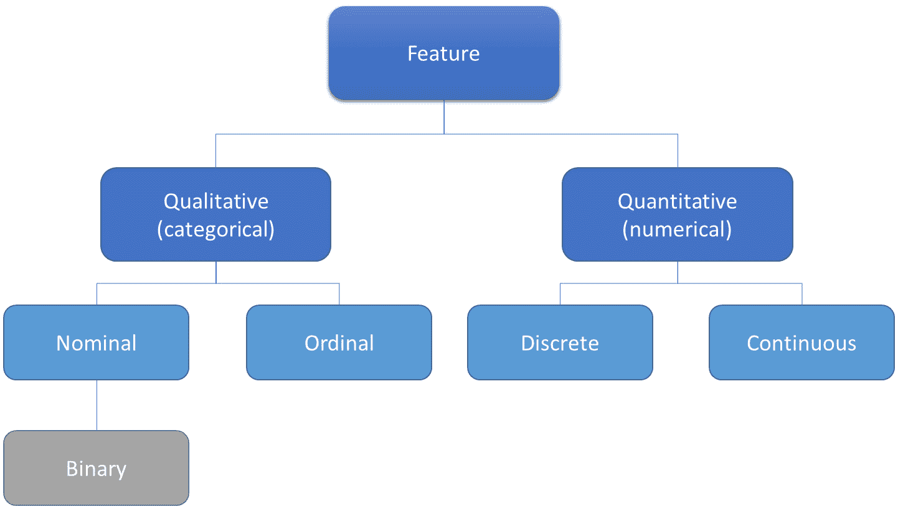

图 4.1 – 特征类型

在 *第一章**，机器学习基础* 中，你被介绍了 *图 4.1* 中显示的特征分类。现在，看看一些真实示例，这样你可以消除你可能有的任何疑问：

| **特征类型** | **特征子类型** | **定义** | **示例** |
| --- | --- | --- | --- |
| **类别** | **名义** | 无定量值的标记变量 | 云服务提供商：AWS、MS、Google |
| **类别** | **序数** | 为标记变量添加顺序感 | 职位：初级数据科学家，高级数据科学家，首席数据科学家 |
| **类别** | **二元** | 只允许两个值的变量 | 欺诈分类：欺诈，非欺诈 |
| **数值** | 离散 | 单个和可数的项目 | 学生人数：100 |
| **数值** | 连续 | 有无限多的可能测量值，并且它们通常带有小数点 | 总金额：$150.35 |

表 4.1 – 特征值的真实示例

虽然查看变量的值可能有助于您找到其类型，但您绝不应该只依赖这种方法。变量的性质对于做出此类决定也非常重要。例如，有人可以将*表 4.1*中显示的云服务提供商变量编码如下：1（AWS），2（MS），3（Google）。在这种情况下，即使现在由离散数字表示，该变量仍然是一个名义特征。

如果您正在构建机器学习模型，并且没有告诉您的算法这个变量不是一个离散数字，而是一个名义变量，那么算法将把它当作一个数字处理，模型将不再可解释。

重要提示

在向任何机器学习算法提供数据之前，请确保您的特征类型已经被正确识别。

理论上，如果您对自己的特征满意并且已经正确地分类了每个特征，您应该准备好进入 CRISP-DM 方法的建模阶段，不是吗？好吧，也许不是。即使您已经正确地分类了特征，您可能还有许多原因想要在数据准备上花更多的时间：

+   一些机器学习库，如`scikit-learn`，可能不接受分类特征上的字符串值。

+   您变量的数据分布可能不是您算法的最优分布。

+   您的机器学习算法可能会受到您数据规模的影响。

+   您变量的某些观察结果可能缺少信息，您将不得不修复它们。这些也被称为缺失值。

+   您可能会发现变量中的异常值，这些值可能会给您的模型带来潜在的偏差。

+   您的变量可能存储着不同类型的信息，而您可能只对其中的一些感兴趣（例如，日期变量可以存储星期几或月份的星期）。

+   您可能想要为文本变量找到一个数学表示。

+   相信我，这个列表没有真正的尽头！

在接下来的章节中，您将了解如何解决所有这些问题，从分类特征开始。

# 处理分类特征

对于分类特征的数值转换方法将根据您变量的子类型而有所不同。在接下来的章节中，您将了解如何转换名义和有序特征。

## 转换名义特征

在应用机器学习算法之前，您可能需要创建分类特征的数值表示。一些库可能已经内置了处理这种转换的逻辑，但大多数都没有。

你将学习的第一个转换称为标签编码。标签编码器适用于分类/名义变量，它将为你的变量的每个不同标签分配一个数字。*表 4.2* 展示了标签编码器是如何工作的：

| **国家** | **标签编码** |
| --- | --- |
| 印度 | 1 |
| 加拿大 | 2 |
| 巴西 | 3 |
| 澳大利亚 | 4 |
| 印度 | 1 |

表 4.2 – 标签编码器应用示例

标签编码器将始终确保每个不同的标签都关联一个唯一的数字。在上面的表中，尽管“印度”出现了两次，但它被分配了相同的数字。

你现在有了每个国家的数值表示，但这并不意味着你可以在模型中使用这种数值表示！在这个特定的情况下，你正在转换一个没有*顺序*的命名特征。

根据表 4.2，如果你将*国家*变量的编码版本传递给模型，它将做出诸如“巴西（3）大于加拿大（2）”这样的假设，这是没有意义的。

针对这种情况的一个可能解决方案是在“*国家*”之上应用另一种类型的转换：**独热编码**。这种转换将表示原始特征中的所有类别作为单独的特征（也称为虚拟**变量**），这将存储每个类别的存在或不存在。*表 4.3* 将转换与*表 4.2* 相同的信息，但这次它应用了独热编码：

| **国家** | **印度** | **加拿大** | **巴西** | **澳大利亚** |
| --- | --- | --- | --- | --- |
| 印度 | 1 | 0 | 0 | 0 |
| 加拿大 | 0 | 1 | 0 | 0 |
| 巴西 | 0 | 0 | 1 | 0 |
| 澳大利亚 | 0 | 0 | 0 | 1 |
| 印度 | 1 | 0 | 0 | 0 |

表 4.3 – 独热编码应用示例

你现在可以使用*国家*变量的独热编码版本作为机器学习模型的特征。然而，作为一名持怀疑态度的数据科学家，你的工作永远不会结束，你的批判性思维能力将在 AWS 机器学习专业考试中得到考验。

假设你的数据集中有 150 个不同的国家。你会想出多少个虚拟变量？150 个，对吧？在这里，你遇到了一个潜在的问题：除了增加模型的复杂性（这绝不是任何模型所希望的特性）之外，虚拟变量还会给你的数据增加**稀疏性**。

稀疏数据集有很多变量填充了零。通常，很难将这种数据结构拟合到内存中（你很容易耗尽内存），并且对于机器学习算法来说，处理稀疏结构非常耗时。

你可以通过对原始数据进行分组并减少类别数量来解决稀疏问题，甚至可以使用自定义库压缩你的稀疏数据，使其更容易操作（例如 Python 中的 `scipy.sparse.csr_matrix`）。

因此，在考试期间，请记住，当你需要将分类/名义数据转换为机器学习模型输入时，独热编码绝对是正确的选择；然而，要考虑你原始特征的唯一类别数量，并思考是否为所有这些类别创建虚拟变量是否有意义（如果你有非常多的唯一类别，这可能没有意义）。

## 应用二进制编码

对于具有更多唯一类别的变量类型，创建它们的数值表示的一个潜在方法是应用二进制编码。在这种方法中，目标是转换一个分类变量为多个二进制列，但最小化新列的数量。

此过程包括三个基本步骤：

1.  在通过顺序编码器处理后，分类数据被转换为数值数据。

1.  然后将得到的数字转换为二进制值。

1.  二进制值被分割成不同的列。

*表 4.4*展示了如何将*表 4.2*中的数据转换为二进制变量。

| **国家** | **标签编码器** | **二进制** | **Col1** | **Col2** | **Col3** |
| --- | --- | --- | --- | --- | --- |
| 印度 | 1 | 001 | 0 | 0 | 1 |
| 加拿大 | 2 | 010 | 0 | 1 | 0 |
| 巴西 | 3 | 011 | 0 | 1 | 1 |
| 澳大利亚 | 4 | 100 | 1 | 0 | 0 |
| 印度 | 1 | 001 | 0 | 0 | 1 |

表 4.4 – 二进制编码的实际应用

如你所见，现在有三列（Col1、Col2 和 Col3），而不是像*表 4.3*中的独热编码转换那样有四列。

## 转换顺序特征

顺序特征具有一个非常特定的特征：*它们有顺序*。因为它们具有这种特性，所以对它们应用独热编码是没有意义的；如果你这样做，用于训练你的模型的底层算法将无法区分与该特征相关的数据点的隐含顺序。

这种类型变量的最常见转换方式被称为**顺序****编码**。顺序编码器将每个变量的不同标签与一个数字关联起来，就像标签编码器一样，但这次，它将尊重每个类别的顺序。以下表格展示了顺序编码器是如何工作的：

| **教育** | **顺序编码** |
| --- | --- |
| 训练生 | 1 |
| 初级数据分析师 | 2 |
| 高级数据分析师 | 3 |
| 首席数据科学家 | 4 |

表 4.5 – 顺序编码的实际应用

现在，你可以将编码后的变量传递给机器学习模型，它们将能够正确处理这个变量，无需应用独热编码转换。这次，“高级数据分析师大于初级数据分析师”这样的比较是完全有意义的。

## 避免在训练和测试数据集中产生混淆

不要忘记以下声明：编码器在训练数据上拟合，并在测试和生产数据上转换。这就是你的机器学习管道应该工作的方式。

假设你已经创建了一个适合*表 4.2*中数据的 one-hot 编码器，并返回根据*表 4.3*的数据。在这个例子中，假设这是你的训练数据。一旦你完成了训练过程，你可能想要将相同的 one-hot 编码转换应用到你的测试数据上，以检查模型的结果。

在刚才描述的场景中（这在建模管道中是一个非常常见的情况），你*不能*在测试数据上重新训练你的编码器！你应该只是重新使用你在训练数据上创建的之前的编码器对象。技术上，你不应该再次使用`fit`方法，而应该使用`transform`方法。

你可能已经知道为什么你应该遵循这条规则的原因，但只是为了提醒一下：测试数据是为了提取你模型性能指标而创建的，因此你不应该用它来提取任何其他知识。如果你这样做，你的性能指标将会受到测试数据的偏差，你也不能推断出相同的性能（在测试数据中显示）在生产环境中（当新数据到来时）很可能会发生。

好吧，到目前为止一切都很顺利。然而，如果你的测试集有一个在训练集中没有的新类别，你该如何转换这些数据呢？

回到*图 4**.3*（输入数据）和*表 4.3*（输出数据）中的 one-hot 编码示例。这个编码器知道如何转换以下国家：澳大利亚、巴西、加拿大和印度。如果你在测试集中有不同国家，编码器将不知道如何转换它，这就是为什么你需要定义它在有异常情况下的行为方式。

大多数机器学习库为这些情况提供了特定的参数。在先前的例子中，你可以配置编码器在虚拟变量上要么引发错误，要么设置所有为零，如*表 4.6*所示。

| **国家** | **印度** | **加拿大** | **巴西** | **澳大利亚** |
| --- | --- | --- | --- | --- |
| 印度 | 1 | 0 | 0 | 0 |
| 加拿大 | 0 | 1 | 0 | 0 |
| 巴西 | 0 | 0 | 1 | 0 |
| 澳大利亚 | 0 | 0 | 0 | 1 |
| 印度 | 1 | 0 | 0 | 0 |
| **葡萄牙** | **0** | **0** | **0** | **0** |

表 4.6 – 在 one-hot 编码转换中处理未知值

正如你所见，葡萄牙没有出现在训练集中（*表 4.2*），所以在转换过程中，它将保持已知国家的相同列表，并说葡萄牙*不在*其中（所有为零）。

作为你正在成为的非常优秀的怀疑性数据科学家，你应该担心这样一个事实，即你有一个在训练过程中没有使用过的特定类别吗？好吧，也许吧。这种分析类型真的取决于你的问题领域。

处理未知值是非常常见的事情，也是你在你的机器学习管道中应该预期要做的事情。然而，你也应该问自己，由于你在训练过程中没有使用那个特定类别，你的模型是否可以被外推和推广。

记住，你的测试数据必须遵循与训练数据相同的数据分布，你很可能在训练或测试集中找到所有（或至少大多数）分类特征（的类别）。此外，如果你面临过拟合问题（在训练中表现良好，但在测试集中表现不佳），同时，你意识到你的分类编码器在测试集中转换了大量的未知值，猜猜看？很可能你的训练和测试样本没有遵循相同的分布，这完全无效化了你的模型。

正如你所见，你正在慢慢接近目标。你正在学习关于偏差和调查策略的精细细节——这真是太令人兴奋了！现在，继续前进，看看对数值特征进行转换。是的，每种类型的数据都很重要，并驱动着你的决策。

# 处理数值特征

在数值特征（离散和连续）方面，你可以考虑依赖于训练数据的转换以及其他仅依赖于（单个）被转换观察的转换。

依赖于训练数据的那些将使用训练集在`fit`过程中学习必要的参数，然后使用这些参数来转换任何测试或新数据。逻辑基本上与你刚刚学习用于分类特征的逻辑相同；然而，这次，编码器将学习不同的参数。

另一方面，那些仅依赖于（单个）观察的转换不依赖于训练或测试集。它们将简单地在一个单个值上执行数学计算。例如，你可以通过平方其值来对一个特定变量应用指数转换。这里没有依赖于任何地方学习到的参数——只需获取值并平方它。

到目前为止，你可能已经在想数值特征的数十种可用转换了！确实，有这么多选项，你在这里不会学习所有这些。然而，你不需要为了 AWS 机器学习专业考试而了解所有这些。你将学习最重要的那些（用于考试），但你不应限制你的建模技能：花点时间思考一下，根据你的用例创建自定义转换时，你拥有的无限选项。

## 数据标准化

应用数据**标准化**意味着改变数据的尺度。例如，你的特征可能存储员工年薪，范围在每年 20,000 到 200,000 美元之间，而你希望将此数据放入 0 到 1 的范围内；其中 20,000（观察到的最小值）将被转换为 0；而 200,000（观察到的最大值）将被转换为 1。

当你想要将训练数据拟合到受底层数据规模/幅度影响的特定类型的算法上时，这种技术尤为重要。例如，你可以考虑那些使用输入变量的点积（如神经网络或线性回归）的算法，以及那些依赖于距离度量的算法（如 k-**最近邻（KNN）**或**k-means**）。

另一方面，应用数据归一化对于基于规则的算法，如决策树，不会导致性能提升，因为它们将能够检查特征（无论是通过熵或信息增益分析）的预测能力，而不管数据的规模如何。

重要提示

你将在本书的后续章节中了解这些算法，以及相关的详细信息。例如，你可以将熵和信息增益视为决策树用来检查特征重要性的两种度量指标。了解每个特征的预测能力有助于算法定义树的根节点、中间节点和叶节点。

请花点时间，使用以下示例来理解为什么数据归一化将有助于那些类型的算法。你已经知道聚类算法的目的是在你的数据中找到组或集群，而最常用的聚类算法之一就是 k-means。

*图 4.2* 展示了不同尺度的变量如何改变 k-means 聚类的超平面投影：

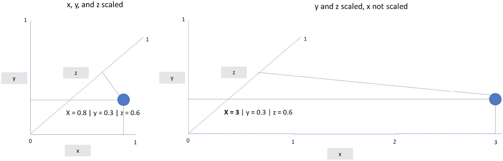

图 4.2 – 在超平面上绘制不同尺度的数据

在 *图 4.2* 的左侧，你可以看到一个数据点在一个三维超平面上绘制（x，y，z）。所有三个维度（也称为特征）都被归一化到 0 和 1 的规模。在右侧，你可以看到相同的数据点，但这次 x 维度没有被归一化。你可以清楚地看到超平面已经改变。

在实际场景中，你会有更多的维度和数据点。数据规模的不同会改变每个集群的中心点，并可能改变某些点的分配集群。同样的问题也会出现在依赖于距离计算的算法上，如 KNN。

其他算法，如神经网络和线性回归，将使用你的输入数据进行加权求和。通常，这些类型的算法将执行如 *W1*X1 + W2*X2 + Wi*Xi* 的操作，其中 *Xi* 和 *Wi* 分别代表特定的特征值及其权重。同样，你将在稍后学习神经网络和线性模型的细节，但你能仅通过查看刚才描述的计算来看到数据缩放问题吗？如果 *X*（特征）和 *W*（权重）是很大的数字，它很容易产生非常大的值。这将使算法的优化变得更加复杂。在神经网络中，这个问题被称为梯度爆炸。

你现在对应该应用数据归一化的原因（以及何时不应应用）有了非常好的理解。数据归一化通常在机器学习库中作为 **Min Max Scaler** 实现。如果在考试中遇到这个术语，请记住它与数据归一化是相同的。

此外，数据归一化不一定需要将你的特征值转换到 0 到 1 的范围内。实际上，你可以将其转换到你想要的任何范围内。*图 4.3* 展示了归一化是如何正式定义的。

图 4.3 – 归一化公式

在这里，*Xmin* 和 *Xmax* 是范围的上下限值；*X* 是特征的值。除了数据归一化之外，还有另一种关于数值转换的非常重要的技术，你必须意识到，这不仅是为了考试，也是为了你的数据科学职业生涯。你将在下一节中了解这一点。

## 数据标准化

数据标准化是另一种缩放方法，它将数据的分布转换为均值变为 0，标准差变为 1。*图 4.4* 正式描述了这种缩放技术，其中 *X* 代表要转换的值，*µ* 指的是 *X* 的均值，而 *σ* 是 *X* 的标准差：

图 4.4 – 标准化公式

与归一化不同，数据标准化不会导致一个预定义的值范围。相反，它将你的数据转换成标准高斯分布，其中你的转换值将代表每个值相对于分布均值的标准差数。

重要提示

高斯分布，也称为正态分布，是统计模型中最常用的分布之一。这是一个具有两个主要控制参数的连续分布：*µ*（均值）和*σ*（标准差）。正态分布围绕均值是对称的。换句话说，大多数值将接近分布的均值。

数据标准化通常被称为 z 分数，并且广泛用于识别变量的异常值，你将在本章后面看到。为了演示，*表 4.7* 模拟了一个小数据集的数据标准化。输入值显示在“年龄”列中，而缩放值显示在“Z 分数”列中：

| **年龄** | **平均值** | **标准差** | **Z 分数** |
| --- | --- | --- | --- |
| 5 | 31,83 | 25,47 | -1,05 |
| 20 | 31,83 | 25,47 | -0,46 |
| 24 | 31,83 | 25,47 | -0,31 |
| 32 | 31,83 | 25,47 | 0,01 |
| 30 | 31,83 | 25,47 | -0,07 |
| 80 | 31,83 | 25,47 | 1,89 |

表 4.7 – 数据标准化实践

在 AWS 机器学习专业考试中，确保你在手动应用归一化和标准化时充满信心。他们可能会提供一个值列表，以及平均值和标准差，并要求你给出列表中每个元素的缩放值。

## 应用分箱和离散化

**分箱**是一种技术，可以将一组值分组到一个桶或区间中——例如，将 0 至 14 岁的人分组到名为“儿童”的桶中，将 15 至 18 岁的人分组到名为“青少年”的桶中，依此类推。

**离散化**是将连续变量转换为离散或名义属性的过程。这些连续值可以通过多种策略进行离散化，例如**等宽**和**等频率**。

等宽策略将在多个相同宽度的区间中分割你的数据。等频率将你的数据分割成多个具有相同频率的区间。

看看下面的例子。假设你有一个包含 16 个数字的列表：10, 11, 12, 13, 14, 15, 16, 17, 18, 19, 20, 21, 22, 23, 24, 90。正如你所见，这个列表的范围在 10 到 90 之间。假设你想要使用等宽策略创建四个区间，你可以得到以下区间：

+   区间 >= 10 <= 30 > 10, 11, 12, 13, 14, 15, 16, 17, 18, 19, 20, 21, 22, 23, 24

+   区间 > 30 <= 50 >

+   区间 > 50 <= 70 >

+   区间 > 71 <= 90 > 90

在这种情况下，每个区间的宽度相同（20 个单位），但观测值分布不均。现在，下一个示例模拟了一个等频率策略：

+   区间 >= 10 <= 13 > 10, 11, 12, 13

+   区间 > 13 <= 17 > 14, 15, 16, 17

+   区间 > 17 <= 21 > 18, 19, 20, 21

+   区间 > 21 <= 90 > 22, 23, 24, 90

在这种情况下，所有区间都有相同的观测频率，尽管它们使用了不同的区间宽度来实现这一点。

一旦你计算出了你的区间，你可能想知道下一步是什么，对吧？在这里，你有一些选择：

+   你可以为你的区间命名，并将它们用作模型上的名义特征！当然，作为一个名义变量，你应该在将数据输入到机器学习模型之前考虑应用独热编码。

+   你可能想要对区间进行排序，并将它们用作有序特征。

+   也许您想通过平均每个箱子的最小值和最大值来从您的特征中去除一些噪声，并使用该值作为您的转换特征。

查看*表 4.8*以了解这些方法，使用我们的等频示例：

| **序数值** | **箱** | **转换为** **名义特征** | **转换为** **序数特征** | **去除噪声** |
| --- | --- | --- | --- | --- |
| **10** | Bin >= 10 <= 13 | Bin A | 1 | 11,5 |
| **11** | Bin >= 10 <= 13 | Bin A | 1 | 11,5 |
| **12** | Bin >= 10 <= 13 | Bin A | 1 | 11,5 |
| **13** | Bin >= 10 <= 13 | Bin A | 1 | 11,5 |
| **14** | Bin > 13 <= 17 | Bin B | 2 | 15,5 |
| **15** | Bin > 13 <= 17 | Bin B | 2 | 15,5 |
| **16** | Bin > 13 <= 17 | Bin B | 2 | 15,5 |
| **17** | Bin > 13 <= 17 | Bin B | 2 | 15,5 |
| **18** | Bin > 17 <= 21 | Bin C | 3 | 19,5 |
| **19** | Bin > 17 <= 21 | Bin C | 3 | 19,5 |
| **20** | Bin > 17 <= 21 | Bin C | 3 | 19,5 |
| **21** | Bin > 17 <= 21 | Bin C | 3 | 19,5 |
| **22** | Bin > 21 <= 90 | Bin D | 4 | 55,5 |
| **23** | Bin > 21 <= 90 | Bin D | 4 | 55,5 |
| **24** | Bin > 21 <= 90 | Bin D | 4 | 55,5 |
| **90** | Bin > 21 <= 90 | Bin D | 4 | 55,5 |

表 4.8 – 处理箱和离散化的不同方法

再次，尝试不同的箱划分策略将给出不同的结果，您应该分析/测试最适合您数据集的最佳方法。这里没有标准答案——一切都关于数据探索！

## 应用其他类型的数值变换

归一化和标准化依赖于您的训练数据来调整其参数：在归一化的情况下，最小值和最大值，在标准缩放的情况下，平均值和标准差。这也意味着您必须仅使用您的训练数据来调整这些参数，而绝不能使用测试数据。

然而，还有其他类型的数值变换，它们不需要从训练数据中提取参数来应用。这些类型的变换完全依赖于数学计算。例如，其中一种变换被称为对数变换。这是机器学习模型中非常常见的一种变换，特别适用于偏斜特征。如果您不知道什么是偏斜分布，请查看*图 4.5*。

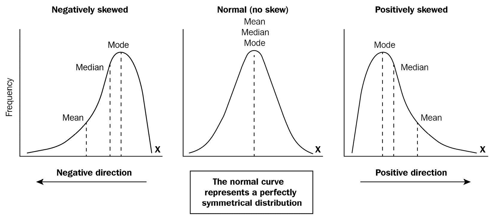

图 4.5 – 偏斜分布

在中间，您有一个正态分布（或高斯分布）。在左侧和右侧，您有偏斜分布。在偏斜特征方面，将有一些值远离平均值，在一个单一方向上（要么是左侧，要么是右侧）。这种行为将推动这个分布的中位数和平均值向同一方向移动，即您在*图 4.5*中可以看到的长尾方向。

一个数据曾经是偏斜的非常明显的例子是某个特定地区一组专业人士的年度薪酬，例如在美国佛罗里达州工作的资深数据科学家。这类变量通常大部分值都接近其他值（因为人们过去通常赚取平均薪酬），只有少数几个非常高的值（因为一小部分人的收入远高于其他人）。

希望现在您能轻松理解为什么均值和中位数会移动到尾部方向，对吧？高薪将推动它们向那个方向移动。

好吧，但为什么对数变换会对这种特征类型有益呢？这个问题的答案可以通过其背后的数学来解释：

图 4.6 – 对数性质

计算一个数的对数是指数函数的逆。因此，对数变换将根据给定的基数（例如，基数 2、基数 10 或自然对数的情况下的基数 e）来缩小您的数字的规模。从上一个例子中观察薪酬分布，您会将所有这些数字降低，使得数值越高，降低的幅度越大；然而，您会以对数尺度而不是线性方式来做这件事。这种行为将消除这个分布的异常值（使其更接近正态分布），这对许多机器学习算法（如线性回归）有益。*表 4.9* 展示了在将数字从线性尺度转换为对数尺度时的一些差异：

| **序数值** | **线性尺度（归一化）** | **对数尺度（**基数 10**）** |
| --- | --- | --- |
| 10 | 0.0001 | 1 |
| 1,000 | 0.01 | 3 |
| 10,000 | 0.1 | 4 |
| 100,000 | 1 | 5 |

表 4.9 – 线性变换与对数变换之间的差异

如您所见，线性变换保持了数据的原始幅度（您仍然可以看到异常值，但它们位于另一个尺度上），而对数变换则消除了这些幅度的差异，同时仍然保持了值的顺序。

您能想到另一种遵循相同行为（使分布更接近高斯分布）的数学变换类型吗？好的，这里还有一个：平方根。取 *表 4.9* 中显示的这些数字的平方根，看看结果吧！

现在，请注意这一点：对数和平方根都属于一组称为幂变换的变换，而且有一个非常流行的、可能在您的 AWS 考试中提到的方法，可以执行一系列您所看到的幂变换。这种方法是由乔治·博克斯和大卫·考克斯提出的，其名称为**Box-Cox**。

重要提示

在你的考试中，如果你看到有关 Box-Cox 变换的问题，请记住这是一个可以进行许多幂变换（根据 lambda 参数）的方法，其最终目标是使原始分布更接近正态分布。

只为了结束关于为什么数学变换真的可以对机器学习模型产生影响的讨论，这里有一个指数变换的例子。

假设你有一组数据点，例如*图 4.7*左侧的数据点。你的目标是画一条线，能够完美地分割蓝色和红色点。仅通过观察原始数据（再次，在左侧），你就知道执行这个线性任务的最佳猜测就是你在同一张图中看到的那个。然而，科学（不是魔法）发生在图的右侧！通过将这些数字平方并在另一个超平面上绘制它们，你可以完美地分离每一组点。

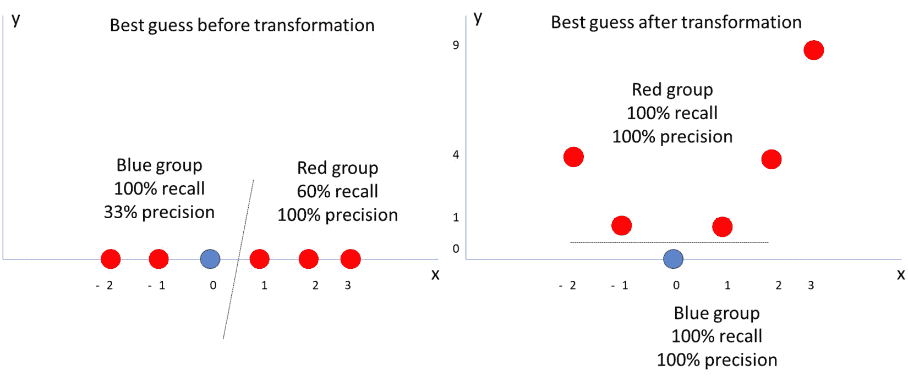

图 4.7 – 指数变换的实际应用

你可能会想，你有无限种处理数据的方法。虽然这是真的，但你应该始终考虑你正在处理的业务场景并相应地规划工作。记住，模型改进或探索总是可能的，但你必须定义你的目标（记住 CRISP-DM 方法论）并继续前进。

顺便说一句，数据转换很重要，但它只是你作为数据科学家工作的一部分。你的建模之旅仍需要转移到其他重要主题，例如处理缺失值和异常值。然而，在此之前，你可能已经注意到在这一节中你被介绍了高斯分布，那么为什么不深入研究它呢？

# 理解数据分布

尽管高斯分布可能是统计和机器学习模型中最常见的分布，但你应该知道它不是唯一的。还有其他类型的数据分布，例如伯努利分布、二项分布和泊松分布。

二项分布是一个非常简单的分布，因为只有两种可能的事件类型：成功或失败。成功事件发生的概率为*p*，而失败事件的概率为*1-p*。

一些遵循伯努利分布的例子包括掷一个六面骰子或抛硬币。在这两种情况下，你必须定义成功事件和失败事件。例如，假设掷骰子时的以下成功和失败事件：

+   成功：掷出数字 6

+   失败：得到任何其他数字

你可以这样说，成功的概率为*p*（1/6 = 0.16 = 16%），失败的概率为*1-p*（1 - 0.16 = 0.84 = 84%）。

二项分布是伯努利分布的推广。伯努利分布只有一个事件的重复，而二项分布允许事件重复多次，你必须计算成功的次数。继续使用之前的例子，即计算在 10 次掷骰子中，得到 6 的次数。由于这个例子本身的性质，二项分布有两个参数，*n* 和 *p*，其中 *n* 是重复的次数，*p* 是每次重复成功的概率。

最后，泊松分布允许你在给定事件在某个时间段内发生的次数的情况下，找到该时间段内的事件数量。它有三个参数：lambda，*e* 和 *k*，其中 lambda 是每个区间内事件平均发生的次数，*e* 是欧拉数，*k* 是事件在每个区间内发生的次数。

在所有这些分布中，包括高斯分布，你可以根据它们的参数计算期望的均值和方差。这些信息通常用于假设检验，通过比较样本的均值和方差与分布的**期望**均值和方差，来检查某些样本数据是否遵循给定的分布。

你现在对数据分布更加熟悉了，不仅限于高斯分布。你将在整本书中继续学习关于数据分布的内容。现在，是时候继续学习缺失值和异常值检测了。

# 处理缺失值

如其名所示，缺失值指的是数据的缺失。这些缺失通常由标记表示，这些标记可能或可能不会以标准方式实现。

虽然使用标记是标准的，但这些标记在不同平台上的显示方式可能会有所不同。例如，关系型数据库用 *NULL* 表示缺失数据，核心 Python 代码将使用 *None*，而一些 Python 库将缺失数字表示为**非数字（NaN）**。

重要提示

对于数值字段，不要用 *零* 替换那些标准缺失标记。默认情况下，零不是缺失值，而是另一个数字。

然而，在实际的商业场景中，你可能找到或找不到那些标准标记。例如，一个软件工程团队可能已经设计了一个系统，自动用特定的标记填充缺失数据，例如字符串中的“未知”或数字中的“-1”。在这种情况下，你必须通过这两个标记来查找缺失数据。人们可以设置任何东西。

在之前的例子中，软件工程团队仍然非常友好地给了你标准的标记。然而，有许多情况是遗留系统在用户面前没有添加任何数据质量层，你可能会发现地址字段填满了“我不想分享”，或者电话号码字段填满了“不要给我打电话”。这显然是缺失数据，但不如之前的例子标准化。

关于缺失数据，你将学习到更多细微之处，所有这些你都将在本节中学习，但请注意：在你开始对缺失值做出决策之前，你应该做好良好的数据探索，并确保你找到那些值。你可以计算数据频率或使用缺失图，但请做点什么。永远不要假设你的缺失数据只由那些方便的标准标记表示。

为什么你应该关注这种类型的数据？首先，因为大多数算法（除了在非常具体的 ML 库上实现的决策树之外）在发现缺失值时会引发错误。其次（也许是最重要的），通过将所有缺失数据归入同一个类别，你假设它们都是相同的，但现实中你并不知道这一点。

这样的决定不仅会给你的模型带来偏差，还会降低其可解释性，因为你将无法解释缺失的数据。一旦你知道为什么你想处理缺失值，然后你可以分析你的选项。

从理论上讲，你可以将缺失值分为两大类：**MCAR**或**MNAR**。MCAR 代表**完全随机缺失**，表示缺失数据没有关联的模式。另一方面，MNAR 代表**非随机缺失**，意味着用于生成数据的底层过程严格与缺失值相关。

看看以下关于 MNAR 缺失值的例子。假设你在在线调查中收集关于特定产品的用户反馈。你的提问过程是动态的，并取决于用户的回答。当一个用户指定年龄低于 18 岁时，你永远不会询问他的婚姻状况。在这种情况下，婚姻状况的缺失值与用户的年龄相关（MNAR）。

了解你正在处理的缺失值的类别将帮助你理解你是否对生成数据的底层过程有任何控制权。有时，你可以回到源过程，并 somehow 完成你的缺失数据。

重要提示

虽然，在现实场景中，你通常需要通过排除或插补来处理缺失数据，但永远不要忘记，你总是可以尝试查看源过程，并检查你是否可以检索（或者至少更好地理解）缺失数据。你可能会在考试中遇到这个选项。

如果你没有机会从任何地方恢复你的缺失数据，那么你应该转向其他方法，例如**逐行删除**和**插补**。

列删除法指的是丢弃一些数据的过程，这是这种选择的一个缺点。这可能在行级别或列级别发生。例如，假设你有一个包含四个列的 DataFrame，其中一列有 90%的数据缺失。在这种情况下，通常更有意义的是删除整个特征（列），因为你对于大多数观察（行）没有这些信息。

从行的角度来看，你可能有一个包含少量观察（行）的 DataFrame，其中其特征（列）之一包含缺失数据。在这种情况下，与其删除整个特征，不如只删除那些少数观察。

使用这种方法的好处是删除一行或一列的简单性。然而，缺点是会丢失信息。如果你在处理缺失数据时不想丢失信息，那么你应该选择一个插补策略。

插补也被称为替换，其中你将用替代值替换缺失值。插补最常见的方法是将缺失值替换为特征的均值。请注意这种方法，因为它可能会出现在你的考试中：

| **年龄** |
| --- |
| 35 |
| 30 |
|  |
| 25 |
| 80 |
| 75 |

表 4.10 – 使用均值或中位数替换缺失值

*表 4.10*显示了一个非常简单的数据集，只有一个特征和五个观察值，其中第三个观察值有缺失值。如果你决定用特征的均值来替换那个缺失数据，你会得到 49。有时，当数据中有异常值时，中位数可能更合适（在这种情况下，中位数将是 35）：

| **年龄** | **工作状态** |
| --- | --- |
| **35** | 员工 |
| **30** | 员工 |
|  | 退休 |
| **25** | 员工 |
| **80** | 退休 |
| **75** | 退休 |

表 4.11 – 使用组均值或中位数替换缺失值

如果你想要深入了解，你可以根据给定的特征组找到平均值或中位数。例如，*表 4.11*通过添加*工作状态*列扩展了*表 4.10*中的先前数据集。现在，有一些证据表明，最初通过使用整体中位数（35 岁）来更改缺失值的方法可能是错误的（因为那个人已经退休了）。

你现在可以做的，是将缺失值替换为属于同一工作状态的其它观察值的平均值或中位数。使用这种方法，你可以将缺失信息更改为 77.5。考虑到这个人已经退休，77.5 比 35 岁更有意义。

重要提示

对于分类变量，你可以用数据集中出现频率最高的值来替换缺失数据。根据特定特征对数据集进行分组的逻辑仍然适用。

你还可以使用更复杂的插补方法，包括构建一个机器学习模型来预测你的缺失数据值。这些插补方法（无论是通过平均还是预测值）的缺点是，你正在对数据做出可能不正确的推断，并将偏差添加到数据集中。

总结来说，处理缺失数据时的权衡是在丢失数据或向数据集添加偏差之间保持平衡。不幸的是，没有一种科学的方法可以遵循，无论你的问题是什么。为了决定你要做什么，你必须查看你的成功标准，探索你的数据，运行实验，然后做出你的决定。

你现在将转向许多机器学习算法的另一个头痛问题：异常值。

# 处理异常值

你参加这次学习之旅不仅仅是为了通过 AWS 机器学习专业考试，更是为了成为一名更好的数据科学家。从纯粹数学的角度来看，有许多不同的方式来观察异常值问题；然而，实际生活中使用的数据集是从底层业务流程中派生出来的，因此在进行异常值分析时，你必须包括业务视角。

异常值是一组数据中的非典型数据点。例如，*图 4.8*显示了在二维平面中绘制的一些数据点；即 x 和 y。红色点是异常值，因为它在这个数据系列中是一个非典型值。

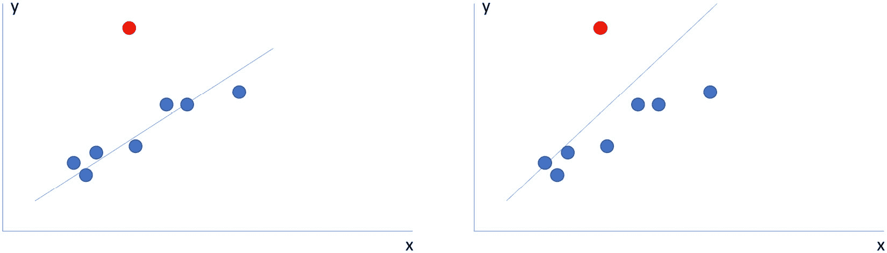

图 4.8 – 识别异常值

处理异常值很重要，因为一些统计方法会受到它们的影响。然而，在*图 4.8*中，你可以看到这种行为在行动中的表现。在左侧，已经绘制了一条最佳拟合线，忽略了红色点。在右侧，同样的线被绘制，但包括了红色点。

通过忽略异常值点，你可以得出一个更好的解决方案，在前面图表的左侧计划中，因为它能够更接近大多数值。你也可以通过计算每条线相关的误差来证明这一点（你将在本书后面学到）。

值得提醒的是，你也在这本书的另一个情境中看到了异常值问题：具体来说，在*表 4.10*中处理缺失值时。在那个例子中，中位数被用来解决这个问题。你可以随时回去再读一遍，但此时应该非常清楚的是，中位数值比平均值（均值）值受异常值的影响较小。

你现在知道了什么是异常值以及为什么你应该处理它们。在处理异常值时，你应该始终考虑你的业务视角，但也有一些数学方法可以找到它们。现在，你准备好继续前进，看看一些异常值检测的方法。

你已经学习了最常见的方法：z 分数。在*表 4.7*中，你看到了一个包含一组年龄的表格。再次查阅它以刷新你的记忆。在该表格的最后一列，根据*图 4**.4*中显示的方程计算了每个年龄的 z 分数。

这些 z 分数值没有明确的范围；然而，在无异常的正态分布中，它们大多在-3 和 3 之间。记住：z 分数将给出分布均值的标准差数。*表 4.10*显示了正态分布的一些属性：

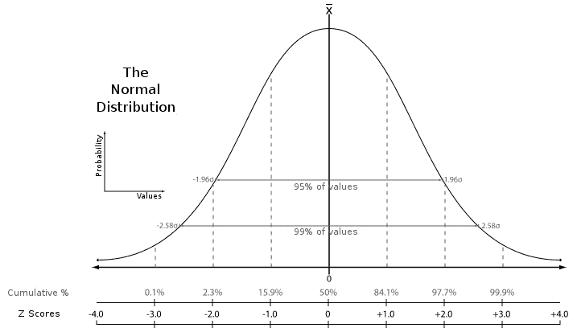

图 4.9 – 正态分布特性。图片改编自 https://pt.wikipedia.org/wiki/Ficheiro:The_Normal_Distribution.svg

根据正态分布特性，95%的值将属于平均值的-2 和 2 个标准差范围内的范围，而 99%的值将属于-3 和 3 个标准差范围内的范围。回到异常值检测的上下文中，你可以在这些 z 分数值上设置阈值，以指定一个数据点是否为异常值！

没有一个标准的阈值可以用来分类异常值。理想情况下，你应该查看你的数据，看看什么对你更有意义……通常（这不是规则），你将使用均值 2 到 3 个标准差之间的某个数字来标记异常值，因为根据这个规则，你的数据中不到 5%将被选中（再次强调，这只是一个参考阈值，以便你可以从进一步的结构化中选择一些数据）。你可能记得，在*表 4.12*中，异常值位于分布的均值*以下*和*以上*，其中异常值被标记为绝对 z 分数大于 3（为了演示的目的，值列被隐藏）。

| **Value** | **Zscore** | **Is outlier?** |
| --- | --- | --- |
| ... | 1.3 | NO |
| ... | 0.8 | NO |
| ... | **3.1** | **YES** |
| ... | -2.9 | NO |
| ... | **-****3.5** | **YES** |
| ... | 1.0 | NO |
| ... | 1.1 | NO |

表 4.12 – 根据 z 分数值标记异常值

在*表 4.12*中发现了两个异常值：第三行和第五行。另一种在数据中找到异常值的方法是应用箱线图逻辑。当你查看一个数值变量时，你可以从中提取许多描述性统计量，而不仅仅是之前看到的均值、中位数、最小值和最大值。数据分布中存在的一种属性称为分位数。

分位数是从随机变量的累积分布函数中按固定间隔建立的截止点。这些固定间隔，也称为*q-分位数*，在某些情况下将几乎相同大小，并且将获得特殊名称：

+   4 分位数被称为四分位数。

+   10 分位数被称为十分位数。

+   100 分位数被称为百分位数。

例如，20 百分位数（100 分位数常规区间的百分位数）指定 20%的数据分布在该点以下。在箱线图中，你可以使用 4 分位数（也称为*四分位数*）的常规区间来展示数据的分布（Q1 和 Q3），如图*图 4**.10*所示。

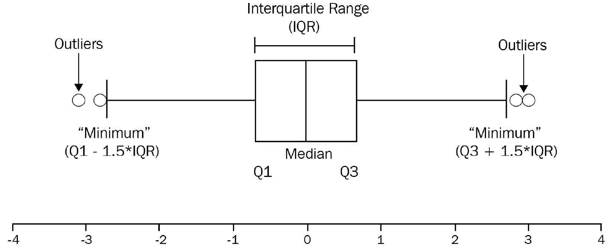

图 4.10 – 箱线图定义

Q1 也被称为下四分位数或 25 百分位数，这意味着 25%的数据分布在该点以下。Q3 也被称为上四分位数或 75 百分位数，这意味着 75%的数据分布在该点以下。

计算 Q1 和 Q3 之间的差异将给出**四分位距（IQR）**值，然后你可以使用这个值来计算箱线图的界限，如图中所示的“最小”和“最大”标签。

总的来说，你最终可以推断出，任何低于箱线图“最小”值或高于“最大”值的点都将被标记为异常值。

你现在已经了解了两种可以在数据上标记异常值的方法：z 分数和箱线图。你可以决定是否要从数据集中删除这些点，转换它们，或者创建另一个变量来指定它们的存在（如*表 4.11*所示）。

在继续数据准备和转换的旅程中，你将面临现实生活中其他类型的问题。接下来，你将了解到一些用例中包含被称为**罕见事件**的内容，这使得机器学习算法关注问题的错误方面，并提出不良解决方案。幸运的是，你将学习如何调整超参数或准备数据以促进算法收敛，同时适应罕见事件。

# 处理不平衡数据集

到目前为止，你可能已经意识到为什么数据准备可能是数据科学家工作中最耗时的部分。你已经学习了数据转换、缺失数据值和异常值，但问题列表还在继续。别担心——你正走在掌握这一主题的正确道路上！

机器学习模型，特别是分类问题中，另一个众所周知的问题是类别不平衡。在分类模型中，当数据集中的大多数观察值属于一个（或一些）类别（目标变量）时，可以说数据集是不平衡的。

这在欺诈识别系统中非常常见：例如，其中大多数事件属于常规操作，而极少数事件属于欺诈操作。在这种情况下，你也可以说欺诈是一个罕见事件。

对于定义数据集是否不平衡并没有强规则，这实际上取决于你的业务领域背景。大多数挑战问题将包含超过 99%的观察值属于多数类。

不平衡数据集的问题非常简单：机器学习算法将试图在训练数据中找到最佳拟合以最大化其准确性。在一个 99%的案例属于单个类的数据集中，如果没有调整，算法可能会优先考虑多数类的确定性。在最坏的情况下，它将把所有观察值分类为多数类，并忽略少数类，而这通常是我们建模罕见事件时的兴趣所在。

要处理不平衡数据集，你有两个主要方向可以选择：调整算法来处理这个问题，或者重新采样数据以使其更平衡。

通过调整算法，你必须指定分类中每个类的权重。这种类权重配置属于算法，而不是训练数据，因此它是一个超参数设置。重要的是要记住，并非所有算法都会有这种配置，也不是所有机器学习框架都会公开它。作为一个快速参考，来自 scikit-learn 机器学习库的`DecisionTreeClassifier`类是一个很好的例子，它实现了类权重超参数。

另一种解决不平衡问题的方法是通过对训练集应用**欠采样**或**过采样**来改变训练集。如果你决定应用欠采样，你所要做的就是从多数类中移除一些观察值，直到你得到一个更平衡的数据集。当然，这种方法的一个缺点是，你可能会丢失关于你正在移除观察值的多数类的重要信息。

最常见的欠采样方法是随机欠采样，这是一种简单的重采样方法，其中你随机从训练集中移除一些观察值。

另一方面，你可以选择进行过采样，其中你将创建少数类的新的观察值/样本。最简单的方法是简单的方法，其中你随机从训练集中选择观察值（带替换）进行复制。这种方法的一个缺点是可能存在过拟合的问题，因为你将复制/突出显示少数类的观察模式。

要避免模型欠拟合或过拟合，你应该始终在测试集上测试拟合后的模型。

重要提示

测试集不能进行欠采样或过采样：只有训练集应该通过这些重采样技术。

你也可以通过应用合成采样技术来对训练集进行过采样。随机过采样不会向训练集添加任何新信息：它只是复制现有的信息。通过创建合成样本，你是从现有样本中推导出这些新观察值（而不是简单地复制它们）。这是一种称为**合成少数过采样技术（SMOTE）**的数据增强技术。

技术上，SMOTE 所做的是在少数类的特征空间中绘制一条线，并提取接近该线的点。

重要提示

你可能会在考试中发现使用过 SMOTE 这个术语的问题。如果发生这种情况，请记住这个术语应用到的上下文：过采样。

好的——在下一节中，你将学习如何为机器学习模型准备文本数据。

# 处理文本数据

你已经学习了如何将分类特征转换为数值表示，无论是使用标签编码器、顺序编码器还是独热编码。然而，如果你的数据集中有包含长文本的字段，你该如何为它们提供数学表示，以便正确地输入机器学习算法呢？这是一个在**自然语言处理（NLP）**领域中的常见问题，它是人工智能的一个子领域。

NLP 模型旨在从文本中提取知识；例如，在语言之间翻译文本，识别文本语料库中的实体（也称为**命名实体识别**，简称**NER**），从用户评论中分类情感，以及许多其他应用。

重要提示

在*第八章**，AWS 人工智能/机器学习应用服务*中，你将了解一些将 NLP 应用于其解决方案的 AWS 应用服务，例如 Amazon Translate 和 Amazon Comprehend。在考试中，你可能会被要求思考构建某些类型的 NLP 应用程序最快或最简单的方法（开发工作量最少）。最快或最简单的方法通常是使用那些现成的 AWS 服务，因为它们为某些用例提供了预训练模型（特别是机器翻译、情感分析、主题建模、文档分类和实体识别）。

在接下来的几章中，你还将了解一些用于 NLP 应用的内置 AWS 算法，例如 BlazingText、**潜在狄利克雷分配**（**LDA**）、**神经主题建模**（**NTM**）和**序列到序列**算法。这些算法也让你能够创建与那些现成的服务相同的 NLP 解决方案；然而，你必须使用 SageMaker 并编写自己的解决方案。换句话说，它们提供了更多的灵活性，但需要更多的开发工作量。

请记住这一点，以备考试之用！

尽管 AWS 提供了许多现成的服务和内置算法，允许你创建 NLP 应用程序，但你现在不会查看这些 AWS 产品功能（你将在*第六章**，应用机器学习算法*和*第八章**，AWS 人工智能/机器学习应用服务*)。你将通过查看一些对准备数据用于 NLP 至关重要的数据准备技术来完成本章。

## 词袋模型

你将学习的第一种方法是称为词袋（BoW）。这是一种非常常见且简单的技术，应用于文本数据，它创建矩阵表示来描述文本中的单词数量。BoW 包括两个主要步骤：创建词汇表和创建表示文本中已知词汇出现的表示。这些步骤可以在*图 4**.11*中看到。11.*

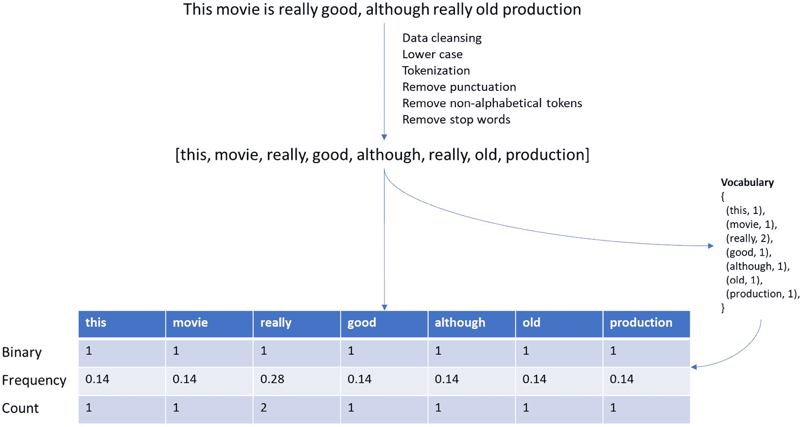

图 4.11 – BoW 在行动

首先，通常不能使用原始文本来准备 BoW 表示。有一个数据清洗步骤，其中将文本转换为小写；将每个单词拆分为标记；删除标点符号、非字母字符和停用词；并在必要时，应用任何其他你可能想要的定制清洗技术。

一旦你清洗了原始文本，你可以将每个单词添加到全局词汇中。技术上，这通常是一个包含元组的字典，形式为{(word, number of occurrences)}——例如，{(apple, 10), (watermelon, 20)}。如我之前提到的，这是一个全局字典，你应该考虑你正在分析的所有文本。

现在，有了清洗后的文本和更新的词汇表，你可以以矩阵的形式构建文本表示，其中每一列代表全局词汇中的一个单词，每一行代表你已分析的文本。你如何在每一行中表示这些文本可能因不同的策略而异，例如二进制、频率和计数。接下来，你将更深入地学习这些策略。

在*图 4**.11*中，正在使用 BoW 的三个不同策略处理单个文本片段。这就是为什么你可以在表格中看到三行，而不是一行（在实际场景中，你必须从中选择一个进行实现）。

在第一行，使用了二进制策略，如果单词存在于全局词汇中，则分配 1，否则分配 0。因为词汇是在单个文本上构建的，所以该文本中的所有单词都属于词汇（这就是为什么在二进制策略中只能看到 1 的原因）。

在第二行，使用了频率策略，该策略会检查文本中每个单词出现的次数，并将其除以文本中单词的总数。例如，单词“this”只出现一次（1），而文本中还有七个其他单词（7），所以 1/7 等于 0.14。

最后，在第三行，使用了计数策略，这是一种简单的对文本中每个单词出现次数的计数。

重要提示

这个提示非常重要——你很可能在考试中会遇到它。你可能已经注意到，BoW 矩阵在*列*中包含唯一的单词，并且每个文本表示都在*行*中。如果你有 100 篇较长的文本，其中只有 50 个唯一的单词，那么你的 BoW 矩阵将有 50 列和 100 行。在考试期间，你很可能会收到一份文本列表，并被要求准备 BoW 矩阵。

你还应该了解关于 BoW 的一个极其重要的概念，那就是 n-gram 配置。n-gram 这个术语用来描述你希望如何查看你的词汇，无论是通过单个单词（uni-gram）、两个单词的组合（bi-gram）、三个单词的组合（tri-gram），甚至是*n*个单词的组合（n-gram）。到目前为止，你已经看到了使用 uni-gram 方法的 BoW 表示，但更复杂的 BoW 表示可能使用 bi-gram、tri-gram 或 n-gram。

主要逻辑本身并没有改变，但你需要知道如何在 BoW 中表示 n-gram。仍然以*图 4**.11*中的例子为例，bi-gram 方法会以以下方式组合这些单词：[这部电影，电影真的很，真的很棒，好尽管，尽管老，老制作]。在考试之前，请确保你理解这一点。

重要提示

BoW 的强大和简单之处在于你可以轻松地构建一个训练集来训练你的算法。如果你看*图 4**.11，你能看到拥有更多数据和仅仅在表中添加一个分类列，比如好评或差评，这将使我们能够训练一个二元分类模型来预测情感吗？

好吧——你可能已经注意到，你被介绍到的许多令人惊叹的技术都伴随着一些缺点。BoW 的问题在于维护其词汇的挑战。你很容易看到，在一个巨大的文本语料库中，词汇量往往会变得越来越大，矩阵表示往往会变得稀疏（是的——又是稀疏性问题）。

解决词汇量问题的一个可能方法是通过使用词哈希（在机器学习中也称为**哈希****技巧**）。哈希函数将任意大小的数据映射到固定大小的数据。这意味着你可以使用哈希技巧用固定数量的特征来表示每个文本（无论词汇的大小）。技术上，这个哈希空间允许碰撞（不同的文本由相同的特征表示），所以在实现特征哈希时需要考虑这一点。

## TF-IDF

BoW 伴随的另一个问题是，特别是当你使用频率策略构建特征空间时，更频繁的单词会因为文档中的高出现次数而显著提高它们的分数。结果是，这些高频率出现的单词往往是文档的关键词，而只是其他在几篇其他文档中也出现多次的单词。

**词频-逆文档频率（TF-IDF）**通过检查它们在其他文档中的频率并使用这些信息来重新调整文档中单词的频率来惩罚这些类型的单词。

在这个过程结束时，TF-IDF 往往会给文档特有的单词（文档特定单词）赋予更多的重要性。接下来，让我们看看一个具体的例子，以便你能深入理解。

考虑这样一个文本语料库，它包含 100 个单词，而单词“Amazon”出现了三次。这个单词的词频（TF）将是 3/100，等于 0.03。现在，假设你有其他 1,000 个文档，而单词“Amazon”在这 1,000 个文档中出现了 50 次。在这种情况下，逆文档频率（IDF）将由对数给出，即 1,000/50，等于 1.30。在分析的具体文档中，单词“Amazon”的 TF-IDF 分数将是 TF * IDF 的乘积，即 0.03 * 1.30（*0.039*）。

假设不是 50 个文档，单词“Amazon”也出现在另外 750 个文档上——换句话说，比之前的场景出现频率要高得多。在这种情况下，这个方程的 TF 部分不会改变——它仍然是 0.03。然而，IDF 部分会略有变化，因为这次它将是 1,000/750 的对数，等于*0.0036*。正如你所看到的，现在单词“Amazon”的重要性比之前的例子要小得多。

## 词嵌入

与传统的如 BoW 和 TD-IDF 方法不同，现代文本表示方法将注意信息的上下文，以及单词的存在或频率。遵循这一概念的一个非常流行且强大的方法被称为**词嵌入**。词嵌入创建一个固定长度的密集向量，可以存储关于文档上下文和意义的信息。

每个单词在多维超平面中用一个数据点表示，这被称为嵌入空间。这个嵌入空间将有 *n* 个维度，其中每个维度都指代这个密集向量中的一个特定位置。

虽然这可能听起来很复杂，但这个概念实际上非常简单。假设你有一份包含四个单词的列表，你想要在五维嵌入空间中绘制这些单词。这些单词是 king、queen、live 和 castle。*表 4.13*展示了如何做到这一点。

|  | **维度 1** | **维度 2** | **维度 3** | **维度 4** | **维度 5** |
| --- | --- | --- | --- | --- | --- |
| **国王** | 0.22 | 0.76 | 0.77 | 0.44 | 0.33 |
| **王后** | 0.98 | 0.09 | 0.67 | 0.89 | 0.56 |
| **直播** | 0.13 | 0.99 | 0.88 | 0.01 | 0.55 |
| **城堡** | 0.01 | 0.89 | 0.34 | 0.02 | 0.90 |

表 4.13 – 嵌入空间表示

忘记*表 4.13*中的假设数字，专注于数据结构；你会发现现在每个单词在嵌入空间中由*n*个维度表示。将单词转换为向量的这个过程可以通过许多不同的方法来完成，但最流行的方法是 word2vec 和 GloVe。

一旦每个单词都被表示为一个固定长度的向量，你就可以应用许多其他技术来完成你需要的事情。一个非常常见的任务是将这些“单词”（实际上，它们的维度）绘制在超平面中，并直观地检查它们彼此之间的接近程度！

技术上，你不会直接用这个来绘制它们，因为人类大脑无法解释超过三个维度。此外，你通常应用一种降维技术（例如你稍后将要学习的主成分分析），将维度数量减少到两个，并最终在笛卡尔平面上绘制单词。这就是为什么你可能看到*表 4.15*底部的图片。你有没有想过如何在图表上绘制单词？

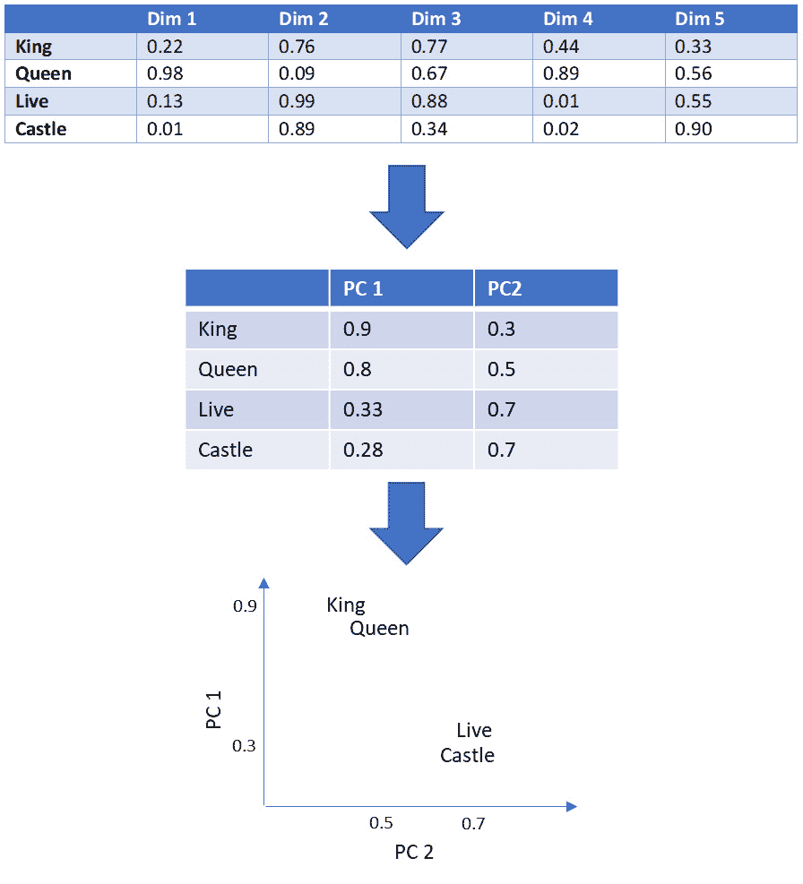

图 4.12 – 绘制单词

接下来，你将学习如何构建*图 4.12*中显示的五个维度。同样，有不同方法来完成这个任务，但你将学习最流行的方法，它使用一个固定上下文窗口的共现矩阵。

首先，你必须想出一些逻辑来表示每个词，同时记住你还要考虑它们的上下文。为了解决上下文需求，你需要定义一个**固定上下文窗口**，它将负责指定将有多少词被分组在一起进行上下文学习。例如，假设这个固定上下文窗口为 2。

接下来，你将创建一个共现矩阵，该矩阵将根据预定义的上下文窗口计算每一对词出现的次数。考虑以下文本：“I will pass this exam, you will see. I will pass it。”

第一词“pass”的上下文窗口将是以下这些加粗的词：“*I will* pass *this exam*, you will see. I will pass it.” 考虑到这个逻辑，看看每一对词在上下文窗口中出现的次数（*图 4.13*）。

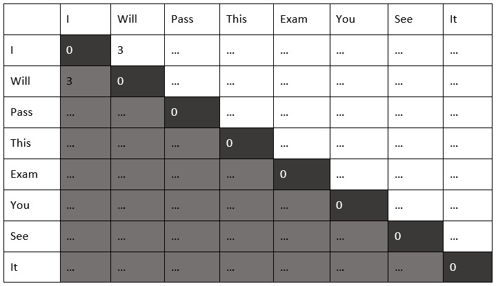

图 4.13 – 共现矩阵

如你所见，当使用大小为 2 的上下文窗口时，“I will”这对词出现了三次：

1.  *我会*通过这次考试，你将会看到。我会通过它。

1.  我会通过这次考试，你*会*看到。*我*会通过它。

1.  我会通过这次考试，你将会看到。*我会*通过它。

查看*图 4.13*，应将相同的逻辑应用于所有其他词对，将“…”替换为相关的出现次数。你现在为每个词都有一个数值表示了！

重要提示

你应该知道，除了固定上下文窗口的共现矩阵之外，还有许多替代方案，例如使用 TD-IDF 向量化或甚至更简单的每篇文档的单词计数器。这里最重要的信息是，无论如何，你必须为每个词提供一个数值表示。

最后一步是最终找到*表 4.13*中显示的那些维度。你可以通过创建一个多层模型来完成这个任务，通常基于神经网络，其中隐藏层将代表你的嵌入空间。*图 4.14*显示了一个简化的例子，其中可以将*图 4.13*中显示的单词压缩到五个维度的嵌入空间中：

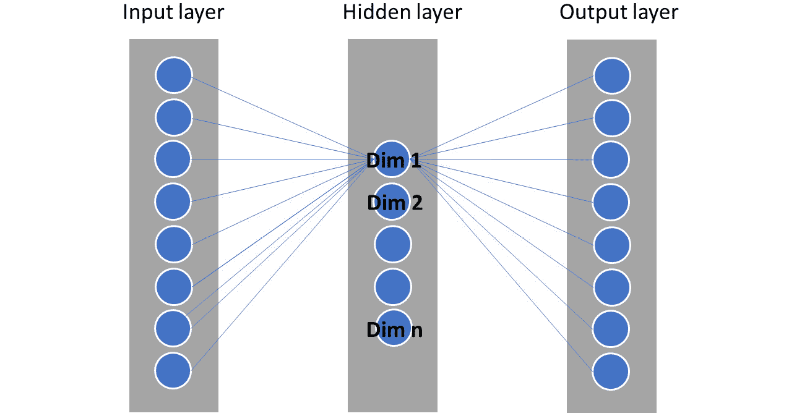

图 4.14 – 使用神经网络构建嵌入空间

你将在本书的后面部分更详细地了解神经网络。现在，理解嵌入向量来自何处已经是一项了不起的成就！

在建模自然语言问题时，你应该记住的另一件重要事情是，你可以在你的模型中重用预训练的嵌入空间。一些公司已经创建了基于数十亿文档训练的现代神经网络架构，这些架构已经成为该领域的尖端技术。为了参考，请查看由谷歌提出的双向编码器表示（BERT），它已被数据科学社区和行业广泛使用。

现在，你已经到达了关于数据准备和转换的漫长但非常重要的章节的结尾。利用这个机会，快速回顾一下你所学到的了不起的东西。

# 摘要

首先，你被介绍到你可能需要与之一起工作的不同类型的特征。确定你将处理变量的类型对于定义可以应用于每种情况的转换类型和技术非常重要。

然后，你学习了如何处理分类特征。你看到有时分类变量确实有顺序（例如有序变量），而有时则没有（例如名义变量）。你了解到独热编码（或虚拟变量）可能是名义特征最常用的转换类型；然而，根据唯一类别的数量，在应用独热编码后，你的数据可能会出现稀疏性问题。至于有序特征，你不应该在它们之上创建虚拟变量，因为这会使你失去变量中已包含的顺序信息。在这些情况下，有序编码是最合适的转换。

你继续你的旅程，通过查看数值特征，你学习了如何处理连续和离散数据。你了解了最重要的转换类型，例如归一化、标准化、分箱和离散化。你看到某些类型的转换依赖于底层数据来找到它们的参数，因此非常重要，避免使用测试集从数据中学习任何东西（它必须严格仅用于测试）。

你也看到了，你甚至可以将纯数学应用到你的数据转换中；例如，你了解到幂变换可以用来减少特征的偏度，使其更接近正态分布。

之后，你研究了缺失数据，并了解了这项任务的重要性。当你建模时，*不能*将缺失值视为一个简单的计算问题，其中你只需用*y*替换*x*。这是一个更大的问题，你需要通过探索你的数据并检查你的缺失数据是否是随机生成的来开始解决这个问题。

当你决定删除或替换缺失数据时，你必须意识到你可能会丢失信息或向数据集添加偏差。请记住回顾本章的所有重要笔记，因为它们可能与你考试的相关性很大。

你还学习了如何进行异常值检测。你了解了寻找异常值的不同方法，例如 z 分数和箱线图方法。最重要的是，你学习了你可以标记或平滑它们。

在开始时，你被建议本章将是一次漫长但值得的关于数据准备之旅。你也已经学会了如何处理罕见事件，因为这是机器学习中最具挑战性的问题之一。现在你意识到，有时你的数据可能是不平衡的，你必须要么通过改变类别权重来欺骗你的算法，要么通过下采样或过采样来重新采样你的数据。

最后，你学习了如何处理用于 NLP 的文本数据。你现在应该能够手动计算 BoW 和 TF-IDF 矩阵！你甚至更深入地学习了词嵌入的工作原理。在本小节中，你了解到你可以创建自己的嵌入空间（使用许多不同的方法）或重用预训练的嵌入，例如 BERT。

你已经完成了！在下一章中，你将深入探讨数据可视化技术。

# 考试准备练习 – 章节复习题

除了对关键概念有扎实的理解外，能够在时间压力下快速思考是一项帮助你通过认证考试的重要技能。这就是为什么在学习的早期阶段就培养这些技能至关重要。

章节复习题旨在通过学习并复习每个章节的关键概念来逐步提高你的应试技巧。你将在每个章节的末尾找到这些复习题。

如何访问这些资源

要了解如何访问这些资源，请转到名为*第十一章*的章节，*访问在线实践资源*。

要打开本章的章节复习题，请执行以下步骤：

1.  点击链接 – [`packt.link/MLSC01E2_CH04`](https://packt.link/MLSC01E2_CH04)。

    或者，你可以扫描以下**二维码**（*图 4.15*）：

图 4.15 – 为登录用户打开章节复习题的二维码

1.  一旦你登录，你将看到一个类似于*图 4.16*所示的页面：

图 4.16 – 第四章复习题

1.  准备就绪后，开始以下练习，多次重新尝试测验。

## 考试准备练习

对于前三次尝试，不必担心时间限制。

### 尝试 1

第一次尝试，目标至少是 **40%**。查看你答错的答案，并再次阅读章节中的相关部分，以填补学习上的差距。

### 尝试 2

第二次尝试，目标至少是 **60%**。查看你答错的答案，并再次阅读章节中的相关部分，以填补任何剩余的学习差距。

### 尝试 3

第三次尝试，目标至少是 **75%**。一旦得分达到 75% 或以上，你就可以开始练习时间管理。

小贴士

你可能需要超过 **三次** 尝试才能达到 75%。这没关系。只需复习章节中的相关部分，直到达到目标。

# 练习时间管理

目标：你的目标是保持分数不变，同时尽可能快地回答这些问题。以下是你下一次尝试的示例：

| **尝试** | **分数** | **用时** |
| --- | --- | --- |
| 尝试 5 | 77% | 21 分钟 30 秒 |
| 尝试 6 | 78% | 18 分钟 34 秒 |
| 尝试 7 | 76% | 14 分钟 44 秒 |

表 4.14 – 在线平台上的样本时间练习

注意

上表中显示的时间限制只是示例。根据网站上的测验时间限制，为每次尝试设定自己的时间限制。

每次新的尝试，你的分数应保持在 **75%** 以上，而完成所需的时间“应减少”。重复尝试，直到你觉得自己能够自信地应对时间压力。
