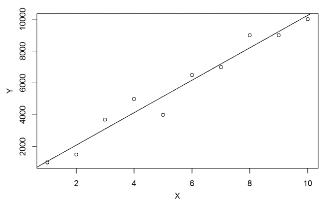
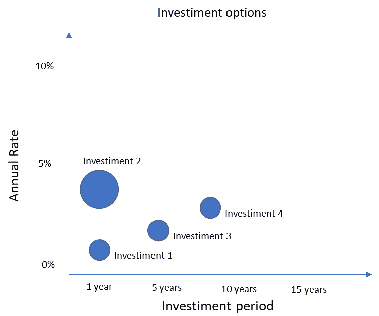
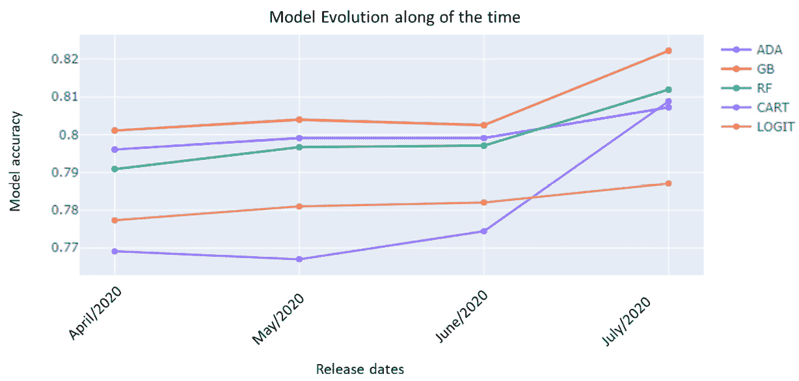
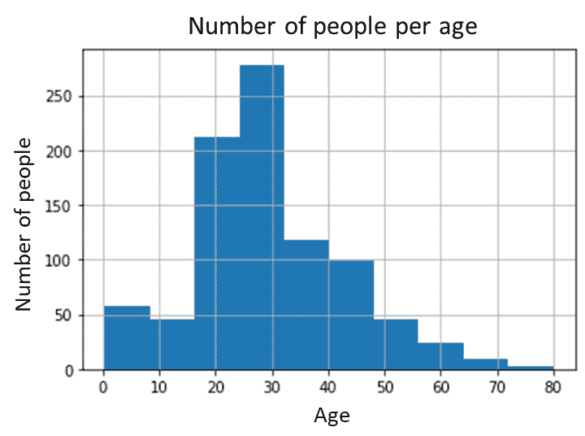
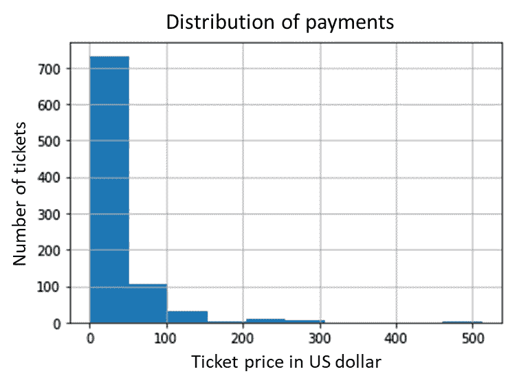
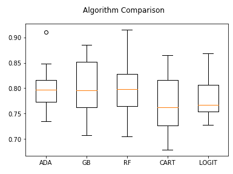
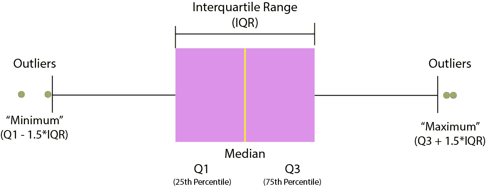
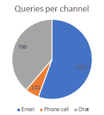
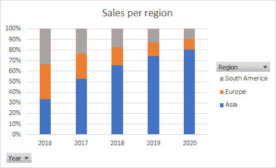

# 第四章: 理解和可视化数据

数据可视化是一门艺术！无论你和你团队在数据准备和初步分析建模上投入了多少努力，如果你不知道如何有效地展示你的发现，你的观众可能无法理解你试图表达的观点。

在处理决策者时，这种情况下可能会变得更糟。例如，如果你选择了错误的一组图表来讲述一个特定的故事，人们可能会误解你的分析并做出糟糕的决策。

理解不同类型的数据可视化以及它们如何与每种分析类型相匹配，这将使你在吸引观众和传达你想要的信息方面处于非常有利的地位。

在本章中，你将了解一些数据可视化技术。我们将涵盖以下主题：

+   在你的数据中可视化关系

+   在你的数据中可视化比较

+   在你的数据中可视化组成

+   在你的数据中可视化分布

+   构建关键绩效指标

+   介绍 Quick Sight

我们已经知道为什么我们需要掌握这些主题，所以让我们开始吧。

# 在你的数据中可视化关系

当我们需要展示数据中的关系时，我们通常是在谈论在图表中绘制两个或更多变量以可视化它们的依赖程度。**散点图**可能是展示两个变量之间关系的最常见图表类型。以下是一个关于两个变量，**x**和**y**的散点图：

图 4.1 – 使用散点图绘制关系

前面的图表显示了**x**和**y**之间的清晰关系。随着**x**的增加，**y**也增加。在这种情况下，我们可以说这两个变量之间存在线性关系。请记住，散点图也可能捕捉到其他类型的关系，而不仅仅是线性关系。例如，也有可能在两个变量之间找到指数关系。

另一个用于比较的好图表被称为**气泡图**。就像散点图一样，它也会显示变量之间的关系；然而，在这里，你可以使用第三个维度，它将由点的尺寸来表示。

以下是一个解释投资方案的气泡图，其中**x**是年利率，**y**是投资期限，气泡的大小是每个投资选项的大小：

图 4.2 – 使用气泡图绘制关系

观察前面的图表，我们可以看到两种类型的关系：投资期限越长，年收益率越高，投资金额越高，年收益率也越高。正如我们所见，这是一种非常有效的展示这种分析的方式。接下来，我们将学习如何比较我们的数据。

# 在你的数据中可视化比较

比较在数据分析中非常常见，我们有不同的方式来展示它们。让我们从**条形图**开始。我相信你已经看过很多使用这种可视化类型的报告。

条形图可以用来比较不同类别中的一个变量；例如，不同型号的汽车价格或按国家划分的人口规模。在下面的图表中，我们使用条形图展示了截至 2020 年 6 月印度各州的新冠病毒病例数：

![图 4.3 – 使用条形图绘制比较

![图片 B16735_04_003.jpg]

![图 4.3 – 使用条形图绘制比较

有时，我们也可以使用**堆积柱状图**为正在分析的数据添加另一个维度。例如，在下面的图表中，我们使用堆积条形图来显示按性别划分的泰坦尼克号上的人数。此外，我们还将幸存者（正类）和未幸存者（负类）的人数进行了细分：

![图 4.4 – 使用堆积条形图分析泰坦尼克号灾难数据集

![图片 B16735_04_004.jpg]

![图 4.4 – 使用堆积条形图分析泰坦尼克号灾难数据集

如我们所见，大多数女性在灾难中幸存，而大多数男性则没有。堆积条形图帮助我们可视化性别之间的差异。最后，你应该知道我们也可以在那些堆积条形图上显示百分比，而不是绝对数字。

**柱状图**在需要比较不同时期的一个或两个变量时也非常有用。例如，在下面的图表中，我们可以看到按省份划分的加拿大年度电动汽车销量：

![图 4.5 – 使用柱状图绘制比较

![图片 B16735_04_005.jpg]

![图 4.5 – 使用柱状图绘制比较在不同时期进行比较的另一种非常有效的方法是使用**折线图**。在下面的图表中，我们展示了一个有趣的例子，说明我们如何在不同发布日期的项目中比较不同算法的性能。重要提示折线图通常非常有帮助，可以显示在分析的时间段内数据中是否存在任何趋势。折线图的一个非常常见的用途是**预测**，我们通常需要分析时间序列数据中的趋势和季节性。例如，我们可以看到，与**分类和回归树**（**CART**）模型相比，**AdaBoost**（**ADA**）、**梯度提升**（**GB**）、**随机森林**（**RF**）和**逻辑回归**（**LOGIT**）等其他算法的性能较差。然而，在 7 月份，CART 模型进行了更改，结果它在所有其他模型中排名第三。每个时期的最佳模型的故事可以很容易地在以下图表中看到：

图 4.6 – 使用折线图绘制比较

最后，你还可以使用**表格**来展示你的数据比较。当我们的数据有多个维度（通常放在表格的行中）以及一个或多个用于比较的指标时（通常放在表格的列中），表格就更有用了。

在下一节中，我们将学习另一组图表，旨在展示你的变量的分布。这组图表对于建模任务尤为重要，因为你必须知道一个特征的分布，才能考虑对其进行潜在的数据转换。让我们看看这个吧！

# 在你的数据中可视化分布

探索你的特征分布非常重要，以便了解其一些关键特征，如偏度、均值、中位数和分位数。你可以通过绘制**直方图**轻松地可视化偏度。这种类型的图表将你的数据分组到**桶**或**区间**中，并在其上执行计数。例如，以下图表显示了*年龄*变量的直方图：

图 4.7 – 使用直方图绘制分布

通过观察直方图，我们可以得出结论，大多数人年龄在 20 到 50 岁之间。我们还可以看到一些超过 60 岁的人。以下图表显示了直方图的另一个例子，其中我们正在绘制一个特定事件的支付分布，该事件有不同的票价。我们想看看人们每张票支付了多少钱：

图 4.8 – 使用直方图检查偏度

在这里，我们可以看到大多数人每张票支付的最大金额为 100 美元。这就是为什么我们可以看到向右偏斜的分布（尾部）的原因。

如果你想要看到分布的其他特征，如中位数、分位数和异常值，那么你应该使用**箱线图**。在以下图表中，我们再次比较了给定数据集中不同算法的性能。

这些算法在交叉验证过程中执行了多次，因此对于同一算法产生了多个输出；例如，每个折叠上算法执行的每个准确度指标。

由于我们对每个算法都有多个准确度指标，我们可以使用箱线图来检查这些算法在交叉验证过程中的表现：

图 4.9 – 使用箱线图绘制分布

在这里，我们可以看到箱线图可以展示一些关于数据分布的信息，例如它的中位数、下四分位数、上四分位数和异常值。为了完全理解箱线图的每个元素，请看以下图表：

图 4.10 – 箱线图元素

通过分析*图 4.9*中显示的箱线图，我们可以得出结论，ADA 算法在交叉验证过程中呈现了一些异常值，因为其中一个执行产生了一个非常好的模型（大约 92%的准确率）。AdaBoost 的所有其他执行结果都低于 85%的准确率，中位数约为 80%。

在分析*图 4.9*后，我们可以得出的另一个结论是，CART 算法在交叉验证过程中表现最差（中位数和下四分位数最低）。

在我们结束本节之前，请注意，你也可以使用散点图来分析当你有多个变量时的数据分布。现在，让我们看看另一组有用的图表，用于展示你的数据中的组合。

# 在你的数据中可视化组合

有时候，你想要分析组成你特性的各种元素；例如，每个地区的销售额百分比或每个渠道的查询百分比。在这两个例子中，我们并没有考虑任何时间维度；相反，我们只是整体地查看数据。对于这类没有时间维度的组合，你可以使用**饼图**、**堆积 100%柱状图**和**树状图**来展示你的数据。

以下是一个饼图，显示了在预定时间段内，给定公司每个客户渠道的查询数量：

图 4.11 – 使用饼图绘制组合

如果你想要在考虑时间维度的情况下展示组合，那么你最常见的选项将是**堆积面积图**、**堆积 100%面积图**、**堆积柱状图**或**堆积 100%柱状图**。为了参考，请看以下图表，它显示了 2016 年至 2020 年各地区的销售额：

图 4.12 – 使用堆积 100%柱状图绘制组合

如我们所见，堆积 100%柱状图有助于我们理解不同时期的组合。

# 建立关键绩效指标

在我们结束这些数据可视化部分之前，我想介绍**关键绩效指标**，或简称**KPI**。

KPI 通常是一个描述业务指标结果的单一值，例如客户流失率、**净推荐值**（NPS）、**投资回报率**（ROI）等等。尽管不同行业有一些常用的指标，但你可以根据你公司的需求自由地提出一个数字。

老实说，与指标相关联的最复杂挑战并不在于它们的可视化方面本身，而在于它们被构建的方式（所使用的规则）以及它们将在公司不同层级之间如何被传达和使用。

从可视化角度来看，就像任何其他单一值一样，您可以使用我们所学到的所有图表来分析您的指标，具体取决于您的需求。然而，如果您只想展示您的关键绩效指标（KPI），没有时间维度，您可以使用一个**小部件**。

好了，关于 AWS 机器学习专业考试中的数据可视化技术，我就说这么多。现在，让我们来看看 Quick Sight，这是一个 AWS 服务，您可以在其中实现您刚刚学到的所有可视化技术。

# 介绍 Quick Sight

Amazon Quick Sight 是一种基于云的分析服务，允许您构建数据可视化和临时分析。Quick Sight 支持多种数据源，例如 Redshift、Aurora、Athena、RDS 以及您的本地数据库解决方案。

其他数据源包括 S3，您可以从 Excel、CSV 或日志文件中检索数据，以及**软件即服务**（**SaaS**）解决方案，您可以从 Salesforce 实体中检索数据。

Amazon Quick Sight 有两个版本：

+   标准版

+   企业版

这两个版本之间最重要的区别是它们与 Microsoft **活动目录**（**AD**）的集成可能性以及静态加密。这两个功能仅在企业版中提供。

重要提示

请记住，AWS 服务不断演变，因此标准版和企业版之间可能在未来出现更多差异。您应始终查阅 AWS 服务的最新文档，以检查有什么新内容。

在访问管理方面，Quick Sight 提供了一个非常简单的界面，您可以使用它来控制用户访问。在标准版中，您邀请用户到您的 Quick Sight 账户有两个主要选项：

+   您可以邀请一个 IAM 用户。

+   您可以向电子邮件地址发送邀请。

如果您邀请了一个 IAM 用户，那么他们可以自动登录到您的账户并查看或编辑您的可视化，具体取决于您在 Quick Sight 用户创建过程中提供的权限类型。如果您邀请了一个电子邮件地址，那么电子邮件的所有者必须访问他的/她的邮箱来完成此操作。

删除用户也是一个相当直接的过程。在删除用户时，您必须提供的额外信息是您是否希望将孤立的资源转移到您的账户中的另一个用户，*或者*您是否希望删除该用户的所有资源。

如果您正在使用企业版，由于您有 AD 在工作，这个过程可能会有些不同。在这种情况下，您可以授予 AD 组的访问权限，该组中的所有用户都将获得对 Quick Sight 账户的访问权限。

此外，请记住，在两个版本中，所有数据传输都是加密的；然而，你只能在企业版中找到静态加密。

当你将数据导入 Quick Sight 时，你实际上在技术上创建了我们所说的**数据集**。数据集反过来会被导入到 Quick Sight 中，以优化的结构进行导入，这被称为**超级快速、并行、内存计算引擎**（**SPICE**）。这就是为什么 Quick Sight 能够在大数据上进行数据可视化。

我们知道 Quick Sight 提供高可用性和持久性，因为导入它的数据是复制的。

你还应该知道的是，Quick Sight 不仅允许你绘制数据，还可以执行一些小的数据准备任务，例如重命名字段、计算新字段、更改数据类型、准备查询以从源检索数据以及连接来自同一源的数据表。

让我们总结一下使用 Quick Sight 的主要步骤：

1.  用户创建和授权。

1.  连接到**数据源**。

1.  将数据导入到**数据集**中。

1.  你的数据集将被导入到**SPICE**中。

1.  从数据集中，你可以创建一个**分析**。

1.  最后，在你的分析中，你可以添加**可视化**元素。

1.  如果你想要更进一步，你可以创建分析快照并将其放置在**仪表板**中。或者，你也可以将分析分组到**故事**中。

这就结束了本章关于数据可视化的内容！现在，让我们看看我们学到了什么。

# 概述

我们已经到达了本章关于数据可视化的结尾。让我们借此机会快速回顾一下我们学到了什么。我们本章开始时向您展示了如何可视化数据中的关系。散点图和气泡图是这一类别中最重要的图表，分别用于显示两个或三个变量之间的关系。

然后，我们转向了数据可视化的另一个类别，旨在比较数据。你可以用来显示比较的最常见图表是柱状图、条形图和折线图。表格也很有用，可以显示比较。

我们接下来讨论的使用案例是可视化数据分布。用于显示分布的最常见图表类型是直方图和箱线图。

然后，我们转向了组合。当我们想要展示构成数据的不同元素时，我们会使用这一组图表。在展示组合时，你必须意识到你想要展示的是静态数据还是随时间变化的数据。对于静态数据，你应该使用饼图、堆叠的 100%条形图或树状图。对于随时间变化的数据，你应该使用堆叠面积图、堆叠 100%面积图、堆叠柱状图或堆叠 100%柱状图。

本章的最后部分是为 Quick Sight 保留的，这是一种 AWS 服务，你可以使用它来可视化你的数据。你了解了服务的不同版本和功能，然后介绍了 SPICE。

干得好！在下一章中，你将学习 AWS 的数据存储服务，如 S3、EBS、EFS 以及许多其他服务。这将是你认证旅程中非常重要的一章，所以请确保你已经准备好了！然而，在我们跳入新的一章之前，让我们再为考试练习一下！

# 问题

1.  你正在一家金融科技公司担任数据科学家。目前，你正在开发一个回归模型，预测客户下个月将在信用卡交易上花费多少钱。你认为你已经创建了一个很好的模型；然而，你想要完成残差分析以确认模型误差是围绕零随机分布的。进行这种残差分析的最佳图表是什么？

    a) 折线图

    b) 气泡图

    c) 散点图

    d) 堆积条形图

    答案

    C，在这种情况下，你想要展示模型误差的分布。散点图是展示这种分析的一个很好的方法。模型误差围绕零随机分布只是模型没有过度拟合的更多证据。直方图也适合进行误差分析。

1.  尽管你认为两个特定的变量高度相关，但你认为这并不是线性相关。了解这两个变量之间的相关类型对于确定你将在项目后期阶段使用的算法类型至关重要。你可以使用哪种类型的图表来展示这两个变量之间的相关性？

    a) 折线图

    b) 气泡图

    c) 直方图

    d) 散点图

    答案

    D，相关性是一种关系类型。在这种情况下，我们只有两个变量，所以散点图是解决这个问题的一个很好的方法。

1.  你正在一家呼叫中心公司工作，业务团队想要查看他们**交互式语音响应设备**每个通道的通话百分比。你刚刚得到了这些百分比，按月细分。向用户展示这种月度信息的最佳方式是什么？

    a) 饼图

    b) 堆积 100% 柱状图

    c) 直方图

    d) 散点图

    答案

    B，在这种情况下，你想要展示数据在不同时期内的组成。a 和 b 都可以用来展示组成；然而，只有选项 b 才适合展示每个月的这些组成。

1.  你正在一家电信公司担任数据科学家。该公司提供许多与宽带、电视、电话和移动相关的不同服务。总共，公司提供超过 50 种服务。你想要查看每个客户通常签约的服务数量。使用哪种最合适的图表来准备这种可视化？

    a) 饼图

    b) 堆积 100% 柱状图

    c) 直方图

    d) 散点图

    答案

    C，由于公司有如此多的服务，你想查看每个客户所拥有的服务数量分布，最合适的图表是直方图。记住，大多数时候，当分析的目标是展示分布时，你最常见的选项是直方图和箱线图。根据具体情况，散点图也可以使用。

1.  你正在为公司制作一份销售报告，需要对不同地区的销售情况进行不同类型的比较。以下哪种类型的图表适合用于展示你的数据比较（选择所有正确答案）？

    a) 条形图

    b) 柱状图

    c) 折线图

    d) 直方图

    答案

    A, B, C，在用图表展示数据比较方面，你有多种选择。当只有一个变量且没有时间维度时使用条形图；当有一个或两个变量随时间变化时使用柱状图；当有三个或更多变量随时间变化时使用折线图。最后，记住也可以使用表格来展示比较。当你有三个或更多变量时，这尤其有帮助。

1.  你正在为一个气象组织担任数据科学家。你的公司正在测量整个夏季特定地区的每日温度。夏季已经结束，现在是时候展示所收集数据的详细报告了。以下哪些选项不是有效的分析类型（选择所有正确答案）？

    a) 创建一个箱线图来展示数据的某些统计信息；例如，中位数温度、下四分位数、上四分位数和异常值点。

    b) 创建一个直方图来展示所有不同测量温度的日的数据分布。

    c) 创建一个关键绩效指标，仅用于展示在该特定地区夏季测量的平均温度。

    d) 创建一个折线图来展示温度的每日演变。这将让你对增加和减少的趋势有所了解。

    答案

    所有这些答案都是针对这个特定问题的有效分析类型。箱线图和直方图可以非常有用，用于展示数据的分布；关键绩效指标可以提供一个直接的答案，即“平均温度是多少？”；折线图可以用来展示测量期间数据的趋势。对于这个问题，你可以使用许多其他类型的分析。例如，你可以考虑使用柱状图来展示每个月的平均温度。

1.  你正在一家金融公司工作，你的团队负责投资组合。你有多个投资选项，它们的关键特征包括年利率、投资期限和投资金额。这三个组成部分之间存在直接关系。你已经创建了一个气泡图来展示这些投资选项之间的关系，但现在，你想要进行比较并添加一些更多维度，例如风险水平和逐年表现。以最紧凑的方式展示这些信息的最合适方法是什么？

    a) 通过添加这些新维度修改你之前创建的当前气泡图。

    b) 创建一个表格来展示这些信息，其中每个投资选项由行表示，每个指标由列表示。

    c) 保持当前气泡图不变，并创建更多可视化来展示新的指标。

    d) 保持当前气泡图不变，并以表格结构展示其余信息。

    答案

    B，你应该意识到，在考试期间，你可能会遇到有多个正确答案的问题；然而，只有一个答案是最佳的。在这种情况下，只有一个选项是错误的，但其他所有选项都是可能的。选项 b 是最准确的答案，因为问题是在询问“最紧凑的方式”来展示信息。在考试期间，请注意问题中的特定关键词。

1.  你正在为一家营销公司担任数据科学家。目前，你正在构建一个机器学习模型来预测客户流失。你在模型中使用的特征之一是*年薪*。由于这个变量的性质，你怀疑对数转换将有助于使这个特征更接近正态分布。以下哪个图表将支持你证明，确实，对数转换是这个特征的不错想法？

    a) 直方图

    b) 散点图

    c) 折线图

    d) 堆积条形图

    答案

    A，决定是否对数转换是一个好主意将取决于数据的分布。如果你有一个偏斜的分布，那么对数转换可能有助于将数据更接近正态分布。根据你用于建模的算法，这种转换可以提高你模型的准确性。直方图是正确答案，因为它将展示支持你决策的数据分布。

1.  你正在为一家科技公司担任数据分析师。你的公司希望分析不同服务线的销售情况，你决定使用 Quick Sight 作为数据可视化工具。以下哪个关于 Quick Sight 的说法是*错误的*？

    a) Quick Sight 将数据集导入 SPICE 以优化数据处理。使用 SPICE，你的分析查询处理速度快，你不需要等待直接查询过程。

    b) 尽管 Quick Sight 可以加密数据传输，但它不支持静态加密。

    c) Quick Sight 可以连接到 Redshift、Aurora、Athena、RDS、本地数据库、S3 和 SaaS。

    d) 当权限授予 Active Directory 组时，该组的用户不会收到通知。

    答案

    B，所有这些答案都是正确的，除了选项 b。Quick Sight 确实支持静态加密，但仅限于企业版。另一个仅在企业版中支持的重要功能是集成 Active Directory。

1.  你在一家使用 Quick Sight 进行数据可视化的公司工作。以下哪些类型的分析 Quick Sight 支持（选择所有正确答案）？

    a) 分析数据中的关系

    b) 分析数据中的比较

    c) 分析数据中的组成

    d) 分析数据分布

    答案

    Quick Sight 是一款非常出色的工具，它支持我们在本章中学到的所有用例。它不仅支持这些用例，还通过使用 SPICE 优化数据处理。
