# 第十章：在 Azure Machine Learning 中使用深度学习

**深度学习**是机器学习的一个子类。它基于人工神经网络，这是一种受人类生物神经系统启发的编程范式，它使计算机能够从大量观察数据中学习。

存在一些机器学习问题——例如图像识别、图像分类、目标检测、语音识别和自然语言处理——传统机器学习技术无法提供性能良好的解决方案，而深度学习技术则可以。本章将向你展示 AML 中可用的深度学习能力，你可以使用这些能力来解决一些之前提到的问题。

在本章中，我们将涵盖以下主题：

+   使用 AML 数据标注功能为训练目标检测模型标注图像数据

+   使用 Azure AutoML 训练目标检测模型

+   使用 AML Python SDK 将目标检测模型部署到在线端点

# 技术要求

要访问你的工作区，回顾前一章中的步骤：

1.  前往 [`ml.azure.com`](https://ml.azure.com)。

1.  选择你的工作区名称。

1.  在左侧的工作区用户界面上，点击 **计算**。

1.  在 **计算** 屏幕上，选择你的计算实例并选择 **启动**：

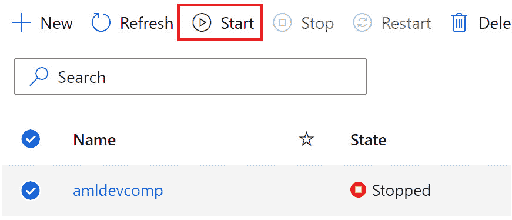

图 10.1 – 启动计算

1.  你的计算实例状态将从 **停止** 变为 **启动**。

1.  在前一章中，我们克隆了 Git 仓库；如果你还没有这样做，请继续按照以下步骤操作。如果你已经克隆了仓库，请跳转到 *步骤 7*。

1.  在你的计算实例上打开终端。注意路径将包括你的用户目录。在终端中输入以下内容以将示例笔记本克隆到你的工作目录：

    ```py
    git clone https://github.com/PacktPublishing/Azure-Machine-Learning-Engineering.git
    ```

1.  点击图 *图 10.2* 中显示的刷新图标将更新并刷新屏幕上显示的笔记本：


图 10.2 – 刷新图标

1.  查看你的 `Azure-Machine-Learning-Engineering` 目录中的笔记本。这将显示克隆到你的工作目录中的文件，如图 *图 10.3* 所示：

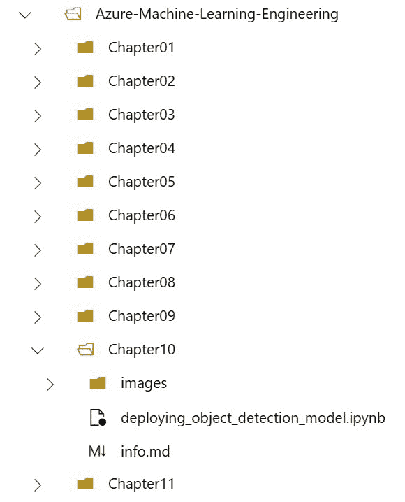

图 10.3 – Azure-Machine-Learning-Engineering

# 使用 Azure Machine Learning 的数据标注功能标注图像数据

在计算机视觉领域，目标检测是预测图像中对象位置和对象类型的一个具有挑战性的任务。就像任何其他监督机器学习任务一样，为了训练目标检测模型，我们需要有训练数据，在这种情况下，大量的标注数据，因为深度学习在大型标注数据集上表现最佳。开发计算机视觉模型的数据科学家知道标注图像是多么繁琐和耗时，而对于标注目标检测模型图像来说，更是耗时。**Azure 机器学习**（**Azure ML**）服务有一个名为**数据标注**的强大功能，该功能通过利用内置功能（如自动训练模型以预标注图像供您审查的机器学习辅助标注）显著提升了图像标注的用户体验，从而加速了标注过程。

在本节中，您将通过以下步骤了解如何利用 Azure ML 的数据标注功能来为训练目标检测模型标注您的图像：

1.  前往您一直在使用的本书克隆仓库的`chapter 10`文件夹。您将看到`images`文件夹，其中包含两个子文件夹：`train`和`test`。在下一步中，您将使用`train`文件夹中的图像。请注意，这些图像是从托管在[`github.com/EdjeElectronics/TensorFlow-Object-Detection-API-Tutorial-Train-Multiple-Objects-Windows-10`](https://github.com/EdjeElectronics/TensorFlow-Object-Detection-API-Tutorial-Train-Multiple-Objects-Windows-10)的公共仓库中克隆到我们的仓库中的。

1.  导航到 Azure ML 工作区，从左侧菜单栏中选择**数据标注**，然后点击**添加项目**，如图*图 10.4*所示：

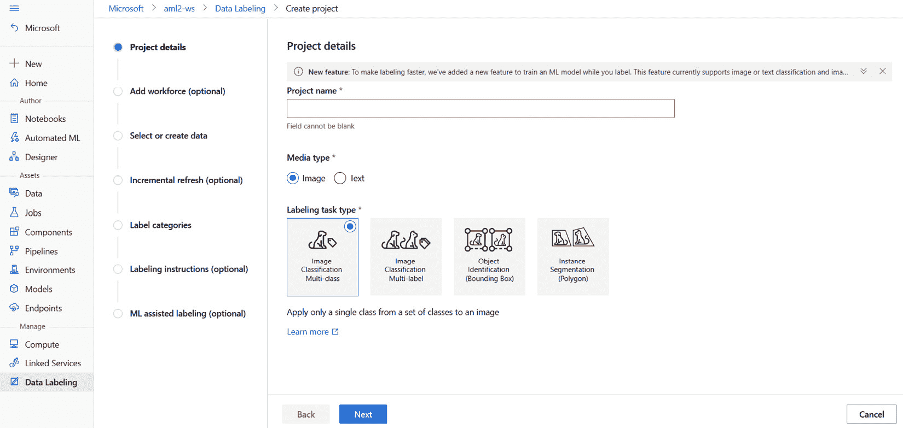

图 10.4 – 创建新的数据标注项目

1.  继续为您的项目命名，然后选择**媒体类型**为**图像**，选择**标注任务类型**为**对象识别（边界框**），并点击**下一步**，如图*图 10.5*所示：

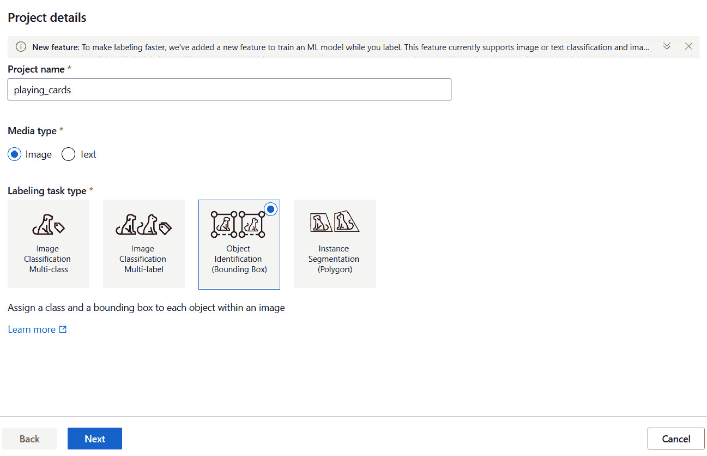

图 10.5 – 填写项目详情

1.  您可以跳过下一步，直接转到**选择或创建数据**并点击**创建**来创建您的数据集。选择一个名称，并为您的图像数据资产输入描述，然后点击**下一步**，如图*图 10.6*所示：

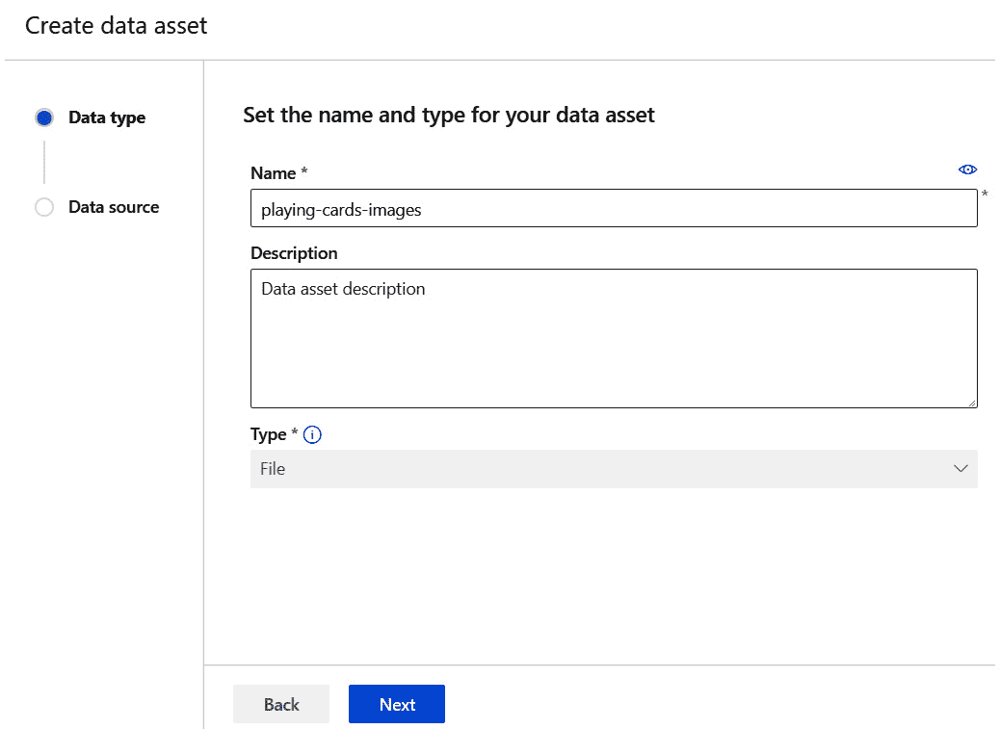

图 10.6 – 创建图像数据资产

1.  选择**从本地文件**，如图*图 10.7*所示：

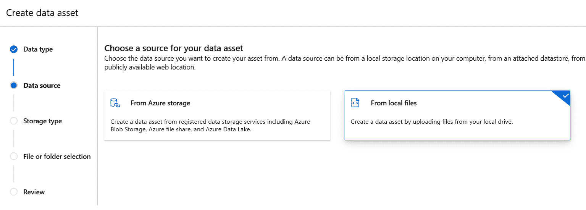

图 10.7 – 选择图像数据源

1.  选择用于上传图像的数据存储，如图*图 10.8*所示：

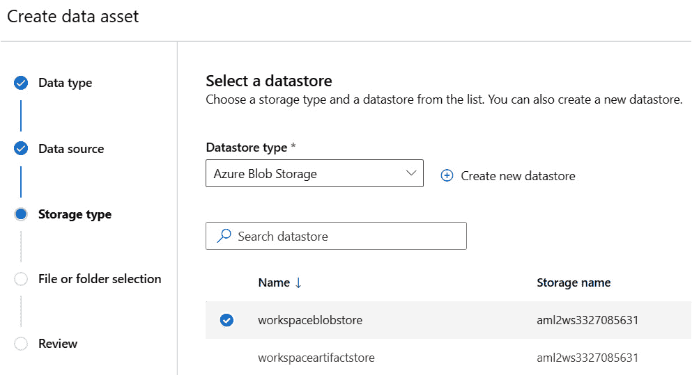

图 10.8 – 选择你的图像的存储类型和数据存储

1.  从*步骤 1*的`train`文件夹中点击，选择如图*图 10.9*所示的全部图像，然后点击**下一步**：

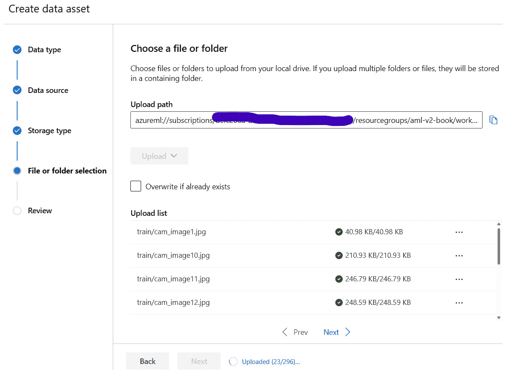

图 10.9 – 从你的本地驱动器上传图像文件

1.  审查你的图像数据资产详情，并点击**创建**。

1.  在此步骤中，你需要为图像中找到的每个对象添加标签，在这个例子中将是`Two`、`Three`、`Four`等，直到`Ten`，以及`Soldier`、`Queen`和`King`，如图*图 10.10*所示。然后点击**下一步**：

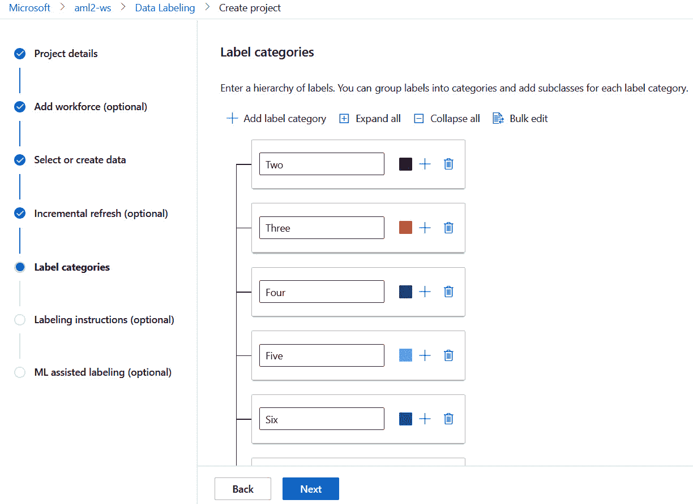

图 10.10 – 为所有图像中的对象添加标签

1.  你可以跳过**标注说明（可选）**，转到**ML 辅助标注（可选）**。确保**ML 辅助标注（可选）**被启用，如图*图 10.11*所示，然后点击**创建项目**：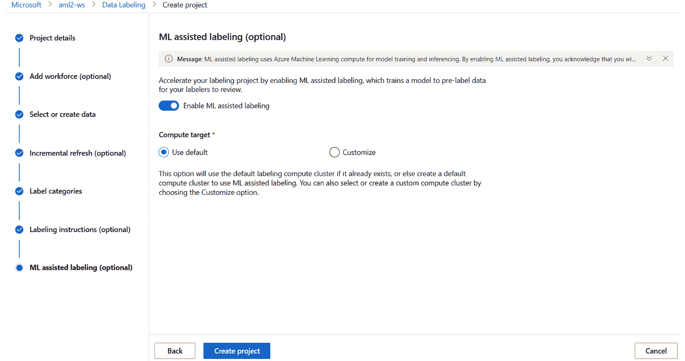

图 10.11 – 审查和创建数据标注项目

1.  点击项目列表中你刚刚创建的项目，如图*图 10.12*所示：

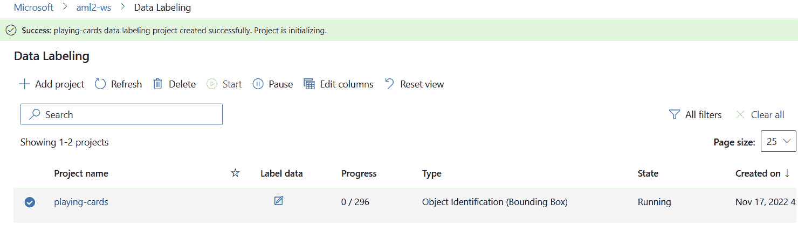

图 10.12 – 数据标注项目列表

1.  你可以看到仪表板，它提供了**数据标注**功能的不同选项，以协助标注过程。继续点击顶部附近的**标注数据**，如图*图 10.13*所示：

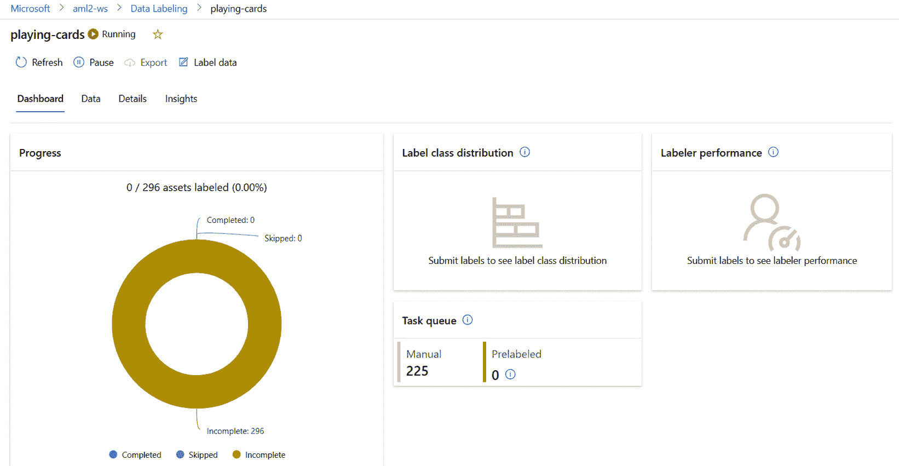

图 10.13 – 数据标注仪表板

1.  在此步骤中，你将通过在图像中找到的对象周围绘制边界框并分配相关标签来开始标注图像，如图*图 10.14*所示：

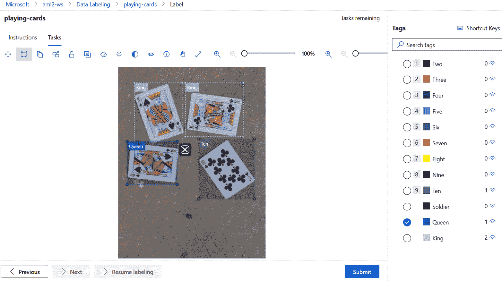

图 10.14 – 在对象周围绘制边界框并分配标签

1.  一旦足够多的图像被标注，ML 辅助标注将开始，你将看到下一批图像已经为你预标注，以便你快速审查围绕对象的边界框及其标签。在你完成所有图像的标注后，你将看到你标注数据的摘要，例如**标签类别分布**等，如图*图 10.15*所示：

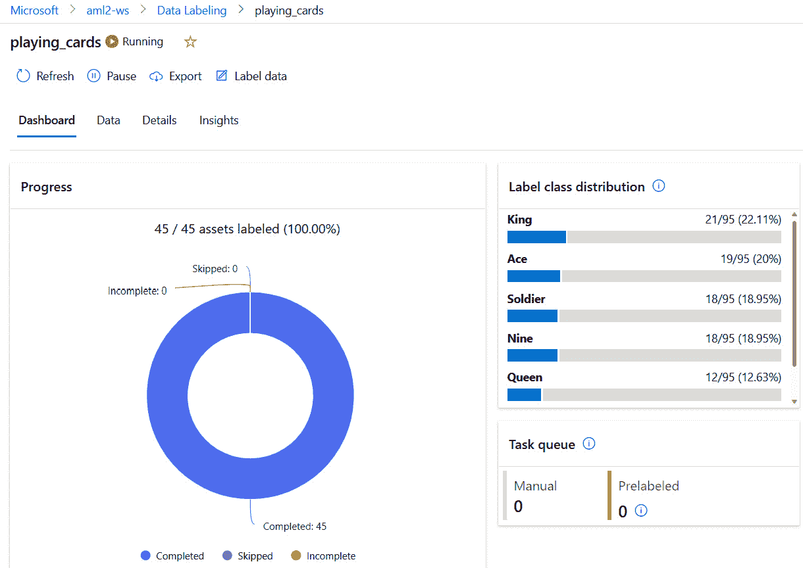

图 10.15 – 标签类别分布

1.  接下来，点击**导出**，对于**资产类型**选择**标注**，对于**导出格式**选择**Azure ML 数据集**，如图*图 10.16*所示：

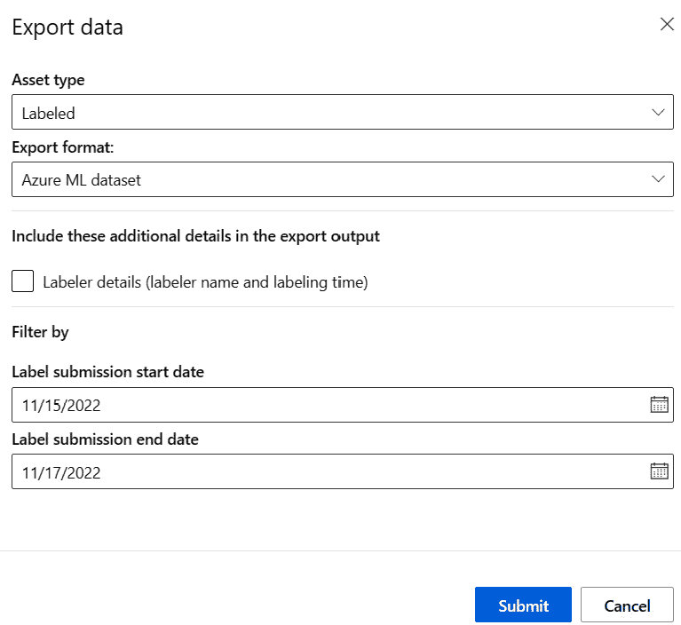

图 10.16 – 导出你的标签图像数据

1.  你应该会看到一个消息，表明你的数据已成功导出，如图*图 10.17*所示：

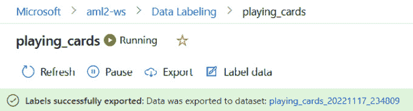

图 10.17 – 标记数据成功导出

在本节中，您学习了如何利用 Azure ML 辅助标记来加速您图像的标记，以便为训练对象检测模型做准备，我们将在下一节中进行训练。

# 使用 Azure AutoML 训练对象检测模型

在本节中，我们将向您展示如何通过以下步骤使用 Azure **Automated Machine Learning** (**AutoML**) 训练一个对象检测模型：

1.  在左侧导航栏中点击 **Automated ML**，然后点击 **新建 Automated** **ML 作业**。

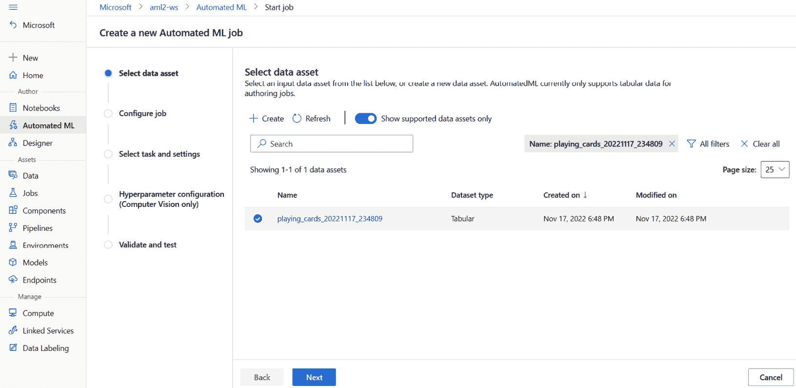

图 10.18 – 创建新的 Automated ML 作业

1.  选择您在上一个部分中创建的图像数据资产，然后点击 **下一步**。

1.  在此步骤中，您将配置训练作业，如图 *图 10*.19* 所示。首先要注意的是，AutoML 已经自动将任务类型设置为 `playing_cards_experiment`。对于 **目标列**，选择 **label (List**)，对于计算类型，选择 **Compute cluster**。由于您没有 GPU 集群（这是进行对象检测等深度学习任务所需的），您需要通过选择 **+ 新建** 并遵循集群创建向导中的步骤来创建一个。一旦您的 GPU 计算集群创建完成，就可以选择它，然后您可以点击 **下一步**：

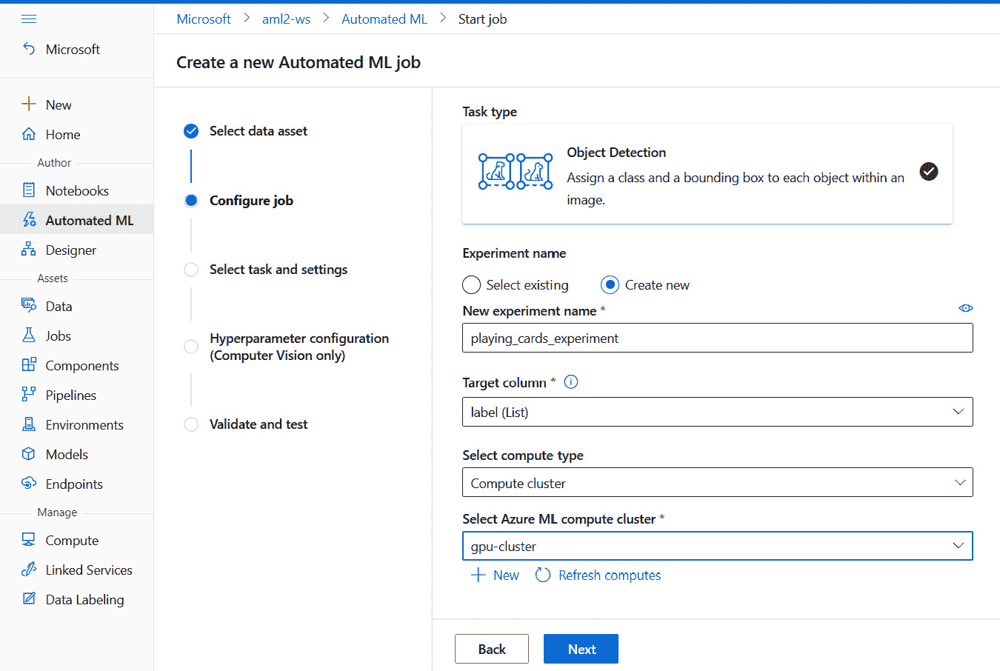

图 10.19 – 配置对象检测作业

1.  您可以保留算法细节和超参数调整设置中默认选中的值，如图 *图 10*.20* 所示，然后点击 **下一步**：

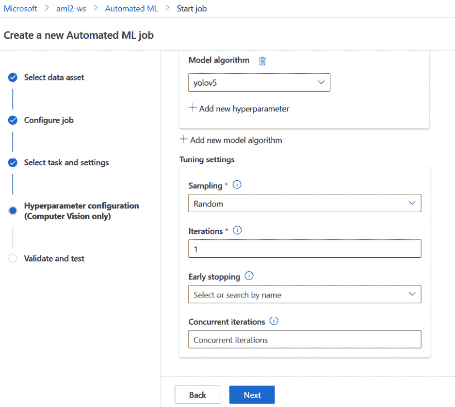

图 10.20 – 选择模型和配置超参数调整

1.  在此最后步骤中，您将设置您的验证类型。我们将再次保留默认选中的值，即 **Auto**，如图 *图 10*.21* 所示。然后，点击 **完成** 以开始模型训练：

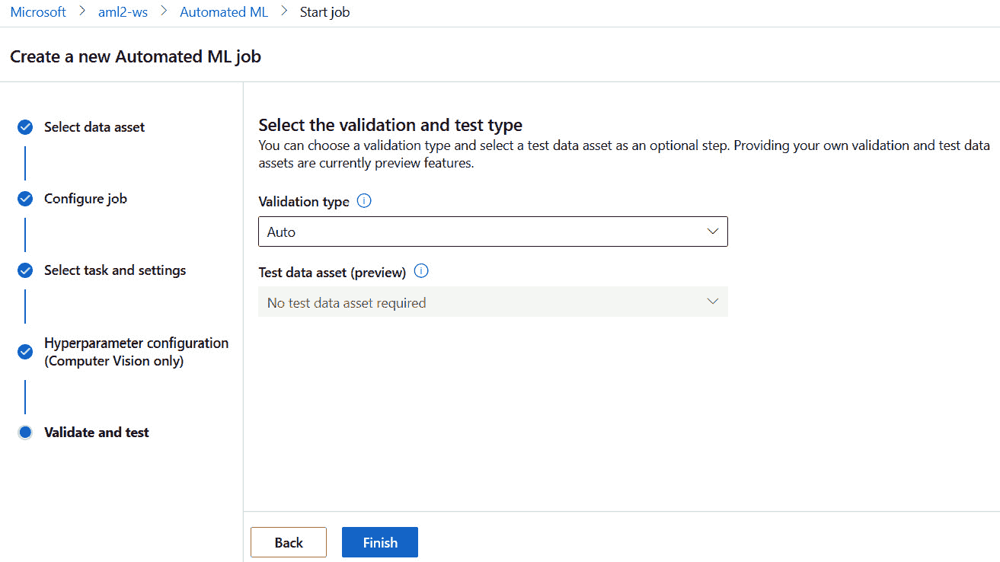

图 10.21 – 选择验证类型

1.  根据您的数据集大小，模型训练完成可能需要 15 分钟到几个小时不等。一旦训练作业完成，您可以在 **最近完成的 Automated ML 作业** 下看到它，如图 *图 10*.22* 所示：

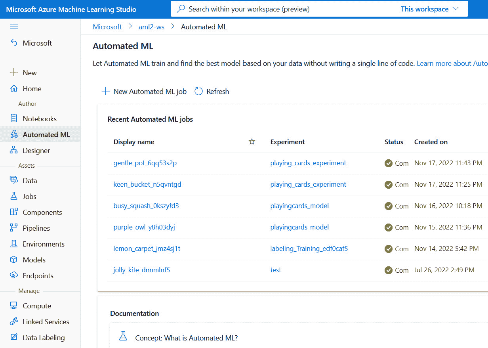

图 10.22 – Automated ML 作业

1.  选择您最新的运行实例以查看一些统计信息，例如**最佳模型摘要**、**主要指标**、**算法名称**和**持续时间**，如图 *图 10*.23* 所示：

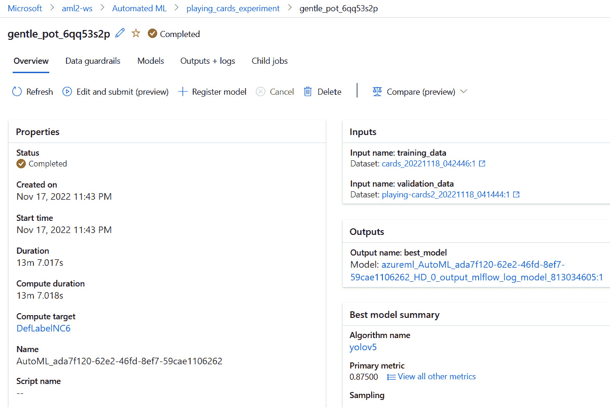

图 10.23 – 完成的 Automated ML 作业

在本节中，您学习了如何利用 Azure AutoML 通过使用另一个名为 **Data Labeling** 的工具标记的图像数据来训练对象检测模型。在下一节中，您将学习如何将训练好的模型部署到托管在线端点，以便客户端应用程序使用。

# 使用 Azure ML Python SDK 将对象检测模型部署到在线端点

就像任何其他机器学习模型一样，深度学习模型除非部署并且消费者可以发送数据进行推理，否则是没有用的。在我们的情况下，这将是通过发送图像数据并获取包含原始图像中对象类型和位置的返回结果来实现。

在本节中，我们将向您展示如何使用 Azure ML Python SDK 按照以下步骤注册您之前训练的模型并将其部署到在线端点，以便进行实时推理：

1.  打开 `第十章` 笔记本，该笔记本位于您按照章节中 *技术要求* 部分的步骤克隆的存储库中。请注意，本章节的存储库使用了大部分来自 `https://github.com/Azure/azureml-examples` 原始存储库的代码。

1.  前几个单元格导入所需的库并将您的笔记本连接到 Azure ML 工作区，如图 *图 10*.24* 所示：

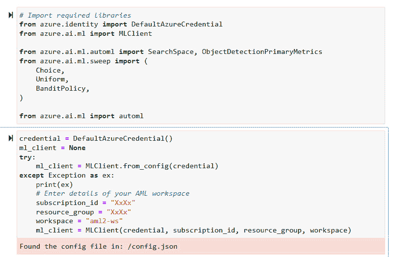

图 10.24 – 导入所需库并连接到 Azure ML 工作区

1.  您将使用 MLflow 库（特别是 MLflow 客户端）来访问 AutoML 生成的模型和其他工件。接下来的几个单元格展示了如何安装 MLflow 包的最新版本，如何获取 MLflow 跟踪服务器的 URI，以及如何初始化 MLflow 客户端，如图 *图 10*.25* 所示：

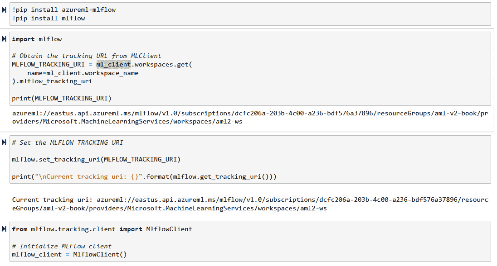

图 10.25 – 设置 MLflow 客户端以访问 AutoML 训练的模型

1.  前往 Azure ML 工作区，并点击 `AutoML_ada7f120-62e2-46fd-8ef7-59cae1106262`，如图 *图 10*.26* 所示。在下一步中，我们将使用作业名称：

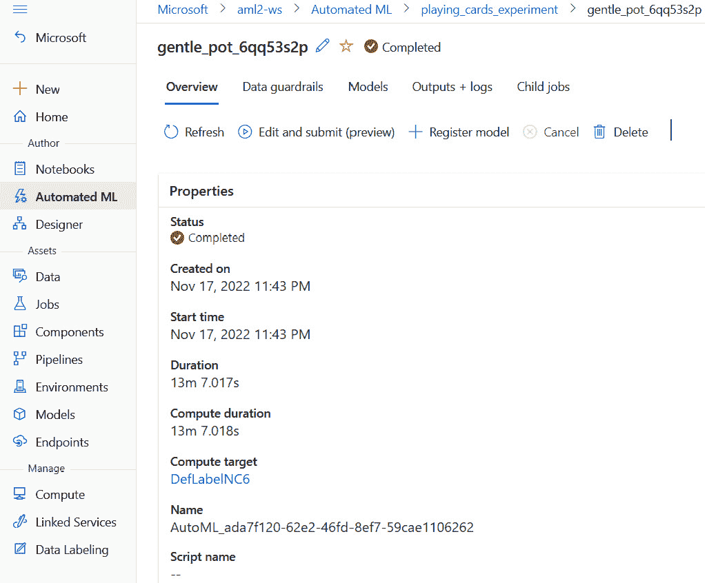

图 10.26 – 获取 AutoML 作业名称

1.  现在我们已经获得了 AutoML 作业名称，我们可以获取 AutoML 最佳模型 ID，如图 *图 10*.27* 所示。这将在后续步骤中用于检索实际训练的模型：

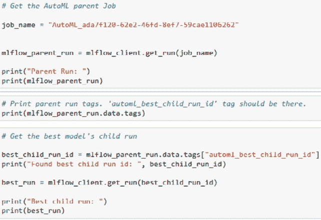

图 10.27 – 获取 AutoML 最佳模型 ID

1.  下一个单元格创建一个本地文件夹，并将最佳模型及其工件下载到该文件夹中，如图 *图 10*.28* 所示：

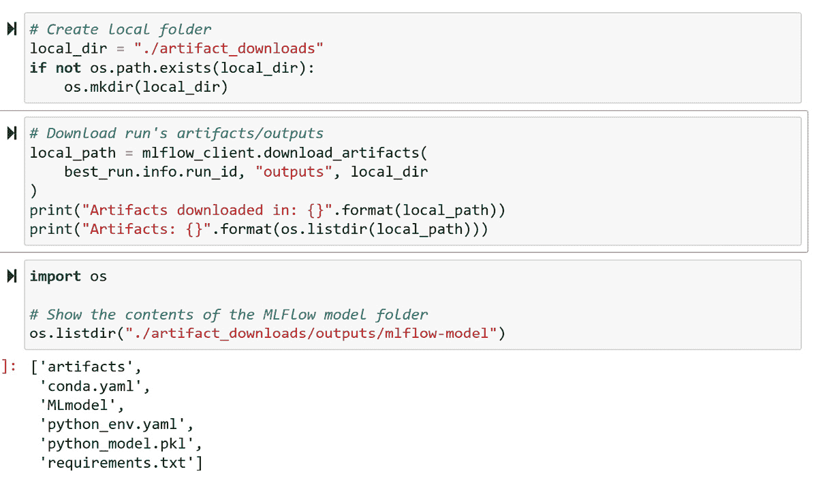

图 10.28 – 在本地文件夹中下载最佳模型

1.  下一个单元格创建了一个用于调用的托管在线端点，如图*图 10.29*所示：

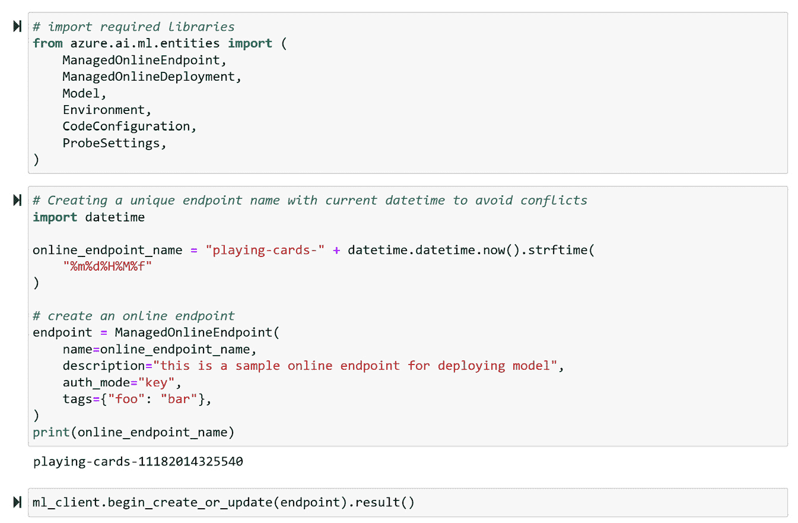

图 10.29 – 为从其调用模型创建在线端点

1.  下一个单元格将模型注册到工作区，如图*图 10.30*所示：

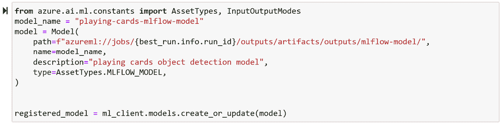

图 10.30 – 将最佳模型注册到 Azure ML 工作区

1.  下一个单元格创建了一个部署，其中包含要部署的模型的 ID、计算集群类型、集群节点数量以及之前创建的端点名称，如图*图 10.31*所示：

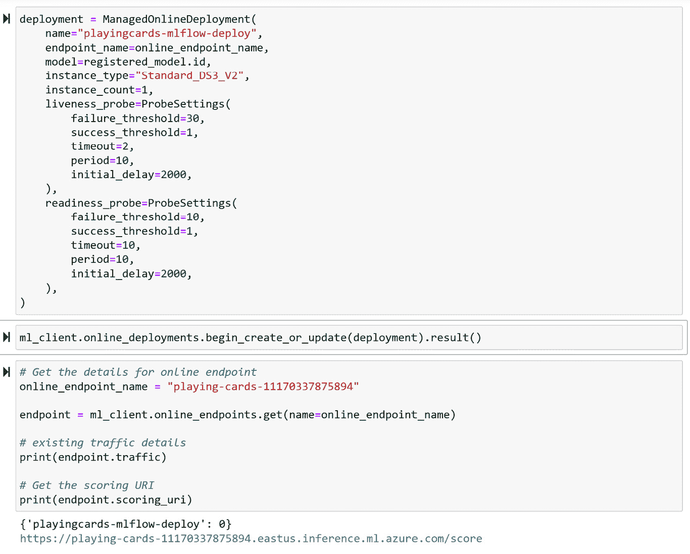

图 10.31 – 将最佳模型注册到 Azure ML 工作区

1.  接下来的几个单元格将向您展示如何调用端点并将测试图像传递给模型进行推理，如图*图 10.32*所示：

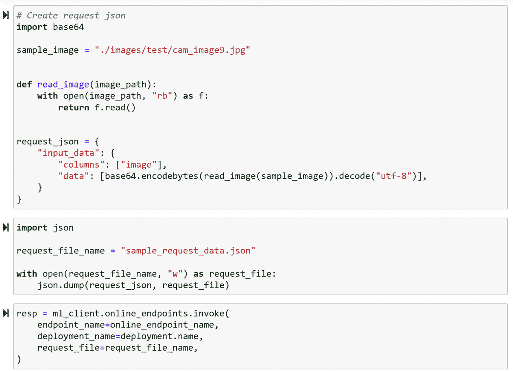

图 10.32 – 向模型发送测试图像进行推理

1.  最后，让我们看看模型对测试图像的评分如何（这是指它能够找到对象、识别其类型以及在图像中找到其位置的能力）。*图 10.33*显示了帮助您可视化端点返回的模型输出的 Python 代码：

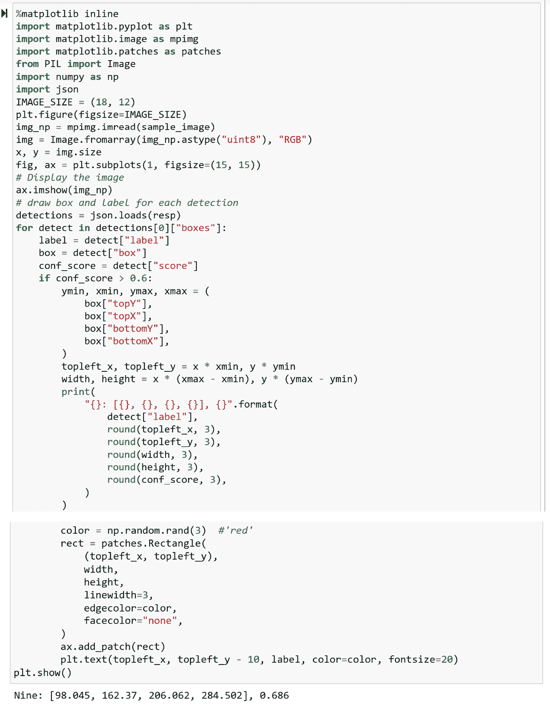

图 10.33 – 可视化模型输出的 Python 代码

1.  *图 10.34*显示了带有识别对象周围边界框的模型输出：

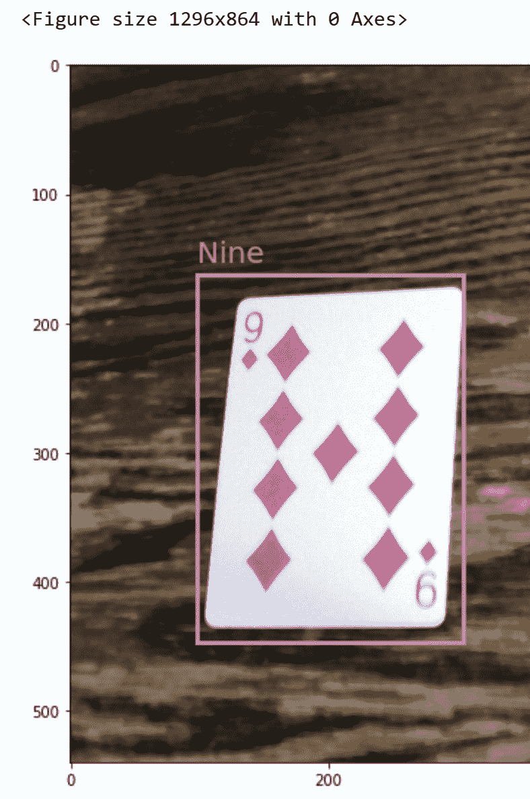

图 10.34 – 显示识别对象周围边界框的模型输出

接下来，让我们总结本章内容。

# 摘要

在本章中，我们简要介绍了深度学习以及拥有大量标记数据对模型表现的重要性。然后，我们向您展示了如何使用 Azure ML 数据标注功能来辅助标注图像数据以训练目标检测模型。接着，我们向您展示了如何使用 AutoML 训练目标检测模型，最后，您学习了如何使用 Azure ML 将模型部署到在线端点并评分测试图像。

在下一章中，我们将向您展示如何在 Azure ML 中执行分布式模型训练。
