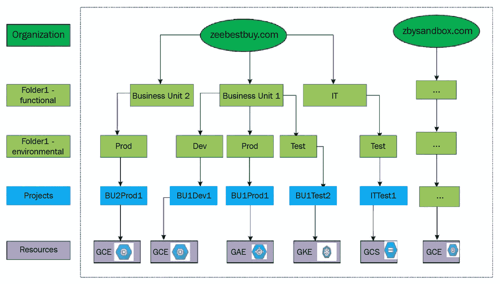
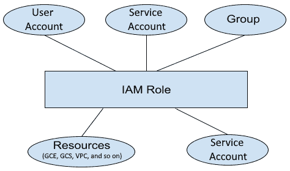
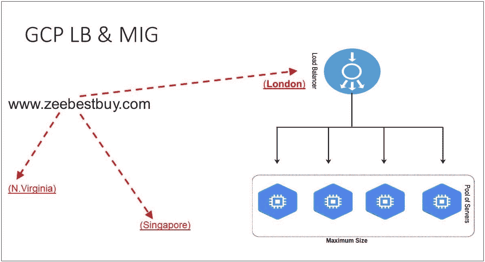

# 第一章：理解谷歌云服务

在本书的第一部分，我们将通过关注谷歌云和 Python（分别是我们学习旅程的必要平台和工具）来建立基础。

在本章中，我们将深入探讨 **谷歌云平台**（**GCP**）并讨论与 **谷歌云机器学习**密切相关的谷歌云服务。掌握这些服务将为我们提供坚实的基础。

本章将涵盖以下主题：

+   理解 GCP 全球基础设施

+   开始使用 GCP

+   GCP 组织结构

+   GCP 身份和访问管理

+   GCP 计算谱系

+   GCP 存储和数据库服务

+   GCP 大数据和数据分析服务

+   GCP 人工智能服务

让我们开始吧。

# 理解 GCP 全球基础设施

**谷歌** 是世界上最大的云服务提供商之一。凭借谷歌全球数据中心中的物理计算基础设施，如计算机、硬盘驱动器、路由器和交换机，这些数据中心通过谷歌的全球骨干网络连接，谷歌在 GCP 中提供了一系列全面的云服务，包括计算、网络、数据库、安全和大数据、**机器学习**（**ML**）等高级服务。

在谷歌的全球云基础设施中，有许多数据中心组。每个数据中心组被称为 **GCP 区域**。这些区域遍布全球，包括亚洲、澳大利亚、欧洲、北美和南美。这些区域通过谷歌的全球骨干网络连接，以优化性能和增强弹性。每个 GCP 区域是一组相互隔离的 **区域**。每个区域有一个或多个数据中心，并由一个结合字母标识符和区域名称的名称来标识。例如，区域 *US-Central1-a* 位于 *US-Central1* 区域，该区域位于美国爱荷华州的 Council Bluffs。在 GCP 全球基础设施中，还有许多 **边缘位置** 或 **接入点**（**POPs**），谷歌的全球网络通过这些位置连接到互联网。有关 GCP 区域、区域和边缘位置的更多详细信息，请参阅 [`cloud.google.com/about/locations`](https://cloud.google.com/about/locations)。

GCP 在全球范围内提供按需云资源。这些资源可以一起使用来构建帮助满足业务目标和满足技术要求解决方案。例如，如果一家公司需要在东京需要 1,000 TB 的存储空间，其 IT 专业人员可以登录他们的 GCP 账户控制台，在任何时候在*亚洲东北 1*地区配置存储空间。同样，可以在悉尼配置 3,000 TB 的数据库，在法兰克福配置 4,000 节点的集群，只需点击几下即可。最后，如果一家公司想要为全球用户提供最低延迟的全球网站，例如[zeebestbuy.com](http://zeebestbuy.com)，他们可以在全球区域的伦敦、弗吉尼亚和新加坡建立三个 Web 服务器，并利用谷歌的全球 DNS 服务将这些 Web 流量分配到这三个 Web 服务器。根据用户的 Web 浏览器位置，DNS 将路由流量到最近的 Web 服务器。

# 开始使用 GCP

现在我们已经了解了谷歌的全球云基础设施和云计算的按需资源配置概念，我们迫不及待地想要深入谷歌云并在云中配置资源！

在本节中，我们将通过以下步骤构建云资源：

+   创建免费层级的 GCP 账户

+   在谷歌云中配置虚拟计算机实例

+   在谷歌云中配置我们的第一个存储

让我们详细地逐一介绍这些步骤。

## 创建免费层级的 GCP 账户

谷歌为我们提供了一个免费层账户类型，以便我们开始在 GCP 上操作。更多详细信息可以在[`cloud.google.com/free/docs/gcp-free-tier`](https://cloud.google.com/free/docs/gcp-free-tier)找到。

一旦您注册了 GCP 免费层账户，就是时候规划我们在谷歌云中的第一个资源了——一台计算机和一个云存储文件夹。我们将按需配置它们。多么令人兴奋啊！

## 在谷歌云中配置我们的第一台计算机

我们将从最简单的想法开始：在云中配置一台计算机。暂时想想家里的电脑。它有一个**中央处理器**（**CPU**），**随机存取存储器**（**RAM**），**硬盘驱动器**（**HDDs**），以及一个**网络接口卡**（**NIC**）来连接到相关的**互联网服务提供商**（**ISP**）设备（如电缆调制解调器和路由器）。它还有一个操作系统（Windows 或 Linux），并且可能有一个数据库，如 MySQL 用于家庭数据管理，或者 Microsoft Office 用于家庭办公使用。

要在谷歌云中配置计算机，我们需要对其硬件进行相同的规划，例如 CPU 的数量、RAM 的大小以及 HDD 的大小，以及对其软件的规划，例如操作系统（Linux 或 Windows）和数据库（**MySQL**）。我们可能还需要规划计算机的网络，例如外部 IP 地址，以及 IP 地址是否需要静态或动态。例如，如果我们计划配置一个 Web 服务器，那么我们的计算机将需要一个静态的外部 IP 地址。从安全的角度来看，我们还需要设置网络防火墙，以便只有家庭或工作地点的特定计算机可以访问我们云中的计算机。

GCP 为消费者提供了一种在云中配置计算机的云服务：**Google Compute Engine**（**GCE**）。通过 GCE 服务，我们可以在谷歌云中构建灵活的、自我管理的**虚拟机**（**VM**）。GCE 根据消费者的需求提供不同的硬件和软件选项，因此您可以使用定制的 VM 类型并为 VM 实例选择合适的操作系统。

按照以下说明进行操作 [`cloud.google.com/compute/docs/instances/create-start-instance`](https://cloud.google.com/compute/docs/instances/create-start-instance)，您可以在 GCP 中创建一个虚拟机。让我们在这里暂停一下，转到 GCP 控制台来配置我们的第一个计算机。

我们如何访问计算机？如果 VM 运行的是 Windows 操作系统，您可以使用**远程桌面**来访问它。对于 Linux VM，您可以使用**安全外壳**（**SSH**）进行登录。更多详细信息请参阅 [`cloud.google.com/compute`](https://cloud.google.com/compute)。

## 在谷歌云中配置我们的第一个存储

当我们打开计算机机箱并查看我们家庭计算机的内部时，我们可以看到其硬件组件——即其 CPU、RAM、HDD 和 NIC。PC 内的硬盘在大小和性能上都是有限的。*EMC*，由理查德·伊根和罗杰·马诺在 1979 年创立的公司，在 1990 年将 PC 硬盘扩展到 PC 机箱外的独立计算机网络存储平台，称为*Symmetrix*。Symmetrix 拥有自己的 CPU/RAM，并提供巨大的存储容量。它通过光纤电缆连接到计算机，并作为计算机的**存储阵列**。另一方面，*SanDisk*，由 Eli Harari、Sanjay Mehrotra 和 Jack Yuan 于 1988 年创立，在 2000 年生产了第一个基于 Flash 的**固态硬盘**（**SSD**），名为*Cruzer*。Cruzer 通过 USB 连接到计算机提供便携式存储。通过跳出思维定式，扩展到 Symmetrix 或 Cruzer，EMC 和 SanDisk 将硬盘概念扩展到了盒子之外。这些都是创业想法的绝佳例子！

然后是云计算的伟大想法——存储的概念进一步扩展到云块存储、云**网络附加存储**（**NAS**）和云对象存储。让我们更详细地看看这些：

+   **云块存储**是一种基于软件的存储形式，可以附加到云中的虚拟机，就像硬盘在我们的家用电脑上一样。在 Google Cloud 中，云块存储被称为 **持久磁盘**（**PD**）。无需购买物理硬盘并将其安装在电脑上使用，PD 可以立即创建并附加到云中的虚拟机，只需几个点击即可。

+   **云网络附加存储**（**Cloud NAS**）是一种基于软件的存储形式，可以通过虚拟云网络在许多云虚拟机之间共享。在 GCP 中，云 NAS 被称为 **Filestore**。无需购买物理文件服务器，将其安装在网络上并与多个家庭电脑共享，只需几个点击即可创建 Filestore 实例，并由许多云虚拟机共享。

+   **云对象存储**是一种基于软件的存储形式，可以用于在云中存储对象（文件、图像等）。在 GCP 中，云对象存储被称为 **Google Cloud Storage**（**GCS**）。与 PD 不同，PD 是一种云块存储类型，由虚拟机使用（可以在多个虚拟机之间以只读模式共享），以及 Filestore，它是一种由多个虚拟机共享的云 NAS 类型，GCS 是一种用于存储不可变对象的云对象类型。对象存储在 GCS 存储桶中。在 GCP 中，可以通过 GCP 控制台进行存储桶创建和删除、对象上传、下载和删除，只需几个点击即可！

GCS 根据对象访问模式提供不同的存储类别。更多详细信息可以在 [`cloud.google.com/storage`](https://cloud.google.com/storage) 找到。

按照位于 [`cloud.google.com/storage/docs/creating-buckets`](https://cloud.google.com/storage/docs/creating-buckets) 的说明，您可以创建存储文件夹/存储桶并将对象上传到其中。让我们在这里暂停一下，转到 GCP 控制台来配置我们的第一个存储桶并将一些对象上传到其中。

## 使用 GCP Cloud Shell 管理资源

到目前为止，我们已经讨论了从 GCP 控制台在云中配置虚拟机和存储桶/对象。还有一个工具可以帮助我们创建、管理和删除资源：GCP Cloud Shell。Cloud Shell 是一个可以通过控制台浏览器轻松访问的命令行界面。在您点击 GCP 控制台上的 **Cloud Shell** 按钮后，您将获得一个 Cloud Shell – 在您的网络浏览器中，一个带有所有云资源管理命令的虚拟机命令行用户界面。

以下工具由 Google 提供，供客户使用命令行创建和管理云资源：

+   `gcloud` 工具是 GCP 产品和服务（如 GCE）的主要命令行界面。

+   `gsutil` 工具用于 GCS 服务。

+   `bq` 工具用于 BigQuery 服务。

+   `kubectl` 工具用于 Kubernetes 服务。

请参阅[`cloud.google.com/shell/docs/using-cloudshell-command`](https://cloud.google.com/shell/docs/using-cloudshell-command)获取有关 GCP Cloud Shell 和命令的更多信息，以及如何使用 Cloud Shell 命令创建虚拟机（VM）和存储桶。

## GCP 网络 – 虚拟私有云

再次思考家庭电脑——它们都通过网络连接，有线或无线，以便连接到互联网。没有网络，电脑几乎毫无用处。在 GCP 中，云网络单元被称为**虚拟私有云**（**VPC**）。VPC 是一种基于软件的逻辑网络资源。在 GCP 项目中，可以配置有限数量的 VPC。在云中启动虚拟机（VM）后，您可以在 VPC 内连接它们，或者将它们隔离在不同的 VPC 中。由于 GCP VPC 是全球性的，并且可以跨越世界上的多个区域，因此您可以在世界任何地方配置 VPC，以及其中的资源。在 VPC 内，公共子网包含具有外部 IP 地址的虚拟机，这些 IP 地址可以从互联网访问，并且可以访问互联网；私有子网包含没有外部 IP 地址的虚拟机。VPC 可以在 GCP 项目内或项目外相互对等。

可以使用 GCP 控制台或 GCP Cloud Shell 配置 VPC。有关详细信息，请参阅[`cloud.google.com/vpc/`](https://cloud.google.com/vpc/)。让我们在这里暂停一下，转到 GCP 控制台以配置我们的 VPC 和子网，然后在这些子网中启动一些虚拟机。

# GCP 组织结构

在我们进一步讨论 GCP 云服务之前，我们需要花一些时间来讨论 GCP 组织结构，它与**亚马逊网络服务**（**AWS**）云和微软 Azure 云的结构相当不同。

## GCP 资源层次结构

如以下图所示，在 GCP 云域内，最上面是 GCP 组织，然后是文件夹，接着是项目。作为一项常见做法，我们可以将公司的组织结构映射到 GCP 结构中：公司映射到 GCP 组织，其部门（销售、工程等）映射到文件夹，而来自部门的职能项目映射到文件夹下的项目。云资源，如虚拟机（VM）、**数据库**（**DB**）等，位于项目下。

在 GCP 组织层次结构中，*每个项目都是一个独立的隔间，每个资源恰好属于一个项目*。项目可以有多个所有者和用户。它们分别管理和计费，尽管多个项目可能与同一个计费账户相关联：



图 1.1 – GCP 组织结构示例

在前面的图中，有两个组织：一个用于生产，一个用于测试（沙盒）。在每一个组织下，都有多层文件夹（注意文件夹层数和每层的文件夹数量可能有限），在每个文件夹下，都有多个项目，每个项目包含多个资源。

## GCP 项目

GCP 项目是 GCP 资源的逻辑分隔。项目用于根据 Google Cloud 的 **身份和访问管理**（**IAM**）权限完全隔离资源：

+   **计费隔离**：使用不同的项目来分隔支出单元

+   **配额和限制**：在项目级别设置，并按工作负载分隔

+   **管理复杂性**：在项目级别设置以实现访问分离

+   **影响范围**：配置问题在项目内受限

+   **职责分离**：业务单元和数据敏感性是分开的

总结来说，GCP 组织结构为管理 Google Cloud 资源提供了一个层次结构，其中项目是逻辑隔离和分离。在下一节中，我们将通过查看 IAM 来讨论 GCP 组织内的资源权限。

# GCP 身份和访问管理

一旦我们审查了 GCP 组织结构以及 VM、存储和网络等 GCP 资源，我们必须查看这些资源在 GCP 组织内的访问管理：IAM。GCP IAM 使用 **AAA** 模型管理云身份：**身份验证**、**授权**和**审计**（或**会计**）。

## 身份验证

在 *AAA* 模型中的第一个 *A* 是 **身份验证**，它涉及验证试图访问云的云身份。与传统方式仅要求提供用户名和密码不同，**多因素身份验证**（**MFA**）被使用，这是一种要求用户使用多种独立方法验证其身份的认证方法。出于安全原因，所有用户身份验证，包括 GCP 控制台访问和任何其他 **单点登录**（**SSO**）实现，都必须在强制执行 MFA 的同时进行。用户名和密码在当今时代简单地无法保护用户访问。

## 授权

**授权**在 *AAA* 模型中由第二个 *A* 表示。它是在用户已认证到云账户后，授予或拒绝用户访问云资源的过程。用户可以访问的信息量和服务的数量取决于用户的授权级别。一旦用户的身份得到验证并且用户已认证到 GCP，用户必须通过授权规则才能访问云资源和数据。授权决定了用户可以和不能访问的资源。

授权定义了*谁可以在哪个资源上做什么*。以下图表显示了 GCP 中的授权概念。如您所见，授权过程中有三个参与者：图中的第一层是身份 – 这指定了*谁*可以是用户帐户、用户组或应用程序（**服务帐户**）。第三层指定了*哪些*云资源，例如 GCS 存储桶、GCE 虚拟机、VPC、服务帐户或其他 GCP 资源。**服务帐户**也可以是一个身份以及一个资源：



图 1.2 – GCP IAM 身份验证

中间层是**IAM 角色**，也称为*什么*，它指的是身份对资源具有的特定权限或操作。例如，当一组用户被授予计算查看者的权限时，该组将只能对 GCE 资源进行只读访问，无法写入/更改它们。GCP 支持三种类型的 IAM 角色：**原始（基本**）、**预定义**和**自定义**。让我们看看：

+   **原始（基本）角色**包括所有者、编辑者和查看者角色，这些角色在 IAM 引入之前就存在于 GCP 中。这些角色在所有 Google Cloud 服务中都有数千个权限，并赋予显著的权限。因此，在生产环境中，除非没有其他选择，否则建议不要授予基本角色。相反，授予满足您需求的限制性预定义角色或自定义角色。

+   **预定义角色**根据基于角色的权限需求提供对特定服务的细粒度访问。预定义角色由 Google 创建和维护。Google 会根据需要自动更新其权限，例如当 Google Cloud 添加新功能或服务时。

+   **自定义角色**根据用户指定的权限列表提供细粒度访问。这些角色应谨慎使用，因为用户负责维护相关的权限。

在 GCP 中，身份验证是通过 IAM 策略实现的，这些策略将身份绑定到 IAM 角色。以下是一个示例 IAM 策略：

```py
{
  "bindings": [
    {
      "members": [
        "user:jack@example.com"
      ],
      "role": "roles/resourcemanager.organizationAdmin"
    },
    {
      "members": [
        "user:jack@example.com",
        "user:joe@example.com"
      ],
      "role": "roles/resourcemanager.projectCreator"
    }
  ],
  "etag": "BwUjMhCsNvY=",
  "version": 1
}
```

在前面的示例中，Jack（`jack@example.com`）被授予了预定义的组织管理员角色（`roles/resourcemanager.organizationAdmin`），因此他有权访问组织、文件夹和有限的项目操作。Jack 和 Joe（`joe@example.com`）都可以创建项目，因为他们已被授予项目创建者角色（`roles/resourcemanager.projectCreator`）。这两个角色绑定共同为 Jack 和 Joe 提供了细粒度的 GCP 资源访问权限，尽管 Jack 拥有更多的权限。

## 审计或会计

在 *AAA* 模型的第三个 *A* 指的是 **审计** 或 **会计**，这是跟踪用户访问 GCP 资源活动的过程，包括在网络中花费的时间、他们访问的服务以及登录会话期间传输的数据量。审计数据用于趋势分析、访问记录、合规审计、违规检测、取证和调查、账户计费、成本分配和容量规划。使用 Google Cloud Audit Logs 服务，您可以跟踪用户/组和他们的活动，并确保活动记录是真实的。审计日志对于云安全非常有帮助。例如，回溯到网络安全事件的记录对于取证分析和案件调查可能非常有价值。

## 服务帐户

在 GCP 中，服务帐户是一种专用帐户，可以由 GCP 服务和其他在 GCE 实例或其他地方运行的应用程序用来与 GCP **应用程序编程接口** (**APIs**) 交互。它们就像 *程序化访问用户*，通过它们您可以赋予访问 GCP 服务的权限。服务帐户存在于 GCP 项目中，但可以在组织和文件夹级别以及不同的项目中分配权限。通过利用服务帐户凭证，应用程序可以授权自己访问一组 API 并在授予服务帐户的权限范围内执行操作。例如，运行在 GCE 实例上的应用程序可以使用该实例的服务帐户与其他 Google 服务（如 Cloud SQL 数据库实例）及其底层 API 交互。

当我们创建第一个虚拟机时，同时为该虚拟机创建了一个默认的服务帐户。您可以通过定义其 **访问范围** 来定义此虚拟机服务帐户的权限。一旦定义，在此虚拟机上运行的所有应用程序都将拥有相同的权限来访问其他 GCP 资源，例如 GCS 存储桶。当虚拟机的数量显著增加时，这将生成大量的服务帐户。这就是我们经常创建一个服务帐户并将其分配给需要具有相同 GCP 权限的虚拟机或其他资源的原因。

# GCP 计算服务

之前，我们探讨了 GCE 服务并在云中创建了我们的虚拟机实例。现在，让我们看看整个 GCP 计算谱系，它包括 **Google Compute Engine** (**GCE**), **Google Kubernetes Engine** (**GKE**), Cloud Run, **Google App Engine** (**GAE**), 和 Cloud Functions，如下面的图所示：


图 1.3 – GCP 计算服务

GCP 计算谱系提供了广泛的企业用例。根据业务模式，我们可以选择 GCE、GKE、GAE、Cloud Run 或 Cloud Functions 来满足需求。我们将在接下来的几节中简要讨论每个服务。

## GCE 虚拟机

我们讨论了围绕 GCE 和使用云控制台和 Cloud Shell 部署的虚拟机的相关概念。在本节中，我们将讨论 GCP GCE 虚拟机镜像和定价模式。

计算引擎镜像为在 **计算引擎**（即虚拟机）中运行的应用程序提供基本操作系统环境，它们对于确保您的应用程序快速、可靠地部署和扩展至关重要。您还可以使用金/受信任镜像来存档应用程序版本以用于灾难恢复或回滚场景。GCE 镜像在安全性方面也至关重要，因为它们可以用于部署公司中的所有虚拟机。

GCE 为虚拟机提供不同的定价模式：按需付费、抢占式、承诺使用量和独占主机。

按需付费适用于需要即时配置虚拟机的业务场景。如果工作量可预测，我们希望使用承诺使用量以获得折扣价格。如果工作量可以重启，我们希望进一步利用 *抢占式* 模型并竞标虚拟机价格。如果存在与主机相关的许可证，则 *独占主机* 类型符合我们的需求。有关 GCE 虚拟机定价的更多详细信息，请参阅 [`cloud.google.com/compute/vm-instance-pricing`](https://cloud.google.com/compute/vm-instance-pricing)。

## 负载均衡器和托管实例组

单台计算机可能因硬件或软件故障而宕机，并且在计算能力需求随时间变化时也无法提供任何扩展。为确保高可用性和可伸缩性，GCP 提供了 **负载均衡器**（**LBs**）和 **托管实例组**（**MIGs**）。LBs 和 MIGs 允许您创建同构的实例组，以便负载均衡器可以将流量定向到多个虚拟机实例。MIG 还提供自动扩展和自动修复等功能。自动扩展允许您通过配置自动扩展策略中的适当最小和最大实例来处理流量峰值，并根据特定信号调整虚拟机实例的数量，而自动修复则执行健康检查，并在必要时自动重新创建不健康的实例。

让我们通过一个例子来解释这个概念：



图 1.4 – GCP 负载均衡器和托管实例组

如前图所示，[www.zeebestbuy.com](http://www.zeebestbuy.com) 是一家全球电子商务公司。每年，当 *黑色星期五* 来临，他们的网站负载非常重，以至于单个计算机无法容纳流量——需要更多的网络服务器（运行在虚拟机实例上）来分配流量负载。黑色星期五之后，流量会恢复正常，不需要那么多实例。在 GCP 平台上，我们使用负载均衡器（LB）和迁移组（MIG）来解决这个问题。如前图所示，我们在全球范围内建立了三个网络服务器（美国弗吉尼亚北部、新加坡和英国伦敦），GCP DNS 可以根据用户的浏览器位置和到三个站点的延迟将用户流量分配到这些位置。在每个站点，我们设置一个 LB 和一个 MIG：根据正常和高峰流量，可以适当地设置所需的容量、最小容量和最大容量。当 *黑色星期五* 来临，LB 和 MIG 一起弹性地启动新的虚拟机实例（网络服务器）来处理增加的流量。黑色星期五销售结束后，他们将停止/删除虚拟机实例以反映减少的流量。

MIG 使用启动模板，类似于启动配置，并指定实例配置信息，包括虚拟机镜像的 ID、实例类型、扩展阈值以及其他用于启动虚拟机实例的参数。LB 使用健康检查来监控实例。如果实例在配置的阈值时间内没有响应，将根据启动模板启动新的实例。

## 容器和 Google Kubernetes Engine

就像从物理机到虚拟机的转变一样，从虚拟机到容器的转变是革命性的。我们不再启动一个虚拟机来运行应用程序，而是将应用程序打包成一个标准单元，这个单元包含运行应用程序或服务所需的一切，以便在不同的虚拟机上以相同的方式运行。我们将包构建成一个 Docker 镜像；容器是 Docker 镜像的运行实例。当虚拟化程序将硬件虚拟化为虚拟机时，Docker 镜像将操作系统虚拟化为应用程序容器。

由于松散耦合和模块化可移植性，越来越多的应用程序正在被容器化。很快，就出现了一个问题：如何管理所有这些容器/Docker 镜像？这就是 **Google Kubernetes Engine**（**GKE**）发挥作用的地方，这是 Google 开发的一个容器管理系统。一个 GKE 集群通常至少包含一个控制平面和多个被称为节点的工人机器，它们协同工作来管理/编排容器。Kubernetes Pod 是一组一起部署并协同工作以完成任务的容器。例如，一个应用服务器 Pod 包含三个独立的容器：应用服务器本身、一个监控容器和一个日志容器。协同工作，它们构成了业务用例中的应用程序或服务。

按照以下说明[`cloud.google.com/kubernetes-engine/docs/how-to/creating-a-zonal-cluster`](https://cloud.google.com/kubernetes-engine/docs/how-to/creating-a-zonal-cluster)，您可以创建一个 GKE 区域集群。让我们在这里暂停一下，并使用 GCP Cloud Shell 创建一个 GKE 集群。

## GCP Cloud Run

GCP Cloud Run 是一个托管计算平台，允许您在完全托管的环境或 GKE 集群中运行无状态的容器，这些容器可以通过 HTTP 请求被调用。Cloud Run 是无服务器的，这意味着所有基础设施管理任务都是 Google 的责任，让用户专注于应用程序开发。使用 Cloud Run，您可以使用任何语言以及您想要的任何框架和工具来构建应用程序，然后几秒钟内即可部署，无需管理服务器基础设施。

## GCP Cloud Functions

与分别部署 VM 或容器以运行应用程序的 GCE 和 GKE 服务不同，Cloud Functions 是一种无服务器计算服务，允许您提交代码（用 JavaScript、Python、Go 等语言编写）。Google Cloud 将在后台运行代码并将结果发送给您。您不知道也不关心代码在哪里运行——您只需为代码在 GCP 上运行的时间付费。

利用 Cloud Functions，一段代码可以在几毫秒内根据某些事件被触发。例如，当一个对象被上传到 GCS 存储桶后，可以生成并发送一条消息到 GCP Pub/Sub，这将导致 Cloud Functions 处理该对象。Cloud Functions 也可以根据您定义的 HTTP 端点或 Firebase 移动应用程序中的事件被触发。

使用 Cloud Functions，Google 负责运行代码的后端基础设施，让您只需专注于代码开发。

# GCP 存储和数据库服务范围

之前，我们探讨了 GCS 服务，并在云中创建了我们的存储桶，以及为我们的云 VM 实例创建的持久磁盘和 Filestore 实例。现在，让我们看看整个 GCP 存储和数据库服务范围，包括 Cloud Storage、Cloud SQL、Cloud Spanner、Cloud Firestore、Bigtable 和 BigQuery，如下所示：


图 1.5 – GCP 存储和数据库服务

在这里，Cloud Storage 存储对象，Cloud SQL 和 Cloud Spanner 是关系型数据库，Cloud Firestore 和 Bigtable 是 NoSQL 数据库。BigQuery 也是一个数据仓库以及大数据分析/可视化工具。我们将在 *GCP 大数据和数据分析服务* 部分讨论 BigQuery。

## GCP 存储

我们已经讨论了 GCP 存储，包括 **Google Cloud Storage**（**GCS**）、持久磁盘和 Filestore。GCS 是 GCP ML 作业存储其训练数据、模型、检查点和日志的常见选择。在接下来的几节中，我们将讨论更多 GCP 存储数据库和服务。

## Google Cloud SQL

Cloud SQL 是一个完全托管的 GCP 关系型数据库服务，支持 MySQL、PostgreSQL 和 SQL Server。使用 Cloud SQL，您可以在本地运行熟悉的相同关系型数据库，无需自我管理的麻烦，如备份和恢复、高可用性等。作为一个托管服务，Google 负责管理数据库备份、导出和导入、确保高可用性和故障转移、执行补丁维护和更新，以及执行监控和日志记录。

## Google Cloud Spanner

Google Cloud Spanner 是一个具有无限全球规模、强一致性以及高达 99.999% 可用性的 GCP 完全托管的关系型数据库。与关系型数据库类似，Cloud Spanner 有模式、SQL 和强一致性。同样，与非关系型数据库类似，Cloud Spanner 提供高可用性、水平可伸缩性和可配置的复制。Cloud Spanner 已被用于关键业务用例，如在线交易系统的交易和财务管理。

## Cloud Firestore

Cloud Firestore 是一个快速、完全托管、无服务器、云原生的 NoSQL 文档数据库。Cloud Firestore 支持 ACID 事务，并允许您在无需性能下降的情况下对 NoSQL 数据进行复杂查询。它在全球范围内存储、同步和查询移动应用和 Web 应用的数据。Firestore 与 Firebase 和其他 GCP 服务无缝集成，从而加速无服务器应用程序的开发。

## Google Cloud Bigtable

Cloud Bigtable 是 Google 的完全托管 NoSQL 大数据数据库服务。Bigtable 使用键/值映射对表进行排序来存储数据。Bigtable 可以存储数万亿行和数百万列，使应用程序能够存储 PB 级的数据。Bigtable 提供极端的可伸缩性，并自动处理数据库任务，如重启、升级和复制。Bigtable 非常适合存储大量半结构化或非结构化数据，具有低于 10 毫秒的延迟和极高的读写吞吐量。Google 的许多核心产品，如搜索、分析、地图和 Gmail，都使用了 Cloud Bigtable。

# GCP 大数据和分析服务

与存储和数据库服务不同，大数据和分析服务专注于大数据处理流程：从数据摄入、存储和处理到可视化，它帮助您创建一个完整的基于云的大数据基础设施：


图 1.6 – GCP 大数据和分析服务

如前图所示，GCP 大数据和分析服务包括 Cloud Dataproc、Cloud Dataflow、BigQuery 和 Cloud Pub/Sub。

让我们简要地考察每一个。

## Google Cloud Dataproc

基于 Map-Reduce 概念和 Hadoop 系统架构，**Google Cloud Dataproc**是 GCP 的一项托管服务，用于处理大型数据集。**Dataproc**为组织提供按需配置和配置不同大小数据处理集群的灵活性。Dataproc 与其他 GCP 服务兼容良好。它可以直接在云存储文件上操作或使用 Bigtable 分析数据，并且可以与**Vertex AI**、**BigQuery**、**Dataplex**和其他**GCP**服务集成。

Dataproc 帮助用户处理、转换和理解大量数据。您可以使用 Dataproc 运行 Apache Spark、Apache Flink、Presto 和 30 多个开源工具和框架。您还可以使用 Dataproc 进行数据湖现代化、ETL 流程等。

## Google Cloud Dataflow

Cloud Dataflow 是 GCP 管理的服务，用于开发和执行各种数据处理模式，包括**提取、转换、加载**（**ETL**）、批量作业和流作业。Cloud Dataflow 是一个无服务器数据处理服务，使用 Apache Beam 库编写的作业在其上运行。Cloud Dataflow 执行由管道组成的作业——一系列读取数据、将其转换为不同格式并写入的步骤。数据流管道由一系列管道组成，这是一种连接组件的方式，其中数据通过管道从一个组件移动到下一个组件。当作业在 Cloud Dataflow 上执行时，该服务启动一个 VM 集群，将作业任务分配给 VM，并根据作业负载和性能动态扩展集群。

## Google Cloud BigQuery

BigQuery 是 Google 提供的一项全面管理的企业数据仓库服务，具有高度可扩展性、快速响应，并针对数据分析进行了优化。它具有以下特性：

+   BigQuery 支持 ANSI 标准的 SQL 查询，包括连接、嵌套和重复字段、分析聚合函数、脚本和通过地理空间分析的各种空间函数。

+   使用 BigQuery，您无需物理管理基础设施资产。BigQuery 的无服务器架构允许您使用 SQL 查询以零基础设施开销来回答大型商业问题。借助 BigQuery 的可扩展、分布式分析引擎，您可以在几分钟内查询 PB 级数据。

+   BigQuery 可以无缝集成其他 GCP 数据服务。您可以使用外部表或联邦查询在 BigQuery 中查询存储的数据，或在数据所在位置运行查询，包括存储在 Google Drive 中的 GCS、Bigtable、Spanner 或 Google Sheets。

+   BigQuery 通过内置的 ML、地理空间分析和商业智能等功能帮助您管理和分析数据。我们将在本书的后续部分讨论 BigQuery ML。

由于 Google BigQuery 易于使用 SQL、具有无服务器结构以及内置与其他 GCP 服务的集成，因此在许多业务案例中得到了应用。

## Google Cloud Pub/Sub

GCP Pub/Sub 是一种广泛使用的云服务，用于解耦许多 GCP 服务——它实现了一个事件/消息队列管道，用于集成服务和并行化任务。使用 Pub/Sub 服务，您可以创建事件生产者，称为发布者，和事件消费者，称为订阅者。使用 Pub/Sub，发布者可以通过广播事件异步地与订阅者通信——一个发布者可以有多个订阅者，一个订阅者可以订阅多个发布者：


图 1.7 – Google Cloud Pub/Sub 服务

上述图表显示了我们在 *GCP 云函数* 部分讨论的示例：当一个对象被上传到 GCS 存储桶后，可以生成并发送一个请求/消息到 GCP Pub/Sub，这可以触发电子邮件通知和云函数来处理该对象。当并行对象上传的数量巨大时，Cloud Pub/Sub 将帮助缓冲/排队请求/消息，并将 GCS 服务与其他云服务（如 Cloud Functions）解耦。

到目前为止，我们已经介绍了各种 GCP 服务，包括计算、存储、数据库和数据分析（大数据）。现在，让我们来看看各种 GCP **人工智能**（**AI**）服务。

# GCP 人工智能服务

Google Cloud 中的 AI 服务是其最好的服务之一。Google Cloud 的 AI 服务包括以下内容：

+   **BigQuery ML**（**BQML**）

+   TensorFlow 和 Keras

+   Google Vertex AI

+   Google ML API

Google BQML 是基于 Google Cloud BQ 构建的，它作为一个无服务器的云大数据仓库和分析平台。BQML 使用基于 SQL 的语言从已存储在 BQ 中的数据集训练机器学习模型。TensorFlow 引入了张量的概念，并为机器学习开发提供了一个框架，而 Keras 则使用 TensorFlow 提供了一个高级结构。我们将在本书的第三部分更详细地讨论 BQML、TensorFlow 和 Keras，以及 Google Cloud Vertex AI 和 Google Cloud ML API，我们将在下一部分简要介绍。

## Google Vertex AI

**Google Vertex AI** ([`cloud.google.com/vertex-ai/docs/start/introduction-unified-platform`](https://cloud.google.com/vertex-ai/docs/start/introduction-unified-platform)) 致力于提供一套全面管理、可扩展、安全的企业级机器学习开发基础设施。在 Vertex AI 环境中，数据科学家可以完成他们所有机器学习项目的全流程：数据准备和特征工程；模型训练、验证和调优；模型部署和监控等。它提供统一的 API、客户端库和用户界面。

Vertex AI 提供端到端的机器学习服务，包括但不限于以下内容：

+   Vertex AI 数据标注和数据集

+   Vertex AI 特征存储

+   Vertex AI 工作台和笔记本

+   Vertex AI 训练

+   Vertex AI 模型和端点

+   Vertex AI 管道

+   Vertex AI 元数据

+   Vertex AI 实验 和 TensorBoard

我们将在本书的第三部分详细检查这些内容。

## Google Cloud ML APIs

**Google Cloud ML APIs**为用户提供 Google 预训练的机器学习模型的应用接口，这些模型是用 Google 的数据训练的。以下是一些 AI API：

+   **Google Cloud sight APIs**，包括 Google Cloud Vision API 和 Cloud Video API。视觉 API 的预训练模型使用机器学习来理解您的图像，具有行业领先的预测准确性。它们可以用于检测对象/人脸/场景，读取手写文字，并构建有价值的图像/视频元数据。

+   **Google Cloud 语言 API**，包括自然语言处理 API 和翻译 API。这些强大的预训练语言 API 模型使开发者能够轻松地将**自然语言理解**（NLU）应用于他们的应用程序，同时提供情感分析、实体分析、实体情感分析、内容分类和语法分析等功能。翻译 API 允许您检测语言并将其翻译成目标语言。

+   **Google Cloud 对话 API**，包括语音转文本、文本转语音和 Dialogflow API。对话 API 的预训练模型能够准确地将语音转换为文本，文本转换为语音，并使开发者能够利用 Google 的尖端 AI 技术开发呼叫中心、在线语音订购系统等商业应用程序。

人工智能是计算机（或由计算机控制的机器人）执行通常由人类完成的任务的技能，因为这些任务需要人类智能。在人类历史上，从视觉发展（与寒武纪大爆发相关）到语言发展，再到工具发展，一个基本问题是，我们人类是如何进化的，我们如何教会计算机学习看、说话和使用工具？GCP AI 服务范围包括视觉服务（图像识别、检测、分割等）、语言服务（文本、语音、翻译等），还有更多。我们将在本书的后面部分了解更多关于这些服务的内容。我们确信，未来还将添加更多 AI 服务，包括手势检测工具等。

# 摘要

在本章中，我们首先创建了一个 GCP 免费层账户，并在云中配置了我们的虚拟机和存储桶。然后，我们研究了 GCP 组织的结构、资源层次结构和 IAM。最后，我们研究了与机器学习相关的 GCP 服务，包括计算、存储、大数据和数据分析以及 AI，以便对每个 GCP 服务有一个扎实的理解。

为了帮助您掌握 GCP 的实际操作技能，我们在*附录 1*“使用基本 GCP 服务实践”中提供了示例，其中我们提供了配置基本 GCP 资源的实验室，步骤详尽。

在下一章中，我们将构建另一个基础：Python 编程。我们将专注于 Python 基本技能的发展和 Python 数据库的使用。

# 进一步阅读

[了解更多关于本章所涵盖的主题](https://cloud.google.com/compute/docs/instances/create-start-instance)的资源如下：

+   [`cloud.google.com/compute/`](https://cloud.google.com/compute/)

+   [`cloud.google.com/storage/`](https://cloud.google.com/storage/)

+   [`cloud.google.com/vpc`](https://cloud.google.com/vpc)

+   [`cloud.google.com/products/databases`](https://cloud.google.com/products/databases)

+   [`cloud.google.com/products/security-and-identity`](https://cloud.google.com/products/security-and-identity)

+   [`cloud.google.com/solutions/smart-analytics`](https://cloud.google.com/solutions/smart-analytics)

+   [`cloud.google.com/products/ai`](https://cloud.google.com/products/ai)

+   *附录 1*，*使用基本 GCP 服务练习*
