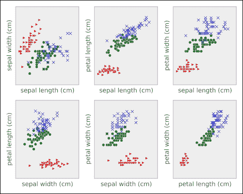
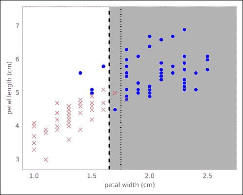
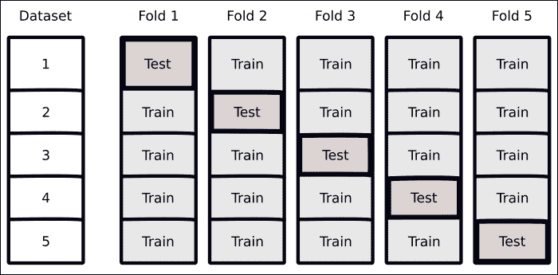
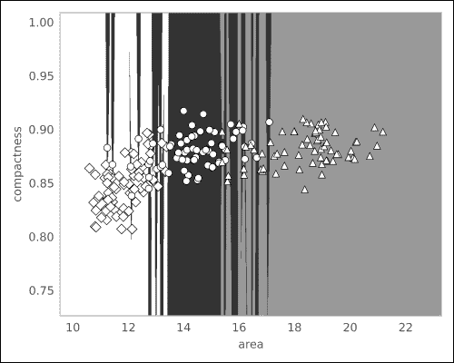
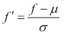
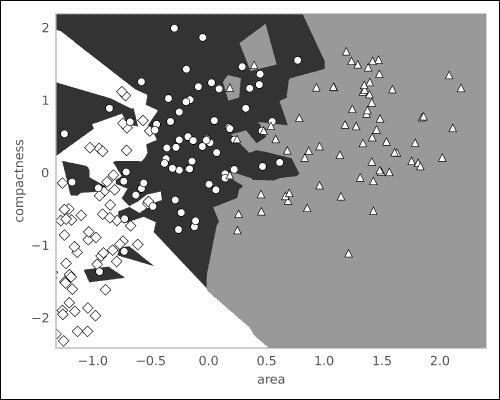
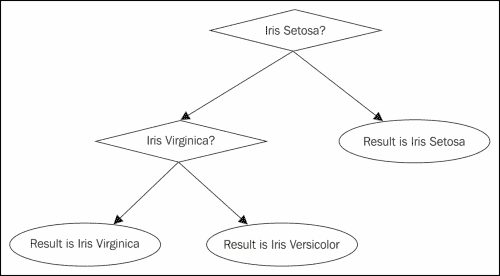

# 第二章：使用现实世界示例进行分类

本章的主题是**分类**。即使你没有意识到，你可能已经作为消费者使用过这种形式的机器学习。如果你有任何现代的电子邮件系统，它可能具有自动检测垃圾邮件的能力。也就是说，系统将分析所有传入的电子邮件，并将其标记为垃圾邮件或非垃圾邮件。通常，你作为最终用户，可以手动标记电子邮件为垃圾邮件或非垃圾邮件，以提高系统的垃圾邮件检测能力。这是一种机器学习形式，系统通过分析两种类型的消息示例：垃圾邮件和正常邮件（“非垃圾邮件”邮件的典型术语），并使用这些示例自动分类传入的电子邮件。

分类的一般方法是使用每个类别的一组示例来学习可以应用于新示例的规则。这是机器学习中最重要的模式之一，也是本章的主题。

处理如电子邮件这样的文本需要一套特定的技术和技能，我们将在下一章讨论这些内容。目前，我们将使用一个较小、易于处理的数据集。本章的示例问题是，“机器能否根据图像区分花卉物种？”我们将使用两个数据集，其中记录了花卉形态学的测量值以及几个样本的物种信息。

我们将使用一些简单的算法来探索这些小数据集。最初，我们将自己编写分类代码，以便理解概念，但我们会在有可能的情况下迅速切换到使用 scikit-learn。目标是首先理解分类的基本原理，然后进步到使用最先进的实现。

# 鸢尾花数据集

鸢尾花数据集是一个经典的 1930 年代数据集；它是统计分类的第一个现代示例之一。

数据集是几种鸢尾花形态学测量的集合。这些测量将使我们能够区分花卉的多个物种。如今，物种是通过 DNA 指纹来识别的，但在 20 世纪 30 年代，DNA 在遗传学中的作用尚未被发现。

以下是每个植物的四个测量属性：

+   花萼长度

+   花萼宽度

+   花瓣长度

+   花瓣宽度

通常，我们将用来描述数据的单个数值测量称为**特征**。这些特征可以直接测量或从中间数据计算得到。

这个数据集有四个特征。此外，每个植物的物种也被记录。我们想要解决的问题是，“给定这些示例，如果我们在田野中看到一朵新花，我们能从它的测量数据中准确预测它的物种吗？”

这是**监督学习**或**分类**问题：给定标记的样本，我们能否设计一个规则，之后可以应用于其他样本？一个现代读者更为熟悉的例子是垃圾邮件过滤，用户可以将电子邮件标记为垃圾邮件，系统则利用这些标记以及非垃圾邮件来判断一封新收到的邮件是否是垃圾邮件。

在本书后续章节中，我们将研究与文本相关的问题（从下一章开始）。目前，鸢尾花数据集很好地服务了我们的目的。它很小（150 个样本，每个样本四个特征），且可以轻松可视化和操作。

## 可视化是一个很好的第一步

数据集在本书后续章节中将扩展到成千上万的特征。在我们从一个包含四个特征的简单示例开始时，我们可以轻松地在单一页面上绘制所有二维投影。我们将在这个小示例上建立直觉，之后可以将其扩展到包含更多特征的大型数据集。正如我们在上一章中所见，数据可视化在分析的初期探索阶段非常有用，它能帮助我们了解问题的总体特征，并及早发现数据收集过程中出现的问题。

下图中的每个子图展示了所有点投影到两个维度中的情况。外部群体（三角形）是鸢尾花 Setosa，而鸢尾花 Versicolor 位于中心（圆形），鸢尾花 Virginica 则用*x*标记。我们可以看到，这里有两个大群体：一个是鸢尾花 Setosa，另一个是鸢尾花 Versicolor 和鸢尾花 Virginica 的混合群体。



在下面的代码片段中，我们展示了加载数据并生成图表的代码：

```py
>>> from matplotlib import pyplot as plt
>>> import numpy as np

>>> # We load the data with load_iris from sklearn
>>> from sklearn.datasets import load_iris
>>> data = load_iris()

>>> # load_iris returns an object with several fields
>>> features = data.data
>>> feature_names = data.feature_names
>>> target = data.target
>>> target_names = data.target_names

>>> for t in range(3):
...    if t == 0:
...        c = 'r'
...        marker = '>'
...    elif t == 1:
...        c = 'g'
...        marker = 'o'
...    elif t == 2:
...        c = 'b'
...        marker = 'x'
...    plt.scatter(features[target == t,0],
...                features[target == t,1],
...                marker=marker,
...                c=c)

```

## 构建我们的第一个分类模型

如果目标是将三种花卉分开，我们仅通过查看数据就可以立即做出一些建议。例如，花瓣长度似乎可以单独将鸢尾花 Setosa 与其他两种花卉区分开。我们可以编写一些代码来发现分割点的位置：

```py
>>> # We use NumPy fancy indexing to get an array of strings:
>>> labels = target_names[target]

>>> # The petal length is the feature at position 2
>>> plength = features[:, 2]

>>> # Build an array of booleans:
>>> is_setosa = (labels == 'setosa')

>>> # This is the important step:
>>> max_setosa = plength[is_setosa].max()
>>> min_non_setosa = plength[~is_setosa].min()
>>> print('Maximum of setosa: {0}.'.format(max_setosa))
Maximum of setosa: 1.9.

>>> print('Minimum of others: {0}.'.format(min_non_setosa))
Minimum of others: 3.0.

```

因此，我们可以构建一个简单的模型：如果花瓣长度小于 2，那么这是一朵鸢尾花 Setosa；否则它要么是鸢尾花 Virginica，要么是鸢尾花 Versicolor。这是我们的第一个模型，它表现得非常好，因为它能够在没有任何错误的情况下将鸢尾花 Setosa 从其他两种花卉中分开。在这种情况下，我们实际上并没有进行机器学习，而是自己查看了数据，寻找类别之间的分离。机器学习发生在我们编写代码自动寻找这种分离的时刻。

区分 Iris Setosa 和其他两个物种的问题非常简单。然而，我们不能立即看到区分 Iris Virginica 和 Iris Versicolor 的最佳阈值是什么。我们甚至可以看到，使用这些特征我们永远无法实现完美的分割。然而，我们可以寻找最好的可能分割，即犯错最少的分割。为此，我们将进行一些计算。

我们首先仅选择非 Setosa 的特征和标签：

```py
>>> # ~ is the boolean negation operator
>>> features = features[~is_setosa]
>>> labels = labels[~is_setosa]
>>> # Build a new target variable, is_virginica
>>> is_virginica = (labels == 'virginica')

```

在这里，我们大量使用了 NumPy 对数组的操作。`is_setosa` 数组是一个布尔数组，我们用它来选择其他两个数组 `features` 和 `labels` 的一个子集。最后，我们通过对标签进行相等比较，构建了一个新的布尔数组 `virginica`。

现在，我们遍历所有可能的特征和阈值，看看哪个能带来更好的准确率。准确率简单地是模型正确分类的示例的比例。

```py
>>> # Initialize best_acc to impossibly low value
>>> best_acc = -1.0
>>> for fi in range(features.shape[1]):
...  # We are going to test all possible thresholds
...  thresh = features[:,fi]
...  for t in thresh:
...    # Get the vector for feature `fi`
...    feature_i = features[:, fi]
...    # apply threshold `t`
...    pred = (feature_i > t)
...    acc = (pred == is_virginica).mean()
...    rev_acc = (pred == ~is_virginica).mean()
...    if rev_acc > acc:
...        reverse = True
...        acc = rev_acc
...    else:
...        reverse = False
...
...    if acc > best_acc:
...      best_acc = acc
...      best_fi = fi
...      best_t = t
...      best_reverse = reverse

```

我们需要测试每个特征和每个值的两种类型的阈值：我们测试一个*大于阈值*和反向比较。这就是为什么我们在前面的代码中需要 `rev_acc` 变量；它保存了反向比较的准确率。

最后几行选择最佳模型。首先，我们将预测值 `pred` 与实际标签 `is_virginica` 进行比较。通过计算比较的均值的小技巧，我们可以得到正确结果的比例，即准确率。在 `for` 循环的末尾，所有可能的特征的所有可能阈值都已被测试，变量 `best_fi`、`best_t` 和 `best_reverse` 保存了我们的模型。这就是我们所需的所有信息，能够对一个新的、未知的对象进行分类，也就是说，给它分配一个类别。以下代码正是实现了这个方法：

```py
def is_virginica_test(fi, t, reverse, example):
 "Apply threshold model to a new example"
 test = example[fi] > t
 if reverse:
 test = not test
 return test

```

这个模型是什么样子的？如果我们在整个数据上运行代码，识别为最佳的模型通过在花瓣宽度上进行分割来做出决策。理解这一过程的一种方式是可视化**决策边界**。也就是说，我们可以看到哪些特征值会导致一个决策与另一个决策的区别，并准确地看到边界在哪里。在以下截图中，我们看到两个区域：一个是白色的，另一个是灰色阴影的。任何落在白色区域的 datapoint 将被分类为 Iris Virginica，而任何落在阴影区域的点将被分类为 Iris Versicolor。



在阈值模型中，决策边界将始终是与其中一个轴平行的直线。前面截图中的图表显示了决策边界和两个区域，其中的点被分类为白色或灰色。它还显示了（作为虚线）一个替代阈值，这个阈值将获得完全相同的准确率。我们的方法选择了它看到的第一个阈值，但这是一个任意选择。

### 评估 – 数据持出和交叉验证

前一节中讨论的模型是一个简单的模型，它在整个数据集上的准确率达到了 94%。然而，这种评估可能过于乐观。我们使用数据来定义阈值，然后用相同的数据来评估模型。当然，模型在这个数据集上会表现得比我们尝试过的其他任何方法都要好。这种推理是循环的。

我们真正想做的是估计模型对新实例的泛化能力。我们应该衡量算法在训练时没有见过的实例上的表现。因此，我们将进行更严格的评估并使用保留数据。为此，我们将把数据分成两组：一组用来训练模型，另一组用来测试我们从训练中保留的数据。完整的代码是对之前展示的代码的改编，可以在在线支持仓库中找到。其输出如下：

```py
Training accuracy was 96.0%.
Testing accuracy was 90.0% (N = 50).

```

在训练数据上的结果（训练数据是整个数据的一个子集）显然比之前更好。然而，值得注意的是，测试数据上的结果低于训练误差。虽然这可能会让没有经验的机器学习者感到惊讶，但测试精度低于训练精度是可以预期的。要理解为什么，请回顾一下显示决策边界的图表。想象一下，如果有些接近边界的例子不存在，或者两条线之间的某个例子缺失，会发生什么情况。很容易想象，边界会稍微向右或向左移动，从而将它们放置在边界的*错误*一侧。

### 提示

在训练数据上的准确度，即**训练准确度**，几乎总是过于乐观地估计了算法的表现。我们应该始终测量并报告**测试准确度**，即在没有用于训练的例子上计算的准确度。

随着模型变得越来越复杂，这些概念将变得越来越重要。在这个例子中，训练数据和测试数据上测量的准确度差异并不大。而使用复杂模型时，可能在训练时达到 100%的准确度，却在测试时表现不比随机猜测好！

我们之前做的一个可能存在的问题是，保留部分数据用于测试，这意味着我们只使用了一半的数据进行训练。也许使用更多的训练数据会更好。另一方面，如果我们留下的数据用于测试太少，错误估计就会基于非常少量的例子来进行。理想情况下，我们希望将所有数据用于训练，并将所有数据用于测试，但这是不可能的。

我们可以通过一种叫做**交叉验证**的方法，较好地接近这一不可能的理想。交叉验证的一种简单形式是*留一交叉验证*。我们将从训练数据中取出一个样本，学习一个不包含该样本的模型，然后测试该模型是否能正确分类该样本。这个过程会对数据集中的所有元素重复进行。

以下代码正是实现这种类型的交叉验证：

```py
>>> correct = 0.0
>>> for ei in range(len(features)):
 # select all but the one at position `ei`:
 training = np.ones(len(features), bool)
 training[ei] = False
 testing = ~training
 model = fit_model(features[training], is_virginica[training])
 predictions = predict(model, features[testing])
 correct += np.sum(predictions == is_virginica[testing])
>>> acc = correct/float(len(features))
>>> print('Accuracy: {0:.1%}'.format(acc))
Accuracy: 87.0%

```

在这个循环结束时，我们将会在所有样本上测试一系列模型，并获得最终的平均结果。在使用交叉验证时，不会出现循环问题，因为每个样本都在没有考虑该数据点的模型上进行测试。因此，交叉验证估计是一个可靠的估计，可以反映模型在新数据上的泛化能力。

留一交叉验证的主要问题在于，我们现在不得不进行更多的工作。事实上，你必须为每个样本学习一个全新的模型，随着数据集的增大，这个成本也会增加。

我们可以通过使用 x 折交叉验证，在成本较低的情况下获得大部分的留一交叉验证的好处，其中*x*代表一个较小的数字。例如，为了执行五折交叉验证，我们将数据分成五组，也就是所谓的五折。

然后你会学习五个模型：每次你都会将其中一个折叠从训练数据中剔除。结果代码将与本节前面给出的代码相似，但我们将把数据中的 20％剔除，而不是仅仅剔除一个元素。我们会在剔除的折叠上测试这些模型，并计算结果的平均值。



上图展示了这一过程，使用了五个折叠：数据集被分成五个部分。对于每一个折叠，你会保留其中一个块进行测试，其余四个块用于训练。你可以使用任何数量的折叠。折叠数与计算效率（折叠数越多，需要的计算越多）和结果准确性（折叠数越多，训练数据越接近于整个数据集）之间存在权衡。五个折叠通常是一个不错的折中方案。这意味着你用 80％的数据进行训练，这已经接近于使用全部数据的效果。如果你的数据很少，甚至可以考虑使用 10 折或 20 折。在极端情况下，如果折叠数等于数据点数，你就只是在执行留一交叉验证。另一方面，如果计算时间是个问题，并且你有更多的数据，2 折或 3 折可能是更合适的选择。

在生成折叠时，你需要小心保持它们的平衡。例如，如果一个折叠中的所有样本都来自同一类别，那么结果将不具代表性。我们不会详细讲解如何做到这一点，因为机器学习库 scikit-learn 会为你处理这些问题。

现在，我们生成了多个模型，而不仅仅是一个。那么，“我们应该返回哪个最终模型来处理新数据？”最简单的解决方案是，在所有训练数据上训练一个整体的单一模型。交叉验证循环给出了这个模型应该如何推广的估计。

### 提示

交叉验证安排允许你使用所有数据来估算你的方法是否有效。在交叉验证循环结束时，你可以使用所有数据来训练最终模型。

尽管在机器学习作为一个领域刚起步时，这一点并没有被充分认识到，但如今，讨论分类系统的训练准确率被视为一种非常糟糕的迹象。因为结果可能会非常具有误导性，甚至仅仅展示这些结果就会让你看起来像是机器学习的新手。我们总是希望衡量并比较保留数据集上的误差或使用交叉验证方案估算的误差。

# 构建更复杂的分类器

在上一节中，我们使用了一个非常简单的模型：对单一特征进行阈值判断。是否还有其他类型的系统？当然有！很多其他类型。在本书中，你将看到许多其他类型的模型，我们甚至不会涵盖所有现有的模型。

从更高的抽象层次来思考这个问题，“一个分类模型由什么组成？”我们可以将其分为三部分：

+   **模型的结构**：模型究竟是如何做出决策的？在这种情况下，决策完全依赖于某个特征是否高于或低于某个阈值。除了最简单的问题，这种方法过于简化。

+   **搜索过程**：我们如何找到需要使用的模型？在我们的案例中，我们尝试了每一种特征和阈值的可能组合。你可以很容易地想象，随着模型变得更加复杂，数据集变得更大，尝试所有组合变得几乎不可能，我们不得不使用近似解决方案。在其他情况下，我们需要使用先进的优化方法来找到一个好的解决方案（幸运的是，scikit-learn 已经为你实现了这些方法，所以即使它们背后的代码非常先进，使用起来也很简单）。

+   **增益或损失函数**：我们如何决定应该返回哪些测试过的可能性？我们很少能找到完美的解决方案，即永远不会出错的模型，因此我们需要决定使用哪一个。我们使用了准确率，但有时更好的做法是优化，使得模型在特定类型的错误上减少。比如在垃圾邮件过滤中，删除一封好邮件可能比错误地让一封坏邮件通过更糟糕。在这种情况下，我们可能希望选择一个在丢弃邮件时较为保守的模型，而不是那个只做最少错误的模型。我们可以通过增益（我们希望最大化）或损失（我们希望最小化）来讨论这些问题。它们是等效的，但有时一个比另一个更方便。

我们可以通过调整分类器的这三个方面来创建不同的系统。简单的阈值是机器学习库中最简单的模型之一，并且仅在问题非常简单时有效，例如在鸢尾花数据集上。在下一节中，我们将处理一个更复杂的分类任务，需要更复杂的结构。

在我们的案例中，我们优化了阈值以最小化错误数量。或者，我们可能会有不同的损失函数。某些类型的错误可能比其他错误更昂贵。在医疗环境中，假阴性和假阳性并不等价。**假阴性**（当测试结果为阴性，但实际上是错误的）可能导致患者没有接受严重疾病的治疗。**假阳性**（当测试结果为阳性，而患者实际上并没有这种疾病）可能会导致额外的检查以确认或不必要的治疗（这些治疗仍然可能带来成本，包括治疗的副作用，但通常不如错过诊断那么严重）。因此，根据具体环境，不同的权衡是合理的。在一个极端情况下，如果疾病是致命的，而且治疗便宜且副作用很小，那么你希望尽可能减少假阴性。

### 小贴士

**增益/成本**函数的选择总是依赖于你所处理的具体问题。当我们提出通用算法时，我们通常关注最小化错误数量，达到最高的准确度。然而，如果某些错误的成本高于其他错误，那么接受较低的整体准确度可能更好，以最小化整体成本。

# 一个更复杂的数据集和一个更复杂的分类器

现在我们将看一个稍微复杂一点的数据集。这将为引入一种新的分类算法和其他一些想法提供动机。

## 了解种子数据集

我们现在来看另一个农业数据集，尽管它仍然很小，但已经足够大，不再像鸢尾花数据集那样可以在一页上完全绘制。这个数据集包含了小麦种子的测量数据。数据集中有七个特征，具体如下：

+   区域 A

+   周长 P

+   紧凑度 C = 4πA/P²

+   核长度

+   核宽度

+   不对称系数

+   核槽长度

有三个类别，分别对应三种小麦品种：加拿大小麦、Koma 小麦和 Rosa 小麦。如前所述，目标是根据这些形态学测量值来分类物种。与 1930 年代收集的鸢尾花数据集不同，这是一个非常新的数据集，其特征是通过数字图像自动计算得出的。

这是如何实现图像模式识别的：你可以获取数字形式的图像，从中计算出一些相关特征，并使用一个通用的分类系统。在第十章，*计算机视觉*，我们将通过解决这个问题的计算机视觉部分来计算图像中的特征。现在，我们将使用已给出的特征。

### 注意

**UCI 机器学习数据集仓库**

加利福尼亚大学欧文分校（UCI）维护着一个在线机器学习数据集仓库（在写本文时，他们列出了 233 个数据集）。本章中使用的 Iris 数据集和 Seeds 数据集都来源于此。

该仓库可以在线访问：[`archive.ics.uci.edu/ml/`](http://archive.ics.uci.edu/ml/)。

## 特征与特征工程

这些特征的一个有趣方面是，紧凑度特征实际上不是一种新的度量，而是之前两个特征——面积和周长——的函数。推导新的组合特征通常非常有用。尝试创建新特征通常被称为**特征工程**。它有时被认为不如算法引人注目，但它往往对性能影响更大（在精心挑选的特征上应用一个简单的算法，会比在不太好的特征上使用一个复杂的算法表现得更好）。

在这种情况下，原始研究人员计算了**紧凑度**，这是一个典型的形状特征。它有时也被称为**圆度**。对于两个内核，它们的形状相同，但一个是另一个的两倍大，紧凑度特征的值是相同的。然而，对于非常圆的内核（当该特征接近 1 时），与形状拉长的内核（当该特征接近 0 时）相比，它将有不同的值。

一个好特征的目标是既要随着重要因素（期望的输出）变化，又要在不重要的因素上保持不变。例如，紧凑度不随大小变化，但随形状变化。在实践中，可能很难完美地同时达到这两个目标，但我们希望尽可能接近这个理想。

你需要使用背景知识来设计良好的特征。幸运的是，对于许多问题领域，已经有大量的文献提供了可用的特征和特征类型，你可以在此基础上进行构建。对于图像，所有之前提到的特征都是典型的，计算机视觉库会为你计算它们。在基于文本的问题中，也有标准的解决方案，你可以将它们混合搭配（我们将在下一章中也会看到）。在可能的情况下，你应该利用你对问题的了解来设计特定的特征，或者选择文献中哪些特征更适用于手头的数据。

即使在你还没有数据之前，你也必须决定哪些数据值得收集。然后，你将所有特征交给机器进行评估，并计算出最佳的分类器。

一个自然的问题是，我们是否可以自动选择好的特征。这个问题被称为**特征选择**。已经提出了许多方法来解决这个问题，但实际上非常简单的思路效果最好。对于我们目前探索的小问题，使用特征选择没有意义，但如果你有成千上万的特征，那么去掉大部分特征可能会使后续的处理速度更快。

## 最近邻分类

对于这个数据集，我们将引入一个新的分类器：**最近邻分类器**。最近邻分类器非常简单。在对一个新元素进行分类时，它会查看训练数据中与其最接近的对象，即最近邻。然后，它会返回该对象的标签作为答案。请注意，这个模型在训练数据上表现完美！对于每一个点，它的最近邻就是它自己，因此它的标签完全匹配（除非两个不同标签的示例具有完全相同的特征值，这将表明你使用的特征不是很具描述性）。因此，使用交叉验证协议来测试分类是至关重要的。

最近邻方法可以推广到不仅仅看单个邻居，而是看多个邻居，并在这些邻居中进行投票。这使得该方法对异常值或标签错误的数据更加健壮。

# 使用 scikit-learn 进行分类

我们一直在使用手写的分类代码，但 Python 由于其出色的库，是机器学习的非常合适的语言。特别是，scikit-learn 已经成为许多机器学习任务（包括分类）的标准库。在本节中，我们将使用它实现的最近邻分类方法。

scikit-learn 分类 API 是围绕分类器对象组织的。这些对象有以下两个基本方法：

+   `fit(features, labels)`：这是学习步骤，拟合模型的参数。

+   `predict(features)`：该方法只有在调用 `fit` 之后才能使用，并且返回一个或多个输入的预测结果。

下面是我们如何使用其实现的 k-最近邻方法来处理我们的数据。我们从 `sklearn.neighbors` 子模块中导入 `KneighborsClassifier` 对象，开始：

```py
>>> from sklearn.neighbors import KNeighborsClassifier

```

scikit-learn 模块以 sklearn 导入（有时你也会发现 scikit-learn 使用这个简短的名字而不是全名）。所有 sklearn 的功能都在子模块中，如 `sklearn.neighbors`。

现在我们可以实例化一个分类器对象。在构造函数中，我们指定要考虑的邻居数量，如下所示：

```py
>>> classifier = KNeighborsClassifier(n_neighbors=1)

```

如果我们没有指定邻居数量，默认值为 `5`，这是分类中通常很好的选择。

我们将使用交叉验证（当然）来查看我们的数据。scikit-learn 模块也使这变得很容易：

```py
>>> from sklearn.cross_validation import KFold

>>> kf = KFold(len(features), n_folds=5, shuffle=True)
>>> # `means` will be a list of mean accuracies (one entry per fold)
>>> means = []
>>> for training,testing in kf:
...    # We fit a model for this fold, then apply it to the
...    # testing data with `predict`:
...    classifier.fit(features[training], labels[training])
...    prediction = classifier.predict(features[testing])
...
...    # np.mean on an array of booleans returns fraction
...    # of correct decisions for this fold:
...    curmean = np.mean(prediction == labels[testing])
...    means.append(curmean)
>>> print("Mean accuracy: {:.1%}".format(np.mean(means)))
Mean accuracy: 90.5%

```

使用五折交叉验证，对于这个数据集，使用这个算法，我们获得了 90.5% 的准确率。正如我们在前一部分讨论的那样，交叉验证的准确率低于训练准确率，但这是对模型性能更可靠的估计。

## 查看决策边界

现在，我们将考察决策边界。为了在纸上绘制这些边界，我们将简化问题，只考虑二维情况。请看以下图表：



加拿大样本以菱形表示，Koma 种子以圆形表示，Rosa 种子以三角形表示。它们各自的区域分别用白色、黑色和灰色表示。你可能会想，为什么这些区域如此水平，几乎是奇怪的水平。问题在于，*x* 轴（面积）的范围是从 10 到 22，而 *y* 轴（紧凑度）的范围是从 0.75 到 1.0。也就是说，*x* 轴的微小变化实际上要比 *y* 轴的微小变化大得多。因此，当我们计算点与点之间的距离时，大部分情况下，我们只考虑了 *x* 轴。这也是为什么将数据可视化并寻找潜在问题或惊讶的一个好例子。

如果你学过物理（并且记得你的课），你可能已经注意到，我们之前在求和长度、面积和无量纲量时混淆了单位（这是在物理系统中绝对不应该做的事情）。我们需要将所有特征归一化到一个统一的尺度。对此问题有许多解决方法；一个简单的解决方法是 *标准化为 z 分数*。一个值的 z 分数是它与均值的偏差，单位是标准差。其操作如下：



在这个公式中，*f* 是原始特征值，*f'* 是归一化后的特征值，*µ* 是特征的均值，*σ* 是标准差。*µ* 和 *σ* 都是从训练数据中估算出来的。无论原始值是什么，经过 z 评分后，值为零表示训练均值，正值表示高于均值，负值表示低于均值。

scikit-learn 模块使得将这种归一化作为预处理步骤变得非常简单。我们将使用一个转换流水线：第一个元素将进行转换，第二个元素将进行分类。我们首先按如下方式导入流水线和特征缩放类：

```py
>>> from sklearn.pipeline import Pipeline
>>> from sklearn.preprocessing import StandardScaler

```

现在，我们可以将它们结合起来。

```py
>>> classifier = KNeighborsClassifier(n_neighbors=1)
>>> classifier = Pipeline([('norm', StandardScaler()),
...         ('knn', classifier)])

```

Pipeline 构造函数接受一个由 `(str, clf)` 组成的配对列表。每一对都对应流水线中的一步：第一个元素是命名步骤的字符串，而第二个元素是执行转换的对象。该对象的高级用法使用这些名称来引用不同的步骤。

经过归一化处理后，每个特征都处于相同的单位（从技术上讲，每个特征现在是无量纲的；它没有单位），因此我们可以更自信地混合不同的维度。事实上，如果我们现在运行最近邻分类器，我们可以获得 93%的准确率，这个结果是通过之前显示的五折交叉验证代码来估算的！

再次查看二维中的决策空间：



现在边界发生了变化，你可以看到两个维度对结果都有影响。在完整的数据集中，一切都发生在一个七维空间中，这很难可视化，但相同的原理仍然适用；尽管原始数据中某些维度占主导地位，但经过归一化后，它们都被赋予了相同的重要性。

# 二分类和多分类

我们使用的第一个分类器是阈值分类器，它是一个简单的二分类器。其结果是一个类别或另一个类别，因为一个点要么在阈值以上，要么不在。我们使用的第二个分类器是最近邻分类器，它是一个自然的多类别分类器，其输出可以是多个类别中的一个。

定义一个简单的二分类方法通常比解决多类别问题的方法更简单。然而，我们可以将任何多类别问题简化为一系列的二元决策。这正是我们在之前的 Iris 数据集中所做的，以一种无序的方式：我们观察到很容易将其中一个初始类别分开，并专注于另外两个，从而将问题简化为两个二元决策：

1.  它是 Iris Setosa 吗（是或不是）？

1.  如果没有，检查它是否是 Iris Virginica（是或不是）。

当然，我们希望将这种推理交给计算机来处理。像往常一样，针对这种多类别的简化方法有多种解决方案。

最简单的方法是使用一系列的*一对其他*分类器。对于每个可能的标签ℓ，我们构建一个分类器，类型是*这是ℓ还是其他什么？* 当应用规则时，正好有一个分类器会说*是的*，我们就得到了我们的解决方案。不幸的是，这并不总是发生，所以我们需要决定如何处理多个积极回答或没有积极回答的情况。



或者，我们可以构建一个分类树。将可能的标签分成两组，并构建一个分类器，问：“这个例子应该放入左边的箱子还是右边的箱子？”我们可以递归地进行这种分裂，直到我们得到一个单一的标签。前面的图展示了 Iris 数据集的推理树。每个菱形代表一个二分类器。可以想象，我们可以将这棵树做得更大，涵盖更多的决策。这意味着，任何可以用于二分类的分类器，都可以简单地调整来处理任意数量的类别。

有很多其他方法可以将二元方法转化为多类方法。没有一种方法在所有情况下都明显优于其他方法。scikit-learn 模块在 `sklearn.multiclass` 子模块中实现了几种这样的方法。

### 提示

一些分类器是二元系统，而许多现实生活中的问题本质上是多类的。几种简单的协议将多类问题简化为一系列二元决策，并允许我们将二元模型应用于多类问题。这意味着看似仅适用于二元数据的方法，可以以极小的额外努力应用于多类数据。

# 总结

分类是从示例中进行泛化，构建模型（即一个可以自动应用于新的、未分类对象的规则）。它是机器学习中的基本工具之一，我们将在接下来的章节中看到更多这样的例子。

从某种意义上说，这一章是非常理论性的，因为我们用简单的例子介绍了通用概念。我们使用鸢尾花数据集进行了几次操作。这个数据集很小。然而，它的优势在于我们能够绘制出它的图像，并详细看到我们所做的事情。这一点在我们转向处理多维度和数千个样本的问题时将丧失。我们在这里获得的直觉依然有效。

你还学到了训练误差是对模型表现的误导性、过于乐观的估计。我们必须改为在未用于训练的测试数据上评估模型。为了避免在测试中浪费太多样本，交叉验证调度可以让我们兼得两全其美（代价是更多的计算量）。

我们还看到了特征工程的问题。特征并不是预先为你定义好的，选择和设计特征是设计机器学习管道的一个重要部分。事实上，这通常是你能在准确性上获得最多改进的领域，因为更好的数据胜过更复杂的方法。接下来的章节将通过文本分类、音乐流派识别和计算机视觉等具体实例，提供这些特定设置的示例。

下一章将讨论当你的数据没有预定义分类时，如何进行分类。
