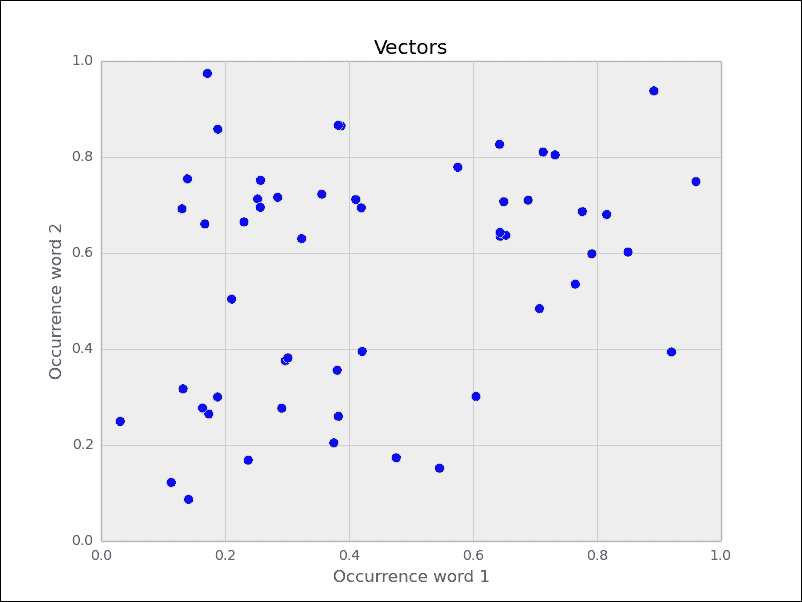
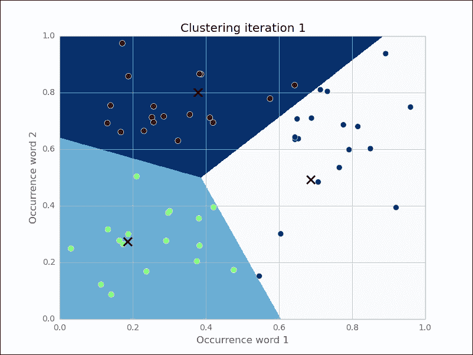
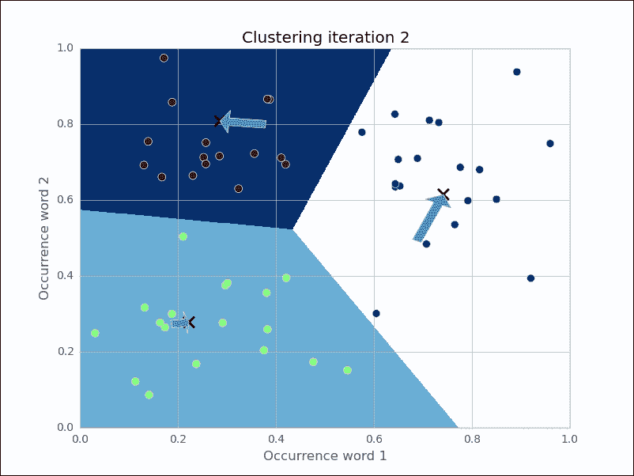

# 第三章：聚类——寻找相关帖子

在上一章中，你学会了如何找到单个数据点的类别或类别。通过一小部分带有相应类别的训练数据，你学到了一个模型，我们现在可以用它来分类未来的数据项。我们称这种方法为监督学习，因为学习过程是由老师引导的；在我们这里，老师表现为正确的分类。

现在假设我们没有那些标签来学习分类模型。例如，可能是因为收集这些标签的成本过高。试想一下，如果获得数百万个标签的唯一方式是让人类手动分类，那会有多么昂贵。那我们该如何应对这种情况呢？

当然，我们无法学习一个分类模型。然而，我们可以在数据本身中找到某些模式。也就是说，让数据自我描述。这就是我们在本章要做的事情，我们将面临一个问答网站的挑战。当用户浏览我们的网站时，可能是因为他们在寻找特定信息，搜索引擎最有可能将他们指向一个特定的答案。如果所呈现的答案不是他们想要的，网站应该至少提供相关答案，让用户能够快速看到其他可用的答案，并希望能够停留在我们的网站上。

一个天真的方法是直接拿帖子，计算它与所有其他帖子的相似度，并将最相似的*前 n 个*帖子作为链接显示在页面上。很快，这将变得非常昂贵。相反，我们需要一种方法，能够快速找到所有相关的帖子。

在本章中，我们将通过聚类来实现这一目标。这是一种将项目排列在一起的方法，使得相似的项目在同一个簇中，而不同的项目则在不同的簇中。我们首先要解决的棘手问题是如何将文本转换为能够计算相似度的形式。有了这样的相似度测量后，我们将继续探讨如何利用它快速找到包含相似帖子的小组。一旦找到了，我们只需要检查那些也属于该小组的文档。为了实现这一目标，我们将向你介绍神奇的 SciKit 库，它提供了多种机器学习方法，我们将在接下来的章节中使用这些方法。

# 测量帖子之间的相关性

从机器学习的角度来看，原始文本是无用的。只有当我们能够将其转换为有意义的数字时，才能将其输入到机器学习算法中，比如聚类。这对于文本的更常见操作，如相似度测量，亦是如此。

## 如何避免这么做

一种文本相似度度量方法是 Levenshtein 距离，也叫编辑距离。假设我们有两个单词，“machine”和“mchiene”。它们之间的相似度可以通过将一个单词转换成另一个单词所需的最少编辑次数来表示。在这种情况下，编辑距离是 2，因为我们需要在“m”后面添加一个“a”，并删除第一个“e”。然而，这个算法的代价比较高，因为它的时间复杂度是第一个单词的长度乘以第二个单词的长度。

查看我们的帖子，我们可以通过将整个单词视为字符，并在单词层面上进行编辑距离计算来“作弊”。假设我们有两个帖子（为了简单起见，我们集中关注以下标题）：“How to format my hard disk”和“Hard disk format problems”，由于删除“how”，“to”，“format”，“my”，然后在最后添加“format”和“problems”，我们需要编辑距离为 5。因此，可以将两个帖子之间的差异表示为需要添加或删除的单词数量，以便一个文本转变为另一个文本。尽管我们可以大大加速整体方法，但时间复杂度保持不变。

但即使速度足够快，还是存在另一个问题。在前面的帖子中，“format”一词的编辑距离为 2，因为它首先被删除，然后又被添加。因此，我们的距离度量似乎还不够稳健，无法考虑单词顺序的变化。

## 如何实现

比编辑距离更为稳健的方法是所谓的**词袋模型**。它完全忽略了单词的顺序，仅仅通过单词的计数来作为基础。对于每个帖子中的单词，它的出现次数会被计数并记录在一个向量中。不出所料，这一步也叫做向量化。这个向量通常非常庞大，因为它包含了整个数据集中出现的单词数量。例如，考虑两个帖子及其单词计数如下：

| Word | 在帖子 1 中的出现次数 | 在帖子 2 中的出现次数 |
| --- | --- | --- |
| disk | 1 | 1 |
| format | 1 | 1 |
| how | 1 | 0 |
| hard | 1 | 1 |
| my | 1 | 0 |
| problems | 0 | 1 |
| to | 1 | 0 |

“在帖子 1 中的出现次数”和“在帖子 2 中的出现次数”这两列现在可以视为简单的向量。我们可以直接计算所有帖子向量之间的欧几里得距离，并取最近的一个（但这太慢了，正如我们之前发现的那样）。因此，我们可以根据以下步骤将它们作为聚类步骤中的特征向量使用：

1.  从每个帖子中提取显著特征，并将其存储为每个帖子的向量。

1.  然后对这些向量进行聚类计算。

1.  确定相关帖子的聚类。

1.  从这个聚类中提取一些与目标帖子相似度不同的帖子。这将增加多样性。

但在我们进入下一步之前，还需要做一些准备工作。在我们开始这项工作之前，我们需要一些数据来处理。

# 预处理 – 相似度通过相同单词的数量来衡量

如我们之前所见，词袋方法既快速又稳健。但它也并非没有挑战。让我们直接深入探讨这些挑战。

## 将原始文本转换为词袋

我们不需要编写自定义代码来计数单词并将这些计数表示为向量。SciKit 的 `CountVectorizer` 方法不仅高效完成这项工作，而且界面也非常便捷。SciKit 的函数和类是通过 `sklearn` 包导入的：

```py
>>> from sklearn.feature_extraction.text import CountVectorizer
>>> vectorizer = CountVectorizer(min_df=1)

```

`min_df` 参数决定了 `CountVectorizer` 如何处理少见词（最小文档频率）。如果设置为整数，所有出现频率低于该值的词汇将被丢弃。如果设置为小数，则所有在整体数据集中出现频率低于该小数的词汇将被丢弃。`max_df` 参数以类似的方式工作。如果我们打印实例，我们可以看到 SciKit 提供的其他参数及其默认值：

```py
>>> print(vectorizer)CountVectorizer(analyzer='word', binary=False, charset=None,
 charset_error=None, decode_error='strict',
 dtype=<class 'numpy.int64'>, encoding='utf-8', input='content',
 lowercase=True, max_df=1.0, max_features=None, min_df=1,
 ngram_range=(1, 1), preprocessor=None, stop_words=None,
 strip_accents=None, token_pattern='(?u)\\b\\w\\w+\\b',
 tokenizer=None, vocabulary=None)

```

我们看到，正如预期的那样，计数是按单词级别进行的（`analyzer=word`），并且单词是通过正则表达式模式 `token_pattern` 来确定的。例如，它会将“cross-validated”拆分为“cross”和“validated”。暂时忽略其他参数，我们考虑以下两个示例主题行：

```py
>>> content = ["How to format my hard disk", " Hard disk format problems "]

```

我们现在可以将这个主题行列表传入我们向量化器的`fit_transform()`函数，它会完成所有复杂的向量化工作。

```py
>>> X = vectorizer.fit_transform(content)
>>> vectorizer.get_feature_names()[u'disk', u'format', u'hard', u'how', u'my', u'problems', u'to']

```

向量化器已经检测到七个词汇，我们可以单独获取它们的计数：

```py
>>> print(X.toarray().transpose())
[[1 1]
 [1 1]
 [1 1]
 [1 0]
 [1 0]
 [0 1]
 [1 0]]

```

这意味着第一句包含了除了“problems”之外的所有单词，而第二句包含了除了“how”、“my”和“to”之外的所有单词。事实上，这些正是我们在前面表格中看到的相同列。从`X`中，我们可以提取出一个特征向量，用来比较两个文档之间的差异。

我们将首先使用一种天真的方法，指出一些我们必须考虑的预处理特性。然后我们选择一个随机帖子，为它创建计数向量。接着我们将比较它与所有计数向量的距离，并提取出距离最小的那个帖子。

### 计数单词

让我们玩玩这个由以下帖子组成的玩具数据集：

| 帖子文件名 | 帖子内容 |
| --- | --- |
| `01.txt` | 这是一个关于机器学习的玩具帖子。实际上，它并没有太多有趣的内容。 |
| `02.txt` | 成像数据库可能非常庞大。 |
| `03.txt` | 大多数成像数据库会永久保存图像。 |
| `04.txt` | 成像数据库存储图像。 |
| `05.txt` | 成像数据库存储图像。成像数据库存储图像。成像数据库存储图像。 |

在这个帖子数据集中，我们希望找到与短帖子“成像数据库”最相似的帖子。

假设帖子位于目录 `DIR` 中，我们可以将它传入 `CountVectorizer`：

```py
>>> posts = [open(os.path.join(DIR, f)).read() for f in os.listdir(DIR)]
>>> from sklearn.feature_extraction.text import CountVectorizer
>>> vectorizer = CountVectorizer(min_df=1)

```

我们需要通知向量化器有关完整数据集的信息，以便它提前知道哪些词汇是预期的：

```py
>>> X_train = vectorizer.fit_transform(posts)
>>> num_samples, num_features = X_train.shape
>>> print("#samples: %d, #features: %d" % (num_samples, num_features))
#samples: 5, #features: 25

```

不出所料，我们有五篇帖子，总共有 25 个不同的单词。以下是已被标记的单词，将被计数：

```py
>>> print(vectorizer.get_feature_names())
[u'about', u'actually', u'capabilities', u'contains', u'data', u'databases', u'images', u'imaging', u'interesting', u'is', u'it', u'learning', u'machine', u'most', u'much', u'not', u'permanently', u'post', u'provide', u'save', u'storage', u'store', u'stuff', u'this', u'toy']

```

现在我们可以将新帖子向量化了。

```py
>>> new_post = "imaging databases"
>>> new_post_vec = vectorizer.transform([new_post])

```

请注意，`transform`方法返回的计数向量是稀疏的。也就是说，每个向量不会为每个单词存储一个计数值，因为大多数计数值都是零（该帖子不包含该单词）。相反，它使用了更节省内存的实现`coo_matrix`（"COOrdinate"）。例如，我们的新帖子实际上只包含两个元素：

```py
>>> print(new_post_vec)
 (0, 7)  1
 (0, 5)  1

```

通过其`toarray()`成员，我们可以再次访问完整的`ndarray`：

```py
>>> print(new_post_vec.toarray())
[[0 0 0 0 0 1 0 1 0 0 0 0 0 0 0 0 0 0 0 0 0 0 0 0 0]]

```

如果我们想将其用作相似性计算的向量，我们需要使用整个数组。对于相似性测量（最简单的计算方法），我们计算新帖子和所有旧帖子之间计数向量的欧几里得距离：

```py
>>> import scipy as sp
>>> def dist_raw(v1, v2):
...     delta = v1-v2
...     return sp.linalg.norm(delta.toarray())

```

`norm()`函数计算欧几里得范数（最短距离）。这只是一个明显的首选，实际上有许多更有趣的方式来计算距离。你可以看看论文《*Distance Coefficients between Two Lists or Sets*》在《The Python Papers Source Codes》中，Maurice Ling 精妙地展示了 35 种不同的计算方法。

使用`dist_raw`，我们只需遍历所有帖子并记住最接近的一个：

```py
>>> import sys
>>> best_doc = None
>>> best_dist = sys.maxint
>>> best_i = None
>>> for i, post in enumerate(num_samples):
...     if post == new_post:
...         continue
...     post_vec = X_train.getrow(i)
...     d = dist_raw(post_vec, new_post_vec)
...     print("=== Post %i with dist=%.2f: %s"%(i, d, post))
...     if d<best_dist:
...         best_dist = d
...         best_i = i
>>> print("Best post is %i with dist=%.2f"%(best_i, best_dist))

=== Post 0 with dist=4.00: This is a toy post about machine learning. Actually, it contains not much interesting stuff.
=== Post 1 with dist=1.73: Imaging databases provide storage capabilities.
=== Post 2 with dist=2.00: Most imaging databases save images permanently.
=== Post 3 with dist=1.41: Imaging databases store data.
=== Post 4 with dist=5.10: Imaging databases store data. Imaging databases store data. Imaging databases store data.
Best post is 3 with dist=1.41

```

恭喜，我们已经得到了第一次相似性测量结果。帖子 0 与我们新帖子的相似性最小。可以理解的是，它与新帖子没有一个共同的单词。我们也可以理解，帖子 1 与新帖子非常相似，但并不是最相似的，因为它包含了一个比帖子 3 多的单词，而该单词在新帖子中并不存在。

然而，看看帖子 3 和帖子 4，情况就不那么清晰了。帖子 4 是帖子 3 的三倍复制。因此，它与新帖子的相似性应该与帖子 3 相同。

打印相应的特征向量可以解释为什么：

```py
>>> print(X_train.getrow(3).toarray())
[[0 0 0 0 1 1 0 1 0 0 0 0 0 0 0 0 0 0 0 0 0 1 0 0 0]]
>>> print(X_train.getrow(4).toarray())
[[0 0 0 0 3 3 0 3 0 0 0 0 0 0 0 0 0 0 0 0 0 3 0 0 0]]

```

显然，仅使用原始单词的计数太简单了。我们必须将它们归一化，以获得单位长度的向量。

### 归一化单词计数向量

我们需要扩展`dist_raw`，以便计算向量距离时不使用原始向量，而是使用归一化后的向量：

```py
>>> def dist_norm(v1, v2):
...    v1_normalized = v1/sp.linalg.norm(v1.toarray())
...    v2_normalized = v2/sp.linalg.norm(v2.toarray())
...    delta = v1_normalized - v2_normalized
...    return sp.linalg.norm(delta.toarray())

```

这导致了以下的相似性测量结果：

```py
=== Post 0 with dist=1.41: This is a toy post about machine learning. Actually, it contains not much interesting stuff.
=== Post 1 with dist=0.86: Imaging databases provide storage capabilities.
=== Post 2 with dist=0.92: Most imaging databases save images permanently.
=== Post 3 with dist=0.77: Imaging databases store data.
=== Post 4 with dist=0.77: Imaging databases store data. Imaging databases store data. Imaging databases store data.
Best post is 3 with dist=0.77

```

现在看起来好多了。帖子 3 和帖子 4 被计算为相等的相似度。有人可能会争辩说如此重复的内容是否能让读者感到愉悦，但从计算帖子中单词数量的角度来看，这似乎是正确的。

### 删除不太重要的单词

让我们再看看帖子 2。它与新帖子中的不同单词有“most”、“save”、“images”和“permanently”。这些词在整体重要性上其实是相当不同的。“most”这样的词在各种不同的语境中出现得非常频繁，被称为停用词。它们并不包含太多信息，因此不应像“images”这样的词那样被赋予同等重要性，因为“images”并不经常出现在不同的语境中。最佳的做法是移除那些频繁出现、不帮助区分不同文本的词。这些词被称为停用词。

由于这是文本处理中的常见步骤，`CountVectorizer` 中有一个简单的参数可以实现这一点：

```py
>>> vectorizer = CountVectorizer(min_df=1, stop_words='english')

```

如果您清楚想要移除哪些停用词，您也可以传递一个词表。将 `stop_words` 设置为 `english` 将使用 318 个英语停用词的集合。要查看这些停用词，您可以使用 `get_stop_words()`：

```py
>>> sorted(vectorizer.get_stop_words())[0:20]
['a', 'about', 'above', 'across', 'after', 'afterwards', 'again', 'against', 'all', 'almost', 'alone', 'along', 'already', 'also', 'although', 'always', 'am', 'among', 'amongst', 'amoungst']

```

新的单词列表减少了七个单词：

```py
[u'actually', u'capabilities', u'contains', u'data', u'databases', u'images', u'imaging', u'interesting', u'learning', u'machine', u'permanently', u'post', u'provide', u'save', u'storage', u'store', u'stuff', u'toy']

```

没有停用词后，我们得到了以下的相似度度量：

```py
=== Post 0 with dist=1.41: This is a toy post about machine learning. Actually, it contains not much interesting stuff.
=== Post 1 with dist=0.86: Imaging databases provide storage capabilities.
=== Post 2 with dist=0.86: Most imaging databases save images permanently.
=== Post 3 with dist=0.77: Imaging databases store data.
=== Post 4 with dist=0.77: Imaging databases store data. Imaging databases store data. Imaging databases store data.
Best post is 3 with dist=0.77

```

现在帖子 2 与帖子 1 相当。然而，由于我们的帖子为了演示目的保持简短，它们的变化并不大。它将在我们查看实际数据时变得至关重要。

### 词干提取

还有一件事没有完成。我们将不同形式的相似单词计为不同的单词。例如，帖子 2 包含了 "imaging" 和 "images"。将它们计为相同的词是有意义的。毕竟，它们指的是相同的概念。

我们需要一个将单词还原为其特定词干的函数。SciKit 默认不包含词干提取器。通过 **自然语言工具包**（**NLTK**），我们可以下载一个免费的软件工具包，提供一个可以轻松集成到 `CountVectorizer` 中的词干提取器。

#### 安装和使用 NLTK

如何在您的操作系统上安装 NLTK 的详细说明可以在 [`nltk.org/install.html`](http://nltk.org/install.html) 上找到。不幸的是，它目前还没有正式支持 Python 3，这意味着 pip 安装也无法使用。然而，我们可以从 [`www.nltk.org/nltk3-alpha/`](http://www.nltk.org/nltk3-alpha/) 下载该软件包，在解压后使用 Python 的 `setup.py` 安装进行手动安装。

要检查您的安装是否成功，请打开 Python 解释器并输入：

```py
>>> import nltk

```

### 注释

您可以在《*Python 3 Text Processing with NLTK 3 Cookbook*》一书中找到关于 NLTK 的一个非常好的教程，作者是 *Jacob Perkins*，由 *Packt Publishing* 出版。为了稍微体验一下词干提取器，您可以访问网页 [`text-processing.com/demo/stem/`](http://text-processing.com/demo/stem/)。

NLTK 提供了不同的词干提取器。这是必要的，因为每种语言都有不同的词干提取规则。对于英语，我们可以使用 `SnowballStemmer`。

```py
>>> import nltk.stem
>>> s = nltk.stem.SnowballStemmer('english')
>>> s.stem("graphics")
u'graphic'
>>> s.stem("imaging")
u'imag'
>>> s.stem("image")
u'imag'
>>> s.stem("imagination")
u'imagin'
>>> s.stem("imagine")
u'imagin'

```

### 注释

请注意，词干提取不一定会产生有效的英语单词。

它也适用于动词：

```py
>>> s.stem("buys")
u'buy'
>>> s.stem("buying")
u'buy'

```

这意味着它大多数时候都能正常工作：

```py
>>> s.stem("bought")
u'bought'

```

#### 使用 NLTK 的词干提取器扩展向量器

在将帖子输入到`CountVectorizer`之前，我们需要进行词干提取。该类提供了几个钩子，允许我们自定义该阶段的预处理和分词。预处理器和分词器可以作为构造函数中的参数进行设置。我们不希望将词干提取器放入其中，因为那样我们就必须自己进行分词和归一化处理。相反，我们重写`build_analyzer`方法：

```py
>>> import nltk.stem
>>> english_stemmer = nltk.stem.SnowballStemmer('english'))
>>> class StemmedCountVectorizer(CountVectorizer):
...     def build_analyzer(self):
...         analyzer = super(StemmedCountVectorizer, self).build_analyzer()
...         return lambda doc: (english_stemmer.stem(w) for w in analyzer(doc))
>>> vectorizer = StemmedCountVectorizer(min_df=1, stop_words='english')

```

这将对每篇帖子执行以下过程：

1.  第一步是在预处理步骤中将原始帖子转换为小写（由父类完成）。

1.  在分词步骤中提取所有单独的词汇（由父类完成）。

1.  最终的结果是将每个单词转换为其词干形式。

结果是我们现在少了一个特征，因为“images”和“imaging”合并为一个特征。现在，特征名称集如下所示：

```py
[u'actual', u'capabl', u'contain', u'data', u'databas', u'imag', u'interest', u'learn', u'machin', u'perman', u'post', u'provid', u'save', u'storag', u'store', u'stuff', u'toy']

```

在我们的新词干提取向量器对帖子进行处理时，我们看到将“imaging”和“images”合并后，实际上帖子 2 与我们的新帖子最为相似，因为它包含了“imag”这个概念两次：

```py
=== Post 0 with dist=1.41: This is a toy post about machine learning. Actually, it contains not much interesting stuff.
=== Post 1 with dist=0.86: Imaging databases provide storage capabilities.

```

```py
=== Post 2 with dist=0.63: Most imaging databases save images permanently.
=== Post 3 with dist=0.77: Imaging databases store data.
=== Post 4 with dist=0.77: Imaging databases store data. Imaging databases store data. Imaging databases store data.
Best post is 2 with dist=0.63

```

### 停用词强化版

现在我们有了一种合理的方式来从嘈杂的文本帖子中提取紧凑的向量，让我们退一步思考一下这些特征值实际上意味着什么。

特征值仅仅是计数帖子中术语的出现次数。我们默认假设某个术语的值越高，意味着该术语对给定帖子越重要。但是，像“subject”这样的词怎么处理呢？它在每篇帖子中都自然出现。好吧，我们可以告诉`CountVectorizer`通过它的`max_df`参数来删除它。例如，我们可以将其设置为`0.9`，这样所有出现在 90%以上帖子中的词将始终被忽略。但是，像出现在 89%帖子中的词呢？我们应该将`max_df`设置得多低呢？问题在于，无论我们怎么设置，总会有一些术语比其他术语更具区分性。

这只能通过对每篇帖子的术语频率进行计数来解决，并且要对出现在许多帖子中的术语进行折扣处理。换句话说，如果某个术语在特定帖子中出现得很频繁，而在其他地方很少出现，我们希望它的值较高。

这正是**词频–逆文档频率**（**TF-IDF**）所做的。TF 代表计数部分，而 IDF 考虑了折扣。一个简单的实现可能如下所示：

```py
>>> import scipy as sp
>>> def tfidf(term, doc, corpus):
...     tf = doc.count(term) / len(doc)
...     num_docs_with_term = len([d for d in corpus if term in d])
...     idf = sp.log(len(corpus) / num_docs_with_term)
...     return tf * idf

```

你会看到我们不仅仅是计数术语，还通过文档长度对计数进行了归一化。这样，较长的文档就不会相对于较短的文档占有不公平的优势。

对于以下文档`D`，它由三篇已经分词的文档组成，我们可以看到术语是如何被不同对待的，尽管它们在每篇文档中出现的频率相同：

```py
>>> a, abb, abc = ["a"], ["a", "b", "b"], ["a", "b", "c"]
>>> D = [a, abb, abc]
>>> print(tfidf("a", a, D))
0.0
>>> print(tfidf("a", abb, D))
0.0
>>> print(tfidf("a", abc, D))
0.0
>>> print(tfidf("b", abb, D))
0.270310072072
>>> print(tfidf("a", abc, D))
0.0
>>> print(tfidf("b", abc, D))
0.135155036036
>>> print(tfidf("c", abc, D))
0.366204096223

```

我们看到，`a` 对任何文档没有意义，因为它在所有地方都出现。`b` 这个术语对文档 `abb` 更重要，因为它在那里出现了两次，而在 `abc` 中只有一次。

事实上，需要处理的特殊情况比前面的例子更多。感谢 SciKit，我们不必再考虑它们，因为它们已经被很好地封装在 `TfidfVectorizer` 中，该类继承自 `CountVectorizer`。当然，我们不想忘记使用词干提取器：

```py
>>> from sklearn.feature_extraction.text import TfidfVectorizer
>>> class StemmedTfidfVectorizer(TfidfVectorizer):
...     def build_analyzer(self):
...         analyzer = super(TfidfVectorizer,
 self).build_analyzer()
...         return lambda doc: (
 english_stemmer.stem(w) for w in analyzer(doc))
>>> vectorizer = StemmedTfidfVectorizer(min_df=1,
 stop_words='english', decode_error='ignore')

```

结果得到的文档向量将不再包含计数信息，而是包含每个术语的单独 TF-IDF 值。

## 我们的成就和目标

我们当前的文本预处理阶段包括以下步骤：

1.  首先，对文本进行标记化处理。

1.  接下来是丢弃那些出现过于频繁的单词，因为它们对检测相关帖子没有任何帮助。

1.  丢弃那些出现频率极低的单词，这些单词几乎不会出现在未来的帖子中。

1.  计算剩余单词的频率。

1.  最后，从计数中计算 TF-IDF 值，考虑整个文本语料库。

再次祝贺我们自己。通过这个过程，我们能够将一堆杂乱无章的文本转换为简洁的特征值表示。

但是，尽管词袋方法及其扩展既简单又强大，但它也有一些缺点，我们应该意识到：

+   **它没有覆盖单词之间的关系**：使用上述的向量化方法，文本 "Car hits wall" 和 "Wall hits car" 将具有相同的特征向量。

+   **它无法正确捕捉否定**：例如，文本 "I will eat ice cream" 和 "I will not eat ice cream" 在它们的特征向量上看起来非常相似，尽管它们传达了完全相反的意思。然而，这个问题可以通过不仅统计单个词汇（也称为“单元词”），还考虑二元词组（词对）或三元词组（三个连续的词）来轻松解决。

+   **它在处理拼写错误的单词时完全失败**：虽然对我们这些人类读者来说，“database”和“databas”传达的是相同的意义，但我们的处理方法会将它们视为完全不同的单词。

为了简洁起见，我们仍然坚持使用当前的方法，利用它可以高效地构建簇。

# 聚类

最后，我们得到了向量，我们认为它们足以捕捉帖子内容。不出所料，有许多方法可以将它们进行分组。大多数聚类算法可以归纳为两种方法：平面聚类和层次聚类。

平面聚类将帖子分为一组簇，而不考虑簇之间的关系。目标仅仅是找到一种划分方式，使得同一簇中的所有帖子彼此最为相似，同时与其他簇中的帖子差异较大。许多平面聚类算法要求在开始时就指定簇的数量。

在层次聚类中，聚类的数量不需要事先指定。相反，层次聚类会创建一个聚类的层级结构。相似的文档会被分到一个聚类中，而相似的聚类又会被分到一个*超聚类*中。这是递归进行的，直到只剩下一个包含所有内容的聚类。在这个层级结构中，我们可以在事后选择所需的聚类数量。然而，这样做的代价是效率较低。

SciKit 提供了 `sklearn.cluster` 包中多种聚类方法。你可以在[`scikit-learn.org/dev/modules/clustering.html`](http://scikit-learn.org/dev/modules/clustering.html)中快速了解它们的优缺点。

在接下来的章节中，我们将使用平面聚类方法 K-means，并尝试调整聚类数量。

## K-means

K-means 是最广泛使用的平面聚类算法。在初始化时设定所需的聚类数量 `num_clusters`，它会维持该数量的所谓聚类中心。最初，它会随机选择 `num_clusters` 个文档，并将聚类中心设置为这些文档的特征向量。然后，它会遍历所有其他文档，将它们分配到离它们最近的聚类中心。接下来，它会将每个聚类中心移到该类别所有向量的中间位置。这会改变聚类分配。某些文档现在可能更接近另一个聚类。因此，它会更新这些文档的聚类分配。这个过程会一直进行，直到聚类中心的移动幅度小于设定的阈值，认为聚类已经收敛。

我们通过一个简单的示例来演示，每个示例只包含两个词。下图中的每个点代表一个文档：



在执行一次 K-means 迭代后，即选择任意两个向量作为起始点，给其他点分配标签，并更新聚类中心使其成为该类中所有点的中心点，我们得到了以下的聚类结果：



因为聚类中心发生了移动，我们需要重新分配聚类标签，并重新计算聚类中心。在第二次迭代后，我们得到了以下的聚类结果：



箭头表示聚类中心的移动。在这个示例中，经过五次迭代后，聚类中心的移动几乎不再明显（SciKit 默认的容忍阈值是 0.0001）。

聚类完成后，我们只需要记录聚类中心及其身份。每当有新的文档进入时，我们需要将其向量化并与所有聚类中心进行比较。与新文档向量距离最小的聚类中心所属的聚类即为我们为新文档分配的聚类。

## 获取测试数据以评估我们的想法

为了测试聚类，我们不再使用简单的文本示例，而是寻找一个与我们未来预期的数据类似的数据集，以便测试我们的方法。为了这个目的，我们需要一些已经按技术主题分组的文档，这样我们就可以检查我们算法在后续应用到我们期望接收到的帖子时是否能够如预期那样工作。

机器学习中的一个标准数据集是`20newsgroup`数据集，包含来自 20 个不同新闻组的 18,826 篇帖子。组内的主题包括技术类的`comp.sys.mac.hardware`或`sci.crypt`，以及与政治或宗教相关的主题，如`talk.politics.guns`或`soc.religion.christian`。我们将只关注技术类新闻组。如果我们将每个新闻组视为一个聚类，那么可以很好地测试我们寻找相关帖子的方式是否有效。

数据集可以从[`people.csail.mit.edu/jrennie/20Newsgroups`](http://people.csail.mit.edu/jrennie/20Newsgroups)下载。更方便的方式是从 MLComp 下载，地址是[`mlcomp.org/datasets/379`](http://mlcomp.org/datasets/379)（需要免费注册）。SciKit 已经为该数据集提供了自定义加载器，并提供了非常便捷的数据加载选项。

数据集以 ZIP 文件`dataset-379-20news-18828_WJQIG.zip`的形式提供，我们需要解压这个文件，得到包含数据集的`379`目录。我们还需要告诉 SciKit 该数据目录所在的路径。该目录包含一个元数据文件和三个子目录`test`、`train`和`raw`。`test`和`train`目录将整个数据集分成 60%的训练集和 40%的测试集。如果你选择这种方式，你要么需要设置环境变量`MLCOMP_DATASETS_HOME`，要么在加载数据集时使用`mlcomp_root`参数直接指定路径。

### 注意

[`mlcomp.org`](http://mlcomp.org)是一个用于比较各种数据集上的机器学习程序的网站。它有两个用途：帮助你找到合适的数据集来调整你的机器学习程序，以及探索其他人如何使用特定的数据集。例如，你可以查看其他人的算法在特定数据集上的表现，并与他们进行比较。

为了方便，`sklearn.datasets`模块还包含`fetch_20newsgroups`函数，它会自动在后台下载数据：

```py
>>> import sklearn.datasets
>>> all_data = sklearn.datasets.fetch_20newsgroups(subset='all')
>>> print(len(all_data.filenames))
18846
>>> print(all_data.target_names)
['alt.atheism', 'comp.graphics', 'comp.os.ms-windows.misc', 'comp.sys.ibm.pc.hardware', 'comp.sys.mac.hardware', 'comp.windows.x', 'misc.forsale', 'rec.autos', 'rec.motorcycles', 'rec.sport.baseball', 'rec.sport.hockey', 'sci.crypt', 'sci.electronics', 'sci.med', 'sci.space', 'soc.religion.christian', 'talk.politics.guns', 'talk.politics.mideast', 'talk.politics.misc', 'talk.religion.misc']

```

我们可以在训练集和测试集之间进行选择：

```py
>>> train_data = sklearn.datasets.fetch_20newsgroups(subset='train', categories=groups)
>>> print(len(train_data.filenames))
11314
>>> test_data = sklearn.datasets.fetch_20newsgroups(subset='test')
>>> print(len(test_data.filenames))
7532

```

为了简化实验周期，我们将只选择一些新闻组。我们可以通过`categories`参数来实现这一点：

```py
>>> groups = ['comp.graphics', 'comp.os.ms-windows.misc', 'comp.sys.ibm.pc.hardware', 'comp.sys.mac.hardware', 'comp.windows.x', 'sci.space']
>>> train_data = sklearn.datasets.fetch_20newsgroups(subset='train', categories=groups)
>>> print(len(train_data.filenames))
3529

>>> test_data = sklearn.datasets.fetch_20newsgroups(subset='test', categories=groups)
>>> print(len(test_data.filenames))
2349

```

## 聚类帖子

你可能已经注意到一件事——真实数据是噪声重重的。新组数据集也不例外，它甚至包含无效字符，可能导致`UnicodeDecodeError`错误。

我们需要告诉向量化器忽略它们：

```py
>>> vectorizer = StemmedTfidfVectorizer(min_df=10, max_df=0.5,
...              stop_words='english', decode_error='ignore')
>>> vectorized = vectorizer.fit_transform(train_data.data)
>>> num_samples, num_features = vectorized.shape
>>> print("#samples: %d, #features: %d" % (num_samples, num_features))
#samples: 3529, #features: 4712

```

我们现在有一个包含 3,529 篇帖子的数据池，并为每篇帖子提取了一个 4,712 维的特征向量。这就是 K-means 所需要的输入。我们将本章的聚类大小固定为 50，希望你足够好奇，能尝试不同的值作为练习。

```py
>>> num_clusters = 50
>>> from sklearn.cluster import KMeans
>>> km = KMeans(n_clusters=num_clusters, init='random', n_init=1,
verbose=1, random_state=3)
>>> km.fit(vectorized)

```

就这样。我们提供了一个随机状态，目的是让你能够得到相同的结果。在实际应用中，你不会这样做。拟合之后，我们可以从 `km` 的成员中获取聚类信息。对于每一个已经拟合的向量化帖子，在 `km.labels_` 中都有一个对应的整数标签：

```py
>>> print(km.labels_)
[48 23 31 ...,  6  2 22]
>>> print(km.labels_.shape)
3529

```

可以通过 `km.cluster_centers_` 访问聚类中心。

在下一节中，我们将看到如何使用 `km.predict` 为新到的帖子分配聚类。

# 解决我们初始挑战

现在我们将把所有内容整合在一起，并为以下我们分配给 `new_post` 变量的新帖子演示我们的系统：

> *"磁盘驱动器问题。你好，我的硬盘有问题。*
> 
> *用了一年后，现在它只能间歇性工作。*
> 
> *我试图格式化它，但现在它无法再启动了。*
> 
> *有什么想法吗？谢谢。"*

正如你之前学到的，你首先需要将这个帖子向量化，然后才能预测它的标签：

```py
>>> new_post_vec = vectorizer.transform([new_post])
>>> new_post_label = km.predict(new_post_vec)[0]

```

现在我们有了聚类结果，我们不需要将`new_post_vec`与所有帖子向量进行比较。相反，我们可以只关注同一聚类中的帖子。让我们获取它们在原始数据集中的索引：

```py
>>> similar_indices = (km.labels_==new_post_label).nonzero()[0]

```

括号中的比较结果是一个布尔数组，`nonzero` 将该数组转换为一个较小的数组，包含 `True` 元素的索引。

使用 `similar_indices`，我们只需构建一个包含帖子及其相似度得分的列表：

```py
>>> similar = []
>>> for i in similar_indices:
...    dist = sp.linalg.norm((new_post_vec - vectorized[i]).toarray())
...    similar.append((dist, dataset.data[i]))
>>> similar = sorted(similar)
>>> print(len(similar))
131

```

我们在我们帖子所在的聚类中找到了 131 篇帖子。为了让用户快速了解可用的相似帖子，我们现在可以展示最相似的帖子（`show_at_1`），以及两个相对较少相似但仍然相关的帖子——它们都来自同一聚类。

```py
>>> show_at_1 = similar[0]
>>> show_at_2 = similar[int(len(similar)/10)]
>>> show_at_3 = similar[int(len(similar)/2)]

```

以下表格显示了帖子及其相似度值：

| 位置 | 相似度 | 帖子摘录 |
| --- | --- | --- |
| 1 | 1.038 | 使用 IDE 控制器的引导问题，您好，我有一个多 I/O 卡（IDE 控制器 + 串行/并行接口）和两个软盘驱动器（5 1/4，3 1/2）以及一个连接到它的 Quantum ProDrive 80AT。我能够格式化硬盘，但无法从中启动。我可以从 A: 驱动器启动（哪个磁盘驱动器无关紧要），但如果我从 A: 驱动器中移除磁盘并按下重置开关，A: 驱动器的 LED 灯会继续亮着，而硬盘根本没有被访问。我猜这可能是多 I/O 卡或软盘驱动器设置（跳线配置？）的问题。有谁知道可能是什么原因吗？[…] |
| 2 | 1.150 | 从 B 驱动器启动我有一个 5 1/4"的驱动器作为 A 驱动器。我如何让系统从我的 3 1/2" B 驱动器启动？（理想情况下，计算机应该能够从 A 或 B 驱动器启动，按照顺序检查它们是否有可启动的磁盘。但是：如果我必须交换电缆并简单地交换驱动器，以便它无法启动 5 1/4"磁盘，那也可以。另外，boot_b 也不能帮我实现这个目的。[……][……] |
| 3 | 1.280 | IBM PS/1 与 TEAC FD 大家好，我已经尝试过我们的国家新闻组但没有成功。我试图用普通的 TEAC 驱动器替换我朋友在 PS/1-PC 中使用的 IBM 软盘驱动器。我已经确定了电源供应在 3 号引脚（5V）和 6 号引脚（12V）的位置，将 6 号引脚（5.25"/3.5"切换）短接，并在 8、26、28、30 和 34 号引脚上插入了上拉电阻（2K2）。计算机没有抱怨缺少软盘，但软盘的指示灯一直亮着。当我插入磁盘时，驱动器正常启动，但我无法访问它。TEAC 在普通 PC 中工作正常。我是否漏掉了什么？[……][……] |

有趣的是，帖子如何反映相似度测量分数。第一篇帖子包含了我们新帖子的所有突出词汇。第二篇帖子也围绕启动问题展开，但涉及的是软盘而不是硬盘。最后，第三篇既不是关于硬盘的，也不是关于启动问题的。不过，在所有帖子中，我们会说它们属于与新帖子相同的领域。

## 再看噪声

我们不应期待完美的聚类，也就是说，来自同一新闻组（例如，`comp.graphics`）的帖子也会被聚在一起。一个例子能让我们快速了解我们可能会遇到的噪声。为了简化起见，我们将关注其中一个较短的帖子：

```py
>>> post_group = zip(train_data.data, train_data.target)
>>> all = [(len(post[0]), post[0], train_data.target_names[post[1]]) for post in post_group]
>>> graphics = sorted([post for post in all if post[2]=='comp.graphics'])
>>> print(graphics[5])
(245, 'From: SITUNAYA@IBM3090.BHAM.AC.UK\nSubject: test....(sorry)\nOrganization: The University of Birmingham, United Kingdom\nLines: 1\nNNTP-Posting-Host: ibm3090.bham.ac.uk<…snip…>', 'comp.graphics')

```

就这个帖子而言，考虑到预处理步骤后剩下的文字，根本没有明显的迹象表明它属于`comp.graphics`：

```py
>>> noise_post = graphics[5][1]
>>> analyzer = vectorizer.build_analyzer()
>>> print(list(analyzer(noise_post)))
['situnaya', 'ibm3090', 'bham', 'ac', 'uk', 'subject', 'test', 'sorri', 'organ', 'univers', 'birmingham', 'unit', 'kingdom', 'line', 'nntp', 'post', 'host', 'ibm3090', 'bham', 'ac', 'uk']

```

这仅仅是在分词、转换为小写和去除停用词之后。如果我们还减去那些将通过`min_df`和`max_df`在稍后的`fit_transform`中过滤掉的词汇，情况就会变得更糟：

```py
>>> useful = set(analyzer(noise_post)).intersection(vectorizer.get_feature_names())
>>> print(sorted(useful))
['ac', 'birmingham', 'host', 'kingdom', 'nntp', 'sorri', 'test', 'uk', 'unit', 'univers']

```

更重要的是，大多数词汇在其他帖子中也频繁出现，我们可以通过 IDF 得分来检查这一点。记住，TF-IDF 值越高，术语对于给定帖子的区分度就越高。由于 IDF 在这里是一个乘法因子，它的低值意味着它在一般情况下并不具有很大的价值。

```py
>>> for term in sorted(useful):
...     print('IDF(%s)=%.2f'%(term, vectorizer._tfidf.idf_[vectorizer.vocabulary_[term]]))
IDF(ac)=3.51
IDF(birmingham)=6.77
IDF(host)=1.74
IDF(kingdom)=6.68
IDF(nntp)=1.77
IDF(sorri)=4.14
IDF(test)=3.83
IDF(uk)=3.70
IDF(unit)=4.42
IDF(univers)=1.91

```

因此，具有最高区分度的术语`birmingham`和`kingdom`显然与计算机图形学并不相关，IDF 得分较低的术语也是如此。可以理解，不同新闻组的帖子将被聚类在一起。

然而，对于我们的目标来说，这并不是什么大问题，因为我们只对减少我们必须与之比较的新帖子的数量感兴趣。毕竟，我们训练数据来源的特定新闻组并不特别重要。

# 调整参数

那么其他的参数呢？我们能调整它们以获得更好的结果吗？

当然。我们当然可以调整聚类的数量，或者调试向量化器的`max_features`参数（你应该试试这个！）。另外，我们还可以尝试不同的聚类中心初始化方式。除此之外，还有比 K-means 更令人兴奋的替代方法。例如，有些聚类方法甚至允许你使用不同的相似度度量，比如余弦相似度、皮尔逊相关系数或杰卡德相似系数。这是一个值得你探索的有趣领域。

但在你深入之前，你需要定义一下“更好”到底意味着什么。SciKit 为这个定义提供了一个完整的包。这个包叫做`sklearn.metrics`，它也包含了各种用于衡量聚类质量的度量指标，也许这是你现在应该去的第一个地方。直接去查看这些度量包的源代码吧。

# 总结

这一路从预处理到聚类，再到能够将嘈杂的文本转换为有意义且简洁的向量表示以便进行聚类，确实很不容易。如果我们看看为了最终能够聚类所做的努力，这几乎占据了整个任务的一半。但在这个过程中，我们学到了很多关于文本处理的知识，以及如何通过简单的计数在嘈杂的现实世界数据中取得很大进展。

不过，由于 SciKit 及其强大的包，这个过程变得更加顺利了。并且，还有更多值得探索的内容。在本章中，我们只是粗略地触及了它的能力。接下来的章节中，我们将进一步了解它的强大功能。
