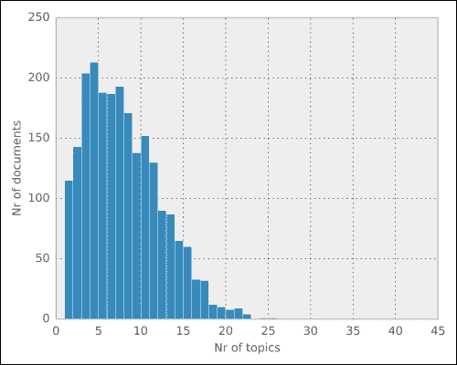
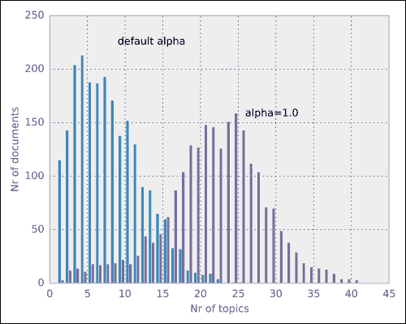
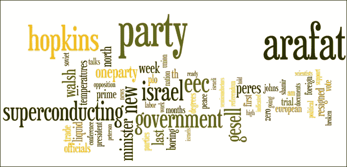
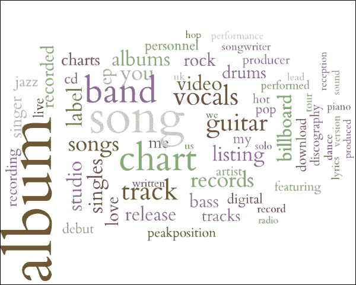
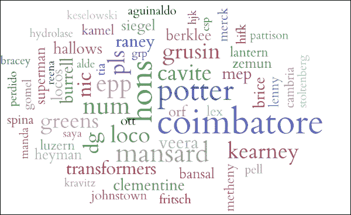

# 第四章：主题建模

在上一章中，我们使用聚类方法对文本文档进行了分组。这是一个非常有用的工具，但并不总是最好的。聚类将每个文本分配到一个唯一的簇中。这本书是关于机器学习和 Python 的。它应该与其他 Python 相关书籍分在一起，还是与机器学习相关书籍分在一起？在实体书店中，我们需要为这本书提供一个固定的存放位置。然而，在互联网书店中，答案是*这本书既关于机器学习，也关于 Python*，所以这本书应该列在在线书店的两个类别中。当然，这并不意味着这本书会出现在所有类别中。我们不会把这本书列在烘焙类书籍中。

本章中，我们将学习一些方法，这些方法不会将文档完全分为独立的组，而是允许每个文档涉及多个**主题**。这些主题将自动从一组文本文档中识别出来。这些文档可以是整本书，或者是较短的文本片段，如博客文章、新闻故事或电子邮件。

我们还希望能够推断出这些文档可能有些主题是其核心内容，而仅仅是提及其他主题。例如，这本书偶尔提到绘图，但它不是像机器学习那样的核心主题。这意味着文档有些主题是其核心内容，其他则是较为外围的内容。处理这些问题的机器学习子领域被称为**主题建模**，也是本章的主题。

# 潜在狄利克雷分配

**LDA 和 LDA——**不幸的是，在机器学习中有两个以 LDA 为首字母缩写的方法：潜在狄利克雷分配（Latent Dirichlet Allocation，LDA），一种主题建模方法，以及线性判别分析（Linear Discriminant Analysis，LDA），一种分类方法。它们完全不相关，除了 LDA 的首字母可以指代这两者之外。在某些情况下，这可能会造成混淆。scikit-learn 工具包有一个子模块 `sklearn.lda`，用于实现线性判别分析。目前，scikit-learn 并没有实现潜在狄利克雷分配。

我们将要看的主题模型是**潜在狄利克雷分配**（**LDA**）。LDA 背后的数学原理相当复杂，我们在这里不会详细讨论。

对于那些有兴趣并且足够冒险的人，维基百科将提供所有这些算法背后的方程式：[`en.wikipedia.org/wiki/Latent_Dirichlet_allocation`](http://en.wikipedia.org/wiki/Latent_Dirichlet_allocation)。

然而，我们可以在高层次上直观地理解 LDA 背后的思想。LDA 属于一种叫做生成模型的模型类别，因为它们有一个类似寓言的故事，解释了数据是如何生成的。当然，这个生成的故事是对现实的简化，以便让机器学习更容易。在 LDA 的寓言中，我们首先通过为单词分配概率权重来创建主题。每个主题会为不同的单词分配不同的权重。例如，Python 主题会为单词“variable”分配较高的概率，为单词“inebriated”分配较低的概率。当我们希望生成一个新文档时，首先选择它将使用的主题，然后从这些主题中混合单词。

例如，假设我们只有三种书籍讨论的主题：

+   机器学习

+   Python

+   烘焙

对于每个主题，我们都有一个与之相关的单词列表。这本书将是前两个主题的混合，可能每个占 50%。混合比例不一定要相等，它也可以是 70/30 的分配。在生成实际文本时，我们是一个一个单词生成的；首先决定这个单词将来自哪个主题。这是基于主题权重的随机决定。一旦选择了一个主题，我们就从该主题的单词列表中生成一个单词。准确来说，我们会根据该主题给定的概率选择一个英文单词。

在这个模型中，单词的顺序不重要。这是一个 *词袋模型*，正如我们在上一章中看到的那样。它是对语言的粗略简化，但通常足够有效，因为仅仅知道文档中使用了哪些单词及其频率，就足以做出机器学习决策。

在现实世界中，我们不知道主题是什么。我们的任务是获取一组文本，并反向工程这个寓言，以发现有哪些主题，并同时弄清楚每个文档使用了哪些主题。

## 构建主题模型

不幸的是，scikit-learn 不支持潜在狄利克雷分配（LDA）。因此，我们将使用 Python 中的 gensim 包。Gensim 由 Radim Řehůřek 开发，他是英国的机器学习研究员和顾问。我们必须首先安装它。可以通过运行以下命令来实现：

```py
pip install gensim

```

作为输入数据，我们将使用来自 **美联社** (**AP**) 的一组新闻报道。这是文本建模研究的标准数据集，在一些最初的主题模型研究中被使用。下载数据后，我们可以通过运行以下代码加载它：

```py
>>> from gensim import corpora, models
>>> corpus = corpora.BleiCorpus('./data/ap/ap.dat',
    './data/ap/vocab.txt')

```

`corpus` 变量保存所有文本文档，并已将它们加载为易于处理的格式。我们现在可以使用这个对象作为输入构建主题模型：

```py
>>> model = models.ldamodel.LdaModel(
 corpus,
 num_topics=100,
 id2word=corpus.id2word)

```

这个单一的构造函数调用将统计推断出语料库中存在的主题。我们可以通过多种方式来探索生成的模型。我们可以使用`model[doc]`语法查看文档涉及的主题列表，如下所示的示例：

```py
 >>> doc = corpus.docbyoffset(0)
 >>> topics = model[doc]
 >>> print(topics)
[(3, 0.023607255776894751),
 (13, 0.11679936618551275),
 (19, 0.075935855202707139),
....
 (92, 0.10781541687001292)]

```

结果在我们的计算机上几乎肯定会有所不同！学习算法使用了一些随机数，每次你在相同的输入数据上学习新的主题模型时，结果都会不同。如果数据表现得比较规范，模型的一些定性属性会在不同的运行中保持稳定。例如，如果你使用主题来比较文档，就像我们在这里做的那样，那么相似性应该是稳健的，只会稍微变化。另一方面，不同主题的顺序将完全不同。

结果的格式是一个由对组成的列表：`(topic_index, topic_weight)`。我们可以看到，每个文档仅使用了少数几个主题（在前面的示例中，主题 0、1 和 2 的权重为零；这些主题的权重为 0）。主题模型是一个稀疏模型，虽然有很多可能的主题，但对于每个文档，只使用其中的少数几个。这并不完全准确，因为所有主题在 LDA 模型中都有非零概率，但其中一些概率非常小，我们可以将其四舍五入为零，作为一个较好的近似值。

我们可以通过绘制每个文档涉及的主题数量的直方图来进一步探索这一点：

```py
>>> num_topics_used = [len(model[doc]) for doc in corpus]
>>> plt.hist(num_topics_used)

```

你将得到以下图表：



### 提示

**稀疏性**意味着尽管你可能有大的矩阵和向量，但原则上，大多数值是零（或非常小，以至于我们可以将它们四舍五入为零，作为一个较好的近似）。因此，任何给定时刻，只有少数几件事是相关的。

经常看起来无法解决的问题实际上是可行的，因为数据是稀疏的。例如，尽管任何网页都可以链接到其他任何网页，但链接图实际上是非常稀疏的，因为每个网页只会链接到所有其他网页的极小一部分。

在前面的图表中，我们可以看到大约 150 篇文档涉及 5 个主题，而大多数文档涉及大约 10 到 12 个主题。没有任何文档讨论超过 20 个不同的主题。

在很大程度上，这是由于所使用参数的值，特别是`alpha`参数。`alpha`的确切含义有些抽象，但较大的`alpha`值将导致每个文档涉及更多的主题。

Alpha 需要大于零，但通常设定为较小的值，通常小于 1。`alpha`的值越小，每个文档预期讨论的主题就越少。默认情况下，gensim 会将`alpha`设置为`1/num_topics`，但你可以通过在`LdaModel`构造函数中显式传递它作为参数来设置它，如下所示：

```py
>>> model = models.ldamodel.LdaModel(
 corpus,
 num_topics=100,
 id2word=corpus.id2word,
 alpha=1)

```

在这种情况下，这是一个比默认值更大的 alpha 值，这应该会导致每个文档包含更多的主题。正如我们在接下来的合并直方图中看到的那样，gensim 按照我们的预期表现，给每个文档分配了更多的主题：



现在，我们可以在前面的直方图中看到，许多文档涉及 20 到 25 个不同的主题。如果你设置一个较低的值，你将看到相反的情况（从在线仓库下载代码将允许你调整这些值）。

这些是什么主题？从技术上讲，正如我们之前讨论过的，它们是关于单词的多项式分布，这意味着它们为词汇表中的每个单词分配一个概率。高概率的单词与该主题的关联性大于低概率的单词。

我们的大脑并不擅长处理概率分布的推理，但我们能够轻松理解一系列单词。因此，通常通过列出最重要的单词来总结主题。

在下表中，我们展示了前十个主题：

| 主题编号 | 主题 |
| --- | --- |
| 1 | 穿着军装的苏联总统新国家领袖立场政府 |
| 2 | 科赫赞比亚卢萨卡一党橙色科赫党我政府市长新政治 |
| 3 | 人权土耳其虐待皇家汤普森威胁新国家写的花园总统 |
| 4 | 法案雇员实验莱文税收联邦措施立法参议院总统举报人赞助 |
| 5 | 俄亥俄州七月干旱耶稣灾难百分比哈特福德密西西比作物北部山谷弗吉尼亚 |
| 6 | 联合百分比十亿年总统世界年美国人民我布什新闻 |
| 7 | b hughes 宣誓书声明联合盎司平方英尺护理延迟被指控不现实布什 |
| 8 | 约特杜卡基斯布什大会农场补贴乌拉圭百分比秘书长我告诉 |
| 9 | 克什米尔政府人民斯里那加印度倾倒城市两座查谟克什米尔集团穆斯林巴基斯坦 |
| 10 | 工人越南爱尔兰工资移民百分比谈判最后岛屿警察赫顿 |

尽管乍一看令人望而生畏，但当我们浏览这些单词列表时，我们可以清楚地看到这些主题并非随机的单词，而是逻辑分组。我们还可以看到，这些主题与苏联仍然存在且戈尔巴乔夫是其总书记时的旧新闻相关。我们还可以将这些主题表示为词云，使得高频词更加突出。例如，这是一个涉及中东和政治的主题的可视化：



我们还可以发现，某些词可能应该被去除（例如，“I”），因为它们并不提供太多信息，它们是停用词。在构建主题模型时，过滤停用词是非常有用的，否则，你可能会得到一个完全由停用词组成的主题。我们也可能希望对文本进行预处理，提取词干，以标准化复数形式和动词形式。这个过程在上一章已经讲过，您可以参考那一章获取详细信息。如果你有兴趣，可以从本书的配套网站下载代码，尝试这些不同的变体来绘制不同的图像。

### 注意

构建像前面那样的词云可以通过几种不同的软件完成。对于本章中的图形，我们使用了一个基于 Python 的工具叫做 pytagcloud。这个包需要安装一些依赖项，并且与机器学习没有直接关系，因此我们在正文中不会讨论它；然而，我们将所有的代码都放在了在线代码库中，供大家生成本章中的图形。

# 按主题比较文档

主题本身就可以用来构建像前面截图中所展示的那种小型文字片段。这些可视化可以用来浏览大量文档。例如，一个网站可以展示不同的主题作为不同的词云，让用户点击以进入相关文档。事实上，词云就是以这种方式被用来分析大量文档的。

然而，主题通常只是通向另一个目标的中间工具。现在我们已经估算了每个文档中每个主题的占比，我们可以在主题空间中比较文档。这意味着，和逐字比较不同，我们认为两篇文档如果讨论的是相同的主题，那么它们就相似。

这非常强大，因为两篇共享很少相同单词的文档，实际上可能指的是相同的主题！它们可能只是用不同的表达方式提到相同的主题（例如，一篇文档可能写的是“美国总统”，而另一篇则用“巴拉克·奥巴马”）。

### 注意

主题模型本身就可以用来构建可视化并探索数据。它们也作为许多其他任务中的中间步骤非常有用。

到目前为止，我们可以重新进行上一章中的练习，通过使用主题来定义相似性，查找与输入查询最相似的帖子。此前，我们是通过直接比较文档的词向量来进行比较，现在我们可以通过比较它们的主题向量来进行比较。

为此，我们将把文档投影到主题空间。也就是说，我们希望得到一个主题向量，用来总结文档。如何执行这些类型的**降维**通常是一个重要任务，我们有一个专门的章节来讨论这个任务。暂时，我们只展示如何使用主题模型来完成这一任务；一旦为每个文档计算出主题，我们可以在其主题向量上执行操作，而不再考虑原始单词。如果主题有意义，它们可能比原始单词更具信息性。此外，这样做还可能带来计算上的优势，因为比较 100 个主题权重向量要比比较包含数千个术语的词汇向量更快。

使用 gensim，我们已经看到如何计算语料库中所有文档对应的主题。现在，我们将为所有文档计算这些主题，并将其存储在 NumPy 数组中，然后计算所有成对距离：

```py
>>> from gensim import matutils
>>> topics = matutils.corpus2dense(model[corpus], num_terms=model.num_topics)

```

现在，`topics`是一个主题矩阵。我们可以使用 SciPy 中的`pdist`函数来计算所有的成对距离。也就是说，通过一次函数调用，我们可以计算出所有`sum((topics[ti] – topics[tj])**2)`的值：

```py
>>> from scipy.spatial import distance
>>> pairwise = distance.squareform(distance.pdist(topics))

```

现在，我们将使用最后一个小技巧；我们将`distance`矩阵的对角元素设置为一个较大的值（它只需要大于矩阵中其他值即可）：

```py
>>> largest = pairwise.max()
>>> for ti in range(len(topics)):
...     pairwise[ti,ti] = largest+1

```

完成了！对于每个文档，我们可以轻松查找最相似的元素（这是一种邻近分类器）：

```py
 >>> def closest_to(doc_id):
 ...    return pairwise[doc_id].argmin()

```

### 注意

请注意，如果我们没有将对角元素设置为较大值，这将不起作用：该函数将始终返回相同的元素，因为它与自己最为相似（除非出现非常罕见的情况，即两个元素的主题分布完全相同，通常只有在它们完全相同的情况下才会发生）。

例如，下面是一个可能的查询文档（它是我们集合中的第二个文档）：

```py
From: geb@cs.pitt.edu (Gordon Banks)
Subject: Re: request for information on "essential tremor" and Indrol?

In article <1q1tbnINNnfn@life.ai.mit.edu> sundar@ai.mit.edu writes:

Essential tremor is a progressive hereditary tremor that gets worse
when the patient tries to use the effected member.  All limbs, vocal
cords, and head can be involved.  Inderal is a beta-blocker and
is usually effective in diminishing the tremor.  Alcohol and mysoline
are also effective, but alcohol is too toxic to use as a treatment.
--
------------------------------------------------------------------
----------
Gordon Banks  N3JXP      | "Skepticism is the chastity of the intellect, and
geb@cadre.dsl.pitt.edu   |  it is shameful to surrender it too soon."
  ----------------------------------------------------------------
------------
```

如果我们请求与`closest_to(1)`最相似的文档，我们会得到以下文档作为结果：

```py
From: geb@cs.pitt.edu (Gordon Banks)
Subject: Re: High Prolactin

In article <93088.112203JER4@psuvm.psu.edu> JER4@psuvm.psu.edu (John E. Rodway) writes:
>Any comments on the use of the drug Parlodel for high prolactin in the blood?
>

It can suppress secretion of prolactin.  Is useful in cases of galactorrhea.
Some adenomas of the pituitary secret too much.

--
------------------------------------------------------------------
----------
Gordon Banks  N3JXP      | "Skepticism is the chastity of the intellect, and
geb@cadre.dsl.pitt.edu   |  it is shameful to surrender it too soon."
```

系统返回了同一作者讨论药物的帖子。

## 建模整个维基百科

虽然最初的 LDA 实现可能比较慢，限制了它们在小型文档集合中的使用，但现代算法在处理非常大的数据集时表现良好。根据 gensim 的文档，我们将为整个英文维基百科构建一个主题模型。这需要几个小时，但即使是笔记本电脑也能完成！如果使用集群计算机，我们可以大大加快速度，不过这类处理环境将在后续章节中讨论。

首先，我们从[`dumps.wikimedia.org`](http://dumps.wikimedia.org)下载整个维基百科的数据库文件。这个文件很大（目前超过 10 GB），因此可能需要一些时间，除非你的互联网连接非常快。然后，我们将使用 gensim 工具对其进行索引：

```py
python -m gensim.scripts.make_wiki \
 enwiki-latest-pages-articles.xml.bz2 wiki_en_output

```

请在命令行中运行上一行，而不是在 Python shell 中运行。几个小时后，索引将保存在同一目录中。此时，我们可以构建最终的话题模型。这个过程与我们之前在小型 AP 数据集上的操作完全相同。我们首先导入一些包：

```py
>>> import logging, gensim

```

现在，我们设置日志记录，使用标准的 Python 日志模块（gensim 用于打印状态消息）。这一步并非严格必要，但有更多的输出可以帮助我们了解发生了什么：

```py
>>> logging.basicConfig(
 format='%(asctime)s : %(levelname)s : %(message)s',
 level=logging.INFO)

```

现在我们加载预处理后的数据：

```py
>>> id2word = gensim.corpora.Dictionary.load_from_text(
 'wiki_en_output_wordids.txt')
>>> mm = gensim.corpora.MmCorpus('wiki_en_output_tfidf.mm')

```

最后，我们像之前一样构建 LDA 模型：

```py
>>> model = gensim.models.ldamodel.LdaModel(
 corpus=mm,
 id2word=id2word,
 num_topics=100,
 update_every=1,
 chunksize=10000,
 passes=1)

```

这将再次花费几个小时。你将在控制台上看到进度，这可以给你一个大致的等待时间。

一旦完成，我们可以将话题模型保存到文件中，这样就不必重新执行它：

```py
 >>> model.save('wiki_lda.pkl')

```

如果你退出会话并稍后再回来，你可以使用以下命令重新加载模型（自然地，首先要进行适当的导入）：

```py
 >>> model = gensim.models.ldamodel.LdaModel.load('wiki_lda.pkl')

```

`model` 对象可用于探索文档集合，并像我们之前一样构建 `topics` 矩阵。

我们可以看到，即使我们拥有比之前更多的文档（目前超过 400 万），这仍然是一个稀疏模型：

```py
 >>> lens = (topics > 0).sum(axis=0)
 >>> print(np.mean(lens))
 6.41
 >>> print(np.mean(lens <= 10))
 0.941

```

因此，平均每个文档提到了 6.4 个话题，其中 94% 的文档提到 10 个或更少的话题。

我们可以询问维基百科中最常被提及的话题是什么。我们将首先计算每个话题的总权重（通过将所有文档中的权重加总），然后检索与最具权重话题相关的词语。此操作使用以下代码执行：

```py
>>> weights = topics.sum(axis=0)
>>> words = model.show_topic(weights.argmax(), 64)

```

使用与之前相同的工具构建可视化，我们可以看到最常提及的话题与音乐相关，并且是一个非常连贯的话题。18% 的维基百科页面与这个话题部分相关（维基百科中 5.5% 的词汇分配给了这个话题）。看看下面的截图：



### 注意

这些图表和数据是在书籍编写时获得的。由于维基百科在不断变化，你的结果可能会有所不同。我们预计趋势会相似，但细节可能会有所不同。

或者，我们可以查看最少被提及的话题：

```py
 >>> words = model.show_topic(weights.argmin(), 64)

```



最少被提及的话题较难解释，但它的许多高频词与东部国家的机场有关。只有 1.6% 的文档涉及到它，它仅占 0.1% 的词汇。

# 选择话题的数量

到目前为止，在本章中，我们使用了固定数量的主题进行分析，即 100 个。这是一个完全任意的数字，我们也可以选择使用 20 个或 200 个主题。幸运的是，对于许多应用场景来说，这个数字其实并不重要。如果你只是将这些主题作为一个中间步骤，正如我们之前在查找相似帖子时所做的那样，模型中使用的具体主题数量通常对系统的最终行为影响不大。这意味着，只要使用足够数量的主题，无论是 100 个主题还是 200 个主题，从该过程中得出的推荐结果不会有太大差异；100 个主题通常已经足够（而 20 个主题对于一般的文本文档集合来说太少）。设置`alpha`值也是如此。虽然调整它会改变主题，但最终结果对这种变化具有较强的鲁棒性。

### 提示

主题建模通常是为达成某个目标。这样一来，具体使用哪些参数值并不总是特别重要。不同的主题数量或`alpha`等参数值将导致系统的最终结果几乎完全相同。

另一方面，如果你打算直接探索主题，或者构建一个能够展示主题的可视化工具，那么你应该尝试不同的值，看看哪个值能为你提供最有用或最吸引人的结果。

另外，有一些方法可以根据数据集自动确定主题的数量。一个流行的模型叫做**层次狄利克雷过程**。同样，这背后的完整数学模型很复杂，超出了本书的讨论范围。不过，我们可以讲一个简化的故事：与 LDA 生成模型中预先固定主题的做法不同，层次狄利克雷过程中的主题是随着数据逐一生成的。每当作者开始写一篇新文档时，他们可以选择使用已有的主题，或者创建一个全新的主题。当已经创建了更多主题时，创建新主题的概率会下降，因为更倾向于复用已有的主题，但这种可能性始终存在。

这意味着*我们拥有的文档越多，最终得到的主题也会越多*。这是一个起初难以理解的陈述，但经过反思后，它完全合理。我们是在将文档分组，文档越多，我们能够划分得越细。如果我们只有少数新闻文章的例子，那么“体育”可能就是一个主题。然而，当我们有更多的文章时，我们开始将其拆分成不同的子类别：“冰球”、“足球”，等等。随着数据量的增多，我们甚至能区分细微的差别，像是关于特定球队或球员的文章。对人群也是如此。在一个背景差异较大的群体中，如果有几个“计算机人士”，你可能会将他们放在一起；如果是稍微大一点的群体，你会把程序员和系统管理员分开；而在现实世界中，我们甚至有不同的聚会，专门为 Python 和 Ruby 程序员提供。

**层次狄利克雷过程**（**HDP**）在 gensim 中可用。使用它非常简单。为了适应我们为 LDA 编写的代码，我们只需将对`gensim.models.ldamodel.LdaModel`的调用替换为对`HdpModel`构造函数的调用，代码如下：

```py
 >>> hdp = gensim.models.hdpmodel.HdpModel(mm, id2word)

```

就是这样（不过它需要更长的计算时间——没有免费的午餐）。现在，我们可以像使用 LDA 模型一样使用这个模型，区别在于我们不需要指定主题的数量。

# 总结

在本章中，我们讨论了主题建模。主题建模比聚类更灵活，因为这些方法允许每个文档部分地存在于多个组中。为了探索这些方法，我们使用了一个新包——gensim。

主题建模最初是在文本情况下开发的，并且更容易理解，但在计算机视觉一章中，我们将看到这些技术如何也能应用于图像。主题模型在现代计算机视觉研究中非常重要。事实上，与前几章不同，本章非常接近机器学习算法研究的前沿。原始的 LDA 算法发表于 2003 年的科学期刊，但 gensim 处理维基百科的能力是在 2010 年才开发出来的，而 HDP 算法则来自 2011 年。研究仍在继续，你可以找到许多变种和模型，它们有着一些很有趣的名字，比如*印度自助餐过程*（不要与*中国餐馆过程*混淆，后者是一个不同的模型），或者*八金球分配*（八金球是一种日本游戏，介于老虎机和弹球之间）。

我们现在已经走过了一些主要的机器学习模式：分类、聚类和主题建模。

在下一章中，我们将回到分类问题，但这次我们将探索高级算法和方法。
