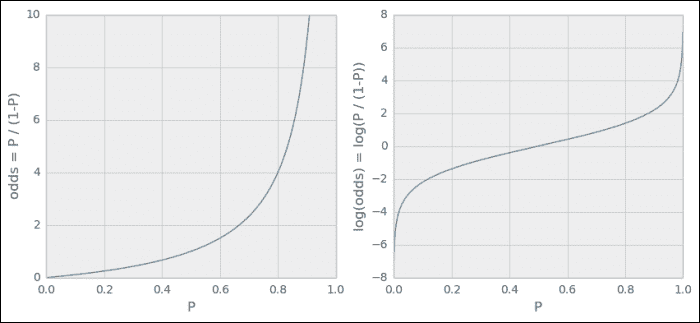

# 第五章：分类 – 检测差答案

现在我们能够从文本中提取有用的特征，我们可以开始挑战使用真实数据构建分类器。让我们回到我们在第三章中的虚拟网站，*聚类 – 查找相关帖子*，用户可以提交问题并获得答案。

对于那些问答网站的拥有者来说，保持发布内容的质量水平一直是一个持续的挑战。像 StackOverflow 这样的站点付出了巨大努力，鼓励用户通过多种方式为内容评分，并提供徽章和奖励积分，以鼓励用户在雕琢问题或编写可能的答案时付出更多精力。

一个特别成功的激励措施是提问者可以将他们问题的一个答案标记为已接受答案（同样，提问者标记答案时也会有激励措施）。这将为被标记答案的作者带来更多的积分。

对用户来说，能否在他输入答案时立即看到答案的好坏并不是非常有用？这意味着，网站会不断评估他的正在编写的答案，并提供反馈，指出答案是否显示出某些不好的迹象。这将鼓励用户在写答案时付出更多努力（提供代码示例？包括图片？），从而改善整个系统。

让我们在本章中构建这样的机制。

# 绘制我们的路线图

由于我们将使用非常嘈杂的真实数据构建一个系统，本章并不适合心智脆弱的人，因为我们不会得到一个能够达到 100%准确度的分类器的黄金解决方案；事实上，甚至人类有时也会不同意一个答案是否好（看看 StackOverflow 上一些评论就知道了）。相反，我们会发现，像这样的某些问题非常困难，以至于我们不得不在过程中调整我们的初步目标。但在这个过程中，我们将从最近邻方法开始，发现它在这个任务中并不好，然后切换到逻辑回归，并得到一个能够实现足够好预测质量的解决方案，尽管它只在一小部分答案上有效。最后，我们将花一些时间研究如何提取获胜者，并将其部署到目标系统上。

# 学习分类有价值的答案

在分类中，我们希望为给定的数据实例找到相应的**类别**，有时也称为**标签**。为了能够实现这一目标，我们需要回答两个问题：

+   我们应如何表示数据实例？

+   我们的分类器应具备什么样的模型或结构？

## 调整实例

在其最简单的形式下，在我们的案例中，数据实例是答案的文本，标签将是一个二进制值，表示提问者是否接受此文本作为答案。然而，原始文本对大多数机器学习算法来说是非常不方便的表示方式。它们需要数字化的数据。而我们的任务就是从原始文本中提取有用的特征，机器学习算法可以利用这些特征来学习正确的标签。

## 调整分类器

一旦我们找到了或收集了足够的（文本，标签）对，就可以训练一个**分类器**。对于分类器的底层结构，我们有很多种选择，每种都有优缺点。仅举几个更为突出的选择，包括逻辑回归、决策树、支持向量机（SVM）和朴素贝叶斯。在本章中，我们将对比上一章中的基于实例的方法——最近邻，与基于模型的逻辑回归。

# 获取数据

幸运的是，StackOverflow 背后的团队提供了 StackExchange 宇宙中大部分的数据，而 StackOverflow 属于这个宇宙，这些数据可以在 cc-wiki 许可下使用。在写本书时，最新的数据转储可以在[`archive.org/details/stackexchange`](https://archive.org/details/stackexchange)找到。它包含了 StackExchange 系列所有问答站点的数据转储。对于 StackOverflow，你会找到多个文件，我们只需要其中的 `stackoverflow.com-Posts.7z` 文件，大小为 5.2 GB。

下载并解压后，我们有大约 26 GB 的 XML 格式数据，包含所有问题和答案，作为 `root` 标签下的各个 `row` 标签：

```py
<?xml version="1.0" encoding="utf-8"?>
<posts>
...
 <row Id="4572748" PostTypeId="2" ParentId="4568987" CreationDate="2011-01-01T00:01:03.387" Score="4" ViewCount="" Body="&lt;p&gt;IANAL, but &lt;a href=&quot;http://support.apple.com/kb/HT2931&quot; rel=&quot;nofollow&quot;&gt;this&lt;/a&gt; indicates to me that you cannot use the loops in your application:&lt;/p&gt;

&lt;blockquote&gt;
  &lt;p&gt;...however, individual audio loops may
  not be commercially or otherwise
  distributed on a standalone basis, nor
  may they be repackaged in whole or in
  part as audio samples, sound effects
  or music beds.&quot;&lt;/p&gt;

  &lt;p&gt;So don't worry, you can make
  commercial music with GarageBand, you
  just can't distribute the loops as
  loops.&lt;/p&gt;
&lt;/blockquote&gt;
" OwnerUserId="203568" LastActivityDate="2011-01-01T00:01:03.387" CommentCount="1" />
…
</posts>

```

| 名称 | 类型 | 描述 |
| --- | --- | --- |
| `Id` | `整数` | 这是唯一的标识符。 |

| `PostTypeId` | `整数` | 这是帖子的类别描述。对我们感兴趣的值如下：

+   问题

+   答案

其他值将被忽略。 |

| `ParentId` | `整数` | 这是该答案所属问题的唯一标识符（问题没有该字段）。 |
| --- | --- | --- |
| `CreationDate` | `日期时间` | 这是提交日期。 |
| `Score` | `整数` | 这是该帖子的得分。 |
| `ViewCount` | `整数或空` | 这是该帖子被用户查看的次数。 |
| `Body` | `字符串` | 这是作为 HTML 编码文本的完整帖子内容。 |
| `OwnerUserId` | `ID` | 这是帖子的唯一标识符。如果值为 1，则表示这是一个 Wiki 问题。 |
| `Title` | `字符串` | 这是问题的标题（答案没有该字段）。 |
| `AcceptedAnswerId` | `ID` | 这是被接受的答案的 ID（答案没有该字段）。 |
| `CommentCount` | `整数` | 这是该帖子评论的数量。 |

## 将数据精简成易于处理的块

为了加速我们的实验阶段，我们不应该尝试在庞大的 XML 文件上评估我们的分类思路。相反，我们应该考虑如何将其裁剪，使得在保留足够代表性快照的同时，能够快速测试我们的思路。如果我们将 XML 过滤为例如 2012 年创建的 `row` 标签，我们仍然会得到超过 600 万个帖子（2,323,184 个问题和 4,055,999 个回答），这些足够我们目前挑选训练数据了。我们也不想在 XML 格式上进行操作，因为这会拖慢速度。格式越简单越好。这就是为什么我们使用 Python 的 `cElementTree` 解析剩余的 XML 并将其写出为制表符分隔的文件。

## 属性的预选择和处理

为了进一步减少数据量，我们当然可以删除那些我们认为对分类器区分好答案和差答案没有帮助的属性。但我们必须小心。虽然一些特征不会直接影响分类，它们仍然是必须保留的。

`PostTypeId` 属性，例如，用于区分问题和回答。它不会被选中作为特征，但我们需要它来过滤数据。

`CreationDate` 可能对确定提问和各个回答之间的时间跨度很有用，所以我们保留它。`Score` 作为社区评价的指标，当然也很重要。

相反，`ViewCount` 很可能对我们的任务没有任何帮助。即使它能帮助分类器区分好答案和差答案，我们在答案提交时也没有这个信息。舍弃它！

`Body` 属性显然包含了最重要的信息。由于它是编码的 HTML，我们需要将其解码为纯文本。

`OwnerUserId` 只有在我们考虑用户相关特征时才有用，而我们并不打算这样做。虽然我们在这里舍弃它，但我们鼓励你使用它来构建一个更好的分类器（也许可以与 `stackoverflow.com-Users.7z` 结合使用）。

`Title` 属性在这里被忽略，尽管它可能为问题提供更多的信息。

`CommentCount` 也被忽略。与 `ViewCount` 类似，它可能有助于分类器处理那些已经存在一段时间的帖子（更多评论 = 更模糊的帖子？）。然而，它不会在答案发布时对分类器产生帮助。

`AcceptedAnswerId` 类似于 `Score`，都是帖子质量的指示器。由于我们会按答案访问它，因此我们不会保留这个属性，而是创建一个新的属性 `IsAccepted`，对于答案它是 0 或 1，对于问题则被忽略（`ParentId=-1`）。

最终我们得到以下格式：

```py
Id <TAB> ParentId <TAB> IsAccepted <TAB> TimeToAnswer <TAB> Score <TAB> Text
```

关于具体的解析细节，请参考`so_xml_to_tsv.py`和`choose_instance.py`。简单来说，为了加速处理，我们将数据分为两个文件：在`meta.json`中，我们存储一个字典，将帖子的`Id`值映射到除`Text`外的其他数据，并以 JSON 格式存储，这样我们就可以以正确的格式读取它。例如，帖子的得分将存储在`meta[Id]['Score']`中。在`data.tsv`中，我们存储`Id`和`Text`值，可以通过以下方法轻松读取：

```py
 def fetch_posts():
 for line in open("data.tsv", "r"):
 post_id, text = line.split("\t")
 yield int(post_id), text.strip()

```

## 定义什么是好答案

在我们能够训练分类器来区分好答案和坏答案之前，我们必须先创建训练数据。到目前为止，我们只有一堆数据。我们还需要做的是定义标签。

当然，我们可以简单地使用`IsAccepted`属性作为标签。毕竟，它标记了回答问题的答案。然而，这只是提问者的看法。自然，提问者希望快速得到答案，并接受第一个*最好的*答案。如果随着时间推移，更多的答案被提交，其中一些可能比已经接受的答案更好。然而，提问者很少回去修改自己的选择。所以我们最终会得到许多已经接受的答案，其得分并不是最高的。

在另一个极端，我们可以简单地始终取每个问题中得分最好和最差的答案作为正例和负例。然而，对于那些只有好答案的问题，我们该怎么办呢？比如，一个得两分，另一个得四分。我们是否真的应该把得两分的答案当作负例，仅仅因为它是得分较低的答案？

我们应该在这些极端之间找到一个平衡。如果我们把所有得分高于零的答案作为正例，所有得分为零或更低的答案作为负例，我们最终会得到相当合理的标签：

```py
>>> all_answers = [q for q,v in meta.items() if v['ParentId']!=-1]
>>> Y = np.asarray([meta[answerId]['Score']>0 for answerId in all_answers])

```

# 创建我们的第一个分类器

让我们从上一章的简单而美丽的最近邻方法开始。虽然它不如其他方法先进，但它非常强大：由于它不是基于模型的，它可以*学习*几乎任何数据。但这种美丽也伴随着一个明显的缺点，我们很快就会发现。

## 从 kNN 开始

这次我们不自己实现，而是从`sklearn`工具包中取用。分类器位于`sklearn.neighbors`中。让我们从一个简单的 2-近邻分类器开始：

```py
>>> from sklearn import neighbors
>>> knn = neighbors.KNeighborsClassifier(n_neighbors=2)
>>> print(knn)
KNeighborsClassifier(algorithm='auto', leaf_size=30, metric='minkowski', n_neighbors=2, p=2, weights='uniform')

```

它提供与`sklearn`中所有其他估计器相同的接口：我们使用`fit()`来训练它，然后可以使用`predict()`来预测新数据实例的类别：

```py
>>> knn.fit([[1],[2],[3],[4],[5],[6]], [0,0,0,1,1,1])
>>> knn.predict(1.5)
array([0])
>>> knn.predict(37)
array([1])
>>> knn.predict(3)
array([0])

```

为了获得类别概率，我们可以使用`predict_proba()`。在这个只有两个类别`0`和`1`的案例中，它将返回一个包含两个元素的数组：

```py
>>> knn.predict_proba(1.5)
array([[ 1.,  0.]])
>>> knn.predict_proba(37)
array([[ 0.,  1.]])
>>> knn.predict_proba(3.5)
array([[ 0.5,  0.5]])

```

## 特征工程

那么，我们可以向分类器提供什么样的特征呢？我们认为什么特征具有最强的区分能力？

`TimeToAnswer` 已经存在于我们的 `meta` 字典中，但它单独使用可能不会提供太多价值。然后还有 `Text`，但以原始形式我们不能将其传递给分类器，因为特征必须是数值形式。我们将不得不做一些脏活（也很有趣！）从中提取特征。

我们可以做的是检查答案中 HTML 链接的数量，作为质量的代理指标。我们的假设是，答案中的超链接越多，表示答案质量越好，从而更有可能被点赞。当然，我们只想统计普通文本中的链接，而不是代码示例中的链接：

```py
import re
code_match = re.compile('<pre>(.*?)</pre>',
 re.MULTILINE | re.DOTALL)
link_match = re.compile('<a href="http://.*?".*?>(.*?)</a>', 
 re.MULTILINE | re.DOTALL)
tag_match = re.compile('<[^>]*>', 
 re.MULTILINE | re.DOTALL)

def extract_features_from_body(s):
 link_count_in_code = 0
 # count links in code to later subtract them 
 for match_str in code_match.findall(s):
 link_count_in_code += len(link_match.findall(match_str))

 return len(link_match.findall(s)) – link_count_in_code

```

### 提示

对于生产系统，我们不希望使用正则表达式解析 HTML 内容。相反，我们应该依赖像 BeautifulSoup 这样优秀的库，它能够非常稳健地处理日常 HTML 中通常出现的各种奇怪情况。

有了这个基础，我们可以为每个答案生成一个特征。但在训练分类器之前，先看看我们将用什么来训练它。我们可以通过绘制新特征的频率分布来获得初步印象。这可以通过绘制每个值在数据中出现的百分比来完成。请查看以下图表：


由于大多数帖子根本没有链接，我们现在知道仅凭这个特征无法构建一个好的分类器。尽管如此，我们仍然可以尝试它，先做一个初步估计，看看我们处于什么位置。

## 训练分类器

我们需要将特征数组与之前定义的标签 `Y` 一起传递给 kNN 学习器，以获得分类器：

```py
X = np.asarray([extract_features_from_body(text) for post_id, text in
                fetch_posts() if post_id in all_answers])
knn = neighbors.KNeighborsClassifier()
knn.fit(X, Y)

```

使用标准参数，我们刚刚为我们的数据拟合了一个 5NN（即 `k=5` 的 NN）。为什么是 5NN？嗯，基于我们对数据的当前了解，我们真的不知道正确的 `k` 应该是多少。一旦我们有了更多的洞察力，就能更好地确定 `k` 的值。

## 测量分类器的性能

我们需要明确我们想要测量的内容。最简单的做法是计算测试集上的平均预测质量。这将产生一个介于 0（完全错误的预测）和 1（完美预测）之间的值。准确度可以通过 `knn.score()` 获得。

但正如我们在前一章中学到的，我们不仅要做一次，而是使用交叉验证，通过 `sklearn.cross_validation` 中现成的 `KFold` 类来实现。最后，我们将对每一折的测试集分数进行平均，并使用标准差来看它的变化：

```py
from sklearn.cross_validation import KFold
scores = []

cv = KFold(n=len(X), k=10, indices=True)

for train, test in cv:
 X_train, y_train = X[train], Y[train]
 X_test, y_test = X[test], Y[test]
 clf = neighbors.KNeighborsClassifier()
 clf.fit(X, Y)
 scores.append(clf.score(X_test, y_test))

print("Mean(scores)=%.5f\tStddev(scores)=%.5f"\
 %(np.mean(scores), np.std(scores)))

```

这是输出结果：

```py
Mean(scores)=0.50250    Stddev(scores)=0.055591

```

现在，这远远不能使用。只有 55% 的准确率，它与抛硬币的效果差不多。显然，帖子中的链接数量不是衡量帖子质量的一个好指标。所以，我们可以说，这个特征没有太多的区分能力——至少对于 `k=5` 的 kNN 来说是这样。

## 设计更多特征

除了使用超链接数量作为帖子质量的代理外，代码行数也可能是另一个不错的指标。至少它是一个很好的指示，说明帖子作者有兴趣回答问题。我们可以在`<pre>…</pre>`标签中找到嵌入的代码。一旦提取出来，我们应该在忽略代码行的情况下统计帖子的单词数：

```py
def extract_features_from_body(s):
 num_code_lines = 0
    link_count_in_code = 0
 code_free_s = s

 # remove source code and count how many lines
 for match_str in code_match.findall(s):
 num_code_lines += match_str.count('\n')
 code_free_s = code_match.sub("", code_free_s)

 # Sometimes source code contains links, 
 # which we don't want to count
 link_count_in_code += len(link_match.findall(match_str))

 links = link_match.findall(s)
 link_count = len(links)
 link_count -= link_count_in_code
 html_free_s = re.sub(" +", " ", 
 tag_match.sub('',  code_free_s)).replace("\n", "")
 link_free_s = html_free_s

 # remove links from text before counting words
 for link in links:
 if link.lower().startswith("http://"):
 link_free_s = link_free_s.replace(link,'')

 num_text_tokens = html_free_s.count(" ")

 return num_text_tokens, num_code_lines, link_count

```

看着这些，我们注意到至少帖子的单词数量表现出更高的变异性：


在更大的特征空间上训练能显著提高准确性：

```py
Mean(scores)=0.59800    Stddev(scores)=0.02600

```

但即便如此，这仍然意味着我们大约会将 10 个帖子中的 4 个分类错。至少我们朝着正确的方向前进了。更多的特征带来了更高的准确性，这促使我们添加更多的特征。因此，让我们通过更多特征来扩展特征空间：

+   `AvgSentLen`：这个特征衡量的是一个句子的平均单词数。也许有一个规律是，特别好的帖子不会用过长的句子让读者大脑过载？

+   `AvgWordLen`：类似于`AvgSentLen`，这个特征衡量的是帖子中单词的平均字符数。

+   `NumAllCaps`：这个特征衡量的是帖子中以大写字母书写的单词数量，这通常被认为是糟糕的写作风格。

+   `NumExclams`：这个特征衡量的是感叹号的数量。

以下图表显示了平均句子和单词长度、以及大写字母单词和感叹号数量的值分布：


有了这四个额外的特征，我们现在有七个特征来表示单个帖子。让我们看看我们的进展：

```py
Mean(scores)=0.61400    Stddev(scores)= 0.02154

```

嗯，这很有意思。我们添加了四个新特征，却没有得到任何回报。怎么会这样呢？

要理解这一点，我们需要提醒自己 kNN 是如何工作的。我们的 5NN 分类器通过计算上述七个特征——`LinkCount`、`NumTextTokens`、`NumCodeLines`、`AvgSentLen`、`AvgWordLen`、`NumAllCaps`和`NumExclams`——然后找到五个最接近的其他帖子。新帖子的类别就是这些最接近帖子类别中的多数。最近的帖子是通过计算欧氏距离来确定的（由于我们没有指定，分类器是使用默认的`p=2`参数初始化的，这是明可夫斯基距离中的参数）。这意味着所有七个特征被视为类似的。kNN 并没有真正学会，例如，`NumTextTokens`虽然有用，但远不如`NumLinks`重要。让我们考虑以下两个帖子 A 和 B，它们仅在以下特征上有所不同，并与新帖子进行比较：

| 帖子 | 链接数 | 文本词数 |
| --- | --- | --- |
| A | 2 | 20 |
| B | 0 | 25 |
| new | 1 | 23 |

尽管我们认为链接比纯文本提供更多的价值，但帖子 B 会被认为与新帖子更相似，而不是帖子 A。

显然，kNN 在正确使用现有数据方面遇到了困难。

# 决定如何改进

为了改进这一点，我们基本上有以下几个选择：

+   **增加更多数据**：也许学习算法的数据量不足，我们应该简单地增加更多的训练数据？

+   **调整模型复杂度**：也许模型还不够复杂？或者它已经太复杂了？在这种情况下，我们可以减少*k*，使其考虑更少的最近邻，从而更好地预测不平滑的数据。或者我们可以增加*k*，以达到相反的效果。

+   **修改特征空间**：也许我们没有合适的特征集？我们可以，例如，改变当前特征的尺度，或者设计更多的新特征。或者我们是否应该去除一些当前的特征，以防某些特征相互重复？

+   **改变模型**：也许 kNN 在我们的用例中通常并不适用，因此无论我们如何允许其复杂化，如何提升特征空间，它都永远无法实现良好的预测性能？

在现实生活中，通常人们会尝试通过随机选择这些选项之一并按无特定顺序尝试它们来改善当前的性能，希望能偶然找到最佳配置。我们也可以这么做，但这肯定会比做出有根据的决策花费更长时间。让我们采取有根据的方法，为此我们需要引入偏差-方差权衡。

## 偏差-方差及其权衡

在第一章，*开始使用 Python 机器学习*中，我们尝试了用不同复杂度的多项式，通过维度参数`d`来拟合数据。我们意识到，二维多项式，一个直线，并不能很好地拟合示例数据，因为数据并非线性。无论我们如何精细化拟合过程，我们的二维模型都会将所有数据视为一条直线。我们说它对现有数据有过高的偏差。它是欠拟合的。

我们对维度进行了些许尝试，发现 100 维的多项式实际上很好地拟合了它所训练的数据（当时我们并不了解训练集-测试集拆分）。然而，我们很快发现它拟合得太好了。我们意识到它严重过拟合，以至于用不同的数据样本，我们会得到完全不同的 100 维多项式。我们说这个模型对于给定数据的方差太高，或者说它过拟合了。

这些是我们大多数机器学习问题所处的极端情况之间的两种极端。理想情况下，我们希望能够同时拥有低偏差和低方差。但我们处于一个不完美的世界，必须在二者之间做出权衡。如果我们改善其中一个，另一个可能会变得更差。

## 修正高偏差

现在假设我们遭遇高偏差。在这种情况下，增加更多的训练数据显然没有帮助。此外，去除特征肯定也没有帮助，因为我们的模型已经过于简单化。

在这种情况下，我们唯一的选择是获取更多特征、使模型更复杂，或者更换模型。

## 修复高方差

反之，如果我们遇到高方差，意味着我们的模型对于数据过于复杂。在这种情况下，我们只能尝试获取更多的数据或减少模型的复杂性。这意味着要增加*k*，让更多的邻居参与计算，或者去除一些特征。

## 高偏差或低偏差

要找出我们真正的问题所在，我们只需将训练和测试误差随着数据集大小绘制出来。

高偏差通常表现为测试误差在开始时略有下降，但随着训练数据集大小的增加，误差最终会稳定在一个很高的值。高方差则通过两条曲线之间的巨大差距来识别。

绘制不同数据集大小下 5NN 的误差图，显示训练误差和测试误差之间存在较大差距，暗示了一个高方差问题：


看着图表，我们立刻看到增加更多的训练数据没有帮助，因为对应于测试误差的虚线似乎保持在 0.4 以上。我们唯一的选择是降低复杂性，方法是增加*k*或减少特征空间。

在这里，减少特征空间没有帮助。我们可以通过将简化后的特征空间（仅包含`LinkCount`和`NumTextTokens`）绘制成图来轻松确认这一点：


对于其他较小的特征集，我们得到的图形相似。无论我们选择哪个特征子集，图形看起来都差不多。

至少通过增加*k*来减少模型复杂性显示了一些积极的影响：

| k | mean(scores) | stddev(scores) |
| --- | --- | --- |
| 40 | 0.62800 | 0.03750 |
| 10 | 0.62000 | 0.04111 |
| 5 | 0.61400 | 0.02154 |

但这还不够，并且也会导致较低的分类运行时性能。例如，以`k=40`为例，在这个情况下，我们有非常低的测试误差。要对一个新帖子进行分类，我们需要找到与该新帖子最接近的 40 个帖子，以决定这个新帖子是否是好帖子：


显然，似乎是使用最近邻方法在我们的场景中出现了问题。它还有另一个真正的缺点。随着时间的推移，系统中会加入越来越多的帖子。由于最近邻方法是基于实例的，我们必须在系统中存储所有的帖子。获取的数据越多，预测的速度就会变得越慢。这与基于模型的方法不同，后者试图从数据中推导出一个模型。

到这里，我们已经有足够的理由放弃最近邻方法，去寻找分类世界中更好的方法。当然，我们永远无法知道是否有我们没有想到的那个黄金特征。但现在，让我们继续研究另一种在文本分类场景中表现优秀的分类方法。

# 使用逻辑回归

与其名称相反，逻辑回归是一种分类方法。在文本分类中，它是一种非常强大的方法；它通过首先对逻辑函数进行回归，从而实现这一点，这也是其名称的由来。

## 一些数学与小示例

为了初步理解逻辑回归的工作原理，让我们首先看一下下面的示例，在该示例中，我们有人工特征值*X*，并与相应的类别 0 或 1 进行绘制。如我们所见，数据有噪声，因此在 1 到 6 的特征值范围内，类别是重叠的。因此，最好不是直接对离散类别进行建模，而是建模特征值属于类别 1 的概率，*P(X)*。一旦我们拥有了这样的模型，我们就可以在*P(X)>0.5*时预测类别 1，反之则预测类别 0。


从数学上讲，建模一个具有有限范围的事物总是很困难的，就像我们这里的离散标签 0 和 1 一样。然而，我们可以稍微调整概率，使其始终保持在 0 和 1 之间。为此，我们需要赔率比率及其对数。

假设某个特征属于类别 1 的概率为 0.9，*P(y=1) = 0.9*。那么赔率比率为*P(y=1)/P(y=0) = 0.9/0.1 = 9*。我们可以说，这个特征属于类别 1 的机会是 9:1。如果*P(y=0.5)*，我们将有 1:1 的机会，该实例属于类别 1。赔率比率的下限是 0，但可以趋向无限大（下图中的左图）。如果我们现在取其对数，就可以将所有概率从 0 到 1 映射到从负无穷到正无穷的完整范围（下图中的右图）。好处是，我们仍然保持了较高概率导致较高对数赔率的关系，只是不再局限于 0 和 1。



这意味着我们现在可以将特征的线性组合拟合到值上（好吧，我们只有一个特征和一个常数，但这很快就会改变）。从某种意义上讲，我们用替代了第一章中的线性模型，*使用 Python 进行机器学习入门*，用（将*y*替换为*log(odds)*）。

我们可以解出 *p[i]*，这样我们就得到了！一些带有小示例的数学公式。

我们只需要找到合适的系数，使得公式对于数据集中的所有（x[i], p[i]）对能够给出最低的误差，而这将通过 scikit-learn 来完成。

拟合后，公式将为每个新的数据点 *x* 计算属于类别 1 的概率：

```py
>>> from sklearn.linear_model import LogisticRegression
>>> clf = LogisticRegression()
>>> print(clf)
LogisticRegression(C=1.0, class_weight=None, dual=False, fit_intercept=True, intercept_scaling=1, penalty=l2, tol=0.0001)
>>> clf.fit(X, y)
>>> print(np.exp(clf.intercept_), np.exp(clf.coef_.ravel()))
[ 0.09437188] [ 1.80094112]
>>> def lr_model(clf, X):
...     return 1 / (1 + np.exp(-(clf.intercept_ + clf.coef_*X)))
>>> print("P(x=-1)=%.2f\tP(x=7)=%.2f"%(lr_model(clf, -1), lr_model(clf, 7)))
P(x=-1)=0.05    P(x=7)=0.85

```

你可能已经注意到，scikit-learn 通过特殊字段 `intercept_` 展示了第一个系数。

如果我们绘制拟合的模型，我们会看到，考虑到数据，模型完全有意义：


## 将逻辑回归应用于我们的帖子分类问题

毋庸置疑，上一节中的示例是为了展示逻辑回归的美妙。它在真实的、噪声较大的数据上表现如何？

与最佳最近邻分类器（`k=40`）作为基准进行比较，我们可以看到它的表现稍微好一些，但也不会有太大变化。

| 方法 | 平均（得分） | 标准差（得分） |
| --- | --- | --- |
| LogReg C=0.1 | 0.64650 | 0.03139 |
| LogReg C=1.00 | 0.64650 | 0.03155 |
| LogReg C=10.00 | 0.64550 | 0.03102 |
| LogReg C=0.01 | 0.63850 | 0.01950 |
| 40NN | 0.62800 | 0.03750 |

我们已经展示了不同正则化参数 `C` 值下的准确度。通过它，我们可以控制模型的复杂性，类似于最近邻方法中的参数 `k`。较小的 `C` 值会对模型复杂性进行更多的惩罚。

快速查看我们最佳候选之一（`C=0.1`）的偏差-方差图表，我们发现模型具有较高的偏差——测试和训练误差曲线接近，但都保持在不可接受的高值。这表明，在当前特征空间下，逻辑回归存在欠拟合，无法学习出能够正确捕捉数据的模型：


那么接下来怎么办呢？我们更换了模型，并尽我们当前的知识调整了它，但仍然没有得到一个可接受的分类器。

越来越多的迹象表明，要么数据对于这个任务来说太嘈杂，要么我们的特征集仍然不足以足够好地区分类别。

# 探讨准确率背后的精确度和召回率

让我们退后一步，再次思考我们在这里试图实现的目标。实际上，我们并不需要一个能够完美预测好坏答案的分类器，至少我们用准确率来衡量时并不需要。如果我们能够调优分类器，使其在预测某一类时特别准确，我们就可以根据用户的反馈进行相应的调整。例如，如果我们有一个分类器，每次预测答案是坏的时都非常准确，那么在分类器检测到答案为坏之前，我们将不给予任何反馈。相反，如果分类器在预测答案为好时特别准确，我们可以在一开始给用户显示有帮助的评论，并在分类器确认答案是好时将这些评论移除。

要了解我们当前的情况，我们需要理解如何衡量精确度和召回率。为了理解这一点，我们需要查看下表中描述的四种不同的分类结果：

|   | 被分类为 |
| --- | --- |
| **正类** | **负类** |
| --- | --- |
| **实际情况是** | 正类 | 真正例（TP） | 假阴性（FN） |
| 负类 | 假阳性（FP） | 真负性（TN） |

例如，如果分类器预测某个实例为正，而该实例在现实中确实为正，那么这是一个真正的正例。如果分类器错误地将该实例分类为负，而实际上它是正的，那么这个实例就是一个假阴性。

我们希望在预测某个帖子是好是坏时能够有较高的成功率，但不一定要求两者都正确。也就是说，我们希望尽可能多地获得真正的正例。这就是精确度所衡量的内容：


如果我们的目标是尽可能多地检测出好的或坏的答案，我们可能会更关注召回率：


在下面的图表中，精确度是右侧圆的交集部分的比例，而召回率则是左侧圆的交集部分的比例：


那么，如何优化精确度呢？到目前为止，我们总是使用 0.5 作为阈值来判断一个答案是好是坏。我们现在可以做的是在该阈值从 0 到 1 之间变化时，计算 TP、FP 和 FN 的数量。然后，基于这些计数，我们可以绘制精确度与召回率的关系曲线。

来自 metrics 模块的便捷函数 `precision_recall_curve()` 可以为我们完成所有的计算：

```py
>>> from sklearn.metrics import precision_recall_curve
>>> precision, recall, thresholds = precision_recall_curve(y_test,
    clf.predict(X_test))

```

预测某一类的表现良好并不总意味着分类器在预测另一类时也能达到同样的水平。以下两个图表展示了这种现象，我们分别为分类坏（左图）和好（右图）答案绘制了精确度/召回率曲线：


### 提示

在图表中，我们还包含了一个更好的分类器性能描述——**曲线下的面积**（**AUC**）。它可以理解为分类器的平均精度，是比较不同分类器的一个很好的方法。

我们看到，在预测不良答案（左图）时，我们基本上可以忽略。精度降到非常低的召回率，并保持在不可接受的 60%。

然而，预测正确答案表明，当召回率接近 40%时，我们可以获得超过 80%的精度。让我们找出达到该结果所需的阈值。由于我们在不同的折叠上训练了许多分类器（记住，我们在前几页中使用了`KFold()`），我们需要检索那个既不差也不太好的分类器，以便获得现实的视角。我们称之为中等克隆：

```py
>>> medium = np.argsort(scores)[int(len(scores) / 2)]
>>> thresholds = np.hstack(([0],thresholds[medium]))
>>> idx80 = precisions>=0.8
>>> print("P=%.2f R=%.2f thresh=%.2f" % (precision[idx80][0], recall[idx80][0], threshold[idx80][0]))
P=0.80 R=0.37 thresh=0.59

```

将阈值设置为`0.59`时，我们看到在接受 37%的低召回率时，仍然可以在检测到优秀答案时达到 80%的精度。这意味着我们将仅检测出三分之一的优秀答案。但对于我们能够检测出的那三分之一的优秀答案，我们可以合理地确定它们确实是优秀的。对于其余的答案，我们可以礼貌地提供如何改进答案的一些额外提示。

要在预测过程中应用此阈值，我们必须使用`predict_proba()`，该方法返回每个类别的概率，而不是返回类别本身的`predict()`：

```py
>>> thresh80 = threshold[idx80][0]
>>> probs_for_good = clf.predict_proba(answer_features)[:,1]
>>> answer_class = probs_for_good>thresh80

```

我们可以使用`classification_report`来确认我们处于期望的精度/召回范围内：

```py
>>> from sklearn.metrics import classification_report
>>> print(classification_report(y_test, clf.predict_proba [:,1]>0.63, target_names=['not accepted', 'accepted']))

 precision    recall  f1-score   support
not accepted         0.59      0.85      0.70       101
accepted             0.73      0.40      0.52        99
avg / total          0.66      0.63      0.61       200

```

### 提示

请注意，使用阈值并不能保证我们总是能够超过上述所确定的精度和召回值以及其阈值。

# 精简分类器

总是值得查看各个特征的实际贡献。对于逻辑回归，我们可以直接使用已学习的系数（`clf.coef_`）来了解特征的影响。特征的系数越大，说明该特征在确定帖子是否优秀时所起的作用越大。因此，负系数告诉我们，对于相应特征的较高值意味着该帖子被分类为不好的信号更强。


我们看到`LinkCount`、`AvgWordLen`、`NumAllCaps`和`NumExclams`对整体分类决策影响最大，而`NumImages`（这是我们刚才为了演示目的偷偷加入的特征）和`AvgSentLen`的作用较小。虽然整体特征重要性直观上是有道理的，但令人惊讶的是`NumImages`几乎被忽略了。通常，包含图片的答案总是被评价为高质量。但实际上，答案中很少有图片。因此，尽管从原则上讲，这是一个非常强大的特征，但由于它太稀疏，无法提供任何价值。我们可以轻松地删除该特征并保持相同的分类性能。

# 发货！

假设我们想将这个分类器集成到我们的网站中。我们绝对不希望每次启动分类服务时都重新训练分类器。相反，我们可以在训练后将分类器序列化，然后在网站上进行反序列化：

```py
>>> import pickle
>>> pickle.dump(clf, open("logreg.dat", "w"))
>>> clf = pickle.load(open("logreg.dat", "r"))

```

恭喜，现在分类器已经可以像刚训练完一样投入使用了。

# 总结

我们做到了！对于一个非常嘈杂的数据集，我们构建了一个符合我们目标部分的分类器。当然，我们必须务实地调整最初的目标，使其变得可实现。但在这个过程中，我们了解了最近邻算法和逻辑回归的优缺点。我们学会了如何提取特征，如`LinkCount`、`NumTextTokens`、`NumCodeLines`、`AvgSentLen`、`AvgWordLen`、`NumAllCaps`、`NumExclams`和`NumImages`，并分析它们对分类器性能的影响。

但更有价值的是，我们学会了一种明智的方法来调试表现不佳的分类器。这将帮助我们在未来更快速地构建出可用的系统。

在研究了最近邻算法和逻辑回归之后，在下一章中，我们将熟悉另一个简单而强大的分类算法：朴素贝叶斯。同时，我们还将学习一些来自 scikit-learn 的更方便的工具。
