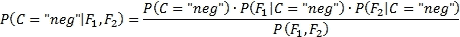
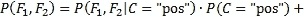
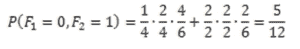
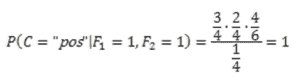
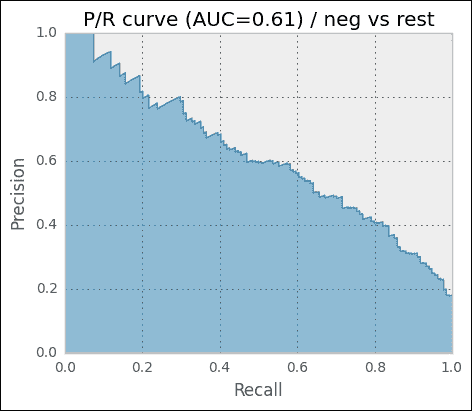

# 第六章：分类 II – 情感分析

对于公司而言，密切监控重大事件的公众反应至关重要，如产品发布或新闻稿。借助 Twitter 的实时访问和用户生成内容的易获取性，现在可以对推文进行情感分类。情感分析有时也称为意见挖掘，它是一个活跃的研究领域，许多公司已经在销售此类服务。由于这表明市场显然存在，我们有动力使用在上一章中构建的分类技术，来构建我们自己的情感分类器。

# 绘制我们的路线图

推文的情感分析特别困难，因为 Twitter 对字符数的限制为 140 个字符。这导致了特殊的语法、创造性的缩写，并且句子通常不完整。分析句子的典型方法是汇总段落中的情感信息，然后计算文档的整体情感，这种方法在这里行不通。

很显然，我们并不会尝试构建一个最先进的情感分类器。相反，我们的目标是：

+   使用这个场景作为引入另一个分类算法 **朴素贝叶斯** 的载体

+   解释 **词性标注** (**POS**) 如何工作以及它如何帮助我们

+   展示一些来自 scikit-learn 工具箱的其他小技巧，这些技巧不时会派上用场

# 获取 Twitter 数据

自然地，我们需要推文及其相应的标签，以判断一条推文是包含积极、消极还是中性情感。在本章中，我们将使用 Niek Sanders 提供的语料库，他手动标注了超过 5,000 条推文，并已授权我们在本章中使用这些数据。

为了遵守 Twitter 的服务条款，我们不会提供任何来自 Twitter 的数据，也不会展示任何真实的推文。相反，我们可以使用 Sanders 的手动标注数据，其中包含推文 ID 及其手动标注的情感，并使用他的脚本 `install.py` 获取相应的 Twitter 数据。由于该脚本与 Twitter 服务器兼容，因此下载超过 5,000 条推文的数据需要相当长的时间。所以，最好立刻开始运行它。

数据包含四个情感标签：

```py
>>> X, Y = load_sanders_data()
>>> classes = np.unique(Y)
>>> for c in classes: print("#%s: %i" % (c, sum(Y==c)))
#irrelevant: 490
#negative: 487
#neutral: 1952
#positive: 433

```

在 `load_sanders_data()` 函数中，我们将不相关和中性标签一起处理为中性，并删除所有非英语推文，最终得到 3,362 条推文。

如果你在这里获得不同的计数，那是因为在此期间，推文可能被删除或设置为私人状态。在这种情况下，你也可能会看到与接下来的章节所展示的数字和图表略有不同。

# 介绍朴素贝叶斯分类器

朴素贝叶斯可能是最优雅的机器学习算法之一，并且具有实际应用价值。尽管它的名字里有“朴素”二字，但从它的分类表现来看，它并不那么“朴素”。它对无关特征表现出强大的鲁棒性，能够巧妙地忽略它们。它学习速度快，预测也同样迅速。它不需要大量存储。那么，为什么它被称为“朴素”呢？

*朴素*一词是为了表示朴素贝叶斯所依赖的一个假设，这个假设是特征之间相互独立。实际上，特征之间很少完全独立，这也是现实世界应用中的常见问题。然而，即便假设不成立，朴素贝叶斯在实践中仍能提供很高的准确性。

## 了解贝叶斯定理

朴素贝叶斯分类的核心不过是记录每个特征给出哪一类的证据。特征的设计决定了使用哪种模型进行学习。所谓的伯努利模型只关注布尔特征：一个单词是否在推文中出现一次或多次并不重要。相反，多项式模型使用单词计数作为特征。为了简化起见，我们将使用伯努利模型来解释如何使用朴素贝叶斯进行情感分析。接下来，我们将使用多项式模型来设置和调优我们的实际分类器。

让我们假设以下变量含义，用以解释朴素贝叶斯：

| 变量 | 含义 |
| --- | --- |
|  | 这是推文的类别（正面或负面） |
|  | 单词“awesome”至少出现在推文中一次 |
|  | 单词“crazy”至少出现在推文中一次 |

在训练过程中，我们学习了朴素贝叶斯模型，这是在已知特征的情况下，某个类别的概率！了解贝叶斯定理。这个概率可以写作！了解贝叶斯定理。

由于我们无法直接估计！了解贝叶斯定理，我们采用了一个技巧，这是贝叶斯发现的：


如果我们将！了解贝叶斯定理替换为“awesome”和“crazy”两个单词的概率，并将！了解贝叶斯定理视为我们的类别！了解贝叶斯定理，我们可以得到这个关系，它帮助我们后来推导数据实例属于指定类别的概率：


这使得我们可以通过其他概率来表达 ：


我们也可以将其描述为：


*先验* 和 *证据* 容易确定：

+    是类别  的先验概率，在不知道数据的情况下。我们可以通过简单地计算所有训练数据实例中属于该类别的比例来估计这个量。

+    是特征的证据或概率  和 。

难点在于似然度的计算 。它是描述在已知数据实例的类别是  的情况下，看到特征值  和  的可能性。要估计这个，我们需要做一些思考。

## 天真假设

从概率理论中，我们还知道以下关系：


然而，单靠这一点并没有太大帮助，因为我们用另一个困难问题（估计 ）来处理一个问题（估计 ）。

然而，如果我们天真地假设  和  彼此独立，那么  简化为 ，我们可以将其写为：


将一切合并在一起，我们得到一个相当简洁的公式：


有趣的是，尽管从理论上讲，在我们有心情时随意调整假设并不正确，但在这种情况下，实际应用中它的效果出奇地好。

## 使用朴素贝叶斯进行分类

给定一个新的推文，剩下的唯一任务就是简单地计算概率：



然后选择概率较高的类别 。

由于对于两个类别，分母  是相同的，我们可以忽略它而不改变最终类别。

然而，请注意，我们现在不再计算任何真实的概率。相反，我们在估算给定证据下，哪个类别更有可能。这也是朴素贝叶斯如此稳健的另一个原因：它更关心的是哪个类别更有可能，而不是实际的概率。简而言之，我们可以写：


这只是说明我们正在计算*argmax*之后的部分，针对所有类别（在我们的例子中是*pos*和*neg*），并返回得到最高值的类别。

但是，对于以下示例，我们将坚持使用真实的概率并进行一些计算，以便看看朴素贝叶斯是如何工作的。为了简化起见，我们将假设 Twitter 只允许使用之前提到的两个单词：“awesome”和“crazy”，并且我们已经手动分类了一些推文：

| 推文 | 类别 |
| --- | --- |
| awesome | 正面推文 |
| awesome | 正面推文 |
| awesome crazy | 正面推文 |
| crazy | 正面推文 |
| crazy | 负面推文 |
| crazy | 负面推文 |

在这个例子中，我们将“crazy”这条推文同时放在正面和负面推文中，以模拟现实世界中经常会遇到的一些模糊情况（例如，“热衷足球”与“疯狂的傻瓜”）。

在这个例子中，我们共有六条推文，其中四条是正面的，二条是负面的，得出的先验概率如下：


这意味着，在不了解推文本身的任何信息的情况下，假设这条推文是正面推文是明智的。

仍然缺少的部分是计算和，这些是条件概率，分别针对两个特征和，并且是基于类别计算的。

这是通过计算我们见过具体特征的推文数，再除以已被标记为类别的推文总数来得出的。假设我们想知道在已知推文类别为正面的情况下，出现“awesome”的概率，我们将得到：


因为四条正面推文中有三条包含“awesome”这个词。显然，正面推文中不包含“awesome”的概率就是它的逆：


类似地，对于其余情况（省略没有出现该词的推文）：


为了完整性，我们还将计算证据，以便在接下来的示例推文中看到实际概率。对于和这两个具体值，我们可以按如下方式计算证据：



这导致了以下值：



现在我们有了所有的数据来分类新的推文。剩下的工作就是解析推文并提取特征：

| 推文 |  |  | 类别概率 | 分类 |
| --- | --- | --- | --- | --- |
| "极棒" | 1 | 0 |  | 正面 |
| "疯狂" | 0 | 1 |  | 负面 |
| "极棒 疯狂" | 1 | 1 |  | 正面 |

到目前为止，一切顺利。对于简单的推文分类，似乎能够给推文分配正确的标签。然而，问题仍然是，我们应该如何处理那些在训练语料库中没有出现过的词？毕竟，使用前面的公式，新词总是会被分配零的概率。

## 考虑到未见过的词和其他异常情况

当我们之前计算概率时，实际上我们是在自欺欺人。我们并没有计算真正的概率，而只是通过分数来进行粗略的估算。我们假设训练语料库会告诉我们关于真实概率的全部真相，但事实并非如此。仅仅六条推文的语料库显然不能告诉我们所有关于曾经写过的推文的信息。例如，肯定有包含“文本”一词的推文，只是我们从未见过它们。显然，我们的估算非常粗略，我们应该对此加以考虑。在实践中，这通常通过所谓的**加一平滑**来实现。

### 提示

加一平滑有时也被称为**加性平滑**或**拉普拉斯平滑**。注意，拉普拉斯平滑与拉普拉斯算子平滑无关，后者是与多边形网格的平滑相关的。如果我们不是通过`1`来平滑，而是通过可调参数`alpha<0`来平滑，那就叫做 Lidstone 平滑。

这是一种非常简单的技术，它为所有特征出现次数加 1。其基本假设是，即使我们在整个语料库中没有见过某个单词，也有可能是我们的推文样本刚好没有包含这个单词。所以，通过加一平滑，我们假装每个出现的单词比实际出现的次数多见了一次。这意味着，我们现在计算的不是，而是。

为什么我们在分母中加 2？因为我们有两个特征：“awesome”和“crazy”的出现。由于每个特征加 1，我们必须确保最终结果仍然是一个概率。事实上，我们得到的总概率为 1：


## 计算算术下溢

还有一个障碍。实际上，我们处理的概率要比在玩具示例中遇到的要小得多。通常，我们也有比仅仅两个特征更多的特征，而这些特征需要相互相乘。这将很快导致 NumPy 提供的精度不再足够：

```py
>>> import numpy as np
>>> np.set_printoptions(precision=20) # tell numpy to print out more digits (default is 8)
>>> np.array([2.48E-324])
array([ 4.94065645841246544177e-324])
>>> np.array([2.47E-324])
array([ 0.])

```

那么，`2.47E-324` 这样的数字到底有多可能出现呢？为了回答这个问题，我们只需要想象一个条件概率为 0.0001，然后将其中 65 个概率相乘（意味着我们有 65 个低概率特征值），你就会遇到算术下溢：

```py
>>> x = 0.00001
>>> x**64 # still fine
1e-320
>>> x**65 # ouch
0.0

```

Python 中的浮点数通常使用 C 中的 double 类型实现。要检查你的平台是否是这样，你可以通过以下方式进行确认：

```py
>>> import sys
>>> sys.float_info
sys.float_info(max=1.7976931348623157e+308, max_exp=1024, max_10_exp=308, min=2.2250738585072014e-308, min_exp=-1021, min_10_exp=-307, dig=15, mant_dig=53, epsilon=2.220446049250313e-16, radix=2, rounds=1)

```

为了缓解这个问题，可以切换到诸如`mpmath`（[`code.google.com/p/mpmath/`](http://code.google.com/p/mpmath/)）这样的数学库，它们支持任意精度。然而，它们的速度不够快，无法替代 NumPy。

幸运的是，有一个更好的方法可以解决这个问题，这与我们可能还记得的一个学校里的好关系有关：


如果我们将其应用到我们的案例中，我们得到如下结果：


由于概率位于 0 和 1 之间，概率的对数则位于-∞和 0 之间。别为这个困扰。较大的数值仍然是正确类别的更强指示——只是现在它们变成了负数。


但有一个注意事项：公式的分子部分（即分数上方的部分）实际上并没有对数。我们只有概率的乘积。幸运的是，在我们的案例中，我们并不关心概率的实际值。我们只是想知道哪个类别具有最高的后验概率。幸运的是，如果我们发现，那么我们也总是能得到。

快速查看前面的图表可以发现曲线是单调递增的，即从左到右时，曲线永远不会下降。所以让我们把这个带入前面提到的公式：


这将最终得到适用于两个特征的公式，它将为我们提供最佳类别，适用于我们在实践中看到的实际数据：


当然，只有两个特征的话，我们不会非常成功，所以，让我们重写代码以允许任意数量的特征：


就这样，我们准备好使用来自 scikit-learn 工具包的第一个分类器。

如前所述，我们刚刚学习了 Naïve Bayes 的伯努利模型。与布尔特征不同，我们也可以使用单词出现次数，即多项式模型。由于这个方法提供了更多的信息，通常也能带来更好的性能，因此我们会在实际数据中使用这个模型。不过，注意的是，底层的公式会有一些变化。不过，不用担心，Naïve Bayes 的基本原理依然不变。

# 创建我们的第一个分类器并进行调优

Naïve Bayes 分类器位于 `sklearn.naive_bayes` 包中。这里有不同种类的 Naïve Bayes 分类器：

+   `GaussianNB`：这个分类器假设特征呈正态分布（高斯分布）。它的一个应用场景可能是根据身高和体宽来判断性别。在我们的例子中，我们有推文文本，从中提取词频。这些显然不是高斯分布的。

+   `MultinomialNB`：这个分类器假设特征是出现次数，这正是我们接下来使用的情况，因为我们将在推文中使用词频作为特征。实际上，这个分类器也能很好地处理 TF-IDF 向量。

+   `BernoulliNB`：这个分类器与 `MultinomialNB` 类似，但更适合处理二进制单词出现与否，而非词频。

由于我们将主要关注词频，因此对于我们的目的来说，`MultinomialNB` 分类器最为合适。

## 先解决一个简单的问题

正如我们在查看推文数据时所看到的，推文不仅仅是正面或负面的。实际上，大多数推文不包含任何情感，而是中立或无关的，包含例如原始信息（例如，“新书：构建机器学习……http://link”）。这导致了四个类别。为了避免任务过于复杂，现在我们只关注正面和负面的推文。

```py
>>> # first create a Boolean list having true for tweets
>>> # that are either positive or negative
>>> pos_neg_idx = np.logical_or(Y=="positive", Y=="negative")

>>> # now use that index to filter the data and the labels
>>> X = X[pos_neg_idx]
>>> Y = Y[pos_neg_idx]

>>> # finally convert the labels themselves into Boolean
>>> Y = Y=="positive"

```

现在，我们在`X`中有原始推文文本，在`Y`中有二元分类，`0`表示负面推文，`1`表示正面推文。

我们刚刚提到过，我们将使用单词出现次数作为特征。但我们不会直接使用它们的原始形式，而是使用我们的强力工具`TfidfVectorizer`，将原始推文文本转换为 TF-IDF 特征值，然后将其与标签一起用于训练我们的第一个分类器。为了方便，我们将使用`Pipeline`类，它允许我们将向量化器和分类器连接在一起，并提供相同的接口：

```py
from sklearn.feature_extraction.text import TfidfVectorizer
from sklearn.naive_bayes import MultinomialNB
from sklearn.pipeline import Pipeline

def create_ngram_model():
 tfidf_ngrams = TfidfVectorizer(ngram_range=(1, 3), analyzer="word", binary=False)
 clf = MultinomialNB()
 return Pipeline([('vect', tfidf_ngrams), ('clf', clf)])

```

`create_ngram_model()`返回的`Pipeline`实例现在可以像普通分类器一样用于拟合和预测。

由于我们没有那么多数据，应该进行交叉验证。然而，这一次，我们不会使用`KFold`（它将数据划分为连续的折叠），而是使用`ShuffleSplit`。它会将数据打乱，但不会阻止相同的数据实例出现在多个折叠中。对于每个折叠，我们会跟踪精准率-召回率曲线下的面积和准确度。

为了保持实验的灵活性，我们将一切封装在一个`train_model()`函数中，该函数接受一个创建分类器的函数作为参数。

```py
from sklearn.metrics import precision_recall_curve, auc
from sklearn.cross_validation import ShuffleSplit

def train_model(clf_factory, X, Y):
 # setting random_state to get deterministic behavior
 cv = ShuffleSplit(n=len(X), n_iter=10, test_size=0.3, random_state=0)

 scores = []
 pr_scores = []

 for train, test in cv:
 X_train, y_train = X[train], Y[train]
 X_test, y_test = X[test], Y[test]

 clf = clf_factory()
 clf.fit(X_train, y_train)

 train_score = clf.score(X_train, y_train)
 test_score = clf.score(X_test, y_test)

 scores.append(test_score)
 proba = clf.predict_proba(X_test)

 precision, recall, pr_thresholds = precision_recall_curve(y_test, proba[:,1])

 pr_scores.append(auc(recall, precision))

 summary = (np.mean(scores), np.std(scores),
np.mean(pr_scores), np.std(pr_scores))
 print("%.3f\t%.3f\t%.3f\t%.3f" % summary)

```

将所有内容组合起来，我们可以训练我们的第一个模型：

```py
>>> X, Y = load_sanders_data()
>>> pos_neg_idx = np.logical_or(Y=="positive", Y=="negative")
>>> X = X[pos_neg_idx]
>>> Y = Y[pos_neg_idx]
>>> Y = Y=="positive"
>>> train_model(create_ngram_model, X, Y)
0.788   0.024   0.882   0.036

```

使用朴素贝叶斯和向量化的 TF-IDF 三元组特征，我们的第一次尝试得到了 78.8%的准确率和 88.2%的平均 P/R AUC。当我们查看中位数的 P/R 图表（即表现最接近平均水平的训练/测试拆分）时，它表现出比我们在上一章看到的图表更加令人鼓舞的行为。


一开始，结果相当令人鼓舞。当我们意识到在情感分类任务中，100%的准确率可能永远无法实现时，结果就变得更加令人印象深刻。对于某些推文，甚至人类在分类标签上也往往达不到一致。

## 使用所有类别

我们再次简化了任务，因为我们只使用了正面或负面的推文。这意味着，我们假设有一个完美的分类器，首先对推文是否包含情感进行分类，然后将结果传递给我们的朴素贝叶斯分类器。

那么，如果我们还对推文是否包含任何情感进行分类，我们的表现如何呢？为了找出答案，我们首先编写一个便捷函数，返回一个修改后的类别数组，提供我们希望解释为正面的情感列表：

```py
def tweak_labels(Y, pos_sent_list):
 pos = Y==pos_sent_list[0]
 for sent_label in pos_sent_list[1:]:
 pos |= Y==sent_label

 Y = np.zeros(Y.shape[0])
 Y[pos] = 1
 Y = Y.astype(int)

return Y

```

请注意，我们现在谈论的是两个不同的正面情感。推文的情感可以是正面的，这与训练数据的类别不同。例如，如果我们想要了解我们如何区分具有情感的推文和中立推文，我们可以这样做：

```py
>>> Y = tweak_labels(Y, ["positive", "negative"])

```

在`Y`中，对于所有正面或负面的推文，我们现在有`1`（正类），对于中立和无关的推文，我们有`0`（负类）。

```py
>>> train_model(create_ngram_model, X, Y, plot=True)
0.750   0.012   0.659   0.023

```

看一下以下的图表：


如预期的那样，P/R AUC 显著下降，目前只有 66%。准确率仍然很高，但这仅仅是因为我们有一个高度不平衡的数据集。在 3,362 条推文中，只有 920 条是正面或负面的，占约 27%。这意味着，如果我们创建一个总是将推文分类为不包含任何情感的分类器，我们就已经有 73%的准确率了。这是另一个在训练和测试数据不平衡时，总是查看精度和召回率的案例。

那么，朴素贝叶斯分类器在将正面推文与其他推文以及负面推文与其他推文进行分类时表现如何呢？一句话：差。

```py
== Pos vs. rest ==
0.873   0.009   0.305   0.026
== Neg vs. rest ==
0.861   0.006   0.497   0.026
```

如果你问我，这几乎是不可用的。看下面的 P/R 曲线，我们也会发现没有可用的精度/召回率权衡，就像我们在上一章做的那样：


## 调整分类器的参数

当然，我们还没有充分探索当前的设置，应该进行更多的调查。大致有两个领域，我们可以调整参数：`TfidfVectorizer`和`MultinomialNB`。由于我们对哪个领域的探索没有直觉，让我们尝试分配参数值。

我们将首先查看`TfidfVectorizer`参数：

+   使用不同的 NGram 设置：

    +   单字（1,1）

    +   单字和双字（1,2）

    +   单字、双字和三字（1,3）

+   调整`min_df`：1 或 2

+   使用`use_idf`和`smooth_idf`探索 IDF 在 TF-IDF 中的影响：`False`或`True`

+   是否移除停用词，通过将`stop_words`设置为`english`或`None`

+   是否使用词频的对数值（`sublinear_tf`）

+   是否跟踪词频，还是仅跟踪词是否出现，通过将`binary`设置为`True`或`False`

现在我们将查看`MultinomialNB`分类器：

+   通过设置`alpha`来选择平滑方法：

    +   加一平滑或拉普拉斯平滑：1

    +   Lidstone 平滑：0.01，0.05，0.1，或 0.5

    +   无平滑：0

一种简单的方法是为所有合理的探索值训练一个分类器，同时保持其他参数不变并检查分类器的结果。由于我们不知道这些参数是否相互影响，正确的方法是为所有可能的参数值组合训练一个分类器。显然，这对我们来说太繁琐了。

因为这种参数探索在机器学习任务中经常发生，scikit-learn 为此提供了一个专门的类，叫做`GridSearchCV`。它接受一个估算器（具有分类器类似接口的实例），在我们这个案例中将是`Pipeline`实例，并且接受一个包含参数及其潜在值的字典。

`GridSearchCV`期望字典的键遵循特定的格式，以便能够为正确的估算器设置参数。格式如下：

```py
<estimator>__<subestimator>__...__<param_name>
```

例如，如果我们想指定要探索的`TfidfVectorizer`（在`Pipeline`描述中称为`vect`）的`min_df`参数的期望值，我们需要这样说：

```py
param_grid={"vect__ngram_range"=[(1, 1), (1, 2), (1, 3)]}

```

这将告诉`GridSearchCV`尝试将一元组到三元组作为`TfidfVectorizer`的`ngram_range`参数的候选值。

然后，它使用所有可能的参数值组合训练估算器。在这里，我们确保它在训练数据的随机样本上进行训练，使用`ShuffleSplit`，它生成随机的训练/测试分割迭代器。最后，它提供最佳估算器，作为成员变量`best_estimator_`。

由于我们希望将返回的最佳分类器与当前的最佳分类器进行比较，我们需要以相同的方式评估它。因此，我们可以通过`cv`参数传递`ShuffleSplit`实例（因此，`GridSearchCV`中的`CV`）。

最后一块缺失的部分是定义`GridSearchCV`应如何确定最佳估算器。这可以通过提供期望的评分函数来完成（惊讶！）传递给`score_func`参数。我们可以自己编写一个，或者从`sklearn.metrics`包中选择一个。我们肯定不应该使用`metric.accuracy`，因为我们的数据存在类别不平衡（包含情感的推文远少于中立推文）。相反，我们希望对两个类别都有良好的精度和召回率，即具有情感的推文和没有正面或负面观点的推文。一种结合精度和召回率的评价指标是所谓的**F 值**，它在`metrics.f1_score`中实现：


将所有内容整合后，我们得到以下代码：

```py
from sklearn.grid_search import GridSearchCV
from sklearn.metrics import f1_score

def grid_search_model(clf_factory, X, Y):
 cv = ShuffleSplit(
 n=len(X), n_iter=10, test_size=0.3,random_state=0)

 param_grid = dict(vect__ngram_range=[(1, 1), (1, 2), (1, 3)],
 vect__min_df=[1, 2],
 vect__stop_words=[None, "english"],
 vect__smooth_idf=[False, True],
 vect__use_idf=[False, True],
 vect__sublinear_tf=[False, True],
 vect__binary=[False, True],
 clf__alpha=[0, 0.01, 0.05, 0.1, 0.5, 1],
 )

 grid_search = GridSearchCV(clf_factory(),
 param_grid=param_grid,
 cv=cv,
 score_func=f1_score,
 verbose=10)
 grid_search.fit(X, Y) 

 return grid_search.best_estimator_

```

执行此操作时我们需要耐心：

```py
clf = grid_search_model(create_ngram_model, X, Y)
print(clf)

```

由于我们刚刚请求了一个参数，覆盖![调整分类器的参数]的参数组合，每种组合都将在 10 折交叉验证中进行训练：

```py
... waiting some hours  ...
Pipeline(clf=MultinomialNB(
alpha=0.01, class_weight=None, fit_prior=True),
clf__alpha=0.01, 
clf__class_weight=None, 
clf__fit_prior=True,
vect=TfidfVectorizer(
analyzer=word, binary=False,
 charset=utf-8, charset_error=strict, 
dtype=<type 'long'>,input=content,
lowercase=True, max_df=1.0,
max_features=None, max_n=None,
min_df=1, min_n=None, ngram_range=(1, 2),
norm=l2, preprocessor=None, smooth_idf=False,
stop_words=None,strip_accents=None, 
sublinear_tf=True,token_pattern=(?u)\b\w\w+\b,
token_processor=None, tokenizer=None, 
use_idf=False, vocabulary=None),
vect__analyzer=word, vect__binary=False, 
vect__charset=utf-8,
vect__charset_error=strict, 
vect__dtype=<type 'long'>,
vect__input=content, vect__lowercase=True, 
vect__max_df=1.0,vect__max_features=None, 
vect__max_n=None, vect__min_df=1,
vect__min_n=None, vect__ngram_range=(1, 2), 
vect__norm=l2, vect__preprocessor=None, 
vect__smooth_idf=False, vect__stop_words=None, 
vect__strip_accents=None, vect__sublinear_tf=True,
vect__token_pattern=(?u)\b\w\w+\b,
vect__token_processor=None, vect__tokenizer=None,
vect__use_idf=False, vect__vocabulary=None)
0.795  0.007  0.702  0.028

```

最佳估算器确实将 P/R AUC 提高了近 3.3 个百分点，现在为 70.2，设置如前面代码所示。

此外，针对正面推文与其他推文的比较，负面推文与其他推文的比较，若我们配置向量化器和分类器使用刚刚发现的参数，结果会得到显著改善：

```py
== Pos vs. rest ==
0.889   0.010   0.509   0.041
== Neg vs. rest ==
0.886   0.007   0.615   0.035

```

看一下以下图表：



的确，P/R 曲线看起来好多了（注意，这些图是来自于不同折分类器的中位数，因此 AUC 值略有差异）。不过，我们可能仍然不会使用这些分类器。是时候换点新的东西了…

# 清洗推文

新的约束导致了新的形式。Twitter 在这方面也不例外。因为文本必须适应 140 个字符，人们自然会发展出新的语言简写，以用更少的字符表达相同的意思。到目前为止，我们忽略了各种各样的表情符号和缩写。让我们看看在考虑到这些因素后，我们能做出多大的改进。为了这个目标，我们将需要提供我们自己的`preprocessor()`来处理`TfidfVectorizer`。

首先，我们在字典中定义一系列常见的表情符号及其替换词。虽然我们可以找到更多不同的替换词，但我们选择明显的正面或负面词汇来帮助分类器：

```py
emo_repl = {
 # positive emoticons
 "&lt;3": " good ",
 ":d": " good ", # :D in lower case
 ":dd": " good ", # :DD in lower case
 "8)": " good ",
 ":-)": " good ",
 ":)": " good ",
 ";)": " good ",
 "(-:": " good ",
 "(:": " good ",

 # negative emoticons:
 ":/": " bad ",
 ":&gt;": " sad ",
 ":')": " sad ",
 ":-(": " bad ",
 ":(": " bad ",
 ":S": " bad ",
 ":-S": " bad ",
 }

# make sure that e.g. :dd is replaced before :d
emo_repl_order = [k for (k_len,k) in reversed(sorted([(len(k),k) for k in emo_repl.keys()]))]

```

然后，我们将缩写定义为正则表达式，并给出它们的扩展（`\b`表示单词边界）：

```py
re_repl = {
r"\br\b": "are",
r"\bu\b": "you",
r"\bhaha\b": "ha",
r"\bhahaha\b": "ha",
r"\bdon't\b": "do not",
r"\bdoesn't\b": "does not",
r"\bdidn't\b": "did not",
r"\bhasn't\b": "has not",
r"\bhaven't\b": "have not",
r"\bhadn't\b": "had not",
r"\bwon't\b": "will not",
r"\bwouldn't\b": "would not",
r"\bcan't\b": "can not",
r"\bcannot\b": "can not",
 }

def create_ngram_model(params=None):
 def preprocessor(tweet):
 tweet = tweet.lower()
 for k in emo_repl_order:
 tweet = tweet.replace(k, emo_repl[k])
 for r, repl in re_repl.items():
 tweet = re.sub(r, repl, tweet)

 return tweet

 tfidf_ngrams = TfidfVectorizer(preprocessor=preprocessor,
analyzer="word")
 # ...

```

当然，这里可以使用更多的缩写。但仅凭这一有限的集合，我们已经能在情感与非情感的分类上提高了半个点，目前准确率为 70.7%：

```py
== Pos vs. neg ==
0.808   0.024   0.885   0.029
== Pos/neg vs. irrelevant/neutral ==
0.793   0.010   0.685   0.024
== Pos vs. rest ==
0.890   0.011   0.517   0.041
== Neg vs. rest ==
0.886   0.006   0.624   0.033

```

# 考虑单词类型

到目前为止，我们的期望是仅仅使用单词本身（采用袋装词汇方法）就足够了。然而，仅凭我们的直觉，可能中立的推文包含更多名词，而积极或消极的推文则更加多彩，包含更多形容词和动词。那么，如果我们也利用推文中的语言学信息呢？如果我们能找出推文中有多少单词是名词、动词、形容词等，分类器也许能够将这一信息纳入考虑。

## 确定单词类型

这就是词性标注，或 POS 标注的核心。POS 标注器解析一个完整的句子，目的是将其排列成依存树，其中每个节点对应一个单词，父子关系决定了该单词依赖哪个单词。通过这棵树，它可以做出更为明智的决策，例如判断“book”是名词（“这是一本好书。”）还是动词（“你能帮我订机票吗？”）。

你可能已经猜到，NLTK 在这个领域也将发挥作用。的确，它提供了各种各样的解析器和标注器。我们将使用的 POS 标注器`nltk.pos_tag()`实际上是一个完整的分类器，经过使用 Penn Treebank 项目中的人工标注句子训练而成（[`www.cis.upenn.edu/~treebank`](http://www.cis.upenn.edu/~treebank)）。它的输入是一个单词标记列表，输出是一个包含元组的列表，每个元组包含原句的部分内容及其词性标注。

```py
>>> import nltk
>>> nltk.pos_tag(nltk.word_tokenize("This is a good book."))
[('This', 'DT'), ('is', 'VBZ'), ('a', 'DT'), ('good', 'JJ'), ('book', 'NN'), ('.', '.')]
>>> nltk.pos_tag(nltk.word_tokenize("Could you please book the flight?"))
[('Could', 'MD'), ('you', 'PRP'), ('please', 'VB'), ('book', 'NN'), ('the', 'DT'), ('flight', 'NN'), ('?', '.')]

```

词性标注缩写来自于 Penn Treebank（改编自[`www.anc.org/OANC/penn.html`](http://www.anc.org/OANC/penn.html)）：

| POS 标签 | 描述 | 示例 |
| --- | --- | --- |
| CC | 并列连词 | 或者 |
| CD | 基数词 | 2，第二 |
| DT | 限定词 | 这 |
| EX | 存在性 there | *那里* 有 |
| FW | 外来词 | 幼儿园 |
| IN | 介词/从属连词 | 在，的，像 |
| JJ | 形容词 | 酷 |
| JJR | 形容词，比较级 | 更酷 |
| JJS | 形容词，最高级 | 最酷的 |
| LS | 列表标记 | 1) |
| MD | 情态动词 | 可以，将 |
| NN | 名词，单数或不可数名词 | 书 |
| NNS | 名词复数 | 书籍 |
| NNP | 专有名词，单数 | Sean |
| NNPS | 专有名词，复数 | 维京人 |
| PDT | 预定限定词 | 两个男孩 |
| POS | 所有格结尾 | 朋友的 |
| PRP | 人称代词 | 我，他，它 |
| PRP$ | 所有格代词 | 我的，他的 |
| RB | 副词 | 然而，通常，当然，这里，好 |
| RBR | 副词，比较级 | 更好 |
| RBS | 副词，最高级 | 最好 |
| RP | 小品词 | 放*弃* |
| TO | 到 | *到* 去，*到* 他那里 |
| UH | 感叹词 | 嗯嗯 |
| VB | 动词，基本形式 | 拿 |
| VBD | 动词，过去时 | 拿 |
| VBG | 动词，动名词/现在分词 | 拿 |
| VBN | 动词，过去分词 | 已拿 |
| VBP | 动词，单数现在时，非第三人称 | 拿 |
| VBZ | 动词，第三人称单数现在时 | 拿 |
| WDT | 疑问限定词 | 哪个 |
| WP | 疑问代词 | 谁，什么 |
| WP$ | 所有格疑问代词 | 谁的 |
| WRB | 疑问副词 | 哪里，什么时候 |

通过这些标签，从`pos_tag()`的输出中过滤出所需的标签是相当容易的。我们只需数出所有标签以`NN`开头的名词，`VB`开头的动词，`JJ`开头的形容词，和`RB`开头的副词。

## 使用 SentiWordNet 成功作弊

虽然前面提到的语言学信息最有可能帮助我们，但我们可以做得更好来收获它：SentiWordNet ([`sentiwordnet.isti.cnr.it`](http://sentiwordnet.isti.cnr.it))。简单来说，它是一个 13MB 的文件，为大多数英语单词分配了正负值。更复杂的说，对于每个同义词集合，它记录了正面和负面的情感值。以下是一些例子：

| POS | ID | PosScore | NegScore | 同义词集合 | 描述 |
| --- | --- | --- | --- | --- | --- |
| a | 00311354 | 0.25 | 0.125 | 勤奋的#1 | 以细心和努力为特征；"做了一个勤奋的尝试来修理电视机" |
| a | 00311663 | 0 | 0.5 | 粗心#1 | 特征是缺乏关注、考虑、预见或彻底性；不小心… |
| n | 03563710 | 0 | 0 | 移植物#1 | 永久性地植入组织的假体 |
| v | 00362128 | 0 | 0 | kink#2 曲线#5 卷曲#1 | 形成弯曲、曲线或扭结；"雪茄烟雾在天花板上卷曲" |

利用**POS**列中的信息，我们能够区分名词"book"和动词"book"。`PosScore`和`NegScore`一起帮助我们确定单词的中立性，即 1-PosScore-NegScore。`SynsetTerms`列出该集合中所有的同义词。对于我们的任务来说，我们可以忽略**ID**和**Description**列。

同义词集术语后面会有一个数字，因为有些词会出现在多个同义词集中。例如，"fantasize"表达了两种截然不同的意思，因此会导致不同的分数：

| POS | ID | PosScore | NegScore | SynsetTerms | Description |
| --- | --- | --- | --- | --- | --- |
| v | 01636859 | 0.375 | 0 | fantasize#2 fantasise#2 | 在脑海中描绘；"他在幻想理想的妻子" |
| v | 01637368 | 0 | 0.125 | fantasy#1 fantasize#1 fantasise#1 | 沉溺于幻想；"他说他计划创办自己的公司时就是在幻想" |

为了找出应该使用哪些同义词集，我们需要真正理解推文的含义，这超出了本章的范围。专注于这一挑战的研究领域叫做词义消歧。在我们的任务中，我们走捷径，简单地计算所有同义词集中的分数平均值，某个词项出现在这些同义词集中。例如，"fantasize"的`PosScore`为 0.1875，`NegScore`为 0.0625。

以下函数`load_sent_word_net()`会为我们完成所有这些工作，并返回一个字典，其中键是形如*词性/词*的字符串，例如 n/implant，值为正负分数：

```py
import csv, collections

def load_sent_word_net():
 # making our life easier by using a dictionary that
 # automatically creates an empty list whenever we access
 # a not yet existing key
 sent_scores = collections.defaultdict(list)

 with open(os.path.join(DATA_DIR, SentiWordNet_3.0.0_20130122.txt"), "r") as csvfile:
 reader = csv.reader(csvfile, delimiter='\t',
quotechar='"')
 for line in reader:
 if line[0].startswith("#"):
 continue
 if len(line)==1:
 continue

 POS, ID, PosScore, NegScore, SynsetTerms, Gloss = line
 if len(POS)==0 or len(ID)==0:
 continue
 for term in SynsetTerms.split(" "):
 # drop number at the end of every term
 term = term.split("#")[0] 
 term = term.replace("-", " ").replace("_", " ")
 key = "%s/%s"%(POS, term.split("#")[0])
 sent_scores[key].append((float(PosScore), 
float(NegScore)))

 for key, value in sent_scores.items():
 sent_scores[key] = np.mean(value, axis=0)

 return sent_scores

```

## 我们的第一个估算器

现在，我们已经准备好创建我们自己的第一个特征提取器。最方便的方式是从`BaseEstimator`继承。它要求我们实现以下三个方法：

+   `get_feature_names()`: 该函数返回一个字符串列表，表示我们将在`transform()`中返回的特征。

+   `fit(document, y=None)`: 由于我们没有实现分类器，因此可以忽略这一点，直接返回 self。

+   `transform(documents)`: 该方法返回`numpy.array()`，包含形状为(`len(documents), len(get_feature_names)`)的数组。也就是说，对于`documents`中的每个文档，它必须为`get_feature_names()`中的每个特征名称返回一个值。

下面是实现：

```py
sent_word_net = load_sent_word_net()

class LinguisticVectorizer(BaseEstimator):
 def get_feature_names(self):
 return np.array(['sent_neut', 'sent_pos', 'sent_neg',
 'nouns', 'adjectives', 'verbs', 'adverbs',
 'allcaps', 'exclamation', 'question', 'hashtag', 'mentioning'])

 # we don't fit here but need to return the reference
 # so that it can be used like fit(d).transform(d)
 def fit(self, documents, y=None):
 return self

 def _get_sentiments(self, d):
 sent = tuple(d.split())
 tagged = nltk.pos_tag(sent)

 pos_vals = []
 neg_vals = []

 nouns = 0.
 adjectives = 0.
 verbs = 0.
 adverbs = 0.

 for w,t in tagged:
 p, n = 0,0
 sent_pos_type = None
 if t.startswith("NN"):
 sent_pos_type = "n"
 nouns += 1
 elif t.startswith("JJ"):
 sent_pos_type = "a"
 adjectives += 1
 elif t.startswith("VB"):
 sent_pos_type = "v"
 verbs += 1
 elif t.startswith("RB"):
 sent_pos_type = "r"
 adverbs += 1

 if sent_pos_type is not None:
 sent_word = "%s/%s" % (sent_pos_type, w)

 if sent_word in sent_word_net:
 p,n = sent_word_net[sent_word]

 pos_vals.append(p)
 neg_vals.append(n)

 l = len(sent)
 avg_pos_val = np.mean(pos_vals)
 avg_neg_val = np.mean(neg_vals)
 return [1-avg_pos_val-avg_neg_val, avg_pos_val, avg_neg_val,
nouns/l, adjectives/l, verbs/l, adverbs/l]

 def transform(self, documents):
 obj_val, pos_val, neg_val, nouns, adjectives, \
verbs, adverbs = np.array([self._get_sentiments(d) \
for d in documents]).T

 allcaps = []
 exclamation = []
 question = []
 hashtag = []
 mentioning = []

 for d in documents:
 allcaps.append(np.sum([t.isupper() \
 for t in d.split() if len(t)>2]))

 exclamation.append(d.count("!"))
 question.append(d.count("?"))
 hashtag.append(d.count("#"))
 mentioning.append(d.count("@"))

 result = np.array([obj_val, pos_val, neg_val, nouns, adjectives, verbs, adverbs, allcaps, exclamation, question, 
hashtag, mentioning]).T

 return result

```

## 整合所有内容

然而，仅仅使用这些语言特征而不考虑单词本身，是无法带我们走得很远的。因此，我们必须将`TfidfVectorizer`参数与语言特征结合起来。可以使用 scikit-learn 的`FeatureUnion`类来实现这一点。它的初始化方式与`Pipeline`相同；但是，`FeatureUnion`不同于按顺序评估估算器并将每个估算器的输出传递给下一个估算器，它是并行处理的，并在之后将输出向量合并。

```py
def create_union_model(params=None):
 def preprocessor(tweet):
 tweet = tweet.lower()

 for k in emo_repl_order:
 tweet = tweet.replace(k, emo_repl[k])
 for r, repl in re_repl.items():
 tweet = re.sub(r, repl, tweet)

 return tweet.replace("-", " ").replace("_", " ")

 tfidf_ngrams = TfidfVectorizer(preprocessor=preprocessor, analyzer="word")
 ling_stats = LinguisticVectorizer()
 all_features = FeatureUnion([('ling', ling_stats), ('tfidf', tfidf_ngrams)])
 clf = MultinomialNB()
 pipeline = Pipeline([('all', all_features), ('clf', clf)])

 if params:
 pipeline.set_params(**params)

 return pipeline

```

在结合特征提取器上进行训练和测试，可以使正负样本的平均 P/R AUC 提高 0.4 个百分点：

```py
== Pos vs. neg ==
0.810   0.023   0.890   0.025
== Pos/neg vs. irrelevant/neutral ==
0.791   0.007   0.691   0.022
== Pos vs. rest ==
0.890   0.011   0.529   0.035
== Neg vs. rest ==
0.883   0.007   0.617   0.033
time spent: 214.12578797340393

```

根据这些结果，我们可能不想使用正向对比休息和负向对比休息的分类器，而是首先使用一个分类器来确定推文是否包含情感（正向/负向与无关/中立），然后，如果包含情感，再使用正向与负向分类器来确定具体情感。

# 总结

恭喜你坚持到最后！我们一起学习了朴素贝叶斯如何工作，以及它为什么并不那么“天真”。尤其是在训练集数据不足以学习类别概率空间中的所有细分时，朴素贝叶斯在泛化方面表现出色。我们学习了如何将其应用于推文，并且清理粗糙的推文文本帮助很大。最后，我们意识到适当的“作弊”（前提是我们已经做了足够的工作）是可以接受的，尤其是当它带来分类器性能的提升时，正如我们在使用`SentiWordNet`时所经历的那样。

在下一章中，我们将讨论回归分析。
