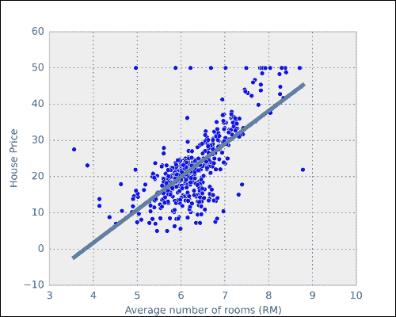

# 第七章：回归

你可能在高中数学课上学过回归分析。你学到的具体方法可能就是所谓的**普通最小二乘**（**OLS**）回归。这个已有 200 年历史的技术计算速度很快，并且可以应用于许多现实世界的问题。本章将首先回顾这一方法，并展示它是如何在 scikit-learn 中实现的。

然而，对于某些问题，这种方法是不够的。特别是当我们拥有许多特征时，这种方法就显得不够用了，尤其是在特征数比数据点数更多的情况下，这种方法完全无法工作。在这些情况下，我们需要更先进的方法。这些方法非常现代，过去十年取得了重大进展，名字如 Lasso、Ridge 或 ElasticNets。我们将详细介绍这些方法，它们也可以在 scikit-learn 中使用。

# 使用回归预测房价

我们从一个简单的问题开始——预测波士顿的房价；这是一个可以使用公开数据集的问题。我们得到了一些人口统计学和地理信息，如犯罪率或邻里的师生比例。目标是预测某个地区房屋的中位数价值。像往常一样，我们有一些训练数据，答案是已知的。

这是 scikit-learn 自带的内置数据集之一，因此非常容易将数据加载到内存中：

```py
>>> from sklearn.datasets import load_boston
>>> boston = load_boston()

```

`boston` 对象包含多个属性；特别地，`boston.data` 包含输入数据，`boston.target` 包含房价。

我们将从一个简单的一维回归开始，尝试用一个特征来回归房价，这个特征是每个住宅区域的平均房间数，存储在位置 `5`（你可以查阅 `boston.DESCR` 和 `boston.feature_names` 以获取数据的详细信息）：

```py
>>> from matplotlib import pyplot as plt
>>> plt.scatter(boston.data[:,5], boston.target, color='r')

```

`boston.target` 属性包含了平均房价（我们的目标变量）。我们可以使用你可能在高中时学到的标准最小二乘回归。我们第一次尝试的代码如下：

```py
>>> from sklearn.linear_model import LinearRegression
>>> lr = LinearRegression()

```

我们从 `sklearn.linear_model` 模块导入 `LinearRegression` 并构造一个 `LinearRegression` 对象。这个对象的行为与我们之前使用的 scikit-learn 分类器对象类似。

```py
>>> x = boston.data[:,5]
>>> y = boston.target
>>> x = np.transpose(np.atleast_2d(x))
>>> lr.fit(x, y)
>>> y_predicted = lr.predict(x)

```

这段代码中唯一不显而易见的行是对 `np.atleast_2d` 的调用，它将 `x` 从一维数组转换为二维数组。这个转换是必要的，因为 `fit` 方法期望其第一个参数是一个二维数组。最后，为了确保维度正确，我们需要对这个数组进行转置。

请注意，我们在 `LinearRegression` 对象上调用了名为 `fit` 和 `predict` 的方法，就像之前使用分类器对象时一样，尽管现在我们执行的是回归操作。这种 API 的一致性是 scikit-learn 的一个优点。



上图展示了所有的点（以点表示）和我们的拟合曲线（实线）。我们可以看到，视觉效果很好，除了少数几个离群点。

然而，从理想角度来看，我们希望定量衡量拟合的好坏。这对于能够比较不同方法非常关键。为此，我们可以测量预测值与真实值之间的接近程度。为此，我们可以使用`sklearn.metrics`模块中的`mean_squared_error`函数：

```py
>>> from sklearn.metrics import mean_squared_error

```

该函数有两个参数，真实值和预测值，如下所示：

```py
>>> mse = mean_squared_error(y, lr.predict(x))
>>> print("Mean squared error (of training data): {:.3}".format(mse))
Mean squared error (of training data): 58.4

```

这个值有时可能很难解读，最好取其平方根，得到**均方根误差**（**RMSE**）：

```py
>>> rmse = np.sqrt(mse)
>>> print("RMSE (of training data): {:.3}".format(rmse))
RMSE (of training data): 6.6

```

使用 RMSE 的一个优势是，我们可以通过将其乘以二，快速获得误差的粗略估计。在我们的案例中，我们可以预计估算的价格与实际价格之间的差异最多为 1.3 万美元。

### 提示

**均方根误差与预测**

均方根误差大致对应于标准差的估计。由于大多数数据距离均值最多两个标准差，因此我们可以将 RMSE 翻倍来获得一个粗略的置信区间。如果误差符合正态分布，这种方法完全有效，但即使误差不是正态分布，它通常也大致正确。

像 6.6 这样的数字仍然很难直观理解。这是一个好的预测吗？回答这个问题的一种可能方法是将其与最简单的基准模型——常数模型进行比较。如果我们对输入一无所知，最好的方法就是预测输出始终是`y`的平均值。然后，我们可以将这个模型的均方误差与零模型的均方误差进行比较。这个思想在**决定系数**中得到了形式化定义，其计算公式如下：


在这个公式中，*y[i]*表示索引为*i*的元素的值，而是回归模型为同一元素提供的估计值。最后，是*y*的均值，代表着*零模型*，即始终返回相同值的模型。这个公式大致等同于首先计算均方误差与输出方差的比率，最后计算 1 减去这个比率。这样，完美的模型得分为 1，而零模型得分为 0。请注意，可能会得到负分数，这意味着模型非常糟糕，以至于使用均值作为预测值更好。

决定系数可以使用`sklearn.metrics`模块中的`r2_score`来获得：

```py
>>> from sklearn.metrics import r2_score
>>> r2 = r2_score(y, lr.predict(x))
>>> print("R2 (on training data): {:.2}".format(r2))
R2 (on training data): 0.31

```

这个指标也叫做 R²得分。如果你使用线性回归并在训练数据上评估误差，那么它确实对应于相关系数 R 的平方。然而，这个指标更为通用，正如我们讨论的那样，可能会返回一个负值。

计算决定系数的另一种方法是使用`LinearRegression`对象的`score`方法：

```py
>>> r2 = lr.score(x,y)

```

## 多维回归

到目前为止，我们只使用了一个变量进行预测，即每个住宅的房间数。接下来，我们将使用所有数据来拟合模型，使用多维回归。我们现在尝试基于多个输入预测一个单一的输出（平均房价）。

代码看起来和之前非常相似。实际上，它现在更简单了，因为我们可以直接将`boston.data`的值传递给`fit`方法：

```py
>>> x = boston.data
>>> y = boston.target
>>> lr.fit(x, y)

```

使用所有输入变量，均方根误差仅为 4.7，对应的决定系数为 0.74。这比我们之前的结果要好，说明额外的变量确实有帮助。我们不再能像之前那样轻松显示回归线，因为我们有一个 14 维的回归超平面，而不是一条单独的直线。

然而，我们可以绘制预测值与实际值的对比图。代码如下：

```py
>>> p = lr.predict(x)
>>> plt.scatter(p, y)
>>> plt.xlabel('Predicted price')
>>> plt.ylabel('Actual price')
>>> plt.plot([y.min(), y.max()], [[y.min()], [y.max()]])

```

最后一行绘制了一条对角线，表示完美一致的情况。这有助于可视化。结果如下面的图所示，其中实线表示对角线（如果预测与真实值完全一致，所有点都会落在这条线上）：


## 回归问题的交叉验证

如果你还记得我们首次介绍分类时，强调了交叉验证在检验预测质量中的重要性。在回归中，这并不总是做的。事实上，到目前为止，我们在本章中只讨论了训练误差。如果你想自信地推断模型的泛化能力，这是一个错误。因为普通最小二乘法是一个非常简单的模型，这通常不是一个非常严重的错误。换句话说，过拟合的程度较轻。然而，我们仍然应该通过经验来测试这一点，这可以通过 scikit-learn 轻松实现。

我们将使用`Kfold`类来构建一个 5 折交叉验证循环，测试线性回归的泛化能力：

```py
>>> from sklearn.cross_validation import Kfold
>>> kf = KFold(len(x), n_folds=5)
>>> p = np.zeros_like(y)
>>> for train,test in kf:
...    lr.fit(x[train], y[train])
...    p[test] = lr.predict(x[test])
>>> rmse_cv = np.sqrt(mean_squared_error(p, y))
>>> print('RMSE on 5-fold CV: {:.2}'.format(rmse_cv))
RMSE on 5-fold CV: 5.6

```

使用交叉验证，我们得到一个更为保守的估计（即，误差更大）：`5.6`。与分类问题一样，交叉验证的估计是我们如何将模型泛化到未见数据的更好估计。

普通最小二乘法在学习阶段很快，并且返回一个简单的模型，在预测时也非常快。因此，它通常应该是回归问题中你首先尝试的模型。然而，我们现在将看到更先进的方法，并了解为什么有时它们更为优越。

# 惩罚或正则化回归

本节介绍了惩罚回归，也叫做**正则化回归**，它是回归模型的一个重要类别。

在普通回归中，返回的拟合结果是训练数据上的最佳拟合。这可能导致过拟合。惩罚意味着我们为参数值的过度自信添加惩罚。因此，我们接受稍差的拟合，以便拥有一个更简单的模型。

另一种思考方式是，将默认设定为输入变量与输出预测之间没有关系。当我们拥有数据时，我们会改变这一观点，但添加惩罚意味着我们需要更多数据来说服我们，这确实是一个强关系。

### 提示

**惩罚回归是关于权衡的**

惩罚回归是偏差-方差权衡的另一个例子。在使用惩罚时，训练数据的拟合度会变差，因为我们引入了偏差。另一方面，我们减少了方差，倾向于避免过拟合。因此，整体结果可能更好地推广到未见过的（测试）数据。

## L1 和 L2 惩罚

现在我们将详细探讨这些思想。对于不关心某些数学方面的读者，可以直接跳到下一节，了解如何在 scikit-learn 中使用正则化回归。

一般而言，问题在于我们给定了一个训练数据矩阵 *X*（行是观测值，每列是不同的特征），以及一个输出值向量 *y*。目标是得到一个权重向量，我们将其称为 *b*。普通最小二乘回归由以下公式给出：


也就是说，我们找到一个向量 *b*，使其最小化与目标 *y* 的平方距离。在这些方程中，我们忽略了设置截距的问题，假设训练数据已经预处理，使得 *y* 的均值为零。

添加惩罚项或正则化意味着我们不仅考虑训练数据的最佳拟合，还考虑向量的组成。回归中通常使用两种类型的惩罚：L1 惩罚和 L2 惩罚。L1 惩罚意味着我们通过系数的绝对值之和来惩罚回归，而 L2 惩罚则是通过系数平方和来惩罚。

当我们添加 L1 惩罚时，我们不再使用之前的方程，而是优化以下方程：


在这里，我们试图同时使误差变小，同时也使系数的值（绝对值）变小。使用 L2 惩罚意味着我们使用以下公式：


差异相当微妙：我们现在通过系数的平方来惩罚，而不是它们的绝对值。然而，结果的差异却是显著的。

### 提示

**岭回归、套索回归和弹性网回归**

这些带惩罚的模型通常都有一些非常有趣的名字。L1 惩罚模型通常被称为**Lasso**，而 L2 惩罚模型则被称为**岭回归**。当同时使用这两者时，我们称之为**ElasticNet**模型。

Lasso 和 Ridge 都会比无惩罚回归产生更小的系数（绝对值较小，忽略符号）。然而，Lasso 还有一个额外的特性，即它会将许多系数设为零！这意味着最终模型甚至不使用它的一些输入特征，模型是**稀疏的**。这一特性通常是非常受欢迎的，因为模型在单一步骤中既进行特征选择，又进行**回归**。

你会注意到，每当我们添加一个惩罚时，我们也会添加一个权重 *α*，它控制着我们希望的惩罚程度。当*α*接近零时，我们非常接近于无惩罚回归（事实上，如果你将*α*设置为零，你将仅执行普通最小二乘法 (OLS)），而当*α*较大时，我们得到的模型与无惩罚模型非常不同。

岭回归模型较为传统，因为 Lasso 用纸笔计算比较困难。然而，随着现代计算机的发展，我们可以像使用 Ridge 一样轻松地使用 Lasso，甚至可以将它们结合起来形成 ElasticNets。ElasticNet 有两个惩罚项，一个用于绝对值，另一个用于平方项，它解决以下方程：


这个公式是前两个公式的组合，包含了两个参数，*α[1]* 和 *α[2]*。在本章稍后，我们将讨论如何为这些参数选择合适的值。

## 在 scikit-learn 中使用 Lasso 或 ElasticNet

让我们调整之前的例子，使用 ElasticNets。在 scikit-learn 中，替换成 ElasticNet 回归器非常简单，和之前使用最小二乘法回归器一样：

```py
>>> from sklearn.linear_model import ElasticNet, Lasso
>>> en = ElasticNet(alpha=0.5)

```

现在，我们使用的是`en`，而之前我们使用的是`lr`。这是唯一需要改变的地方。结果正是我们预期的那样。训练误差增加到了 5.0（之前是 4.6），但交叉验证误差下降到了 5.4（之前是 5.6）。我们在训练数据上牺牲了较大的误差，以获得更好的泛化能力。我们本可以使用相同的代码，尝试通过`Lasso`类应用 L1 惩罚，或者使用`Ridge`类应用 L2 惩罚。

## 可视化 Lasso 路径

使用 scikit-learn，我们可以轻松地可视化当正则化参数（alpha）变化时所发生的情况。我们将再次使用波士顿数据集，但这次我们将使用`Lasso`回归对象：

```py
>>> las = Lasso(normalize=1)
>>> alphas = np.logspace(-5, 2, 1000)
>>> alphas, coefs, _= las.path(x, y, alphas=alphas)

```

对于每个 alpha 值，`path` 方法在 `Lasso` 对象上返回能够解决该参数值下 Lasso 问题的系数。由于结果随着 alpha 的变化而平滑变化，因此可以非常高效地计算。

可视化这个路径的典型方法是绘制当 alpha 减小时系数的变化值。你可以按如下方式进行：

```py
>>> fig,ax = plt.subplots()
>>> ax.plot(alphas, coefs.T)
>>> # Set log scale
>>> ax.set_xscale('log')
>>> # Make alpha decrease from left to right
>>> ax.set_xlim(alphas.max(), alphas.min())

```

这将产生如下图所示的结果（我们省略了添加轴标签和标题的简单代码）：


在这个图中，*x*轴显示了从左到右逐渐减弱的正则化（alpha 逐渐减小）。每条线显示了不同系数随着 alpha 变化的情况。图表显示，当使用非常强的正则化时（左侧，alpha 非常高），最佳解决方案是所有值都为零。随着正则化的减弱，各个系数的值会一个接一个地首先急剧增加，然后稳定下来。到了某个点，它们都会趋于平稳，因为我们可能已经接近未惩罚的解。

## P 大于 N 的情境

本节标题是一些内部术语，你现在将会学习这些。自 1990 年代起，首先在生物医学领域，然后在互联网领域，出现了 P 大于 N 的问题。这意味着特征的数量 P 大于样本的数量 N（这些字母是这些概念的常用统计缩写）。这些问题被称为*P 大于 N*问题。

例如，如果你的输入是一组书面文档，一种简单的方法是将字典中的每个可能单词视为一个特征，并基于这些特征进行回归（稍后我们会亲自处理类似问题）。在英语中，你有超过 2 万个单词（如果进行词干化并只考虑常见单词的话；如果跳过这个预处理步骤，单词数是它的十倍还多）。如果你只有几百或几千个样本，你将会有更多的特征而非样本。

在这种情况下，由于特征的数量大于样本的数量，因此可能会在训练数据上实现完美拟合。这是一个数学事实，与数据本身无关。实际上，你是在解决一个线性方程组，其中方程数量少于变量数量。你可以找到一组回归系数，训练误差为零（实际上，你可以找到多个完美解，无限多个）。

然而，且这是一个重大问题，*零训练误差并不意味着你的解决方案会很好地泛化*。事实上，它可能泛化得非常差。虽然早期的正则化可能给你一些额外的提升，但现在它是得到有意义结果的绝对必要条件。

## 基于文本文档的示例

我们现在转向一个来自卡内基梅隆大学诺亚·史密斯教授研究小组的研究示例。这项研究基于挖掘公司向美国**证券交易委员会**（**SEC**）提交的所谓 10-K 报告。这项申报是法律要求所有上市公司进行的。该研究的目标是基于这份公开信息预测公司股票未来的波动性。在训练数据中，我们实际上使用的是已经知道结果的历史数据。

有 16,087 个可用示例。这些特征已经为我们预处理过，表示不同的单词，总共 150,360 个。因此，我们有的特征比示例多得多，几乎是它们的十倍。在引言中提到，普通最小二乘法在这些情况下失败，我们现在通过盲目应用它来看到原因。

数据集可以通过多个来源获得 SVMLight 格式，包括本书的配套网站。这是一个 scikit-learn 可以读取的格式。正如名字所示，SVMLight 是一个支持向量机实现，也可以通过 scikit-learn 使用；目前，我们只关心文件格式：

```py
>>> from sklearn.datasets import load_svmlight_file
>>> data,target = load_svmlight_file('E2006.train')

```

在前面的代码中，数据是一个稀疏矩阵（即大多数条目为零，因此只保存非零条目在内存中），而目标是一个简单的一维向量。我们可以首先查看目标的一些属性：

```py
>>> print('Min target value: {}'.format(target.min()))
Min target value: -7.89957807347
>>> print('Max target value: {}'.format(target.max()))
Max target value: -0.51940952694
>>> print('Mean target value: {}'.format(target.mean()))
Mean target value: -3.51405313669
>>> print('Std. dev. target: {}'.format(target.std()))
Std. dev. target: 0.632278353911

```

所以，我们可以看到数据位于-7.9 和-0.5 之间。现在我们对数据有了大致的了解，我们可以检查使用 OLS 进行预测时会发生什么。请注意，我们可以使用与之前在波士顿示例中完全相同的类和方法：

```py
>>> from sklearn.linear_model import LinearRegression
>>> lr = LinearRegression()
>>> lr.fit(data,target)
>>> pred = lr.predict(data)
>>> rmse_train = np.sqrt(mean_squared_error(target, pred))
>>> print('RMSE on training: {:.2}'.format(rmse_train))
RMSE on training: 0.0025
>>> print('R2 on training: {:.2}'.format(r2_score(target, pred)))
R2 on training: 1.0

```

均方根误差由于四舍五入误差不是完全为零，但它非常接近。决定系数为`1.0`。也就是说，线性模型在其训练数据上报告了完美的预测结果。

当我们使用交叉验证时（代码与我们之前在波士顿示例中使用的非常相似），我们得到的结果非常不同：RMSE 为 0.75，决定系数为负值-0.42。这意味着如果我们总是“预测”均值-3.5，我们比使用回归模型效果更好！

### 提示

**训练和泛化误差**

当特征的数量大于示例的数量时，使用 OLS 总是会得到零训练误差，除非是由于四舍五入问题。然而，这很少是模型在泛化方面表现良好的标志。事实上，你可能会得到零训练误差，却拥有一个完全无用的模型。

自然的解决方案是使用正则化来抵消过拟合。我们可以尝试使用 ElasticNet 学习器的相同交叉验证循环，并将惩罚参数设置为`0.1`：

```py
>>> from sklearn.linear_model import ElasticNet
>>> met = ElasticNet(alpha=0.1)

>>> kf = KFold(len(target), n_folds=5)
>>> pred = np.zeros_like(target)
>>> for train, test in kf:
...    met.fit(data[train], target[train])
...    pred[test] = met.predict(data[test])

>>> # Compute RMSE
>>> rmse = np.sqrt(mean_squared_error(target, pred))
>>> print('[EN 0.1] RMSE on testing (5 fold): {:.2}'.format(rmse))
[EN 0.1] RMSE on testing (5 fold): 0.4

>>> # Compute Coefficient of determination
>>> r2 = r2_score(target, pred)
>>> print('[EN 0.1] R2 on testing (5 fold): {:.2}'.format(r2))
[EN 0.1] R2 on testing (5 fold): 0.61

```

现在，我们得到`0.4`的 RMSE 和`0.61`的 R2，远比仅预测均值要好。不过，这个解决方案有一个问题，那就是 alpha 的选择。当使用默认值（`1.0`）时，结果非常不同（而且更差）。

在这种情况下，我们作弊了，因为作者之前尝试了几个值，看看哪些值能给出好的结果。这是无效的，并且可能导致对信心的高估（我们正在查看测试数据来决定使用哪些参数值，而哪些应该永远不使用）。下一节将解释如何正确地做这件事，以及 scikit-learn 如何支持这一点。

## 以原则化的方式设置超参数

在前面的例子中，我们将惩罚参数设置为`0.1`。我们同样也可以将其设置为 0.7 或 23.9。显然，结果会因每次而异。如果我们选择一个过大的值，我们会出现欠拟合。在极端情况下，学习系统将返回所有系数为零的结果。如果我们选择一个过小的值，我们就非常接近普通最小二乘法（OLS），这会导致过拟合且泛化能力差（正如我们之前所看到的）。

我们如何选择一个合适的值呢？这是机器学习中的一个普遍问题：为我们的学习方法设置参数。一个通用的解决方案是使用交叉验证。我们选择一组可能的值，然后使用交叉验证来选择最优值。这需要更多的计算（如果我们使用五个子集，计算量是五倍），但始终适用且没有偏差。

然而，我们必须小心。为了获得泛化的估计，我们需要使用**两级交叉验证**：一级是估计泛化能力，二级是获得好的参数。也就是说，我们将数据分成例如五个子集。我们首先保留第一个子集，并在其他四个子集上进行学习。接下来，我们将这四个子集再次分成五个子集，用以选择参数。一旦设置好参数，我们在第一个子集上进行测试。然后，我们重复这一过程另外四次：


上图展示了如何将单一的训练子集分割成子子集。我们需要对所有其他子集重复这一过程。在这个例子中，我们有五个外部子集和五个内部子集，但并不一定非要使用相同数量的外部和内部子集，只要确保每个子集之间是分开的，你可以选择任何数量。

这会导致大量的计算，但为了正确地执行，确实是必要的。问题在于，如果你使用一部分数据来对模型做出任何决策（包括选择设置哪些参数），那么你就已经污染了这部分数据，无法再用它来测试模型的泛化能力。这是一个微妙的点，可能并不容易立刻察觉。事实上，许多机器学习用户仍然犯这个错误，过高估计他们系统的表现，因为他们没有正确地执行交叉验证！

幸运的是，scikit-learn 使得做对的事情变得非常容易；它提供了名为`LassoCV`、`RidgeCV`和`ElasticNetCV`的类，这些类都封装了一个内部交叉验证循环，用于优化必要的参数。代码几乎和之前的一样，唯一不同的是我们不需要为 alpha 指定任何值：

```py
>>> from sklearn.linear_model import ElasticNetCV
>>> met = ElasticNetCV()
>>> kf = KFold(len(target), n_folds=5)
>>> p = np.zeros_like(target)
>>> for train,test in kf:
...    met.fit(data[train],target[train])
...    p[test] = met.predict(data[test])
>>> r2_cv = r2_score(target, p)
>>> print("R2 ElasticNetCV: {:.2}".format(r2_cv))
R2 ElasticNetCV: 0.65

```

这会导致大量计算，因此在等待时你可能想要喝杯咖啡（取决于你的计算机速度有多快）。通过利用多个处理器，你可能会获得更好的性能。这是 scikit-learn 的内置功能，可以通过将`n_jobs`参数传递给`ElasticNetCV`构造函数来轻松访问。要使用四个 CPU，可以使用以下代码：

```py
>>> met = ElasticNetCV(n_jobs=4)

```

将`n_jobs`参数设置为`-1`以使用所有可用的 CPU：

```py
>>> met = ElasticNetCV(n_jobs=-1)

```

也许你会想知道，如果 ElasticNets 有两个惩罚项，L1 和 L2 惩罚项，为什么我们只需要设置一个 alpha 值。实际上，通过分别指定 alpha 和 `l1_ratio` 变量（拼写为 *ell-1-underscore-ratio*），可以指定这两个值。然后，α1 和 α2 设置如下（其中 *ρ* 代表 `l1_ratio`）：


直观地说，alpha 设置了总体正则化的量，而`l1_ratio`设置了不同类型正则化（L1 和 L2）之间的权衡。

我们可以要求`ElasticNetCV`对象测试不同的`l1_ratio`值，如下所示的代码：

```py
>>> l1_ratio=[.01, .05, .25, .5, .75, .95, .99]
>>> met = ElasticNetCV(
 l1_ratio=l1_ratio,
 n_jobs=-1)

```

这组`l1_ratio`值在文档中被推荐使用。它将测试几乎类似于 Ridge（当`l1_ratio`为 0.01 或 0.05 时）以及几乎类似于 Lasso（当`l1_ratio`为 0.95 或 0.99 时）的模型。因此，我们探索了各种不同选项的完整范围。

由于其灵活性和能够使用多个 CPU 的能力，当你没有任何特定原因偏好一种模型而不是其他模型时，`ElasticNetCV`是回归问题的一个出色的默认解决方案。

将所有这些放在一起，我们现在可以在这个大数据集上可视化预测与真实拟合：

```py
>>> l1_ratio = [.01, .05, .25, .5, .75, .95, .99]
>>> met = ElasticNetCV(
 l1_ratio=l1_ratio,
 n_jobs=-1)
>>> p = np.zeros_like(target)
>>> for train,test in kf:
...     met.fit(data[train],target[train])
...    p[test] = met.predict(data[test])
>>> plt.scatter(p, y)
>>> # Add diagonal line for reference
>>> # (represents perfect agreement)
>>> plt.plot([p.min(), p.max()], [p.min(), p.max()])

```

这导致以下图表：


我们可以看到，在值范围的底端，预测结果并不很好匹配。这可能是因为在目标范围的这一端元素较少（这也意味着这只影响了少数数据点）。

最后一点：使用内部交叉验证循环来设置参数的方法在 scikit-learn 中也是可用的，可以使用网格搜索。实际上，我们在上一章中已经使用过了。

# 摘要

在本章中，我们从最古老的技巧开始，普通最小二乘回归。尽管有几个世纪的历史，但它仍然经常是回归问题的最佳解决方案。然而，我们也看到了更现代的方法，避免过拟合，并且在具有大量特征时可以给出更好的结果。我们使用了 Ridge、Lasso 和 ElasticNets；这些是回归问题的最先进方法。

我们再次看到了依赖训练误差来估计泛化能力的危险：它可能会给出过于乐观的估计，甚至使我们的模型在训练误差上为零，但我们知道它完全没有用。在思考这些问题时，我们引入了二级交叉验证，这是一个重要的概念，许多领域的从业者仍未完全理解。

在本章中，我们能够依赖 scikit-learn 来支持我们想要执行的所有操作，包括一种简便的方法来实现正确的交叉验证。带有内部交叉验证循环的 ElasticNet（用于参数优化，scikit-learn 中由`ElasticNetCV`实现）可能应该成为你回归分析的默认方法。

使用替代方法的一个原因是当你对稀疏解感兴趣时。在这种情况下，纯 Lasso 解更为合适，因为它会将许多系数设为零。它还会让你从数据中发现少数几个对输出至关重要的变量。了解这些变量的身份本身可能就很有趣，除了获得一个优秀的回归模型之外。

在下一章，我们将讨论推荐系统，这是另一个机器学习问题。我们首先的方法是使用回归来预测消费者产品评分。然后，我们将看到生成推荐的替代模型。
