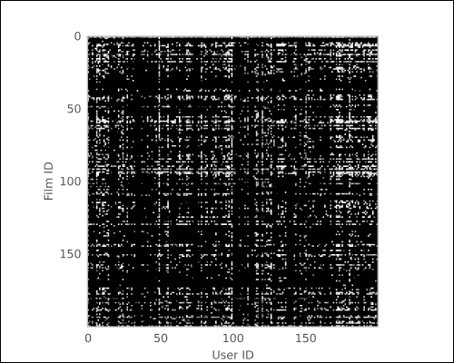
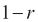
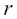
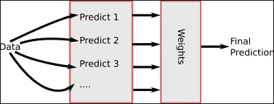
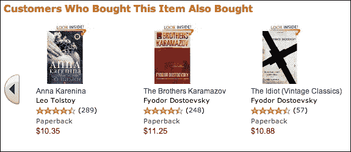
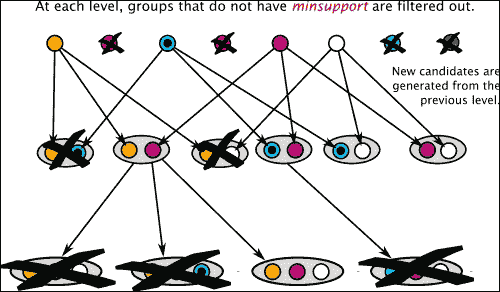
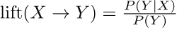

# 第八章：推荐系统

推荐系统已经成为在线服务和电商的基础之一。这种自动化系统可以为每个用户提供个性化的建议列表（无论是购买的产品、使用的功能还是新的社交连接）。在本章中，我们将看到自动化推荐生成系统的基本工作原理。基于消费者输入的推荐领域通常被称为协同过滤，因为用户通过系统进行协作，帮助彼此找到最佳产品。

在本章的第一部分，我们将看到如何利用消费者过去的产品评分来预测新的评分。我们从一些有用的想法开始，然后将它们结合在一起。在结合时，我们使用回归分析来学习它们可以如何最优地组合。这也将让我们探讨机器学习中的一个通用概念：集成学习。

在本章的第二部分，我们将探讨一种不同的推荐学习方法：购物篮分析。与我们拥有数字评分的情况不同，在购物篮分析中，我们仅拥有关于购物篮的信息，也就是说，哪些商品是一起购买的。目标是学习如何进行推荐。你可能已经在在线购物中见过类似“购买 X 的人也购买了 Y”这样的功能。我们将开发出一个类似的功能。

# 评分预测和推荐

如果你在过去 10 年里使用过任何在线购物系统，你可能已经见过这些推荐。有些类似于亚马逊的“购买 X 的客户也购买了 Y”。这些将在本章的*购物篮分析*部分中进一步探讨。其他推荐则基于预测产品的评分，比如电影的评分。

基于过去产品评分学习推荐的问题由 Netflix 大奖而闻名，Netflix 大奖是 Netflix 举办的百万美元机器学习公开挑战赛。Netflix（在美国和英国非常知名，并正在进行国际扩展）是一家电影租赁公司。传统上，你会收到邮寄来的 DVD；最近，Netflix 专注于在线电影和电视节目的流媒体播放。从一开始，Netflix 的一个独特之处在于它允许用户对看过的电影进行评分。Netflix 随后使用这些评分向用户推荐其他电影。在这个机器学习问题中，你不仅知道用户看了哪些电影，还知道用户如何评分。

2006 年，Netflix 将其数据库中大量客户对电影的评分数据公开，举行了一场公开挑战。目标是改进 Netflix 内部的评分预测算法。任何能够将其提升 10％或更多的人将赢得 100 万美元的奖金。2009 年，一个名为 BellKor's Pragmatic Chaos 的国际团队成功突破了这个标准，并获得了奖金。他们是在另一个团队 The Ensemble 的前 20 分钟成功做到的，并且同样突破了 10％的改进——这场持续了数年的竞赛最终以一个激动人心的结局落下帷幕。

### 提示

**现实世界中的机器学习**

关于 Netflix 奖已经有很多相关的讨论，你可以通过阅读相关资料了解更多。获奖的技术是先进的机器学习方法与大量数据预处理工作相结合的结果。例如，有些用户倾向于给所有电影打很高的分，而有些用户总是给出较低的评价；如果你在预处理阶段不考虑这一点，你的模型就会受到影响。为了获得好的结果，还需要进行其他的归一化处理：例如，电影的上映年份以及它收到的评价数量。好的算法很重要，但你始终需要“亲自动手”，根据你手头数据的特性调整你的方法。数据的预处理和归一化往往是机器学习过程中最耗时的部分。然而，这也是对系统最终表现产生最大影响的地方。

关于 Netflix 奖，首先要注意的是它的难度。大致来说，Netflix 使用的内部系统比没有推荐的系统（即每个电影仅给所有用户的平均值）好 10%左右。目标只是要在此基础上再提升 10%。最终，获奖系统比没有个性化的系统好大约 20%。然而，要实现这个目标，付出了巨大的时间和努力。尽管 20%的提升看起来并不多，但最终的结果是一个在实际中非常有用的系统。

不幸的是，出于法律原因，这个数据集目前已经无法获取。尽管数据是匿名的，但人们担心可能会揭示出客户的身份以及电影租赁的私人信息。不过，我们可以使用一个具有类似特征的学术数据集。这些数据来自 GroupLens，这是明尼苏达大学的一个研究实验室。

我们如何解决类似 Netflix 的评分预测问题呢？我们将看到两种不同的方法，邻域方法和回归方法。我们还会看到如何将这两种方法结合起来，得出一个统一的预测结果。

## 划分训练集和测试集

从高层次上看，将数据集划分为训练数据和测试数据，以便获得系统性能的原则性估计，方法与之前的章节相同：我们将取一定比例的数据点（我们将使用 10%）并将其保留用于测试；其余数据用于训练。然而，由于在此上下文中数据的结构不同，因此代码也有所不同。第一步是从磁盘加载数据，我们使用以下函数：

```py
def load():
 import numpy as np
 from scipy import sparse

 data = np.loadtxt('data/ml-100k/u.data')
 ij = data[:, :2]
 ij -= 1  # original data is in 1-based system
 values = data[:, 2]
 reviews = sparse.csc_matrix((values, ij.T)).astype(float)
 return reviews.toarray()

```

请注意，这个矩阵中的零条目表示缺失的评分。

```py
>>> reviews = load()
>>> U,M = np.where(reviews)

```

现在，我们使用标准的随机模块选择要测试的索引：

```py
>>> import random
>>> test_idxs = np.array(random.sample(range(len(U)), len(U)//10))

```

现在，我们构建 `train` 矩阵，它类似于 `reviews`，但将测试条目的值设为零：

```py
>>> train = reviews.copy()
>>> train[U[test_idxs], M[test_idxs]] = 0

```

最后，`test` 矩阵只包含测试值：

```py
>>> test = np.zeros_like(reviews)
>>> test[U[test_idxs], M[test_idxs]] = reviews[U[test_idxs], M[test_idxs]]

```

从现在起，我们将开始处理训练数据，并尝试预测数据集中所有缺失的条目。也就是说，我们将编写代码，为每个（用户，电影）对分配一个推荐。

## 对训练数据进行标准化

正如我们之前讨论的那样，最好的做法是对数据进行标准化，以去除明显的电影或用户特定的效应。我们将使用一种非常简单的标准化方法，之前也使用过：转换为 z 分数。

不幸的是，我们不能简单地使用 scikit-learn 的标准化对象，因为我们必须处理数据中的缺失值（即，并非所有电影都被所有用户评分）。因此，我们希望通过实际存在的值的均值和标准差进行标准化。

我们将编写自己的类，它忽略缺失值。这个类将遵循 scikit-learn 的预处理 API：

```py
class NormalizePositive(object):

```

我们希望选择标准化的轴。默认情况下，我们沿第一个轴进行标准化，但有时沿第二个轴进行标准化也会很有用。这遵循了许多其他与 NumPy 相关的函数的约定：

```py
 def __init__(self, axis=0):
 self.axis = axis

```

最重要的方法是 fit 方法。在我们的实现中，我们计算的是非零值的均值和标准差。请记住，零值表示“缺失值”：

```py
 def fit(self, features, y=None):

```

如果轴为 1，我们将在转置数组上进行操作，如下所示：

```py
 if self.axis == 1:
 features = features.T
 #  count features that are greater than zero in axis 0:
 binary = (features > 0)
 count0 = binary.sum(axis=0)

 # to avoid division by zero, set zero counts to one:
 count0[count0 == 0] = 1.

 # computing the mean is easy:
 self.mean = features.sum(axis=0)/count0

 # only consider differences where binary is True:
 diff = (features - self.mean) * binary
 diff **= 2
 # regularize the estimate of std by adding 0.1
 self.std = np.sqrt(0.1 + diff.sum(axis=0)/count0)
 return self

```

我们将 0.1 加到标准差的直接估计中，以避免在样本很少且所有样本可能完全相同的情况下低估标准差的值。所用的确切值对最终结果影响不大，但我们需要避免除以零的情况。

`transform` 方法需要维护二进制结构，如下所示：

```py
 def transform(self, features):
 if self.axis == 1:
 features = features.T
 binary = (features > 0)
 features = features - self.mean
 features /= self.std
 features *= binary
 if self.axis == 1:
 features = features.T
 return features

```

请注意，当轴为 1 时，我们如何处理输入矩阵的转置，然后再将其转换回来，以便返回值与输入矩阵的形状相同。`inverse_transform` 方法执行逆操作以进行如这里所示的转换：

```py
 def inverse_transform(self, features, copy=True):
 if copy:
 features = features.copy()
 if self.axis == 1:
 features = features.T
 features *= self.std
 features += self.mean
 if self.axis == 1:
 features = features.T
 return features

```

最后，我们添加了 `fit_transform` 方法，顾名思义，它结合了 `fit` 和 `transform` 两个操作：

```py
 def fit_transform(self, features):
 return self.fit(features).transform(features)

```

我们定义的方法（`fit`、`transform`、`transform_inverse` 和 `fit_transform`）与 `sklearn.preprocessing` 模块中定义的对象相同。在接下来的章节中，我们将首先规范化输入，生成规范化的预测值，最后应用逆变换以获得最终预测结果。

## 一种基于邻域的推荐方法

邻域概念可以通过两种方式实现：用户邻域或电影邻域。用户邻域基于一个非常简单的概念：要知道一个用户如何评分电影，找到与他们最相似的用户，并查看他们的评分。我们暂时只考虑用户邻域。在本节结束时，我们将讨论如何调整代码来计算电影邻域。

我们现在要探讨的一种有趣技巧是，仅仅查看每个用户评分过的电影，即使不查看他们给出的评分。即使我们有一个二元矩阵，其中用户评分的电影用 1 表示，未评分的电影用 0 表示，我们仍然可以做出有用的预测。事后看来，这完全是合理的；我们并不是随机选择电影观看，而是选择那些我们已经有一定喜好预期的电影。我们也不是随机选择要评分的电影，而是可能只会评分那些我们感受最强烈的电影（当然，也有例外，但平均来看，这大概是对的）。

我们可以将矩阵的值可视化为一张图像，每个评分表示为一个小方块。黑色表示没有评分，灰度级表示评分值。

可视化数据的代码非常简单（你可以调整它来显示矩阵的更多部分，而不仅仅是本书中能显示的部分），如下所示：

```py
>>> from matplotlib import pyplot as plt
>>> # Build an instance of the object we defined above
>>> norm = NormalizePositive(axis=1)
>>> binary = (train > 0)
>>> train = norm.fit_transform(train)
>>> # plot just 200x200 area for space reasons
>>> plt.imshow(binary[:200, :200], interpolation='nearest')

```

以下截图是该代码的输出：



我们可以看到矩阵是稀疏的——大部分格子是黑色的。我们也可以看到，有些用户评分的电影比其他用户多，而有些电影比其他电影有更多的评分。

我们现在将使用这个二元矩阵来预测电影评分。一般的算法将是（伪代码）如下：

1.  对于每个用户，按相似度对其他所有用户进行排序。此步骤中，我们将使用二元矩阵，并使用相关性作为相似度的度量（将二元矩阵视为零和一使得我们可以进行这种计算）。

1.  当我们需要估计一个（用户，电影）对的评分时，我们会查看所有评分过该电影的用户，并将他们分为两组：最相似的那一半和最不相似的那一半。然后我们使用最相似那一半的平均值作为预测。

我们可以使用`scipy.spatial.distance.pdist`函数来获取所有用户之间的距离矩阵。这个函数返回相关距离，它通过反转相关值来转化，使得更大的数值表示不那么相似。从数学上讲，相关距离是，其中是相关值。代码如下：

```py
>>> from scipy.spatial import distance
>>> # compute all pair-wise distances:
>>> dists = distance.pdist(binary, 'correlation')
>>> # Convert to square form, so that dists[i,j]
>>> # is distance between binary[i] and binary[j]:
>>> dists = distance.squareform(dists)

```

我们可以使用这个矩阵来选择每个用户的最近邻居。这些用户是最相似的用户。

```py
>>> neighbors = dists.argsort(axis=1)

```

现在，我们遍历所有用户以估算所有输入的预测值：

```py
>>> # We are going to fill this matrix with results
>>> filled = train.copy()
>>> for u in range(filled.shape[0]):
...     # n_u is neighbors of user
...     n_u = neighbors[u, 1:]
...     # t_u is training data

...     for m in range(filled.shape[1]):
...         # get relevant reviews in order!
...         revs = [train[neigh, m]
...                    for neigh in n_u
...                         if binary  [neigh, m]]
...         if len(revs):
...             # n is the number of reviews for this movie
...             n = len(revs)
...             # consider half of the reviews plus one
...             n //= 2
...             n += 1
...             revs = revs[:n]
...             filled[u,m] = np.mean(revs )

```

上述代码片段中的关键部分是通过正确的值进行索引，以选择已经对电影评分的邻居。然后，我们选择距离用户最近的那一半（在`rev[:n]`这一行中）并对它们求平均。由于一些电影有很多评论，而其他电影的评论非常少，因此很难为所有情况找到一个统一的用户数量。选择可用数据的那一半是更通用的方法。

要得到最终结果，我们需要将预测值反归一化，具体如下：

```py
>>> predicted = norm.inverse_transform(filled)

```

我们可以使用上一章学到的相同度量方法：

```py
>>> from sklearn import metrics
>>> r2 = metrics.r2_score(test[test > 0], predicted[test > 0])
>>> print('R2 score (binary neighbors): {:.1%}'.format(r2))
R2 score (binary neighbors): 29.5%

```

上述代码计算了用户邻居的结果，但我们可以通过简单地转置输入矩阵来计算电影邻居。事实上，代码计算的是输入矩阵的行的邻居。

所以我们可以重新运行以下代码，只需在顶部插入以下行：

```py
>>> reviews = reviews.T
>>> # use same code as before …
>>> r2 = metrics.r2_score(test[test > 0], predicted[test > 0])
>>> print('R2 score (binary movie neighbors): {:.1%}'.format(r2))
R2 score (binary movie neighbors): 29.8%

```

因此我们可以看到，结果并没有那么不同。

在本书的代码库中，邻居代码已被封装成一个简单的函数，便于重用。

## 一种回归方法推荐系统

邻居的替代方案是将推荐问题表述为回归问题，并应用我们在上一章学到的方法。

我们还考虑为什么这个问题不适合分类模型。我们当然可以尝试学习一个五类模型，每个类别对应一种可能的电影评分。这个方法有两个问题：

+   不同的错误类型是完全不同的。例如，把一部 5 星电影误认为 4 星电影并不是那么严重的错误，而把 5 星电影误认为 1 星电影就严重得多。

+   中间值是有意义的。即使我们的输入只有整数值，说预测值是 4.3 也是完全有意义的。我们可以看到，这与 3.5 的预测是不同的，尽管它们都四舍五入到 4。

这两个因素共同表明，分类方法不适合这个问题。回归框架更加适合。

对于基本方法，我们有两种选择：我们可以构建电影特定的模型或用户特定的模型。在我们的例子中，我们将首先构建用户特定的模型。这意味着，对于每个用户，我们将用户已评分的电影作为目标变量。输入是其他用户的评分。我们假设，这样做将为与我们用户相似的用户赋予较高的值（或者为喜欢我们用户不喜欢的电影的用户赋予负值）。

设置`train`和`test`矩阵与之前一样（包括执行标准化步骤）。因此，我们直接进入学习步骤。首先，我们按如下方式实例化一个回归器：

```py
>>> reg = ElasticNetCV(alphas=[
 0.0125, 0.025, 0.05, .125, .25, .5, 1., 2., 4.])

```

我们构建一个数据矩阵，矩阵中包含每一对（用户，电影）的评分。我们将其初始化为训练数据的副本：

```py
>>> filled = train.copy()

```

现在，我们遍历所有用户，每次仅基于该用户提供的数据学习回归模型：

```py
>>> for u in range(train.shape[0]):
...     curtrain = np.delete(train, u, axis=0)
...     # binary records whether this rating is present
...     bu = binary[u]
...     # fit the current user based on everybody else
...     reg.fit(curtrain[:,bu].T, train[u, bu])
...     # Fill in all the missing ratings
...     filled[u, ~bu] = reg.predict(curtrain[:,~bu].T)

```

评估该方法可以像以前一样进行：

```py
>>> predicted = norm.inverse_transform(filled)
>>> r2 = metrics.r2_score(test[test > 0], predicted[test > 0])
>>> print('R2 score (user regression): {:.1%}'.format(r2))
R2 score (user regression): 32.3%

```

与之前一样，我们可以调整这段代码，使用转置矩阵执行电影回归。

## 结合多种方法

我们现在将上述方法结合在一起，进行单一预测。直观上看，这个想法是好的，但我们如何在实践中做到这一点呢？也许，第一个想到的办法是我们可以对预测结果进行平均。这可能会给出不错的结果，但并没有理由认为所有的预测结果应该被同等对待。可能某些预测比其他预测更好。

我们可以尝试加权平均，在求和之前将每个预测值乘以一个给定的权重。然而，我们如何找到最佳的权重呢？当然，我们是通过从数据中学习它们！

### 提示

**集成学习**

我们正在使用一种机器学习中的通用技术，这种技术不仅适用于回归问题：**集成学习**。我们学习一个预测器的集成（即一组预测器）。然后，我们将它们组合起来得到一个单一的输出。有趣的是，我们可以将每一个预测视为一个新的特征，我们现在只是根据训练数据组合特征，这正是我们一直在做的事情。请注意，这里我们是在做回归，但相同的思路也适用于分类问题：你学习多个分类器，然后使用一个主分类器，该分类器接受所有分类器的输出并给出最终预测。不同形式的集成学习在于如何组合基础预测器。

为了结合这些方法，我们将使用一种叫做**堆叠学习**的技术。其思路是，你先学习一组预测器，然后将这些预测器的输出作为另一个预测器的特征。你甚至可以有多层，每一层都通过使用上一层的输出作为其预测的特征来进行学习。看看下面的图示：



为了拟合这个组合模型，我们将训练数据分成两部分。或者，我们可以使用交叉验证（原始的堆叠学习模型就是这样工作的）。然而，在这种情况下，我们有足够的数据，通过留出一部分数据来获得良好的估计。

就像在调整超参数时一样，我们需要两个层次的训练/测试划分：一个更高层次的划分，然后在训练划分内部，进行第二次划分，以便拟合堆叠学习器，如下所示：

```py
>>> train,test = load_ml100k.get_train_test(random_state=12)
>>> # Now split the training again into two subgroups
>>> tr_train,tr_test = load_ml100k.get_train_test(train, random_state=34)
>>> # Call all the methods we previously defined:
>>> # these have been implemented as functions:
>>> tr_predicted0 = regression.predict(tr_train)
>>> tr_predicted1 = regression.predict(tr_train.T).T
>>> tr_predicted2 = corrneighbours.predict(tr_train)
>>> tr_predicted3 = corrneighbours.predict(tr_train.T).T
>>> tr_predicted4 = norm.predict(tr_train)
>>> tr_predicted5 = norm.predict(tr_train.T).T

>>> # Now assemble these predictions into a single array:
>>> stack_tr = np.array([
...     tr_predicted0[tr_test > 0],
...     tr_predicted1[tr_test > 0],
...     tr_predicted2[tr_test > 0],
...     tr_predicted3[tr_test > 0],
...     tr_predicted4[tr_test > 0],
...     tr_predicted5[tr_test > 0],
...     ]).T

>>> # Fit a simple linear regression
>>> lr = linear_model.LinearRegression()
>>> lr.fit(stack_tr, tr_test[tr_test > 0])

```

现在，我们将整个过程应用于测试集并进行评估：

```py
>>> stack_te = np.array([
...     tr_predicted0.ravel(),
...     tr_predicted1.ravel(),
...     tr_predicted2.ravel(),
...     tr_predicted3.ravel(),
...     tr_predicted4.ravel(),
...     tr_predicted5.ravel(),
...     ]).T
>>> predicted = lr.predict(stack_te).reshape(train.shape)

```

评估与之前相同：

```py
>>> r2 = metrics.r2_score(test[test > 0], predicted[test > 0])
>>> print('R2 stacked: {:.2%}'.format(r2))
R2 stacked: 33.15%

```

堆叠学习的结果比任何单一方法的结果都要好。将方法结合起来通常是一种简单的方式，可以获得小幅的性能提升，但结果并不会引起轰动。

通过灵活地组合多种方法，我们可以简单地通过将任何想法添加到学习器的混合中，并让系统将其折入预测中来尝试任何我们希望的想法。例如，我们可以替换最近邻代码中的邻域标准。

然而，我们必须小心不要让数据集过拟合。事实上，如果我们随意尝试太多东西，其中一些可能在这个数据集上效果很好，但无法推广到其他数据。尽管我们正在划分数据集，但我们并没有严格地进行交叉验证我们的设计决策。为了获得良好的估计，并且如果数据量充足，你应该将一部分数据留着，直到你有一个即将投入生产的最终模型。然后，在这个保留的数据上测试你的模型，可以给你一个无偏的预测，了解它在现实世界中的表现如何。

# 购物篮分析

到目前为止，我们讨论的方法在你拥有用户对产品喜好程度的数字评分时效果很好。但这种信息并不总是可用，因为它需要消费者的主动行为。

购物篮分析是一种推荐学习的替代模式。在这种模式下，我们的数据仅包括哪些商品是一起购买的；它不包含任何关于单个商品是否被喜好的信息。即使用户有时购买了他们后悔的商品，平均而言，知道他们的购买记录也足以帮助你构建良好的推荐系统。获取这类数据通常比评分数据更容易，因为许多用户不会提供评分，而购物篮数据则是购物的副作用。以下截图展示了亚马逊网站上托尔斯泰经典小说《战争与和平》的页面片段，演示了如何使用这些结果的常见方式：



这种学习模式不仅仅适用于实际的购物篮，自然也可以应用于任何有一组对象并且需要推荐其他对象的场景。例如，Gmail 会向正在写电子邮件的用户推荐额外的收件人，类似的技术可以应用于这种推荐（我们并不知道 Gmail 内部使用了什么技术；也许，他们像我们之前所做的那样，结合了多种技术）。或者，我们也可以使用这些方法开发一个应用程序，根据用户的浏览历史推荐访问的网页。即使我们处理的是购物，也有可能将顾客的所有购买合并成一个购物篮，而不考虑这些商品是否是一起购买的或是在不同交易中购买的。这取决于商业环境，但请记住，这些技术是灵活的，可以在许多不同的场合中发挥作用。

### 注意

啤酒和尿布。关于购物篮分析，常常提到的一个故事是*尿布和啤酒*的故事。这个故事说的是，当超市开始分析他们的数据时，他们发现尿布常常和啤酒一起购买。可以假设是父亲去超市买尿布时顺便也买了啤酒。关于这个故事是否真实，还是仅仅一个都市传说，存在很多讨论。在这种情况下，似乎是事实。1990 年代初，Osco Drug 确实发现，在傍晚时分，啤酒和尿布经常一起购买，这让当时的经理们感到非常惊讶，因为他们之前从未认为这两种产品有任何相似性。事实并非如此的是，这并没有导致商店将啤酒陈列架移到尿布区域附近。而且，我们也不知道是否真的是父亲比母亲（或祖父母）更多地购买啤酒和尿布。

## 获取有用的预测

这不仅仅是“购买了 X 的顾客也购买了 Y”，尽管许多在线零售商是这样表述的（参见之前给出的亚马逊截图）；一个真正的系统不能这样运作。为什么不行？因为这样的系统会被非常频繁购买的商品所欺骗，推荐的只是那些流行的商品，而没有任何个性化的推荐。

例如，在超市中，许多顾客每次购物时都会购买面包，或者购买的时间非常接近（为了说明问题，我们假设有 50%的购物包含面包）。因此，如果你关注任何特定商品，比如洗碗液，并查看与洗碗液一起常常购买的商品，你可能会发现面包常常与洗碗液一起购买。事实上，仅仅通过随机机会，每次有人购买洗碗液时，50%的几率他们也会购买面包。然而，面包与其他商品一起购买是因为每个人购买面包的频率都非常高。

我们真正寻找的是“购买了 X 的顾客，比那些没有购买 X 的普通顾客更有可能购买 Y”。如果你购买了洗碗机洗涤剂，你可能会购买面包，但不会比基准更频繁。类似地，一家书店如果只是推荐畅销书，而不考虑你已经购买的书籍，那就不算是很好的个性化推荐。

## 分析超市购物篮

作为例子，我们将看一个包含比利时超市匿名交易的数据集。这个数据集由哈瑟尔特大学的 Tom Brijs 提供。由于隐私问题，数据已经被匿名化，因此我们只有每个产品的编号，购物篮是由一组编号组成。该数据文件可以从多个在线来源获得（包括本书的伴随网站）。

我们首先加载数据集并查看一些统计信息（这总是个好主意）：

```py
>>> from collections import defaultdict
>>> from itertools import chain

>>> # File is downloaded as a compressed file
>>> import gzip
>>> # file format is a line per transaction
>>> # of the form '12 34 342 5...'
>>> dataset = [[int(tok) for tok in line.strip().split()]
...         for line in gzip.open('retail.dat.gz')]
>>> # It is more convenient to work with sets
>>> dataset = [set(d) for d in dataset]
>>> # count how often each product was purchased:
>>> counts = defaultdict(int)
>>> for elem in chain(*dataset):
...     counts[elem] += 1

```

我们可以在以下表格中看到总结的结果：

| 购买次数 | 产品数量 |
| --- | --- |
| 仅购买一次 | 2,224 |
| 2 或 3 | 2,438 |
| 4 到 7 | 2,508 |
| 8 到 15 | 2,251 |
| 16 到 31 | 2,182 |
| 32 到 63 | 1,940 |
| 64 到 127 | 1,523 |
| 128 到 511 | 1,225 |
| 512 次或更多 | 179 |

有许多产品只被购买了少数几次。例如，33%的产品购买次数为四次或更少。然而，这仅占所有购买的 1%。这种许多产品仅被购买少数次的现象有时被称为*长尾现象*，随着互联网使得库存和销售小众商品变得更加便宜，这一现象变得更加显著。为了能够为这些产品提供推荐，我们需要更多的数据。

有一些开源的购物篮分析算法实现，但没有一个与 scikit-learn 或我们一直在使用的其他软件包很好地集成。因此，我们将自己实现一个经典的算法。这个算法叫做 Apriori 算法，虽然它有点老（由 Rakesh Agrawal 和 Ramakrishnan Srikant 于 1994 年发布），但它仍然有效（算法当然永远有效，只是会被更好的想法所取代）。

从形式上讲，Apriori 算法接收一个集合（即你的购物篮），并返回作为子集非常频繁的集合（即共同出现在许多购物篮中的商品）。

该算法采用自下而上的方法：从最小的候选项集（由一个单独的元素组成）开始，逐步构建，每次添加一个元素。正式来说，算法接受一个购物篮集和应考虑的最小输入（我们称之为 minsupport）。第一步是考虑所有仅包含一个元素且具有最小支持度的购物篮。然后，这些项集以所有可能的方式组合，构建出二元素购物篮。接着，筛选出仅保留那些具有最小支持度的项集。然后，考虑所有可能的三元素购物篮，并保留那些具有最小支持度的项集，如此继续。Apriori 的技巧在于，当构建一个更大的购物篮时，*它只需要考虑由更小的集合构成的购物篮*。

以下图示展示了该算法的示意图：



现在我们将在代码中实现这个算法。我们需要定义我们寻找的最小支持度：

```py
>>> minsupport = 80

```

支持度是指一组产品一起被购买的次数。Apriori 的目标是找到具有高支持度的项集。从逻辑上讲，任何支持度高于最小支持度的项集只能由那些本身至少具有最小支持度的项组成：

```py
>>> valid = set(k for k,v in counts.items()
...           if (v >= minsupport))

```

我们的初始项集是单一项集（包含单个元素的集合）。特别地，所有至少具有最小支持度的单一项集都是频繁项集：

```py
>>>  itemsets = [frozenset([v]) for v in valid]

```

现在，我们的循环如下所示：

```py
>>> freqsets = []
>>> for i in range(16):
...     nextsets = []
...     tested = set()
...     for it in itemsets:
...         for v in valid:
...             if v not in it:
...                 # Create a new candidate set by adding v to it
...                 c = (it | frozenset([v]))
...                 # check If we have tested it already
...                 if c in tested:
...                     continue
...                 tested.add(c)
...
...                 # Count support by looping over dataset
...                 # This step is slow.
...                 # Check `apriori.py` for a better implementation.
...                 support_c = sum(1 for d in dataset if d.issuperset(c))
...                 if support_c > minsupport:
...                     nextsets.append(c)
...     freqsets.extend(nextsets)
...     itemsets = nextsets
...     if not len(itemsets):
...         break
>>> print("Finished!")
Finished!

```

这个方法是正确的，但比较慢。一个更好的实现有更多的基础设施来避免遍历所有数据集来获取计数（`support_c`）。特别地，我们跟踪哪些购物篮包含哪些频繁项集。这样可以加速循环，但也使代码更难理解。因此，我们在这里不展示它。像往常一样，您可以在本书的配套网站上找到这两种实现。网站上的代码也被封装成一个函数，可以应用于其他数据集。

Apriori 算法返回频繁项集，即那些出现频率超过某一阈值（由代码中的`minsupport`变量给定）的购物篮。

## 关联规则挖掘

频繁项集本身并不是很有用。下一步是构建**关联规则**。由于这个最终目标，整个购物篮分析领域有时被称为关联规则挖掘。

关联规则是一种“如果 X，则 Y”的语句，例如，“如果顾客购买了《战争与和平》，那么他们将购买《安娜·卡列尼娜》”。请注意，这条规则并不是确定性的（并不是所有购买 X 的顾客都会购买 Y），但每次都要这样表达是很繁琐的：“如果顾客购买了 X，他购买 Y 的可能性比基线高”；因此，我们说“如果 X，则 Y”，但我们是从概率的角度来理解这句话。

有趣的是，前件和结论可能都包含多个对象：购买了 X、Y 和 Z 的顾客也购买了 A、B 和 C。多个前件可能使你能够做出比单个项目更具体的预测。

你可以通过尝试所有可能的 X 蕴含 Y 的组合，从频繁项集生成规则。生成这些规则很容易。然而，你只希望得到有价值的规则。因此，我们需要衡量规则的价值。一个常用的度量叫做**提升度**。提升度是应用规则所得到的概率与基准概率之间的比值，公式如下：



在上述公式中，P(Y)表示包含 Y 的所有交易所占的比例，而 P(Y|X)表示在交易包含 X 的前提下，包含 Y 的交易所占的比例。使用提升度可以避免推荐畅销书的问题；对于畅销书，P(Y)和 P(Y|X)都将较大。因此，提升度会接近 1，规则将被视为无关紧要。实际上，我们希望提升度的值至少为 10，甚至可能达到 100。

请参考以下代码：

```py
>>> minlift = 5.0
>>> nr_transactions = float(len(dataset))
>>> for itemset in freqsets:
...       for item in itemset:
...         consequent = frozenset([item])
...         antecedent = itemset-consequent
...         base = 0.0
...         # acount: antecedent count
...         acount = 0.0
... 
...         # ccount : consequent count
...         ccount = 0.0
...         for d in dataset:
...           if item in d: base += 1
...           if d.issuperset(itemset): ccount += 1
...           if d.issuperset(antecedent): acount += 1
...         base /= nr_transactions
...         p_y_given_x = ccount/acount
...         lift = p_y_given_x / base
...         if lift > minlift:
...             print('Rule {0} ->  {1} has lift {2}'
...                   .format(antecedent, consequent,lift))

```

以下表格展示了部分结果。计数是指包含**仅后件**（即该商品被购买的基本比率）、**前件中的所有项**以及**前件和后件中的所有项**的交易数量。

| 前件 | 后件 | 后件计数 | 前件计数 | 前件和后件计数 | 提升度 |
| --- | --- | --- | --- | --- | --- |
| 1,378, 1,379, 1,380 | 1,269 | 279（0.3%） | 80 | 57 | 225 |
| 48, 41, 976 | 117 | 1026（1.1%） | 122 | 51 | 35 |
| 48, 41, 1,6011 | 16,010 | 1316（1.5%） | 165 | 159 | 64 |

例如，我们可以看到，有 80 笔交易中购买了 1,378、1,379 和 1,380 三个商品。在这些交易中，57 笔也包含了 1,269，因此估算的条件概率为 57/80 ≈ 71%。与所有交易中只有 0.3%包含 1,269 这一事实相比，这给我们带来了 255 的提升度。

必须在这些计数中拥有足够数量的交易，以便能够做出相对可靠的推断，这就是为什么我们必须首先选择频繁项集的原因。如果我们从不频繁项集生成规则，计数会非常小；因此，相关值将毫无意义（或者会受到非常大的误差范围的影响）。

请注意，从这个数据集中发现了更多的关联规则：该算法发现了 1,030 条规则（要求支持至少 80 个购物篮，并且最小提升度为 5）。与如今互联网所能处理的数据集相比，这仍然是一个较小的数据集。对于包含数百万笔交易的数据集，你可以预计会生成成千上万的规则，甚至是数百万条规则。

然而，对于每个客户或每个产品，只有少数几个规则在任何给定时刻是相关的。因此，每个客户只会收到少量推荐。

## 更高级的购物篮分析

现在有一些比 Apriori 更快的购物篮分析算法。我们之前看到的代码比较简单，足够满足我们的需求，因为我们只有大约 10 万个交易记录。如果我们有数百万条交易记录，可能值得使用更快的算法。不过需要注意的是，学习关联规则通常可以离线进行，在这种情况下效率不是那么大的问题。

还有一些方法可以处理时间序列信息，从而得出考虑到购买顺序的规则。例如，假设某人购买了大量派对用品后，可能会回来购买垃圾袋。因此，在第一次访问时推荐垃圾袋可能是有意义的。然而，向所有购买垃圾袋的人推荐派对用品就不太合适了。

# 总结

本章中，我们从使用回归进行评分预测开始。我们看到了一些不同的方式来实现这一目标，然后通过学习一组权重将它们结合成一个单一的预测。这种技术，特别是堆叠学习，作为一种集成学习方法，是一种可以在许多情况下使用的通用技术，不仅仅适用于回归。它允许你结合不同的思路，即使它们的内部机制完全不同；你也可以将它们的最终输出结合起来。

在本章的后半部分，我们转变了方向，研究了另一种产生推荐的模式：购物篮分析或关联规则挖掘。在这种模式下，我们试图发现“购买 X 的客户很可能对 Y 感兴趣”的（概率性）关联规则。这利用了仅从销售数据生成的数据，而无需用户对商品进行数值评分。目前，scikit-learn 中没有这个功能，所以我们编写了自己的代码。

关联规则挖掘需要小心，不能只是向每个用户推荐畅销书（否则，个性化推荐还有什么意义？）。为了做到这一点，我们学习了如何通过称为“规则提升度”的度量，衡量规则相对于基线的价值。

到目前为止，我们已经看到了机器学习的主要模式：分类。在接下来的两章中，我们将探索用于两种特定数据类型的技术，即音乐和图像。我们的第一个目标是构建一个音乐类型分类器。
