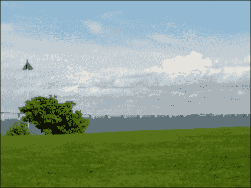
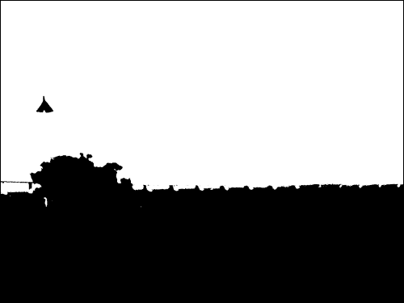
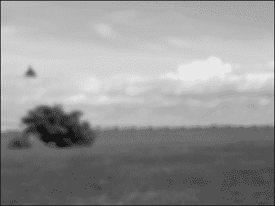
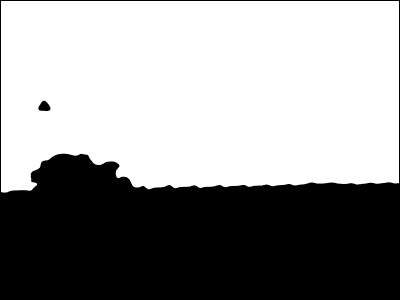
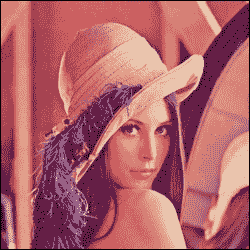
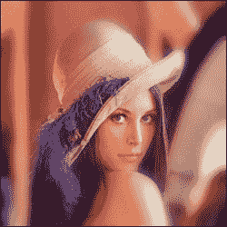
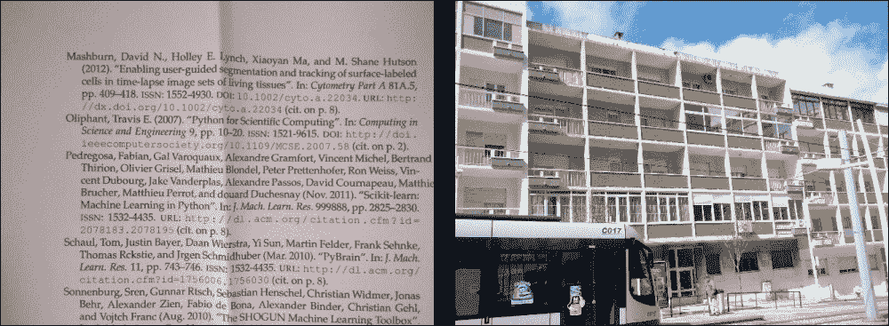
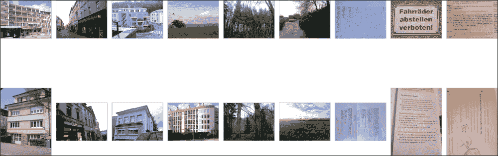
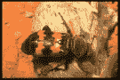
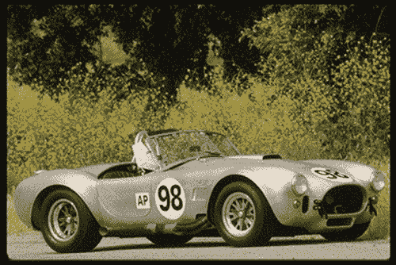

# 第十章：计算机视觉

图像分析和计算机视觉一直在工业和科学应用中占有重要地位。随着拥有强大相机和互联网连接的手机的普及，图像现在越来越多地由消费者生成。因此，利用计算机视觉为新情境中的用户体验提供更好的服务，成为了一个机会。

在本章中，我们将学习如何将你在本书其余部分学到的技术应用到这种特定类型的数据上。具体来说，我们将学习如何使用 mahotas 计算机视觉包从图像中提取特征。这些特征可以作为我们在其他章节中学习的分类方法的输入。我们将这些技术应用于公开可用的照片数据集。我们还将看到这些相同的特征如何用于另一个问题，即寻找相似图像的问题。

最后，在本章的结尾，我们将学习如何使用局部特征。这些方法相对较新（其中第一种取得最新成果的方法，即**尺度不变特征变换**（**SIFT**），是在 1999 年提出的），并在许多任务中取得了非常好的效果。

# 介绍图像处理

从计算机的角度来看，图像是一个由像素值组成的大型矩形数组。我们的目标是处理这个图像，并为我们的应用程序做出决策。

第一步是从磁盘加载图像，图像通常以 PNG 或 JPEG 等图像特定格式存储，前者是一种无损压缩格式，后者是一种有损压缩格式，优化了对照片的视觉评估。然后，我们可能希望对图像进行预处理（例如，对其进行归一化，以适应光照变化）。

本章将以分类问题为驱动。我们希望能够学习一个支持向量机（或其他）分类器，能够从图像中进行训练。因此，我们将使用一个中间表示，在应用机器学习之前，从图像中提取数值特征。

## 加载和显示图像

为了操作图像，我们将使用一个名为 mahotas 的软件包。你可以从[`pypi.python.org/pypi/mahotas`](https://pypi.python.org/pypi/mahotas)获取 mahotas，并在[`mahotas.readthedocs.org`](http://mahotas.readthedocs.org)阅读其手册。Mahotas 是一个开源软件包（MIT 许可，因此可以在任何项目中使用），由本书的作者之一开发。幸运的是，它是基于 NumPy 的。你迄今为止学到的 NumPy 知识可以用于图像处理。还有其他图像处理软件包，例如 scikit-image（skimage）、SciPy 中的 ndimage（n 维图像）模块和 OpenCV 的 Python 绑定。所有这些都可以原生支持 NumPy 数组，因此你甚至可以将来自不同软件包的功能混合使用，构建一个综合的处理管道。

我们首先导入 mahotas 库，并使用`mh`作为缩写，这将在本章中一直使用，如下所示：

```py
>>> import mahotas as mh

```

现在，我们可以使用`imread`来加载图像文件，如下所示：

```py
>>> image = mh.imread('scene00.jpg')

```

`scene00.jpg`文件（该文件包含在本书附带的代码仓库数据集中）是一个高度为`h`、宽度为`w`的彩色图像；该图像将是一个形状为`(h, w, 3)`的数组。第一个维度是高度，第二个是宽度，第三个是红/绿/蓝。其他系统将宽度放在第一个维度，但这是所有基于 NumPy 的包使用的惯例。数组的类型通常是`np.uint8`（无符号 8 位整数）。这些是您的相机拍摄的图像，或者是您的显示器能够完全显示的图像。

一些专业设备，常用于科学和技术应用中，可以拍摄具有更高位深度的图像（即对亮度变化更加敏感）。这种设备中，12 位或 16 位是常见的位深。Mahotas 可以处理所有这些类型的图像，包括浮点图像。在许多计算中，即使原始数据是无符号整数，转换为浮点数仍然有助于简化处理舍入和溢出问题。

### 注意

Mahotas 支持多种不同的输入/输出后端。遗憾的是，它们没有一个能够加载所有存在的图像格式（存在数百种格式，并且每种格式都有多个变体）。然而，PNG 和 JPEG 格式的图像是所有后端都支持的。我们将重点介绍这些常见格式，并参考 mahotas 文档，了解如何读取不常见的格式。

我们可以使用 matplotlib 来显示图像，这个我们已经多次使用过的绘图库，如下所示：

```py
>>> from matplotlib import pyplot as plt
>>> plt.imshow(image)
>>> plt.show()

```

如下所示，这段代码展示了图像，遵循的惯例是第一个维度为高度，第二个维度为宽度。它也正确处理彩色图像。当使用 Python 进行数值计算时，我们可以受益于整个生态系统的良好协同工作：mahotas 与 NumPy 数组兼容，这些数组可以通过 matplotlib 显示；稍后我们将从图像中计算特征，以便与 scikit-learn 一起使用。



## 阈值处理

**阈值处理**是一种非常简单的操作：我们将所有高于某个阈值的像素值转换为`1`，将低于该阈值的像素值转换为`0`（或者使用布尔值，将其转换为`True`和`False`）。阈值处理中的一个重要问题是选择一个合适的阈值作为分界线。Mahotas 实现了一些从图像中选择阈值的方法。其中一种方法叫做**Otsu**，以其发明者命名。第一个必要的步骤是使用`mahotas.colors`子模块中的`rgb2gray`将图像转换为灰度图像。

我们也可以使用红色、绿色和蓝色通道的平均值来代替 `rgb2gray`，方法是调用 `image.mean(2)`。然而，结果会有所不同，因为 `rgb2gray` 为不同的颜色使用了不同的权重，以得到更为主观上更令人愉悦的结果。我们的眼睛对三种基本颜色的敏感度并不相同。

```py
>>> image = mh.colors.rgb2grey(image, dtype=np.uint8)
>>> plt.imshow(image) # Display the image

```

默认情况下，matplotlib 会将这张单通道图像显示为伪彩色图像，使用红色表示高值，蓝色表示低值。对于自然图像，灰度图像更加合适。你可以通过以下方式选择灰度显示：

```py
>>> plt.gray()

```

现在图像已显示为灰度图像。请注意，仅仅是像素值的解释和显示方式发生了变化，图像数据本身没有被改变。我们可以继续处理，通过计算阈值：

```py
>>> thresh = mh.thresholding.otsu(image)
>>> print('Otsu threshold is {}.'.format(thresh))
Otsu threshold is 138.
>>> plt.imshow(image > thresh)

```

当应用到之前的截图时，这种方法找到了阈值为 138，它将地面与上方的天空分开，如下图所示：



## 高斯模糊

对图像进行模糊处理可能看起来很奇怪，但它通常能减少噪声，这有助于进一步的处理。使用 mahotas，它只需要一个函数调用：

```py
>>> im16 = mh.gaussian_filter(image, 16)

```

注意，我们并没有将灰度图像转换为无符号整数：我们只是直接使用了浮动点结果。`gaussian_filter` 函数的第二个参数是滤波器的大小（即滤波器的标准差）。较大的值会导致更多的模糊，如下图所示：



我们可以使用左侧的截图并结合 Otsu 阈值方法（使用之前相同的代码）。现在，边界更加平滑，没有了锯齿状边缘，如下图所示：



## 让中心对焦

最后的示例展示了如何将 NumPy 运算符与一些简单的滤波操作结合，得到有趣的效果。我们从 Lena 图像开始，将其分割成颜色通道：

```py
>>> im = mh.demos.load('lena')

```

这是一张年轻女性的图像，经常用于图像处理演示。它在下图中展示：



为了分割红色、绿色和蓝色通道，我们使用以下代码：

```py
>>> r,g,b = im.transpose(2,0,1)

```

现在，我们分别对三个通道进行滤波，并通过 `mh.as_rgb` 将它们组合成一张图像。此函数接受三个二维数组，进行对比度拉伸使每个数组成为 8 位整数数组，然后将它们堆叠，返回一张彩色 RGB 图像：

```py
>>> r12 = mh.gaussian_filter(r, 12.)
>>> g12 = mh.gaussian_filter(g, 12.)
>>> b12 = mh.gaussian_filter(b, 12.)
>>> im12 = mh.as_rgb(r12, g12, b12)

```

现在，我们将两张图像从中心到边缘进行混合。首先，我们需要构建一个权重数组 `W`，它在每个像素处包含一个归一化值，即该像素到中心的距离：

```py
>>> h, w = r.shape # height and width
>>> Y, X = np.mgrid[:h,:w]

```

我们使用了 `np.mgrid` 对象，它返回大小为 `(h, w)` 的数组，值对应于 *y* 和 *x* 坐标。接下来的步骤如下：

```py
>>> Y = Y - h/2\. # center at h/2
>>> Y = Y / Y.max() # normalize to -1 .. +1

>>> X = X - w/2.
>>> X = X / X.max()

```

现在我们使用一个高斯函数，给中心区域赋予一个高值：

```py
>>> C = np.exp(-2.*(X**2+ Y**2))

>>> # Normalize again to 0..1
>>> C = C - C.min()
>>> C = C / C.ptp()
>>> C = C[:,:,None] # This adds a dummy third dimension to C

```

请注意，所有这些操作都是使用 NumPy 数组而不是 mahotas 特定的方法来完成的。最后，我们可以将两张图片结合起来，使得中心部分聚焦清晰，而边缘部分则更柔和：

```py
>>> ringed = mh.stretch(im*C + (1-C)*im12)

```



## 基本图像分类

我们将从一个专门为本书收集的小型数据集开始。该数据集包含三个类别：建筑物、自然场景（风景）和文本图片。每个类别有 30 张图片，所有图片均使用手机摄像头拍摄，构图简单。图像与那些没有摄影训练的用户上传到现代网站上的图片类似。这个数据集可以通过本书的网站或 GitHub 代码库获得。在本章后面，我们将介绍一个更难的数据集，包含更多的图片和类别。

在进行图像分类时，我们从一个包含大量数字（像素值）的矩阵开始。现在，百万级像素已是常见情况。我们可以尝试将所有这些数字作为特征输入学习算法，但这并不是一个很好的主意。原因是，每个像素（甚至每小组像素）与最终结果之间的关系非常间接。此外，如果像素数有百万，但样本图像的数量很少，这将导致一个非常困难的统计学习问题。这是我们在第七章《回归》中讨论的 P 大于 N 类型问题的极端形式。相反，一个好的方法是从图像中计算特征，并利用这些特征进行分类。

话虽如此，我还是要指出，实际上，有一些方法是可以直接从像素值中工作并计算特征的。这些方法有自己的特征计算子模块，甚至可能尝试自动学习合适的特征。这些方法是当前研究的主题，通常在非常大的数据集（数百万张图片）上效果最佳。

我们之前使用了一个场景类别的例子。以下是文本类和建筑类的示例：



## 从图像中计算特征

使用 mahotas 时，从图像中计算特征非常简单。它有一个名为`mahotas.features`的子模块，提供了特征计算函数。

一个常用的纹理特征集是 Haralick 特征。和许多图像处理方法一样，这个名字来源于其发明者。这些特征是基于纹理的：它们能区分平滑的图像和有图案的图像，并且能区分不同的图案。使用 mahotas 时，计算这些特征非常简单，方法如下：

```py
>>> haralick_features = mh.features.haralick(image)
>>> haralick_features_mean = np.mean(haralick_features, axis=0)
>>> haralick_features_all = np.ravel(haralick_features)

```

`mh.features.haralick`函数返回一个 4x13 的数组。第一维表示计算特征的四个可能方向（垂直、水平、对角线和反对角线）。如果我们对方向没有特别兴趣，我们可以使用所有方向的平均值（如前面的代码中的`haralick_features_mean`）。否则，我们可以分别使用所有特征（使用`haralick_features_all`）。这个决策应根据数据集的属性来决定。在我们的案例中，我们推测水平和垂直方向应该分别保留。因此，我们将使用`haralick_features_all`。

mahotas 中还实现了一些其他的特征集。线性二进制模式是另一种基于纹理的特征集，它对光照变化非常稳健。还有其他类型的特征，包括局部特征，我们将在本章后面讨论。

使用这些特征时，我们采用标准的分类方法，如逻辑回归，具体如下：

```py
>>> from glob import glob
>>> images = glob('SimpleImageDataset/*.jpg')
>>> features = []
>>> labels = []
>>> for im in images:
...   labels.append(im[:-len('00.jpg')])
...   im = mh.imread(im)
...   im = mh.colors.rgb2gray(im, dtype=np.uint8)
...   features.append(mh.features.haralick(im).ravel())

>>> features = np.array(features)
>>> labels = np.array(labels)

```

这三个类别有非常不同的纹理。建筑物有锐利的边缘和大块区域，颜色相似（像素值很少完全相同，但变化很小）。文本由许多锐利的暗-亮过渡组成，黑色小区域在白色背景中。自然场景有更平滑的变化，带有类似分形的过渡。因此，基于纹理的分类器预计会表现良好。

作为分类器，我们将使用逻辑回归分类器，并对特征进行如下预处理：

```py
>>> from sklearn.pipeline import Pipeline
>>> from sklearn.preprocessing import StandardScaler
>>> from sklearn.linear_model import LogisticRegression
>>> clf = Pipeline([('preproc', StandardScaler()),
 ('classifier', LogisticRegression())])

```

由于我们的数据集较小，我们可以使用如下的留一法回归：

```py
>>> from sklearn import cross_validation
>>> cv = cross_validation.LeaveOneOut(len(images))
>>> scores = cross_validation.cross_val_score(
...     clf, features, labels, cv=cv)
>>> print('Accuracy: {:.1%}'.format(scores.mean()))
Accuracy: 81.1%

```

对于三个类别，81%的准确率不错（随机猜测的准确率大约为 33%）。然而，通过编写我们自己的特征，我们可以做得更好。

## 编写你自己的特征

特征没有什么神奇之处。它只是我们从图像中计算出的一个数字。文献中已经定义了几种特征集。这些特征集通常有一个额外的优势，即它们被设计和研究为对许多不重要的因素具有不变性。例如，线性二进制模式对将所有像素值乘以一个数字或将一个常数加到所有像素值上完全不变。这使得这个特征集对图像的光照变化具有稳健性。

然而，也有可能你的特定使用案例将从一些特别设计的功能中受益。

mahotas 中没有提供的一种简单功能是颜色直方图。幸运的是，这个功能很容易实现。颜色直方图将颜色空间划分为一组区间，然后计算每个区间内有多少个像素。

图像采用 RGB 格式，即每个像素有三个值：R 表示红色，G 表示绿色，B 表示蓝色。由于这些组件每个都是 8 位值，总共有 1700 万种不同的颜色。我们将通过将颜色分组到箱子中，将这个数字减少到仅 64 种颜色。我们将编写一个函数来封装这个算法，如下所示：

```py
def chist(im):

```

为了对颜色进行分箱，我们首先将图像除以 64，按如下方式向下取整像素值：

```py
 im = im // 64

```

这使得像素值的范围从 0 到 3，总共产生了 64 种不同的颜色。

按照以下方式分离红色、绿色和蓝色通道：

```py
 r,g,b = im.transpose((2,0,1))
 pixels = 1 * r + 4 * b + 16 * g
 hist = np.bincount(pixels.ravel(), minlength=64)
 hist = hist.astype(float)

```

转换为对数尺度，如下代码片段所示。这并非严格必要，但能够产生更好的特征。我们使用 `np.log1p`，它计算 *log(h+1)*。这确保了零值保持为零值（从数学角度看，零的对数是未定义的，如果你尝试计算，NumPy 会给出警告）。

```py
 hist = np.log1p(hist)
 return hist

```

我们可以很容易地将之前的处理代码调整为使用我们编写的函数：

```py
>>> features = []
>>> for im in images:
...   image = mh.imread(im)
...   features.append(chist(im))

```

使用我们之前使用的相同交叉验证代码，我们获得了 90% 的准确率。然而，最佳结果来自于将所有特征结合在一起，我们可以按如下方式实现：

```py
>>> features = []
>>> for im in images:
...   imcolor = mh.imread(im)
...   im = mh.colors.rgb2gray(imcolor, dtype=np.uint8)
...   features.append(np.concatenate([
...           mh.features.haralick(im).ravel(),
...           chist(imcolor),
...       ]))

```

通过使用所有这些特征，我们获得了 95.6% 的准确率，如以下代码片段所示：

```py
>>> scores = cross_validation.cross_val_score(
...     clf, features, labels, cv=cv)
>>> print('Accuracy: {:.1%}'.format(scores.mean()))
Accuracy: 95.6%

```

这是一个完美的例子，说明了好算法是容易的部分。你总是可以使用 scikit-learn 中的最先进的分类实现。真正的秘密和附加价值通常体现在特征设计和工程上。这就是你对数据集的知识变得非常有价值的地方。

## 使用特征来查找相似图像

通过用相对较少的特征表示图像的基本概念，不仅可以用于分类。例如，我们还可以用它来查找与给定查询图像相似的图像（就像我们之前在文本文档中做的那样）。

我们将计算与之前相同的特征，唯一不同的是：我们将忽略图像的边缘区域。原因是由于构图的业余性质，图像的边缘常常包含无关的元素。当特征在整个图像上计算时，这些元素会被考虑在内。通过简单地忽略它们，我们可以得到稍微更好的特征。在监督学习示例中，这并不那么重要，因为学习算法会学习哪些特征更具信息量并相应地加权。当以无监督的方式工作时，我们需要更加小心，确保我们的特征能够捕捉到数据中重要的元素。这在循环中实现如下：

```py
>>> features = []
>>> for im in images:
...   imcolor = mh.imread(im)
...   # ignore everything in the 200 pixels closest to the borders
...   imcolor = imcolor[200:-200, 200:-200]
...   im = mh.colors.rgb2gray(imcolor, dtype=np.uint8)
...   features.append(np.concatenate([
...           mh.features.haralick(im).ravel(),
...           chist(imcolor),
...       ]))

```

我们现在标准化特征并计算距离矩阵，如下所示：

```py
>>> sc = StandardScaler()
>>> features = sc.fit_transform(features)
>>> from scipy.spatial import distance
>>> dists = distance.squareform(distance.pdist(features))

```

我们将仅绘制数据的一个子集（每第十个元素），这样查询图像会显示在顶部，返回的“最近邻”图像显示在底部，如下所示：

```py
>>> fig, axes = plt.subplots(2, 9)
>>> for ci,i in enumerate(range(0,90,10)):
...     left = images[i]
...     dists_left = dists[i]
...     right = dists_left.argsort()
...     # right[0] is same as left[i], so pick next closest
...     right = right[1]
...     right = images[right]
...     left = mh.imread(left)
...     right = mh.imread(right)
...     axes[0, ci].imshow(left)
...     axes[1, ci].imshow(right)

```

结果如以下截图所示：



很明显，系统并不完美，但至少可以找到与查询在视觉上相似的图像。在除了一个案例外，找到的图像都来自与查询相同的类别。

## 分类更困难的数据集

前一个数据集是一个使用纹理特征进行分类的简单数据集。事实上，从商业角度来看，许多有趣的问题相对简单。然而，有时我们可能会面临一个更困难的问题，需要更好、更现代的技术来获得良好的结果。

我们现在将测试一个公共数据集，它具有相同的结构：若干张照片分为少数几个类别。这些类别是动物、汽车、交通工具和自然场景。

与我们之前讨论的三类问题相比，这些类别更难区分。自然场景、建筑物和文本的纹理差异很大。然而，在这个数据集中，纹理和颜色不再是图像类别的明显标记。以下是来自动物类的一个例子：



这是来自汽车类别的另一个例子：



这两个对象背景都是自然背景，并且对象内部有较大的平滑区域。这是比简单数据集更具挑战性的问题，因此我们需要使用更先进的方法。第一个改进是使用一个稍微更强大的分类器。scikit-learn 提供的逻辑回归是一个带惩罚项的逻辑回归，包含一个可调参数`C`。默认情况下，`C = 1.0`，但这可能不是最佳选择。我们可以使用网格搜索来找到这个参数的最佳值，具体方法如下：

```py
>>> from sklearn.grid_search import GridSearchCV
>>> C_range = 10.0 ** np.arange(-4, 3)
>>> grid = GridSearchCV(LogisticRegression(), param_grid={'C' : C_range})
>>> clf = Pipeline([('preproc', StandardScaler()),
...                ('classifier', grid)])

```

数据集中的数据并不是按随机顺序组织的：相似的图像彼此靠近。因此，我们使用交叉验证策略，考虑数据已被洗牌，这样每个折叠（fold）都有一个更具代表性的训练集，如下所示：

```py
>>> cv = cross_validation.KFold(len(features), 5,
...                      shuffle=True, random_state=123)
>>> scores = cross_validation.cross_val_score(
...    clf, features, labels, cv=cv)
>>> print('Accuracy: {:.1%}'.format(scores.mean()))
Accuracy: 72.1%

```

对于四个类别来说，这还算不错，但我们现在将看看是否能通过使用不同的特征集来做得更好。事实上，我们将看到，结合这些特征与其他方法，才能获得最好的结果。

# 局部特征表示

计算机视觉领域的一个相对较新的发展是基于局部特征的方法。局部特征是在图像的小区域内计算的，与我们之前考虑的在整个图像上计算的特征不同。Mahotas 支持计算一种这种特征，**加速稳健特征**（**SURF**）。还有其他几种，最著名的是 SIFT 的原始提案。这些特征旨在对旋转或光照变化具有鲁棒性（即，它们在光照变化时仅略微改变其值）。

使用这些特征时，我们必须决定在哪里计算它们。常用的三种计算位置如下：

+   随机地

+   在网格中

+   检测图像中的有趣区域（这是一种被称为关键点检测或兴趣点检测的技术）

所有这些方法都是有效的，在合适的情况下，会得到很好的结果。Mahotas 支持这三种方法。如果你有理由认为你的兴趣点将对应于图像中重要区域，那么使用兴趣点检测效果最好。

我们将使用兴趣点方法。使用 mahotas 计算特征非常简单：导入正确的子模块并调用 `surf.surf` 函数，如下所示：

```py
>>> from mahotas.features import surf
>>> image = mh.demos.load('lena')
>>> image = mh.colors.rgb2gray(im, dtype=np.uint8)
>>> descriptors = surf.surf(image, descriptor_only=True)

```

`descriptors_only=True` 标志意味着我们只关心描述符本身，而不是它们的像素位置、大小或方向。或者，我们也可以使用密集采样方法，使用 `surf.dense` 函数如下所示：

```py
>>> from mahotas.features import surf
>>> descriptors = surf.dense(image, spacing=16)

```

这返回计算在相距 16 像素的点上的描述符值。由于点的位置是固定的，兴趣点的元信息并不十分有趣，默认情况下不会返回。在任何情况下，结果（描述符）是一个 n×64 的数组，其中 *n* 是采样点的数量。点的数量取决于图像的大小、内容以及你传递给函数的参数。在这个例子中，我们使用的是默认设置，每张图像得到几百个描述符。

我们不能直接将这些描述符输入到支持向量机、逻辑回归器或类似的分类系统中。为了使用来自图像的描述符，有几种解决方案。我们可以直接对它们求平均，但这样做的结果并不好，因为这样丢弃了所有关于位置的特定信息。在那种情况下，我们只会得到一个基于边缘度量的全局特征集。

我们将在这里使用的解决方案是**词袋模型**，这是一种非常新的思想。它首次于 2004 年以这种形式发布。这是一个事后看非常显而易见的想法：它非常简单实现，并且能够取得非常好的结果。

在处理图像时，说到*单词*可能会显得有些奇怪。如果你理解为你没有写出那些彼此容易区分的单词，而是口头发出的音频，可能更容易理解。现在，每次说出一个单词时，它的发音会略有不同，而且不同的发言者会有自己的发音方式。因此，一个单词的波形每次说出来时都不会完全相同。然而，通过对这些波形进行聚类，我们可以期望恢复大部分结构，使得给定单词的所有实例都在同一个聚类中。即使过程不完美（而且确实不会完美），我们仍然可以谈论将波形分组成单词。

我们对图像数据执行相同的操作：我们将所有图像中看起来相似的区域聚类在一起，并将这些区域称为**视觉词汇**。

### 注意

使用的词数通常对算法的最终性能影响不大。自然，如果词数非常少（例如 10 或 20，当你拥有几千张图像时），那么整体系统的表现会很差。同样，如果你有太多的词（例如，比图像的数量多得多），系统的表现也会不佳。然而，在这两者之间，通常会有一个较大的平稳区间，在这个区间内，你可以选择词数而不会对结果产生太大影响。作为经验法则，如果你有很多图像，使用 256、512 或 1024 这样的值应该能给你一个不错的结果。

我们将通过以下方式开始计算特征：

```py
>>> alldescriptors = []
>>> for im in images:
...   im = mh.imread(im, as_grey=True)
...   im = im.astype(np.uint8)
...   alldescriptors.append(surf.dense(image, spacing=16))
>>> # get all descriptors into a single array
>>> concatenated = np.concatenate(alldescriptors)
>>> print('Number of descriptors: {}'.format(
...        len(concatenated)))
Number of descriptors: 2489031

```

这导致了超过 200 万个局部描述符。现在，我们使用 k-means 聚类来获取质心。我们可以使用所有描述符，但为了提高速度，我们将使用较小的样本，如下所示：

```py
>>> # use only every 64th vector
>>> concatenated = concatenated[::64]
>>> from sklearn.cluster import KMeans
>>> k = 256
>>> km = KMeans(k)
>>> km.fit(concatenated)

```

完成此操作后（这需要一些时间），`km`对象包含有关质心的信息。我们现在回到描述符，并按以下方式构建特征向量：

```py
>>> sfeatures = []
>>> for d in alldescriptors:
...   c = km.predict(d)
...   sfeatures.append(
...       np.array([np.sum(c == ci) for ci in range(k)])
...   )
>>> # build single array and convert to float
>>> sfeatures = np.array(sfeatures, dtype=float)

```

这个循环的最终结果是，`sfeatures[fi, fj]`表示图像`fi`中包含元素`fj`的次数。虽然使用`np.histogram`函数可以更快地计算这个值，但正确设置参数会有些棘手。我们将结果转换为浮点数，因为我们不想使用整数运算（及其舍入语义）。

结果是，每个图像现在都由一个大小相同的特征数组表示（在我们的例子中是 256 个聚类）。因此，我们可以按以下方式使用我们的标准分类方法：

```py
>>> scores = cross_validation.cross_val_score(
...    clf, sfeatures, labels, cv=cv)
>>> print('Accuracy: {:.1%}'.format(scores.mean()))
Accuracy: 62.6%

```

结果比之前更差！我们什么也没得到吗？

事实上，我们有，因为我们可以将所有特征结合起来，达到 76.1%的准确率，具体如下：

```py
>>> combined = np.hstack([features, features])
>>> scores = cross_validation.cross_val_score(
...    clf, combined, labels, cv=cv)
>>> print('Accuracy: {:.1%}'.format(scores.mean()))
Accuracy: 76.1%

```

这是我们获得的最佳结果，优于任何单一的特征集。之所以如此，是因为局部的 SURF 特征与我们之前的全局图像特征有足够的区别，能够提供新的信息，从而提升了综合结果。

# 总结

我们学习了在机器学习环境中处理图像的经典特征方法：通过将数百万个像素转换为少量数值特征，我们能够直接使用逻辑回归分类器。我们在其他章节中学到的所有技术突然变得可以直接应用于图像问题。我们在使用图像特征查找数据集中相似图像时，看到了一个例子。

我们还学习了如何在词袋模型中使用局部特征进行分类。这是一种非常现代的计算机视觉方法，在提高分类精度的同时，对图像中的许多无关因素（如光照，甚至同一图像中的不均匀光照）具有很强的鲁棒性。我们还使用了聚类作为分类中的一个有用中间步骤，而不是仅仅作为最终目标。

我们专注于 mahotas，它是 Python 中主要的计算机视觉库之一。还有其他同样维护良好的库。Skimage（scikit-image）在精神上类似，但有不同的功能集。OpenCV 是一个非常优秀的 C++库，具有 Python 接口。这些库都可以与 NumPy 数组配合使用，你可以混合搭配不同库中的函数，构建复杂的计算机视觉管道。

在下一章中，你将学习一种不同形式的机器学习：降维。如我们在前几章中所见，包括在本章中使用图像时，计算上生成许多特征是非常容易的。然而，通常我们希望通过减少特征数量来提高速度和可视化，或者改善我们的结果。在下一章中，我们将看到如何实现这一目标。
