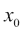
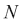

# 第十一章：降维

垃圾进，垃圾出——在本书中，我们看到，当将机器学习方法应用于训练数据时，这一模式同样成立。回顾过去，我们意识到，最有趣的机器学习挑战总是涉及某种特征工程，在这些挑战中，我们尝试利用对问题的洞察力，精心设计额外的特征，期望机器学习器能够识别并利用这些特征。

在本章中，我们将走向相反的方向，进行降维，去除那些无关或冗余的特征。移除特征乍一看似乎是反直觉的，因为更多的信息通常应该比更少的信息更好。此外，即使我们的数据集中有冗余特征，难道学习算法不会迅速识别并将它们的权重设为 0 吗？以下是一些仍然适用于尽可能减少维度的合理理由：

+   多余的特征可能会干扰或误导学习器。并非所有机器学习方法都会出现这种情况（例如，支持向量机喜欢高维空间）。然而，大多数模型在较少的维度下感觉更安全。

+   另一个反对高维特征空间的理由是，更多的特征意味着更多的参数需要调整，也增加了过拟合的风险。

+   我们为了解决任务而检索的数据可能具有人工高维性，而实际的维度可能很小。

+   更少的维度 = 更快的训练 = 在相同的时间框架内可以尝试更多的参数变化 = 更好的最终结果。

+   可视化——如果我们想要可视化数据，我们只能在二维或三维中进行。

因此，在这里我们将展示如何去除数据中的垃圾，同时保留其中真正有价值的部分。

# 绘制我们的路线图

降维大致可以分为特征选择和特征提取方法。在本书的几乎每一章中，我们都使用了一种特征选择方法，无论是在发明、分析还是可能丢弃某些特征时。在本章中，我们将介绍一些利用统计方法的方式，即相关性和互信息，来实现这一目标，尤其是在特征空间非常大的情况下。特征提取试图将原始特征空间转换为低维特征空间。这在我们无法通过选择方法去除特征，但仍然拥有过多特征以供学习器使用时尤其有用。我们将通过**主成分分析**（**PCA**）、**线性判别分析**（**LDA**）和**多维尺度分析**（**MDS**）来演示这一点。

# 特征选择

如果我们想对机器学习算法友好，我们应该提供那些彼此独立、但与待预测值高度相关的特征。这意味着每个特征都提供了显著的信息。移除任何特征都会导致性能下降。

如果我们只有少数几个特征，可以绘制一个散点图矩阵（每对特征组合画一个散点图）。特征之间的关系可以很容易地被发现。对于每一对明显依赖的特征，我们就会考虑是否应该去除其中一个，或者更好地设计一个新的、更干净的特征。

然而，大多数情况下，我们需要从多个特征中进行选择。想一想分类任务中，我们有一个词袋来分类答案的质量，这将需要一个 1000×1000 的散点图。在这种情况下，我们需要一种更自动化的方法来检测重叠特征并解决它们。我们将在以下小节中介绍两种常见的方法，即过滤器和包装器。

## 使用过滤器检测冗余特征

过滤器试图独立于任何后续使用的机器学习方法清理特征集。它们依赖统计方法来查找哪些特征是冗余的或无关的。在冗余特征的情况下，它只保留每个冗余特征组中的一个。无关的特征则会被直接移除。一般来说，过滤器按以下工作流程进行：


### 相关性

使用相关性，我们可以轻松看到特征对之间的线性关系。在以下图表中，我们可以看到不同程度的相关性，并且有一个潜在的线性依赖关系通过红色虚线（拟合的 1 维多项式）显示出来。每个单独图表顶部的相关系数  是通过 `scipy.stat` 库的 `pearsonr()` 函数计算的常见 Pearson 相关系数（Pearson `r` 值）。

给定两个相同大小的数据系列，它返回相关系数值和 p 值的元组。p 值描述了数据系列是否可能由一个不相关的系统生成。换句话说，p 值越高，我们就越不应该信任相关系数：

```py
>>> from scipy.stats import pearsonr
>>> pearsonr([1,2,3], [1,2,3.1])
>>> (0.99962228516121843, 0.017498096813278487)
>>> pearsonr([1,2,3], [1,20,6])
>>> (0.25383654128340477, 0.83661493668227405)

```

在第一个案例中，我们明显看到两个系列是相关的。在第二个案例中，我们仍然看到一个明显非零的  值。

然而，0.84 的 p 值告诉我们，相关系数并不显著，我们不应过于关注它。请查看以下图表：


在前三个具有高相关系数的案例中，我们可能会希望抛弃  或 ，因为它们似乎传递了相似的，甚至是相同的信息。

然而，在最后一个案例中，我们应该保留两个特征。在我们的应用中，当然，这个决定将由 p 值来驱动。

尽管在前面的例子中表现得很好，现实通常对我们并不友好。基于相关性的特征选择的一个大缺点是，它只能检测线性关系（即可以用直线建模的关系）。如果我们在非线性数据上使用相关性，就会发现问题。在以下的例子中，我们有一个二次关系：


尽管人眼可以立刻看到 X[1]与 X[2]之间的关系，除了右下角的图表外，相关系数却看不出这种关系。显然，相关性对于检测线性关系很有用，但对于其他类型的关系却无能为力。有时候，应用简单的变换就能获得线性关系。例如，在前面的图中，如果我们把 X[2]绘制在 X[1]的平方上，我们会得到一个较高的相关系数。然而，正常数据并不总是能提供这样的机会。

幸运的是，对于非线性关系，互信息来拯救我们。

### 互信息

在进行特征选择时，我们不应像在上一节中那样关注关系的类型（线性关系）。相反，我们应该从一个特征提供多少信息的角度来思考（前提是我们已经拥有另一个特征）。

为了理解这一点，我们假设要使用`house_size`（房屋面积）、`number_of_levels`（楼层数）和`avg_rent_price`（平均租金）特征集来训练一个分类器，该分类器判断房屋是否有电梯。在这个例子中，我们直观地认为，知道了`house_size`后，我们不再需要知道`number_of_levels`，因为楼层数在某种程度上包含了冗余信息。而对于`avg_rent_price`，情况不同，因为我们无法仅通过房屋的大小或楼层数来推断租金。因此，最好只保留其中一个特征，外加租金的平均值。

互信息通过计算两个特征之间有多少信息是共享的，来形式化上述推理。然而，与相关性不同，互信息不依赖于数据的顺序，而是依赖于数据的分布。为了理解它是如何工作的，我们需要稍微了解一下信息熵。

假设我们有一个公平的硬币。在我们抛掷硬币之前，关于它是正面还是反面我们将面临最大的未知，因为正反两面的概率各为 50%。这种不确定性可以通过 Claude Shannon 的信息熵来度量：


在我们公平硬币的例子中，有两种情况：让代表正面，代表反面，。

因此，得出结论：


### 提示

为了方便起见，我们也可以使用`scipy.stats.entropy([0.5, 0.5], base=2)`。我们将 base 参数设置为`2`，以便得到与之前相同的结果。否则，函数将使用自然对数（通过`np.log()`）。一般来说，基数无关紧要（只要你始终如一地使用它）。

现在，假设我们事先知道这枚硬币其实并不公平，抛掷后正面朝上的概率是 60%：


我们看到这种情况的不确定性较小。随着我们离 0.5 越来越远，不确定性会减少，达到极端值 0，即正面朝上的概率为 0%或 100%，如以下图表所示：


我们将通过将熵应用于两个特征而非一个来修改熵！互信息，从而衡量当我们了解 Y 时，X 的不确定性减少了多少。然后，我们可以捕捉到一个特征如何减少另一个特征的不确定性。

例如，在没有任何关于天气的进一步信息的情况下，我们完全不确定外面是否在下雨。如果我们现在得知外面的草地是湿的，那么不确定性就减少了（我们仍然需要检查洒水器是否开启了）。

更正式地说，互信息被定义为：


这看起来有点让人害怕，但其实不过是求和和乘积。例如，计算是通过对特征值进行分箱，然后计算每个箱中值的比例。在以下图表中，我们将箱的数量设置为十个。

为了将互信息限制在区间[0,1]内，我们必须将其除以它们各自的熵之和，这样就得到了归一化互信息：


互信息的一个优点是，与相关性不同，它不仅仅关注线性关系，正如我们在以下图表中所看到的：


如我们所见，互信息能够指示线性关系的强度。下图展示了它同样适用于平方关系：


所以，我们需要做的是计算所有特征对的归一化互信息。对于每对具有过高值的特征（我们需要确定这意味着什么），我们将删除其中一个。在回归的情况下，我们可以删除与目标结果值互信息过低的特征。

这可能适用于特征集不太大的情况。然而，到了某个阶段，这个过程可能会非常昂贵，因为计算量会呈二次方增长（因为我们在计算特征对之间的互信息）。

过滤器的另一个重大缺点是，它们会丢弃那些在单独使用时似乎没有用的特征。实际上，往往有一些特征看起来与目标变量完全独立，但当它们结合起来时，却非常有效。为了保留这些特征，我们需要使用包装器。

## 使用包装器向模型询问特征

尽管过滤器可以在去除无用特征方面起到很大作用，但它们的效果也是有限的。经过所有的过滤后，仍然可能会有一些特征彼此独立，并且与结果变量之间有某种程度的依赖性，但从模型的角度来看，它们仍然是完全无用的。试想一下下面描述异或（XOR）函数的数据。单独来看，`A` 和 `B` 都不会显示出与 `Y` 之间的任何依赖性，而它们一起时却明显存在依赖关系：

| A | B | Y |
| --- | --- | --- |
| 0 | 0 | 0 |
| 0 | 1 | 1 |
| 1 | 0 | 1 |
| 1 | 1 | 0 |

那么，为什么不直接让模型本身来为每个特征投票呢？这就是包装器的作用，正如我们在以下过程图中所看到的那样：


在这里，我们将特征重要性的计算推送到了模型训练过程中。不幸的是（但可以理解），特征重要性并不是以二进制方式确定的，而是以排名值的形式给出的。因此，我们仍然需要指定切割点，决定我们愿意保留哪些特征，哪些特征我们想要丢弃？

回到 scikit-learn，我们可以在 `sklearn.feature_selection` 包中找到多种优秀的包装器类。在这个领域中，一个非常强大的工具是 `RFE`，即递归特征消除。它接收一个估算器和要保留的特征数量作为参数，然后用各种特征集训练估算器，直到它找到一个足够小的特征子集。`RFE` 实例本身看起来就像一个估算器，实际上就是包装了提供的估算器。

在以下示例中，我们使用数据集方便的 `make_classification()` 函数创建了一个人工分类问题，包含 100 个样本。该函数允许我们指定创建 10 个特征，其中只有 3 个特征对于解决分类问题是非常有价值的：

```py
>>> from sklearn.feature_selection import RFE
>>> from sklearn.linear_model import LogisticRegression
>>> from sklearn.datasets import make_classification
>>> X,y = make_classification(n_samples=100, n_features=10, n_informative=3, random_state=0)
>>> clf = LogisticRegression()
>>> clf.fit(X, y)
>>> selector = RFE(clf, n_features_to_select=3)
>>> selector = selector.fit(X, y)
>>> print(selector.support_)
[False  True False  True False False False False  True False]
>>> print(selector.ranking_)
[4 1 3 1 8 5 7 6 1 2]

```

现实世界中的问题当然是，如何知道 `n_features_to_select` 的正确值呢？事实上，我们无法得知这个值。然而，大多数时候我们可以利用数据的一个样本，并通过不同的设置进行尝试，快速感受出大致的合适范围。

好消息是，我们在使用包装器时不必非常精确。让我们尝试不同的 `n_features_to_select` 值，看看 `support_` 和 `ranking_` 是如何变化的：

| n_features_to_select | support_ | ranking_ |
| --- | --- | --- |
| 1 | [False False False True False False False False False False] | [ 6 3 5 1 10 7 9 8 2 4] |
| 2 | [False False False True False False False False True False] | [5 2 4 1 9 6 8 7 1 3] |
| 3 | [假 真 假 真 假 假 假 假 真 假] | [4 1 3 1 8 5 7 6 1 2] |
| 4 | [假 真 假 真 假 假 假 假 真 真] | [3 1 2 1 7 4 6 5 1 1] |
| 5 | [假 真 真 真 假 假 假 假 真 真] | [2 1 1 1 6 3 5 4 1 1] |
| 6 | [ 真 真 真 真 假 假 假 假 真 真] | [1 1 1 1 5 2 4 3 1 1] |
| 7 | [ 真 真 真 真 假 真 假 假 真 真] | [1 1 1 1 4 1 3 2 1 1] |
| 8 | [ 真 真 真 真 假 真 假 真 真 真] | [1 1 1 1 3 1 2 1 1 1] |
| 9 | [ 真 真 真 真 假 真 真 真 真 真] | [1 1 1 1 2 1 1 1 1 1] |
| 10 | [ 真 真 真 真 真 真 真 真 真 真] | [1 1 1 1 1 1 1 1 1 1] |

我们看到结果非常稳定。当请求较小特征集时使用的特征，在允许更多特征进入时依然会被选择。最终，我们依赖于训练/测试集的划分，提醒我们何时走偏。

## 其他特征选择方法

在阅读机器学习文献时，你会发现还有其他几种特征选择方法。有些方法甚至看起来不像特征选择方法，因为它们被嵌入到学习过程中（不要与前面提到的包装器方法混淆）。例如，决策树在其核心中深深植入了特征选择机制。其他学习方法则采用某种正则化，惩罚模型复杂度，从而推动学习过程向着表现良好的“简单”模型发展。它们通过将影响较小的特征重要性降为零，然后将其丢弃（L1 正则化）来实现这一点。

所以，要小心！通常，机器学习方法的强大功能很大程度上要归功于它们植入的特征选择方法。

# 特征提取

在某些时候，在我们移除冗余特征并丢弃不相关特征后，通常仍然会发现特征过多。无论使用什么学习方法，它们的表现都很差，并且考虑到庞大的特征空间，我们理解它们实际上做得更好是不可行的。我们意识到必须“割肉”，必须剔除那些所有常识告诉我们它们是有价值的特征。另一个需要减少维度而特征选择方法帮助不大的情况是当我们想要可视化数据时。此时，我们需要最终只有最多三维，才能提供任何有意义的图表。

引入特征提取方法。它们重构特征空间，使其对模型更易接入，或简单地将维度降低到二或三，以便我们可以通过可视化显示依赖关系。

同样地，我们可以将特征提取方法区分为线性方法和非线性方法。另外，正如在 *选择特征* 部分中所见，我们将为每种类型介绍一种方法（主成分分析作为线性方法，以及多维尺度法的非线性版本）。尽管它们被广泛知晓和使用，但它们仅是许多更有趣且强大的特征提取方法的代表。

## 关于主成分分析

**主成分分析**（**PCA**）通常是你想要减少特征数量且不知道使用哪种特征提取方法时首先要尝试的内容。PCA 是一种线性方法，因此有其局限性，但它可能已经足够使你的模型学习得足够好。加上它所提供的强大数学性质以及它在找到变换后的特征空间的速度，以及之后在原始特征和变换特征之间的转换速度；我们几乎可以保证，它也会成为你常用的机器学习工具之一。

总结而言，给定原始特征空间，PCA 会在一个低维空间中找到其线性投影，并具有以下特性：

+   最大化保留的方差。

+   最小化最终的重构误差（即试图从变换后的特征恢复到原始特征时的误差）。

由于 PCA 只是对输入数据进行变换，它可以同时应用于分类和回归问题。在本节中，我们将使用分类任务来讨论这一方法。

### 绘制 PCA

PCA 涉及很多线性代数知识，我们不打算深入探讨。然而，基本的算法可以简单地描述如下：

1.  通过从数据中减去均值来对数据进行中心化。

1.  计算协方差矩阵。

1.  计算协方差矩阵的特征向量。

如果我们从  特征开始，那么算法将返回一个变换后的特征空间，依然具有  维度（到目前为止我们并没有获得任何新东西）。然而，这个算法的优点在于，特征值表示对应特征向量所描述的方差量。

假设我们从  特征开始，并且我们知道模型在超过  特征时表现不好。那么，我们只需选择具有最大特征值的  特征向量。

### 应用 PCA

让我们考虑以下人工数据集，并在左侧的图表中进行可视化：

```py
>>> x1 = np.arange(0, 10, .2)
>>> x2 = x1+np.random.normal(loc=0, scale=1, size=len(x1))
>>> X = np.c_[(x1, x2)]
>>> good = (x1>5) | (x2>5) # some arbitrary classes
>>> bad = ~good # to make the example look good

```


Scikit-learn 提供了 `PCA` 类在其分解包中。在这个例子中，我们可以清楚地看到，使用一个维度就足够描述数据。我们可以通过 `n_components` 参数来指定这一点：

```py
>>> from sklearn import linear_model, decomposition, datasets
>>> pca = decomposition.PCA(n_components=1)

```

此外，在这里我们可以使用`pca`的`fit()`和`transform()`方法（或其`fit_transform()`组合）来分析数据，并将其投影到变换后的特征空间：

```py
>>> Xtrans = pca.fit_transform(X)

```

如我们所指定，`Xtrans`仅包含一个维度。你可以在前面的右侧图中看到结果。在这种情况下，结果甚至是线性可分的。我们甚至不需要复杂的分类器来区分这两个类别。

为了理解重构误差，我们可以查看在变换中保留下来的数据的方差：

```py
>>> print(pca.explained_variance_ratio_)
>>> [ 0.96393127]

```

这意味着，在从二维降到一维之后，我们仍然保留了 96%的方差。

当然，这并不总是如此简单。通常情况下，我们并不知道预先应该选择多少个维度。在这种情况下，我们在初始化`PCA`时不指定`n_components`参数，让它计算完整的变换。拟合数据后，`explained_variance_ratio_`包含一个按降序排列的比率数组：第一个值是描述最大方差方向的基向量的比率，第二个值是描述第二大方差方向的比率，依此类推。绘制这个数组后，我们很快就能感觉出需要多少个主成分：图表上肘部之前的成分数通常是一个不错的估计。

### 提示

显示每个主成分方差解释度的图称为碎石图。将碎石图与网格搜索结合以找到分类问题的最佳设置的一个很好的例子可以在[`scikit-learn.sourceforge.net/stable/auto_examples/plot_digits_pipe.html`](http://scikit-learn.sourceforge.net/stable/auto_examples/plot_digits_pipe.html)找到。

## PCA 的局限性以及 LDA 如何提供帮助

作为一种线性方法，PCA 在面对具有非线性关系的数据时，当然也有其局限性。我们在这里不深入讨论，但可以简单地说，PCA 有一些扩展方法，例如核 PCA，它引入了非线性变换，使我们仍然可以使用 PCA 方法。

PCA 的另一个有趣的弱点是，当它应用于特殊的分类问题时，我们将在这里讨论这一点。让我们将`good = (x1 > 5) | (x2 > 5)`替换为`good = x1 > x2`来模拟这种特殊情况，并且我们很快就能看到问题所在：


在这里，类别并不是按照方差最大的轴进行分布，而是按照第二大方差的轴分布。显然，PCA 在这种情况下失效了。由于我们没有为 PCA 提供任何关于类别标签的提示，它无法做得更好。

**线性判别分析**（**LDA**）在这里派上了用场。它是一种方法，旨在最大化不同类别之间点的距离，同时最小化同一类别点之间的距离。我们不会详细说明底层理论的具体工作原理，只提供一个如何使用它的简要教程：

```py
>>> from sklearn import lda
>>> lda_inst = lda.LDA(n_components=1)
>>> Xtrans = lda_inst.fit_transform(X, good)

```

就这些。请注意，与之前的 PCA 示例不同，我们将类别标签提供给了`fit_transform()`方法。因此，PCA 是一种无监督特征提取方法，而 LDA 是有监督的。结果如预期所示：


那么，为什么还要考虑 PCA，而不是直接使用 LDA 呢？其实，事情并没有那么简单。随着类别数量的增加和每个类别样本的减少，LDA 的效果就不那么理想了。此外，PCA 似乎对不同训练集的敏感度不如 LDA。因此，当我们需要建议使用哪种方法时，我们只能明确地说“取决于具体情况”。

# 多维尺度法

尽管 PCA 试图通过优化保持方差，**多维尺度法**（**MDS**）则尽可能保留相对距离，以减少维度。这在我们处理高维数据集并希望获得可视化印象时非常有用。

MDS 不关心数据点本身，而是关注数据点对之间的异质性，并将其解释为距离。因此，MDS 算法首先做的事情是，取所有的维度的数据点，并使用距离函数计算距离矩阵，该函数衡量原始特征空间中的（大多数情况下是欧几里得）距离：


现在，MDS 尝试将各个数据点放置到低维空间中，以使该空间中的新距离尽可能接近原始空间中的距离。由于 MDS 通常用于可视化，低维度的选择通常是二维或三维。

让我们看一下以下简单的数据，包含三个五维空间中的数据点。两个数据点较为接近，另一个则非常不同，我们想要在三维和二维中可视化这一点：

```py
>>> X = np.c_[np.ones(5), 2 * np.ones(5), 10 * np.ones(5)].T
>>> print(X)
[[  1\.   1\.   1\.   1\.   1.]
 [  2\.   2\.   2\.   2\.   2.]
 [ 10\.  10\.  10\.  10\.  10.]]

```

使用 scikit-learn 的`manifold`包中的`MDS`类，我们首先指定希望将`X`转换为三维欧几里得空间：

```py
>>> from sklearn import manifold
>>> mds = manifold.MDS(n_components=3)
>>> Xtrans = mds.fit_transform(X)

```

为了在二维中可视化，我们需要相应地设置`n_components`。

结果可以在以下两张图中看到。三角形和圆形点非常接近，而星形点则远离它们：


让我们来看一下稍微复杂一些的鸢尾花数据集。稍后我们将用它来对比 LDA 和 PCA。鸢尾花数据集每朵花包含四个属性。使用之前的代码，我们将其投影到三维空间，同时尽可能保持个别花朵之间的相对距离。在之前的例子中，我们没有指定任何度量，因此`MDS`将默认使用欧几里得距离。这意味着，依据四个属性“不同”的花朵，应该在 MDS 缩放后的三维空间中保持较远的距离，而相似的花朵则应该聚集在一起，正如下图所示：


将 PCA 用于将维度减少到三维和二维后，我们可以看到同一类别的花朵在图中呈现出预期的更大分布，如下图所示：


当然，使用 MDS 需要理解各个特征的单位；也许我们使用的特征无法通过欧几里得度量来比较。例如，一个类别变量，即使它被编码为整数（0=圆形，1=星形，2=三角形，等等），也无法通过欧几里得距离来比较（圆形与星形比与三角形更接近吗？）。

然而，一旦我们意识到这个问题，MDS 就是一个有用的工具，它能够揭示数据中的相似性，这在原始特征空间中是难以察觉的。

更深入地看 MDS，我们意识到它并不是单一的算法，而是不同算法的一家族，而我们只使用了其中一个。PCA 也是如此。此外，如果你发现 PCA 或 MDS 都无法解决你的问题，可以查看 scikit-learn 工具包中提供的许多其他流形学习算法。

然而，在你被众多不同算法淹没之前，最好的方法是从最简单的一个开始，看看它能带你多远。然后，再尝试下一个更复杂的算法，并从那里继续。

# 总结

你学到了有时可以通过特征选择方法去除完整的特征。我们也看到，在某些情况下，这还不够，我们必须使用特征提取方法来揭示数据中的真实和低维结构，希望模型能够更轻松地处理它。

当然，我们只是触及了可用的维度减少方法这一巨大领域的表面。尽管如此，我们希望能激发你对这个领域的兴趣，因为还有许多其他方法等待你去发掘。最终，特征选择和提取是一门艺术，就像选择合适的学习方法或训练模型一样。

下一章将介绍 Jug 的使用，这是一个小型的 Python 框架，用于以多核或多机器的方式管理计算。你还将了解 AWS，亚马逊云服务。
