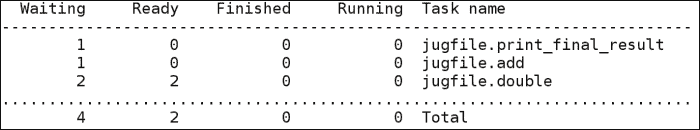
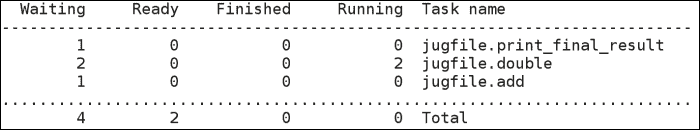
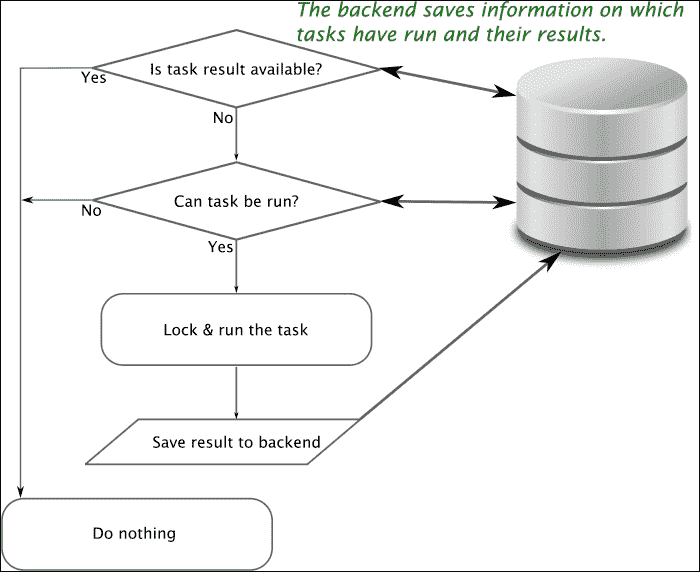
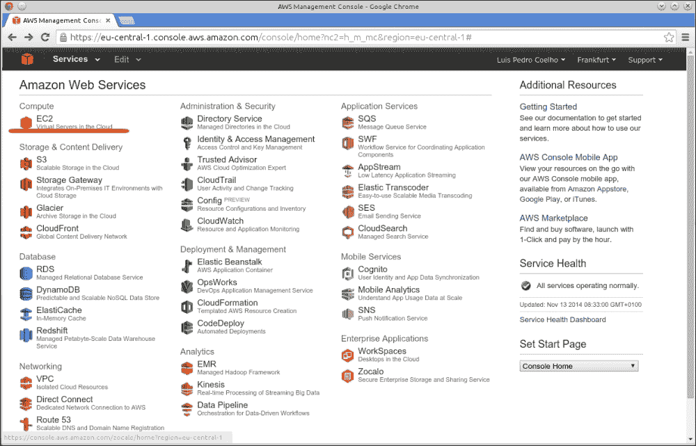
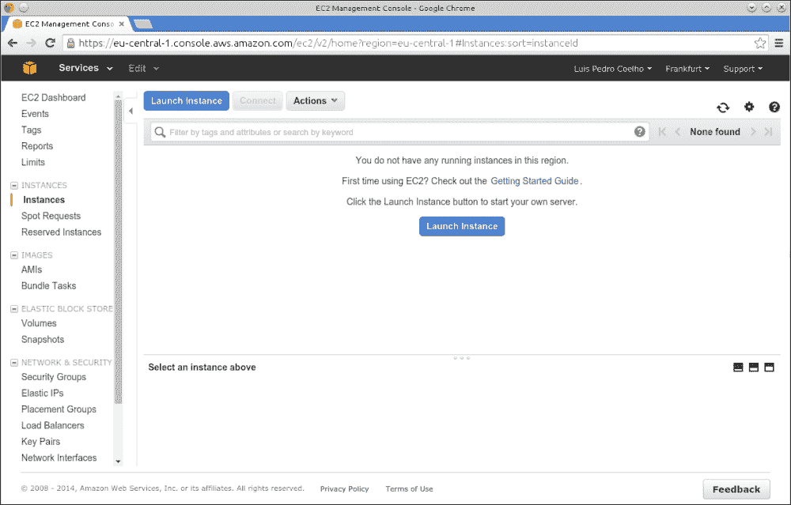
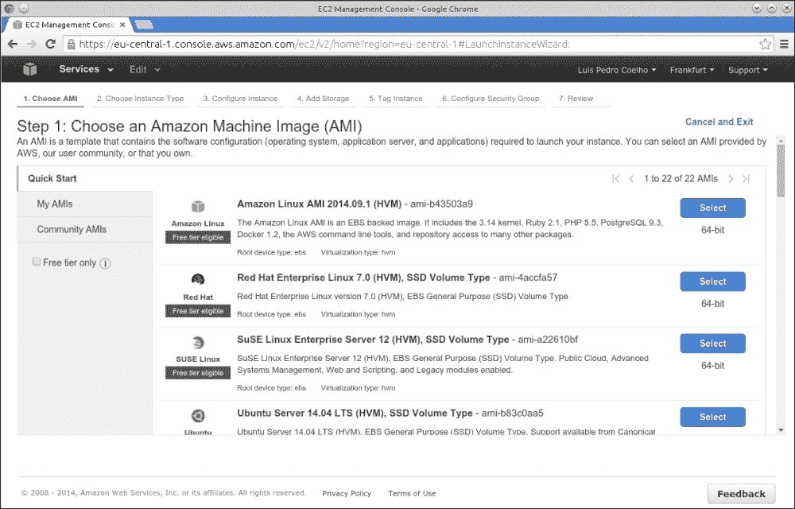
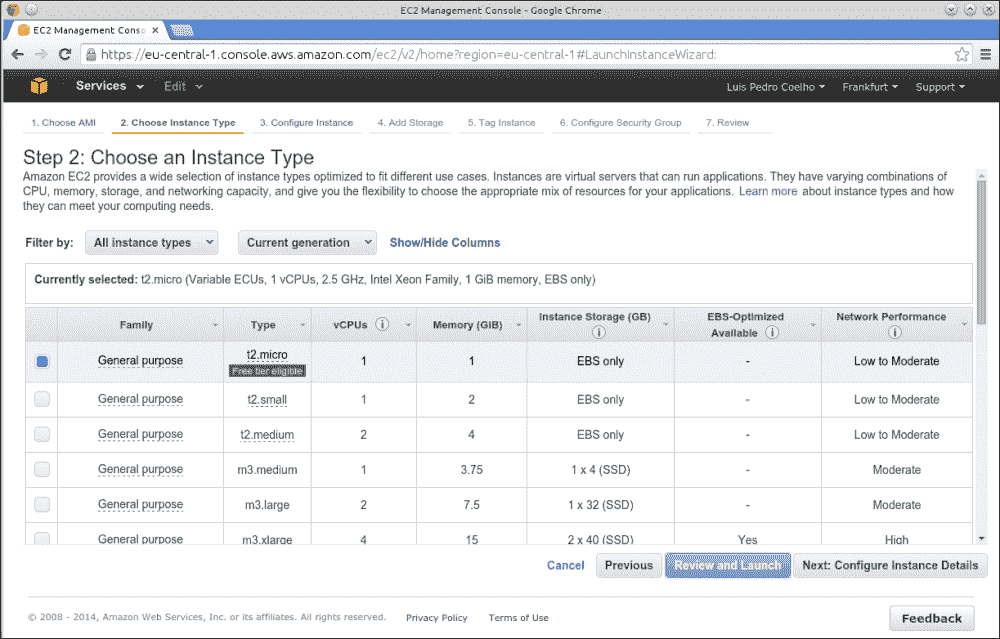
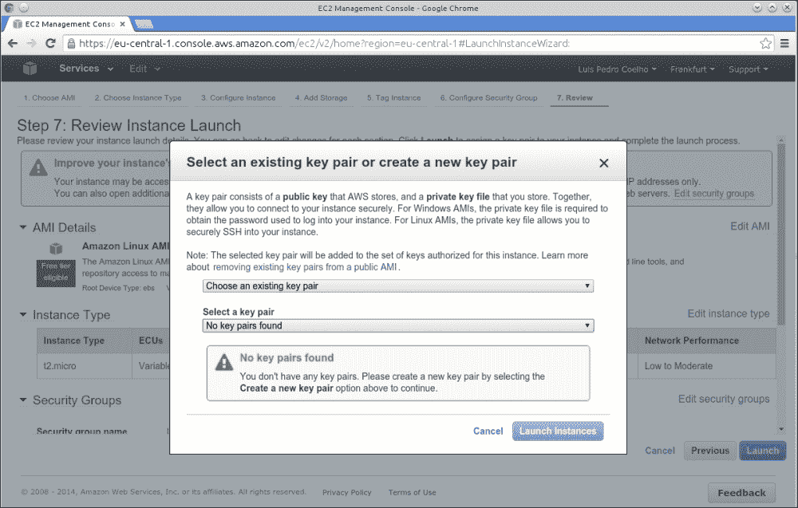
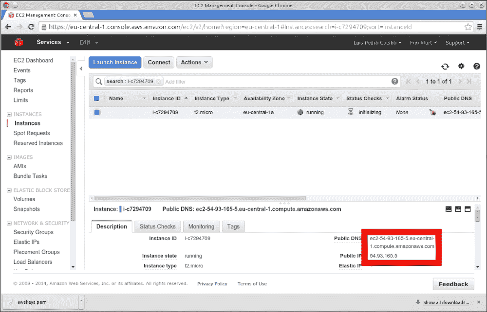
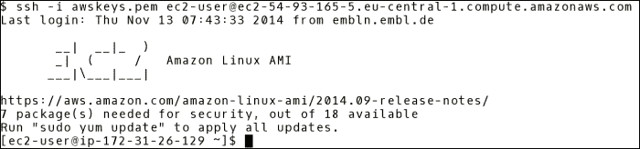

# 第十二章. 更大的数据

很难界定什么是大数据。我们将采用一种操作性定义：当数据变得庞大到难以处理时，我们称之为**大数据**。在某些领域，这可能意味着拍字节级的数据或万亿级的交易数据：这些数据无法完全存储在单个硬盘中。在其他情况下，它可能只有一百倍小，但仍然难以处理。

为什么数据本身成为了一个问题？虽然计算机的处理速度不断提高，内存也在增加，但数据的规模也在不断增长。事实上，数据的增长速度快于计算速度，而且很少有算法能够随着输入数据规模的增加而线性扩展——综合来看，这意味着数据的增长速度超过了我们处理它的能力。

我们将首先基于前几章的一些经验，处理我们可以称之为中等数据规模的问题（不是大数据，但也不算小）。为此，我们将使用一个叫做**jug**的包，它使我们能够执行以下任务：

+   将你的管道分解为任务

+   缓存（*缓存*）中间结果

+   利用多个核心，包括网格上的多台计算机

下一步是转向真正的*大数据*，我们将看到如何使用云计算。特别地，你将了解 Amazon Web Services 基础设施。在这一部分，我们介绍了另一个名为 StarCluster 的 Python 包来管理集群。

# 学习大数据

"大数据"这一表达并不意味着特定数量的数据，无论是数据样本的数量，还是数据占用的千兆字节、太字节或拍字节的数量。它意味着数据的增长速度快于处理能力的提升。这意味着以下几点：

+   过去有效的方法和技术现在需要重新做或替换，因为它们无法很好地扩展到新的输入数据规模。

+   算法不能假设所有输入数据都能装入内存。

+   管理数据本身成为了一项主要任务

+   使用计算机集群或多核机器已经不再是奢侈，而是必要。

本章将重点讲解这一拼图的最后一块：如何利用多个核心（无论是在同一台机器上还是在不同机器上）来加速和组织你的计算。这对于其他中等规模的数据任务也会有帮助。

## 使用 jug 将你的管道分解为任务

我们通常有一个简单的管道：我们对初始数据进行预处理，计算特征，然后用计算出的特征调用机器学习算法。

Jug 是由本书作者之一 Luis Pedro Coelho 开发的一个包。它是开源的（使用自由的 MIT 许可），在许多领域都能派上用场，但它是专门围绕数据分析问题设计的。它同时解决了多个问题，例如：

+   它可以将结果*缓存*到磁盘（或数据库），这意味着如果你要求它计算已经计算过的内容，结果将直接从磁盘读取。

+   它可以使用多个核心，甚至在集群中的多台计算机上运行。Jug 的设计也非常适合批处理计算环境，这些环境使用排队系统，如**PBS**（**Portable Batch System**）、**LSF**（**Load Sharing Facility**）或**Grid Engine**。这将在本章后半部分使用，我们将构建在线集群并向它们分配任务。

## jug 中的任务简介

任务是 jug 的基本构建块。一个任务由一个函数和其参数值组成。考虑这个简单的例子：

```py
def double(x):
 return 2*x

```

在本章中，代码示例通常需要键入到脚本文件中。因此，它们不会显示`>>>`标记。应该在 shell 中输入的命令会以美元符号（`$`）作为前缀。

一个任务可以是“调用 double，参数为 3”。另一个任务可以是“调用 double，参数为 642.34”。使用 jug，我们可以按如下方式构建这些任务：

```py
from jug import Task
t1 = Task(double, 3)
t2 = Task(double, 642.34)

```

将其保存为名为`jugfile.py`的文件（这只是一个常规的 Python 文件）。现在，我们可以运行`jug execute`来执行这些任务。这是你在命令行中输入的，而不是在 Python 提示符下输入的，因此我们用美元符号（`$`）标记它：

```py
$ jug execute

```

你还会收到一些关于任务的反馈（jug 会显示两个名为`double`的任务被执行）。再次运行`jug execute`，它会告诉你它什么也没做！其实它不需要做任何事情。在这种情况下，我们并没有获得太多收益，但如果任务计算时间很长，这个缓存将非常有用。

你可能会注意到，在硬盘上出现了一个名为`jugfile.jugdata`的新目录，并且里面有一些奇怪命名的文件。这是记忆化缓存。如果你删除它，`jug execute`将会重新运行所有任务。

通常，区分纯函数和更一般的函数是有益的，纯函数只是接受输入并返回结果，而一般函数可以执行一些动作（例如从文件中读取、写入文件、访问全局变量、修改其参数，或任何该语言允许的操作）。一些编程语言，比如 Haskell，甚至有语法方法来区分纯函数和不纯函数。

使用 jug 时，你的任务不需要完全纯粹。甚至建议你使用任务来读取数据或写入结果。然而，访问和修改全局变量将不能很好地工作：任务可能在不同的处理器上以任何顺序执行。全局常量除外，但即使是常量，也可能会干扰记忆化系统（如果值在执行过程中发生变化）。类似地，你不应该修改输入值。jug 有一个调试模式（使用`jug execute --debug`），虽然它会减慢计算速度，但如果你犯了类似的错误，它会给你有用的错误信息。

上面的代码是有效的，但有些繁琐。你总是在重复使用`Task(function, argument)`这个构造。利用一些 Python 技巧，我们可以使代码看起来更加自然，如下所示：

```py
from jug import TaskGenerator
from time import sleep

@TaskGenerator
def double(x):
 sleep(4)
 return 2*x

@TaskGenerator
def add(a, b):
 return a + b

@TaskGenerator
def print_final_result(oname, value):
 with open(oname, 'w') as output:
 output.write('Final result: {}\n'.format(value))

y = double(2)
z = double(y)

y2 = double(7)
z2 = double(y2)
print_final_result('output.txt', add(z,z2))

```

除了使用`TaskGenerator`，前面的代码实际上可以是一个标准的 Python 文件！然而，使用`TaskGenerator`，它实际上创建了一系列任务，现在可以以一种利用多个处理器的方式来运行它。在幕后，装饰器将你的函数转化为在调用时不执行，而是创建一个`Task`对象。我们还利用了可以将任务传递给其他任务的事实，这会生成一个依赖关系。

你可能已经注意到，我们在前面的代码中添加了一些`sleep(4)`调用。这是为了模拟运行一个长时间的计算。否则，这个示例运行得非常快，根本没有使用多个处理器的必要。

我们通过运行`jug status`来开始，结果如下图所示：



现在，我们同时启动两个进程（在后台使用`&`操作符）：

```py
$ jug execute &
$ jug execute &

```

现在，我们再次运行`jug status`：



我们可以看到，两个初始的双重操作符正在同时运行。大约 8 秒后，整个过程将完成，`output.txt` 文件将被写入。

顺便提一下，如果你的文件名不是`jugfile.py`，你就需要在命令行上显式指定它。例如，如果你的文件名是`analysis.py`，你应该运行以下命令：

```py
$ jug execute analysis.py

```

这就是不使用`jugfile.py`名称的唯一缺点。所以，尽管使用更有意义的名称吧。

## 查看引擎盖下

jug 是如何工作的？从基本层面上来说，它非常简单。一个`Task`是一个函数加上它的参数。它的参数可以是值，也可以是其他任务。如果一个任务依赖于其他任务，那么这两个任务之间就有了依赖关系（并且第二个任务在第一个任务的结果可用之前无法运行）。

基于此，jug 会递归地计算每个任务的哈希值。这个哈希值编码了整个计算过程，以获得结果。当你运行`jug execute`时，对于每个任务，会有一个小循环执行以下流程图中展示的逻辑：



默认的后端将文件写入磁盘（在这个名为`jugfile.jugdata/`的有趣目录中）。另外，还有一个后端可用，使用 Redis 数据库。通过适当的锁定，jug 会处理这个问题，这也允许多个处理器执行任务；每个进程将独立查看所有任务，并运行那些尚未执行的任务，然后将它们写回共享的后端。这在同一台机器（使用多核处理器）或多台机器上都可以运行，只要它们都能访问相同的后端（例如，使用网络磁盘或 Redis 数据库）。在本章的后半部分，我们将讨论计算机集群，但现在我们先专注于多个核心。

你也可以理解为什么它能够记忆中间结果。如果后端已经有某个任务的结果，它就不会再执行。如果你更改了任务，即使是微小的更改（例如修改了某个参数），其哈希值也会改变。因此，任务会被重新执行。此外，所有依赖于该任务的任务也会改变它们的哈希值，并且会被重新执行。

## 使用 jug 进行数据分析

Jug 是一个通用框架，但它非常适合中等规模的数据分析。在开发分析管道时，最好让中间结果自动保存。如果你之前已经计算过预处理步骤，并且只是在更改计算的特征，你就不希望重新计算预处理步骤。如果你已经计算过特征，但希望尝试将一些新的特征组合起来，你也不希望重新计算所有其他特征。

Jug 还特别优化了与 NumPy 数组的协作。每当你的任务返回或接收 NumPy 数组时，你就利用了这种优化。Jug 是这个生态系统中的另一部分，所有内容都在一起工作。

现在，我们回顾一下第十章，*计算机视觉*。在那一章中，我们学习了如何计算图像的特征。记住，基本管道包括以下特征：

+   加载图像文件

+   计算特征

+   合并这些特征

+   归一化特征

+   创建分类器

我们将重新进行这个练习，但这次将使用 jug。这个版本的优势在于，现在可以在不需要重新计算整个管道的情况下，添加新的特征或分类器。

我们首先进行以下几个导入：

```py
from jug import TaskGenerator
import mahotas as mh
from glob import glob

```

现在，我们定义第一个任务生成器和特征计算函数：

```py
@TaskGenerator
def compute_texture(im):
 from features import texture
 imc = mh.imread(im)
 return texture(mh.colors.rgb2gray(imc))

@TaskGenerator
def chist_file(fname):
 from features import chist
 im = mh.imread(fname)
 return chist(im)

```

我们导入的`features`模块来自第十章，*计算机视觉*。

### 注意

我们编写的函数将文件名作为输入，而不是图像数组。当然，使用完整的图像也是可行的，但这是一个小的优化。文件名是字符串，在写入后端时相对较小。如果需要计算哈希值，也非常快速。此外，这样可以确保只有需要图像的进程才会加载它们。

我们可以在任何函数上使用`TaskGenerator`。即使是我们没有编写的函数，例如`np.array`、`np.hstack`，或者下面的命令，这也成立：

```py
import numpy as np
to_array = TaskGenerator(np.array)
hstack = TaskGenerator(np.hstack)

haralicks = []
chists = []
labels = []

# Change this variable to point to
# the location of the dataset on disk
basedir = '../SimpleImageDataset/'
# Use glob to get all the images
images = glob('{}/*.jpg'.format(basedir))

for fname in sorted(images):
 haralicks.append(compute_texture(fname))
 chists.append(chist_file(fname))
 # The class is encoded in the filename as xxxx00.jpg
 labels.append(fname[:-len('00.jpg')])

haralicks = to_array(haralicks)
chists = to_array(chists)
labels = to_array(labels)

```

使用 jug 的一个小不便之处是，我们必须始终编写函数将结果输出到文件，如前面的示例所示。这是使用 jug 的额外便利性所付出的一个小代价。

```py
@TaskGenerator
def accuracy(features, labels):
 from sklearn.linear_model import LogisticRegression
 from sklearn.pipeline import Pipeline
 from sklearn.preprocessing import StandardScaler
 from sklearn import cross_validation

 clf = Pipeline([('preproc', StandardScaler()),
 ('classifier', LogisticRegression())])
 cv = cross_validation.LeaveOneOut(len(features))
 scores = cross_validation.cross_val_score(
 clf, features, labels, cv=cv)
 return scores.mean()

```

请注意，我们仅在此函数内部导入`sklearn`。这是一个小优化。这样，只有在真正需要时，`sklearn`才会被导入：

```py
scores_base = accuracy(haralicks, labels)
scores_chist = accuracy(chists, labels)

combined = hstack([chists, haralicks])
scores_combined  = accuracy(combined, labels)

```

最后，我们编写并调用一个函数来输出所有结果。它期望其参数是一个包含算法名称和结果的对列表：

```py
@TaskGenerator
def print_results(scores):
 with open('results.image.txt', 'w') as output:
 for k,v in scores:
 output.write('Accuracy [{}]: {:.1%}\n'.format(
 k, v.mean()))

print_results([
 ('base', scores_base),
 ('chists', scores_chist),
 ('combined' , scores_combined),
 ])

```

就是这样。现在，在 shell 中运行以下命令，通过 jug 运行这个管道：

```py
$ jug execute image-classification.py

```

## 复用部分结果

例如，假设你想添加一个新功能（甚至是一组功能）。正如我们在第十章中看到的，*计算机视觉*，通过更改特征计算代码是很容易做到的。然而，这将意味着需要重新计算所有特征，这样是浪费的，尤其是当你想快速测试新特征和技术时。

我们现在添加一组特征，也就是另一种叫做线性二值模式的纹理特征。这在 mahotas 中已实现；我们只需要调用一个函数，但我们将其封装在 `TaskGenerator` 中：

```py
@TaskGenerator
def compute_lbp(fname):
 from mahotas.features import lbp
 imc = mh.imread(fname)
 im = mh.colors.rgb2grey(imc)
 # The parameters 'radius' and 'points' are set to typical values
 # check the documentation for their exact meaning
 return lbp(im, radius=8, points=6)

```

我们替换了之前的循环，增加了一个额外的函数调用：

```py
lbps = []
for fname in sorted(images):
 # the rest of the loop as before
 lbps.append(compute_lbp(fname))
lbps = to_array(lbps)

```

我们使用这些较新的特征来计算准确度：

```py
scores_lbps = accuracy(lbps, labels)
combined_all = hstack([chists, haralicks, lbps])
scores_combined_all = accuracy(combined_all, labels)

print_results([
 ('base', scores_base),
 ('chists', scores_chist),
 ('lbps', scores_lbps),
 ('combined' , scores_combined),
 ('combined_all' , scores_combined_all),
 ])

```

现在，当你再次运行 `jug execute` 时，新的特征将被计算出来，但旧的特征将从缓存中加载。这就是 jug 强大的地方。它确保你始终得到你想要的结果，同时避免不必要地重新计算缓存的结果。你还会看到，添加这组特征集改善了之前的方法。

本章未能提及 jug 的所有功能，但以下是我们未在正文中涵盖的一些可能感兴趣的功能总结：

+   `jug invalidate`：这声明给定函数的所有结果应被视为无效，并需要重新计算。这还将重新计算任何依赖于（即使是间接依赖）无效结果的下游计算。

+   `jug status --cache`：如果 `jug status` 运行时间过长，你可以使用 `--cache` 标志来缓存状态并加快速度。请注意，这不会检测 jugfile 的任何更改，但你可以随时使用 `--cache --clear` 来清除缓存并重新开始。

+   `jug cleanup`：这将删除备忘缓存中的所有额外文件。这是一个垃圾回收操作。

### 注意

还有其他更高级的功能，允许你查看在 jugfile 内部已计算的值。请阅读 jug 文档中的有关屏障等功能，网址为 [`jug.rtfd.org`](http://jug.rtfd.org)。

# 使用亚马逊 Web 服务

当你有大量数据和大量计算需要执行时，你可能会开始渴望更多的计算能力。亚马逊（[`aws.amazon.com`](http://aws.amazon.com)）允许你按小时租用计算能力。这样，你可以在不需要提前购买大量机器（包括管理基础设施成本）的情况下，访问大量的计算能力。市场上还有其他竞争者，但亚马逊是最大的玩家，因此我们在此简单介绍。

**亚马逊网络服务**（**AWS**）是一个大型服务集。我们将只关注**弹性计算云**（**EC2**）服务。此服务为您提供虚拟机和磁盘空间，可以快速分配和释放。

使用有三种模式。第一种是预留模式，您通过预付费获得更便宜的每小时访问费用，固定的每小时费用，以及一个变化的费用，这取决于整体计算市场（当需求较少时，费用较低；当需求较多时，价格会上涨）。

在这个通用系统的基础上，有几种不同类型的机器可供选择，成本各异，从单核到具有大量内存或甚至图形处理单元（GPU）的多核系统。稍后我们会看到，您还可以获取几台较便宜的机器并构建一个虚拟集群。您还可以选择获取 Linux 或 Windows 服务器（Linux 略便宜）。在本章中，我们将在 Linux 上操作示例，但大部分信息对于 Windows 机器同样适用。

对于测试，您可以使用**免费层**中的单台机器。这允许您操作系统，熟悉界面等。请注意，这台机器的 CPU 较慢。

资源可以通过网页界面进行管理。但是，也可以通过编程方式进行管理，并编写脚本来分配虚拟机、格式化硬盘并执行所有通过网页界面可能执行的操作。事实上，虽然网页界面变化频繁（本书中展示的一些截图可能在出版时已经过时），但编程接口更加稳定，且自服务推出以来，整体架构保持稳定。

访问 AWS 服务通过传统的用户名/密码系统进行，尽管亚马逊将用户名称为*访问密钥*，密码称为*秘密密钥*。他们这样做可能是为了将其与用于访问网页界面的用户名/密码分开。事实上，您可以创建任意多的访问/秘密密钥对，并为其分配不同的权限。这对于较大的团队非常有帮助，团队中的高级用户可以访问完整的网页面板，进而为权限较少的开发人员创建其他密钥。

### 注意

亚马逊公司有多个区域。这些区域对应世界上的物理位置：美国西海岸、美国东海岸、几个亚洲位置、一个南美位置以及两个欧洲位置。如果您要传输数据，最好将数据保持在接收和发送的地方附近。此外，请记住，如果您处理用户信息，可能会有关于将数据传输到另一个司法管辖区的监管问题。在这种情况下，请咨询一位知情的律师，了解将关于欧洲客户的数据传输到美国或其他类似的转移所涉及的法律问题。

亚马逊云服务是一个非常庞大的话题，专门覆盖 AWS 的书籍有很多。本章的目的是让你对 AWS 所提供的服务和可能实现的功能有一个整体印象。本书的实践精神就是通过示例来实现这一目标，但我们并不会涵盖所有可能性。

## 创建你的第一个虚拟机

第一步是访问[`aws.amazon.com/`](http://aws.amazon.com/)并创建一个账户。这些步骤与任何其他在线服务相似。一个机器是免费的，但如果你需要更多的机器，你将需要一张信用卡。在本示例中，我们将使用几台机器，因此如果你想跟着做，可能会花费你一些费用。如果你还不准备提供信用卡，你当然可以先阅读这一章，了解 AWS 提供的服务，而不需要亲自操作示例。然后你可以做出更有信息的决定，看看是否注册。

一旦你注册 AWS 并登录，你将进入控制台。在这里，你将看到 AWS 提供的众多服务，如下图所示：



我们选择并点击**EC2**（左侧栏中最顶部的元素——这是本书写作时显示的面板。亚马逊会定期进行小的更改，所以你看到的可能与我们书中的稍有不同）。现在我们看到了 EC2 管理控制台，如下图所示：



在右上角，你可以选择你的区域（请参见亚马逊区域信息框）。注意，*你只会看到你当前选择的区域的信息*。因此，如果你错误地选择了错误的区域（或者有多个区域的机器在运行），你的机器可能不会出现（这似乎是使用 EC2 网页管理控制台时常见的陷阱）。

在 EC2 术语中，正在运行的服务器称为**实例**。我们选择**启动实例**，这将进入下一个屏幕，要求我们选择要使用的操作系统：



选择**Amazon Linux**选项（如果你熟悉其他提供的 Linux 发行版，比如 Red Hat、SUSE 或 Ubuntu，你也可以选择其中一个，但配置会有所不同）。现在你已经选择了软件，接下来需要选择硬件。在下一个屏幕中，你将被要求选择要使用的机器类型：



我们将从一个**t2.micro**类型的实例开始（**t1.micro**类型是较老的、性能更弱的机器）。这是最小的机器，并且是免费的。不断点击**下一步**并接受所有默认设置，直到你看到提到密钥对的屏幕：



我们将为密钥对选择 `awskeys` 这个名字。然后勾选 **Create a new key pair**。将密钥对文件命名为 `awskeys.pem`。下载并将此文件保存在一个安全的位置！这是 SSH（安全外壳）密钥，允许您登录到云端机器。接受其余默认设置，您的实例将会启动。

现在，您需要等待几分钟，直到您的实例启动完成。最终，实例将显示为绿色，并且状态为 **running**：



在前面的截图中，您应该能看到公共 IP 地址，可以用来登录实例，具体如下：

```py
$ ssh -i awskeys.pem ec2-user@54.93.165.5

```

因此，我们将调用 `ssh` 命令，并将之前下载的密钥文件作为身份验证文件传递给它（使用 `-i` 选项）。我们作为 `ec2-user` 用户，登录到 IP 地址为 54.93.165.5 的机器。这个地址在您的情况下当然会有所不同。如果您为实例选择了其他发行版，用户名也可能会变化。在这种情况下，您可以尝试以 `root`、`ubuntu`（对于 Ubuntu 发行版）或 `fedora`（对于 Fedora 发行版）登录。

最后，如果您正在运行 Unix 风格的操作系统（包括 macOS），您可能需要通过以下命令调整其权限：

```py
$ chmod 600 awskeys.pem

```

这仅为当前用户设置读写权限。否则，SSH 会给您一个丑陋的警告。

现在，您应该能够登录到您的机器。如果一切正常，您应该能看到如下面截图所示的横幅：



这是一个常规的 Linux 机器，您拥有 `sudo` 权限：通过在命令前加上 `sudo`，您可以以超级用户身份运行任何命令。您可以运行系统推荐的 `update` 命令来让您的机器保持最新状态。

### 在 Amazon Linux 上安装 Python 包

如果您更喜欢其他发行版，您可以利用您对该发行版的了解来安装 Python、NumPy 等包。在这里，我们将在标准的 Amazon 发行版上进行操作。我们首先安装几个基本的 Python 包，具体如下：

```py
$ sudo yum -y install python-devel \
 python-pip numpy scipy python-matplotlib

```

为了编译 mahotas，我们还需要一个 C++ 编译器：

```py
$ sudo yum -y install gcc-c++

```

最后，我们安装 `git`，以确保能够获取到本书的最新代码：

```py
$ sudo yum -y install git

```

在该系统中，pip 被安装为 `python-pip`。为了方便起见，我们将使用 pip 升级它自身。然后，我们将使用 pip 安装必要的包，具体如下：

```py
$ sudo pip-python install -U pip
$ sudo pip install scikit-learn jug mahotas

```

此时，您可以使用 pip 安装任何其他您希望安装的包。

### 在我们的云机器上运行 jug

我们现在可以使用以下命令序列来下载本书的数据和代码：

```py
$ git clone \
https://github.com/luispedro/BuildingMachineLearningSystemsWithPython
$ cd BuildingMachineLearningSystemsWithPython
$ cd ch12

```

最后，我们运行以下命令：

```py
$ jug execute

```

这可以正常工作，但我们将不得不等待很长时间才能看到结果。我们的免费级别机器（t2.micro 类型）速度较慢，且仅有一个处理器。因此，我们将 *升级我们的机器*！

我们返回到 EC2 控制台，右键单击正在运行的实例以获得弹出菜单。我们需要首先停止该实例。这相当于关闭虚拟机。你可以随时停止你的机器，停止后就不再为其付费。请注意，你仍在使用磁盘空间，这部分会单独计费。你也可以终止实例，这样会销毁磁盘，丢失机器上保存的所有信息。

一旦机器停止，**更改实例类型** 选项将变得可用。现在，我们可以选择一个更强大的实例，例如具有八个核心的 **c1.xlarge** 实例。机器仍然是关闭的，所以你需要重新启动它（相当于虚拟机的开机）。

### 提示

AWS 提供了几种不同价格的实例类型。由于这些信息会随着更强大的选项引入和价格变化（通常是变便宜）而不断更新，我们无法在书中提供太多细节，但你可以在 Amazon 网站上找到最新的信息。

我们需要等待实例重新启动。一旦它恢复，按照之前的方式查找其 IP 地址。当你更改实例类型时，实例会被分配一个新的地址。

### 提示

你可以使用 Amazon.com 的弹性 IP 功能为实例分配固定 IP，弹性 IP 在 EC2 控制台的左侧可以找到。如果你经常创建和修改实例，这会非常有用。使用该功能会有少量费用。

拥有八个核心，你可以同时运行八个 jug 进程，如下面的代码所示：

```py
$ # the loop below runs 8 times
$ for counter in $(seq 8); do
>     jug execute &
> done

```

使用 `jug status` 检查这八个任务是否正在运行。任务完成后（这应该会很快），你可以停止机器并将其降级回 **t2.micro** 实例以节省费用。微型实例可以免费使用（在某些限制范围内），而我们使用的 **c1.xlarge** 实例则需要每小时 0.064 美元（截至 2015 年 2 月—请查阅 AWS 网站获取最新信息）。

## 使用 StarCluster 自动生成集群

正如我们刚刚学到的，我们可以使用 Web 界面创建机器，但这很快变得乏味且容易出错。幸运的是，Amazon 提供了一个 API。这意味着我们可以编写脚本，自动执行我们之前讨论的所有操作。更好的是，其他人已经开发了工具，可以用来机制化并自动化你想要在 AWS 上执行的许多流程。

麻省理工学院的一个小组开发了这样一个工具，名为 StarCluster。它恰好是一个 Python 包，所以你可以使用 Python 工具按照如下方式安装它：

```py
$ sudo pip install starcluster

```

你可以从 Amazon 机器或本地机器上运行此操作。两种选择都可以使用。

我们需要指定集群的配置。我们通过编辑配置文件来实现这一点。我们通过运行以下命令生成模板配置文件：

```py
$ starcluster help

```

然后选择在`~/.starcluster/config`中生成配置文件的选项。完成后，我们将手动编辑它。

### 提示

**密钥，密钥，再来一点密钥**

在处理 AWS 时，有三种完全不同类型的密钥非常重要。首先是标准的用户名/密码组合，用于登录网站。其次是 SSH 密钥系统，它是一个通过文件实现的公钥/私钥系统；通过公钥文件，您可以登录远程机器。第三是 AWS 访问密钥/秘密密钥系统，它只是一个用户名/密码的形式，允许您在同一账户中拥有多个用户（包括为每个用户添加不同的权限，但本书不涉及这些高级功能）。

要查找我们的访问/密钥，返回 AWS 控制台，点击右上角的用户名，选择**安全凭证**。现在在屏幕底部应该会看到我们的访问密钥，它可能类似于**AAKIIT7HHF6IUSN3OCAA**，我们将在本章中使用它作为示例。

现在，编辑配置文件。这是一个标准的`.ini`文件：一个文本文件，其中每个部分以括号中的名称开始，选项则以`name=value`格式指定。第一个部分是`aws info`部分，您需要将密钥复制并粘贴到这里：

```py
[aws info]
AWS_ACCESS_KEY_ID =  AAKIIT7HHF6IUSN3OCAA
AWS_SECRET_ACCESS_KEY = <your secret key>
```

接下来是有趣的部分，即定义集群。StarCluster 允许您根据需要定义任意多个集群。初始文件中有一个名为 smallcluster 的集群。它在`cluster smallcluster`部分中定义。我们将编辑它，使其如下所示：

```py
[cluster smallcluster]
KEYNAME = mykey
CLUSTER_SIZE = 16
```

这将把节点数从默认的两个节点更改为 16 个。我们还可以指定每个节点的实例类型，以及初始映像是什么（记住，映像用于初始化虚拟硬盘，它定义了您将运行的操作系统和已安装的软件）。StarCluster 有一些预定义的映像，但您也可以自己创建。

我们需要使用以下命令创建一个新的 SSH 密钥：

```py
$ starcluster createkey mykey -o ~/.ssh/mykey.rsa

```

现在我们已经配置了一个 16 节点的集群并设置了密钥，让我们试试：

```py
$ starcluster start smallcluster

```

这可能需要几分钟，因为它会分配 17 台新机器。为什么是 17 台，而不是我们的集群只有 16 个节点？StarCluster 始终会创建一个主节点。所有这些节点都共享相同的文件系统，因此我们在主节点上创建的任何内容都将被工作节点看到。这也意味着我们可以在这些集群上使用 jug。

这些集群可以按您的需求使用，但它们预先配备了一个作业队列引擎，这使得它们非常适合批处理。使用它们的过程非常简单：

1.  您登录到主节点。

1.  您在主节点上准备脚本（或者更好的是，提前准备好它们）。

1.  您将作业提交到队列中。作业可以是任何 Unix 命令。调度程序将寻找空闲节点并运行您的作业。

1.  您等待作业完成。

1.  您可以在主节点上读取结果。您现在也可以终止所有从节点以节省费用。无论如何，在您不再需要时不要让系统持续运行！否则，这将花费您（以美元和美分）。

在登录到集群之前，我们将数据复制到其中（请记住，我们之前已经将存储库克隆到`BuildingMachineLearningSystemsWithPython`）：

```py
$ dir=BuildingMachineLearningSystemsWithPython
$ starcluster put smallcluster $dir $dir

```

我们使用`$dir`变量使命令行适应单行。我们可以用一条命令登录到主节点：

```py
$ starcluster sshmaster smallcluster

```

我们也可以查找生成的机器地址，并像之前那样使用`ssh`命令，但使用上述命令，无论地址是什么，StarCluster 都会在幕后为我们处理它。

正如我们之前所说，StarCluster 为其集群提供了批处理队列系统；您编写一个脚本来执行操作，将其放入队列，它将在任何可用节点上运行。

此时，我们需要再次安装一些包。幸运的是，StarCluster 已经完成了一半的工作。如果这是一个真实的项目，我们将设置一个脚本来为我们执行所有的初始化工作。StarCluster 可以做到这一点。由于这是一个教程，我们只需再次运行安装步骤：

```py
$ pip install jug mahotas scikit-learn

```

我们可以像以前一样使用相同的`jugfile`系统，只是现在，不再直接在主节点上运行，而是在集群上进行调度。

首先，编写一个非常简单的包装脚本如下：

```py
#!/usr/bin/env bash
jug execute jugfile.py

```

将其命名为`run-jugfile.sh`并使用`chmod +x run-jugfile.sh`赋予它可执行权限。现在，我们可以使用以下命令在集群上安排十六个作业：

```py
$ for c in $(seq 16); do
>    qsub -cwd run-jugfile.sh
> done

```

这将创建 16 个作业，每个作业将运行`run-jugfile.sh`脚本，我们简称为 jug。您仍然可以按照自己的意愿使用主节点。特别是，您随时可以运行`jug status`来查看计算的状态。事实上，jug 就是在这样的环境中开发的，因此在这种环境中非常有效。

最终，计算将完成。此时，我们需要首先保存结果。然后，我们可以终止所有节点。我们在`~/results`目录下创建一个目录，并将结果复制到此处：

```py
# mkdir ~/results
# cp results.image.txt ~/results

```

现在，从集群注销回到我们的工作机器：

```py
# exit

```

现在，我们回到我们的 AWS 机器（请注意下一个代码示例中的`$`符号）。首先，我们使用`starcluster get`命令将结果复制回这台计算机（这是我们之前使用`put`命令的镜像）：

```py
$ starcluster get smallcluster results results

```

最后，为了节省费用，我们应该关闭所有节点如下：

```py
$ starcluster stop smallcluster
$ starcluster terminate smallcluster

```

### 注意

请注意，终止操作将真正销毁文件系统和所有结果。在我们的情况下，我们已经手动将最终结果复制到了安全位置。另一个可能性是让集群写入一个不被 StarCluster 分配和销毁的文件系统，但在常规实例上对您可用；事实上，这些工具的灵活性是巨大的。然而，这些高级操作不可能全部在本章中展示。

StarCluster 在 [`star.mit.edu/cluster/`](http://star.mit.edu/cluster/) 上有出色的在线文档，你应该阅读以了解更多关于该工具的所有可能性。我们这里只展示了其功能的很小一部分，并且只使用了默认设置。

# 总结

我们展示了如何使用 jug，一个小型 Python 框架来管理计算，以便利用多个核心或多台机器。虽然这个框架是通用的，但它是专门为其作者（本书的另一位作者）解决数据分析需求而构建的。因此，它有多个方面使其适配 Python 机器学习环境。

你还了解了 AWS，即亚马逊云。使用云计算通常比建设内部计算能力更有效，尤其是在需求不稳定且不断变化的情况下。StarCluster 甚至允许集群在你启动更多任务时自动扩展，在任务终止时自动缩减。

本书结束了。我们已经走过了很长的路。你学习了如何在标注数据时进行分类，在未标注数据时进行聚类。你了解了降维和主题建模，以便理解大数据集。接着，我们看了一些具体的应用（例如音乐流派分类和计算机视觉）。在实现中，我们依赖于 Python 语言。该语言拥有一个越来越庞大的数值计算包生态，建立在 NumPy 基础上。只要可能，我们依赖于 scikit-learn，但在必要时也会使用其他包。由于这些包都使用相同的基本数据结构（NumPy 多维数组），因此可以无缝地混合不同包的功能。本书中使用的所有包都是开源的，可以用于任何项目。

自然地，我们并没有涵盖所有机器学习话题。在附录中，我们提供了一些其他资源的指引，帮助感兴趣的读者进一步学习机器学习。

# 附录 A. 如何进一步学习机器学习

我们已接近本书结尾，现在花点时间看看其他可能对读者有用的资源。

网上有许多极好的资源可以用来进一步学习机器学习——多到我们无法在这里全部覆盖。因此，以下列表只能代表一小部分，并且是作者在写作时认为最好的资源，可能带有一定的偏向性。

# 在线课程

Andrew Ng 是斯坦福大学的教授，他在 Coursera ([`www.coursera.org`](http://www.coursera.org)) 上开设了一门机器学习的在线课程，作为一门大型开放在线课程。这是免费的，但可能需要投入大量时间。

# 书籍

本书侧重于机器学习的实际应用方面。我们没有呈现算法背后的思考过程，也没有讲解理论依据。如果你对机器学习的这一方面感兴趣，我们推荐 Christopher Bishop 的*《模式识别与机器学习》*。这是该领域的经典入门书籍，将教你大多数本书中使用的算法的细节。

如果你想深入了解所有复杂的数学细节，那么 Kevin P. Murphy 的*《机器学习：一种概率视角》*是一个很好的选择 ([www.cs.ubc.ca/~murphyk/MLbook](http://www.cs.ubc.ca/~murphyk/MLbook))。这本书出版于 2012 年，非常新颖，涵盖了机器学习研究的前沿。其 1100 页内容也可以作为参考书，因为几乎没有遗漏任何机器学习的内容。

## 问答网站

MetaOptimize ([`metaoptimize.com/qa`](http://metaoptimize.com/qa)) 是一个机器学习问答网站，许多非常有经验的研究者和从业者在此互动。

Cross Validated ([`stats.stackexchange.com`](http://stats.stackexchange.com)) 是一个通用的统计学问答网站，经常有关于机器学习的问题。

正如书中开头提到的，如果你对书中的某些部分有疑问，可以随时在 TwoToReal ([`www.twotoreal.com`](http://www.twotoreal.com)) 提问。我们尽量尽快回答并提供帮助。

## 博客

这里列出的是一份显然不完全的博客列表，适合从事机器学习工作的人阅读：

+   机器学习理论: [`hunch.net`](http://hunch.net)

    平均发布频率约为每月一篇，内容更具理论性，提供了额外的大脑挑战。

+   实践中的文本与数据挖掘: [`textanddatamining.blogspot.de`](http://textanddatamining.blogspot.de)

    平均发布频率为每月一篇，内容非常实用，提供总是令人惊讶的独特方法。

+   Edwin Chen's Blog: [`blog.echen.me`](http://blog.echen.me)

    平均发布频率为每月一篇，内容涵盖更多实际应用话题。

+   Machined Learnings: [`www.machinedlearnings.com`](http://www.machinedlearnings.com)

    平均发布频率为每月一篇，内容涵盖更多实际应用话题。

+   FlowingData: [`flowingdata.com`](http://flowingdata.com)

    平均发布频率为每天一篇，文章内容更多围绕统计学展开。

+   Simply Statistics: [`simplystatistics.org`](http://simplystatistics.org)

    每月发布几篇文章，内容侧重于统计学和大数据。

+   统计建模、因果推断与社会科学: [`andrewgelman.com`](http://andrewgelman.com)

    每天发布一篇文章，内容通常有趣，作者通过统计数据指出流行媒体的缺陷。

## 数据来源

如果你想尝试各种算法，可以从加州大学尔湾分校（UCI）的机器学习库中获取许多数据集。你可以在[`archive.ics.uci.edu/ml`](http://archive.ics.uci.edu/ml)找到它。

## 变得具有竞争力

了解更多关于机器学习的绝佳方式是尝试一个竞赛！Kaggle ([`www.kaggle.com`](http://www.kaggle.com)) 是一个机器学习竞赛的市场，在介绍中已经提到过。在这个网站上，你会发现多个不同结构和通常带有现金奖励的竞赛。

监督学习竞赛几乎总是遵循以下格式：你（以及每位其他参赛者）都可以访问带标签的训练数据和无标签的测试数据。你的任务是提交对测试数据的预测。当竞赛结束时，准确率最高的人获胜。奖品从荣耀到现金不等。

当然，赢得一些东西很好，但只要参与，你就可以获得许多有用的经验。因此，在竞赛结束后，你必须继续关注，因为参与者开始在论坛上分享他们的方法。大多数情况下，获胜并不是关于开发新算法，而是巧妙地预处理、归一化和组合现有方法。

# 所有被遗漏的内容

我们没有涵盖 Python 中所有可用的机器学习包。考虑到空间有限，我们选择专注于 scikit-learn。但是，还有其他选择，我们在这里列出了一些：

+   MDP 工具包 ([`mdp-toolkit.sourceforge.net`](http://mdp-toolkit.sourceforge.net))：用于数据处理的模块化工具包

+   PyBrain ([`pybrain.org`](http://pybrain.org))：基于 Python 的强化学习、人工智能和神经网络库

+   机器学习工具包（Milk）([`luispedro.org/software/milk`](http://luispedro.org/software/milk))：这个包由本书的一位作者开发，涵盖了一些 scikit-learn 中未包含的算法和技术。

+   Pattern ([`www.clips.ua.ac.be/pattern`](http://www.clips.ua.ac.be/pattern))：一个结合了网页挖掘、自然语言处理和机器学习的包，具有 Google、Twitter 和 Wikipedia 的包装 API。

一个更通用的资源是[`mloss.org`](http://mloss.org)，这是一个开源机器学习软件库。像这样的库通常情况下，质量从优秀且维护良好的软件到一次性项目然后被抛弃的项目不等。如果你的问题非常具体，而通用包没有解决方案，这可能值得一看。

# 摘要

现在我们真的到了尽头。希望你喜欢这本书，并且感觉已经准备好开始自己的机器学习冒险了。

我们也希望你理解仔细测试方法的重要性。特别是，使用正确的交叉验证方法的重要性，以及不要报告训练测试结果，因为这些结果通常是对你方法真正效果的过高估计。
