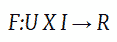
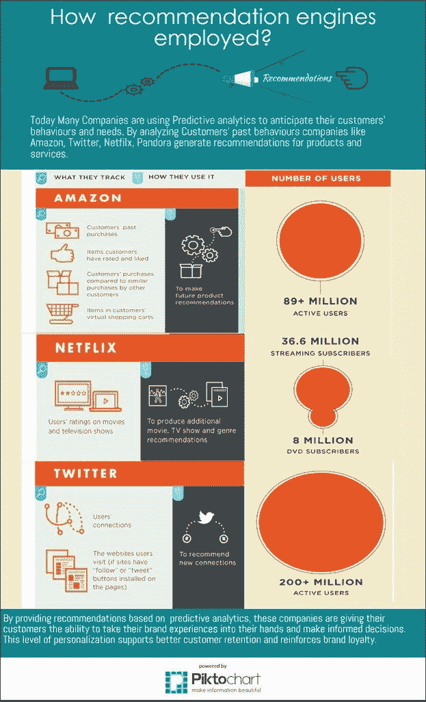
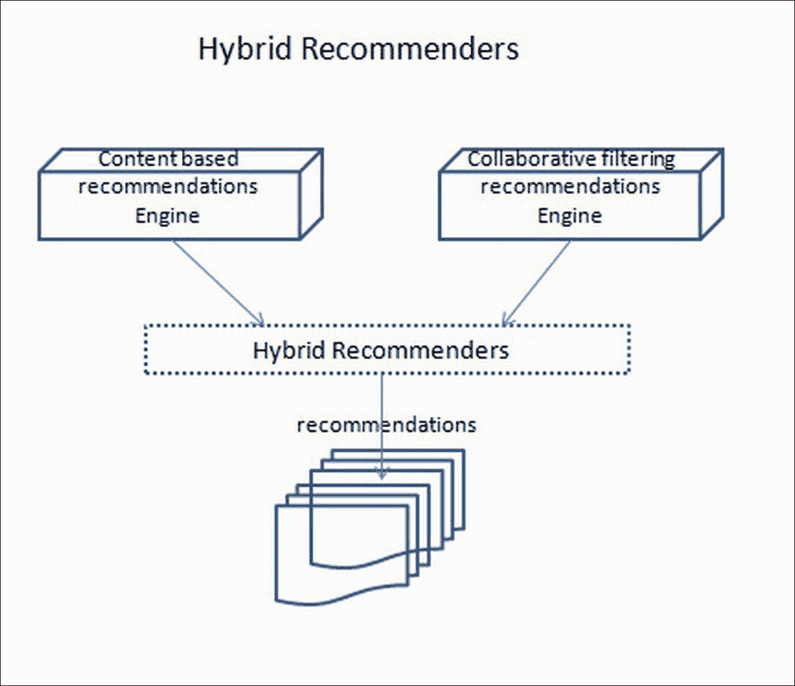
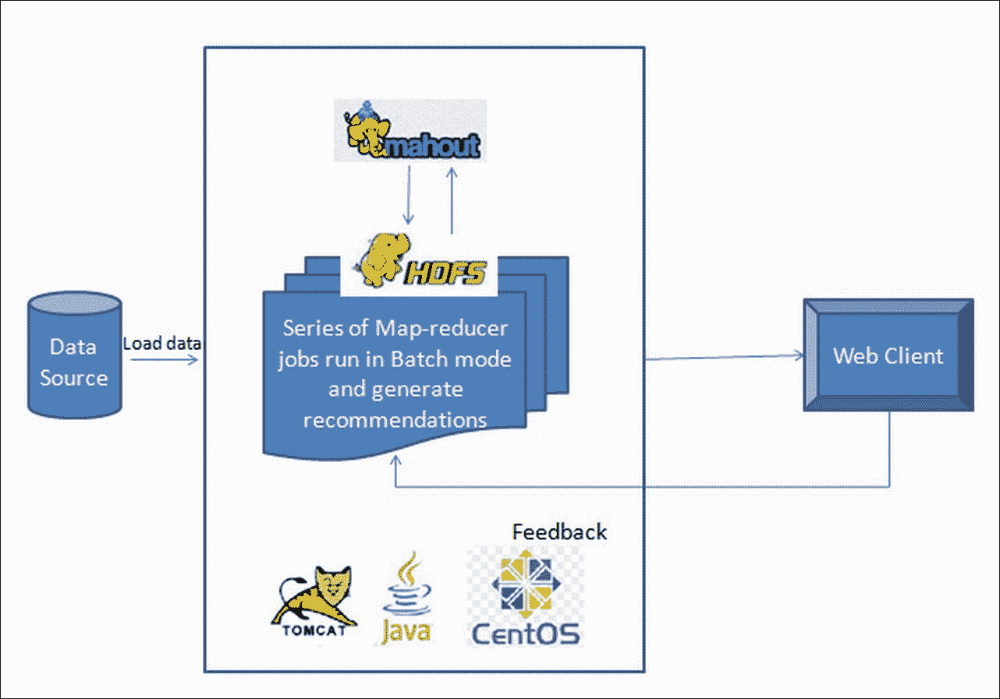
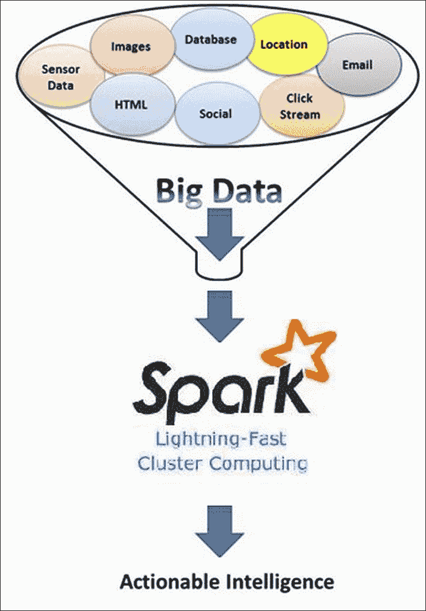
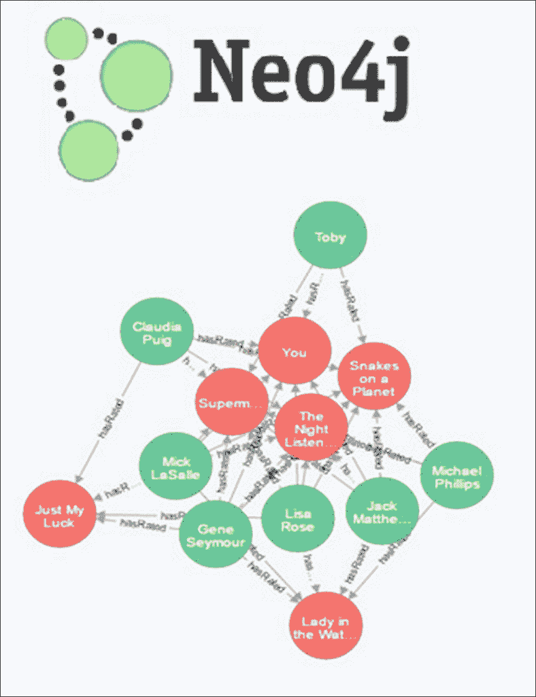

# 第一章。推荐引擎简介

我们如何购买东西？我们在日常生活中如何做出决策？在做出决策之前，我们会向朋友或亲戚寻求建议。当涉及到在线购买产品的决策时，我们会阅读匿名用户对产品的评论，比较产品的规格与其他类似产品，然后我们决定是否购买。在信息呈指数级增长的网络世界中，寻找有效信息将是一个挑战。赢得用户对搜索结果的信心将是一个更具挑战性的任务。推荐系统来帮助我们提供相关和所需的信息。

推荐引擎的实施流行起来，是由于互联网大玩家成功实施的结果。一些现实世界的例子包括亚马逊上的产品推荐、社交应用（如 Facebook、Twitter 和 LinkedIn）上的朋友推荐、YouTube 上的视频推荐、Google 新闻上的新闻推荐等。这些推荐引擎的成功实施为其他领域如旅游、医疗保健和银行领域指明了道路。

# 推荐引擎定义

推荐引擎，作为信息检索和人工智能的一个分支，是分析大量数据（尤其是产品信息和用户信息）的强大工具和技术，然后基于数据挖掘方法提供相关建议。

在技术术语中，推荐引擎问题是要开发一个数学模型或目标函数，可以预测用户将喜欢某个物品的程度。

如果 *U = {用户}*，*I = {物品}*，则 *F = 目标函数*，它衡量物品 *I* 对用户 *U* 的有用性，由以下公式给出：

其中 *R = {推荐物品}*。

对于每个用户 *u*，我们希望选择能够最大化目标函数的物品 *i*：

推荐系统的主要目标是向在线用户提供相关建议，以便从网络上的众多替代方案中做出更好的决策。更好的推荐系统更倾向于个性化推荐，在做出推荐之前会考虑用户可用的数字足迹，例如用户人口统计信息、交易细节、交互日志以及有关产品的信息，如规格、用户反馈、与其他产品的比较等：

图片来源：toptal

构建一个好的推荐引擎对系统中的参与者，即消费者和卖家，都提出了挑战。从消费者的角度来看，从可信来源获得相关建议对于决策至关重要。因此，推荐引擎需要以这种方式构建，以便赢得消费者的信任。从卖家的角度来看，在个性化层面上向消费者生成相关推荐更为重要。随着在线销售的兴起，大玩家现在正在收集大量用户的交易交互日志，以比以往任何时候都更深入地分析用户行为。此外，实时推荐的需求也在增加挑战。随着技术和研究的进步，推荐引擎正在基于大数据分析和人工智能克服这些挑战。以下图表说明了组织如何使用推荐引擎：

# 对推荐系统的需求

由于构建推荐引擎的复杂性和挑战，构建推荐系统需要大量的思考、技能、投资和技术。这样的投资是否值得？让我们看看一些事实：

+   Netflix 用户观看的电影中有三分之二是由推荐系统推荐的

+   在 Google 新闻上的点击率中有 38%是推荐链接

+   亚马逊 35%的销售额来自推荐产品

+   ChoiceStream 声称，如果人们找到他们喜欢的东西，28%的人愿意购买更多音乐

# 大数据推动推荐系统的发展

近来，推荐系统在许多方面成功影响了我们的生活。这种影响的明显例子之一就是我们的在线购物体验被重新定义了。当我们浏览电子商务网站并购买产品时，底层的推荐引擎会立即、实时地向消费者提供各种相关的建议。无论从商业参与者还是消费者的角度来看，推荐引擎都带来了巨大的益处。毫无疑问，大数据是推荐系统背后的驱动力。一个好的推荐引擎应该是可靠的、可扩展的、高度可用的，并且能够为包含的大量用户提供实时、个性化的推荐。

一个典型的推荐系统如果没有足够的数据就无法高效地完成其工作。大数据技术的引入使得公司能够捕捉到大量的用户数据，例如过去的购买记录、浏览历史和反馈信息，并将这些数据输入到推荐引擎中，以实时生成相关和有效的推荐。简而言之，即使是最先进的推荐系统，如果没有大数据的供应也无法有效。大数据和技术改进的作用，无论是在软件还是硬件方面，都不仅仅是提供大量数据。它还快速提供有意义的、可操作的数据，并提供了快速处理实时数据的必要设置。

来源：[`www.kdnuggets.com/2015/10/big-data-recommendation-systems-change-lives.html`](http://www.kdnuggets.com/2015/10/big-data-recommendation-systems-change-lives.html)。

# 推荐系统类型

既然我们已经定义了推荐系统，它们的客观性、有用性和推动推荐系统发展的动力，在本节中，我们将介绍不同类型的流行推荐系统。

## 协同过滤推荐系统

协同过滤推荐系统是推荐引擎的基本形式。在这种类型的推荐引擎中，通过用户的偏好协同地从大量替代品中过滤物品。

在协同过滤推荐系统中，基本假设是：如果两个用户在过去有相同的兴趣，那么他们将来也会有相似品味。例如，如果用户 A 和用户 B 有相似的影片偏好，而用户 A 最近观看了用户 B 尚未看过的电影《泰坦尼克号》，那么推荐的思路就是向用户 B 推荐这部未见的新电影。Netflix 上的电影推荐就是一个很好的这种推荐系统的例子。

协同过滤推荐系统有两种类型：

+   **基于用户的协同过滤**：在基于用户的协同过滤中，推荐是通过考虑用户邻域中的偏好来生成的。基于用户的协同过滤分为两个步骤：

    +   根据相似的用户偏好识别相似用户

    +   根据相似用户对活跃用户未评价物品的评价，向活跃用户推荐新物品。

+   **基于物品的协同过滤**：在基于物品的协同过滤中，推荐是通过使用物品的邻域来生成的。与基于用户的协同过滤不同，我们首先找到物品之间的相似性，然后推荐那些与活跃用户过去评价过的物品相似的未评价物品。基于物品的推荐系统分为两个步骤：

    +   根据物品偏好计算物品相似度

    +   通过找到活跃用户未评价物品的最相似物品，并推荐它们

我们将在第三章*推荐引擎解释*中深入了解这两种推荐形式。

在构建协同过滤推荐系统时，我们将了解以下方面：

+   如何计算用户之间的相似性？

+   如何计算项目之间的相似性？

+   推荐是如何生成的？

+   如何处理未知数据的新项目和用户？

协同过滤系统的优点是它们易于实现且非常准确。然而，它们也有自己的局限性，例如*冷启动*问题，这意味着协同过滤系统无法向系统内没有信息的首次用户推荐：

## 基于内容的推荐系统

在协同过滤中，我们只考虑用户-项目-偏好，并构建推荐系统。尽管这种方法是准确的，但如果我们在构建推荐引擎时考虑用户属性和项目属性，则更有意义。与协同过滤不同，我们在构建基于内容的推荐引擎时使用项目属性和用户偏好来考虑项目属性。

如其名称所示，基于内容的推荐系统使用项目的相关内容信息来构建推荐模型。基于内容的推荐系统通常包含一个用户档案生成步骤、项目档案生成步骤和模型构建步骤，以生成活跃用户的推荐。基于内容的推荐系统通过考虑项目的相关内容或特征以及用户档案来向用户推荐项目。例如，如果你在 YouTube 上搜索过莱昂内尔·梅西的视频，那么基于内容的推荐系统将学习你的偏好，并推荐其他与莱昂内尔·梅西相关的视频以及其他与足球相关的视频。

简而言之，系统推荐与用户过去喜欢的项目相似的项目。项目的相似性是基于与其他比较项目的相关特征计算的，并与用户的历史偏好相匹配。

在构建基于内容的推荐系统时，我们考虑以下问题：

+   我们如何选择产品的内容或特征？

+   我们如何创建与产品内容偏好相似的用户档案？

+   我们如何根据其特征在项目之间创建相似性？

+   我们如何持续创建和更新用户档案？

前面的考虑将在第三章中解释，即*推荐引擎解析*。这种技术不考虑用户的邻域偏好。因此，它不需要大量用户对物品的偏好来提高推荐准确性。它只考虑用户的过去偏好和物品的属性/特征。在第三章中，即*推荐引擎解析*，我们将详细了解这个系统，以及它的优缺点：

## 混合推荐系统

这种类型的推荐引擎是通过结合各种推荐系统来构建一个更健壮的系统。通过结合各种推荐系统，我们可以用另一个系统的优点来弥补一个系统的缺点，从而构建一个更健壮的系统。例如，通过结合协同过滤方法（当新物品没有评分时模型会失败）和基于内容的系统（其中包含有关物品的特征信息），可以更准确、更有效地推荐新物品。

例如，如果你是 Google 新闻的常读新闻读者，底层的推荐引擎会通过结合与你相似的人阅读的流行新闻文章以及使用你的个人偏好（通过你的先前点击信息计算得出）来向你推荐新闻文章。在这种类型的推荐系统中，在推送推荐之前，会结合协同过滤推荐和基于内容的推荐。

在构建混合模型之前，我们应该考虑以下问题：

+   应该结合哪些推荐技术来实现业务解决方案？

+   我们应该如何结合各种技术和它们的结果以获得更好的预测？

混合推荐引擎的优势在于，与单个推荐技术相比，这种方法将提高推荐的效率。这种方法还向用户推荐了良好的推荐组合，无论是在个性化层面还是在邻域层面。在第三章中，即*推荐引擎解析*，我们将了解更多关于混合推荐的内容：

## 上下文感知推荐系统

个性化推荐系统，如基于内容的推荐系统，效率低下；它们未能根据上下文提出推荐。例如，假设一位女士非常喜欢冰淇淋。也假设这位女士去了一个寒冷的地方。现在有很大可能性，一个个性化的推荐系统会建议一个流行的冰淇淋品牌。现在让我们问自己一个问题：向一个在寒冷地方的人推荐冰淇淋是正确的事情吗？相反，建议一杯咖啡更有意义。这种既个性化又上下文感知的推荐称为上下文感知推荐系统。在上面的例子中，地点就是上下文。

用户偏好可能因上下文而异，例如一天中的时间、季节、心情、地点、系统提供的选项等等。在不同的地点、不同时间与不同的人在一起的人可能需要不同的东西。上下文感知推荐系统在计算或提供推荐之前会考虑上下文。这个推荐系统在不同的上下文中以不同的方式满足人们的不同需求。

在构建上下文感知模型之前，我们应该考虑以下问题：

+   我们应该如何定义推荐系统中使用的上下文？

+   应该使用哪些技术来构建推荐以实现商业解决方案？

+   我们如何提取用户对产品的偏好上下文？

+   我们应该使用哪些技术来结合上下文偏好与用户配置文件偏好以生成推荐？

前面的图片展示了不同的人、在不同的时间和地点，以及与不同的公司，需要不同的着装推荐。

# 随着技术的进步，推荐系统的发展演变

随着技术、研究和基础设施的进步，推荐系统正在迅速发展。推荐系统正从基于简单相似度测量的方法，转向机器学习方法，再到非常先进的深度学习等高级方法。从商业角度来看，客户和组织都在寻求更个性化的推荐，以满足即时需求。为了满足大量用户和产品，我们需要复杂的系统，这些系统能够轻松扩展并快速响应。以下是可以帮助解决这一挑战的推荐类型。

## Mahout 用于可扩展的推荐系统

如前所述，大数据主要推动推荐系统的发展。大数据平台使研究人员能够访问大量数据集并在个体层面进行分析，为构建个性化推荐系统铺平了道路。随着互联网使用的增加和数据的不间断供应，高效的推荐系统不仅需要大量数据，还需要能够扩展且具有最小停机时间的基础设施。为了实现这一点，像 Apache Hadoop 生态系统这样的大数据技术提供了基础设施和平台，以提供大量数据。为了在这庞大的数据供应上构建推荐系统，**Mahout**，一个基于 Hadoop 平台构建的机器学习库，使我们能够构建可扩展的推荐系统。Mahout 提供了构建、评估和调整不同类型的推荐算法的基础设施。由于 Hadoop 是为离线批处理设计的，我们可以构建可扩展的离线推荐系统。在第九章《使用 Mahout 构建可扩展的推荐引擎》中，我们进一步了解了如何使用 Mahout 构建可扩展的推荐引擎。

下图显示了如何使用 Mahout 设计一个可扩展的推荐系统：

## Apache Spark for scalable real-time recommender systems

我们在很多电商网站上多次看到，“你可能也喜欢”这一功能。这是一个表面上简单却蕴含着客户关系管理新时代的实时服务的新时代。商业组织开始投资这样的系统，这些系统能够根据客户个性化生成推荐，并能实时交付。构建这样的系统不仅能带来良好的投资回报，而且高效的系统还能赢得用户的信心。构建一个可扩展的实时推荐系统不仅需要捕捉用户的购买历史、产品信息、用户偏好，并提取模式和推荐产品，还需要根据用户的在线互动和多标准搜索偏好即时响应。

这种能力使得提出令人信服的建议需要新一代的技术。这种技术必须考虑用户之前的购买历史、他们的偏好以及在线互动信息，如页面导航数据和多标准搜索，然后实时分析所有这些信息，并根据用户的当前和长期需求准确响应。在这本书中，我们考虑了内存和基于图系统，这些系统能够处理大规模、实时的推荐系统。

最流行的推荐引擎协同过滤在生成推荐时需要考虑用户和产品信息的全部。假设我们有一个场景，其中我们对 10,000 个产品有 100 万条用户评分。为了构建一个能够处理这种大量计算并在线响应的系统，我们需要一个与大数据兼容的系统，并在内存中处理数据。实现可扩展、实时推荐的关键技术是 Apache Spark Streaming，这是一种利用大数据可扩展性的技术，可以实时生成推荐，并在内存中处理数据：

### Neo4j 用于实时基于图的推荐系统

图数据库已经彻底改变了人们发现新产品、信息等方式。在人类大脑中，我们以图、关系和网络的形式记住人、事物、地点等。当我们尝试从这些网络中获取信息时，我们会直接前往所需的连接或图，并准确获取信息。以类似的方式，图数据库允许我们将用户和产品信息以节点和边（关系）的形式存储在图中。在图数据库中进行搜索速度快。近年来，由图数据库驱动的推荐系统使组织能够构建实时且个性化的建议。

使使用图数据库进行实时推荐的关键技术之一是 Neo4j，这是一种 NoSQL 图数据库，在提供客户洞察和产品趋势方面可以轻松超越任何其他关系型和非关系型系统。

一种名为“不仅 SQL”的 NoSQL 数据库，提供了一种不同于关系格式（如行和列）的新方式来存储和管理数据，例如列式、图、键值对存储的数据。这种新的存储和管理数据方式使我们能够构建可扩展的实时系统。

图数据库主要由节点和边组成，其中节点代表实体，边代表它们之间的关系。边是连接节点的有向线或箭头。在前面的图像中，圆圈是节点，代表实体，连接节点的线条称为边，代表关系。箭头的方向遵循信息流。通过展示图中的所有节点和链接，它帮助用户对结构有一个全局的视角。

以下图像展示了用户电影评分信息的图形表示。绿色和红色圆圈分别表示代表用户和电影的节点。用户对电影的评分以显示用户和电影之间关系的边来表示。每个节点和关系都可能包含属性以存储数据的更多详细信息。

在这个图表示中，我们应用图论的概念来实时生成推荐，因为检索和搜索非常快。在第八章，《使用 Neo4j 构建实时推荐引擎》中，我们处理了使用 Neo4j 构建实时推荐引擎的问题：

# 摘要

在本章中，我们介绍了各种流行的推荐引擎类型，如协同过滤、基于内容的推荐引擎、混合推荐器、上下文感知系统、可扩展推荐器和基于图、实时推荐器。

我们还学习了大数据如何推动推荐引擎的兴起以及一些主要 IT 巨头所采用的某些真实世界用例。在第三章，《推荐引擎详解》中，我们将更详细地了解这些推荐。在第二章，《构建你的第一个推荐引擎》中，我们学习了如何使用 R 构建基本的推荐引擎。
