# 第三章. 推荐引擎解析

在第二章《构建你的第一个推荐引擎》中，我们学习了如何使用 R 构建基本的推荐系统。在第一章《推荐引擎简介》中介绍了各种推荐系统，我们已经对推荐系统是什么以及为什么在数据爆炸的当前时代推荐系统很重要有了相当的了解。在本章中，我们将详细了解各种类型的推荐系统。本章解释了基于邻域相似度的推荐、个性化推荐引擎、基于模型的推荐系统和混合推荐引擎。

本章涵盖了以下不同子类型的推荐系统：

+   基于邻域的推荐引擎：

    +   基于用户的协同过滤

    +   基于物品的协同过滤

+   个性化推荐引擎：

    +   基于内容的推荐引擎

    +   上下文感知推荐引擎

+   基于模型的推荐引擎：

    +   基于机器学习的推荐引擎

    +   分类 - SVM/KNN

    +   矩阵分解

    +   单值分解

    +   交替最小二乘法

    +   混合推荐引擎

# 推荐引擎的演变

多年来，推荐系统已经从基本的最近邻方法发展到个性化推荐，再到上下文感知推荐，从批量推荐到实时推荐，从基本的启发式方法，如相似度计算，到更精确、更复杂的机器学习方法。

在这些推荐系统的早期阶段，仅使用产品上的用户评分来生成推荐。在这个时候，研究人员只使用了可用的评分信息。他们简单地应用了启发式方法，如使用欧几里得距离、皮尔逊系数、余弦相似度等相似度计算方法。这些方法得到了良好的反响，并且令人惊讶的是，即使今天，它们的性能仍然相当不错。

这一代推荐引擎被称为协同过滤或邻域方法推荐器。尽管它们表现非常出色，但这些推荐器也带来了一系列限制，例如冷启动问题；也就是说，它们未能向没有评分信息的新用户推荐产品，也未能向用户推荐没有评分的新产品。此外，这些推荐器还未能处理数据非常稀疏的场景，因此产品上的用户评分要少得多。

为了克服这些限制，已经开发出新的方法。例如，为了处理具有高数据稀疏性的非常大的用户评分，已经使用了如矩阵分解和单值分解等数学方法。

为了处理冷启动问题，已经开发出新的方法，如基于内容的推荐系统。这些推荐系统为许多更多机会打开了大门，例如个性化推荐系统，这使得它们能够针对每个用户在个体层面上推荐产品。在这种方法中，不是考虑评分信息，而是考虑用户的个人偏好和产品特征。

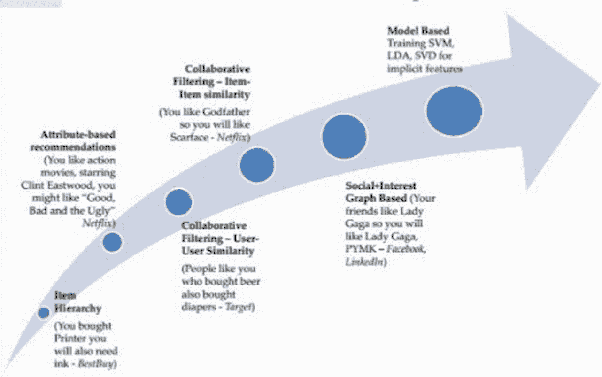

在最初，基于内容的推荐者使用了相似度计算，但随着技术和基础设施的进步，更先进的方法，如机器学习模型，已经取代了启发式方法。这些新的机器模型提高了推荐的准确性。

尽管基于内容的推荐者解决了协同过滤的许多缺点，但它们也有自己的固有缺点，如偶然性，也就是说，无法推荐超出用户偏好范围的新项目，这是协同过滤可以做到的。

为了解决这个问题，研究人员开始结合不同的推荐模型，以提出混合推荐模型，这些模型比任何单个模型都要强大得多。

随着个性化推荐引擎的成功实施，人们开始将个性化扩展到其他维度，称为上下文，例如添加位置、时间、群体等，并针对每个上下文改变推荐集。

随着大数据生态系统、内存分析工具（如 Apache Spark）和实时推荐等技术的进步，处理非常大的数据库的能力已成为可能。

目前，我们正在向更多个性化方面发展，如时间维度和无处不在的推荐方式。

在技术方面，推荐系统的建议正从机器学习方法转向更高级的神经网络深度学习方法。

# 基于最近邻的推荐引擎

正如其名所示，基于最近邻的推荐系统在向活跃用户做出建议或推荐之前，会考虑活跃用户社区或邻居用户的偏好或喜好。基于最近邻推荐者的想法非常简单：给定用户的评分，找到所有过去有相似偏好的与活跃用户相似的用户，然后对活跃用户尚未评分但在其邻居中被评分的所有未知产品做出预测： 

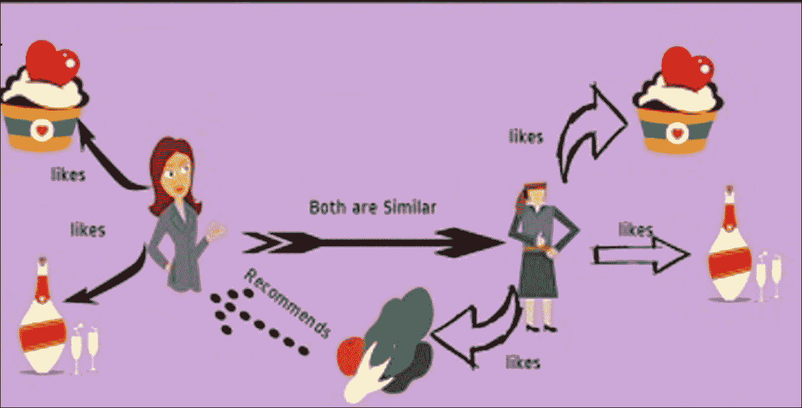

在考虑邻居的偏好或口味时，我们首先计算其他用户与活跃用户之间的相似度，然后根据预测向用户推荐用户社区中未评分的项目。在这里，活跃用户是系统提供推荐的人。由于涉及相似度计算，这些推荐系统也被称为基于相似度的推荐系统。此外，由于偏好或口味是从一组用户中协同考虑的，因此这些推荐系统也被称为协同过滤推荐系统。在这些类型的系统中，主要角色是用户、产品和用户的偏好信息，如对产品的评分/排名/喜欢。

以下图像是亚马逊的一个示例，展示了邻域案例：

这些基于启发式的方法基于以下假设：

+   过去有相似偏好的用户在未来也会有相似偏好

+   人们的偏好在未来将保持稳定和一致

协同过滤系统分为两种类型：

+   基于用户的协同过滤

+   基于物品的协同过滤

当我们只有产品的用户交互数据（如评分、喜欢/不喜欢、查看/不查看）时，会采用这些邻域方法。与下一节将要解释的内容相关的基于内容的推荐不同，它们不考虑产品的任何特征或用户对产品的个人偏好：

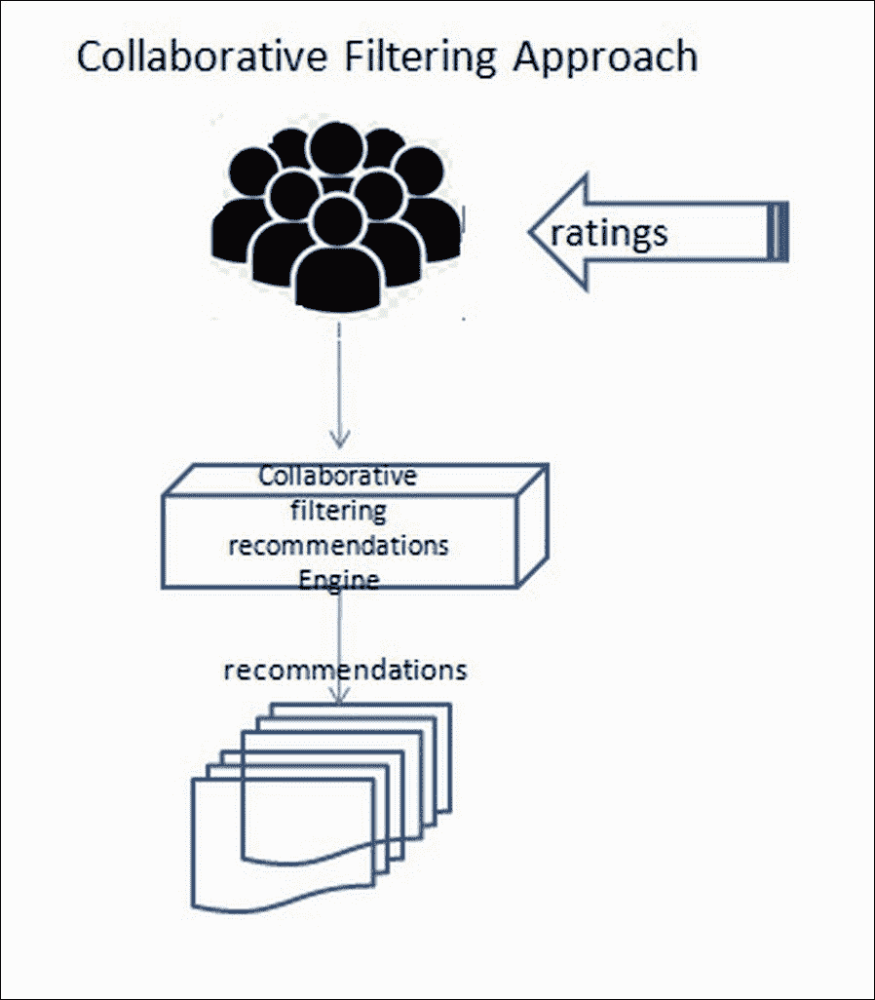

## 基于用户的协同过滤

如前所述，基于用户的协同过滤系统背后的基本直觉是，过去有相似口味的用户将来也会喜欢相似的项目。例如，如果用户 A 和用户 B 有非常相似的购买历史，并且如果用户 A 购买了一本用户 B 尚未看过的书，那么我们可以向用户 B 推荐这本书，因为他们有相似的口味。

让我们通过一个例子来尝试理解基于用户的协同过滤：

**问题陈述**：想象我们有一个数据集，用于第二章“构建你的第一个推荐引擎”，其中包含电影评论网站上评论者对电影的评分。当前的任务是为评论者推荐电影：

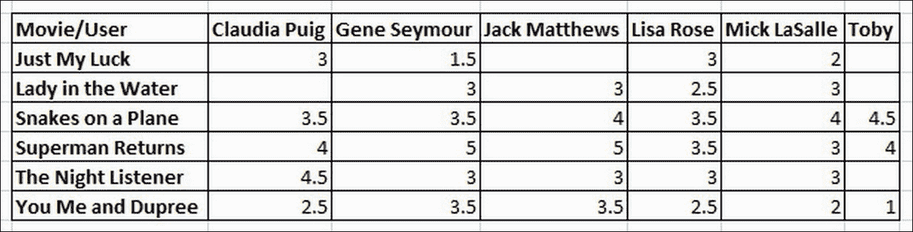

在我们学习推荐方法之前，第一步是分析手头的资料。让我们按以下步骤逐步分析数据：

+   与应用程序互动的用户集合

+   所有可用电影的目录

+   我们有个人用户对电影的评分

### 小贴士

注意，每个用户并没有对所有电影进行评分，而只是对整个目录中的一些电影进行了评分。

第一步是找到活跃用户的相似用户，然后推荐该活跃用户尚未观看但相似用户已观看的新电影。

这可以总结为两个步骤：

1.  使用电影的评分信息计算用户之间的相似度。

1.  对于每个活跃用户，考虑那些他们未评分但其他用户已评分的电影。预测活跃用户对未评分电影的未知评分。

在前面的表格数据中，让我们为我们的活跃用户 Jack Mathews 推荐新电影：

1.  第一步是寻找与 Jack 相似的活跃用户。通过观察数据集，我们发现 Gene Seymour 和 Mick Lasalle 与 Jack Mathews 非常相似。

1.  用户之间的相似度是基于用户给出的评分计算的。计算相似度的最常见方法包括欧几里得距离和皮尔逊相关系数。

1.  目前我们选择使用以下方程给出的欧几里得距离来计算相似度：

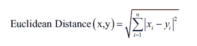

使用欧几里得距离背后的直觉是，我们将用户、电影和评分表示为向量空间中的点，用户位于*x*轴上，电影位于*y*轴上，评分作为向量空间中的点。现在我们已经将数据投影到向量空间中，可以使用欧几里得距离和皮尔逊相关系数来计算两点之间的相似度或接近度。相似度度量方法的详细解释将在第四章，*推荐引擎中使用的数据挖掘技术*中解释。

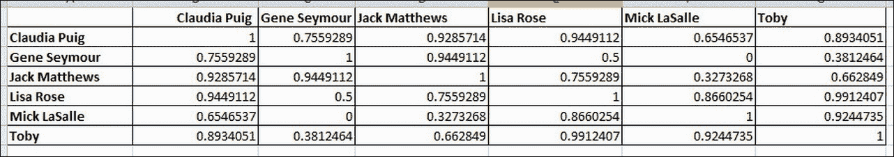

使用前面的方程，我们可以计算所有评论者之间的相似度，如表所示。从表中我们可以观察到，我们的活跃用户 Toby 与 Lisa Rose 最为相似。

作为第二步，我们通过计算以下其他评论者对《Just My Luck》给出的评分的加权平均值来预测 Jack 对未知电影《Just My Luck》的评分：

Jack 对电影《Just my Luck》的评分如下：

*(3*0.9285+1.5*0.944+3*0.755+2*0.327)/(0.8934051+0.3812464+0.9912407+0.9244735)= 2.23*

在上述方程中，我们将 Jack 与所有评论者的相似度值乘以他们对《Just My Luck》电影的评分，然后对所有值求和。这个总和除以相似度值的总和，以归一化最终的评分。同样，我们可以预测所有评论的未知电影评分，然后进行推荐。

## 基于项目的协同过滤

在基于项目的协同过滤推荐系统中，与基于用户的协同过滤不同，我们使用项目之间的相似度而不是用户之间的相似度。基于项目的推荐系统的基本直觉是，如果用户过去喜欢项目 A，他们可能会喜欢与项目 A 相似的项目 B：

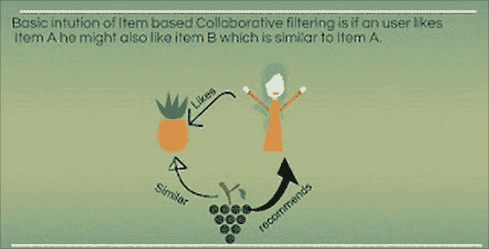

在基于用户的协同过滤中，存在一些缺点：

+   如果用户评分非常稀疏，系统性能会受到影响，这在现实世界中非常常见，用户只会对大量目录中的少数项目进行评分。

+   如果数据量很大，计算所有用户相似度值的计算成本非常高。

+   如果用户配置文件或用户输入快速变化，那么我们必须重新计算伴随高计算成本的相似度值。

基于项目的推荐引擎通过计算项目或产品之间的相似度而不是计算用户之间的相似度来处理这些缺点，从而降低计算成本。由于项目目录变化不快，我们不必经常重新计算。

与基于用户的协同过滤方法一样，基于项目的协同方法有两个步骤：

1.  计算项目之间的相似度。

1.  通过利用对其他相似项目给出的先前评分来预测活跃用户的未评分项目的评分。

用于此方法的最常见的相似度度量是余弦相似度。余弦相似度通过向量空间中两个 n 维向量之间的角度来计算两个向量之间的相似度。余弦相似度由以下方程给出：

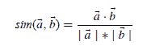

当将余弦相似度应用于推荐系统时，我们将项目列视为 n 维向量，并将两个项目之间的相似度视为它们之间的角度。角度越小，项目越相似。

例如，在先前的数据集中，如果我们想预测 Toby 对电影《水之女》的评分，首先我们必须识别与《水之女》相似的电影。使用先前的余弦方程，我们可以计算所有项目的相似度。下表显示了所有电影的相似度值：

### 提示

基于项目的相似度仅计算共同评分的项目。

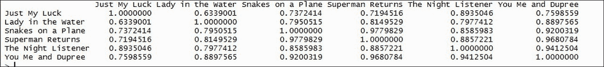

从先前的表中，我们可以看到《你、我和杜普里》与《水之女》（0.8897565）最为相似。

我们现在通过计算 Toby 对与《水之女》相似的电影的评分的加权总和来预测《水之女》电影的评分。也就是说，我们取《水之女》对每个 Toby 评过分的电影的相似度得分，乘以相应的评分，然后将所有评分电影的所有得分加起来。这个最终的总和除以下列给出的《水之女》的相似度得分总和：

《水之女》评分：

(0.795*4.5 + 0.814*4 + 0.889*1)/(0.795+0.814+0.889) = 3.09

同样，我们可以使用前面的方程式计算所有其他用户对电影的评分。在第四章《推荐引擎中使用的数据挖掘技术》中，我们讨论了可以用于基于项目的推荐的其他相似度度量。

## 优点

+   容易实现

+   构建推荐时不需要产品的内容信息或用户的个人资料信息

+   向用户推荐新项目，给用户带来惊喜因素

## 缺点

+   这种方法在计算上非常昂贵，因为所有用户、产品和评分信息都需要加载到内存中进行相似度计算。

+   这种方法对于新用户无效，因为我们没有关于用户的任何信息。这个问题被称为冷启动问题。

+   如果我们数据很少，这种方法的表现非常差。

+   由于我们没有用户或产品的内容信息，我们无法仅基于评分信息准确生成推荐。

# 基于内容的推荐系统

在上一节中，我们看到推荐是通过仅考虑用户对产品的评分或交互信息来生成的，也就是说，为活跃用户推荐新项目是基于活跃用户对那些新项目的评分。

让我们以一个给电影评了 4 星的人为例。在协同过滤方法中，我们只考虑这个评分信息来生成推荐。在现实生活中，一个人是根据电影的特征或内容来评分的，比如它的类型、演员、导演、故事和剧本。此外，一个人是根据自己的个人选择来看电影的。当我们构建一个针对个人层面的推荐引擎时，推荐不应该基于其他类似人的口味，而应该基于个人用户的口味和产品的内容。

一种针对个性化水平且考虑个人偏好和产品内容的推荐称为基于内容的推荐系统。

构建基于内容的推荐引擎的另一个动机是它们解决了协同过滤方法中新用户面临的新手问题。当一个新用户到来时，基于该人的偏好，我们可以建议一些与他们的口味相似的新项目。

构建基于内容的推荐系统涉及三个主要步骤，如下：

1.  为产品生成内容信息。

1.  生成用户配置文件和与产品特征相关的偏好。

1.  生成推荐并预测用户可能喜欢的项目列表：

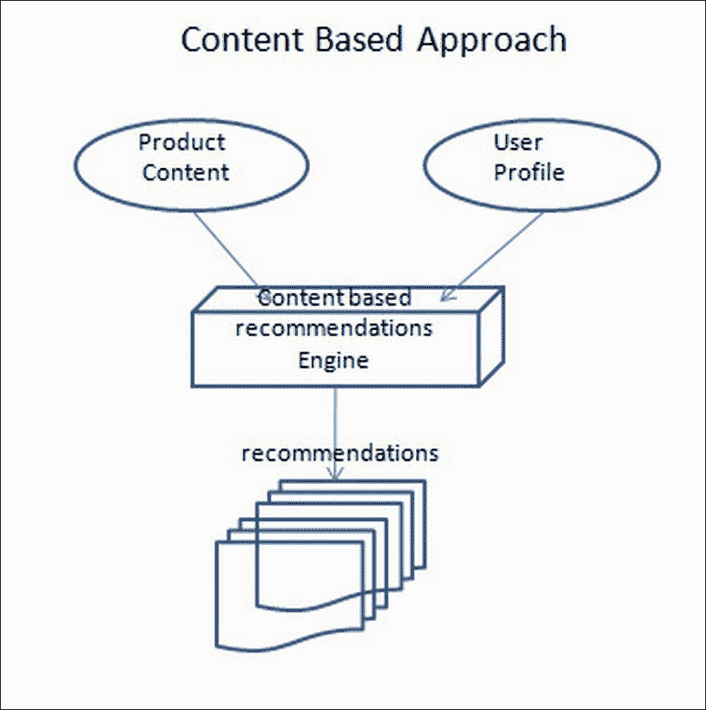

**项目配置文件生成**：在这个步骤中，我们提取代表产品的特征。最常见的是，产品的内容以行表示产品名称，列表示特征的空间模型表示。通常，产品的内容将是结构化数据或非结构化数据。结构化数据将从数据库中获得；非结构化特征将包括网站中关联的评论、标签或文本属性。在项目配置文件生成步骤中，我们必须提取相关特征及其与产品相关的相对重要性分数。

为了生成项目配置文件，我们使用**词频逆文档频率**（**tf-idf**）来计算与项目相关的特征相对重要性。由于我们用向量表示来表示项目特征，我们可以使用 tf-idf，这将在第四章*推荐引擎中使用的数据挖掘技术*中详细解释。

让我们通过一个例子来更好地理解。正如我们之前提到的，对于基于内容的推荐引擎，我们需要关于电影等额外内容信息，如下所示：

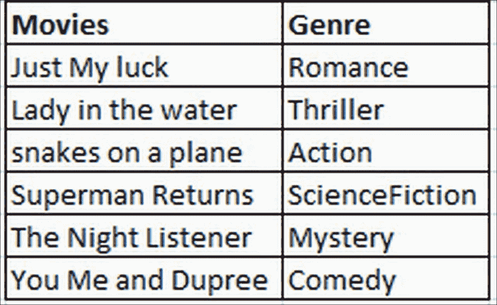

我们首先要做的是使用 tf-idf 创建一个项目配置文件，通过以下步骤：

创建一个包含每个文档中每个术语频率计数的术语频率矩阵；也就是说，在我们的案例中，每个电影中每个类别的存在情况。数字 1 代表类别的存在，0 代表类别的缺失：

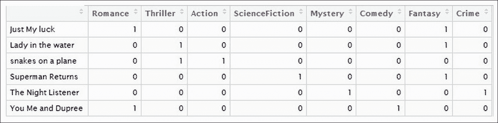

下一步是创建以下公式给出的逆文档频率：

*Idf = Log(文档总数/文档频率)*

这里，文档总数是电影的数量，文档频率是它们在所有文档中出现的总次数：

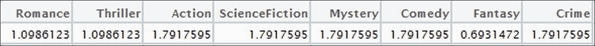

最后一步是创建以下公式给出的*tf-idf*矩阵：

*tf*idf*

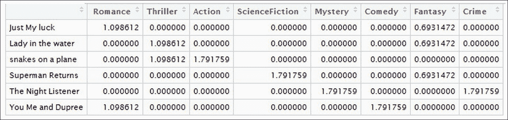

## 生成用户配置文件

在这一步，我们构建与产品内容相匹配的用户配置文件或偏好矩阵。一般来说，我们构建与产品内容共有的用户配置文件或特征，因为这样比较用户和项目配置文件并计算它们之间的相似度更有意义。

让我们考虑以下数据集，它显示了每个用户的观看历史。如果矩阵单元格中的值为 1，则表示用户已经看过这部电影。这些信息给出了他们对电影的偏好：

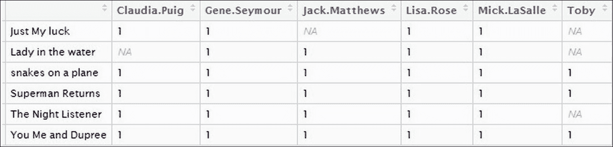

从前面的信息中，我们将创建一个用户配置文件，可以与项目配置文件进行比较；也就是说，我们现在创建一个包含用户对项目特征偏好的用户配置文件，在我们的例子中是对类型的偏好。tf-idf 和用户偏好矩阵的点积将给出每个类型的用户亲和度，如下表所示：

*dotProduct(Tf-idf, userPreference matrix)*

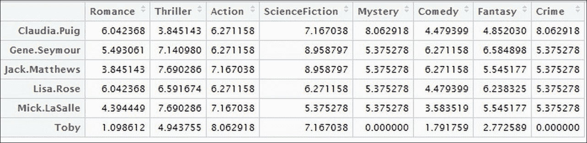

在手头有用户配置文件和项目配置文件的情况下，下一步将是估计用户将更喜欢每个项目的程度。我们现在可以使用余弦相似度来计算每个项目的用户偏好。在我们的例子中，用户和项目配置文件之间的余弦相似度给出了以下结果：

*cosineSimilarity(userProfile,ItemProfile)*

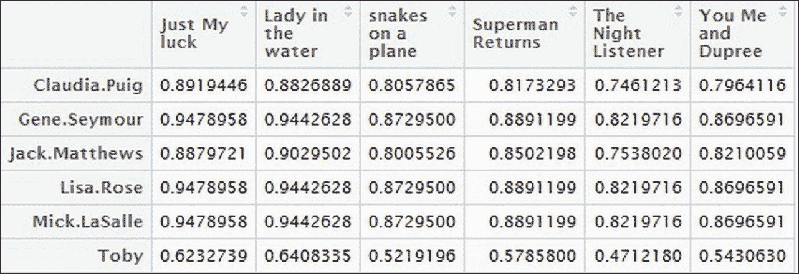

从前面的表格中我们可以得出结论，余弦角度越大，用户越有可能喜欢一部电影，因此可以推荐给用户。

现在我们已经做出了推荐，让我们退一步，从收集用户偏好数据的角度来看。通常有两种方法来捕获用户数据；如下所述：

+   明确询问用户对产品特征的偏好，并将它们存储起来。

+   隐式地捕获用户在产品上的交互数据，如浏览历史、评分历史和购买历史，并将用户偏好构建到产品特征中。在第四章《推荐引擎中使用的数据挖掘技术》和第五章《构建协同过滤推荐引擎》中，我们使用显式和隐式的用户活动示例构建推荐引擎。

我们至今为止所采用的基于内容推荐系统构建的方法是基于相似度计算的。我们还可以应用诸如分类等监督机器学习方法来预测用户可能喜欢的最可能的产品。

使用机器学习或任何其他数学、统计模型来生成推荐的推荐系统被称为基于模型的系统。在分类方法中，这些方法属于基于模型的推荐系统，我们首先使用用户配置文件和项目配置文件构建机器学习模型，以预测用户是否喜欢/不喜欢某个项目。监督分类任务，如逻辑回归、KNN 分类方法、概率方法等，都可以使用。基于模型的推荐引擎将在下一节讨论。

## 优点

+   基于内容的推荐系统针对个人层面

+   推荐是仅使用用户偏好生成的，而不是像协同过滤那样使用用户社区

+   这些方法可以实时应用，因为推荐模型不需要加载所有数据来处理或生成推荐

+   与仅处理评分信息的协同方法相比，准确性较高，因为它们处理的是产品的内容

+   可以轻松处理冷启动问题

## 缺点

+   随着系统更加个性化，生成的推荐将仅限于用户偏好，当更多用户信息进入系统时，推荐将变得更加狭窄

+   因此，不会向用户展示与用户偏好无关的新产品

+   用户将无法查看他们周围发生的事情或当前的趋势

# 上下文感知推荐系统

多年来，推荐系统从邻域方法发展到针对个人用户的个性化推荐系统。这些个性化推荐系统取得了巨大成功，因为这对终端用户是有用的，对于组织来说，这些系统成为增加其业务的催化剂。

尽管个性化推荐系统针对的是个人用户级别，并根据用户的个人偏好提供推荐，但仍有改进系统的空间。例如，同一个人在不同的地方可能有不同的需求。同样，同一个人在不同时间也有不同的需求：

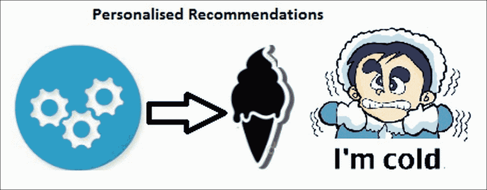

我们智能的推荐系统应该足够进化，以满足用户在不同地点、不同时间的需要。推荐系统应该足够稳健，能够在夏天向某人推荐棉质衬衫，在冬天推荐皮夹克。同样，根据一天中的时间，建议提供符合个人早餐或晚餐选择的餐厅将非常有帮助。这类考虑位置、时间、心情等因素，定义用户上下文并建议个性化推荐的推荐系统，被称为**上下文感知推荐系统**：

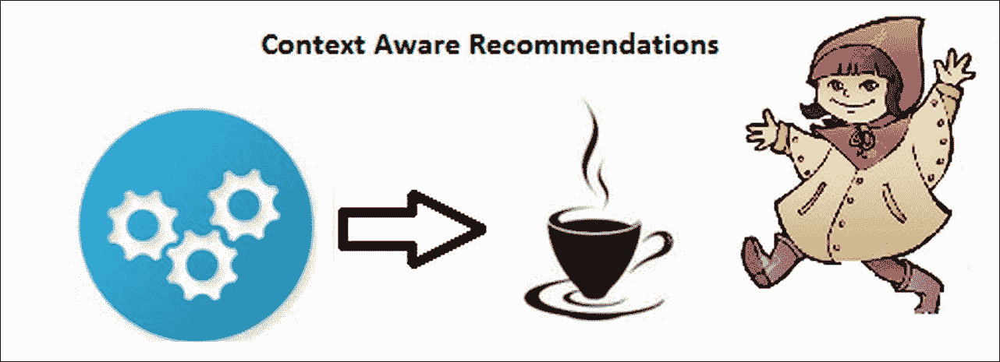

前面的图像说明了在寒冷天气中推荐咖啡的推荐引擎。

## 上下文定义

那么上下文究竟是什么？一般来说，上下文代表用户的当前状态。用户的上下文可以是任何东西，比如地点、时间、日期、季节、心情、设备、用户是否独自一人、在办公室、度假、与家人、与朋友在一起、生活事件等等。由于人们在不同的上下文中会有不同的需求，推荐系统可以捕捉用户的上下文信息，并据此细化他们的建议。

例如，一个旅行度假系统可能会考虑季节、地点和时间作为上下文来细化建议；一个电子商务网站可以考虑生活事件和用户购买行为作为上下文感知推荐，而一个食品网站在推荐餐厅时可能会考虑一天中的时间和地点信息。

上下文感知系统是如何设计的？到目前为止，我们已经将推荐视为一个二维问题，即用户偏好和项目表示。通过包含上下文作为新的维度，我们可以将上下文感知推荐构建为一个三维问题：

*推荐 = 用户 x 项目 x 上下文*

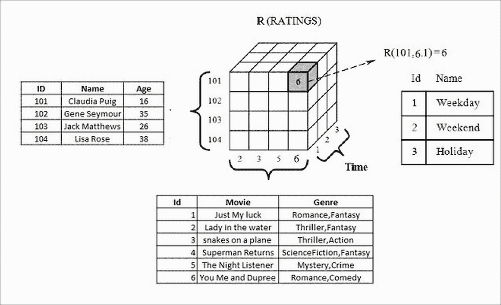

让我们回顾一下我们在基于内容的推荐中使用的相同例子，在那里我们考虑了用户概要和项目概要，通过计算用户概要和项目概要之间的相似性来生成每个项目的用户评分。现在，在上下文感知系统中，我们包括上下文来根据用户偏好和上下文生成项目的排名。

例如，我们可以假设我们的推荐已经捕捉到了用户在工作日、周末和假期的观影模式。从这个上下文信息中，我们提取了每个用户对电影内容的亲和度。例如，考虑 TOBY 在每个电影内容上下文中的以下偏好：

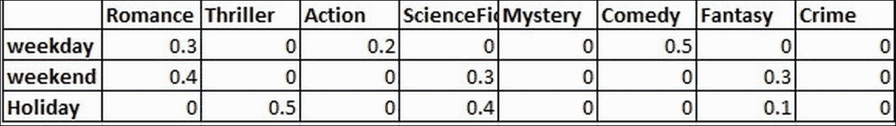

让我们首先为 TOBY 创建每个上下文的所有电影内容的用户概要。上下文矩阵和用户概要矩阵之间的点积给出了所有上下文的用户概要：

*点积（user profile，context matrix）* 对于 TOBY：

我们现在已经计算了 TOBY 对每个电影上下文的偏好。下一步将是计算所有上下文中每个电影的排名。

余弦相似度（上下文电影内容偏好矩阵，项目概要）：

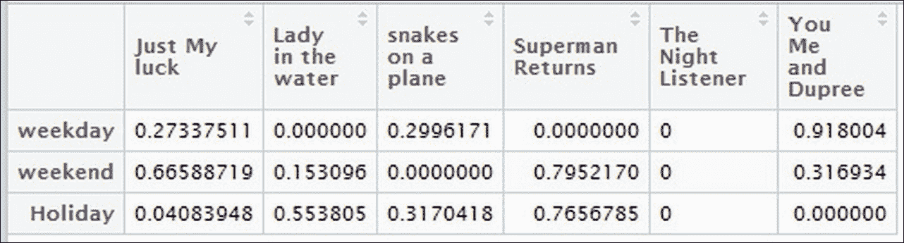

现在我们已经为 TOBY 有了电影的上下文级别排名，我们可以根据上下文来推荐电影。

从前面的例子中，我们了解到上下文感知推荐系统是包含一个称为上下文的新维度的基于内容的推荐系统。在上下文感知系统中，推荐是分两步生成的，如下所示：

1.  根据用户的偏好为每个用户生成产品推荐列表；即基于内容的推荐。

1.  过滤掉特定于当前上下文的推荐。

构建上下文感知推荐系统最常见的方法如下：

+   后过滤方法

+   预过滤方法

## 预过滤方法

在预过滤方法中，上下文信息应用于用户配置文件和产品内容。这一步骤将过滤掉所有非相关特征，并在剩余的特征集上生成最终的个人推荐。由于特征过滤是在生成个性化推荐之前进行的，因此这些方法被称为预过滤方法：

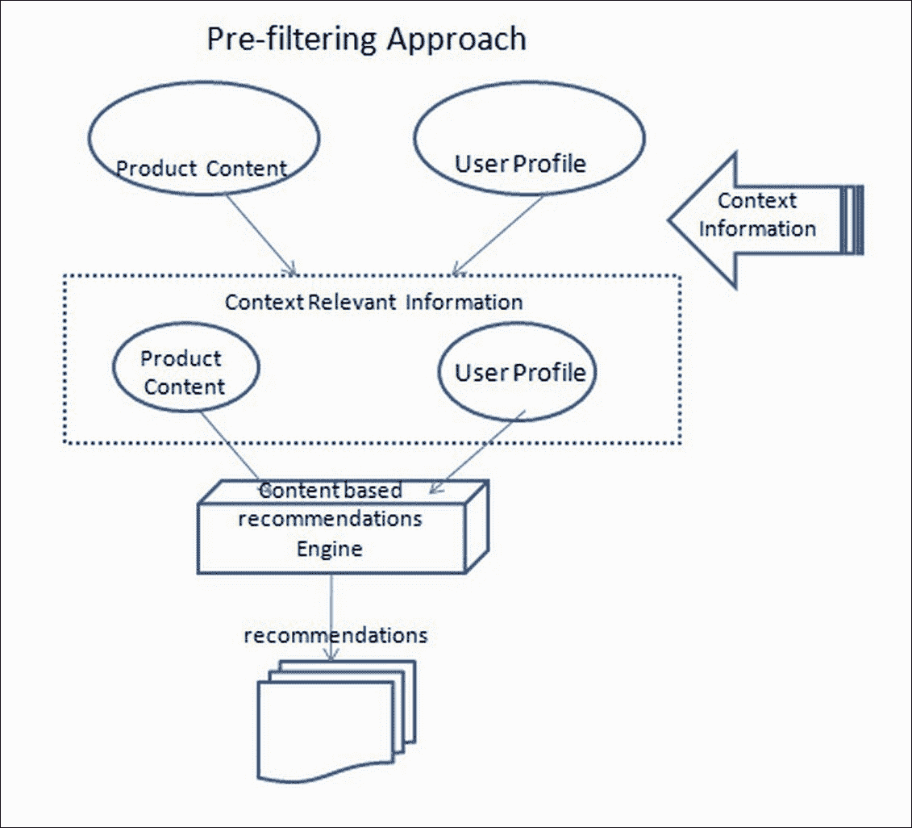

## 后过滤方法

在后过滤方法中，首先根据用户配置文件和产品目录生成个性化推荐，然后应用上下文信息来过滤出当前上下文中对用户相关的产品：

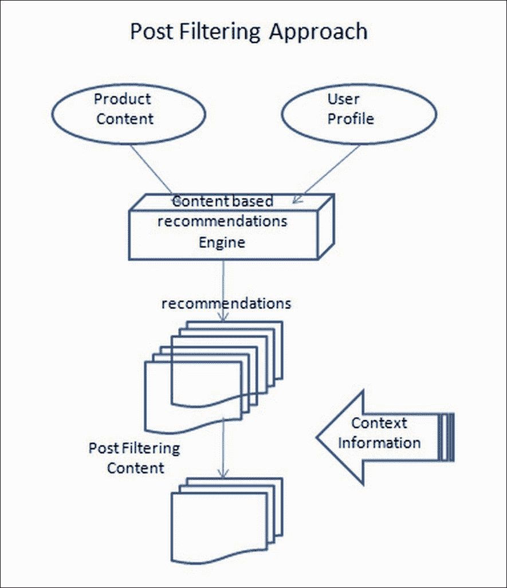

## 优点

+   上下文感知系统比基于内容的个性化推荐系统更先进，因为这些系统将始终与用户动作保持同步，并根据当前上下文生成推荐。

+   这些系统具有更多的实时性

## 缺点

+   与其他个性化推荐系统一样，这些类型的推荐也将缺少偶然性或惊喜因素

# 混合推荐系统

协同过滤系统和基于内容的推荐系统既有效又满足广泛的需求。它们有相当成功的实施案例，但每个系统独立使用时都有自己的局限性。研究已经开始向结合协同过滤和基于内容的推荐的方向发展。这种通过结合协同过滤和基于内容的方法形成的新类型的推荐系统被称为混合推荐系统。

选择结合不同的推荐方法取决于研究人员或根据问题陈述和业务需求实施混合推荐引擎的人员。

构建混合系统最常见的方法如下：

+   加权方法

+   混合方法

+   切换方法

+   级联方法

+   特征组合方法

+   特征增强

+   元级

## 加权方法

在这种方法中，最终的推荐结果将是所有可用推荐引擎推荐结果的组合，主要是线性的。在部署此加权混合推荐引擎的初期，将给每个可用推荐引擎的结果分配相同的权重，然后通过评估用户对推荐的响应来逐渐调整权重。

## 混合方法

混合方法适用于我们可以混合所有可用推荐器结果的地方。这些方法大多用于数据稀疏，无法通过所有可用推荐系统为产品评分的地方。因此，推荐是独立生成的，在发送给用户之前会混合。

## 级联方法

在这种方法中，使用协同过滤生成推荐。应用基于内容的推荐技术，然后最终推荐/排名列表将作为输出。

## 特征组合方法

特征组合方法，其中我们将不同推荐系统的特征和最终推荐方法结合起来，应用于组合特征集。在这种技术中，我们结合了从基于内容的推荐系统提取的用户-项目偏好特征和用户-项目评分信息，并考虑了一种新的策略来构建混合推荐系统。

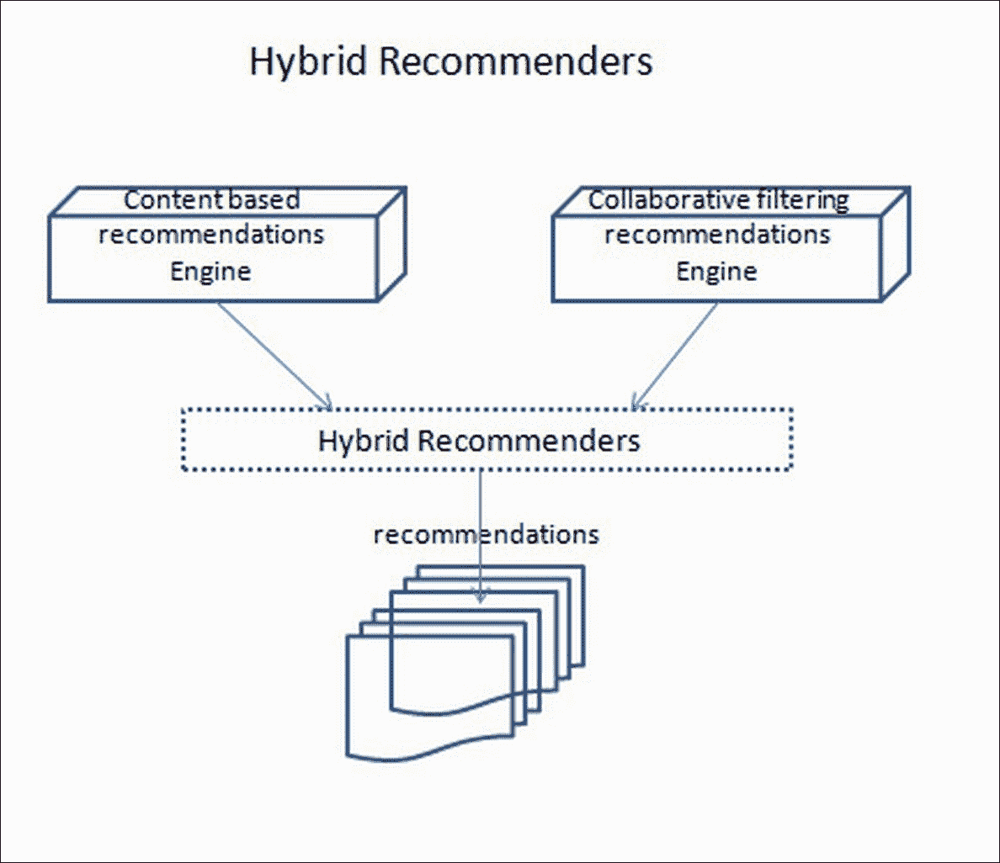

## 优点

+   可以处理冷启动问题和数据稀疏等问题

+   这些系统比任何单个模型都要更加健壮和可扩展。

+   方法组合提高了准确性

# 基于模型推荐系统

迄今为止，我们一直专注于涉及用户或产品之间相似度计算的邻近方法，这些方法用于协同过滤方法，或者在向量空间模型中表示用户和项目内容，并找到相似度度量来识别与用户偏好相似的项目。基于相似度的方法的主要目标是计算用户对产品或产品内容的偏好权重，然后使用这些特征权重来推荐项目。

这些方法在过去的几年中非常成功，甚至至今仍然如此。但这些方法有其自身的局限性。由于整个数据必须加载到环境中进行相似度计算，这些方法也被称为基于内存的模型。这些基于内存的模型在实时场景中响应速度非常慢，因为所有数据都必须加载。另一个局限性是，计算出的权重没有像机器学习应用那样自动学习。冷启动问题是基于内存或基于邻近的方法常见的另一个局限性。

为了解决这些局限性，研究人员开始应用更高级的方法来提高推荐引擎的性能，例如概率模型、机器学习模型（如监督和非监督模型）以及矩阵方法（如矩阵分解和单值分解）。在基于模型的方法中，使用可用的历史数据，构建一个带有自动学习到的权重的模型。将使用学习到的权重对新产品进行预测，然后在做出推荐之前将最终结果按特定顺序排序。

## 概率方法

在概率方法中，我们使用可用数据中的先验概率构建一个概率模型，并通过计算每个用户对产品的喜欢/不喜欢概率来生成一个推荐排名列表。在概率方法中最常用的是朴素贝叶斯方法，这是一种简单但强大的技术。

## 机器学习方法

正如内容推荐系统中所解释的，我们可以将推荐问题视为一个机器学习问题。利用历史用户和产品数据，我们可以提取特征并输出类别，然后构建一个机器学习模型。使用生成的模型生成最终的产品推荐排名列表。可以使用许多机器学习方法，如逻辑回归、KNN 分类、决策树、SVM、聚类等。这些机器学习方法应用于协同、基于内容、上下文感知和混合推荐系统。在第四章《推荐引擎中使用的数据挖掘技术》中，我们详细学习了每种机器学习方法。

## 数学方法

在这些方法中，我们假设用户对产品的评分或交互信息是简单的矩阵。在这些矩阵上，我们应用数学方法来预测用户的缺失评分。最常用的方法包括矩阵分解模型和单值分解模型：

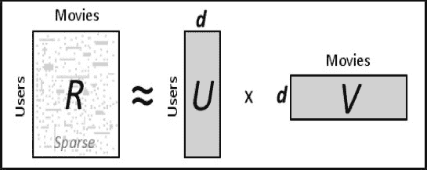

通过应用矩阵分解方法，我们假设将原始评分矩阵（R）分解为两个新的矩阵（U，V），这两个矩阵代表了用户和电影的潜在特征。

从数学的角度来看，我们可以将一个矩阵分解为两个低秩矩阵。在前面的例子中，矩阵 R 被分解为矩阵 U 和 V。现在当我们乘以 U 和 V 时，我们得到原始矩阵 R 的近似值。这个概念在推荐引擎中用于填充原始评分矩阵中的未知评分，然后对推荐进行排名并建议给用户。

在第四章《推荐引擎中使用的数据挖掘技术》中，我们更详细地讨论了这两种方法。

## 优点

+   基于模型的推荐比基于启发式的方法（如邻域方法）更准确。

+   在启发式方法中，产品/产品内容的权重更静态，而在基于模型推荐中，权重是通过自动学习建立的。

+   基于模型的方法使用数据驱动方法提取许多未见过的模式。

# 摘要

在本章中，我们学习了流行的推荐引擎技术，如协同过滤、基于内容的推荐、上下文感知系统、混合推荐和基于模型的推荐系统，以及它们的优缺点。存在不同的相似度方法，如余弦相似度、欧几里得距离和皮尔逊系数。每个推荐中的子类别也进行了解释。

在下一章中，我们将学习不同的数据挖掘技术，例如邻域方法、用于推荐引擎的机器学习方法，以及它们的评估技术，如 RMSE 和精确-召回率。
