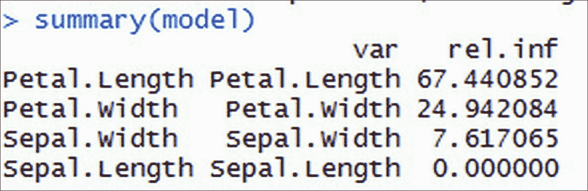

# 第四章：推荐引擎中使用的数据挖掘技术

数据挖掘技术位于推荐引擎的核心。这些数据挖掘技术帮助我们提取模式、分组用户、计算相似度、预测偏好、处理稀疏输入数据、评估推荐模型等。在前一章中，我们详细学习了推荐引擎。尽管我们没有深入研究推荐引擎的实现，但我们学习了不同类型推荐引擎背后的理论，例如基于邻域、个性化、上下文推荐者、混合推荐者等。在本章中，我们将探讨目前用于构建推荐引擎的流行数据挖掘技术。我们之所以将这一内容单独成章，是因为在后续章节实现推荐引擎时，我们将遇到许多技术。

本章大致分为以下几部分：

+   基于邻域的技术

    +   欧几里得距离

    +   余弦相似度

    +   Jaccard 相似度

    +   皮尔逊相关系数

+   数学建模技术

    +   矩阵分解

    +   交替最小二乘法

    +   奇异值分解

+   机器学习技术

    +   线性回归

    +   分类模型

+   聚类技术

    +   K-means 聚类

+   维度降低

    +   主成分分析

+   向量空间模型

    +   词语频率

    +   词语频率-逆文档频率

+   评估技术

    +   均方根误差

    +   均绝对误差

    +   精确率和召回率

每个部分都通过基本技术和其在 R 中的实现进行了说明。

让我们从推荐引擎中最常用的基础知识开始复习。

# 基于邻域的技术

如前几章所述，邻域方法是简单的技术，从构建推荐引擎的开始就被使用。这些是最古老但也是最广泛使用的方法，即使在今天也是如此。这些广泛使用的方法之所以受欢迎，是因为它们在生成推荐方面的准确性。我们知道几乎每个推荐系统都是基于物品或用户之间相似性的概念。这些邻域方法将两个用户或物品之间的可用信息视为两个向量，并在这些向量之间应用简单的数学计算来查看它们有多接近。在本节中，我们将讨论以下邻域技术：

+   欧几里得距离

+   余弦相似度

+   Jaccard 相似度

+   皮尔逊相关系数

## 欧几里得距离

欧几里得距离相似度是用于计算两点或两个向量之间距离的最常见相似度度量之一。它是向量空间中两点或向量之间的路径距离。

在以下图中，我们看到向量 a 和 b 之间的路径距离是欧几里得距离：


欧几里得距离是基于毕达哥拉斯定理来计算两点之间的距离。

在数据集中，两点或物体（点 *x* 和点 *y*）之间的**欧几里得距离**由以下方程定义：


在这里，*x* 和 *y* 是两个连续的数据点，n 是数据集的属性数量。

欧几里得距离在推荐引擎中是如何应用的？

考虑一个包含用户 ID 作为行，项目 ID 作为列，偏好值作为单元格值的评分矩阵。两个行之间的欧几里得距离给出了用户相似度，两个列之间的欧几里得距离给出了项目相似度。当数据由连续值组成时，使用此度量。

计算欧几里得距离的 R 脚本如下：

```py
x1 <- rnorm(30) 
x2 <- rnorm(30) 
Euc_dist = dist(rbind(x1,x2) ,method="euclidean") 

```


## 余弦相似度

**余弦相似度**是内积空间中两个向量之间相似度的度量，它衡量的是它们之间角度的余弦值；它由以下方程给出：


设 *a* 为一个向量 (*a1*, *a2*, *a3*, *a4*)，*b* 为另一个向量 (*b1*, *b2*, *b3*, *b4*)。这两个向量 *a* 和 *b* 的点积如下：

*a.b = a1b1 + a2b2 + a3b3 + a4b4*

结果将是一个单一值，一个标量常数。两个向量之间的点积意味着什么？为了回答这个问题，让我们定义两个向量之间点积的几何定义：


重新排列前面的方程，我们得到以下方程：


在前面的方程中，*cosθ* 是两个向量之间的角度，*acosθ* 是向量 A 在向量 B 上的投影。

两个向量点积的视觉向量空间表示如下：


当两个向量之间的余弦角度为 90 度时，*cos 90* 将变为零，整个点积也将为零，即它们将相互垂直。我们可以推断出的逻辑结论是它们彼此非常遥远：


当我们减小两个向量之间的余弦角度时，它们的方向看起来将非常相似。

当两个向量之间的角度为零时，*cos 0* 将为 1，两个向量将重合，如下面的图像所示。因此，我们可以说这两个向量在方向上相似：


所以总结一下，我们可以得出结论，当我们计算两个向量之间的余弦角度时，得到的标量值将指示两个向量在方向上的接近程度：


现在，让我们重新审视我们的原始问题：点积意味着什么？当我们对两个向量取点积时，得到的标量值代表它们之间的余弦角。如果标量为零，则两个向量是正交的且无关。如果标量为 1，则两个向量是相似的。

现在，这是如何在推荐引擎中应用的？

如前所述，考虑一个包含用户 ID 作为行和物品 ID 作为列的评分矩阵。我们可以假设每一行是用户向量，每一列是物品向量。

行向量之间的余弦角将给出用户相似度，列向量之间的余弦角给出物品相似度。

计算余弦距离的 R 脚本如下：

```py
vec1 = c( 1, 1, 1, 0, 0, 0, 0, 0, 0, 0, 0, 0 ) 
vec2 = c( 0, 0, 1, 1, 1, 1, 1, 0, 1, 0, 0, 0 ) 
library(lsa) 
cosine(vec1,vec2) 

```

在这里，*x*是包含数据集中所有变量的矩阵；余弦函数在`lsa`包中可用。`lsa`是 R 中用于在文本中查找潜在特征或主题的文本挖掘包。此包提供`cosine()`方法来计算两个向量之间的余弦角。

## Jaccard 相似度

Jaccard 相似度是推荐引擎中使用的另一种相似度度量。**Jaccard 相似度**系数是两个用户或物品之间特征交集与特征并集的比值。

从数学上讲，如果*A*和*B*是两个向量，Jaccard 相似度由以下方程给出：


Jaccard 相似系数指标是一种用于在样本集中寻找相似性和多样性的统计量。由于用户和物品可以被表示为向量或集合，我们可以轻松地将 Jaccard 系数应用于推荐系统，以找到用户或物品之间的相似性。

计算 Jaccard 相似度的 R 脚本如下：

```py
vec1 = c( 1, 1, 1, 0, 0, 0, 0, 0, 0, 0, 0, 0 ) 
vec2 = c( 0, 0, 1, 1, 1, 1, 1, 0, 1, 0, 0, 0 ) 
library('clusteval') 
cluster_similarity(vec1, vec2, similarity = "jaccard") 

```

R 中的`clusteval`包是一个用于评估聚类技术的流行包。`Cluster_similarity()`方法提供了计算 Jaccard 相似度的良好实现。

## 皮尔逊相关系数

找到上述相似性的另一种方法是找到两个向量之间的相关性。在这种方法中，我们不是使用距离度量作为在向量中寻找相似性的方式，而是使用向量之间的相关性。

皮尔逊相关系数可以按以下方式计算：


在这里，*r*是相关系数，*n*是数据点的总数，*x[i]*是 x 向量的第*i*个向量点，*y[i]*是 y 向量的第*i*个向量点，*x-bar*是向量 x 的均值，*y-bar*是向量 y 的均值，*s[x]*是向量 x 的标准差，*s[y]*是向量 y 的标准差。

计算两个变量之间相关系数的另一种方法是，通过将两个变量的协方差除以它们标准差的乘积，

由 (rho) 给出：


让我们通过以下图像中的示例来理解这一点。我们绘制了两个向量 a, b 的值；自然地假设如果向量的所有点都一起变化，它们之间存在正相关关系。这种一起变化的趋势，或者说协方差，在简单术语中可以称为相关性。看看以下图表：


现在我们来检查以下图像。我们可以观察到向量不是一起变化的，相应的点随机分布。因此，一起变化的趋势，或者说协方差，较小，或者说是较低的相关性：


从相似度计算的角度来看，我们可以得出结论：两个向量之间的相关性越大，它们就越相似。

那么，皮尔逊相关系数在推荐引擎中是如何应用的？

如前所述，考虑一个包含用户 ID 作为行和项目 ID 作为列的评分矩阵。我们可以假设每一行是用户向量，每一列是项目向量。

行向量之间的相关系数将给出用户相似度，列向量之间的相关系数将给出项目相似度，使用以下方程：

R 脚本由以下方程给出：

```py
Coef = cor(mtcars, method="pearson") 

```

在这里，`mtcars` 是数据集。

# 数学模型技术

如矩阵分解和奇异值分解等数学模型在构建基于相似度计算的推荐引擎时已被证明非常准确。另一个优点是它们可以轻松地缩小规模，也允许轻松设计系统。在本章中，我们将学习如后所述的数学模型。

## 矩阵分解

一个矩阵可以被分解成两个低秩矩阵，当它们相乘时，将得到一个与原始矩阵近似相等的单个矩阵。

假设 *R*，一个大小为 *U X M* 的评分矩阵可以被分解成两个低秩矩阵，*P* 和 *Q*，分别大小为 *U X K* 和 *M X K*，其中 *K* 被称为矩阵的秩。

在以下示例中，原始矩阵的大小为 *4 X 4* 被分解成两个矩阵，*P (4 X 2)* 和 *Q (4 X 2)*；将 *P* 和 *Q* 相乘将带给我原始矩阵的大小为 *4 X 4* 和与原始矩阵近似相等的值：


矩阵分解方法的一个主要优点是我们可以使用低秩矩阵 *P* 和 *Q* 之间的点积来计算原始矩阵 *R* 中的空单元格。这由以下方程给出：


当我们应用前面的方程时，我们可以重新生成原始矩阵 *R*，所有空单元格都被填充。

为了使预测值尽可能接近原始矩阵，我们必须最小化原始值和预测值之间的差异，这也就是误差。原始值和预测值之间的误差可以用以下方程表示：


为了最小化上述误差项并尽可能准确地重现原始矩阵，我们必须使用梯度下降技术——一种寻找目标函数最优参数并迭代最小化函数的算法，并在方程中引入正则化项。

矩阵分解是如何应用于推荐引擎的？

这是一个核心问题，我们对此比矩阵分解中的数学更感兴趣。我们将看到如何将矩阵分解技术应用于构建推荐引擎。

回顾构建推荐引擎的核心任务：找到相似的用户或项目，然后预测未评分的偏好，最后向活跃用户推荐新项目。简而言之，我们正在预测未评分的项目偏好。回顾一下，这正是矩阵分解所做的：预测原始评分矩阵中的空单元格。

现在，我们如何证明将矩阵分解应用于低秩矩阵在推荐引擎中的方法？为了回答这个问题，我们将讨论用户如何评分。人们评分电影是因为故事、演员或电影的类型，也就是说，用户评分项目是因为项目的特征。当给定一个包含用户 ID、项目 ID 和评分值的评分矩阵时，我们可以假设用户在评分项目时会有一些固有的偏好，项目也会有一些固有的特征，这些特征有助于用户评分。这些用户和项目的特征被称为**潜在特征**。

考虑到之前的假设，我们将矩阵分解技术应用于评分矩阵，得到两个低秩矩阵，这些矩阵被假定为用户潜在特征矩阵和项目潜在特征矩阵：


考虑到这些假设，研究人员开始将矩阵分解技术应用于构建推荐系统。矩阵分解方法的优势在于，由于它是一个机器学习模型，特征权重会随着时间的推移而学习，从而提高模型精度：

以下代码解释了使用 R 中的`nmf`包实现矩阵分解的实现：

```py
#MF 
library(recommenderlab) 
data("MovieLense") 
dim(MovieLense) 

#applying MF using NMF 
mat  = as(MovieLense,"matrix") 
mat[is.na(mat)] = 0 
res = nmf(mat,10) 
res 

#fitted values 
r.hat <- fitted(res) 
dim(r.hat) 

p <- basis(res) 
dim(p) 
q <- coef(res) 
dim(q) 

```

## 交替最小二乘法

回顾上一节中的误差最小化方程。在引入正则化项以避免过拟合后，最终的误差项将类似于以下方程：


为了优化前面的方程，有两种流行的技术：

+   **随机梯度下降**（**SGD**）：一种小批量优化技术，类似于梯度下降，用于在大规模数据或稀疏数据中寻找最优参数。

+   **交替最小二乘**（**ALS**）：与 SGD 相比，ALS 方法的主要优势是它可以在分布式平台上轻松并行化。

在本节中，我们将探讨 ALS 方法。

前面的方程涉及两个未知数，我们需要求解。由于涉及两个未知数，上述方程是一个非凸问题。如果我们固定其中一个未知项的常数，这个优化问题将变为二次的，并且可以最优地解决。

交替最小二乘是一种迭代方法，它涉及通过固定另一个特征向量项为常数，使用最小二乘函数计算一个特征向量项，直到我们最优地解决前面的方程。

为了计算用户特征向量，我们将物品特征向量固定为一个常数并求解最小二乘。同样，在计算物品特征向量时，我们将用户特征向量固定为一个常数并求解最小二乘。

采用这种方法，我们可以将非凸问题转化为二次问题，从而可以最优地解决。

大多数开源分布式平台，如 Mahout 和 Spark，都使用 ALS 方法来实现可扩展的推荐系统，因为它们可以并行化。

## 奇异值分解

**奇异值分解**（**SVD**）是另一种非常流行的矩阵分解方法。简单来说，SVD 方法将一个大小为 m x n 的实矩阵 A 分解为三个矩阵 U，，V，它们满足以下方程：


在前面的方程中，*r* 被称为矩阵 *A* 的秩，*U*，*V* 是正交矩阵，而是一个对角矩阵，包含矩阵 *A* 的所有奇异值。如果 *A* 是实矩阵，则 *U* 和 *V* 的值是实数。矩阵的值是正实数，并且按递减顺序排列。

SVD 也可以用作降维技术，遵循以下两个步骤：

+   选择一个小于 *r* 的秩 *k*。

+   重新计算或缩小 *U*，，*V* 矩阵到 *(m x k)*，*(k x k)*，*(k x n)*。


应用 SVD 得到的矩阵非常适合推荐系统，因为它们提供了原始矩阵的最佳低秩近似。我们如何将 SVD 方法应用于推荐？让我们以一个大小为 m x n 的评分矩阵 R 为例，其中包含许多空单元格。类似于矩阵分解，我们的目标是计算一个尽可能接近原始矩阵的近似评分矩阵，其中缺失的值被预测。

在 R 上应用 SVD 将产生三个矩阵，*U*、、*V*，大小分别为，比如说，*m x r*、*r x r*、*r x n*。在这里，*U*代表用户潜在特征向量表示，*V*代表项目潜在特征向量表示，代表用户和项目的独立特征表示，r。通过将独立特征表示的值设置为小于*r*的*k*，我们选择了 k 个最优的潜在特征，从而减少了矩阵的大小。k 值可以通过交叉验证方法选择，因为*k*的值定义了模型的性能。

### 注意

选择值*k*的一个更简单的方法是，即取一个包含奇异值的对角矩阵，选择对角线上具有更高值的值，并消除非常小的对角线值。

在选择 k 值之后，我们现在调整或选择矩阵*U*、、*V*中的第一 k 列的大小。这一步将使矩阵*U*、、*V*分别变为*m x k*、*k x k*和*k x n*的大小，请参考下面的图片。调整矩阵大小后，我们继续进行最后一步。

在最后一步中，我们将计算以下一系列矩阵的点积，以计算近似评分矩阵 


以下代码片段展示了 R 中 SVD 的实现，下面的代码创建了一个样本矩阵，然后使用 r 中基础包中的`svd()`函数对样本数据进行 SVD，创建 3 个矩阵，三个矩阵的点积将得到我们的近似原始矩阵。

```py
sampleMat <- function(n) { i <- 1:n; 1 / outer(i - 1, i, "+") } 
original.mat <- sampleMat(9)[, 1:6] 
(s <- svd(original.mat)) 
D <- diag(s$d) 
#  X = U D V' 
s$u %*% D %*% t(s$v) 

```

### 注意

请参阅第七章，*使用 Spark 构建实时推荐引擎*，了解 Spark-python 中 ALS 的实现。

# 机器学习技术

在本节中，我们将学习最重要的或最常用的机器学习技术，这些技术在构建推荐引擎中得到了广泛应用。

## 线性回归

**线性回归**可能被视为解决预测问题的简单、流行和最基本的方法。我们使用线性回归，我们的目标是预测给定输入特征的未来结果，输出标签是一个连续变量。

在线性回归中，给定历史输入和输出数据，模型将试图找出独立特征变量和由以下方程和图表给出的依赖输出变量之间的关系：


在这里，*y* 代表输出连续的依赖变量，*x* 代表独立特征变量，*β0* 和 *β1* 是未知数或特征权重，*e* 代表误差。

使用**普通最小二乘法 (OLS**)，我们将估计前面方程中的未知数。我们不会深入探讨线性回归方法，但在这里我们将讨论如何在推荐引擎中使用线性回归。

推荐引擎中的核心任务之一是为用户预测未评分的项目。例如，在基于项目的推荐引擎中，用户 *u* 对项目 *i* 的预测是通过计算用户 *u* 对与项目 *i* 类似的项目的评分总和来完成的。然后，每个评分都通过其相似性值进行加权：


我们可以不用这种加权平均方法来做出预测，而是可以使用线性回归方法来计算用户 *u* 对项目 *i* 的偏好值。在使用回归方法时，我们不是使用相似项目的原始评分值，而是使用基于线性回归模型的近似评分值。例如，为了预测用户 *u* 对项目 *i* 的评分，我们可以使用以下方程：


使用 R 进行线性回归的代码如下：

```py
library(MASS) 
data("Boston") 
set.seed(0) 
which_train <- sample(x = c(TRUE, FALSE), size = nrow(Boston), 
                      replace = TRUE, prob = c(0.8, 0.2)) 
train <- Boston[which_train, ] 
test <- Boston[!which_train, ] 
lm.fit =lm(medv~. ,data=train ) 
summary(lm.fit) 

Call: 
lm(formula = medv ~ ., data = train) 

Residuals: 
     Min       1Q   Median       3Q      Max  
-15.2631  -2.7614  -0.5243   1.7867  24.6306  

Coefficients: 
              Estimate Std. Error t value Pr(>|t|)     
(Intercept)  39.549376   5.814446   6.802 3.82e-11 *** 
crim         -0.090720   0.040872  -2.220  0.02701 *   
zn            0.050080   0.015307   3.272  0.00116 **  
indus         0.032339   0.070343   0.460  0.64596     
chas          2.451235   0.992848   2.469  0.01397 *   
nox         -18.517205   4.407645  -4.201 3.28e-05 *** 
rm            3.480574   0.469970   7.406 7.91e-13 *** 
age           0.012625   0.015786   0.800  0.42434     
dis          -1.470081   0.223349  -6.582 1.48e-10 *** 
rad           0.322494   0.077050   4.186 3.51e-05 *** 
tax          -0.012839   0.004339  -2.959  0.00327 **  
ptratio      -0.972700   0.148454  -6.552 1.77e-10 *** 
black         0.008399   0.003153   2.663  0.00805 **  
lstat        -0.592906   0.058214 -10.185  < 2e-16 *** 
--- 
Signif. codes:  0 '***' 0.001 '**' 0.01 '*' 0.05 '.' 0.1 ' ' 1 

Residual standard error: 4.92 on 396 degrees of freedom 
Multiple R-squared:  0.7321,     Adjusted R-squared:  0.7233  
F-statistic: 83.26 on 13 and 396 DF,  p-value: < 2.2e-16 

#predict new values 
pred = predict(lm.fit,test[,-14]) 

```

R 中的 `stats` 包提供的 `lm()` 函数通常用于拟合线性回归模型。

## 分类模型

分类模型属于监督学习形式的机器学习类别。这些模型通常用于预测问题，其中响应是二元或多类标签。在本章中，我们将讨论许多类型的分类模型，例如逻辑回归、KNN 分类、SVM、决策树、随机森林、bagging 和 boosting。分类模型在推荐系统中起着非常关键的作用。尽管分类模型在邻域方法中不起很大作用，但它们在构建个性化推荐、上下文感知系统和混合推荐器中起着非常重要的作用。此外，我们可以将分类模型应用于关于推荐的反馈信息，这可以进一步用于计算用户特征的权重。

### 线性分类

逻辑回归是分类模型中最常见的。**逻辑回归**也被称为**线性分类**，因为它与线性回归非常相似，只是在回归中，输出标签是连续的，而在线性分类中，输出标签是类别变量。在回归中，模型是最小二乘函数，而在逻辑回归中，预测模型是以下方程给出的 logit 函数：


在前面的方程中，*e* 是自然对数，*x* 是输入变量，*β[0]* 是截距，*β[1]* 是变量 *x* 的权重。

我们可以将前面的方程解释为响应变量相对于输入变量线性组合的条件概率。logit 函数允许将任何连续变量转换为范围在*(0,1)*之间的响应，如下面的图所示：


以下是用 R 实现的逻辑回归：

```py
set.seed(1) 
x1 = rnorm(1000)           # sample continuous variables  
x2 = rnorm(1000) 
z = 1 + 4*x1 + 3*x2        # data creation 
pr = 1/(1+exp(-z))         # applying logit function 
y = rbinom(1000,1,pr)      # bernoulli response variable 

  #now feed it to glm: 
df = data.frame(y=y,x1=x1,x2=x2)   
glm( y~x1+x2,data=df,family="binomial") 

```

R 中的`glm()`函数用于拟合广义线性模型，通常用于分类问题。

### KNN 分类

k 近邻分类通常被称为 KNN 分类。这是最受欢迎的分类技术之一。KNN 分类的基本概念是算法考虑围绕特定数据点的 k 个最近邻项，并尝试根据其 k 个最近邻数据点将该数据点分类到输出标签之一。与逻辑回归、SVM 或其他任何分类算法等其他分类技术不同，KNN 分类是一个非参数模型，不涉及任何参数估计。KNN 中的 k 是考虑的最近邻的数量：


考虑 10 个数据点。我们需要将一个测试数据点（如前图所示）分类到两个类别之一，蓝色或橙色。在这个例子中，我们使用 KNN 分类来分类测试数据点。假设 k 是 4；这意味着通过考虑围绕活动数据点的四个数据点，我们需要通过以下步骤来分类它：

+   作为第一步，我们需要计算每个点与测试数据点的距离。

+   识别与测试数据点最近的四个数据点。

+   使用投票机制，将多数类标签计数分配给测试数据点。

KNN 分类在高度非线性问题中表现良好。尽管这种方法在大多数情况下都表现良好，但作为一种非参数方法，这种方法不能找到特征重要性或权重。

与 KNN 分类类似，还有一个回归版本的 KNN，可以用来预测连续输出标签。

KNN 分类和回归方法在协同过滤推荐系统中都有广泛的应用。

以下代码片段展示了使用 R 的 KNN 分类，在下面的代码片段中，我们使用`caret`包中的`knn3()`来拟合 KNN 分类，以及使用`dplyr`包中的`sample_n()`来从数据框中选择随机行。

```py
data("iris") 
library(dplyr) 
iris2 = sample_n(iris, 150) 
train = iris2[1:120,] 
test = iris2[121:150,] 
cl = train$Species 
library(caret) 
fit <- knn3(Species~., data=train, k=3) 
predictions <- predict(fit, test[,-5], type="class") 
table(predictions, test$Species) 

```

### 支持向量机

**支持向量机**算法是一种用于解决分类问题的监督学习算法。SVM 通常被视为处理分类问题的最佳算法之一。给定一组训练示例，其中每个数据点属于两个类别之一，SVM 训练算法构建一个模型，将新数据点分配到其中一个类别。该模型是将示例表示为空间中的点，映射得使不同类别的示例通过尽可能宽的间隔分开，如图所示。然后，将新示例映射到相同的空间，并根据它们落在间隔的哪一侧预测它们属于哪个类别。在本节中，我们将概述 SVM 的实现，而不涉及数学细节。

当 SVM 应用于 p 维数据集时，数据被映射到 p-1 维超平面，算法在类别之间找到具有足够间隔的清晰边界。与其他也创建用于分类数据点的分离边界的分类算法不同，SVM 试图选择一个具有最大间隔的边界来分离类别，如图所示：


考虑一个具有两个类别的二维数据集，如图所示。现在，当应用 SVM 算法时，首先检查是否存在一个一维超平面来映射所有数据点。如果超平面存在，线性分类器创建一个具有间隔的决定边界来分离类别。在前面的图中，粗红色线是决定边界，较细的蓝色和红色线是每个类别与边界之间的间隔。当使用新的测试数据预测类别时，新数据将落入两个类别之一。

以下是一些需要注意的关键点：

+   虽然可以创建无限多个超平面，但支持向量机（SVM）只选择具有最大间隔的一个超平面，即离训练观察结果最远的分离超平面。

+   这个分类器仅依赖于位于超平面边缘的数据点，即在图中的细边缘，而不是数据集中的其他观察结果。这些点被称为支持向量。

+   决策边界仅受支持向量的影响，而不受远离边界的其他观察结果的影响，也就是说，如果我们改变除了支持向量之外的数据点，决策边界不会有任何影响，但如果支持向量改变，决策边界会发生变化。

+   训练数据上的大间隔也会在测试数据上产生大间隔，以便正确分类测试数据。

+   支持向量机在非线性数据集上也表现良好。在这种情况下，我们使用径向核函数。

以下为在`iris`数据集上实现 SVM 的 R 代码。我们使用`e1071`包来运行 SVM。在 R 中，`SVM()`函数包含了`e1071`包中存在的支持向量机实现。

### 注意

交叉验证方法用于在测试未来未见数据之前评估预测模型的准确性。

我们可以看到，SVM 方法使用`tune()`方法调用，该方法执行交叉验证并在不同的成本参数值上运行模型：

```py
library(e1071) 
data(iris) 
sample = iris[sample(nrow(iris)),] 
train = sample[1:105,] 
test = sample[106:150,] 
tune =tune(svm,Species~.,data=train,kernel ="radial",scale=FALSE,ranges =list(cost=c(0.001,0.01,0.1,1,5,10,100))) 
tune$best.model 

Call: 
best.tune(method = svm, train.x = Species ~ ., data = train, ranges = list(cost = c(0.001,  
    0.01, 0.1, 1, 5, 10, 100)), kernel = "radial", scale = FALSE) 

Parameters: 
   SVM-Type:  C-classification  
 SVM-Kernel:  radial  
       cost:  10  
      gamma:  0.25  

Number of Support Vectors:  25 

summary(tune) 

Parameter tuning of 'svm': 
- sampling method: 10-fold cross validation  
- best parameters: 
 cost 
   10 
- best performance: 0.02909091  
- Detailed performance results: 
   cost      error dispersion 
1 1e-03 0.72909091 0.20358585 
2 1e-02 0.72909091 0.20358585 
3 1e-01 0.04636364 0.08891242 
4 1e+00 0.04818182 0.06653568 
5 5e+00 0.03818182 0.06538717 
6 1e+01 0.02909091 0.04690612 
7 1e+02 0.07636364 0.08679584 

cost =10 is chosen from summary result of tune variable 
model =svm(Species~.,data=train,kernel ="radial",cost=10,scale=FALSE) 

```

`tune$best.model`告诉我们，模型在成本参数为`10`和总支持向量数为`25`时表现最佳：

```py
pred = predict(model,test) 

```

### 决策树

`决策树`是一种简单、快速且基于树的监督学习算法，用于解决分类问题。虽然与其它逻辑回归方法相比，其准确性不高，但在处理推荐系统时，这个算法非常有用。

让我们通过一个例子来定义决策树。想象一下，你必须根据花瓣长度、花瓣宽度、萼片长度和萼片宽度等特征来预测花的类别。我们将决策树方法应用于解决这个问题：

1.  我们在算法开始时考虑整个数据集。

1.  现在我们选择一个合适的问题/变量来将数据分成两部分。在我们的例子中，我们选择根据花瓣长度>2.45 和<=2.45 来划分数据。这把花类`setosa`与其他类别分开。

1.  我们进一步根据花瓣长度>2.45 的数据进行划分，基于与花瓣长度<4.5 和>=4.5 相同的变量，如下所示。

1.  这种数据分割将进一步细分，直到我们达到所有底部点代表响应变量或无法在数据上进一步进行逻辑分割的点。

在以下决策树图中，我们有一个根节点，四个发生数据分割的内部节点，五个无法进一步分割数据的终端节点，它们如下定义：

+   花瓣长度<2.5 作为根节点

+   花瓣长度<2.5、花瓣长度<4.85、萼片长度<5.15 和花瓣宽度<1.75 被称为内部节点

+   具有花朵类别的最终节点被称为终端节点

+   连接节点的线条被称为树的分支

当使用上述构建的模型预测新数据上的响应时，每个新数据点都会通过每个节点，提出一个问题，并采取逻辑路径到达其逻辑类别：


查看使用 CRAN 上可用的 tree 包在`iris`数据集上实现的决策树 R 代码。

下一个模式总结的概述告诉我们，误分类率为 0.0381，这表明模型非常准确：

```py
library(tree) 
data(iris) 
sample = iris[sample(nrow(iris)),] 
train = sample[1:105,] 
test = sample[106:150,] 
model = tree(Species~.,train) 
summary(model) 

```


以下代码显示了绘制决策树：

```py
plot(model) #plot trees 
text(model) #apply text 

```

以下代码显示了决策树模型：


```py
pred = predict(model,test[,-5],type="class") 

```

以下图像显示了使用`pred()`方法做出的预测值：


### 集成方法

在数据挖掘中，我们使用集成方法，这指的是使用多个学习算法来获得比在任何一个统计问题中应用任何单个学习算法更好的预测结果。本节讨论了流行的集成方法概述，如 Bagging、Boosting 和随机森林。

#### 随机森林

随机森林指的是一种改进的监督算法，虽然基于类似的方法，但不同于自助聚合或 Bagging 方法。与 Bagging 中从使用自助技术生成的所有 B 个样本中选择所有变量不同，我们只为每个 B 个样本从总变量中随机选择几个预测变量，然后使用这些样本进行训练。预测是通过平均每个模型的预测结果来进行的。每个样本中的预测变量数量是通过公式决定的，其中*p*是原始数据集中的总变量数。

### 注意

此方法消除了数据集中强预测变量的依赖性条件，因为我们故意选择比每个迭代的所有变量更少的变量。

+   此方法还可以消除变量之间的相关性，从而在模型中减少变异性，因此更加可靠。

查看以下使用 CRAN 上可用的`randomForest`包在鸢尾花数据集上实现的随机森林的 R 实现：

```py
library(randomForest) 
data(iris) 
sample = iris[sample(nrow(iris)),] 
train = sample[1:105,] 
test = sample[106:150,] 
model =randomForest(Species~.,data=train,mtry=2,importance =TRUE,proximity=TRUE) 

```

以下图像将显示上述构建的随机森林模型的详细信息：


```py
pred = predict(model,newdata=test[,-5]) 

```


#### Bagging

**Bagging**也称为**自助聚合**。它旨在提高机器学习算法的稳定性和准确性。它有助于避免过拟合并减少方差。这通常与决策树一起使用。

Bagging 涉及从数据集中随机生成自助样本，随机替换样本，并单独训练模型。然后通过汇总或平均所有响应变量来做出预测。

例如，考虑一个数据集(*Xi*, *Yi*)，其中*i*=1 ...n，包含 n 个数据点。以下是对此数据集进行 Bagging 的步骤：

+   现在从原始数据集中使用自助法随机选择 B 个样本进行替换。

+   接下来，独立地对 B 个样本进行回归/分类模型的训练，并在测试集上通过平均所有生成的 B 个模型的响应来做出预测（在回归的情况下）或在分类的情况下从 B 个样本中选择最常出现的类别。

#### Boosting

与在 bagging 中创建多个 bootstrap 样本副本并针对每个数据集副本拟合新模型，然后将所有单个模型组合以创建单个预测模型不同，在 boosting 中，每个新模型都是使用先前构建的模型的信息构建的。Boosting 可以理解为涉及两个步骤的迭代方法：

1.  新模型是基于先前模型的残差而不是响应变量构建的。

1.  现在从该模型计算残差并更新为前一步中使用的残差。

前面的两个步骤重复多次迭代，允许每个新模型从其先前的错误中学习，从而提高模型精度。

以下代码片段展示了使用 R 的梯度提升，`gbm()`包在 R 中通常用于执行各种回归任务：

```py
library(gbm) 
data(iris) 
sample = iris[sample(nrow(iris)),] 
train = sample[1:105,] 
test = sample[106:150,] 
model = gbm(Species~.,data=train,distribution="multinomial",n.trees=5000,interaction.depth=4) 
summary(model) 

```



以下图像以可视方式显示了模型摘要，显示了每个特征的相对重要性：


前面的总结说明了模型变量的相对重要性。

```py
pred = predict(model,newdata=test[,-5],n.trees=5000) 

```


从结果`pred`矩阵中选择概率最高的响应，通过在预测的向量输出上执行`apply(pred, 1, which.max)`。

```py
p.pred <- apply(pred,1,which.max) 

```


在前面的代码片段中，`predict()`函数的输出值用于`apply()`函数中，以从预测矩阵的每一行中选择概率最高的响应，`apply()`函数的结果输出是响应变量的预测。

# 聚类技术

**聚类分析**是将对象分组的过程，使得同一组中的对象比其他组中的对象更相似。

例如，识别和分组在旅行门户上有相似预订活动的客户，如图所示。

在前面的例子中，每个组被称为**簇**，簇中的每个成员（数据点）的行为与其组成员相似：


聚类分析是一种无监督学习方法。在监督方法，如回归分析中，我们有输入变量和响应变量；我们将统计模型拟合到输入变量以预测响应变量，而在无监督学习方法中，我们没有响应变量来预测；我们只有输入变量。我们不是将模型拟合到输入变量以预测响应变量，而是试图在数据集中找到模式。有三种流行的聚类算法：层次聚类分析、k-means 聚类分析和两步聚类分析。在本节中，我们将学习 k-means 聚类。

## K-means 聚类

K-means 是一种无监督的迭代算法，其中 k 是从数据中形成的簇的数量。聚类分为两个步骤，如下所示：

+   **簇分配步骤**：在这个步骤中，我们随机选择两个簇点（红色点 & 绿色点）并将每个数据点分配给两个簇点中的一个，无论哪个更接近它（查看以下图像的顶部部分）。

+   **移动质心步骤**：在这个步骤中，我们取每个组中所有示例点的平均值，并将质心移动到新位置，即计算出的平均位置（查看以下图像的底部部分）。

重复前面的步骤，直到所有数据点都被分组到两个组中，并且在移动质心步骤结束时数据点的均值没有变化：


之前的图显示了聚类算法如何在数据上工作以形成簇。请查看以下使用鸢尾花数据集的 R 实现 k-means 聚类的代码。

使用 R 进行 k-means 聚类的代码如下：

```py
library(cluster) 
data(iris) 
iris$Species = as.numeric(iris$Species) 
kmeans<- kmeans(x=iris, centers=5) 
clusplot(iris,kmeans$cluster, color=TRUE, shade=TRUE,labels=13, lines=0) 

```

`cluster`包中可用的`Clustplot()`方法用于绘制 IRIS 数据集形成的簇，如图所示：


之前的图显示了鸢尾花数据上的簇形成，簇占数据量的 95%。在之前的例子中，簇的数量 k 值是通过肘部方法选择的。

以下代码片段解释了 k-means 聚类的实现，如图所示：

```py
library(cluster) 
library(ggplot2) 
data(iris) 
iris$Species = as.numeric(iris$Species) 
cost_df <- data.frame() 
for(i in 1:100){ 
kmeans<- kmeans(x=iris, centers=i, iter.max=50) 
cost_df<- rbind(cost_df, cbind(i, kmeans$tot.withinss)) 
} 
names(cost_df) <- c("cluster", "cost") 
#Elbow method to identify the idle number of Cluster 
#Cost plot 
ggplot(data=cost_df, aes(x=cluster, y=cost, group=1)) + 
theme_bw(base_family="Garamond") + 
geom_line(colour = "darkgreen") + 
theme(text = element_text(size=20)) + 
ggtitle("Reduction In Cost For Values of 'k'\n") + 
xlab("\nClusters") + ylab("Within-Cluster Sum of Squares\n") 

```


从之前的图中，我们可以观察到成本函数的方向在簇数为 5 时发生变化，因此我们选择 5 作为我们的簇数 k。由于最佳簇数是在图表的肘部找到的，所以我们称之为**肘部方法**。

# 维度降低

在构建推荐系统时，最常见的问题之一是高维和稀疏数据。很多时候，我们会遇到一个特征集很大而数据点很少的情况。在这种情况下，当我们将模型拟合到数据集时，模型的预测能力会降低。这种情况通常被称为维度诅咒。一般来说，增加数据点或减少特征空间，也称为降维，通常可以减少维度诅咒的影响。在本节中，我们将讨论主成分分析，这是一种流行的降维技术，用于减少维度诅咒的影响。

## 主成分分析

**主成分分析**（**PCA**）是一种经典的降维统计技术。PCA 算法将高维空间中的数据转换到低维空间。该算法将 m 维输入空间线性转换到 n 维（n<m）输出空间，目标是通过丢弃（m-n）维来最小化丢失的信息/方差。PCA 允许我们丢弃具有较小方差的变量/特征。

从技术上讲，PCA 使用高度相关的变量的正交投影到一组称为主成分的线性不相关变量的值。主成分的数量小于或等于原始变量的数量。这种线性变换被定义为，第一个主成分具有最大的方差，即通过考虑高度相关的特征，尽可能多地解释数据中的变异性，而每个后续组件则通过使用与第一个主成分较少相关的特征来具有最高的方差，该主成分与前一个组件正交。

让我们用简单的话来理解这个概念。假设我们有一个三维数据空间，其中有两个特征比第三个特征更相关。现在我们想使用 PCA 将数据减少到二维空间。

第一个主成分是以一种方式创建的，它使用数据中的两个相关变量来解释最大的方差。在以下图中，第一个主成分（较粗的线）沿着数据解释了大部分方差。为了选择第二个主成分，我们需要选择另一条具有最高方差、不相关且与第一个主成分正交的线。PCA 的实现和技术细节超出了本书的范围，因此我们将讨论如何在 R 中使用它。

以下图像解释了主成分的空间表示：


我们使用`USArrests`数据集来说明 PCA。`USArrests`数据集包含与犯罪相关的统计数据，如`Assault`、`Murder`、`Rape`、`UrbanPop`（每 10 万人）在美国 50 个州的统计数据。

R 中的 PCA 实现如下：

```py
data(USArrests) 
head(states) 
[1] "Alabama"    "Alaska"     "Arizona"    "Arkansas"   "California" "Colorado"  

names(USArrests) 
[1] "Murder"   "Assault"  "UrbanPop" "Rape"  

```

让我们使用`apply()`函数对`USArrests`数据集按行应用，以计算方差，看看每个变量是如何变化的：

```py
apply(USArrests , 2, var) 

Murder    Assault   UrbanPop       Rape  
  18.97047 6945.16571  209.51878   87.72916  

```

我们观察到`Assault`的方差最大。在此需要注意的是，在应用 PCA 时对特征进行缩放是一个非常关键的步骤。

在缩放特征后应用 PCA，如下所示：

```py
pca =prcomp(USArrests , scale =TRUE) 

pca 
Standard deviations: 
[1] 1.5748783 0.9948694 0.5971291 0.4164494 

Rotation: 
                PC1        PC2        PC3         PC4 
Murder   -0.5358995  0.4181809 -0.3412327  0.64922780 
Assault  -0.5831836  0.1879856 -0.2681484 -0.74340748 
UrbanPop -0.2781909 -0.8728062 -0.3780158  0.13387773 
Rape     -0.5434321 -0.1673186  0.8177779  0.08902432 

```

现在，让我们了解 PCA 输出的组成部分：

```py
names(pca) 
[1] "sdev"     "rotation" "center"   "scale"    "x" 

```

`Pca$rotation`包含主成分载荷矩阵，它解释了每个变量在每个主成分上的比例。

现在，让我们学习如何使用双图来解释 PCA 的结果。双图用于显示每个变量沿两个主成分的比例。

以下代码改变了双图的方向；如果我们不包括以下两行，则图将是以下图的镜像：

```py
pca$rotation=-pca$rotation 
pca$x=-pca$x 
biplot (pca , scale =0) 

```

以下图像显示了数据集的主成分图：


在之前的图中，称为双图，我们可以看到`USArrests`数据集的两个主成分（PC1，PC2）。红色箭头代表加载向量，它显示了特征空间如何沿着主成分向量变化。

从图中，我们观察到第一个主成分向量，PC1，大致对三个特征：强奸、攻击和谋杀给予相等的权重。这意味着这三个特征彼此之间比与 UrbanPop 特征更相关。第二个主成分，PC2，比 UrbanPop 给予更多的权重，并且与剩余的三个特征的相关性较低。

# 向量空间模型

**向量空间模型**是代数模型，在文本分析应用中最常用于使用单词作为向量来表示文本文档。这在信息检索应用中得到了广泛的应用。在文本分析中，假设我们想要找到两个句子之间的相似度。我们如何着手呢？我们知道，为了计算相似度度量指标，数据应该是全部数值的。当涉及到一个句子时，我们有的只是单词而不是数字。向量空间模型允许我们将句子中的单词以数值形式表示，这样我们就可以应用任何相似度计算指标，如余弦相似度。

这种以数值形式表示句子中单词的表示方法可以有两种流行的方式：

+   词频

+   词频逆文档频率

让我们用一个例子来理解之前提到的方法：

+   **句子 1**：THE CAT CHASES RAT.

+   **句子 2**：THE DOG CHASES CAT.

+   **句子 3**：THE MAN WALKS ON MAT.

给定三个句子，我们的目标是找到句子之间的相似度。很明显，我们不能直接应用如余弦相似度这样的相似度度量。所以现在让我们学习如何用数值格式来表示它们。

### 注意

作为一般记号，向量空间模型中的每个句子都被称为**文档**。

## 词频

**词频**简单来说就是单词在文档中的频率。为了找到频率，我们需要执行以下步骤：

1.  第一步是找到所有文档中存在的所有唯一关键词，表示为 V：

    V = {THE, CAT, CHASES, RAT, DOG, MAN, WALKS, ON, MAT}

1.  下一步是创建文档向量，如下所示：

    D1 = {THE, CAT, CHASES, RAT}

    D2 = {THE, DOG, CHASES, CAT}

    D3 = {THE, MAN, WALKS, ON, MAT}

1.  在这一步，我们必须计算每个文档中所有术语的词频：

    D1 = {(THE,1),(CAT,1),(CHASES,1),(RAT,1)}

    D2 = {(THE,1),(DOG,1),(CHASES,1),(CAT,1)}

    D3 = {(THE,1),(MAN,1),(WALKS,1),(ON,1),(MAT,1)}

1.  现在，我们将创建一个以文档 ID 为行，唯一术语为列，以词频为单元格值的词-文档矩阵，如下所示：

花点时间理解这里发生的事情：我们在句子中出现单词的地方放置了 1，而在单词没有出现的地方放置了 0。

现在观察，我们已经使用每个文档中的词频将我们的文档表示为数值矩阵。

现在，在这个称为 TDM 的词矩阵文档中，我们也可以直接应用如余弦相似度这样的相似性度量。


之前的图示展示了计算余弦角后文档之间的相似性。从图中，我们可以推断出 D1 和 D2 之间的角度较小，而 D1 和 D3 之间的角度较大，这表明 D1 比 D3 更接近 D2。

## 词频逆文档频率

之前的方法也被称为词袋方法，其中我们只需找到每个文档中每个词的频率，并在 TDM 中以数值形式表示它。但是，这种方法本质上存在一个缺陷。这种方法给出现频率较高的词更多的权重或重要性，而给出现频率较低的词较少的重要性。重要的是要理解，如果一个词在大多数文档集中出现频率较高，那么这个词在识别文档时不会作为区分因素。同样，一个在文档中出现频率较高而在整个文档集中出现频率较低的词将有助于识别特定文档。通过在文档集中降低频繁出现词的权重，并在文档中提高频繁出现词的权重（但在整个文档集中出现频率较低），可以使用**词频逆文档频率**（**tf-idf**）来实现这种权重的调整。

*tf-idf*可以计算为文档词频与词的逆文档频率的乘积：

*tf-idf = tf X idf*

这里，*idf*的定义如下：

*idf = log(D/(1+ n(d,t)))*

这里，*D*是文档集的总数，*n(d,t)*是词*t*在所有文档中出现的次数。

让我们用*tf-idf*来计算之前的一组文档（*D1*，*D2*，*D3*）的 TDM：

1.  将 TDM 应用于每个文档中每个词的词频计算。这与我们在 TF 部分所做的是一样的：

1.  在这一步，我们需要计算**文档频率**（**DF**），即一个词在所有文档集中出现的次数。例如，让我们计算词 THE 的 DF。该词出现在所有三个文档中，因此其 DF 将为 3。同样，对于词 CAT，DF 为 2：

1.  在这一步，我们将使用上述 IDF 公式计算文档频率的倒数（IDF）。

    +   因此，对于词 THE，idf 将如下计算：idf(THE) = log(3/(1+3)) = -0.12494

    

1.  计算 tf-idf，即将整个文档集中每个术语的 tf 和 idf 相乘，如下所示：

    +   例如，对于 D1 中的术语 RAT，tf-idf 的计算方式为*1 X 0.4777121 = 0.4777121*

    

现在我们已经计算了*tf-idf*，我们可以比较基于*tf-df*的先前 TDM 与基于*tf*的 TDM。我们可以得出的主要比较是 TDM 中每个术语的权重差异。在整个文档集中出现频率较高的单词与文档中很少出现的单词相比，权重较低。

现在，基于*tf-idf*表示的 TDM 之上，我们可以直接应用相似度度量。

在本节中，我们学习了向量空间模型以及*tf*、*tf-idf*概念，这些在文本分析中得到了广泛应用。现在真正的问题是：我们如何在推荐引擎中应用这些技术？

在构建基于内容的推荐引擎时，很多时候我们会以文本格式获取用户偏好数据或项目特征。在这种情况下，我们可能能够应用上述技术将文本数据表示为数值向量。

同时，在构建基于内容的个性化推荐引擎时，我们很多时候需要找到特征重要性或特征权重，以对项目特征进行评估。在这种情况下，向量空间模型的概念非常有用。

以下代码片段展示了如何在 R 中计算`tfidf`。在代码中，我们使用`TermDocumentMatrix()`和`weightTFidf()`来计算术语文档矩阵和`tfidf`，这些功能都包含在 R 的`tm`包中。使用`inspect()`方法来获取结果：

```py
library(tm) 
data(crude) 
tdm <- TermDocumentMatrix(crude,control=list(weighting =   function(x) weightTfIdf(x, normalize =TRUE), stopwords = TRUE)) 
inspect(tdm) 

```

以下截图仅显示了大量文档术语中的一小部分：


# 评估技术

在前面的章节中，我们看到了在推荐系统中使用的各种数据挖掘技术。在本节中，我们将学习如何评估使用数据挖掘技术构建的模型。任何数据分析模型的最终目标是在未来的数据上表现良好。只有当我们构建一个在开发阶段既高效又健壮的模型时，才能实现这一目标。

在评估任何模型时，我们需要考虑的最重要的事情如下：

+   模型是否过拟合或欠拟合

+   模型与未来数据或测试数据拟合的程度如何

欠拟合，也称为偏差，是指模型甚至在训练数据上表现不佳的情况；这意味着我们在数据上拟合了一个不那么健壮的模型；例如，让数据呈非线性分布，并用线性模型拟合它。从以下图像中，我们看到数据是非线性分布的。假设我们拟合了一个线性模型（橙色线）。在这种情况下，在模型构建阶段本身，预测能力就会很低。

过拟合是一种模型在训练数据上表现良好，但在测试数据上表现极差的场景。这种场景发生在模型记住数据模式而不是从数据中学习时；例如，让数据以非线性分布，并拟合一个复杂模型（绿色线）。在这种情况下，我们观察到模型非常接近数据分布进行拟合，注意每一个起伏。在这种情况下，模型最有可能在之前未见过的数据上失败：


前面的图显示了简单、复杂和适当拟合的模型训练数据。绿色拟合代表过拟合，橙色线代表欠拟合，黑色和蓝色线代表适当的模型，这是欠拟合和过拟合之间的权衡。

任何拟合模型都通过交叉验证、正则化、剪枝、模型比较、ROC 曲线、混淆矩阵等方法进行评估，以避免上述场景。

## 交叉验证

这是一种几乎适用于所有模型的模型评估的非常流行的技术。在这个技术中，我们将原始数据分成多个折叠/集合（比如说 5 个）的训练数据集和测试数据集。在每个折叠迭代中，使用训练数据集构建模型，并使用测试数据集进行评估。这个过程对所有折叠重复进行。计算每个迭代的测试误差。计算平均测试误差以概括所有迭代结束时的模型准确度。

交叉验证的实现方法在第五章《构建协同过滤推荐引擎》中解释。

## 正则化

在这个技术中，数据变量被惩罚以降低模型的复杂性，目的是最小化成本函数。有两种最流行的正则化技术：岭回归和 Lasso 回归。在这两种技术中，我们试图将变量系数减少到零，这样更少的变量将能够最优地拟合数据。

推荐引擎的流行评估指标如下：

+   均方根误差 (RMSE)

+   均方绝对误差 (MAE)

+   精确率和召回率

### 均方根误差 (RMSE)

**均方根误差**是寻找模型准确度最流行、最常用、最简单的度量之一。在一般意义上，它是实际值和预测值之间的差异。根据定义，它是均方误差的平方根，如下面的公式所示：


在这里，*X[act]* 指的是观测值，而 *X[pred]* 指的是预测值。

RMSE 如何适用于推荐引擎？

推荐引擎中的一个核心任务是预测特定用户的未评分物品的偏好值。我们使用前面章节中讨论的许多方法来预测这些未评分的偏好值。考虑以下用于构建推荐模型的评分矩阵。假设我们的推荐引擎模型已经预测了以下图中所有空单元格的值，用 r hat 表示。同时假设我们知道这些预测空单元格的实际值；用 r 表示。


现在将前面方程中的*r hat*和*r*的值用于计算推荐引擎预测能力的模型准确度。

### 平均绝对误差 (MAE)

对于数据挖掘模型，另一种流行的评估技术是**平均绝对误差**（**MAE**）。这个评估指标与 RMSE 非常相似，其公式如下：


这是一个非常简单的度量，它是预测值和实际值之间平均误差的计算。MAE 在推荐引擎中作为一种评估模型的方式被应用。

### 精确率和召回率

在我们将推荐引擎部署到生产环境中后，我们只对用户是否接受建议的推荐感兴趣。我们如何衡量推荐引擎在模型是否生成有效推荐方面的有效性？为了衡量有效性，我们可以借用精确率-召回率评估技术，这是一种在评估分类模型时流行的技术。关于是否为用户提供有价值的推荐的前面讨论可以被视为分类模型的二元标签，然后我们可以计算精确率-召回率。

要理解精确率-召回率，我们应该了解一些与精确率-召回率一起使用的更多指标，例如真正例、真反例、假正例和真反例。

要构建通常所说的混淆矩阵，如下所示，让我们以一个包含 50 个网页的在线新闻推荐网站为例。

假设我们为用户 A 生成了 35 条推荐。在这些推荐中，A 点击了 25 个建议的网页，有 10 个网页未被点击。现在有了这些信息，我们创建了一个包含点击次数的表格，如下所示：

+   在右上方的列中，输入 A 点击的建议链接数量

+   在右上方的列中，输入 A 未点击的建议链接数量

+   在左下方的列中，输入 A 点击但未被推荐的链接数量

+   在右下方的列中，输入 A 未点击且未被推荐的链接数量：

+   左上方的计数称为**真正例**（**tf**），它表示实际响应为正且模型预测为正的所有响应的计数

+   顶右边的计数称为**假阳性**（**fp**），表示所有实际响应为负但模型预测为正的响应计数，换句话说，是一个**虚假警报**。

+   底左边的计数称为**假阴性**（**fn**），表示所有实际响应为正但模型预测为负的响应计数；通常我们称之为**A MISS**。

+   底右边的计数称为**真阴性**（**tn**），表示所有实际响应为负且模型预测为负的响应计数。

看一下下面的表格：


使用前面的信息，我们将计算精度-召回率指标，如下所示：


**精度**是通过真阳性除以真阳性和假阳性的总和来计算的。精度表示总推荐中有多少百分比是有用的。

**召回率**是通过真阳性除以真阳性和假阴性的总和来计算的。召回率表示在总推荐中有多少百分比是有用的。

在评估推荐模型时，精度和召回率都是必需的。有时我们可能对生成具有高精度的良好推荐感兴趣，而有时我们可能对生成具有高召回率的推荐感兴趣。但这两个指标的问题是，如果我们专注于提高一个指标，另一个指标就会受到影响。我们需要根据我们的需求在精度和召回率之间选择一个最佳权衡。精度-召回率的实现将在第五章*构建协同过滤推荐引擎*中介绍。

# 摘要

在本章中，我们了解了在构建推荐引擎中常用的各种数据挖掘步骤。我们首先学习了相似度计算，例如欧几里得距离度量，然后是数学模型，例如矩阵分解技术。接着，我们涵盖了监督学习和无监督机器学习技术，如回归、分类、聚类技术和降维技术。在章节的最后几节，我们讨论了如何将自然语言处理中的信息检索方法，如向量空间模型，用于推荐引擎。我们通过介绍流行的评估指标来结束本章。到目前为止，我们已经涵盖了构建推荐引擎所需的理论背景。在下一章，我们将学习如何在 R 和 Python 中构建协同过滤推荐引擎。
