# 第五章：构建协同过滤推荐引擎

在本章中，我们学习如何使用流行的数据分析编程语言 R 和 Python 实现协同过滤推荐系统。我们将学习如何在 R 和 Python 编程语言中实现基于用户的协同过滤和基于物品的协同过滤。

在本章中，我们将学习以下内容：

+   我们将在本章中使用 Jester5k 数据集

+   探索数据集和理解数据

+   R 和 Python 中可用的推荐引擎包/库

+   在 R 中构建基于用户的协同过滤

+   在 R 环境中构建基于物品的协同过滤

+   在 Python 中构建基于用户的协同过滤

+   在 Python 中构建基于物品的协同过滤

+   评估模型

**recommenderlab**，R 包是一个用于开发和使用包括基于用户的协同过滤、基于物品的协同过滤、SVD 和基于关联规则的算法在内的推荐算法的框架，这些算法用于构建推荐引擎。此包还提供了基本的基础设施或机制来开发我们自己的推荐引擎方法。

# 在 RStudio 中安装 recommenderlab 包

以下代码片段将安装`recommenderlab`包到 RStudio 中，如果尚未安装：

```py
if(!"recommenderlab" %in% rownames(installed.packages())){ 
install.packages("recommenderlab")} 

```

首先，r 环境检查是否有任何先前安装的 recommender lab 包，如果没有找到，则按以下方式安装：

```py
Loading required package: recommenderlab 
Error in .requirePackage(package) :  
  unable to find required package 'recommenderlab' 
In addition: Warning message: 
In library(package, lib.loc = lib.loc, character.only = TRUE, logical.return = TRUE,  : 
  there is no package called 'recommenderlab' 
Loading required package: recommenderlab 
install.packages("recommenderlab") 
Installing package into 'path to installation folder/R/win-library/3.2' 
(as 'lib' is unspecified) 
trying URL 'https://cran.rstudio.com/bin/windows/contrib/3.2/recommenderlab_0.2-0.zip' 
Content type 'application/zip' length 1405353 bytes (1.3 MB) 
downloaded 1.3 MB 
package 'recommenderlab' successfully unpacked and MD5 sums checked 

```

以下代码片段使用`library()`将`recommenderlab`包加载到 r 环境中：

```py
library(recommenderlab) 

Loading required package: Matrix 
Loading required package: arules 

Attaching package: 'arules' 

The following objects are masked from 'package:base': 

    abbreviate, write 

Loading required package: proxy 

Attaching package: 'proxy' 

The following object is masked from 'package:Matrix': 

    as.matrix 

The following objects are masked from 'package:stats': 

    as.dist, dist 

The following object is masked from 'package:base': 

    as.matrix 

Loading required package: registry 

```

要使用帮助函数获取`recommenderlab`包的帮助，请在 Rstudio 中运行以下命令：

```py
help(package = "recommenderlab") 

```

通过点击提供的链接检查帮助页面以获取有关包使用的详细信息：

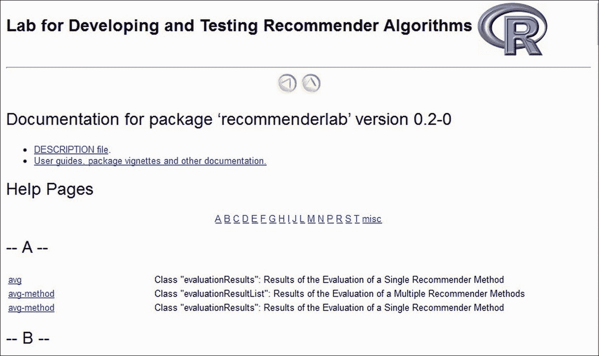

# recommenderlab 包中可用的数据集

与 R 中可用的任何其他包一样，`recommenderlab`也附带默认数据集。运行以下命令以显示可用的包：

```py
data_package <- data(package = "recommenderlab") 
data_package$results[,c("Item","Title")] 

```

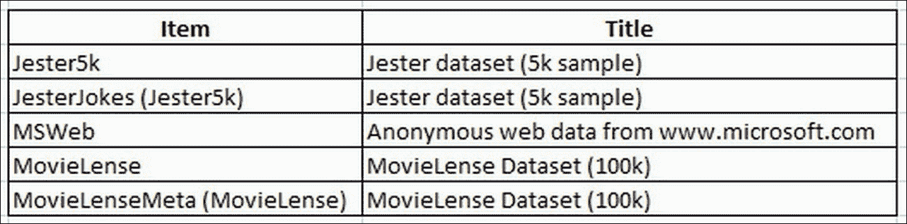

在所有可用的数据集中，我们选择使用`Jester5k`数据集来实现使用 R 的基于用户的协同过滤和基于物品的协同过滤推荐引擎。

## 探索 Jester5K 数据集

在本节中，我们将按以下方式探讨`Jester5K`数据集：

### 描述

该数据集包含来自 Jester 在线笑话推荐系统匿名评分数据的 5000 个用户样本，收集时间介于 1999 年 4 月到 2003 年 5 月之间。

### 使用

```py
data(Jester5k) 

```

### 格式

`Jester5k`的格式是：`Formal class 'realRatingMatrix' [package "recommenderlab"]`。

`JesterJokes`的格式是一个字符字符串向量。

### 详细信息

`Jester5k`包含一个*5000 x 100*的评分矩阵（5000 个用户和 100 个笑话），评分介于-10.00 到+10.00 之间。所有选定的用户都评分了 36 个或更多的笑话。

数据还包含 `JesterJokes` 中的实际笑话。

实际评分矩阵中存在的评分数量表示如下：

```py
nratings(Jester5k) 

[1] 362106 

Jester5k 
5000 x 100 rating matrix of class 'realRatingMatrix' with 362106 ratings. 

```

您可以通过运行以下命令来显示评分矩阵的类别：

```py
class(Jester5k) 
[1] "realRatingMatrix" 
attr(,"package") 
[1] "recommenderlab" 

```

`recommenderlab` 包以紧凑的方式高效地存储评分信息。通常，评分矩阵是稀疏矩阵。因此，`realRatingMatrix` 类支持稀疏矩阵的紧凑存储。

让我们比较 `Jester5k` 与相应的 R 矩阵的大小，以了解实际评分矩阵的优势，如下所示：

```py
object.size(Jester5k) 
4633560 bytes 
#convert the real-rating matrix into R matrix 
object.size(as(Jester5k,"matrix")) 
4286048 bytes 
object.size(as(Jester5k, "matrix"))/object.size(Jester5k) 
0.925001079083901 bytes 

```

我们观察到实际评分矩阵存储的空间比 R 矩阵少 `0.92` 倍。对于基于内存的协同过滤方法，这些方法是内存中的模型，在生成推荐时将所有数据加载到内存中，因此高效地存储数据非常重要。`recommenderlab` 包有效地完成了这项工作。

`The recommenderlab` 包暴露了许多可以通过评分矩阵对象操作的功能。运行以下命令以查看可用方法：

```py
methods(class = class(Jester5k)) 

```

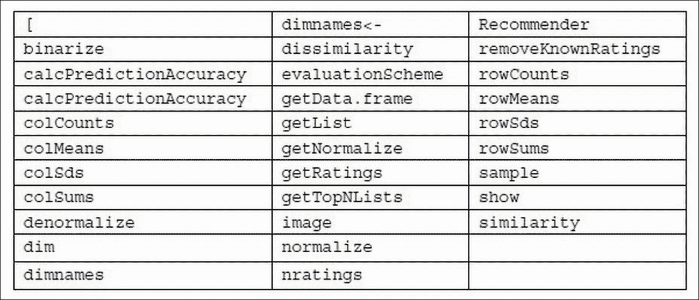

运行以下命令以查看 `recommenderlab` 包中可用的推荐算法：

```py
names(recommender_models) 

```

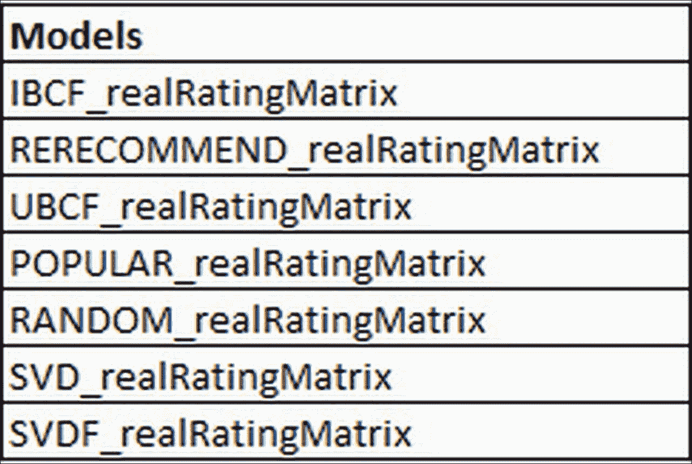

以下代码片段显示的结果与上一张图片相同，`lapply()` 函数将函数应用于列表的所有元素，在我们的案例中，对于 `recommender_models` 对象中的每个项目，`lapply` 将提取描述并按以下方式显示结果：

```py
lapply(recommender_models, "[[", "description") 
$IBCF_realRatingMatrix 
[1] "Recommender based on item-based collaborative filtering (real data)." 

$POPULAR_realRatingMatrix 
[1] "Recommender based on item popularity (real data)." 

$RANDOM_realRatingMatrix 
[1] "Produce random recommendations (real ratings)." 

$RERECOMMEND_realRatingMatrix 
[1] "Re-recommends highly rated items (real ratings)." 

$SVD_realRatingMatrix 
[1] "Recommender based on SVD approximation with column-mean imputation (real data)." 

$SVDF_realRatingMatrix 
[1] "Recommender based on Funk SVD with gradient descend (real data)." 

$UBCF_realRatingMatrix 
[1] "Recommender based on user-based collaborative filtering (real data)." 

```

# 探索数据集

在本节中，让我们更详细地探索数据。要查找数据的维度和数据类型，请运行以下命令：

有 `5000` 个用户和 `100` 个项目：

```py
dim(Jester5k) 

[1] 5000  100 

```

数据是 R 矩阵：

```py
class(Jester5k@data) 

[1] "dgCMatrix" 
attr(,"package") 
[1] "Matrix" 

```

## 探索评分值

以下代码片段将帮助我们了解评分值的分布：

评分分布如下：

```py
hist(getRatings(Jester5k), main="Distribution of ratings") 

```

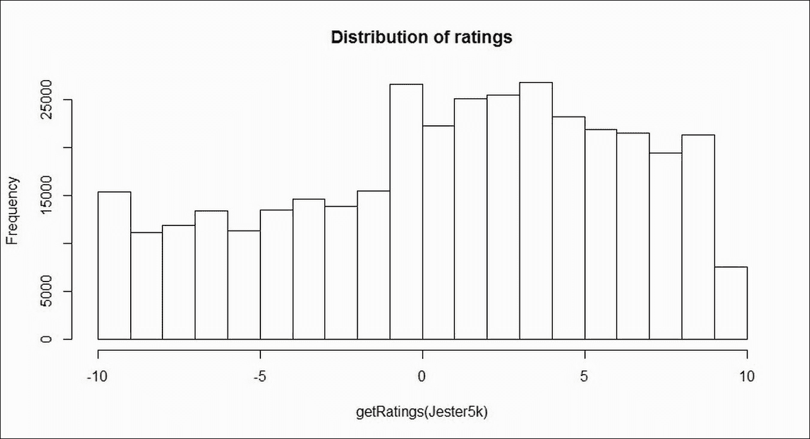

上一张图片显示了 `Jester5K` 数据集中可用的评分的频率。我们可以观察到负评分大致呈均匀分布或相同的频率，而正评分频率较高，并向图表的右侧递减。这可能是用户给出的评分引入的偏差所致。

# 使用 recommenderlab 构建基于用户的协同过滤

运行以下代码以将 `recommenderlab` 库和数据加载到 R 环境中：

```py
library(recommenderlab) 
data("Jester5k") 

```

让我们查看前六个用户在第一个 10 个笑话上的样本评分数据。运行以下命令：

```py
head(as(Jester5k,"matrix")[,1:10]) 

```

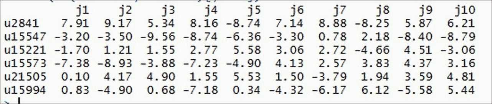

我们在上一节中已经探讨了数据探索，因此我们将直接进入构建基于用户的协同推荐系统。

本节分为以下几部分：

+   通过将数据分为 80%的训练数据和 20%的测试数据来构建基准推荐模型。

+   使用 k 折交叉验证方法评估推荐模型

+   调整推荐模型的参数

## 准备训练数据和测试数据

为了构建和评估推荐模型，我们需要训练数据和测试数据。运行以下命令来创建它们：

我们使用种子函数来生成可重复的结果：

```py
set.seed(1) 
which_train <- sample(x = c(TRUE, FALSE), size = nrow(Jester5k),replace = TRUE, prob = c(0.8, 0.2)) 
head(which_train) 
[1]  TRUE  TRUE  TRUE  TRUE FALSE  TRUE 

```

之前的代码创建了一个与用户数量相等的逻辑对象。真实的索引将是训练集的一部分，而假的索引将是测试集的一部分。

```py
rec_data_train <- Jester5k[which_train, ] 
rec_data_test <- Jester5k[!which_train, ] 

dim(rec_data_train) 
[1] 4004  100 

dim(rec_data_test) 
[1] 996  100 

```

## 创建一个基于用户的协作模型

现在，让我们在`Jester5k`的全部数据上创建一个推荐模型。在此之前，让我们探索`recommenderlab`包中可用的推荐模型及其参数，如下所示：

```py
recommender_models <- recommenderRegistry$get_entries(dataType = "realRatingMatrix") 

recommender_models 

```

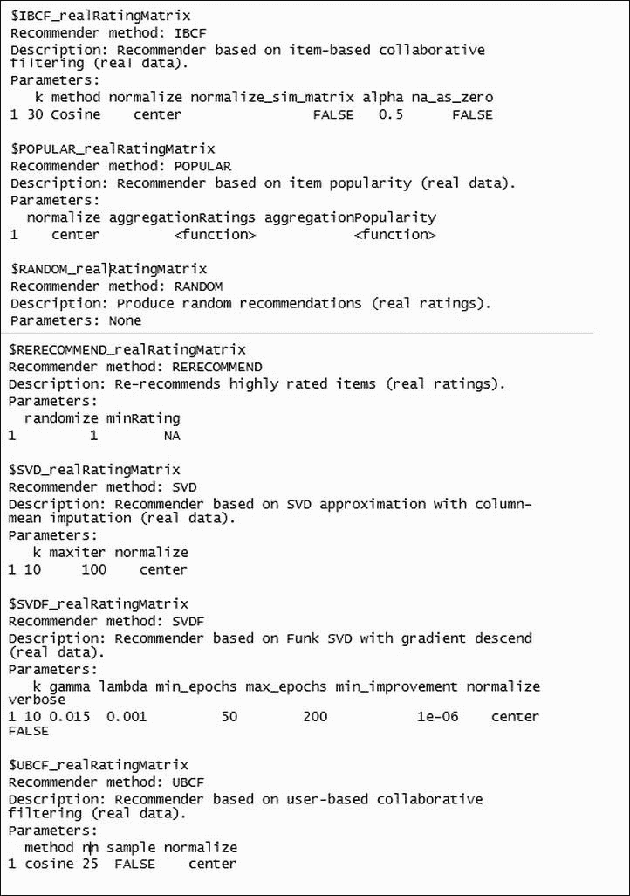

我们刚才看到的图像显示了 6 种不同的推荐模型及其参数。

运行以下代码来构建基于用户的协同过滤模型：

```py
recc_model <- Recommender(data = rec_data_train, method = "UBCF") 
recc_model 

Recommender of type 'UBCF' for 'realRatingMatrix'  
learned using 4004 users. 
recc_model@model$data 

4004 x 100 rating matrix of class 'realRatingMatrix' with 289640 ratings. 
Normalized using center on rows. 

```

`recc_model@model$data`对象包含评分矩阵。这是因为 UBCF 是一种懒学习技术，这意味着它需要访问所有数据来进行预测。

## 在测试集上的预测

现在我们已经构建了模型，让我们在测试集上预测推荐。为此，我们将使用库中可用的`predict()`函数。我们为每个用户生成 10 个推荐。请参阅以下代码以获取预测结果：

```py
n_recommended <- 10 
recc_predicted <- predict(object = recc_model,newdata = rec_data_test, n = n_recommended) 
recc_predicted 
Recommendations as 'topNList' with n = 10 for 996 users.  

#Let's define list of predicted recommendations: 
rec_list <- sapply(recc_predicted@items, function(x){ 
  colnames(Jester5k)[x] 
}) 

```

以下代码给出的结果是列表类型：

```py
class(rec_list) 
[1] "list" 

```

前两个推荐如下：

```py
rec_list [1:2] 
$u21505 
 [1] "j81"  "j73"  "j83"  "j75"  "j100" "j80"  "j72"  "j95"  "j87"  "j96"  

$u5809 
 [1] "j97" "j93" "j76" "j78" "j77" "j85" "j89" "j98" "j91" "j80" 

```

我们可以观察到，对于用户`u21505`，前 10 个推荐是`j81, j73, j83, ... j96`。

以下图像显示了四个用户的推荐：

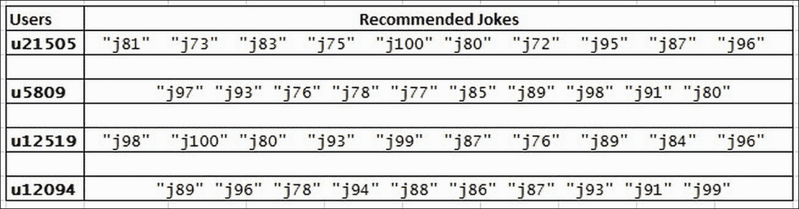

让我们运行以下代码来查看为所有测试用户生成了多少推荐：

```py
number_of_items = sort(unlist(lapply(rec_list, length)),decreasing = TRUE) 
table(number_of_items) 

0   1   2   3   4   5   6   7   8   9  10  
286   3   2   3   3   1   1   1   2   3 691  

```

从上述结果中，我们看到对于`286`个用户，没有生成任何推荐。原因是他们已经对原始数据集中的所有电影进行了评分。对于`691`个用户，每个用户生成了 10 个评分，原因是他们在原始数据集中没有对任何电影进行评分。其他收到 2、3、4 等推荐的用户意味着他们推荐的电影非常少。

## 分析数据集

在我们评估模型之前，让我们退一步分析数据。通过分析所有用户对笑话给出的评分数量，我们可以观察到有`1422`个人对所有的`100`个笑话进行了评分，这似乎很不寻常，因为很少有人对 80 到 99 个笑话进行了评分。进一步分析笑话，我们发现，有`221`、`364`、`312`和`131`个用户分别对`71`、`72`、`73`和`74`个笑话进行了评分，这与其他笑话评分相比似乎很不寻常。

运行以下代码以提取每个笑话获得的评分数量：

```py
table(rowCounts(Jester5k)) 

```

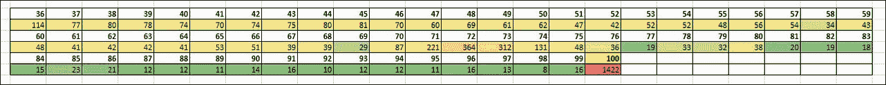

在下一步中，让我们删除评分了 80 个或更多笑话的用户的记录。

```py
model_data = Jester5k[rowCounts(Jester5k) < 80] 
dim(model_data) 
[1] 3261  100 

```

维度已从`5000`减少到`3261`条记录。

现在让我们分析每个用户给出的平均评分。箱线图显示了笑话评分的平均分布。

```py
boxplot(model_data) 

```

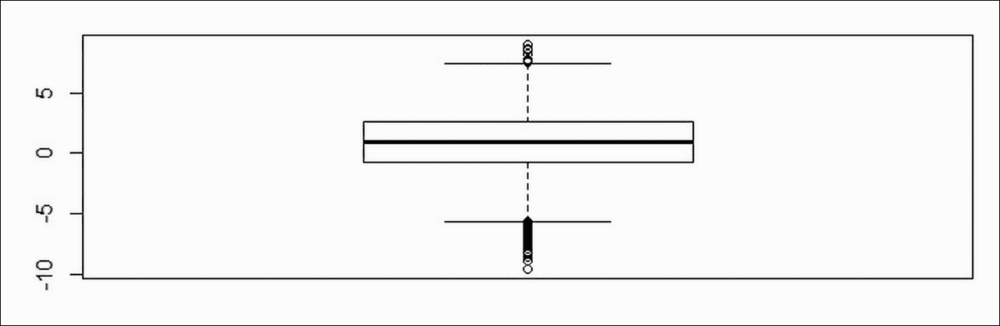

前面的图像显示，很少有评分偏离正常行为。从前面的图像中我们可以看到，平均评分在 7（大约）以上和-5（大约）以下的是一些异常值，数量较少。让我们通过运行以下代码来查看计数：

```py
boxplot(rowMeans(model_data [rowMeans(model_data)>=-5 & rowMeans(model_data)<= 7])) 

```

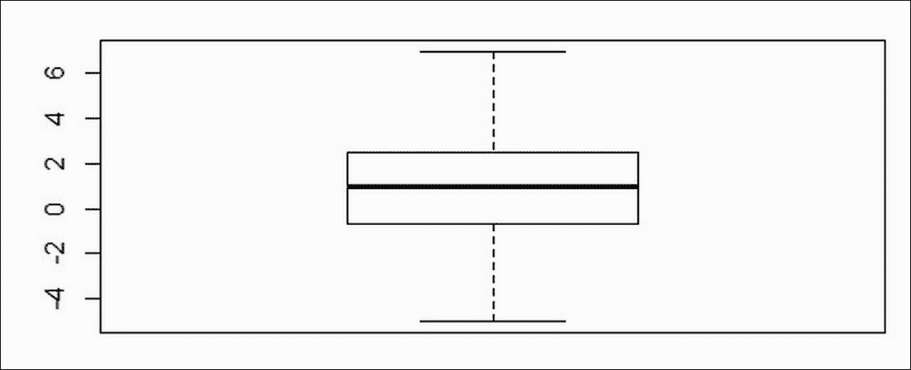

删除给出了非常低平均评分和非常高平均评分的用户。

```py
model_data = model_data [rowMeans(model_data)>=-5 & rowMeans(model_data)<= 7] 
dim(model_data) 
[1] 3163  100 

```

让我们按照以下方式检查数据中前 100 个用户的评分分布：

```py
image(model_data, main = "Rating distribution of 100 users") 

```

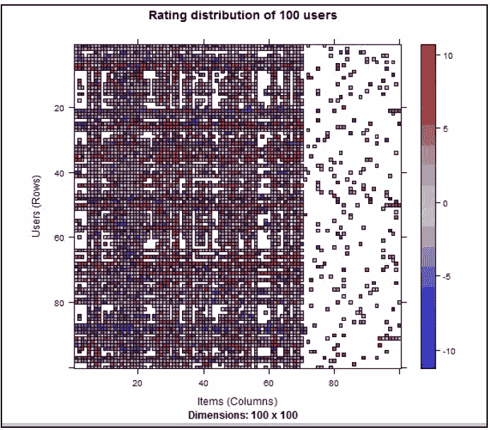

## 使用 k 交叉验证评估推荐模型

`recommenderlab`包提供了一个使用`evaluationScheme()`函数评估模型的框架。根据 Cran 网站的定义，evaluationScheme 可以从数据集创建一个 evaluationScheme 对象。方案可以是简单的训练和测试数据分割，k 折交叉验证或使用 k 个独立的自助样本。

以下为`evaluationScheme()`函数的参数：

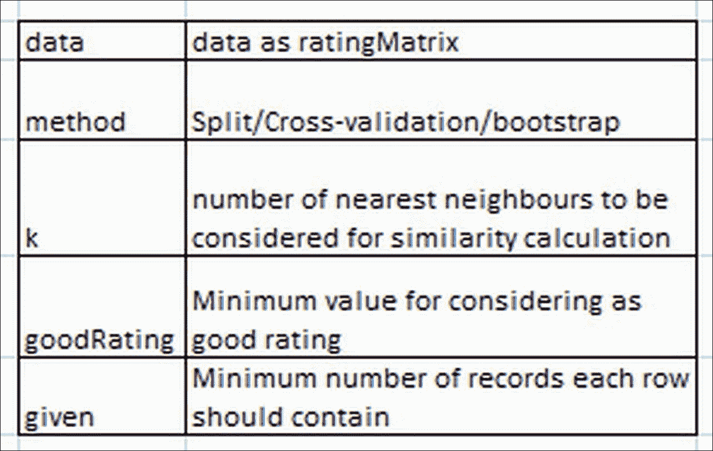

我们使用交叉验证方法来分割数据，例如，5 折交叉验证方法将训练数据分成五个更小的集合，其中四个集合用于训练模型，剩下的一个集合用于评估模型。让我们定义以下参数：最小良好评分、交叉验证方法的折数和分割方法：

```py
items_to_keep <- 30 
rating_threshold <- 3 
n_fold <- 5 # 5-fold  
eval_sets <- evaluationScheme(data = model_data, method = "cross-validation",train = percentage_training, given = items_to_keep, goodRating = rating_threshold, k = n_fold) 

Evaluation scheme with 30 items given 
Method: 'cross-validation' with 5 run(s). 
Good ratings: >=3.000000 
Data set: 3163 x 100 rating matrix of class 'realRatingMatrix' with 186086 ratings. 

```

让我们按照以下方式检查由交叉验证方法形成的五个集合的大小：

```py
size_sets <- sapply(eval_sets@runsTrain, length) 
 size_sets 
[1] 2528 2528 2528 2528 2528 

```

为了提取集合，我们需要使用`getData()`。有三个集合：

+   **train**：这是训练集

+   **known**：这是测试集，用于构建推荐的项目

+   **unknown**：这是测试集，用于测试推荐的项目

让我们看一下以下代码中的训练集：

```py
getData(eval_sets, "train") 
2528 x 100 rating matrix of class 'realRatingMatrix' with 149308 ratings. 

```

## 评估基于用户的协同过滤

现在让我们评估模型，让我们将`model_to_evaluate`参数设置为基于用户的协同过滤，并将`model_parameters`设置为`NULL`以使用默认设置，如下所示：

```py
model_to_evaluate <- "UBCF" 
model_parameters <- NULL 

```

下一步是使用`recommender()`函数构建推荐模型，如下所示：

```py
eval_recommender <- Recommender(data = getData(eval_sets, "train"),method = model_to_evaluate, parameter = model_parameters) 

Recommender of type 'UBCF' for 'realRatingMatrix'  
learned using 2528 users 

```

我们已经看到，基于用户的推荐模型已经使用`2528`个用户的训练数据学习。现在我们可以预测`eval_sets`中的已知评分，并使用前面描述的未知集来评估结果。

在对已知评分进行预测之前，我们必须设置要推荐的物品数量。接下来，我们必须将测试集提供给`predict()`函数进行预测。评分的预测是通过运行以下命令完成的：

```py
items_to_recommend <- 10 
eval_prediction <- predict(object = eval_recommender, newdata =getData(eval_sets, "known"), n = items_to_recommend, type = "ratings") 

eval_prediction 
635 x 100 rating matrix of class 'realRatingMatrix' with 44450 ratings 

```

执行`predict()`函数将花费时间，因为基于用户的协同过滤方法是基于内存的、在运行时实现的懒惰学习技术，以表明在预测过程中整个数据集被加载。

现在我们将使用未知集评估预测，并使用精确率、召回率和 F1 度量等指标来估计模型精度。运行以下代码通过调用`calcPredictionAccuracy()`方法来计算模型精度指标：

```py
eval_accuracy <- calcPredictionAccuracy(  x = eval_prediction, data = getData(eval_sets, "unknown"), byUser = TRUE) 
head(eval_accuracy) 
           RMSE       MSE      MAE 
u17322 4.536747 20.582076 3.700842 
u13610 4.609735 21.249655 4.117302 
u5462  4.581905 20.993858 3.714604 
u1143  2.178512  4.745912 1.850230 
u5021  2.664819  7.101260 1.988018 
u21146 2.858657  8.171922 2.194978 

```

通过设置`byUser = TRUE`，我们正在计算每个用户的模型精度。取平均值将给出整体精度，如下所示：

```py
apply(eval_accuracy,2,mean) 
     RMSE       MSE       MAE  
 4.098122 18.779567  3.377653  

```

通过设置`byUser=FALSE`，在先前的`calcPredictionAccuracy()`中，我们可以计算由以下给出的整体模型精度：

```py
eval_accuracy <- calcPredictionAccuracy(  x = eval_prediction, data = getData(eval_sets, "unknown"), byUser = 
    FALSE) 

eval_accuracy 
    RMSE       MSE       MAE  
 4.372435 19.118191  3.431580  

```

在先前的方法中，我们使用**均方根误差**（**RMSE**）和**平均绝对误差**（**MAE**）来评估模型精度，但我们也可以使用精确率/召回率来评估模型精度。为此，我们使用`evaluate()`函数，然后使用`evaluate()`方法的结果创建一个包含精确率/召回率/f1 度量的混淆矩阵，如下所示：

```py
results <- evaluate(x = eval_sets, method = model_to_evaluate, n = seq(10, 100, 10)) 

```

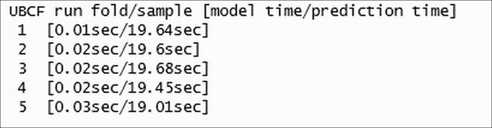

```py
head(getConfusionMatrix(results)[[1]]) 

         TP        FP        FN        TN precision    recall       TPR        FPR 
10  6.63622  3.363780 10.714961 49.285039 0.6636220 0.4490838 0.4490838 0.05848556 
20 10.03150  9.968504  7.319685 42.680315 0.5015748 0.6142384 0.6142384 0.17854766 
30 11.20787 18.792126  6.143307 33.856693 0.3735958 0.6714050 0.6714050 0.34877101 
40 11.91181 28.088189  5.439370 24.560630 0.2977953 0.7106378 0.7106378 0.53041204 
50 12.96850 37.031496  4.382677 15.617323 0.2593701 0.7679658 0.7679658 0.70444585 
60 14.82362 45.176378  2.527559  7.472441 0.2470604 0.8567522 0.8567522 0.85919995 

```

前四列包含真实/假阳性/阴性，如下所示：

+   **真阳性**（**TP**）：这些是被正确评分的推荐项目

+   **假阳性**（**FP**）：这些是没有被评分的推荐项目

+   **假阴性**（**FN**）：这些是不推荐的、已经被评分的项目

+   **真阴性**（**TN**）：这些是没有被推荐的、没有被评分的项目

一个完美（或过度拟合）的模型将只有`TP`和`TN`。

如果我们想同时考虑所有分割，我们可以将索引相加，如下所示：

```py
columns_to_sum <- c("TP", "FP", "FN", "TN") 
indices_summed <- Reduce("+", getConfusionMatrix(results))[, columns_to_sum] 
head(indices_summed) 
         TP        FP       FN        TN 
10 32.59528  17.40472 53.22520 246.77480 
20 49.55276  50.44724 36.26772 213.73228 
30 55.60787  94.39213 30.21260 169.78740 
40 59.04724 140.95276 26.77323 123.22677 
50 64.22205 185.77795 21.59843  78.40157 
60 73.67717 226.32283 12.14331  37.85669 

```

由于通过上述表格很难总结模型，我们可以使用 ROC 曲线来评估模型。使用`plot()`来构建 ROC 图，如下所示：

```py
plot(results, annotate = TRUE, main = "ROC curve") 

```

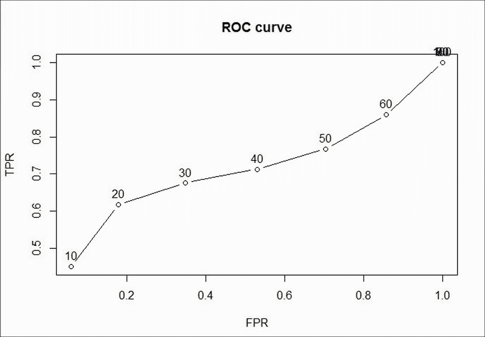

前面的图表显示了**真阳性率**（**TPR**）和**假阳性率**（**FPR**）之间的关系，但我们必须选择这样的值，以便在 TPR 和 FPR 之间进行权衡。在我们的案例中，我们观察到*nn=30*是一个非常好的权衡点，因为当我们考虑 30 个邻居时，TPR 接近*0.7*，FPR 是*0.4*，当移动到*nn=40*时，TPR 仍然接近*0.7*，但 FPR 已经变为*0.4*。这意味着假阳性率已经增加。

# 构建基于物品的推荐模型

与 UBCF 一样，我们使用相同的 `Jester5k` 数据集作为基于物品的推荐系统。在本节中，我们不会探索数据，因为我们已经在上一节中这样做过了。我们首先移除那些对所有物品都进行了评分的用户数据，以及那些评分超过 `80` 的记录，如下所示：

```py
library(recommenderlab) 
data("Jester5k") 
model_data = Jester5k[rowCounts(Jester5k) < 80] 
model_data 
[1] 3261  100 

```

现在让我们看看每个用户的平均评分是如何分布的：

```py
boxplot(rowMeans(model_data)) 

```

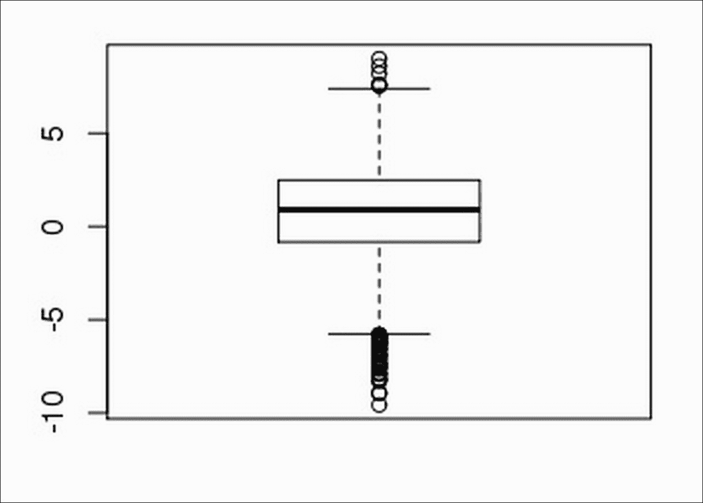

以下代码片段计算了每个用户给出的平均评分，并识别了给出极端评分的用户——要么是极高的评分，要么是极低的评分：

从以下结果中，我们可以观察到有 19 条记录的平均评分非常高，而与大多数用户相比，有 79 条记录的评分非常低：

```py
dim(model_data[rowMeans(model_data) < -5]) 
[1]  79 100 
dim(model_data[rowMeans(model_data) > 7]) 
[1]  19 100 

```

在总共 `3261` 条记录中，只有 `98` 条记录的平均评分远低于平均值，远高于平均值，因此我们将这些记录从数据集中移除，如下所示：

```py
model_data = model_data [rowMeans(model_data)>=-5 & rowMeans(model_data)<= 7] 
model_data 
[1] 3163  100 

```

从这里，我们将章节划分为以下几部分：

+   使用训练数据和测试数据构建 IBCF 推荐模型。

+   评估模型

+   参数调整

## 构建 IBCF 推荐模型

构建任何推荐模型的第一个步骤是准备训练数据。之前，我们已经通过移除异常数据来准备了构建模型所需的数据。现在运行以下代码将可用数据分为两个集合：80% 的训练集和 20% 的测试集。我们使用训练数据构建推荐模型并在测试集上生成推荐。

以下代码首先创建了一个与原始数据集长度相同的逻辑对象，其中包含 80% 的元素为 TRUE，20% 为测试：

```py
which_train <- sample(x = c(TRUE, FALSE), size = nrow(model_data), 
 replace = TRUE, prob = c(0.8, 0.2)) 
class(which_train) 
[1] "logical" 
head(which_train) 
[1] TRUE TRUE TRUE TRUE TRUE TRUE 

```

然后，我们使用 `model_data` 中的逻辑对象生成训练集，如下所示：

```py
 model_data_train <- model_data[which_train, ] 
dim(model_data_train) 
[1] 2506  100 

```

然后，我们使用 `model_data` 中的逻辑对象生成测试集，如下所示：

```py
 model_data_test <- model_data[!which_train, ] 
 dim(model_data_test) 
[1] 657 100 

```

现在我们已经准备好了训练集和测试集，让我们训练模型并在测试集上生成顶级推荐。

对于模型构建，如 UBCF 部分所述，我们使用 `recommenderlab` 包中可用的相同的 `recommender()` 函数。运行以下代码使用训练数据训练模型。

为 `recommender()` 函数设置参数。我们将模型设置为评估 `"IBCF"` 并设置 `k=30`。`k` 是在计算相似度值时需要考虑的邻居数量，如下所示：

```py
model_to_evaluate <- "IBCF" 

model_parameters <- list(k = 30) 

```

以下代码片段展示了使用 `recommender()` 函数及其输入参数（如输入数据、评估参数的模型和 k 参数）构建推荐引擎模型：

```py
model_recommender <- Recommender(data = model_data_train,method = model_to_evaluate, parameter = model_parameters) 

```

IBCF 模型对象被创建为 `model_recommender`。该模型使用我们之前创建的 `2506` 条训练集进行训练和学习，如下所示：

```py
model_recommender 
Recommender of type 'IBCF' for 'realRatingMatrix'  learned using 2506 users. 

```

现在我们已经创建了模型，让我们来探索一下模型。我们使用 `recommenderlab` 中的 `getModel()` 函数提取模型细节，如下所示：

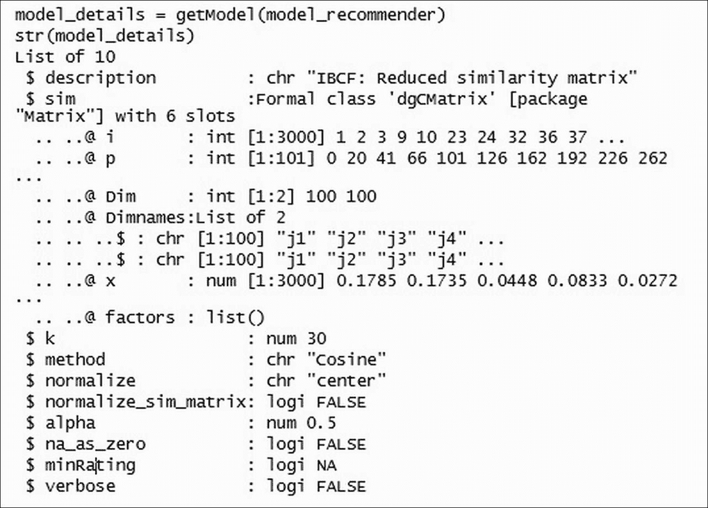

从上述结果中，需要注意的重要参数是`k`值、默认相似度值和方法，即`余弦相似度`。

最后一步是在测试集上生成推荐。在测试集上运行以下代码以生成推荐。

`items_to_recommend`是设置每个用户要生成的推荐数量的参数：

```py
items_to_recommend <- 10 

```

调用 reocommenderlab 包中可用的`predict()`方法来预测测试集中的未知项：

```py
model_prediction <- predict(object = model_recommender, newdata = model_data_test, n = items_to_recommend) 

model_prediction 
Recommendations as 'topNList' with n = 10 for 657 users.  

print(class(model_prediction)) 
[1] "topNList" 
attr(,"package") 
[1] "recommenderlab" 

```

我们可以使用`slotNames()`方法获取预测对象的槽位详情：

```py
slotNames(model_prediction) 
[1] "items"      "itemLabels" "n"          

```

让我们看看测试集中第一个用户的预测结果：

```py
 model_prediction@items[[1]] 
 [1]  89  76  72  87  93 100  97  80  94  86 

```

让我们在每个预测中添加项目标签：

```py
 recc_user_1  = model_prediction@items[[1]] 

 jokes_user_1 <- model_prediction@itemLabels[recc_user_1] 

 jokes_user_1 
 [1] "j89"  "j76"  "j72"  "j87"  "j93"  "j100" "j97"  "j80"  "j94"  "j86"  

```

## 模型评估

在我们生成预测之前，让我们退一步来评估推荐器模型。正如我们在 UBCF 中看到的，我们可以使用可用的`evaluationScheme()`方法。我们使用交叉验证设置来生成训练集和测试集。然后我们在每个测试集上做出预测并评估模型准确性。

运行以下代码以生成训练集和测试集。

`n_fold`定义了 4 折交叉验证，将数据分为 4 个集合；3 个训练集和 1 个测试集：

```py
n_fold <- 4 

```

`items_to_keep`定义了用于生成推荐的最低项目数量：

```py
items_to_keep <- 15 

```

`rating_threshold`定义了被认为是良好评分的最小评分：

```py
rating_threshold <- 3 

```

`evaluationScheme`方法创建测试集：

```py
eval_sets <- evaluationScheme(data = model_data, method = "cross-validation",k = n_fold, given = items_to_keep, goodRating =rating_threshold) 
size_sets <- sapply(eval_sets@runsTrain, length) 
size_sets 
[1] 2370 2370 2370 2370 

```

将`model_to_evaluate`设置为设置要使用的推荐器方法。`model_parameters`定义了模型参数，例如在计算余弦相似度时考虑的邻居数量。目前我们将它设置为`NULL`，以便模型选择默认值，如下所示：

```py
model_to_evaluate <- "IBCF" 
model_parameters <- NULL 

```

使用`recommender()`方法生成模型。让我们了解`recommender()`方法的每个参数：

`getData`从`eval_sets`中提取训练数据，并将其按如下方式传递给`recommender()`方法：

```py
getData(eval_sets,"train") 
2370 x 100 rating matrix of class 'realRatingMatrix' with 139148 ratings 

```

由于我们使用 4 折交叉验证，`recommender()`方法使用`eval_sets`中的三个集合进行训练，剩余的一个集合用于测试/评估模型，如下所示：

```py
eval_recommender <- Recommender(data = getData(eval_sets, "train"),method = model_to_evaluate, parameter = model_parameters) 
#setting the number of items to be set for recommendations 
items_to_recommend <- 10 

```

现在我们使用构建的模型在`eval_sets`的“已知”数据集上做出预测。如前所述，我们使用`predict()`方法生成预测，如下所示：

```py
eval_prediction <- predict(object = eval_recommender, newdata = getData(eval_sets, "known"), n = items_to_recommend, type = "ratings") 

class(eval_prediction) 
[1] "realRatingMatrix" 
attr(,"package") 
[1] "recommenderlab" 

```

## 使用指标评估模型准确性

到目前为止，该过程与制作初始预测的过程相同，现在我们将看到如何评估在`eval_sets`的“已知”测试数据集上做出的模型准确性。正如我们在 UBCF 部分所看到的，我们使用`calcPredictionAccuracy()`方法来计算预测准确性。

我们使用`calcPredictionAccuracy()`方法，并将`eval_sets`中可用的`"unknown"`数据集作为如下所示：

```py
eval_accuracy <- calcPredictionAccuracy(x = eval_prediction, data = getData(eval_sets, "unknown"), byUser = TRUE) 

head(eval_accuracy)
           RMSE      MSE      MAE 
u238   4.625542 21.39564  4.257505 
u17322  4.953789  24.54003  3.893797 
u5462  4.685714   21.95591  4.093891 
u13120   4.977421  24.77472  4.261627 
u12519   3.875182  15.01703  2.750987 
u17883 7.660785 58.68762 6.595489 

```

### 注意

在前面的方法中使用`byUser = TRUE`计算每个用户的准确度。在上面的表中，我们可以看到对于用户`u238`，`RMSE`为`4.62`，`MAE`为`4.25`

如果我们想看到整个模型的准确度，只需计算每列的平均值，即所有用户的平均值，如下所示：

```py
apply(eval_accuracy,2,mean) 
  RMSE      MSE      MAE  
 4.45511 21.94246  3.56437  

```

通过设置`byUser=FALSE`，我们可以计算整个模型的模型准确度：

```py
eval_accuracy <- calcPredictionAccuracy(x = eval_prediction, data = getData(eval_sets, "unknown"), byUser = FALSE)

eval_accuracy 
     RMSE       MSE       MAE  
 4.672386 21.831190  3.555721  

```

## 使用图表展示模型准确度

现在我们可以看到使用 Precision-Recall、ROC 曲线和精度/召回曲线来展示模型准确度。这些曲线帮助我们决定在为推荐模型选择参数时 Precision-Recall 之间的权衡，在我们的案例中是 IBCF。

我们使用`evaluate()`方法，然后设置 n 值，该值定义了在计算项目之间的相似度时最近邻的数量，如下所示：

运行以下评估方法使模型对每个数据集运行四次：

```py
results <- evaluate(x = eval_sets, method = model_to_evaluate, n = seq(10,100,10)) 
IBCF run fold/sample [model time/prediction time] 
 1  [0.145sec/0.327sec]  
 2  [0.139sec/0.32sec]  
 3  [0.139sec/0.32sec]  
 4  [0.137sec/0.322sec]  

```

让我们看看每个折的模型准确度：

```py
results@results[1]
```

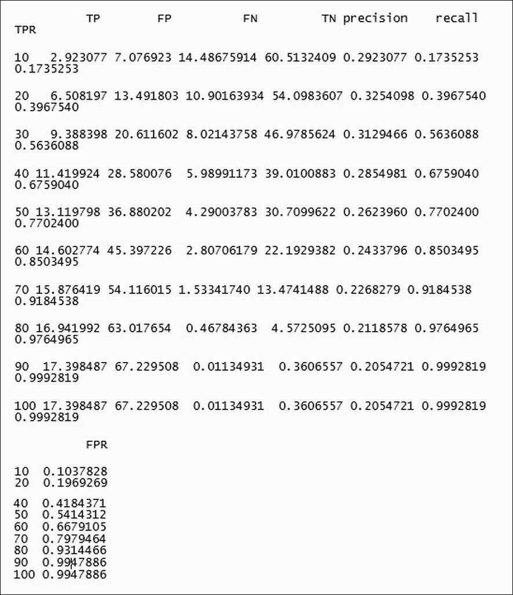

使用以下代码汇总所有 4 折结果：

```py
columns_to_sum <- c("TP", "FP", "FN", "TN","precision","recall") 
indices_summed <- Reduce("+", getConfusionMatrix(results))[, columns_to_sum] 

```

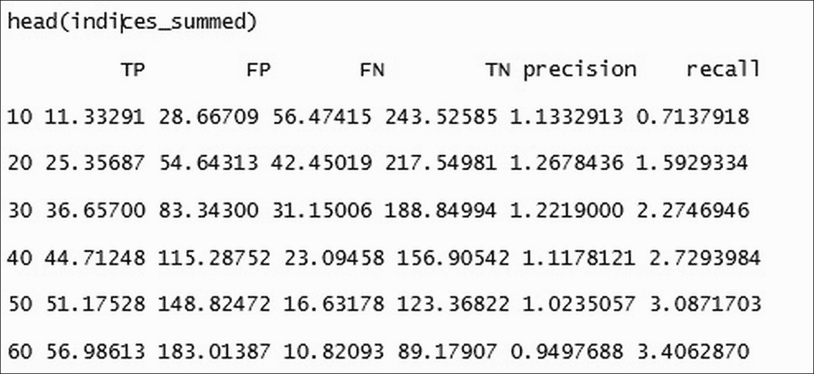

从前一个表中，我们可以观察到，当 n 值为 30 和 40 时，模型准确率和 Precision-Recall 值都很好。同样，可以使用 ROC 曲线和 Precision-Recall 图直观地得出相同的结果，如下所示：

```py
plot(results, annotate = TRUE, main = "ROC curve") 

```

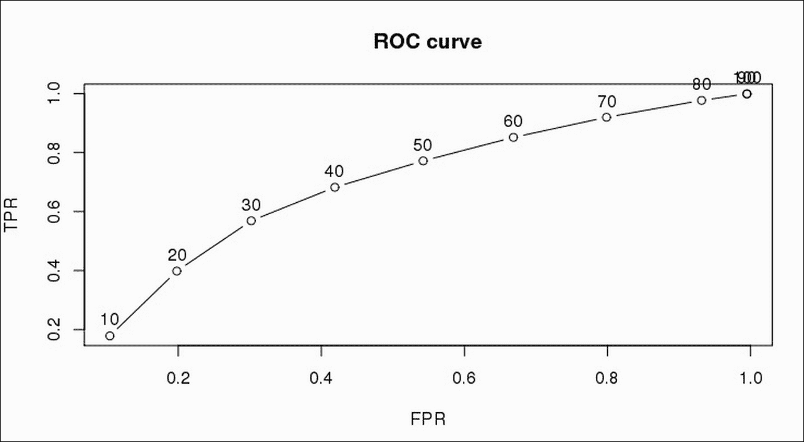

```py
plot(results, "prec/rec", annotate = TRUE, main = "Precision-recall") 

```

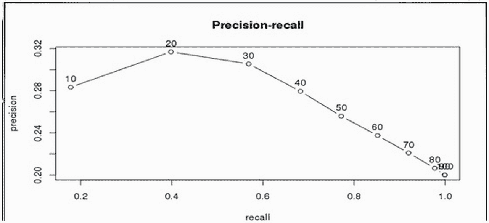

## IBCF 的参数调整

在构建 IBCF 模型时，在生成最终模型推荐之前，我们可以选择一些最优值：

+   我们必须选择计算项目之间相似度时最优的邻居数量

+   要使用的相似度方法，无论是余弦还是 Pearson 方法

查看以下步骤：

首先设置不同的 k 值：

```py
vector_k <- c(5, 10, 20, 30, 40)
```

使用`lapply`生成使用余弦方法和不同 k 值的模型：

```py
 model1 <- lapply(vector_k, function(k,l){ list(name = "IBCF", param = list(method = "cosine", k = k)) })
names(model1) <- paste0("IBCF_cos_k_", vector_k)
names(model1) [1] "IBCF_cos_k_5" "IBCF_cos_k_10" "IBCF_cos_k_20" "IBCF_cos_k_30" [5] "IBCF_cos_k_40" #use Pearson method for similarities model2 <- lapply(vector_k, function(k,l){ list(name = "IBCF", param = list(method = "pearson", k = k)) })
names(model2) <- paste0("IBCF_pea_k_", vector_k)
names(model2) [1] "IBCF_pea_k_5" "IBCF_pea_k_10" "IBCF_pea_k_20" "IBCF_pea_k_30" [5] "IBCF_pea_k_40" 
#now let's combine all the methods:
models = append(model1,model2)
```

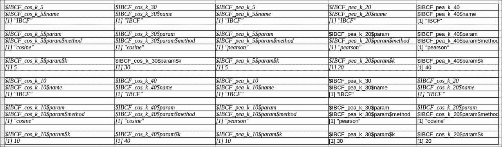

设置要生成的推荐总数：

```py
n_recommendations <- c(1, 5, seq(10, 100, 10))
```

调用评估方法到构建 4 折方法：

```py
 list_results <- evaluate(x = eval_sets, method = models, n= n_recommendations)
IBCF run fold/sample [model time/prediction time] 1 [0.139sec/0.311sec] 2 [0.143sec/0.309sec] 3 [0.141sec/0.306sec] 4 [0.153sec/0.312sec]
IBCF run fold/sample [model time/prediction time] 1 [0.141sec/0.326sec] 2 [0.145sec/0.445sec] 3 [0.147sec/0.387sec] 4 [0.133sec/0.439sec]
IBCF run fold/sample [model time/prediction time] 1 [0.14sec/0.332sec] 2 [0.16sec/0.327sec] 3 [0.139sec/0.331sec] 4 [0.138sec/0.339sec] IBCF run fold/sample [model time/prediction time] 1 [0.139sec/0.341sec] 2 [0.157sec/0.324sec] 3 [0.144sec/0.327sec] 4 [0.133sec/0.326sec]
```

现在我们已经得到了结果，让我们绘制并选择最优参数，如下所示：

```py
plot(list_results, annotate = c(1,2), legend = "topleft")  
title("ROC curve") 

```

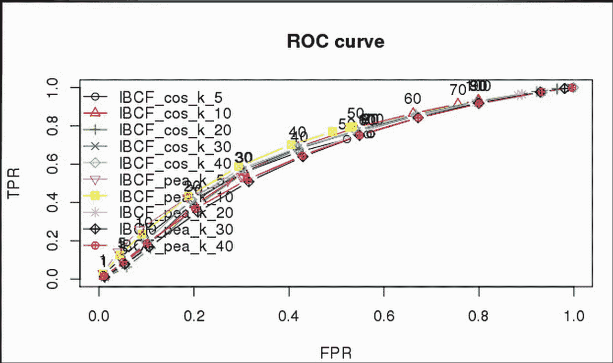

从前面的图中，最佳方法是使用余弦相似度的 IBCF，n 值为 30，其次是使用 Pearson 方法的 n 值为 40。

让我们用以下`Precision-Recall`曲线来确认这一点：

```py
plot(list_results, "prec/rec", annotate = 1, legend = "bottomright") 
title("Precision-recall") 

```

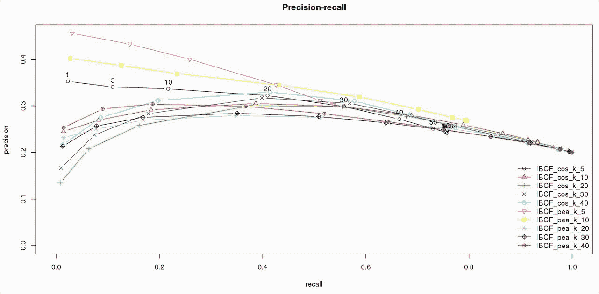

从上面的图中我们可以看到，当推荐数量=30 且使用余弦相似度和 n=40 时，实现了最佳的 Precision-Recall 比率。另一个好的模型是通过使用 Pearson 相似度方法和 n=10 实现的。

# 使用 Python 进行协同过滤

在上一节中，我们看到了使用 R 包 `recommenderlab` 实现基于用户的推荐系统和基于物品的推荐系统的实现。在本节中，我们将看到使用 Python 编程语言实现的 UBCF 和 IBCF 实现。

对于本节，我们使用 MovieLens 100k 数据集，其中包含 943 个用户对 1682 部电影的评分。与 R 不同，在 Python 中我们没有专门用于构建推荐引擎的 Python 包，至少没有基于邻居的推荐器，如基于用户/基于物品的推荐器。

我们有 Crab Python 包可用，但它没有得到积极支持。因此，我想使用 Python 中的科学包（如 NumPy、sklearn 和 Pandas）构建推荐引擎。

## 安装所需的包

对于本节，请确保您满足以下系统要求：

+   Python 3.5

+   Pandas 1.9.2 - Pandas 是一个开源的、BSD 许可的库，为 Python 编程语言提供高性能、易于使用的数据结构和数据分析工具。

+   NumPy 1.9.2 - NumPy 是 Python 科学计算的基础包。

+   sklearn 0.16.1

### 小贴士

安装前面提到的最佳方式是安装 Anaconda 发行版，这将安装所有所需的包，如 Python、Pandas 和 Numpy。Anaconda 可以在 [`www.continuum.io/downloads`](https://www.continuum.io/downloads) 找到。

## 数据来源

MovieLens 100k 数据可以从以下链接下载：

[`files.grouplens.org/datasets/movielens/ml-100k.zip`](http://files.grouplens.org/datasets/movielens/ml-100k.zip)

让我们从实现基于用户的协同过滤开始。假设我们已经将数据下载到本地系统，让我们将数据加载到 Python 环境中。

我们使用 Pandas 包和 `read_csv()` 方法通过传递两个参数，路径和分隔符来加载数据，如下所示：

```py
path = "~/udata.csv"
df = pd.read_csv(path, sep='\t')
```

数据将以 DataFrame 的形式加载，这是一种类似于表格的数据结构，可以轻松用于数据处理和操作任务。

```py
type(df) 
<class 'pandas.core.frame.DataFrame'> 

```

让我们通过使用 Pandas DataFrame 对象中可用的 `head()` 方法查看数据框的前六个结果，以了解数据似乎是如何使用的：

```py
df.head() 
 UserID  ItemId   Rating  Timestamp 
0     196      242       3  881250949 
1     186      302       3  891717742 
2      22      377       1  878887116 
3     244       51       2  880606923 
4     166      346       1  886397596 

```

让我们使用 `columns` 属性查看数据框 `df` 的列名。以下代码片段的结果显示有四个列：`UserID`、`ItemId`、`Rating`、`Timestamp`，并且它是对象数据类型：

```py
df.columns 
Index([u'UserID', u'ItemId ', u'Rating', u'Timestamp'], dtype='object') 

```

让我们通过调用 shape 属性来查看数据框的大小；我们观察到我们有 100k 条记录，4 列：

```py
df.shape 
(100000, 4) 

```

# 数据探索

在本节中，我们将探索 MovieLens 数据集，并准备使用 Python 构建协同过滤推荐引擎所需的数据。

让我们通过以下代码片段查看评分的分布：

```py
import matplotlib.pyplot as plt 
plt.hist(df['Rating']) 

```

从以下图像中我们可以看到，有更多电影获得了 4 星评级：

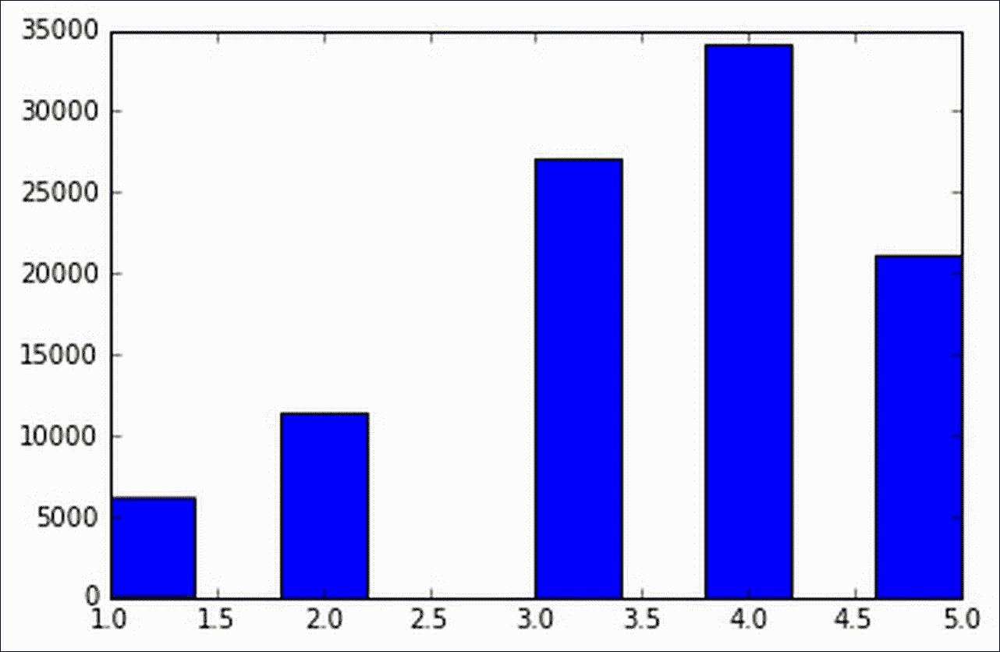

使用以下代码片段，我们将通过在 DataFrame 上应用 `groupby()` 函数和 `count()` 函数来查看评分的计数：

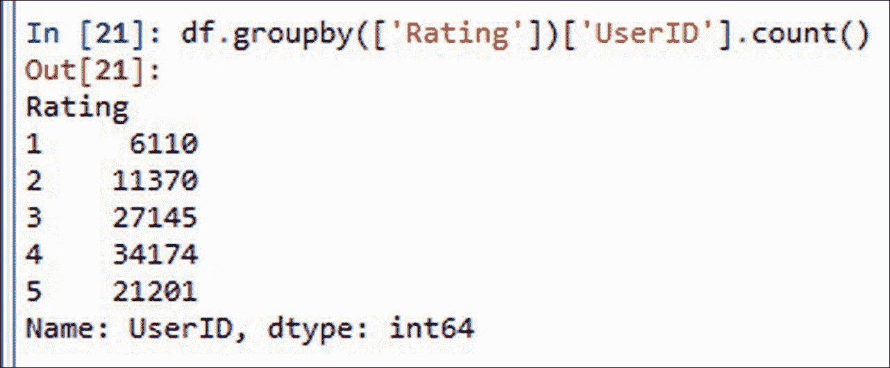

以下代码片段显示了电影观看的分布。在以下代码中，我们在 DataFrame 上应用 `count()` 函数：

```py
plt.hist(df.groupby(['ItemId'])['ItemId'].count()) 

```

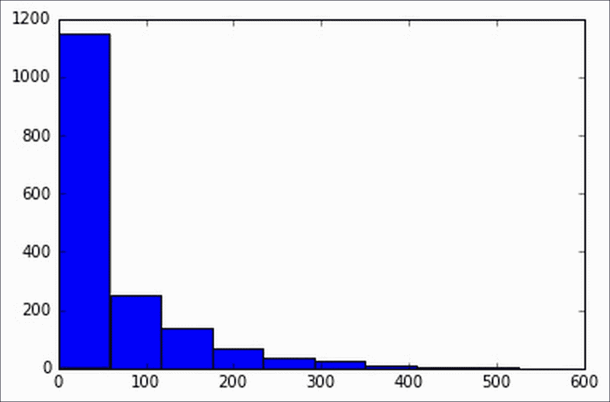

从前面的图像中，我们可以观察到起始 ItemId 的评分比后来的电影多。

## 评分矩阵表示

现在我们已经探索了数据，让我们以评分矩阵的形式表示数据，这样我们就可以开始我们的原始任务，即构建推荐引擎。

为了创建评分矩阵，我们利用 NumPy 包的功能，如数组和矩阵中的行迭代。运行以下代码以将数据框表示为评分矩阵：

### 注意

在以下代码中，我们首先提取所有唯一的用户 ID，然后使用形状参数检查长度。

创建一个名为 `n_users` 的变量来查找数据中的总唯一用户数：

```py
n_users = df.UserID.unique().shape[0] 

```

创建一个变量 `n_items` 来查找数据中的总唯一电影数：

```py
n_items = df['ItemId '].unique().shape[0] 

```

打印唯一用户和电影的计数：

```py
print(str(n_users) + ' users') 
943 users 

print(str(n_items) + ' movies') 
1682 movies 

```

创建一个大小为 (*n_users x n_items*) 的零值矩阵来存储矩阵中的评分：

```py
ratings = np.zeros((n_users, n_items)) 

```

对于 DataFrame 中的每个元组，`df` 从行的每一列中提取信息，并将其存储在评分矩阵的单元格值中，如下所示：

```py
for  row in df.itertuples(): 
ratings[row[1]-1, row[2]-1] = row[3] 

```

运行循环，整个 DataFrame 电影评分信息将按如下方式存储在 `numpy.ndarray` 类型的矩阵 `ratings` 中：

```py
type(ratings) 
<type 'numpy.ndarray'> 

```

现在，让我们使用形状属性查看多维数组 'ratings' 的尺寸：

```py
ratings.shape 
(943, 1682) 

```

让我们通过运行以下代码来查看评分多维数组的样本数据：

```py
ratings 
array([[ 5.,  3.,  4., ...,  0.,  0.,  0.], 
       [ 4.,  0.,  0., ...,  0.,  0.,  0.], 
       [ 0.,  0.,  0., ...,  0.,  0.,  0.], 
       ...,  
       [ 5.,  0.,  0., ...,  0.,  0.,  0.], 
       [ 0.,  0.,  0., ...,  0.,  0.,  0.], 
       [ 0.,  5.,  0., ...,  0.,  0.,  0.]]) 

```

我们观察到评分矩阵是稀疏的，因为数据中有许多零。让我们通过运行以下代码来确定数据中的 `sparsity`：

```py
sparsity = float(len(ratings.nonzero()[0])) 
sparsity /= (ratings.shape[0] * ratings.shape[1]) 
sparsity *= 100 
print('Sparsity: {:4.2f}%'.format(sparsity)) 
Sparsity: 6.30% 

```

我们观察到稀疏度为 `6.3%`，也就是说，我们只有 `6.3%` 的数据有评分信息，其余的只是零。另外请注意，评分矩阵中我们看到的 `0` 值并不代表用户给出的评分，它只是表示它们是空的。

## 创建训练集和测试集

现在我们有了评分矩阵，让我们创建一个训练集和一个测试集，使用训练集构建推荐模型，并使用测试集评估模型。

为了将数据分为训练集和测试集，我们使用 `sklearn` 包的功能。运行以下代码以创建训练集和测试集：

使用以下导入功能将 `train_test_split` 模块加载到 Python 环境中：

```py
from sklearn.cross_validation import train_test_split
```

使用 `train_test_split()` 方法，测试集大小为 `0.33`，随机种子为 `42`：

```py
 ratings_train, ratings_test = train_test_split(ratings,test_size=0.33, random_state=42)
```

让我们看看火车模型的尺寸：

```py
 ratings_train.shape (631, 1682) 
#let's see the dimensions of the test set 
ratings_test.shape (312, 1682)
```

对于基于用户的协同过滤，我们预测一个用户对项目的评分是所有其他用户对该项目的评分的加权平均，其中权重是每个用户与输入用户之间的余弦相似度。

## 构建 UBCF 的步骤

构建 UBCF 的步骤如下：

+   在用户之间创建相似度矩阵。

+   通过计算所有用户对项目的评分的加权平均来预测活跃用户*u*对项目*i*的未知评分值。

    ### 小贴士

    在这里，权重是之前步骤中用户和邻近用户之间计算的余弦相似度。

+   向用户推荐新项目。

## 基于用户的相似度计算

下一步是为评分矩阵中的每个用户创建成对相似度计算，也就是说，我们必须计算矩阵中每个用户与其他所有用户的相似度。我们在这里选择的相似度计算方法是余弦相似度。为此，我们利用成对距离能力来计算`sklearn`包中可用的余弦相似度，如下所示：

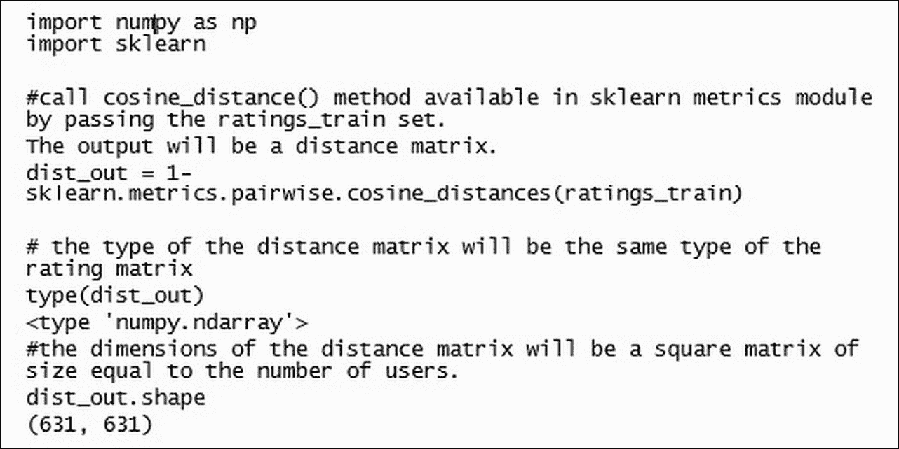

让我们看看距离矩阵的一个示例数据集：

```py
dist_out 

```

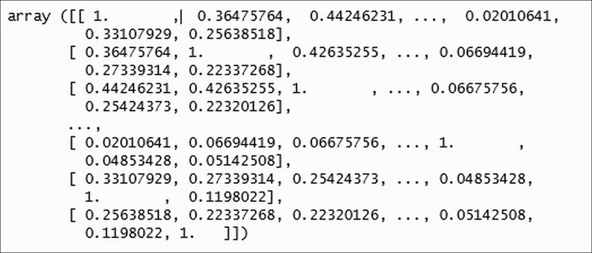

## 预测活跃用户的未知评分。

如前所述，可以通过将距离矩阵和评分矩阵之间的点积以及用评分数量对数据进行归一化来计算所有用户的未知值如下：

```py
user_pred = dist_out.dot(ratings_train) / np.array([np.abs(dist_out).sum(axis=1)]).T 

```

现在我们已经预测了用于训练集的未知评分，让我们定义一个函数来检查模型的误差或性能。以下代码定义了一个函数，通过取预测值和原始值来计算均方根误差（RMSE）。我们使用`sklearn`的能力来计算 RMSE，如下所示：

```py
from sklearn.metrics import mean_squared_error 
def get_mse(pred, actual): 
    #Ignore nonzero terms. 
    pred = pred[actual.nonzero()].flatten() 
    actual = actual[actual.nonzero()].flatten() 
    return mean_squared_error(pred, actual) 

```

我们调用`get_mse()`方法来检查模型预测误差率，如下所示：

```py
get_mse(user_pred, ratings_train) 
7.8821939915510031 

```

我们可以看到模型的准确率或 RMSE 是`7.8`。现在让我们在测试数据上运行相同的`get_mse()`方法并检查准确率，如下所示：

```py
get_mse(user_pred, ratings_test) 
8.9224954316965484 

```

# 基于用户的 k 近邻协同过滤

如果我们观察上述模型中的 RMSE 值，我们可以看到误差略高。原因可能在于我们在进行预测时选择了所有用户的评分信息。而不是考虑所有用户，让我们只考虑相似度最高的 N 个用户的评分信息，然后进行预测。这可能会通过消除数据中的某些偏差来提高模型准确率。

为了更详细地解释；在之前的代码中，我们通过取所有用户的评分的加权平均来预测用户的评分，而我们现在首先为每个用户选择前 N 个相似用户，然后通过考虑这些前 N 个用户的评分的加权平均来计算评分。

## 找到前 N 个最近邻。

首先，为了计算上的简便，我们将通过设置变量*k*来选择前五个相似用户。

*k=5*

我们使用 k-最近邻方法为活跃用户选择前五个最近邻。我们很快就会看到这一点。我们选择 sklearn.knn 功能来完成这项任务，如下所示：

```py
from sklearn.neighbors import NearestNeighbors 

```

通过传递 k 和相似度方法作为参数定义`NearestNeighbors`对象：

```py
neigh = NearestNeighbors(k,'cosine') 

```

将训练数据拟合到`nearestNeighbor`对象：

```py
neigh.fit(ratings_train) 

```

计算每个用户的前五个相似用户及其相似度值，即每对用户之间的距离值：

```py
top_k_distances,top_k_users = neigh.kneighbors(ratings_train, return_distance=True) 

```

我们可以观察到以下结果，`top_k_distances` ndarray 包含相似度值和训练集中每个用户的前五个相似用户：

```py
top_k_distances.shape 
(631, 5) 
top_k_users.shape 
(631, 5) 

```

让我们看看训练集中与用户 1 相似的前五个用户：

```py
top_k_users[0] 
array([  0,  82, 511, 184, 207], dtype=int64) 

```

下一步将是为每个用户选择前五个用户，并在预测评分时使用他们的评分信息，即使用这五个相似用户的所有评分的加权总和。

运行以下代码以预测训练数据中的未知评分：

```py
user_pred_k = np.zeros(ratings_train.shape) 
for i in range(ratings_train.shape[0]): 
    user_pred_k[i,:] =   top_k_distances[i].T.dot(ratings_train[top_k_users][i]) 
/np.array([np.abs(top_k_distances[i].T).sum(axis=0)]).T 

```

让我们看看模型预测的数据如下：

```py
user_pred_k.shape 
(631, 1682) 

user_pred_k 

```

以下图像显示了`user_pred_k`的结果：

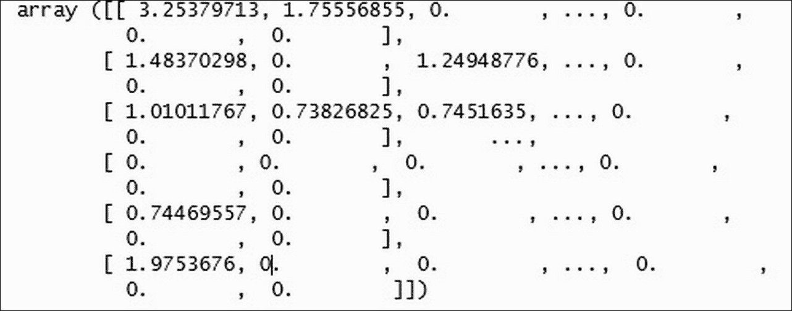

现在，让我们看看模型是否有所改进。运行之前定义的 get_mse()方法如下：

```py
get_mse(user_pred_k, ratings_train) 
8.9698490022546036 
get_mse(user_pred_k, ratings_test) 
11.528758029255446 

```

# 基于物品的推荐

IBCF 与 UBCF 非常相似，但在如何使用评分矩阵方面有非常小的变化。

第一步是计算电影之间的相似度，如下所示：

由于我们必须计算电影之间的相似度，所以我们使用电影计数作为`k`而不是用户计数：

```py
k = ratings_train.shape[1] 
neigh = NearestNeighbors(k,'cosine') 

```

我们将评分矩阵的转置拟合到`NearestNeighbors`对象：

```py
neigh.fit(ratings_train.T) 

```

计算每对电影之间的余弦相似度距离：

```py
top_k_distances,top_k_users = neigh.kneighbors(ratings_train.T, return_distance=True) 
top_k_distances.shape 
(1682, 1682) 

```

下一步是使用以下代码预测电影评分：

```py
item__pred = ratings_train.dot(top_k_distances) / np.array([np.abs(top_k_distances).sum(axis=1)]) 
item__pred.shape 
(631, 1682) 
item__pred 

```

以下图像显示了`item_pred`的结果：

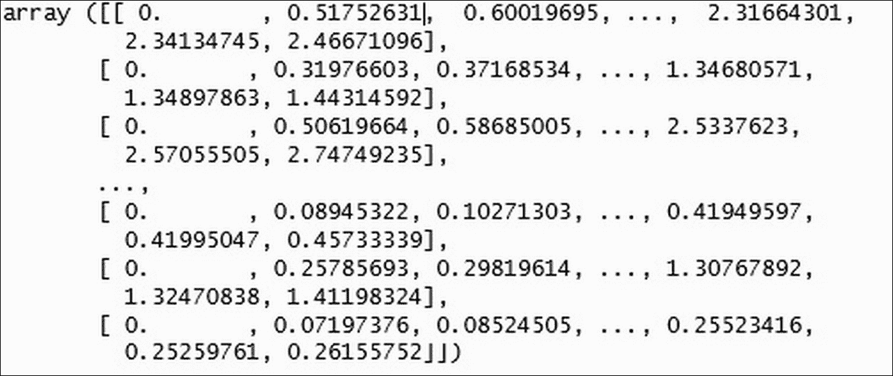

## 评估模型

现在，让我们使用我们定义的`get_mse()`方法评估模型，通过传递预测评分以及训练和测试集如下：

```py
get_mse(item_pred, ratings_train) 
11.130000188318895 
get_mse(item_pred,ratings_test) 
12.128683035513326 

```

## k-最近邻的训练模型

运行以下代码以计算前 40 个最近邻的距离矩阵，然后计算所有电影的前 40 个用户的加权评分总和。如果我们仔细观察代码，它与我们之前为 UBCF 所做的工作非常相似。我们不是直接传递`ratings_train`，而是转置数据矩阵，并按如下方式传递给前面的代码：

```py
k = 40 
neigh2 = NearestNeighbors(k,'cosine') 
neigh2.fit(ratings_train.T) 
top_k_distances,top_k_movies = neigh2.kneighbors(ratings_train.T, return_distance=True) 

#rating prediction - top k user based  
pred = np.zeros(ratings_train.T.shape) 
for i in range(ratings_train.T.shape[0]): 
    pred[i,:] = top_k_distances[i].dot(ratings_train.T[top_k_users][i])/np.array([np.abs(top_k_distances[i]).sum(axis=0)]).T 

```

## 评估模型

以下代码片段计算训练和测试集的均方误差。我们可以观察到训练误差为 11.12，而测试误差为 12.12。

```py
get_mse(item_pred_k, ratings_train) 
11.130000188318895 
get_mse(item_pred_k,ratings_test) 
12.128683035513326 

```

# 摘要

在本章中，我们探讨了在 R 和 Python 中构建协同过滤方法，如基于用户和基于物品的方法，这两种是流行的数据挖掘编程语言。推荐引擎建立在 MovieLens 和 Jester5K 数据集上，这些数据集可在网上找到。

我们已经学习了如何构建模型、选择数据、探索数据、创建训练集和测试集，以及使用如 RMSE、精确率-召回率和 ROC 曲线等指标来评估模型。此外，我们还了解了如何调整参数以改进模型。

在下一章中，我们将介绍使用 R 和 Python 实现的个性化推荐引擎，例如基于内容的推荐引擎和上下文感知的推荐引擎。
