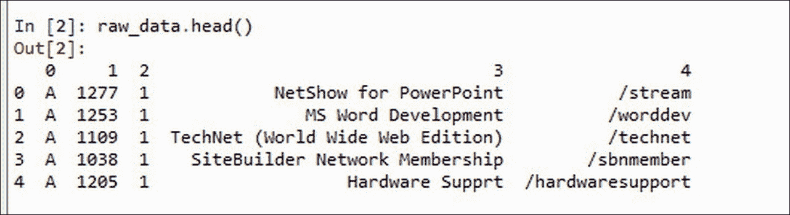

# 第六章。构建个性化推荐引擎

推荐引擎正在快速发展，大量研究也投入到了这个领域。大型跨国公司在这个领域投入了巨额资金。如前所述，从早期的推荐引擎模型，如协同过滤，这些系统已经取得了巨大成功。随着通过推荐引擎产生的收入越来越多，越来越多的人使用互联网进行购物、阅读新闻或获取与健康、商业相关的信息，商业组织看到了从互联网上可用的用户活动中获得巨大商业机会。随着推荐引擎用户数量的增加，以及越来越多的应用程序由推荐引擎驱动，用户也开始要求个性化的建议，而不是基于社区的推荐。用户社区的这个需求被视为新的挑战，为此，已经构建了个性化的推荐引擎，以在个人层面提供建议。

几乎所有行业领域目前都在构建能够提供个性化推荐的推荐引擎。

以下是一些个性化推荐：

+   个性化新闻推荐——Google News

+   个性化医疗保健系统

+   个性化旅行推荐系统

+   亚马逊上的个性化推荐

+   YouTube 上的个性化电影推荐

以下为个性化推荐的截图：


在第三章《推荐引擎解释》中，我们详细学习了基于内容的推荐系统和基于上下文的推荐系统。在本章中，我们将简要回顾这些主题，然后继续构建基于内容和基于上下文的推荐系统。

# 个性化推荐系统

在本章中，我们将学习两种个性化推荐器的类型：

+   基于内容的推荐系统

+   基于上下文的推荐系统

# 基于内容的推荐系统

构建协同过滤相对简单。在第五章中，我们学习了如何构建协同过滤推荐系统。在构建这些系统时，我们只考虑了产品获得的评分以及产品是否受欢迎的信息。凭借这些最小信息，我们构建了系统。令许多人惊讶的是，这些系统表现非常出色。但这些系统也有自己的局限性，例如前几章中解释的冷启动问题。

假设有一个用户尼克给一部电影评了五星，比如《泰坦尼克号》。是什么让尼克给出了这个评价？可能是电影的故事、电影中的演员、背景音乐或剧本。这些特征的偏好使得尼克对电影进行了评分。在构建推荐时，包含产品/特征的偏好内部信息不是更有意义吗？

在协同过滤中，基本假设是过去有相似品味的人在未来也会有相似的品味。如果我们仔细观察，这个假设可能并不适用于所有情况。例如，如果我的邻居对恐怖电影《驱魔人》给出了高度评价，那么这部电影不应该被推荐给我，因为我更喜欢浪漫电影。我应该得到一部浪漫类型的电影，比如《泰坦尼克号》，作为推荐。我并不总是和我的邻居有相同的品味；如果我能得到仅基于我的偏好和行为的建议，我会很高兴。企业已经看到了在个人层面上实施这些类型推荐的大量商业机会，这些推荐被称为个性化推荐系统。

## 构建基于内容的推荐系统

在基于内容的推荐系统中，我们在构建推荐引擎时同时使用用户和物品的内容信息。一个典型的基于内容的推荐系统将执行以下步骤：

1.  生成用户配置文件。

1.  生成物品配置文件。

1.  生成推荐引擎模型。

1.  提供前 N 个推荐。

我们首先从可用信息中生成用户和物品配置文件。配置文件通常包含对物品和用户特征的偏好（有关详细信息，请参阅第三章，《推荐引擎解释》）。一旦创建了配置文件，我们就选择一种方法来构建推荐引擎模型。许多数据挖掘技术，如分类、文本相似度方法如*tf-idf*相似度，以及矩阵分解模型，都可以应用于构建基于内容的推荐引擎。

我们甚至可以采用多个推荐引擎模型并构建混合推荐引擎，作为基于内容的推荐。以下图示了一个典型的内容推荐器：


## 使用 R 进行基于内容的推荐

让我们开始用 R 构建一个个性化的推荐引擎。我们选择 MovieLens 数据集来构建我们的系统。在前一节中，我们回顾了基于内容的推荐系统的概念。我们可以用多种方式构建个性化推荐者；在本节中，我们将使用多类分类方法来构建我们的基本基于内容的推荐引擎。

使用分类方法，我们试图构建一个基于模型的推荐引擎。大多数推荐系统——无论是协同过滤还是基于内容的——都使用邻域方法来构建推荐器。让我们探讨如何使用监督机器学习方法来构建推荐引擎。

在我们开始编写代码之前，让我们讨论构建个性化推荐系统的步骤。以下图示展示了我们将遵循的步骤顺序以实现我们的目标：


第一步始终是收集数据并将其拉入编程环境，以便我们可以应用后续步骤。在我们的用例中，我们下载了 MovieLens 数据集，包含三组数据，如下定义：

+   包含 userID、itemID、评分和时间戳的评分数据

+   包含用户信息的数据，如 userID、年龄、性别、职业、ZIP 代码等

+   包含某些电影信息的数据，如 movieID、上映日期、URL、流派细节等

第二步将是准备构建分类模型所需的数据。在这一步中，我们提取构建分类模型所需的用户特征和类别标签：


+   对于我们的示例案例，我们将用户给出的评分（1 到 5）定义为类别标签，例如 1-3 评分作为 0，4-5 评分作为 1。因此，我们将构建一个双类分类模型。我们的模型将根据给定用户的输入特征预测类别标签。

    ### 小贴士

    你可能想知道为什么我们选择二元分类而不是多类分类。模型的选择留给构建推荐系统的人；在我们的情况下，由于我们选择的数据库，二元分类比多类分类更适合。鼓励读者尝试多类分类以加深理解。

+   我们从用户数据和项目数据中选择用户人口统计信息和项目特征，以形成我们的二元分类模型的特征。我们通过包括用户评分的电影的流派信息、用户的个人信息（如年龄、性别、职业等）等特征扩展了`User_item_rating`数据。最终的特征和类别标签可以在前面的图中看到。

第三步将是构建二元分类模型。我们将选择 RandomForest 算法来构建类别。

第四步和最后一步将是为用户生成前 N 个推荐。在我们的例子中，我们选择一个测试用户，预测他之前未评分的电影的类别标签，并发送具有更高概率评分的前 N 部电影，这些评分是由我们的分类模型预测的。

请注意，生成前 N 个推荐的选择留给用户自己决定。

让我们使用 R 实现上述步骤。在本节中，我们将逐步实现使用 R 的内容推荐。

### 数据集描述

在这个练习中，我们使用两个 MovieLens 数据集文件--一个是包含对 943 到 1682 部电影评分的评分文件，评分范围为 1-5，另一个是包含内容信息的项目数据集文件，即关于电影流派、电影名称、电影 ID、URL 等信息。

### 小贴士

MovieLens 数据集可以从以下 URL 下载：[`grouplens.org/datasets/movielens/`](http://grouplens.org/datasets/movielens/)

使用 R 中可用的`read.csv()`函数将评分数据加载到 R 环境中：

```py
raw_data = read.csv("~/udata.csv",sep="\t",header=F) 
Adding column names to the dataframe 
colnames(raw_data) = c("UserId","MovieId","Rating","TimeStamp") 

```

此代码从 DataFrame 中删除最后一列：

```py
ratings = raw_data[,1:3] 

```

使用`head()`函数查看数据的前五行，如下所示：

```py
head(ratings) 

```

使用`names()`函数查看评分数据框的列。

使用`str()`函数查看评分函数的描述。三个提到的函数的所有结果如下所示：


以下代码使用 R 中的`read.csv()`函数将项目数据加载到 R 环境中：

```py
movies = read.csv("C:/Suresh/R&D/packtPublications/reco_engines/drafts/personalRecos/uitem.csv",sep="|",header=F) 

```

接下来，我们在数据框中添加列：

```py
colnames(movies) = c("MovieId","MovieTitle","ReleaseDate","VideoReleaseDate","IMDbURL","Unknown","Action","Adventure","Animation","Children","Comedy","Crime","Documentary","Drama","Fantasy","FilmNoir","Horror","Musical","Mystery","Romance","SciFi","Thriller","War","Western") 

```

然后我们删除不需要的数据；在这个练习中，我们只保留流派信息：

```py
movies = movies[,-c(2:5)] 
View(movies) 

```


电影的描述由`str(movies)`给出。列名可以通过`names(movies)`查看：


下一步是创建客户特征配置文件以构建分类模型。我们应该将包含 userID、movieID 和评分的评分数据框与电影属性扩展，如下所示。

在以下代码中，我们使用`merge()`执行连接函数以合并评分数据与项目数据：

```py
ratings = merge(x = ratings, y = movies, by = "MovieId", all.x = TRUE) 

View(ratings) 

```


让我们使用`names()`方法查看列名：


现在我们为我们刚才创建的每个配置文件记录创建类标签。我们将为每个评分创建一个二元类标签，因此 1-3 个评分将被标记为 0，4-5 个评分将被标记为 1。以下代码为我们执行此转换。我们使用`lapply()`函数重塑评分：

以下代码管理将数值评分转换为二元分类变量的转换：

```py
nrat = unlist(lapply(ratings$Rating,function(x) 
{ 
  if(x>3) {return(1)} 
  else {return(0)} 
})) 

```

接下来，我们将新创建的评分分类变量`nrat`与原始评分数据框 ratings 使用`cbind()`结合：

```py
ratings = cbind(ratings,nrat) 

```


在前面的图中，我们可以观察到新的评分二元类`nrat`。

现在让我们使用`apply()`函数通过将`table()`应用于每一列来观察将进入模型构建阶段的变量，如下所示：

```py
apply(ratings[,-c(1:3,23)],2,function(x)table(x)) 

```


从前面的结果中，我们可以观察到与 1 的数量相比，零的数量非常高；因此，让我们从我们的特征列表中删除这个变量。此外，让我们删除评分变量，因为我们已经创建了一个新的变量`nrat`：

```py
scaled_ratings = ratings[,-c(3,4)] 

```

在构建模型之前，我们将使用 R 中的`scale()`函数对数据进行标准化或居中，如下面的代码片段所示。标准化将调整不同尺度的数据以适应一个共同的尺度。该函数将通过移除每个对应列的列均值来实现居中：

```py
scaled_ratings=scale(scaled_ratings[,-c(1,2,21)]) 
scaled_ratings = cbind(scaled_ratings,ratings[,c(1,2,23)]) 

```


现在让我们使用`randomForest`算法来构建二元分类模型。在此之前，让我们将数据分为训练集和测试集，比例为 80:20。

以下代码首先创建所有数据的随机索引对象。然后我们使用这些索引来划分训练集和测试集。

```py
set.seed(7) 
which_train <- sample(x = c(TRUE, FALSE), size = nrow(scaled_ratings), 
                      replace = TRUE, prob = c(0.8, 0.2)) 
model_data_train <- scaled_ratings[which_train, ] 
model_data_test <- scaled_ratings[!which_train, ] 

```


现在让我们使用`randomForest`库中的`randomForest`算法来构建模型：

### 注意

在下面的代码片段中，我们将整数变量`nrat`转换为因子格式。

```py
library(randomForest) 
fit = randomForest(as.factor(nrat)~., data = model_data_train[,-c(19,20)]) 

```

只需输入`fit`，我们就可以看到模型构建、拟合的详细信息：


在前面的代码片段中，我们使用了默认值的`randomforest()`方法。对于随机森林，我们有两个参数可以调整以获得最佳性能；**mtry**是每个树分裂处的样本数，**ntree**是要生成的决策树的数量。使用参数调整和交叉验证方法，我们应该选择最佳参数。

我们也可以使用`summary()`函数查看模型的摘要，如下所示：


现在，让我们看看模型在测试集上的表现：

```py
predictions <- predict(fit, model_data_test[,-c(19,20,21)], type="class") 

```


让我们使用精确率-召回率方法评估模型：

```py
#building confusion matrix 
cm = table(predictions,model_data_test$nrat) 
(accuracy <- sum(diag(cm)) / sum(cm)) 
(precision <- diag(cm) / rowSums(cm)) 
recall <- (diag(cm) / colSums(cm)) 

```


根据前面的结果，我们对 60%的精确率和 75%的召回率感到非常满意。现在我们继续进行以下步骤，为用户 ID（943）生成前 N 个推荐：

1.  创建一个包含所有未被活跃用户评分的电影的 DataFrame（在我们的案例中用户 ID 为 943）。

    ```py
            #extract distinct movieids 
            totalMovieIds = unique(movies$MovieId) 
            #see the sample movieids using tail() and head() functions: 

    ```

    

    ```py
            #a function to generate dataframe which creates non-rated 
              movies by active user and set rating to 0; 
            nonratedmoviedf = function(userid){ 
              ratedmovies = raw_data[raw_data$UserId==userid,]$MovieId 
              non_ratedmovies = totalMovieIds[!totalMovieIds %in%  
                ratedmovies] 
               df = data.frame(cbind(rep(userid),non_ratedmovies,0)) 
               names(df) = c("UserId","MovieId","Rating") 
               return(df) 
            } 

            #let's extract non-rated movies for active userid 943 
            activeusernonratedmoviedf = nonratedmoviedf(943) 

    ```

    

1.  为此活跃用户 DataFrame 构建一个配置文件：

    ```py
            activeuserratings = merge(x = activeusernonratedmoviedf, y = 
              movies, by = "MovieId", all.x = TRUE) 

    ```

    

1.  预测评分，排序并生成 10 个推荐：

    ```py
            #use predict() method to generate predictions for movie ratings 
              by the active user profile created in the previous step. 
            predictions <- predict(fit, activeuserratings[,-c(1:4)],  
              type="class") 
            #creating a dataframe from the results 
            recommend = data.frame(movieId = 
              activeuserratings$MovieId,predictions) 
            #remove all the movies which the model has predicted as 0 and  
              then we can use the remaining items as more probable movies   
                which might be liked by the active user. 
            recommend = recommend[which(recommend$predictions == 1),] 

    ```

通过这一步，我们已经完成了扩展或改进基于内容的推荐引擎构建的内容，使用分类模型。在我们进入下一节之前，我想明确指出，模型和类标签特征的选择取决于读者来扩展或改进模型。

如前所述，我们应该使用交叉验证方法来选择最佳参数，以提高模型精度。

## 使用 Python 进行基于内容的推荐

在上一节中，我们使用 R 构建了一个基于模型的推荐内容引擎。在本节中，我们将使用另一种方法，使用 Python 的`sklearn`、`NumPy`和`pandas`包来构建内容推荐。

让我们回顾一下本章开头讨论的构建基于内容系统的步骤：

1.  项目配置文件生成

1.  用户配置文件生成

1.  生成推荐引擎模型

1.  生成前 N 个推荐

在本节中，我们将详细学习如何使用 Python 按照上述步骤构建内容：

该方法的设计如下所示：


+   **创建项目配置文件**：在这个步骤中，我们使用关于项目的现有内容信息为每个项目创建一个配置文件。项目配置文件通常使用一种广泛使用的信息检索技术创建，称为 tf-idf。在第四章《推荐引擎中的数据挖掘技术》中，我们详细解释了*tf-idf*。为了回顾，tf-idf 值给出了相对于所有项目或文档的特征的相对重要性。

+   **创建用户配置文件**：在这个步骤中，我们将用户活动数据集预处理成适当的格式以创建用户配置文件。我们应该记住，在基于内容的推荐系统中，用户配置文件是根据项目内容创建的，也就是说，我们必须提取或计算用户对项目内容或项目特征的偏好。通常，用户活动和项目配置文件之间的点积给出了用户配置文件。

+   **生成推荐引擎模型**：现在我们已经有了用户配置文件和项目配置文件，我们将继续构建推荐模型。计算用户配置文件和项目配置文件之间的余弦相似度给出了用户对每个项目的亲和力。

+   **生成前 N 个推荐**：在最后一步，我们将根据上一步计算出的值对用户-项目偏好进行排序，然后提出前 N 个推荐。

现在我们将开始使用 Python 实现上述步骤。

### 数据集描述

在本节中，我们将使用匿名微软 Web 数据集来构建一个基于内容的推荐系统。本节的目标是根据用户的先前网络浏览历史推荐网站给活跃用户。

MS Web 数据集指的是 38,000 名匿名用户访问的网站 [www.microsoft.com](http://www.microsoft.com) 的网络日志。对于每位用户，数据集包括用户在一周时间范围内访问的所有网站的列表。

数据集可以从以下 URL 下载：

[`archive.ics.uci.edu/ml/datasets/Anonymous+Microsoft+Web+Data`](https://archive.ics.uci.edu/ml/datasets/Anonymous+Microsoft+Web+Data)

为了简化，从现在起，我们将使用术语 *items* 来指代网站区域。有 5,000 个用户，它们由 10,001 到 15,000 之间的连续数字表示。项目由 1,000 到 1,297 之间的数字表示，即使它们小于 298。

该数据集是一个非结构化文本文件。每条记录包含两个到六个字段。第一个字段是一个字母，定义了记录包含的内容。主要有三种类型的记录，如下所示：

+   **属性（A）**：这是网站区域的描述

+   **案例（C）**：这是每个用户的案例，包含其 ID

+   **投票（V）**：这是案例的投票行

第一列的案例记录后面跟着 userID/caseID。第三列包含用户 ID/对网站区域的投票。第四列包含网站区域的描述，第五列包含网站区域的 URL。

下图显示了一组原始数据：


我们的目标是建议每个用户探索他们尚未探索的网站区域。

下面的列表是我们将用于此练习的包：

```py
import pandas as pd 
import numpy as np 
import scipy 
import sklearn 

```

加载数据：

```py
path = "~/anonymous-msweb.test.txt" 
import pandas as pd 

```

使用 pandas 包中可用的 `read.csv()` 函数读取数据：

```py
raw_data = pd.read_csv(path,header=None,skiprows=7) 
raw_data.head() 

```



让我们看看更多的样本数据，以便有更清晰的概念：


我们可以从前面的图中观察到以下内容：

+   第一列包含三种类型的值：**A**/**V**/**C**，其中 A 代表案例 ID，**V**代表用户，**C**代表用户访问的案例 ID

+   第二列包含 ID，用于表示用户和项目

+   第三列包含网站区域的描述

+   第四部分包含网站区域在网站上的 URL

为了创建项目配置文件，我们使用第一列包含 **A** 的行，为了创建用户活动或数据集，我们使用第一列不包含 **A** 的行。

让我们开始配置文件生成。

在我们进行配置文件生成之前，我们必须格式化用户活动数据；以下部分解释了如何创建用户活动数据集。

### 用户活动

在本节中，我们将创建一个用户-项目评分矩阵，其中用户作为行，项目作为列，值作为单元格。在这里，值是 `0` 或 `1`，如果用户访问了网页，则为 `1`，否则为 `0`：

首先，我们只过滤掉第一列不包含 `"A"` 的记录：

```py
user_activity = raw_data.loc[raw_data[0] != "A"] 

```

接下来，我们从数据集中移除不需要的列：

```py
user_activity = user_activity.loc[:, :1] 

```

为 `user_activity` DataFrame 的列分配名称：

```py
user_activity.columns = ['category','value'] 

```

以下代码显示了样本 `user_activity` 数据：


要获取数据集中的总唯一`webid`，请参阅以下代码：

```py
len(user_activity.loc[user_activity['category'] =="V"].value.unique()) 
Out[73]: 236 

```

要获取唯一用户数，请参阅以下代码：

```py
len(user_activity.loc[user_activity['category'] =="C"].value.unique()) 
Out[74]: 5000 

```

现在，让我们运行以下代码来创建一个用户-项目-评分矩阵，如下所示：

首先，我们分配变量：

```py
tmp = 0 
nextrow = False 

```

然后我们获取数据集的最后一个索引：

```py
lastindex = user_activity.index[len(user_activity)-1] 
lastindex 
Out[77]: 20484 

```

for 循环代码遍历每条记录，并将新的列（`'userid'`，`'webid'`）添加到`user_activity`数据框中，该数据框显示`userid`和相应的网络活动：

```py
for index,row in user_activity.iterrows(): 
    if(index <= lastindex ): 
        if(user_activity.loc[index,'category'] == "C"): 
            tmp = 0            
            userid = user_activity.loc[index,'value'] 
            user_activity.loc[index,'userid'] = userid 
            user_activity.loc[index,'webid'] = userid 
            tmp = userid 
            nextrow = True             
        elif(user_activity.loc[index,'category'] != "C" and nextrow == True): 
                webid = user_activity.loc[index,'value'] 
                user_activity.loc[index,'webid'] = webid 
                user_activity.loc[index,'userid'] = tmp 
                if(index != lastindex and user_activity.loc[index+1,'category'] == "C"): 
                    nextrow = False 
                    caseid = 0 

```


接下来，我们从前面的数据框中删除不需要的行，即删除包含类别列中`"C"`的行：

```py
user_activity = user_activity[user_activity['category'] == "V" ] 

```


我们子集列，并删除我们不再需要的头两列：

```py
user_activity = user_activity[['userid','webid']] 

```

接下来，我们按`webid`对数据进行排序；这是为了确保评分矩阵生成格式良好：

```py
user_activity_sort = user_activity.sort('webid', ascending=True) 

```

现在，让我们使用以下代码创建一个包含用户 _item_rating 的密集二进制评分矩阵：

首先，我们获取`webid`列的大小：

```py
sLength = len(user_activity_sort['webid']) 

```

然后我们在`user_activity`数据框中添加一个新列`'rating'`，其中只包含 1：

```py
user_activity_sort['rating'] = pd.Series(np.ones((sLength,)), index=user_activity.index) 

```

接下来，我们使用 pivot 创建二进制评分矩阵：

```py
ratmat = user_activity_sort.pivot(index='userid', columns='webid', values='rating').fillna(0) 

```

最后，我们创建一个密集矩阵：

```py
ratmat = ratmat.to_dense().as_matrix() 

```

### 项目配置文件生成

在本节中，我们将从初始原始数据（`raw_data`）创建项目配置文件。为了创建项目数据，我们将考虑包含第一列中`A`的数据：

首先，我们筛选出所有第一列包含`"A"`的记录：

```py
items = raw_data.loc[raw_data[0] == "A"] 

```

然后我们按如下方式命名列：

```py
items.columns = ['record','webid','vote','desc','url'] 

```

要生成项目配置文件，我们只需要两个列，所以我们按如下方式切片数据框：

```py
items = items[['webid','desc']] 

```

为了查看项目的维度，数据框被给出如下：

```py
items.shape 
Out[12]: (294, 2) 

```

我们观察到数据集中有`294`个唯一的`webid`：

要检查数据的样本，我们使用以下代码：

```py
Items.head() 

```


要检查唯一`webid`的数量，我们使用以下代码：

```py
items['webid'].unique().shape[0] 
Out[117]: 294 

```

我们也可以只选择存在于`user_activity`数据中的`webid`：

```py
items2 = items[items['webid'].isin(user_activity['webid'].tolist())] 

```

我们可以使用以下代码检查对象类型：

```py
type(items2) 
Out[123]: pandas.core.frame.DataFrame 

```

我们也可以按`webid`对数据进行排序：

```py
items_sort = items2.sort('webid', ascending=True) 

```

让我们使用`head(5)`函数看看我们现在做了什么：


现在，我们将使用 sklearn 包中可用的`tf-idf`函数创建项目配置文件。要生成`tf-idf`，我们使用`TfidfVectorizer()`。`fit_transform()`方法位于`sklearn`包中。以下代码显示了我们可以如何创建`tf-idf`。

在以下代码中，要包含的特征数量取决于数据集，并且可以通过交叉验证方法选择最佳特征数量：

```py
from sklearn.feature_extraction.text import TfidfVectorizer 
v = TfidfVectorizer(stop_words ="english",max_features = 100,ngram_range= (0,3),sublinear_tf =True) 
x = v.fit_transform(items_sort['desc']) 
itemprof = x.todense() 

```


### 用户配置文件创建

现在我们手头有项目配置文件和用户活动；这两个矩阵的点积将创建一个新矩阵，其维度等于用户数乘以项目特征数。

为了计算用户活动和项目资料之间的点积，我们使用`scipy`包中的方法，如`linalg`和`dot`。

运行以下代码以计算点积：

```py
#user profile creation 
from scipy import linalg, dot 
userprof = dot(ratmat,itemprof)/linalg.norm(ratmat)/linalg.norm(itemprof) 

userprof 

```


推荐引擎模型中的最后一步是计算活动用户对项目的偏好。为此，我们在用户资料和项目资料之间进行余弦相似度计算。

为了计算余弦计算，我们将使用`sklearn`包。以下代码将计算`cosine_similarity`：

我们计算`userprofile`和项目资料之间的余弦相似度：

```py
import sklearn.metrics 
similarityCalc = sklearn.metrics.pairwise.cosine_similarity(userprof, itemprof, dense_output=True) 

```

我们可以如下查看前面计算的结果：


现在，让我们将之前计算的二进制数据（0,1）格式化如下：

首先，我们将评分转换为二进制格式：

```py
final_pred= np.where(similarityCalc>0.6, 1, 0) 

```

然后，我们检查前三个用户的最终预测：


从前面的结果中移除零值，我们得到可以推荐给用户的可能项目列表：

对于用户`213`，推荐的物品生成如下：

```py
indexes_of_user = np.where(final_pred[213] == 1) 

```

在前面的代码中，我们正在为活动用户`213`生成推荐：


# 上下文感知推荐系统

我们接下来要学习的是个性化推荐系统中的另一种类型，即上下文感知推荐系统。这些推荐系统属于下一代推荐系统，属于超个性化类别。人类的需求永远不会结束，这是很自然的。我们得到的越多，我们想要的就越多。尽管基于内容的推荐系统很高效，针对个人层面，并且在构建推荐引擎时仅考虑用户的个人偏好，但人们希望推荐引擎更加个性化。例如，一个人独自旅行时可能需要一本书来阅读，而如果他和朋友一起旅行，他可能需要啤酒。同样，如果这个人带着自己的家人出行，他可能需要尿布、药品、零食等等。不同地方、不同时间、与不同人在一起的人有不同的需求。我们的推荐系统应该足够强大，能够处理这样的场景。这种为同一人根据其当前上下文提供不同推荐的超个性化推荐系统，被称为上下文感知推荐系统。

## 构建上下文感知推荐系统

构建上下文感知推荐系统更像是扩展内容推荐系统。构建上下文感知系统通常涉及在内容推荐器之上添加上下文维度，如下面的图所示：


在前面的图中，我们可以观察到上下文维度被添加到基于内容的推荐引擎模型之上，然后生成推荐。正如我们在第三章中讨论的，《推荐引擎解释》，构建上下文感知推荐有两种流行的方法：

+   预过滤方法

+   后过滤方法

在本节中，我们将使用后过滤技术来构建上下文感知推荐系统。

## 使用 R 进行上下文感知推荐

在前一节中，我们构建了一个基于内容的推荐引擎。在本节中，我们将扩展先前的模型以包括上下文信息并生成一个上下文感知推荐引擎。

构建上下文感知系统的常规做法是在基于内容的推荐中添加一个时间维度。

工作流程如下所示：


让我们尝试使用 R 构建上下文感知系统。在 R 中构建上下文感知系统的步骤如下：

1.  定义上下文。

1.  根据用户的内容创建上下文配置文件。

1.  为上下文生成推荐。

### 定义上下文

第一步是定义我们将包括在推荐中的上下文。在前一节中，我们使用了 MovieLens 数据集来构建基于内容的推荐引擎。在数据集中，我们有一个时间组件，即评分数据中的时间戳。我们将使用此变量来构建我们的上下文感知推荐系统。

我们将扩展在构建基于内容的推荐时使用的 R 代码。

我们如下加载完整的 MovieLens 评分数据集：

```py
raw_data = read.csv("C:/Suresh/R&D/packtPublications/reco_engines/drafts/personalRecos/udata.csv",sep="\t",header=F) 
colnames(raw_data) = c("UserId","MovieId","Rating","TimeStamp") 

```

使用 `head()` 函数查看样本数据：


我们加载电影数据集：

```py
movies = read.csv("C:/Suresh/R&D/packtPublications/reco_engines/drafts/personalRecos/uitem.csv",sep="|",header=F) 

```

然后我们向电影数据框添加列名：

```py
colnames(movies) = c("MovieId","MovieTitle","ReleaseDate","VideoReleaseDate","IMDbURL","Unknown","Action","Adventure","Animation","Children","Comedy","Crime","Documentary","Drama","Fantasy","FilmNoir","Horror","Musical","Mystery","Romance","SciFi","Thriller","War","Western") 

```

接下来，我们从数据框中删除不需要的列：

```py
movies = movies[,-c(2:5)] 

```


我们使用 `merge()` 函数合并电影和评分数据集。

```py
ratings_ctx = merge(x = raw_data, y = movies, by = "MovieId", all.x = TRUE) 

```


我们希望引入到之前基于内容的推荐中的上下文是白天的小时，也就是说，我们的推荐将根据一天中的时间进行。活跃用户的一天的推荐集合将因小时而异。通常，这些推荐的变化是由于根据小时排序的推荐顺序。我们将在下一节中看到我们是如何实现这一点的。

### 创建上下文配置文件

在下一节中，我们将编写代码来创建用户的上下文配置文件。我们选择了数据集中可用的日期时间信息，并计算了每个用户每天每个小时的影片类型的偏好值。此上下文配置文件信息用于生成上下文感知推荐。

我们从评分数据集中提取时间戳：

```py
ts = ratings_ctx$TimeStamp 

```

然后，我们将其转换为`POSIXlt`日期对象，并使用小时属性提取一天中的小时：

```py
hours <- as.POSIXlt(ts,origin="1960-10-01")$hour 

```

以下为样本数据：


我们可以将小时重新添加到评分数据集中：

```py
ratings_ctx = data.frame(cbind(ratings_ctx,hours)) 

```


现在，让我们开始为用户 ID 为 943 的用户构建上下文配置文件：

提取活跃用户（943）的评分信息，并删除 UserId、MovieId、Rating、Timestamp 列，如下所示：

```py
UCP = ratings_ctx[(ratings_ctx$UserId == 943),][,-c(2,3,4,5)] 

```


作为下一步，我们计算所有项目特征的列。这个列向总和用于计算每天每个小时的项目特征的偏好。

我们使用`aggregate()`函数计算每列的列宽总和：

```py
UCP_pref = aggregate(.~hours,UCP[,-1],sum) 

```


从前面的图中，我们可以看到活跃用户 943 对每个电影类型的偏好时间。我们可以观察到，在每天的第九个小时，用户观看的电影更多，尤其是动作/剧情/喜剧电影：

我们可以使用以下函数将前面的数据归一化到 0-1 之间：

```py
UCP_pref_sc = cbind(context = UCP_pref[,1],t(apply(UCP_pref[,-1], 1, function(x)(x-min(x))/(max(x)-min(x))))) 

```


### 生成上下文感知推荐

现在我们已经为活跃用户创建了上下文配置文件，让我们开始为用户生成上下文感知推荐。

对于此，我们将重新使用使用 R 构建的推荐对象，其中包含所有用户的基于内容的推荐。

让我们看看基于内容的系统为用户 943 做出的推荐：

```py
recommend$MovieId 

```


现在，我们将时间或一天中的小时维度添加到这些内容推荐中，然后根据当前上下文生成推荐。

我们使用`merge()`函数合并推荐和电影数据集：

```py
UCP_pref_content = merge(x = recommend, y = movies, by = "MovieId", all.x = TRUE) 

```


在前面的步骤中，我们已经计算了所有所需的矩阵，用户上下文配置文件（`UCP_Pref_SC`）和用户内容推荐（`UCP_Pref_content`）。

假设我们想要在第九个小时为用户生成推荐；我们只需要对用户内容推荐和`UCP_pref_SC`对象中一天中第九个小时的上下文行进行逐元素乘法。如下所示：

对用户内容推荐和第九个小时的上下文偏好进行逐元素乘法：

```py
active_user =cbind(UCP_pref_content$MovieId,(as.matrix(UCP_pref_content[,-c(1,2,3)]) %*% as.matrix(UCP_pref_sc[4,2:19]))) 

```

结果如下；我们可以观察到，对于 MovieId 3 的偏好是 0.5，而对于 MovieId 4 的偏好是 2.8


我们可以创建一个预测对象的 dataframe 对象：

```py
active_user_df = as.data.frame(active_user) 

```

接下来，我们向预测对象添加列名：

```py
names(active_user_df) = c('MovieId','SimVal') 

```

然后我们排序结果：

```py
FinalPredicitons_943 = active_user_df[order(-active_user_df$SimVal),] 

```

# 摘要

在本章中，我们学习了如何使用 R 和 Python 构建基于内容的推荐引擎和上下文感知推荐引擎。我们使用 R 和 Python 对基于内容的推荐引擎进行了两种类型的建模——分类模型和 tf-idf 模型方法。为了构建上下文感知推荐，我们只需对基于内容的推荐和用户上下文配置文件进行逐元素相乘。

在下一章中，我们将探讨 Apache Spark，以构建可扩展的实时推荐引擎。
