# 第八章：使用 Neo4j 构建实时推荐

我们生活的世界是一个庞大且相互联系的地方。这个世界上存在的任何事物都以某种方式相互连接。居住在这个世界中的实体之间存在关系和联系。

人类大脑试图以网络和关系的形式存储或提取信息。这可能是一种更优的数据表示方式，以便信息的存储和检索既快又高效。如果我们有一个以类似方式工作的系统会怎样。我们可以使用图；它们是表示数据的一种系统性和方法性的方法。

在我们继续本章内容之前，理解图的概念的背景和必要性是至关重要的。

图论背后的概念归功于 18 世纪的数学家莱昂哈德·欧拉，他解决了被称为柯尼斯堡桥问题这一古老的难题，这本质上是一个路径查找问题。尽管我们不会进一步探讨这个问题，但我建议读者尝试理解欧拉是如何提出一种新的范式方法来理解和解决这个问题的。

图在当今世界的各个方面都有所体现，并且是处理数据最有效和最自然的方式之一。

图可以表示两个或更多现实世界实体（作为节点）如何相互连接。我们还学习到它们如何相互关联，以及这如何有助于以快速、高效、直观的方式传递信息。由于图系统允许我们以表达性和结构化的方式表达任何事物，因此我们可以将这些系统应用于社交网络、医学、科学技术等多个领域。

为了更好地理解图表示，我们可以以 Facebook 上的社交网络为例。让我们假设有三个朋友**John**、**Paul**和**Krish**在 Facebook 上相互连接。JOHN-KRISH 是互为朋友，PAUL-KRISH 是互为朋友，PAUL 是**John**的`**FriendOf**`。我们如何表示这些信息？请看以下图表：

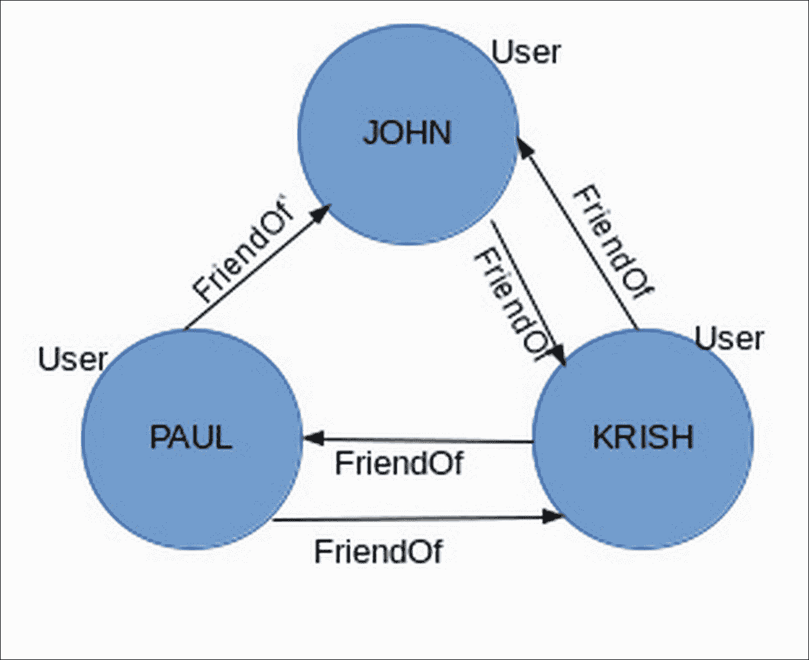

我们难道不觉得上述表示是表示数据和其关系最有效和最自然的方式之一吗？在先前的图表中，JOHN-KRISH-PAUL 是代表用户实体的*节点*，而`FriendOf`箭头是表示节点之间*关系*的边。我们还可以将用户节点的人口统计细节（如年龄和关系的细节，如 FriendSince）作为图中的*属性*存储。通过应用图论概念，我们可以在网络中找到类似用户，或者在朋友网络中向用户推荐新朋友。我们将在后面的章节中了解更多关于这方面的内容。

# 区分不同的图数据库

图数据库彻底改变了人们发现新产品和相互分享信息的方式。在人类大脑中，我们以图、关系和网络的形式记住人、事物、地点等。当我们尝试从这些网络中获取信息时，我们会直接前往所需的连接或图，并准确获取信息。以类似的方式，图数据库允许我们将用户和产品信息以节点和边（关系）的形式存储在图中。搜索图数据库的速度很快。

图数据库是一种使用图论来存储、映射和查询关系的 NoSQL 数据库。图数据库在管理高度连接的数据和管理复杂查询方面表现出色。它们主要用于分析数据之间的相互关系。在这里，我们优先考虑关系，因此我们不必像在 SQL 中那样担心外键。

图数据库主要由节点和边组成，其中节点代表实体，边代表它们之间的关系。在先前的图中，圆圈是代表实体的节点，连接节点的线条称为边 - 这些代表关系。箭头的方向遵循信息的流动。通过展示图中的所有节点和链接，它帮助用户获得结构的全局视图。

Neo4j、FlockDB、AllegroGraph、GraphDB 和 InfiniteGraph 是一些可用的图数据库。让我们看看 Neo4j，这是其中最受欢迎的之一，由 Neo Technology 制作。

Neo4j 之所以如此受欢迎，是因为它的强大、快速和可扩展性。它主要用 Scala 和 Java 实现。它提供社区版和企业版。企业版具有与社区版相同的功能，还增加了企业级可用性、管理和扩展能力。在关系型数据库管理系统中，随着关系数量的增加，性能呈指数级下降，而在 Neo4j 中则是线性的。以下图像显示了各种图数据库：

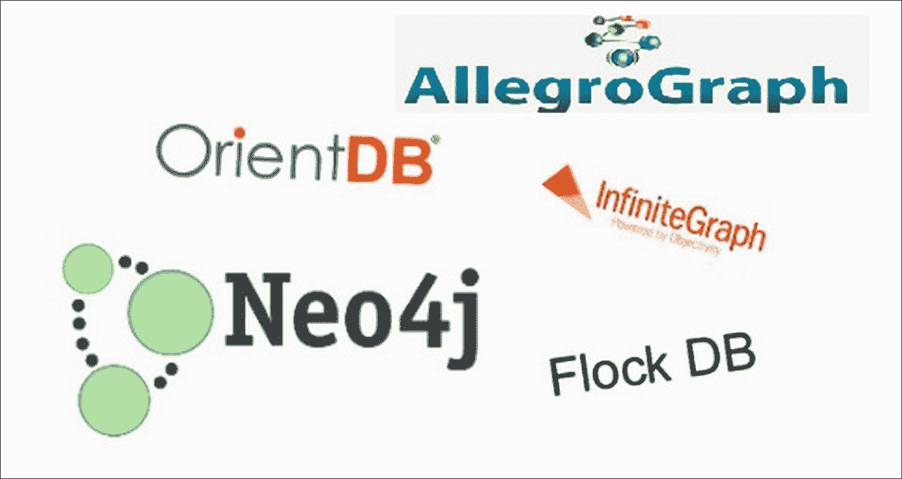

## 标签属性图

在介绍部分，我们看到了一个三个朋友的社会网络表示的例子。这种包含实体/节点之间的有向连接、节点之间的关系以及与节点和关系关联的属性的图数据表示称为**标签属性图数据模型**。

标签属性图数据模型具有以下特性：

+   图包含节点和关系

+   节点可以包含属性（键值对）

+   节点可以标记一个或多个标签

+   关系被命名且具有方向性，并且始终有一个起始节点和一个结束节点

+   关系也可能包含属性

列出的概念将在以下章节中解释。

### 理解 GraphDB 核心概念

以下列表列举了图的所有元素：

+   **节点**：节点是图的基本单元。节点是图中的顶点。它主要指的是被引用的主要对象。节点可以包含标签和属性。从故事中，我们可以提取三个不同的对象并创建三个节点。其中两个是朋友，另一个是电影。

+   **标签**：标签是用来区分相同类型对象的方式。标签通常被赋予具有相似特征的每个节点。节点可以有多个标签。在示例故事中，我们给出了**PERSON**和**MOVIE**的标签。这优化了图遍历，并有助于高效地逻辑查询模型。

+   **关系**：关系是两个节点之间的边。它们可以是单向的也可以是双向的。它们还可以包含创建关系时使用的属性。关系是有名称和方向的，并且始终有一个起始节点和一个结束节点。例如，两个朋友之间存在“Friend Of”的关系。这显示了不同节点之间的连接。每个朋友与电影节点之间也存在“Has Watched”的关系。

+   **属性**：属性是键值对。属性可以用于节点和关系。它们用于保存有关特定节点或关系的详细信息。在示例中，Person 节点具有姓名和年龄属性。这些属性用于区分不同的节点。关系“Has Watched”也有日期和评分属性。

在以下图中，**JOHN**、**KRISH**和**PAUL**是映射为用户标签的节点。同时，观察显示关系的边。节点和关系都可以有属性来进一步描述它们：


# Neo4j

Neo4j 是一个用 Java 和 Scala 实现的开源图数据库。Neo4j 高效地实现了标签属性图模型。像任何其他数据库一样，Neo4j 提供 ACID 事务、运行时故障转移和集群支持，使其能够开发生产就绪的应用程序。这种图数据库架构旨在高效存储数据并加快节点和关系之间的遍历。为了处理存储、检索和遍历数据，我们使用**CYPHER 查询语言**，这是基于模式的 Neo4j 查询语言。

## CYPHER 查询语言

Cypher 是 Neo4j 的查询语言，它遵循类似 SQL 的查询。它是一种声明性查询语言，专注于从图中检索什么，而不是如何检索它。我们知道 Neo4j 属性图由节点和关系组成；尽管这些节点和关系是基本构建块，但图数据库的真实力量在于识别节点和关系之间存在的底层模式。这种图数据库（如 Neo4j）的模式提取能力帮助我们非常快速和高效地执行复杂操作。

Neo4j 的 Cypher 查询语言基于模式。这些模式用于匹配底层图结构，以便我们可以利用模式进行进一步处理，例如在我们的案例中构建推荐引擎。

以下是一个使用 Cypher 查询提取模式的示例。以下 Cypher 查询匹配用户对之间的所有 *friendof* 模式，并将它们作为图返回：

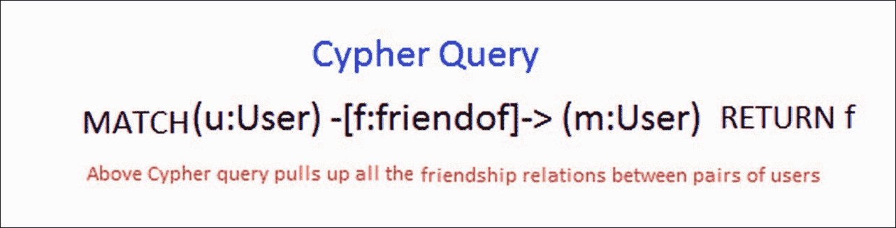

### Cypher 查询基础

在我们开始使用 Neo4j 构建推荐之前，让我们先了解一下 Cypher 查询的基础。正如我们之前提到的，Cypher 是 Neo4j 的查询语言，它遵循类似 SQL 的查询。作为一种声明性语言，Cypher 专注于从图中检索什么，而不是如何检索。Cypher 的关键原则和能力如下：

+   Cypher 在图中的节点和关系之间匹配关键模式，以从图中提取信息。

+   Cypher 具有许多与 SQL 类似的特性，如创建、删除和更新。这些操作应用于节点和关系以获取信息。

+   与 SQL 类似的索引和约束也存在于其中。

## 节点语法

Cypher 使用成对的括号 `()` 或带有文本的成对括号来表示节点。此外，我们可以分配标签，节点的属性作为键值对给出。

以下是一个示例，帮助你更好地理解概念。在以下查询中，节点使用 `()` 或 `(user)` 表示，标签使用 `u`、`(u:user)`，节点的属性则通过键值对分配，例如 `(u:user{name:'Toby'})`：

```py
() 
(user) 
(u:user) 
(u:user{name:'Toby'}) 

```

## 关系语法

Cypher 使用 `-[]->` 来表示两个节点之间的关系。这些关系允许开发者表示节点之间的复杂关系，使它们更容易阅读或理解。

让我们来看以下示例：

```py
 -[]-> 
(user) -[f:friendof]->(user) 
(user) -[f:friendof {since: 2016}]->(user) 

```

在前面的示例中，在两个用户节点之间建立了 `friendof` 关系，并且该关系具有属性 `since:2016`。

## 构建你的第一个图

现在我们已经看到了节点语法和关系语法，让我们通过创建一个类似于以下图表的 Facebook 社交网络图来练习我们到目前为止所学的内容：

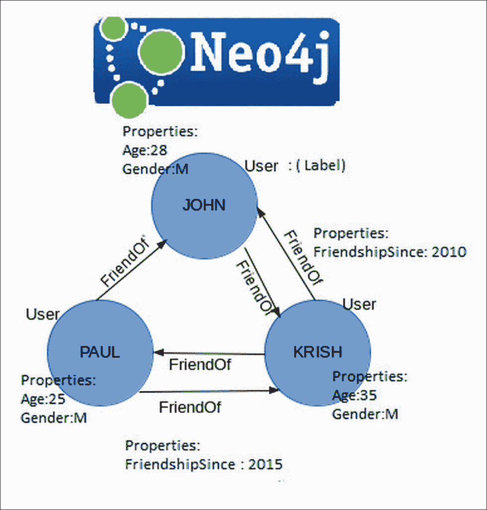

为了创建上述图，我们需要以下步骤：

1.  创建 3 个节点 Person，标签为 JOHN、PAUL、KRISH

1.  使用`CREATE`子句在 3 个节点之间创建关系

1.  设置属性

1.  使用所有模式显示结果

### 创建节点

我们使用`CREATE`子句来创建图元素，如节点和关系。以下示例展示了如何创建一个标记为`john`的单个节点 Person，并具有属性名称`JOHN`。当我们运行以下查询在 Neo4j 浏览器中时，我们得到以下截图所示的图：

```py
CREATE (john:Person {name:"JOHN"})  RETURN  john 

```

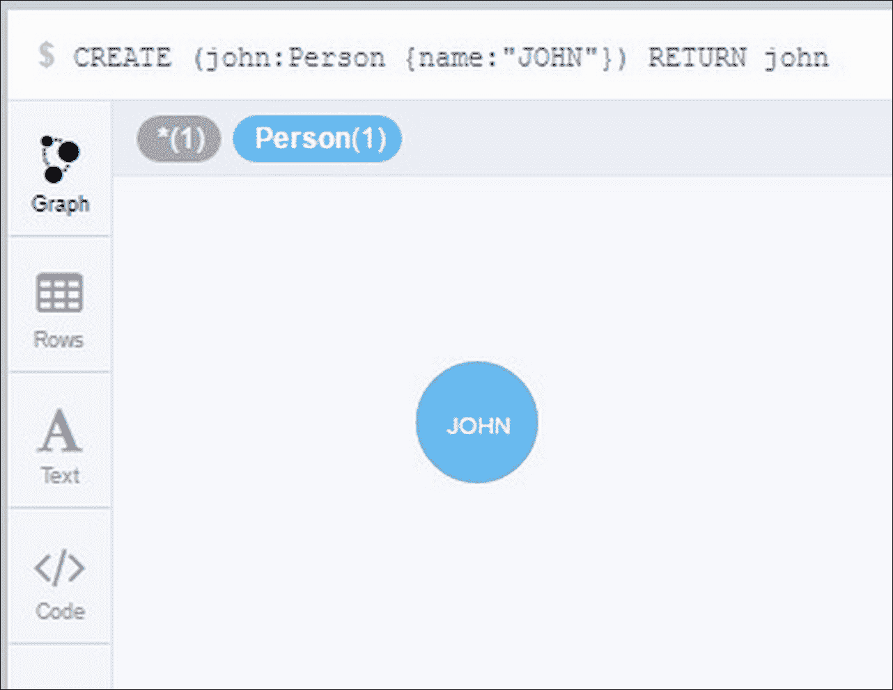

### 注意

`RETURN`子句有助于返回结果集，即节点 - 人员

我们不仅可以创建一个节点，还可以按照以下方式创建多个节点：

```py
CREATE (paul:Person {name:"PAUL"})  
CREATE (krish:Person {name:"KRISH"})  

```

早期代码将创建三个节点，标记为`JOHN`、`PAUL`、`KRISH`的人员。让我们看看我们到目前为止创建了什么；为了查看结果，我们必须使用`MATCH`子句。`MATCH`子句将查找模式，如具有标签名称`k`、`p`、`j`的人员节点及其相应的标签：

```py
MATCH(k:Person{name:'KRISH'}),(p:Person{name:'PAUL'}),(j:Person{name:'JOHN'}) RETURN k,p,j 

```

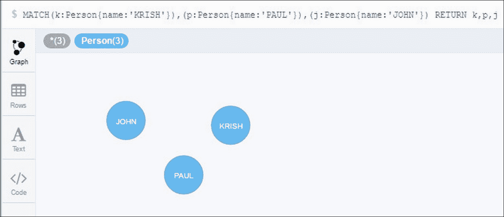

### 创建关系

通过创建节点，我们已经完成了一半。现在，让我们通过创建关系来完成剩余部分。

创建关系的说明如下：

+   使用`MATCH`子句从数据库中提取节点

+   使用`CREATE`子句在`Persons`之间创建所需的关系

在以下查询中，我们正在提取所有`Person`节点，然后在节点之间创建名为`FRIENDOF`的关系：

```py
MATCH(k:Person{name:'KRISH'}),(p:Person{name:'PAUL'}),(j:Person{name:'JOHN'})  
CREATE (k)-[:FRIENDOF]->(j) 
CREATE (j)-[:FRIENDOF]->(k) 
CREATE (p)-[:FRIENDOF]->(j) 
CREATE (p)-[:FRIENDOF]->(k) 
CREATE (k)-[:FRIENDOF]->(p) 

```

以下截图显示了运行先前查询时的结果：

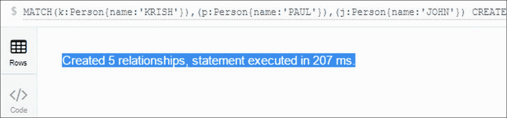

现在我们已经创建了所有必要的节点和关系。为了查看我们取得了什么成果，运行以下查询，该查询显示节点和节点之间的关系：

```py
match(n:Person)-[f:FRIENDOF]->(q:Person) return f 

```

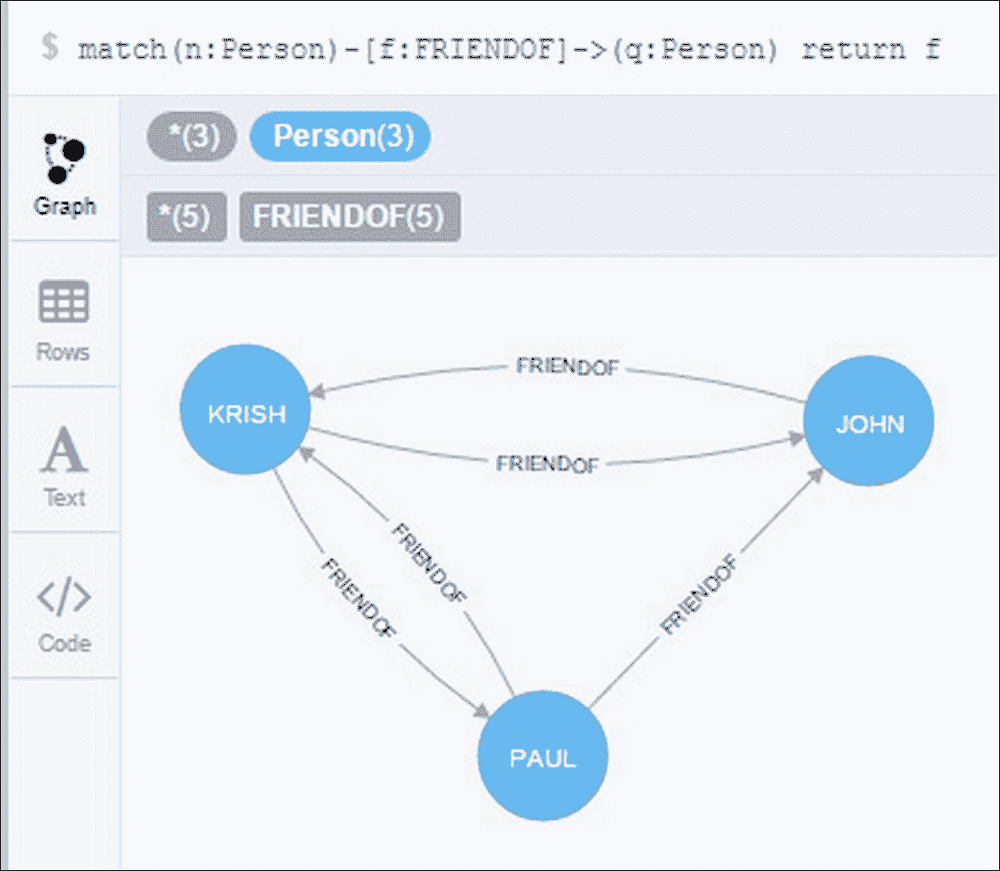

### 设置关系的属性

最后一步是设置节点标签和关系的属性，具体说明如下：

我们使用`SET`子句来设置属性。对于设置关系的属性，我们需要遵循两个步骤：

1.  提取所有关系，`FRIENDOF`

1.  使用`SET`子句将这些关系的属性设置为这些关系

在以下示例中，我们将属性设置为`KRISH`和`PAUL`之间的`FRIENDOF`关系，属性`friendsince`如下所示：

```py
MATCH (k:Person{name:'KRISH'})-[f1:FRIENDOF]-> (p:Person{name:'PAUL'}), 
(k1:Person{name:'KRISH'})<-[f2:FRIENDOF]- (p1:Person{name:'PAUL'}) 
SET f1.friendsince = '2016', f2.friendsince = '2015' 

```

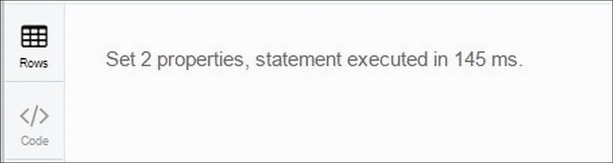

### 注意

在之前的查询中，`()-[]->`模式提取关系`Krish`是`friendOfPaul`，而`() <- [] -`模式提取关系`Paul`是`Krish`的`friendOf`。

让我们按照以下方式显示到目前为止的结果：

```py
match(n:Person)-[f:FRIENDOF]->(q:Person) return f 

```

以下图显示了在先前查询中添加的节点、关系和属性。

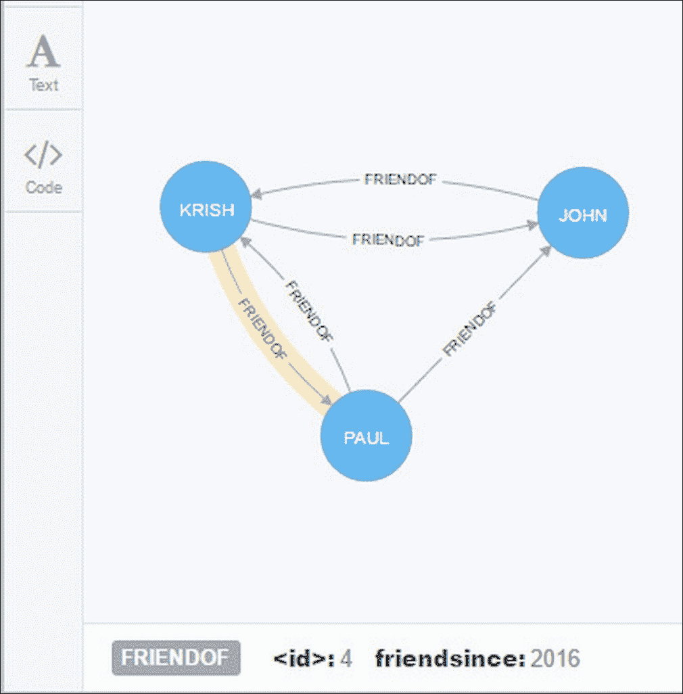

在前面的图中，我们可以看到对于`KRISH`和`PAUL`，`FRIENDOF`关系的属性已设置为`friendsince`。

同样，我们可以将属性设置为节点，如下所示：

```py
MATCH(k:Person{name:'KRISH'}),(p:Person{name:'PAUL'}),(j:Person{name:'JOHN'})  
SET k.age = '26' ,p.age='28', j.age='25',k.gender='M',p.gender='M',j.gender='M' 

```

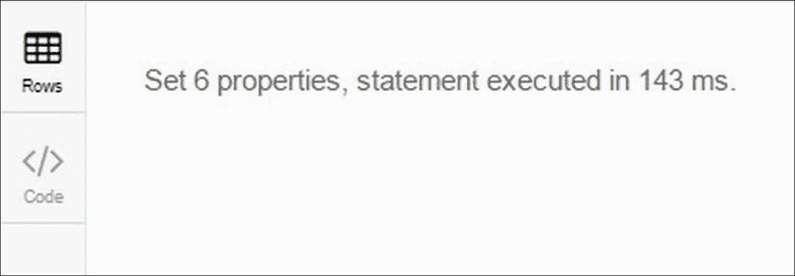

使用以下查询来验证结果，该查询显示节点、关系、标签、节点属性和关系属性：

```py
match(n:Person)-[f:FRIENDOF]->(q:Person) return f 

```

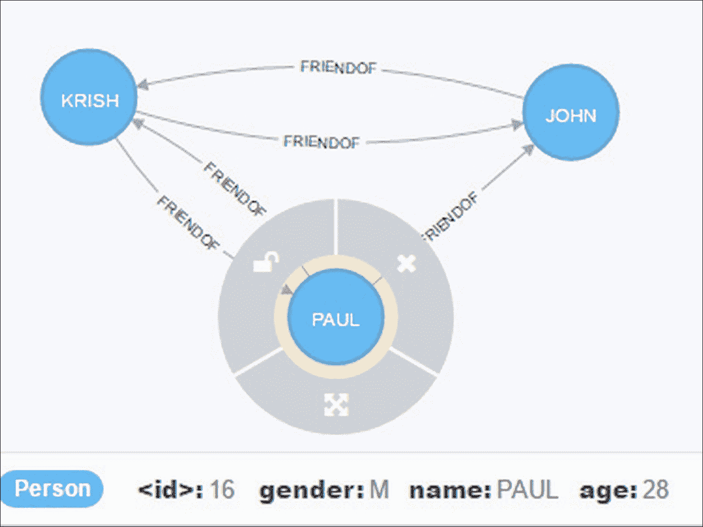

### 从 csv 加载数据

在上一节中，我们手动创建了节点、关系和属性。大多数时候，我们通过从 csv 文件加载数据来创建节点。为了实现这一点，我们使用 Neo4j 浏览器中现成的`LOAD CSV`命令来加载数据。

以下截图显示了本节将使用的数据集，其中包含用户电影评分数据。


以下查询用于加载以下 csv 数据：

```py
LOAD CSV WITH HEADERS FROM 'file:///C:/ Neo4J/test.csv' AS RATINGSDATA RETURN RATINGSDATA 

```

在前面的查询中：

+   **HEADERS** 关键字允许我们要求查询引擎将第一行视为标题信息

+   **WITH** 关键字与返回关键字类似；它明确地分隔查询的部分，并允许我们定义应该将哪些值或变量携带到查询的下一部分

+   **AS** 关键字用于为变量创建别名

当我们运行上述查询时，会发生两件事：

+   **CSV** 数据将被加载到图数据库

+   **RETURN** 子句将显示加载的数据，如下截图所示：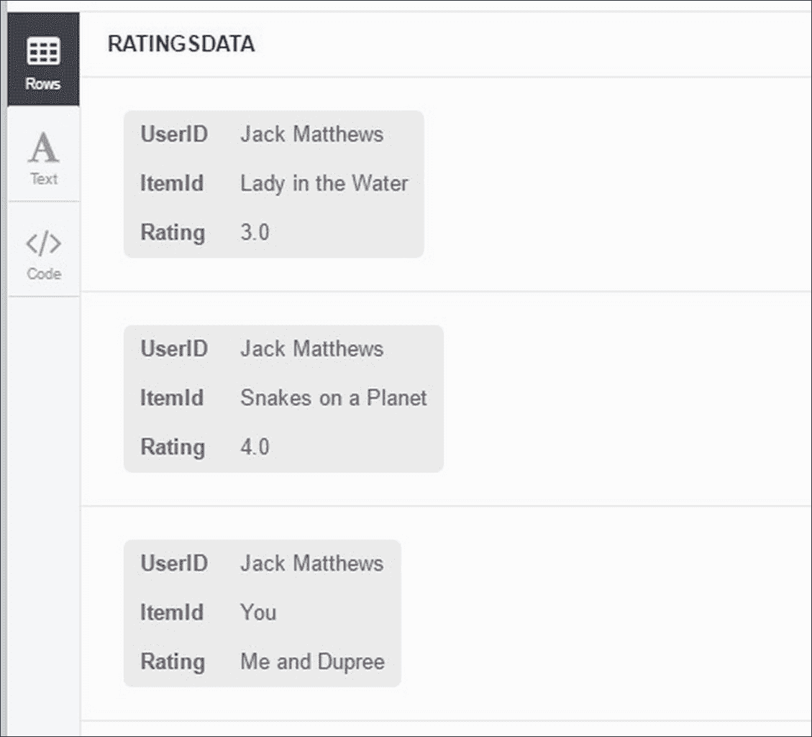

# Neo4j Windows 安装

在本节中，我们将看到如何为 Windows 安装 Neo4j。我们可以从以下 URL 下载 Neo4j Windows 安装程序：

[`neo4j.com/download/`](https://neo4j.com/download/)

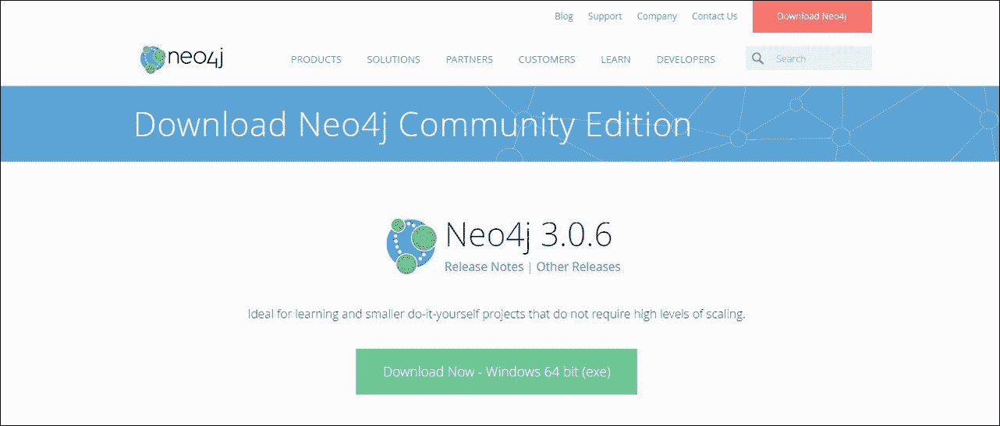

下载安装程序后，点击安装程序以获取以下屏幕，继续进行安装：


安装成功后，启动 Neo4j 社区版。第一次您将看到以下屏幕，要求您选择一个目录来存储图数据库，然后点击**启动**：

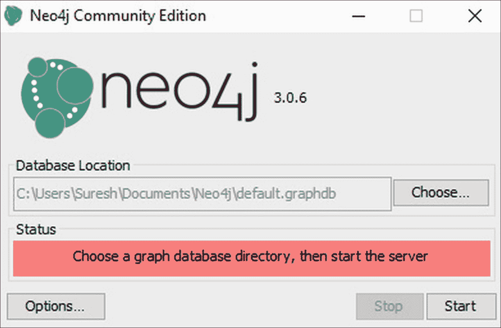

在我们的案例中，我们选择了默认目录，其中创建了`graphdb`数据库，如下所示：

```py
C:\Users\Suresh\Documents\Neo4J\default.graphdb 

```

点击前面的截图中的启动按钮后，Neo4j 将被启动，并显示如下。我们现在可以开始使用 Neo4j 工作了。


现在我们已经启动了 Neo4j，我们可以通过以下方式从浏览器访问它：

`http://localhost:7474`

# 在 Linux 平台上安装 Neo4j

在本节中，我们将学习如何在 CentOS Linux 平台上下载和安装 Neo4j。

## 下载 Neo4j

我们可以从 Neo4j 主页下载 Neo4j 3 Linux 源文件的最新版本：

[`Neo4J.com/`](https://neo4j.com/)

点击以下显示的页面上的**下载 Neo4J**按钮：


### 注意

或者你可以直接从以下 URL 下载：[`info.Neo4J.com/download-thanks.html?edition=community&release=3.0.6&flavour=unix&_ga=1.171681440.1829638272.1475574249`](http://info.neo4j.com/download-thanks.html?edition=community&release=3.0.6&flavour=unix&_ga=1.171681440.1829638272.1475574249)

这将下载一个`tar`文件 - `Neo4J-community-3.0.6-unix.tar.gz`，如下截图所示：

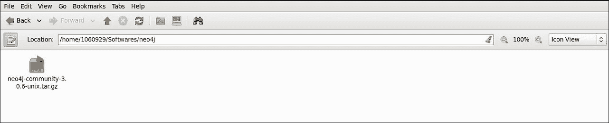

### 注意

我们可以在[`Neo4J.com/developer/get-started/`](https://Neo4J.com/developer/get-started/)找到开发者资源

## 设置 Neo4j

解压`tar`文件，你将得到一个名为`Neo4J-community-3.0.6`的文件夹，其中包含以下文件：


## 从命令行启动 Neo4j

确保你在你的电脑上安装了 Java 8，因为 Neo4j 3.0 版本需要 Java 8。在安装之前检查 Neo4j 的要求。

一旦你安装了 Java 8，我们就可以继续运行我们的 Neo4j 实例，但在那之前，让我们按照以下方式在`bashrc`文件中设置`Neo4J`路径：

```py
gedit ~/.bashrc 
export NEO4J_PATH=/home/1060929/Softwares/Neo4J/Neo4J-community-3.0.6 
export PATH=$PATH:$NEO4J_PATH/bin 
source ~/.bashrc 

```

我们使用以下命令在命令行中启动`Neo4j`：

```py
Neo4J start 

```

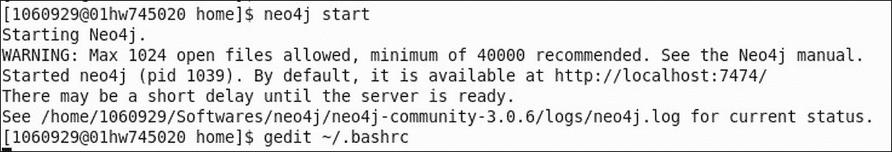

我们可以观察到 Neo4j 已经启动，并且我们可以从浏览器在`http://localhost:7474/`访问图`dbcapabilites`。

第一次在浏览器中运行 Neo4j 需要你设置**用户名**和**密码**：

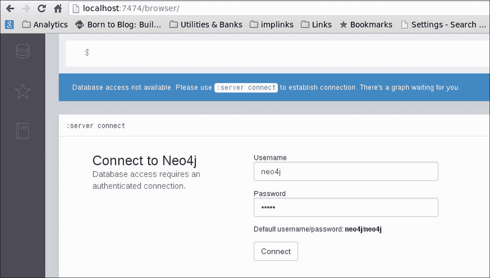

一旦我们设置了凭证，它将重定向到以下页面：


如果你第一次使用它，请在浏览器上花些时间熟悉其功能并探索左侧面板上的不同选项。在浏览器中输入以下命令以显示连接详情：

```py
:server connect 

```

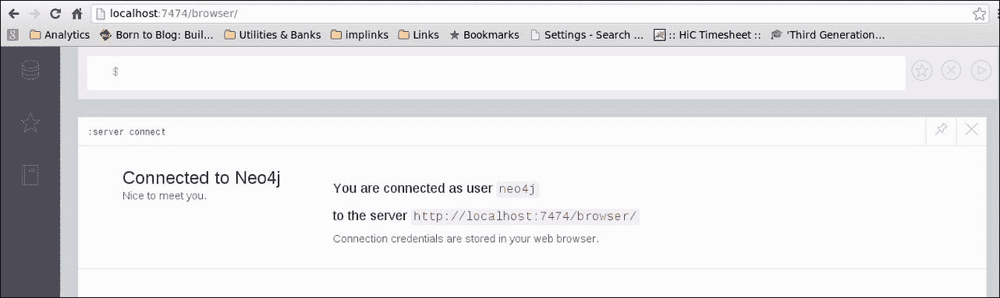

```py
basic usage :  
getting help on Neo4J in the browser: 
:help 

```

# 构建推荐引擎

在本节中，我们将学习如何使用三种方法生成协同过滤推荐。具体如下：

+   对共同评分的电影进行简单计数

+   欧几里得距离

+   余弦相似度

我想在此处强调一个观点。在早期章节中，我们了解到在构建使用启发式方法的推荐引擎时，我们使用了如欧几里得距离/余弦距离等相似度计算。并不一定只能使用这些方法；我们可以自由选择自己的方式来计算两个用户之间的接近度或提取相似度，例如，可以通过简单计数来提取两个用户之间的相似度，例如，可以通过计算两个用户共同评分的相同电影的数量来提取两个用户之间的相似度。如果两个用户共同评分的电影更多，那么我们可以假设他们彼此相似。如果两个人共同评分的电影数量较少，那么我们可以假设他们的品味不同。

这个假设是为了构建我们的第一个推荐引擎，以下进行解释：

为了构建一个基于用户过去电影评分行为的协同电影推荐引擎，我们将构建一个系统，其步骤可以总结如下：

1.  将数据加载到环境中

1.  提取关系和提取用户之间的相似度

1.  推荐步骤

## 将数据加载到 Neo4j

尽管我们有多种将数据加载到 Neo4j 的方法，但我们使用 `Load CSV` 选项将数据导入浏览器工具。以下图表显示了加载 CSV 过程的流程：


我们在本节中使用的数据集是包含用户-电影-评分的小样本数据集，如下截图所示：

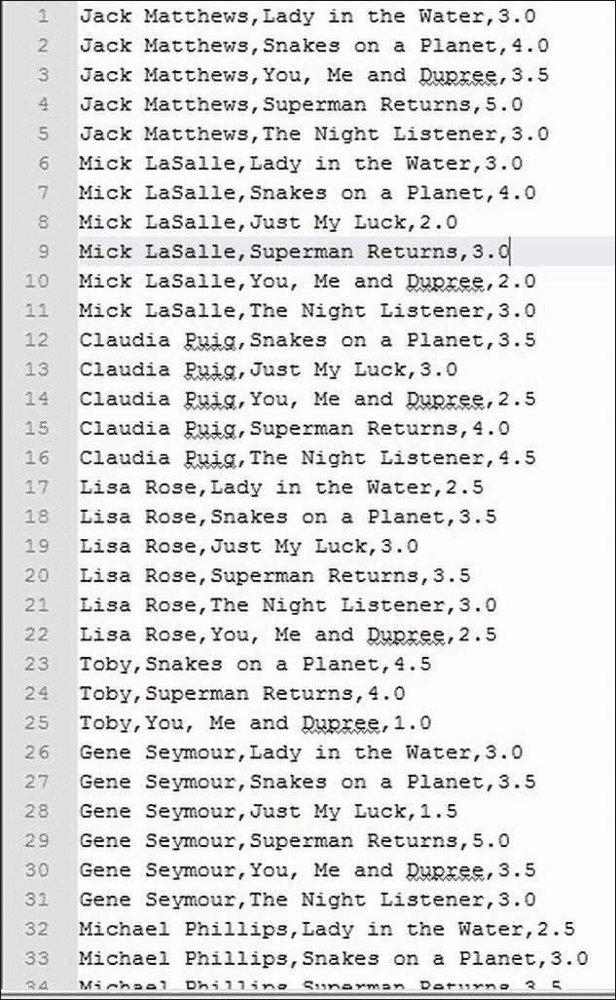

让我们将 MovieLens 数据加载到 Neo4j 浏览器工具中，如下所示：

```py
LOAD CSV WITH HEADERS FROM file:///ratings.csv AS line 

```

现在让我们创建用户和电影作为节点，以及用户对电影给出的评分作为关系。

`MERGE` 子句将在数据中查找查询模式，如果没有找到，它将创建一个。在以下示例中，首先查找用户节点（模式），如果不存在，则创建一个。由于我们刚刚将数据加载到 GraphDB 中，我们需要创建节点并建立关系。以下代码将首先查找提到的节点和关系；如果没有找到，它将创建新的节点和关系：

```py
LOAD CSV WITH HEADERS FROM file:///C:/Neo4J/test.csv AS line MERGE (U:USER {USERID : line.UserID}) 
WITH line, U 
MERGE (M:MOVIE {ITEMID : line.ItemId}) 
WITH line,M,U 
MERGE (U)-[:hasRated{RATING:line.Rating}]->(M); 

```

当我们运行前面的查询时，节点、关系和属性将创建如下截图所示：

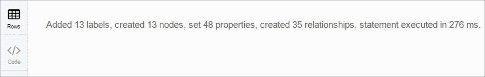

现在，我们将逐行理解，以使我们的理解更加清晰。

`MERGE` 将从原始数据的 `UserID` 列创建 `USER` 节点：

```py
MERGE (U:USER {USERID : line.UserID}) 

```

`With` 命令将 `User` 节点和行对象带到查询的下一部分，如下所示：

```py
WITH line, U 

```

现在，我们将使用 `MERGE` 和 `line.ItemId` 对象创建 `Movie` 节点，如下所示：

```py
MERGE (M:MOVIE {ITEMID : line.ItemId}) 

```

我们将电影、用户节点和行对象带到查询的下一部分，如下所示：

```py
WITH line,M,U 

```

我们创建一个关系，将 `USER` 节点与 `MOVIE` 节点连接，如下所示：

```py
MERGE (U)-[:hasRated{RATING:line.Rating}]->(M); 

```

现在我们已经将数据加载到 Neo4j 中，我们可以如下可视化电影评分数据，包括用户、电影和评分：

```py
MATCH (U:USER)-[R:hasRated]->(M:MOVIE) RETURN R 

```

在以下图像中，所有用户以绿色创建，电影以红色创建。我们还可以看到以箭头表示的带有方向的关联关系。

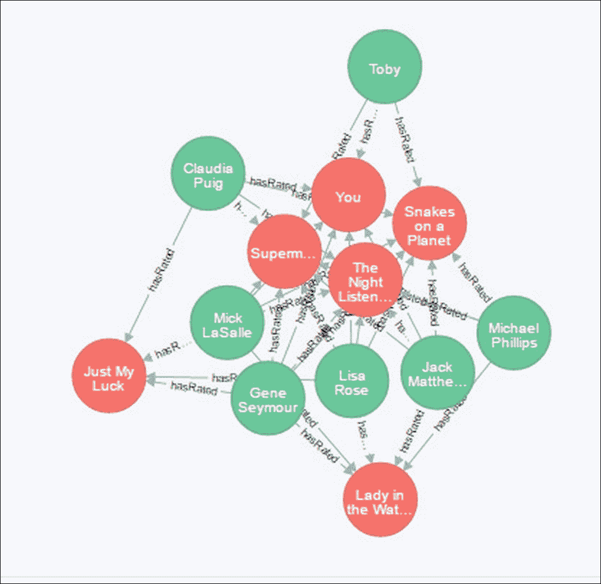

## 使用 Neo4j 生成推荐

我们现在已经创建了构建我们第一个推荐引擎所需的全部图，让我们开始吧。

### 注意

在以下查询中，`COUNT()` 函数将计算实例的数量，`collect()` 将。

以下截图将返回对样本用户 `'TOBY'` 的电影推荐：

```py
match(u1:USER)-[:hasRated]->(i1:MOVIE)<-[:hasRated]-(u2:USER)- [:hasRated]->(i2:MOVIE)  
with u1,u2, count(i1) as cnt , collect(i1) as Shareditems,i2 
where not(u1-[:hasRated]->i2) and u1.USERID='Toby' and cnt> 2  
return distinct i2.ITEMID as Recommendations 

```

以下查询显示了在运行早期查询时对 Toby 做出的推荐：


上一查询中推荐背后的概念如下：

+   提取评分相同电影的用户对

+   获取每对用户共同评分电影的计数

+   共同评分电影的数量越多，两个用户之间的相似度就越高

+   最后一步是从所有相似用户已评分但活跃用户未评分的电影中提取所有电影，并将这些新电影作为推荐提供给活跃用户。

让我们一步一步地理解我们刚才看到的查询：

+   在第一行，对于每个已评分电影（例如`MOVIE1`）的用户（例如`USER1`），选择所有也评分了`MOVIE1`的用户（例如`USER2`）。对于这个`USER2`，也提取他除`MOVIE1`之外评分的其他电影。

+   在第二行，我们携带相似用户(`u1`,`u2`)，计算`u1`,`u2`共同评分电影的计数，并将`u1`,`u2`共同评分的电影提取到查询的下一部分。

+   在第三行，我们现在应用一个过滤器，选择那些未被`u1`评分且共同评分电影计数大于两的电影。

+   在第 4 行，我们返回`u1`由相似用户评分的新电影作为推荐。

## 使用欧几里得距离进行协同过滤

在上一节中，我们看到了如何使用简单的基于计数的简单方法构建推荐引擎来识别相似用户，然后我们从相似用户中选择活跃用户未评分或推荐的电影。

在本节中，我们不再基于简单的共同评分电影计数来计算两个用户之间的相似度，而是利用评分信息并计算欧几里得距离，以得出相似度得分。

以下 Cypher 查询将根据欧几里得相似度为用户 Toby 生成推荐：

1.  第一步是通过电影提取共同评分用户并计算共同评分用户之间的欧几里得距离，如下所示：

    ```py
            MATCH (u1:USER)-[x:hasRated]-> (b:MOVIE)<-[y:hasRated]-
              (u2:USER) 
            WITH count(b) AS CommonMovies, u1.username AS user1,
              u2.username AS user2, u1, u2,
            collect((toFloat(x.RATING)-toFloat(y.RATING))²) AS ratings,
            collect(b.name) AS movies
            WITH CommonMovies, movies, u1, u2, ratings
            MERGE (u1)-[s:EUCSIM]->(u2) SET s.EUCSIM = 1-   
              (SQRT(reduce(total=0.0, k in extract(i in ratings | 
                i/CommonMovies) | total+k))/4)

    ```

    ### 注意

    在此代码中，我们使用`reduce()`和`extract()`来计算欧几里得距离。为了应用数学计算，我们使用以下查询中的`float()`函数将值转换为浮点数。

    要查看用户对之间的欧几里得距离值，请运行以下查询：

    ```py
            MATCH (u1:USER)-[x:hasRated]-> (b:MOVIE)<-[y:hasRated]-
              (u2:USER) 
            WITH count(b) AS CommonMovies, u1.username AS user1,    
              u2.username AS user2, u1, u2, 
            collect((toFloat(x.RATING)-toFloat(y.RATING))²) AS ratings, 
            collect(b.name) AS movies 
            WITH CommonMovies, movies, u1, u2, ratings 
            MERGE (u1)-[s:EUCSIM]->(u2) SET s.EUCSIM = 1-
              (SQRT(reduce(total=0.0, k in extract(i in ratings |   
                i/CommonMovies) | total+k))/4) return s as SIMVAL,  
                  u1.USERID as USER,u2.USERID as Co_USER;
    ```

    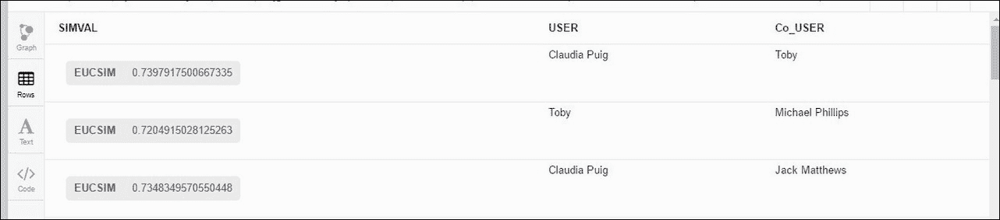

1.  在第二步中，我们使用公式*sqrt(sum((R1-R2)*(R1-R2)))*计算欧几里得距离，其中*R1*是`Toby`为`movie1`给出的评分，而*R2*是其他共同评分用户对同一`movie1`的评分，我们选择前三个相似用户，如下所示：

    ```py
            MATCH (p1:USER {USERID:'Toby'})-[s:EUCSIM]-(p2:USER) 
            WITH p2, s.EUCSIM AS sim 
            ORDER BY sim DESC 
            RETURN distinct p2.USERID AS CoReviewer, sim AS similarity 

    ```

1.  最后一步是向 Toby 推荐或建议来自前三个相似用户的未评分电影，如下所示：

    ```py
            MATCH (b:USER)-[r:hasRated]->(m:MOVIE), (b)-[s:EUCSIM]-(a:USER  
              {USERID:'Toby'}) 
            WHERE NOT((a)-[:hasRated]->(m)) 
            WITH m, s.EUCSIM AS similarity, r.RATING AS rating 
            ORDER BY m.ITEMID, similarity DESC 
            WITH m.ITEMID AS MOVIE, COLLECT(rating) AS ratings 
            WITH MOVIE, REDUCE(s = 0, i IN ratings |toInt(s) +  
              toInt(i))*1.0 / size(ratings) AS reco 
            ORDER BY recoDESC 
            RETURN MOVIE AS MOVIE, reco AS Recommendation 

    ```

    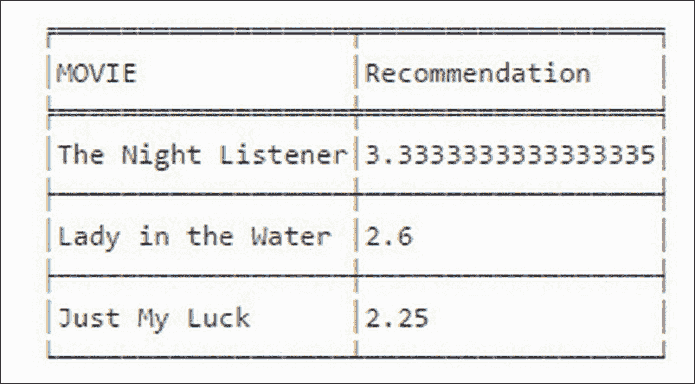

让我们详细解释前面的查询如下：

1.  正如我们在第一步中解释的那样，我们提取了用户共同评分的电影及其评分，如下所示：

    在我们的例子中，Toby 已经评了三部电影：《星球上的蛇》、《超人归来》和《你、我、杜普雷》。现在我们必须提取其他共同用户，他们与 Toby 共同评了这三部电影。为此，我们使用以下查询：

    ```py
            MATCH (u1:USER{USERID:'Toby'})-[x:hasRated]-> (b:MOVIE)<- 
              [y:hasRated]-(u2:USER)
            return u1, u2,
            collect(b.ITEMID) AS CommonMovies,
            collect(x.RATING) AS user1Rating,
            collect(y.RATING) AS user2Rating
    ```

    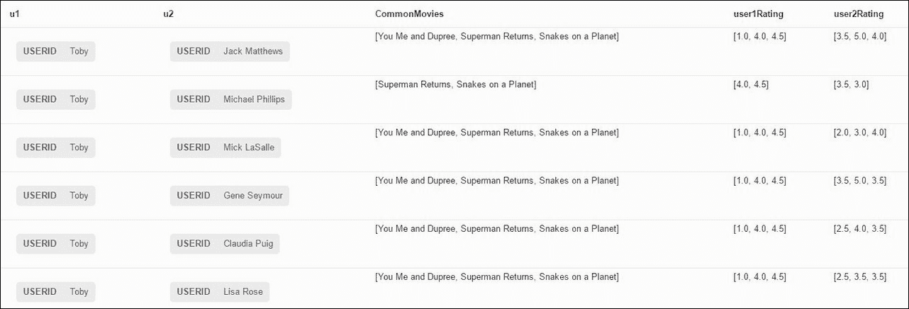

1.  第二步是计算其他用户对每个共同评分电影的评分与 Toby 电影的欧几里得距离，这通过以下查询计算：

    ```py
            MATCH (u1:USER)-[x:hasRated]-> (b:MOVIE)<-[y:hasRated]- 
              (u2:USER) 
            WITH count(b) AS CommonMovies, u1.username AS user1, 
              u2.username AS user2, u1, u2, 
            collect((toFloat(x.RATING)-toFloat(y.RATING))²) AS ratings, 
            collect(b.name) AS movies 
            WITH CommonMovies, movies, u1, u2, ratings 
            MERGE (u1)-[s:EUCSIM]->(u2) SET s.EUCSIM = 1- 
              (SQRT(reduce(total=0.0, k in extract(i in ratings |  
                i/CommonMovies) | total+k))/4) 

    ```

    在前面的查询中，我们使用 MERGE 子句创建并合并了每个共同评分用户之间的关系，以显示两个用户之间的距离。此外，我们使用 SET 子句将关系的属性设置为 EUCSIM（表示每个共同评分用户之间的欧几里得距离）。

    现在我们已经创建了新的关系并设置了相似度距离的值，让我们查看以下查询给出的结果：

    ```py
            MATCH (p1:USER {USERID:'Toby'})-[s:EUCSIM]-(p2:USER) 
            WITH p2, s.EUCSIM AS sim 
            ORDER BY sim DESC 
            RETURN distinct p2.USERID AS CoReviewer, sim AS similarity 

    ```

    以下截图显示了 Toby 与其他用户的相似度值：

    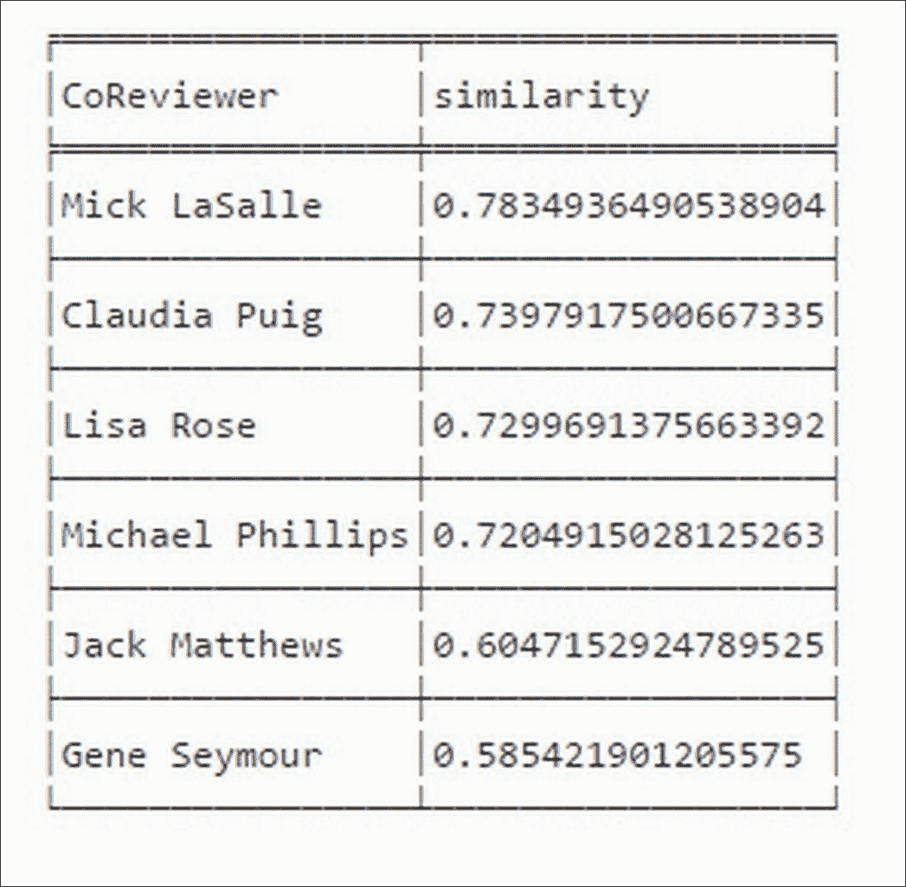

1.  最后一步是预测 Toby 未评分的电影，然后推荐评分最高的预测项目。为此，我们采取以下步骤：

    +   提取与 Toby 相似的用户评分的电影，但不是 Toby 自己评分的电影

    +   对所有未评分电影的评分取平均值，以预测 Toby 可能对这些电影给出的评分。

    +   按照预测的评分，以降序显示排序后的结果。

    要实现这一点，请使用以下查询：

    ```py
            MATCH (b:USER)-[r:hasRated]->(m:MOVIE), (b)-[s:EUCSIM]-(a:USER  
              {USERID:'Toby'}) 
            WHERE NOT((a)-[:hasRated]->(m)) 
            WITH m, s.EUCSIM AS similarity, r.RATING AS rating ORDER BY     
              similarity DESC 
            WITH m.ITEMID AS MOVIE, COLLECT(rating) AS ratings 
            WITH MOVIE, REDUCE(s = 0, i IN ratings |toInt(s) + 
              toInt(i))*1.0 / size(ratings) AS reco 
            ORDER BY reco DESC 
            RETURN MOVIE AS MOVIE, reco AS Recommendation 

    ```

    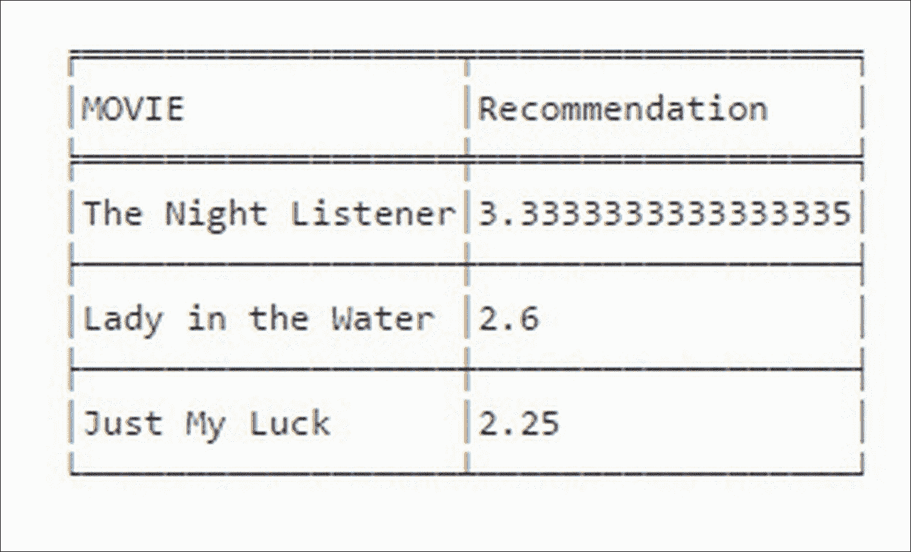

让我们逐行理解推荐查询，如下所示：

以下查询检索了与 Toby 相似的所有用户及其相似用户评分的所有电影，如下所示：

```py
MATCH (b:USER)-[r:hasRated]->(m:MOVIE), (b)-[s:EUCSIM]-(a:USER {USERID:'Toby'}) 

```

`WHERE NOT`子句将过滤掉所有被类似用户评分但未被 Toby 评分的电影，如下所示：

```py
WHERE NOT((a)-[:hasRated]->(m)) 

```

将共同用户给出的电影、相似度值和评分传递到查询的下一部分，并按降序相似度值排序，如下所示：

```py
WITH m, s.EUCSIM AS similarity, r.RATING AS rating ORDER BY similarity DESC 

```

根据相似度值对结果进行排序后，我们进一步允许将电影名称和评分等值添加到查询的下一部分，如下所示：

```py
WITH m.ITEMID AS MOVIE, COLLECT(rating) AS ratings 

```

这是向 Toby 推荐电影的主要步骤，通过取与 Toby 相似的用户的电影评分的平均值，并使用`REDUCE`子句预测未评分电影的评分，如下所示：

```py
WITH MOVIE, REDUCE(s = 0, i IN ratings |toInt(s) + toInt(i))*1.0 / size(ratings) AS reco 

```

最后，我们排序最终结果，并按如下方式返回给 Toby 的顶级电影：

```py
ORDER BY recoDESC 
RETURN MOVIE AS MOVIE, reco AS Recommendation 

```

## 使用余弦相似度的协同过滤

现在我们已经看到了基于简单计数和欧几里得距离来识别相似用户的推荐，让我们使用余弦相似度来计算用户之间的相似度。

以下查询用于创建一个名为相似度的新关系：

```py
MATCH (p1:USER)-[x:hasRated]->(m:MOVIE)<-[y:hasRated]-(p2:USER) 
WITH SUM(toFloat(x.RATING) * toFloat(y.RATING)) AS xyDotProduct, 
SQRT(REDUCE(xDot = 0.0, a IN COLLECT(toFloat(x.RATING)) | xDot +toFloat(a)²)) AS xLength, 
SQRT(REDUCE(yDot = 0.0, b IN COLLECT(toFloat(y.RATING)) | yDot + toFloat(b)²)) AS yLength, 
p1, p2 
MERGE (p1)-[s:SIMILARITY]-(p2) 
SET s.similarity = xyDotProduct / (xLength * yLength) 

```

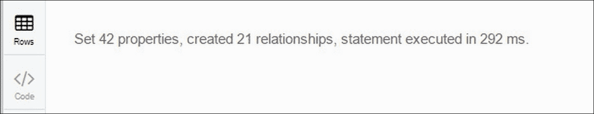

让我们按以下方式探索相似度值：

```py
match(u:USER)-[s:SIMILARITY]->(u2:USER) return s; 

```

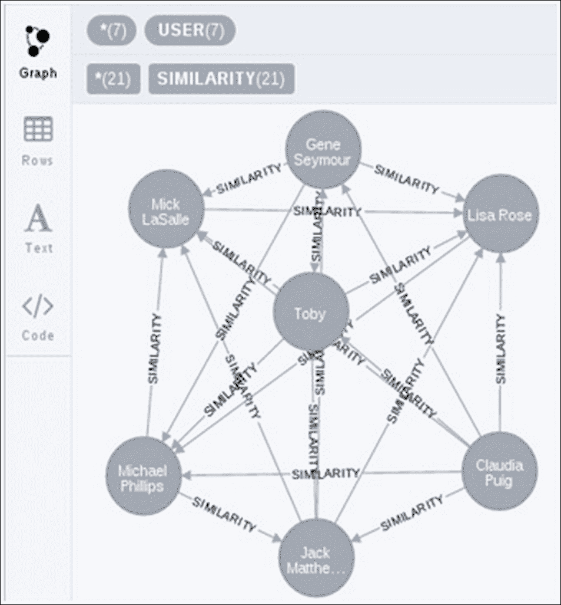

我们按以下方式计算 Toby 的相似用户：

对于活跃用户 Toby，让我们显示与其他用户之间的相似度值，如下所示：

```py
MATCH (p1:USER {USERID:'Toby'})-[s:SIMILARITY]-(p2:USER) 
WITH p2, s.similarity AS sim 
ORDER BY sim DESC 
LIMIT 5 
RETURN p2.USERID AS Neighbor, sim AS Similarity 

```

以下图像显示了运行上一个 Cypher 查询的结果；结果显示了 Toby 与其他用户之间的相似度值。

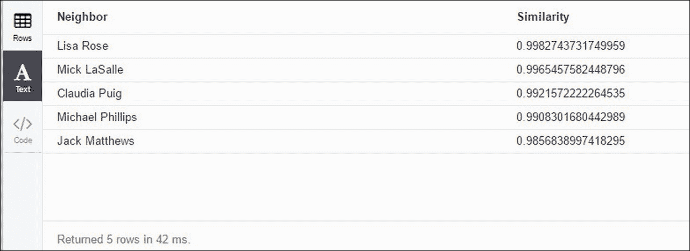

现在，让我们开始为 Toby 推荐电影。推荐过程与之前的方法非常相似，如下所示：

+   提取与 Toby 相似但 Toby 本人未评分的电影

+   对所有未评分电影的评分取平均值，以预测 Toby 可能对这些电影给出的评分

+   按预测评分降序显示排序结果

我们使用以下代码：

```py
MATCH (b:USER)-[r:hasRated]->(m:MOVIE), (b)-[s:SIMILARITY]-(a:USER  
  {USERID:'Toby'}) 
WHERE NOT((a)-[:hasRated]->(m)) 
WITH m, s.similarity AS similarity, r.RATING AS rating 
ORDER BY m.ITEMID, similarity DESC 
WITH m.ITEMID AS MOVIE, COLLECT(rating) AS ratings 
WITH MOVIE, REDUCE(s = 0, i IN ratings |toInt(s) + toInt(i))*1.0 / 
  size(ratings) AS reco 
ORDER BY reco DESC 
RETURN MOVIE AS MOVIE, reco AS Recommendation 

```

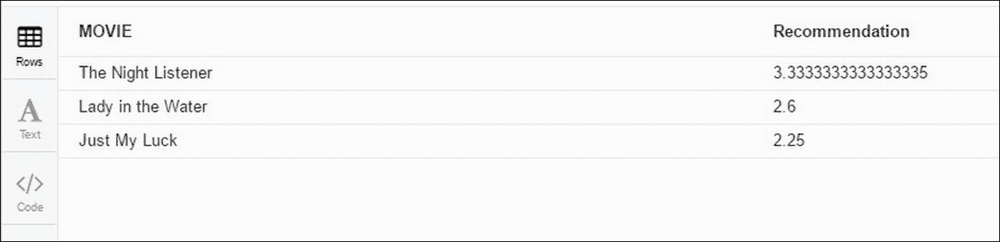

# 摘要

恭喜！我们已经使用 Neo4j 图形数据库创建了推荐引擎。让我们回顾一下本章学到的内容。我们本章开始时简要介绍了图和图数据库。我们简要介绍了 Neo4j 图形数据库的核心概念，如标记属性图模型、节点、标签、关系、Cypher 查询语言、模式、节点语法和关系语法。

我们还提到了在构建推荐时有用的 Cypher 子句，例如`MATCH`、`CREATE`、`LOADCSV`、`RETURN`、`AS`和`WITH`。

然后我们转向 Windows 和 Linux 平台上的浏览器工具中的 Neo4j 的安装和设置。

一旦整个工作环境设置完毕以构建我们的推荐引擎，我们选择了样本电影评分数据并实现了三种类型的协同过滤，如基于简单距离、基于欧几里得相似度和基于余弦相似度的推荐。在下一章中，我们将探索 Hadoop 上可用的机器学习库 Mahout，用于构建可扩展的推荐系统。
