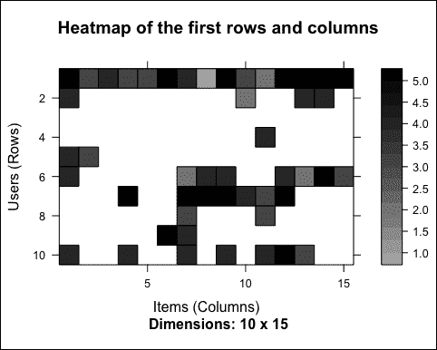

# 第三章。推荐系统

本章展示了某些流行的推荐技术。此外，我们将在 R 中实现其中的一些。

我们将处理以下技术：

+   **协同过滤**：这是我们将会详细探讨的技术分支。算法基于关于相似用户或相似物品的信息。两个子分支如下：

    +   **基于物品的协同过滤**：这会向用户推荐与用户购买最相似的物品

    +   **基于用户的协同过滤**：这会向用户推荐最被相似用户偏好的物品

+   **基于内容的过滤**：这是为每个用户定义的；它定义了一个用户配置文件并识别与它匹配的物品。

+   **混合过滤**：这是结合不同技术。

+   **基于知识的过滤**：这是使用关于用户和物品的显式知识。

# 推荐系统 R 包 – recommenderlab

在本章中，我们将使用 `recommenderlab` 构建推荐系统，这是一个用于协同过滤的 R 包。本节将简要介绍这个包。首先，如果我们还没有安装它，让我们来安装它：

```py
if(!"recommenderlab" %in% rownames(installed.packages())){install.packages("recommenderlab")}
```

现在，我们可以加载这个包。然后，使用 `help` 函数，我们可以查看其文档：

```py
library("recommenderlab")
help(package = "recommenderlab")
```

当我们在 RStudio 中运行前面的命令时，将打开一个包含一些链接和函数列表的帮助文件。

本章中您将看到的示例包含一些随机成分。为了能够重现获得相同输出的代码，我们需要运行这一行：

```py
set.seed(1)
```

现在，我们已准备好开始探索 `recommenderlab`。

## 数据集

与许多其他 R 包一样，`recommenderlab` 包含一些可以用来尝试函数的数据集：

```py
data_package <- data(package = "recommenderlab")
data_package$results[, "Item"]
```

### Jester5k、MSWeb 和 MovieLense

在我们的示例中，我们将使用 `MovieLense` 数据集；数据是关于电影的。表格包含用户对电影的评分。让我们加载数据并查看一下：

```py
data(MovieLense)
MovieLense
## 943 x 1664 rating matrix of class 'realRatingMatrix' with 99392 ratings.
```

`MovieLense` 的每一行对应一个用户，每一列对应一部电影。用户和电影之间有超过 *943 x 1664 = 1,500,000* 种组合。因此，存储完整的矩阵将需要超过 1,500,000 个单元格。然而，并非每个用户都看过每部电影。因此，评分少于 100,000，矩阵是稀疏的。`recommenderlab` 包允许我们以紧凑的方式存储它。

## 评分矩阵的类

在本节中，我们将详细探讨 `MovieLense`：

```py
class(MovieLense)
## [1] "realRatingMatrix"
## attr(,"package")
## [1] "recommenderlab"
```

`realRatingMatrix` 类由 `recommenderlab` 定义，`ojectsojectsb` 包含稀疏评分矩阵。让我们看看我们可以应用于此类对象的哪些方法：

```py
methods(class = class(MovieLense))
```

| `[` | `dimnames<-` | `Recommender` |
| --- | --- | --- |
| `binarize` | `dissimilarity` | `removeKnownRatings` |
| `calcPredictionAccuracy` | `evaluationScheme` | `rowCounts` |
| `calcPredictionAccuracy` | `getData.frame` | `rowMeans` |
| `colCounts` | `getList` | `rowSds` |
| `colMeans` | `getNormalize` | `rowSums` |
| `colSds` | `getRatings` | `sample` |
| `colSums` | `getTopNLists` | `show` |
| `denormalize` | `image` | `similarity` |
| `dim` | `normalize` |   |
| `dimnames` | `nratings` |   |

一些适用于矩阵的方法已经以更优化的方式重新定义。例如，我们可以使用 `dim` 来提取行数和列数，使用 `colSums` 来计算每列的总和。此外，还有一些专门针对推荐系统的新方法。

通常，评分矩阵是稀疏矩阵。因此，`realRatingMatrix` 类支持稀疏矩阵的紧凑存储。让我们比较 `MovieLense` 与相应的 R 矩阵的大小：

```py
object.size(MovieLense)
## 1388448 bytes
object.size(as(MovieLense, "matrix"))
## 12740464 bytes
```

我们可以计算 `recommenderlab` 矩阵的紧凑性是原来的多少倍：

```py
object.size(as(MovieLense, "matrix")) / object.size(MovieLense)
## 9.17604692433566 bytes
```

如预期的那样，`MovieLense` 占用的空间比等效的标准 R 矩阵要少得多。比率约为 *1:9*，原因是 `MovieLense` 的稀疏性。标准 R 矩阵对象将所有缺失值存储为 0，因此它存储了 15 倍更多的单元格。

## 计算相似度矩阵

协同过滤算法基于测量用户或项目之间的相似度。为此，`recommenderlab` 包含了 `similarity` 函数。支持的相似度计算方法有 `cosine`、`pearson` 和 `jaccard`。

例如，我们可能想确定前五个用户彼此之间有多相似。让我们使用 `cosine` 距离来计算这个：

```py
similarity_users <- similarity(MovieLense[1:4, ], method = "cosine", which = "users")
```

`similarity_users` 对象包含所有的不相似度。让我们来探索它：

```py
class(similarity_users)
## [1] "dist"
```

如预期的那样，`similarity_users` 是一个包含距离的对象。由于 `dist` 是一个基本的 R 类，我们可以以不同的方式使用它。例如，我们可以使用 `hclust` 来构建层次聚类模型。

我们还可以将 `similarity_users` 转换为矩阵并可视化它：

```py
as.matrix(similarity_users)
```

| 1 | 2 | 3 | 4 |
| --- | --- | --- | --- |
| `0` | `0.1689` | `0.03827` | `0.06635` |
| `0.1689` | `0` | `0.09707` | `0.1531` |
| `0.03827` | `0.09707` | `0` | `0.3334` |
| `0.06635` | `0.1531` | `0.3334` | `0` |

使用 `image`，我们可以可视化矩阵。每一行和每一列对应一个用户，每个单元格对应两个用户之间的相似度：

```py
image(as.matrix(similarity_users), main = "User similarity")
```

单元格越红，两个用户就越相似。请注意，对角线是红色的，因为它是在比较每个用户与其自身：


使用相同的方法，我们可以计算并可视化前四个项目之间的相似度：

```py
similarity_items <- similarity(MovieLense[, 1:4], method = "cosine", which = "items")
as.matrix(similarity_items)
```

|   | 玩具总动员 (1995) | 黄金眼 (1995) |
| --- | --- | --- |
| **玩具总动员 (1995)** | `0` | `0.4024` |
| **黄金眼 (1995)** | `0.4024` | `0` |
| **四个房间 (1995)** | `0.3302` | `0.2731` |
| **小鬼当家 (1995)** | `0.4549` | `0.5026` |

表格将继续如下：

|   | 四个房间 (1995) | 小鬼当家 (1995) |
| --- | --- | --- |
| **玩具总动员 (1995)** | `0.3302` | `0.4549` |
| **黄金眼 (1995)** | `0.2731` | `0.5026` |
| **四个房间 (1995)** | `0` | `0.3249` |
| **Get Shorty (1995)** | `0.3249` | `0` |

与前面的截图类似，我们可以使用此图像可视化矩阵：

```py
image(as.matrix(similarity_items), main = "Item similarity")
```


相似性是协同过滤模型的基础。

## 推荐模型

`recommenderlab`包包含一些推荐算法的选项。我们可以使用`recommenderRegistry$get_entries`显示适用于`realRatingMatrix`对象的模型：

```py
recommender_models <- recommenderRegistry$get_entries(dataType = "realRatingMatrix")
```

`recommender_models`对象包含有关模型的一些信息。首先，让我们看看我们有哪些模型：

```py
names(recommender_models)
```

| 模型 |
| --- |
| `IBCF_realRatingMatrix` |
| `PCA_realRatingMatrix` |
| `POPULAR_realRatingMatrix` |
| `RANDOM_realRatingMatrix` |
| `SVD_realRatingMatrix` |
| `UBCF_realRatingMatrix` |

让我们看看它们的描述：

```py
lapply(recommender_models, "[[", "description")
## $IBCF_realRatingMatrix
## [1] "Recommender based on item-based collaborative filtering (real data)."
##
## $PCA_realRatingMatrix
## [1] "Recommender based on PCA approximation (real data)."
##
## $POPULAR_realRatingMatrix## [1] "Recommender based on item popularity (real data)."
##
## $RANDOM_realRatingMatrix
## [1] "Produce random recommendations (real ratings)."
##
## $SVD_realRatingMatrix
## [1] "Recommender based on SVD approximation (real data)."
##
## $UBCF_realRatingMatrix
## [1] "Recommender based on user-based collaborative filtering (real data)."
```

在其中，我们将使用`IBCF`和`UBCF`。

`recommender_models` 对象还包含一些其他信息，例如其参数：

```py
recommender_models$IBCF_realRatingMatrix$parameters
```

| 参数 | 默认值 |
| --- | --- |
| `k` | `30` |
| `method` | `Cosine` |
| `normalize` | `center` |
| `normalize_sim_matrix` | `FALSE` |
| `alpha` | `0.5` |
| `na_as_zero` | `FALSE` |

对于包的更详细描述和一些用例，您可以查看包的 vignette。您可以通过输入`help(package = "recommenderlab")`找到所有材料。

`recommenderlab`包是一个好且灵活的包，用于执行推荐。如果我们将其模型与其他 R 工具结合，我们将拥有一个强大的框架来探索数据和构建推荐模型。

在下一节中，我们将使用`recommenderlab`的一些工具探索其数据集。

# 数据探索

在本节中，我们将探索`MovieLense`数据集。为此，我们将使用`recommenderlab`构建推荐系统，并使用`ggplot2`可视化其结果。让我们加载包和数据：

```py
library("recommenderlab")
library("ggplot2")
data(MovieLense)
class(MovieLense)
## [1] "realRatingMatrix"
## attr(,"package")
## [1] "recommenderlab"
```

`MovieLense`是一个包含关于电影评分数据集的`realRatingMatrix`对象。每一行对应一个用户，每一列对应一部电影，每个值对应一个评分。

## 探索数据的性质

让我们快速看一下`MovieLense`。正如前一部分所解释的，有一些通用方法可以应用于`realRatingMatrix`对象。我们可以使用`dim`提取它们的大小：

```py
dim(MovieLense)
## [1]  943 1664
```

有`943`个用户和`1664`部电影。由于`realRatingMatrix`是 S4 类，对象的组件包含在`MovieLense`槽中。我们可以使用`slotNames`查看所有槽，它显示对象中存储的所有数据：

```py
slotNames(MovieLense)
## [1] "data"      "normalize"
MovieLense contains a data slot. Let's take a look at it.
class(MovieLense@data)
## [1] "dgCMatrix"
## attr(,"package")
## [1] "Matrix"
dim(MovieLense@data)
## [1]  943 1664
```

`MovieLense@data`属于从`Matrix`继承的`dgCMatrix`类。为了执行自定义数据探索，我们可能需要访问这个槽。

## 探索评分的值

从槽数据开始，我们可以探索矩阵。让我们看看评分。我们可以将矩阵转换为向量并探索其值：

```py
vector_ratings <- as.vector(MovieLense@data)
unique(vector_ratings)
## [1] 5 4 0 3 1 2
The ratings are integers in the range 0-5\. Let's count the occurrences of each of them.
table_ratings <- table(vector_ratings)
table_ratings
```

| 评分 | 出现次数 |
| --- | --- |
| `0` | `1469760` |
| `1` | `6059` |
| `2` | `11307` |
| `3` | `27002` |
| `4` | `33947` |
| `5` | `21077` |

根据文档，评分等于 0 表示缺失值，因此我们可以从`vector_ratings`中删除它们：

```py
vector_ratings <- vector_ratings[vector_ratings != 0]
```

现在，我们可以构建评分的频率图。为了可视化带有频率的条形图，我们可以使用`ggplot2`。让我们使用因子将它们转换为类别并构建一个快速图表：

```py
vector_ratings <- factor(vector_ratings)
```

让我们使用`qplot`可视化它们的分布：

```py
qplot(vector_ratings) + ggtitle("Distribution of the ratings")
```

以下图像显示了评分的分布：


大多数评分都高于**2**，最常见的评分是**4**。

## 探索哪些电影被观看

从`MovieLense`开始，我们可以轻松地使用以下方法等提取快速结果：

+   `colCounts`：这是每列非缺失值的数量

+   `colMeans`：这是每列的平均值

例如，哪些是最受欢迎的电影？我们可以使用`colCounts`来做到这一点。首先，让我们计算每部电影的观看次数：

```py
views_per_movie <- colCounts(MovieLense)
```

然后，我们可以按观看次数对电影进行排序：

```py
table_views <- data.frame(
  movie = names(views_per_movie),
  views = views_per_movie
  )
table_views <- table_views[order(table_views$views, decreasing = TRUE), ]
```

现在，我们可以可视化前六行并构建直方图：

```py
ggplot(table_views[1:6, ], aes(x = movie, y = views)) + geom_bar(stat="identity") + theme(axis.text.x = element_text(angle = 45, hjust = 1)) + ggtitle("Number of views of the top movies")
```

以下图像显示了顶级电影的观看次数：


在前面的图表中，你可以注意到**星球大战（1977）**是最受欢迎的电影，比其他电影多出大约 100 次观看。

## 探索平均评分

我们可以通过计算每部电影的平均评分来识别评分最高的电影。为此，我们可以使用`colMeans`；它自动忽略 0，因为它们代表缺失值。让我们看看平均电影评分的分布：

```py
average_ratings <- colMeans(MovieLense)
```

让我们使用`qplot`构建图表：

```py
qplot(average_ratings) + stat_bin(binwidth = 0.1) + ggtitle("Distribution of the average movie rating")
```

以下图像显示了平均电影评分的分布：


最高值大约是 3，有几部电影的评分是 1 或 5。可能的原因是这些电影只收到了少数人的评分，因此我们不应该考虑它们。我们可以删除观看次数低于定义阈值的电影，例如，低于`100`：

```py
average_ratings_relevant <- average_ratings[views_per_movie > 100]
```

让我们构建图表：

```py
qplot(average_ratings_relevant) + stat_bin(binwidth = 0.1) + ggtitle(paste("Distribution of the relevant average ratings"))
```

以下图像显示了相关平均评分的分布：


所有评分都在 2.3 到 4.5 之间。正如预期的那样，我们移除了极端值。最高值有所变化，现在大约是 4。

## 可视化矩阵

我们可以通过构建一个颜色代表评分的热图来可视化矩阵。矩阵的每一行对应一个用户，每一列对应一部电影，每个单元格对应其评分。为此，我们可以使用通用方法：`image`。`recommenderlab`包重新定义了`realRatingMatrix`对象的方法`image`。

让我们使用`image`构建热图：

```py
image(MovieLense, main = "Heatmap of the rating matrix")
```

以下图像显示了评分矩阵的热图：


我们可以在右上角注意到一个空白区域。原因是行和列已经排序。

由于用户和项目太多，这个图表难以阅读。我们可以构建另一个图表，聚焦于前几行和列。

让我们使用`image`构建热图：

```py
image(MovieLense[1:10, 1:15], main = "Heatmap of the first rows and columns")
```

下图显示了前几行和列的热图：



一些用户比其他用户看了更多的电影。然而，这个图表只是显示了一些随机用户和项目。如果我们选择最相关的用户和项目会怎样？这意味着只可视化那些看过很多电影的用户和被很多用户观看的电影。为了识别和选择最相关的用户和电影，请按照以下步骤操作：

1.  确定每个用户观看电影的最小数量。

1.  确定每部电影观看用户的最小数量。

1.  选择符合这些标准的用户和电影。

例如，我们可以可视化用户和电影的最高百分位数。为了做到这一点，我们使用`quantile`函数：

```py
min_n_movies <- quantile(rowCounts(MovieLense), 0.99)
min_n_users <- quantile(colCounts(MovieLense), 0.99)
min_n_movies
##    99%
## 440.96
min_n_users
##    99%
## 371.07
```

现在，我们可以可视化符合标准的行和列。

让我们使用`image`构建热图：

```py
image(MovieLense[rowCounts(MovieLense) > min_n_movies, colCounts(MovieLense) > min_n_users], main = "Heatmap of the top users and movies")
```

下图显示了顶级用户和电影的热图：


让我们考虑那些观看电影更多的用户。他们中的大多数都看过所有顶级电影，这并不令人惊讶。我们可以注意到一些比其他列更暗的列。这些列代表评分最高的电影。相反，较暗的行代表给予更高评价的用户。因此，我们可能需要标准化数据。

在本节中，我们已经探索了数据。在下一节中，我们将对其进行处理和转换，以便为推荐模型提供输入。

# 数据准备

本节将向您展示如何准备用于推荐模型的数据。按照以下步骤操作：

1.  选择相关的数据。

1.  标准化数据。

## 选择最相关的数据

在探索数据时，我们注意到表格包含：

+   只被观看几次的电影。由于数据不足，他们的评价可能存在偏见。

+   只评价了几部电影的用户。他们的评价可能存在偏见。

我们需要确定每部电影观看用户的最小数量，反之亦然。正确的解决方案来自于对整个数据准备、构建推荐模型和验证过程的迭代。由于我们第一次实现模型，我们可以使用一个经验法则。在构建了模型之后，我们可以回来修改数据准备。

我们将定义包含我们将使用的矩阵的`ratings_movies`。它考虑了：

+   至少评价了 50 部电影的用户

+   至少被观看 100 次的电影

以下代码定义了前面的点：

```py
ratings_movies <- MovieLense[rowCounts(MovieLense) > 50, colCounts(MovieLense) > 100] ratings_movies
## 560 x 332 rating matrix of class 'realRatingMatrix' with 55298 ratings.
```

与`MovieLense`相比，`ratings_movies`对象包含大约一半的用户和五分之一的电影。

## 探索最相关的数据

使用与上一节相同的方法，让我们在新矩阵中可视化前 2%的用户和电影：

```py
# visualize the top matrix
min_movies <- quantile(rowCounts(ratings_movies), 0.98)
min_users <- quantile(colCounts(ratings_movies), 0.98)
```

让我们构建热图：

```py
image(ratings_movies[rowCounts(ratings_movies) > min_movies, colCounts(ratings_movies) > min_users], main = "Heatmap of the top users and movies")
```

以下图像显示了顶级用户和电影的热图：


如我们所注意到的，一些行比其他行更暗。这可能意味着一些用户对所有电影都给出了更高的评分。然而，我们只可视化了顶级电影。为了全面了解所有用户，让我们看看用户平均评分的分布：

```py
average_ratings_per_user <- rowMeans(ratings_movies)
```

让我们可视化分布：

```py
qplot(average_ratings_per_user) + stat_bin(binwidth = 0.1) + ggtitle("Distribution of the average rating per user")
```

以下图像显示了每个用户的平均评分分布：


如所怀疑的那样，平均评分在不同用户之间差异很大。

## 对数据进行归一化

给所有电影都给出高（或低）评分的用户可能会影响结果。我们可以通过将数据归一化，使得每个用户的平均评分为 0 来消除这种影响。预构建的`normalize`函数会自动完成这项工作：

```py
ratings_movies_norm <- normalize(ratings_movies)
```

让我们看看用户平均评分：

```py
sum(rowMeans(ratings_movies_norm) > 0.00001)
## [1] 0
```

如预期的那样，每个用户的平均评分是`0`（除了近似误差）。我们可以使用`image`可视化新矩阵。让我们构建热图：

```py
# visualize the normalized matrix
image(ratings_movies_norm[rowCounts(ratings_movies_norm) > min_movies, colCounts(ratings_movies_norm) > min_users], main = "Heatmap of the top users and movies")
```

以下图像显示了顶级用户和电影的热图：


我们首先能注意到的不同是颜色，这是因为数据是连续的。之前，评分是介于 1 到 5 之间的整数。归一化后，评分可以是介于-5 到 5 之间的任何数字。

仍然有一些线更蓝，有些更红。原因是我们在可视化顶级电影。我们已经检查过每个用户的平均评分都是 0。

## 对数据进行二值化

一些推荐模型在二进制数据上工作，所以我们可能想要将我们的数据二值化，即定义一个只包含 0 和 1 的表格。0 将被视为缺失值或差评。

在我们的情况下，我们可以：

+   定义一个矩阵，如果用户对电影进行了评分，则为 1，否则为 0。在这种情况下，我们失去了关于评分的信息。

+   定义一个矩阵，如果评分高于或等于一个特定的阈值（例如，3），则为 1，否则为 0。在这种情况下，给电影差评等同于没有评分。

根据上下文，一个选择可能比另一个更合适。

二值化数据的函数是`binarize`。让我们将其应用于我们的数据。首先，让我们定义一个矩阵，如果电影已被观看，即其评分至少为`1`，则为 1：

```py
ratings_movies_watched <- binarize(ratings_movies, minRating = 1)
```

让我们看看结果。在这种情况下，我们将有黑白图表，这样我们就可以可视化更大一部分用户和电影，例如，5%。同样，让我们使用`quantile`选择这 5%。行数和列数与原始矩阵相同，因此我们仍然可以在`ratings_movies`上应用`rowCounts`和`colCounts`：

```py
min_movies_binary <- quantile(rowCounts(ratings_movies), 0.95)
min_users_binary <- quantile(colCounts(ratings_movies), 0.95)
```

让我们构建热图：

```py
image(ratings_movies_watched[rowCounts(ratings_movies) > min_movies_binary,colCounts(ratings_movies) > min_users_binary], main = "Heatmap of the top users and movies")
```

以下图像显示了顶级用户和电影的热图：


只有少数单元格包含未观看的电影。这仅仅是因为我们选择了顶级用户和电影。

让我们使用相同的方法来计算和可视化其他二进制矩阵。高于阈值的评分的单元格将具有其值等于 1，其他单元格将为 0：

```py
ratings_movies_good <- binarize(ratings_movies, minRating = 3)
```

让我们构建热图：

```py
image(ratings_movies_good[rowCounts(ratings_movies) > min_movies_binary, colCounts(ratings_movies) > min_users_binary], main = "Heatmap of the top users and movies")
```

以下图像显示了顶级用户和电影的热图：


如预期的那样，现在有更多的空白单元格。根据模型的不同，我们可以保持评分矩阵不变或对其进行归一化/二值化。

在本节中，我们准备了数据以执行推荐。在接下来的章节中，我们将构建协同过滤模型。

# 基于物品的协同过滤

协同过滤是推荐系统的一个分支，它考虑了不同用户的信息。单词“协同”指的是用户相互协作推荐物品的事实。实际上，算法考虑了用户的购买和偏好。起点是一个评分矩阵，其中行对应于用户，列对应于物品。

本节将展示基于物品的协同过滤的一个示例。给定一个新用户，算法考虑用户的购买并推荐相似的物品。核心算法基于以下步骤：

1.  对于每一对物品，测量它们在收到相似用户相似评分方面的相似程度

1.  对于每个物品，识别最相似的*k*个物品

1.  对于每个用户，识别与用户购买最相似的物品

在本章中，我们将看到构建 IBCF 模型的整体方法。此外，接下来的章节将展示其细节。

## 定义训练集和测试集

我们将使用`MovieLense`数据集的一部分（训练集）来构建模型，并将其应用于另一部分（测试集）。由于这不是本章的主题，我们不会评估模型，而只会向测试集中的用户推荐电影。

以下是两个集合：

+   **训练集**：这个集合包括模型从中学习的用户

+   **测试集**：这个集合包括我们向其推荐电影的用户

算法自动归一化数据，因此我们可以使用包含相关用户和`MovieLense`电影的`ratings_movies`。我们在上一节中将`ratings_movies`定义为`MovieLense`用户的子集，这些用户至少评了 50 部电影，以及至少被评了 100 次的电影。

首先，我们随机定义 `which_train` 向量，对于训练集中的用户为 `TRUE`，对于其他用户为 `FALSE`。我们将训练集中的概率设置为 80%：

```py
which_train <- sample(x = c(TRUE, FALSE), size = nrow(ratings_movies), replace = TRUE, prob = c(0.8, 0.2))
head(which_train)
## [1]  TRUE  TRUE  TRUE FALSE  TRUE FALSE
```

让我们定义训练集和测试集：

```py
recc_data_train <- ratings_movies[which_train, ]
recc_data_test <- ratings_movies[!which_train, ]
```

如果我们想向每个用户推荐物品，我们可以使用 *k*-fold：

+   将用户随机分为五个组

+   使用一个组作为测试集，其他组作为训练集

+   对每个组重复此操作

这是一个示例代码：

```py
which_set <- sample(x = 1:5, size = nrow(ratings_movies), replace = TRUE)
for(i_model in 1:5) {
  which_train <- which_set == i_model
  recc_data_train <- ratings_movies[which_train, ]
  recc_data_test <- ratings_movies[!which_train, ]
  # build the recommender
}
```

为了展示这个包的工作原理，我们手动将数据分为训练集和测试集。您也可以在 `recommenderlab` 中使用 `evaluationScheme` 函数自动执行此操作。此函数还包含一些我们将用于 第四章 的工具，*评估推荐系统*，该章节是关于模型评估。

现在，我们有了构建和验证模型所需的输入。

## 构建推荐模型

构建模型的函数是 `recommender`，其输入如下：

+   **数据**: 这是训练集

+   **方法**: 这是技术的名称

+   **参数**: 这是技术的可选参数

该模型称为 IBCF，代表基于物品的协同过滤。让我们看看它的参数：

```py
recommender_models <- recommenderRegistry$get_entries(dataType = "realRatingMatrix")
recommender_models$IBCF_realRatingMatrix$parameters
```

| 参数 | 默认值 |
| --- | --- |
| `k` | `30` |
| `method` | `Cosine` |
| `normalize` | `center` |
| `normalize_sim_matrix` | `FALSE` |
| `alpha` | `0.5` |
| `na_as_zero` | `FALSE` |
| `minRating` | `NA` |

一些相关参数如下：

+   `k`: 在第一步中，算法计算每对物品之间的相似度。然后，对于每个物品，它识别其 *k* 个最相似的物品并将其存储。

+   `method`: 这是相似度函数。默认情况下，它是 `Cosine`。另一个流行的选项是 `pearson`。

目前，我们只需将它们设置为默认值。为了展示如何更改参数，我们将 `k` 设置为默认值 30。我们现在准备好构建推荐模型：

```py
recc_model <- Recommender(data = recc_data_train, method = "IBCF", parameter = list(k = 30))recc_model
## Recommender of type 'IBCF' for 'realRatingMatrix' ## learned using 111 users.
class(recc_model)
## [1] "Recommender"
## attr(,"package")
## [1] "recommenderlab"
```

`recc_model` 类是包含模型的 `Recommender` 类的一个对象。

## 探索推荐模型

使用 `getModel`，我们可以提取有关模型的一些详细信息，例如其描述和参数：

```py
model_details <- getModel(recc_model)
model_details$description
## [1] "IBCF: Reduced similarity matrix"
model_details$k
## [1] 30
```

`model_details$sim` 组件包含相似度矩阵。让我们检查其结构：

```py
class(model_details$sim)
## [1] "dgCMatrix"
## attr(,"package")
## [1] "Matrix"
dim(model_details$sim)
## [1] 332 332
```

如预期，`model_details$sim` 是一个大小等于物品数量的正方形矩阵。我们可以使用 `image` 函数探索其一部分：

```py
n_items_top <- 20
```

让我们构建热图：

```py
image(model_details$sim[1:n_items_top, 1:n_items_top], main = "Heatmap of the first rows and columns")
```

下面的图像显示了第一行和列的热图：


大多数值都等于 0。原因是每行只包含 `k` 个元素。让我们检查一下：

```py
model_details$k
## [1] 30
row_sums <- rowSums(model_details$sim > 0)
table(row_sums)
## row_sums
##  30
## 332
```

如预期，每行有 `30` 个元素大于 `0`。然而，矩阵不应该是对称的。实际上，每列的非空元素数量取决于相应的电影被包含在另一个电影的前 *k* 中的次数。让我们检查元素数量的分布：

```py
col_sums <- colSums(model_details$sim > 0)
```

让我们构建分布图：

```py
qplot(col_sums) + stat_bin(binwidth = 1) + ggtitle("Distribution of the column count")
```

以下图像显示了列数的分布：


如预期，有一些电影与许多其他电影相似。让我们看看哪些电影包含最多的元素：

```py
which_max <- order(col_sums, decreasing = TRUE)[1:6]
rownames(model_details$sim)[which_max]
```

| 电影 | 列总和 |
| --- | --- |
| 《飞刀手》（1996） | `62` |
| 《非常嫌疑犯》（1995） | `60` |
| 《无间道风云》（1996） | `58` |
| 《眩晕》（1958） | `58` |
| 《星际之门》（1994） | `57` |
| 《教父》（1972） | `55` |

## 在测试集上应用推荐模型

现在，我们能够向测试集中的用户推荐电影。我们将定义 `n_recommended`，它指定为每个用户推荐的项目数量。本节将向您展示计算加权总和的最流行方法：

```py
n_recommended <- 6
```

对于每个用户，算法提取其评价过的电影。对于每部电影，它从相似度矩阵开始，识别所有相似的项目。然后，算法以这种方式对每个相似项目进行排名：

+   提取与该物品相关的每个购买项目的用户评分。评分用作权重。

+   提取与该物品相关的每个购买项目的相似度。

+   将每个权重与相关的相似度相乘。

+   将所有内容加总。

然后，算法识别前 *n* 个推荐：

```py
recc_predicted <- predict(object = recc_model, newdata = recc_data_test, n = n_recommended)
recc_predicted
## Recommendations as 'topNList' with n = 6 for 449 users.
```

`recc_predicted` 对象包含推荐。让我们看看它的结构：

```py
class(recc_predicted)
## [1] "topNList"## attr(,"package")## [1] "recommenderlab"
slotNames(recc_predicted)
## [1] "items"      "itemLabels" "n"
```

插槽包括：

+   `items`: 这是每个用户推荐项目的索引列表

+   `itemLabels`: 这是项目的名称

+   `n`: 这是推荐的数量

例如，以下是第一个用户的推荐：

```py
recc_predicted@items[[1]]
## [1] 201 182 254 274 193 297
```

我们可以从 `recc_predicted@item` 标签中提取推荐电影：

```py
recc_user_1 <- recc_predicted@items[[1]]movies_user_1 <- recc_predicted@itemLabels[recc_user_1]
movies_user_1
```

| 索引 | 电影 |
| --- | --- |
| `201` | 《辛德勒的名单》（1993） |
| `182` | 《秘密与谎言》（1996） |
| `254` | 《猜火车》（1996） |
| `274` | 《猎鹿人》（1978） |
| `193` | 《洛城疑云》（1997） |
| `297` | 《曼克顿候选人》（1962） |

我们可以为每个用户定义一个推荐矩阵：

```py
recc_matrix <- sapply(recc_predicted@items, function(x){
  colnames(ratings_movies)[x]
})
dim(recc_matrix)
## [1]   6 449
```

让我们可视化前四个用户的推荐：

```py
recc_matrix[, 1:4]
```

| 《辛德勒的名单》（1993） | 《宝贝》（1995） |
| --- | --- |
| 《秘密与谎言》（1996） | 《非常嫌疑犯》（1995） |
| 《猜火车》（1996） | 《出租车司机》（1976） |
| 《猎鹿人》（1978） | 《银翼杀手》（1982） |
| 《洛城疑云》（1997） | 《欢迎来到娃娃屋》（1995） |
| 《曼克顿候选人》（1962） | 《沉默的羔羊》（1991） |
| 《蝙蝠侠永远的》（1995） | 《严格舞会》（1992） |
| 《星际之门》（1994） | 《洛城疑云》（1997） |
| 《星际迷航 III：寻找斯波克》（1984） | 《冷舒适的农场》（1995） |
| `Tin Cup (1996)` | `12 Angry Men (1957)` |
| `Courage Under Fire (1996)` | `Vertigo (1958)` |
| `Dumbo (1941)` | `A Room with a View (1986)` |

现在，我们可以识别出最推荐的影片。为此，我们将定义一个包含所有推荐的向量，并构建一个频率图：

```py
number_of_items <- factor(table(recc_matrix))chart_title <- "Distribution of the number of items for IBCF"
```

让我们构建分布图：

```py
qplot(number_of_items) + ggtitle(chart_title)
```

以下图像显示了 IBCF 中项目数量的分布：


大多数电影只被推荐过几次，而少数电影被推荐过很多次。让我们看看哪些是最受欢迎的电影：

```py
number_of_items_sorted <- sort(number_of_items, decreasing = TRUE)
number_of_items_top <- head(number_of_items_sorted, n = 4)
table_top <- data.frame(names(number_of_items_top), number_of_items_top)
table_top
```

|   | names.number_of_items_top |
| --- | --- |
| `Mr. Smith Goes to Washington (1939)` | `Mr. Smith Goes to Washington (1939)` |
| `Babe (1995)` | `Babe (1995)` |
| `The Maltese Falcon (1941)` | `The Maltese Falcon (1941)` |
| `L.A. Confidential (1997)` | `L.A. Confidential (1997)` |

前面的表格继续如下：

|   | number_of_items_top |
| --- | --- |
| `Mr. Smith Goes to Washington (1939)` | `55` |
| `Babe (1995)` | `38` |
| `The Maltese Falcon (1941)` | `35` |
| `L.A. Confidential (1997)` | `34` |

IBCF 基于相似性矩阵推荐项目。它是一个积极学习模型，也就是说，一旦构建完成，就不需要访问初始数据。对于每个项目，模型存储最相似的 *k* 个，因此一旦模型构建完成，信息量就很小。这在数据量很大的情况下是一个优势。

此外，此算法高效且可扩展，因此在大评分矩阵中表现良好。与其它推荐模型相比，其准确性相当不错。

在下一节中，我们将探索另一种技术分支：基于用户的协同过滤。

# 基于用户的协同过滤

在前一节中，算法基于项目，识别推荐步骤如下：

+   识别哪些项目在由相同的人购买方面是相似的

+   向新用户推荐与其购买相似的项目

在本节中，我们将使用相反的方法。首先，给定一个新用户，我们将识别其相似用户。然后，我们将推荐相似用户购买的最高评分项目。这种方法称为基于用户的协同过滤。对于每个新用户，这些步骤如下：

1.  测量每个用户与新用户相似的程度。像 IBCF 一样，流行的相似性度量包括相关性和余弦相似度。

1.  识别最相似的用户。选项包括：

    +   考虑最顶部的 *k* 个用户 (*k*-最近邻)

    +   考虑相似度高于定义阈值的用户

1.  对最相似用户的购买项目进行评分。评分是相似用户之间的平均评分，方法如下：

    +   平均评分

    +   加权平均评分，使用相似性作为权重

1.  选择评分最高的项目。

就像我们在上一章中所做的那样，我们将构建一个训练集和一个测试集。现在，我们可以直接开始构建模型。

## 构建推荐模型

构建模型的 R 命令与上一章相同。现在，这项技术被称为 UBCF：

```py
recommender_models <- recommenderRegistry$get_entries(dataType = "realRatingMatrix")
recommender_models$UBCF_realRatingMatrix$parameters
```

| 参数 | 默认值 |
| --- | --- |
| `method` | `cosine` |
| `nn` | `25` |
| `sample` | `FALSE` |
| `normalize` | `center` |
| `minRating` | `NA` |

一些相关的参数包括：

+   `method`: 这显示了如何计算用户之间的相似度

+   `nn`: 这显示了相似用户的数量

让我们构建一个默认参数的推荐模型：

```py
recc_model <- Recommender(data = recc_data_train, method = "UBCF")recc_model
## Recommender of type 'UBCF' for 'realRatingMatrix' ## learned using 451 users.
```

让我们使用`getModel`提取一些关于模型的详细信息：

```py
model_details <- getModel(recc_model)
```

让我们查看模型的组成部分：

```py
names(model_details)
```

| 元素 |
| --- |
| `description` |
| `data` |
| `method` |
| `nn` |
| `sample` |
| `normalize` |
| `minRating` |

除了`model`的描述和参数外，`model_details`还包含一个数据槽：

```py
model_details$data
## 451 x 332 rating matrix of class 'realRatingMatrix' with 43846 ratings.
## Normalized using center on rows.
```

`model_details$data`对象包含评分矩阵。原因是 UBCF 是一种懒惰学习技术，这意味着它需要访问所有数据来执行预测。

## 在测试集上应用推荐模型

与 IBCF 一样，我们可以确定每个新用户的六个顶级推荐：

```py
n_recommended <- 6
recc_predicted <- predict(object = recc_model, newdata = recc_data_test, n = n_recommended) recc_predicted
## Recommendations as 'topNList' with n = 6 for 109 users.
```

我们可以定义一个矩阵，包含对测试集用户的推荐：

```py
recc_matrix <- sapply(recc_predicted@items, function(x){colnames(ratings_movies)[x]
})
dim(recc_matrix)
## [1]   6 109
```

让我们查看前四个用户：

```py
recc_matrix[, 1:4]
```

| `The Usual Suspects (1995)` | `Lone Star (1996)` |
| --- | --- |
| `The Shawshank Redemption (1994)` | `This Is Spinal Tap (1984)` |
| `Contact (1997)` | `The Wrong Trousers (1993)` |
| `The Godfather (1972)` | `Hoop Dreams (1994)` |
| `Nikita (La Femme Nikita) (1990)` | `Mighty Aphrodite (1995)` |
| `Twelve Monkeys (1995)` | `Big Night (1996)` |
| `The Silence of the Lambs (1991)` | `The Usual Suspects (1995)` |
| `The Shawshank Redemption (1994)` | `The Wrong Trousers (1993)` |
| `Jaws (1975)` | `Monty Python and the Holy Grail (1974)` |
| `Schindler's List (1993)` | `GoodFellas (1990)` |
|   | `The Godfather (1972)` |
| `Fargo (1996)` | `2001: A Space Odyssey (1968)` |

我们还可以计算每部电影被推荐的次数，并构建相关的频率直方图：

```py
number_of_items <- factor(table(recc_matrix))
chart_title <- "Distribution of the number of items for UBCF"
```

让我们构建分布图：

```py
qplot(number_of_items) + ggtitle(chart_title)
```

下图显示了 UBCF 中项目数量的分布：


与 IBCF 相比，分布有一个更长的尾部。这意味着有一些电影比其他电影被推荐得更多。最大值为 29，而 IBCF 为 11。

让我们查看顶级标题：

```py
number_of_items_sorted <- sort(number_of_items, decreasing = TRUE)
number_of_items_top <- head(number_of_items_sorted, n = 4)
table_top <- data.frame(names(number_of_items_top), number_of_items_top)
table_top
```

|   | names.number_of_items_top |
| --- | --- |
| `Schindler's List (1993)` | `Schindler's List (1993)` |
| `The Shawshank Redemption (1994)` | `The Shawshank Redemption (1994)` |
| `The Silence of the Lambs (1991)` | `The Silence of the Lambs (1991)` |
| `The Godfather (1972)` | `The Godfather (1972)` |

前面的表格继续如下：

|   | number_of_items_top |
| --- | --- |
| `辛德勒的名单 (1993)` | `36` |
| `肖申克的救赎 (1994)` | `34` |
| `沉默的羔羊 (1991)` | `29` |
| `教父 (1972)` | `27` |

比较 UBCF 和 IBCF 的结果有助于更好地理解算法。UBCF 需要访问初始数据，因此它是一个懒惰学习模型。由于它需要将整个数据库保留在内存中，所以在大评分矩阵存在的情况下表现不佳。此外，构建相似度矩阵需要大量的计算能力和时间。

然而，UBCF 的准确性已被证明略高于 IBCF，所以如果数据集不是太大，它是一个不错的选择。

## 基于二值数据的协同过滤

在前两个部分中，我们基于用户偏好构建了推荐模型，因为数据显示了每次购买的评分。然而，这种信息并不总是可用。以下两种情况可能发生：

+   我们知道哪些物品已被购买，但不知道它们的评分

+   对于每个用户，我们不知道它购买了哪些物品，但我们知道它喜欢哪些物品

在这些情况下，我们可以构建一个用户-物品矩阵，如果用户购买了（或喜欢）该物品，其值将为 1，否则为 0。这种情况与之前的情况不同，因此应该单独处理。与其他情况类似，技术是基于物品和基于用户的。

在我们这个例子中，从`ratings_movies`开始，我们可以构建一个`ratings_movies_watched`矩阵，如果用户观看了电影，其值将为 1，否则为 0。我们是在“*二值化数据*”部分之一构建的它。

## 数据准备

我们可以使用二值化方法构建`ratings_movies_watched`：

```py
ratings_movies_watched <- binarize(ratings_movies, minRating = 1)
```

让我们快速查看一下数据。每个用户观看了多少部电影（共 332 部）？让我们构建分布图：

```py
qplot(rowSums(ratings_movies_watched)) + stat_bin(binwidth = 10) + geom_vline(xintercept = mean(rowSums(ratings_movies_watched)), col = "red", linetype = "dashed") + ggtitle("Distribution of movies by user")
```

下图显示了按用户分布的电影：


平均而言，每个用户观看了大约 100 部电影，只有少数用户观看了超过 200 部电影。

为了构建推荐模型，让我们定义一个训练集和一个测试集：

```py
which_train <- sample(x = c(TRUE, FALSE), size = nrow(ratings_movies), replace = TRUE, prob = c(0.8, 0.2))
recc_data_train <- ratings_movies[which_train, ]
recc_data_test <- ratings_movies[!which_train, ]
```

我们现在准备好构建 IBCF 和 UBCF 模型。

## 基于二值数据的物品推荐过滤

IBCF 的第一步是定义项之间的相似度。在二元数据的情况下，如相关性和余弦距离等距离不适用。一个好的替代方案是 Jaccard 指数。给定两个项，该指数是购买这两个项的用户数除以至少购买其中一个项的用户数。让我们从  和  开始，它们分别是购买第一和第二项的用户集合。符号“∩”表示两个集合的交集，即两个集合都包含的项。符号“U”表示两个集合的并集，即至少包含在一个集合中的项。Jaccard 指数是两个集合交集的元素数除以它们的并集的元素数。


我们可以使用与前面章节相同的命令构建 IBCF 过滤模型。唯一的区别是输入参数方法等于 `Jaccard`：

```py
recc_model <- Recommender(data = recc_data_train, method = "IBCF", parameter = list(method = "Jaccard"))
model_details <- getModel(recc_model)
```

如前几节所述，我们可以向测试集中的每个用户推荐六项：

```py
n_recommended <- 6
recc_predicted <- predict(object = recc_model, newdata = recc_data_test, n = n_recommended)
recc_matrix <- sapply(recc_predicted@items, function(x){colnames(ratings_movies)[x]
})
```

让我们看看前四个用户的推荐。

```py
recc_matrix[, 1:4]
```

| 《洛城机密 (1997)》 | 《篮球梦 (1994)》 |
| --- | --- |
| 《Evita (1996)》 | 《智力游戏 (1994)》 |
| 《存在主义 (1979)》 | 《严格舞会 (1992)》 |
| 《追逐艾米 (1997)》 | 《这是脊髓塔 (1984)》 |
| 《奇爱博士或：我如何停止担忧并爱上炸弹 (1963)》 | 《好家伙 (1993)》 |
| 《全裸蒙提 (1997)》 | 《错误的裤子 (1993)》 |
| 《飘 (1939)》 | 《警察局 (1997)》 |
| 《公民凯恩 (1941)》 | 《迷幻高速公路 (1997)》 |
| 《金色池塘 (1981)》 | 《科利亚 (1996)》 |
| 《艾玛 (1996)》 | 《秘密与谎言 (1996)》 |
| 《飞越疯人院 (1975)》 | 《每个人都说我爱你 (1996)》 |
| 《费城故事 (1940)》 | 《搏击俱乐部 (1997)》 |

该方法与 IBCF 类似，使用评分矩阵。由于我们没有考虑评分，结果将不太准确。

# 基于项的二元数据协同过滤

与 IBCF 类似，我们还需要为 UBCF 使用 Jaccard 指数。给定两个用户，该指数是两个用户都购买的项数除以至少有一个用户购买的项数。数学符号与上一节相同：


让我们构建推荐模型：

```py
recc_model <- Recommender(data = recc_data_train, method = "UBCF", parameter = list(method = "Jaccard"))
```

使用与 IBCF 相同的命令，为每个用户推荐六部电影，并查看前四个用户：

```py
n_recommended <- 6
recc_predicted <- predict(object = recc_model, newdata = recc_data_test,n = n_recommended)
recc_matrix <- sapply(recc_predicted@items, function(x){colnames(ratings_movies)[x]
})
dim(recc_matrix)
## [1]   6 109
recc_matrix[, 1:4]
```

| 《肖申克的救赎 (1994)》 | 《泰坦尼克号 (1997)》 |
| --- | --- |
| 《卡萨布兰卡 (1942)》 | 《天堂电影院 (1988)》 |
| 《勇敢的心 (1995)》 | 《孤星 (1996)》 |
| 《终结者 (1984)》 | 《洛城机密 (1997)》 |
| `The Usual Suspects (1995)` | `Singin' in the Rain (1952)` |
| `Twelve Monkeys (1995)` | `Leaving Las Vegas (1995)` |
| `Titanic (1997)` | `Monty Python and the Holy Grail (1974)` |
| `Usual Suspects, The (1995)` | `The Shawshank Redemption (1994)` |
| `Groundhog Day (1993)` | `Schindler's List (1993)` |
| `The Shawshank Redemption (1994)` | `Young Frankenstein (1974)` |
| `The Blues Brothers (1980)` | `The Usual Suspects (1995)` |
| `Monty Python and the Holy Grail (1974)` | `North by Northwest (1959)` |

结果与 IBCF 不同。

这些技术假设 0 是缺失值。然而，也可以选择将它们视为不良评分。有一类技术仅处理二元矩阵。

大多数用户不会对项目进行评分，因此存在几个 0-1 矩阵的现实生活案例。这就是为什么了解如何在这些环境中构建推荐系统很重要。

## 协同过滤的结论

本书专注于协同过滤，因为它是最受欢迎的推荐分支。此外，它是唯一由`recommenderlab`支持的。

然而，协同过滤并不总是最合适的技巧。本章概述了其局限性以及一些替代方案。

### 协同过滤的局限性

协同过滤有一些局限性。在处理新用户和/或新项目时，算法存在以下潜在问题：

+   如果新用户还没有看过任何电影，那么 IBCF 和 UBCF 都无法推荐任何项目。除非 IBCF 知道新用户购买的项目，否则它无法工作。UBCF 需要知道哪些用户与新用户有相似偏好，但我们不知道其评分。

+   如果新项目还没有被任何人购买，它将永远不会被推荐。IBCF 匹配被相同用户购买的项目，因此它不会将新项目与任何其他项目匹配。UBCF 向每个用户推荐由相似用户购买的项目，而没有人购买新项目。因此，算法不会向任何人推荐它。

然后，我们可能无法包括它们，这个挑战被称为冷启动问题。为了包括新用户和/或新项目，我们需要考虑其他信息，例如用户资料和项目描述。

协同过滤的另一个局限性是它只考虑评分矩阵。在许多情况下，我们有一些额外的信息可以提高推荐质量。此外，用户偏好并不总是可用，或者可能是不完整的。

在接下来的章节中，我们将探讨一些其他方法。

# 基于内容的过滤

另一种流行的技术分支是基于内容的过滤。算法从项目的描述开始，并且不需要同时考虑不同的用户。对于每个用户，算法推荐与过去购买相似的项目。

执行推荐步骤如下：

1.  定义商品描述。

1.  根据购买行为定义用户资料。

1.  向每个用户推荐与其资料匹配的商品

用户资料基于他们的购买行为，因此算法推荐与过去购买相似的商品。

# 混合推荐系统

在许多情况下，我们能够构建不同的协同过滤和基于内容的过滤模型。如果我们同时考虑所有这些模型会怎样呢？在机器学习中，结合不同模型的策略通常会导致更好的结果。

一个简单的例子是将协同过滤与用户和/或商品的信息相结合。在 IBCF 的情况下，商品之间的距离可以同时考虑到用户偏好和商品描述。即使在 UBCF 中，用户之间的距离也可以考虑到他们的偏好和个人数据。

在推荐的情况下，这些模型被称为混合模型。有不同方式来组合过滤模型。

并行化混合系统分别运行推荐器并合并它们的结果。以下是一些选项：

+   定义一个规则来为每个用户选择一个结果。这个规则可以基于用户资料和/或推荐。

+   计算排名的平均值。平均值可以是加权的。

管道化混合系统按顺序运行推荐器。每个模型的输出是下一个模型的输入。

单一混合系统将方法集成在同一个算法中。以下是一些选项：

+   **特征组合**：这可以从不同类型的输入中学习。例如，一个算法可以考虑到评分、用户资料和商品描述。

+   **特征增强**：这通过结合不同的数据源来构建推荐器的输入。

# 基于知识的推荐系统

有一些情况下，协同过滤和基于内容的过滤不起作用。

在这些情况下，我们可以使用关于用户和产品的显式知识，以及推荐标准。这一技术分支被称为基于知识的。有各种各样的技术，并且它们依赖于数据和业务问题。因此，很难定义适用于不同情境的一些技术。

# 摘要

在推荐的不同技术中，协同过滤是最容易实现的。此外，基于内容的过滤算法依赖于上下文，并且仍然可以在 R 中构建它们。

本章通过关注协同过滤展示了不同的推荐方法。下一章将展示如何测试和评估推荐技术。
