# 第五章. 案例研究 – 构建您自己的推荐引擎

前两章展示了如何使用 R 语言构建、测试和优化推荐系统。尽管这些章节充满了示例，但它们基于 R 包提供的数据集。数据使用 redyal 结构化，并已准备好处理。然而，在现实生活中，数据准备是一个重要、耗时且困难的步骤。

之前示例的另一个局限性是它们仅基于评分。在大多数情况下，还有其他数据源，如项目描述和用户资料。一个很好的解决方案是结合所有相关信息。

本章将展示一个实际示例，我们将从原始数据开始构建和优化推荐系统。本章将涵盖以下主题：

+   准备数据以构建推荐引擎

+   通过可视化技术探索数据

+   选择和构建推荐模型

+   通过设置其参数来优化推荐模型的性能

最后，我们将构建一个生成推荐的引擎。

# 准备数据

从原始数据开始，本节将向您展示如何为推荐模型准备输入。

## 数据描述

数据是关于一周内访问网站的微软用户。对于每个用户，数据显示了用户访问的区域。为了简化，从现在起我们将使用“项目”一词来指代网站区域。

有 5,000 个用户，它们由 10,001 到 15,000 之间的连续数字表示。项目由 1,000 到 1,297 之间的数字表示，即使它们小于 298。

数据集是一个未结构化的文本文件。每个记录包含 2 到 6 个字段。第一个字段是一个字母，定义了记录包含的内容。主要有三种类型的记录，如下所示：

+   **属性 (A)**：这是网站区域的描述

+   **案例 (C)**：这是每个用户的案例，包含其 ID

+   **投票 (V)**：这是案例的投票行

每个案例记录后面跟着一个或多个投票，每个用户只有一个案例。

我们的目标是为每个用户推荐他们尚未探索的网站区域。

## 导入数据

本节将向您展示如何导入数据。首先，让我们加载我们将要使用的包：

```py
library("data.table")
library("ggplot2")
library("recommenderlab")
library("countrycode")
```

以下代码将在以下要点中解释：

+   `data.table`：这个包用于处理数据

+   `ggplot2`：这个包用于制作图表

+   `recommenderlab`：这个包用于构建推荐引擎

+   `countrycode`：这个包包含国家名称

然后，让我们将表格加载到内存中。如果文本文件已经在我们的工作目录中，只需定义其名称即可。否则，我们需要定义其完整路径：

```py
file_in <- "anonymous-msweb.test.txt"

```

行包含不同数量的列，这意味着数据是无结构的。然而，最多有六列，因此我们可以使用 `read.csv` 将文件加载到表格中。包含少于六个字段的行将只有空值：

```py
table_in <- read.csv(file_in, header = FALSE)
head(table_in)
```

| V1 | V2 | V3 | V4 | V5 | V6 |
| --- | --- | --- | --- | --- | --- |
| `I` | `4` | `www.microsoft.com` | `created by getlog.pl` |   |   |
| `T` | `1` | `VRoot` | `0` | `0` | `VRoot` |
| `N` | `0` | `0` |   |   |   |
| `N` | `1` | `1` |   |   |   |
| `T` | `2` | `Hide1` | `0` | `0` | `Hide` |
| `N` | `0` | `0` |   |   |   |

前两列包含用户 ID 及其购买记录。我们可以简单地删除其他列：

```py
table_users <- table_in[, 1:2]

```

为了更轻松地处理数据，我们可以将其转换为数据表，使用以下命令：

```py
table_users <- data.table(table_users)

```

列如下：

+   `分类`: 这是一个指定列内容的字母。包含用户或项目 ID 的列分别属于 C 和 V 分类。

+   `值`: 这是一个指定用户或项目 ID 的数字。

我们可以分配列名并选择包含用户或项目的行：

```py
setnames(table_users, 1:2, c("category", "value"))
table_users <- table_users[category %in% c("C", "V")]
head(table_users)

```

| 分类 | 值 |
| --- | --- |
| `C` | `10001` |
| `V` | `1038` |
| `V` | `1026` |
| `V` | `1034` |
| `C` | `10002` |
| `V` | `1008` |

`table_users` 对象包含结构化数据，这是我们定义评分矩阵的起点。

## 定义评分矩阵

我们的目标是定义一个表格，其中每一行代表一个项目，每一列代表一次购买。对于每个用户，`table_users` 包含其 ID 和购买记录分别在不同的行中。在每个块或行中，第一列包含用户 ID，其他列包含项目 ID。

您可以使用以下步骤来定义一个评分矩阵：

1.  标记案例。

1.  定义一个长格式表格。

1.  定义一个宽格式表格。

1.  定义评分矩阵。

为了重塑表格，第一步是定义一个名为 `chunk_user` 的字段，为每个用户包含一个递增的数字。当用户行是块的第一行时，`category == "C"` 条件为真。使用 `cumsum`，每当有新用户的行时，我们就在索引 1 上递增：

```py
table_users[, chunk_user := cumsum(category == "C")]
head(table_users)

```

| 分类 | 值 | chunk_user |
| --- | --- | --- |
| `C` | `10001` | `1` |
| `V` | `1038` | `1` |
| `V` | `1026` | `1` |
| `V` | `1034` | `1` |
| `C` | `10002` | `2` |
| `V` | `1008` | `2` |

下一步是定义一个表格，其中行对应购买。我们需要一个包含用户 ID 的列和一个包含项目 ID 的列。新表格称为 `table_long`，因为它处于 `长` 格式：

```py
table_long <- table_users[, list(user = value[1], item = value[-1]), by = "chunk_user"]
head(table_long)

```

| chunk_user | user | item |
| --- | --- | --- |
| `1` | `10001` | `1038` |
| `1` | `10001` | `1026` |
| `1` | `10001` | `1034` |
| `2` | `10002` | `1008` |
| `2` | `10002` | `1056` |
| `2` | `10002` | `1032` |

现在，我们可以定义一个表格，其中每一行代表一个用户，每一列代表一个项目。如果项目已被购买，则值为 1，否则为 0。我们可以使用 `reshape` 函数来构建表格。其输入如下：

+   `data`：这是`long`格式的表。

+   `direction`：这显示了我们是将数据从长格式转换为宽格式还是其他方式。

+   `idvar`：这是标识组的变量，在这种情况下，是用户。

+   `timevar`：这是标识同一组内记录的变量。在这种情况下，它是项目。

+   `v.names`：这是值的名称。在这种情况下，它是始终等于一的评分。缺失的用户-项目组合将是 NA 值。

在将列`value`设置为`1`后，我们可以使用`reshape`构建`table_wide`：

```py
table_long[, value := 1]
table_wide <- reshape(data = table_long,direction = "wide",idvar = "user",timevar = "item",v.names = "value")
head(table_wide[, 1:5, with = FALSE])

```

| chunk_user | user | value.1038 | value.1026 | value.1034 |
| --- | --- | --- | --- | --- |
| `1` | `10001` | `1` | `1` | `1` |
| `2` | `10002` | `NA` | `NA` | `NA` |
| `3` | `10003` | `1` | `1` | `NA` |
| `4` | `10004` | `NA` | `NA` | `NA` |
| `5` | `10005` | `1` | `1` | `1` |
| `6` | `10006` | `NA` | `NA` | `1` |

为了构建评分矩阵，我们需要只保留包含评分的列。此外，用户名将是矩阵的行名，因此我们需要将它们存储在`vector_users`向量中：

```py
vector_users <- table_wide[, user]
table_wide[, user := NULL]
table_wide[, chunk_user := NULL]

```

为了使列名与项目名相等，我们需要从`value`前缀中获取。为此，我们可以使用`substring`函数：

```py
setnames(x = table_wide,old = names(table_wide),new = substring(names(table_wide), 7))
```

我们需要在`recommenderlab`对象中存储评分矩阵。为此，我们首先需要将`table_wide`转换为矩阵。此外，我们还需要将行名设置为用户名：

```py
matrix_wide <- as.matrix(table_wide)rownames(matrix_wide) <- vector_users
head(matrix_wide[, 1:6])

```

| user | 1038 | 1026 | 1034 | 1008 | 1056 | 1032 |
| --- | --- | --- | --- | --- |
| **10001** | `1` | `1` | `1` | `NA` | `NA` | `NA` |
| **10002** | `NA` | `NA` | `NA` | `1` | `1` | `1` |
| **10003** | `1` | `1` | `NA` | `NA` | `NA` | `NA` |
| **10004** | `NA` | `NA` | `NA` | `NA` | `NA` | `NA` |
| **10005** | `1` | `1` | `1` | `1` | `NA` | `NA` |
| **10006** | `NA` | `NA` | `1` | `NA` | `NA` | `NA` |

最后一步是使用`as`将`matrix_wide`强制转换为二进制评分矩阵，如下所示：

```py
matrix_wide[is.na(matrix_wide)] <- 0
ratings_matrix <- as(matrix_wide, "binaryRatingMatrix")
ratings_matrix
## 5000 x 236 rating matrix of class binaryRatingMatrix with 15191 ratings.

```

让我们使用`image`查看矩阵：

```py
image(ratings_matrix[1:50, 1:50], main = "Binary rating matrix")
```

下图显示了二进制评分矩阵：

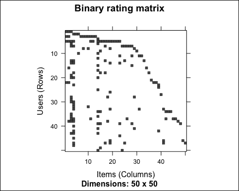

如预期的那样，矩阵是稀疏的。我们还可以可视化购买某个物品的用户数量的分布：

```py
n_users <- colCounts(ratings_matrix)
qplot(n_users) + stat_bin(binwidth = 100) + ggtitle("Distribution of the number of users")

```

下图显示了用户数量的分布：

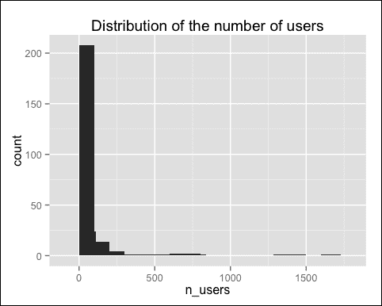

有一些异常值，即被许多用户购买的物品。让我们排除它们来可视化分布：

```py
qplot(n_users[n_users < 100]) + stat_bin(binwidth = 10) + ggtitle("Distribution of the number of users")

```

下图显示了用户数量的分布：

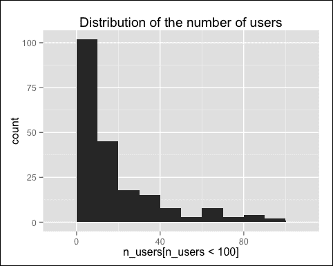

有许多物品只被少数用户购买，我们不会推荐它们。由于它们增加了计算时间，我们可以通过定义最小购买数量来删除它们，例如，`5`：

```py
ratings_matrix <- ratings_matrix[, colCounts(ratings_matrix) >= 5]
ratings_matrix
## 5000 x 166 rating matrix of class 'binaryRatingMatrix' with 15043 ratings.

```

现在，我们有 166 个项目，与最初的 236 个相比。至于用户，我们希望向每个人推荐项目。然而，可能有一些用户只购买了我们已经删除的项目。让我们检查一下：

```py
sum(rowCounts(ratings_matrix) == 0)
## _15_
```

有 15 个用户没有购买任何东西。这些购买应该被删除。此外，只购买了几件商品的用户的处理比较困难。因此，我们只保留至少购买过五件商品的用户：

```py
ratings_matrix <- ratings_matrix[rowCounts(ratings_matrix) >= 5, ]
ratings_matrix
## 959 x 166 rating matrix of class 'binaryRatingMatrix' with 6816 ratings

```

## 提取项目属性

`table_in`原始数据中包含一些以`A`开头的记录，并显示有关项目的一些信息。为了提取这些记录，我们可以将`table_in`转换为数据表，并提取第一列包含`A`的行：

```py
table_in <- data.table(table_in)
table_items <- table_in[V1 == "A"]
head(table_items)

```

| V1 | V2 | V3 | V4 | V5 |
| --- | --- | --- | --- | --- |
| `A` | `1277` | `1` | `NetShow for PowerPoint` | `/stream` |
| `A` | `1253` | `1` | `MS Word Development` | `/worddev` |
| `A` | `1109` | `1` | `TechNet (World Wide Web Edition)` | `/technet` |
| `A` | `1038` | `1` | `SiteBuilder Network Membership` | `/sbnmember` |
| `A` | `1205` | `1` | `Hardware Supprt` | `/hardwaresupport` |
| `A` | `1076` | `1` | `NT Workstation Support` | `/ntwkssupport` |

相关的列是：

+   **V2**: 项目 ID

+   **V4**: 项目描述

+   **V5**: 网页 URL

为了使表格更清晰，我们可以提取并重命名它们。此外，我们可以按项目 ID 对表格进行排序：

```py
table_items <- table_items[, c(2, 4, 5), with = FALSE]
setnames(table_items, 1:3, c("id", "description", "url"))
table_items <- table_items[order(id)]
head(table_items)

```

| id | description | url |
| --- | --- | --- |
| `1000` | `regwiz` | `/regwiz` |
| `1001` | `Support desktop` | `/support` |
| `1002` | `End user produced view` | `/athome` |
| `1003` | `Knowledge base` | `/kb` |
| `1004` | `Microsoft.com search` | `/search` |
| `1005` | `Norway` | `/norge` |

我们需要识别一个或多个描述项目的特征。如果我们看一下表格，我们可以识别出两种网页类别：

+   微软产品

+   地理位置信息

我们可以识别包含地理位置信息的记录，并将剩余的视为产品。为此，我们可以开始定义字段`category`，目前，对于所有记录，该字段等于`product`：

```py
table_items[, category := "product"]
```

国家代码包为我们提供了包含大多数国家名称的`countrycode_data`对象。我们可以定义一个包含国家和地理位置名称的`name_countries`向量。然后，我们可以将所有描述在`name_countries`中的记录分类为`region`：

```py
name_countries <- c(countrycode_data$country.name, "Taiwan", "UK", "Russia", "Venezuela", "Slovenija", "Caribbean", "Netherlands (Holland)", "Europe", "Central America", "MS North Africa")
table_items[description %in% name_countries, category := "region"]

```

有其他记录包含单词`region`。我们可以通过使用`grepl`的正则表达式来识别它们：

```py
table_items[grepl("Region", description), category := "region"]
head(table_items)

```

| V2 | description | url | category |
| --- | --- | --- | --- |
| `1000` | `regwiz` | `/regwiz` | `product` |
| `1001` | `Support Desktop` | `/support` | `product` |
| `1002` | `End User Produced View` | `/athome` | `product` |
| `1003` | `Knowledge Base` | `/kb` | `product` |
| `1004` | `Microsoft.com Search` | `/search` | `product` |
| `1005` | `Norway` | `/norge` | `region` |

让我们看一下结果，并找出每个类别中我们有多少个项目：

```py
table_items[, list(n_items = .N), by = category]

```

| category | n_items |
| --- | --- |
| `product` | `248` |
| `region` | `46` |

大约 80%的网页是产品，其余 20%是地区。

我们现在已准备好构建推荐模型。

# 构建模型

本节将向您展示如何使用商品描述和用户购买构建推荐模型。该模型结合了基于商品的协同过滤和一些关于商品的信息。我们将使用具有特征组合的单体混合系统包含商品描述。推荐器将在两个不同的阶段从两个数据源中学习。

按照第三章中描述的方法，第三章，*推荐系统*，让我们将数据分为训练集和测试集：

```py
which_train <- sample(x = c(TRUE, FALSE),size = nrow(ratings_matrix),replace = TRUE,prob = c(0.8, 0.2))recc_data_train <- ratings_matrix[which_train, ]
recc_data_test <- ratings_matrix[!which_train, ]

```

现在，我们可以使用`Recommender`构建一个 IBCF 模型。由于评分矩阵是二进制的，我们将距离方法设置为`Jaccard`。更多详情，请参阅第三章中关于第三章，*推荐系统*的*二进制数据上的协同过滤*部分。其余参数保持默认值：

```py
recc_model <- Recommender(data = recc_data_train,method = "IBCF",parameter = list(method = "Jaccard"))

```

IBCF 的引擎基于一个关于商品的相似度矩阵。距离是从购买中计算出来的。相同用户购买的物品越多，它们就越相似。

我们可以从槽模型中的`sim`元素中提取矩阵。让我们看看它：

```py
class(recc_model@model$sim)
## dgCMatrix
dim(recc_model@model$sim)
## _166_ and _166_
```

该矩阵属于`dgCMatrix`类，并且是方阵。我们可以使用`image`可视化它：

```py
image(recc_model@model$sim)
```

下面的图像是前面代码的输出：

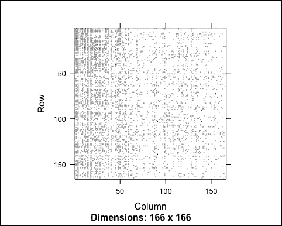

我们无法识别任何明显的模式，这是因为商品没有排序。让我们看看值的范围：

```py
range(recc_model@model$sim)
## _0_ and _1_
```

所有距离都在 0 到 1 之间。

我们的目标是将距离矩阵与商品描述结合，通过以下步骤：

1.  基于购买定义一个相似度矩阵。

1.  基于商品描述定义一个相似度矩阵。

1.  结合两个矩阵。

从`recc_model`开始，我们可以定义购买相似度矩阵。我们所需做的只是将`dgCMatrix`对象转换为`matrix`：

```py
dist_ratings <- as(recc_model@model$sim, "matrix")
```

为了根据商品描述构建矩阵，我们可以使用`dist`函数。鉴于它仅基于类别列，距离将如下所示：

+   1，如果两个商品属于同一类别

+   0，如果两个商品属于不同类别

我们需要构建一个相似度矩阵，我们有一个距离矩阵。由于距离在 0 到 1 之间，我们可以直接使用`1 - dist()`。所有操作都在数据表中执行：

```py
dist_category <- table_items[, 1 - dist(category == "product")]class(dist_category)
## dist

```

`dist_category`原始数据是一个`dist`对象，可以使用`as()`函数轻松转换为矩阵：

```py
dist_category <- as(dist_category, "matrix")

```

让我们比较`dist_category`和`dist_ratings`的维度：

```py
dim(dist_category)
## _294_ and _294_
dim(dist_ratings)
## _166_ and _166_
```

`dist_category`表有更多的行和列，原因是它包含所有商品，而`dist_ratings`只包含那些已经被购买的商品。

为了将`dist_category`与`dist_ratings`结合，我们需要有相同的项。此外，它们需要按相同的方式排序。我们可以使用以下步骤使用项目名称匹配它们：

1.  确保两个矩阵的行和列名中都包含项目名称。

1.  从`dist_ratings`中提取行和列名。

1.  根据`dist_ratings`的名称子集和排序`dist_category`。

`dist_ratings`表格已经包含了行和列名。我们需要从`table_items`开始将它们添加到`dist_category`中：

```py
rownames(dist_category) <- table_items[, id]
colnames(dist_category) <- table_items[, id]

```

现在，我们只需要从`dist_ratings`中提取名称并子集`dist_category`：

```py
vector_items <- rownames(dist_ratings)
dist_category <- dist_category[vector_items, vector_items]

```

让我们检查两个矩阵是否匹配：

```py
identical(dim(dist_category), dim(dist_ratings))
## TRUE
identical(rownames(dist_category), rownames(dist_ratings))
## TRUE
identical(colnames(dist_category), colnames(dist_ratings))
## TRUE
```

一切都是相同的，所以它们匹配。让我们看看`dist_category`：

```py
image(dist_category)
```

下面的图像是前面代码的输出：

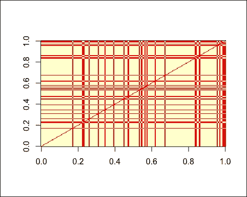

矩阵只包含 0 和 1，它基于两个类别，因此有明显的模式。此外，我们可以注意到矩阵是对称的。

我们需要合并两个表，我们可以通过加权平均来实现。由于`dist_category`只考虑两种项目类别，因此最好不要给它太多的相关性。例如，我们可以将其权重设置为 25%：

```py
weight_category <- 0.25
dist_tot <- dist_category * weight_category + dist_ratings * (1 - weight_category)

```

让我们看看使用`image`的`dist_tot`矩阵：

```py
image(dist_tot)
```

下面的图像是前面代码的输出：

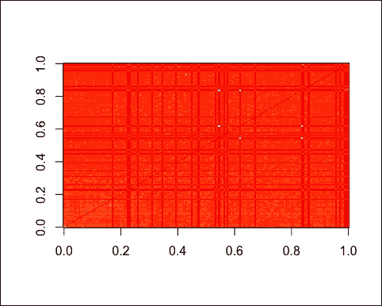

我们可以看到一些代表非常相似项目的白色点。此外，我们还可以在背景中看到`dist_category`的模式。

现在，我们可以在`recc_model`中包含新的矩阵。为此，将`dist_tot`转换为`dgCMatrix`并插入到`recc_model`中：

```py
recc_model@model$sim <- as(dist_tot, "dgCMatrix")
recc_model@model$sim <- as(dist_tot, "dgCMatrix")

```

如第三章中所示，*推荐系统*，我们可以使用`predict()`来推荐项目：

```py
n_recommended <- 10
recc_predicted <- predict(object = recc_model, newdata = recc_data_test, n = n_recommended)

```

`recc_predicted`的`itemLabels`槽包含项目名称，即它们的代码：

```py
head(recc_predicted@itemLabels)

1038, 1026, 1034, 1008, 1056 and 1032
```

为了显示项目描述，我们可以使用`table_items`。我们只需要确保项目按与`itemLabels`相同的方式排序。为此，我们将准备一个包含项目信息的数据框。我们还将确保它按项目标签的相同方式排序，以下步骤：

1.  定义一个包含有序项目标签列的数据框。

    ```py
    table_labels <- data.frame(id = recc_predicted@itemLabels)

    ```

1.  在`table_labels`和`table_items`之间进行左连接。注意参数`sort = FALSE`不允许我们重新排序表格：

    ```py
    table_labels <- merge(table_labels, table_items,
     by = "id", all.x = TRUE, all.y = FALSE,
     sort = FALSE)

    ```

1.  将描述从因子转换为字符：

    ```py
    descriptions <- as(table_labels$description, "character")

    ```

让我们看看`table_labels`：

```py
head(table_labels)
```

| id | description | url | category |
| --- | --- | --- | --- |
| `1038` | `SiteBuilder Network Membership` | `/sbnmember` | `product` |
| `1026` | `Internet Site Construction for Developers` | `/sitebuilder` | `product` |
| `1034` | `Internet Explorer` | `/ie` | `product` |
| `1008` | `Free Downloads` | `/msdownload` | `product` |
| `1056` | `sports` | `/sports` | `product` |
| `1032` | `Games` | `/games` | `product` |

如预期的那样，表格包含了项目的描述。现在，我们能够提取推荐。例如，我们可以为第一个用户做这件事：

```py
recc_user_1 <- recc_predicted@items[[1]]
items_user_1 <- descriptions[recc_user_1]
head(items_user_1)

```

Windows 操作系统系列、支持桌面、知识库、Microsoft.com 搜索、产品、Windows 95。

现在，我们可以定义一个包含对所有用户推荐的表格。每一列对应一个用户，每一行对应一个推荐的项目。将 `n_recommended` 设置为 `10` 后，表格应该有 10 行。为此，我们可以使用 `sapply()`。对于 `recc_predicted@items` 的每个元素，我们识别相关的项目描述。

然而，每个用户被推荐的项目数量是一个介于 1 到 10 之间的数字，对每个用户来说都不相同。为了定义一个有 10 行的结构化表格，我们需要每个用户有相同数量的元素。因此，我们将缺失的推荐替换为空字符串。我们可以通过使用 `rep()` 来复制空字符串来获得它：

```py
recc_matrix <- sapply(recc_predicted@items, function(x){
 recommended <- descriptions[x]
 c(recommended, rep("", n_recommended - length(recommended)))
})
dim(recc_matrix)
## _10_ and _191_

```

让我们看看前三个用户的推荐：

```py
head(recc_matrix[, 1:3])

```

| Windows 操作系统系列 | 产品 | 开发者工作坊 |
| --- | --- | --- |
| 支持桌面 | MS Word | 站点构建网络会员 |
| 知识库 | isapi | isapi |
| Microsoft.com 搜索 | regwiz | Microsoft.com 搜索 |
| 产品 | Windows 操作系统系列 | Windows 操作系统系列 |
| Windows 95 | Microsoft.com 搜索 | 网站构建者画廊 |

我们可以注意到，有些项目被推荐给了三个用户：产品和支持桌面。因此，我们怀疑有些项目更有可能被推荐。

就像我们在第三章中做的那样，*推荐系统*，我们可以探索输出。对于每个项目，我们可以计算它被推荐了多少次：

```py
table_recomm_per_item <- table(recc_matrix)
recomm_per_item <- as(table_recomm_per_item, "numeric")

```

为了可视化结果，我们使用 `cut()` 对 `bin_recomm_per_item` 进行操作：

```py
bin_recomm_per_item <- cut(recomm_per_item,breaks = c(0, 10, 20, 100,max(recomm_per_item)))

```

使用 `qplot`，我们可以可视化 `recomm_per_item` 的分布：

```py
qplot(bin_recomm_per_item) + ggtitle("Recommendations per item")
```

以下图像显示了每个项目的推荐：

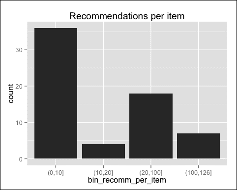

大多数项目被推荐了 10 次或更少，而其中一些项目被推荐了超过 100 次。分布具有长尾。

我们还可以通过排序 `recomm_per_item` 来识别最受欢迎的项目：

```py
recomm_per_item_sorted <- sort(table_recomm_per_item,decreasing = TRUE) recomm_per_item_top <- head(recomm_per_item_sorted, n = 4)
table_top <- data.frame(
 name = names(recomm_per_item_top), n_recomm = recomm_per_item_top)
table_top

```

| 名称 | n_recomm |
| --- | --- |
| `Internet Explorer` | `126` |
| `Windows 操作系统系列` | `120` |
| `知识库` | `118` |
| `产品` | `115` |

在本节中，我们构建并探索了一个混合推荐模型。下一步是评估它并优化其参数。

# 评估和优化模型

本节将向您展示如何评估我们推荐系统的性能。从评估开始，我们可以尝试一些参数配置，并选择表现最好的一个。有关更多详细信息，请参阅第四章，*评估推荐系统*。

以下是对模型进行评估和优化的步骤：

+   构建一个给定参数配置评估模型的函数

+   使用该函数测试不同的参数配置，并选择最佳配置

让我们详细地走一遍这些步骤。

## 构建一个用于评估模型的函数

本节将向您展示如何定义一个函数：

1.  使用*k*-折设置交叉验证。

1.  构建一个混合 IBCF。

1.  向测试集中的用户推荐项目。

1.  评估推荐。

我们函数的输入如下：

+   **数据**：这是包含项目描述的评分矩阵表

+   **k-折参数**：这是折数，测试集中保留的项目数

+   **模型参数**：这是最近邻的数量，基于描述的距离权重，推荐的项目数量

让我们定义函数参数。您可以在每个参数名称旁边的注释中找到每个参数的描述：

```py
evaluateModel <- function (
 # data inputs
 ratings_matrix, # rating matrix
 table_items, # item description table
 # K-fold parameters
 n_fold = 10, # number of folds
 items_to_keep = 4, # number of items to keep in the test set
 # model parameters
 number_neighbors = 30, # number of nearest neighbors
 weight_description = 0.2, # weight to the item description-based distance
 items_to_recommend = 10 # number of items to recommend
){
 # build and evaluate the model
}

```

现在，我们可以一步一步地遍历函数体。对于更详细的解释，请参阅上一节和第四章，*评估推荐系统*：

1.  使用`evaluationScheme()`函数设置*k*-折。参数*k*和给定分别根据输入`n_fold`和`items_to_keep`设置。`set.seed(1)`命令确保示例可重复，也就是说，如果重复执行，随机成分将是相同的：

    ```py
    set.seed(1)
    eval_sets <- evaluationScheme(data = ratings_matrix,
     method = "cross-validation",
     k = n_fold,
     given = items_to_keep)

    ```

1.  使用`Recommender()`构建一个定义距离函数为`Jaccard`和*k*参数为`number_neighbors`输入的 IBCF：

    ```py
    recc_model <- Recommender(data = getData(eval_sets, "train"),
     method = "IBCF",
     parameter = list(method = "Jaccard",
     k = number_neighbors))

    ```

1.  从`recc_model`模型中提取基于评分的距离矩阵：

    ```py
    dist_ratings <- as(recc_model@model$sim, "matrix")
    vector_items <- rownames(dist_ratings)

    ```

1.  从`table_items`输入开始，定义基于描述的距离矩阵：

    ```py
    dist_category <- table_items[, 1 - as.matrix(dist(category == "product"))]
    rownames(dist_category) <- table_items[, id]
    colnames(dist_category) <- table_items[, id]
    dist_category <- dist_category[vector_items, vector_items]

    ```

1.  定义结合`dist_ratings`和`dist_category`的距离矩阵。组合是加权平均，权重由`weight_description`输入定义：

    ```py
    dist_tot <- dist_category * weight_description +
     dist_ratings * (1 - weight_description)
    recc_model@model$sim <- as(dist_tot, "dgCMatrix")

    ```

1.  预测具有已知购买的测试集用户。由于我们使用的是只有 0 和 1 评分的表格，我们可以指定使用`type = "topNList"`参数预测前`n`个推荐项。定义推荐项目数量的参数`n`来自`items_to_recommend`输入：

    ```py
    eval_prediction <- predict(object = recc_model, newdata = getData(eval_sets, "known"), n = items_to_recommend, type = "topNList")

    ```

1.  使用`calcPredictionAccuracy()`评估模型性能。指定`byUser = FALSE`，我们得到一个包含平均指标（如精确率和召回率）的表格：

    ```py
    eval_accuracy <- calcPredictionAccuracy(
     x = eval_prediction,
     data = getData(eval_sets, "unknown"),
     byUser = FALSE,
     given = items_to_recommend)

    ```

1.  函数输出是`eval_accuracy`表：

    ```py
    return(eval_accuracy)

    ```

1.  现在，我们可以测试我们的函数：

    ```py
    model_evaluation <- evaluateModel(ratings_matrix = ratings_matrix, table_items = table_items)
    model_evaluation

    ```

    | index | value |
    | --- | --- |
    | `TP` | `2` |
    | `FP` | `8` |
    | `FN` | `1` |
    | `TN` | `145` |
    | `precision` | `19%` |
    | `recall` | `64%` |
    | `TPR` | `64%` |
    | `FPR` | `5%` |

您可以在第四章中找到索引的详细描述，*评估推荐系统*。

在本节中，我们定义了一个使用给定设置的函数来评估我们的模型。这个函数将帮助我们进行参数优化。

## 优化模型参数

从我们的 `evaluateModel()` 函数开始，我们可以优化模型参数。在本节中，我们将优化以下参数：

+   `number_neighbors`：这是 IBCF 的最近邻数量

+   `weight_description`：这是分配给基于描述的距离的权重

尽管我们可以优化其他参数，但为了简化，我们将它们保留为默认值。

我们的推荐模型结合了 IBCF 和项目描述。因此，首先优化 IBCF 是一个好习惯，即`number_neighbors`参数。

首先，我们必须决定我们想要测试哪些值。我们考虑 k，即最多为商品的一半，即大约`80`。另一方面，我们排除小于 4 的值，因为算法将过于不稳定。设置粒度为`2`，我们可以生成一个包含要测试的值的向量：

```py
nn_to_test <- seq(4, 80, by = 2)

```

现在，我们可以根据 `number_neighbors` 来衡量性能。由于我们只优化 IBCF 部分，我们将 `weight_description = 0`。使用 `lapply`，我们可以构建一个包含每个 `nn_to_test` 值的性能的元素列表：

```py
list_performance <- lapply(
 X = nn_to_test,
 FUN = function(nn){
 evaluateModel(ratings_matrix = ratings_matrix, table_items = table_items, number_neighbors = nn, weight_description = 0)
 })

```

让我们看看列表的第一个元素：

```py
list_performance[[1]]

```

| name | value |
| --- | --- |
| `TP` | `1.663` |
| `FP` | `8.337` |
| `FN` | `1.683` |
| `TN` | `144.3` |
| `精确度` | `0.1663` |
| `召回率` | `0.5935` |
| `TPR` | `0.5935` |
| `FPR` | `0.05449` |

第一个元素包含所有性能指标。为了评估我们的模型，我们可以使用精确度和召回率。参见第四章，*评估推荐系统*获取更多信息。

我们可以使用 `sapply` 提取精确度（或召回率）的向量：

```py
sapply(list_performance, "[[", "precision")^t

0.1663, 0.1769, 0.1769, 0.175, 0.174, 0.1808, 0.176, 0.1779, 0.1788, 0.1788, 0.1808, 0.1817, 0.1817, 0.1837, 0.1846, 0.1837, 0.1827, 0.1817, 0.1827, 0.1827, 0.1817, 0.1808, 0.1817, 0.1808, 0.1808, 0.1827, 0.1827, 0.1837, 0.1827, 0.1808, 0.1798, 0.1798, 0.1798, 0.1798, 0.1798, 0.1798, 0.1788, 0.1788 and 0.1788

```

为了分析输出，我们可以定义一个表格，其列包括 `nn_to_test`、精确度和召回率：

```py
table_performance <- data.table(
 nn = nn_to_test, precision = sapply(list_performance, "[[", "precision"), recall = sapply(list_performance, "[[", "recall")
)

```

此外，我们可以定义一个性能指数，我们将对其进行优化。性能指数可以是精确度和召回率之间的加权平均值。权重取决于用例，因此我们可以将其保留为 50%：

```py
weight_precision <- 0.5
table_performance[
 performance := precision * weight_precision + recall * (1 - weight_precision)]
head(table_performance)

```

| nn | 精确度 | 召回率 | 性能 |
| --- | --- | --- | --- |
| `4` | `0.1663` | `0.5935` | `0.3799` |
| `6` | `0.1769` | `0.621` | `0.399` |
| `8` | `0.1769` | `0.5973` | `0.3871` |
| `10` | `0.175` | `0.5943` | `0.3846` |
| `12` | `0.174` | `0.5909` | `0.3825` |
| `14` | `0.1808` | `0.6046` | `0.3927` |

精确度是推荐商品中已购买的比例，召回率是已购买商品中被推荐的比例。

`table_performance` 表格包含所有评估指标。从它开始，我们可以构建图表，帮助我们确定最优的 `nn`。

在构建图表之前，让我们定义一个 `convertIntoPercent()` 函数，我们将在 `ggplot2` 函数中使用它：

```py
convertIntoPercent <- function(x){
 paste0(round(x * 100), "%")
}

```

我们已经准备好构建图表。第一个图表是基于 `nn` 的精确度。我们可以使用以下函数构建它：

+   `qplot`：这个函数用于构建散点图。

+   `geom_smooth`：这添加了一条平滑线。

+   `scale_y_continuous`：这改变了`y`轴的刻度。在我们的例子中，我们只想显示百分比。

以下命令包括前面的点：

```py
 qplot(table_performance[, nn], table_performance[, precision]) + geom_smooth() + scale_y_continuous(labels = convertIntoPercent)

```

以下图像是前面代码的输出：

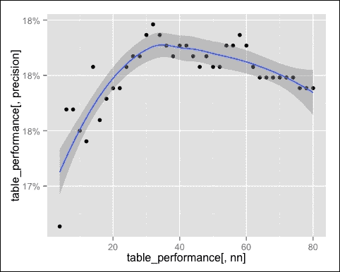

平滑的线条增长到全局最大值，大约在`nn = 35`，然后缓慢下降。这个指标表示成功推荐的百分比，因此当与广告相关的成本较高时很有用。

让我们看看召回率，使用相同的命令：

```py
 qplot(table_performance[, nn], table_performance[, recall]) + geom_smooth() + scale_y_continuous(labels = convertIntoPercent)

```

以下图像是前面屏幕截图的输出：

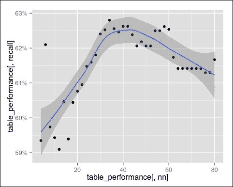

最大召回率大约在`nn = 40`。这个指标表示我们推荐的购买百分比，因此如果我们想确保预测大多数购买很有用。

性能同时考虑了精确度和召回率。让我们看看它：

```py
 qplot(table_performance[, nn], table_performance[, performance]) + geom_smooth() + scale_y_continuous(labels = convertIntoPercent)

```

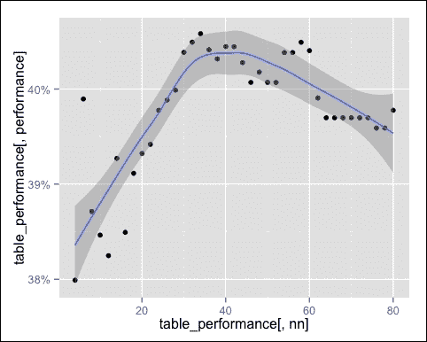

最佳性能在 30 到 45 之间。我们可以使用`which.max`识别最佳的`nn`：

```py
row_best <- which.max(table_performance$performance)
number_neighbors_opt <- table_performance[row_best, nn]
number_neighbors_opt
## _34_

```

最佳值是`34`。我们优化了 IBCF 参数，下一步是确定项目描述组件的权重。首先，让我们定义要尝试的权重。可能的权重范围在 0 到 1 之间，我们只需要设置粒度，例如，`0.05`：

```py
wd_to_try <- seq(0, 1, by = 0.05)

```

使用`lapply`，我们可以根据权重测试推荐器：

```py
list_performance <- lapply(
 X = wd_to_try, FUN = function(wd){
 evaluateModel(ratings_matrix = ratings_matrix, table_items = table_items, number_neighbors = number_neighbors_opt, weight_description = wd) })

```

就像我们之前做的那样，我们可以构建一个包含精确度、召回率和性能的表格：

```py
table_performance <- data.table(
 wd = wd_to_try, precision = sapply(list_performance, "[[", "precision"), recall = sapply(list_performance, "[[", "recall")
)
table_performance[
 performance := precision * weight_precision + recall * (1 - weight_precision)]

```

现在，我们可以通过图表可视化基于权重的性能：

```py
 qplot(table_performance[, wd], table_performance[, performance]) + geom_smooth() + scale_y_continuous(labels = convertIntoPercent)

```

以下图像是前面命令的输出：

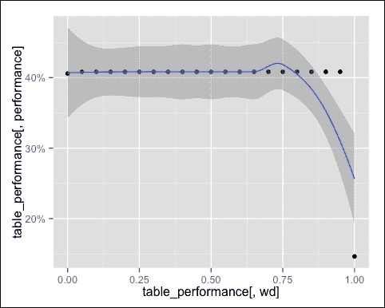

性能在每个点上都是相同的，除了极端值。因此，平滑线没有用。

我们得到了考虑评分和描述的最佳性能。极端的**0.00**对应于纯 IBCF，它的表现略逊于混合模型。极端的**1.00**模型仅基于项目描述，这就是为什么它的表现如此糟糕。

性能变化不大的原因是项目描述仅基于二进制特征。如果我们添加其他特征，我们将看到更大的影响。

这一节向您展示了如何基于两个参数优化我们的推荐算法。下一步可以是基于剩余的 IBCF 参数优化并改进项目描述。

# 摘要

本章向您展示了如何在现实生活场景中应用这些技术。我们从原始的非结构化数据开始，构建了一个评分矩阵，这是协同过滤的输入。此外，我们还提取了项目描述，这提高了我们模型的表现。通过性能评估，我们优化了模型参数。如果适当细化，这种方法也可以应用于现实生活场景。

本书是一条路径，首先展示了机器学习的基础知识，然后是实际应用。阅读完本书后，您将能够应对现实生活中的挑战，确定最合适的推荐解决方案。感谢您一直跟随到这里。

如果您有任何疑问，请随时联系我们。
