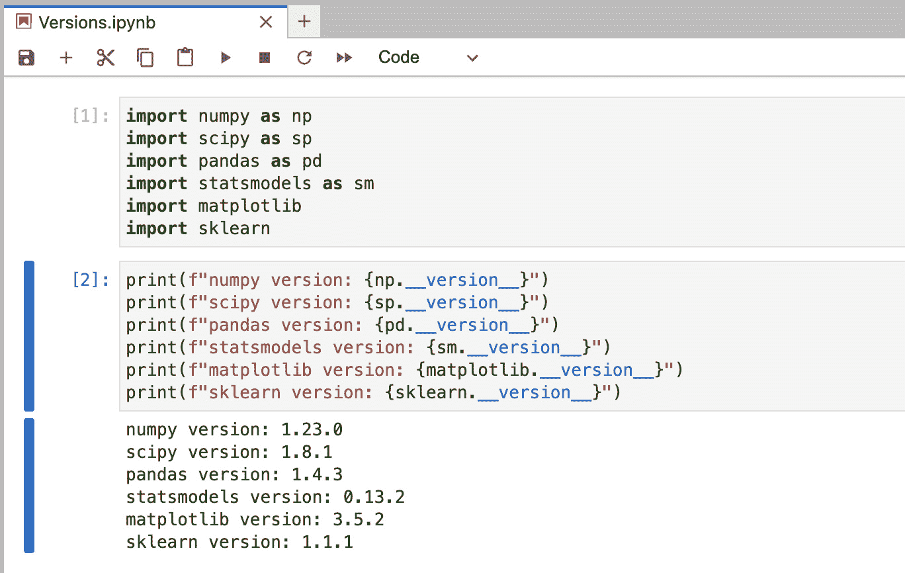
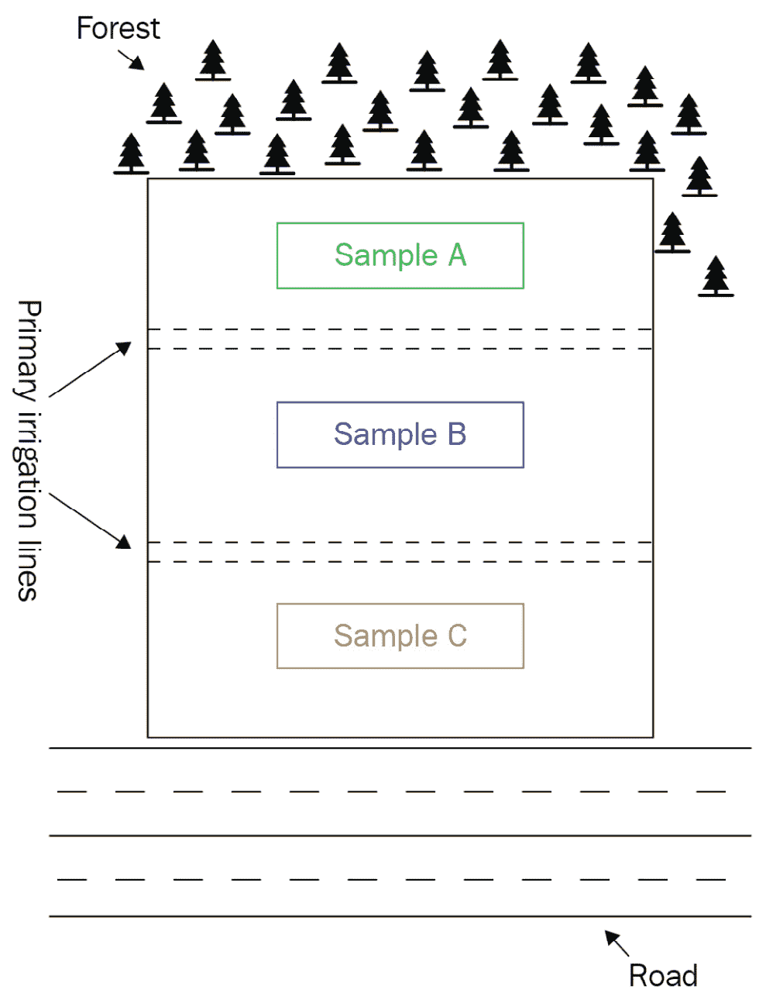
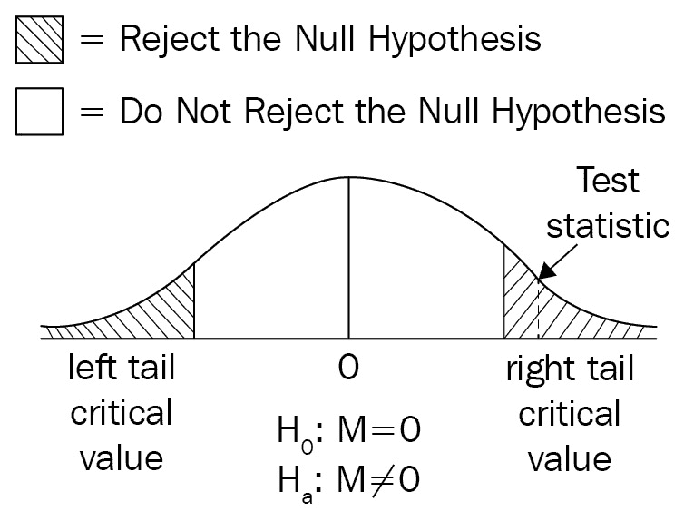
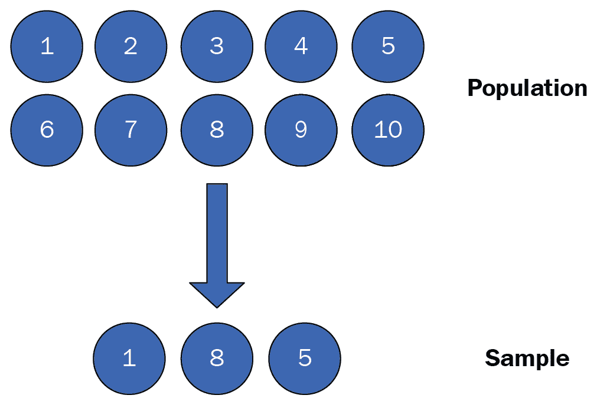
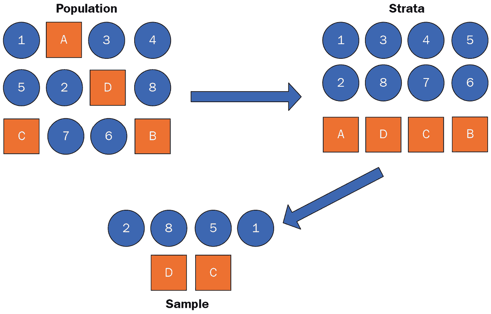
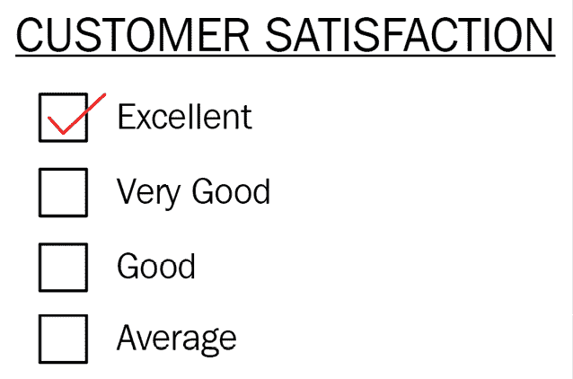

# 第一章：采样和泛化

在本章中，我们将描述种群的概念以及从种群中进行采样的方法，包括一些常见的采样策略。关于采样的讨论将引出描述泛化的部分。泛化将讨论其与使用样本对其各自种群做出结论的关系。在统计推断建模时，确保样本可以推广到种群是必要的。我们将通过本章的主题深入概述这一桥梁。

我们将涵盖以下主要主题：

+   软件和环境设置

+   总体与样本

+   从样本中进行总体推断

+   采样策略 – 随机、系统性和分层

# 软件和环境设置

**Python** 是数据科学和机器学习中最受欢迎的编程语言之一，这得益于推动这些库发展的庞大开源社区。Python 的易用性和灵活性使其成为数据科学领域的首选语言，在数据科学领域，实验和迭代是开发周期的关键特征。尽管有新的语言正在开发中用于数据科学应用，例如 **Julia**，但由于其广泛的开源项目，支持从统计建模到深度学习等应用，Python 目前仍然是数据科学的关键语言。我们选择在本书中使用 Python，因为它在数据科学中的地位重要，并且在就业市场上需求量大。

Python 可用于所有主要操作系统：Microsoft Windows、macOS 和 Linux。此外，安装程序和文档可在官方网站找到：[`www.python.org/`](https://www.python.org/)。

本书是为 Python 3.8 版本（或更高版本）编写的。建议您使用可用的最新 Python 版本。本书中的代码不太可能与 Python 2.7 兼容，并且大多数活跃的库已经从 2020 年官方支持结束以来开始停止对 Python 2.7 的支持。

本书使用的库可以使用 Python 包管理器 `pip` 安装，它是当代 Python 标准库的一部分。有关 `pip` 的更多信息，请参阅此处：[`docs.python.org/3/installing/index.xhtml`](https://docs.python.org/3/installing/index.xhtml)。安装 `pip` 后，可以在命令行中使用 `pip` 安装包。以下是一些基本用法：

使用最新版本安装新包：

```py
pip install SomePackage
```

使用特定版本安装包，例如本例中的版本 `2.1`：

```py
pip install SomePackage==2.1
```

已安装的包可以使用 `--upgrade` 标志进行升级：

```py
pip install SomePackage –upgrade
```

通常情况下，建议在项目之间使用 Python 虚拟环境，并将项目依赖项与系统目录分开。Python 提供了一个虚拟环境工具 `venv`，它像 `pip` 一样是 Python 当代版本标准库的一部分。虚拟环境允许您创建独立的 Python 二进制文件，其中每个 Python 二进制文件都有其自己的安装依赖项集。使用虚拟环境可以防止在处理多个 Python 项目时出现包版本问题和冲突。有关设置和使用虚拟环境的详细信息，请参阅：[`docs.python.org/3/library/venv.xhtml`](https://docs.python.org/3/library/venv.xhtml)。

虽然我们推荐使用 Python 和 Python 的虚拟环境进行环境设置，但一个高度推荐的替代方案是 **Anaconda**。Anaconda 是由 Anaconda Inc.（之前为 Continuum Analytics）提供的免费（企业级）分析型 Python 发行版。Anaconda 发行版包含了许多核心数据科学包、常见的 IDE（如 **Jupyter** 和 **Visual Studio Code**）以及用于管理环境的图形用户界面。Anaconda 可以通过在 Anaconda 网站上找到的安装程序进行安装：[`www.anaconda.com/products/distribution`](https://www.anaconda.com/products/distribution)。

Anaconda 自带其自己的包管理器 `conda`，它可以像 `pip` 一样用于安装新包。

使用最新版本安装新包：

```py
conda install SomePackage
```

升级已安装的包：

```py
conda upgrade SomePackage
```

在本书的整个过程中，我们将使用 Python 数据科学生态系统中的一些核心库，例如 `NumPy` 用于数组操作，`pandas` 用于高级数据操作，以及 `matplotlib` 用于数据可视化。本书使用的包版本包含在以下列表中。请确保您环境中安装的版本等于或高于列表中列出的版本。这将有助于确保代码示例能够正确运行：

+   `statsmodels 0.13.2`

+   `Matplotlib 3.5.2`

+   `NumPy 1.23.0`

+   `SciPy 1.8.1`

+   `scikit-learn 1.1.1`

+   `pandas 1.4.3`

本书代码中使用的包在此处以 *图 1**.1* 的形式展示。可以使用 `__version__` 方法在代码中打印包版本。



图 1.1 – 本书使用的包版本

在为本书搭建好技术环境之后，让我们进入统计学的讨论。在接下来的章节中，我们将讨论总体和抽样的概念。我们将通过代码实现来演示抽样策略。

# 总体与样本

通常，统计模型的目标是通过对该群体进行推断来回答关于该群体的问题。我们进行推断的群体可能是生产工厂中的机器、选举中投票的人，或者不同地块上的植物。整个群体，每个单独的项目或实体，被称为**总体**。在大多数情况下，感兴趣的总体非常大，以至于收集总体中每个实体的数据既不实际也不可能。例如，使用投票的例子，可能无法对选举中投票的每个人进行调查。即使有可能接触到感兴趣的选举的所有选民，许多选民可能不会同意调查，这将阻止对整个总体的收集。另一个考虑因素是调查如此大群体的费用。这些因素使得在我们的投票调查示例中收集总体统计数据实际上是不可能的。在我们可能想要评估总体属性的情况下，存在许多这类禁止性因素。幸运的是，我们不需要收集感兴趣总体中的所有数据。可以使用总体的一部分来进行关于总体的推断。这个总体的子集被称为**样本**。这是统计模型的主要思想。将使用样本创建模型，并对总体进行推断。

为了使用样本对感兴趣的总体进行有效的推断，样本必须代表感兴趣的总体，这意味着样本应该包含在总体中发现的变异。例如，如果我们对田野中的植物感兴趣，那么来自田野一个角落的样本可能不足以对更大的总体进行推断。整个田野中植物特征可能会有所不同。我们可以考虑各种可能存在变异的原因。对于这个例子，我们将考虑来自*图 1.2*的一些例子。



图 1.2 – 植物田地

该图显示**样本 A**靠近森林。这个样本区域可能受到森林存在的影响；例如，该样本中的一些植物可能比其他样本中的植物接收到的阳光更少。**样本 B**显示位于主要灌溉线之间。可以想象这个样本平均接收到的水可能比其他两个样本多，这可能会影响这个样本中的植物。最后的**样本 C**靠近道路。这个样本可能看到在**样本 A**或**样本 B**中看不到的其他影响。

如果样本只从这些部分中的一个抽取，那么从这些样本中得出的推断将会是*有偏的*，并且不会提供关于人群的有效参考。因此，需要从整个领域抽取样本，以创建一个更有可能代表植物人群的样本。在从人群抽取样本时，确保抽样方法对可能的问题具有鲁棒性，例如前例中灌溉和遮荫的影响，是至关重要的。每次从人群抽取样本时，都重要的是要识别和减轻可能的偏差影响，因为数据中的偏差会影响你的模型并歪曲你的结论。

在下一节中，将讨论从数据集中进行抽样的各种方法。另一个考虑因素是样本大小。样本大小影响我们可以使用的统计工具类型，关于样本的分布假设，以及推断和预测的置信度。样本大小的影响将在*第二章**，数据分布*和*第三章**，*假设检验*中深入探讨。

# 从样本中进行人群推断

当使用统计模型从该人群的样本子集中对人群进行推断性结论时，研究设计必须考虑到其变量与人群中的变量具有相似的不确定性程度。这就是本章前面提到的变异。为了适当地对人群进行推断性结论，任何统计模型都必须围绕一个随机机制来构建。围绕这些随机机制构建的研究被称为**随机实验**，并提供了对相关性和因果关系的理解。

## 随机实验

随机实验有两个主要特征：

+   随机抽样，俗称随机选择

+   治疗的随机分配，这是研究的本质

### 随机抽样

随机抽样（也称为随机选择）旨在创建一个代表总体人口的样本，以便统计模型能够足够好地推广总体，从而分配因果关系的结果。为了使随机抽样成功，感兴趣的总体必须定义良好。从总体中抽取的所有样本都必须有被选中的机会。在考虑民意调查选民的情况时，所有选民都必须愿意接受调查。一旦所有选民都进入彩票，就可以使用随机抽样来对选民进行子集建模。仅从愿意接受调查的选民中进行抽样会引入统计模型中的抽样偏差，这可能导致结果偏斜。只有一些选民愿意参与的情景中的抽样方法被称为**自我选择**。从自我选择的样本——或任何非随机样本——中获得并建模的信息不能用于推断。

### 治疗的随机分配

治疗的随机分配涉及两个动机：

+   第一个动机是了解特定的输入变量及其对响应的影响——例如，了解将治疗 A 分配给特定个体是否可能比安慰剂产生更理想的结果。

+   第二个动机是消除外部变量对研究结果的影响。这些被称为**混杂变量**（或**混杂因素**）的外部变量很重要，因为它们往往难以控制。它们可能具有不可预测的值，甚至可能对研究者来说是未知的。包括混杂变量的后果是，研究的结果可能无法复制，这可能是代价高昂的。虽然混杂变量可以影响结果，但它们也可以影响输入变量，以及这些变量之间的关系。

回顾前一小节中的例子，即*总体与样本*，考虑一位农民决定开始在他的作物上使用杀虫剂，并想要测试两种不同的品牌。这位农民知道土地上有三个不同的区域；地块 A、地块 B 和地块 C。为了确定杀虫剂的成功率并防止作物受损，农民从每个地块随机选择 60 株植物进行测试（这被称为**分层随机抽样**，即在每个地块上进行分层随机抽样）。这个选择代表了植物总体。从这个选择中，农民对他的植物进行标记（标记不需要是随机的）。对于每个地块，农民将标签随机放入袋子中，以随机化它们，然后开始选择 30 株植物。前 30 株植物接受一种处理，另外 30 株接受另一种处理。这是*随机分配的处理*。假设三个单独的地块代表了一组不同的混杂变量对作物产量的影响，农民将拥有足够的信息来对每个杀虫剂品牌的作物产量进行推断。

## 观察性研究

常见的另一种统计研究类型是**观察性研究**，其中研究人员通过观察已有的数据来寻求了解。观察性研究有助于理解输入变量及其与目标和彼此之间的关系，但不能像随机实验那样提供因果关系理解。观察性研究可能具有随机实验的两个组成部分之一——要么是随机抽样，要么是随机分配的处理——但没有这两个组成部分，将不会直接产生推断。有许多原因可能导致进行观察性研究而不是随机实验，例如以下情况：

+   随机实验成本过高

+   实验的伦理限制（例如，确定怀孕期间吸烟导致出生缺陷发生率的实验）

+   使用先前随机实验的数据，从而消除了进行另一项实验的需要

从观察性研究中推导出一些因果关系的 一种方法是进行随机抽样和重复分析。重复随机抽样和分析可以帮助最小化混杂变量随时间的影响。这个概念在*大数据*和*机器学习*的有用性中扮演着巨大的角色，这两者在本世纪许多行业中都获得了很大的重视。虽然几乎任何可以用于观察性分析的工具也可以用于随机实验，但本书主要关注的是观察性分析的工具，因为在大多数行业中这更为常见。

可以说，统计学是一门帮助在存在可量化不确定性时做出最佳决策的科学。所有统计检验都包含一个零假设和一个备择假设。也就是说，一个假设数据之间没有统计学上显著的差异（零假设）或者数据之间存在统计学上显著的差异（备择假设）。统计学上显著差异这一术语意味着存在一个基准——或阈值——超过这个基准，一个度量就会发生并表明其显著性。这个基准被称为**临界值**。

应用到这个临界值上的度量被称为**检验统计量**。临界值是基于数据中的行为（如平均值和变异）量化的静态值，并基于假设。如果有两条可能的路径可以拒绝零假设——例如，我们相信某些输出要么小于平均值，要么大于平均值——将有两个临界值（这种检验称为**双尾**假设检验），但如果只有一条反对零假设的论据，则只有一个临界值（这称为**单尾**假设检验）。无论临界值的数量有多少，在给定的假设检验中，每个组内都只有一个检验统计量度量。如果检验统计量超过临界值，就有统计学上显著的依据来支持拒绝零假设，并得出数据之间存在统计学上显著差异的结论。

有必要理解假设检验可以检验以下内容：

+   一个变量对另一个变量（例如，在 t 检验中）

+   多个变量对一个变量（例如，线性回归）

+   多个变量对多个变量（例如，多变量方差分析）

在下面的图中，我们可以直观地看到检验统计量与双尾假设检验中的临界值之间的关系。



图 1.3 – 双尾假设检验中临界值与检验统计量之间的关系

根据图示，我们现在对检验统计量超过临界值表明拒绝零假设有了直观的认识。

然而，仅使用将测试统计量与假设中的临界值进行比较的方法，存在一个担忧，即测试统计量可能过大，不切实际。这种情况可能发生在结果范围很广，而这些结果被认为不属于治疗效果范围时。是否可能得到与测试统计量一样极端或更极端的结果尚不确定。为了防止错误地拒绝零假设，使用了**p 值**。p 值表示仅凭偶然导致观察到的值（表明拒绝零假设的值）的概率。如果 p 值相对于显著性水平较低，则可以拒绝零假设。常见的显著性水平为 0.01、0.05 和 0.10。在做出关于假设的决定之前，评估临界值与测试统计量之间的关系以及 p 值是有益的。更多内容将在*第三章**，假设检验*中讨论，当我们开始讨论假设检验时。

# 抽样策略 – 随机、系统、分层和聚类

在本节中，我们将讨论在研究中使用的不同抽样方法。总的来说，在现实世界中，由于许多原因，很难或不可能获取整个总体数据。例如，收集数据的成本在金钱和时间上都很昂贵。在许多情况下，收集所有数据是不切实际的，而且还要考虑伦理问题。从总体中抽取样本可以帮助我们克服这些问题，并且是收集数据的一种更有效的方法。通过为研究收集适当的样本，我们可以对总体属性进行统计结论或统计推断。推断性统计分析是统计思维的基本方面。本节将讨论从概率策略到在研究和工业中使用的非概率策略的不同抽样方法。

实际上存在两种类型的抽样方法：

+   概率抽样

+   非概率抽样

## 概率抽样

在*概率抽样*中，样本是根据概率理论从总体中选择的，或者是通过随机选择随机选择的。在*随机选择*中，总体中每个成员被选中的机会是相等的。例如，考虑一个有 10 张相似纸张的游戏。我们写上数字 1 到 10，每张纸对应一个数字。然后这些数字在一个盒子里被打乱。游戏要求随机挑选这三张纸张中的三张。因为纸张是使用相同的过程准备的，所以任何一张纸张被选中的机会（或数字 1 到 10）对每一张都是相等的。总的来说，这 10 张纸张被视为一个总体，而选出的 3 张纸张构成一个随机样本。这个例子是我们将在本章讨论的概率抽样方法之一。



图 1.4 – 随机抽样示例

我们可以使用之前描述的（并在*图 1.4**.4*中展示的）抽样方法，使用`numpy`实现。我们将使用`choice`方法从给定的人口中选取三个样本。注意在`choice`中使用`replace==False`。这意味着一旦一个样本被选中，它将不会再次被考虑。注意，在以下代码中使用随机生成器是为了可重复性：

```py
import numpy as np
# setup generator for reproducibility
random_generator = np.random.default_rng(2020)
population = np.arange(1, 10 + 1)
sample = random_generator.choice(
    population,    #sample from population
    size=3,        #number of samples to take
    replace=False  #only allow to sample individuals once
)
print(sample)
# array([1, 8, 5])
```

随机选择的目的在于避免当人口中的某些单位在样本中被选中的概率低于或高于其他单位时，产生偏差的结果。如今，可以通过使用计算机随机化程序来完成随机选择过程。

这里将要讨论的四种主要类型的概率抽样方法如下：

+   简单随机抽样

+   系统抽样

+   分层抽样

+   群体抽样

让我们逐一来看它们。

### 简单随机抽样

首先，简单随机抽样是从人口中随机选择样本的方法。通过无偏选择方法，子集（或样本）中的每个成员都有相同的机会被选中。当人口中的所有成员都与重要变量（重要特征）有相似的性质时，这种方法被使用，并且这是概率抽样的最直接方法。这种方法的优势在于最小化偏差并最大化代表性。然而，虽然这种方法有助于限制偏差的方法，但简单随机抽样存在错误的风险。这种方法也有一些局限性。例如，当人口非常大时，可能需要很高的成本和大量时间。当样本不能代表人口且研究需要再次进行此抽样过程时，需要考虑抽样误差。此外，并不是人口中的每个成员都愿意自愿参与研究，这使得获取代表大量人口的良好信息成为一个巨大的挑战。选择 10 张纸中的 3 张纸的先前例子是一个简单随机样本。

### 系统抽样

在这里，人口中的成员以固定的采样间隔在随机起点被选中。我们首先通过将人口中的成员数除以研究中进行的样本成员数来选择一个固定的采样间隔。然后，在采样间隔的成员数之间选择一个介于第一个成员和成员数之间的随机起点。最后，通过重复此采样过程来选择后续成员，直到收集到足够的样本。当成本和时间是研究需要考虑的主要因素时，这种方法比简单的随机抽样更快、更可取。另一方面，在简单随机抽样中，每个成员被选中的机会是均等的，而在系统抽样中，使用采样间隔规则从样本中选择一个成员进行研究。可以说，系统抽样比简单随机抽样更不随机。同样，在简单随机抽样中，成员属性与重要变量/特征的相关性也类似。让我们通过以下例子来讨论我们如何进行系统抽样。在德克萨斯州达拉斯的一所高中的班级中，有 50 名学生，但只有 10 本书要分给这些学生。通过将班级中的学生数除以书籍数（50/10 = 5）来固定采样间隔。我们还需要生成一个介于 1 和 50 之间的随机数作为随机起点。例如，取数字 18。因此，被选中获得书籍的 10 名学生如下：

18, 23, 28, 33, 38, 43, 48, 3, 8, 13

自然会提出一个问题，即区间抽样是否是一个分数。例如，如果我们有 13 本书，那么采样间隔将是 50/13 ~ 3.846。然而，我们不能选择这个分数作为代表学生数量的采样间隔。在这种情况下，我们可以选择数字 3 或 4 作为采样间隔（我们也可以选择 3 或 4 作为采样间隔）。让我们假设生成的随机起始点是 17。那么，选出的 13 名学生是这些：

17, 20, 24, 27, 31, 34, 38, 41, 45, 48, 2, 5, 9

观察前面的数字序列，在达到数字 48 之后，由于加上 4 会产生一个大于学生人数（50 名学生）的数字，因此序列从 2 重新开始（48 + 4 = 52，但由于 50 是最大值，所以我们从 2 重新开始）。因此，序列中的最后三个数字是 2、5 和 9，分别对应 4、3 和 4 的采样间隔（通过数字 50 并返回到数字 1，直到我们选出 13 名学生进行系统抽样）。

在系统抽样中，当人口成员的列表组织以匹配采样间隔时，存在偏差风险。例如，回到 50 名学生的案例，研究人员想知道学生对数学课的看法。然而，如果数学成绩最好的学生对应于数字 2、12、22、32 和 42，那么如果随机起始点是 2 且采样间隔是 10，调查可能会存在偏差。

### 分层抽样

这是一个基于将人口划分为同质子种群称为**层**的概率抽样方法。每个层根据明显不同的属性进行划分，例如性别、年龄、颜色等。这些子种群必须是不同的，以便每个层中的每个成员都有相同的机会被简单随机抽样选中。*图 1.5*说明了如何从两个子种群（一组数字和一组字母）中进行分层抽样以选择样本：



图 1.5 – 分层抽样示例

以下代码示例展示了如何使用*图 1.5*中的示例通过`numpy`实现分层抽样。首先，实例被分割到相应的层：数字和字母。然后，我们使用`numpy`从每个层中抽取随机样本。就像之前的代码示例一样，我们利用`choice`方法抽取随机样本，但每个层的样本大小是基于每个层中实例的总数，而不是整个种群中的总数；例如，抽取数字的 50%和字母的 50%：

```py
import numpy as np
# setup generator for reproducibility
random_generator = np.random.default_rng(2020)
population = [
  1, "A", 3, 4,
  5, 2, "D", 8,
  "C", 7, 6, "B"
]
# group strata
strata = {
    'number' : [],
    'string' : [],
}
for item in population:
    if isinstance(item, int):
        strata['number'].append(item)
    else:
        strata['string'].append(item)
# fraction of population to sample
sample_fraction = 0.5
# random sample from stata
sampled_strata = {}
for group in strata:
    sample_size = int(
        sample_fraction * len(strata[group])
    )
    sampled_strata[group] = random_generator.choice(
            strata[group],
            size=sample_size,
            replace=False
    )
print(sampled_strata)
#{'number': array([2, 8, 5, 1]), 'string': array(['D', 'C'], dtype='<U1')}
```

这种方法的主要优势是，样本中的关键群体特征更好地代表了所研究的群体，并且与整体群体成比例。这种方法有助于减少样本选择偏差。另一方面，当将群体中的每个成员分类到不同的子群体中不明显时，这种方法变得不可用。

### 聚类抽样

在这里，一个群体被划分为不同的子群体，称为**聚类**。每个聚类具有同质特征。不是在每个聚类中随机选择个别成员，而是随机选择整个聚类，并且这些聚类有同等的机会被选中作为样本的一部分。如果聚类很大，那么我们可以通过使用之前提到的抽样方法之一来选择每个聚类内的个别成员，从而进行**多阶段抽样**。现在讨论一个聚类抽样的例子。一家当地比萨饼店计划在其社区内扩展业务。店主想知道有多少人从他的比萨饼店订购比萨饼，以及最受欢迎的比萨饼是什么。然后他将社区划分为不同的区域，并随机选择客户形成聚类样本。他向选定的客户发送调查问卷以进行其业务研究。另一个例子与多阶段聚类抽样相关。一家连锁零售店进行一项研究，以查看连锁店中每家店铺的表现。店铺根据位置划分为子群体，然后随机选择样本形成聚类，并将样本聚类用作其店铺的表现研究。这种方法既简单又方便。然而，样本聚类并不保证能代表整个群体。

## 非概率抽样

另一种抽样方法是**非概率抽样**，在这种方法中，一个群体中的某些或所有成员没有平等的机会被选中作为样本参与研究。当无法进行随机概率抽样，且与概率抽样方法相比，这种方法更快、更容易获取数据时，会使用这种方法。使用这种方法的一个原因是因为成本和时间考虑。它允许我们通过基于便利性或某些标准进行非随机选择来轻松收集数据。这种方法可能导致比概率抽样方法更高的偏差风险。这种方法通常用于探索性和定性研究。例如，如果一组研究人员想要了解客户对其产品相关公司意见，他们会向购买并使用该产品的客户发送调查问卷。这是一种获取意见的便捷方式，但这些意见仅来自已经使用过产品的客户。因此，样本数据仅代表一组客户，不能作为公司所有客户的意见进行推广。



图 1.6 – 一项调查研究的示例

之前的例子是我们想要在此处讨论的两种非概率抽样方法之一。这种方法是**便利抽样**。在便利抽样中，研究人员从总体中选择最易于接触的成员来形成一个样本。这种方法简单且成本低，但将获得的结果推广到整个总体是有疑问的。

**配额抽样**是另一种非概率抽样，其中通过非随机方式选择一个样本组，使其代表更大的总体。例如，时间有限的招聘人员可以使用配额抽样方法从专业社交网络（LinkedIn、Indeed.com 等）中寻找潜在候选人并进行面试。这种方法既经济又节省时间，但在选择过程中存在偏差。

在本节中，我们概述了概率抽样和非概率抽样。每种策略都有其优势和劣势，但它们有助于我们最小化风险，例如偏差。一个精心规划的抽样策略还将有助于减少预测模型中的错误。

# 摘要

在本章中，我们讨论了安装和设置 Python 环境以运行`Statsmodels` API 和其他必需的开源软件包。我们还讨论了总体与样本以及从样本中获得推断的要求。最后，我们解释了在统计和机器学习模型中常用的几种不同抽样方法。

在下一章中，我们将开始讨论统计分布及其对构建统计模型的影响。在*第三章**假设检验*中，我们将深入讨论假设检验，扩展本章*观察性研究*部分讨论的概念。我们还将讨论功效分析，这是一种基于现有样本数据参数和所需统计显著性水平的工具，用于确定样本量。
