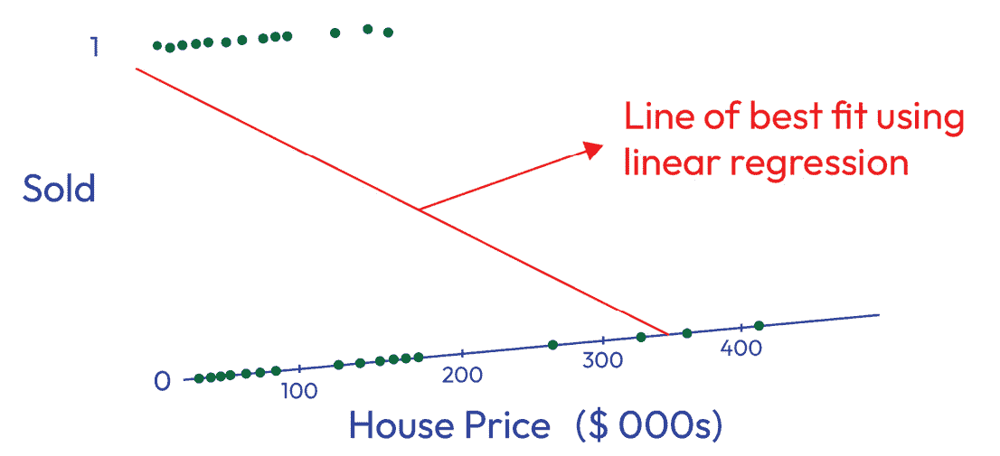
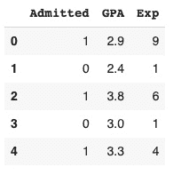
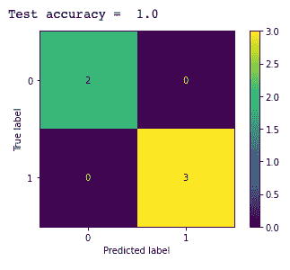
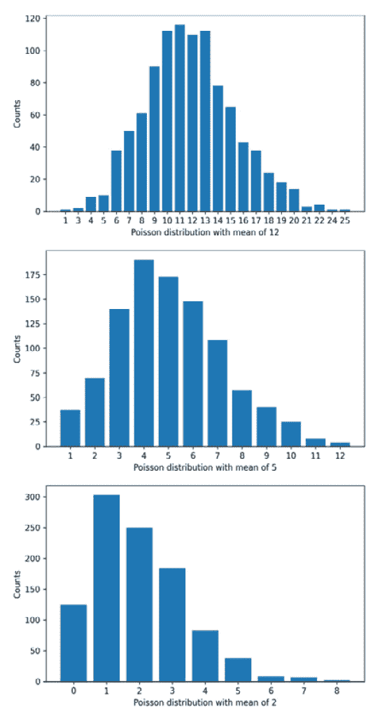
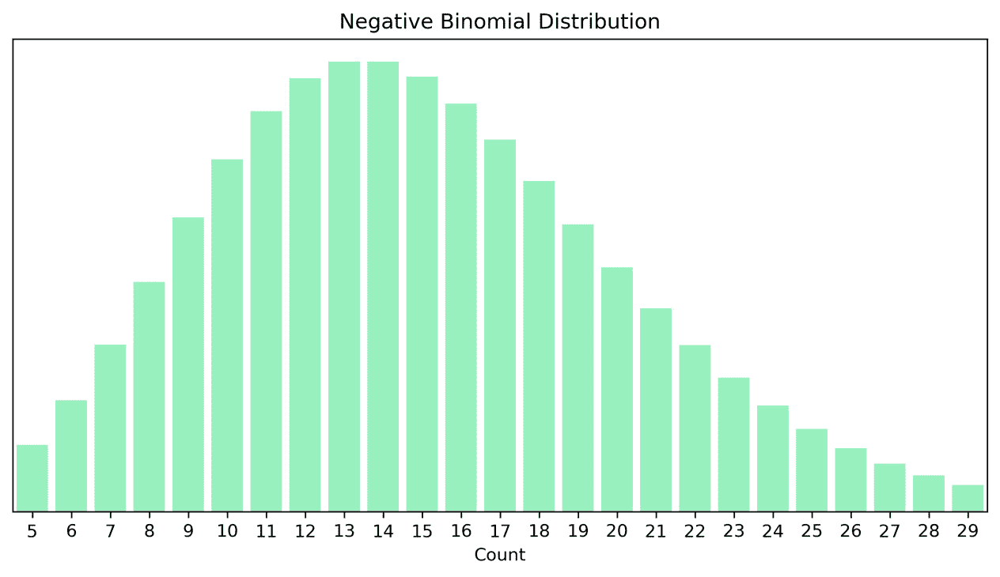
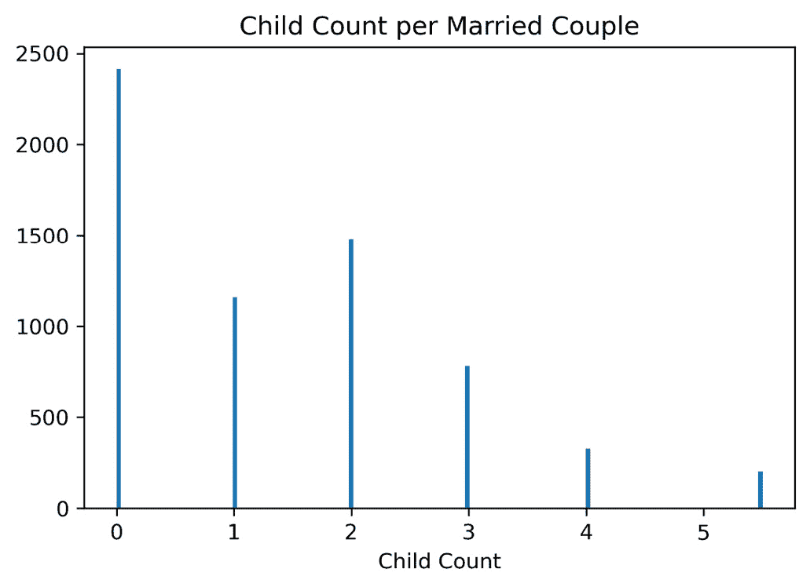

# 第八章：离散模型

在前两个章节中，我们讨论了预测连续响应变量的模型。在本章中，我们将开始讨论预测离散响应变量的模型。我们将首先讨论用于预测二元结果变量（具有两个级别的分类变量）的 probit 和 logit 模型。然后，我们将这个想法扩展到预测具有多个级别的分类变量。最后，我们将探讨预测计数变量，这些变量类似于分类变量，但只取整数值，并且有无限多个级别。

在本章中，我们将讨论以下主要主题：

+   Probit 和 logit 模型

+   多项式 logit 模型

+   泊松模型

+   负二项式回归模型

# Probit 和 logit 模型

在之前，我们讨论了可以用回归模型解决的问题的不同类型。特别是，因变量是连续的，例如房价、薪水等。一个自然的问题是，如果因变量不是连续的——换句话说，如果它们是分类的——我们如何调整我们的回归方程来预测一个分类响应变量？例如，一家公司的人力资源部门想要进行员工流失率研究，以预测员工是否会留在公司，或者一家汽车经销商想要知道基于价格、车型、颜色等因素，一辆车是否能够售出。

首先，我们将研究**二元分类**。在这里，结果（因变量）是一个二元响应，如是/否或做/不做。让我们回顾一下简单的线性回归模型：

y = β 0 + β 1 x+ ϵ

在这里，预测的结果是一条穿过数据点的线。使用这个模型，我们可以构建一个模型，根据不同的自变量（如地区、单元、楼层或距离）来预测房价（因变量）。同样的想法不能应用于二元分类问题。让我们考虑一个简单的例子，我们只想根据房价预测房屋是否售出。让我们基于线性回归构建一个模型：

Sold = β 0 + β 1 * Price + ϵ (1)

在这里，如果房屋售出，Sold = 1，如果没有售出，Sold = 0。通过使用线性回归进行可视化，我们可以画出穿过数据点的最佳拟合线。看起来当价格增加时，房屋售出的可能性会降低：



图 8.1 – 使用线性回归的最佳拟合线

因此，我们不会考虑方程模型(*1*)，而是考虑以下内容：

Prob(Sold) = β 0 + β 1 * Price + ϵ

在这里，Prob(Sold) 表示出售房屋的概率。概率值将在 0 和 1 之间；当出售房屋的概率等于不出售房屋的概率时，其范围的中间值为 0.5。然而，当房屋价格非常高时，Prob(Sold) 的值可以是负数。为了避免这个问题，我们可以用以下方程来建模问题：

P * (1 - P) = β_0 + β_1 * Price + ϵ (2)

在这里，P 是出售房屋的概率，1 - P 是不出售房屋的概率。P * (1 - P) 的值在 [0, ∞) 范围内，当出售汽车的概率与不出售汽车的概率相同时，(P=0.5)，则 P * (1 - P) = 1，或者其范围的中间值为 1。这也被称为 **优势比**。要解释优势比，当 P * (1 - P) = 1 时，对于每出售一栋房屋，就有一栋房屋未出售。当 P = 0.75 时，优势比为 3。在这种情况下，解释是能够出售房屋的概率是未能出售房屋概率的三倍。回到方程 (*2*)，优势比的范围是 [0, ∞)，其下限为 0，但正如我们之前讨论方程 (*1*) 时所指出的，当房屋价格非常高时，优势比的估计值可能是负数，这与概率属性相矛盾。此外，由于中间值为 1 但优势比的范围是从 0 到无穷大，因此分布非常偏斜，右尾较长。然而，我们期望它符合线性回归的一个假设，即正态分布。因此，我们不会使用方程 (*2*)，而是考虑以下：

log(odds) = log(P * (1 - P)) = β_0 + β_1 * Price + ϵ

log(P * (1 - P)) 的值在 (-∞, ∞) 范围内，中间值为 0。类似于线性回归，我们可以使用以下公式：

log(odds) = log(P * (1 - P)) = β_0 + β_1 * X_1 + β_2 * X_2 + … = z (3)

我们可以用此来解释解释变量与分类结果之间的关系。我们可以将之前的方程 (*3*) 重新写为以下形式：

F(z) = P = e^(z - 1) + e^z,

前面的公式下限为 0，上限为 1（预测结果发生的概率 *P*），这被称为 logit 模型。它是逻辑分布的累积分布函数。

模型二元因变量的概率的另一种方法是 **probit 回归**。我们使用标准正态分布的累积分布函数，而不是逻辑回归的累积分布函数：

F(z) = ∫_{-∞}^z ϕ(u) du = ϕ(z)。

前面的公式下限为 0，上限为 1（预测结果发生的概率 *P*），这被称为 **probit 模型**。记住以下：

ϕ(z) = P(Z ≤ z)，其中 Z ~ 𝒩(0,1)。

logit 和 probit 模型都是通过使用 `statsmodels` 进行估计的，我们有 probit 和 logit 模型的类。这些类的文档可以在 [`www.statsmodels.org/dev/generated/statsmodels.discrete.discrete_model.Probit.xhtml`](https://www.statsmodels.org/dev/generated/statsmodels.discrete.discrete_model.Probit.xhtml) 和 [`www.statsmodels.org/dev/generated/statsmodels.discrete.discrete_model.Logit.xhtml`](https://www.statsmodels.org/dev/generated/statsmodels.discrete.discrete_model.Logit.xhtml) 找到。

现在，让我们创建一个训练数据集来展示如何使用 `statsmodels` 中的 `Logit` 类进行 logit 研究：

```py
import pandas as pd
# create gpa train data
train = pd.DataFrame({'Admitted': [1, 1, 1,1, 1, 0, 1, 1, 0, 1,1,1, 1,1,0, 1, 0, 0, 0, 0, 0, 0, 0, 0 ,0 ,0, 1,1,1,1, 0],
                    'GPA': [2.8, 3.3, 3.7, 3.7, 3.7, 3.3, 3.7, 3, 1.7, 3.6, 3.3, 4, 3.2, 3.4, 2.8, 4, 1.5, 2.7, 2.3, 2.3, 2.7, 2.2, 3.3,3.3, 4, 2.3, 3.6, 3.4, 4, 3.7, 2.3],
                    'Exp': [8, 6, 5, 5, 6, 3, 4, 2, 1, 5, 5, 3, 6,5, 4, 4, 4, 1, 1, 2, 2, 2, 1, 4, 4, 4, 5, 2, 4, 6, 3]})
train.head()
```

在这里，`Admitted` 是因变量，有两种可能性（1 – 被录取和 0 – 未录取）。`GPA` 是 GPA 成绩，`Exp` 是经验年数。前面代码的输出如下：


图 8.2 – GPA 成绩和经验年数上的训练数据集

我们还必须为这个模型创建一个测试数据集：

```py
test = pd.DataFrame({'Admitted': [1, 0, 1, 0, 1],
                    'GPA': [2.9, 2.4, 3.8, 3, 3.3],
                    'Exp': [9, 1, 6, 1,4 ]})
test.head()
```

得到的输出如下：



图 8.3 – GPA 成绩和经验年数上的测试数据集

我们将使用来自 `statsmodels` 的 `logit`：

```py
import statsmodels.formula.api as smf
#fit logistic regression
model = smf.logit('Admitted ~ GPA + Exp', data =train).fit()
#summary
model.summary()
```

这将打印以下摘要：


图 8.4 – Logit 回归输出

从这个输出中，我们可以看到 `GPA` 和 `Exp` 在 α = 0.05 的显著性水平上是显著的。

`[0.025 0.975]` 下的值分别是 `Intercept`、`GPA` 和 `Exp` 的 95% 置信区间。下一步是使用 `confusion_matrix` 和 `accuracy_score` 来计算模型在测试集上的准确率：

```py
from sklearn.metrics import confusion_matrix, accuracy_score, ConfusionMatrixDisplay
# X_test and y_test
X_test = test[['GPA', 'Exp']]
y_test = test['Admitted']
#
y_hat = model.predict(X_test)
pred = list(map(round, y_hat))
# confusion matrix
cm = confusion_matrix(y_test, pred)
ConfusionMatrixDisplay(cm).plot()
# Accuracy
print('Test accuracy = ', accuracy_score(y_test, pred))
```

输出如下：



图 8.5 – 测试数据集上的混淆矩阵

通过使用这些训练和测试数据集，模型可以完美地预测结果。在下一节中，我们将讨论使用与二元逻辑回归类似思想的**多类回归**。

# 多项 logit 模型

在实践中，有许多情况中，结果（因变量）不是二元的，而是有超过两种可能性。来自 `statsmodels` 的 `MNLogit` 类：[`www.statsmodels.org/dev/generated/statsmodels.discrete.discrete_model.MNLogit.xhtml`](https://www.statsmodels.org/dev/generated/statsmodels.discrete.discrete_model.MNLogit.xhtml)。

爱丽丝数据([`archive.ics.uci.edu/ml/datasets/iris`](https://archive.ics.uci.edu/ml/datasets/iris))是教育中最著名的统计和机器学习数据集之一。自变量是萼片长度（厘米），萼片宽度（厘米），花瓣长度（厘米）和花瓣宽度（厘米）。因变量是一个有三个级别的分类变量：Iris Setosa（0），Iris Versicolor（1）和 Iris Virginia（2）。以下 Python 代码展示了如何使用`sklearn`和`statsmodels`进行这一操作：

```py
# import packages
import numpy as np
import pandas as pd
from sklearn import datasets
from sklearn.model_selection import train_test_split
from sklearn.linear_model import LogisticRegression
from sklearn.metrics import confusion_matrix, accuracy_score,  ConfusionMatrixDisplay
import statsmodels.discrete.discrete_model as sm
# import Iris data
iris = datasets.load_iris()
print(iris.feature_names)
print(iris.target_names)
#create dataframe
df = pd.DataFrame(iris.data, columns = ['sepal_length', 'sepal_width', 'petal_length', 'petal_width'])
df['target'] = iris.target
df.head()
# check missing values
df.isna().sum()
# create train and test data
X = df.drop('target', axis=1)
y = df['target']
X_train, X_test, y_train, y_test = train_test_split(X, y, test_size =0.2, random_state =1)
# fit the model using sklearn
model_sk = LogisticRegression(solver = 'newton-cg', multi_class = 'multinomial')
model_sk.fit(X_train, y_train)
y_hat_sk = model_sk.predict(X_test)
pred_sk = list(map(round, y_hat_sk))
# confusion matrix
cm_sk = confusion_matrix(y_test, pred_sk)
ConfusionMatrixDisplay(cm_sk).plot()
# Accuracy
print('Test accuracy = ', accuracy_score(y_test, pred_sk))
#fit the model using statsmodels
model_stat = sm.MNLogit(y_train, X_train).fit(method='bfgs')
model_stat.summary()
y_hat_stat = model_stat.predict(X_test)
pred_stat = np.asarray(y_hat_stat).argmax(1)
# confusion matrix
cm_stat = confusion_matrix(y_test, pred_stat)
ConfusionMatrixDisplay(cm_stat).plot()
# Accuracy
print('Test accuracy = ', accuracy_score(y_test, pred_stat))
```

这两种方法都给出了相同的测试准确率值（96.67%），混淆矩阵如下所示：


图 8.6 – 使用 sklearn（左）和 statsmodels（右）的混淆矩阵

# 泊松模型

在上一节中，我们讨论了响应变量为分类变量的模型。在本节中，我们将探讨一个针对计数数据的模型。计数数据类似于分类数据（类别为整数），但是有无限多个级别（0、1、2、3 等等）。我们使用**泊松分布**来建模计数数据。在本节中，我们将首先检查泊松分布及其性质。然后，我们将使用泊松模型用解释变量对计数变量进行建模。

## 泊松分布

泊松分布由以下公式给出：

P(k) = λ^k e^(-λ) / k!

在这里，λ是事件的平均数量，k 是我们想要计算概率的事件数量。P(k)是 k 个事件发生的概率。这个分布用于计算在固定时间间隔或定义空间内发生 k 个事件的概率。

分布的形状随着λ值的改变而变化。当λ大于 10 时，分布看起来近似于正态分布。然而，当λ接近 0 时，分布变得右偏斜。这是因为计数数据不能为负。图 8.7*展示了三个泊松分布的例子，其平均值分别为 12、5 和 2。注意，平均值为 12 的分布近似于正态分布，而平均值为 5 和 2 的分布则是右偏斜的：



图 8.7 – 平均值为 12、5 和 2 的泊松分布示例

分布的另一个有趣方面是均值和方差相等。这意味着随着均值的增加，分布的分散度也会增加。我们可以在图 8.7*的例子中看到这一点。均值为 2 的分布具有较小的分散度和在均值处的大峰值，而均值为 12 的分布具有更宽的分散度和在均值处较低峰值。

现在我们已经讨论了泊松分布，让我们看看如何设置泊松模型。

## 计数数据建模

现在，让我们看看如何使用泊松模型对计数响应变量进行建模。如前所述，计数数据通常遵循泊松分布。泊松模型用以下数学公式表示：

y = e^b 0 + b 1x 1 + … + b nx n

在这里，y 是响应变量，b 值是模型系数，x 变量代表解释变量。这应该看起来与我们在上一章中使用的方程式相似，但增加了解释变量的指数。这种类型的模型称为**对数线性**模型，它是一种响应变量的对数由变量的线性组合建模的模型。我们可以通过将方程式的两边应用自然对数来重写此方程，使其更明确：

ln(y) = b 0 + b 1 x 1 + … + b n x n

现在，我们将响应变量的对数（ln(y)）表示为解释变量的线性组合。

自然对数

泊松模型使用一种特殊的对数，称为自然对数。一个数的自然对数是以数学常数 e 为底的对数。自然对数通常写作 ln(x)，log_e(x)，或 log(x)（前两种是明确的，但第三种可能是有歧义的）。对数运算是对数的逆运算。在这种情况下，自然对数是对数函数的逆：ln(e^x) = x = e^ln(x)。自然对数和对数函数在统计学、数学和科学中常用。

让我们来看一个例子。我们将使用 UCI 的共享单车数据集([`archive.ics.uci.edu/ml/datasets/bike+sharing+dataset`](https://archive.ics.uci.edu/ml/datasets/bike+sharing+dataset))。在这个数据集中，我们有每天租赁自行车的数量。有两种租赁类型：预先注册（注册）和按需在地点租赁（因果）。在这个例子中，我们将对给定年份的每周平均随意租赁自行车数量进行建模。数据集提供了几个解释变量，包括环境因素，如温度，以及日历信息，如是否为假日。

我们将首先设置模型方程，然后查看使用`statsmodels`拟合模型的结果。模型方程遵循我们之前讨论的形式：

ln(每周 _ 平均 _ 租赁 _ 数量) = b 0 + b 1(温度) + b 1(季节)

+ b 2(天气 _ 情况) + b 3(湿度) + b 4(风速) + b 5(假日)

我们可以使用`statsmodels`根据给定数据拟合此模型，这与我们在上一章中做的方法类似。拟合模型的代码片段如下（有关预处理详情，请参阅 Jupyter Notebook）：

```py
# select variables
X = df.groupby('isoweek').mean()[['atemp', 'season', 'weathersit','hum','windspeed', 'holiday']]
# transform holiday variable as an indicator that a holiday occurs within that week
X['holiday'] = X['holiday'].apply(lambda x: 1 if x > 0.1 else 0)
# add a constant for the model
X = sm.add_constant(X)
# get the response variable
y = df.groupby('isoweek').mean()['casual']
fit_model = sm.Poisson(y, X).fit()
fit_model.summary()
```

在模型拟合完成后，我们可以使用`summary()`方法获取系数的详细信息。对于这个模型，我们得到以下系数的输出：


图 8.8 – 泊松模型摘要

就像线性回归的建模示例一样，这些系数值是我们模型中列出的参数的估计值。模型中的所有解释变量在模型中似乎都显著。有趣的是，根据系数估计值，温度（`atemp`）似乎是最有影响力的因素，其次是湿度（`hum`）和风速。由于模型拟合良好且无需删除不显著的变量，我们可以评估模型的表现。此模型具有 155 的 MAE，对应于 36%的 MAPE。

泊松模型强烈依赖于响应变量具有泊松分布的假设。在下一节中，我们将查看一个类似类型的计数数据模型，但具有较弱的分布假设。

# 负二项回归模型

另一种有用的**离散回归**方法是**对数线性负二项回归**模型，它使用负二项概率分布。从高层次来看，负二项回归对于**过度分散的计数数据**很有用，其中**计数条件均值**小于**计数条件方差**。模型**过度分散**是指目标变量的方差大于模型假设的均值。在回归模型中，均值是回归线。我们根据目标变量计数分析（均值与方差）来决定使用负二项模型，并向负二项模型提供一个度量模型过度分散的量，以调整过度分散，我们将在下面讨论这一点。

重要的是要注意，负二项模型不仅用于建模简单的离散数据，而是专门用于与固定数量的**随机**试验相关的**计数数据**，例如在随机抽样场景中建模事件发生前（或未发生）的尝试次数。该模型仅对计数数据进行操作，其中目标变量的每个计数响应都基于有限的结果集。此外，由于计数数据是重复的二项试验的结果，计数排列的顺序并不重要。

## 负二项分布

以下是一个负二项分布的失败计数示例，条件均值为 17，条件方差为 52：



图 8.9 – 负二项分布示例

二项分布是固定次数随机试验（X = ( X 1, X 2, … ))中伯努利随机变量成功次数的构建，伯努利随机变量是一个具有两个结果值：0 或 1 的变量。负二项分布是伯努利随机变量固定次数随机抽取的失败次数的构建。这种区别很重要，因为使用二项回归模型的模型在观测之间建模二元结果，而负二项回归模型在观测之间建模计数结果。负二项分布是二项分布的逆。负二项分布的概率质量函数如下：

P(X − x) = (x + n − 1 n − 1 ) p n (1 − p) x

在这里，有一组 x + n − 1 次试验，其中 x 次失败和 n − 1 次成功，在第 x + n 次试验中达到成功。

关于泊松分布，负二项分布*不需要严格遵循条件方差等于条件均值的假设*，因为它包含一个额外的参数 *α* 来解释额外的方差，而泊松模型假设方差等于均值 *μ*。负二项模型假设方差，此处基于泊松-伽马混合分布，等于以下：

μ(1 + αμ)

这简化为以下形式：

(μ + α μ 2)

用成功概率 *p* 来表述，负二项分布的方差计算如下：

n  1 − p _ p 2

它具有以下均值：

n  1 − p _ p

由于负二项模型中方差不一定等于均值，因此当计数足够大，响应的方差超过均值时，负二项分布可能优于泊松方法。同样，与泊松一样，负二项分布是一个对数线性模型，置信区间基于 Wald 和 drop-in-deviance 似然比。负二项分布回归方程的形式，如此处所示，与泊松回归相同：

ln(y) = b 0 + b 1 x 1 + … + b n x n

它简化为以下形式：

y = e b 0 + e b 1x 1 + … + e b nx n

对于分布的给定样本，成功概率的**最大似然估计**如下：

n _ n +  _ x  ′

最大似然估计

**最大似然估计**（**MLE**）是统计建模中对数优势（或 logit）和对数似然方法的基础。似然是在给定特定的回归系数值的情况下，观察到的回归模型已知结果的概率。默认情况下，如果一组变量比另一组变量提供更高的观察结果概率，则该组变量将具有更高的似然。似然的对数被用作回归模型拟合优度的度量。对于每个变量的潜在系数值集合，具有每个变量最大对数似然值的系数集合被称为**最大似然估计**。这些值是通过迭代方法获得的，该方法生成多个可能的值。如果样本量足够大，并且已经为模型获得了一组适当的变量，则最大似然估计可以被认为是无偏的。

计算负二项回归的置信区间与逻辑回归类似。计算中使用的**Wald**方法利用了**z 比率**。在模型中有*j*个变量时，z 比率计算如下：

( ˆβj − βj) _ SE( ˆβj)

在这里，*SE*是标准误差。置信区间是变量的系数估计值加减半宽置信区间百分位数乘以系数估计值的标准误差。可以使用 z 比率，因为假设估计值具有标准正态抽样分布。因此，我们可以推导出变量的估计系数的 95%置信区间如下：

下限 95%置信限：

ˆβj − 0.475 × SE( ˆβj)

上限 95%置信限：

ˆβj + 0.475 × SE( ˆβj)

负二项回归有三个特定的假设要求：

1.  样本间的独立性。

1.  目标变量的对数与输入变量之间存在线性关系（对数线性模型）。

1.  条件方差大于或等于条件均值。

样本间的独立性意味着没有序列相关性，也没有任何样本间的聚类或其他条件依赖性。目标变量的对数与输入变量之间存在线性关系意味着目标变量对数的对数与每个输入变量的变化之间的关系是线性缩放的。除了我们在本节开头讨论的第 3 个要求外，其他要求基本上与泊松模型相同。

让我们通过 Python 中的 statsmodels 库来举一个例子。为此，我们需要加载 statsmodels 库中的 affairs 数据集，使用剩余变量来建模儿童数量（`children`变量）。在第三行，我们必须添加生成截距系数所需的常数：

```py
import statsmodels.api as sm
data = sm.datasets.fair.load().data
data = sm.add_constant(data, prepend=False)
```

首先，让我们通过数值方法确认目标变量中存在过度离散：

```py
print('Mean count of children per marriage: ', data['children'].mean())
print('Variance of the count of children per marriage: ', data['children'].var())
```

我们可以看到方差大于均值：

`每对婚姻的平均孩子数:` `1.3968740182218033`

`每对婚姻孩子数的方差:` `2.054838616333698`

在这里，我们可以看到每对婚姻的条件均值小于条件方差。虽然这不是一个巨大的差异，但足以考虑使用负二项式回归。让我们直观地观察响应的分布：



图 8.10 – 孩子的分布

可以在这里看到数据的前五行。请注意，设计矩阵的第一列应始终包含常数：


图 8.11 – 示例数据集的前五条记录，包括添加的常数

在我们对*图 8**.10*中孩子分布的视觉检查中，我们识别出孩子的值为 5.5。这可能是由平均值计算或错误导致的。一个主题专家可能有助于确定这一点，但为了我们的分析，让我们假设这是一个错误，并将孩子数四舍五入到整数，因为人们不是分数。让我们设置目标数组*y*和设计矩阵*X*：

```py
y = round(data['children'])
X = data[['const','age','religious','yrs_married','educ','occupation','occupation_husb','affairs','rate_marriage']]
```

现在，让我们为回归建模创建一个训练集和测试集分割。请注意，`shuffle=True`将提供不同的结果。为了获得代表性样本，数据应该随机打乱：

```py
from sklearn.model_selection import train_test_split
X_train, X_test, y_train, y_test = train_test_split(X, y, test_size=0.25, shuffle=True)
```

因为负二项式模型基于泊松-伽马混合模型，我们需要使用泊松模型来估计模型的过度分散度量。A. Colin Cameron 和 Pravin K. Trivedi 在*微观计量经济学：方法和应用*中提供了一个称为**辅助 OLS 回归（无常数项）**的方法。作者提出了创建一个过度分散检验统计量，其中零假设是α=0，备择假设是α ≠ 0，其中*α*是过度分散的估计。辅助 OLS 回归公式如下：

( y i −  ˆ μ  i) 2 − y i  _  ˆ μ  i  = α  g(  ˆ μ  i) _  ˆ μ  i  + μ i

这里，μ i 是一个误差项，g(  ˆ μ  i) 是  ˆ μ  i 2\. 因此，右手边的操作数简化为 α  ˆ μ  i + μ i。在负二项式回归的术语中，我们考虑误差为零，因此我们可以将α作为过度分散估计因子。

在以下代码中，我们使用泊松模型对链接进行了广义线性模型的拟合。然后，我们使用模型的回归均值构建了估计的辅助目标变量。因为方法是“无常数项”，所以我们减去 1 以从过程中移除常数：

```py
from statsmodels.formula.api import ols as OLS
import statsmodels.api as sm
poisson_model = sm.GLM(y_train, X_train, family=sm.families.Poisson()).fit()
df_aux = pd.DataFrame()
df_aux['y_mu_hat'] = poisson_model.mu
df_aux['children'] = y_train
df_aux['y_auxiliary'] = df_aux.apply(lambda x: ((x['children'] - x['y_mu_hat'])**2 - x['y_mu_hat']) / x['y_mu_hat'], axis=1)
ols_model = OLS('y_auxiliary ~ y_mu_hat - 1', df_aux).fit()
print(ols_model.params)
```

如我们所见，负二项式模型的估计分散度为`0.622034`。现在，我们需要评估辅助估计的统计显著性。我们可以使用 OLS 模型的 p 值来完成此操作：

```py
print(ols_model.summary())
```

这将打印以下输出：


图 8.12 – OLS 回归结果

因为系数显著且大于 0，我们可以根据目标确认模型具有过度分散。该系数可以用作在负二项模型中衡量这种过度分散的指标，我们可以用它来调整此处`alpha`参数中的方差：

```py
from statsmodels.genmod.families.family import NegativeBinomial
negative_binomial_model = sm.GLM(y_train, X_train, family=NegativeBinomial(alpha=ols_model.params.values)).fit()
print(negative_binomial_model.summary())
```

输出如下生成：


图 8.13 – 广义线性模型回归结果

最后，让我们使用我们在训练数据上构建的模型来预测训练数据，然后再在测试数据上预测，以便我们可以使用残差误差作为比较的基础来比较未见数据的泛化能力：

```py
from sklearn.metrics import mean_squared_error as RMSE
print('Training Root Mean Squared Error: ', RMSE(y_train, negative_binomial_model.predict(X_train)) )
print('Testing Root Mean Squared Error: ', RMSE(y_test, negative_binomial_model.predict(X_test)))
```

我们可以从均方根误差中观察到，模型的性能在训练数据和测试数据中大致保持不变，表明模型是一致的：

`训练均方根误差：1.2553439918425695`

`测试均方根误差：1.266620561303553`

# 摘要

在本章中，我们解释了在严格基于线性回归构建二元分类概率模型时遇到负的原始概率的问题，其中期望概率在[0, 1]范围内。我们分别概述了使用标准正态分布和对数逻辑分布的累积分布函数的对数优势比和 probit 及 logit 建模。我们还展示了将逻辑回归应用于解决二元和多项分类问题的方法。最后，我们介绍了使用对数线性泊松和负二项模型进行的基于计数的回归，这些模型也可以在不做修改的情况下逻辑上扩展到速率数据。我们提供了它们实现的示例。

在下一章中，我们将介绍使用贝叶斯定理的条件概率，以及使用线性判别分析和二次判别分析进行降维和分类建模。
