# 第十一章：ARIMA 模型

在本章中，我们将讨论单变量时间序列模型。这些模型只考虑一个变量，并仅基于时间序列中的先前样本创建预测。我们将首先查看平稳时间序列数据的模型，然后过渡到非平稳时间序列数据的模型。我们还将讨论如何根据时间序列的特征识别适当的模型。这将提供一组强大的模型，用于时间序列预测。

在本章中，我们将涵盖以下主要主题：

+   稳定时间序列模型

+   非平稳时间序列模型

+   模型评估的更多内容

# 技术要求

在本章中，我们使用两个额外的 Python 库进行时间序列分析：`sktime`和`pmdarima`。请安装以下版本的这些库以运行提供的代码。有关安装库的说明，请参阅*第一章*，*采样* *和泛化*。

+   `sktime==0.15.0`

+   `pmdarima==2.02`

关于`sktime`的更多信息可以在以下链接中找到：[`www.sktime.org/en/stable/get_started.xhtml`](https://www.sktime.org/en/stable/get_started.xhtml)

关于`pmdarima`的更多信息可以在以下链接中找到：[`alkaline-ml.com/pmdarima/`](http://alkaline-ml.com/pmdarima/)

# 稳定时间序列模型

在本节中，我们将讨论对平稳数据有用的**自回归**（**AR**）、**移动平均**（**MA**）和**自回归移动平均**（**ARMA**）模型。这些模型在建模过程均值周围的模式和方差时很有用。*当我们有不具有自相关性的数据时，我们可以使用不假设时间的统计和机器学习模型，例如逻辑回归或朴素贝叶斯，只要数据支持此类* *用例*。

## 自回归（AR）模型

### AR(p)模型

在*第十章*，*时间序列简介*中，我们考虑了**偏自相关函数**（**PACF**）如何将一个数据点与另一个滞后点相关联，同时控制这些滞后点之间的差异。我们还讨论了检查 PACF 图是评估自回归模型顺序的常用方法。因此，自回归模型是一种考虑过去特定点与零滞后给定点的值直接相关的模型。假设我们有一个具有随机、正态分布的白色噪声的过程 y t，ϵ t，其中 t = ± 1，± 2，……。如果我们使用实常数ϕ 1，ϕ 2，……，ϕ p（其中ϕ p ≠ 0）来制定过程，我们可以以下述方式制定过程：

y t − μ − ϕ 1(y t−1 − μ) − ϕ 2(y t−2 − μ) − … − ϕ p(y p − μ) = ϵ t

让μ代表整体过程样本均值（在我们的例子中，我们将考虑**零均值**过程），我们可以将其视为一个*p*阶自回归过程，或 AR(p) [*1*]。我们可以定义 AR(p)模型的自相关如下：

ρ k = ϕ 1 |k|

还有这个例子：

ρ k = ϕ 1 ρ k−1 + … + ϕ p ρ k−p

在前面的例子中，其中ρ k 是滞后*k*自相关。ϕ 1 是 AR(1)过程的斜率和自相关。

AR(p)模型结构和组件

为了避免混淆，请注意，在方程 y t − μ − ϕ 1(y t−1 − μ) − ϕ 2(y t−2 − μ) − … − ϕ p(y p − μ) = ϵ t 中，我们试图构建一个数学模型来表示过程，如果完美建模，则剩下的只是随机、正态分布的白噪声，ϵ t。这实际上意味着模型留下零残差误差（换句话说，是一个完美的拟合）。每个 y t−k 项（其中*k*是时间滞后）代表该时间点的值，每个相应的φ值是 y t−k 所需的系数值，当与其他所有*y*值结合时，模型统计上近似零误差。

### AR(1)模型

**后移算子符号**，或简称**算子符号**，是一种简化的、简写的方法来制定模型。它被称为“后移”，因为它将时间向后移动一个滞后，从*t*到*t-1*。其目的是避免在每一个φ系数后面都写上下标(y t−k)，而是写上 B k−1，同时只包括一次 y t，这在编写高阶*p*的 AR(p)模型时很方便。在以下方程中，AR(1)的零均值形式遵循以下结构：

y t − μ − ϕ 1(y t−1 − μ) = ϵ t

方程简化为以下示例：

y t − ϕ 1(y t−1) = ϵ t

在后移算子符号中，我们可以这样说：

( 1 − ϕ 1 B)y t = 𝝐 t

关于 AR(1)中的|𝝓 1|的注释

在这一点上值得注意，如果|ϕ 1| < 1，则 AR(1)过程是平稳的。也就是说，当滞后一阶自相关系数的绝对值小于 1 时，AR(1)过程是平稳的。当|ϕ 1| = 1 时，ARIMA 模型可能仍然有用，但当|ϕ 1| > 1 时，该过程被认为是爆炸性的，不应进行建模。这是因为|ϕ 1| < 1 的值意味着根位于单位圆之外，而不是被单位圆所限制。|ϕ 1| = 1 的值位于单位圆上，但可以通过差分来消除单位根。AR(1)情况的根可以计算为 z = 1/ϕ 1。产生|ϕ 1| > 1 的数据集不能以使其根位于单位圆之外的方式进行过滤。

当 AR(p)的所有根都位于单位圆之外时，给定的实现（从随机过程中抽取的一个时间序列样本）将收敛到均值，具有恒定的方差，并且与时间无关。这是时间序列数据的一个理想场景。

让我们通过一个 AR(1)过程的例子来探讨，其中|ϕ_1| < 1，因此有一个平稳根。假设我们已经识别了以下一阶自回归过程：

y_t − 0.5 y_{t−1} = ϵ_t

这被转换为算子符号：

(1 − 0.5B) y_t = ϵ_t

当寻找根时，我们可以使用以下符号：

(1 − 0.5z) = 0

这给出了*z*的根：

z = 1 / ϕ_1 = 1 / 0.5 = 2

因此，由于根大于 1 并且因此位于单位圆外，该过程的 AR(1)表示是平稳的。在 Python 中，我们可以使用即将到来的代码构建此过程。首先，我们构建 AR(1)参数，我们希望它为 0.5。因为我们把 0.5 代入模型 X_t − ϕ_1(y_{t−1}) = ϵ_t，所以我们插入*0.5*而不是*-0.5*作为`arparams`。另外，根据ρ_k = ϕ_1|k|，*0.5*是滞后 1 的自相关。我们构建的过程将具有任意的样本大小`nsample=200`。我们使用`np.r_[1, -arparams]`步骤构建(1 − 0.5B)的(1 − 0.5B) y_t = ϵ_t 部分：

```py
from statsmodels.graphics.tsaplots import plot_acf, plot_pacf
import matplotlib.pyplot as plt
import statsmodels.api as sm
import numpy as np
arparams = np.array([0.5])
ar = np.r_[1, -arparams]
ar_process = sm.tsa.ArmaProcess(ar)
y = ar_process.generate_sample(nsample=200)
```

现在我们有了创建我们查看的 AR(1)方程的代码，让我们看看根并与我们手动计算的*z*进行比较：

```py
ar_process.arroots
```

`array([2.])`

我们可以看到 Python 输出`2.`与我们进行的计算相同。我们知道，由于根的绝对值大于 1，AR(1)过程是平稳的，但让我们用 Python 来确认：

```py
ar_process.isstationary
```

`True`

通过观察 PACF，我们可以观察到这是一个 p = 5 的自回归。我们还可以通过观察 ACF 观察到ϕ_1 的值大约为 0.5。对于自回归模型，PACF 用于确定作为 AR 阶数的显著滞后数量，ACF 用于确定包含在该阶数中的系数，ϕ_k 的值。使用 ACF 观察 AR(1)的值很简单，但当 p > 1 时不太明显，因为 ACF 与最接近的点（滞后 0）相比，不控制单个滞后，而 PACF 则控制。让我们用 Python 生成这些图：

```py
fig, ax = plt.subplots(1,3, figsize=(20,5))
ax[0].set_title('Realization')
ax[0].plot(y)
plot_acf(y, alpha=0.05, lags=50, ax=ax[1])
ax[1].set_title('ACF')
plot_pacf(y, alpha=0.05, lags=50, ax=ax[2])
ax[2].set_title('PACF')
```


图 11.1 – AR(1)过程

对于 AR(1)过程，我们在*图 11.1*中看到，除了滞后 0 之外，PACF 图上只有一个显著的偏自相关。注意，当我们接近滞后 45 时，有一些显著性，但由于滞后 1 和这些点之间的不显著性，包括这些滞后并构建如 AR(50)之类的模型会导致极端过拟合；从滞后 2 到大约滞后 45 的系数将介于大约 0 和±0.15 之间。如*第四章*中所述，*参数检验*，大约±0.1 和±0.3 之间的相关性通常被认为是一种弱相关性。

### AR(2)模型

让我们看看以下平稳 AR(2)过程：

y_t − 0.8 y_{t−1} − 0.48 y_{t−2} = ϵ_t

转换为后移算子符号，我们得到以下内容：

(1 − 0.8B − 0.48 B²) y_t = ϵ_t

我们还有以下内容：

(1 − 0.8z − 0.48 z²) = 0

由于我们在这本书中专注于 Python，我们不会详细介绍步骤，但了解二次多项式（如 AR(2)）遵循二次方程 a x² + bx + c（对于我们的过程是 -0.48 z² − 0.8z + 1）可能是有用的。因此，我们可以使用二次公式：

− b ± √ b² − 4ac   ___________ 2a

这是我们用来找到根的依据。在 Python 中，我们可以使用以下方法找到该模型的根：

```py
arparams = np.array([-0.8, -0.48])
ar = np.r_[1, -arparams]
ar_process = sm.tsa.ArmaProcess(ar)
print('AR(2) Roots: ', ar_process.arroots)
print('AR(2) Stationarity: ', ar_process.isstationary)
```

在这里，我们可以看到使用 `statmodels` ArmaProcess 函数识别的单位根：

`AR(2) 根：[-0.83333333-1.1785113j -0.83333333+1.1785113j]`

`AR(2) 站立性:` `True`

我们可以观察到根以复共轭形式 a ± bi 存在。当一个过程具有复共轭形式的根时，我们预期自相关将表现出振荡模式，这在 *图 11.2* 中的 ACF 图中可以看到。我们还可以观察到 PACF 中的两个显著滞后，这支持了 p=2 的阶数：


图 11.2 – 具有复共轭根的 AR(2)

为了从数学上测试复共轭根是否稳定（位于单位圆外），我们取每个根的实部和虚部的向量的大小，并检查它是否大于 1。复共轭根，*z*，按照形式 a ± bi 的模量如下方程：

‖z‖ = √ a² + b²

我们根的模量如下：

√ _________________  − 0.8333²± 1.1785²  = 1.4433

由于 1.4433 > 1，我们知道我们的 AR(2) 模型是稳定的。

使用 PACF 识别 AR 模型的阶数 p

当根据 PACF 图识别自回归过程 AR(p) 的滞后阶数 p 时，我们取存在显著偏自相关的最大滞后作为 p 的阶数。在观察 *图 11.3* 时，因为 PACF 在滞后 4 后减弱，并通过大约滞后 30，我们将在滞后 4 后停止阶数考虑，因为使用更多的滞后（将它们视为时间序列模型的特征）可能会导致过拟合。使用 PACF 选择的阶数是基于偏自相关减弱前的最后一个显著滞后。虽然滞后 2 和 3 看起来很小，可能不显著，但滞后 4 是显著的。因此，我们可能使用阶数为 4 的 AR 模型获得最佳模型。通常，我们使用信息准则（如 AIC 或 BIC）的错误来测试我们的假设。

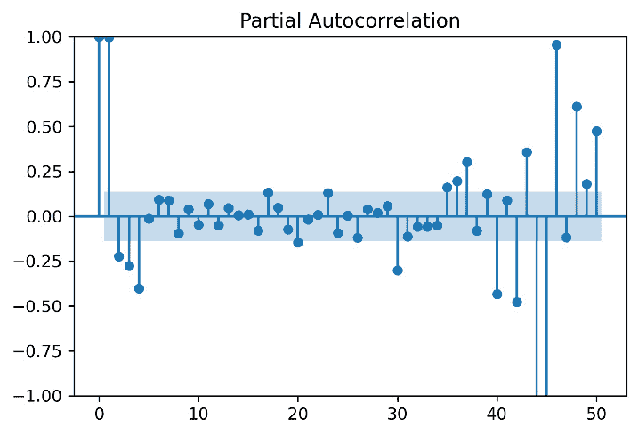

图 11.3 – AR(p) 阶数识别

### AR(p) 端到端示例

让我们通过一个 Python 中 AR(p) 模型端到端示例。首先，我们需要生成一个由 AR(4) 过程产生的数据集。我们将使用这些数据作为我们将尝试建模的过程：

```py
arparams = np.array([1.59, -0.544, -0.511, 0.222])
ar = np.r_[1, -arparams]
ar_process = sm.tsa.ArmaProcess(ar)
y = ar_process.generate_sample(nsample=200)
```

对于以下步骤，让我们假设数据 `y` 是一个机器的输出，我们对它一无所知。

#### 第 1 步 - 视觉检查

我们首先使用本章前面提供的代码可视化原始数据及其 ACF 和 PACF 图：


图 11.4 – 模型开发步骤 1：视觉检查

根据 PACF 图，我们可以看到似乎是一个 AR(2)，但可能是 AR(4)。在滞后 4 之后，偏自相关系数在 5% 的显著性水平上失去了统计显著性。然而，当我们考虑 PACF 中滞后 4 的统计显著性时，尽管很微小，ACF 中滞后 4 是显著的。虽然滞后 4 的值不是系数的值，但其显著性有助于确定阶数 p。尽管如此，AR(4) 可能会过拟合，并且不如 AR(2) 一样很好地泛化。接下来，我们将使用 **赤池信息量准则**（**AIC**）和 **贝叶斯信息量准则**（**BIC**）来帮助我们做出决定。

根据常数均值和我们没有指数衰减（这也需要是显著的）ACF 的事实，似乎没有趋势。

#### 步骤 2 - 选择 AR(p) 的阶数

由于我们根据对 AR(p) 模型应使用阶数的视觉检查不确定，我们将使用 AIC 和 BIC 来帮助我们做出决定。AIC 和 BIC 过程将使用从零阶到即将在代码中提供的 `max_ar` 值的所有阶数来拟合模型。这些模型将拟合整个数据集。误差最低的阶数通常是最好的。它们的误差计算如下：

AIC = 2k − 2ln(ˆL)

BIC = kln(n) − 2ln(ˆL)

这里的 *k* 是数据的滞后数 - 最多到测试的最大阶数，ˆL 是最大似然估计，*n* 是样本大小（或正在测试的数据集的长度）。对于这两个测试，误差越低越好。

我们将从 `Statsmodels` 导入 `arma_order_select_ic` 并根据我们在 *图 11**.4* 中的 PACF 图中的观察结果，使用最多 4 个滞后项进行测试。正如所注，根据我们的视觉检查，我们似乎没有趋势。然而，我们可以通过一个基于 OLS 的单位根测试，称为 **Dickey-Fuller 测试** 来进行统计验证。Dickey-Fuller 测试的 **零假设** 是在测试的最大滞后数（maxlag）中的某个点存在单位根（因此，趋势）。备择假设是数据中没有单位根（没有趋势）。为了参考，备择假设表明数据是一个零阶 - **I(0)** - 集成过程，而零假设表明数据是一个一阶 - **I(1)** - 集成过程。如果测试统计量的绝对值大于临界值或 p 值显著，我们可以得出没有趋势（没有单位根）的结论。

Dickey-Fuller 测试考虑回归测试中包含的滞后数目的每个数据点。我们需要分析 ACF 图来做到这一点；因为我们希望考虑趋势可能存在的最远范围，我们必须选择具有显著性的最长滞后。想法是，如果我们数据中有一个强烈的趋势，比如增长，那么在趋势存在期间，每个连续的值都将导致另一个后续值的增加。在我们的情况下，ACF 图中的最大显著滞后大约是 25。由于 Dickey-Fuller 测试的统计功效相对较低（容易犯第二类错误或当应该拒绝零假设时未能拒绝），因此只要它是实用的，高阶滞后并不令人担忧；风险是未能包含足够的滞后。

Dickey-Fuller 单位根

Dickey-Fuller 测试仅当存在趋势单位根时才进行，但如果有季节性单位根则不进行。我们将在本章的 ARIMA 部分讨论趋势和季节性单位根之间的区别。

在接下来的代码块中，我们在 *图 11**.4* 中的自相关图（ACF）中添加了 `maxlag=25`，对应于我们的 25 个滞后项。我们还将包括 `regression='c'`，这将在进行的 OLS 回归中添加一个常数（或截距）；在这种情况下，我们不需要手动添加常数：

```py
from statsmodels.tsa.stattools import adfuller
dicky_fuller = adfuller(y, maxlag=25, regression='c')
print('Dickey-Fuller p-value: ', dicky_fuller[1])
print('Dickey-Fuller test statistic: ', dicky_fuller[0])
print('Dickey-Fuller critical value: ', dicky_fuller[4].get('5%'))
```

根据 Dickey-Fuller 测试，我们应该拒绝零假设，并得出结论该过程是零阶积分的，因此没有趋势：

`Dickey-Fuller p 值:` `1.6668842047161513e-06`

`Dickey-Fuller 测试统计量: -5.545206445371327`

`Dickey-Fuller 临界值: -2.8765564361715534`

因此，我们可以将 `trend='n'` 插入到我们的 `arma_order_select_ic` 函数中（否则，我们可能想要对数据进行差分，我们将在本章的 ARIMA 部分展示）：

```py
from statsmodels.tsa.stattools import arma_order_select_ic
model_ar = arma_order_select_ic(y=y, max_ar=4, max_ma=0,
                                ic=['aic','bic'], trend='n')
print('AIC Order Selection: ', model_ar.aic_min_order)
print('AIC Error: ', round(model_ar.aic.min()[0], 3))
print('BIC Order Selection: ', model_ar.bic_min_order)
print('BIC Error: ', round(model_ar.bic.min()[0], 3))
```

在这里，我们可以看到根据我们的 AIC 和 BIC 测试，识别出的 AR 和 MA 阶数，以产生最低的整体误差：

`AIC 阶数选择: (4, 0)`

`AIC 错误:` `586.341`

`BIC 阶数选择: (2, 0)`

`BIC 错误:` `597.642`

我们可以看到 AIC 选择了一个 AR(4)，而 BIC 选择了一个 AR(2)。最好是两个测试都选择相同的项阶数。然而，正如我们之前提到的，AR(2) 可能不太可能过度拟合。由于最佳阶数并不完全清楚，我们将通过比较它们的误差和对数似然估计来测试这两个模型（使用 AR(2) 和 AR(4)）。

#### 第 3 步 - 构建 AR(p)模型

在这一步，我们可以将我们的参数添加到`statsmodels`的 ARIMA 函数中，并使用我们指定的 AR(4)拟合数据。为了明确，AR(4)等同于 ARIMA(4,0,0)。我们希望包含`enforce_stationarity=True`以确保我们的模型将产生有用的结果。如果不是，我们将收到警告，并需要通过差分、使用不同的模型（如 SARIMA）、改变我们的采样方法、改变我们的时间分箱（例如从天到周）或完全放弃时间序列建模来解决这个问题：

```py
from statsmodels.tsa.arima.model import ARIMA
ar_aic = ARIMA(y, order=(4,0,0),
               enforce_stationarity=True).fit()
print(ar_aic.summary())
```

在我们的模型输出中，我们可以看到*SARIMAX 结果*标题和*模型：ARIMA(4,0,0)*。这可以忽略。没有季节成分和没有外生变量（在我们的情况下）的 SARIMAX 只是一个 ARIMA。此外，阶数为(4,0,0)的 ARIMA 是一个*AR(4)*：

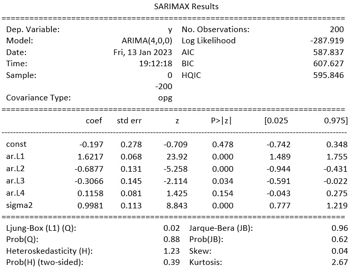

图 11.5 – AR(4)模型结果

我们建模的 AR(4)过程（在步骤 1 之前构建的模拟过程）是：

y_{t-1} - 1.59 y_{t-1} + 0.544 y_{t-2} + 0.511 y_{t-3} - 0.222 y_{t-4} = ϵ_{t}

我们使用输入过程的数据生成的 AR(4)模型如下：

y_{t-1} - 1.6217 y_{t-1} + 0.6877 y_{t-2} + 0.3066 y_{t-3} - 0.1158 y_{t-4} = ϵ_{t}

在后移算子符号表示法中，我们得到以下方程：

(1 - 1.6217B + 0.6877 B² + 0.3066 B³ - 0.1158 B⁴) y_{t} = ϵ_{t}

值得注意的是，滞后 4 的项并不显著，置信区间包含 0。因此，包括这个项是过度拟合的已知风险，如果考虑替代模型，这是一个值得权衡的因素。如果基于 AIC 和 BIC 比较 AR(2)甚至 AR(3)与我们的 AR(4)的结果有显著改善，那么选择不同的模型将是谨慎的，但为了节省时间，我们将跳过这个过程。

关于模型摘要指标，我们在上一章讨论了**Ljung-Box 检验**，所以这里不再详细说明，但该检验的高 p 值（Prob(Q)）表明在滞后 1 处没有相关误差。通常，如果模型拟合的残差中存在序列相关性，残差将具有滞后 1 的自相关性。**Jarque-Bera 检验**假设在零假设下误差是正态分布的，而在备择假设下不是正态分布的。该检验的高 p 值（Prob(JB)）表明误差是正态分布的。**异方差性检验**检验的是残差是否恒定（同方差），备择假设是它们不是恒定的，这是时间序列回归拟合的问题。在这里，我们的异方差性 p 值（Prob(H)）较高，因此我们可以假设我们的模型残差具有恒定的方差。**偏度**分数在 [-0.5, 0.5] 之间被认为是未偏斜的，而在 [-1, -0.5] 或 [0.5, 1] 之间是中度偏斜的，而 > ±2 是高度偏斜的。**峰度**的完美分数是 3。峰度 > ±7 是高度偏斜的。因为我们的偏度为 0.04，我们的峰度分数为 2.58，我们可以假设我们的残差是正态分布的。

#### 步骤 4 - 测试预测

验证模型的另一种方法是使用那些点之前的数据来预测现有点。在这里，我们使用模型来预测最后 5 个点，使用的是除了最后 5 个点之外的全数据集。然后我们进行比较，以了解模型性能。请注意，我们生成了 200 个样本，这些样本的索引从 0 开始。因此，我们的第 200 个样本位于位置索引 199：

```py
df_pred = ar_aic.get_prediction(start=195, end=199).summary_frame(alpha=0.05)
df_pred.index=[195,196,197,198,199] # reindexing for 0 index
```

在以下表格中，*mean* 列是预测值。我们手动将 *actuals* 列添加到我们数据的最后 5 个值中，以与预测值进行比较。*mean_se* 是我们估计值与实际值相比的均方误差。*y* 是我们的索引，*ci* 列是我们 95% 预测置信区间，因为我们之前在代码中使用 `alpha=0.05`。

| **y** | **mean** | **mean_se** | **mean_ci_lower** | **mean_ci_upper** | **actuals** |
| --- | --- | --- | --- | --- | --- |
| 195 | 24.70391 | 0.99906 | 22.74579 | 26.662035 | 25.5264 |
| 196 | 19.36453 | 0.99906 | 17.4064 | 21.322652 | 18.8797 |
| 197 | 7.525904 | 0.99906 | 5.567779 | 9.484028 | 7.4586 |
| 198 | -5.8744 | 0.99906 | -7.83252 | -3.916274 | -7.1316 |
| 199 | -19.5785 | 0.99906 | -21.5366 | -17.620356 | -17.9268 |

图 11.6 – AR(4) 模型输出与实际值对比

根据我们的均方误差（0.999062），我们可以看到我们的模型在测试数据上对 5 个点的预测范围内提供了合理的拟合。使用以下代码，我们绘制了我们的测试预测与相应的实际值：

```py
fig, ax = plt.subplots(1,1,figsize=(20,5))
ax.plot(y, marker='o', markersize=5)
ax.plot(df_pred['mean'], marker='o', markersize=4)
ax.plot(df_pred['mean_ci_lower'], color='g')
ax.plot(df_pred['mean_ci_upper'], color='g')
ax.fill_between(df_pred.index, df_pred['mean_ci_lower'], df_pred['mean_ci_upper'], color='g', alpha=0.1)
ax.set_title('Test Forecast for AR(4)')
```


图 11.7 – AR(4) 测试预测

#### 步骤 5 - 构建预测

确定合理的预测范围高度依赖于至少数据及其所代表的过程，以及用于建模的滞后，以及模型误差。在向利益相关者提供预测之前，时间序列从业者应权衡模型性能和业务需求与风险的所有因素。添加以下代码，我们重新运行图表以查看具有 5 点预测范围的真正预测：

```py
df_forecast = ar_aic.get_prediction(start=200, end=204).summary_frame(alpha=0.05)
df_forecast.index=[200, 201, 202, 203, 204]
forecast = np.hstack([np.repeat(np.nan, len(y)), df_pred['mean']])
```


图 11.8 – AR(4)预测范围=5

我们将在本章的模型评估部分介绍额外的步骤。

## 移动平均（MA）模型

### MA(q)模型

而 AR(p)模型是时间上滞后零与特定个体阶数*p*的滞后之间的相关性的直接函数，阶数*p*的移动平均模型，MA(q)，是滞后零与包括在阶数*p*中的所有先前滞后之间的自相关函数。它作为一个低通滤波器，通过建模误差来提供对数据的有效拟合。

让我们考虑一个过程，y t，它具有零均值和一个随机、正态分布的白噪声成分，ϵ t，其中 t = ± 1, ± 2, …。如果我们能将此过程写成

y t − μ = ϵ t − ϴ 1 ϵ t−1 − … − ϴ q ϵ t−q

并且 ϴ 1, ϴ 2, … , ϴ q 是实常数且 ϴ q ≠ 0，那么我们可以称这是一个具有阶数*q*的移动平均过程，或 MA(q)。在向后移位算子记法中，我们有以下：

y t − μ = (1 − ϴ 1 B − … − ϴ q B q) ϵ t

我们可以这样定义 MA(q)模型的自相关（ρ k）：

ρ k =  − ϴ k + ∑ j=1 q−k ϴ j ϴ j+k  _____________  1 + ∑ j=1 q  ϴ j 2

对于所有滞后*k*在 1,2, … , q 中。当 k > q 时，我们有ρ k = 0。

当讨论 AR(p)模型时，我们解释了 AR 模型的根必须位于单位圆外部。当考虑 MA(q)模型时，我们有可逆性的概念。**可逆性**本质上确保了与过去的*逻辑和稳定的关联*。通常，这意味着当前时间点与过去附近的时间点比那些更远的时间点更紧密相关。无法使用可逆根来建模过程意味着我们无法确保我们的模型为模型自相关集提供唯一解。如果过去较远的时间点比附近的时间点对当前点更相关，那么过程中存在无法可靠建模或预测的随机性。

识别 MA(q)模型的可逆性

为了使移动平均模型可逆，所有根必须位于单位圆外部且非虚数；*所有*根必须大于 1。对于 MA(1)过程，当|ϴ 1| < 1 时，它是可逆的。一个可逆的 MA(q)过程等价于一个无限阶、收敛的 AR(p)过程。如果 AR(p)模型的系数随着滞后 k 接近 p 而收敛到零，则该模型收敛。如果一个 MA(q)是可逆的，我们可以说 y t = ϴ(B) ϵ t 和 ϴ −1(B) y t = ϵ t [*1*]。

### MA(1)模型

对于一阶 MA(q)模型，我们有以下过程：

ρ 0 = 1

ρ 1 =  ϴ 1 _ 1 + ϴ 1 2

ρ k>1 = 0

对于具有零自相关函数的 MA(q)模型，我们试图建模的过程模式是随机的，服从正态分布的白噪声方差，这最多只能通过其均值来建模。重要的是要注意，当 ϴ₁ → 0 时，ρ₁ → 0，对于 MA(1)过程，这意味着过程可以近似为白噪声。

让我们考虑以下 MA(1)零均值模型，其形式为 y_t - μ = ϵ_t - ϴ₁ ϵ_{t-1}：

y_t - 0 = a_t - 0.8 ϵ_{t-1}

在后移记号法中，我们有以下内容：

y_t = (1 - 0.8B) ϵ_t

我们知道这个过程是可逆的，因为 |ϴ₁| < 1。让我们使用 Python 中的`statsmodels.tsa`模块的`ArmaProcess`函数来确认这一点：

```py
from statsmodels.graphics.tsaplots import plot_acf, plot_pacf
import matplotlib.pyplot as plt
import statsmodels.api as sm
import numpy as np
maparams = np.array([0.8])
ma = np.r_[1, -maparams]
ma_process = sm.tsa.ArmaProcess(ma=ma)
print('MA(1) Roots: ', ma_process.maroots)
print('MA(1) Invertibility: ', ma_process.isinvertible)
```

`MA(1) Roots: [1.25]`

`MA(1) 可逆性:` `True`

与 AR(p)模型相反，MA(q)模型的阶数是通过 ACF 图来确定的。因为 ACF 没有控制滞后，并且是考虑到的滞后阶数及其自相关测度的一个综合自相关度量，所以该函数用于确定移动平均成分的相关滞后阶数。在*图 11*.*9*中，我们可以看到我们的 MA(1)过程在滞后 1 处的显著相关性。在滞后 6 和 7 处还有两个额外的显著相关性，但使用如此远的滞后通常会导致过度拟合，尤其是当考虑到滞后 2 至 5 在 5%的显著性水平上并不显著：


图 11.9 – MA(1)图

消减 ACF 和 PACF

对于可逆移动平均模型，我们可以观察到自相关函数（ACF）将在显著性阶数处截断，但偏自相关函数（PACF）通常会继续并随时间逐渐衰减至统计上的零。这并不一定期望会平滑且一次性发生，因为所有数据集都是不同的，但预计随着时间的推移，越来越多的滞后项将衰减至零。我们将在本章的 ARMA 部分解释这种行为的理由，但值得注意的是，对于可逆过程，这是可以预期的。相反，平稳自回归过程在 PACF 图中预计会在显著性阶数处截断，而 ACF 随时间衰减至零。

### MA(2)模型

对于二阶的 MA(q)模型，我们有以下公式：

ρ₀ = 1

ρ₁ = - ϴ₁ + ϴ₁ ϴ₂_1 + ϴ₁² + ϴ₂²

ρ² = - ϴ²_1 + ϴ₁² + ϴ²_2

ρ_k>2 = 0

下面是一个我们将要研究的 MA(2)示例：

y_t = (1 - 1.6B + 0.9B²) ϵ_t

使用二次方程的模型多项式，我们可以使用二次公式找到近似根：

0.888 ± 0.567i

由于我们有两个共轭复根，我们可以使用与 AR(p)过程相同的 L²范数，使用形式为 a ± bi：

√(0.888² + 0.567²) ≈ 1.054

因为 1.054 大于 1，我们可以确认 MA(2) 有可逆根，因此能够产生一个唯一解和一个模型，其值在逻辑上是与过去值序列相关的。让我们在 Python 中进行同样的分析：

```py
maparams = np.array([1.6, -0.9])
ma = np.r_[1, -maparams]
ma_process = sm.tsa.ArmaProcess(ma=ma)
print('MA(2) Roots: ', ma_process.maroots)
print('MA(2) Invertibility: ', ma_process.isinvertible)
```

我们用绿色突出显示的输出确认了我们的计算结果和事实，即由于复共轭根的幅度大于 0，我们有一个可逆的 MA(2) 过程：

`MA(2) 根: [0.88888889-0.56655772j 0.88888889+0.56655772j]`

`MA(2) 可逆性:` `True`

我们可以在图 11**.10** 的自相关图中看到，这是一个二阶移动平均过程：


图 11.10 – MA(2) 图

对于 MA(q) 模型，识别模型阶数、构建模型和生成预测的过程与 AR(p) 模型相同。我们讨论过，对于 MA(q)，基于视觉检查的阶数选择是通过 ACF 进行的，而对于 AR(p)，这是通过 PACF 进行的，这是两个模型之间过程的主要区别。除此之外，对于 MA(q) 模型，应将 `enforce_invertibility` 设置为 `True` 而不是 `enforce_stationarity=True`。在 `arma_order_select_ic` 函数中提供比有用阶数更高或更低的 `max_ar` 或 `max_ma` 阶数可能会导致收敛警告或可逆性警告。这些警告的一个原因是提供了比可能拟合的更高阶数（例如，当没有可能的阶数时）。另一个原因是存在一个**单位根**。如果数据中存在明显的趋势，则在建模之前必须将其**去除**。如果没有趋势，由于数据中的季节性，可能会收到此错误，这表现为不同的单位根阶数。我们将在本章的 ARIMA 和季节性 ARIMA 部分讨论与趋势和季节性相关的单位根的建模。还值得指出的是，由于移动平均过程可能受到趋势的影响，因此可以使用 Dickey-Fuller 测试来移动平均数据。

## 自回归移动平均 (ARMA) 模型

在自回归模型部分，我们讨论了如何使用 AR(p) 模型通过自相关控制个体滞后来建模过程输出值。AR(p) 模型的目标是使用过去某个特定滞后下的值来估计未来对应滞后点的确切值。例如，未来两个点的值与过去两个点的值高度相关。在移动平均模型部分，我们讨论了 MA(q) 模型如何作为低通滤波器，帮助模型解释过程中的噪声。我们不是寻求建模确切点，而是使用 MA(q) 来建模过程周围的方差。

考虑一个四缸汽车发动机的例子，该发动机产生恒定的输出。让我们假设我们有一个磨损的发动机支架靠近第四缸。我们可以预期与每个气缸点火相关的连续输出振动，但振动会随着接近磨损的发动机支架的每一下冲而略有增加。使用仅 AR 模型会假设每个气缸振动一定量并能解释这一点，但我们会丢失信息。添加一个 MA 成分将能够模拟从第一缸开始，每个后续冲程直到第四缸都会有与磨损的发动机支架相关的额外振动，从而解释更多的整体过程。这合理地是一个 ARMA(4,4)模型。假设我们用磨损程度与其他支架相同的支架替换磨损的发动机支架；那么我们就会有 ARMA(4,0)（或 AR(4)）过程。

在许多情况下，我们发现自相关和偏自相关都有显著的峰值。而不是只使用 MA(q)或 AR(p)模型，我们可以将两者结合起来。这种组合，表示为 ARMA(p,q)，使我们能够模拟过程以及可能与特定滞后相关的过程周围的任何噪声成分。因为 ARMA(p,q)通常比 AR 或 MA 模型具有更少的参数（更低阶），ARMA 被认为是一个**简约模型**，这是一个使用尽可能少的解释变量（在这种情况下，时间滞后）来实现所需性能水平的模型。当 y t 是一个可逆和平稳的过程时，我们可以将其定义为 ARMA(p,q)：

y t − μ = Φ 1(y t−1 − μ) − … − Φ p(y t−p − μ) = ϵ t − ϴ 1 ϵ t−1 − … − ϴ q ϵ t−q

当Φ p ≠ 0 和ϴ q ≠ 0 时，我们可以用后移算子符号重新写出 ARMA(p,q)的方程：

ΦB(y t − μ) = ϴ(B) ϵ t

从实际角度来说，我们可以预期对于一个可逆的移动平均过程，在自相关函数（ACF）中我们会看到显著的滞后，直到阶数 *q* 的量级，但随后偏自相关函数（PACF）将逐渐减小，通常在 ACF 中识别出的移动平均过程阶数之外。这是因为有限阶的移动平均过程可以被表示为一个无限阶的自回归过程。相反，由于具有这种行为的移动平均过程是可逆的，其逆过程也必须成立；即有限阶的自回归过程可以被表示为一个无限阶的移动平均过程。因此，对于可逆的移动平均过程，偏自相关函数将衰减到零，而对于平稳的自回归过程，自相关函数也将衰减到零。因为可逆性是 ARMA 过程的要求，它允许我们将方程重写为一般线性形式下的无限阶 MA 过程：

y t = Φ −1(B)ϴ(B) ϵ t

它还允许我们将它作为一个无限阶的自回归过程：

ϴ −1(B)Φ(B) y t = ϵ t

让我们通过一个 Python 中的例子来演示。首先，使用本章前面相同的导入，让我们生成一个可逆且平稳的 ARMA(2,1) 过程的虚拟数据集，该数据集满足以下方程：

(1 − 1.28B + 0.682 B²) y_t = (1 − 0.58B) ε_t

```py
arparams = np.array([1.2, -0.6])
ar = np.r_[1, -arparams]
maparams = np.array([0.5])
ma = np.r_[1, -maparams]
arma_process = sm.tsa.ArmaProcess(ar=ar, ma=ma)
```

让我们确认平稳性和可逆性：

```py
print('AR(2) Roots: ', arma_process.arroots)
print('AR(2) Invertibility: ', arma_process.isstationary)
print('MA(1) Roots: ', arma_process.maroots)
print('MA(1) Invertibility: ', arma_process.isinvertible)
```

我们可以使用二次公式来测试，但我们可以相信代码来确认：

`AR(2) 根：` `[1.-0.81649658j 1.+0.81649658j]`

`AR(2) 平稳性：` `True`

`MA(1) 根：` `[2.]`

`MA(1) 可逆性：` `True`

既然我们已经有一个平稳且可逆的过程，让我们从中生成 200 个样本：

```py
y = arma_process.generate_sample(nsample=200)
```

#### 第 1 步 – 视觉检查

让我们看看我们一直在使用的图表，以构建关于生成数据的过程的直觉：


图 11.11 – ARMA(p,q) 过程样本数据

我们可以通过 ACF 看出，似乎有一个 MA(1) 的成分。根据 PACF，看起来我们可能有一个 AR(2) 或 AR(4)。实现看起来是一个满足平稳性的过程。

#### 第 2 步 – 选择 ARMA(p,q) 的阶数

在我们决定 ARMA 模型的阶数之前，让我们使用 Dickey-Fuller 测试来检查我们的数据是否存在趋势：

```py
from statsmodels.tsa.stattools import adfuller
dicky_fuller = adfuller(y, maxlag=25, regression='c')
print('Dickey-Fuller p-value: ', dicky_fuller[1])
print('Dickey-Fuller test statistic: ', dicky_fuller[0])
print('Dickey-Fuller critical value: ', dicky_fuller[4].get('5%'))
```

我们可以看到统计显著性，这证实了我们提供的滞后项中没有单位根（记住，H_0：*数据有一个单位根* 和 H_1：*数据没有单位根*）。因此，我们可以使用 ARMA 模型而不需要任何一阶差分，这至少需要一个 ARIMA：

`Dickey-Fuller p 值：` `6.090665062133195e-16`

`Dickey-Fuller 测试统计量：` `-9.40370671340928`

`Dickey-Fuller 临界值：` `-2.876401960790147`

现在，让我们使用 `statmodels` 的 `arma_order_select_ic` 来查看 AIC 和 BIC 对 ARMA(p,q) 阶数的选择。我们知道 MA(q) 的最大阶数是 1，但由于我们不确定这是 AR(2) 还是 AR(4)，我们可以使用 `max_ar=4`：

```py
from statsmodels.tsa.stattools import arma_order_select_ic
model_arma = arma_order_select_ic(y=y, max_ar=4, max_ma=1, ic=['aic','bic'], trend='n')
print('AIC Order Selection: ', model_arma.aic_min_order)
print('AIC Error: ', round(model_arma.aic.min()[0], 3))
print('BIC Order Selection: ', model_arma.bic_min_order)
print('BIC Error: ', round(model_arma.bic.min()[0], 3))
```

我们可以看到 AIC 选择了一个 ARMA(4,1)，而 BIC 选择了一个 ARMA(2,1)：

`AIC 阶数选择：` `(4, 1)`

`AIC 错误：` `548.527`

`BIC 阶数选择：` `(2, 1)`

`BIC 错误：` `565.019`

ARMA(4,1) 具有较低的误差，但我们知道从这本书的此章节和前面的章节中，具有较低训练数据误差的模型可能更有可能具有更大的方差，因此更有可能过拟合。但是，让我们使用 ARMA(4,1)。

#### 第 3 步 – 构建 AR(p) 模型

现在，让我们构建我们的 ARMA(4,1) 模型。注意，0 是 ARIMA(p,d,q) 模型中一阶差分的积分。由于我们没有基于趋势的单位根，我们不需要差分来去除任何趋势。因此，d=0：

```py
from statsmodels.tsa.arima.model import ARIMA
arma_aic = ARIMA(y, order=(4,0,1),
                 enforce_stationarity=True, enforce_invertibility=True).fit()
print(arma_aic.summary())
```

在这里，我们可以看到模型基于模型指标提供了一个合理的拟合。然而，有一个问题；我们前三个 AR 系数没有统计显著性（高 p 值和包含零的置信区间）。这是一个大问题，证实了我们的模型过度拟合。我们的模型包含了它没有从中获得益处的项。因此，我们的模型在未见过的数据上很可能无法很好地泛化，应该重建：

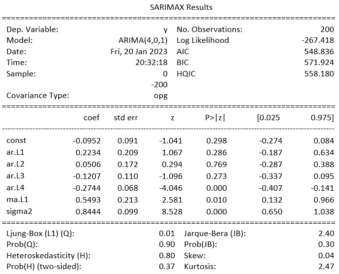

图 11.12 – ARIMA(4,0,1) 模型结果

让我们重新运行这个 ARMA(2,1)，它与 ARIMA(2,0,1) 相同，因为没有差分需要积分。这是我们通过视觉识别的，BIC 选择以下代码：

```py
from statsmodels.tsa.arima.model import ARIMA
arma_aic = ARIMA(y, order=(2,0,1),
                 enforce_stationarity=True, enforce_invertibility=True).fit()
print(arma_aic.summary())
```

我们现在可以看到我们的变量有了更好的拟合。所有系数都是显著的，模型指标仍然足够。我们识别出的模型对应以下方程：

(1 − 1.2765B + 0.6526 B 2) y t = (1 + 0.58B) ϵ t

我们可以将这些与我们的虚拟过程进行比较：

(1 − 1.28B + 0.682 B 2) y t = (1 − 0.58B) ϵ t

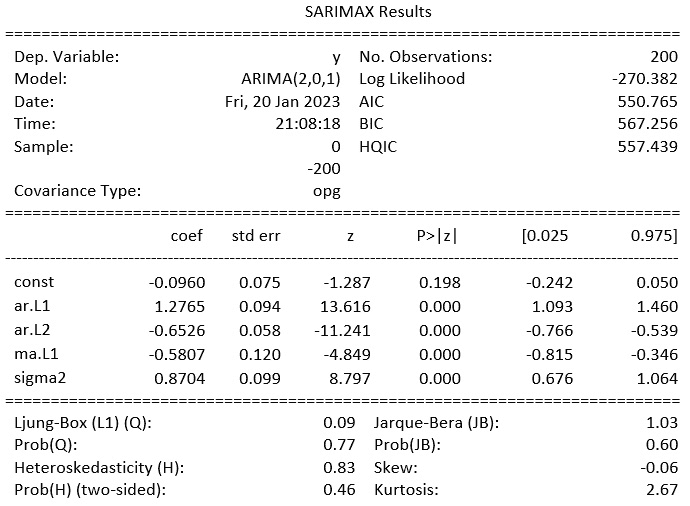

图 11.13 – ARIMA(2,0,1) 模型结果

#### 第 4 步 – 测试预测

现在，让我们通过在最后五个数据点上训练模型来交叉验证我们的模型，然后预测最后五个点，以便我们可以将它们与实际值进行比较。记住，我们的索引从 0 开始，所以我们的数据集在索引 199 结束：

```py
df_pred = arma_aic.get_prediction(start=195, end=199).summary_frame(alpha=0.05)
df_pred.index=[195,196,197,198,199]
```

我们可以在以下表格的 *均值* 列中看到我们的预测值：

| **y** | **mean** | **mean_se** | **mean_ci_lower** | **mean_ci_upper** | **actuals** |
| --- | --- | --- | --- | --- | --- |
| 195 | -0.01911 | 0.932933 | -1.84762 | 1.80940631 | 0.559875 |
| 196 | 0.58446 | 0.932933 | -1.24406 | 2.412975242 | 0.778127 |
| 197 | 0.479364 | 0.932933 | -1.34915 | 2.307879057 | 1.695218 |
| 198 | 0.914009 | 0.932933 | -0.91451 | 2.74252465 | 2.041826 |
| 199 | 0.80913 | 0.932933 | -1.01939 | 2.637645206 | 0.578695 |

图 11.14 – AR(4) 模型输出与实际值对比

让我们打印出我们模型的 **平均平方** **误差** (**ASE**)：

```py
print('Average Squared Error: ', np.mean((df_pred['mean'] - y[195:])**2))
```

这里我们看到 ASE：

`平均平方误差:` `0.6352208223437921`

我们的测试预测图显示在 *图 11**.15* 中。注意，我们的估计看起来比较保守。使用 ARMA(4,1) 可能会产生更接近的拟合，但泛化性较差。改进预测的一个方法是通过仅使用最近的数据点（相对于过程的主题知识）来构建模型。包括更大的数据集将产生一个更适合整体过程的拟合，而不是可能更相关的时段：


图 11.15 – ARMA(2,1) 测试预测

#### 第 5 步 – 构建预测

现在，让我们预测五个点：

```py
df_forecast = arma_aic.get_prediction(start=200, end=204).summary_frame(alpha=0.05)
df_forecast.index=[200, 201, 202, 203, 204]
forecast = np.hstack([np.repeat(np.nan, len(y)), df_pred['mean']])
```


图 11.16 – ARMA(2,1) 预测范围 = 5

最后关于 ARMA 模型的一点，我们**总是假设过程平稳性**。如果无法假设平稳性，则既不能使用自回归模型也不能使用移动平均模型。在本章的下一节中，我们将讨论将一阶差分整合到 ARMA 模型中，作为条件平稳化过程以克服非平稳性局限性的方法。

# 非平稳时间序列的模型

在上一节中，我们讨论了适用于平稳时间序列数据的 ARMA 模型。在本节中，我们将探讨非平稳时间序列数据，并将我们的模型扩展到可以处理非平稳数据。让我们首先查看一些样本数据（如图*11.17*所示）。有两个序列：美国 GDP（左）和航空旅客量（右）。

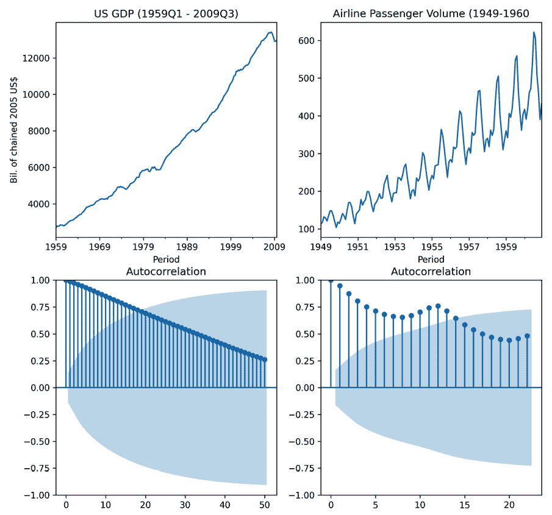

图 11.17 – 美国 GDP（左）和航空旅客（右）时间序列

美国 GDP 序列似乎表现出上升趋势，序列中也有一些变化。航空旅客量序列也表现出上升趋势，但序列中似乎也存在重复的模式。航空序列中的重复模式称为**季节性**。由于明显的趋势，这两个序列都是非平稳的。此外，航空旅客量序列似乎表现出非恒定的方差。我们将使用 ARIMA 模型来模拟 GDP 序列，并将模拟季节性 ARIMA。让我们来看看这些模型。

## ARIMA 模型

**ARIMA**是**自回归积分移动平均**的缩写。这个模型是 ARMA 模型的一种推广，可以应用于非平稳时间序列数据。这个模型新增的部分是“积分”，它是对时间序列进行**差分**操作以**平稳化**（使时间序列平稳）。时间序列平稳化后，我们可以对差分数据进行 ARMA 模型的拟合。让我们来看看这个模型的数学原理。我们将从理解差分是如何工作的开始，然后构建整个 ARIMA 模型。

### 差分

差分数据是计算连续数据点之间的差异。差分后的数据代表每个数据点之间的**变化**。我们可以将差分写成如下形式：

y′t = yt − yt−1

这个方程是一阶差分，意味着它是数据点之间的第一个差分。可能需要在对数据点进行额外的差分以使序列平稳化。二阶差分代表数据点之间的**变化的改变**。二阶差分可以写成如下形式：

y″t = y′t − y′t−1 = (yt − yt−1) − (yt−1 − yt−2)

“阶数”简单地指差分操作应用的次数。

### ARIMA 模型

如前所述，ARIMA 模型是 ARMA 模型，通过添加差分使时间序列平稳（使时间序列平稳化）。然后我们可以将 ARIMA 模型数学上表示如下，其中 y′ t 是差分序列，差分 d 次直到它平稳：

y′ t = c + ϕ 1 y′ t−1 + … + ϕ p y ′  t−p + ϵ t + θ 1 ϵ t−1 + … + ϕ q ϵ t−q

ARIMA 模型有三个阶数，分别表示为 ARIMA(p,d,q)：

+   p – 自回归阶数

+   d – 差分阶数

+   q – 移动平均阶数

对于像 ARIMA 这样的更复杂模型，我们倾向于用后移符号来描述它们，因为用后移符号表达这些模型更容易。使用后移符号，ARIMA 模型将采取以下形式：

(1 − ϕ 1 B − … − ϕ p B p) (1 − B) d y t = c + (1 + θ 1 B + … + θ q B q) 𝝐 t

↑          ↑         ↑

AR(p) d 差分             MA(q)

注意方程中差异项的表示：(1 − B) d。在上一节中，我们讨论了与平稳模型相关的根。在那个背景下，根始终位于单位圆之外。在 ARIMA 模型中，我们向模型中添加单位根。为了理解单位根的影响，让我们模拟一个 AR(1)模型，并观察当模型根值接近 1 时会发生什么。这些模拟显示在图 11.18 中。

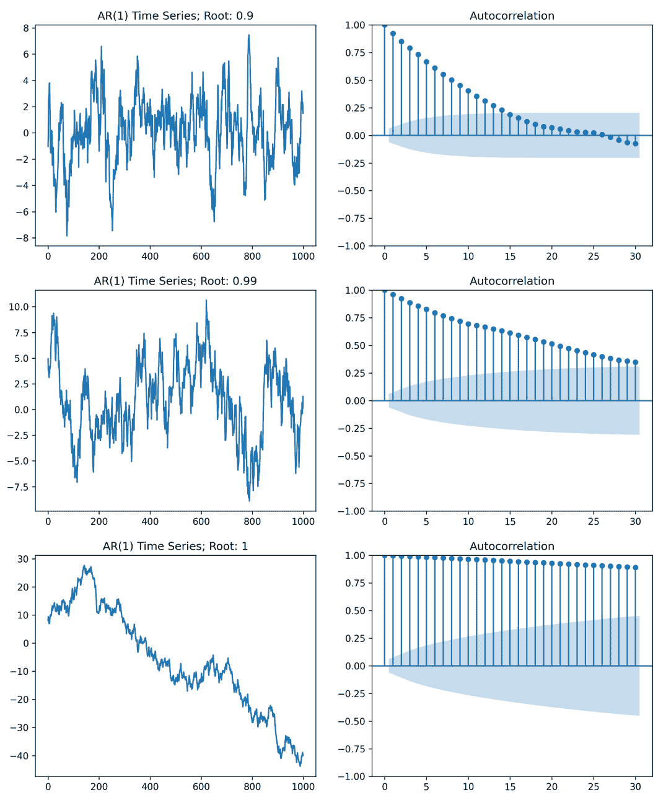

图 11.18 – 根值接近 1 的 AR(1)模拟

从图 11.18 所示的模拟中，我们可以得出两个观察结果。第一个观察结果是，随着根值逐渐接近 1，时间序列似乎表现出更多的游走行为。例如，中间时间序列相对于顶部时间序列，从平均值出发的游走行为更多。底部时间序列（根值为 1）似乎不像其他两个模拟那样回归到平均值。第二个观察结果是关于自相关性的。随着 AR(1)的根值接近 1，自相关性变得更强，并且随着滞后时间的增加而减慢。这两个观察结果是根值接近或等于 1 的序列的特征。此外，单位根的存在将主导时间序列的行为，使得从自相关图上容易识别。

### 适配 ARIMA 模型

适配 ARIMA 模型有两个步骤：(1)通过差分使序列平稳以确定差分阶数，(2)将 ARMA 模型拟合到得到的序列。在上一节中，我们讨论了如何拟合 ARMA 模型，因此在本节中，我们将重点关注第一步。

在本节的开始，我们展示了一个美国 GDP 的时间序列。我们将使用这个时间序列作为拟合 ARIMA 模型的案例研究。首先，让我们再次查看该序列及其自相关性。序列和自相关性显示在图 11.19 中。

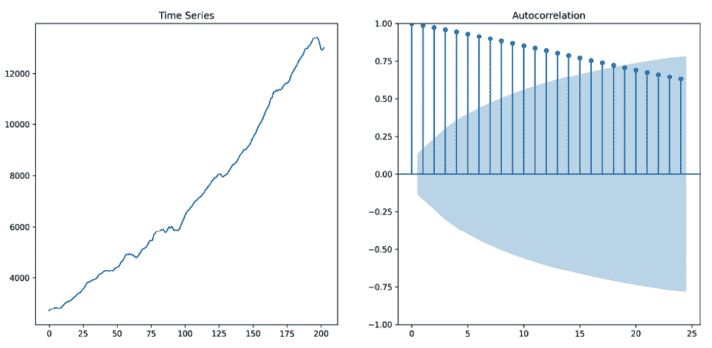

图 11.19 – 美国 GDP 时间序列和自相关图

从图 11**.19**所示的图中可以看出，美国 GDP 数据的时间序列是非平稳时间序列。时间序列表现出游走行为，自相关性强且缓慢下降。正如我们讨论的那样，这是单位根的特征行为。作为次要证据，我们可以使用 Dickey-Fuller 测试来检验单位根。Dickey-Fuller 测试的零假设是时间序列中存在单位根。以下代码显示了如何使用`pmdarima`中的 Dickey-Fuller 测试。测试返回的 p 值为 0.74，这意味着我们不能拒绝零假设，这意味着时间序列应该进行差分：

```py
Import pmdarima as pm
from sktime import datasets
y_macro_economic = datasets.load_macroeconomic()
adf_test = pm.arima.ADFTest()
adf_test.should_diff(y_macro_economic.realgdp.values)
# (0.7423236714537164, True)
```

我们可以使用`numpy`中的`diff`函数对时间序列进行第一次差分：

```py
first_diff = np.diff(y_macro_economic.realgdp.values, n=1)
```

进行第一次差分后，我们得到一个新的时间序列，如图 11**.20**所示：

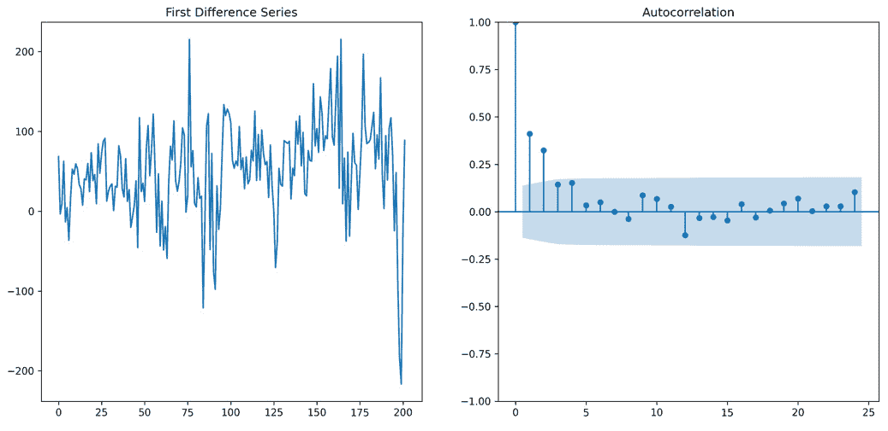

图 11.20 – 美国 GDP 时间序列的第一差分

美国 GDP 时间序列图 11**.20**中显示的第一个差异似乎具有平稳性。实际上，它似乎与 AR(2)模型一致。我们通过在第一差分数据上使用 Dickey-Fuller 测试来双重检查是否需要额外的差分：

```py
first_diff = np.diff(y_macro_economic.realgdp.values, n=1)
adf_test.should_diff(first_diff)
# (0.01, False)
```

Dickey-Fuller 测试对第一差分数据返回的 p 值为 0.01，这意味着我们可以拒绝零假设，我们可以停止对数据进行差分。这意味着我们的 ARIMA 模型对于这些数据将有一个差分阶数为 1（d = 1）。

在找到差分阶数后，我们可以将 ARMA 模型拟合到差分数据上。由于我们已经讨论了 ARMA 模型的拟合，我们将使用`pmdarima`提供的自动拟合方法。`pm.auto_arima`是一个用于自动将 ARIMA 模型拟合到数据的函数，然而，在这种情况下，我们将使用它来拟合差分序列的 ARMA 部分。以下代码块显示了`pm.auto_arima`对第一差分数据的输出：

```py
pm.auto_arima(
    first_diff, error_action='ignore', trace=True,
    suppress_warnings=True, maxiter=5, seasonal=False,
    test='adf'
)
Performing stepwise search to minimize aic
 ARIMA(2,0,2)(0,0,0)[0]             : AIC=2207.388, Time=0.03 sec
 ARIMA(0,0,0)(0,0,0)[0]             : AIC=2338.346, Time=0.01 sec
 ARIMA(1,0,0)(0,0,0)[0]             : AIC=2226.760, Time=0.02 sec
 ARIMA(0,0,1)(0,0,0)[0]             : AIC=2284.220, Time=0.01 sec
 ARIMA(1,0,2)(0,0,0)[0]             : AIC=2206.365, Time=0.02 sec
 ARIMA(0,0,2)(0,0,0)[0]             : AIC=2253.267, Time=0.02 sec
 ARIMA(1,0,1)(0,0,0)[0]             : AIC=2203.917, Time=0.01 sec
 ARIMA(2,0,1)(0,0,0)[0]             : AIC=2208.521, Time=0.02 sec
 ARIMA(2,0,0)(0,0,0)[0]             : AIC=2208.726, Time=0.02 sec
 ARIMA(1,0,1)(0,0,0)[0] intercept   : AIC=2193.482, Time=0.04 sec
 ARIMA(0,0,1)(0,0,0)[0] intercept   : AIC=2208.669, Time=0.03 sec
 ARIMA(1,0,0)(0,0,0)[0] intercept   : AIC=2195.212, Time=0.02 sec
 ARIMA(2,0,1)(0,0,0)[0] intercept   : AIC=2191.810, Time=0.03 sec
 ARIMA(2,0,0)(0,0,0)[0] intercept   : AIC=2190.196, Time=0.02 sec
 ARIMA(3,0,0)(0,0,0)[0] intercept   : AIC=2191.589, Time=0.03 sec
 ARIMA(3,0,1)(0,0,0)[0] intercept   : AIC=2193.567, Time=0.03 sec
Best model:  ARIMA(2,0,0)(0,0,0)[0] intercept
Total fit time: 0.349 seconds
```

由于差分数据的 ARMA 拟合是 ARMA(2,0)，原始时间序列的 ARIMA 阶数将是 ARIMA(2,1,0)。接下来，我们将查看从 ARIMA 模型进行预测。

### 使用 ARIMA 进行预测

一旦我们有一个拟合的模型，我们就可以用该模型进行预测。如前几章所述，在做出预测时，我们应该创建一个训练-测试分割，以便我们有数据可以与预测进行比较。模型应该只拟合训练数据以避免数据泄露。我们可以使用`pmdarima`中的`train_test_split`函数来分割数据。然后我们进行常规步骤：分割、训练和预测。以下代码块显示了这一过程：

```py
from pmdarima.model_selection import train_test_split
train, test =
    train_test_split(y_macro_economic.realgdp.values,
    train_size=0.9
)
arima = pm.auto_arima(
    train, out_of_sample_size=10,
    suppress_warnings=True, error_action='ignore',
    test='adf'
)
preds, conf_int = arima.predict(
    n_periods=test.shape[0], return_conf_int=True
)
```

以下代码使用`auto_arima`拟合 ARIMA 模型，然后使用 ARIMA 对象的`predict`方法预测测试集的大小。由代码生成的序列预测结果如图 11**.21**所示：

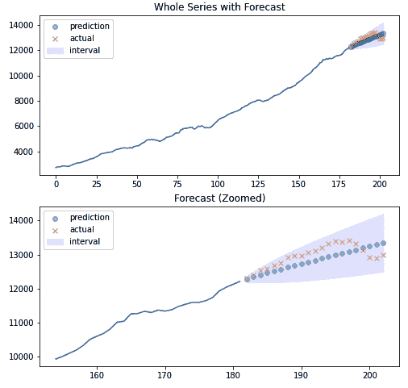

图 11.21 – 测试分割上的美国 GDP ARIMA 预测

在*图 11.21*中，美国 GDP 的预测似乎遵循数据的趋势，但没有捕捉到序列中的小变化。然而，这种变化在预测区间（标记为“区间”）中被捕捉到。这个模型似乎为测试数据提供了相当好的预测。请注意，区间随时间增加。这是因为预测在未来的不确定性增加。一般来说，短期预测更可能准确。

在本节中，我们基于 ARMA 模型，并使用差分将其扩展到非平稳数据，从而形成了 ARIMA 模型。在下一节中，我们将查看包含季节性影响的不平稳时间序列，并将进一步扩展 ARIMA 模型。

# 季节性 ARIMA 模型

让我们看看时间序列的另一个特征，称为**季节性**。季节性是指时间序列中存在一个在固定间隔重复的模式。季节性时间序列在自然界中很常见。例如，年天气模式和日阳光模式都是季节性模式。回到非平稳性部分的开始，我们展示了一个具有季节性的非平稳时间序列的例子。这个时间序列再次在*图 11.22*中展示，并附有它的 ACF 图。

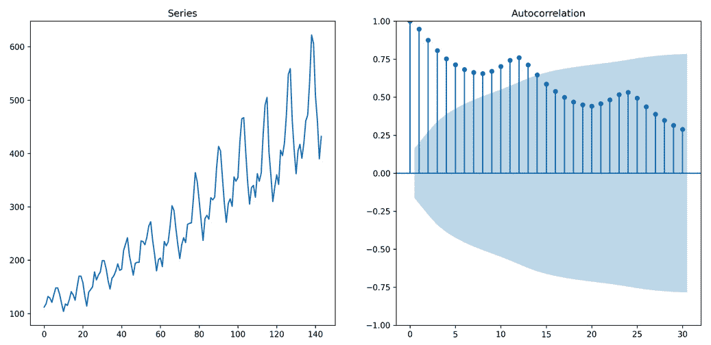

图 11.22 – 航空客流量数据和 ACF 图

*图 11.22*中显示的时间序列是 1949 年至 1960 年国际航空旅客的月度总计[*3*]。在这个时间序列中有一个明显的重复模式。为了模拟这类数据，我们需要在 ARIMA 模型中添加一个额外的项来解释季节性。

### 季节性差分

我们将使用与 ARIMA 相同的方法来建模这种类型的时间序列。我们首先将使用差分来使数据平稳，然后对差分数据进行 ARMA 模型拟合。对于季节性时间序列，我们需要使用季节性差分来消除季节性影响，这可以通过数学公式表示：

y′t = yt − yt−T

其中 T 是季节的周期。例如，*图 11.22*中的时间序列表现出月度季节性，每个数据点代表一个月；因此，航空客流量数据的 T = 12。然后，对于航空数据，我们将使用以下差分方程来消除季节性：

y′t = yt − yt−12

我们还可以通过观察 ACF 图中峰值出现的位置来识别季节性。*图 11.22*中的 ACF 图显示在 12 处有一个峰值，表明季节周期为 12，这与我们对时间序列的了解一致。

在本节稍后，我们将使用`pmdarima`展示如何应用季节差分。让我们看看季节性是如何包含在模型中的。

### 季节性 ARIMA

如在 ARIMA 部分所述，我们将对原始序列进行差分，然后对差分数据进行平稳模型拟合。然后我们的时间序列将由以下方程描述，其中 y′t 是差分序列（包括季节性和顺序差分）：

y′t = c + ϕ1 y′t−1 + … + ϕp y′t−p + ϵt + θ1 ϵt−1 + … + ϕq ϵt−q

我们可以使用后移符号表示整个模型：

(1 − ϕ1 B − … − ϕp Bp) (1 − B) d (1 − Bs)y t = c + (1 + θ1 B + … + θq Bq) 𝝐t

↑     ↑    ↑                ↑

AR(p)         d 差分       季节差分                                 MA(q)

我们在方程中添加了一个考虑季节性的新项：(1 − Bs)。我们向模型添加了一个新的阶数参数：s。此模型通常表示为 ARUMA(p,d,q,s)。

SARIMA 模型

在本节中，我们仅涵盖季节差分。存在更复杂的模型，允许移动平均季节性和自回归季节性，称为 SARIMA，表示为 SARIMA(p,d,q)(P,D,Q)[m]。这些模型超出了本章的范围。然而，我们鼓励读者在掌握本章和下一章的主题后进一步探索这些模型。本章中涵盖的 ARIMA 模型是 SARIMA 模型的一个子集，它考虑了季节差分，即 SARIMA(p,d,q)(P,D,Q)[m]中的“D”阶数。

正如我们为 ARIMA 添加的(1 − B)d 项一样，(1 − Bs)项向单位圆添加了根。然而，与(1 − B)d 的根不同，(1 − Bs)的根均匀分布在单位圆周围。这些根可以使用`numpy`和`matplotlib`或使用计算智能工具（如 Wolfram Alpha [`www.wolframalpha.com/`](https://www.wolframalpha.com/)）进行计算和绘制。

### 拟合具有季节性的 ARIMA 模型

我们将采取以下步骤来拟合具有季节性的 ARIMA 模型：

+   使用差分去除季节性。

+   使用差分去除额外的非平稳性。

+   将平稳模型拟合到结果序列。

这本质上是我们用来拟合 ARIMA 模型的过程，但有一个额外的步骤来处理季节性成分。让我们通过一个使用航空公司数据的例子来讲解。

我们将首先使用差分来去除时间序列的季节性成分。回想一下，航空公司时间序列的季节周期是 12，这意味着我们需要在滞后 12 处进行差分，如下方程所示：

y′t = yt − yt−12

我们可以使用`pmdarima`中的`diff`函数执行此差分。以下代码显示了如何在航空公司数据上执行第 12 滞后差分：

```py
import pmdarima as pm
from sktime import datasets
y_airline = datasets.load_airline()
series = pm.utils.diff( y_airline.values, lag=12)
```

在进行季节差分后，我们得到*图 11.23*中显示的差分序列以及 ACF 图。时间序列的季节部分似乎已经完全去除。差分序列似乎没有显示出任何重复的模式。此外，ACF 图没有显示原始数据 ACF 图中存在的季节性峰值：

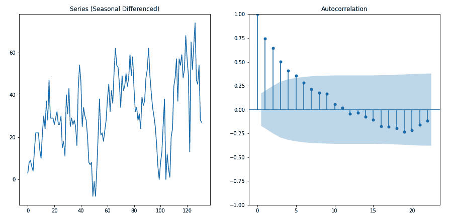

图 11.23 – 季节差分后的航空公司数据

在去除时间序列的季节部分后，我们需要确定是否需要取任何额外的差分来使新的时间序列平稳化。*图 11.23*中的差分序列似乎显示出趋势。原始数据也显示出趋势。与之前一样，我们可以使用 Dickey-Fuller 测试来获取更多证据，以确定我们是否应该应用额外的差分。对这个序列运行 Dickey-Fuller 测试将得到一个 p 值为 0.099，这表明我们应该对序列取差分以解释单位根：

```py
adf_test = pm.arima.ADFTest()
adf_test.should_diff(series)
# (0.09898694171553156, True)
```

对序列取一阶差分将导致*图 11.24*中显示的序列。在取这两个差分之后，序列似乎已经足够平稳化。

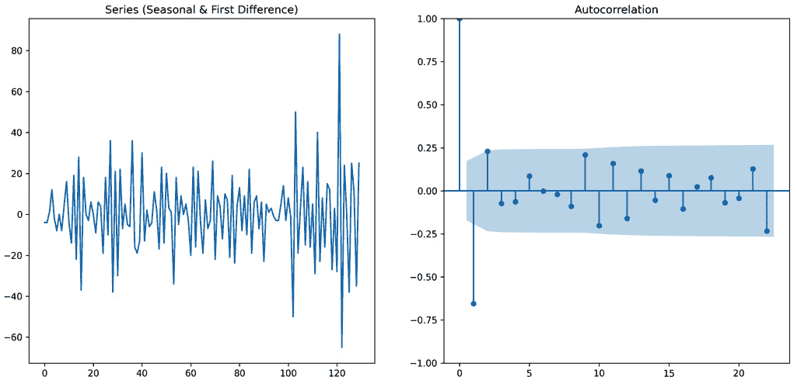

图 11.24 – 季节差分和一阶差分后的航空公司数据

*图 11.24*中的序列显示了航空公司数据的平稳化版本。根据 ACF 图，我们应该能够对平稳化序列拟合一个相对简单的 ARMA 模型。我们将使用`auto_arima`函数进行自动拟合，就像我们在 ARIMA 部分所做的那样：

```py
pm.auto_arima(
    series, error_action='ignore', trace=False,
    suppress_warnings=True, maxiter=5, seasonal=False,
    test='adf'
)
# ARIMA(1,0,0)(0,0,0)[0]
```

使用`auto_arima`对差分数据进行拟合返回一个 AR(1)模型。正如我们所期望的，这是一个简单的模型。

将所有这些放在一起，我们得到的模型是 ARUMA(1,1,0,12)。与之前的 ARIMA 示例一样，我们可以使用`auto_arima`来拟合这个模型，但我们在本例中详细说明了差分步骤，以帮助建立对每个差分元素对序列影响的理解。现在让我们看看`auto_arima`的直接拟合结果：

```py
pm.auto_arima(
    y_airline.values, error_action='ignore', trace=True,
    suppress_warnings=True, maxiter=5, seasonal=True, m=12,
    test='adf'
)
# Best model:  ARIMA(1,1,0)(0,1,0)[12]
```

我们看到`auto_arima`找到了与我们使用手动差分得到相同的模型。注意模型以 SARIMA 格式表示（参见关于 SARIMA 的早期说明）。(0,1,0)[12]表示当季节性有一个差分时，季节性为 12。现在我们有了拟合模型，让我们看看我们对季节性模型的预测。

### 具有季节性的 ARIMA 预测

一旦我们有了拟合模型，我们就可以用这个模型进行预测。如 ARIMA 预测部分所述，我们应该何时进行训练-测试集划分以便我们有数据来比较预测结果？我们将使用相同的程序：分割数据，训练模型，并在测试集大小上进行预测：

```py
train, test = train_test_split(y_airline.values, train_size=0.9)
sarima = pm.auto_arima(
    train, error_action='ignore', trace=True,
    suppress_warnings=True, maxiter=5, seasonal=True, m=12,
    test='adf'
)
preds, conf_int = sarima.predict(n_periods=test.shape[0], return_conf_int=True)
```

前面的代码使用`auto_arima`拟合了一个完整的 SARIMA 模型，然后使用`predict`方法预测测试集的大小。由代码生成的序列预测显示在*图 11.25*中。


图 11.25 – 航空公司数据的 SARIMA 预测

*图 11.25*中的航空公司数据预测似乎很好地捕捉了数据的变动。这可能是由于时间序列中季节性成分的强度。请注意，预测区间随着时间的推移而增加，就像 ARIMA 预测区间一样，但区间遵循序列的一般模式。这是由于对序列中季节性的额外知识的影响。

在本节中，我们讨论了具有季节性的 ARIMA 模型，并展示了如何去除季节性成分。我们还研究了具有季节性的模型预测。在下一节中，我们将更详细地探讨验证时间序列模型。

# 更多关于模型评估

在前面的章节中，我们讨论了其他准备数据、测试和验证模型的方法。在本节中，我们将讨论如何验证时间序列模型，并介绍几种验证时间序列模型的方法。我们将涵盖以下模型评估方法：**重采样**、**移动**、**优化持久预测**和**滚动窗口预测**。

本节考虑的实际数据集是从 Yahoo Finance 数据库中收集的 1962 年 1 月 19 日至 2021 年 12 月 19 日的可口可乐股票数据，用于股票价格预测。这是一项时间序列分析，用于预测给定股票的未来股票价值。读者可以从 Kaggle 平台下载该数据集进行分析。为了激发研究兴趣，我们首先去探索可口可乐股票数据集：

```py
data = pd.read_csv("COCO COLA.csv", parse_dates=["Date"], index_col="Date")
```

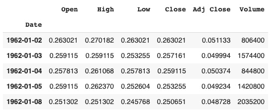

图 11.26 – 可口可乐数据集

日期索引与从 1962 年 1 月 19 日到 2021 年 12 月 19 日的 15096 个交易日相关。这里的`High`和`Low`列分别指每个交易日的最高和最低价格。`Open`和`Close`分别指在同一个交易日的市场开盘和收盘时的股价。每天交易的股票总量指的是`Volume`列，而最后一列（`Adj Close`）指的是调整后的值（结合股票分割、股息等）。为了说明重采样、移动、滚动窗口和扩展窗口的性能，我们仅使用 2016 年的`Open`列：

```py
data= data[data.index>='2016-01-01'][['Open']]
```

数据是根据交易日期收集的。然而，我们将按月进行这项研究。使用**重采样**技术将数据从日聚合到月。这个想法激励我们引入这项技术。

#### 重采样

`resample()`函数用于更改时间频率。以下代码展示了 Python 中的重采样技术：

```py
fig, ax = plt.subplots(4,1, figsize=(12,8))
ax[0].set_title('Original stock price from 2016')
ax[0].plot(data)
ax[1].plot(data.resample('7D').mean())
ax[1].set_title('7 days - Downsampling stock price from 2016')
ax[2].plot(data.resample('M').mean())
ax[2].set_title('Monthly Downsampling  stock price from 2016')
ax[3].plot(data.resample('Y').mean())
ax[3].set_title('Yearly Downsampling stock price from 2016')
fig.tight_layout(pad=5.0)
plt.show()
```

这是前一段代码的输出：

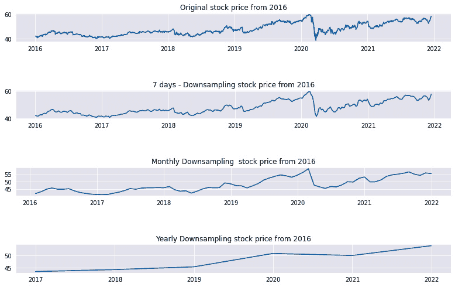

图 11.27 – Coco Cola 数据集的重采样

我们观察到当时间频率降低时，图表变得更加平滑。接下来，我们将讨论时间序列中使用的平移方法。

#### 平移

在时间序列分析中，使用`shift()`函数创建新特征并不罕见：

```py
data["price_lag_1"] = data["Open"].shift(1)
data.head()
```

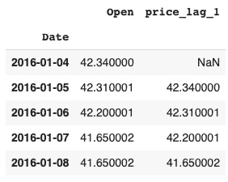

图 11.28 – Coco Cola 股票数据的前五行，价格已调整一次

观察到`price_lag_1`列的第一行填充了一个 NaN 值。我们可以用`fill_value`参数替换缺失值：

```py
data["price_lag_1"] = data["Open"].shift(1, fill_value = data['Open'].mean())
```

最后，我们讨论预测方法，如**优化持久性**和**滚动窗口预测**。有关这些方法的另一个资源可以在[*3*]中找到。

#### 优化持久性预测

我们将使用重采样将 Coco Cola 股票价格的时间频率从 2016 年开始转换为月度频率，然后我们应用优化持久性预测技术，使用之前的观测值来预测未来的值。RMSE 得分用于评估持久性模型：

```py
from sklearn.metrics import mean_squared_error
import math
train, test = data.resample('M').mean()['Open'][0:-24], data.resample('M').mean()['Open'][-24:]
persistence = range(1, 25)
RMSE_scores = []
for p in persistence:
    history = [x for x in train]
    pred = []
    for i in range(len(test)):
    # Prediction on test set
        yhat = history[-p]
        pred.append(yhat)
    history.append(test[i])
    # RMSE score performance
    rmse = math.sqrt(mean_squared_error(test, pred))
    RMSE_scores.append(rmse)
    print(f'p={p} RMSE={rmse}')
```

输出如下：


图 11.29 – 优化持久性预测的 RMSE 得分

我们观察到当 p=6 时，RMSE 得分是最小的：

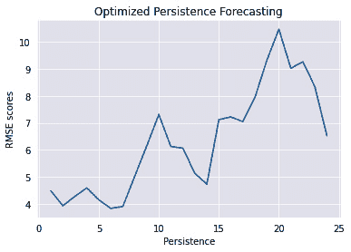

图 11.30 – 优化持久性预测，测试与预测对比

再次运行持久性测试，使用 p=6，我们可以看到以下结果：

```py
history = [x for x in train]
pred = []
for i in range(len(test)):
    # Prediction
    yhat = history[-6]
    pred.append(yhat)
    history.append(test[i])
# Plots
plt.plot(list(test))
plt.plot(pred)
plt.show()
```

然后，我们可以生成一个可视化：

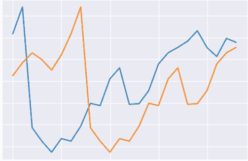

图 11.31 – 优化持久性预测

蓝色曲线是测试值，橙色曲线是预测值。

#### 滚动窗口预测

这种技术创建了一个具有指定窗口大小的**滚动窗口**，然后在这个窗口内进行统计计算，用于预测，该预测会滚动通过研究中使用的数据。我们使用 2016 年的 Coco Cola 股票价格数据集，采用月度重采样数据集进行类似的研究：

```py
from numpy import mean
train, test = data.resample('M').mean()['Open'][0:-24], data.resample('M').mean()['Open'][-24:]
window = range(1, 25)
RMSE_scores = []
for w in window:
    history = [x for x in train]
    pred = []
    for i in range(len(test)):
    # Prediction on test set
        yhat = mean(history[-w:])
        pred.append(yhat)
    history.append(test[i])
    # RMSE score performance
    rmse = math.sqrt(mean_squared_error(test, pred))
    RMSE_scores.append(rmse)
    print(f'w={w} RMSE={rmse}')
plt.plot(window, RMSE_scores)
plt.title('Rolling Forecasting')
plt.xlabel('Windows sizes')
plt.ylabel('RMSE scores')
plt.show()
```

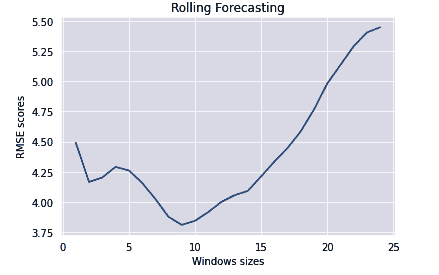

图 11.32 – 滚动窗口预测

当窗口大小为 9 时，RMSE 为 3.808 是最小的。再次运行 Python 代码，使用窗口大小=9，我们得到与优化持久性预测相似的可视化效果。

# 概述

在本章中，我们讨论了从平稳时间序列模型（如 ARMA）到非平稳模型（如 ARIMA）的各种建模方法来建模一元时间序列数据。我们从平稳模型开始，讨论了如何根据时间序列的特征来识别建模方法。然后，我们在平稳模型的基础上通过在模型中添加一个项来使时间序列平稳化。最后，我们讨论了季节性和如何在 ARIMA 模型中考虑季节性。虽然这些方法在预测方面非常强大，但它们并没有结合来自其他外部变量的潜在信息。正如前一章所述，外部变量可以帮助提高预测。在下一章中，我们将探讨时间序列数据的多元方法，以利用其他解释变量。

# 参考文献

请参考最终文档，了解参考文献的格式。

1.  *使用 R 进行应用时间序列分析*，W. Woodward, H. Gray, A. Elliott. Taylor & Francis Group, LLC. 2017.

1.  Box, G. E. P., Jenkins, G. M. 和 Reinsel, G. C. (1976) *时间序列分析、预测与控制*。第三版。Holden-Day. 系列 G.

1.  Brownlee, J, (2017) *简单时间序列预测模型以测试您不要欺骗自己* ([`machinelearningmastery.com/simple-time-series-forecasting-models/`](https://machinelearningmastery.com/simple-time-series-forecasting-models/)).
