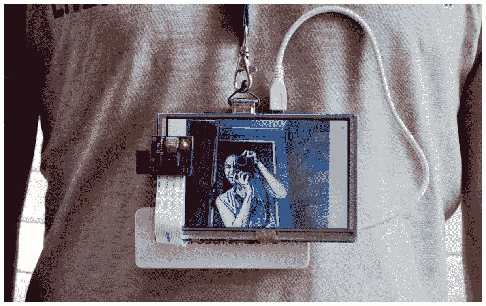
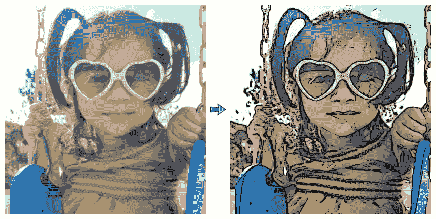
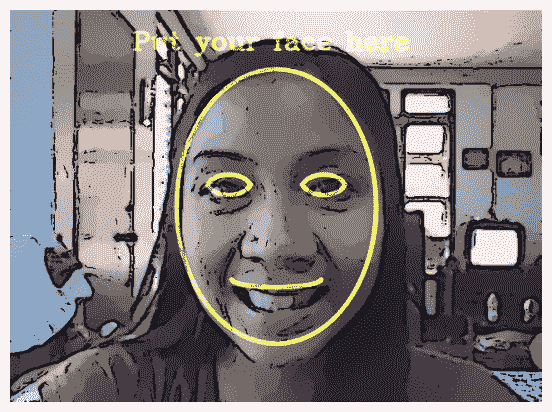
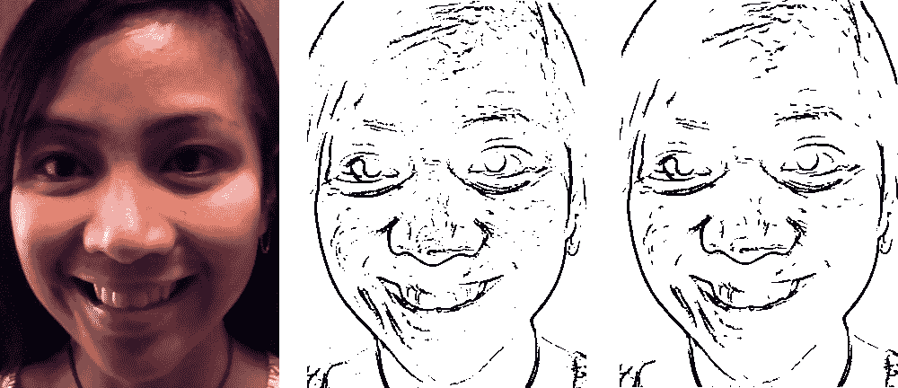
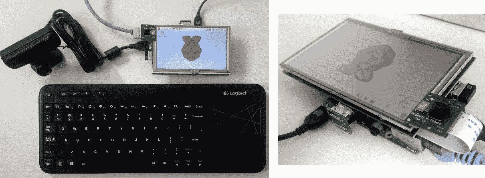
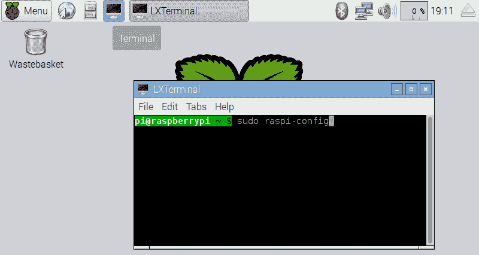
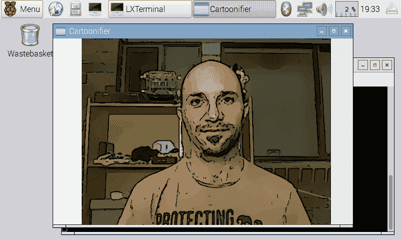
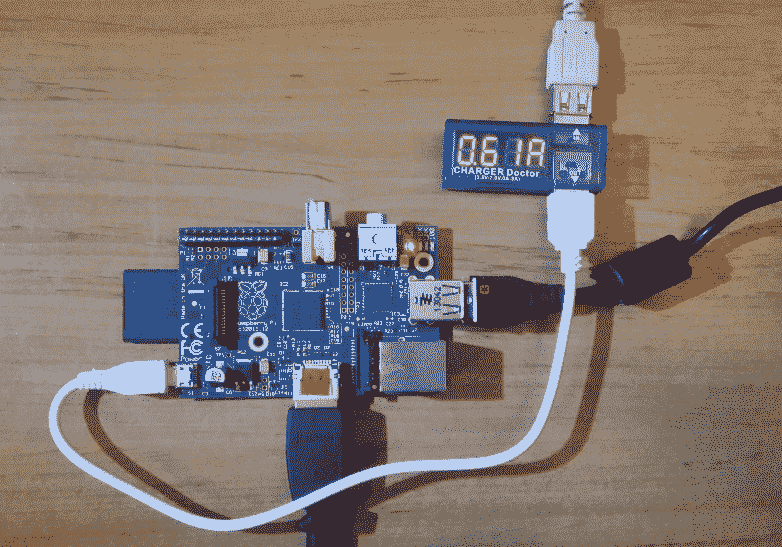

# 十三、使用树莓派的卡通化和肤色分析

本章将介绍如何为台式机和小型嵌入式系统(如 Raspberry PI)编写一些图像处理过滤器。 首先，我们为桌面(使用 C/C++)进行开发，然后将项目移植到 Raspberry PI，因为这是为嵌入式设备开发时推荐的场景。 本章将介绍以下主题：

*   如何将真实图像转换为草图
*   如何转换成一幅画并叠加素描来制作卡通画
*   一种可怕的邪恶模式，创造坏角色而不是好角色
*   一个基本的皮肤探测仪和皮肤变色器，可以让人拥有绿色的外星人皮肤
*   最后，如何创建一个基于桌面应用的嵌入式系统

请注意，**嵌入式系统**基本上是放置在产品或设备内部的计算机主板，旨在执行特定任务，而**Raspberry Pi**则是一款非常低成本且受欢迎的用于构建嵌入式系统的主板：



上面的图片展示了你在这一章之后可以做什么：一个电池供电的树莓 Pi plus 屏幕，你可以戴着它去参加动漫展，把每个人都变成卡通人物！

我们希望自动使真实世界的摄影机帧看起来像是卡通中的。 基本的想法是在平坦的部分填上一些颜色，然后在坚固的边缘画出粗线条。 换句话说，平坦的区域应该变得更加平坦，边缘应该变得更加清晰。 我们将检测边缘，平滑平坦的区域，并在顶部绘制增强的边缘，以产生卡通或漫画效果。

在开发嵌入式计算机视觉系统时，最好先构建一个完全工作的桌面版本，然后再将其移植到嵌入式系统上，因为桌面程序的开发和调试比嵌入式系统容易得多！ 因此，本章将从一个完整的 Cartoonizer 桌面程序开始，您可以使用您喜欢的 IDE(例如，Visual Studio、XCode、Eclipse 或 QtCreator)创建它。 当它在您的桌面上正常工作后，最后一节将展示如何基于桌面版本创建嵌入式系统。 许多嵌入式项目需要嵌入式系统的一些自定义代码，例如使用不同的输入和输出，或者使用一些特定于平台的代码优化。 然而，在本章中，我们实际上将在嵌入式系统和桌面上运行相同的代码，因此我们只需要创建一个项目。

该应用使用**OpenCV**的 GUI 窗口，初始化相机，并且对于每个相机帧，它调用包含本章中的大部分代码的`cartoonifyImage()`函数。 然后，它会在 GUI 窗口中显示处理后的图像。 本章将解释如何使用 USB 网络摄像头和基于桌面应用的嵌入式系统，使用 Raspberry PI Camera 模块从头开始创建桌面应用。 因此，首先您将在您喜欢的 IDE 中创建一个 Desktop 项目，其中包含一个`main.cpp`文件来保存以下部分中给出的 GUI 代码，例如主循环、网络摄像头功能和键盘输入，并且您将使用图像处理操作创建一个包含本章大部分代码的`cartoon.cpp`*和*文件，其中的大部分代码位于一个名为`cartoonifyImage()`的函数中。

# 访问网络摄像头

要访问计算机的网络摄像头或摄像头设备，只需在`cv::VideoCapture`个对象(OpenCV 访问摄像头设备的方法)上调用`open()`函数，并将`0`作为默认摄像头 ID 号传递即可。 有些计算机连接了多台摄像机，或者它们不能使用默认摄像机`0`，因此通常做法是允许用户将所需的摄像机编号作为命令行参数传递，例如，如果他们想尝试摄像机`1`、`2`或`-1`。 我们还将尝试使用`cv::VideoCapture::set()`功能将相机分辨率设置为 640 x 480，以便在高分辨率相机上运行得更快。

Depending on your camera model, driver, or system, OpenCV might not change the properties of your camera. It is not important for this project, so don't worry if it does not work with your webcam.

您也可以将此代码放入您的文件`main.cpp`的`main()`*和*函数中：

```cpp
auto cameraNumber = 0; 
if (argc> 1) 
cameraNumber = atoi(argv[1]); 

// Get access to the camera. 
cv::VideoCapture camera; 
camera.open(cameraNumber); 
if (!camera.isOpened()) { 
   std::cerr<<"ERROR: Could not access the camera or video!"<< std::endl; 
   exit(1); 
} 

// Try to set the camera resolution. 
camera.set(cv::CV_CAP_PROP_FRAME_WIDTH, 640); 
camera.set(cv::CV_CAP_PROP_FRAME_HEIGHT, 480);
```

摄像头初始化完成后，可以将当前摄像头图像抓取为 OPENCV`cv::Mat`对象(OpenCV 的图像容器)。 您可以使用 C++ 流运算符从`cv::VideoCapture`对象中的`cv::Mat`对象抓取每个摄影机帧，就像从控制台获取输入一样。

OpenCV makes it very easy to capture frames from a video file (such as an AVI or MP4 file) or network stream instead of a webcam. Instead of passing an integer such as` camera.open(0)`, pass a string such as `camera.open("my_video.avi")` and then grab frames just like it was a webcam. The source code provided with this book has an `initCamera()` function that opens a webcam, video file, or network stream.

# 桌面应用的主摄像头处理循环

如果您希望使用 OpenCV 在屏幕上显示 GUI 窗口，您可以调用*、*、`cv::namedWindow()`函数，然后调用每个图像的`cv::imshow()`函数，但您还必须每帧调用一次`cv::waitKey()`*、*，否则您的窗口根本不会更新！ 调用*和*`cv::waitKey(0)`将永远等待，直到用户点击窗口中的某个键，但像`waitKey(20)`或更高的正数将至少等待那么多毫秒。

将此主循环放入`main.cpp`文件中，作为您的实时相机应用的基础：

```cpp
while (true) { 
    // Grab the next camera frame. 
    cv::Mat cameraFrame; 
    camera >> cameraFrame; 
    if (cameraFrame.empty()) { 
        std::cerr<<"ERROR: Couldn't grab a camera frame."<< 
        std::endl; 
        exit(1); 
    } 
    // Create a blank output image, that we will draw onto. 
    cv::Mat displayedFrame(cameraFrame.size(), cv::CV_8UC3); 

    // Run the cartoonifier filter on the camera frame. 
    cartoonifyImage(cameraFrame, displayedFrame); 

    // Display the processed image onto the screen. 
    imshow("Cartoonifier", displayedFrame); 

    // IMPORTANT: Wait for atleast 20 milliseconds, 
    // so that the image can be displayed on the screen! 
    // Also checks if a key was pressed in the GUI window. 
    // Note that it should be a "char" to support Linux. 
    auto keypress = cv::waitKey(20); // Needed to see anything! 
    if (keypress == 27) { // Escape Key 
       // Quit the program! 
       break; 
    } 
 }//end while
```

# 生成黑白草图

为了获得相机帧的草图(黑白素描)，我们将使用边缘检测滤镜，而要获得彩色绘画，我们将使用边缘保持滤镜(双边滤镜)来进一步平滑平坦区域，同时保持边缘完整。 通过将素描叠加在彩画上，我们获得了卡通效果，如前面最终应用的截图所示。

有许多不同的边缘检测滤波器，例如 Sobel、Scharr 和 Laplacian 滤波器，或者 Canny 边缘检测器。 我们将使用拉普拉斯边缘过滤器，因为与 Sobel 或 Scharr 相比，它生成的边缘看起来最像手绘草图，并且与 Canny 边缘检测器相比非常一致，后者生成非常干净的线条图，但更多地受到相机帧中随机噪声的影响，因此线条图会在帧之间经常发生剧烈变化。

然而，在使用拉普拉斯边缘滤波器之前，我们仍然需要降低图像中的噪声。 我们将使用中值滤波器，因为它能很好地去除噪声，同时保持边缘的锐化，但不像双边滤波器那样慢。 由于拉普拉斯滤镜使用灰度图像，我们必须将 OpenCV 的默认 BGR 格式转换为灰度图像。 在空的`cartoon.cpp`*和*文件中，将此代码放在顶部，这样您就可以访问 OpenCV 和 STD C++ 模板，而无需在任何地方键入`cv::`和`std::`：

```cpp
// Include OpenCV's C++ Interface 
 #include <opencv2/opencv.hpp> 

 using namespace cv; 
 using namespace std;
```

将此代码和所有剩余代码放在您的文件`cartoon.cpp`中的一个`cartoonifyImage()`函数中：

```cpp
Mat gray; 
 cvtColor(srcColor, gray, CV_BGR2GRAY); 
 const int MEDIAN_BLUR_FILTER_SIZE = 7; 
 medianBlur(gray, gray, MEDIAN_BLUR_FILTER_SIZE); 
 Mat edges; 
 const int LAPLACIAN_FILTER_SIZE = 5; 
 Laplacian(gray, edges, CV_8U, LAPLACIAN_FILTER_SIZE);
```

拉普拉斯滤镜生成亮度不同的边缘，因此为了使边缘看起来更像草图，我们应用二进制阈值使边缘变为白色或黑色：

```cpp
Mat mask; 
 const int EDGES_THRESHOLD = 80; 
 threshold(edges, mask, EDGES_THRESHOLD, 255, THRESH_BINARY_INV);
```

在下图中，您可以看到最原始的图像(左侧)和生成的边缘蒙版(右侧)，它们看起来类似于草图。 在生成彩色绘画(稍后解释)之后，我们还将此边缘蒙版放在顶部以绘制黑色线条图：


# 生成一幅彩画和一幅卡通

一个强大的双边滤镜可以平滑平坦的区域，同时保持边缘的锐利，因此作为自动漫画器或绘画滤镜是很棒的，除了它非常慢(即，以秒甚至分钟衡量，而不是毫秒！)。 因此，我们将使用一些技巧来获得一个好的卡通器，同时仍然以可以接受的速度运行。 我们可以使用的最重要的技巧是，我们可以在更低的分辨率下执行双边过滤，它仍然具有与全分辨率类似的效果，但运行速度要快得多。 让我们将总像素数减少四个(例如，半宽半高)：

```cpp
Size size = srcColor.size(); 
Size smallSize; 
smallSize.width = size.width/2; 
smallSize.height = size.height/2; 
Mat smallImg = Mat(smallSize, CV_8UC3); 
resize(srcColor, smallImg, smallSize, 0,0, INTER_LINEAR);
```

我们不会使用大的双边滤镜，而是应用许多小的双边滤镜，在更短的时间内产生强大的卡通效果。 我们将截断滤镜(参见下图)，以便它不执行整个滤镜(例如，当钟形曲线宽为 21 像素时，滤镜大小为 21 x 21)，而只使用获得令人信服的结果所需的最小滤镜大小(例如，即使钟形曲线宽为 21 像素，滤镜大小也仅为 9 x 9)。 此截断滤镜将应用滤镜的主要部分(灰色区域)，而不会在滤镜的次要部分(曲线下的白色区域)上浪费时间，因此它的运行速度会快几倍：


因此，我们有四个主要参数来控制双边滤镜：颜色强度、位置强度、大小和重复计数。 我们需要一个 Temp`Mat`，因为`bilateralFilter()`函数不能覆盖其输入(称为**就地处理**)，但我们可以应用一个存储 Temp`Mat`的筛选器和另一个存储回输入的筛选器：

```cpp
Mat tmp = Mat(smallSize, CV_8UC3); 
auto repetitions = 7; // Repetitions for strong cartoon effect. 
for (auto i=0; i<repetitions; i++) { 
    auto ksize = 9; // Filter size. Has large effect on speed. 
    double sigmaColor = 9; // Filter color strength. 
    double sigmaSpace = 7; // Spatial strength. Affects speed. 
 bilateralFilter(smallImg, tmp, ksize, sigmaColor, sigmaSpace); bilateralFilter(tmp, smallImg, ksize, sigmaColor, sigmaSpace); 
}
```

请记住，这是应用于缩小的图像，因此我们需要将图像扩展回原始大小。 然后，我们可以覆盖前面找到的边缘蒙版。 要将边缘蒙版和素描部分叠加到双边滤镜和画板(下图左侧)上，我们可以从黑色背景开始，然后用不是素描和蒙版中的边缘的像素复制第一幅画：

```cpp
Mat bigImg; 
 resize(smallImg, bigImg, size, 0,0, INTER_LINEAR); 
 dst.setTo(0); 
 bigImg.copyTo(dst, mask);
```

最终的结果是两张原始素描照片的卡通版本，如下图右手边所示，画中的*素描*蒙版叠加在画上：



# 使用边缘滤波器生成邪恶模式

动画片和漫画总是有好的和坏的人物。 搭配得当的边缘滤镜，就能从最纯真、最好看的人身上生成可怕的影像！ 诀窍是使用一个小的边缘过滤器，它将在整个图像中找到许多边缘，然后使用一个小的中值过滤器合并边缘。

我们将在降噪的灰度图像上执行此操作，因此仍应使用前面用于将原始图像转换为灰度并应用 7x7 中值滤波器的代码(下图中的第一个图像显示了灰度中值模糊的输出)。 如果我们沿着*x*和*y*(图中第二幅图像)应用 3 x 3 Scharr 渐变滤镜，然后使用截止值非常低的二进制阈值(图中第三幅图像)和 3 x 3 中值模糊，从而产生最终的*邪恶*遮罩(图中第四幅图像)，而不是使用拉普拉斯过滤器和二值阈值，我们可以获得更可怕的外观：

```cpp
Mat gray;
 cvtColor(srcColor, gray, CV_BGR2GRAY);
 const int MEDIAN_BLUR_FILTER_SIZE = 7;
 medianBlur(gray, gray, MEDIAN_BLUR_FILTER_SIZE);
 Mat edges, edges2;
 Scharr(srcGray, edges, CV_8U, 1, 0);
 Scharr(srcGray, edges2, CV_8U, 1, 0, -1);
 edges += edges2;
 // Combine the x & y edges together.
 const int EVIL_EDGE_THRESHOLD = 12
 threshold(edges, mask, EVIL_EDGE_THRESHOLD, 255,
 THRESH_BINARY_INV);
 medianBlur(mask, mask, 3)
```

下图显示了第四幅图像中应用的邪恶效果：


现在我们有了一个新的*邪恶*蒙版，我们可以将这个蒙版叠加到*卡通化的*绘画图像上，就像我们对常规的*素描*边缘蒙版所做的那样。 最终结果如下图右侧所示：


# 使用皮肤检测生成外来模式

现在我们已经有了一个新的*素描*模式、一个新的*卡通*模式(*画*+*素描*面具)和一个新的*恶*模式(*画*)+*恶*面具，为了好玩，让我们来试试更复杂的东西：一个*外星人*。

# 皮肤检测算法

有许多不同的技术用于检测皮肤区域，从使用**RGB**(简写为**红-绿-蓝**)或**HSV**(简写为**色调-饱和度-亮度**)的简单颜色阈值，或者颜色直方图计算和重新投影，到复杂的混合模型的机器学习算法，这些混合模型需要在**CIELab**的颜色中进行相机校准。 但是，即使是复杂的方法也不一定适用于各种相机、照明条件和皮肤类型。 由于我们希望我们的皮肤检测在嵌入式设备上运行，无需任何校准或训练，而我们只是将皮肤检测用于有趣的图像过滤器；对于我们来说，使用简单的皮肤检测方法就足够了。 然而，Raspberry Pi 相机模块中的微型相机传感器的颜色响应往往差异很大，我们希望支持任何肤色的人的皮肤检测，但不需要任何校准，因此我们需要比简单的颜色阈值更强大的东西。

例如，一个简单的 HSV 皮肤检测器可以将任何像素视为皮肤，如果它的色调颜色相当红，饱和度相当高但不是非常高，并且它的亮度不是太暗也不是非常亮。 但手机或树莓 Pi 相机模块中的摄像头通常白色平衡不佳；因此，例如，一个人的皮肤可能看起来略有蓝色，而不是红色，这将是简单的 HSV 阈值的主要问题。

更可靠的解决方案是使用 Haar 或 LBP 级联分类器执行人脸检测(如第[章](17.html)，第*章使用 DNN 模块进行人脸检测和识别*中所示)，然后查看检测到的人脸中间像素的颜色范围，因为您知道这些像素应该是真人的皮肤像素。 然后，你可以扫描整个图像或附近区域，寻找与脸部中心颜色相似的像素。 这样做的好处是，无论他们的肤色是什么，或者即使他们的皮肤在相机图像中看起来有点蓝或红，它都很有可能找到至少一些被检测到的人的真实皮肤区域。

不幸的是，在当前的嵌入式设备上，使用级联分类器进行人脸检测的速度非常慢，因此该方法对于一些实时嵌入式应用可能不太理想。 另一方面，我们可以利用这样一个事实，对于移动应用和一些嵌入式系统，可以预期用户将从非常近的距离直接面对摄像头，因此要求用户将脸部放置在特定位置和距离，而不是试图检测脸部的位置和大小是合理的。 这是许多手机应用的基础，应用要求用户将脸部放置在某个位置，或者可能手动拖动屏幕上的点，以显示照片中脸部角落的位置。 因此，让我们简单地在屏幕中央绘制一张脸的轮廓，并要求用户将他们的脸移动到所示的位置和大小。

# 向用户展示他们的脸应该放在哪里

当第一次启动*外星人*模式时，我们会在相机框架的顶部绘制人脸轮廓，这样用户就知道应该把脸放在哪里。 我们会画一个覆盖 70%图像高度的大椭圆，固定的宽高比为 0.72，这样脸部就不会因为摄像头的宽高比而变得太瘦或太胖：

```cpp
// Draw the color face onto a black background.
 Mat faceOutline = Mat::zeros(size, CV_8UC3);
 Scalar color = CV_RGB(255,255,0); // Yellow.
 auto thickness = 4;

 // Use 70% of the screen height as the face height.
 auto sw = size.width;
 auto sh = size.height;
 int faceH = sh/2 * 70/100; // "faceH" is radius of the ellipse.

 // Scale the width to be the same nice shape for any screen width.
 int faceW = faceH * 72/100;
 // Draw the face outline.
 ellipse(faceOutline, Point(sw/2, sh/2), Size(faceW, faceH),
 0, 0, 360, color, thickness, CV_AA);
```

为了更清楚地表明这是一张脸，我们还画了两个眼睛轮廓。 与将眼睛绘制为椭圆不同，我们可以通过为眼睛顶部绘制截断椭圆和为眼睛底部绘制截断椭圆来使其更逼真(请参阅下图)，因为我们可以在使用{`ellipse()`}函数绘制时指定起点和终点角度：

```cpp
// Draw the eye outlines, as 2 arcs per eye.
 int eyeW = faceW * 23/100;
 int eyeH = faceH * 11/100;
 int eyeX = faceW * 48/100;
 int eyeY = faceH * 13/100;
 Size eyeSize = Size(eyeW, eyeH);

 // Set the angle and shift for the eye half ellipses.
 auto eyeA = 15; // angle in degrees.
 auto eyeYshift = 11;

 // Draw the top of the right eye.
 ellipse(faceOutline, Point(sw/2 - eyeX, sh/2 -eyeY),
 eyeSize, 0, 180+eyeA, 360-eyeA, color, thickness, CV_AA);

 // Draw the bottom of the right eye.
 ellipse(faceOutline, Point(sw/2 - eyeX, sh/2 - eyeY-eyeYshift),
 eyeSize, 0, 0+eyeA, 180-eyeA, color, thickness, CV_AA);

 // Draw the top of the left eye.
 ellipse(faceOutline, Point(sw/2 + eyeX, sh/2 - eyeY),
 eyeSize, 0, 180+eyeA, 360-eyeA, color, thickness, CV_AA);

 // Draw the bottom of the left eye.
 ellipse(faceOutline, Point(sw/2 + eyeX, sh/2 - eyeY-eyeYshift),
 eyeSize, 0, 0+eyeA, 180-eyeA, color, thickness, CV_AA);
```

我们可以用同样的方法画下嘴唇：

```cpp
// Draw the bottom lip of the mouth.
 int mouthY = faceH * 48/100;
 int mouthW = faceW * 45/100;
 int mouthH = faceH * 6/100;
 ellipse(faceOutline, Point(sw/2, sh/2 + mouthY), Size(mouthW,
 mouthH), 0, 0, 180, color, thickness, CV_AA);
```

为了更清楚地表明用户应该把脸放在显示的位置，让我们在屏幕上写一条消息！

```cpp
// Draw anti-aliased text.
 int fontFace = FONT_HERSHEY_COMPLEX;
 float fontScale = 1.0f;
 int fontThickness = 2;
 char *szMsg = "Put your face here";
 putText(faceOutline, szMsg, Point(sw * 23/100, sh * 10/100),
 fontFace, fontScale, color, fontThickness, CV_AA);
```

现在我们已经绘制了人脸轮廓，可以通过使用 Alpha 混合将卡通化图像与绘制的轮廓组合在一起，将其覆盖到显示的图像上：

```cpp
addWeighted(dst, 1.0, faceOutline, 0.7, 0, dst, CV_8UC3);
```

这会产生下图中的轮廓，向用户显示脸部放置的位置，因此我们不必检测脸部位置：



# 肤色变更器的实现

我们可以使用 OpenCV 的`floodFill()`*和*功能，这类似于大多数图像编辑软件中的桶填充工具，而不是先检测肤色，然后再检测具有该肤色的区域。 我们知道屏幕中间的区域应该是皮肤像素(因为我们要求用户将他们的脸放在中间)，所以要将整个脸部更改为绿色皮肤，我们只需在中心像素上应用绿色泛滥填充，这将始终将脸部的某些部分着色为绿色。 实际上，脸部不同部位的颜色、饱和度和亮度可能会有所不同，因此泛洪填充很少会覆盖脸部的所有蒙皮像素，除非阈值太低，以至于它也会覆盖脸部以外的不需要的像素。 因此，与其在图像中心应用单一的泛洪填充，不如在脸部周围六个不同的点上应用泛洪填充，这些点应该是皮肤像素。

OpenCV 的`floodFill()`*和*的一个很好的功能是，它可以在外部图像中绘制泛洪填充，而不是修改输入图像。 因此，此功能可以为我们提供一个蒙版图像，用于调整皮肤像素的颜色，而不需要更改亮度或饱和度，从而产生比所有皮肤像素都变成相同的绿色像素(丢失明显的人脸细节)时更逼真的图像。

皮肤颜色更改在 RGB 颜色空间中效果不佳，因为您希望允许人脸亮度变化，但不允许皮肤颜色变化太多，而且 RGB 不会将亮度与颜色分开。 一种解决方案是使用 HSV 颜色空间，因为它将亮度与颜色(色调)以及色彩(饱和度)分开。 不幸的是，HSV 将色调值包裹在红色周围，由于皮肤主要是红色的，这意味着您需要同时使用*色调<10%*和*色调>90%*，因为这两个色调都是红色。 因此，我们将改用**Y‘CrCb**颜色空间(OpenCV 中 YUV 的变体)，因为它将亮度与颜色分开，并且只有一个典型肤色的值范围，而不是两个。 请注意，在转换为 RGB 之前，大多数相机、图像和视频实际上使用某种类型的 YUV 作为其色彩空间，因此在许多情况下，您可以免费获得 YUV 图像，而无需自己转换它。

由于我们希望我们的外星人模式看起来像卡通，我们将在图像已经卡通化后应用最新的外星人滤镜。 换句话说，我们可以访问由双边滤波器产生的缩小的彩色图像，并且可以访问全尺寸的边缘蒙版。 皮肤检测通常在低分辨率下工作得更好，因为它等同于分析每个高分辨率像素的邻居的平均值(或者是低频信号而不是高频噪声信号)。 因此，让我们使用与双边滤镜相同的缩小比例(半宽半高)。 让我们将绘画图像转换为 YUV：

```cpp
Mat yuv = Mat(smallSize, CV_8UC3);
 cvtColor(smallImg, yuv, CV_BGR2YCrCb);
```

我们还需要缩小边缘蒙版，使其与绘画图像的比例相同。 OpenCV 的`floodFill()`*和*函数在存储到单独的蒙版图像时有一个复杂之处，即蒙版应该在整个图像周围有一个像素的边界，因此如果输入图像的大小是*W x H*像素，那么单独的蒙版图像的大小应该是*(W+2)x(H+2)*像素。 但 First`floodFill()`函数还允许我们使用泛洪填充算法将确保其不会交叉的边来初始化遮罩。 让我们使用这个功能，希望它能帮助防止泛滥的填充物延伸到脸部之外。 因此，我们需要提供两张蒙版图片：一张是大小为*W x H*的边缘蒙版，另一张是与*(W+2)x(H+2)*大小完全相同的边缘蒙版，因为它应该在图像周围包含一个边框。 可以有多个`cv::Mat`*和*对象(或标题)引用相同的数据，甚至可以有一个引用另一个`cv::Mat`图像的子区域的`cv::Mat`对象。 因此，与其分配两个单独的图像并复制边缘遮罩像素，不如分配一个包括边框的遮罩图像，并额外创建一个标题为*W x H*的额外的`cv::Mat`*和*头(它只引用没有边框的泛洪填充遮罩中的感兴趣区域)。 换句话说，只有一个大小为*(W+2)x(H+2)*的像素数组，但有两个`cv::Mat`*和*对象，其中一个引用整个图像*(W+2)x(H+2)*，另一个引用该图像中间的区域*W x H*：

```cpp
auto sw = smallSize.width;
auto sh = smallSize.height;
Mat mask, maskPlusBorder;
maskPlusBorder = Mat::zeros(sh+2, sw+2, CV_8UC1);
mask = maskPlusBorder(Rect(1,1,sw,sh));
// mask is now in maskPlusBorder.
resize(edges, mask, smallSize); // Put edges in both of them.
```

边缘遮罩(如下图左侧所示)充满了强边缘和弱边缘，但我们只想要强边缘，因此我们将应用二进制阈值(生成下图中的中间图像)。 要连接边缘之间的一些间隙，我们将结合形态运算符`dilate()`和`erode()`来删除一些间隙(也称为 Close 运算符)，从而产生右侧的图像：

```cpp
const int EDGES_THRESHOLD = 80;
 threshold(mask, mask, EDGES_THRESHOLD, 255, THRESH_BINARY);
 dilate(mask, mask, Mat());
 erode(mask, mask, Mat());
```

我们可以在下图中看到应用阈值和形态学运算的结果，第一幅图像是输入边缘图，第二幅是阈值滤波器，最后一幅是膨胀和侵蚀形态滤波器：


正如前面提到的，我们希望在脸部周围的许多点上应用泛洪填充，以确保包括整个脸部的各种颜色和阴影。 让我们选择鼻子、脸颊和前额周围的六个点，如下面屏幕截图的左侧所示。 请注意，这些值取决于之前绘制的人脸轮廓：

```cpp
auto const NUM_SKIN_POINTS = 6;
Point skinPts[NUM_SKIN_POINTS];
skinPts[0] = Point(sw/2, sh/2 - sh/6);
skinPts[1] = Point(sw/2 - sw/11, sh/2 - sh/6);
skinPts[2] = Point(sw/2 + sw/11, sh/2 - sh/6);
skinPts[3] = Point(sw/2, sh/2 + sh/16);
skinPts[4] = Point(sw/2 - sw/9, sh/2 + sh/16);
skinPts[5] = Point(sw/2 + sw/9, sh/2 + sh/16);
```

现在，我们只需要为洪水填充物找到一些合适的下限和上界。 请记住，这是在 Y‘CrCb 的颜色空间中执行的，因此我们基本上决定了亮度可以变化多少，红色分量可以变化多少，蓝色分量可以变化多少。 我们希望允许亮度变化很大，包括阴影以及高光和反射，但我们根本不希望颜色变化太大：

```cpp
const int LOWER_Y = 60;
 const int UPPER_Y = 80;
 const int LOWER_Cr = 25;
 const int UPPER_Cr = 15;
 const int LOWER_Cb = 20;
 const int UPPER_Cb = 15;
 Scalar lowerDiff = Scalar(LOWER_Y, LOWER_Cr, LOWER_Cb);
 Scalar upperDiff = Scalar(UPPER_Y, UPPER_Cr, UPPER_Cb);
```

除了要存储到外部掩码之外，我们将使用带有默认标志的`floodFill()`*和*函数，因此我们必须指定`FLOODFILL_MASK_ONLY`：

```cpp
const int CONNECTED_COMPONENTS = 4; // To fill diagonally, use 8.
const int flags = CONNECTED_COMPONENTS | FLOODFILL_FIXED_RANGE
| FLOODFILL_MASK_ONLY; 
Mat edgeMask = mask.clone(); // Keep a copy of the edge mask.
// "maskPlusBorder" is initialized with edges to block floodFill().
for (int i = 0; i < NUM_SKIN_POINTS; i++) {
  floodFill(yuv, maskPlusBorder, skinPts[i], Scalar(), NULL,
  lowerDiff, upperDiff, flags);
}
```

左手边的下图显示了六个泛洪填充位置(显示为圆圈)，右手边显示的是生成的外部蒙版，其中皮肤显示为灰色，边缘显示为白色。 请注意，本书的右侧图像已修改，以便皮肤像素(值为`1`)清晰可见：


下面的`mask`图像(显示在上一图像的右侧)现在包含以下内容：

*   边缘像素的值为 255 的像素
*   皮肤区域的值为 1 的像素
*   其余像素的值为 0

同时，`edgeMask`仅包含边缘像素(值 255)。 所以要只得到皮肤像素，我们可以去掉它的边缘：

```cpp
mask -= edgeMask;
```

变量`mask`现在只包含皮肤像素的 1 和非皮肤像素的 0。 要更改原始图像的肤色和亮度，我们可以使用带有蒙版的`cv::add()`函数来增加原始 BGR 图像中的绿色分量：

```cpp
auto Red = 0;
auto Green = 70;
auto Blue = 0;
add(smallImgBGR, CV_RGB(Red, Green, Blue), smallImgBGR, mask);
```

下图左边是原始图像，右边是最终的外星人卡通形象，现在脸部至少有六个部分将是绿色的！


请注意，我们已经使皮肤看起来是绿色的，但也更亮了(看起来像在黑暗中发光的外星人)。 如果只想更改肤色而不使其更亮，可以使用其他颜色更改方法，例如将`70`添加到绿色，同时从红色和蓝色减去`70`，或者使用`cvtColor(src, dst, "CV_BGR2HSV_FULL")`转换为 HSV 颜色空间并调整色调和饱和度。

# 降低草图图像中的随机胡椒噪声

智能手机中的大多数微型摄像头、树莓 PI 摄像头模块和一些网络摄像头都有明显的图像噪音。 这通常是可以接受的，但它对我们的 5x5 拉普拉斯边缘滤波器有很大的影响。 边缘蒙版(显示为草图模式)通常会有数千个称为胡椒噪波的黑色像素小斑点，由白色背景上彼此相邻的几个黑色像素组成。 我们已经在使用中值滤波器，通常它的强度足以去除胡椒噪声，但在我们的情况下，它可能还不够强。 我们的边缘蒙版主要是纯白色背景(值 255)，带有一些黑色边缘(值 0)和噪声点(值也是 0)。 我们可以使用标准的闭合形态运算符，但它会去除很多边缘。 因此，我们将应用自定义滤镜来移除完全被白色像素包围的小黑色区域。 这将消除大量噪波，而对实际边缘影响不大。

我们将扫描图像中的黑色像素，并且在每个黑色像素处，我们将检查其周围 5x5 正方形的边界，以查看是否所有 5x5 边界像素都是白色的。 如果它们都是白色的，那么我们知道我们有一个黑色噪声的小岛，所以我们用白色像素填充整个区块来移除黑岛。 为简单起见，在我们的 5x5 过滤器中，我们将忽略图像周围的两个边界像素，并保留它们的原样。

下图左侧是安卓平板电脑的原始图片，中间是素描模式，显示了胡椒噪点的小黑点，右侧显示了我们去除胡椒噪点的结果，皮肤看起来更干净：



为了简单起见，下面的代码也可以命名为`removePepperNoise()`*和*函数，用于在适当的位置编辑图像文件：

```cpp
void removePepperNoise(Mat &mask)
{
    for (int y=2; y<mask.rows-2; y++) {
    // Get access to each of the 5 rows near this pixel.
    uchar *pUp2 = mask.ptr(y-2);
    uchar *pUp1 = mask.ptr(y-1);
    uchar *pThis = mask.ptr(y);
    uchar *pDown1 = mask.ptr(y+1);
    uchar *pDown2 = mask.ptr(y+2);

    // Skip the first (and last) 2 pixels on each row.
    pThis += 2;
    pUp1 += 2;
    pUp2 += 2;
    pDown1 += 2;
    pDown2 += 2;
    for (auto x=2; x<mask.cols-2; x++) {
       uchar value = *pThis; // Get pixel value (0 or 255).
       // Check if it's a black pixel surrounded bywhite
       // pixels (ie: whether it is an "island" of black).
       if (value == 0) {
          bool above, left, below, right, surroundings;
          above = *(pUp2 - 2) && *(pUp2 - 1) && *(pUp2) && *(pUp2 + 1) 
            && *(pUp2 + 2);
          left = *(pUp1 - 2) && *(pThis - 2) && *(pDown1 - 2);
          below = *(pDown2 - 2) && *(pDown2 - 1) && *(*pDown2*) &&* (pDown2 + 1) && *(pDown2 + 2);
          right = *(pUp1 + 2) && *(pThis + 2) && *(pDown1 + 2);
          surroundings = above && left && below && right;
          if (surroundings == true) {
             // Fill the whole 5x5 block as white. Since we
             // knowthe 5x5 borders are already white, we just
             // need tofill the 3x3 inner region.
             *(pUp1 - 1) = 255;
             *(pUp1 + 0) = 255;
             *(pUp1 + 1) = 255;
             *(pThis - 1) = 255;
             *(pThis + 0) = 255;
             *(pThis + 1) = 255;
             *(pDown1 - 1) = 255;
             *(pDown1 + 0) = 255;
             *(pDown1 + 1) = 255;
             // Since we just covered the whole 5x5 block with
             // white, we know the next 2 pixels won't be
             // black,so skip the next 2 pixels on the right.
             pThis += 2;
             pUp1 += 2;
             pUp2 += 2;
             pDown1 += 2;
             pDown2 += 2;
         }
       }
       // Move to the next pixel on the right.
       pThis++ ;
       pUp1++ ;
       pUp2++ ;
       pDown1++ ;
       pDown2++ ;
       }
    }
 }
```

就这样!。 在不同模式下运行应用，直到您准备好将其移植到嵌入式设备！

# 从台式机移植到嵌入式设备

既然我们的程序可以在桌面上运行，我们就可以用它来制作嵌入式系统了。 这里给出的细节特定于 Raspberry PI，但在为其他嵌入式 Linux 系统(如 Beaglebone、ODROID、Olimex、Jetson 等)开发时也适用类似的步骤。

在嵌入式系统上运行我们的代码有几种不同的选择，每种选择在不同的场景中各有优缺点。

为嵌入式设备编译代码有两种常见方法：

*   将源代码从桌面复制到设备上，然后直接在设备板上编译。 这通常被称为**本机编译**，因为我们在最终运行代码的同一系统上进行本机编译。
*   编译桌面上的所有代码，但使用特殊方法为设备生成代码，然后将最终的可执行程序复制到设备上。 这通常被称为**交叉编译**，因为您需要一个知道如何为其他类型的 CPU 生成代码的特殊编译器。

交叉编译通常比本机编译更难配置，特别是在您使用许多共享库的情况下，但是由于您的桌面通常比您的嵌入式设备快得多，所以在编译大型项目时，交叉编译通常要快得多。 如果你预计要编译你的项目数百次，以便在上面工作几个月，而你的设备比你的台式机(如 Raspberry Pi 1 或 Raspberry Pi Zero)速度相当慢，而这两款设备比台式机慢得多，那么交叉编译是一个好主意。 但在大多数情况下，尤其是对于小型、简单的项目，您应该坚持使用本机编译，因为这样更容易。

请注意，您的项目使用的所有库也需要为设备编译，因此您需要为您的设备编译 OpenCV。 在 Raspberry PI 1 上本地编译 OpenCV 可能需要几个小时，而在桌面上交叉编译 OpenCV 可能只需要 15 分钟。 但是您通常只需要编译一次 OpenCV，然后您就可以对所有项目使用它，所以在大多数情况下仍然值得坚持项目的本机编译(包括 OpenCV 的本机编译)。

关于如何在嵌入式系统上运行代码，还有几种选择：

*   使用您在桌面上使用的相同输入和输出方法，例如与输入相同的视频文件、USB 网络摄像头或键盘，并以与在桌面上相同的方式在 HDMI 显示器上显示文本或图形。
*   使用特殊设备进行输入和输出。 例如，与其坐在办公桌前使用 USB 网络摄像头和键盘作为输入并在桌面显示器上显示输出，您可以使用特殊的 Raspberry Pi Camera Module 进行视频输入，使用定制的 GPIO 按钮或传感器进行输入，使用 7 英寸的 MIPI DSI 屏幕或 GPIO LED 灯作为输出，然后通过使用通用的**便携式 USB 充电器**为其供电，您可以在背包中穿戴整个计算机平台或将其连接到您的自行车上！
*   另一种选择是将数据流入或流出嵌入式设备到其他计算机，或者甚至使用一个设备来流出相机数据，使用一个设备来使用该数据。 例如，您可以使用 GStreamer 框架将 Raspberry PI 配置为将 H.264 压缩视频从其摄像头模块流式传输到以太网或通过 Wi-Fi，以便本地网络或 Amazon AWS 云计算服务上功能强大的 PC 或服务器机架可以在其他地方处理视频流。 该方法允许在需要位于其他地方的大量处理资源的复杂项目中使用小而便宜的摄像设备。

如果您确实希望在设备上执行计算机视觉，请注意一些低成本的嵌入式设备，如 Raspberry Pi 1、Raspberry Pi Zero 和 Beaglebone Black，其计算能力明显低于台式机，甚至低于廉价的上网本或智能手机，可能比您的台式机慢 10-50 倍，因此根据您的应用，您可能需要功能强大的嵌入式设备或将视频流到单独的计算机，如前所述。 如果你不需要太多的计算能力(例如，你只需要每 2 秒处理一帧，或者你只需要使用 160x120 图像分辨率)，那么在机上运行一些计算机视觉的 Raspberry Pi Zero 可能就足够快了。 但许多计算机视觉系统需要更强的计算能力，因此，如果你想在设备上执行计算机视觉，你通常会想要使用 CPU 在 2 GHz 范围内的速度更快的设备，如 Raspberry Pi 3、ODROID-XU4 或 Jetson TK1。

# 为嵌入式设备开发代码的设备设置

让我们从保持尽可能简单开始，就像我们的桌面系统一样，使用 USB 键盘和鼠标以及 HDMI 显示器，在设备上本地编译代码，并在设备上运行我们的代码。 我们的第一步是将代码复制到设备上，安装构建工具，并在嵌入式系统上编译 OpenCV 和源代码。

许多嵌入式设备(如 Raspberry Pi)都有一个 HDMI 端口和至少一个 USB 端口。 因此，开始使用嵌入式设备最简单的方法是插入设备的 HDMI 显示器和 USB 键盘鼠标，配置设置并查看输出，同时使用台式机进行代码开发和测试。 如果你有一台备用的 HDMI 显示器，把它插到设备上，但如果你没有备用的 HDMI 显示器，你可以考虑只为你的嵌入式设备购买一个小的 HDMI 屏幕。

此外，如果你没有备用的 USB 键盘和鼠标，你可以考虑买一个只有一个 USB 无线加密狗的无线键盘和鼠标，这样你就只用了一个 USB 端口来连接键盘和鼠标。 许多嵌入式设备使用 5V 电源，但它们通常需要比台式机或笔记本电脑的 USB 端口提供更多的电力(电流)。 因此，你应该获得一个单独的 5V USB 充电器(至少 1.5 安培，理想情况下是 2.5 安培)，或者一个可以提供至少 1.5 安培输出电流的便携式 USB 电池充电器。 您的设备大部分时间可能只使用 0.5 安培，但偶尔需要超过 1 安培，因此使用额定功率至少为 1.5 安培或更高的电源是很重要的，否则您的设备将偶尔重新启动，或者某些硬件在重要时刻可能表现异常，否则文件系统可能会损坏并丢失文件！ 如果你不使用相机或配件，1 安培的电源可能已经足够好了，但 2.0-2.5 安培更安全。

例如，下面的照片显示了一个方便的设置，其中包括一个 Raspberry Pi 3，一个 10 美元([http://ebay.to/2ayp6Bo](http://ebay.to/2ayp6Bo))的高质量 8 GB Micro-SD 卡，一个 30-45 美元([http://bit.ly/2aHQO2G](http://bit.ly/2aHQO2G))的 5 英寸高清晰度电阻触摸屏，一个 30 美元([http://ebay.to/2aN2oXi](http://ebay.to/2aN2oXi))的无线 USB 键盘和鼠标， 5 美元的 5V 2.5A 电源([https://amzn.to/2UafanD](https://amzn.to/2UafanD))，只需 5 美元([http://ebay.to/2aVWCUS](http://ebay.to/2aVWCUS))的非常快速的**PS3 Eye**等 USB 网络摄像头，15-30 美元的树莓 Pi 摄像头模块 v1 或 v2([http://bit.ly/2aF9PxD](http://bit.ly/2aF9PxD))， 2 美元的以太网线([http://ebay.to/2aznnjd](http://ebay.to/2aznnjd))，将 Raspberry Pi 连接到与您的开发 PC 或笔记本电脑相同的局域网。 请注意，这款高清 MI 屏是专门为 Raspberry Pi 设计的，因为屏幕直接插入其下方的 Raspberry PI，并且有一个用于 Raspberry Pi 的高清晰度 MI 接口插头(如右手照片所示)，因此您不需要 HDMI 线，而其他屏幕可能需要 HDMI 线([https://amzn.to/2Rvet6H](https://amzn.to/2Rvet6H))，或者 MIPIDSI 或 SPI 线。

还请注意，某些屏幕和触摸屏需要配置才能工作，而大多数 HDMI 屏幕应该在没有任何配置的情况下工作：



请注意黑色 USB 网络摄像头(在 LCD 的最左侧)、Raspberry PI 摄像头模块(位于 LCD 左上角的绿黑相间的板)、Raspberry PI 板(位于 LCD 下方)、HDMI 适配器(将 LCD 连接到其下方的 Raspberry PI)、一根蓝色以太网电缆(插入路由器)、一个小型 USB 无线键盘和鼠标转换器以及一根微型 USB 电源线(插入**5V 2.5A[T1**

# 配置新的树莓 PI

以下步骤特定于 Raspberry PI，因此，如果您使用不同的嵌入式设备或想要不同类型的设置，请在网络上搜索如何设置您的主板。 要设置 Raspberry PI 1、2 或 3(包括它们的变体，例如 Raspberry PI Zero、Raspberry PI 2B、3B 等，如果您插入 USB 以太网加密狗，则还可以设置 Raspberry PI 1A+)，请执行以下步骤：

1.  买一张相当新的、质量好的至少 8 GB 的 microSD 卡。 如果你使用的是以前已经用过很多次的便宜的 Micro-SD 卡或旧的 Micro-SD 卡，而它的质量已经下降，那么启动 Raspberry PI 可能不够可靠，所以如果你在启动 Raspberry PI 时遇到问题，你应该尝试质量好的 10 类 Micro-SD 卡(如 SanDisk Ultra 或更好的卡)，它说它至少可以处理 45 Mbps 或 4K 视频。

2.  下载并将最新版本**Raspbian IMG**(非 NOOBS)刻录到 Micro-SD 卡。 请注意，刻录 img 与简单地将文件复制到 SD 是不同的。 访问 https://www.raspberrypi.org/documentation/installation/installing-img/[Raspbian](https://www.raspberrypi.org/documentation/installation/installing-img/)，按照桌面操作系统的说明将 Raspbian 刻录到 Micro-SD 卡。 请注意，您将丢失卡上以前存在的所有文件。
3.  将 USB 键盘、鼠标和 HDMI 显示器插入 Raspberry PI，这样您就可以轻松地运行一些命令并查看输出。
4.  将 Raspberry PI 插入至少 1.5 安(理想情况下为 2.5 安或更高)的 5V USB 电源。 计算机 USB 端口不够强大。
5.  当它启动 Raspbian Linux 时，您应该会看到许多页面的文本滚动，然后它应该在 1 到 2 分钟后就准备好了。
6.  如果在引导之后，它只是显示带有一些文本的黑色控制台屏幕(例如，如果您下载了**Raspbian Lite**)，那么您将进入纯文本登录提示符。 以用户名键入`pi`以登录，然后按*Enter*。 然后，键入`raspberry`作为密码，并再次按下*Enter*键。
7.  或者，如果它已引导至图形显示，请单击顶部的黑色**终端**图标以打开外壳(命令提示符)。
8.  初始化树莓 PI 中的一些设置：
    *   键入`sudo raspi-config`*或*，然后按*Enter*按钮(参见下面的屏幕截图)。
    *   首先，运行并展开 Filessystem，然后完成并重启设备，这样 Raspberry PI 就可以使用整个 microSD 卡。
    *   如果您要使用普通(美国)键盘，而不是英式键盘，请在国际化选项中更改为通用 104 键键盘，其他，英语(美国)，然后对于 AltGr 键盘和类似问题，只需按*Enter*，除非您使用的是特殊键盘。
    *   在 Enable Camera 中，启用 Raspberry PI Camera Module。
    *   在超频选项中，设置为 Raspberry PI 2 或类似于设备运行速度更快(但会产生更多热量)。
    *   在高级选项中，启用 SSH 服务器。
    *   在高级选项中，如果您使用的是 Raspberry PI 2 或 3，请将内存分割改为 256MB，这样 GPU 就有足够的 RAM 用于视频处理。 对于 Raspberry PI 1 或 0，使用 64 MB 或默认值。
    *   完成，然后重新启动设备。

9.  (可选)：删除 Wolfram 以节省 SD 卡 600 MB 空间：

```cpp
sudo apt-get purge -y wolfram-engine
```

可以使用`sudo apt-get install wolfram-engine`重新安装。

要查看 SD 卡上的剩余空间，请运行命令`df -h | head -2`：



10.  假设你已经把树莓 PI 插到了你的互联网路由器上，它应该已经可以上网了。 因此，请将您的 Raspberry Pi 更新到最新的 Raspberry Pi 固件、软件位置、操作系统和软件。**警告**：许多 Raspberry Pi 教程建议您应该运行`sudo rpi-update`；然而，近年来，运行`rpi-update`不再是一个好主意，因为它会给您带来不稳定的系统或固件。 以下说明将更新您的 Raspberry PI，使其具有稳定的软件和固件(请注意，这些命令可能需要长达一个小时)：

```cpp
sudo apt-get -y update
sudo apt-get -y upgrade
sudo apt-get -y dist-upgrade
sudo reboot
```

11.  查找设备的 IP 地址：

```cpp
hostname -I
```

12.  尝试从您的桌面访问该设备。 例如，假设设备的 IP 地址是`192.168.2.101`。要在 Linux 桌面上输入以下内容：

```cpp
ssh-X pi@192.168.2.101
```

12.  或者，在 Windows 桌面上执行此操作：
    1.  下载、安装和运行 PuTTY
    2.  然后在 PuTTY 中，连接到 IP 地址(192.168.2.101)，用户输入`pi`，密码为：`raspberry`
13.  或者，如果希望命令提示符的颜色与命令不同，并在每个命令后显示错误值，请使用以下命令：

```cpp
nano ~/.bashrc
```

14.  将此行添加到底部：

```cpp
PS1="[e[0;44m]u@h: w ($?) $[e[0m] "
```

15.  保存文件(按*Ctrl*+*X*，然后按*Y*，然后按*Enter*)。
16.  开始使用新设置：

```cpp
source ~/.bashrc
```

17.  要防止 Raspbian 中的屏幕保护程序/屏幕空白省电功能在空闲状态下关闭屏幕，请使用以下命令：

```cpp
sudo nano /etc/lightdm/lightdm.conf
```

18.  并遵循以下步骤：
    1.  查找显示“`#xserver-command=X`”的行(按*Alt*+*G*，然后键入`87`，再按*Enter*，跳到第`87`行)。
    2.  将其更改为`xserver-command=X -s 0 dpms`。
    3.  保存文件(按*Ctrl*)+*X，*，然后按*Y，*，然后按*Enter*)。
19.  最后，重新启动 Raspberry PI：

```cpp
sudo reboot
```

你现在应该已经准备好开始在这款设备上开发了！

# 在嵌入式设备上安装 OpenCV

有一种非常简单的方法可以在基于 Debian 的嵌入式移动设备(如 Raspberry Pi)上安装 OpenCV 及其所有依赖项：

```cpp
sudo apt-get install libopencv-dev
```

然而，这可能会安装一两年前的旧版本 OpenCV。

要在 Raspberry PI 等嵌入式设备上安装最新版本的 OpenCV，我们需要从源代码构建 OpenCV。 首先，我们安装编译器并构建系统，然后安装供 OpenCV 使用的库，最后是 OpenCV 本身。 请注意，无论您是针对台式机还是针对嵌入式系统进行编译，在 Linux 上从源代码编译 OpenCV 的步骤都是相同的。 本书附带一个 Linux 脚本：`install_opencv_from_source.sh`；建议您将该文件复制到您的 Raspberry PI 上(例如，使用 USB 闪存盘)，然后运行该脚本以下载、构建和安装 OpenCV，包括潜在的多核 CPU 和**ARM 霓虹灯 SIMD**的优化(取决于硬件支持)：

```cpp
chmod +x install_opencv_from_source.sh
 ./install_opencv_from_source.sh
```

The script will stop if there is an error, for example, if you don't have internet access or a dependency package conflicts with something else you already installed. If the script stops with an error, try using info on the web to solve that error, then run the script again. The script will quickly check all the previous steps and then continue from where it finished last time. Note that it will take between 20 minutes and 12 hours depending on your hardware and software!

强烈建议您在每次安装 OpenCV 时构建并运行几个 OpenCV 示例，这样当您在构建自己的代码时遇到问题，至少可以知道问题是安装 OpenCV 还是您的代码有问题。

让我们试着构建一个简单的`edge`示例程序。 如果我们尝试使用相同的 Linux 命令从 OpenCV 2 构建它，则会收到构建错误：

```cpp
cd ~/opencv-4.*/samples/cpp
 g++ edge.cpp -lopencv_core -lopencv_imgproc -lopencv_highgui
 -o edge
 /usr/bin/ld: /tmp/ccDqLWSz.o: undefined reference to symbol '_ZN2cv6imreadERKNS_6StringEi'
 /usr/local/lib/libopencv_imgcodecs.so.4..: error adding symbols: DSO missing from command line
 collect2: error: ld returned 1 exit status
```

该错误消息的倒数第二行告诉我们，命令行中缺少一个库，因此我们只需在命令中的链接到的其他 OpenCV 库旁边添加`-lopencv_imgcodecs`。 现在，当您在编译 OpenCV 3 程序时看到该错误消息时，您知道如何修复该问题。 所以，让我们做正确的事：

```cpp
cd ~/opencv-4.*/samples/cpp
 g++ edge.cpp -lopencv_core -lopencv_imgproc -lopencv_highgui
 -lopencv_imgcodecs -o edge
```

啊，真灵!。 现在，您可以运行该程序了：

```cpp
./edge
```

按键盘上的*Ctrl*+*C*键退出程序。 请注意，如果您尝试在 SSH 终端中运行该命令，而不重定向窗口以在设备的 LCD 屏幕上显示，则该`edge`命令程序可能会崩溃。 因此，如果您使用 SSH 远程运行程序，请在命令前添加`DISPLAY=:0`命令：

```cpp
DISPLAY=:0 ./edge
```

您还应将 USB 网络摄像头插入设备，并测试其是否正常工作：

```cpp
g++ starter_video.cpp -lopencv_core -lopencv_imgproc
 -lopencv_highgui -lopencv_imgcodecs -lopencv_videoio \
 -o starter_video
 DISPLAY=:0 ./starter_video 0
```

注：如果您没有带 USB 接口的网络摄像头，可以使用视频文件进行测试：

```cpp
DISPLAY=:0 ./starter_video ../data/768x576.avi
```

现在，OpenCV 已经成功安装在您的设备上，您可以运行我们之前开发的 Cartoonizer 应用了。 将`Cartoonifier`文件夹复制到设备上(例如，使用 USB 闪存盘，或使用`scp`文件夹通过网络复制文件)。 然后，构建代码，就像您在桌面上所做的那样：

```cpp
cd ~/Cartoonifier
 export OpenCV_DIR="~/opencv-3.1.0/build"
 mkdir build
 cd build
 cmake -D OpenCV_DIR=$OpenCV_DIR ..
 make
```

并运行它：

```cpp
DISPLAY=:0 ./Cartoonifier
```

如果一切正常，我们将看到一个窗口，其中显示我们的应用正在运行，如下所示：



# 使用 Raspberry PI 相机模块

虽然在 Raspberry Pi 上使用 USB 摄像头可以方便地在桌面上支持与嵌入式设备相同的行为和代码，但您可以考虑使用官方的 Raspberry Pi 摄像头模块之一(称为 Raspberry Pi Cams)。 它们与 USB 网络摄像头相比有一些优点和缺点。

Raspberry Pi Cam 采用特殊的 MIPI CSI 摄像头格式，专为智能手机摄像头设计，耗电较少。 与 USB 相比，它们具有更小的物理尺寸、更快的带宽、更高的分辨率、更高的帧速率和更短的延迟。 大多数 USB 2.0 网络摄像头只能提供 640 x 480 或 1280 x 720 30 FPS 的视频，因为对于任何更高的摄像头来说，USB 2.0 都太慢了(除了一些执行板载视频压缩的昂贵 USB 网络摄像头)，而 USB 3.0 仍然太贵。 然而，智能手机摄像头(包括 Raspberry Pi Cams)通常可以提供 1920x108030FPS 甚至超高清/4K 分辨率。 事实上，Raspberry Pi Cam v1 即使在 5 美元的 Raspberry Pi Zero 上也可以提供高达 2592 x 1944 15 FPS 或 1920 x 1080 30 FPS 的视频，这要归功于 Raspberry Pi 摄像头使用了 MIPI CSI，以及 Raspberry Pi 内部兼容的视频处理 ISP 和 GPU 硬件。 Raspberry Pi Cam 还支持 90 FPS 模式下的 640 x 480(例如慢动作捕捉)，这对于实时计算机视觉非常有用，因此您可以在每帧中看到非常小的运动，而不是更难分析的大运动。

然而，Raspberry Pi Cam 是一块普通电路板，对电气干扰、静电或物理损坏非常敏感*(只需用手指触摸小小的橙色扁平电缆就可能导致视频干扰，甚至永久损坏您的相机！)。 大的白色扁平电缆的敏感度要低得多，但它对电气噪音或物理损坏仍然非常敏感。 树莓圆周率凸轮配备了一个非常短的 15 厘米电缆。 在 eBay 上可以购买长度在 5 厘米到 1 米之间的第三方电缆，但长度在 50 厘米或更长的电缆可靠性较差，而 USB 网络摄像头可以使用 2 米到 5 米的电缆，可以插入 USB 集线器或有源延长电缆进行更长距离的连接。*

 *目前有几种不同的 Raspberry Pi Cam 型号，特别是没有内置红外过滤器的黑色版本；因此，黑色相机可以很容易地在黑暗中看到(如果你有一个看不见的红外光源)，或者比内置红外过滤器的普通相机更清晰地看到红外激光或信号。 还有两个不同版本的 Raspberry Pi Cam：Raspberry Pi Cam v1.3 和 Raspberry Pi Cam v2.1，其中 v2.1 使用了带有索尼 800 万像素传感器的宽角镜头，而不是 500 万像素的传感器。**OmniVision**传感器在微光条件下更好地支持动画效果，并添加了对 15FPS 的 3240 x 2464 视频的支持，以及可能高达 120 FPS 的 720p 视频。 然而，USB 网络摄像头有数千种不同的形状和版本，因此很容易找到防水或工业级网络摄像头等特殊网络摄像头，而不需要您为 Raspberry Pi Cam 创建自己的定制外壳。

IP 摄像机也是摄像机接口的另一种选择，它可以通过 Raspberry Pi 支持 1080p 或更高分辨率的视频，IP 摄像机不仅支持超长电缆，甚至可以使用互联网在世界任何地方工作。 但 IP 摄像头与 OpenCV 的接口并不像 USB 网络摄像头或树莓 PI 摄像头那样容易。

过去，Raspberry Pi Cam 和官方驱动程序不能直接与 OpenCV 兼容；为了从 Raspberry Pi Cam 抓取帧，您经常使用自定义驱动程序并修改代码，但现在可以在 OpenCV 中以与 USB 网络摄像头完全相同的方式访问 Raspberry PI Cam！ 由于最近对 V4L2 驱动程序的改进，一旦您加载了 V4L2 驱动程序，Raspberry Pi Cam 就会像普通 USB 网络摄像头一样显示为`/dev/video0`或/`dev/video1`文件。 因此，传统的 OpenCV 网络摄像头代码(如`cv::VideoCapture(0)`)将能够像使用网络摄像头一样使用它。

# 安装 Raspberry PI 摄像头模块驱动程序

首先，让我们暂时为 Raspberry Pi Cam 加载 V4L2 驱动程序，以确保我们的摄像头插入正确：

```cpp
sudo modprobe bcm2835-v4l2
```

如果命令失败(如果它向控制台打印了一条错误消息，它死机了，或者该命令返回了除`0`之外的一个数字)，则可能是您的相机没有正确插入。 关闭并拔下树莓 PI 的电源插头，然后再次尝试连接白色扁平电缆，查看网络上的照片以确保插头正确。 如果这是正确的方式，很可能在您关闭 Raspberry Pi 上的锁定卡舌之前，电缆没有完全插入。 此外，请使用`sudoraspi-config`命令检查您之前配置 Raspberry PI 时是否忘记单击启用摄像头设置。

如果该命令有效(如果该命令返回`0`并且没有错误打印到控制台)，那么我们可以通过将其添加到`/etc/modules`文件的底部来确保 Raspberry PI Cam 的 V4L2 驱动程序始终在引导时加载：

```cpp
sudo nano /etc/modules
 # Load the Raspberry Pi Camera Module v4l2 driver on bootup:
 bcm2835-v4l2
```

保存文件并重新启动 Raspberry PI 后，您应该可以运行`ls /dev/video*`来查看 Raspberry PI 上可用的摄像头列表。 如果 Raspberry Pi Cam 是唯一插入您的主板的摄像头，您应该将其视为默认摄像头(`/dev/video0`)，或者如果您还插入了 USB 网络摄像头，则它将是`/dev/video0`或`/dev/video1`。

让我们使用之前编译的`starter_video`示例程序来测试 Raspberry Pi Cam：

```cpp
cd ~/opencv-4.*/samples/cpp
 DISPLAY=:0 ./starter_video 0
```

如果显示错误的相机，请尝试`DISPLAY=:0 ./starter_video 1`。

现在我们已经知道 Raspberry PI Cam 可以在 OpenCV 中工作，让我们来试试 Cartoonizer：

```cpp
cd ~/Cartoonifier
 DISPLAY=:0 ./Cartoonifier 0
```

或者，对另一台相机使用`DISPLAY=:0 ./Cartoonifier 1`键。

# 让卡通机在全屏运行

在嵌入式操作系统中，您通常希望您的应用是全屏的，并隐藏 Linux GUI 和菜单。 OpenCV 提供了一种设置全屏窗口属性的简单方法，但请确保使用*`NORMAL`*标志创建窗口：

```cpp
// Create a fullscreen GUI window for display on the screen.
 namedWindow(windowName, WINDOW_NORMAL);
 setWindowProperty(windowName, PROP_FULLSCREEN, CV_WINDOW_FULLSCREEN);
```

# 隐藏鼠标光标

您可能会注意到，即使您不想在嵌入式系统中使用鼠标，鼠标光标也会显示在窗口顶部。 要隐藏鼠标光标，可以使用` xdotool`命令将其移动到右下角像素，这样就不会引起注意，但如果您想偶尔插入鼠标来调试设备，它仍然可用。 安装`xdotool`并创建一个简短的 Linux 脚本，以便与 Cartoonizer 一起运行：

```cpp
sudo apt-get install -y xdotool
 cd ~/Cartoonifier/build
```

安装`xdotool`后，现在是创建脚本的时候了，使用您喜欢的编辑器创建一个新文件，名称为`runCartoonifier.sh`，内容如下：

```cpp
 #!/bin/sh
 # Move the mouse cursor to the screen's bottom-right pixel.
 xdotoolmousemove 3000 3000
 # Run Cartoonifier with any arguments given.
 /home/pi/Cartoonifier/build/Cartoonifier "$@"
```

最后，使您的脚本可执行：

```cpp
chmod +x runCartoonifier.sh
```

尝试运行您的脚本以确保其正常工作：

```cpp
DISPLAY=:0 ./runCartoonifier.sh
```

# 开机后自动运行 Cartoonizer

通常，当您构建全新的嵌入式移动设备时，您希望应用在设备启动后自动执行，而不是要求用户手动运行您的应用。 要在设备完全启动并登录到图形桌面后自动运行我们的应用，请创建一个`autostart`文件夹，其中包含包含以下内容的文件，包括脚本或应用的完整路径：

```cpp
mkdir ~/.config/autostart
 nano ~/.config/autostart/Cartoonifier.desktop
 [Desktop Entry]
 Type=Application
 Exec=/home/pi/Cartoonifier/build/runCartoonifier.sh
 X-GNOME-Autostart-enabled=true
```

现在，每当您打开或重新启动设备时，Cartoonizer 都会开始运行！

# 桌面 Cartoonizer 与嵌入式 Cartoonizer 的速度比较

你会注意到，代码在 Raspberry Pi 上的运行速度比在你的桌面上慢得多！ 到目前为止，运行速度更快的两种最简单的方法是使用速度更快的设备或使用较小的相机分辨率。 下表显示了桌面上 Raspberry PI 1、Raspberry PI 2、Raspberry PI 3 和 Jetson TK1 模式下的 s*ketch*和*Paint*模式的一些帧速率，**帧/秒**和(**FPS**)。 请注意，速度没有任何自定义优化，仅在单个 CPU 内核上运行，并且计时包括将图像渲染到屏幕上的时间。 使用的 USB 摄像头是运行速度为 640x480 的快速 PS3 Eye 摄像头，因为它是市场上运行速度最快的低成本摄像头。

值得一提的是，Cartoonizer 只使用了单 CPU 内核，但所有列出的设备都有四个 CPU 内核，除了 Raspberry Pi 1，它只有一个内核，而且很多 x86 电脑都有超线程，可以提供大约八个 CPU 内核。 因此，如果您编写代码以高效地利用多个 CPU 内核(或 GPU)，速度可能会比单线程图快 1.5 到 3 倍：

| **计算机** | **草图模式** | **涂装模式** |
| 英特尔酷睿 i7 PC | 20 FPS | 2.7 FPS |
| Jetson TK1ARM CPU | 16 FPS | 2.3 FPS |
| 树莓皮 3 | 4.3 FPS | 0.32 FPS(3 秒/帧) |
| 覆盆子 PI 2 | 3.2 FPS | 0.28 FPS(4 秒/帧) |
| 覆盆子皮零 | 2.5 FPS | 0.21 FPS(5 秒/帧) |
| 覆盆子 PI 1 | 1.9 FPS | 0.12 FPS(8 秒/帧) |

请注意，Raspberry Pi 在运行代码时速度极慢，尤其是*Paint*模式，因此我们将尝试简单地更改摄像头和摄像头的分辨率。

# 更改相机和相机分辨率

下表显示了在 Raspberry PI 2 上使用不同类型的摄像头和不同的摄像头分辨率时，*草图*模式的速度比较结果：

| **硬件** | **640 x 480 分辨率** | **320 x 240 分辨率** |
| 覆盆子 PI 2 配覆盆子 PI 凸轮 | 3.8 FPS | 12.9 FPS |
| 覆盆子 PI 2，带 PS3 Eye 网络摄像头 | 3.2 FPS | 11.7 FPS |
| 带有无品牌网络摄像头的覆盆子 PI 2 | 1.8 FPS | 7.4 FPS |

正如你所看到的，当使用 320 x 240 的 Raspberry Pi Cam 时，我们似乎有一个足够好的解决方案来享受一些乐趣，即使它不在我们希望的 20-30 FPS 范围内。

# 台式卡通机与嵌入式系统的功耗比较

我们已经看到各种嵌入式设备都比台式机慢，从 Raspberry PI 1 大约比台式机慢 20 倍，到 Jetson TK1 大约比台式机慢 1.5 倍。 但对于一些任务来说，低速是可以接受的，如果这意味着电池消耗也会大幅降低，允许服务器使用较小的电池或较低的全年电力成本，或者产生较低的热量。

即使是同一款处理器，Raspberry Pi 也有不同的型号，比如 Raspberry Pi 1B、Zero 和 1A+，它们的运行速度都很相似，但功耗却有很大不同。 像 Raspberry Pi Cam 这样的 MIPI CSI 摄像头也比网络摄像头耗电更少。 下表显示了运行同一个 Cartoonizer 代码的不同硬件使用了多少电能。 如下图所示，使用简单的通用串行总线电流监视器(例如，J7-T 安全测试仪([http://bit.ly/2aSZa6H](http://bit.ly/2aSZa6H)))和数字万用表对其他设备进行功率测量，如下图所示：



**空闲功率**测量计算机运行但未使用主要应用时的功率，而**Cartoonizer 功率**测量 Cartoonizer 运行时的功率。**效率**是 640 x 480*草图*模式下 Cartoonizer 的功率/卡通速度：

| **硬件** | **空闲电源** | **卡通机功率** | **效率** |
| 带 PS3 眼睛的覆盆子皮零 | 1.2 瓦 1.2 瓦 | 1.8 瓦特：1.8 瓦特 | 1.4 帧/瓦 |
| 覆盆子 PI 1A+，带 PS3 眼 | ►T0χ1.1W 元 T1* | ►T0χ1.5W 元 T1* | 1.1 帧/瓦 |
| 带 PS3 眼的覆盆子 PI 1B | 2.4 瓦 2.4 瓦 | 3.2 瓦 3.2 瓦 | 0.5 帧/瓦 |
| PS3 眼覆盆子 PI 2B | 1.8 瓦特：1.8 瓦特 | 2.2 瓦 2.2 瓦 | 1.4 帧/瓦 |
| 带 PS3 眼的覆盆子 PI 3B | 2.0 瓦 | 2.5 瓦特：2.5 瓦特 | 1.7 帧/瓦 |
| 带 PS3 眼睛的 Jetson TK1 | 2.8 瓦特及其他 | 4.3 瓦特及其他 | **3.7 帧/瓦** |
| 酷睿 i7 笔记本电脑，带 PS3 眼睛 | 14.0 瓦 | 39.0 瓦：39.0 瓦 | 0.5 帧/瓦 |

我们可以看到，Raspberry Pi 1A+耗电量最少，但最省电的选项是 Jetson TK1 和 Raspberry Pi 3B。 有趣的是，最初的 Raspberry Pi(Raspberry Pi 1B)与 x86 笔记本电脑的效率大致相同。 所有后来的覆盆子 PI 都比最初的(覆盆子 PI 1B)能效高得多。

**Disclaimer**: The author is a former employee of NVIDIA, which produced the Jetson TK1, but the results and conclusions are believed to be authentic.

让我们来看看与树莓 PI 配合使用的不同摄像头的功耗：

| **硬件** | **空闲电源** | **卡通机功率** | **效率** |
| 带 PS3 眼睛的覆盆子皮零 | 1.2 瓦 1.2 瓦 | 1.8 瓦特：1.8 瓦特 | 1.4 帧/瓦 |
| 覆盆子 PI 零配覆盆子 PI Cam v1.3 | .6 瓦特.6 瓦特 | 1.5 瓦 1.5 瓦 | 2.1 帧/瓦 |
| 覆盆子 PI 零配覆盆子 PI Cam v2.1 | ==同步，由 Elderman 更正==@ELDER_MAN | ►T0χ1.3W 元 T1* | **2.4 帧/瓦** |

我们看到，Raspberry Pi Cam v2.1 比 Raspberry Pi Cam v1.3 的能效略高，比 USB 网络摄像头的能效要高得多。

# 将视频从 Raspberry Pi 流式传输到功能强大的计算机

多亏了包括 Raspberry Pi 在内的所有现代 ARM 设备中的硬件加速视频编码器，在嵌入式设备上执行计算机视觉的有效替代方案是使用该设备只捕获视频，并通过网络将其实时流式传输到 PC 或服务器机架。 所有 Raspberry PI 型号都包含相同的视频编码器硬件，因此对于低成本、低功耗的便携式视频流服务器来说，带 PI 摄像头的 Raspberry Pi 1A+或 Raspberry Pi Zero 是一个相当不错的选择。 覆盆子 PI 3 增加了 Wi-Fi，增加了便携功能。

可以通过多种方式从 Raspberry Pi 流式传输实时摄像头视频，例如使用 Raspberry Pi V4L2 官方摄像头驱动程序使 Raspberry Pi Cam 看起来像网络摄像头，然后使用 GStreamer、liveMedia、Netcat 或 VLC 在网络上流式传输视频。 然而，这些方法通常会引入一到两秒的延迟，并且通常需要定制 OpenCV 客户端代码或学习如何有效地使用 GStreamer。 因此，以下部分将介绍如何使用名为**UV4L**的备用摄像头驱动程序执行摄像头捕获和网络流：

1.  按照[http://www.linux-projects.org/uv4l/installation/](http://www.linux-projects.org/uv4l/installation/)的说明将 UV4L 安装在树莓 PI 上：

```cpp
curl http://www.linux-projects.org/listing/uv4l_repo/lrkey.asc
 sudo apt-key add -
 sudo su
 echo "# UV4L camera streaming repo:">> /etc/apt/sources.list
 echo "deb http://www.linux-
 projects.org/listing/uv4l_repo/raspbian/jessie main">>
 /etc/apt/sources.list
 exit
 sudo apt-get update
 sudo apt-get install uv4l uv4l-raspicam uv4l-server
```

2.  手动运行 UV4L 流媒体服务器(在 Raspberry PI 上)以检查其是否正常工作：

```cpp
sudo killall uv4l
 sudo LD_PRELOAD=/usr/lib/uv4l/uv4lext/armv6l/libuv4lext.so
 uv4l -v7 -f --sched-rr --mem-lock --auto-video_nr
 --driverraspicam --encoding mjpeg
 --width 640 --height 480 --framerate15
```

3.  测试摄像头的网络以从您的桌面传输视频，请按照以下步骤检查一切是否正常工作：
    *   安装 VLC 媒体播放器。
    *   导航到 Media(媒体)|Open Network Stream(打开网络流媒体)，然后输入`http://192.168.2.111:8080/stream/video.mjpeg`。
    *   将 URL 调整为 Raspberry PI 的 IP 地址。 在 Raspberry Pi 上运行`hostname -I`命令以找到其 IP 地址。
4.  在启动时自动运行 UV4L 服务器：

```cpp
sudo apt-get install uv4l-raspicam-extras
```

5.  编辑您在`uv4l-raspicam.conf`中需要的任何 UV4L 服务器设置，例如分辨率和帧速率，以自定义流媒体：

```cpp
sudo nano /etc/uv4l/uv4l-raspicam.conf
 drop-bad-frames = yes
 nopreview = yes
 width = 640
 height = 480
 framerate = 24
```

您需要重新启动才能使所有更改生效。

6.  告诉 OpenCV 像使用网络摄像头一样使用我们的网络流。 只要您安装的 OpenCV 可以在内部使用 FFMPEG，OpenCV 就可以像网络摄像头一样从 MJPEG 网络流中抓取帧：

```cpp
./Cartoonifier http://192.168.2.101:8080/stream/video.mjpeg
```

您的 Raspberry PI 现在正在使用 UV4L 将实时的 640 x 480 24 FPS 视频流传输到在*草图*模式下运行 Cartoonizer 的 PC，实现了大约 19 FPS(具有 0.4 秒的延迟)。 请注意，这几乎与在 PC 上直接使用 PS3 Eye 网络摄像头(20FPS)的速度相同！

请注意，当您将视频流式传输到 OpenCV 时，它将无法设置相机分辨率；您需要调整 UV4L 服务器设置以更改相机分辨率。 还要注意的是，我们可以流式传输 H.264 视频，而不是流式传输 MJPEG，这使用了较低的带宽，但是一些计算机视觉算法不能很好地处理视频压缩，例如 H.264，所以 MJPEG 引起的算法问题比 H.264 要少。

If you have both the official Raspberry Pi V4L2 driver and the UV4L driver installed, they will both be available as cameras `0` and `1` (`devices /dev/video0` and `/dev/video1`), but you can only use one camera driver at a time.

# 定制您的嵌入式系统！

现在你已经创建了一个完整的嵌入式 Cartoonizer 系统，你知道它是如何工作的，哪些部件做什么，你应该定制它！ 使视频全屏，更改 GUI，更改应用行为和工作流程，更改 Cartoonizer 过滤器常量或皮肤检测器算法，用您自己的项目想法替换 Cartoonizer 代码，或者将视频流式传输到云中并在那里进行处理！

您可以从很多方面改进皮肤检测算法，例如使用更复杂的皮肤检测算法(例如，使用最近在[http://www.cvpapers.com](http://www.cvpapers.com/)上的许多 CVPR 或 ICCV 会议论文中训练好的高斯模型)，或者将人脸检测(参见[第 17 章](17.html)，*人脸检测和识别模块*的第*人脸检测*章节)添加到皮肤检测器中，从而检测用户的人脸在哪里。 而不是要求用户将他们的脸放在屏幕中央。 请注意，在某些设备或高分辨率摄像头上，人脸检测可能需要数秒时间，因此它们当前的实时使用可能会受到限制。 但嵌入式系统平台每年都在变得更快，所以随着时间的推移，这可能不是什么问题。

提高嵌入式计算机视觉应用速度的最重要方法是尽可能地降低摄像头分辨率(例如，将摄像头分辨率从 500 万像素降至 50 万像素)，尽可能少地分配和释放图像，以及尽可能少地执行图像格式转换。 在某些情况下，可能有一些优化的图像处理或数学库，或者您设备的 CPU 供应商(例如 Broadcom、NVIDIA Tegra、Texas Instruments OMAP 或 Samsung Exynos)或您的 CPU 系列(例如 ARM Cortex-A9)提供的 OpenCV 优化版本。

# 简略的 / 概括的 / 简易判罪的 / 简易的

本章介绍了几种不同类型的图像处理滤镜，这些滤镜可用于生成各种卡通效果，从看起来像铅笔画的素描模式、看起来像彩画的画图模式，到将*草图*模式覆盖在画图模式之上使其看起来像卡通的卡通模式。 它还表明，还可以获得其他有趣的效果，比如邪恶模式，它大大增强了嘈杂的边缘，以及外星人模式，它改变了脸部的皮肤，使其看起来像明亮的绿色。

有许多商业智能手机应用可以在用户的脸上添加类似的有趣效果，比如卡通滤镜和肤色变化。 也有使用类似概念的专业工具，比如皮肤平滑视频后处理工具，试图通过平滑女性的皮肤，同时保持边缘和非皮肤区域的锐利来美化她们的脸，以使她们的脸看起来更年轻。

本章介绍如何将应用从台式机移植到嵌入式系统，方法是遵循建议的指导原则，即首先开发工作台式机版本，然后将其移植到嵌入式系统，并创建适合嵌入式应用的用户界面。 图像处理代码在这两个项目之间共享，以便读者可以修改桌面应用的卡通滤镜，也可以很容易地在嵌入式系统中看到这些修改。

请记住，本书包括 Linux 的 OpenCV 安装脚本和讨论的所有项目的完整源代码。

在下一章中，我们将学习如何使用运动(**SFM**)中的**多视图立体**(**MVS**)和**结构进行 3D 重建，以及如何以 OpenMVG 格式导出最终结果。***