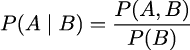
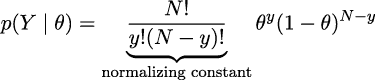
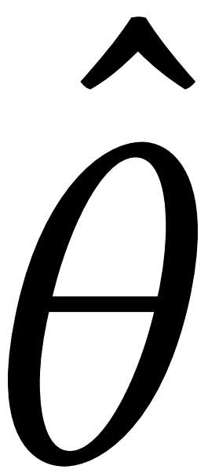

# 第一章

概率思维

> 概率论无非是将常识简化为计算。——皮埃尔·西蒙·拉普拉斯

在这一章中，我们将学习贝叶斯统计的核心概念以及贝叶斯工具箱中的一些工具。我们会使用一些 Python 代码，但这一章大部分内容将是理论性的；我们在这里看到的大部分概念将在本书的许多部分中反复出现。这一章理论性较强，可能会让你这个编码者有些焦虑，但我认为它会为有效地将贝叶斯统计应用于你的问题铺平道路。

在这一章中，我们将涵盖以下主题：

+   统计建模

+   概率与不确定性

+   贝叶斯定理与统计推断

+   单参数推断和经典的抛硬币问题

+   选择先验分布及为何人们通常不喜欢它们，但其实应该喜欢

+   传达贝叶斯分析结果

## 1.1 统计学、模型和本书的方法

统计学是关于收集、整理、分析和解释数据的，因此统计知识对数据分析至关重要。在数据分析中使用了两种主要的统计方法：

+   **探索性数据分析（EDA）**：这涉及到数值汇总，例如均值、众数、标准差和四分位数范围。EDA 还涉及通过可视化检查数据，使用你可能已经熟悉的工具，比如直方图和散点图。

+   **推断统计**：这是关于超越当前数据进行推理。我们可能想要了解某种特定现象，或者我们想要对未来（尚未观察到的）数据点进行预测，或者我们需要在多个竞争性解释之间做出选择，针对同一组观察数据。总之，推断统计让我们能够从有限的数据中提取有意义的见解，并基于分析结果做出明智的决策。

天作之合

本书的重点是如何进行贝叶斯推断统计，但我们也会借用探索性数据分析（EDA）中的一些思想来总结、解释、检查并传达贝叶斯推断的结果。

大多数入门级统计课程，至少对于非统计学专业的人来说，通常被教授为一系列的“配方”，大致如下：走进统计学的储藏室，挑选一罐罐头打开，加入数据，按个人口味调味，搅拌直到得到一个一致的 p 值，最好小于 0.05。 这些课程的主要目标是教你如何选择合适的罐头。我从不喜欢这种方法，主要是因为最常见的结果是一群困惑的人，甚至在概念层面也无法理解不同学习方法的统一性。我们将采取不同的方法：我们将学习一些配方，但它们是自制的，而非罐头食品；我们将学习如何混合新鲜的原料，适用于不同的统计场合，更重要的是，这将让你能将这些概念应用到本书中的例子之外的场景中。

采用这种方法是因为两个原因：

+   **本体论**：统计学是一种建模方法，统一于概率论的数学框架下。采用概率方法能够提供一个统一的视角来看待那些看似截然不同的方法；统计方法和机器学习方法在概率视角下显得更加相似。

+   **技术性**：现代软件，如 PyMC，使得从业者——就像你我一样——能够相对轻松地定义和解决模型。几年前，许多这样的模型是无法求解的，或者需要高水平的数学和技术精湛。

## 1.2 处理数据

数据是统计学和数据科学的核心要素。数据来源于多个渠道，例如实验、计算机模拟、调查和实地观察。如果我们负责生成或收集数据，首先仔细思考我们想要回答的问题以及我们将使用哪些方法是非常重要的，只有在此之后，我们才应该开始收集数据。统计学中有一个专门研究数据收集的分支，称为实验设计。在数据泛滥的时代，我们有时会忘记，收集数据并不总是便宜的。例如，虽然**大型强子对撞机**（**LHC**）每天能产生数百 TB 的数据，但它的建造过程花费了数年的人工和智力劳动。

一般来说，我们可以认为数据生成的过程是随机的，因为存在本体论、技术性和/或认识论的不确定性，也就是说，系统本质上是随机的，技术性问题会增加噪声或限制我们以任意精度进行测量，和/或存在概念性局限遮蔽了我们无法看到的细节。基于这些原因，我们总是需要在模型的框架下解读数据，包括心智模型和形式化模型。数据不直接发声，只有通过模型才有意义。

在本书中，我们假设我们已经收集好了数据。我们的数据也将是干净且整洁的，而这在现实世界中是极少见的。我们作出这些假设是为了集中讨论本书的主题。我特别想强调，尤其是对于数据分析的新人来说，即使本书没有涉及，仍然有一些重要的技能需要你去学习和实践，以便能够成功地处理数据。

分析数据时，一个非常有用的技能是知道如何在编程语言中编写代码，例如 Python。由于我们生活在一个杂乱的世界中，数据更加杂乱，因此操控数据通常是必要的，编程有助于完成任务。即使你很幸运，数据非常干净整洁，编程仍然非常有用，因为现代贝叶斯统计主要通过像 Python 或 R 这样的编程语言进行。如果你想学习如何使用 Python 来清理和操控数据，可以参考 McKinney 的 *Python for Data Analysis* 一书 [2022]。

## 1.3 贝叶斯建模

模型是对某个系统或过程的简化描述，出于某些原因，我们对此系统或过程感兴趣。这些描述是刻意设计的，只捕捉系统中最相关的方面，而不解释每一个微小的细节。这也是为什么更复杂的模型不一定是更好的模型的原因之一。有许多不同种类的模型；在本书中，我们将只讨论贝叶斯模型。我们可以用三个步骤总结贝叶斯建模过程：

1.  给定一些数据和关于这些数据如何生成的假设，我们通过结合称为**概率分布**的构建模块来设计一个模型。大多数时候，这些模型是粗略的近似，但大多数情况下，这正是我们所需要的。

1.  我们使用贝叶斯定理将数据添加到我们的模型中，并推导出结合数据和假设的逻辑后果。我们说我们正在**对模型进行条件化**。

1.  我们根据不同的标准评估模型及其预测，包括数据、我们对该主题的专业知识，有时还会通过与其他模型进行比较。

通常，我们会发现自己在一个迭代的非线性方式中执行这三个步骤。我们会在任何时候重新追溯我们的步骤：也许我们犯了一个愚蠢的编码错误，或者我们找到了一种方法来改变模型并改进它，或者我们意识到需要添加更多的数据或收集不同种类的数据。

贝叶斯模型也被称为**概率模型**，因为它们是通过概率构建的。为什么是概率？因为概率是建模不确定性的非常有用的工具；我们甚至有充分的理由认为它们是正确的数学概念。所以让我们一起走进 *叉路花园* [Borges, 1944]。

## 1.4 贝叶斯实践者的概率入门

在本节中，我们将讨论一些对于更好理解贝叶斯方法至关重要的通用概念和重要概念。未来的章节将根据需要介绍或详细说明其他与概率相关的概念。然而，对于概率论的详细学习，我强烈推荐 Blitzstein 的《*Introduction to Probability*》[2019]一书。已经熟悉概率论基本要素的读者可以跳过本节或快速浏览。

### 1.4.1 样本空间与事件

假设我们正在调查人们对自己所在地区天气的看法。我们问了三个人是否喜欢晴天，可能的回答是“是”或“否”。所有可能结果的样本空间可以用*S*表示，并包含八种可能的组合：

*S* = {(是, 是, 是), (是, 是, 否), (是, 否, 是), (否, 是, 是), (是, 否, 否), (否, 是, 否), (否, 否, 是), (否, 否, 否)}

在这里，样本空间中的每个元素代表三个人根据被问到的顺序所做出的回答。例如，(是, 否, 是)表示第一和第三个人回答了“是”，而第二个人回答了“否”。

我们可以将事件定义为样本空间的子集。例如，事件*A*就是所有三个人都回答“是”时发生的事件：

*A* = {(是, 是, 是)}

类似地，我们可以定义事件*B*为至少有一个人回答“否”的情况，然后我们将得到：

*B* = {(是, 是, 否), (是, 否, 是), (否, 是, 是), (是, 否, 否), (否, 是, 否), (否, 否, 是), (否, 否, 否)}

我们可以使用概率来衡量这些事件发生的可能性。假设所有事件发生的概率相等，那么事件*A*的概率，即所有三个人都回答“是”的事件概率为：


在这种情况下，*A*中只有一个结果，而*S*中有八个结果。因此，*A*的概率为：


同样，我们可以计算事件*B*的概率，这个事件表示至少有一个人回答“否”。由于*B*中有七个结果，而*S*中有八个结果，事件*B*的概率为：


将所有事件视为同样可能的事件只是一个特殊情况，它使得计算概率更为简便。这被称为朴素的概率定义，因为它具有局限性并依赖于强假设。然而，如果我们谨慎使用，它仍然是有用的。例如，并不是所有的“是-否”问题都有 50-50 的概率。再举个例子，看到一匹紫色的马的概率是多少？正确答案可以有很大的不同，具体取决于我们是在谈论一匹真实马的自然颜色、卡通中的马、一匹穿着游行服装的马，等等。无论事件是否等可能，整个样本空间的概率总是等于 1。我们可以通过计算来验证这一点：


1 是概率能达到的最高值。说*P*(*S*) = 1 就意味着*S*不仅非常可能，它是确定的。如果*S*定义了所有可能发生的事情，那么*S*一定会发生。

如果一个事件是不可能的，那么它的概率就是 0。我们定义事件*C*为三个人都说“香蕉”的事件：

*C* = {(香蕉, 香蕉, 香蕉)}

由于*C*不是*S*的一部分，根据定义，它是无法发生的。可以把它看作是我们的调查问卷只有两个选项，*yes*和*no*。根据设计，我们的调查限制了所有其他可能的选项。

我们可以利用 Python 包含集合的事实，并定义一个 Python 函数来按照它们的朴素定义计算概率：

**代码 1.1**

```py
def P(S, A): 
    if set(A).issubset(set(S)): 
        return len(A)/len(S) 
    else: 
        return 0
```

我把玩这个函数的乐趣留给读者了。

一种有用的理解概率的方式是将概率视为分布在样本空间中的守恒量。这意味着如果一个事件的概率增加，其他一些事件的概率必须减少，以便总概率保持为 1。可以通过一个简单的例子来说明这一点。

假设我们问某人明天是否会下雨，可能的回答是“是”或“否”。可能的回答的样本空间是*S* = {是, 否}。表示明天会下雨的事件是*A* = {是}。如果*P*(*A*)是 0.5，那么事件*A*的补集事件的概率，即*P*，也必须是 0.5。如果由于某种原因*P*(*A*)增加到 0.8，那么*P*必须减少到 0.2。这个特性适用于互斥事件，即不能同时发生的事件。例如，明天不可能同时“下雨”和“不下雨”。你可能会反驳，早上可能下雨，下午不下雨。没错，但那是不同的样本空间！

到目前为止，我们避免了直接定义概率，而是展示了一些概率的性质以及计算方法。适用于非等可能事件的概率的一个一般定义如下。给定一个样本空间*S*，以及事件*A*，它是*S*的一个子集，概率是一个函数*P*，它以*A*为输入，返回一个介于 0 和 1 之间的实数作为输出。函数*P*有一些限制，这些限制由以下三个公理定义。请记住，公理是被认为为真的陈述，我们用它作为推理的起点：

1.  事件的概率是一个非负实数。

1.  *P*(*S*) = 1

1.  如果*A*1*, A*2*, …*是互斥事件，意味着它们不能同时发生，那么*P*(*A*1*, A*2*, …*) = *P*(*A*1) + *P*(*A*2) + *…*

如果这是一本关于概率论的书，我们可能会专门用几页来展示这些公理的后果，并提供一些练习来操作概率。这将帮助我们熟练地操作概率。然而，我们的主要关注点不在这些话题上。我展示这些公理的动机仅仅是为了说明概率是一个定义明确的数学概念，并且有规则来支配它们的运算。它们是特定类型的函数，并且并不神秘。

### 1.4.2 随机变量

随机变量是一个将样本空间映射到实数ℝ的函数（见*图 1.1*）。假设我们关注的事件是骰子的点数，映射非常简单，我们将与数字 1 关联，与 2，依此类推。另一个简单的例子是回答问题“明天会下雨吗？”，我们可以将“是”映射为 1，将“否”映射为 0。通常，随机变量使用大写字母表示，如*X*，而其结果使用小写字母表示，如*x*。例如，如果*X*表示一次骰子投掷，那么*x*表示某个特定的整数{1,*2*,*3*,*4*,*5*,*6*}。因此，我们可以写*P*(*X* = 3)来表示投掷骰子得到 3 的概率。我们也可以不指定*x*，例如，我们可以写*P*(*X* = *x*)来表示得到某个值*x*的概率，或者写*P*(*X* ≤ *x*)，表示得到小于或等于*x*的概率。

能够将符号如或字符串如“yes”映射到数字上，使得分析变得更加简单，因为我们已经知道如何用数字进行数学运算。随机变量也很有用，因为我们可以在不直接考虑样本空间的情况下对它们进行操作。随着样本空间变得越来越复杂，这一特点变得愈加重要。例如，在模拟分子系统时，我们需要指定每个原子的位置信息和速度；对于像蛋白质这样复杂的分子，这意味着我们需要追踪成千上万甚至更多的数字。相反，我们可以使用随机变量来总结系统的某些属性，比如总能量或系统中某些原子之间的相对角度。

如果你仍然感到困惑，那也没关系。随机变量的概念刚开始可能显得过于抽象，但我们将在全书中看到许多例子，帮助你巩固这些概念。在继续之前，我想举一个类比，希望对你有帮助。随机变量的作用类似于 Python 函数的作用。我们通常将代码封装在函数中，这样就可以将复杂的数据操作存储、重用，并通过一次调用来*隐藏*。更进一步，当我们拥有多个函数时，有时可以通过多种方式组合它们，比如将两个函数的输出相加，或将一个函数的输出作为另一个函数的输入。我们也可以在没有函数的情况下完成这些操作，但将内部工作抽象化不仅让代码更简洁，还帮助理解和激发新的创意。随机变量在统计学中起着类似的作用。


**图 1.1**：在一个包含 5 个元素的样本空间上定义的随机变量*X*，其中元素包括{*S*[1]*，**S*[5]}，其可能的值为-1、2 和 *π*。

样本空间与ℝ之间的映射是确定性的。这里没有涉及随机性。那么，为什么我们称其为*随机*变量呢？因为我们可以*请求*该变量的值，每次请求时，得到的数字都会不同。随机性来源于与事件相关的概率。在*图 1.1*中，我们通过圆圈的大小表示了*P*。

两种最常见的随机变量类型是离散型和连续型。虽然不做正式定义，但我们可以说离散型变量只取离散值，通常使用整数表示，例如 1、5、42。连续型变量则取实数值，因此我们使用浮点数来表示它们，例如 3.1415、1.01、23.4214 等等。我们使用哪种类型取决于具体问题。如果我们询问人们最喜欢的颜色，答案可能是“红色”、“蓝色”和“绿色”。这是一个离散随机变量的例子。答案是类别间的——“红色”和“绿色”之间没有中间值。但如果我们研究光的吸收特性，那么像“红色”和“绿色”这样的离散值可能不够准确，转而使用波长可能更为合适。在这种情况下，我们会得到类似 650 纳米和 510 纳米的值，并且任何中间值也都可能出现，包括 579.1 纳米。

### 1.4.3 离散随机变量及其分布

我们可能不仅仅想计算所有三个人都回答“是”的概率，或者掷骰子得到 3 的概率，我们可能更感兴趣的是找到所有可能答案或骰子上所有可能数字的*概率列表*。一旦这个列表计算出来，我们可以通过可视化查看它，或者利用它来计算其他量，比如至少得到一个“否”的概率、得到奇数的概率，或者得到大于或等于 5 的数字的概率。这个*列表*的正式名称是**概率** **分布**。

我们可以通过掷骰子几次并记录每个数字出现的次数来获得骰子的经验概率分布。为了将每个值转化为概率，并使整个列表成为有效的概率分布，我们需要*归一化*这些计数。我们可以通过将每个数字出现的次数除以掷骰子的次数来实现这一点。

经验分布非常有用，我们将广泛使用它们。但我们不会再手动掷骰子，而是将使用先进的计算方法来为我们完成这项繁重的工作；这不仅能节省我们的时间和避免无聊，还能让我们轻松地从非常复杂的分布中获取样本。不过我们现在有点急于求成。我们的优先任务是集中精力研究理论分布，因为它们在统计学中占据核心地位，原因之一是它们能够构建概率模型。

正如我们所看到的，随机变量并没有什么随机或神秘之处；它们只是数学函数的一种类型。理论概率分布也是如此。我喜欢将概率分布与圆形进行比较。因为我们在上学之前就已经熟悉圆形了，所以我们对它们不感到害怕，它们也不会让我们觉得神秘。我们可以将圆定义为平面上与另一个点（称为圆心）等距的所有点的几何空间。我们可以进一步给出这个定义的数学表达式。如果我们假设圆心的位置无关紧要，那么半径为*r*的圆可以简单地描述为所有满足以下条件的点集（*x,y*）：


从这个表达式中，我们可以看到，给定**参数** *r*，圆就被完全定义了。这就是我们绘制它所需的所有信息，也是我们计算如周长（2*πr*）等性质所需的所有信息。

现在请注意，所有的圆看起来都非常相似，并且任何两个半径相同的圆基本上是相同的对象。因此，我们可以把圆的家族看作是其中每个成员都恰好通过半径 *r* 的值与其他成员区分开来的。

到目前为止，一切顺利，但我们为什么要谈论圆呢？因为这一切都可以直接应用于概率分布。圆和概率分布都有定义它们的数学表达式，这些表达式有我们可以改变的参数，用以定义概率分布家族中的所有成员。*图 1.2* 显示了一个名为 BetaBinomial 的概率分布的四个成员。在*图 1.2*中，条形的高度表示每个 *x* 值的概率。低于 1 或高于 6 的 *x* 值的概率为 0，因为它们超出了分布的支持范围。


**图 1.2**：具有参数 *α* 和 *β* 的 BetaBinomial 分布的四个成员

这是 BetaBinomial 分布的数学表达式：


pmf 代表**概率质量函数**。对于离散随机变量，pmf 是返回概率的函数。在数学符号中，如果我们有一个随机变量 *X*，那么 pmf(*x*) = *P*(*X* = *x*)。

理解或记住 BetaBinomial 的 pmf 对我们来说并不重要。我只是展示它，以便你能看到这仅仅是另一个函数；你输入一个数字，输出另一个数字。没什么奇怪的，至少原则上是这样。我必须承认，要完全理解 BetaBinomial 分布的细节，我们需要知道什么是 ，即二项系数，以及*B*是什么，即 Beta 函数。但这与展示 *x*² + *y*² = *r*²并没有根本区别。

数学表达式非常有用，因为它们简洁，我们可以利用它们推导出性质。但有时这可能会太复杂，即使我们擅长数学。可视化可能是一个很好的替代（或补充），帮助我们理解概率分布。我无法在纸面上完全展示，但如果你运行以下代码，你将获得一个交互式图，每次调整`alpha`、`beta`和`n`的滑块时都会更新：

**代码 1.2**

```py
pz.BetaBinomial(alpha=10, beta=10, n=6).plot_interactive()
```

*图 1.3*展示了该交互式图的静态版本。黑色的点代表每个随机变量值的概率，而虚线黑色线条仅作为视觉辅助线。


**图 1.3**：`pz.BetaBinomial(alpha=10, beta=10, n=6).plot_interactive()`的输出

在 x 轴上，我们有 BetaBinomial 分布的支持，即它可以取的值，*x* ∈{0*,*1*,*2*,*3*,*4*,*5}。在 y 轴上，与这些值相关的概率。完整列表请参见*表格 1.1*。

| **x 值** | **概率** |
| --- | --- |
| 0 | 0.047 |
| 1 | 0.168 |
| 2 | 0.285 |
| 3 | 0.285 |
| 4 | 0.168 |
| 5 | 0.047 |

**表格 1.1**：`pz.BetaBinomial(alpha=10, beta=10, n=6)`的概率

请注意，对于`BetaBinomial(alpha=10, beta=10, n=6)`分布，{0*,*1*,*2*,*3*,*4*,*5}之外的值（例如 −1*,*0*.*5*,π,*42）的概率为 0。

我们之前提到过，我们可以*询问*随机变量获取值，每次询问时，我们都会得到不同的数字。我们可以用 PreliZ [Icazatti et al., 2023]来模拟这一过程，PreliZ 是一个用于先验引导的 Python 库。例如，考虑以下代码片段：

**代码 1.3**

```py
pz.BetaBinomial(alpha=10, beta=10, n=6).rvs()
```

这将给我们一个 0 到 5 之间的整数。是哪一个？我们不知道！但让我们运行以下代码：

**代码 1.4**

```py
plt.hist(pz.BetaBinomial(alpha=2, beta=5, n=5).rvs(1000)) 
pz.BetaBinomial(alpha=2, beta=5, n=5).plot_pdf();
```

我们将得到类似于*图 1.4*的结果。即使我们无法从随机变量中预测下一个值，我们也可以预测获得任何特定值的概率，反过来，如果我们获取了许多值，我们也可以预测它们的整体分布。


**图 1.4**：灰色的点表示 BetaBinomial 样本的概率质量函数（pmf）。浅灰色为从该分布中抽取的 1,000 次样本的直方图。

在本书中，我们有时会知道给定分布的参数，并希望从中获取随机样本。其他时候，我们将遇到相反的情况：我们会有一组样本，并希望估计该分布的参数。在这两种情境之间的来回切换将随着我们深入书中的内容而变得得心应手。

### 1.4.4 连续随机变量及其分布

可能最广为人知的连续概率分布是**正态分布**，也称为**高斯分布**。其**概率密度函数**为：


再次强调，我们仅展示这个表达式是为了揭开其中的神秘面纱。无需过多关注其细节，除了该分布有两个参数 *μ*，它控制曲线的峰值位置，和 *σ*，它控制曲线的扩展度以外。*Figure 1.5* 展示了来自高斯家族的 3 个示例。如果你想深入了解这个分布，我建议你观看这个视频：[`www.youtube.com/watch?v=cy8r7WSuT1I`](https://www.youtube.com/watch?v=cy8r7WSuT1I)。


**Figure 1.5**：高斯家族的三个成员

如果你一直在关注，你可能会注意到我们使用了**概率密度函数**（**pdf**）而不是**概率质量函数**（**pmf**）。这不是笔误——它们实际上是两个不同的概念。我们先退后一步，思考一下：离散概率分布的输出是概率。*Figure 1.2* 中的条形高度或 *Figure 1.3* 中的点的高度就是概率。每个条形或点的高度永远不会超过 1，并且如果你将所有的条形或点相加，你总会得到 1。让我们做同样的事情，但换成 *Figure 1.5* 中的曲线。首先需要注意的是，我们没有条形或点；我们有一个连续、平滑的曲线。所以，也许我们可以认为这个曲线是由非常细的条形组成的，这些条形细得我们为分布支持中的每一个实数值分配一条条形，测量每条条形的高度，然后进行无限求和。这是合理的吗？

是的，但我们从中获得的结果并不立刻显现出来。这个求和会得到精确的 1 吗？还是会得到一个较大的数字呢？这个求和是有限的吗？结果是否依赖于分布的参数？

要正确回答这些问题需要测度理论，而这只是一个非常非正式的概率学入门，因此我们不会深入探讨这个问题。但本质上，答案是，对于连续随机变量，我们只能为它可能取的每个单独值分配 0 的概率；相反，我们可以为它们分配密度值，然后我们可以计算一个值范围内的概率。因此，对于高斯分布，得到精确数值 -2 的概率，即 -2 后面跟着无限多个零的小数部分，概率为 0。但是得到介于 -2 和 0 之间的数字的概率是一个大于 0 且小于 1 的数。为了找出准确答案，我们需要计算以下内容：


为了计算这个，我们需要用具体的数量来替代符号。如果我们将 pdf 替换为 Normal(0*,*1)，并且 *a* = −2，*b* = 0，我们将得到 *P*（−2 *< X <* 0）≈ 0*.*477，这就是 *Figure 1.6* 中的阴影区域。


**图 1.6**：黑线表示参数为 mu=0 和 sigma=1 的高斯分布的 pdf，灰色区域表示一个值大于 -2 且小于 0 的概率

你可能还记得，我们可以通过求矩形面积的和来近似一个积分，随着矩形底边长度的缩小，这种近似会变得越来越准确（请参阅维基百科上的 Riemann 积分 条目）。基于这个思路，并使用 PreliZ，我们可以估算 *P*(−2 *< X <* 0) 为：

**代码 1.5**

```py
dist = pz.Normal(0, 1) 
a = -2 
b = 0 
num = 10 
x_s = np.linspace(a, b, num) 
base = (b-a)/num 
np.sum(dist.pdf(x_s) * base)
```

如果我们增加 `num` 的值，结果会得到更精确的近似值。

### 1.4.5 累积分布函数

我们已经看过了概率质量函数（pmf）和概率密度函数（pdf），但这些并不是描述分布的唯一方式。另一种选择是**累积分布函数**（**cdf**）。随机变量 *X* 的 cdf 是函数 *F*[*X*]，由 *F**X* = *P*(*X* ≤ *x*) 给出。换句话说，cdf 是对这个问题的回答：得到小于或等于 *x* 的数值的概率是多少？在*图 1.7* 的第一列中，我们可以看到 BetaBinomial 分布的 pmf 和 cdf，在第二列中，则展示了高斯分布的 pdf 和 cdf。请注意，离散变量的 cdf 会“跳跃”，而连续变量的 cdf 则是平滑的。每次跳跃的高度代表一个概率——只需将其与点的高度进行比较。我们可以通过绘制连续变量的 cdf 来作为概率为零的视觉证明，任何连续变量的数值都没有“跳跃”，这等同于说这些跳跃的高度正好为零。


**图 1.7**：BetaBinomial 分布的 pmf 及其对应的 cdf 和正态分布的 pdf 及其对应的 cdf

仅通过查看 cdf，就更容易找到某个数字小于，比如 1 的概率。我们只需要在 x 轴上找到 1 的值，向上移动直到穿过黑线，然后查看 y 轴的值。例如，在*图 1.7* 中，对于正态分布，我们可以看到该值位于 0.75 和 1 之间。假设它大约是 ≈ 0*.*85。这比使用 pdf 要难得多，因为我们需要将 1 以下的整个区域与总区域进行比较才能得到答案。人类在判断面积方面不如在判断高度或长度时准确。

### 1.4.6 条件概率

给定两个事件 *A* 和 *B*，且 *P*(*B*) *>* 0，条件概率 *P*(*A*|*B*) 定义为：



*P*(*A,B*) 是事件 *A* 和事件 *B* 同时发生的概率。*P*(*A*|*B*) 被称为条件概率，它表示在已知（或假设、想象、假定等）*B* 发生的前提下，事件 *A* 发生的概率。例如，路面湿了的概率与已知下雨时路面湿了的概率是不同的。

条件概率可以大于、小于或等于无条件概率。如果知道 *B* 对我们理解 *A* 没有提供任何信息，那么 *P*(*A*|*B*) = *P*(*A*)。只有当 *A* 和 *B* 互相独立时，这个关系才成立。相反，如果知道 *B* 给我们提供了关于 *A* 的有用信息，那么条件概率可能大于或小于无条件概率，具体取决于知道 *B* 是否让 *A* 更加可能或更不可能。让我们通过一个简单的例子来看看，假设我们掷一个公平的六面骰子。掷到数字 3 的概率是多少？*P*(骰子 = 3) = ，因为对于一个公平的六面骰子，每个数字的机会是一样的。那么，假如我们已经知道掷到的是奇数，掷到数字 3 的概率是多少？*P*(骰子 = 3 | 骰子 = {1,3,5}) = ，因为如果我们知道结果是奇数，那么可能的数字只有 {1*,*3*,*5}，而且它们的机会是相等的。最后，如果我们已经知道掷到的是偶数，掷到 3 的概率是多少？这是 *P*(骰子 = 3 | 骰子 = {2,4,6}) = 0，因为如果我们知道结果是偶数，那么唯一可能的数字是 {2*,*4*,*6}，所以掷到 3 的概率为 0。

如我们从这些简单的例子中可以看到，通过对观测数据进行条件化，我们正在改变样本空间。当我们询问 *P*(骰子 = 3) 时，我们需要评估样本空间 *S* = {1*,*2*,*3*,*4*,*5*,*6}，但当我们在已知掷到的是偶数的情况下进行条件化时，新的样本空间变为 *T* = {2*,*4*,*6}。

条件概率是统计学的核心，无论你面对的问题是掷骰子还是构建自动驾驶汽车。

*图 1.8* 的中央面板使用灰度显示了联合分布*p*(*A,B*)，其中较深的颜色表示较高的概率密度。我们可以看到联合分布呈现拉长的形态，表明*A*的值越高，*B*的值也越高，反之亦然。知道了*A*的值，就能推测出*B*的值，反之亦然。在*图 1.8* 的顶部和右侧边缘分别展示了**边际分布** *p*(*A*)和*p*(*B*)。要计算*A*的边际分布，我们需要对*p*(*A,B*)进行对所有*B*值的平均，直观地说，这就像把二维对象（联合分布）投影到一维。*B*的边际分布也以类似的方式计算。虚线表示 3 个不同*B*值下的**条件概率** *p*(*A*|*B*)。我们通过在给定*B*值时切割联合分布*p*(*A,B*)来得到它们。我们可以把这看作是在已观察到特定的*B*值时，*A*的分布。


**图 1.8**：联合概率*p*(*A,B*)、边缘概率*p*(*A*)和*p*(*B*)，以及条件概率*p*(*A*|*B*)之间关系的表示

### 1.4.7 期望值

如果*X*是一个离散的随机变量，我们可以计算其期望值，公式如下：


这只是均值或平均值。

你可能已经习惯于计算样本或一组数字的均值或平均值，无论是手动、用计算器，还是使用 Python。但请注意，在这里我们讨论的不是一堆数字的均值，而是分布的均值。一旦我们定义了分布的参数，原则上可以计算其期望值。它们是分布的特性，就像圆的周长是圆的一个特性，定义圆的半径后就可以确定。

另一个期望值是方差，我们可以用它来描述分布的离散程度。方差在许多统计计算中*自然*出现，但在实践中，通常使用标准差，它是方差的平方根。原因是标准差的单位与随机变量相同。

均值和方差通常被称为分布的**矩**。其他的矩包括偏度，它告诉我们分布的偏斜程度，以及峰度，它告诉我们分布尾部或*极值*的行为[Westfall， 2014]。*图 1.9* 展示了不同分布及其均值*μ*、标准差*σ*、偏度*γ*和峰度的例子 。请注意，对于某些分布，某些矩可能没有定义，或者它们可能是无穷大。


**图 1.9**：四个分布及其前四个矩

现在我们已经了解了一些概率论的基本概念和术语，我们可以继续进入大家期待的时刻了。

### 1.4.8 贝叶斯定理

毫不拖延，让我们以它的威严，思考贝叶斯定理：


好吧，这并不是什么令人印象深刻的东西，对吧？它看起来像是小学的公式，但引用理查德·费曼的话，这就是你需要了解的贝叶斯统计的全部内容。了解贝叶斯定理的来源将帮助我们理解它的意义。根据乘积规则，我们有：


这也可以写成：


由于左侧的项对于两个方程是相等的，我们可以将它们合并并写出：


重新排列后，我们得到贝叶斯定理：


为什么贝叶斯定理如此重要？让我们看看。

首先，它说*p*(*θ*|*Y*)不一定等于*p*(*Y*|*θ*)。这是一个非常重要的事实——一个即使是受过统计学和概率学训练的人也容易在日常情况下忽视的事实。我们通过一个简单的例子来澄清为什么这些量不一定相同。一个人是教皇的概率，给定这个人是阿根廷人，并不等同于，给定这个人是教皇，成为阿根廷人的概率。由于大约有 4700 万阿根廷人，而其中只有一个是现任教皇，我们有*p*(教皇 | 阿根廷人) ≈，同时我们也有*p*(阿根廷人 | 教皇) = 1。

如果我们将*θ*替换为“假设”，将*Y*替换为“数据”，贝叶斯定理告诉我们如何计算在给定数据*Y*的情况下，假设*θ*的概率，这也是你会在很多地方看到的贝叶斯定理的解释。但是，如何将一个假设转化为可以放入贝叶斯定理中的东西呢？嗯，我们通过使用概率分布来做到这一点。所以，一般来说，我们的假设是一个非常非常非常狭义的假设；如果我们谈论的是找到适合我们模型的参数的值，即概率分布的参数，那么我们会更精确。顺便说一句，不要试图将*θ*设定为“独角兽存在”的陈述，除非你愿意构建一个现实的独角兽存在的概率模型！

贝叶斯定理是贝叶斯统计的核心。正如我们在*第二章*中看到的，使用像 PyMC 这样的工具解放了我们每次构建贝叶斯模型时都必须显式书写贝叶斯定理的需要。然而，了解其各个部分的名称是很重要的，因为我们将不断引用它们，而且理解每个部分的含义也很重要，因为这有助于我们构建模型的概念。所以，让我现在带着标签重写贝叶斯定理：


**先验分布**应当反映我们在看到数据之前对参数*θ*值的了解，*Y*。如果我们什么都不知道，就像乔恩·雪诺那样，我们可以使用平坦的先验，这不会传达太多信息。通常来说，我们可以比平坦的先验做得更好，正如我们在本书中将要学到的那样。先验的使用是为什么一些人仍然认为贝叶斯统计是主观的，尽管先验只是我们在建模时所做的另一种假设，因此它和其他假设（如似然）一样主观（或客观）。

**似然**是我们在分析中引入数据的方式。它是给定参数下数据的合理性表达。在某些文本中，你会发现有人称这个术语为采样模型、统计模型或仅仅是模型。我们将坚持使用“似然”这个名称，并将建模先验和似然的组合。

**后验分布**是贝叶斯分析的结果，反映了我们关于一个问题的所有已知信息（基于我们的数据和模型）。后验分布是模型参数的概率分布，而不是单一的值。这个分布是先验和似然之间的平衡。有一个著名的笑话：贝叶斯学家是那种模糊地期望看到一匹马，却只看到了一只驴，并坚信自己看到了骡子的人。听到这个笑话后，解释说如果似然和先验都很模糊，那么得到的后验反映的就是对看到骡子的模糊信念，而不是强烈的信念，这会大大破坏气氛。无论如何，我喜欢这个笑话，也喜欢它传达了后验作为先验和似然之间某种妥协的想法。从概念上讲，我们可以将后验视为根据（新）数据更新后的先验。理论上，一个分析的后验可以作为新分析的先验（但实际上，生活可能会更复杂）。这使得贝叶斯分析特别适用于分析按顺序提供的数据。一个例子可能是自然灾害的早期预警系统，它处理来自气象站和卫星的在线数据。有关更多细节，请阅读关于在线机器学习方法的资料。

最后一项是**边际似然性**，有时也称为**证据**。严格来说，边际似然性是观察数据的概率，取决于所有参数可能取值的平均值（按照先验分布规定）。我们可以将其表示为 ∫ [Θ]^(*p*(*Y* |*θ*)*p*(*θ*)d*θ*。我们直到*第五章*5 才会真正关心边际似然性。但目前，我们可以将其视为一个归一化因子，确保后验分布是一个合适的 pmf 或 pdf。如果忽略边际似然性，我们可以将贝叶斯定理写为一个比例关系，这也是一种常见的贝叶斯定理表示方式。


理解贝叶斯定理中每个项的确切作用需要一些时间和实践，并且需要通过几个例子来帮助理解，但这就是本书其余部分的目的所在。

## 1.5 概率解释

概率可以通过各种有用的方式来解释。例如，我们可以认为 *P*(*A*) = 0*.*125 意味着如果我们多次重复调查，我们期望这三个人大约 12.5%的时间会回答“是”。我们正在将概率解释为长期实验的结果。这是一种非常常见且有用的解释。它不仅可以帮助我们思考概率，还可以提供一种经验方法来估计概率。我们想知道，如果汽车轮胎充气超过制造商推荐的标准，爆胎的概率是多少吗？只需充气大约 120 个轮胎，你就能得到一个不错的近似值。这通常被称为频率主义解释。

概率的另一种解释，通常称为主观或贝叶斯解释，认为概率可以被解释为个体对事件不确定性的度量。在这种解释下，概率与我们对世界的知识状态相关，并不一定基于重复试验。在这种概率定义下，提出关于火星上是否有生命的概率、电子质量为 9*.*1 × 10^(−31) kg 的概率，或者 1816 年 7 月 9 日布宜诺斯艾利斯是否是晴天的概率，都是有效且自然的。这些都是一次性事件。我们不能重新创造 1 百万个宇宙，每个宇宙都有一个火星，并检查其中有多少个发展出了生命。当然，我们可以做这个心理实验，只要长期频率仍然是一个有效的心理框架。

有时贝叶斯对概率的解释被描述为个人信念；我不喜欢这样。我认为这可能会导致不必要的混淆，因为信念通常与信仰或没有依据的主张有关。这种关联很容易让人认为贝叶斯概率，进而贝叶斯统计学，比其他方法不那么客观或不那么科学。我还认为，这种说法有助于产生对统计学中先验知识角色的混淆，让人们误以为客观或理性就意味着不使用先验信息。

贝叶斯方法与我们拥有的任何其他成熟的科学方法一样主观（或客观）。让我用一个例子来解释：火星上是否存在生命，答案是二元的，类似是或不是的问题。但考虑到我们无法确认这一事实，合理的做法是尝试找出火星上生命存在的可能性。为了回答这个问题，任何诚实且具有科学思维的人都会使用所有相关的火星地球物理数据、所有关于生命所需条件的生物化学知识等等。这个回答必然是关于我们知识状态的，不同的人可能会有不同的看法，甚至得出不同的概率。但至少，从原则上讲，他们都会能够为自己的数据、方法、建模决策等提供支持论据。关于火星生命的科学理性辩论不容许像“天使告诉我有小绿人”这样的*论据*。然而，贝叶斯统计学只是一种使用概率作为构建模块来做科学陈述的程序。

## 1.6 概率、不确定性和逻辑

概率可以帮助我们量化不确定性。如果我们对一个问题没有信息，那么可以合理地说每一个可能的事件发生的概率是相等的。这相当于对每一个可能的事件赋予相同的概率。在没有信息的情况下，我们的不确定性是最大的，我并不是随便这么说；这是我们可以通过概率来计算的。如果我们知道某些事件更可能发生，那么可以通过给这些事件赋予更高的概率，而其他事件赋予较低的概率来正式表示这一点。请注意，当我们在统计学中谈论事件时，并不仅仅局限于可能发生的事情，比如小行星撞击地球或我姨妈的 60 岁生日派对。事件只是一个变量可以取的任何可能值（或值的子集），比如你年龄超过 30 岁、萨赫托尔特的价格，或明年全球将售出的自行车数量。

概率的概念也与逻辑学有关。在经典逻辑下，我们只能有真或假的命题。在贝叶斯概率定义下，确定性只是一个特殊的情况：一个真实的命题的概率是 1，而一个虚假的命题的概率是 0。只有在拥有决定性数据表明有东西在生长、繁殖以及进行其他我们认为与生物体相关的活动时，我们才会给“火星上有生命”这一命题分配概率为 1。

然而，请注意，分配一个概率为 0 更难，因为我们总是可以认为火星上还有一些未探索的区域，或者我们在某些实验中犯了错误，或者有其他几个原因可能导致我们错误地认为火星上没有生命，即使实际上是有的。这与克劳梅尔法则有关，该法则指出我们应该将概率为 0 或 1 的命题保留给逻辑上真实或虚假的命题。有趣的是，可以证明，如果我们想要将逻辑扩展以包括不确定性，我们必须使用概率和概率理论。

如我们很快就会看到的，贝叶斯定理只是概率规则的逻辑结果。因此，我们可以将贝叶斯统计看作是逻辑的扩展，它在我们处理不确定性时非常有用。因此，采用贝叶斯方法的一个理由是承认不确定性是普遍存在的。我们通常不得不处理不完整或嘈杂的数据，我们本质上受到进化塑造的灵长类大脑的局限，等等。

贝叶斯精神

概率用于衡量我们对参数的不确定性，而贝叶斯定理是一个在有新数据的情况下正确更新这些概率的机制，希望能够减少我们的不确定性。

## 1.7 单一参数推断

现在我们知道了贝叶斯统计是什么，接下来让我们通过一个简单的例子来学习如何进行贝叶斯统计。我们将从推断一个单一的未知参数开始。

### 1.7.1 投硬币问题

投硬币问题，或者如果你想在聚会上显得更专业的话可以称其为 BetaBinomial 模型，是统计学中的一个经典问题，问题是这样的：我们多次掷硬币并记录正反面朝上的次数。基于这些数据，我们试图回答这样的问题：这枚硬币公平吗？或者，更一般地说，这枚硬币有多偏？虽然这个问题可能听起来很无聊，但我们不应该低估它。

投硬币问题是学习贝叶斯统计基础的一个很好的例子，因为它是一个简单的模型，我们可以轻松地解决和计算。此外，许多实际问题由二元的、互斥的结果组成，例如 0 或 1、正或负、奇数或偶数、垃圾邮件或非垃圾邮件、热狗或不是热狗、猫或狗、安全或不安全、健康或不健康。因此，即使我们在谈论硬币时，这个模型也适用于任何这些问题。为了估计硬币的偏向性，并且通常来说，回答贝叶斯环境中的任何问题，我们将需要数据和一个概率模型。对于这个例子，我们假设我们已经抛掷了几次硬币，并且我们有观察到的正面朝上的次数记录，所以数据收集部分已经完成。获得模型将需要更多的努力。由于这是我们的第一个模型，我们将明确地写出贝叶斯定理并完成所有必要的数学运算（不用担心，我保证这不会痛苦），并且我们将非常慢地进行。从 2 开始，我们将使用 PyMC 和我们的计算机来为我们做数学运算。

我们将做的第一件事是推广偏向的概念。我们将说，偏向为 1 的硬币总是会正面朝上，偏向为 0 的硬币总是会反面朝上，而偏向为 0.5 的硬币在一半的时间里会正面朝上，另一半时间会反面朝上。为了表示偏向，我们将使用参数*θ*，而为了表示多次投掷中正面朝上的总次数，我们将使用变量*Y*。根据贝叶斯定理，我们必须指定先验分布*p*(*θ*)和似然函数*p*(*Y* | *θ*)，我们将使用这些。让我们从似然函数开始。

### 1.7.2 选择似然函数

假设只有两种可能的结果——正面或反面——同时假设一次硬币投掷不会影响其他投掷，也就是说，我们假设硬币投掷是相互独立的。我们进一步假设所有硬币投掷来自同一分布。因此，随机变量硬币投掷是**独立同分布**（**iid**）变量的一个例子。我希望你同意这些假设对于我们的问题来说是非常合理的。基于这些假设，似然函数的一个合适候选是二项分布：



这是一种离散分布，返回在*N*次硬币投掷（或一般的试验或实验）中得到*y*次正面（或一般的成功）的概率，前提是固定的*θ*值。

*图 1.10* 显示了来自二项分布族的九个分布；每个子图都有一个图例，表示参数的值。请注意，对于这个图，我没有省略 y 轴上的值。我这样做是为了让你自己检查，如果你将所有柱子的高度相加，你将得到 1，也就是说，对于离散分布，柱子的高度代表的是实际概率。


**Figure 1.10**: 二项家族的九位成员

二项分布是似然性的合理选择。我们可以看到*θ*表示抛硬币时得到头的可能性有多大。当*N*=1 时更容易看到，但对于任何*N*的值，只需比较*y*=1（头）时*θ*的值与柱状图的高度即可。

### 1.7.3 选择先验分布

作为先验，我们将使用贝塔分布，这在贝叶斯统计中非常常见，外观如下：


如果我们仔细观察，会发现贝塔分布与二项分布看起来很相似，除了第一项。 Γ是希腊大写 gamma 字母，代表伽玛函数，但这并不是真正重要的。对我们而言重要的是，第一项是一个归一化常数，确保分布积分为 1。从前述公式中可以看出，贝塔分布有两个参数，*α*和*β*。*Figure 1.11* 展示了贝塔家族的九位成员。


**Figure 1.11**: 贝塔家族的九位成员

我喜欢贝塔分布及其所有可能的形状，但为什么我们要在我们的模型中使用它呢？使用贝塔分布来处理此类问题有许多理由。其中之一是贝塔分布限制在 0 到 1 之间，与我们的*θ*参数相同。一般来说，我们在想要建模二项变量的比例时使用贝塔分布。另一个原因是其多功能性。正如我们在*Figure 1.11* 中看到的，该分布采用多种形状（均限制在[0,1]区间内），包括均匀分布、类似正态分布和 U 形分布。

作为第三个原因，Beta 分布是二项分布（我们作为似然使用的分布）的共轭先验。共轭先验是指，当与给定的似然结合使用时，返回的后验具有与先验相同的函数形式。简单来说，每次我们使用 Beta 分布作为先验，二项分布作为似然时，我们将得到 Beta 作为后验分布。还有其他共轭先验的配对；例如，正态分布是其自身的共轭先验。多年来，贝叶斯分析一直局限于使用共轭先验。共轭性确保了后验的数学可解性，这一点非常重要，因为贝叶斯统计中一个常见的问题是我们最终得到一个无法解析求解的后验。在开发适合的计算方法解决概率方法之前，这曾是一个关键的障碍。从*第 2* 章开始，我们将学习如何使用现代计算方法解决贝叶斯问题，无论我们选择是否使用共轭先验。

### 1.7.4 获取后验

让我们记住，贝叶斯定理表明后验与似然和先验的乘积成正比。因此，对于我们的问题，我们需要将二项分布和 Beta 分布相乘：


我们可以通过去掉所有与 *θ* 无关的项来简化这个表达式，结果仍然有效。因此，我们可以写成：


重新排列它，并注意到这具有 Beta 分布的形式，我们得到：


基于这个解析表达式，我们可以计算后验。*图 1.12* 显示了 3 个先验和不同试验次数下的结果。以下代码块展示了生成 *图 1.12* 的要点（省略了绘图所需的代码）。

**代码 1.6**

```py
n_trials = [0, 1, 2, 3, 4, 8, 16, 32, 50, 150] 
n_heads = [0, 1, 1, 1, 1, 4, 6, 9, 13, 48] 
beta_params = [(1, 1), (20, 20), (1, 4)] 

x = np.linspace(0, 1, 2000) 
for idx, N in enumerate(n_trials): 
    y = n_heads[idx] 
    for (*α*_prior, *β*_prior) in beta_params: 
        posterior = pz.Beta(*α*_prior + y, *β*_prior + N - y).pdf(x)
```


**图 1.12**：第一个子图显示了 3 个先验。其余的显示了随着新数据的到来，更新后的结果。

在*图 1.12* 的第一个子图中，我们有零次试验，因此三条曲线表示我们的先验：

+   均匀先验（黑色）：这表示在先验中所有偏差的可能值都是等概率的。

+   高斯型先验（深灰色）：这围绕 0.5 进行集中，表示该先验与信息兼容，表明硬币正反面的概率大致相同。我们也可以说，这个先验与硬币公平的知识是兼容的。

+   倾斜的先验（浅灰色）：这将大部分权重放在尾部偏向的结果上。

其余的子图展示了后续试验的后验分布。每个子图的图例中标明了试验次数（或掷硬币次数）和正面朝上的次数。还有一个黑点在 0.35 处，表示*θ*的真实值。当然，在实际问题中，我们并不知道这个值，它在这里仅用于教学目的。*图 1.12*，可以帮助我们深入理解贝叶斯分析，因此拿起你的咖啡、茶或最喜欢的饮品，我们来花点时间理解它：

+   贝叶斯分析的结果是一个后验分布——它不是一个单一值，而是给定数据和模型下的一个可能值的分布。

+   最可能的值由后验分布的众数（分布的峰值）给出。

+   后验分布的扩展与参数值的不确定性成正比；分布越广泛，我们的确定性就越低。

+   直观上，当我们观察到更多支持某一结果的数据时，我们对结果的信心就更强。因此，即使数值上 =  = 0*.*5，在八次试验中看到四次正面朝上比在两次试验中看到一次正面朝上能更有信心地认为偏差是 0.5。这个直觉在后验分布中有所体现，您可以自己检查，如果注意观察第三和第六个子图中的（黑色）后验分布；虽然众数相同，但第三个子图的扩展（不确定性）比第六个子图更大。

+   给定足够多的数据，两个或多个具有不同先验的贝叶斯模型将趋向于收敛到相同的结果。在无限数据的极限下，无论我们使用什么先验，所有的模型都将提供相同的后验分布。

+   记住，无限是一个极限，而不是一个数字，因此从实际角度来看，对于有限且相对较小的数据点，我们可能得到几乎等同的后验分布。

+   后验收敛到相同分布的速度取决于数据和模型。我们可以看到，从黑色先验（均匀分布）和灰色先验（偏向尾部）得到的后验分布收敛得更快，几乎相同，而从深灰色先验（偏向集中分布）得到的后验分布则收敛得较慢。即使经过 150 次试验，仍然很容易识别出深灰色后验分布与另外两个分布的区别。

+   从图中不容易看出来的一点是，如果我们按顺序更新后验，就像一次性计算后验一样，最终会得到相同的结果。我们可以计算 150 次后验，每次加入一个新观察值，并将获得的后验作为新的先验，或者我们可以一次性计算 150 次掷硬币的后验。结果将完全相同。这个特性不仅非常合理，而且为我们提供了一种在获取新数据时更新估计值的自然方法，这种情况在许多数据分析问题中都很常见。

### 1.7.5 先验的影响

从前面的例子可以清楚地看出，先验可以影响推断。这是正常的——先验本来就应该这样做。也许最好根本不设置先验，那样建模不就更简单了吗？嗯，不一定。如果你不设置先验，别人会为你设置。有时这没问题——*默认先验*是有用的，也有它的作用——但有时最好能有更多的控制权。让我来解释一下。

我们可以认为每一个（统计）模型，不论是否是贝叶斯模型，都有某种类型的先验，即使先验没有明确设置。例如，许多在频率派统计中常用的程序可以看作是在某些条件下（如平坦先验）贝叶斯模型的特例。一种常见的参数估计方法被称为最大似然估计；这种方法避免设置先验，只通过找到最大化似然的单一值来工作。这个值通常通过在我们估计的参数名称上方加一个小帽子来表示，例如。与后验估计不同，后验估计是一个分布，而是一个点估计，是一个数值。对于抛硬币问题，我们可以通过解析方法计算出来：


如果你回到*图 1.12*，你将能自己检查出黑色后验的模态（即与均匀/平坦先验对应的那个模态）与每个子图中计算得到的值一致。这不是巧合；这是因为设置均匀先验后，再取后验的模态相当于最大似然估计。

我们无法避免先验，但如果将其纳入分析中，我们可以获得一些潜在的好处。最直接的好处是我们得到一个后验分布，它是一个合理值的分布，而不仅仅是最可能的值。拥有一个分布比单一的点估计更具信息性，正如我们所看到的，分布的宽度与我们对估计的不确定性有关。另一个好处是，计算后验意味着对先验进行平均。这可以导致更难以过拟合的模型和更稳健的预测[Wilson 和 Izmailov， 2022]。

先验分布能为我们带来其他好处。从下一章开始，我们将使用数值方法来获得后验分布。这些方法看起来像魔法，直到它们不再有效。统计计算的民间定理指出：“当你遇到计算问题时，通常是模型出了问题”[Gelman，2008]。有时候，明智的先验选择可以使推断变得更容易或更快速。需要指出的是，我们并不提倡为了加速推断而特意设置先验，但通常情况下，通过考虑先验，我们可以得到更快速的模型。

先验的一个优点，有时被忽视了，就是必须考虑先验可能*迫使我们*更深入地思考我们要解决的问题以及我们所拥有的数据。有时候，建模过程本身就能带来更好的理解，不管我们最终如何拟合数据或做出预测。通过明确先验，我们能够得到更透明的模型，这意味着这些模型更容易被批评、调试（广义上讲）、向他人解释，并且有可能得到改善。

## 1.8 如何选择先验

初学贝叶斯分析的人（以及该范式的反对者）通常对如何选择先验感到有些紧张。通常，他们担心先验分布会使数据无法自主表达！没关系，但我们必须记住，数据并不会“说话”；充其量，数据只是低声细语。我们只能在模型的上下文中理解数据，包括数学模型和心理模型。科学史上有很多例子表明，相同的数据曾让人们对相同的话题产生不同的看法，即便你基于正式模型来形成观点，也会发生这种情况。

有些人喜欢使用非信息性先验（也称为平坦的、模糊的或扩散的先验）这一想法。这些先验对分析的影响最小。虽然在某些问题中使用它们是可行的，但真正推导出非信息性先验是很困难的，甚至是不可能的。此外，通常我们能够做得更好，因为我们通常拥有一些先验信息。

在本书中，我们将遵循 Gelman、McElreath、Kruschke 等人的建议，并偏好弱信息先验。对于许多问题，我们通常对一个参数可能取的值有所了解。我们可能知道某个参数只能取正值，或者知道它可能的范围，或者预期它接近零或在某个值的上下方。在这种情况下，我们可以使用先验来在模型中引入一些弱信息，而不必担心过于强势。因为这些先验有助于保持后验分布在合理的范围内，所以它们也被称为正则化先验。

信息性先验是非常强的先验，能传递大量信息。使用它们也是一个有效的选项。根据你的问题，从领域知识中找到优质的信息并将其转化为先验可能容易，也可能不容易。我曾经从事结构生物信息学工作。在这个领域，大家一直在使用贝叶斯和非贝叶斯方法，利用所有能够获取的先验信息来研究和预测蛋白质的结构。这是合理的，因为几十年来，我们通过数千个精心设计的实验收集了大量数据，因此我们手头有大量可信的先验信息。不使用这些信息简直荒谬！抛弃有价值的信息，绝对没有什么“客观”或“科学”可言。如果你有可靠的先验信息，就应该使用它。试想一下，如果每次汽车工程师需要设计一辆新车时，都必须从头开始，重新发明内燃机、车轮，甚至是汽车的基本概念，那该多么浪费时间！

PreliZ 是一个全新的 Python 库，用于先验知识的引出 [Mikkola et al., 2023, Icazatti et al., 2023]。它的使命是帮助你引出、表示和可视化你的先验知识。例如，我们可以让 PreliZ 计算一个满足一组约束条件的分布的参数。假设我们想找到一个 Beta 分布，其中 90% 的质量位于 0.1 和 0.7 之间，那么我们可以写：

**代码 1.7**

```py
dist = pz.Beta() 
pz.maxent(dist, 0.1, 0.7, 0.9)
```

结果是一个具有参数*α* = 2*.*5 和 *β* = 3*.*6（四舍五入到小数点后一位）的 Beta 分布。`pz.maxent` 函数计算了在我们指定约束条件下的**最大** **熵**分布。为什么是最大熵分布？因为这相当于在这些约束条件下计算最不具信息量的分布。默认情况下，PreliZ 会绘制如下所示的分布：


**图 1.13**：最大熵 Beta 分布，90% 的质量位于 0.1 和 0.7 之间

由于先验引出有很多方面，PreliZ 提供了许多其他方法来引出先验。如果你有兴趣了解更多关于 PreliZ 的信息，可以查看 [`preliz.readthedocs.io`](https://preliz.readthedocs.io) 上的文档。

构建模型是一个迭代过程；有时迭代只需几分钟，有时则可能需要几年。可重复性很重要，模型中的透明假设有助于提高其可重复性。如果我们对某个特定的先验（或似然）没有把握，我们可以自由地为给定的分析使用多个先验（或似然）；探索不同先验的效果也能带来有价值的信息。建模过程的一部分是质疑假设，先验（和似然）正是其中的一部分。不同的假设将导致不同的模型，可能还会得出不同的结果。通过使用数据和我们对问题的领域知识，我们能够比较不同的模型，并在必要时决定一个优胜者。*第五章*将专门讨论这个问题。由于先验在贝叶斯统计中的核心作用，我们将在面对新问题时继续讨论它们。因此，如果你对这个讨论有疑问并感到有些困惑，不用担心，保持冷静，别着急，很多人也困惑了几十年，这个讨论仍在继续。

## 1.9 贝叶斯分析的沟通

创建报告和传达结果是统计学和数据科学实践的核心内容。在本节中，我们将简要讨论在使用贝叶斯模型时，进行这项任务的一些特殊之处。在未来的章节中，我们将继续讨论这个重要问题的例子。

### 1.9.1 模型符号与可视化

如果你想传达分析结果，也应该传达你所使用的模型。表示概率模型的一种常见符号是：

|  | *θ* ∼ Beta(**α*,*β**) |  |
| --- | --- | --- |
|  | *y* ∼ Bin(*n* = 1*,p* = *θ*) |  |

这就是我们用于抛硬币示例的模型。如你所记得，∼ 符号表示它左边的变量是一个随机变量，按照右边的分布进行分布。在许多上下文中，这个符号用来表示某个变量*大致*取某个值，但在谈论概率模型时，我们会把这个符号读作 *按……分布*。因此，我们可以说 *θ* 按 Beta 分布，参数为 *α* 和 *β*，而 *y* 按 Binomial 分布，参数为 *n* = 1 和 *p* = *θ*。同样的模型可以通过克鲁什克图形象地表示，如 *图 1.14* 所示。


**图 1.14**：BetaBinomial 模型的克鲁什克图

在第一层，我们有生成 *θ* 值的先验，然后是似然，最后一行是数据 *y*。箭头表示变量之间的关系，符号 ∼ 表示变量的随机性质。书中的所有克鲁什克图都是使用 Rasmus Bååth 提供的模板制作的（[`www.sumsar.net/blog/2013/10/diy-kruschke-style-diagrams/`](http://www.sumsar.net/blog/2013/10/diy-kruschke-style-diagrams/)）。

### 1.9.2 总结后验

贝叶斯分析的结果是后验分布，所有关于参数的信息（在给定模型和数据集的情况下）都包含在后验分布中。因此，通过总结后验，我们实际上是在总结模型和数据的逻辑结果。一种常见做法是报告每个参数的均值（或众数或中位数），以了解分布的位置，同时报告一些离散度量（如标准差），以了解我们估计的不确定性。标准差对于类似正态分布的分布效果良好，但对于其他类型的分布（如偏斜分布）可能会产生误导。

一种常用的设备来总结后验分布的广度是使用**最高密度区间**（**HDI**）。HDI 是包含给定概率密度部分的最短区间。如果我们说某个分析的 95% HDI 是 [2*,*5]，我们意味着根据我们的数据和模型，相关参数的值介于 2 到 5 之间，且其概率为 0.95。选择 95%、50% 或其他任何值并没有什么特别之处。我们可以自由选择 82% 的 HDI 区间。如果愿意，理想情况下，选择的依据应根据上下文而定，而不是自动的，但选择一个常见值（如 95%）也没问题。为了提醒这种选择的任意性，ArviZ 的默认值是 94%。

ArviZ 是一个用于贝叶斯模型探索性分析的 Python 包，提供了许多帮助我们总结后验的功能。其中一个功能是 `az.plot_posterior`，我们可以使用它生成一个包含*θ*的均值和 HDI 的图表。分布不必是后验分布，任何分布都可以使用。*图 1.15* 显示了来自 Beta 分布的随机样本的结果：

**代码 1.8**

```py
np.random.seed(1) 
az.plot_posterior({'*θ*':pz.Beta(4, 12).rvs(1000)})
```


**图 1.15**：来自 Beta 分布的样本的 KDE 图，包含其均值和 94% HDI

不是置信区间

如果你熟悉频率学派的范式，请注意，HDI 与置信区间不同。在频率学派框架下，参数是由设计固定的；频率学派的置信区间要么包含真实参数值，要么不包含。而在贝叶斯框架中，参数是随机变量，因此我们可以谈论某个参数具有特定值或位于某个区间内的概率。置信区间的直觉性较差，容易被误解，人们常常把频率学派的置信区间当作贝叶斯可信区间来讨论。

## 1.10 总结

我们以简短的统计建模讨论开始了贝叶斯之旅，内容包括概率、条件概率、随机变量、概率分布和贝叶斯定理。然后我们用抛硬币问题作为借口，引入了贝叶斯建模和数据分析的基本概念。我们利用这个经典的玩具示例传达了贝叶斯统计学中一些最重要的思想，比如使用概率分布来构建模型并表示不确定性。我们试图揭开先验的神秘面纱，并将其与模型过程中的其他元素（如似然性）平等对待，甚至涉及到更多的元问题，比如我们为何要解决特定问题。

我们在本章最后讨论了贝叶斯分析结果的解释和沟通。我们假设存在一个真实的分布，这个分布通常是未知的（原则上也无法知道），我们从中获取一个有限的样本，可能是通过实验、调查、观察或模拟获得的。为了从真实分布中学习一些东西，鉴于我们只能观察到一个样本，我们构建了一个概率模型。概率模型有两个基本组成部分：先验和似然。使用模型和样本，我们进行贝叶斯推断并得到后验分布；这个分布封装了关于问题的所有信息，基于我们的模型和数据。从贝叶斯的角度看，后验分布是最重要的对象，一切其他内容都从它中推导出来，包括以后验预测分布形式呈现的预测。由于后验分布（以及从中推导的任何其他量）是模型和数据的结果，因此贝叶斯推断的有用性受到模型和数据质量的限制。最后，我们简要总结了贝叶斯数据分析的主要方面。在本书的其余部分，我们将再次回顾这些思想，将其吸收并作为更高级概念的框架。

在下一章，我们将介绍 PyMC，它是一个用于贝叶斯建模和概率机器学习的 Python 库，还会使用更多来自 ArviZ 的特性，这是一个用于贝叶斯模型探索性分析的 Python 库，以及 PreliZ，这是一个用于先验引导的 Python 库。

## 1.11 练习

我们不知道大脑是否以贝叶斯方式工作，或以大致贝叶斯方式工作，亦或是某种进化（或多或少）优化的启发式方法。尽管如此，我们知道通过接触数据、示例和练习来学习……你可能会说，人类从未真正学习，看看我们作为物种在战争或经济体系等方面的表现，这些体系优先考虑利润而非人民的福祉……不管怎样，我建议你在每章结束时做一下所提的练习：

1.  假设你有一个罐子，里面有 4 颗果冻豆：2 颗是草莓味的，1 颗是蓝莓味的，1 颗是肉桂味的。你从罐子里随机抽取一颗果冻豆。

    1.  这个实验的样本空间是什么？

    1.  我们将事件*A*定义为*抽到的果冻豆是草莓味的*，将事件*B*定义为*抽到的果冻豆不是肉桂味的*。事件*A*和*B*的概率分别是多少？

    1.  事件*A*和*B*是互斥事件吗？为什么或者为什么不？

1.  之前，我们定义了一个 Python 函数`P`来使用概率的简单定义计算事件的概率。将该函数推广，以计算当事件的概率不完全相等时的事件概率。使用这个新函数计算前面练习中事件*A*和*B*的概率。提示：你可以传递一个第三个参数来表示每个事件的概率。

1.  使用 PreliZ 探索 BetaBinomial 和高斯分布的不同参数。使用`plot_pdf`、`plot_cdf`和`plot_interactive`方法。

1.  我们讨论了概率质量/密度函数和累积分布函数。但也有其他方式表示函数，比如百分位点函数 ppf。使用 PreliZ 的`plot_ppf`方法，绘制 BetaBinomial 和高斯分布的百分位点函数。你能解释 ppf 是如何与 cdf 和 pmf/pdf 相关的吗？

1.  以下表达式中，哪一个对应于：在 1816 年 7 月 9 日已知的情况下，晴天的概率？

    1.  *p*(sunny)

    1.  *p*(sunny|July)

    1.  *p*(sunny|9 of July of 1816)

    1.  *p*(9^(th) of July of 1816|sunny)

    1.  

1.  我们展示了随机选择一个人并选出教皇的概率与教皇是人类的概率是不同的。在动画系列《未来都市》中，(太空)教皇是爬行动物。这会如何改变你之前的计算结果？

1.  按照*图 1.9*中的示例，使用 PreliZ 计算 SkewNormal 分布的矩，参数组合不同。生成不同大小的随机样本，例如 10、100 和 1,000，看看是否能从样本中恢复出前两个矩的值（均值和方差）。你观察到什么？

1.  对学生的 T 分布重复之前的练习。尝试*ν*的值，比如 2、3、500。你观察到什么？

1.  在以下的概率模型定义中，识别先验和似然：

    

1.  在前面的模型中，后验将有多少个参数？与掷硬币问题的模型进行比较。

1.  为第 9 题中的模型写出贝叶斯定理。

1.  假设我们有两枚硬币；当我们掷第一枚硬币时，正面朝上的概率为一半，反面朝上的概率也为一半。另一枚硬币是一枚加重硬币，总是朝上正面。如果我们随机选择其中一枚硬币并且掷出正面，那么这枚硬币是不公平的概率是多少？

1.  尝试使用其他先验（`beta_params`）和其他数据（`trials` 和 `data`）重新绘制*图 1.12*。

1.  阅读关于克伦威尔法则的 Wikipedia 文章：[`en.wikipedia.org/wiki/Cromwell%27s_rule`](https://en.wikipedia.org/wiki/Cromwell%27s_rule)。

1.  阅读关于概率和荷兰书的 Wikipedia 文章：[`en.wikipedia.org/wiki/Dutch_book`](https://en.wikipedia.org/wiki/Dutch_book)。

## 加入我们的社区 Discord 空间

加入我们的 Discord 社区，与志同道合的人一起学习，和超过 5000 名成员共同进步： [`packt.link/bayesian`](https://packt.link/bayesian)


