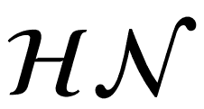

# 第二章

概率编程

> 我们的魔像很少有实体形式，但它们通常也由硅中生长的黏土做成，作为计算机代码存在。—— 理查德·麦克埃尔里斯

现在我们对概率理论和贝叶斯统计有了非常基础的理解，接下来我们将学习如何使用计算工具构建概率模型。具体来说，我们将学习如何使用 PyMC 进行概率编程 [Abril-Pla 等人, 2023]。基本的思想是，我们通过代码来指定统计模型，然后 PyMC 将为我们求解这些模型。我们不需要显式地写出贝叶斯定理。这样做有两个原因。首先，许多模型无法得到解析解，因此我们只能使用数值方法来求解这些模型。其次，现代贝叶斯统计主要通过编写代码来完成。我们将看到，概率编程提供了一种有效的方法来构建和求解复杂模型，它让我们能够更多地关注模型设计、评估和解释，而少关注数学或计算的细节。

本章将涵盖以下主题：

+   概率编程

+   PyMC 入门

+   硬币抛掷问题重访

+   总结后验分布

+   高斯模型和学生 t 分布模型

+   比较不同组别和效应大小

## 2.1 概率编程

贝叶斯统计从概念上讲非常简单。我们有*已知*和*未知*，然后使用贝叶斯定理将后者条件化于前者。如果我们足够幸运，这个过程将减少对*未知*的 uncertainty。通常，我们把*已知*称为**数据**并将其视为常数，*未知*则称为**参数**并将其视为*随机变量*。

尽管从概念上讲很简单，完全概率模型常常导致解析上不可处理的表达式。多年来，这一直是一个真正的问题，也是贝叶斯方法未能广泛应用于一些利基领域的主要原因之一。计算时代的到来和数值方法的发展，至少在原理上可以用来解决任何推断问题，已经极大地改变了贝叶斯数据分析的实践。我们可以将这些数值方法视为*通用推断引擎*。自动化推断过程的可能性催生了**概率编程语言**（**PPLs**），它使得模型创建和推断之间有了清晰的分离。在 PPL 框架中，用户通过编写几行代码来指定完整的概率模型，然后推断过程会自动进行。

预计概率编程将在数据科学和其他学科中产生重大影响，能够使从业人员以更省时且更少出错的方式构建复杂的概率模型。我认为，编程语言对科学计算的影响可以通过六十多年前 Fortran 编程语言的引入来类比。虽然现在 Fortran 已经不再流行，但曾几何时，它被认为是革命性的。科学家们第一次摆脱了计算细节，开始更自然地专注于构建数值方法、模型和仿真。很有趣的是，有些人正在努力让 Fortran 再度焕发光彩，如果你有兴趣，可以查看他们的工作：[`fortran-lang.org/en`](https://fortran-lang.org/en)。

### 2.1.1 使用 PyMC 抛硬币

让我们回顾一下*第一章*中的抛硬币问题，这次使用 PyMC。我们将使用与那一章中相同的合成数据。因为我们生成了数据，所以我们知道以下代码块中 *θ* 的真实值，称为 `theta_real`。当然，对于实际数据集，我们没有这些知识：

**代码 2.1**

```py
np.random.seed(123) 

trials = 4 
theta_real = 0.35 # unknown value in a real experiment 
data = pz.Binomial(n=1, p=theta_real).rvs(trials)
```

现在我们有了数据，我们需要指定模型。记住，这是通过指定似然性和先验来完成的。对于似然性，我们将使用参数 *n* = 1，*p* = *θ* 的二项分布；对于先验，我们将使用参数 *α* = *β* = 1 的 Beta 分布。具有此类参数的 Beta 分布等同于区间 [0, 1] 上的均匀分布。使用数学符号我们可以将模型写为：


这个统计模型几乎可以直接翻译为 PyMC：

**代码 2.2**

```py
with pm.Model() as our_first_model: 
    *θ* = pm.Beta('*θ*', alpha=1., beta=1.) 
    y = pm.Bernoulli('y', p=*θ*, observed=data) 
    idata = pm.sample(1000)
```

代码的第一行创建了我们模型的容器。`with` 块中的所有内容将自动添加到 `our_first_model` 中。你可以把这看作是一种语法糖，它简化了模型的指定，因为我们不需要手动将变量分配给模型。第二行指定了先验。如你所见，语法紧密遵循了数学符号。第三行指定了似然性；语法与先验几乎相同，唯一不同的是我们使用 `observed` 参数传递数据。观测值可以作为 Python 列表、元组、NumPy 数组或 pandas DataFrame 传递。至此，我们完成了模型的指定！是不是很简洁？

我们还有一行代码需要解释。最后一行就是魔法发生的地方。背后这个看似无害的代码行，PyMC 正在自动化许多任务，简直就像是有成百上千的 *oompa loompas* 在为您唱歌并烤制美味的贝叶斯推断！嗯，虽然并非如此，但 PyMC 确实在自动化很多任务。暂时，我们将把这一行视作一个黑箱，它将为我们提供正确的结果。重要的是要理解，在底层，我们将使用数值方法来计算后验分布。原则上，这些数值方法能够解决我们可以编写的任何模型。我们为这种通用性所付出的代价是，结果将以来自后验的样本形式呈现。稍后，我们将能够证实这些样本来自一个 Beta 分布，正如我们在上一章学到的那样。由于数值方法是随机的，每次运行时样本都会有所不同。然而，如果推断过程按预期进行，这些样本将代表后验分布，因此我们将从这些样本中得出相同的结论。有关底层发生的详细情况以及如何检查样本是否值得信任，将在 *第十章* 中解释。

还有一件事：`idata` 变量是一个 `InferenceData` 对象，它是一个容器，包含 PyMC 生成的所有数据。我们将在本章稍后学习更多有关此的内容。

好的，在最后一行中，我们请求从后验中获得 1,000 个样本。如果您运行代码，您将看到类似这样的消息：

```py
Auto-assigning NUTS sampler... Initializing NUTS using jitter+adapt_diag... Multiprocess sampling (4 chains in 4 jobs)
NUTS: [*θ*]
Sampling 4 chains for 1_000 tune and 1_000 draw iterations (4_000 + 4_000 draws total) took 1 second.
```

第一行和第二行告诉我们，PyMC 已经自动分配了 NUTS 采样器（一个非常适合连续变量的推断引擎），并使用了一种方法来初始化该采样器（这些方法需要对开始采样的位置进行一些初步猜测）。第三行说 PyMC 将并行运行四个链，因此我们将从后验中获得四个独立的样本。由于 PyMC 尝试将这些链并行化到机器上可用的处理器中，我们将以一个价格获得四个样本。链的确切数量是根据机器中的处理器数量计算的；您可以使用 `chains` 参数来更改 `sample` 函数的链数。接下来的这一行告诉我们每个采样器正在采样哪些变量。对于这个特定的例子，这一行并没有添加新信息，因为 NUTS 被用来采样我们唯一的变量 *θ*。然而，这并不总是这样，因为 PyMC 可以为不同的变量分配不同的采样器。PyMC 有规则来确保每个变量都与最佳的采样器关联。用户可以使用 `sample` 函数的 `step` 参数手动分配采样器，但您几乎不需要这么做。

最后，最后一行是一个进度条，显示了与采样器工作速度相关的几个指标，包括每秒的迭代次数。如果你运行代码，你会看到进度条更新得非常快。在这里，我们看到的是最后阶段，即采样器已经完成了它的工作。你会注意到，我们要求了 1,000 个样本，但 PyMC 实际上计算了 8,000 个样本。每条链有 1,000 个抽样用于调节采样算法（在本例中是 NUTS）。这些抽样默认会被丢弃；PyMC 使用它们来提高采样方法的效率和可靠性，这对于获得有用的后验近似是非常重要的。每条链还有 1,000 个有效抽样，共计 4,000 个。这些是我们将用作后验分布的样本。我们可以通过 `tune` 参数调整调节步骤的数量，通过 `draw` 参数调整抽样的数量。

更快的采样

在幕后，PyMC 使用 PyTensor，这是一个可以定义、优化和高效评估涉及多维数组的数学表达式的库。PyTensor 大大提高了 PyMC 的速度和性能。尽管有这些优势，但值得注意的是，PyMC 中的采样器是用 Python 实现的，这有时可能导致执行速度较慢。为了应对这个限制，PyMC 允许使用外部采样器。我推荐使用 nutpie，一个用 Rust 编写的采样器。有关如何从 PyMC 安装和调用 nutpie 的更多信息，请查阅 *第 10* 章。

## 2.2 总结后验分布

通常，在从后验分布中采样后，我们执行的第一项任务是检查结果的表现。ArviZ 的 `plot_trace` 函数非常适合这项任务：

**代码 2.3**

```py
az.plot_trace(idata)
```


**图 2.1**：`our_first_model` 后验的追踪图

*图 2.1* 显示了调用 `az.plot_trace` 时的默认结果；我们为每个未观察到的变量获得两个子图。我们模型中唯一未观察到的变量是 *θ*。注意，*y* 是一个表示数据的观察变量；我们不需要对其进行采样，因为我们已经知道这些值。因此，我们只得到两个子图。左边是一个 **核密度估计**（**KDE**）图；这类似于直方图的平滑版本。理想情况下，我们希望所有链条的 KDE 非常相似，就像 *图 2.1* 中所示。右边，我们得到每个采样步骤的个体值；每条链条对应一条线。理想情况下，我们希望它看起来杂乱无章，没有明显的模式，我们应该很难区分不同的链条。在 *第 10* 章中，我们提供了更多关于如何解读这些图表的细节。关键是，如果我们运行了许多链条，我们期望它们几乎无法区分。采样器表现得很好，我们可以信任这些样本。

与其他 ArviZ 函数一样，`az.plot_trace` 也有许多选项。例如，我们可以通过设置 `combined=True` 参数来生成所有链的单个 KDE 图，并通过设置 `kind=rank_bars` 来生成一个 **排名** **图**。

**代码 2.4**：

```py
az.plot_trace(idata, kind="rank_bars", combined=True)
```


**图 2.2**：`our_first_model` 后验的痕迹图，使用了选项 `kind="rank_bars"` 和 `combined=True`。

排名图是另一种检查我们是否可以信任样本的方法；对于这个图，我们为每条链生成一个直方图，并希望它们尽可能均匀，像在 *图 2.2* 中那样。由于随机抽样，一些小的均匀性偏差是可以接受的，但大的均匀性偏差则表明链正在探索后验的不同区域。理想情况下，我们希望所有的链都能探索整个后验。在 *第十章* 中，我们提供了如何解释排名图及其构建方法的更多细节。

ArviZ 提供了几种其他的图表来帮助解释后验，我们将在接下来的页面中看到它们。我们也可能希望获得后验的数值总结。我们可以使用 `az.summary` 来实现，它将返回一个 pandas DataFrame，如 *表 2.1* 所示。

**代码 2.5**

```py
az.summary(idata, kind="stats").round(2)
```

|  | 均值 | 标准差 | hdi_3% | hdi_97% |
| --- | --- | --- | --- | --- |
| *θ* | 0.34 | 0.18 | 0.03 | 0.66 |

**表 2.1**：总结统计数据

在第一列，我们有变量的名称，第二列是后验的均值，第三列是后验的标准差，最后两列是 94% 最高密度区间的下限和上限。因此，根据我们的模型和数据，我们认为 *θ* 的值很可能是 0.34，并且以 94% 的概率，它的真实值在 0.03 和 0.66 之间。我们也可以使用标准差报告一个类似的总结。标准差相比 HDI 的优点是它是一种更常见的统计量。但缺点是我们需要更小心地解释它，否则可能会得出毫无意义的结果。例如，如果我们计算均值 ± 2 个标准差，我们将得到区间 (-0.02, 0.7)；上限值与我们从 HDI 得到的 0.66 相差不远，但下限实际上超出了 *θ* 的可能值（它应该在 0 和 1 之间）。

另一种直观总结后验的方法是使用 ArviZ 中的 `az.plot_posterior` 函数（见 *图 2.3*）。我们在前一章中已经用它处理了一个虚假的后验。现在，我们将使用它来处理一个真实的后验。

**代码 2.6**

```py
az.plot_posterior(idata)
```


**图 2.3**：该图显示了 *θ* 的后验分布及 94% HDI。

默认情况下，`plot_posterior` 为离散变量显示直方图，为连续变量显示核密度估计（KDE）。我们还可以得到分布的均值（可以通过`point_estimate`参数请求中位数或众数）和 94%的 HDI，该黑线位于图表底部。可以使用`hdi_prob`参数为 HDI 设置不同的区间值。这种类型的图表是由 John K. Kruschke 在他的伟大著作《Doing Bayesian Data Analysis》中首次提出的[Kruschke, 2014]。

## 2.3 基于后验的决策

有时候，仅仅描述后验是不够的。我们可能需要基于推断做出决策，并将连续估计转化为二分法：是-否，健康-生病，污染-安全，等等。例如，硬币是否公平？一个公平的硬币是*θ*值恰好为 0.5 的硬币。我们可以将 0.5 的值与 HDI 区间进行比较。从*图 2.3*中，我们可以看到 HDI 区间从 0.03 到 0.7，因此 0.5 包含在 HDI 内。我们可以将此解读为硬币可能有尾部偏向，但我们不能完全排除硬币实际上是公平的可能性。如果我们希望做出更明确的决策，我们需要收集更多的数据来减少后验的分布范围，或者可能需要重新定义一个更具信息性的先验。

### 2.3.1 Savage-Dickey 密度比

评估后验提供给某个特定值的支持力度的一种方法是比较该值下后验密度和先验密度的比值。这称为 Savage-Dickey 密度比，我们可以使用 ArviZ 通过`az.plot_bf`函数来计算：

**代码 2.7**

```py
az.plot_bf(idata, var_name="*θ*", 
           prior=np.random.uniform(0, 1, 10000), ref_val=0.5);
```


**图 2.4**：该图显示了`our_first_model`的先验和后验；黑色点表示在参考值 0.5 处评估的值

从*图 2.4*中我们可以看到，`BF_01`的值为 1.3，这意味着在后验分布下，*θ* = 0.5 的值比在先验分布下更有可能，概率是 1.3 倍。为了计算这个值，我们将后验在*θ* = 0.5 处的高度除以前验在*θ* = 0.5 处的高度。`BF_10`的值则是其倒数！-1- 1.3 ≈ 0.8。我们可以理解为在后验分布下，**θ≠0.5**的可能性是先验分布下的 0.76 倍。我们如何解读这些数字？要带有一丝怀疑……以下表格展示了 Kass 和 Raftery 在 1995 年提出的其中一种可能的解释：

| BF_01 | 解释 |
| --- | --- |
| 1 到 3.2 | 不值一提 |
| 3.2 到 10 | 实质性 |
| 10 到 100 | 强 |
| *>* 100 | 决定性 |

**表 2.2**：贝叶斯因子（BF_01）的解释

Savage-Dickey 密度比率是一种特定的计算方法，用来求解所谓的贝叶斯因子。我们将在 *第五章* 中学习更多关于贝叶斯因子及其注意事项。

### 2.3.2 实际等价区域

严格来说，观察到精确的 0.5（即带有无限多个零）的概率为零。此外，在实践中，我们通常不关心精确结果，而是关心某个范围内的结果。因此，在实践中，我们可以放宽对公平性的定义，认为一个公平的硬币的值应该是 *接近* 0.5。例如，我们可以说，区间 [0.45, 0.55] 内的任何值对于我们的目的来说，实际上都等同于 0.5。我们称这个区间为实际等价区域（ROPE）。一旦定义了 ROPE，我们就可以将其与 HDI 进行比较。我们可以得到至少三种情况：

+   ROPE 不与 HDI 重叠；我们可以说硬币是不公平的

+   ROPE 包含了整个 HDI；我们可以说硬币是公平的

+   ROPE 部分与 HDI 重叠；我们不能说硬币是公平的还是不公平的

如果我们选择将 ROPE 与参数的支持区域匹配，例如在硬币投掷示例中使用 [0, 1]，我们将总是认为硬币是公平的。请注意，我们不需要收集数据来进行任何推断。

ROPE 的选择完全是任意的：我们可以选择任何我们想要的值。有些选择并没有什么实际意义。例如，对于硬币投掷示例，如果我们选择 ROPE 为 [0, 1]，那么我们将总是认为硬币是公平的。更重要的是，我们不需要收集数据或进行任何分析来得出这个结论，这是一个微不足道的例子。更值得担心的是，在进行分析之后选择 ROPE。这是有问题的，因为我们可以调整结果来使它符合我们想要的结论。但如果我们要调整结果以符合我们的预期，那我们为什么还要做分析呢？ROPE 应该由领域知识来决定。

我们可以使用 `plot_posterior` 函数来绘制包含 HDI 区间和 ROPE 的后验分布。ROPE 显示为半透明的粗（灰色）线：

**代码 2.8**

```py
az.plot_posterior(idata, rope=[0.45, .55])
```


**图 2.5**：该图展示了 *θ* 的后验分布和 94% HDI。ROPE 以一条粗的浅灰色线表示

另一个我们可以用来帮助决策的工具是将后验分布与参考值进行比较。我们可以使用 `plot_posterior` 来实现。如 *图 2.6* 所示，我们得到一条垂直的（灰色）线，并且可以看到后验分布在参考值之上和之下的比例：

**代码 2.9**

```py
az.plot_posterior(idata, ref_val=0.5)
```


**图 2.6**：该图展示了 *θ* 的后验分布和 94% HDI。参考值显示为灰色垂直线

关于 ROPE 使用的更详细讨论，可以阅读 Kruschke 的《Doing Bayesian Data Analysis》第十二章[2014]。该章节还讨论了如何在贝叶斯框架中进行假设检验及其注意事项，无论是在贝叶斯还是非贝叶斯设置下。

### 2.3.3 损失函数

如果你觉得这些 ROPE 规则听起来有些繁琐，并且想要更正式的东西，损失函数就是你所寻找的！为了做出一个好的决策，重要的是对相关参数的估计值具有尽可能高的精度，但同样重要的是要考虑犯错的代价。成本/收益的权衡可以通过数学化的方式使用损失函数来形式化。损失函数或其逆的名称在不同领域中各不相同，我们可能会遇到诸如成本函数、目标函数、适应度函数、效用函数等名称。无论名称如何，关键思想是使用一个函数来捕捉参数的真实值和估计值之间的差异。损失函数的值越大，估计结果越差（根据损失函数的定义）。一些常见的损失函数示例如下：

+   绝对损失函数，|*θ* − |

+   二次损失函数，(*θ* − )²

+   0-1 损失函数，1(**θ* ≠* )，其中  是指示函数

实际上，我们并不知道真实参数的值。相反，我们有一个后验分布形式的估计。因此，我们可以做的是找出一个 *θ*，使其最小化期望损失函数。所谓的期望损失函数是指在整个后验分布上平均的损失函数。

在以下代码块中，我们有两个损失函数：绝对损失（`lossf_a`）和二次损失（`lossf_b`）。我们将探索一个包含 200 个点的网格上的值。然后，我们会绘制这些曲线，并且还会包括最小化每个损失函数的 *θ* 值。以下代码块展示了没有绘图部分的 Python 代码：

**代码 2.10**

```py
grid = np.linspace(0, 1, 200) 
*θ*_pos = idata.posterior['*θ*'] 
lossf_a = [np.mean(abs(i - *θ*_pos)) for i in grid] 
lossf_b = [np.mean((i - *θ*_pos)**2) for i in grid] 
for lossf, c in zip([lossf_a, lossf_b], ['C0', 'C1']): 
    ...
```


**图 2.7**：应用于 `our_first_model` 后验的绝对（黑色）和二次（灰色）损失函数

更有趣的是，从*图 2.7*可以看到，我们从绝对损失得到的值等于后验分布的中位数，而从二次损失得到的值等于后验分布的均值。你可以通过计算`np.mean(`*θ*`_pos)`，`np.median(`*θ*`_pos)`来验证这一点。这并非巧合：不同的损失函数与不同的点估计有关。均值是最小化二次损失的点估计，中位数是最小化绝对损失的点估计，而众数是最小化 1-0 损失的点估计。

如果我们想正式一点，并且想要计算一个单点估计值，我们必须决定选择哪个损失函数。相反地，如果我们选择一个点估计值，我们实际上（可能是无意识地）选择了一个损失函数。显式选择损失函数的优点是我们可以根据自己的问题量身定制函数，而不是使用预定义的规则。我们常常会发现，做决策的成本是非对称的；例如，疫苗可能会引起免疫系统的过度反应，但接种疫苗的人，甚至未接种疫苗的人，所获得的益处通常远远超过风险，差距通常很大。因此，如果我们的任务要求，我们可以构建一个非对称的损失函数。还需要注意的是，由于后验分布是数值样本的形式，我们可以计算复杂的损失函数，这些函数不必受限于数学便利性或单纯的简化。下面的代码，以及由它生成的*图 2.8*，就是这个概念的一个简单示例：

**代码 2.11**

```py
lossf = [] 
for i in grid: 
    if i < 0.5: 
        f = 1/np.median(*θ*_pos / np.abs(i**2 - *θ*_pos)) 
    else: 
        f = np.mean((i - *θ*_pos)**2 + np.exp(-i)) - 0.25 
    lossf.append(f)
```


**图 2.8**：应用于`our_first_model`后验分布的一个奇怪损失函数

直到现在，我们一直在讨论贝叶斯统计和概率编程的主要概念，主要通过 BetaBinomial 模型，因为它的简洁性。在构建更复杂模型的过程中，我们现在将焦点转向高斯推理的领域。

## 2.4 高斯分布的深入探索

从数学角度来看，高斯分布非常吸引人。与高斯分布进行工作相对容易，许多应用于高斯分布的操作会返回另一个高斯分布。此外，许多自然现象可以使用高斯分布进行很好的近似；实际上，几乎每次我们测量某物的平均值时，只要样本量*足够大*，该平均值就会呈高斯分布。这种现象何时成立、何时不成立以及何时大致成立的细节在**中心极限定理**（CLT）中有详细阐述；你可能现在就想停下来，去查找一下这个非常*核心*的统计学概念（有意的恶搞）。

好吧，我们刚才说过，许多现象确实是平均值的结果。举个老套的例子，身高（几乎所有人的其他特征也是如此）是许多环境因素和许多遗传因素的综合结果，因此我们可以得到成年人的身高符合高斯分布。事实上，我们得到的是两个高斯分布的混合，这是女性和男性身高分布重叠的结果，但你大概明白了。总之，高斯分布是易于使用且在自然现象中普遍存在的；因此，许多你可能已经了解的统计方法假设数据是符合正态分布的。因此，学习如何建立这些模型很重要，而同样重要的是学会如何放宽正态性假设，这在贝叶斯框架和现代计算工具如 PyMC 中是非常容易的。

### 2.4.1 高斯推断

核磁共振（NMR）是一种强大的技术，用于研究分子以及诸如人类、向日葵和酵母等生物（毕竟，*我们不过是一堆分子*）。NMR 使得我们能够测量与有趣的不可观察分子性质相关的不同种类的可观察量 Arroyuelo 等人 [2021]。其中一种可观察量被称为化学位移，这个值仅能通过某些类型原子的核来获取。具体的细节属于量子化学的范畴，跟本讨论无关。就我们目前关心的来说，我们也可以测量一群人的身高、回家所需的平均时间或一袋袋橙子的重量。在这些例子中，变量是连续的，因此把它们看作是一个平均值加上一个离散度是有意义的。有时如果可能的值足够多，我们可以用高斯模型来处理离散变量；例如，倭黑猩猩非常好色，所以也许我们可以用高斯分布来建模我们表亲的性伴侣数量。

回到我们的例子，我们在*图 2.9* 中通过箱型图表示了 48 个化学位移值。我们可以看到，中位数（箱内的线）大约是 53，而四分位距（箱子的范围）大约是 52 和 55。我们还可以看到，有两个值远离其余数据（空心圆）。


**图 2.9**：48 个化学位移值的箱型图。我们观察到有两个值超过 60，远离其余数据。

让我们暂时忘记这两个点，假设高斯分布是描述数据的一个合理模型。由于我们不知道均值或标准差，因此必须为它们设置先验分布。因此，一个合理的模型可以是：


(*l,h*)是*l*和*h*之间的均匀分布，(*σ*[*σ*])是带有尺度*σ*[*σ*]的 HalfNormal 分布，(*μ,σ*)是均值为*μ*，标准差为*σ*的高斯分布。HalfNormal 分布考虑的是以零为中心的正态分布的绝对值。*图 2.10*展示了该模型的图形表示。


**图 2.10**: `model_g`的图形表示

如果我们不知道*μ*和*σ*的可能值，可以设置反映我们无知的先验分布。一种选择是将均匀分布的边界设置为*l* = 40，*h* = 75，这是一个比数据范围更大的范围。另一种选择是根据我们之前的知识选择一个范围。例如，我们可能知道这种类型的测量值不可能低于 0 或高于 100，因此可以将这些值作为均匀分布的边界。对于 HalfNormal 分布，在没有更多信息的情况下，我们可以选择一个相对于数据规模较大的值。表示在*图 2.10*中模型的 PyMC 代码是：

**代码 2.12**

```py
with pm.Model() as model_g: 
    μ = pm.Uniform('μ', lower=40, upper=70) 
    σ = pm.HalfNormal('σ', sigma=5) 
    Y = pm.Normal('Y', mu=μ, sigma=σ, observed=data) 
    idata_g = pm.sample()
```

让我们看看后验分布的形态。*图 2.11*是通过 ArviZ 的`plot_trace`函数生成的。它每一行对应一个参数。对于该模型，后验分布是二维的，因此每一行展示一个边际分布。


**图 2.11**: 使用`az.plot_trace(idata_g)`绘制的`model_g`后验分布

我们可以使用 ArviZ 的`plot_pair`函数查看二维后验分布的形态，并同时查看*μ*和*σ*的边际分布。请参见*图 2.12*：


**图 2.12**: 使用`az.plot_pair(idata_g, kind=’kde’, marginals=True)`绘制的`model_g`后验分布

我们将打印汇总以供以后使用（参见*表 2.3*）。我们使用以下代码：

**代码 2.13**

```py
az.summary(idata_g, kind="stats").round(2)
```

|  | 均值 | 标准差 | hdi_3% | hdi_97% |
| --- | --- | --- | --- | --- |
| *μ* | 53.50 | 0.52 | 52.51 | 54.44 |
| *σ* | 3.52 | 0.38 | 2.86 | 4.25 |

**表 2.3**: *μ*和*σ*的汇总统计

## 2.5 后验预测检查

贝叶斯工具包的一个优点是，一旦我们得到了后验*p*(*θ*|*Y* )，就可以用它来生成预测*p*(*Ỹ*)。在数学上，这可以通过计算来完成：


这种分布被称为**后验预测分布**。它是*预测性的*，因为它用于进行预测，并且是*后验的*，因为它是使用后验分布计算的。因此，我们可以将其视为给定模型和观察数据后未来数据的分布。

使用 PyMC 获取后验预测样本非常简单；我们无需计算任何积分。只需要调用`sample_posterior_predictive`函数，并将`InferenceData`对象作为第一个参数传入。我们还需要传入`model`对象，并可以使用`extend_inferencedata`参数将后验预测样本添加到`InferenceData`对象中。代码如下：

**代码 2.14**

```py
pm.sample_posterior_predictive(idata_g, model=model_g, 
                              extend_inferencedata=True)
```

后验预测分布的一个常见用途是进行后验预测检验。这是一组可以用来检查模型是否适合数据的测试。我们可以使用 ArviZ 中的`plot_ppc`函数来可视化后验预测分布和观测数据。代码如下：

**代码 2.15**

```py
az.plot_ppc(idata_g, num_pp_samples=100)
```


**图 2.13**：使用`az.plot_ppc`绘制的`model_g`后验预测检验

在*图 2.13*中，黑色线条是数据的 KDE，灰色线条是从每一个 100 个后验预测样本中计算出的 KDE。灰色线条反映了我们对预测数据分布的不确定性。当数据点很少时，图像看起来会显得*杂乱*或*奇怪*；这是常见的情况。默认情况下，ArviZ 中的 KDE 是在实际数据范围内估算的，并假设在数据范围之外为零。虽然有人可能认为这是一个 bug，但我认为它是一个特性，因为它反映了数据的一个特性，而不是过度平滑处理。

从*图 2.13*中，我们可以看到模拟数据的均值略微向右偏移，并且模拟数据的方差似乎比实际数据大。这个差异的来源可以归因于我们选择的似然函数和两个偏离数据主体的观测值（在*图 2.9*中为空心点）。我们如何解释这个图？模型是错误的还是正确的？我们可以使用它吗，还是需要换一个模型？其实，这取决于情况。模型的解释、评估和批评始终是依赖于具体情境的。根据我在这种测量中的经验，我认为这个模型是对数据的一个合理且足够的表示，并且对于我大多数分析来说非常有用。不过，重要的是要记住，我们可能会找到其他更好地适应整个数据集的模型，包括那两个远离数据主体的观测值。让我们看看如何做到这一点。

## 2.6 鲁棒推断

我们对`model_g`可能有一个异议，那就是我们假设了正态分布，但数据中有两个点远离数据的主体。通过使用正态分布作为似然性，我们间接假设我们不期望看到大量远离主体的数据点。*图 2.13* 显示了将这些假设与数据结合的结果。由于正态分布的尾部随着离均值越远而迅速下降，正态分布（至少是人性化的正态分布）对这两个点的出现感到*惊讶*，并以两种方式做出*反应*，将其均值向这两个点移动，并增加其标准差。另一种直观的解释方式是，认为这些点在决定正态分布参数时有过大的权重。

那么，我们该怎么做呢？一个选项是检查数据中的错误。如果我们回溯步骤，可能会发现清理或预处理数据时代码出错，或者可以将这些假定的异常值与测量设备故障关联起来。不幸的是，这并不总是一个选项。很多时候，数据是由别人收集的，我们没有很好的记录它是如何收集、测量或处理的。无论如何，在建模之前检查数据总是一个好主意，这在一般情况下都是一种良好的做法。

另一个选项是将这些点声明为离群值并将其从数据中移除。识别数据集离群值的两条常见经验法则是：

+   使用四分位间距（IQR）：任何低于下四分位数 1.5 倍 IQR，或高于上四分位数 1.5 倍 IQR 的数据点，都被认为是离群值。

+   使用标准差：任何低于或高于数据标准差*N*倍的数据点都被认为是离群值。通常*N*的值是 2 或 3。

然而，需要注意的是，像任何自动化方法一样，这些经验法则并不完美，可能会导致丢弃有效的数据点。

从建模的角度来看，我们可以将问题归咎于模型，而不是数据，并进行修改，正如下一节所解释的那样。一般来说，贝叶斯方法更倾向于通过使用不同的先验和似然性，将假设直接编码到模型中，而不是通过诸如去除离群值规则等临时启发式方法。

### 2.6.1 正常性的程度

有一个分布看起来非常类似于正态分布。它有三个参数：位置参数*μ*，尺度参数*σ*，以及正态性参数*ν*。这个分布被称为学生 t 分布。*图 2.14*展示了这一家族的成员。当*ν* = ∞时，分布就是正态分布，*μ*是均值，*σ*是标准差。当*ν* = 1 时，我们得到的是柯西分布或洛伦兹分布。*ν*的取值范围是从 0 到∞。这个值越小，分布的尾部越重。我们还可以说，*ν*值越小，峰度越高。峰度是第四阶矩，你可能还记得前一章中提到的。所谓“重尾”，是指在这种分布中，偏离均值的值比在正态分布中更为常见，换句话说，值的分布不像正态分布那样集中在均值附近。例如，95%的学生 t 分布值（*μ* = 0，*σ* = 1，*ν* = 1）会落在-12.7 到 12.7 之间。而对于正态分布（*μ* = 0，*σ* = 1，*ν* = ∞），这一范围是-1.96 到 1.96。


**图 2.14**：学生 t 分布

学生 t 分布的一个非常有趣的特点是，当*ν* ≤ 1 时，它没有定义的均值。虽然从学生 t 分布中得到的任何有限样本都可以计算出经验均值，但理论上的分布本身没有定义均值的值。直观地说，可以理解为：分布的尾部非常重，以至于在任何时候我们可能从实数线上几乎任何位置抽取一个样本值，因此如果我们不断地得到数值，我们永远不会接近一个固定的值。相反，估计值将不断地游走。

什么自由度？

在大多数教科书中，学生 t 分布的参数*ν*被称为自由度参数。然而，我更倾向于遵循 Kruschke 的建议，将其称为正态性参数。这个名称更能描述该参数在分布中的作用，特别是在用于鲁棒回归时。

同样，这个分布的方差只有在*ν >* 2 时才被定义。因此，重要的是要注意，学生 t 分布的尺度与其标准差不同。随着*ν*趋近于无穷大，尺度和标准差会越来越接近。

### 2.6.2 正态模型的鲁棒版本

我们将通过将高斯分布替换为学生 t 分布来重写前面的模型（`model_g`）。由于学生 t 分布比高斯分布多了一个参数*ν*，因此我们需要指定一个额外的先验，对于这个模型我们决定使用指数分布，但其他限制在正区间的分布也可以适用。


*图 2.15* 显示了该模型的图形表示


**图 2.15**：`model_t` 的图形表示

让我们用 PyMC 编写这个模型；像往常一样，我们可以通过指定几行代码来（重新）编写模型。唯一需要注意的是，PyMC 中的指数分布默认使用均值的倒数作为参数化方式。我们将设置 *ν* 为均值为 30 的指数分布。从 *图 2.14* 中可以看到，*ν* = 30 的学生 t 分布与高斯分布相似（即使它并非真正的高斯分布）。事实上，从相同的图中我们可以看到，*大部分的变化*发生在较小的 *ν* 值上。因此，我们可以说，均值为 30 的指数先验是一种弱信息先验，告知模型我们大致认为 *ν* 应该在 30 附近，但也能容易地向较小或较大的值偏移。在许多问题中，估计 *ν* 并非直接关注的重点。

**代码 2.16**

```py
with pm.Model() as model_t: 
    μ = pm.Uniform('μ', 40, 75) 
    σ = pm.HalfNormal('σ', sigma=10) 
    ν = pm.Exponential('ν', 1/30) 
    y = pm.StudentT('y', nu=ν, mu=μ, sigma=σ, observed=data) 
    idata_t = pm.sample()
```

比较 `model_g` 的轨迹（*图 2.11*) 与 `model_t` 的轨迹（*图 2.16*)：


**图 2.16**：使用 `az.plot_trace(idata_t)` 绘制的 `model_t` 后验

现在，打印出 `model_t` 的总结。你应该得到类似于 *表 2.4* 的内容。将结果与 `model_g` 的结果进行比较。

|  | 均值 | 标准差 | hdi_3% | hdi_97% |
| --- | --- | --- | --- | --- |
| *μ* | 53.02 | 0.39 | 52.27 | 53.71 |
| *σ* | 2.21 | 0.42 | 1.46 | 3.01 |
| *ν* | 4.94 | 5.45 | 1.07 | 10.10 |

**表 2.4**：*μ*、*σ* 和 *ν* 的总结统计

在继续阅读之前，花点时间将前面的结果与 `model_g` 的结果进行比较，并找出两者之间的差异。你发现了什么有趣的地方吗？

两个模型之间的 *μ* 估计值相似，差异约为 ≈ 0*.*5\. *σ* 的估计值对于 `model_g` 为 ≈ 3*.*5， 对于 `model_t` 为 ≈ 2*.*2。这是因为学生 t 分布将较远离均值的值分配较小的权重。简单来说，学生 t 分布对远离均值的值*不那么惊讶*。我们还可以看到 *ν* 的均值为 ≈ 5，这意味着我们有一个重尾分布，而非类似高斯分布的分布。

*图 2.17* 显示了 `model_t` 的后验预测检验。让我们将其与 `model_g` 的结果（*图 2.13）进行比较。使用学生 t 分布的模型产生的预测样本似乎在分布的峰值位置以及扩展范围上更好地拟合数据。请注意，样本如何从数据的主要部分延伸得很远，且一些预测样本看起来非常平坦。这是学生 t 分布期望看到远离均值或数据主体的数据点的直接结果。如果你查看用于生成 *图 2.17* 的代码，你会发现我们使用了 `ax.set_xlim(40, 70)`。


**图 2.17**：`model_t` 的后验预测检查

学生 t 分布使我们能够更 **稳健地估计**均值和标准差，因为异常值对 *ν* 的影响是减少，而不是拉动均值或增大标准差。因此，均值和尺度是通过加权靠近主体的数据点来估计的，而远离主体的数据点则权重较小。作为经验法则，对于 *ν >* 2 且 *不太小* 的值，我们可以将学生 t 分布的尺度视为去除异常值后的数据标准差的合理实用代理。这是一个经验法则，因为我们知道尺度并不是标准差。

## 2.7 InferenceData

InferenceData 是一个包含贝叶斯推断结果的丰富容器。现代的贝叶斯分析可能会生成多组数据，包括后验样本和后验预测样本。但是我们也有观察数据、先验样本，甚至是由采样器生成的统计量。所有这些数据以及更多内容都可以存储在一个 InferenceData 对象中。为了帮助组织这些信息，每一组数据都有其自己的组。例如，后验样本存储在 `posterior` 组中，观察数据存储在 `observed_data` 组中。

*图 2.18* 显示了 `model_g` 的 InferenceData 对象的 HTML 表示。我们可以看到 4 个组：`posterior`、`posterior_predictive`、`sample_stats` 和 `observed_data`。除了 `posterior` 组外，其他组都已折叠。我们可以看到有两个坐标 `chain` 和 `draw`，其维度分别为 4 和 1000。我们还有 2 个变量 *μ* 和 *σ*。


**图 2.18**：`model_g` 的 InferenceData 对象

到目前为止，PyMC 已经生成了一个 InferenceData 对象，而 ArviZ 已使用该对象生成图表或数值摘要。但是，我们也可以操作 InferenceData 对象。一些常见的操作是访问特定的组。例如，要访问后验组，我们可以这样写：

**代码 2.17**

```py
posterior = idata_g.posterior
```

这将返回一个 xarray 数据集。如果你不熟悉 xarray [Hoyer 和 Hamman， 2017]（ [`docs.xarray.dev/en/stable/`](https://docs.xarray.dev/en/stable/)），可以把它想象成带标签的 NumPy 多维数组！这使得许多操作变得更简单，因为你不需要记住维度的顺序。例如，以下代码将返回链条 0 和链条 2 的第一次抽样：

**代码 2.18**

```py
posterior.sel(draw=0, chain=[0, 2])
```

我们使用 `sel` 方法选择一系列值，例如从所有链条中选择前 100 次抽样：

**代码 2.19**

```py
posterior.sel(draw=slice(0, 100))
```

此外，以下代码返回了在所有抽样和链条上计算的 *μ* 和 *σ* 的均值：

**代码 2.20**

```py
posterior.mean()
```

同时，以下代码返回抽样的均值，即，它会返回 *μ* 和 *σ* 的四个值，每个链条一个：

**代码 2.21**

```py
posterior.mean("draw")
```

我们通常不关心链和绘图，只想获得后验样本。在这种情况下，我们可以使用`az.extract`函数：

**代码 2.22**

```py
stacked = az.extract(idata_g)
```

这将`chain`和`draw`合并为一个`sample`坐标，这可以使后续操作更为简便。默认情况下，`az.extract`作用于后验分布，但你也可以通过`group`参数指定其他组。你还可以使用`az.extract`来获取后验的随机样本：

**代码 2.23**

```py
az.extract(idata_g, num_samples=100)
```

本书中我们将一直使用 InferenceData 对象，因此你将有时间熟悉它并在接下来的页面中了解更多。

## 2.8 组间比较

一种常见的统计分析是组间比较。我们可能会对患者对某种药物的反应、交通法规引入后车祸减少、不同教学方法下的学生表现等感兴趣。有时，这类问题会以假设检验的形式呈现，目标是声明某个结果*具有统计学意义*。仅仅依赖统计学显著性可能会带来很多问题：一方面，统计学显著性不等于实际意义；另一方面，单纯通过收集足够的数据，就可能宣布一个非常小的效应为显著。

假设检验的概念与 p 值的概念相关。这种联系并非根本性的，而是一种文化上的联系；人们习惯于这样思考，主要是因为这是大多数入门统计课程中教授的内容。长期以来有很多研究和论文表明，p 值经常被错误使用和解读，甚至是那些每天都在使用它们的人。我们不会进行假设检验，而是采取不同的途径，专注于估计效应量，即量化两组之间的差异。思考效应量的一个好处是，我们可以摆脱“是否有效？”或“是否有影响？”这样的简单是非问题，转而提出更细致的问题，如“效果如何？”或“效应有多大？”。

有时，在比较不同组时，人们会提到对照组和实验组。例如，当我们想要测试一种新药时，我们希望将新药（实验组）与安慰剂（对照组）进行比较。安慰剂效应是一种心理现象，患者在接受无效物质或治疗后，可能会感觉症状或状况有所改善。通过在临床试验中将药物与安慰剂组的效果进行比较，研究人员可以辨别药物是否真的有效。安慰剂效应是实验设计和统计分析中的一个广泛挑战的例子，表明在实验中考虑所有因素是困难的。

这种设计的一个有趣替代方案是，将新药与市面上最受欢迎或最有效的药物进行比较，用以治疗该疾病。在这种情况下，控制组不能是安慰剂；它应该是另一种药物。虚假的控制组是用统计学撒谎的一个绝佳方法。

例如，假设你为一家乳制品公司工作，这家公司想通过告诉父母这种酸奶可以增强免疫系统或帮助孩子更强壮来向孩子们推销过多含糖的酸奶。一种通过数据作假的方式是使用牛奶或甚至水作为对照组，而不是另一种更便宜、含糖量更少、市场推广较少的酸奶。把事情说成这样时，可能会显得很荒谬，但我正在描述的是在实际科学期刊上发表的真实实验。当有人说某物更难、更好、更快或更强时，记得问一下用于比较的基准是什么。

### 2.8.1 小费数据集

为了探讨本节的主题，我们将使用提示数据集[Bryant 和 Smith，1995]。我们想研究星期几对餐厅小费的影响。在这个例子中，不同的组别是不同的星期几。请注意，这里没有控制组或处理组。如果我们愿意，可以随意将某一天（例如星期四）设定为参考组或控制组。现在，让我们通过仅用一行代码将数据集加载为 pandas DataFrame 来开始分析。如果你不熟悉 pandas，`tail` 命令用于显示 DataFrame 的最后几行（见 *表 2.5*），你也可以尝试使用 `head`：

**代码 2.24**

```py
tips = pd.read_csv("data/tips.csv") 
tips.tail()
```

|  | 总账单 | 小费 | 性别 | 吸烟者 | 星期几 | 餐次 | 人数 |
| --- | --- | --- | --- | --- | --- | --- | --- |
| 239 | 29.03 | 5.92 | 男性 | 否 | 星期六 | 晚餐 | 3 |
| 240 | 27.18 | 2.00 | 女性 | 是 | 星期六 | 晚餐 | 2 |
| 241 | 22.67 | 2.00 | 男性 | 是 | 星期六 | 晚餐 | 2 |
| 242 | 17.82 | 1.75 | 男性 | 否 | 星期六 | 晚餐 | 2 |
| 243 | 18.78 | 3.00 | 女性 | 否 | 星期四 | 晚餐 | 2 |

**表 2.5**：餐厅样本数据

在这个 DataFrame 中，我们只使用 `day` 和 `tip` 两列。*图 2.19* 显示了使用 ridge 图展示的数据分布。这个图是用 ArviZ 绘制的。尽管 ArviZ 主要用于贝叶斯模型分析，但它的一些功能在数据分析中也很有用。


**图 2.19**：按星期几分布的小费

我们将对数据进行一些小的预处理。首先，我们将创建一个 `tip` 变量，表示以美元为单位的小费。然后我们创建 `idx` 变量，一个类别虚拟变量，用数字编码星期几，也就是说，`[0, 1, 2, 3]` 代替 `[’Thur’, ’Fri’, ’Sat’, ’Sun’]`。

**代码 2.25**

```py
categories = np.array(["Thur", "Fri", "Sat", "Sun"]) 
tip = tips["tip"].values 
idx = pd.Categorical(tips["day"], categories=categories).codes
```

这个问题的模型几乎与`model_g`相同，唯一的区别是现在*μ*和*σ*将变成向量而非标量。PyMC 的语法在这种情况下非常有帮助：我们可以以矢量化的方式编写模型，而不是使用循环。

**代码 2.26**

```py
with pm.Model() as comparing_groups: 
    μ = pm.Normal("μ", mu=0, sigma=10, shape=4) 
    σ = pm.HalfNormal("σ", sigma=10, shape=4) 

    y = pm.Normal("y", mu=μ[idx], sigma=σ[idx], observed=tip)
```

请注意我们如何为先验分布传递了一个`shape`参数。对于*μ*，这意味着我们指定了四个独立的(0*,*10)，而对于*σ*，则是四个独立的(10)。另外，请注意我们如何使用`idx`变量来正确索引传递给似然函数的*μ*和*σ*的值。

PyMC 提供了一种替代语法，要求指定坐标和维度。这种替代方法的优势在于它能更好地与 ArviZ 集成。

在这个例子中，我们有 4 个均值和 4 个标准差，因此我们使用`shape=4`。InferenceData 将具有 4 个索引`0, 1, 2, 3`，分别对应每个 4 天。然而，将这些数值索引与具体的日期关联起来是用户的任务。通过使用坐标和维度，我们以及 ArviZ 可以使用标签`"Thur", "Fri", "Sat", "Sun"`轻松地将参数映射到相应的日期。

我们将指定两个坐标；`"days"`，其维度为`"Thur", "Fri", "Sat", "Sun"`；和`"days_flat"`，它将包含相同的标签，但根据每个观察值的顺序和长度重复。`"days_flat"`将在后续的后验预测测试中发挥作用。

**代码 2.27**

```py
coords = {"days": categories, "days_flat":categories[idx]} 

with pm.Model(coords=coords) as comparing_groups: 
    μ = pm.HalfNormal("μ", sigma=5, dims="days") 
    σ = pm.HalfNormal("σ", sigma=1, dims="days") 

    y = pm.Gamma("y", mu=μ[idx], sigma=σ[idx], observed=tip, dims="days_flat") 

    idata_cg = pm.sample() 
    idata_cg.extend(pm.sample_posterior_predictive(idata_cg))
```

一旦后验分布被计算出来，我们就可以进行所有我们认为相关的分析。例如，我们可以进行后验预测测试。在 ArviZ 的帮助下，我们可以通过调用`az.plot_ppc`来实现。我们使用`coords`和`flatten`参数来为每一天获取一个子图。

**代码 2.28**

```py
_, axes = plt.subplots(2, 2) 
az.plot_ppc(idata_cg, num_pp_samples=100, 
            coords={"days_flat":[categories]}, flatten=[], ax=axes)
```

从下图中可以看出，模型能够捕捉到分布的一般形状，但仍有一些细节难以捉摸。这可能是由于样本量相对较小，除了日期外，其他因素对小费的影响，或者两者的结合。


**图 2.20**：Tips 数据集的后验预测检查

目前，我们认为该模型足够好，可以继续探索后验分布。我们可以从平均值的角度解释结果，然后找出哪些日期的平均值较高。但也有其他方法；例如，我们可能希望用后验均值差异来表达结果。此外，我们可能想要使用一些对我们受众来说更常见的效应大小度量，如优势概率或 Cohen's d。在接下来的部分中，我们将解释这些替代方法。

### 2.8.2 Cohen's d

测量效应大小的常见方法是 Cohen's d，定义如下：


由于我们有后验分布，因此可以计算 Cohen’s d 的分布。如果我们需要一个单一值，可以计算该分布的均值或中位数。

这个公式告诉我们，效应大小是均值差异与两组合并标准差的比值。通过取合并标准差，我们对均值差异进行了标准化。这一点非常重要，因为当差异为 1 且标准差为 0.1 时，效应大小大于标准差为 10 时相同差异的效应大小。Cohen’s d 可以被解释为 Z 得分（标准分数）。Z 得分是一个有符号的标准差数，表示一个值与被观测或测量的均值的差异。因此，0.5 的 Cohen’s d 可以被解释为两组之间差异为 0.5 个标准差。

即使均值差异已被标准化，我们仍然可能需要根据特定问题的上下文进行校准，才能判断某个给定值是大是小是中等。例如，如果我们习惯于对相同或相似的问题进行多次分析，我们可以习惯于 Cohen’s d 为 1。于是，当我们得到一个 Cohen’s d 为 2 时，我们就知道我们得到了重要的结果（或者是某处出错了！）。如果您还没有这种经验，您可以请教领域专家，获取他们宝贵的意见。

一个非常好的网页，可以探索 Cohen’s d 的不同值是什么样子的，网址是[`rpsychologist.com/d3/cohend`](http://rpsychologist.com/d3/cohend)。在该页面上，您还可以找到表示效应大小的其他方法；其中一些可能更为直观，例如超越概率，我们将在下一部分讨论。

### 2.8.3 超越概率

这是报告效应大小的另一种方式，它定义为从一个组中随机抽取的数据点大于从另一个组中随机抽取的一个数据点的概率。如果我们假设所使用的数据是正态分布的，那么我们可以使用以下公式通过 Cohen’s d 计算超越概率：


Φ是累积正态分布，而*δ*是 Cohen’s d。

如果我们接受正态性假设，那么可以使用此公式从 Cohen’s d 的值计算超越概率。否则，我们可以直接通过从两个组中随机抽取样本并计算有多少次一个值大于另一个值来计算超越概率。这样，我们不需要 Cohen’s d 或假设正态性（请参见练习部分）。这是使用**马尔可夫链蒙特卡洛**（**MCMC**）方法的一个优点；一旦我们从后验分布中获得样本，就可以通过这种方式计算许多量，通常比其他方法更为简单。

### 2.8.4 平均差异的后验分析

为了总结我们之前的讨论，让我们计算均值差异、Cohen's d 和优势概率的后验分布，并将它们整合到一个图表中。*图 2.21*包含了大量信息。根据受众的不同，图表可能会过载，或者太拥挤。或许它适合你团队内部的讨论，但对于大众而言，去除某些元素或将信息分布在一个图表和一个表格，或者两个图表之间，可能会更方便。无论如何，在这里我们精确地展示它，以便你可以比较展示相同信息的不同方式，所以请花些时间思考这个图表。


**图 2.21**：小费数据集的均值差异、Cohen’s d 和优势概率的后验分布

阅读*图 2.21*的一种方法是将零差异的参考值与 HDI 区间进行比较。只有一个案例，94%的 HDI 排除了参考值，也就是星期四和星期天的小费差异。在所有其他比较中，根据 HDI-参考值重叠标准，我们不能排除零差异。但即使是那个案例，平均差异也约为 0*.*5 美元。这个差异足够大吗？这个差异足够支持接受在星期天工作，并错过和家人或朋友共度时光的机会吗？这个差异足够让我们接受将小费平均分配到四天，并给每个女服务员和男服务员相同的小费金额吗？

简短的回答是，这类问题不能通过统计学来回答；它们只能通过统计学来提供信息。我希望你不会因为这个答案而感到失望，但除非我们在分析中包含所有对相关方重要的值，否则我们无法得到自动的答案。正式来说，这要求定义一个损失函数，或至少定义一个效应大小的阈值，这个阈值应该由这些值来决定。

## 2.9 总结

尽管贝叶斯统计在概念上很简单，但完全概率模型常常导致解析上不可处理的表达式。多年来，这一直是一个巨大的障碍，阻碍了贝叶斯方法的广泛应用。幸运的是，数学、统计学、物理学和计算机科学通过数值方法来拯救这一局面，这些方法在原则上能够解决任何推断问题。自动化推断过程的可能性促使了概率编程语言的发展，这些语言清晰地将模型定义和推断分开。PyMC 是一个用于概率编程的 Python 库，具有非常简单、直观且易读的语法，而且非常接近描述概率模型的统计语法。

我们通过重新回顾*第一章*中的抛硬币模型来介绍 PyMC 库，这次我们没有通过解析方法推导后验分布。PyMC 模型定义在上下文管理器中。为了将概率分布添加到模型中，我们只需写一行代码。分布可以组合使用，可以作为先验（未观察变量）或似然（已观察变量）。如果我们将数据传递给分布，它将成为似然。采样也可以通过一行代码实现。PyMC 允许我们从后验分布中获取样本。如果一切顺利，这些样本将代表正确的后验分布，因此它们将成为我们模型和数据的逻辑后果的表示。我们可以使用与 PyMC 配合使用的 Python 库 ArviZ 来探索 PyMC 生成的后验分布，ArviZ 可以帮助我们解释和可视化后验分布。在使用后验帮助我们做推理驱动的决策时，一种方法是将 ROPE 与 HDI 区间进行比较。我们还简要提到过损失函数的概念，这是量化在不确定性下做决策时的权衡和成本的一种正式方式。我们学到，损失函数和点估计是紧密相关的。

到目前为止，讨论仅限于一个简单的单参数模型。使用 PyMC 将其推广到任意数量的参数是非常简单的；我们通过高斯分布和学生 t 分布模型来展示如何做到这一点。高斯分布是学生 t 分布的特例，我们向你展示了如何使用后者在存在离群值的情况下进行稳健推断。在接下来的章节中，我们将探讨这些模型如何作为线性回归模型的一部分进行使用。我们使用高斯模型来比较不同组之间的差异。虽然这有时会以假设检验的方式进行框架化，但我们采取了另一种方法，将这一任务框架化为推断效应量的问题，我们通常认为这种方法更丰富、更有成效。我们还探讨了不同的效应量解释和报告方式。

通过本章及上一章的学习，我们已经准备好学习本书中最重要的概念之一——层级模型。那将是下一章的主题。

## 2.10 练习

1.  使用 PyMC，将`our_first_model`中 Beta 分布的先验参数更改为与上一章相匹配的参数。将结果与上一章进行比较。

1.  将模型`our_first_model`与先前的*θ* ∼ Beta(1*,*1)的模型进行比较，再与具有先验*θ* ∼ (0*,*1)的模型进行比较。后验分布相似还是不同？采样是更慢、更快还是相同？如果使用不同区间（如[-1, 2]）的均匀分布会怎样？模型能运行吗？会遇到什么错误？

1.  PyMC 有一个函数`pm.model_to_graphviz`，可以用来可视化模型。使用它来可视化`our_first_model`模型。将结果与 Kruschke 图进行比较。使用`pm.model_to_graphviz`来可视化模型`comparing_groups`。

1.  阅读关于 PyMC 文档中煤矿灾难模型的内容（[`shorturl.at/hyCX2`](https://shorturl.at/hyCX2)）。尝试自己实现并运行这个模型。

1.  修改`model_g`，将均值的先验改为以经验均值为中心的高斯分布，并尝试一些合理的标准差值来调整这个先验。推断对这些变化的稳健性/敏感度如何？你认为使用高斯分布（一种无界分布，范围从-∞到∞）来建模像这样的有界数据（数据在 0 到 100 之间）怎么样？记住我们曾说过，不可能观察到低于 0 或高于 100 的值。

1.  使用`chemical_shifts.csv`文件中的数据，计算有无异常值的经验均值和标准差。将这些结果与使用高斯分布和 Student’s t 分布的贝叶斯估计结果进行比较。你观察到了什么？

1.  通过向`chemical_shifts.csv`中添加更多异常值来重复上一个练习，并使用这些新数据为`model_g`和`model_t`计算新的后验分布。你观察到了什么？

1.  探索`idata_cg`的 InferenceData 对象。

    +   它包含多少个组？

    +   使用`sel`方法检查特定日期参数*μ*的后验分布。

    +   计算星期四和星期日之间均值差异的分布。结果的 DataArray 的坐标和维度是什么？

1.  对于提示示例，直接从后验分布计算优势概率（无需先计算 Cohen’s d）。你可以使用`pm.sample_posterior_predictive()`函数从每个组中采样。这与假设正态分布的计算结果有何不同？你能解释结果吗？

## 加入我们的社区 Discord 空间

加入我们的 Discord 社区，结识志同道合的人，并与 5000 多名成员一起学习：[`packt.link/bayesian`](https://packt.link/bayesian)


