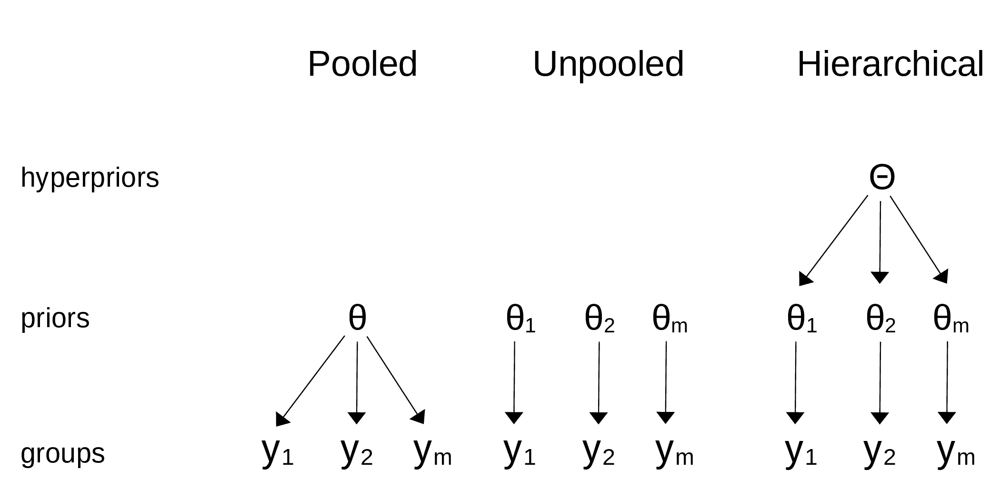
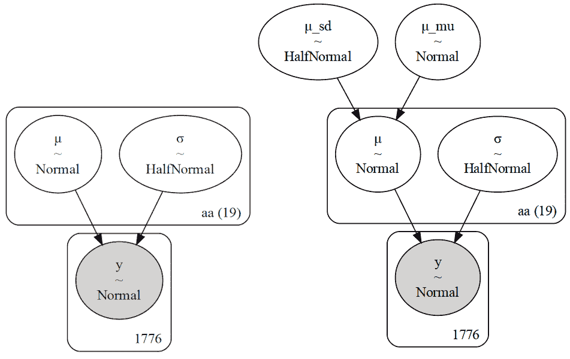
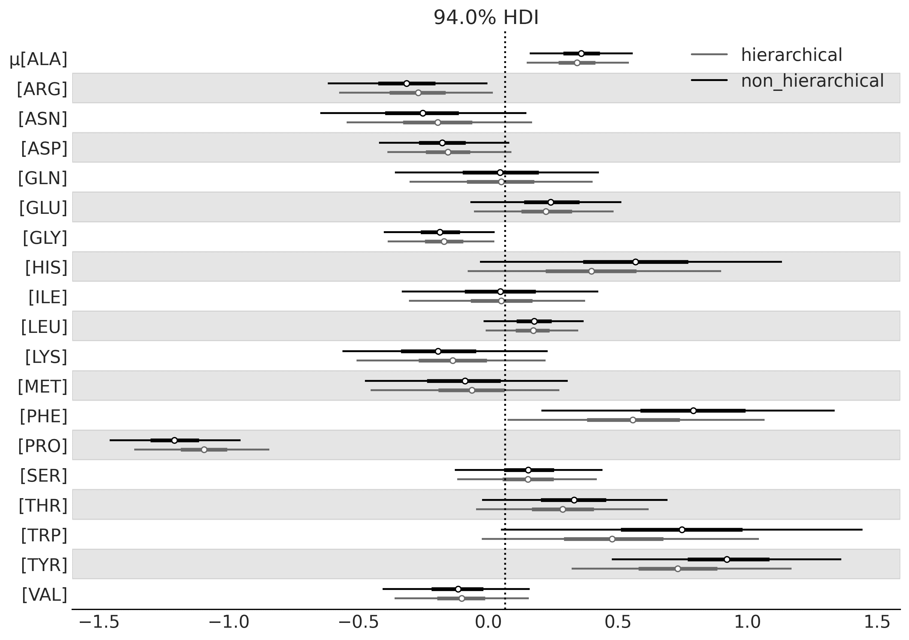
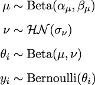
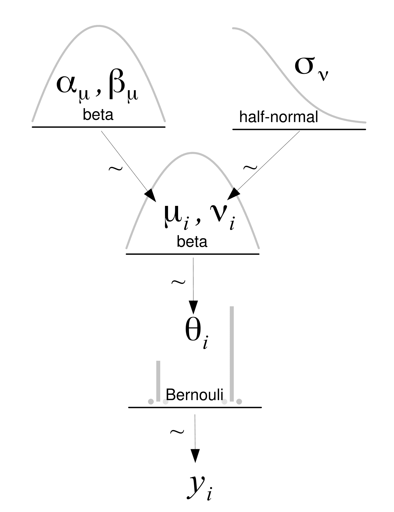
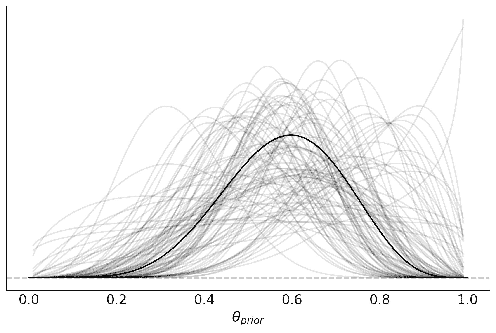
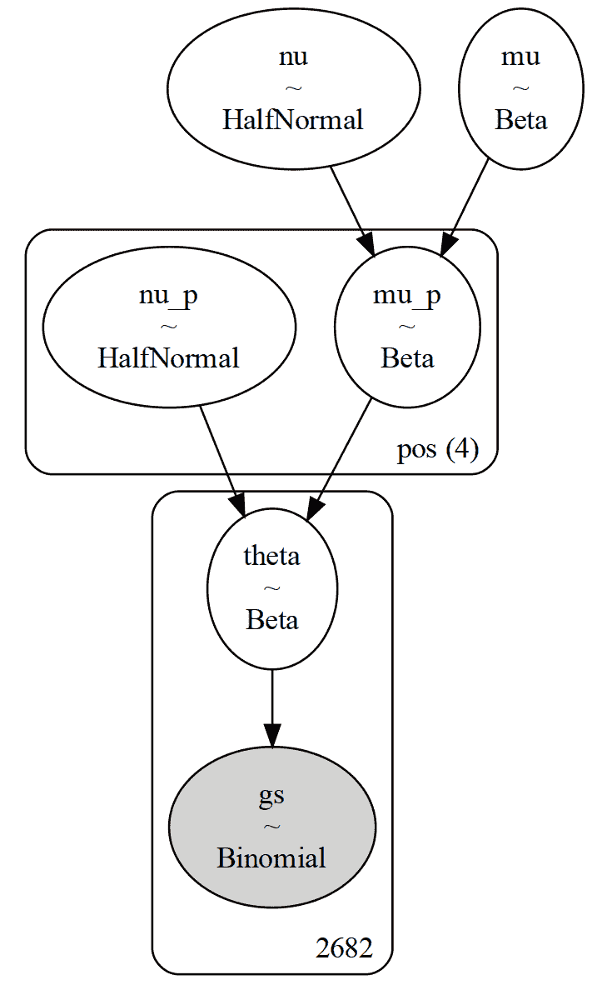
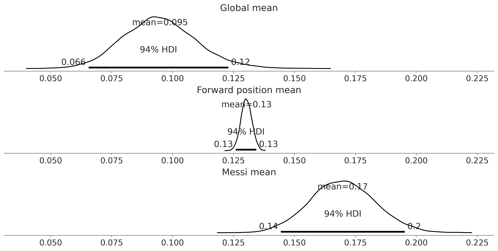
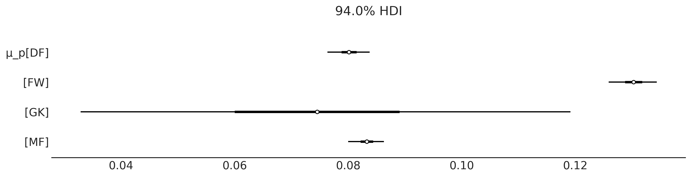

# 第三章

分层模型

> 分层模型是一个非常棒的想法——让我们做更多这样的模型吧！- 贝叶斯建模的禅意

在*第二章*中，我们看到了一个小费的例子，其中数据中有多个组，每个组对应星期四、星期五、星期六和星期日。我们决定分别建模每个组。这样做有时是可以的，但我们应当注意我们的假设。通过独立建模每个组，我们假设这些组是互不相关的。换句话说，我们假设知道一天的小费信息并不能给我们提供其他一天的小费信息。这可能是一个过于强的假设。那么，是否有可能构建一个模型，允许我们在组之间共享信息呢？这不仅可能，而且正是本章的主要内容。幸运的是，你来了！

在本章中，我们将讨论以下主题：

+   分层模型

+   部分合并

+   收缩

## 3.1 信息共享，共享先验

分层模型也被称为多级模型、混合效应模型、随机效应模型或嵌套模型。当数据可以被描述为分组或具有不同层级时，分层模型尤其有用，比如数据嵌套在地理区域中（例如，属于一个省的城市和属于一个国家的省），或者具有分层结构（如学生嵌套在学校内，或者病人嵌套在医院中），或者是对同一个体的重复测量。



**图 3.1**：合并模型、非合并模型和分层模型之间的差异

分层模型是一个自然的方式，用于在不同组之间共享信息。在分层模型中，先验分布的参数本身也会赋予一个先验分布。这些更高层次的先验通常被称为超先验；“超”在希腊语中意味着“在……之上”。拥有超先验使得模型可以在组之间共享信息，同时仍允许组之间存在差异。换句话说，我们可以认为先验分布的参数属于一个共同的参数群体。*图 3.1* 显示了一个图示，展示了合并模型（单一组）、非合并模型（所有分开的组）和分层模型（也称为部分合并模型）之间的高层次差异。

分层模型的概念看起来可能过于简单，几乎是微不足道的，但它有着深远的影响。因此，在本章的其余部分，我们将通过不同的例子来理解它们的含义。我相信这些例子不仅能帮助你更好地理解这一概念，还能说服你，它是一个非常有用的工具，能够应用于你自己的问题。

## 3.2 分层转变

蛋白质是由 20 种叫做氨基酸的单位组成的分子。每种氨基酸可以在蛋白质中出现 0 次或更多次。就像旋律是由一系列音符定义的，蛋白质则是由一系列氨基酸定义的。一些音符的变化可能导致旋律的微小变化，而其他音符的变化则可能导致完全不同的旋律。蛋白质中也有类似的情况。研究蛋白质的一种方法是使用核磁共振（与医学成像使用的技术相同）。这项技术使我们能够测量多种量，其中之一叫做化学位移。你可能还记得我们在*第 2*章中看过一个使用化学位移的例子。

假设我们想将一种理论的化学位移计算方法与实验观察结果进行比较，以评估该理论方法是否能再现实验值。幸运的是，有人已经做了实验并进行了理论计算，我们只需要将它们进行比较。以下数据集包含了一组蛋白质的化学位移值。如果你查看`cs_data`数据框，你会发现它有四列：

1.  第一列是一个代码，用来识别蛋白质（你可以通过在[`www.rcsb.org/`](https://www.rcsb.org/)输入该代码来获取有关该蛋白质的许多信息）

1.  第二列是氨基酸的名称（你可能会注意到这里只有 19 个独特的名称；该数据集中缺少一种氨基酸）

1.  第三列包含了化学位移的理论值（使用量子方法计算得出）

1.  第四列包含了实验值

现在我们有了数据，接下来应该怎么做？一个选项是采用经验差异并拟合一个高斯分布，或者也许是学生 t 分布。因为氨基酸是一类化学化合物，假设它们都是相同的，并为所有差异估算一个单一的高斯分布是有道理的。但你可能会认为，有 20 种不同类型的氨基酸，每种都有不同的化学性质，因此一个更好的选择是拟合 20 个独立的高斯分布。我们应该怎么做？

让我们花点时间思考一下，哪个选项是最好的。如果我们将所有数据合并，估算结果会更准确，但我们无法从单个组（氨基酸）中获取信息。相反，如果我们将它们作为独立的组处理，我们将获得更详细的分析，但准确性较差。我们应该怎么做？

当有疑问时，什么都行！(不确定这是否是你生活中好的普遍建议，但我喜欢这首歌 [`www.youtube.com/watch?v=1di09XZUlIw`](https://www.youtube.com/watch?v=1di09XZUlIw))。我们可以建立一个层级模型；通过这种方式，我们允许在组级别进行估算，但有一个限制，即它们都属于一个更大的组或人群。为了更好地理解这一点，我们来为化学位移数据建立一个层级模型。

为了查看非层次模型（非汇聚模型）和层次模型之间的区别，我们将构建两个模型。第一个模型本质上与*第 2* 章中的`comparing_groups`模型相同：

**代码 3.1**

```py
with pm.Model(coords=coords) as cs_nh: 
    μ = pm.Normal('μ', mu=0, sigma=10, dims="aa") 
    σ = pm.HalfNormal('σ', sigma=10, dims="aa") 
    y = pm.Normal('y', mu=μ[idx], sigma=σ[idx], observed=diff) 
    idata_cs_nh = pm.sample()
```

现在，我们将构建模型的层次版本。我们添加了两个超先验，一个用于*μ*的均值，另一个用于*μ*的标准差。我们将*σ*留空，不添加超先验；换句话说，我们假设观察值与理论值之间的方差对于所有组都是相同的。这是一个建模选择，你可能会遇到一个问题，觉得这种假设不可接受，并认为有必要为*σ*添加一个超先验；你可以自由这样做：

**代码 3.2**

```py
with pm.Model(coords=coords) as cs_h: 
    # hyper_priors 
    μ_mu = pm.Normal('μ_mu', mu=0, sigma=10) 
    μ_sd = pm.HalfNormal('μ_sd', 10) 
    # priors 
    μ = pm.Normal('μ', mu=μ_mu, sigma=μ_sd, dims="aa") 
    σ = pm.HalfNormal('σ', sigma=10, dims="aa") 
    # likelihood 
    y = pm.Normal('y', mu=μ[idx], sigma=σ[idx], observed=diff) 
    idata_cs_h = pm.sample()
```

*图 3.2* 显示了`cs_h`和`cs_nh`模型的图形表示。我们可以看到，`cs_h`多了一个层级，用于表示*μ*的超先验。



**图 3.2**：化学位移数据的非层次（左）和层次（右）模型的图形表示。每个子图都是通过`pm.model_to_graphviz(.)`函数生成的

我们将使用 ArviZ 的`plot_forest`函数来比较结果。我们可以将多个模型传递给此函数。当我们希望比较不同模型中参数的值时，这非常有用，比如当前示例中所展示的。在*图 3.3*中，我们有一个包含 40 个估计均值的图，每个氨基酸（共 20 个）对应两个模型中的一个。我们还展示了它们的 94% HDI 和四分位距（分布的中央 50%）。垂直虚线表示根据层次模型得到的全局均值。该值接近零，正如预期的那样，理论值与实验值相符。



**图 3.3**：层次和非层次模型的化学位移差异

该图的最相关部分是层次模型的估计值被拉向部分汇聚的均值，或者说它们相比于非汇聚的估计值被“收缩”。你还会注意到，这种效应在那些离均值较远的组（如`PRO`）中更加明显，而且不确定性与非层次模型的相当，甚至更小。估计值是部分汇聚的，因为我们为每个组都有一个估计，但各个组的估计值通过超先验相互约束。因此，我们得到了一种介于将所有化学位移放在一个组中和将每个氨基酸分为 20 个独立组之间的中间情况。各位女士、先生以及非二元性别流动者，这就是层次模型的美妙之处。

## 3.3 水质

假设我们想分析一个城市的水质，那么我们通过将城市划分为多个社区来进行采样。我们可能认为有两种选择来分析这些数据：

+   将每个社区作为一个独立实体进行研究

+   将所有数据汇总在一起，并将城市的水质估算为一个大的整体。

你可能已经注意到这里的模式。我们可以通过说我们获得了问题的更详细视图来证明第一个选项的合理性，否则如果我们对数据进行平均处理，问题可能会变得不可见或不那么明显。第二个选项的合理性可以通过说如果我们将数据汇总，我们就能获得更大的样本量，从而得到更准确的估计来证明。但是我们已经知道我们有第三个选项：我们可以做一个层次模型！

对于这个例子，我们将使用合成数据。我喜欢使用合成数据；它是理解事物的一个好方法。如果你不理解某个东西，就模拟它！合成数据有很多用途。在这里，我们将假设我们已经从同一城市的三个不同区域收集了水样，并测量了水中的铅含量；铅含量超过世界卫生组织建议值的样本标记为零，低于建议值的样本标记为一。这是一个非常简单的场景。在更现实的例子中，我们会有铅浓度的连续测量，并且可能会有更多的组。然而，针对我们当前的目的，这个例子足够揭示层次模型的细节。我们可以用以下代码生成合成数据：

**代码 3.3**

```py
N_samples = [30, 30, 30] 
G_samples = [18, 18, 18] 
group_idx = np.repeat(np.arange(len(N_samples)), N_samples) 
data = [] 
for i in range(0, len(N_samples)): 
    data.extend(np.repeat([1, 0], [G_samples[i], N_samples[i]-G_samples[i]]))
```

我们正在模拟一个实验，我们测量了三个组，每个组包含一定数量的样本；我们将每组的样本总数存储在`N_samples`列表中。使用`G_samples`列表，我们记录每组中良好水质样本的数量。其余的代码仅用于生成一个包含零和一的数据列表。

这个问题的模型与我们用于硬币问题的模型类似，除了两个重要特征：

+   我们定义了两个超先验，这些将影响 Beta 先验。

+   我们不是对参数*α*和*β*设置超先验，而是通过*μ*（均值）和*ν*（Beta 分布的浓度或精度）来定义 Beta 分布。精度类似于标准差的倒数；*ν*的值越大，Beta 分布就越集中。在统计符号中，我们的模型如下所示：



请注意，我们使用下标*i*来表示模型中某些参数在不同组之间的取值。通过 Kruschke 图（见*图 3.4*），我们可以看到新模型相比于*图 1.14*，多了一个额外的层级。还要注意，在这个模型中，我们是用*μ*和*ν*来参数化 Beta 先验分布，而不是使用*α*和*β*。这是贝叶斯统计中的常见做法，因为*μ*和*ν*比*α*和*β*更直观。



**图 3.4**：层次模型

让我们在 PyMC 中编写这个模型：

**代码 3.4**

```py
with pm.Model() as model_h: 
    # hypyerpriors 
    μ = pm.Beta('μ', 1, 1) 
    ν = pm.HalfNormal('ν', 10) 
    # prior 
    *θ* = pm.Beta('*θ*', mu=μ, nu=ν, shape=len(N_samples)) 
    # likelihood 
    y = pm.Bernoulli('y', p=*θ*[group_idx], observed=data) 

    idata_h = pm.sample()
```

## 3.4 收缩效应

为了展示层次模型的主要后果，我需要你的帮助，请参与一个简短的实验。我需要你打印并保存通过`az.summary(idata_h)`计算出的摘要。然后，我希望你在对合成数据做些小调整后，再运行模型两次。记得每次运行后保存摘要。总的来说，我们会进行三次运行：

+   一轮设置`G_samples`的所有元素为 18

+   一轮设置`G_samples`的所有元素为 3

+   最后一轮设置一个元素为 18，另外两个为 3

在继续之前，请花点时间思考一下这个实验的结果。重点关注每个实验中*θ*的估计均值。根据前两次运行的模型，你能预测第三种情况的结果吗？

如果我们把结果放在表格中，会得到大致如下的内容；记住，由于采样过程的随机性，可能会有小的变化：

| G_samples | Mean |
| --- | --- |
| 18, 18, 18 | 0.6, 0.6, 0.6 |
| 3, 3, 3 | 0.11, 0.11, 0.11 |
| 18, 3, 3 | 0.55, 0.13, 0.13 |

**表格 3.1**：样本数据和对应的均值

在第一行中，我们看到对于一个由 30 个样本中挑选出的 18 个好样本组成的数据集，我们得到的*θ*均值是 0.6；请记住，现在*θ*的均值是一个包含 3 个元素的向量，每个组对应一个元素。然后，在第二行中，只有 30 个样本中的 3 个是好样本，*θ*的均值为 0.11。这些结果并不令人惊讶；我们的估计值与经验均值几乎相同。有趣的部分出现在第三行。我们没有得到来自前两行的*θ*均值的混合结果，如 0.6、0.11 和 0.11，而是得到了不同的值，即 0.55、0.13 和 0.13。

到底发生了什么？我们是不是哪里出错了？并不是那样。我们看到的现象是估计值已经向共同均值收缩了。这是完全正常的；实际上，这只是我们模型的一个结果。通过使用超先验，我们是从数据中估计 Beta 先验分布的参数。每个组都在向其他组提供信息，同时每个组也通过其他组的估计结果来获得信息。

*图 3.5* 显示了将*μ*和*ν*的后验估计值代入 Beta 分布。换句话说，这是推断 Beta 先验分布的后验分布。



**图 3.5**: 推断 Beta 先验分布的后验分布

为什么收缩是可取的？因为它有助于更稳定的推断。从多个方面来看，这类似于我们在学生 t 分布和异常值中看到的情况；使用重尾分布能够使模型对偏离均值的数据点更具鲁棒性。引入超先验会导致模型更为保守，使其对单个组中极端值的反应更为迟缓。想象一下，不同邻里之间的样本量不同，有的较小，有的较大；样本量越小，出现虚假结果的可能性越大。在极端情况下，如果你在某个邻里只取一个样本，可能会碰到整个邻里唯一的老旧铅管，或者相反，唯一的 PVC 管。在一种情况下，你会高估差的质量，而在另一种情况下，你会低估它。在层级模型下，一个组的错误估计会通过其他组提供的信息得到缓解。更大的样本量也能起到类似的效果，但往往这种方法不可行。

收缩的程度取决于数据；数据量更多的组会比数据量较少的组更强烈地拉动其他组的估计值。如果几个组相似，而某一个组不同，那么相似的组会将它们的相似性传递给其他组，并强化共同的估计，同时将不同组的估计值向它们拉拢；这正是我们在之前的例子中看到的情况。超先验在调节收缩量方面也起着作用。如果我们对组级分布有可信的信息，我们可以有效地使用信息性先验分布将估计值收缩到一个合理的值。

收缩

在层级模型中，共享相同超先验的组实际上通过超先验共享信息。这导致了收缩现象，也就是，单独的估计值会向共同的均值收缩。通过部分汇总数据，我们将组视为一种在独立组和单一大组之间的中间状态。

没有什么能阻止我们只使用两个组来构建层级模型，但我们更倾向于使用多个组。直观来看，原因是收缩的过程就像假设每个组都是一个数据点，我们在组层面上估计标准差。一般而言，除非我们有强有力的先验信息来指导我们的估计，否则我们不太信任数据点过少的估计。层级模型也是如此。

## 3.5 层级模型逐层构建

各种数据结构有助于层次化描述，可以涵盖多个层级。例如，考虑职业足球（足球）运动员。与许多其他运动一样，运动员有不同的职位。我们可能有兴趣估算每个运动员、每个职位以及所有职业足球运动员的技能指标。这种层次化结构在许多其他领域也能找到：

+   医学研究：假设我们有兴趣估计不同药物治疗某种疾病的效果。我们可以根据患者的个人信息、疾病严重程度和其他相关因素对患者进行分类，并构建一个层次模型来估算每个子组的治愈或治疗成功的概率。然后，我们可以使用子组分布的参数来估算整个患者群体的治愈或治疗成功的总体概率。

+   环境科学：假设我们有兴趣估计某种污染物对特定生态系统的影响。我们可以对生态系统内的不同栖息地（例如河流、湖泊、森林、湿地）进行分类，并构建一个层次模型来估算每个栖息地内的污染物水平分布。然后，我们可以使用栖息地分布的参数来估算整个生态系统中污染物水平的总体分布。

+   市场研究：假设我们有兴趣了解不同地区消费者购买某一产品的行为。我们可以根据消费者的个人信息（例如年龄、性别、收入、教育）对其进行分类，并构建一个层次模型来估算每个子组的购买行为分布。然后，我们可以使用子组分布的参数来估算整个消费者群体的购买行为分布。

回到我们的足球运动员数据，我们收集了来自*英超联赛*、*法甲联赛*、*德甲联赛*、*意甲联赛*和*西甲联赛*的数据，数据覆盖了四年（2017 至 2020 年）。假设我们有兴趣了解每次射门的进球数。这通常是统计学家所说的*成功率*，我们可以通过二项模型来估算，模型中参数*n*是射门次数，观察值*y*是进球数。这样就剩下了一个未知的参数*p*。在之前的例子中，我们将此参数称为*θ*，并使用 Beta 分布对其建模。我们现在也会这样做，但采用层次化的方法。请参见*图 3.6*，它提供了整个模型的图形表示。



**图 3.6**：足球运动员示例的层次模型。注意，与之前的层次模型相比，我们增加了一个层级。

在我们的模型中，*θ*表示每个球员的成功率，因此它是一个大小为`n_players`的向量。我们使用 Beta 分布来建模*θ*。Beta 分布的超参数将是*μ*[*p*]和*ν*[*p*]向量，这些向量的大小为 4，代表我们数据集中四个位置（后卫`DF`、中场`MF`、前锋`FW`和门将`GK`）。我们需要正确地索引向量*μ*[*p*]和*ν*[*p*]，以匹配球员的总数。最后，我们将有两个全局参数，*μ*和*ν*，表示职业足球运动员。

PyMC 模型在下面的代码块中定义。`pm.Beta(’`*μ*`’, 1.7, 5.8)`是在 PreliZ 的帮助下选择的先验，95%的质量分布在 0 到 0.5 之间。这是一个弱信息先验的示例，因为几乎没有疑问，0.5 的成功率是一个较高的值。体育统计数据研究得非常透彻，存在大量可用于定义更强先验的信息。对于这个示例，我们将使用这个先验。类似的理由也适用于先验`pm.Gamma(’’, mu=125, sigma=50)`，我们定义其为最大熵 Gamma 先验，90%的质量分布在 50 到 200 之间：

**代码 3.5**

```py
coords = {"pos": pos_codes} 
with pm.Model(coords=coords) as model_football: 
    # Hyper parameters 
    μ = pm.Beta('μ', 1.7, 5.8) 
    ν = pm.Gamma('ν', mu=125, sigma=50) 
    # Parameters for positions 
    μ_p = pm.Beta('μ_p', 
                       mu=μ, 
                       nu=ν, 
                       dims = "pos") 
    ν_p = pm.Gamma('ν_p', mu=125, sigma=50, dims="pos") 
    # Parameter for players 
    *θ* = pm.Beta('*θ*', 
                    mu=μ_p[pos_idx], 
                    nu=ν_p[pos_idx]) 
    _ = pm.Binomial('gs', n=football.shots.values, p=*θ*, 
                    observed=football.goals.values) 

    idata_football = pm.sample()
```

在*图 3.7*的顶部面板中，我们展示了全局参数*μ*的后验分布。后验分布接近于 0.1。这意味着，对于一名职业足球运动员（来自顶级联赛），进球的概率平均为 10%。这是一个合理的值，因为进球并非易事，并且我们没有区分位置，即我们考虑的是那些主要角色不是进球的球员。在中间面板中，我们展示了前锋位置的估计*μ*[*p*]值；如预期的那样，它高于全局参数*μ*。在底部面板中，我们展示了梅西的估计*θ*值，值为 0.17，高于全局参数*μ*和前锋位置*μ*[*p*]值。这也是可以预期的，因为梅西是世界上最优秀的足球运动员，他的主要角色是进球。



**图 3.7**：全局参数的后验分布（顶部）、前向位置的均值（中部）以及梅西的*θ*参数（底部）

*图 3.8* 展示了参数 *μ*[*p*] 的后验分布的森林图。正如我们已经看到的，前锋位置的后验分布集中在 0.13 附近，并且是四个位置中最高的。这是有道理的，因为前锋的角色是进球以及助攻。*μ*[*p*] 的最低值出现在守门员位置。这是预期的，因为守门员的主要角色是阻止对方进球，而不是进球。值得注意的是，不确定性非常高；这是因为我们数据集中进球的守门员数量非常少，准确来说只有三名。后卫和中场的位置的后验分布大致处于中间，且中场略高于后卫。我们可以解释为，中场的主要角色是既要防守也要进攻，因此进球的概率比后卫高，但低于前锋。



**图 3.8**：参数 *μ* 的后验分布

*p，均值位置*

你需要知道何时停止

我们可以根据需要创建具有任意层级的层级模型。但除非问题需要额外的结构，否则添加超过必要层级的层次不会提升模型或推断的质量。相反，我们会陷入超先验和超参数的迷网中，而无法为它们赋予任何有意义的解释。构建模型的目标是理解数据，因此，实用的模型通常是那些能够反映并利用数据结构的模型。

## 3.6 小结

本章介绍了本书中最重要的概念之一：层级模型。每当我们能在数据中识别出子群时，就可以构建层级模型。在这种情况下，我们不是将子群当作独立的实体，或忽略子群将它们视为单一群体，而是构建一个模型，在群体之间部分合并信息。部分合并的主要效果是，每个子群的估计会受到其他子群估计的影响。这种效应被称为收缩效应，一般来说，这是一个非常有用的技巧，通过让推断更加保守（因为每个子群通过将估计拉向自己来影响其他子群）和更具信息量，来帮助改进推断。我们在子群层面和群体层面都能获得估计。

借用 Python 禅意的表达方式，我们可以肯定地说，*层次模型是一个* *非常棒的主意，让我们做更多这样的事情！* 在接下来的章节中，我们将继续构建层次模型，并学习如何使用它们来构建更好的模型。我们还将讨论层次模型与统计学和机器学习中普遍存在的过拟合/欠拟合问题的关系，内容将在*第五章*中进行探讨。在*第十章*中，我们将讨论在从层次模型中采样时可能遇到的一些技术问题，并探讨如何诊断和解决这些问题。

## 3.7 练习

1.  用你自己的话解释以下概念，用两到三句话：

    +   完全汇总

    +   无汇总

    +   部分汇总

1.  重复我们在`model_h`中进行的练习。这一次，不使用层次结构，使用一个简单的先验，比如 Beta(*α* = 1*,*β* = 1)。比较两种模型的结果。

1.  创建一个层次化版本的 *第二章* 中的 tips 示例，通过在一周的天数之间进行部分汇总。将结果与没有层次结构时获得的结果进行比较。

1.  对*图 3.7*中的每个子面板，添加一条表示每个层级的经验均值的参考线，即全局均值、前向均值和梅西的均值。比较经验值和后验均值。你观察到什么？

1.  氨基酸通常被分为`极性`、`非极性`、`带电`和`特殊`等类别。构建一个类似于`cs_h`的层次模型，但包括一个氨基酸类别的组效应。将结果与本章中获得的结果进行比较。

## 加入我们的社区 Discord 空间

加入我们的 Discord 社区，与志同道合的人交流，并和超过 5000 名成员一起学习，链接地址：[`packt.link/bayesian`](https://packt.link/bayesian)


