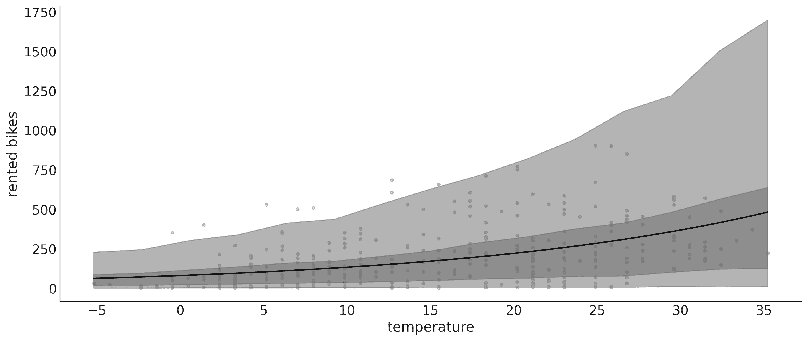

# 第四章

使用线性模型

> 在三百多年的科学历史中，唯一没有改变的或许只有一点：对简单的热爱。– 乔治·瓦根斯贝格

音乐——从古典作品到 The Ramones 的*Sheena is a Punk Rocker*，再到车库乐队的未被认可的热门歌曲以及皮亚佐拉的《自由探戈》——由重复出现的模式构成。相同的音阶、和弦组合、吉他即兴、旋律等反复出现，创造出一个美妙的音景，能够激发并调节人类可能体验到的所有情感。同样，统计学的世界也是建立在不断出现的模式上的，这些小的动机时不时地出现。在本章中，我们将关注其中一个最流行和有用的模式，即**线性** **模型**（或者如果你愿意，可以叫做动机）。这是一个非常有用的模型，独立使用时效果显著，同时也是许多其他模型的基础。如果你曾经学过统计学课程，你可能听说过简单和多元线性回归、逻辑回归、方差分析（ANOVA）、协方差分析（ANCOVA）等方法。所有这些方法都是同一个基本模式——线性回归模型——的不同变体。

本章将涉及以下主题：

+   简单线性回归

+   负二项回归

+   稳健回归

+   逻辑回归

+   变量的方差

+   层次线性回归

+   多元线性回归

## 4.1 简单线性回归

我们在科学、工程和商业中遇到的许多问题都具有以下形式：我们有一个变量*X*，我们想要建模或预测一个变量*Y*。重要的是，这些变量是成对的，如{(*x*[1]*,y*[1])*,*(*x*[2]*,y*[2])*,**,*(*x*[*n*]*,y*[*n*])}。在最简单的情况下，即简单线性回归中，*X*和*Y*都是一维连续随机变量。所谓连续，意味着该变量用实数表示。使用 NumPy，你将把这些变量表示为一维浮点数组。通常，人们称*Y*为因变量、预测变量或结果变量，*X*为自变量、预测因子或输入变量。

一些典型的线性回归模型应用场景如下：

+   模拟土壤盐分与作物生产力之间的关系。然后，回答一些问题，比如：这种关系是线性的吗？这种关系有多强？

+   找出各国平均巧克力消费量与该国诺贝尔奖得主数量之间的关系，并理解为何这种关系可能是虚假的。

+   通过使用本地天气报告中的太阳辐射，预测你家的燃气账单（用于取暖和烹饪）。这个预测有多准确？

在*第二章*中，我们看到了正态模型，我们定义它为：


线性回归的主要思想是通过添加一个预测变量*X*来扩展此模型，以估计均值*μ*：


该模型表示变量 *X* 与变量 *Y* 之间存在线性关系。但由于噪声项 *σ* 的存在，这种关系并不是确定性的。此外，该模型表示 *Y* 的均值是 *X* 的线性函数，具有**截距** *α* 和**斜率** *β*。截距告诉我们当 *X* = 0 时 *Y* 的值，斜率则告诉我们 *X* 每变化一个单位，*Y* 会发生多少变化。由于我们不知道 *α*、*β* 或 *σ* 的具体值，因此我们为它们设定了先验分布。

在为线性模型设定先验时，我们通常假设它们是独立的。这个假设极大简化了先验设置，因为这样我们只需要设置三个先验，而不是一个联合先验。至少原则上，*α* 和 *β* 可以取实数线上的任何值，因此通常使用正态分布作为它们的先验。而因为 *σ* 是一个正数，通常为其使用半正态分布或指数分布作为先验。

截距的值可以根据不同的问题和领域知识有很大的变化。对于我曾处理过的许多问题，*α* 通常围绕 0 中心，且标准差不超过 1，但这只是我在一小部分问题上的经验（几乎是轶事性质的），并不是可以轻易迁移到其他问题的经验。通常，预测斜率（*β*）的先验值可能更为容易。例如，我们可能知道斜率的符号：例如，我们期望变量体重与身高变量平均呈正相关。对于 *σ*，我们可以将其设置为与变量 *Y* 的值同量级的大值，例如是其标准差的两倍。我们应该小心不要使用观察数据来推测先验；通常，数据用来避免使用过于严格的先验是可以接受的。如果我们对参数知之甚少，那么确保我们的先验具有模糊性是合乎逻辑的。如果我们希望使用更具信息量的先验，那么不应从观察数据中获取这些信息，而应从我们的领域知识中获得。

扩展常规模型

线性回归模型是常规模型的扩展，其中均值是作为预测变量的线性函数计算的。

## 4.2 线性单车模型

我们现在对贝叶斯线性模型有了一个大致的了解。让我们通过一个例子来巩固这个概念。我们将从一个非常简单的例子开始：我们有一座城市的温度记录和租赁自行车的数量。我们想要建立温度和租赁自行车数量之间的关系模型。*图 4.1* 显示了来自 UCI 机器学习库的共享单车数据集这两个变量的散点图（[`archive.ics.uci.edu/ml/index.php`](https://archive.ics.uci.edu/ml/index.php)）。


**图 4.1**：自行车共享数据集。摄氏温度与租用自行车数量的散点图

原始数据集包含 17,379 条记录，每条记录有 17 个变量。我们将只使用 359 条记录和两个变量，`temperature`（摄氏温度）和 `rented`（租用的自行车数量）。我们将使用 `temperature` 作为自变量（我们的 X），租用的自行车数量作为因变量（我们的 Y）。我们将使用以下模型：

**代码 4.1**

```py
with pm.Model() as model_lb: 
    *α* = pm.Normal("*α*", mu=0, sigma=100) 
    *β* = pm.Normal("*β*", mu=0, sigma=10) 
    σ = pm.HalfCauchy("σ", 10) 
    μ = pm.Deterministic("μ", *α* + *β* * bikes.temperature) 
    y_pred = pm.Normal("y_pred", mu=μ, sigma=σ, observed=bikes.rented) 
    idata_lb = pm.sample()
```

花点时间逐行阅读代码，确保理解代码的含义。同时查看 *图 4.2*，以获得该模型的可视化表示。


**图 4.2**：自行车共享数据集的贝叶斯线性模型

正如我们之前所说，这类似于一个正态模型，但现在均值被建模为温度的线性函数。截距是 *α*，斜率是 *β*。噪声项是 ，均值是 *μ*。这里唯一的新东西是 `Deterministic` 变量 *μ*。这个变量不是随机变量，而是一个确定性变量，它由截距、斜率和温度计算得出。我们需要指定这个变量，因为我们希望将其保存在 InferenceData 中以备后续使用。我们本可以写 *μ* `=` *α* `+` *β* `* bikes.temperature`，甚至可以写成 `_ = pm.Normal('y_pred', mu=`*α* `+` *β* `* bikes.temperature, ...`，模型会保持不变，但我们将无法将 *μ* 保存在 InferenceData 中。注意，*μ* 是一个与 `bikes.temperature` 长度相同的向量，它与数据集中的记录数相同。

### 4.2.1 解释后验均值

为了探索推断结果，我们将生成一个后验图，但会省略确定性变量 *μ*。我们这样做是因为如果不省略该变量，我们将得到很多图表，每个 `temperature` 值对应一个图表。我们可以通过将我们想要包含在图表中的变量名作为列表传递给 `var_names` 参数，或者像以下代码块中那样否定我们想要排除的变量：

**代码 4.2**

```py
az.plot_posterior(idata_lb, var_names=['∼μ'])
```


**图 4.3**：自行车线性模型的后验图

从*图 4.3*中，我们可以看到*α*、*β*和*σ*的边际后验分布。如果我们只读取每个分布的均值，比如*μ* = 69 + 7*.*9*X*，通过这些信息我们可以得出，温度为 0 时租赁自行车的预期数量为 69 辆，每升高 1 度温度，租赁的自行车数量增加 7.9 辆。因此，当温度为 28 度时，我们预期租赁 278 辆自行车，即 69 + 7*.*9 ∗ 28 ≈ 278 辆。这是我们的预期值，但后验分布也告诉我们这个估计值的周围不确定性。例如，*β*的 94% HDI 为（6.1, 9.7），所以每升高 1 度温度，租赁的自行车数量可能增加 6 辆至约 10 辆。此外，即使我们忽略后验不确定性，只关注均值，我们仍然对租赁自行车数量有不确定性，因为我们有一个*σ*值为 170。因此，如果我们说温度为 28 度时我们预期租赁 278 辆自行车，我们也不应该感到惊讶，实际数量可能在 100 到 500 辆之间。

现在，让我们创建一些图表，帮助我们可视化这些参数的综合不确定性。我们从两个图开始，展示均值（见*图 4.4*）。这两个图都是温度作为自变量时租赁自行车数量的均值图。不同之处在于我们如何表示不确定性。我们展示了两种常见的表示方法。在左侧子面板中，我们从后验分布中抽取 50 个样本，并将它们作为单独的线条绘制。在右侧子面板中，我们则采用所有可用的后验样本来计算 94%的 HDI。


**图 4.4**：自行车线性模型的后验图

*图 4.4*中的图表传达的基本相同的信息，只是其中一个通过一组线条表示不确定性，另一个则通过阴影区域表示。请注意，如果你重复代码生成图表，你会得到不同的线条，因为我们正在从后验分布中采样。然而，阴影区域将保持不变，因为我们使用了所有可用的后验样本。如果我们进一步拟合模型，我们不仅会得到不同的线条，阴影区域也可能发生变化，并且不同运行之间的差异可能非常小；如果差异很大，可能需要增加抽样次数，或者模型和采样存在问题（有关指导，请参见*第十章*）。

不管怎样，为什么我们要展示两个略有不同的图，它们传达的是相同的信息呢？嗯，这是为了突出不同的方式来表示不确定性。哪种更好？像往常一样，这取决于具体的上下文。阴影区域是一个不错的选择；它非常常见，且计算和解释都很简单。除非有特定的原因需要展示单个后验样本，否则阴影区域可能是你首选的方式。但我们也许希望展示单个后验样本。例如，大多数线条可能覆盖某个区域，但我们得到一些斜率非常大的线条。阴影区域可能会掩盖这些信息。如果你在展示单个后验样本时，可能可以考虑将其做成动画，特别是当你在演示或视频中展示时（详见 Kale 等人 [2019]了解更多）。

向你展示*图 4.4*中的两个图的另一个原因是，你可以学习从后验中提取信息的不同方式。请注意接下来的代码块。为了清晰起见，我们省略了绘图代码，只展示核心计算：

**代码 4.3**

```py
posterior = az.extract(idata_lb, num_samples=50) 
x_plot = xr.DataArray( 
    np.linspace(bikes.temperature.min(), bikes.temperature.max(), 50), 
    dims="plot_id" 
) 
mean_line = posterior["*α*"].mean() + posterior["*β*"].mean() * x_plot 
lines = posterior["*α*"] + posterior["*β*"] * x_plot 
hdi_lines = az.hdi(idata_lb.posterior["μ"]) 
...
```

你可以看到在第一行中，我们使用了`az.extract`。这个函数将`chain`和`draw`维度堆叠到一个单一的`sample`维度中，这在后续处理时可能会很有用。此外，我们使用`num_samples`参数从后验中请求一个子样本。默认情况下，`az.extract`会作用于后验组。如果你想从另一个组提取信息，可以使用`group`参数。在第二行中，我们定义了一个叫做`x_plot`的 DataArray，包含从最小到最大观测温度的等间距值。创建 DataArray 的原因是能够在接下来的两行中使用 Xarray 的自动对齐功能。如果我们使用 NumPy 数组，则需要添加额外的维度，这通常会令人困惑。为了更好地理解我的意思，最好的方式是定义`x_plot = np.linspace(bikes.temperature.min(), bikes.temperature.max())`并尝试重新绘制图形。在代码的第三行，我们计算了后验中*μ*的均值，针对每个`x_plot`的值；在第四行，我们计算了*μ*的个别值。在这两行中，我们本可以使用`posterior[’`*μ*`’]`，但我们显式地重写了线性模型。我们这样做的目的是希望能帮助你更好地理解线性模型。

### 4.2.2 解释后验预测

如果我们不仅仅对期望值（均值）感兴趣，而是想从预测的角度来思考，也就是说，从租用自行车的角度来看怎么办？嗯，为此，我们可以进行后验预测采样。在执行下一行代码后，`idata_lb`将被填充一个新的组，`posterior_predictive`，其中包含一个变量`y_pred`，表示租用自行车数量的后验预测分布。

**代码 4.4**

```py
pm.sample_posterior_predictive(idata_lb, model=model_lb, extend_inferencedata=True)
```

*图 4.5* 中的黑线代表租赁自行车的均值。这与 *图 4.4* 中的情况相同。新增元素包括代表租赁自行车中心 50% 的深灰色带（分位数 0.25 和 0.75），以及代表中心 94% 的浅灰色带（分位数 0.03 和 0.97）。您可能注意到我们的模型预测了一个负数自行车数量，这是没有意义的。但仔细思考后，我们会发现这是预期的，因为在 `model_lb` 中我们使用了正态分布来描述似然。一个非常简陋的 *修正* 可以是将预测值剪切为低于 0 的值，但那样很丑陋。在接下来的部分，我们将看到我们可以轻松改进这个模型，以避免不合理的预测。


**图 4.5**：自行车线性模型的后验预测图

## 4.3 泛化线性模型

我们一直在使用的线性模型是更一般模型的特例，即**广义线性模型**（**GLM**）。GLM 是线性模型的泛化，允许我们使用不同的分布来描述似然。在高层次上，我们可以将贝叶斯 GLM 写成：


 是任意分布；一些常见情况包括正态分布、学生 t 分布、伽马分布和负二项分布。*θ* 表示分布可能具有的任何 *辅助* 参数，例如正态分布中的 *σ*。我们还有 *f*，通常称为反向链接函数。当  是正态分布时，*f* 是恒等函数。对于伽马分布和负二项分布等分布，*f* 通常是指数函数。为什么我们需要 *f*？因为线性模型通常位于实数线上，但 *μ* 参数（或其等价物）可能在不同的定义域上。例如，负二项分布的 *μ* 定义为正值，因此我们需要对 *μ* 进行变换。指数函数是这种变换的一个好选择。我们将在本书中探讨几种 GLM。在阅读本书时，一个很好的练习是创建一个表格，每次看到新的 GLM 时，添加一行说明 *phi*、*theta* 和 *f* 是什么，以及关于何时使用该 GLM 的一些注释。好的，让我们从我们第一个具体的 GLM 示例开始。

## 4.4 计数自行车

如何改进 `model_lb` 以更好地适应自行车数据？需要注意两点：租赁自行车数量是离散的，并且其下界为 0。这通常被称为计数数据，指的是通过计数某物得出的数据。计数数据有时使用连续分布（如正态分布）来建模，特别是当计数数量较大时。但通常使用离散分布更为合适。两种常见的选择是泊松分布和 NegativeBinomial 分布。主要的区别是，对于泊松分布，均值和方差是相同的，但如果这不成立或甚至大致不成立，那么 NegativeBinomial 可能是一个更好的选择，因为它允许均值和方差不同。如果不确定，可以同时拟合泊松分布和 NegativeBinomial 分布，看看哪个模型更好。我们将在 *第五章* 中进行这一操作。但目前，我们将使用 NegativeBinomial 模型。

**代码 4.5**

```py
with pm.Model() as model_neg: 
    *α* = pm.Normal("*α*", mu=0, sigma=1) 
    *β* = pm.Normal("*β*", mu=0, sigma=10) 
    σ = pm.HalfNormal("σ", 10) 
    μ = pm.Deterministic("μ", pm.math.exp(*α* + *β* * bikes.temperature)) 
    y_pred = pm.NegativeBinomial("y_pred", mu=μ, alpha=σ, observed=bikes.rented) 
    idata_neg = pm.sample() 
    idata_neg.extend(pm.sample_posterior_predictive(idata_neg))
```

PyMC 模型与之前的模型非常相似，但有两个主要区别。首先，我们使用 `pm.NegativeBinomial` 代替 `pm.Normal` 作为似然函数。NegativeBinomial 分布有两个参数：均值 *μ* 和离散参数 *α*。NegativeBinomial 的方差为 *μ* + ，因此 *α* 的值越大，方差越大。第二个区别是，*μ* 现在是 `pm.math.exp(`*α* `+` *β* `* bikes.temperature)`，而不是简单的 *α* `+` *β* `* bikes.temperature`，正如我们之前解释的那样，这需要将实数线转换为正的区间。

`model_neg` 的后验预测分布显示在 *图 4.6* 中。后验预测分布与我们在使用线性模型时获得的分布非常相似（*图 4.5*）。主要的区别是，现在我们不再预测负数的租赁自行车数量！我们还可以看到，预测的方差随着均值的增加而增大。这是预期之中的，因为 NegativeBinomial 的方差为 *μ* + 。



**图 4.6**：自行车 NegativeBinomial 线性模型的后验预测图

*图 4.7* 显示了 `model_lb` 的后验预测检验（左侧）和 `model_neg` 的后验预测检验（右侧）。我们可以看到，当使用正态分布时，最大的偏差是模型预测出租赁自行车数量为负数，但即使在正值范围内，我们也能看到拟合效果不太好。另一方面，NegativeBinomial 模型似乎更适合，尽管它并不完美。看右尾：预测值的尾部比观测值重。但也注意到，这种非常高的需求的概率较低。因此，总的来说，我们可以重新表述为，NegativeBinomial 模型比正态分布模型更好。


**图 4.7**：自行车线性模型的后验预测检验

## 4.5 稳健回归

我曾经运行过一个复杂的分子系统模拟。在每一步模拟中，我都需要进行线性回归拟合作为中间步骤。我有理论和经验上的理由认为，在给定 X 值的情况下，我的 Y 值是条件正态分布的，所以我决定使用简单的线性回归来解决。但有时，模拟会生成一些远高于或低于数据主群的 Y 值。这完全破坏了我的模拟，我不得不重新启动它。

通常，这些与数据主群非常不同的值被称为异常值。我的模拟失败的原因是这些异常值*拉扯*回归线远离数据主群，而当我将这个估计传递到模拟的下一步时，事情就停止了。我通过我们亲爱的朋友——学生 t 分布解决了这个问题，正如我们在*第二章*中看到的，学生 t 分布比正态分布有更重的尾部。这意味着异常值对回归线的影响较小。这就是稳健回归的一个例子。

为了举例说明学生 t 分布为线性回归带来的稳健性，我们将使用一个非常简单且有趣的数据集：Anscombe 四重奏中的第三组数据。如果你不知道 Anscombe 四重奏是什么，可以在维基百科查看（ [`en.wikipedia.org/wiki/Anscombe%27s_quartet`](https://en.wikipedia.org/wiki/Anscombe%27s_quartet) ）。

在接下来的模型`model_t`中，我们使用了一个移位的指数分布来避免接近 0 的值。未移位的指数分布对接近 0 的值赋予过多权重。根据我的经验，这对没有异常值或异常值适中的数据来说是可以的，但对于有极端异常值（或包含少量集群点）的数据，如 Anscombe 的第三组数据，最好避免这种低值。请对这一点，以及其他先前的建议持谨慎态度。默认值是一个不错的起点，但没有必要死守它们。其他常见的先验包括 Gamma(2, 0.1)和 Gamma(mu=20, sigma=15)，它们与 Exponential(1/30)相似，但更少有接近 0 的值：

**代码 4.6**

```py
with pm.Model() as model_t: 
    *α* = pm.Normal("*α*", mu=ans.y.mean(), sigma=1) 
    *β* = pm.Normal("*β*", mu=0, sigma=1) 
    σ = pm.HalfNormal("σ", 5) 
    ν_ = pm.Exponential("ν_", 1 / 29) 
    ν = pm.Deterministic("ν", ν_ + 1) 
    μ = pm.Deterministic("μ", *α* + *β* * ans.x) 
    _ = pm.StudentT("y_pred", mu=μ, sigma=σ, nu=ν, observed=ans.y) 
    idata_t = pm.sample(2000)
```

在*图 4.8*中，我们可以看到根据`model_t`的稳健拟合和根据 SciPy 的`linregress`（此函数执行最小二乘回归）的非稳健拟合。


**图 4.8**：根据`model_t`的稳健回归

虽然非稳健拟合试图*妥协*并包含所有点，但稳健贝叶斯模型`model_t`自动*丢弃*一个点，并拟合一条通过所有剩余点更接近的直线。我知道这是一个非常特殊的数据集，但其信息与其他数据集的结论相同；由于学生 t 分布的尾部更重，它对远离数据主群的点赋予较小的权重。

从*图 4.9*中，我们可以看到对于大部分数据，我们得到了一个非常好的匹配。同时，注意到我们的模型预测了远离大多数数据的值，向两侧扩展，而不仅仅是像观察到的数据那样在大部分数据上方。就我们目前的目的而言，这个模型表现得相当不错，不需要进一步修改。然而，注意到对于某些问题，我们可能希望避免这种情况。在这种情况下，我们可能需要回过头来修改模型，使用截断的学生 t 分布将`y_pred`的可能值限制为正值。这部分留给读者作为练习。


**图 4.9**：`model_t`的后验预测检验

## 4.6 逻辑回归

逻辑回归模型是线性回归模型的推广，我们可以在响应变量为二元时使用该模型。该模型使用逻辑函数作为逆链接函数。在我们继续讨论模型之前，让我们先熟悉一下这个函数：


对我们而言，逻辑函数的关键特性是，无论其自变量*z*的值如何，结果总是一个位于[0-1]区间的数字。因此，我们可以将这个函数看作是将通过线性模型计算得出的值压缩成可以输入伯努利分布的值的一种便捷方式。由于其特有的 S 形状，这个逻辑函数也被称为 sigmoid 函数，正如我们从*图 4.10*中看到的那样。


**图 4.10**：逻辑函数

### 4.6.1 逻辑模型

我们几乎具备了将一个简单的线性回归转换为一个简单的逻辑回归所需的所有元素。我们从只有两个类别的情况开始，例如，垃圾邮件/非垃圾邮件、安全/不安全、多云/晴天、健康/生病，或热狗/非热狗。首先，我们通过声明预测变量*y*只能取两个值，即 0 或 1 来对这些类别进行编码，即*y* ∈{0,*1}。

从这个角度描述，问题听起来非常像我们在前几章使用的掷硬币问题。我们可能记得我们使用了伯努利分布作为似然函数。与掷硬币问题的不同之处在于，现在*θ*不会从 beta 分布生成，而是通过一个线性模型来定义，使用逻辑函数作为逆链接函数。省略先验分布后，我们有：


我们将对经典的鸢尾花数据集应用逻辑回归，该数据集包含来自三种密切相关物种的花卉测量数据：setosa、virginica 和 versicolor。这些测量数据包括花瓣长度、花瓣宽度、萼片长度和萼片宽度。如果你想知道，萼片是经过改良的叶子，通常与保护花朵在花蕾中的功能有关。

我们将从一个简单的案例开始。假设我们只有两个类别，setosa 和 versicolor，并且只有一个独立变量或特征，`sepal_length`。我们希望根据花萼长度预测一朵花是 setosa 的概率。

如同常见的做法，我们将使用数字`0`和`1`对`setosa`和`versicolor`类别进行编码。使用 pandas，我们可以执行以下操作：

**代码 4.7**

```py
df = iris.query("species == ('setosa', 'versicolor')") 
y_0 = pd.Categorical(df["species"]).codes 
x_n = "sepal_length" 
x_0 = df[x_n].values 
x_c = x_0 - x_0.mean()
```

与其他线性模型一样，中心化数据有助于采样。现在我们已经将数据转换为正确的格式，接下来我们可以使用 PyMC 构建模型：

**代码 4.8**

```py
with pm.Model() as model_lrs: 
    *α* = pm.Normal("*α*", mu=0, sigma=1) 
    *β* = pm.Normal("*β*", mu=0, sigma=5) 
    μ = *α* + x_c * *β* 
    *θ* = pm.Deterministic("*θ*", pm.math.sigmoid(μ)) 
    bd = pm.Deterministic("bd", -*α* / *β*) 
    yl = pm.Bernoulli("yl", p=*θ*, observed=y_0) 

    idata_lrs = pm.sample()
```

`model_lrs`有两个确定性变量：*θ*和`bd`。*θ*是将逻辑函数应用于变量*μ*的结果。`bd`是边界决策值，我们使用这个值来区分类别。我们稍后会详细讨论这一点。另一个值得注意的地方是，我们并没有自己编写逻辑函数，而是使用了 PyMC 提供的`pm.math.sigmoid`函数。

*图 4.11* 显示了`model_lrs`的结果：


**图 4.11**：逻辑回归，`model_lrs`的结果

*图 4.11* 显示了花萼长度与为 versicolor 的概率*θ*（如果需要，也可以是为 setosa 的概率，1 − *θ*）的关系。我们对二元响应添加了一些抖动（噪音），以避免数据点重叠。黑色的 S 形线表示*θ*的平均值。这条线可以解释为在已知花萼长度的情况下，一朵花为 versicolor 的概率。半透明的 S 形带表示 94%的 HDI。垂直线又代表什么呢？这将是下一节的主题。

### 4.6.2 使用逻辑回归进行分类

我的母亲做了一道美味的菜叫做 sopa seca，基本上是一道以意大利面为主的菜肴，字面意思是“干汤”。虽然听起来可能像是个误称，甚至是个矛盾修饰法，但当你了解它的做法时，这道菜的名字就完全合理了（你可以在本书的 GitHub 仓库中查看这个食谱：[`github.com/aloctavodia/BAP3`](https://github.com/aloctavodia/BAP3)）。类似的事情也发生在逻辑回归中，尽管它的名字如此，但通常被当作一种解决分类问题的方法。让我们看看这种二元性的来源。

回归问题是关于根据一个或多个输入变量的值来预测输出变量的连续值。我们已经见过许多回归的例子，包括逻辑回归。然而，逻辑回归通常是以分类的形式讨论的。分类涉及根据一些输入变量为输出变量分配离散值（代表一个类别，比如 versicolor），例如，根据花萼长度判断一朵花是 versicolor 还是 setosa。

那么，逻辑回归是回归方法还是分类方法呢？答案是，它是一种回归方法；我们回归的是属于某个类别的概率，但它也可以用于分类。我们需要的只是一个决策规则：例如，如果*θ* ≥ 0*.*5，则将样本归为`versicolor`类，否则归为`setosa`类。*图 4.11*中的垂直线是边界决策，它被定义为使得 versicolor 的概率等于 0.5 时独立变量的值。我们可以通过分析计算出这个值，它等于−。这个计算基于模型的定义：


根据逻辑函数的定义，当*α* + *β**x* = 0 时，*θ* = 0*.*5。


通过重新排列，我们发现使得*θ* = 0*.*5 的*x*值是−。

因为我们对*α*和*β*的值存在不确定性，所以我们对于边界决策的值也存在不确定性。这种不确定性在*图 4.11*中以垂直（灰色）带的形式表示，范围从≈5*.*3 到≈5*.*6。如果我们根据花萼长度进行花卉的自动分类（或任何可以在此模型框架下描述的类似问题），我们可以将花萼长度小于 5.3 的花归为 setosa 类，将花萼长度大于 5.6 的花归为 versicolor 类。对于花萼长度在 5.3 到 5.6 之间的花，我们将对其类别感到不确定，因此可以随机分配它们的类别，或者使用其他信息做出决策，包括让人类检查这些花卉。

总结本节内容：

+   *θ*的值通常来说是*P*(*Y* = 1|*X*)。从这个角度来看，逻辑回归是真正的回归方法；关键细节是，我们正在回归一个数据点属于类别 1 的概率，前提是给定特征的线性组合。

+   我们正在建模一个二元变量的均值，它是[0-1]区间中的一个数字。因此，如果我们想将逻辑回归用于分类，我们需要引入一个规则，将这个概率转换为二分类赋值。例如，如果*P*(*Y* = 1) *>* 0*.*5，我们将该观测值分配给类别 1，否则分配给类别 0。

+   值 0.5 并没有什么特别之处，除了它是 0 和 1 之间的中间值。当我们可以接受将数据点错误分类到任一方向时，这个边界是可以解释的。但这并不总是如此，因为错误分类的成本不一定是对称的。例如，如果我们尝试预测一个病人是否患有某种疾病，我们可能希望使用一个边界来最小化假阴性（患病但我们预测他们没有）或假阳性（未患病但我们预测他们患病）的数量。我们将在下一节中更详细地讨论这个问题。

### 4.6.3 解释逻辑回归的系数

在解释逻辑回归的系数时，我们必须小心。与简单线性模型不同，解释并不是那么直接。使用逻辑逆链接函数引入了一个非线性因素，我们必须考虑到这一点。如果*β*为正，则增加*x*会使*p*(*y* = 1)增加一定量，但这个量不是*x*的线性函数。相反，依赖关系是*x*值的非线性函数，这意味着*x*对*p*(*y* = 1)的影响取决于*x*的值。我们可以在*图 4.11*中直观地展示这一点。我们不再得到一条常数斜率的直线，而是得到一条 S 形的曲线，斜率随*x*的变化而变化。

一些代数可以帮助我们进一步理解*p*(*y* = 1)随着*x*的变化有多少变化。基本的逻辑斯蒂模型是：


逻辑回归的逆函数是 logit 函数，公式为：


结合这两个表达式，我们得到：


记住，在我们的模型中，*θ*是*p*(*y* = 1)，所以我们可以将之前的表达式改写为：


 这一量被称为*p* = 1 的**赔率**。如果我们把*p* = 1 看作是*成功*，那么成功的赔率就是成功的概率与失败的概率之比。例如，掷一个公平的骰子得到 2 的概率是，而得到 2 的赔率是 =  = 0*.*2\. 换句话说，每五次不成功的事件中就有一次成功事件。赔率通常被赌博者使用，因为它们比原始概率提供了更直观的投注思考工具。*图 4.12*展示了概率、赔率和 log-odds 之间的关系。


**图 4.12**：概率、赔率和 log-odds 的关系

解释逻辑回归

在逻辑回归中，*β*系数（*斜率*）表示*x*变量增加一个单位时，log-odds 单位的增加。

从概率到赔率的转换是单调变化，意味着随着概率的增加，赔率也会增加，反之亦然。虽然概率限制在[0*,*1]区间内，但赔率位于 0*,*∞)区间内。对数是另一种单调变化，而对数赔率则位于(−∞*,*∞)区间内。

## 4.7 变量方差

我们一直使用线性模式来建模分布的均值，并且在上一节中，我们用它来建模交互效应。在统计学中，当误差的方差在所有观察值中不恒定时，我们称线性回归模型呈现异方差性。在这种情况下，我们可能需要考虑将方差（或标准差）作为因变量的（线性）函数。

世界卫生组织及其他全球卫生机构收集新生儿和幼儿的数据，并设计生长曲线标准。这些图表是儿科工具包的重要组成部分，也是衡量人群整体健康状况的标准，能够帮助制定健康相关政策、规划干预措施并监测其效果。这样的数据示例包括新生儿/幼儿女孩的身高（体长）与年龄（月龄）之间的关系：

**代码 4.9**

```py
data = pd.read_csv("data/babies.csv") 
data.plot.scatter("month", "length")
```

为了对这些数据进行建模，我们将引入三个我们之前未见过的元素：

+   *σ*现在是预测变量的线性函数。因此，我们新增了两个参数，*γ*和*δ*。这两个参数是均值线性模型中*α*和*β*的直接类比。

+   均值的线性模型是一个函数！[。这只是一个简单的技巧，用于将线性模型拟合到曲线上。

+   我们定义了一个`MutableData`变量，`x_shared`。为什么要这么做，很快就会明了。

我们的完整模型是：

**代码 4.10**

```py
with pm.Model() as model_vv: 
    x_shared = pm.MutableData("x_shared", data.month.values.astype(float)) 
    *α* = pm.Normal("*α*", sigma=10) 
    *β* = pm.Normal("*β*", sigma=10) 
    γ = pm.HalfNormal("γ", sigma=10) 
    δ = pm.HalfNormal("δ", sigma=10) 

    μ = pm.Deterministic("μ", 𝛼 + *β* * x_shared**0.5) 
    σ = pm.Deterministic("σ", γ + δ * x_shared) 

    y_pred = pm.Normal("y_pred", mu=μ, sigma=σ, observed=data.length) 

    idata_vv = pm.sample()
```

在*图 4.13*的左面板中，我们可以看到由黑色曲线表示的*μ*的均值，两个半透明的灰色带表示一个和两个标准差。在右面板中，我们看到了随着身长变化的估计方差。正如你所见，方差随着身长的增加而增大，这是我们预期的结果。


**图 4.13**：左面板为`model_vv`的后验拟合。右面板是随着身长变化的均值估计方差。

现在我们已经拟合了模型，可能想使用模型来了解某个特定女孩的身高与分布的比较。回答这个问题的一种方法是询问模型关于 0.5 个月大婴儿的`length`变量的分布。我们可以通过从后验预测分布中进行采样，条件是身高为 0.5 来回答这个问题。使用 PyMC，我们可以通过采样`pm.sample_posterior_predictive`得到答案；唯一的问题是，默认情况下，这个函数会返回*ỹ*值，这些值是已经观察到的*x*值，即用于拟合模型的值。获取未观察值的预测值的最简单方法是定义一个`MutableData`变量（在这个例子中是`x_shared`），然后在采样后验预测分布之前更新这个变量的值，如下代码块所示：

**代码 4.11**

```py
with model_vv: 
    pm.set_data({"x_shared": [0.5]}) 
    ppc = pm.sample_posterior_predictive(idata_vv) 
    y_ppc = ppc.posterior_predictive["y_pred"].stack(sample=("chain", "draw"))
```

现在，我们可以绘制出 2 周大女孩的预期身长分布，并计算其他量，如该身长女孩的百分位（见*图 4.14*）。


**图 4.14**：0.5 个月时的身高预期分布。阴影区域表示 32%的累计质量

## 4.8 层次线性回归

在*第三章*中，我们学习了层次模型的基本概念，这是一个非常强大的概念，它允许我们建模复杂的数据结构。层次模型使我们能够处理组层次的推断以及组层次以上的估计。如我们所见，这可以通过包含超先验来实现。我们还展示了组之间可以通过使用共同的超先验来共享信息，这提供了收缩效应，有助于正则化估计。

我们可以将这些相同的概念应用到线性回归中，得到层次线性回归模型。在本节中，我们将通过两个例子来阐明这些概念在实际场景中的应用，第一个使用的是合成数据集，第二个使用的是`pigs`数据集。

对于第一个例子，我创建了八个相关的组，其中有一个组只有一个数据点。我们可以从*图 4.15* 中看到数据的表现。如果你想了解更多关于这些数据是如何生成的，请访问 GitHub 仓库 [`github.com/aloctavodia/BAP3`](https://github.com/aloctavodia/BAP3)。


**图 4.15**：层次线性回归示例的合成数据

首先，我们将拟合一个非层次模型：

**代码 4.12**

```py
coords = {"group": ["A", "B", "C", "D", "E", "F", "G", "H"]} 

with pm.Model(coords=coords) as unpooled_model: 
    *α* = pm.Normal("*α*", mu=0, sigma=10, dims="group") 
    *β* = pm.Normal("*β*", mu=0, sigma=10, dims="group") 
    σ = pm.HalfNormal("σ", 5) 
    _ = pm.Normal("y_pred", mu=*α*[idx] + *β*[idx] * x_m, sigma=σ, observed=y_m) 

    idata_up = pm.sample()
```

*图 4.16* 显示了参数*α*和*β*的后验估计值。


**图 4.16**：`unpooled_model`的*α*和*β*的后验分布

正如*图 4.16*所示，组`H`的估计值与其他组的估计值非常不同。这是预期中的情况，因为对于组`H`，我们只有一个数据点，也就是说我们没有足够的信息来拟合一条直线。我们至少需要两个数据点；否则，模型会过度参数化，这意味着我们有比数据所能确定的更多的参数。

为了克服这种情况，我们可以提供更多的信息；我们可以通过使用先验或向模型中添加更多结构来实现这一点。让我们通过构建一个分层模型来添加更多结构。

这是分层模型的 PyMC 模型：

**代码 4.13**

```py
with pm.Model(coords=coords) as hierarchical_centered: 
    # hyperpriors 
    *α*_μ = pm.Normal("*α*_μ", mu=y_m.mean(), sigma=1) 
    *α*_σ = pm.HalfNormal("*α*_σ", 5) 
    *β*_μ = pm.Normal("*β*_μ", mu=0, sigma=1) 
    *β*_σ = pm.HalfNormal("*β*_σ", sigma=5) 

    # priors 
    *α* = pm.Normal("*α*", mu=*α*_μ, sigma=*α*_σ, dims="group") 
    *β* = pm.Normal("*β*", mu=*β*_μ, sigma=*β*_σ, dims="group") 
    σ = pm.HalfNormal("σ", 5) 
    _ = pm.Normal("y_pred", mu=*α*[idx] + *β*[idx] * x_m, sigma=σ, observed=y_m) 

    idata_cen = pm.sample()
```

如果你运行`hierarchical_centered`，你会看到 PyMC 显示一条信息，类似于`调整后有 149 次发散。增加 target_accept 或重新参数化。` 这条信息意味着 PyMC 生成的样本可能不可信。到目前为止，我们假设 PyMC 总是返回我们可以无问题使用的样本，但事实并非总是如此。在*第十章*中，我们将进一步讨论为什么会这样，并提供一些诊断方法，帮助你识别这些情况以及解决潜在问题的建议。在这一节中，我们也会解释什么是发散现象。现在，我们只想说，当使用分层线性模型时，我们通常会遇到很多发散现象。

解决这个问题的简单方法是增加`target_accept`，正如 PyMC 亲切地建议的那样。它是`pm.sample()`的一个参数，默认值为 0.8，最大值为 1。如果你看到有发散现象，可以将这个参数设置为 0.85、0.9，甚至更高值，这有助于解决问题。但如果你已经设置到 0.99，仍然有发散现象，那么这种简单的方法可能就不奏效了，你需要采取其他措施。这就是重新参数化。那么，什么是重新参数化呢？重新参数化就是以一种不同的方式编写模型，但这在数学上与原始模型是等价的：你并没有改变模型，只是以另一种方式表达它。许多模型，如果不是所有模型，都可以用其他方式来编写。有时，重新参数化可以提高采样器的效率或模型的可解释性。例如，通过重新参数化，你可以消除发散现象。接下来我们将在下一节中讲解如何做到这一点。

### 4.8.1 分层模型：集中式与非集中式

层次线性模型有两种常见的参数化方法，分别是中心化和非中心化。`hierarchical_centered`模型使用的是中心化方法。该参数化方法的特点是，我们直接为各个小组估计参数；例如，我们明确地估计每个小组的斜率。相反，对于非中心化参数化方法，我们为所有小组估计一个共同的斜率，然后为每个小组估计一个偏移量。需要注意的是，我们仍然是在为每个小组建模斜率，但相对于共同的斜率，所获得的信息是相同的，只是表达方式不同。因为模型胜过千言万语，我们来看看`hierarchical_non_centered`：

**代码 4.14**

```py
with pm.Model(coords=coords) as hierarchical_non_centered: 
    # hyperpriors 
    *α*_μ = pm.Normal("*α*_μ", mu=y_m.mean(), sigma=1) 
    *α*_σ = pm.HalfNormal("*α*_σ", 5) 
    *β*_μ = pm.Normal("*β*_μ", mu=0, sigma=1) 
    *β*_σ = pm.HalfNormal("*β*_σ", sigma=5) 

    # priors 
    *α* = pm.Normal("*α*", mu=*α*_μ, sigma=*α*_σ, dims="group") 

    *β*_offset = pm.Normal("*β*_offset", mu=0, sigma=1, dims="group") 
    *β* = pm.Deterministic("*β*", *β*_μ + *β*_offset * *β*_σ, dims="group") 

    σ = pm.HalfNormal("σ", 5) 
    _ = pm.Normal("y_pred", mu=*α*[idx] + *β*[idx] * x_m, sigma=σ, observed=y_m) 

    idata_ncen = pm.sample(target_accept=0.85)
```

区别在于，对于模型`hierarchical_centered`，我们定义了*β* ∼ (*β*[*μ*]*,*β**[*σ*])，而对于`hierarchical_non_centered`，我们则定义了*β* = *β*[*μ*] + *β*[offset] * *β*[*σ*]。非中心化参数化更高效：当我运行模型时，只有 2 个发散点，而不是之前的 148 个。为了去除这些剩余的发散点，我们可能仍然需要增加`target_accept`。对于这个特定的案例，将其从 0.8 改为 0.85 效果非常好。要完全理解为什么这种重新参数化有效，你需要理解后验分布的几何结构，但这超出了本节的范围。别担心，我们会在*第十章*讨论这个问题。

现在我们的样本没有发散点了，我们可以回去分析后验分布。*图 4.17*展示了`hierarchical_model`中*α*和*β*的估计值。


**图 4.17**：`hierarchical_non_centered`模型中*α*和*β*的后验分布

小组`H`的估计值仍然具有较高的不确定性。但结果看起来比*图 4.16*中的要更合理；原因在于小组之间共享了信息。因此，即使我们没有足够的信息将一条线拟合到一个单一的点上，小组`H`也*受到了其他小组的影响*。实际上，所有小组都在相互影响。这就是层次模型的强大之处。

*图 4.18*展示了八个小组的拟合线。我们可以看到，尽管我们设法将一条直线拟合到一个单一的点上，乍一看这可能显得奇怪甚至可疑，但这只是层次模型结构的结果。每一条线都受到其他小组的影响，因此我们并非真正地将一条线拟合到一个单一的点，而是将一条已被其他小组数据所影响的线拟合到该点。


**图 4.18**：`hierarchical_non_centered`的拟合线

## 4.9 多元线性回归

到目前为止，我们一直在处理一个因变量和一个自变量。然而，拥有多个自变量并将它们纳入模型是很常见的。一些例子可能是：

+   葡萄酒的感知质量（因变量）和酸度、密度、酒精含量、残糖量、硫酸盐含量（自变量）

+   学生的平均成绩（因变量）和家庭收入、从家到学校的距离、母亲的教育水平（类别变量）

我们可以很容易地将简单线性回归模型扩展到处理多个自变量。我们称这种模型为多元线性回归，或者较少使用的名称是多变量线性回归（不要与多元回归线性回归混淆，后者是指我们有多个因变量的情况）。

在多元线性回归模型中，我们将因变量的均值建模如下：


使用线性代数符号，我们可以写出更简短的版本：


**X**是一个*n* × *k*大小的矩阵，包含自变量的值，*β*是一个*k*大小的向量，包含自变量的系数，*n*是观测值的数量。

如果你对线性代数有些生疏，可能需要查看维基百科关于两个向量的点积及其矩阵乘法推广的文章：[`en.wikipedia.org/wiki/Dot_product`](https://en.wikipedia.org/wiki/Dot_product)。基本上，你需要知道的是，我们只是在使用一种更简洁、方便的方式来书写我们的模型：


使用简单线性回归模型，我们找到了一条直线，能够（希望）解释我们的数据。而在多元线性回归模型下，我们得到的是一个维度为*k*的超平面。因此，多元线性回归模型本质上与简单线性回归模型相同，唯一的区别在于，现在*β*是一个向量，**X**是一个矩阵。

看一下下面的例子

对于多元线性回归模型，让我们回到自行车数据集。我们将使用当天的温度和湿度来预测租赁的自行车数量：

**代码 4.15**

```py
with pm.Model() as model_mlb: 
    *α* = pm.Normal("*α*", mu=0, sigma=1) 
    *β*0 = pm.Normal("*β*0", mu=0, sigma=10) 
    *β*1 = pm.Normal("*β*1", mu=0, sigma=10) 
    σ = pm.HalfNormal("σ", 10) 
    μ = pm.Deterministic("μ", pm.math.exp(*α* + *β*0 * bikes.temperature + 
                                              *β*1 * bikes.hour)) 
    _ = pm.NegativeBinomial("y_pred", mu=μ, alpha=σ, observed=bikes.rented) 

    idata_mlb = pm.sample()
```

请花一点时间对比`model_mlb`（有两个自变量：`temperature`和`hour`）和`model_neg`（只有一个自变量：`temperature`）。唯一的区别是现在我们有了两个*β*系数，每个自变量对应一个系数。模型的其余部分相同。注意，我们本来可以写作*β*`= pm.Normal("`*β*`1", mu=0, sigma=10, shape=2)`，然后在定义*μ*时使用*β*`1[0]`和*β*`1[1]`。我通常会这么做。

如你所见，编写多元回归模型与编写简单回归模型并没有太大不同。不过，解释结果可能更加具有挑战性。例如，`temperature`的系数现在是*β*[0]，而`hour`的系数是*β*[1]。我们仍然可以将系数解释为因变量在自变量变化一个单位时的变化量。但现在我们必须小心地指定我们正在讨论的是哪个自变量。例如，我们可以说，温度增加一个单位时，租赁自行车的数量增加*β*[0]个单位，同时保持`hour`的值不变。或者我们可以说，小时数增加一个单位时，租赁自行车的数量增加*β*[1]个单位，同时保持`temperature`的值不变。此外，某一变量的系数值取决于我们在模型中包含了哪些其他变量。例如，`temperature`的系数将根据是否将`hour`变量纳入模型而有所变化。

*图 4.19* 显示了模型`model_neg`（仅有`temperature`）和模型`model_mld`（`temperature`和`hour`）的*β*系数。


**图 4.19**：`model_neg`和`model_mlb`的缩放*β*系数

我们可以看到，`temperature`的系数在两个模型中是不同的。这是因为`temperature`对租赁自行车数量的影响取决于一天中的小时数。更进一步，*β*系数的值已经通过其对应的独立变量的标准差进行了缩放，因此我们可以使它们具有可比性。我们可以看到，一旦在模型中加入了`hour`，`temperature`对租赁自行车数量的影响变得更小。这是因为`hour`的影响已经解释了之前由`temperature`解释的部分租赁自行车数量的变化。在极端情况下，新增一个变量可能会使系数变为 0，甚至改变符号。我们将在下一章中进一步讨论这个问题。

## 4.10 总结

在本章中，我们学习了线性回归，旨在建立因变量与自变量之间的关系模型。我们了解了如何使用 PyMC 拟合线性回归模型，并如何解释结果和制作可以与不同受众分享的图表。

我们的第一个例子是一个具有高斯响应的模型。但随后我们看到这只是一个假设，我们可以轻松地将其更改为处理非高斯响应，例如使用负二项回归模型处理计数数据，或使用逻辑回归模型处理二元数据。我们还看到，当这样做时，我们还需要设置一个逆链接函数，将线性预测器映射到响应变量。使用 Student’s t 分布作为似然函数对于处理异常值很有用。我们花费了大部分章节将均值建模为自变量的线性函数，但我们了解到我们也可以建模其他参数，如方差。当我们有异方差数据时，这非常有用。我们学会了如何应用部分汇聚的概念来创建层次线性回归模型。最后，我们简要讨论了多元线性回归模型。

PyMC 通过修改一两行代码，使得实现各种贝叶斯线性回归变得非常简单。在下一章中，我们将学习更多关于线性回归的内容，并且我们将学习 Bambi，这是一个构建在 PyMC 之上的工具，它使得构建和分析线性回归模型变得更加容易。

## 4.11 练习

1.  使用 howell 数据集（可在[`github.com/aloctavodia/BAP3`](https://github.com/aloctavodia/BAP3)获取），创建一个体重（x）与身高（y）之间的线性模型。排除 18 岁以下的受试者。解释结果。

1.  对于四个受试者，我们得到了体重（45.73, 65.8, 54.2, 32.59），但没有身高。使用前面的模型，预测每个受试者的身高，并给出他们的 50%和 94% HDI。提示：使用`pm.MutableData`。

1.  重复练习 1，这次包括 18 岁以下的受试者。解释结果。

1.  已知许多物种的体重与身高不成比例，而是与体重的对数成比例。使用这一信息来拟合 howell 数据（包括所有年龄段的受试者）。

1.  查看附带的代码`model_t2`（以及与之相关的数据）。尝试不同的*ν*先验，例如未移位的指数分布和伽玛分布先验（它们在代码中有注释）。绘制先验分布，以确保你理解它们。一种简单的方法是调用`pm.sample_prior_predictive()`函数，而不是`pm.sample()`。你也可以使用 PreliZ。

1.  使用`petal_length`变量重新运行`model_lrs`，然后使用`petal_width`变量。结果有哪些主要区别？在每种情况下，94% HDI 的宽度是多大？

1.  重复前面的练习，这次使用 Student’s t 分布作为一个弱信息先验。尝试不同的*ν*值。

1.  选择一个你感兴趣的数据集，并使用简单线性回归模型进行分析。一定要利用 ArviZ 函数探索结果。如果你没有找到感兴趣的数据集，可以尝试在线搜索，例如，在 [`data.worldbank.org`](http://data.worldbank.org) 或 [`www.stat.ufl.edu/~winner/datasets.html`](http://www.stat.ufl.edu/~winner/datasets.html) 查找。

## 加入我们的社区 Discord 空间

加入我们的 Discord 社区，与志同道合的人们一起学习，并与超过 5000 名成员共同成长，链接地址：[`packt.link/bayesian`](https://packt.link/bayesian)


