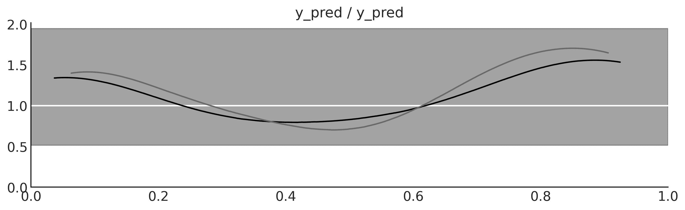
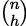

# 第五章

比较模型

> 地图不是它所代表的领土，但如果它是正确的，它具有与领土相似的结构。 – 阿尔弗雷德·科尔齐布斯基

模型应当作为近似值来设计，帮助我们理解一个特定问题或一类相关问题。模型并不是为了完美复制*真实世界*而设计的。因此，所有模型都在某种意义上是错误的，就像地图不是领土一样。但并非所有模型都是同样错误的；有些模型在描述某个特定问题时会比其他模型更好。

在前几章中，我们将注意力集中在推断问题上，也就是如何从数据中学习参数值。在本章中，我们将重点关注一个互补的问题：如何比较针对同一数据的两个或多个模型。正如我们将要学习的，这既是数据分析中的一个核心问题，也是一个棘手的问题。在本章中，我们将保持示例简单，以便专注于模型比较的技术细节。在接下来的章节中，我们将把在这里学到的知识应用于更复杂的例子。

在本章中，我们将探讨以下主题：

+   过拟合与欠拟合

+   信息准则

+   交叉验证

+   贝叶斯因子

## 5.1 后验预测检查

我们之前介绍并讨论了后验预测检查，作为评估模型如何解释用于拟合模型的数据的一种方法。这种测试的目的是不是确定模型是否错误；我们早就知道这一点了！这个过程的目标是理解我们如何捕捉数据。通过进行后验预测检查，我们旨在更好地理解模型的局限性。一旦我们理解了局限性，我们可以简单地承认它们，或者通过改进模型来尝试去除它们。预计模型无法重现问题的所有方面，这通常不是问题，因为模型是为了特定目的构建的。由于不同的模型通常捕捉数据的不同方面，我们可以通过后验预测检查来比较模型。

让我们看一个简单的例子。我们有一个包含两个变量`x`和`y`的数据集。我们将使用线性模型来拟合这些数据：


我们还将使用二次模型来拟合数据，即一个比线性模型多一个项的模型。对于这个额外的项，我们只需将*x*的平方加上一个*β*系数：


我们可以像往常一样在 PyMC 中编写这些模型；参考以下代码块。与我们之前见过的所有模型唯一的不同之处在于，我们向`pm.sample`传递了`idata_kwargs="log_likelihood": True`这个参数。这个额外的步骤将把对数似然值存储在`InferenceData`对象中，我们稍后将使用这个信息：

**代码 5.1**

```py
with pm.Model() as model_l: 
    *α* = pm.Normal("*α*", mu=0, sigma=1) 
    *β* = pm.Normal("*β*", mu=0, sigma=10) 
    σ = pm.HalfNormal("σ", 5) 

    μ = *α* + *β* * x_c[0] 

    y_pred = pm.Normal("y_pred", mu=μ, sigma=σ, observed=y_c) 

    idata_l = pm.sample(2000, idata_kwargs={"log_likelihood": True}) 
    idata_l.extend(pm.sample_posterior_predictive(idata_l)) 

with pm.Model() as model_q: 
    *α* = pm.Normal("*α*", mu=0, sigma=1) 
    *β* = pm.Normal("*β*", mu=0, sigma=10, shape=order) 
    σ = pm.HalfNormal("σ", 5) 

    μ = *α* + pm.math.dot(*β*, x_c) 

    y_pred = pm.Normal("y_pred", mu=μ, sigma=σ, observed=y_c) 

    idata_q = pm.sample(2000, idata_kwargs={"log_likelihood": True}) 
    idata_q.extend(pm.sample_posterior_predictive(idata_q))
```

*图 5.1* 显示了两个模型的均值拟合。从视觉上看，两个模型似乎都对数据提供了合理的拟合。至少对我来说，要看出哪个模型最好并不那么容易。你怎么看？


**图 5.1**：`model_l`（线性模型）和`model_q`（二次模型）的均值拟合

为了获得更多的见解，我们可以进行后验预测检查。*图 5.2* 显示了观察值和预测值的数据的 KDE（核密度估计）。在这里，很容易看出`model_q`，即二次模型，更好地拟合了数据。我们还可以看到，特别是在分布的尾部，有很多不确定性。这是因为我们数据点的数量很少。


**图 5.2**：使用`az.plot_ppc`函数创建的`model_l`和`model_q`的后验预测检查

后验预测检查是一个非常灵活的概念。我们可以通过许多方式比较观察值和预测值。例如，我们可以比较分布的密度，而不是直接比较密度，我们还可以比较总结统计量。在*图 5.3*的顶部面板中，我们展示了两个模型的均值分布。x 轴上的点表示观察值。我们可以看到，两个模型都很好地捕捉了均值，二次模型的方差更小。两个模型都能够很好地捕捉均值并不令人惊讶，因为我们显式地建模了均值。在底部面板中，我们展示了四分位间距的分布。这一比较则偏向于线性模型。


**图 5.3**：使用`az.plot_bpv`函数创建的`model_l`和`model_q`的后验预测检查

通常，与模型明确建模的内容*正交*的统计量对于评估模型来说会更具信息量。如果有疑问，评估多个统计量可能会更方便。一个有用的问题是，问问自己你对数据的哪些方面感兴趣。

为了生成*图 5.3*，我们使用了`az.plot_bpv` ArviZ 函数。生成该图的完整代码片段如下：

**代码 5.2**

```py
idatas = [idata_l, idata_q] 

def iqr(x, a=-1): 
    """interquartile range""" 
    return np.subtract(*np.percentile(x, [75, 25], axis=a)) 

for idata in idatas: 
    az.plot_bpv(idata, kind="t_stat", t_stat="mean", ax=axes[0]) 

for idata in idatas: 
    az.plot_bpv(idata, kind="t_stat", t_stat=iqr, ax=axes[1])
```

请注意，我们使用了`kind="t_stat"`参数来指示我们将使用总结统计量。我们可以传递一个字符串，比如`t_stat="mean"`，表示我们想要使用均值作为总结统计量。或者，我们也可以使用用户定义的函数，比如`t_stat=iqr`。

你可能已经注意到，*图 5.3* 也包含了带有 `bpv` 值的图例。**bpv** 代表贝叶斯 p 值。这是一种以数值方式总结模拟数据和观察数据之间比较的方法。为了获得它们，选择一个汇总统计量 *T*，比如均值、中位数、标准差，或者你认为值得比较的任何东西。然后，计算观察数据 *T*[obs] 和模拟数据 *T*[sim] 的 *T*。最后，我们问自己这个问题：“*T*[sim] 小于或等于 *T*[obs] 的概率是多少？”如果观察值与预测值一致，那么期望值将为 0.5。换句话说，一半的预测值将低于观察值，一半将高于观察值。这个量被称为 **贝叶斯** **p 值**：


还有另一种计算贝叶斯 p 值的方法。我们可以使用整个分布，而不是使用汇总统计量。在这种情况下，我们可以问自己这个问题：“对于**每个观察值**，预测一个更小或相等的值的概率是多少？”。如果模型被很好地校准，那么这些概率应该对于所有观察值是相同的。因为模型能够同样好地捕捉所有观察值，所以我们应该期待一个均匀分布。ArviZ 可以帮助我们进行计算；这次我们需要使用带有 `kind="p_value"` 参数（这是默认值）的 `az.plot_bpv` 函数。*图 5.4* 显示了此计算的结果。白色线条表示期望的均匀分布，灰色带状区域显示了由于样本的有限大小而预期的偏差。可以看出，这些模型非常相似。



**图 5.4**：通过 `az.plot_bpv` 函数创建的 `model_l` 和 `model_q` 的后验预测检验

那些不是 p 值

对于那些熟悉 p 值及其在频率统计中的使用的人来说，有一些需要澄清的地方。关于这些 p 值的“贝叶斯”之处在于，我们并没有使用抽样分布，而是使用了后验预测分布。此外，我们并没有进行原假设检验，也没有试图声明一个差异是“显著的”。我们只是试图量化模型如何解释数据。

后验预测检验提供了一个非常灵活的框架，用于评估和比较模型，无论是使用图形，还是使用诸如贝叶斯 p 值之类的数值摘要，或两者的组合。这个概念足够通用，允许分析人员发挥想象力，寻找不同的方式来探索模型的预测，并使用最适合其建模目标的方式。

在接下来的章节中，我们将探索其他比较模型的方法。这些新方法可以与后验预测检验结合使用。

## 5.2 简单性与准确性之间的平衡

在选择不同解释时，有一个原则被称为奥卡姆剃刀。一般来说，这个原则规定，当有两个或更多等效的解释时，最简单的解释是首选解释。简洁性的一种常见标准是模型中的参数数量。

这一启发式方法有很多理由支持。我们不会讨论它们的具体内容，我们只会将它们视为一种合理的指导原则。

我们在比较模型时通常需要考虑的另一个因素是它们的准确性，也就是模型对数据的拟合程度。根据这一标准，如果我们有两个（或更多）模型，其中一个比另一个更好地解释了数据，那么这个模型就是首选模型。

直观上，似乎在比较模型时，我们倾向于偏好那些最能拟合数据且简单的模型。但如果这两个原则导致我们选择不同的模型，我们该怎么做呢？或者更一般地说，是否有一种量化的方法来平衡这两者的贡献？简短的回答是有，而且实际上有不止一种方法可以做到。但首先，让我们看一个例子，以便获得直觉。

### 5.2.1 多个参数（可能）导致过拟合

*图 5.5*展示了三个参数数量逐渐增加的模型。第一个（零次）只是一个常数值：无论 *X* 的值是多少，模型总是预测相同的 *Y* 值。第二个模型（一阶）是一个线性模型，就像我们在*第四章*中看到的那样。最后一个模型（五次）是一个五次多项式模型。我们将在*第六章*中更深入地讨论多项式回归，但目前我们只需要知道，该模型的核心形式是 *α* + *β*[0]*x* + *β*[0]*x*² + *β*[0]*x*³ + *β*[0]*x*⁴ + *β*[0]*x*⁵。


**图 5.5**：简单数据集的三种模型

在*图 5.5*中，我们可以看到，随着模型复杂度（参数数量）的增加，模型的准确度也得到了提升，这一变化反映在决定系数 *R*² 中。这是一种衡量模型拟合度的方式（欲了解更多信息，请阅读[`en.wikipedia.org/wiki/Coefficient_of_determination`](https://en.wikipedia.org/wiki/Coefficient_of_determination)）。事实上，我们可以看到五次多项式完美地拟合了数据，得到了 *R*² = 1。

为什么五次多项式可以在没有误差的情况下拟合数据呢？原因在于我们有与数据相同数量的参数，也就是六个。因此，模型实际上只是作为一种表达数据的替代方式。模型并没有学习数据的模式，而是在记忆数据！这可能是个问题。察觉这一点的更简单方式是，思考当面对新的、未见过的数据时，记住数据的模型会发生什么。你认为会发生什么？

好吧，性能预期会很差，就像某人只是背了考试问题，却发现问题在最后一刻被更改了！这种情况在*图 5.6*中有所展示；这里，我们添加了两个新数据点。也许我们有资金进行新的实验，或者我们的老板刚刚给我们发送了新的数据。我们可以看到，原本能够完美拟合数据的 5 阶模型，现在在*R*²的度量下比线性模型表现得更差。从这个简单的例子中，我们可以看出，最适合的模型不一定是理想的模型。


**图 5.6**：三个简单数据集的模型，外加两个新点

大致来说，当一个模型非常好地拟合了用于学习该模型参数的数据集，但在拟合新数据集时表现很差，我们就遇到了过拟合问题。这是分析数据时非常常见的一个问题。思考过拟合的一个有用方法是将数据集视为包含两个部分：信号和噪声。信号是我们希望从数据中捕捉到的（或学习到的）内容。如果我们使用某个数据集，那是因为我们认为其中有信号，否则这将是徒劳的。另一方面，噪声是没有用的，它是测量误差、数据生成或捕获方式的局限性、数据损坏等因素的产物。当模型过于灵活（对于一个数据集）到能够学习噪声时，就会发生过拟合。这导致信号被隐藏起来。

这是奥卡姆剃刀的一个实际论据，同时也是一个警告：至少在原则上，总是可以创建一个复杂到足以解释数据集中所有细节的模型，甚至是最不相关的细节——就像博尔赫斯故事中的制图师，他们制作了一张与帝国一样庞大的地图，完美复制了每一个细节。

### 5.2.2 参数过少导致欠拟合

继续使用相同的例子，但从复杂度的另一极来看，我们得到了 0 阶模型。这个模型仅仅是一个伪装成线性模型的高斯分布。这个模型只能捕捉到*Y*的均值，因此完全不关心*X*的值。我们说这个模型对数据进行了欠拟合。欠拟合的模型也可能具有误导性，尤其是在我们没有意识到这一点时。

## 5.3 预测准确性的度量

“一切应当尽可能简化，但不能简化得过度”是一句常被归因于爱因斯坦的话。就像健康饮食一样，建模时我们也需要保持平衡。理想情况下，我们希望有一个既不过度拟合也不欠拟合数据的模型。我们希望在简洁性和拟合优度之间找到某种平衡。

在前面的例子中，相对容易看出，0 阶模型过于简单，而 5 阶模型过于复杂。为了得到一个通用的方法，使我们能够对模型进行排序，我们需要将这种简单性和准确性之间的平衡形式化。

让我们来看几个对我们有用的术语：

+   **样本内准确度**：使用与拟合模型相同的数据来衡量的准确度。

+   **样本外准确度**：使用未用于拟合模型的数据来衡量的准确度。

样本内准确度的平均值通常会大于样本外准确度。这就是为什么一般来说，使用样本内准确度来评估模型会让我们误以为模型比实际更好。因此，使用样本外准确度是一个不错的选择，可以避免我们自我欺骗。然而，留下数据意味着我们将拥有更少的数据来训练模型，而这通常是我们不能奢侈的。因此，这个问题在数据分析中是一个核心问题，已有多个提案来解决它。两种非常流行的方法是：

+   **信息准则**：这是一个总称，用来指代各种表达式，这些表达式将样本外准确度近似为样本内准确度加上一个惩罚模型复杂性的项。

+   **交叉验证**：这是一种基于将可用数据分为不同子集的方法，这些子集交替用于拟合和评估模型。

让我们在接下来的部分更详细地讨论这两种方法。

### 5.3.1 信息准则

信息准则是一组密切相关的工具，用于从拟合优度和模型复杂度的角度比较模型。换句话说，信息准则形式化了我们在本章开始时发展起来的直觉。这些量的具体推导方式与一个叫做信息理论的领域有关（[MacKay, 2003]），这是一个有趣的领域，但我们将追求一个更直观的解释。

衡量模型拟合数据好坏的一种方法是计算数据与模型预测值之间的均方根误差：


E(*y*[*i*]|*θ*)是给定估计参数后的预测值。值得注意的是，这本质上是观察值和预测数据之间平方差的平均值。将误差平方可以确保差异不会相互抵消，并且相对于其他方法（例如计算绝对值），它能更强调较大的误差。

均方根误差可能你已经很熟悉了。它是一个非常流行的度量——流行到我们可能从未花时间思考它。但如果我们仔细想想，就会发现，原则上它并没有什么特别之处，我们完全可以设计出其他类似的表达式。当我们采用概率方法时，正如本书中所做的那样，一个更一般（和*自然的*）的表达式如下：


也就是说，我们为每个*n*个观测值计算似然。我们使用和而不是乘积，因为我们在使用对数。为什么我们说这是*自然的*呢？因为我们可以认为，在为模型选择似然时，我们实际上在选择如何惩罚数据与预测之间的偏差。事实上，当 *p*(*y*[*i*]|*θ*) 是高斯分布时，上述表达式将与均方根误差成比例。

现在，让我们将注意力转向对几个特定信息准则的详细探索。

#### 赤池信息量准则

**赤池信息量准则**（**AIC**）是一个著名且广泛使用的信息准则，尤其在贝叶斯领域外，定义为：


*k* 是模型参数的数量，[*mle*] 是 *θ* 的最大似然估计。

最大似然估计是非贝叶斯方法中的常见做法，并且通常，当使用*平坦的*先验时，它等同于贝叶斯**最大后验估计**（**MAP**）。需要注意的是，[*mle*] 是一个点估计，而不是一个分布。

因子 −2 只是一个常数，我们可以省略它，但通常不这么做。从实际的角度来看，重要的是，第一个项考虑了模型与数据的拟合程度，而第二个项则惩罚了模型的复杂度。因此，如果两个模型对数据的拟合程度相同，AIC 表示我们应该选择参数最少的模型。

AIC 在非贝叶斯方法中表现良好，但在其他情况下存在问题。一个原因是它没有使用*θ*的后验分布，因此丢失了信息。此外，从贝叶斯的角度来看，AIC 假设先验是*平坦的*，因此 AIC 与像本书中使用的那些信息丰富或稍微信息丰富的先验不兼容。另外，当使用信息丰富的先验或层次结构等结构时，模型中的参数数量并不是衡量模型复杂度的好方法，因为这些方法会减少有效参数的数量，也称为*正则化*。我们将在后面回到正则化的这个概念。

#### 广泛适用的信息准则

**广泛应用的信息准则** (**WAIC**) 类似于 AIC 的贝叶斯版本。它也有两个项，一个衡量拟合的好坏，另一个对复杂模型进行惩罚。但 WAIC 使用完整的后验分布来估计这两个项。以下表达式假设后验分布作为大小为*S*的样本（通过 MCMC 方法获得）来表示：


第一个项与赤池准则类似，只不过它是在所有观测值和所有后验样本上进行评估的。第二个项有点难以解释，除非涉及到一些技术细节。但它可以被理解为有效参数的数量。从实践角度来看，重要的是 WAIC 使用整个后验分布（而非点估计）来计算这两个项，因此 WAIC 可以应用于几乎任何贝叶斯模型。

#### 其他信息准则

另一个广泛使用的信息准则是**偏差信息准则** (**DIC**)。如果我们使用*bayes-o-meter*^(TM)，DIC 比 AIC 更具贝叶斯特性，但不如 WAIC。虽然仍然很流行，但已通过理论和实证研究表明，WAIC 和主要的 LOO（见下一节）比 DIC 更有用。因此，我们不推荐使用它。

另一个广泛使用的准则是**贝叶斯信息准则** (**BIC**)。就像逻辑回归和我母亲的*干汤*一样，这个名字可能会让人误解。BIC 作为一种修正 AIC 问题的方法提出，作者也为其提出了贝叶斯的理论依据。但 BIC 并不完全是贝叶斯的，因为像 AIC 一样，它假设使用平坦先验，并使用最大似然估计。

但更重要的是，BIC 与 AIC 和 WAIC 在目标上有所不同。AIC、WAIC 和 LOO（见下一节）试图反映哪个模型能更好地推广到其他数据（预测精度），而 BIC 试图识别哪个是*正确*的模型，因此更与贝叶斯因子相关。

### 5.3.2 交叉验证

交叉验证是一种简单且在大多数情况下有效的模型比较方法。我们将数据划分为 K 个切片，尽量使这些切片在大小上保持一致（有时也会在其他特征上保持一致，如类别数量）。然后，我们使用 K-1 个切片来训练模型，使用剩下的一个切片来进行测试。这个过程是通过系统地反复省略每次训练集中的一个不同切片，并使用该切片作为评估集来完成的。直到完成 K 轮拟合与评估，可以在*图 5.7*中看到。模型的准确度将是 K 轮中每一轮准确度的平均值。这被称为 K 折交叉验证。最后，在执行完交叉验证后，我们使用所有数据进行最后一次拟合，这个模型就可以用来进行预测或其他目的。


**图 5.7**：K 折交叉验证

当 K 等于数据点的数量时，我们得到的就是**留一法交叉验证**（**LOOCV**），即每次都将模型拟合到除了一个数据点之外的所有数据点上。

交叉验证是机器学习中的常规实践，我们所描述的仅仅是这种实践的最基本方面。这里展示的模式还有很多变体。有关更多信息，您可以阅读 James 等人 [2023]或 Raschka 等人 [2022]的研究。

交叉验证是一个非常简单且有用的概念，但对于某些模型或大规模数据集，交叉验证的计算成本可能超出了我们的能力。许多人尝试找到更简单的计算量，比如信息准则。在接下来的章节中，我们将讨论一种通过对所有数据进行单次拟合来近似交叉验证的方法。

#### 近似交叉验证

交叉验证是一个不错的想法，但它可能代价高昂，特别是像留一法交叉验证这样的变体。幸运的是，利用单次拟合的数据可以近似交叉验证！这一方法称为“帕累托平滑重要性采样留一法交叉验证”。这个名字非常长，因此在实践中我们通常简称它为 LOO。从概念上来说，我们尝试计算的是：


这是期望的对数逐点预测密度（ELPD）。我们加上下标*LOO-CV*，以明确表示我们使用留一法交叉验证来计算 ELPD。[−*i*]表示我们省略了观测值*i*。

这个表达式与后验预测分布的表达式非常相似。不同之处在于，现在我们要计算的是从没有包含观察值 *y*[*i*] 的后验分布中计算的后验预测分布。我们采取的第一个逼近方法是通过从后验分布中抽样来避免显式计算积分。因此，我们可以写成：


这里，求和是对 *S* 后验样本进行的。在本书中，我们经常使用 MCMC 样本。因此，这种逼近方法对你来说应该不陌生。接下来是比较棘手的部分。

可以使用重要性抽样来逼近 。我们不会详细讨论这种统计方法，但我们将看到重要性抽样是一种通过重新加权从另一个分布中获得的值来逼近目标分布的方法。当我们不知道如何从目标分布中抽样，但知道如何从另一个分布中抽样时，这种方法很有用。重要性抽样在已知分布比目标分布更*宽泛*时效果最好。

在我们的例子中，一旦模型拟合完成，已知分布就是所有观察值的对数似然。我们希望逼近的是如果我们去掉一个观察值后的对数似然。为此，我们需要估计每个观察值在确定后验分布中的“重要性”（或权重）。一个观察值的“重要性”与如果该观察值被移除时该变量对后验分布的影响成正比。直观地说，一个相对不太可能的观察值比一个预期中的观察值更为重要（或权重更大）。幸运的是，一旦我们计算了后验分布，这些权重就容易计算。实际上，观察值 *i* 对于 *s* 后验样本的权重是：


这个 *w*[*s*] 可能不可靠。主要的问题是，有时一些 *w*[*s*] 可能会非常大，以至于它们主导了我们的计算，使得计算不稳定。为了控制这些极端的权重，我们可以使用 Pareto 平滑方法。这个解决方案包括将这些权重中的一部分替换为通过拟合 Pareto 分布获得的权重。为什么使用 Pareto 分布？因为理论表明，权重应该遵循这种分布。

因此，对于每个观察值 *y*[*i*]，使用最大的权重来估计 Pareto 分布，并且使用该分布来替换这些权重为“平滑”后的权重。这个过程为 ELPD 的估计提供了稳健性，并且提供了一种诊断逼近的方法，即，能够发出警告，提示 LOO 方法可能出现问题。为此，我们需要关注 *k* 的值，*k* 是 Pareto 分布的一个参数。*k* 值大于 0.7 表明我们可能有非常有影响力的观察值。

## 5.4 使用 ArviZ 计算预测准确性

幸运的是，使用 ArviZ 计算 WAIC 和 LOO 非常简单。我们只需要确保推理数据包含对数似然组。使用 PyMC 计算后验时，可以通过执行`pm.sample(idata_kwargs="log_likelihood": True)`来实现这一点。现在，让我们看看如何计算 LOO：

**代码 5.3**

```py
az.loo(idata_l)
```

```py
 Computed from 8000 posterior samples and 33 observations log-likelihood matrix.

         Estimate       SE elpd_loo   -14.31     2.67
p_loo        2.40        -
------

Pareto k diagnostic values:
                         Count   Pct. (-Inf, 0.5]   (good)       33  100.0%
 (0.5, 0.7]   (ok)          0    0.0%
   (0.7, 1]   (bad)         0    0.0%
   (1, Inf)   (very bad)    0    0.0%
```

`az.loo`的输出分为两部分。在第一部分，我们得到一个包含两行的表格。第一行是 ELPD（`elpd_loo`），第二行是有效参数数（`p_loo`）。在第二部分，我们有 Pareto k 诊断。这是 LOO 近似可靠性的一种度量。k 值大于 0.7 表示我们可能有非常有影响力的观测值。在这种情况下，我们有 33 个观测值，且它们都是好的，因此我们可以信任这个近似。

要计算 WAIC，你可以使用`az.waic`；输出将类似，只是我们不会得到 Pareto k 诊断或任何类似的诊断信息。这是 WAIC 的一个缺点：我们无法获得任何关于近似可靠性的信息。

如果我们为二次模型计算 LOO，将会得到类似的输出，但 ELPD 值会更高（大约-4），这表明二次模型更好。

ELPD 的数值本身并不太有用，必须与其他 ELPD 值进行比较来解读。这就是为什么 ArviZ 提供了两个辅助函数来方便这种比较。我们先来看`az.compare`：

**代码 5.4**

```py
cmp_df = az.compare({"model_l": idata_l, "model_q": idata_q})
```

|  | **rank** | **elpd_loo** | **p_loo** | **elpd_diff** | **weight** | **se** | **dse** | **warning** | **scale** |
| --- | --- | --- | --- | --- | --- | --- | --- | --- | --- |
| **model_q** | 0 | -4.6 | 2.68 | 0 | 1 | 2.36 | 0 | False | log |
| **model_l** | 1 | -14.3 | 2.42 | 9.74 | 3.0e-14 | 2.67 | 2.65 | False | log |

在行中，我们列出了比较的模型，在列中，我们有：

+   `rank`: 模型的顺序（从最好到最差）。

+   `elpd_loo`: ELPD 的点估计。

+   `p_loo`: 有效的参数数。

+   `elpd_diff`: 最佳模型与其他模型之间的 ELPD 差异。

+   `weight`: 每个模型的相对权重。如果我们想通过结合不同的模型来进行预测，而不是仅选择一个模型，这将是我们应该赋予每个模型的权重。在这种情况下，我们看到多项式模型占用了所有的权重。

+   `se`: ELPD 的标准误差。

+   `dse`: 差异的标准误差。

+   `warning`: 关于高 k 值的警告。

+   `scale`: 计算 ELPD 时所用的尺度。

ArviZ 提供的另一个辅助函数是`az.compareplot`。这个函数提供了与`az.compare`相似的信息，但以图形方式呈现。*图 5.8*展示了该函数的输出。请注意：

+   空心圆代表 ELPD 值，黑线是标准误差。

+   最高的 ELPD 值通过一条垂直的虚线灰线标示，以便与其他值进行比较。

+   对于所有模型，除了*最优模型*，我们还会得到一个三角形，表示每个模型与*最优模型*之间 ELPD 差值的大小。灰色误差条表示点估计之间差异的标准误差。


**图 5.8**：`az.compareplot(cmp_df)`的输出

使用 LOO（或 WAIC）最简单的方法是选择一个单一模型。只需选择 ELPD 值最高的模型。如果我们遵循这个规则，我们将不得不接受二次模型是最优的。即使考虑到标准误差，我们也可以看到它们并没有重叠。这给了我们一些确定性，表明这些模型确实*足够不同*。如果标准误差重叠，我们应该给出更细致的答案。

## 5.5 模型平均

模型选择因其简便性而具有吸引力，但我们可能忽视了模型中关于不确定性的信息。这有点类似于计算完整的后验分布，然后仅保留后验均值；这可能导致我们对自己所知的内容过于自信。

另一种方法是选择一个单一模型，但报告并分析不同的模型，以及计算出的信息标准、它们的标准误差，或许还包括后验预测检查。将所有这些数字和测试放在我们的实际问题背景下非常重要，这样我们和我们的观众可以更好地了解模型可能的局限性和缺陷。对于学术界的人来说，这些元素可以用来在论文、报告、论文等的讨论部分中增加内容。在行业中，这对向利益相关者提供有关模型、预测和结论的优缺点非常有用。

另一种可能性是对模型进行平均。通过这种方式，我们保留了每个模型拟合优度的不确定性。然后我们使用每个模型的加权平均值来获得一个元模型（以及元预测）。ArviZ 提供了一个用于此任务的函数 `az.weight_predictions`，它接受推断数据对象列表和权重列表作为参数。权重可以使用 `az.compare` 函数计算。例如，如果我们想要对我们一直在使用的两个模型进行平均，可以按照以下方式操作：

**代码 5.5**

```py
idata_w = az.weight_predictions(idatas, weights=[0.35, 0.65])
```

*图 5.9* 显示了该计算的结果。浅灰色虚线是两个模型的加权平均，黑色实线是线性模型，灰色实线是二次模型。


**图 5.9**：线性和二次模型的加权平均

还有其他方式来对模型进行平均，例如显式地构建一个元模型，将所有感兴趣的模型作为特定情况包含在内。例如，二阶多项式包含了线性模型作为特定情况，或者分层模型是两种极端模型之间的连续版本，一个是分组模型，另一个是非分组模型。

## 5.6 贝叶斯因子

LOO、交叉验证和信息准则的替代方法是贝叶斯因子。贝叶斯因子通常作为频率派假设检验的贝叶斯替代方案出现在文献中。

比较*k*个模型的*贝叶斯方法*是计算每个模型的**边际** **似然** *p*(*y*|*M*[*k*])，即给定模型*M*[*k*]时观察数据*Y*的概率。边际似然是贝叶斯定理的归一化常数。我们可以通过写出贝叶斯定理并明确表明所有推断都依赖于模型来看到这一点。


其中，*y*是数据，*θ*是参数，*M*[*k*]是从*k*个竞争模型中选择的模型。

如果我们的主要目标是从一组模型中选择一个模型，即选择*最佳*模型，那么我们可以选择具有最大*p*(*y*|*M*[*k*])值的那个模型。如果我们假设所有模型的先验概率相同，这样做是可以的。否则，我们必须计算：


如果我们的主要目标是比较模型，以确定哪些模型更可能且可能的程度，那么可以使用贝叶斯因子来实现：


这是两个模型的边际似然比。*BF*[01]的值越高，分子中的模型（本例中的*M*[0]）就越*好*。为了方便解读贝叶斯因子，并将数字转化为文字，Harold Jeffreys 提出了一个解读贝叶斯因子的尺度，其中包括*支持*或*强度*的不同级别（见*表 5.1*）。

| **贝叶斯因子** | **支持度** |
| --- | --- |
| 1–3 | 轶事 |
| 3–10 | 中等 |
| 10–30 | 强烈 |
| 30–100 | 非常强烈 |
| *>*100 | 极端 |

**表 5.1**：分子中的模型*M*[0]的支持度

请记住，如果你得到的数值低于 1，那么支持的是*M*[1]，即分母中的模型。对于这些情况，也有表格可供参考，但请注意，你可以简单地取获得值的倒数。

记住，这些规则只是约定——充其量只是简单的指南。结果应始终放在我们的具体问题背景下，并附上足够的细节，以便他人可以自行评估他们是否同意我们的结论。在粒子物理学中确保某些东西的证明，或者在法庭上，或者在面对即将发生的自然灾难时决定是否进行撤离的证明是不一样的。

### 5.6.1 一些观察结果

现在我们简要讨论一些关于边际似然的关键事实：

+   优点：包括奥卡姆剃刀。参数较多的模型比参数较少的模型有更大的惩罚。直观的理由是，参数越多，先验相对于似然的*扩展*就越大。一个容易看出这种情况的例子是嵌套模型：例如，二次多项式“包含”了一次多项式和零次多项式模型。

+   坏处：对于许多问题，边际似然无法进行解析计算。此外，数值近似通常是一项艰巨的任务，在最好的情况下需要专门的方法，而在最坏的情况下，估算结果要么不切实际，要么不可靠。事实上，MCMC 方法的流行在于它们可以在不计算边际似然的情况下获得后验分布。

+   缺点：边际似然对每个模型中的参数先验分布*非常敏感*（*p*(*θ*[*k*]|*M*[*k*])）。

需要注意的是，*优点*和*缺点*是相关的。使用边际似然来比较模型是一个好主意，因为它已经对复杂模型进行了惩罚（这有助于我们防止过拟合），同时，先验的变化将影响边际似然的计算。起初，这听起来有些傻；我们已经知道先验会影响计算（否则我们可以直接避免使用它们）。但我们这里谈论的是先验的变化，这些变化在后验中可能只有小的影响，但对边际似然值有很大影响。

贝叶斯因子的使用常常是贝叶斯学派的分水岭。其计算的难度以及对先验的敏感性是反对其使用的一些论点。另一个原因是，像 p 值和假设检验一样，贝叶斯因子更倾向于二分法思维，而不是“效应大小”的估计。换句话说，我们不是在问自己像这样的问题：癌症治疗可以延长多少年的生命？而是最终问，治疗与不治疗之间的差异是否是“统计显著的”。请注意，这个最后的问题在某些背景下是有用的。关键是，在许多其他情况下，这种问题并不是我们感兴趣的问题；我们只对我们被教导去回答的问题感兴趣。

### 5.6.2 贝叶斯因子的计算

正如我们已经提到的，边际似然（以及由此得出的贝叶斯因子）通常无法以闭式形式提供，除非是某些特定模型。因此，已经设计了许多数值方法来计算它。其中一些方法非常简单且天真（[`radfordneal.wordpress.com/2008/08/17/the-harmonic-mean-of-the-likelihood-worst-monte-carlo-method-ever`](https://radfordneal.wordpress.com/2008/08/17/the-harmonic-mean-of-the-likelihood-worst-monte-carlo-method-ever)），以至于在实践中效果非常差。

#### 分析上

对于某些模型，如 BetaBinomial 模型，我们可以解析计算边际似然。如果我们将该模型表示为：

|  | *θ* ∼ *Beta*(**α*,*β**) |  |
| --- | --- | --- |
|  | *y* ∼ *Bin*(*n* = 1*,p* = *θ*) |  |

然后，边际似然将是：


*B* 是贝塔函数（不要与 *Beta* 分布混淆），*n* 是实验次数，*h* 是成功次数。

由于我们只关心在两种不同模型下的边际似然相对值（对于相同的数据），我们可以省略二项系数 ，因此我们可以写成：


这个表达式已在下一个代码块中编写，但有些变化。我们将使用 `betaln` 函数，它返回 `beta` 函数的自然对数，通常在统计学中，计算使用对数尺度。这可以减少在处理概率时的数值问题。

对数尺度。这减少了处理概率时的数值问题。

**代码 5.6**

```py
from scipy.special import betaln 

def beta_binom(prior, y): 
    """ 
    Calculate the marginal probability, analytically, for a BetaBinomial model. 
    prior : tuple 
      alpha and beta parameters for the beta prior 
    y : array 
      array with "1" and "0" corresponding to success and failure respectively 
    """ 
    alpha, beta = prior 
    h = np.sum(y) 
    n = len(y) 
    p_y = np.exp(betaln(alpha + h, beta + n - h) - betaln(alpha, beta)) 

    return p_y
```

本示例的数据由 100 次抛硬币实验组成，正反面数量相同。我们将比较两种模型，一种具有均匀先验，另一种具有围绕 *θ* = 0*.*5 的 *更集中* 先验：

**代码 5.7**

```py
y = np.repeat([1, 0], [50, 50])  # 50 heads, 50 tails 
priors = ((1, 1), (30, 30))  # uniform prior, peaked prior
```

*图 5.10* 显示了两个先验分布。均匀先验是黑线，尖峰先验是灰线。


**图 5.10**：均匀先验和尖峰先验

现在，我们可以为每个模型计算边际似然和贝叶斯因子，结果为 5：

**代码 5.8**

```py
BF = beta_binom(priors[1], y) / beta_binom(priors[0], y) 
print(round(BF))
```

```py
 5
```

我们看到，具有先验 beta(30*,*30) 的模型，其浓度更高，支持度大约是 beta(1*,*1) 模型的 5 倍。这是可以预期的，因为第一个模型的先验集中在 *θ* = 0*.*5 附近，而数据 *Y* 中正反面数量相同，即它们与 *θ* 约为 0.5 的值一致。

#### 序列蒙特卡洛

**序列蒙特卡洛**（**SMC**）方法是一种通过一系列连续阶段的采样方法，逐步连接一个易于采样的分布和感兴趣的后验分布。在实践中，起始分布通常是先验分布。SMC 采样器的副产品是边际似然的估计。

**代码 5.9**

```py
models = [] 
idatas = [] 
for alpha, beta in priors: 
    with pm.Model() as model: 
        a = pm.Beta("a", alpha, beta) 
        yl = pm.Bernoulli("yl", a, observed=y) 
        idata = pm.sample_smc(random_seed=42) 
        models.append(model) 
        idatas.append(idata) 

BF_smc = np.exp( 
    idatas[1].sample_stats["log_marginal_likelihood"].mean() 
    - idatas[0].sample_stats["log_marginal_likelihood"].mean() 
) 
print(np.round(BF_smc).item())
```

```py
 5.0
```

从前面的代码块中可以看出，SMC 也给出了贝叶斯因子 5，结果与解析计算一致！使用 SMC 计算边际似然的优点是我们可以将其应用于更广泛的模型，因为我们不再需要知道一个封闭形式的表达式。我们为这种灵活性付出的代价是更高的计算成本。此外，值得注意的是，SMC（使用独立的 Metropolis-Hastings 核心，如 PyMC 中实现的）并不像 NUTS 那样高效。随着问题的维度增加，更精确的后验估计和边际似然需要更多的后验样本。

对数空间

在计算统计学中，我们通常在对数空间中进行计算。这有助于提供数值稳定性和计算效率等。举个例子，参考前面的代码块；你可以看到我们计算了差异（而不是除法），然后在返回结果之前取了指数。

#### Savage–Dickey 比率

对于上述例子，我们比较了两个 BetaBinomial 模型。我们本可以比较两个完全不同的模型，但有时我们希望比较一个零假设`H_0`（或零模型）与一个备择假设*H_1*。例如，为了回答“这个硬币是否有偏？”的问题，我们可以将值*θ* = 0*.*5（表示没有偏差）与允许*θ*变化的模型的输出进行比较。对于这种比较，零模型嵌套在备择模型中，这意味着零假设是我们正在构建的模型中的一个特定值。在这些情况下，计算贝叶斯因子非常简单，不需要任何特殊的方法。我们只需要比较在备择模型下评估零值（例如*θ* = 0*.*5）时的先验和后验。我们可以从以下表达式中看到这一点：


仅当*H*[0]是*H*[1]的特定情况时，这才成立（[`statproofbook.github.io/P/bf-sddr`](https://statproofbook.github.io/P/bf-sddr)）。接下来，让我们用 PyMC 和 ArviZ 来实现。我们只需要为一个模型进行先验和后验的采样。让我们尝试使用 Uniform 先验的 BetaBinomial 模型：

**代码 5.10**

```py
with pm.Model() as model_uni: 
    a = pm.Beta("a", 1, 1) 
    yl = pm.Bernoulli("yl", a, observed=y) 
    idata_uni = pm.sample(2000, random_seed=42) 
    idata_uni.extend(pm.sample_prior_predictive(8000)) 

az.plot_bf(idata_uni, var_name="a", ref_val=0.5)
```

结果显示在*图 5.11*中。我们可以看到一个先验的 KDE（黑色）和一个后验的 KDE（灰色）。两个黑点显示我们在值 0.5 处评估了这两个分布。我们可以看到支持零假设的贝叶斯因子`BF_01`约为 8，我们可以将其解释为*适度证据*支持零假设（见*表 5.1*）。


**图 5.11**：具有 Uniform 先验的 BetaBinomial 模型的贝叶斯因子

正如我们已经讨论过的，贝叶斯因子衡量的是哪个模型更好地解释了数据。这包括先验，即使先验对后验计算的影响相对较小。我们也可以通过将第二个模型与零模型进行比较，看到这种先验效应。

如果我们的模型是一个带有 Beta 先验（30, 30）的 BetaBinomial 模型，那么`BF_01`会更低（在 Jeffrey 尺度上为*轶事证据*）。这是因为根据这个模型，*θ* = 0*.*5 的值在先验中比 Uniform 先验更有可能，因此先验和后验将更加相似。也就是说，在收集数据后，看到后验集中在 0.5 附近并不令人*惊讶*。不要只相信我，我们来计算一下：

**代码 5.11**

```py
with pm.Model() as model_conc: 
    a = pm.Beta("a", 30, 30) 
    yl = pm.Bernoulli("yl", a, observed=y) 
    idata_conc = pm.sample(2000, random_seed=42) 
    idata_conc.extend(pm.sample_prior_predictive(8000)) 

az.plot_bf(idata_conc, var_name="a", ref_val=0.5)
```

*图 5.12* 显示了结果。我们可以看到`BF_01`大约是 1*.*6，这可以解释为支持零假设的*轶事证据*（参见之前讨论的 Jeffreys 尺度）。


**图 5.12**：具有尖峰先验的 BetaBinomial 模型的贝叶斯因子

## 5.7 贝叶斯因子与推断

到目前为止，我们已经使用贝叶斯因子来判断哪个模型在解释数据方面似乎更好，我们发现其中一个模型的表现大约是另一个的 5 倍*更好*。

那么，来自这些模型的后验怎么样呢？它们有多不同？*表 5.2* 总结了这两种后验：

|  | **均值** | **标准差** | **hdi_3%** | **hdi_97%** |
| --- | --- | --- | --- | --- |
| **均匀** | 0.5 | 0.05 | 0.4 | 0.59 |
| **尖峰** | 0.5 | 0.04 | 0.42 | 0.57 |

**表 5.2**：使用 ArviZ 汇总函数计算的具有均匀和尖峰先验的模型统计数据

我们可以说结果非常相似；我们得到了相同的*θ*均值，而`model_0`的后验略宽，这是预期的，因为该模型具有较宽的先验。我们还可以检查后验预测分布，看看它们有多相似（见*图 5.13*）。


**图 5.13**：具有均匀和尖峰先验的模型的后验预测分布

在这个例子中，观察到的数据更符合`model_1`，因为其先验集中在正确的*θ*值附近，而`model_0`则对所有可能的*θ*值赋予相同的概率。这种模型之间的差异由贝叶斯因子捕捉到。我们可以说，贝叶斯因子衡量的是哪个模型作为整体更适合解释数据。这包括了先验的细节，无论模型预测多么相似。在许多情况下，比较模型时，我们并不关心这些细节，反而更倾向于评估模型预测的相似度。对于这些情况，我们可以使用 LOO。

## 5.8 正则化先验

使用信息丰富和弱信息先验是一种在模型中引入偏差的方法，如果做得恰当，这实际上是非常有益的，因为偏差可以防止过拟合，从而帮助模型进行具有良好泛化能力的预测。这种向模型中加入偏差元素以减少泛化误差而不影响模型充分建模问题能力的想法被称为**正则化**。这种正则化通常表现为对模型中某些参数值进行惩罚的项，例如在回归模型中对过大的系数进行惩罚。限制参数值是减少模型能够表示的数据量的一种方式，从而减少模型捕捉噪声而非信号的可能性。

这个正则化思想非常强大且有用，以至于它在贝叶斯框架之外也被多次发现。对于回归模型，且不局限于贝叶斯统计，两个流行的正则化方法是岭回归和 lasso 回归。从贝叶斯角度来看，岭回归可以解释为对线性模型的*β*系数使用正态分布作为先验，其中的标准差较小，使得系数趋向于零。从这个意义上讲，我们在本书中的每个线性模型（除了本章中使用 SciPy 的例子）实际上都在做类似岭回归的事情！

另一方面，lasso 回归可以从贝叶斯角度解释为通过从具有拉普拉斯先验的模型中计算的后验的最大后验估计（MAP），其中*β*系数使用拉普拉斯分布作为先验。拉普拉斯分布看起来类似于高斯分布，但在零点处有一个尖锐的峰值。你也可以将其解释为两个*背对背*的指数分布（试试`pz.Laplace(0, 1).plot_pdf()`）。与高斯分布相比，拉普拉斯分布的概率质量更集中在零附近。使用这种先验的思想是提供正则化和变量选择。具体来说，由于我们在零点处有一个峰值，我们期望先验分布能够引入稀疏性，也就是说，我们创建一个具有大量参数的模型，而先验会自动使大多数参数为零，仅保留对模型输出有贡献的相关变量。

不幸的是，与岭回归不同，这一思想并不能直接从频率学派转化到贝叶斯学派。然而，确实存在一些贝叶斯先验可以用来引入稀疏性并执行变量选择，比如马鞍先验。如果你想了解更多关于马鞍先验和其他收缩型先验的信息，你可以参考 Piironen 和 Vehtari 的文章[2017]，它可以在[`arxiv.org/abs/1707.01694`](https://arxiv.org/abs/1707.01694)找到。在下一章中，我们将进一步讨论变量选择。最后补充一句：值得注意的是，岭回归和 lasso 回归的经典版本对应于单点估计，而贝叶斯版本则产生完整的后验分布。

## 5.9 总结

在本章中，我们已经看到如何使用后验预测检查、信息准则、近似交叉验证和贝叶斯因子来比较模型。

后验预测检查是一个通用概念和实践，它帮助我们理解模型在捕捉数据的不同方面方面的表现。我们可以仅用一个模型或多个模型进行后验预测检查，因此我们可以将其用作模型比较的方法。后验预测检查通常通过可视化方式进行，但像贝叶斯值这样的数值摘要也能提供帮助。

好的模型在复杂度和预测准确性之间有一个良好的平衡。我们通过使用经典的多项式回归例子来展示这一特点。我们讨论了两种方法来估计外样本准确性，而不需要将数据排除在外：交叉验证和信息准则。从实际角度来看，信息准则是一类理论方法，旨在平衡两个方面的贡献：衡量模型如何拟合数据的度量和对复杂模型的惩罚项。我们简要讨论了 AIC，因其历史重要性，然后讨论了 WAIC，它是贝叶斯模型的更好方法，因为它考虑了整个后验分布，并使用更复杂的方法来计算有效参数数目。

我们还讨论了交叉验证，看到我们可以使用 LOO 来近似留一法交叉验证。WAIC 和 LOO 通常会产生非常相似的结果，但 LOO 可能更为可靠。所以我们推荐使用它。WAIC 和 LOO 都可以用于模型选择和模型平均。与其选择一个最佳模型，模型平均是通过加权平均所有可用的模型来实现的。

模型选择、比较和模型平均的另一种方法是贝叶斯因子，它是两个模型的边际似然比。贝叶斯因子的计算可能非常具有挑战性。在本章中，我们展示了使用 PyMC 和 ArviZ 计算贝叶斯因子的两种方法：一种是使用被称为顺序蒙特卡洛的方法，另一种是使用萨维奇–迪基比率。第一种方法可以用于任何模型，只要顺序蒙特卡洛提供了良好的后验分布。由于 PyMC 中 SMC 的当前实现，对于高维模型或层次模型来说，这可能会具有挑战性。第二种方法仅在原假设模型是备择模型的特定情况时才可使用。除了计算上具有挑战性外，贝叶斯因子的使用也存在问题，因为它们对先验设定非常（过度）敏感。

我们已经展示了贝叶斯因子和 LOO/WAIC 是回答两个相关但不同问题的工具。前者侧重于识别正确的模型，而后者则侧重于识别具有较低泛化损失的模型，即做出最佳预测的模型。这些方法都不是没有问题的，但 WAIC，特别是 LOO，在实践中比其他方法更为稳健。

## 5.10 练习

1.  本练习涉及正则化先验。在生成`x_c, y_c`数据的代码中（见[`github.com/aloctavodia/BAP3`](https://github.com/aloctavodia/BAP3)），将`order=2`更改为其他值，例如`order=5`。然后，拟合`model_q`并绘制结果曲线。重复此步骤，但这次使用`sd=100`的*β*先验，而不是`sd=1`，并绘制结果曲线。这些曲线有何不同？也试试使用`sd=np.array([10, 0.1, 0.1, 0.1, 0.1])`。

1.  重复之前的练习，但将数据量增加到 500 个数据点。

1.  拟合一个三次模型（阶数 3），计算 WAIC 和 LOO，绘制结果，并与线性和二次模型进行比较。

1.  使用 `pm.sample_posterior_predictive()` 重新运行 PPC 示例，但这次绘制 `y` 的值，而不是均值的值。

1.  阅读并运行 PyMC 文档中的后验预测示例，链接：[`www.pymc.io/projects/docs/en/stable/learn/core_notebooks/posterior_predictive.html`](https://www.pymc.io/projects/docs/en/stable/learn/core_notebooks/posterior_predictive.html)。特别注意共享变量和 `pm.MutableData` 的使用。

1.  返回生成*图 5.5* 和 *图 5.6* 的代码，并修改它以获取新的六个数据点集。直观评估不同的多项式如何拟合这些新数据集。将结果与本书中的讨论联系起来。

1.  阅读并运行 PyMC 文档中的模型平均示例，链接：[`www.pymc.io/projects/examples/en/latest/diagnostics_and_criticism/model_averaging.html`](https://www.pymc.io/projects/examples/en/latest/diagnostics_and_criticism/model_averaging.html)。

1.  使用均匀先验 Beta(1, 1) 和如 Beta(0.5, 0.5) 等先验计算硬币问题的贝叶斯因子。设定 15 次正面和 30 枚硬币。将此结果与本书第一章的推断结果进行比较。

1.  重复上一个示例，我们比较贝叶斯因子和信息准则，但这次减少样本量。

## 加入我们的社区 Discord 空间

加入我们的 Discord 社区，结识志同道合的人，并与超过 5000 名成员一起学习，链接：[`packt.link/bayesian`](https://packt.link/bayesian)


