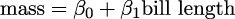
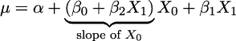
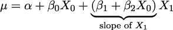

# 第六章

使用 Bambi 建模

> 一件好工具能改善你的工作方式，一件伟大的工具能改善你的思维方式。——Jeff Duntemann

在*第四章*中，我们描述了线性回归模型的基本成分以及如何将其推广以更好地适应我们的需求。在这一章中，我们将继续学习线性模型，但这次，我们将使用 Bambi [Capretto et al., 2022]，一个基于 PyMC 构建的高层贝叶斯模型构建接口。Bambi 旨在使拟合线性模型，包括分层模型，变得极其简单。我们将看到 Bambi 的领域不仅限于线性模型。

我们将学习以下内容：

+   使用 Bambi 构建并拟合模型

+   使用 Bambi 分析结果

+   多项式回归与样条函数

+   分布模型

+   分类预测变量

+   交互作用

+   使用 Kulprit 进行变量选择

## 6.1 一种语法解决所有问题

PyMC 有一个非常简单而富有表现力的语法，它允许我们构建任意模型。这通常是一个福音，但有时也可能成为负担。Bambi 则专注于回归模型，这种限制使得语法和功能更加专注，正如我们将看到的那样。

Bambi 使用了类似许多 R 包（如 nlme、lme4 和 brms）所用的 Wilkinson 公式语法。假设`data`是一个像*表格 6.1*中展示的那样的 pandas DataFrame。

|  | *y* | *x* | *z* | *g* |
| --- | --- | --- | --- | --- |
| 0 | -0.633494 | -0.196436 | -0.355148 | A 组 |
| 1 | 2.32684 | 0.0163941 | -1.22847 | B 组 |
| 2 | 0.999604 | 0.107602 | -0.391528 | C 组 |
| 3 | -0.119111 | 0.804268 | 0.967253 | A 组 |
| 4 | 2.07504 | 0.991417 | 0.590832 | B 组 |
| 5 | -0.412135 | 0.691132 | -2.13044 | C 组 |

**表格 6.1**：一个示例 pandas DataFrame

使用这些数据，我们想要构建一个从`x`预测`y`的线性模型。使用 PyMC，我们会做类似以下代码块中的模型：

**代码 6.1**

```py
with pm.Model() as lm: 
    Intercept = pm.Normal("Intercept", 0, 1) 
    x = pm.Normal("x", 0, 1) 
    y_sigma = pm.HalfNormal("sigma", 1) 
    y_mean = Intercept + x * data["x"] 
    y = pm.Normal("y", y_mean, y_sigma, observed=data["y"])
```

Bambi 使用的公式语法让我们可以更紧凑地定义一个等效的模型：

**代码 6.2**

```py
a_model = bmb.Model("y ∼ x", data)
```

在波浪符号（∼）的左侧是因变量，右侧是自变量（们）。通过这种语法，我们只是指定了均值（在 PyMC 模型`lm`中的*μ*）。默认情况下，Bambi 假设似然函数是高斯分布；你可以通过`family`参数来更改这一点。公式语法并没有指定先验分布，只是描述了因变量和自变量之间的关系。Bambi 会自动为我们定义（非常）弱的信息先验。我们可以通过打印 Bambi 模型来获取更多信息。如果你打印`a_model`，你应该会看到类似如下的内容：

```py
    Formula: y ~ x      Family: gaussian          Link: mu = identity  Observations: 117      Priors:  target = mu      Common-level effects          Intercept ~ Normal(mu: 0.02, sigma: 2.8414)          x ~ Normal(mu: 0.0, sigma: 3.1104)        Auxiliary parameters          sigma ~ HalfStudentT(nu: 4.0, sigma: 1.1348)
```

第一行显示了我们用来定义模型的公式，第二行是似然函数。第三行是链接函数。然后我们有用于拟合模型的观测数量，接下来告诉我们我们正在线性建模高斯的参数`mu`。输出的后半部分显示了模型结构：共同水平效应，在本例中是截距(`Intercept`)和斜率(`x`)，以及辅助参数，即所有非线性建模的参数，本例中是高斯标准差。

您可以通过将字典传递给`bmb.Model`的`priors`参数来覆盖默认先验分布。例如，如果我们想为变量`x`的系数和辅助参数`sigma`定义自定义先验分布，我们可以这样做：

**代码 6.3**

```py
priors = {"x": bmb.Prior("HalfNormal", sigma=3), 
          "sigma": bmb.Prior("Gamma",  mu=1, sigma=2), 
          } 
a_model_wcp = bmb.Model("y ∼ x", data, priors=priors)
```

结果，我们将得到以下模型规范：

```py
       Formula: y ~ x          Family: gaussian            Link: mu = identity    Observations: 117          Priors:      target = mu          Common-level effects              Intercept ~ Normal(mu: 0.02, sigma: 2.837)              x ~ HalfNormal(sigma: 3.0)            Auxiliary parameters              sigma ~ Gamma(mu: 1.0, sigma: 2.0)
```

如果您想从模型中省略截距，可以这样做：

代码 6.4：

```py
no_intercept_model = bmb.Model("y ∼ 0 + x", data)
```

或者甚至这样做：

代码 6.5：

```py
no_intercept_model = bmb.Model("y ∼ -1 + x", data)
```

打印模型`no_intercept_model`，您会看到截距不再存在。

如果我们想要包含更多变量怎么办？我们可以这样做：

**代码 6.6**

```py
model_2 = bmb.Model("y ∼ x + z", data)
```

我们还可以包含组级效应（层次结构）；例如，如果我们想要使用变量`g`来部分汇总`x`的估计值，我们可以这样做：

**代码 6.7**

```py
model_h = bmb.Model("y ∼ x + z + (x | g)", data)
```

我们可以在*图 6.1*中看到这个模型的视觉表示。注意变量`1|g_offset`和`x|g_offset`。默认情况下，Bambi 拟合一个非居中的分层模型；您可以通过参数`noncentered`来更改这一点。


**图 6.1**：`model_h`的视觉表示

公式语法非常简单，但也非常强大。我们只是初步展示了可以使用它做什么。如果您想深入了解，可以查看公式文档 [`bambinos.github.io/formulae/`](https://bambinos.github.io/formulae/)。 formulae 是负责解析威尔金森公式用于 Bambi 的 Python 包。

## 6.2 自行车模型，Bambi 版本

我们将首先使用自行车模型来说明如何使用 Bambi，该模型来自*第 4*章。我们可以通过以下方式加载数据：

**代码 6.8**

```py
bikes = pd.read_csv("data/bikes.csv")
```

现在我们可以构建和拟合模型：

**代码 6.9**

```py
model_t = bmb.Model("rented ∼ temperature", bikes, family="negativebinomial") 
idata_t = model_t.fit()
```

*图 6.2*展示了模型的视觉表示。如果您想要直观地检查先验分布，可以使用`model.plot_priors()`：


**图 6.2**：用命令`model.graph()`计算的自行车模型的视觉表示

现在让我们绘制后验均值和后验预测分布（预测）。为了使图表看起来漂亮，省略了一些细节，做这些操作的代码是：

**代码 6.10**

```py
_, axes = plt.subplots(1, 2, sharey=True, figsize=(12, 4)) 
bmb.interpret.plot_predictions(model_t, idata_t, 
                               "temperature", ax=axes[0]) 
bmb.interpret.plot_predictions(model_t, idata_t, 
                               "temperature", pps=True, ax=axes[1])
```

`plot_predictions` 是 Bambi 子模块 `interpret` 中的一个函数。这个函数通过绘制条件调整预测，帮助分析回归模型，展示（条件）响应分布中的某个参数如何随（某些）插值的解释变量变化。我们可以在*图 6.3*中看到这段代码的结果。左侧面板显示后验均值和 94% HDI，而右侧面板显示后验预测分布（租用自行车的预测分布）。请注意，预测的不确定性远大于均值的不确定性（`pps=False`）。这是因为后验预测分布考虑了模型参数的不确定性以及数据的不确定性，而均值的后验分布仅考虑了截距和斜率参数的不确定性。


**图 6.3**：自行车模型的后验均值和后验预测分布

当我们有多个解释变量时，`plot_cap` 的实用性变得更加明显。例如，假设我们拟合一个模型，使用温度和湿度来预测租赁的自行车数量：

**代码 6.11**

```py
model_th = bmb.Model("rented ∼ temperature + humidity", bikes, 
                     family="negativebinomial") 

idata_th = model_th.fit() 

bmb.interpret.plot_predictions(model_th, idata_th, ["temperature", "humidity"], 
                               subplot_kwargs={"group":None, "panel":"humidity"})
```

在*图 6.4*中，我们可以看到五个面板，每个面板展示了在不同湿度值下，租赁自行车数量随温度变化的情况。正如你所看到的，租赁的自行车数量随温度上升而增加，但在湿度较低时，斜率更大。


**图 6.4**：带有温度和湿度的自行车模型的后验均值

## 6.3 多项式回归

使用线性回归模型拟合曲线的一种方法是构建一个多项式，像这样：


我们称*m*为多项式的次数。

有两点需要注意。首先，多项式回归仍然是线性回归；线性是指系数（*β*），而不是变量（*x*）。第二点需要注意的是，我们正在凭空创建新变量。唯一被观测到的变量是`x`，其余的只是`x`的幂。通过观察到的变量创造新变量是回归中完全有效的“技巧”；有时这种变换可以通过理论来解释或说明（比如取婴儿身长的平方根），但有时它仅仅是为了拟合曲线。多项式的直观理解是，对于给定的`x`值，阶数越高的多项式，曲线的灵活性越强。1 阶多项式是直线，2 阶多项式是可以向上或向下的曲线，3 阶多项式是可以先上升再下降的曲线（或反之），以此类推。注意我说的是“可以”，因为如果我们有一个 3 阶多项式，比如 *β*[0] + *β*[1]*x* + *β*[2]*x*² + *β*[3]*x*³，但系数*β*[2]和*β*[3]是 0（或几乎为 0），那么曲线就会是一条直线。

使用 Bambi 定义多项式回归有两种方式。我们可以写出*原始*多项式：

**代码 6.12**

```py
"y ∼ x + I(x ** 2) + I(x ** 3) + I(x ** 4)"
```

在这里，我们使用恒等函数`I()`来明确表示我们希望将*x*提升到某个幂次。我们需要这样做，因为`**`操作符在 Bambi 中有特殊的含义。如果我们使用这种语法，实际上是在告诉 Bambi 将*y*的均值建模为 *α* + *β*[0]*x* + *β*[0]*x*² + *β*[0]*x*³ + *β*[0]*x*⁴。

或者，我们可以写：

**代码 6.13**

```py
"y ∼ poly(x, 4)"
```

这也会生成一个 4 阶的多项式，但多项式项之间是正交的，这意味着项之间的相关性被降低了。不深入数学细节，这至少有两个重要的结果与*标准*多项式相比。首先，估计可能在数值上更稳定；其次，系数的解释方式不同。在`标准`多项式回归中，系数可能很难解释，因为改变一个系数的值会影响整个多项式。相比之下，正交多项式可以让你更清晰地解释每个项的影响，因为它们彼此独立。尽管系数的解释不同，但其他结果保持不变。例如，使用这两种方法你应该得到相同的预测结果。

让我们构建一个 4 阶的正交多项式来拟合自行车数据。在这个例子中，我们将使用`hour`变量：

**代码 6.14**

```py
model_poly4 = bmb.Model("rented ∼ poly(temperature, degree=4)", bikes, 
                       family="negativebinomial") 
idata_poly4 = model_poly4.fit()
```

*图 6.5* 显示了后验均值和后验预测分布。在第一行，你将看到一个 1 阶的多项式，它相当于一个线性模型。在第二行，你将看到一个 4 阶的多项式。


**图 6.5**：温度和湿度下的自行车模型的后验均值和后验预测分布

多项式的一个问题是它们作用*全局*。当我们应用一个阶数为*m*的多项式时，我们实际上是在说自变量与因变量之间的关系在整个数据集中都是阶数*m*。当数据的不同区域需要不同灵活性时，这可能会造成问题。例如，这可能导致曲线过于灵活。随着阶数的增加，拟合变得更加敏感于数据点的移除，或者等同于对未来数据的加入。换句话说，随着阶数的增加，模型更容易发生过拟合。贝叶斯多项式回归通常较少遭遇这种“过度”灵活性，因为我们通常不使用平坦的先验，并且我们不会计算单一的系数集，而是计算整个后验分布。不过，我们还是可以做得更好。

## 6.4 样条曲线

一般来说，写出非常灵活的模型的方法是将函数*B*[*m*]应用于*X*[*m*]，然后将它们与系数*β*[*m*]相乘：


我们可以自由选择*B*[*m*]，例如，我们可以选择多项式。但我们也可以选择其他函数。一种常见的选择是使用 B 样条；我们不打算讨论它们的定义，但可以将它们视为一种创建平滑曲线的方式，使得我们在获得像多项式一样的灵活性时，过拟合的可能性较小。我们通过使用分段多项式来实现这一点，即将多项式限制在仅影响数据的一部分的区域内。*图 6.6* 显示了逐步增加阶数的分段多项式的三个示例。虚线垂直线表示“节点”，它们是用于限制区域的点，虚灰线表示我们要逼近的函数，黑线表示分段多项式。


**图 6.6**：逐步增加阶数的分段多项式

*图 6.7* 显示了 1 阶和 3 阶样条的示例；底部的点表示“节点”，虚线表示 B 样条。在顶部，我们展示了所有具有相等权重的 B 样条；我们使用灰度来突出显示我们有多个 B 样条。在底部面板中，每个 B 样条的权重不同（我们通过*β*[*m*]系数对它们进行加权）；如果我们对加权后的 B 样条进行求和，最终得到的黑线就是结果。这条黑线通常被称为“样条曲线”。我们可以使用贝叶斯统计来找到 B 样条的适当权重。


**图 6.7**：1 阶（分段线性）或 3 阶（立方样条）的 B 样条及其结果样条曲线。

我们可以通过使用`bs`函数，在 Bambi 中使用 B 样条。例如，让我们对自行车数据拟合一个 3 阶的样条曲线：

**代码 6.15**

```py
num_knots = 6 
knots = np.linspace(0, 23, num_knots+2)[1:-1] 
model_spline = bmb.Model("rented ∼ bs(hour, degree=3, knots=knots)", bikes, 
                         family="negativebinomial") 
idata_spline = model_spline.fit()
```

*图 6.8* 显示了租赁自行车数量在深夜时最低。然后有一个增加，可能是因为人们醒来去上班、上学或做其他活动。我们在大约第 8 小时左右有一个第一个高峰，然后略微下降，接着在大约第 18 小时出现第二个高峰，可能是因为人们下班回家，之后出现稳定的下降。注意，曲线并不是非常平滑；这并不是因为样条模型的原因，而是因为数据的原因。我们的测量是在离散的时间点（每小时）进行的。


**图 6.8**：样条模型的后验均值

在处理样条时，我们必须做出一个重要的决策，那就是确定结点的数量和位置。这可能是一个相当令人头疼的任务，因为最佳的结点数量及其间距并不立刻显现出来。一个有用的建议是考虑基于分位数而非均匀分布来确定结点的位置——像这样 `knots = np.quantile(bikes.hour, np.linspace(0, 1, num_knots))`。通过这样做，我们会在数据量较大的区域放置更多的结点，而在数据量较少的区域放置较少的结点。这样可以得到一个更具适应性的近似，从而有效地捕捉数据点密度较高区域的变化。此外，我们可能希望尝试使用不同数量和位置的结点来拟合样条，然后评估结果，使用诸如 LOO 等工具，就像我们在*第五章*中看到的那样。

## 6.5 分布模型

我们之前看到，可以使用线性模型来表示均值（或位置参数）以外的其他参数。例如，我们可以为高斯分布的均值和标准差分别使用线性模型。这些模型通常被称为分布模型。分布模型的语法非常相似；我们只需要为我们想要建模的辅助参数添加一行。例如，高斯分布的*σ*，或负二项分布的*α*。

现在让我们重现*第四章*中的一个例子——婴儿示例：

**代码 6.16**

```py
formula = bmb.Formula( 
    "length ∼ np.sqrt(month)", 
    "sigma ∼ month" 
) 
model_dis = bmb.Model(formula, babies) 
idata_dis = model_dis.fit()
```

*图 6.9* 显示了 `model_dis`（变化的 sigma）和常数 sigma 模型的后验分布值。我们可以看到，当 sigma 允许变化时，得到的值既低于也高于常数 sigma 的估计值，这意味着当我们不允许 sigma 改变时，我们会低估或高估这个参数。


**图 6.9**：婴儿数据的常数与变化的 sigma

*图 6.10* 显示了 `model_dis` 的后验拟合。注意，模型能够捕捉到婴儿成长过程中变化的变异性。这个图与*图 4.13*非常相似。


**图 6.10**：`model_dis`的后验拟合

在使用 PyMC 时，我们看到从后验预测分布中进行采样时，需要定义“Xs”作为`可变数据`，然后在计算后验预测分布之前更新该变量。而在 Bambi 中，这不需要。我们可以使用`predict`方法，通过将新值传递给`data`参数来预测新值。例如，让我们预测一只小企鹅在 0.5 个月（15 天）时的体长：

**代码 6.17**

```py
model_dis.predict(idata_dis, kind="pps", data=pd.DataFrame({"month":[0.5]}))
```

## 6.6 类别预测变量

类别变量表示不同的组或类别，这些类别只能从有限的集合中取值。通常，这些值是标签或名称，本身不具备数值意义。以下是一些例子：

+   政治立场：保守派、自由派或进步派。

+   性别：女性或男性。

+   客户满意度：非常不满意、不满意、中立、满意或非常满意。

线性回归模型可以轻松地处理类别变量；我们只需要将类别编码为数字。可以通过几种方式做到这一点，Bambi 可以轻松地为我们处理这些细节。真正的难点在于结果的解释，我们将在接下来的两节中深入探讨。

### 6.6.1 类别企鹅

对于当前的例子，我们将使用 palmerpenguins 数据集，Horst 等人[2020]，该数据集包含 344 个观测值和 8 个变量。目前，我们关心的是将企鹅的体重建模为喙长的函数。预计随着喙长的增加，企鹅的体重也会增加。本例的新颖之处在于，我们将考虑类别变量`species`。在这个数据集中，物种变量有 3 个类别或级别，分别是 Adelie、Chinstrap 和 Gentoo。*图 6.11* 显示了我们要建模的变量的散点图。


**图 6.11**：3 种企鹅的喙长与体重的关系

让我们加载数据并拟合模型：

**代码 6.18**

```py
penguins = pd.read_csv("data/penguins.csv").dropna() 

model_p = bmb.Model("body_mass ∼ bill_length + species", data=penguins) 
idata_p = model_p.fit()
```

请注意，定义 Bambi 模型中的类别变量时没有特殊的语法。Bambi 可以自动检测并处理它们。

*图 6.12* 显示了`model_p`的森林图。注意到什么意外情况了吗？Adelie 没有后验值。这不是错误。默认情况下，Bambi 将具有 N 个级别（3 个物种）的类别变量编码为 N-1 个虚拟变量（2 个物种）。因此，物种-Chinstrap 和物种-Gentoo 的系数被建模为与基线模型的偏差：



为了更清楚地说明这一点，我们来查看几个图表。我们可以通过*图 6.12* 理解为，Chinstrap 的体重平均比 Adelie 轻 0.89。Gentoo 也是如此，不过这次我们需要在基线模型的均值上加上 0.66。


**图 6.12**: 来自 `model_p` 的森林图

你可以通过查看*图 6.13* 来验证这两个陈述的真实性。注意中间是阿德利（Adelie），下方是拟企鹅（Chinstrap，-0.89），上方是根趾企鹅（Gentoo，0.58），它们的三条线基本平行。


**图 6.13**: 来自 `model_p` 的平均样本预测

### 6.6.2 关于分层模型的关系

在*第 3* 章中，我们讨论了并对比了汇集模型和分层（或部分汇集）模型。我们在那里展示了通常情况下，我们利用数据的结构或层次。遵循该章节的逻辑，你可以认为阿德利、根趾企鹅和拟企鹅虽然是不同的物种，但都是企鹅。因此，分层建模它们的体重可能是个好主意。你这样想是正确的。那么这种模型与我们在本节中使用的模型有什么区别呢？

区分因素在于斜率和截距的微妙组成部分。在后者的情况下，斜率在三种企鹅物种中保持不变，而截距可以变化：阿德利的`Intercept + 0`，拟企鹅的`Intercept + species[Chinstrap]`，根趾企鹅的`Intercept + species[Gentoo]`。因此，该模型突出了不同的截距，同时保持了统一的斜率。

如果我们建立了层次模型 `body_mass ~(bill_length|species)`，我们将请求部分汇集的斜率和截距。如果我们建立了模型 `body_mass ~(0 + bill_length | species)`，我们将请求部分汇集的斜率和公共截距。

除了这些特定的模型外，在考虑将预测变量作为分组变量或分类预测变量使用时，通常有必要问问该变量是否包括所有可能的类别（例如所有星期的所有天，所有物种等），还是仅包括子组（某些学校或少数音乐流派）。如果我们有所有可能的类别，那么我们可能更喜欢将其建模为分类预测变量，否则建模为分组变量。

正如我们之前讨论过的，通常在决定哪一个模型最佳之前，我们会创建多个模型。*最佳*模型是与你分析目标一致、提供有意义的见解，并准确代表数据潜在模式的模型。探索多个模型，使用适当的标准（例如*第 5* 章中讨论的标准）比较它们的性能，并考虑每个模型对研究或决策过程的实际影响通常是个好主意。

## 6.7 交互作用

交互效应或统计交互效应发生在独立变量对响应的影响因另一个独立变量的值而变化时。交互作用可以发生在两个或多个变量之间。一些例子包括:

+   **教育水平和收入的影响**：较高的教育水平可能对某一性别的收入产生更强的正向影响，从而形成教育和性别之间的交互作用。

+   **药物疗效与年龄**：一种对年长者效果更好的药物，而对年轻人效果较差。

+   **运动和饮食对减重的影响**：对于做很少或不做运动的人来说，饮食对减重的影响可能较小；而对于做中等强度运动的人来说，饮食对减重的影响可能较大。

+   **作物生长的温度和湿度**：一些作物可能在高温高湿的环境中茁壮成长，而其他作物则可能在较凉爽、湿度较低的环境中表现更好。

当两个或更多变量的联合效应不等于它们单独效应的总和时，我们就有了交互作用。因此，如果我们有如下模型，我们就无法建模交互作用：


建模交互作用效应的最常见方法是将两个（或更多）变量相乘。例如，考虑以下这样的模型：


在建模交互作用效应时，通常还会包括主效应/项。

新的预测因子

将两个变量相乘可以看作是一种技巧，类似于我们在多项式回归（或对给定变量的任何变换）中使用的方法。我们不是将一个预测因子与自身相乘，而是将两个不同的预测因子相乘，得到一个新的预测因子。

在 PyMC 模型中定义两个变量之间的交互作用非常简单；我们只需要将这两个预测因子相乘，并添加一个系数。对于 Bambi 模型来说，更加简单；我们使用 `:` 运算符。为了让区别更加清晰，让我们看看一个有交互作用和没有交互作用的模型示例：

**代码 6.19**

```py
# No interaction 
model_noint = bmb.Model("body_mass ∼ bill_depth + bill_length", 
                        data=penguins) 

#Interaction 
model_int = bmb.Model("body_mass ∼ bill_depth + bill_length + 
                      bill_depth:bill_length", 
                      data=penguins) 

idata_noint = model_noint.fit() 
idata_int = model_int.fit()
```

我们现在使用 Bambi 的 `plot_prediction` 来比较不同 `bill_length` 值如何作为 `bill_depth` 的函数影响 `body_mass`。*图 6.14* 显示了结果。我们为 `bill_depth` 在 5 个固定的 `bill_length` 值下计算了平均回归拟合。左侧是 `model_noint`（无交互作用）结果，右侧是 `model_int`（有交互作用）结果。我们可以看到，当没有交互作用时，`bill_depth` 的拟合曲线在不同的 `bill_length` 水平上是平行的。相反，当存在交互作用时，这些曲线不再平行，正因为 `bill_depth` 的变化对 `body_mass` 变化的影响不再是常数，而是受到 `bill_length` 值的调节。


**图 6.14**：`model_noint`（左）和 `model_int`（右）的样本内平均预测

如果你生成了像*图 6.14* 这样的图，但不是固定 `bill_length`，而是决定固定 `bill_depth`，你将观察到类似的行为。

在本书的 GitHub 仓库中（[`github.com/aloctavodia/BAP3`](https://github.com/aloctavodia/BAP3)），你将找到文件 `interactions.ipynb`。这个脚本生成一个 3D 图形，我希望它能帮助你建立关于添加交互项时我们所做工作的直觉。如果你运行它，你会看到，当没有交互项时，我们拟合的是一个 2D 平面，一张像纸一样的平坦表面。但是，当添加交互项时，你会拟合一个弯曲的表面。将 `interactions.ipynb` 的结果与 *图 6.14* 进行比较。

我们刚刚通过可视化看到，解释包含交互项的线性模型并不像解释没有交互项的线性模型那样简单。让我们从数学上来看一下。

假设我们有一个包含 2 个变量 *X*[0] 和 *X*[1] 以及它们之间的交互作用的模型：


我们可以将这个模型重写为：



或者甚至像这样：



从这个表达式中，我们可以看到：

+   交互项可以理解为线性模型中的线性模型。

+   交互作用是对称的；我们可以将其理解为 *X*[0] 作为 *X*[1] 的函数的斜率，同时也是 *X*[1] 作为 *X*[0] 的函数的斜率。这也可以从交互式图形中看到。

+   我们之前知道，*β*[0] 系数可以解释为 *μ* 对 *X*[0] 单位变化的响应量（这就是我们称之为斜率的原因）。如果我们添加一个交互项，那么只有当 *X*[1] = 0 时，这个关系才成立。试着使用交互式图形自己看看。数学上，这是真的，因为当 *X*[1] = 0 时，*β*[2]*X*[1] = 0，因此 *X*[0] 的斜率简化为 *β*[0]*X*[0]。通过对称性，同样的推理可以应用于 *β*[1]。

## 6.8 使用 Bambi 解释模型

在本章中，我们已经多次使用了 `bmb.interpret_plot_predictions`。但这并不是 Bambi 提供的唯一帮助我们理解模型的工具。另一个工具是 `bmb.interpret_plot_comparisons`。这个工具帮助我们回答这样的问题：“当我们比较某个变量的两个值时，保持其他所有值不变，预测差异是什么？”

我们使用上一节的 `model_int`，因此无需重新拟合模型。我们使用以下代码块生成 *图 6.15*：

**代码 6.20**

```py
bmb.interpret.plot_comparisons(model_int, idata_int, 
                               contrast={"bill_depth":[1.4, 1.8]}, 
                               conditional={"bill_length":[3.5, 4.5, 5.5]})
```

*图 6.15* 显示了当将假设的企鹅的 `bill_depth` 从 1.8 比较到 1.4 时，期望的差异是：

+   大约 0.8 千克，当喙长为 3.5 厘米时

+   -0.6 千克，当喙长为 4.5 厘米时

+   大约 -2 千克，当喙长为 5.5 厘米时


**图 6.15**：在 3 个固定的 `bill_length` 值下，将 `bill_depth` 从 1.8 厘米对比到 1.4 厘米

如果你希望以表格形式查看信息，可以使用函数`bmb.interpret.comparisons`，这样你将得到一个 DataFrame 而不是图表。

另一个有用的函数是`bmb.interpret_plot_slopes`，它可用于计算给定值下的“瞬时变化率”或斜率。我们使用以下代码块生成*图 6.16*：

**代码 6.21**

```py
bmb.interpret.plot_slopes(model_int, idata_int, 
                          wrt={"bill_depth":1.8}, 
                          conditional={"bill_length":[3.5, 4.5, 5.5]},
```

*图 6.16* 显示了`bill_depth`为 1.8 时的斜率：

+   ≈ 2 kg/cm，适用于鸟嘴长度为 3.5 cm 时

+   -1.4 kg/cm，适用于鸟嘴长度为 4.5 cm 时

+   ≈ -5 kg/cm，适用于鸟嘴长度为 5.5 cm 时


**图 6.16**：对于`bill_length`的三个固定值，`bill_depth`在 1.8 cm 时的斜率

如果你希望以表格形式查看信息，可以使用函数`bmb.interpret.slopes`，这样你将得到一个 DataFrame 而不是图表。

在本节中，我们仅仅触及了`bmb.interpret`模块工具的表面。这个模块是 Bambi 的一个非常有用的功能，尤其适用于含有交互作用和/或具有除恒等函数之外链接函数的模型。我强烈建议你阅读 Bambi 文档，获取更多未在此介绍的示例和细节。

## 6.9 变量选择

变量选择是指从一组潜在预测变量中识别出对模型结果最相关的变量的过程。我们进行变量选择时假设，只有一部分变量对感兴趣的结果有显著影响，而其他变量几乎没有或没有额外的价值。

构建模型时，最“贝叶斯”的做法可能是将我们可能想到的所有变量都包含在一个模型中，然后利用该模型的后验分布进行预测或了解变量之间的关系。这是最“贝叶斯”的方法，因为我们尽可能地使用数据，并在后验中纳入变量重要性的未知性。然而，比贝叶斯更“贝叶斯”并不总是最佳选择。我们在*第五章*中已经看到，即使贝叶斯因子是贝叶斯定理的直接结果，它们也可能存在问题。

当以下情况出现时，执行变量选择是一个好主意：

+   我们需要降低测量成本。例如，在医学中，我们可能有资金和资源进行一项试点研究，测量 200 名患者的 30 个变量。但是我们无法对数千人做同样的事情。或者，我们可能能在开阔地带放置大量传感器来更好地建模作物收益，但我们无法将其扩展到一个国家的规模。降低成本并不总是意味着金钱或时间；在与人类或其他动物工作时，减少疼痛和不适也很重要。例如，我们可能想预测患者发生心脏病发作的风险。我们可以通过测量很多变量来做到这一点，但我们也可以通过测量少量更不具侵入性的变量来实现。

+   我们希望减少计算成本。这对于小型和简单模型来说不是问题，但当我们有大量变量、大量数据或两者兼有时，计算成本可能会变得无法承受。

+   我们寻求更好地理解重要的关联结构。也就是说，我们有兴趣理解哪些变量提供更好的预测。需要明确的是，我们不是在讨论因果关系。虽然统计模型，尤其是广义线性模型（GLMS），可以用来推断因果关系，但这需要额外的步骤和假设。在本书中，我们不讨论如何进行因果推断。如果你想要一个非常基础的因果推断介绍，请参见这个视频：[`www.youtube.com/watch?v=gV6wzTk3o1U`](https://www.youtube.com/watch?v=gV6wzTk3o1U)。如果你更加严肃，您可以查阅 Scott Cunningham 的在线书籍《因果推断：混音带》[Cunningham，2021] [`mixtape.scunning.com/`](https://mixtape.scunning.com/)。

+   当我们希望获得一个对数据生成分布变化更具韧性的模型时，我们可以将变量选择视为一种使模型对不具代表性数据更加稳健的方法。

### 6.9.1 投影预测推断

有许多方法可以执行变量选择。在本节中，我们将重点介绍其中一种叫做投影预测推断的方法[Piironen 等人，2020，McLatchie 等人，2023]。我们专注于这种方法的主要原因是，它在广泛的领域中表现出了非常好的性能。

投影预测推断的主要步骤如下：

1.  生成一个参考模型，即包含所有你认为可能相关和/或你能够测量的变量的模型。

1.  生成一组子模型，即仅包含参考模型中某些子集变量的模型。

1.  将参考模型的后验分布投影到子模型中。

1.  选择一个预测结果与参考模型足够接近的最小模型。

在进行投影预测推断时，我们只需要执行一次贝叶斯推断，仅针对参考模型。对于子模型，后验分布是通过投影得到的。不深入讨论技术细节，投影过程是通过某种方式找到子模型的参数，使得子模型的预测尽可能接近参考模型的预测。这个投影过程可以以计算效率高的方式进行，因此估计后验分布的成本比使用 MCMC 方法低几个数量级。这一点很重要，因为当我们增加参考模型中的变量数时，可能的子模型总数会呈指数增长。考虑一下我们需要评估所有可能的组合，不重复变量。例如，假设我们有四个变量（*A*，*B*，*C* 和 *D*），需要评估 7 个模型，分别是 *A*，*B*，*C*，*AB*，*BC*，*AC* 和参考模型 *ABC*。七个模型听起来不多，但当我们增加到 8 个变量时，我们将需要评估 92 个不同的模型。看到没有，我们将变量数翻倍，模型的数量却增加了 10 倍以上！

当然，减少需要探索的子模型总数是有办法的。例如，我们可以使用某些廉价方法筛选出最有前景的变量，然后只对这些变量进行投影预测推断。另一个替代方案被称为前向搜索；也就是说，我们首先拟合与我们所拥有的变量数量相等的模型。然后选择一个模型/变量，即生成与参考模型的预测最接近的那个模型。接着，我们生成所有包含上一阶段选择变量的两个变量子模型，依此类推。如果我们对一个包含 8 个变量的参考模型进行这种前向程序，而不是 92 个不同的模型，我们只需要评估 36 个模型。

另一个在进行投影预测推断时需要考虑的因素是，我们只为参考模型提供了先验分布。子模型没有明确的先验分布；它们只是通过投影过程继承了参考模型的先验分布。

投影预测在实践中有效的原因之一，正是得益于参考模型的使用。通过将子模型拟合到参考模型在样本中的预测，而不是拟合观察到的数据，我们能够过滤掉数据中的噪声。这有助于将更相关的变量与不太相关的变量区分开。另一个因素是，在选择子模型时使用了交叉验证，如在*第五章*中所讨论的那样。

### 6.9.2 使用 Kulprit 进行投影预测

Kulprit 是一个用于投影预测推断的 Python 包。它与 Bambi 配合使用，我们可以传递一个用 Bambi 构建的参考模型，Kulprit 会为我们完成所有复杂的工作。为了说明如何使用 Kulprit，我们将使用体脂数据集 [Penrose et al., 1985]。这个数据集包含了 251 个个体的测量数据，包括他们的年龄、体重、身高、腹围等。我们的目的是预测体脂百分比（通过 `siri` 变量估算）。由于获得准确的体脂测量既昂贵又可能对患者造成困扰，我们希望在减少测量数量的同时保持 `siri` 的良好预测准确性。原始数据集包含 13 个变量；为了简化示例，我已经预先选择了 6 个变量。

我们首先需要像往常一样定义并拟合一个 Bambi 模型。我们必须确保包含参数 `idata_kwargs=’log_likelihood’:True`。Kulprit 内部会计算 ELPD，正如我们在 *第五章* 中讨论的那样，我们需要在 InferenceData 对象中包含对数似然值，以便能够估算 ELPD：

**代码 6.22**

```py
model = bmb.Model("siri ∼ age + weight + height + abdomen + thigh + wrist", 
                  data=body) 
idata = model.fit(idata_kwargs={'log_likelihood': True})
```

完成这些后，我们就可以开始使用 Kulprit 了。首先，我们需要调用 `ProjectionPredictive` 类，并传入 Bambi 模型和从该模型拟合得到的 idata。然后我们让 Kulprit 执行搜索；默认情况下，它会进行前向搜索：

代码 6.23：

```py
ppi = kpt.ProjectionPredictive(model, idata) 
ppi.search()
```

搜索完成后，我们可以让 Kulprit 根据 ELPD 比较各个子模型。子模型会按 ELPD 从低到高排序，如 *图 6.17* 所示。在 x 轴上，我们有子模型的大小，即变量的数量；我们从零开始，因为我们包含了仅有截距的模型。虚线灰色线表示参考模型的 ELPD。


**图 6.17**：使用 Kulprit 得到的子模型比较。由 `ppi.plot_compare` 生成。

然后我们可以看到，大小为 3 的子模型几乎与参考模型等效。但具体包含了哪些变量呢？如果我们在执行搜索后打印 `ppi` 对象，我们将得到一个子模型公式的有序列表，列表顺序与通过命令 `ppi.plot_compare` 得到的图中的顺序相匹配：

**代码 6.24**

```py
print(ppi)
```

```py
  0 siri ~ 1
  1 siri ~ abdomen
  2 siri ~ abdomen + wrist
  3 siri ~ abdomen + wrist + height
  4 siri ~ abdomen + wrist + height + age
  5 siri ~ abdomen + wrist + height + age + weight
  6 siri ~ abdomen + wrist + height + age + weight + thigh
```

然后我们可以看到，大小为 3 的模型是包含变量 `abdomen`（腹部）、`wrist`（手腕）和 `height`（身高）的模型。这个结果告诉我们，如果我们想选择一个比参考模型更少变量的模型，但预测精度相似，那么这是一个不错的选择。根据不同的情境，其他子模型也可能是一个好选择。例如，我们可能会认为大小为 2 和 3 的子模型之间的差异非常小。因此，我们可能愿意牺牲一些精度来选择一个更小的模型。对于这个例子来说，测量患者身高可能不会带来太大问题，但在其他场景下，添加第三个变量可能会很昂贵、麻烦、危险等等。

另一种解释 *图 6.17* 的方式是注意到大小为 3 或更大的模型的 ELPD 值是非常接近的。可能的情况是，如果我们使用稍微不同的数据集，甚至是相同的数据集，但增加更多的后验样本，我们可能会得到一个略有不同的顺序。因此，如果我们有许多大小为 3 的模型，它们可能具有相同的实际预测精度，我们可以通过外部因素来为选择第三个变量提供理由，比如它的测量是否容易或便宜，或者哪个对患者来说更不痛苦等等。总之，和其他统计工具一样，结果不应盲目接受，而是要结合上下文来解读；你应该有最终的决定权，工具应帮助你做出决策。

好的，假设我们确实对 Kulprit 计算的大小为 3 的子模型感兴趣；我们可以通过以下方式获取它：

**代码 6.25**

```py
submodel = ppi.project(3)
```

从 `submodel` 对象中，我们可以检索一些有用的信息，比如 Bambi 的模型 `submodel.model` 或 InferenceData 对象 `submodel.idata`。

对于解释这两个对象，有一点需要注意——`submodel.model` 是一个由公式生成的 Bambi 模型。因此，它的先验将是 Bambi 自动计算的那些。但 Kulprit 计算的后验，存储在 `submodel.idata.posterior` 中，并非直接来自该模型。相反，它是使用投影预测推理（而非 MCMC）计算的，先验是在投影步骤中隐式继承的（而非显式先验）。*图 6.18* 展示了这种投影后的后验。


**图 6.18**：大小为 3 的子模型的投影后验

我们可以信任预测的后验分布吗？在非常一般的条件下，这应该是一个有效的后验分布，因此我们可以信任它。它应该足够提供参数值的大致概念，当然，这对于变量选择也是足够的。缺乏显式的先验可能会使模型的解释更加困难，但如果你只关心预测，这应该不是问题。当然，你始终可以使用 Bambi（或 PyMC）像往常一样显式地计算完整的后验，并在需要时自己指定先验。*图 6.19* 显示了通过 Bambi（真实）计算的子模型后验的森林图和通过 Kulprit（预测）近似的子模型后验。请注意，这里有两个可能的差异来源：MCMC 方法与投影预测方法之间的内在差异，以及两个模型的不同先验。


**图 6.19**：通过 Kulprit 计算的子模型（`siri ~abdomen + wrist + height`）后验与通过 Bambi 计算的参考模型后验的比较；未在两个模型中共享的变量已被省略

Kulprit 是一个非常新的库，将不断发展，用户可以期待不久后会有大量的增强和改进。如果 Kulprit 引起了你的兴趣，你可以通过报告问题、提出建议、改进文档或参与其代码库的开发来帮助其发展，网址是[`github.com/bambinos/kulprit`](https://github.com/bambinos/kulprit)。

## 6.10 小结

在本章中，我们已经看到如何使用 Bambi 拟合贝叶斯模型，作为纯 PyMC 模型的替代方案。我们从最简单的情况开始，一个包含单一预测变量的模型，然后过渡到更复杂的模型，包括多项式、样条、分布模型、包含分类预测变量的模型以及交互作用模型。

Bambi 的主要优势在于它非常易于使用；它与 R 的`formula`语法非常相似。内部，Bambi 定义了弱信息量的先验，并处理了复杂模型中可能繁琐的细节。主要的缺点是它不像 PyMC 那样灵活。Bambi 能够处理的模型范围是 PyMC 模型范围的一个小子集。不过，这个子集包含了工业界和学术界中最常用的许多统计模型。Bambi 的优势不仅仅在于轻松构建模型，还在于更容易的模型解释。在本章中，我们已经看到如何使用 Bambi 的`interpret`模块更好地理解我们拟合的模型。最后，我们还看到了如何使用 Kulprit 进行投影预测推断并进行变量选择。投影预测推断为变量选择提供了一种有前景的方法，而 Kulprit 则是一种有前景的 Python 化方式。

## 6.11 练习

1.  阅读 Bambi 文档（[`bambinos.github.io/bambi/`](https://bambinos.github.io/bambi/)）并学习如何指定自定义先验。

1.  应用前一点学到的内容，为 `model_t` 的斜率指定一个 HalfNormal 先验分布。

1.  定义一个类似 `model_poly4` 的模型，但使用 `raw` 多项式，比较两个模型的系数和均值拟合效果。

1.  用你自己的话解释什么是分布模型。

1.  将 `model_spline` 扩展为一个分布模型。使用另一个样条来建模 NegativeBinomial 家族的 *α* 参数。

1.  创建一个名为 `model_p2` 的模型，用于预测 `body_mass`，其预测变量为 `bill_length`、`bill_depth`、`flipper_length` 和 `species`。

1.  使用 LOO 方法比较前一点中的模型和 `model_p`。

1.  使用 `interpret` 模块中的函数来解释 `model_p2`，并同时使用图表和表格。

## 加入我们的社区 Discord 空间

加入我们的 Discord 社区，与志同道合的人一起学习，并与超过 5000 名成员共同成长，访问链接：[`packt.link/bayesian`](https://packt.link/bayesian)


