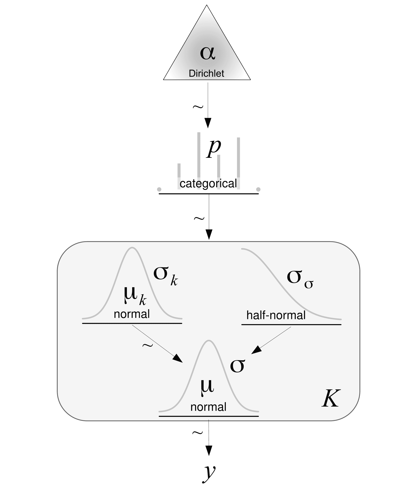
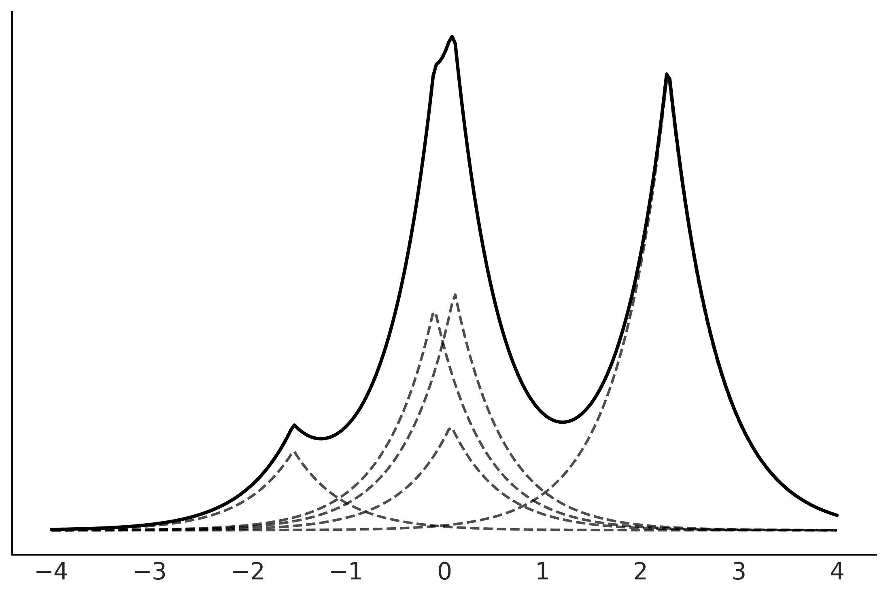

# 第七章

混合模型

> …父亲有狮子的形态，母亲有蚂蚁的形态；父亲吃肉，母亲吃草。于是他们孕育了蚂蚁狮子…——《虚构生物志》

拉普拉塔河（也称为拉普拉塔河或拉普拉塔江）是地球上最宽的河流，也是阿根廷和乌拉圭之间的自然边界。在 19 世纪末，这条河沿岸的港口区是土著人、非洲人（大多数是奴隶）和欧洲移民的混居地。这种文化交汇的一个结果是，欧洲音乐如华尔兹和马祖卡与非洲坎东贝舞曲和阿根廷米隆加（后者又是非洲裔美国节奏的混合）相融合，创造了我们现在所称的探戈舞和音乐。

将先前存在的元素混合在一起是创造新事物的好方法，这不仅仅是在音乐领域。在统计学中，混合模型是建模的常见方法之一。这些模型通过混合更简单的分布来获得更复杂的分布。例如，我们可以结合两个高斯分布来描述双峰分布，或者结合多个高斯分布来描述任意分布。尽管使用高斯分布非常普遍，但原则上我们可以混合任何我们想要的分布族。混合模型用于不同的目的，例如直接建模子人群，或者作为处理无法用简单分布描述的复杂分布的有用技巧。

本章将涵盖以下主题：

+   有限混合模型

+   零膨胀模型和障碍模型

+   无限混合模型

+   连续混合模型

## 7.1 理解混合模型

当总体人群是不同子人群的组合时，自然会出现混合模型。一个常见的例子是给定成人群体中的身高分布，它可以被描述为女性和男性子人群的混合。另一个经典的例子是手写数字的聚类。在这种情况下，期望有 10 个子人群是非常合理的，至少在十进制系统中是这样！如果我们知道每个观察值属于哪个子人群，通常来说，利用这些信息将每个子人群建模为一个独立的群体是一个好主意。然而，当我们无法直接访问这些信息时，混合模型就显得特别有用。

分布的混合

许多数据集无法用单一的概率分布准确描述，但可以通过将其描述为多种分布的混合来进行建模。假设数据来自混合分布的模型被称为混合模型。

在构建混合模型时，并不一定需要相信我们正在描述数据中的真实子群体。混合模型也可以作为一种统计技巧，为我们的工具箱增添灵活性。以高斯分布为例，我们可以将其作为许多单峰且近似对称分布的合理近似。那么，对于多峰或偏斜分布呢？我们能用高斯分布来建模吗？当然可以，如果我们使用高斯混合。

在高斯混合模型中，每个成分都是一个均值不同的高斯分布，并且通常（但不一定）具有不同的标准差。通过组合高斯分布，我们可以为我们的模型增添灵活性，并拟合复杂的数据分布。事实上，我们可以通过适当组合高斯分布来逼近几乎任何我们想要的分布。分布的具体数量将取决于近似的准确度和数据的细节。实际上，我们在本书中的许多图表中已经使用了这个思想。核密度估计（KDE）技术就是这一思想的非贝叶斯实现。从概念上讲，当我们调用 `az.plot_kde` 时，函数会在每个数据点上方放置一个固定方差的高斯分布，然后将所有单独的高斯分布求和，以逼近数据的经验分布。*图 7.1* 显示了如何将 8 个高斯分布混合以表示复杂分布的示例，就像一条蟒蛇消化一只大象，或者一个帽子，取决于你的视角。

在 *图 7.1* 中，所有高斯分布具有相同的方差，并且它们都集中在灰色的点上，这些点代表可能的未知人群中的样本点。如果你仔细观察，可能会发现两个高斯分布重叠在一起。


**图 7.1**：作为高斯混合模型的 KDE 示例

无论我们是相信子群体的存在，还是将其作为数学上的便利（甚至是介于两者之间的某种观点），混合模型通过使用分布的混合来描述数据，是为我们的模型增添灵活性的一种有效方式。

## 7.2 有限混合模型

构建混合模型的一种方法是考虑两个或更多分布的有限加权混合。然后，观察数据的概率密度是 *K* 个子群体的概率密度加权求和：


我们可以将 *w*[*i*] 解释为成分 *i* 的概率，因此其值被限制在区间 [0, 1] 内，并且它们的和需要为 1。成分 *p*(*y*|*θ*[*i*]) 通常是简单的分布，比如高斯分布或泊松分布。如果 *K* 是有限的，那么我们就得到了一个有限混合模型。为了拟合这样的模型，我们需要提供一个 *K* 值，无论是因为我们事先知道正确的值，还是因为我们能做出有根据的猜测。

从概念上讲，解决混合模型的问题，我们只需要正确地将每个数据点分配到一个成分。在一个概率模型中，我们可以通过引入一个随机变量来实现这一点，随机变量的功能是指定某个观察值被分配到哪个成分。这个变量通常被称为**潜变量**，因为我们不能直接观察到它。

对于只有两个成分的混合模型（*K* = 2），我们可以使用抛硬币问题模型作为构建模块。在该模型中，我们有两种可能的结果，并且使用伯努利分布来描述它们。由于我们不知道正面或反面的概率，我们使用 Beta 分布作为先验分布。如果我们把硬币的正面和反面换成任何两个组（或成分或类别），我们可以在得到 0 时将观察值分配到一个组，得到 1 时分配到另一个组。这一切都很好，但在混合模型中，我们可能有两个或更多组，因此我们需要使这个想法更加通用。我们可以通过注意到伯努利分布到 *K* 个结果的推广是类别分布，而 Beta 分布到更高维度的推广是狄利克雷分布来实现这一点。如果我们分配的成分是高斯分布，就像在*图 7.1* 中一样，那么*图 7.2* 显示了一个类似 Kruschke 风格的模型图。圆角框表示我们有 *K* 个成分，类别变量决定了我们用哪个成分来描述给定的数据点。请注意，只有 *μ*[*k*] 依赖于不同的成分，而 *σ*[*μ*] 和 *σ*[*σ*] 是所有成分共享的。这只是一个建模选择；如果需要，我们可以改变它，并允许其他参数依赖于每个成分。



**图 7.2**：带有高斯成分的混合模型的 Kruschke 风格图

我们将在 PyMC 中实现这个模型，但在此之前，让我介绍一下类别分布和狄利克雷分布。如果你已经熟悉这些分布，可以跳过接下来的两节，直接跳到示例部分。

### 7.2.1 类别分布

类别分布是最一般的离散分布，它由一个向量进行参数化，其中每个元素指定每个可能结果的概率。*图 7.3* 表示了类别分布的两个可能实例。点表示类别分布的值，而连续的虚线是一个视觉辅助，帮助我们轻松理解分布的*形状*：


**图 7.3**：类别分布族的两个成员。虚线只是视觉辅助。

### 7.2.2 狄利克雷分布

Dirichlet 分布存在于单纯形中，你可以将其视为一个 n 维三角形；一个 1-单纯形是一个线段，2-单纯形是一个三角形，3-单纯形是一个四面体，依此类推。为什么是单纯形？直观上，因为这个分布的输出是一个*K*维向量，其元素被限制在区间 [0,1] 内，并且它们的和为 1。正如我们所说，Dirichlet 分布是 Beta 分布的推广。因此，理解 Dirichlet 分布的一个好方法是将其与 Beta 分布进行比较。Beta 分布用于处理两种结果的问题：一种的概率是*p*，另一种的概率是 1 − *p*。正如我们所见，*p* + (1 − *p*) = 1。Beta 分布返回一个两元素向量（*p, q* = 1 − *p*），但在实际应用中，我们省略了*q*，因为一旦知道*p*的值，结果就完全确定了。如果我们要将 Beta 分布扩展到三种结果，我们需要一个三元素向量（*p, q, r*），其中每个元素都在区间 [0,1] 内，且它们的和为 1。类似于 Beta 分布，我们可以使用三个标量来对这种分布进行参数化，我们可以称它们为*α*, *β* 和 *γ*；然而，由于希腊字母只有 24 个，我们很容易就会用完它们。相反，我们可以使用一个名为*α*的*K*维向量。请注意，我们可以将 Beta 和 Dirichlet 看作是比例分布。*图 7.4*展示了当*k* = 3 时，Dirichlet 分布的 4 个成员。在顶部是概率密度函数（pdf），在底部是来自该分布的样本。


**图 7.4**：Dirichlet 分布族的四个成员

好的，现在我们已经具备了实现我们第一个混合模型的*所有组件*。

### 7.2.3 化学混合物

为了让事情更具体，我们来做一个例子。我们将使用我们在*第 2* 章中看到的化学位移数据。*图 7.5*展示了这组数据的直方图。


**图 7.5**：化学位移数据的直方图

我们可以看到，这些数据无法用像高斯这样的单一分布来准确描述，但如果我们使用多个分布，就能做到这一点，就像我们在*图 7.1*中展示的那样；也许三个或四个分布就能解决问题。虽然有充分的理论依据（我们在这里不讨论），表明这些化学位移数据来自于 40 个子群体的混合分布，但仅通过观察数据，我们似乎无法恢复出真正的群体，因为它们之间有大量的重叠。

以下代码块展示了在 PyMC 中实现两个分量的高斯混合模型：

**代码 7.1**

```py
K = 2 
with pm.Model() as model_kg: 
   p = pm.Dirichlet('p', a=np.ones(K)) 
   z = pm.Categorical('z', p=p, shape=len(cs_exp)) 
   means = pm.Normal('means', mu=cs_exp.mean(), sigma=10, shape=K) 
   sd = pm.HalfNormal('sd', sigma=10) 

   y = pm.Normal('y', mu=means[z], sigma=sd, observed=cs_exp) 
   idata_kg = pm.sample()
```

如果你运行这段代码，你会发现它非常慢，且轨迹看起来非常糟糕（参考*第十章*了解更多诊断信息）。我们能让这个模型跑得更快吗？可以，让我们看看如何操作。

在`model_kg`中，我们已经明确将潜在变量*z*包含在模型中。对这个离散变量进行采样通常会导致后验采样不良。解决这个问题的一种方法是对模型进行重新参数化，使得*z*不再是模型的显式组成部分。这种重新参数化方法叫做边缘化（marginalization）。将离散变量边缘化通常能够提高速度并改进采样。不幸的是，这需要一些数学技能，而不是每个人都具备。不过幸运的是，我们不需要自己动手，因为 PyMC 已经包含了一个`NormalMixture`分布。所以，我们可以将混合模型写成如下形式：

**代码 7.2**

```py
with pm.Model() as model_mg: 
    p = pm.Dirichlet('p', a=np.ones(K)) 
    means = pm.Normal('means', mu=cs_exp.mean(), sigma=10, shape=K) 
    sd = pm.HalfNormal('sd', sigma=5) 
    y = pm.NormalMixture('y', w=p, mu=means, sigma=sd, observed=cs_exp) 
    idata_mg = pm.sample()
```

让我们通过森林图来检查结果。*图 7.6*显示了一些有趣的现象。在进入下一个章节之前，花些时间思考一下。你能发现问题吗？我们将在下一节讨论它。


**图 7.6**：`model_mg`的均值森林图

## 7.3 混合模型的非可识别性

`means`参数的形状为 2，从*图 7.6*我们可以看到，其中一个值大约是 47，另一个接近 57.5。搞笑的是，我们有一条链说`means[0]`是 47，其他三条链说它是 57.5，`means[1]`则正好相反。因此，如果我们计算`means[0]`的均值，我们会得到一个接近 55 的值（57.5 × 3 + 47 × 1），这显然不是正确的值。我们看到的正是一个名为参数非可识别性（parameter non-identifiability）现象的例子。这是因为，从模型的角度来看，如果组件 1 的均值为 47 而组件 2 的均值为 57.5，或者反之，两种情况是等价的。在混合模型的背景下，这也被称为标签交换问题（label-switching problem）。

非可识别性

如果模型的一个或多个参数无法被唯一确定，则该统计模型是不可识别的。如果对于模型参数的多个选择，得到相同的似然函数，则该模型的参数没有被识别。可能出现的情况是数据中没有足够的信息来估计这些参数。在其他情况下，参数可能无法识别，因为模型在结构上不可识别，这意味着即使所有必要的数据都可用，参数仍然无法唯一确定。

对于混合模型，有至少两种方式可以对模型进行参数化，从而消除非可识别性问题。我们可以强制使组件按顺序排列；例如，将组件的均值按严格递增的顺序排列和/或使用信息量大的先验分布。

使用 PyMC，我们可以通过下一个代码块中的转换实现第一个选项。请注意，我们还提供了均值的初始值；任何能确保第一个均值小于第二个均值的方式都可以。

**代码 7.3**

```py
with pm.Model() as model_mgo: 
    p = pm.Dirichlet('p', a=np.ones(K)) 
    means = pm.Normal('means', mu=cs_exp.mean(), sigma=10, shape=K, 
                      transform=pm.distributions.transforms.ordered, 
                      initval=np.array([cs_exp.mean()-1, cs_exp.mean()+1])) 
    sd = pm.HalfNormal('sd', sigma=10) 
    y = pm.NormalMixture('y', w=p, mu=means, sigma=sd, observed=cs_exp) 

    idata_mgo = pm.sample()
```

让我们通过森林图检查新的结果。*图 7.7* 确认我们已解决了不可识别性问题：


**图 7.7**：`model_mgo` 的均值森林图

## 7.4 如何选择 K

有关有限混合模型的一个主要问题是如何确定成分的数量。一个经验法则是从相对较小的成分数开始，然后增加成分数来改善模型拟合度。如我们在 *第五章* 中已经知道的，模型拟合可以通过后验预测检查、ELPD 等指标以及模型者的专业知识来评估。

让我们比较 *K* = {2*,*3*,*4*,*5*} 的模型。为此，我们将拟合该模型四次，然后保存数据和模型对象以备后用：

**代码 7.4**

```py
Ks = [2, 3, 4, 5] 

models = [] 
idatas = [] 
for k in Ks: 
    with pm.Model() as model: 
        p = pm.Dirichlet('p', a=np.ones(k)) 
        means = pm.Normal('means', 
                          mu=np.linspace(cs_exp.min(), cs_exp.max(), k), 
                          sigma=cs_exp.var() / k, shape=k, 
                          transform=pm.distributions.transforms.ordered, 
                          ) 
        sd = pm.HalfNormal('sd', sigma=5) 
        y = pm.NormalMixture('y', w=p, mu=means, sigma=sd, observed=cs_exp) 
        idata = pm.sample(random_seed=123, 
                          idata_kwargs={"log_likelihood":True} 
                         ) 

        idatas.append(idata) 
        models.append(model)
```

*图 7.8* 展示了 *K* 个高斯分布的混合模型。黑色实线表示后验均值，灰色线表示后验样本。均值高斯分量使用黑色虚线表示。


**图 7.8**：不同数量高斯分布的高斯混合模型 (*K*)

从视觉效果来看，*K* = 2 太低了，但我们如何选择一个更好的值呢？正如我们在 *第五章* 中讨论过的，我们可以使用后验预测检查来评估感兴趣的测试量，并计算贝叶斯 p 值。*图 7.9* 展示了此类计算和可视化的示例。*K* = 5 是最佳解，*K* = 4 接近最佳解。


**图 7.9**：后验预测检查以选择 *K*

为了补充后验预测检查，我们可以计算使用 LOO 方法近似的 ELPD。这在 *图 7.10* 中展示。我们比较的是相同的模型，但 *K* 值不同。我们可以看到 *K* = 5 是最佳解，而 *K* = 4 也接近最佳解。这与 *图 7.9* 中显示的贝叶斯 p 值一致。


**图 7.10**：使用 LOO 进行模型选择以选择 *K*

化学位移的例子虽然简单，但展示了有限混合模型的主要思想。在这个例子中，我们使用了高斯分布，因为它们提供了一个良好的数据拟合近似。然而，如果需要，我们也可以使用非高斯分量。例如，我们可以使用：

+   **泊松混合模型**：假设你在监控每小时进入商店的顾客数量。泊松混合模型可以帮助识别顾客流量的不同模式，例如高峰时段或高峰日，通过假设数据遵循泊松分布的混合。

+   **指数混合模型**：假设你在研究某种类型的灯泡寿命。指数混合模型可以帮助识别不同寿命的灯泡群体，提示制造质量或环境因素的潜在差异。

在接下来的部分，我们将探索一种非常特殊的混合模型，这种模型涉及两个过程：一个生成零，另一个生成零或非零。

## 7.5 零膨胀和障碍模型

在计数事物时，比如道路上的汽车、天空中的星星、皮肤上的痣，或几乎任何其他事物，一个选项是不计数某个事物，也就是说得到零。零这个数字通常会由于很多原因出现；比如我们在数红色的车，但是一辆红色的车没有经过街道，或者我们错过了它。如果我们使用泊松分布或负二项分布来建模这种数据，我们会注意到模型生成的零比实际数据少。我们该如何解决这个问题呢？我们可以尝试解决模型预测零比实际观察到的少的具体原因，并将这一因素纳入模型中。但通常情况下，假设我们有两个过程的混合模型可能就足够了，而且更简单：

+   一个过程由一个离散分布建模，概率为 

+   另一个过程以概率 1 −  生成额外的零

在某些文本中，你会发现  代表额外的零，而不是 1 − 。这不是什么大问题；只需注意哪个是哪个，尤其是具体示例时。

允许生成“额外”零的分布族被称为零膨胀分布。该家族中最常见的成员包括：

+   零膨胀泊松分布

+   零膨胀负二项分布

+   零膨胀二项分布

在下一节中，我们将使用零膨胀泊松分布来解决回归问题。一旦你了解如何使用这个分布，使用零膨胀负二项分布或零膨胀二项分布将变得非常简单。

### 7.5.1 零膨胀泊松回归

为了举例说明零膨胀泊松回归模型，我们将使用来自数字研究与教育研究所的数据集（[`www.ats.ucla.edu/stat/data`](http://www.ats.ucla.edu/stat/data)）。我们有 250 组游客数据，数据包括：每组捕捉到的鱼的数量（`count`）、每组中的儿童数量（`child`）以及他们是否带了露营车到公园（`camper`）。使用这些数据，我们将建立一个模型，通过儿童和露营车变量来预测捕捉到的鱼的数量。

使用 PyMC，我们可以为这个数据编写一个模型，如下所示：

**代码 7.5**

```py
with pm.Model() as ZIP_reg: 
     = pm.Beta('', 1, 1) 
    *α* = pm.Normal('*α*', 0, 1) 
    *β* = pm.Normal('*β*', 0, 1, shape=2) 
    *θ* = pm.math.exp(*α* + *β*[0] * fish_data['child'] + *β*[1] * fish_data['camper']) 
    yl = pm.ZeroInflatedPoisson('yl', , *θ*, observed=fish_data['count']) 
    trace_ZIP_reg = pm.sample()
```

`camper` 是一个二元变量，值为 0 表示不是露营车，1 表示是露营车。表示某个属性是否存在的变量通常被称为虚拟变量或指示变量。请注意，当 `camper` 的值为 0 时，涉及 *β*[1] 的项也会变为 0，模型就会简化为一个只有一个自变量的回归模型。我们在*第六章 6* 中讨论了分类预测变量时已经提到过这一点。

结果如*图 7.11*所示。我们可以看到，孩子数量越多，捕获的鱼的数量越少。而且，带着露营车旅行的人通常会捕到更多的鱼。如果你检查 `child` 和 `camper` 的系数，你会发现我们可以得出以下结论：

+   每增加一个孩子，捕获的鱼的期望数量会减少约 ≈ 0*.*4

+   使用露营车露营会使捕获的鱼的期望数量增加约 2


**图 7.11**：捕获的鱼数作为孩子数量和是否使用露营车的函数

零膨胀模型与障碍模型密切相关，因此在零膨胀模型的概念仍然清晰的情况下学习障碍模型是非常有益的。

### 7.5.2 障碍模型

在障碍模型中，伯努利概率决定一个计数变量是否为零或大于零。如果大于零，我们认为已跨越 *障碍*，这些正值的分布是通过截断在零的分布来确定的。

在混合模型的框架下，我们可以将零膨胀模型视为零和其他某些值（可能是零或非零）的混合。而障碍模型则是零和非零的混合。因此，零膨胀模型只能增加 *P*(*x* = 0) 的概率，而对于障碍模型，概率可以变得更小或更大。

在 PyMC 和 Bambi 中可用于障碍模型的分布包括：

+   障碍 Poisson 分布

+   障碍负二项分布

+   障碍伽玛分布

+   障碍对数正态分布

为了说明障碍模型，我们将使用螯虾数据集 [Brockmann, 1996]。螯虾成对地来到海滩进行产卵仪式。此外，孤独的雄性也会来到海岸，聚集在已成对的雌雄螯虾周围，争夺受精卵的机会。这些被称为卫星雄性个体，通常会在特定的巢对附近聚集，忽略其他巢对。我们想要建立模型来预测雄性 `卫星` 的数量。我们怀疑这个数量与雌性螯虾的特征有关。作为预测变量，我们将使用螯甲的 `宽度` 和 `颜色`。螯甲是螯虾的坚硬上壳。颜色则使用从 1 到 4 的整数编码，从浅色到深色。

我们将使用 Bambi 来编码并拟合四个模型。这四个模型的主要区别在于我们将使用四种不同的似然函数或分布族，分别是 Poisson 分布、障碍 Poisson 分布、负二项分布和障碍负二项分布。模型展示在下一个代码块中：

**代码 7.6**

```py
model_crab_p = bmb.Model("satellite ∼ width + C(color)", 
                         family="poisson", data=crab) 
model_crab_hp = bmb.Model("satellite ∼ width + C(color)", 
                          family="hurdle_poisson", data=crab) 
model_crab_nb = bmb.Model("satellite ∼ width + C(color)", 
                          family="negativebinomial", data=crab) 
model_crab_hnb = bmb.Model("satellite ∼ width + C(color)", 
                           family="hurdle_negativebinomial", data=crab)
```

请注意，我们已经将颜色编码为 `C(color)`，以向 Bambi 指示应将其视为分类变量，而不是数值型变量。

*图 7.12* 显示了我们为马蹄铁数据拟合的四个模型的后验预测检查。灰色条形图代表观察数据的频率。点是根据模型计算的预期值。虚线只是一个视觉辅助工具。我们可以看到，NegativeBinomial 比 Poisson 模型有了改善，而 Hurdle 模型比非膨胀模型有所提升。


**图 7.12**：四个模型在马蹄铁数据上的后验预测检查

*图 7.13* 显示了通过 LOO 计算的 ELPD 模型比较。Hurdle NegativeBinomial 是最佳模型，而 Poisson 模型是最差的。


**图 7.13**：使用 LOO 进行的四个模型在马蹄铁数据上的模型比较

*图 7.12* 很好，但还有一种替代的表示方式，叫做悬挂根图 [Kleiber and Zeileis, 2016]，它在诊断和处理计数数据模型中的问题（如过度离散和/或零值过多）时特别有用。请参见*图 7.14*，这是针对马蹄铁数据和我们的四个模型的一个示例。


**图 7.14**：四个模型在马蹄铁数据上的后验预测检查，附带根图

在悬挂的根图中，我们绘制了观察值和预测值的平方根。这是一种快速的方式，用于大致调整不同计数之间的尺度差异。换句话说，它使得即使是低频率的观察值和预期频率也能更容易进行比较。其次，观察数据的条形图是从预期值“悬挂”下来的，而不是像在*图 7.12* 中那样从零开始“生长”。由于条形图是悬挂的，如果条形图没有达到零（虚线灰线），则表示模型对该计数的预测过高；如果条形图低于零，则表示模型对该计数的预测过低。

让我们总结一下*图 7.12* 中每个子图的内容：

+   Poisson：零值被低估，1 到 4 的计数被高估。6 及以后的大部分计数也被低估。这个模式表明数据中存在过度离散，而 0 的巨大差异表明零值过多。

+   NegativeBinomial：我们可以看到，与 Poisson 模型相比，过度离散得到了更好的处理。我们仍然看到零值被低估，计数 1 和 2 被高估，这可能表明零值过多。

+   Hurdle Poisson：正如预期的那样，对于一个 Hurdle 模型，我们对零值的拟合非常完美。对于正值，我们仍然会看到一些偏差。

+   Hurdle NegativeBinomial：我们可以看到，该模型能够很好地拟合数据，对于大多数计数，偏差非常小。

## 7.6 混合模型和聚类

聚类或聚类分析是将对象分组的任务，目的是使得同一组中的对象彼此之间比与其他组的对象更接近。这些组被称为簇，接近程度可以通过多种不同的方式计算，例如使用度量，如欧几里得距离。如果我们选择概率方法，那么混合模型作为解决聚类任务的自然候选者出现。

使用概率模型进行聚类通常被称为基于模型的聚类。使用概率模型可以计算每个数据点属于每个簇的概率。这被称为软聚类，而不是硬聚类，在硬聚类中，每个数据点要么属于一个簇，概率为 0 或 1。我们可以通过引入一些规则或边界将软聚类转化为硬聚类。事实上，你可能还记得，这正是我们将逻辑回归转化为分类方法时所做的操作，其中我们使用 0.5 作为默认边界值。对于聚类，合理的选择是将数据点分配给概率最高的簇。

总结来说，当人们谈论聚类时，通常是在谈论将对象分组，而当人们谈论混合模型时，他们是在谈论使用简单分布的混合来建模更复杂的分布，目的是识别子群体或仅仅为了拥有一个更灵活的模型来描述数据。

## 7.7 非有限混合模型

对于一些问题，例如尝试对手写数字进行聚类，容易确定我们期望在数据中找到的组数。对于其他问题，我们可以有很好的猜测；例如，我们可能知道我们的鸢尾花样本来自一个只有三种鸢尾花生长的区域，因此使用三个成分是一个合理的起点。当我们不确定成分的数量时，我们可以使用模型选择来帮助我们选择组数。然而，对于其他问题，事先选择组数可能是一个缺点，或者我们可能更感兴趣的是直接从数据中估计这个数量。对于这种类型的问题，贝叶斯解决方案与狄利克雷过程相关。

### 7.7.1 狄利克雷过程

到目前为止我们所看到的所有模型都是参数模型，意味着它们具有固定数量的参数，我们感兴趣的是估计这些参数，如固定数量的聚类。我们也可以有非参数模型。这些模型的更好名称可能是非固定参数模型或具有可变数量参数的模型，但已经有人为我们决定了名称。我们可以将非参数模型看作是具有理论上无限数量参数的模型。在实践中，我们在某种程度上让数据将理论上无限的参数数量减少到有限的数量。由于数据*决定*了实际的参数数量，非参数模型非常灵活，并且有可能对欠拟合和过拟合具有鲁棒性。在本书中，我们将看到三种此类模型的例子：高斯过程（GP）、贝叶斯加法回归树（BART）和 Dirichlet 过程（DP）。虽然接下来的章节将分别集中讨论 GP 和 BART，但我们当前的重点将是探索 DPs。

由于 Dirichlet 分布是 Beta 分布的 n 维推广，Dirichlet 过程是 Dirichlet 分布的无限维推广。我知道这一开始可能让人感到困惑，所以在继续之前，花点时间重新阅读上一句。

Dirichlet 分布是在概率空间上的一种概率分布，而 DP 是在分布空间上的概率分布。这意味着从 DP 中单次抽样实际上是一个分布。对于有限混合模型，我们使用 Dirichlet 分布来为固定数量的聚类或组分配先验分布。DP 是一种为非固定数量的聚类分配先验分布的方法。我们可以将 DP 看作是从分布的先验分布中进行抽样的一种方法。

在我们进入实际的非参数混合模型之前，让我们花点时间讨论一些 DP 的细节。DP 的正式定义相对晦涩，除非你非常了解概率论，否则不容易理解，因此让我描述一些 DP 的属性，这些属性对于理解其在非有限混合模型中的作用是非常重要的：

+   DP 是一种其实现为概率分布的分布。例如，从高斯分布中，你会抽样数值，而从 DP 中，你会抽样分布。

+   DP 由基础分布  和 *α*（一个正实数，称为浓度参数）来指定。*α* 类似于 Dirichlet 分布中的浓度参数。

+    是 DP 的期望值。这意味着 DP 会围绕基础分布生成分布。这在某种程度上等同于高斯分布的均值。

+   随着 *α* 的增加，实现在分布上的集中度越来越低。

+   在实践中，DP 总是生成离散分布。

+   在极限情况下，*α* → ∞，DP 的实现将等于基础分布，因此如果基础分布是连续的，DP 将生成一个连续分布。因为这个原因，数学家们说从 DP 生成的分布几乎总是离散的。实际上，*alpha* 是一个有限数值，因此我们总是使用离散分布。

分布的先验

我们可以将 DP 看作是随机分布 *f* 的先验，其中基础分布  是我们预期 *f* 应该是什么，而浓度参数 *α* 表示我们对先验猜测的信心程度。

为了使这些特性更具体，我们再来看一下 *图 7.3* 中的分类分布。我们可以通过指明 x 轴上的位置和 y 轴上的高度来完全指定这个分布。对于分类分布，x 轴上的位置被限制为整数，并且高度之和必须等于 1。我们保持最后一个限制，但放宽前一个限制。为了生成 x 轴上的位置，我们将从基础分布  中采样。原则上，它可以是我们想要的任何分布；因此，如果我们选择高斯分布，位置将是实数线上的任意值。相反，如果我们选择 Beta 分布，位置将限制在区间 [0, 1] 内，如果我们选择泊松分布作为基础分布，位置将限制为非负整数 0, 1, 2, ….

到目前为止都很好，但我们如何选择 y 轴上的值呢？我们遵循一个被称为“想象实验”（*Gedanken experiment*）的过程，称为“断棒过程”。假设我们有一根长度为 1 的棒子，然后我们把它分成两部分（不一定相等）。我们把一部分放一边，接着把另一部分再分成两部分，然后我们就这样不断地做下去，永远做下去。实际上，由于我们不能真正无限地重复这个过程，我们在某个预定义的值 *K* 处截断它，但这个基本思路至少在实践中是成立的。为了控制断棒过程，我们使用一个参数 *α*。当我们增大 *α* 的值时，我们会把棒子分成越来越小的部分。因此，当 *α* = 0 时，我们不分棒子，而当 *α* = ∞ 时，我们会把它分成无限多的部分。*图 7.15* 展示了从 DP 中抽取的四个样本，分别对应四个不同的 *α* 值。


**图 7.15**：以高斯分布为基础的断棒过程

从*图 7.15*中我们可以看到，DP 是一个离散分布。当*α*增大时，我们从初始单位长度的棒中获得较小的块；注意 y 轴刻度的变化。基础分布（在此图中为 Normal(0, 1)）控制位置。随着*α*的增加，棒逐渐更多地呈现出基础分布的特征。在本章的配套笔记本中，你将找到生成*图 7.15*的代码。我强烈建议你玩一下这段代码，以便更好地理解 DP 的直觉。

*图 7.1* 显示了，如果你在每个数据点上放置一个高斯分布，然后将所有高斯分布相加，你可以近似数据的分布。我们可以使用 DP 做类似的事情，但不是在每个数据点上放置一个高斯分布，而是在每个原始单位长度的棒的的位置上放置一个高斯分布。然后我们通过每块棒的长度来加权每个高斯分布。这个过程为非有限高斯混合模型提供了一般的方法。

或者，我们可以用任何其他分布替代高斯分布，这样我们就得到了一个非有限混合模型的一般方法。*图 7.16* 展示了这种模型的一个示例。我使用了拉普拉斯分布的混合模型，这只是为了强调你绝不局限于仅使用高斯混合模型：



**图 7.16**：使用 DP 的拉普拉斯混合模型

现在我们已经准备好尝试在 PyMC 中实现 DP。让我们首先定义一个与 PyMC 兼容的`stick_breaking`函数：

**代码 7.7**

```py
K = 10 

def stick_breaking(*α*, K): 
    *β* = pm.Beta('*β*', 1., *α*, shape=K) 
    w = *β* * pt.concatenate([[1.], pt.extra_ops.cumprod(1\. - *β*)[:-1]]) + 1E-6 
    return w/w.sum()
```

我们不是固定*α*（浓度参数）的值，而是为其定义一个先验。一个常见的选择是 Gamma 分布，如下代码块所示：

**代码 7.8**

```py
with pm.Model() as model_DP: 
    *α* = pm.Gamma('*α*', 2, 1) 
    w = pm.Deterministic('w', stick_breaking(*α*, K)) 
    means = pm.Normal('means', 
                      mu=np.linspace(cs_exp.min(), cs_exp.max(), K), 
                      sigma=5, shape=K, 
                      transform=pm.distributions.transforms.ordered, 
                     ) 

    sd = pm.HalfNormal('sd', sigma=10, shape=K) 
    obs = pm.NormalMixture('obs', w, means, sigma=sd, observed=cs_exp.values) 
    idata = pm.sample()
```

因为我们是通过截断的 stick-breaking 过程来近似无限 DP，因此重要的是检查截断值（在此例中为*K* = 10）是否引入了任何偏差。一种简单的方法是计算每个组件的平均权重，对其进行排序，然后绘制其累积和。为了保险起见，我们应该确保至少有一些组件的权重可以忽略不计；否则，我们必须增加截断值。此类图的示例见*图 7.17*。


**图 7.17**：DP 组件平均权重的有序累积分布

我们可以看到，只有前 7 个组件在某种程度上是重要的。前 7 个组件占总权重的 99.9%以上（在*图 7.17*中的灰色虚线），因此我们可以确信选择的上限值（*K* = 10）对于这组数据来说足够大。

*图 7.18* 显示了使用 DP 模型估计的平均密度（黑线），以及从后验样本中获得的样本（灰线），以反映估计的不确定性。


**图 7.18**：用于化学位移数据的 DP 混合模型

## 7.8 连续混合

本章的重点是离散混合模型，但我们也可以有连续混合模型。事实上，我们已经知道其中一些。例如，层次模型也可以解释为连续混合模型，其中每个组的参数来自上层的连续分布。为了更具体一点，想象一下对多个组进行线性回归。我们可以假设每个组都有自己的斜率，或者所有组共享相同的斜率。或者，与其将问题框架设置为两个极端的离散选项，层次模型让我们能够有效地建模这两种选项的连续混合。

### 7.8.1 一些常见分布是混合分布

BetaBinomial 是一种离散分布，通常用于描述在每次试验成功的概率*p*未知并假设服从参数*α*和*β*的 Beta 分布的情况下，进行*n*次伯努利试验时成功的次数*y*：


也就是说，为了找到观察到结果*y*的概率，我们需要对所有可能的（且连续的）*p*值进行平均。因此，BetaBinomial 可以被视为一个连续混合模型。如果 BetaBinomial 模型对你来说听起来很熟悉，那是因为你在书的前两章时已经注意到了！这是我们用于掷硬币问题的模型，尽管我们明确使用了 Beta 和 Binomial 分布，而不是使用已经*混合*的 Beta-Binomial 分布。

类似地，我们有负二项分布，它可以被理解为伽马-泊松混合模型。也就是说，这是泊松分布的混合，其中速率参数服从伽马分布。负二项分布通常用于解决处理计数数据时常遇到的一个问题。这个问题被称为过度离散。假设你使用泊松分布来建模计数数据，然后你意识到数据中的方差超过了模型的方差；使用泊松分布的一个问题是，均值和方差由同一个参数描述。解决过度离散的一种方法是将数据建模为泊松分布的（连续）混合。通过考虑分布的混合，我们的模型具有更大的灵活性，能够更好地适应数据的均值和方差。

另一种分布混合的例子是 Student's t 分布。我们将该分布介绍为高斯分布的稳健替代。在这种情况下，t 分布是由均值*μ*且方差未知的高斯分布的混合所产生的，该方差服从 InverseGamma 分布。

## 7.9 总结

许多问题可以描述为由不同子群体组成的整体群体。当我们知道每个观察值属于哪个子群体时，就可以将每个子群体特定地建模为一个独立的群体。然而，许多时候我们无法直接获得这些信息，因此使用混合模型来建模这些数据可能是合适的。我们可以利用混合模型来尝试捕捉数据中的真实子群体，或者作为一种通用的统计技巧，通过将简单分布组合来建模复杂的分布。

在本章中，我们将混合模型分为三类：有限混合模型、非有限混合模型和连续混合模型。有限混合模型是由两个或多个分布的有限加权混合组成，每个分布或组分代表数据的一个子群体。原则上，组分可以是我们认为有用的任何东西，从简单的分布（如高斯分布或泊松分布）到更复杂的对象（如层次模型或神经网络）。从概念上讲，为了解决混合模型，我们所需要做的就是将每个数据点正确地分配给一个组分。我们可以通过引入潜在变量*z*来实现这一点。我们为*z*使用类别分布，这是一种最通用的离散分布，具有狄利克雷先验，它是 Beta 分布的 n 维推广。对离散变量*z*进行采样可能会出现问题，因此将其边缘化可能更为方便。PyMC 包括一个正态混合分布和一个执行此边缘化的混合分布，这使得使用 PyMC 构建混合模型变得更加简单。

在本章中，我们研究混合模型时遇到的一个常见问题是，这种模型可能会导致标签交换问题，这是一种非可识别性问题。解决非可识别性的一种方法是强制将各个组分进行排序。有限混合模型的一个挑战是如何确定组分的数量。一种解决方案是对一组模型进行模型比较，基于估计的组分数量来选择最合适的模型。这一估计应当尽可能地借助我们对当前问题的理解。另一个选择是尝试从数据中自动估计组分的数量。为此，我们引入了狄利克雷过程的概念，作为狄利克雷分布的无限维版本，借此我们可以构建一个非参数的混合模型。

最后，为了结束本章，我们简要讨论了许多模型（例如 Beta 二项分布（用于硬币抛掷问题）、负二项分布、学生 t 分布，甚至层次模型）如何被解释为连续混合模型。

## 7.10 习题

1.  从 3 个高斯分布的混合中生成合成数据。请查阅本章附带的 Jupyter 笔记本，了解如何执行此操作。拟合一个具有 2、3 或 4 个组分的有限高斯混合模型。

1.  使用 LOO 比较练习 1 的结果。

1.  阅读并运行以下关于混合模型的 PyMC 文档示例：

    +   边际高斯混合模型：[`www.pymc.io/projects/examples/en/latest/mixture_models/marginalized_gaussian_mixture_model.html`](https://www.pymc.io/projects/examples/en/latest/mixture_models/marginalized_gaussian_mixture_model.html)

    +   相关密度回归：[`www.pymc.io/projects/examples/en/latest/mixture_models/dependent_density_regression.html`](https://www.pymc.io/projects/examples/en/latest/mixture_models/dependent_density_regression.html)

1.  使用负二项分布和障碍负二项分布模型重新拟合 `fish_data`。使用根图比较这两个模型与本章展示的零膨胀泊松模型。

1.  使用狄利克雷过程重复练习 1。

1.  假设你暂时不知道鸢尾花数据集的正确物种/标签，使用混合模型将三个鸢尾花物种进行聚类，选择一个特征（例如花萼的长度）。

1.  重复练习 6，但这次使用两个特征。

## 加入我们的社区 Discord 空间

加入我们的 Discord 社区，结识志同道合的人，与超过 5000 名成员一起学习，网址：[`packt.link/bayesian`](https://packt.link/bayesian)


