# 第八章

高斯过程

> 孤单吗？你有你自己。你无限的自己。- Rick Sanchez（至少是 C-137 维度中的那个）

在上一章中，我们学习了狄利克雷过程，这是一种狄利克雷分布的无限维推广，可以用来对未知的连续分布设定先验。在本章中，我们将学习高斯过程，这是一种高斯分布的无限维推广，可以用来对未知的函数设定先验。狄利克雷过程和高斯过程都用于贝叶斯统计中，构建灵活的模型，在这些模型中，参数的数量可以随着数据量的增加而增加。

我们将讨论以下主题：

+   作为概率对象的函数

+   核函数

+   具有高斯似然的高斯过程

+   非高斯似然下的高斯过程

+   希尔伯特空间中的高斯过程

## 8.1 线性模型与非线性数据

在*第四章*和*第六章*中，我们学习了如何构建以下形式的模型：

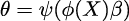

这里，*θ*是某个概率分布的参数，例如，高斯分布的均值，二项分布的*p*参数，泊松分布的速率，等等。我们称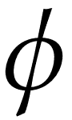为逆链接函数，是我们用来潜在地变换数据的其他函数，比如平方根、多项式函数，或者其他形式。

拟合或学习一个贝叶斯模型可以看作是寻找权重*β*的后验分布，因此这被称为近似函数的权重视角。正如我们在多项式回归和样条回归中看到的那样，通过让成为一个非线性函数，我们可以将输入映射到*特征空间*中。我们还看到，通过使用适当阶数的多项式，我们可以完美地拟合任何函数。但除非我们应用某种形式的正则化，例如，使用先验分布，否则这将导致记忆数据的模型，换句话说，模型的泛化能力非常差。我们还提到，样条回归可以像多项式一样灵活，但具有更好的统计属性。现在，我们将讨论高斯过程，它为通过有效地让数据决定函数复杂度来建模任意函数提供了一个有原则的解决方案，同时避免或至少最小化过拟合的可能性。

以下章节从一个非常实际的角度讨论高斯过程；我们避免了涉及几乎所有相关的数学内容。对于更正式的解释，你可以阅读 Rasmussen 和 Williams 的《*Gaussian Processes for Machine Learning*》[2005]。

## 8.2 函数建模

我们将通过首先描述一种将函数表示为概率对象的方法来开始讨论高斯过程。我们可以将一个函数 *f* 视为从输入集合 *X* 到输出集合 *Y* 的映射。因此，我们可以写成：

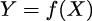

表示函数的一种非常粗略的方式是列出每个 *x*[*i*] 值对应的 *y*[*i*] 值，如 *表 8.1* 所示。你可能还记得这种表示函数的方式，它来自小学阶段。

| *x* | *y* |
| --- | --- |
| 0.00 | 0.46 |
| 0.33 | 2.60 |
| 0.67 | 5.90 |
| 1.00 | 7.91 |

**表 8.1**：一种函数的表格表示（某种程度上）

作为一般情况，*X* 和 *Y* 的值将位于实数线上；因此，我们可以将函数视为一个（可能）无限且有序的值对列表 (*x*[*i*]*,y*[*i*])。顺序很重要，因为如果我们打乱这些值的顺序，得到的将是不同的函数。

根据这个描述，我们可以数值地表示我们想要的任何特定函数。但是，如果我们想要概率性地表示函数怎么办呢？那么，我们就需要编码一个概率映射。让我解释一下；我们可以让每个值都是一个具有某种关联分布的随机变量。由于使用高斯分布通常很方便，我们可以假设它们服从具有给定均值和方差的高斯分布。这样，我们就不再描述单一的特定函数，而是描述一个分布族。

为了使讨论更加具体，我们将使用一些 Python 代码来构建并绘制两个这样的函数示例：

**代码 8.1**

```py
np.random.seed(42) 
x = np.linspace(0, 1, 10) 
y = np.random.normal(0, 1, len(x)) 
plt.plot(x, y, 'o-', label='the first one') 
y = np.zeros_like(x) 

for i in range(len(x)): 
    y[i] = np.random.normal(y[i-1], 1) 
plt.plot(x, y, 'o-', label='the second one') 
plt.legend()
```

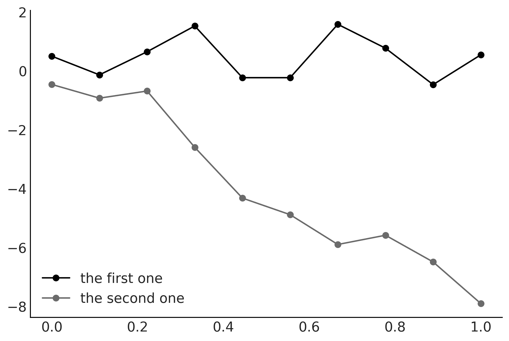

**图 8.1**：从高斯分布中采样的两个虚拟函数

*图 8.1* 显示了使用来自高斯分布的样本来编码函数并非那么疯狂或愚蠢，所以我们可能走在正确的道路上。然而，用于生成 *图 8.1* 的方法是有限的，并且不够灵活。

虽然我们期望实际的函数具有某种结构或模式，但我们表示 `第一个` 函数的方式并没有让我们编码数据点之间的任何关系。实际上，每个点都是完全独立的，因为我们只是从一个共同的一维高斯分布中随机抽取了 10 个独立的样本。对于 `第二个` 函数，我们引入了一些依赖关系。点 *y*[*i*+1] 的均值是 *y*[*i*]，因此我们这里有一定的结构。然而，我们将在接下来的内容中看到，捕捉依赖关系有一种更为通用的方法，而不仅仅是连续点之间的依赖。

在继续之前，让我停下来思考一下，为什么我们使用高斯分布而不是其他概率分布。首先，通过将自己限制为只使用高斯分布，我们在指定不同形状的函数时不会失去任何灵活性，因为每个点可能有自己的均值和方差。其次，从数学的角度来看，使用高斯分布是非常方便的。

## 8.3 多元高斯和函数

在*图 8.1*中，我们将一个函数表示为从一维高斯分布中采样得到的集合。另一种选择是使用 n 维多元高斯分布，得到一个长度为*n*的样本向量。实际上，你可以尝试重现*图 8.1*，但将`np.random.normal(0, 1, len(x))`替换为`np.random.multivariate_normal`，均值为`np.zeros_like(x)`，标准差为`np.eye(len(x))`。使用多元正态分布的优势在于，我们可以利用协方差矩阵来编码有关函数的信息。例如，通过将协方差矩阵设置为`np.eye(len(x))`，我们表明我们在评估函数的 10 个点中，每个点的方差为 1。我们还表明它们之间的方差，即协方差为 0。换句话说，它们是独立的。如果我们将这些零替换为其他数值，我们可以得到描述不同故事的协方差。

我希望你已经开始相信使用多元高斯来表示函数是可能的。如果是这样，那么我们只需要找到一个合适的协方差矩阵。这也是下一节的主题。

### 8.3.1 协方差函数和核函数

在实践中，协方差矩阵是通过称为核函数的函数来指定的。不幸的是，术语“核”是一个多义词，甚至在统计学文献中也是如此。定义核函数的一种简单方法是，任何返回有效协方差矩阵的函数都可以称为核。但这个定义是自我重复的，且不太直观。一个更具概念性和实用性的定义是，核函数定义了输入空间中数据点之间的相似度度量，而这种相似度决定了一个数据点对预测另一个数据点值的影响程度。

有许多有用的核函数，一个流行的核函数是指数二次核：

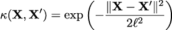

在这里，∥**X** − **X**′∥²是平方欧几里得距离：

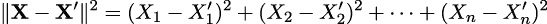

对于这个核函数，我们可以看到它是一个对称函数，接受两个输入，如果输入相同则返回 0，否则返回正值。因此，我们可以将指数二次核的输出解释为两个输入之间的相似度度量。

乍一看可能不太明显，但指数二次核的公式与高斯分布非常相似。正因为如此，这个核函数也被称为高斯核函数。术语*ℓ*被称为长度尺度（或带宽或方差），它控制着核函数的宽度。换句话说，它控制着*X*值在什么尺度下被认为是相似的。

为了更好地理解核函数的作用，我建议你动手尝试它们。例如，定义一个 Python 函数来计算指数二次核函数：

**代码 8.2**

```py
def exp_quad_kernel(x, knots, ℓ=1): 
    """exponentiated quadratic kernel""" 
    return np.array([np.exp(-(x-k)**2 / (2*ℓ**2)) for k in knots])
```

*图 8.2* 展示了在不同输入下 4 × 4 协方差矩阵的样子。我选择的输入非常简单，包含了值 [−1*,*0*,*1*,*2]。

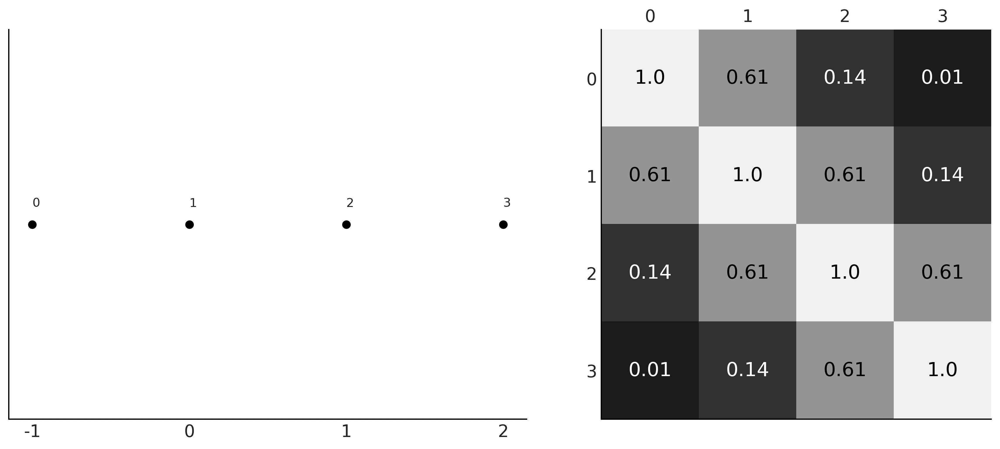

**图 8.2**：输入值（左），协方差矩阵（右）

在 *图 8.2* 的左面板中，我们展示了输入值。这些是 x 轴上的值，我们将点从 0 标记到 3。因此，点 0 取值 -1，点 1 取值 0，以此类推。在右面板中，我们展示了使用指数二次核函数计算得到的协方差矩阵的热力图。颜色越浅，协方差值越大。如你所见，热力图是对称的，且对角线上的值最大。当我们意识到协方差矩阵中每个元素的值与点之间的距离成反比时，这一点是有意义的，对角线是通过将每个数据点与自身进行比较得到的。最小的值出现在点 0 和点 3，因为它们是最远的两个点。

一旦你理解了这个例子，你应该尝试使用其他输入。请参考本章末的练习 1 以及附带的笔记本（[`github.com/aloctavodia/BAP3`](https://github.com/aloctavodia/BAP3)）进行进一步练习。

现在我们更好地理解了如何使用核函数生成协方差矩阵，接下来让我们更进一步，使用协方差矩阵来采样函数。如你在 *图 8.3* 中所见，高斯核函数意味着一系列不同的函数，而参数 *ℓ* 控制函数的平滑度。*ℓ* 的值越大，函数越平滑。

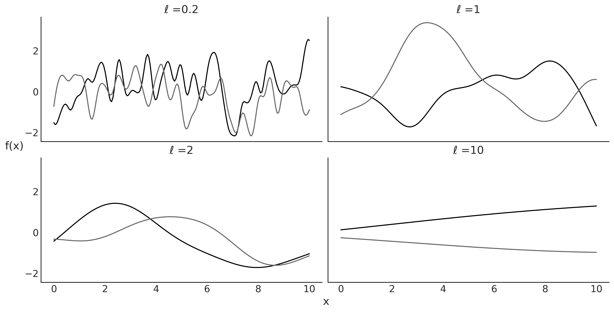

**图 8.3**：四个 *ℓ* 值的高斯核函数的实现（每个 *ℓ* 值对应两个实现）

你告诉我你的朋友，我就能告诉你你的未来

核函数将数据点沿 x 轴的距离转化为期望函数值（y 轴）的协方差值。因此，数据点在 x 轴上越接近，我们期望它们在 y 轴上的值越相似。

## 8.4 高斯过程

现在我们已经准备好理解什么是高斯过程（GPs）以及它们在实践中的应用。根据维基百科，高斯过程的一个正式定义如下：

“由时间或空间索引的随机变量的集合，使得这些随机变量的每个有限集合都具有多元正态分布，即它们的每个有限线性组合服从正态分布。”

这个定义可能并不是很有用，至少在你当前的学习阶段不太有用。理解高斯过程的诀窍在于意识到，高斯过程的概念是一个心理（和数学）框架，因为在实际应用中，我们并不需要直接处理这个无限维的数学对象。相反，我们只在有数据的点上评估高斯过程。通过这样做，我们将无限维的高斯过程压缩成一个有限维的多元高斯分布，维度数与数据点的数量相等。从数学上讲，这种压缩是通过对无限未观察到的维度进行边际化来实现的。理论告诉我们，除了我们观察到的点，忽略（实际上是边际化）所有其他点是可以的。它还保证我们总是会得到一个多元高斯分布。因此，我们可以严格地解释*图 8.3* 为高斯过程的实际样本！

到目前为止，我们专注于多元正态分布的协方差矩阵，并没有讨论均值。在使用高斯过程时，将多元高斯的均值设置为 0 是常见做法，因为高斯过程足够灵活，可以将均值建模得非常好。但请注意，这样做并没有限制。实际上，对于某些问题，你可能希望参数化地建模均值，而将高斯过程用来建模残差。

高斯过程是对函数的先验

高斯过程是对函数的先验分布，使得在你评估函数的每个点时，它会在该点放置一个具有给定均值和方差的高斯分布。在实践中，高斯过程通常是通过使用核函数来构建的，核函数将 x 轴上的距离转化为 y 轴上的相似度。

## 8.5 高斯过程回归

假设我们可以将一个变量*Y*建模为*X*的函数*f*加上一些高斯噪声：

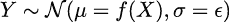

如果*f*是*X*的线性函数，那么这个假设本质上与我们在*第四章*讨论简单线性回归时使用的假设相同。在本章中，我们将通过对*f*设置先验来使用一个更一般的表达式。通过这种方式，我们将能够得到比线性更复杂的函数。如果我们决定使用高斯过程作为这个先验，那么我们可以写成：

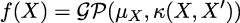

这里，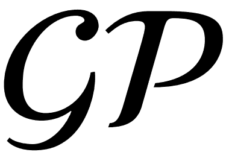表示一个均值函数*μ*[*X*]和协方差函数*K*(*X,X*′)的高斯过程。尽管在实践中，我们总是处理有限对象，但我们使用**函数**这个词来表示从数学上讲，均值和协方差是无限对象。

我之前提到过，使用高斯分布非常方便。例如，如果先验分布是一个高斯过程，而似然是高斯分布，那么后验分布也是高斯过程，并且我们可以解析地计算它。此外，使用高斯似然的好处是我们可以边际化高斯过程，这大大减少了我们需要从中抽样的参数空间的大小。PyMC 中的高斯过程模块利用了这一点，并为高斯和非高斯似然提供了不同的实现方式。在接下来的部分中，我们将探索这两者。

## 8.6 使用 PyMC 进行高斯过程回归

*图 8.4*中的灰色线是一个正弦函数。我们假设我们不知道这个函数，而是只有一组数据点（点）。然后我们使用高斯过程来逼近生成这些数据点的函数。

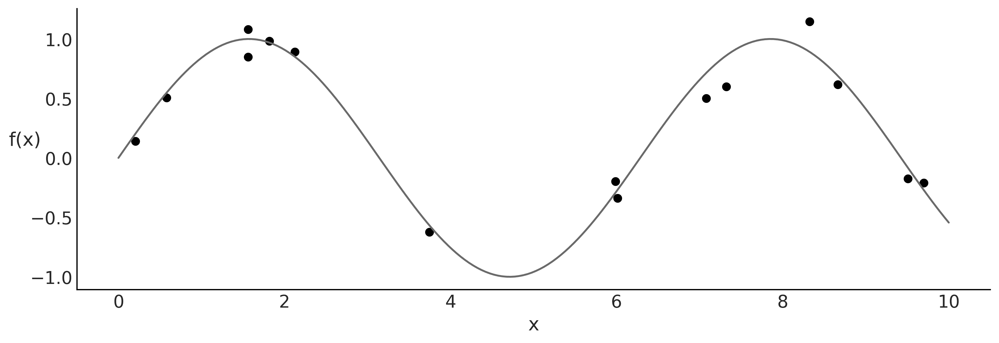

**图 8.4**：从已知函数（线）生成的合成数据（点）

高斯过程在 PyMC 中实现为一系列 Python 类，这些类与我们之前见过的模型稍有不同；然而，代码依然非常*PyMConic*。我在接下来的代码中添加了一些注释，帮助你理解在 PyMC 中定义高斯过程的关键步骤。

**代码 8.3**

```py
# A one-dimensional column vector of inputs. 
X = x[:, None] 

with pm.Model() as model_reg: 
    # hyperprior for lengthscale kernel parameter 
    ℓ = pm.InverseGamma("ℓ", 7, 17) 
    # instanciate a covariance function 
    cov = pm.gp.cov.ExpQuad(1, ls=ℓ) 
    # instanciate a GP prior 
    gp = pm.gp.Marginal(cov_func=cov) 
    σ = pm.HalfNormal('σ', 25) 
    # Class representing that the observed data is a GP plus Gaussian noise 
    y_pred = gp.marginal_likelihood('y_pred', X=X, y=y, sigma=σ) 

    idata_reg = pm.sample()
```

请注意，我们没有使用高斯似然，而是使用了`gp.marginal_likelihood`方法。这个方法利用了后验分布有封闭形式这一事实，正如前面部分所解释的那样。

好的，现在我们已经计算了后验分布，接下来让我们看看如何得到均值拟合函数的预测。我们可以通过使用`gp.conditional`计算在新输入位置上评估的条件分布来实现这一点。

**代码 8.4**

```py
X_new = np.linspace(np.floor(x.min()), np.ceil(x.max()), 100)[:,None] 
with model_reg: 
    f_pred = gp.conditional('f_pred', X_new)
```

结果，我们得到了一个新的 PyMC 随机变量`f_pred`，我们可以用它来从后验预测分布中获取样本：

**代码 8.5**

```py
with model_reg: 
    idata_subset = idata_reg.sel(draw=slice(0, None, 100)) 
    pred_samples = pm.sample_posterior_predictive(idata_subset, 
                                                  var_names=["f_pred"]) 

f_pred = (pred_samples. 
         posterior_predictive.stack(samples=("chain", "draw"))['f_pred']. 
         values)
```

现在我们可以在原始数据上绘制拟合函数，以直观检查它们与数据的拟合程度以及我们预测的相关不确定性。正如我们在*第四章*中对线性模型所做的那样，我们将展示几种不同的方式来绘制相同的结果。*图 8.5*展示了拟合函数的线条。

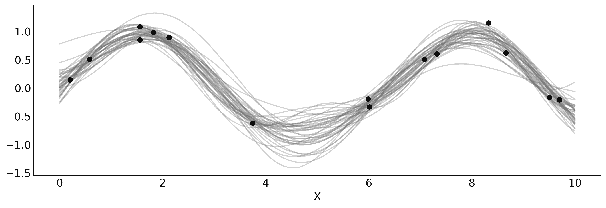

**图 8.5**：线条表示从`model_reg`的后验均值中抽取的样本

或者，我们可以使用辅助函数`pm.gp.util.plot_gp_dist`来获得如*图 8.6*所示的漂亮图表。在这个图表中，每条带状线表示不同的百分位数，从 99 百分位（浅灰色）到 51 百分位（深灰色）。

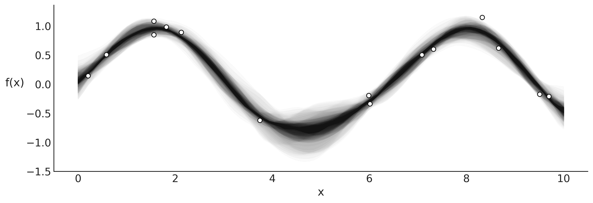

**图 8.6**：使用`plot_gp_dist`函数绘制的从`model_reg`的后验样本

另一种选择是计算在参数空间中给定点处的条件分布的均值向量和标准差。在*图 8.7*中，我们使用均值（基于轨迹中的样本）来表示*ℓ*和 。我们可以使用`gp.predict`方法来计算均值和方差。

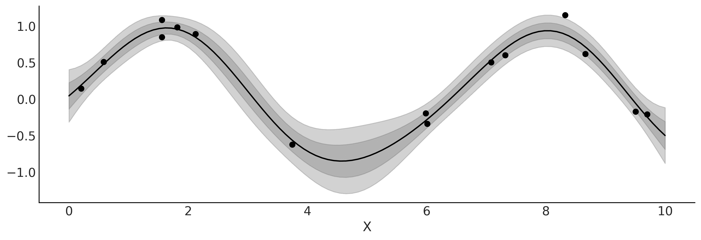

**图 8.7**：`model_reg`的后验均值，带有 1 和 2 标准差的带宽

正如我们在*第 4*章中看到的，我们可以使用一个具有非高斯似然度和适当逆链接函数的线性模型来扩展有用线性模型的范围。对于高斯过程（GP），我们也可以做同样的事情。例如，我们可以使用一个带有指数逆链接函数的泊松似然度。对于这样的模型，后验分布不再是解析可解的，但我们仍然可以使用数值方法来近似计算。在接下来的部分中，我们将讨论这些类型的模型。

### 8.6.1 设置长度尺度的先验

对于长度尺度参数，避免为零的先验通常效果更好。正如我们之前看到的，*ℓ*控制着函数的平滑度，因此，*ℓ*为 0 意味着函数不平滑；我们会得到类似于*图 8.1*中的“第一个”函数。但更重要的原因是，对于大于 0 但仍低于协变量最小间距的*ℓ*值，可能会出现一些不良效应。本质上，在该点以下，似然度无法区分不同的长度尺度，因此它们都同样好。这是一个不可识别性问题。因此，我们将得到一个倾向于过拟合并且准确插值输入数据的高斯过程（GP）。此外，MCMC 采样器会遇到更多困难，可能会出现更长的采样时间或简单的不可靠样本。类似的情况发生在数据范围之外。如果数据范围为 10 且*ℓ*> = 10，这意味着函数是平坦的。再往后，您（以及似然度）无法区分不同的参数值。因此，即使您不确定函数是多么平滑或起伏，您仍然可以设置一个先验，避免极低或极高的*ℓ*值。例如，为了获得先验`pm.InverseGamma("`*ℓ*`", 7, 17)`，我们请求 PreliZ 提供一个最大熵先验，其中 0.95 的质量分布在 1 到 5 之间：

**代码 8.6**

```py
pz.maxent(pz.InverseGamma(), 1, 5, 0.95)
```

逆伽马分布（InverseGamma）是一个常见的选择。与伽马分布（Gamma）类似，它允许我们设置一个避免为 0 的先验，但与伽马分布不同的是，逆伽马分布在接近 0 时有一个较轻的尾部，换句话说，它为小值分配的质量较少。

本章剩余部分，我们将使用函数`get_ig_params`从协变量的尺度中获取弱信息先验。你可以在附带的代码中找到详细信息（[`github.com/aloctavodia/BAP3`](https://github.com/aloctavodia/BAP3)），但本质上，我们使用 PreliZ 中的`maxent`函数，将大部分先验质量设置在一个与协变量范围兼容的区间内。

## 8.7 高斯过程分类

在*第四章*中，我们看到了如何使用线性模型来分类数据。我们使用了伯努利似然和逻辑逆链接函数。然后，我们应用了边界决策规则。在这一节中，我们将做同样的事情，但这次使用 GP 而不是线性模型。就像我们在*第四章*中的`model_lrs`一样，我们将使用包含两类`setosa`和`versicolor`、一个预测变量`sepal length`的鸢尾花数据集。

对于这个模型，我们不能使用`pm.gp.Marginal`类，因为该类仅限于高斯似然，因为它利用了 GP 先验与高斯似然组合的数学可处理性。相反，我们需要使用更通用的`pm.gp.Latent`类。

**代码 8.7**

```py
with pm.Model() as model_iris: 
    ℓ = pm.InverseGamma('ℓ', *get_ig_params(x_1)) 
    cov = pm.gp.cov.ExpQuad(1, ℓ) 
    gp = pm.gp.Latent(cov_func=cov) 
    f = gp.prior("f", X=X_1) 
    # logistic inverse link function and Bernoulli likelihood 
    y_ = pm.Bernoulli("y", p=pm.math.sigmoid(f), observed=y) 
    idata_iris = pm.sample()
```

如我们所见，*图 8.8*看起来与*图 4.11*非常相似。请花些时间对比这两张图。

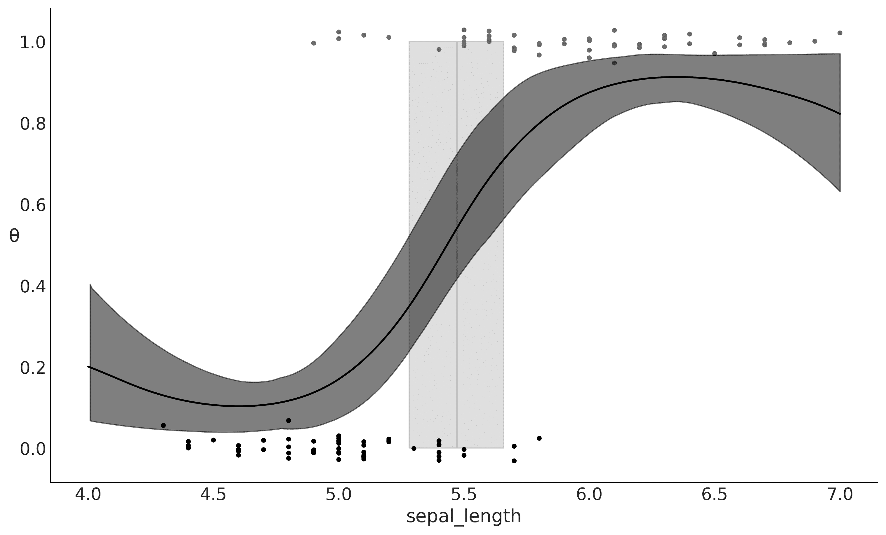

**图 8.8**：逻辑回归，`model_lrs`的结果

你可能已经注意到，推断出的函数看起来类似于 sigmoid 曲线，除了在较低的`sepal_length`值时尾部向上，较高的`sepal_length`值时尾部向下。为什么会这样呢？因为当数据很少或没有数据时，GP 后验倾向于恢复到 GP 先验。如果我们考虑到在没有数据的情况下，后验基本上变成了先验，这就很有意义。

如果我们唯一关注的是决策边界，那么尾部的行为可能是无关紧要的。但如果我们想要建模在不同`sepal_length`值下属于 setosa 或 versicolor 的概率，我们应该做一些事情来改善尾部的模型。实现这一目标的一种方法是为高斯过程添加更多结构。高斯过程的一个非常好的特点是，我们可以组合协方差函数。因此，对于下一个模型，我们将组合三个核函数：指数二次核、线性核和白噪声核。

线性核的效果是在数据边界处使尾部趋近于 0 或 1。此外，我们使用白噪声核作为稳定协方差矩阵计算的一种技巧。高斯过程的核函数受到限制，以保证生成的协方差矩阵是正定的。然而，数值误差可能导致违反这一条件。这种问题的表现之一是，在计算拟合函数的后验预测样本时会得到 NaN。缓解此错误的一种方法是通过添加噪声来稳定计算。事实上，PyMC 在后台已经做了类似的处理，但有时需要更多的噪声，如下面的代码所示：

**代码 8.8**

```py
with pm.Model() as model_iris2: 
    ℓ = pm.InverseGamma('ℓ', *get_ig_params(x_1)) 
    c = pm.Normal('c', x_1.min()) 
    τ = pm.HalfNormal('τ', 5) 
    cov = (pm.gp.cov.ExpQuad(1, ℓ) + 
           τ * pm.gp.cov.Linear(1, c) + 
           pm.gp.cov.WhiteNoise(1E-5)) 
    gp = pm.gp.Latent(cov_func=cov) 
    f = gp.prior("f", X=X_1) 
    # logistic inverse link function and Bernoulli likelihood 
    y_ = pm.Bernoulli("y", p=pm.math.sigmoid(f), observed=y) 
    idata_iris2 = pm.sample()
```

我们可以在*图 8.9*中看到这个模型的结果。注意，这个图看起来现在与*图 4.11*相比，更加相似，而不是*图 8.8*。

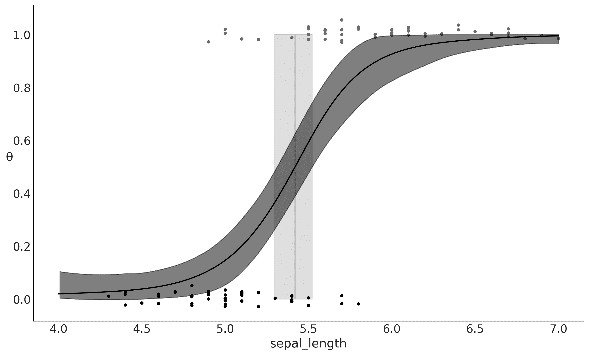

**图 8.9**：逻辑回归，`model_lrs`的结果

本节讨论的示例有两个主要目的：

+   显示如何轻松地将核函数组合在一起，以获得更具表现力的模型

+   显示如何使用高斯过程*恢复*逻辑回归

关于第二点，逻辑回归确实是高斯过程的一个特例，因为简单的线性回归只是高斯过程的一个特例。事实上，许多已知的模型可以看作是高斯过程的特例，或者至少它们与高斯过程有某种联系。如果你想了解更多，可以阅读 Kevin Murphy 的《机器学习：一种概率视角》第一版第十五章[Murphy，2012]，以及第二版的第十八章[Murphy，2023]。

### 8.7.1 高斯过程用于空间流感

实际上，使用高斯过程来建模我们可以通过逻辑回归解决的问题并没有太大意义。相反，我们希望使用高斯过程来建模那些无法通过不太灵活的模型很好捕捉的更复杂的数据。例如，假设我们想要将患病的概率作为年龄的函数进行建模。结果表明，年轻人和年老的人比中年人有更高的风险。数据集`space_flu.csv`是一个受上述描述启发的合成数据集。*图 8.10*展示了它的图形。

让我们拟合以下模型并绘制结果：

**代码 8.9**

```py
with pm.Model() as model_space_flu: 
    ℓ = pm.InverseGamma('ℓ', *get_ig_params(age)) 
    cov = pm.gp.cov.ExpQuad(1, ℓ) + pm.gp.cov.WhiteNoise(1E-5) 
    gp = pm.gp.Latent(cov_func=cov) 
    f = gp.prior('f', X=age) 
    y_ = pm.Bernoulli('y', p=pm.math.sigmoid(f), observed=space_flu) 
    idata_space_flu = pm.sample()
```

请注意，如*图 8.10*所示，高斯过程可以很好地拟合这个空间流感数据集，即使数据要求函数比逻辑回归更复杂。对于简单的逻辑回归来说，拟合这些数据几乎是不可能的，除非我们做一些特殊的修改来帮助它（有关这种修改的讨论请参见本章末的练习 6）。

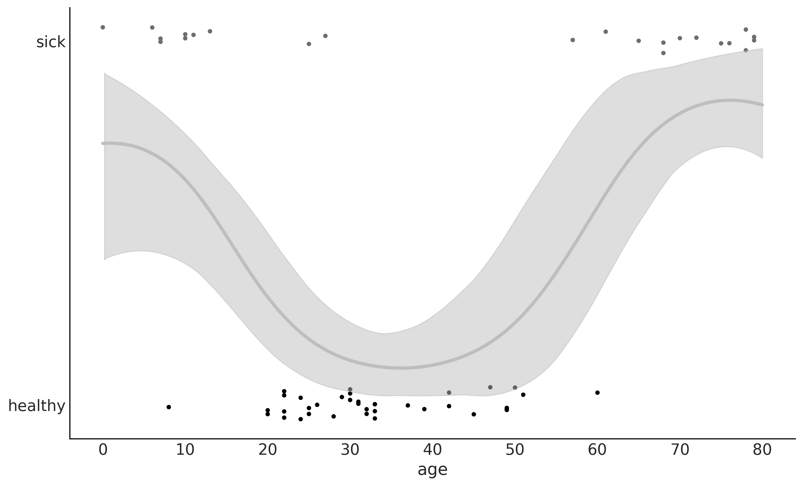

**图 8.10**：逻辑回归，`model_space_flu`的结果

## 8.8 Cox 过程

现在我们要建模计数数据。我们将看到两个例子；一个是具有时间变化率的，另一个是具有二维空间变化率的。为此，我们将使用泊松似然，并通过高斯过程来建模该比率。由于泊松分布的比率限制为正值，我们将使用指数作为逆链接函数，正如我们在*第四章*中的负二项回归中所做的那样。

我们可以将泊松过程看作是在给定空间中点集的分布，其中每个有限的点集都是泊松分布。当泊松过程的比率本身是一个随机过程时，例如一个高斯过程，那么我们就有了 Cox 过程。

### 8.8.1 煤矿灾难

第一个例子被称为煤矿灾难。这个例子记录了英国从 1851 年到 1962 年的煤矿灾难数据。灾难的数量被认为受到了这一时期安全法规变化的影响。我们希望将灾难的发生率建模为时间的函数。我们的数据集包含一列数据，每条数据对应一次灾难发生的时间。我们将用于拟合数据的模型形式如下：

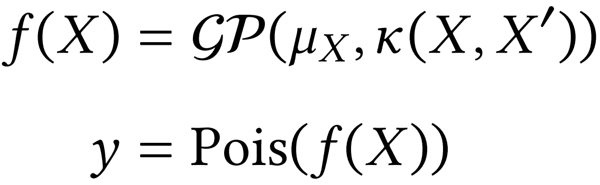

如您所见，这是一个泊松回归问题。此时，您可能会想，我们如何仅凭一个只有灾难日期的单列数据来进行回归分析。答案是将数据离散化，就像我们构建直方图一样。我们将使用箱子的中心作为*X*变量，箱子内的计数作为*Y*变量：

**代码 8.10**

```py
# discretize data 
years = int((coal_df.max() - coal_df.min()).iloc[0]) 
bins = years // 4 
hist, x_edges = np.histogram(coal_df, bins=bins) 
# Compute the location of the centers of the discretized data 
x_centers = x_edges[:-1] + (x_edges[1] - x_edges[0]) / 2 
# xdata needs to be 2D for BART 
x_data = x_centers[:, None] 
# express data as the rate number of disasters per year 
y_data = hist
```

现在我们使用 PyMC 来定义并求解模型：

**代码 8.11**

```py
with pm.Model() as model_coal: 
    ℓ = pm.InverseGamma('ℓ', *get_ig_params(x_edges)) 
    cov = pm.gp.cov.ExpQuad(1, ls=ℓ) + pm.gp.cov.WhiteNoise(1E-5) 
    gp = pm.gp.Latent(cov_func=cov) 
    f = gp.prior('f', X=x_data) 
    y_pred = pm.Poisson('y_pred', mu=pm.math.exp(f), observed=y_data) 
    idata_coal = pm.sample()
```

*图 8.11* 显示了灾难率随时间变化的中位数（白线）。带状区域描述了 50%的 HDI（较暗）和 94%的 HDI（较亮）。底部的黑色标记表示每次灾难发生的时刻。正如我们所看到的，事故率随着时间的推移而下降，除了最初的短暂上升。PyMC 文档包括了煤矿灾难的案例，但从不同的角度进行建模。我强烈建议您查看这个例子，因为它本身非常有用，并且与我们刚刚实现的方法做对比也很有价值。


**图 8.11**：逻辑回归，`model_coal`的结果

请注意，即使我们对数据进行了分箱，结果仍然是一个平滑的曲线。从这个角度来看，我们可以将 `model_coal`（以及一般而言，这种类型的模型）视为构建直方图后进行平滑处理。

### 8.8.2 红木

让我们将刚才使用的方法应用于一个二维空间问题。我们将使用如*图 8.12*所示的红木数据集。该数据集（采用 GPL 许可证分发）来自 GPstuff 包。数据集包含了某一地区红木树的位置。推断的动机是获得一个速率图，表示某一地区内树木的数量。

与煤矿灾难示例类似，我们需要对数据进行离散化处理：

**代码 8.12**

```py
# discretize spatial data 
bins = 20 
hist, x1_edges, x2_edges = np.histogram2d( 
    rw_df[1].values, rw_df[0].values, bins=bins) 
# compute the location of the centers of the discretized data 
x1_centers = x1_edges[:-1] + (x1_edges[1] - x1_edges[0]) / 2 
x2_centers = x2_edges[:-1] + (x2_edges[1] - x2_edges[0]) / 2 
# arrange xdata into proper shape for GP 
x_data = [x1_centers[:, None], x2_centers[:, None]] 
# arrange ydata into proper shape for GP 
y_data = hist.flatten().astype(int)
```

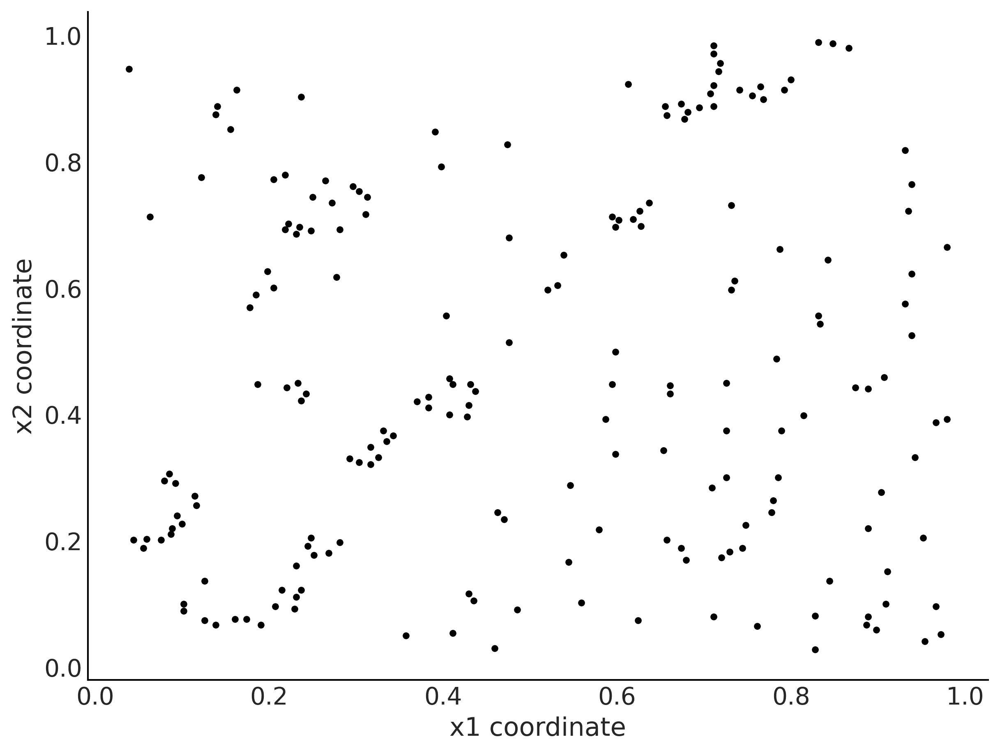

**图 8.12**：红木数据

请注意，与其做网格化处理，我们将`x1`和`x2`数据视为独立的数组。这使我们能够为每个坐标独立地构建协方差矩阵，从而有效地减少计算高斯过程所需的矩阵大小。然后我们使用`LatentKron`类将两个矩阵结合起来。需要强调的是，这不是一种数值技巧，而是此类矩阵结构的数学特性，因此我们并没有在模型中引入任何近似或误差。我们只是以一种方式表达它，从而实现更快的计算：

**代码 8.13**

```py
with pm.Model() as model_rw: 
    ℓ = pm.InverseGamma('ℓ', *get_ig_params(x_data), shape=2) 
    cov_func1 = pm.gp.cov.ExpQuad(1, ls=ℓ[0]) 
    cov_func2 = pm.gp.cov.ExpQuad(1, ls=ℓ[1]) 

    gp = pm.gp.LatentKron(cov_funcs=[cov_func1, cov_func2]) 
    f = gp.prior('f', Xs=x_data) 

    y = pm.Poisson('y', mu=pm.math.exp(f), observed=y_data) 
    idata_rw = pm.sample()
```

在*图 8.13*中，灰色的阴影越深，树木的生长速率越高。我们可以想象，我们的目标是找到高生长速率的区域，因为我们可能对木材从火灾中恢复的情况感兴趣，或者我们可能对土壤的一些特性感兴趣，并用树木作为代理。

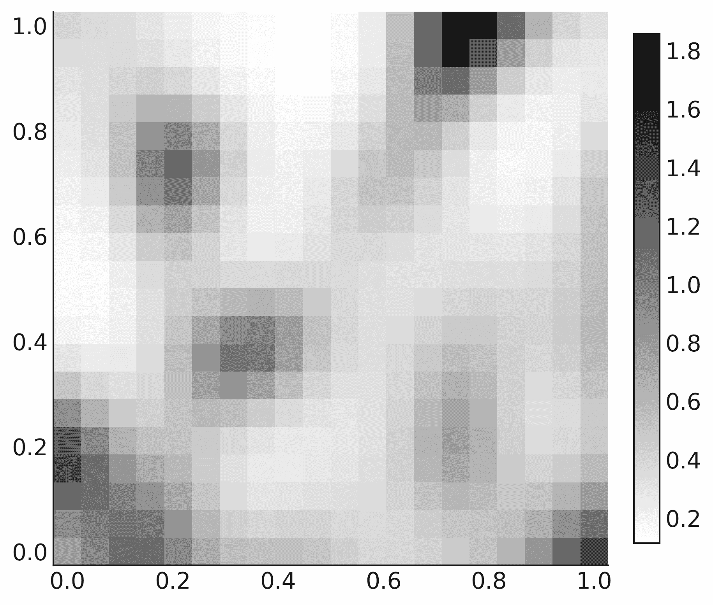

**图 8.13**：逻辑回归，`model_rw`的结果

## 8.9 带有空间自相关的回归分析

以下示例摘自*Statistical Rethinking: A Bayesian Course with Examples in R and STAN, Second Edition by Richard McElreath, Copyright (2020) by Chapman and Hall/CRC. 经 Taylor & Francis Group 授权复制*。我强烈推荐阅读这本书，因为你会发现很多像这样的好例子以及非常好的解释。唯一的*警告*是，这些书中的例子是用 R/Stan 实现的，但别担心并继续采样；你可以在[`github.com/pymc-devs/pymc-resources`](https://github.com/pymc-devs/pymc-resources)资源中找到这些例子的 Python/PyMC 版本。

对于这个示例，我们有 10 个不同的岛屿社会；对于每一个社会，我们都有它们使用的工具数量。一些理论预测，较大的人口比小人口能发展和维持更多的工具。因此，我们有一个回归问题，其中因变量是工具的数量，独立变量是人口。因为工具数量是计数变量，所以我们可以使用泊松分布。此外，我们有充分的理论依据认为，人口的对数比绝对人口大小更合适，因为真正重要的（根据理论）是人口的数量级。

到目前为止，我们所考虑的模型是泊松回归，但这里有个有趣的部分。另一个影响工具数量的重要因素是岛屿社会之间的接触率。将接触率纳入我们模型的一种方法是收集这些社会在历史上接触的频率信息，并创建一个分类变量，如低/高接触率。另一种方法是使用社会之间的距离作为接触率的代理，因为合理的假设是，地理上较近的社会比远离的社会更频繁接触。

工具数量、人口规模和坐标存储在本书 GitHub 仓库中的`islands.csv`文件里（[`github.com/aloctavodia/BAP3`](https://github.com/aloctavodia/BAP3)）。

忽略先验分布，我们将要构建的模型是：

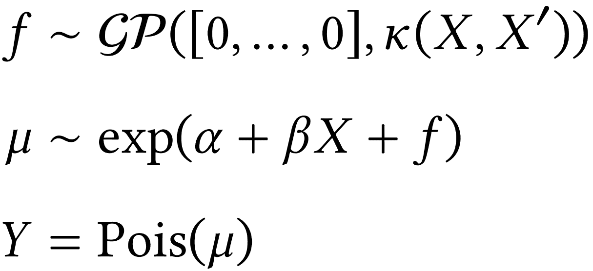

这个模型是一个线性模型加上一个高斯过程（GP）项。我们用线性部分来建模人口对数的影响，用高斯过程项来建模距离/接触率的影响。通过这种方式，我们实际上在有效地纳入技术暴露的相似性度量（从距离矩阵估算）。因此，我们不会假设总数量仅仅是人口的结果，且各社会间相互独立，而是将每个社会的工具数量建模为其空间分布的函数。

关于空间分布的信息是以纬度和经度的形式存在的，但 PyMC 中的核函数假设所有距离都是欧几里得距离。这可能会带来问题。绕过这个问题的最简洁方法可能是使用考虑岛屿处于大致球形地球上的距离。例如，我们可以使用哈弗辛距离，它基于经纬度计算两个点之间的大圆距离。大圆距离是球面上两点之间的最短距离，是沿着球面测量的。为了使用这种距离，我们需要创建一个新的核函数，如下一个代码块所示。如果你对 Python 中的类不太熟悉，你只需要知道我所做的是复制了 PyMC 代码库中的`ExpQuad`代码，并稍微修改它，创建了一个新的类`ExpQuadHaversine`。最大变化是添加了函数/方法`haversine_distance`。

**代码 8.14**

```py
class ExpQuadHaversine(pm.gp.cov.Stationary): 
    def __init__(self, input_dims, ls, ls_inv=None, r=6371, active_dims=None): 
        super().__init__(input_dims, ls=ls, ls_inv=ls_inv, active_dims=active_dims) 
        self.r = r # earth radius in km 

    def haversine_distance(self, X): 
        lat = np.radians(X[:, 0]) 
        lon = np.radians(X[:, 1]) 
        latd = lat[:,None] - lat 
        lond = lon[:,None] - lon 
        d = pt.cos(lat[:,None]) * pt.cos(lat) 
        a = pt.sin(latd / 2)** 2 + d * pt.sin(lond / 2)** 2 
        c = 2 * pt.arctan2(pt.sqrt(a), pt.sqrt(1 - a)) 
        return self.r * c 

    def full(self, X, _): 
        return pt.exp(-0.5 * self.haversine_distance(X)**2)
```

现在我们已经定义了类`ExpQuadHaversine`，可以像使用之前的内置核函数那样，使用它来定义协方差矩阵。对于这个模型，我们将引入另一个变化。我们将定义一个参数*η*。这个参数的作用是对高斯过程在 y 轴方向进行缩放。通常，我们会为高斯过程定义*ℓ*和*η*这两个参数。

**代码 8.15**

```py
with pm.Model() as model_islands: 
    η = pm.Exponential('η', 2) 
    ℓ = pm.InverseGamma('ℓ', *get_ig_params(islands_dist)) 

    cov = η * ExpQuadHaversine(2, ls=ℓ) 
    gp = pm.gp.Latent(cov_func=cov) 
    f = gp.prior('f', X=X) 

    *α* = pm.Normal('*α*', 0, 5) 
    *β* = pm.Normal('*β*', 0, 1) 
    μ = pm.math.exp(*α* + *β* * log_pop + f) 
    _ = pm.Poisson('tt_pred', μ, observed=total_tools) 

    idata_islands = pm.sample()
```

为了理解协方差函数相对于距离的后验分布，我们可以绘制一些来自后验分布的样本，如 *图 8.14* 所示。黑色曲线表示每个距离的后验中位数协方差，灰色曲线表示从 *ℓ* 和 *η* 的联合后验分布中采样的函数。

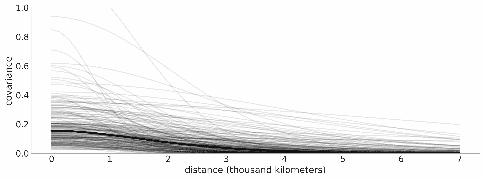

**图 8.14**：空间协方差的后验分布

*图 8.14* 中的粗黑线表示社会对之间的协方差的后验中位数与距离的关系。我们使用中位数是因为 *ℓ* 和 *η* 的分布非常偏斜。我们可以看到，协方差的平均值并不高，而且在大约 2,000 公里时几乎降到 0。细线表示不确定性，我们可以看到存在很大的不确定性。

现在让我们看看根据模型和数据，岛屿社会之间的相关性有多强。为此，我们必须将协方差矩阵转换为相关矩阵。详情请参见附带的代码。*图 8.15* 显示了均值相关矩阵的热图。

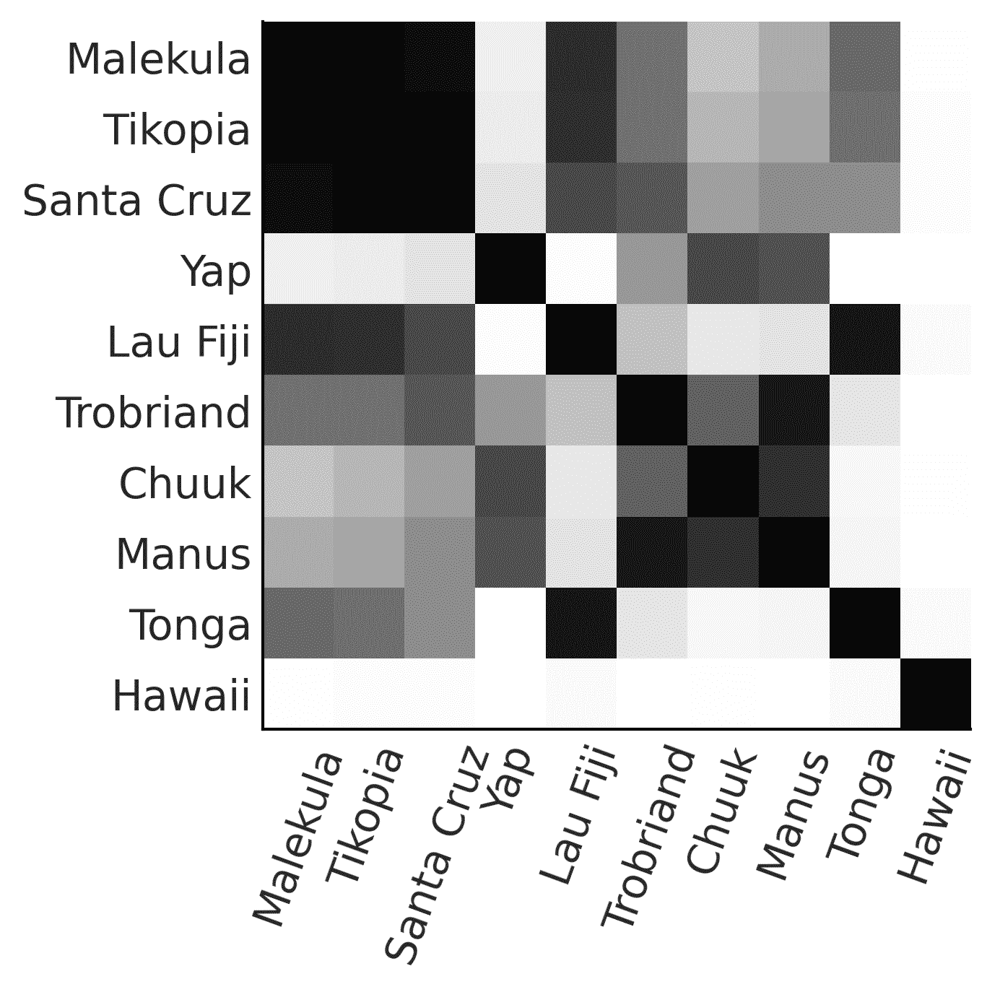

**图 8.15**：后验均值相关矩阵

从其他观察中脱颖而出的两个观点是，首先，夏威夷非常孤独。这是有道理的，因为夏威夷距离其他岛屿社会非常遥远。其次，我们可以看到马莱库拉（Ml）、提科皮亚（Ti）和圣克鲁兹（SC）之间高度相关。这也是合理的，因为这些社会彼此非常接近，并且它们也有相似数量的工具。

*图 8.16* 的左面板本质上是一个地图。岛屿社会被表示为它们相对的位置。线条表示社会之间的后验中位数相关性。线条的透明度与相关性的值成正比。

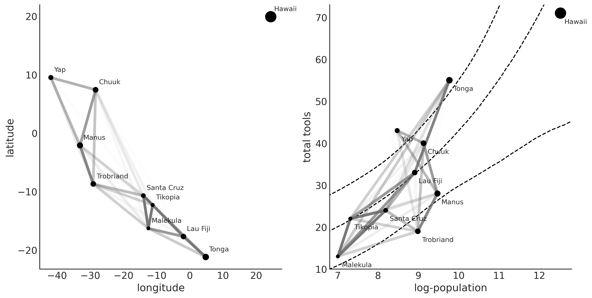

**图 8.16**：空间协方差的后验分布

在*图 8.16*的右侧面板中，我们再次展示了后验中位数相关性，但这次是根据对数人口与工具总数的关系来绘制的。虚线表示工具的中位数和 94%的高密度区间（HDI）作为对数人口的函数。在*图 8.16*的两个面板中，点的大小与每个岛屿社会的人口成正比。注意，马列库拉、提科皮亚和圣克鲁斯之间的相关性描述了它们工具数量相对较少，接近中位数或低于根据其人口预期的工具数量。类似的情况发生在特罗布里安群岛和马努斯岛；它们地理位置接近，且工具数量低于预期。汤加的工具数量远高于其人口预期，并且与斐济有较高的相关性。从某种程度上讲，模型告诉我们，汤加对斐济的影响是积极的，增加了工具的总数，同时抵消了对其邻近地区马列库拉、提科皮亚和圣克鲁斯的影响。

## 8.10 希尔伯特空间高斯过程（HSGP）

高斯过程可能会比较慢。主要原因是它们的计算需要我们对一个矩阵进行求逆，而该矩阵的大小会随着观察数据的增多而增长。这个操作计算成本较高，而且扩展性不好。因此，围绕高斯过程的研究大部分集中在寻找近似方法，以便更快地计算它们并使其能够扩展到大规模数据。

我们将只讨论其中一种近似方法，即**希尔伯特空间高斯过程**（**HSGP**），而不深入探讨这种近似是如何实现的。从概念上讲，我们可以将其视为一种基函数展开，类似于样条函数的构建方式（参见*第六章*）。这种近似的结果是，它将矩阵求逆操作转化为矩阵乘法，这是一种速度更快的操作。

但什么时候它能起作用？

我们只能在低维度（大约 1 到 3 或 4 维）中使用 HSGP，并且仅限于某些核函数，如指数二次核或马特恩核。原因是，为了使 HSGP 近似法生效，核函数必须以一种特殊的形式表示，即功率谱密度形式，而并非所有核函数都可以用这种形式表示。

在 PyMC 中使用 HSGP 近似方法是非常直接的，我们将在自行车数据集上演示这一点。我们希望将出租自行车的数量建模为一天中小时数的函数。以下代码块展示了此模型的 PyMC 实现。

**代码 8.16**

```py
with pm.Model() as model_hsgp: 
    ℓ = pm.InverseGamma('ℓ', *get_ig_params(X)) 

    cov = pm.gp.cov.ExpQuad(1, ls=ℓ) 
    gp = pm.gp.HSGP(m=[10], c=1.5, cov_func=cov) 

    f = gp.prior('f', X=X) 
    *α* = pm.HalfNormal('*α*', 1) 
    _ = pm.NegativeBinomial("obs", np.exp(f), *α*, observed=y) 

    idata_hsgp = pm.sample()
```

与之前的高斯过程模型的主要区别在于，使用了`pm.gp.HSGP(.)`类，而不是用于非高斯似然和标准高斯过程的`pm.gp.Latent(.)`类。`pm.gp.HSGP(.)`类有两个参数：

+   `m` 是我们用来逼近 GP 的基本函数数量。`m` 值越大，逼近效果越好，但计算成本也越高。

+   `c` 是一个边界因子。对于一个固定且足够大的 `m` 值，`c` 主要影响均值函数在边界附近的逼近。它不应小于 1.2（如果使用较小的值，PyMC 会给出警告），通常 1.5 是一个不错的选择。改变此参数不会影响计算速度。

我们设置 `m=10`，部分原因是我们喜欢十进制系统，部分原因是基于 Riutort-Mayol et al. 发表的论文《Practical Hilbert space approximate Bayesian Gaussian processes for probabilistic programming》中的建议 [2022]。实际上，只要 `m` 和 `c` 的值在某个范围内，与长度尺度的先验一致，结果对它们的精确值是稳健的。关于 HSGP 如何工作以及如何在实践中使用它的一些建议，可以参考 Riutort-Mayol et al. [2022]。

现在让我们看看结果。*图 8.17* 显示了黑色的均值后验 GP 和来自 GP 后验的 100 个样本（灰色线）。你可以将这些结果与使用样条得到的结果进行比较（见*图 6.8*）。

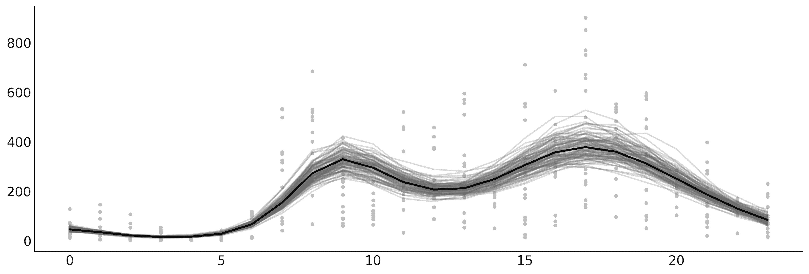

**图 8.17**：HSGP 模型对租赁自行车的后验均值，作为一天中时间的函数

HSGP 近似也已在 Bambi 中实现。让我们看看如何使用它。

### 8.10.1 HSGP 与 Bambi

要使用 Bambi 拟合之前的模型，我们需要编写以下代码：

**代码 8.17**

```py
bmb.Model("rented ∼ 0 + hsgp(hour, m=10, c=1.5)", bikes, 
          family="negativebinomial")
```

这样是可行的，但我们将为 Bambi 提供先验，就像我们在 PyMC 中做的那样。这将导致更快的采样和更可靠的样本。

正如我们在*第 6* 章中看到的那样，要在 Bambi 中定义先验，我们只需将字典传递给 `bmb.Model` 的 `priors` 参数。但我们必须注意，HSGP 项不会接收先验。相反，我们需要为 *ℓ*（在 Bambi 中称为 `ell`）和 *η*（在 Bambi 中称为 `sigma`）定义先验，并将这些先验传递给 HSGP 项。还有一件事：和之前的模型一样，我们没有使用 *η*，但由于 Bambi 需要它，我们使用了一个小技巧来定义一个基本上是 1 的先验。

**代码 8.18**

```py
prior_gp = { 
    "sigma": bmb.Prior("Gamma", mu=1, sigma=0.01), 
    "ell": bmb.Prior("InverseGamma", **get_ig_params(X)) 
} 
priors = { 
    "hsgp(hour, m=10, c=1.5)": prior_gp, 
    "alpha": bmb.Prior("HalfNormal", sigma=1) 
} 

model_hsb = bmb.Model("rented ∼ 0 + hsgp(hour, m=10, c=1.5)", bikes, 
                      family="negativebinomial", 
                      priors=priors) 

idata_hsb = model_hsb.fit()
```

我邀请你检查 Bambi 计算的参数，它们与我们通过 PyMC 得到的非常相似。*图 8.18* 显示了黑色的均值后验 GP 和 94% HDI 的带状区域。该图是通过 `bmb.interpret.plot_predictions` 生成的。

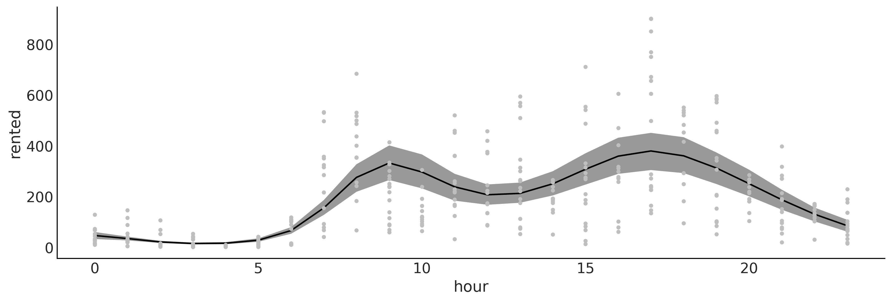

**图 8.18**：HSGP 模型对租赁自行车的后验均值，作为一天中时间的函数，使用 Bambi

在本节中，我们探讨了 HSGP 的概念，作为一种强大的近似方法，可以将高斯过程扩展到大数据集。通过将 PyMC 和 Bambi 的灵活性与 HSGP 提供的可扩展性相结合，研究人员和实践者可以更有效地解决复杂的建模任务，为在日益庞大和复杂的数据集上应用高斯过程铺平道路。

## 8.11 总结

高斯过程是多元高斯分布的一种推广，适用于无限多个维度，完全由均值函数和协方差函数指定。由于我们可以概念上将函数视为无限长的向量，因此可以将高斯过程作为函数的先验。在实践中，我们并不处理无限对象，而是处理与数据点数量相等维度的多元高斯分布。为了定义其相应的协方差函数，我们使用了适当参数化的核；通过学习这些超参数，我们最终学会了关于任意复杂函数的知识。

在本章中，我们简要介绍了高斯过程（GP）。我们涵盖了回归、半参数模型（岛屿示例）、将两个或多个核组合以更好地描述未知函数，以及高斯过程如何用于分类任务。还有许多其他主题我们可以讨论。然而，我希望这段高斯过程的介绍足以激励你继续使用、阅读和学习高斯过程及贝叶斯非参数模型。

## 8.12 练习

1.  对于*协方差函数和核*部分中的示例，确保理解输入数据与生成的协方差矩阵之间的关系。尝试使用其他输入，如`data = np.random.normal(size=4)`。

1.  重新运行生成*图 8.3*的代码，并将从高斯过程（GP）先验中获得的样本数量增加到约 200。原始图中的样本数量为 2。生成值的范围是什么？

1.  对于前一个练习中生成的图表，计算每个点的标准差。按照以下形式进行操作：

    +   从视觉上看，仅仅观察图表

    +   直接来自于`pz.MVNormal(.).rvs`生成的值

    +   通过检查协方差矩阵（如果有疑问，请回到练习 1）

    从这三种方法中得到的值是否匹配？

1.  使用测试点`np.linspace(np.floor(x.min()), 20, 100)[:,None]`并重新运行`model_reg`。绘制结果。你观察到了什么？这与 GP 先验的规范有何关系？

1.  重复练习 1，但这次使用线性核（参见附带的线性核代码）。

1.  请查看 PyMC 文档中的[`www.pymc.io/projects/examples/en/latest/gaussian_processes/GP-MeansAndCovs.html`](https://www.pymc.io/projects/examples/en/latest/gaussian_processes/GP-MeansAndCovs.html)。

1.  对`space_flu`数据运行逻辑回归模型。你看到了什么？你能解释结果吗？

1.  修改逻辑回归模型以适应数据。提示：使用二阶多项式。

1.  将煤矿灾难的模型与 PyMC 文档中的模型进行比较（[`www.pymc.io/projects/docs/en/stable/learn/core_notebooks/pymc_overview.html#case-study-2-coal-mining-disasters`](https://www.pymc.io/projects/docs/en/stable/learn/core_notebooks/pymc_overview.html#case-study-2-coal-mining-disasters)）。描述这两个模型在模型规范和结果方面的差异。

## 加入我们的社区 Discord 空间

加入我们的 Discord 社区，结识志同道合的人，并与 5000 多名成员一起学习：[`packt.link/bayesian`](https://packt.link/bayesian)


