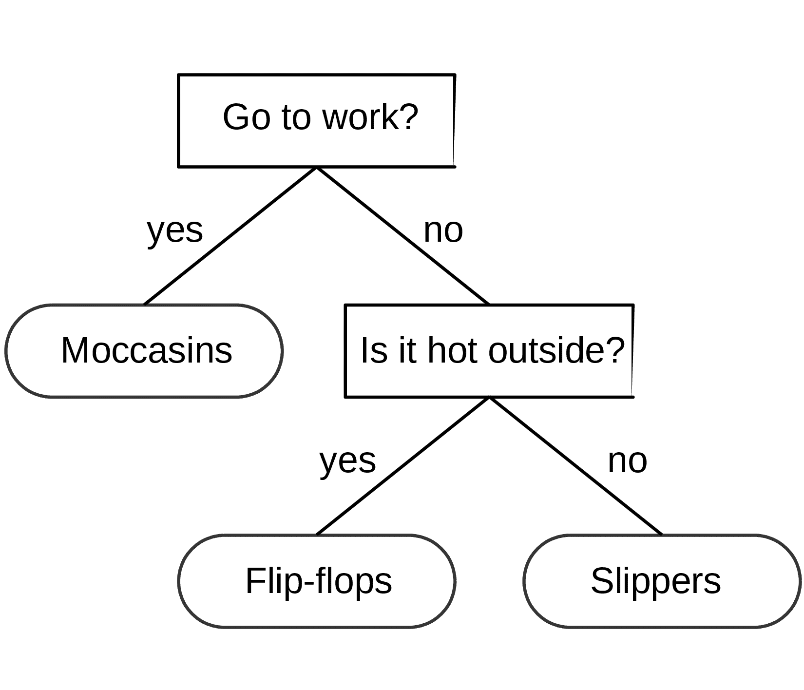
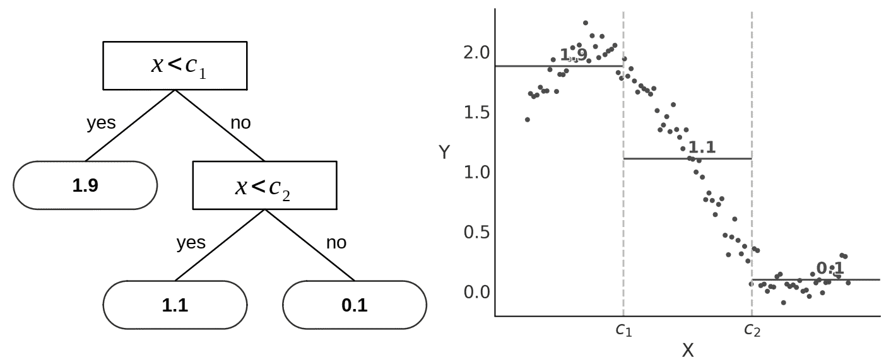
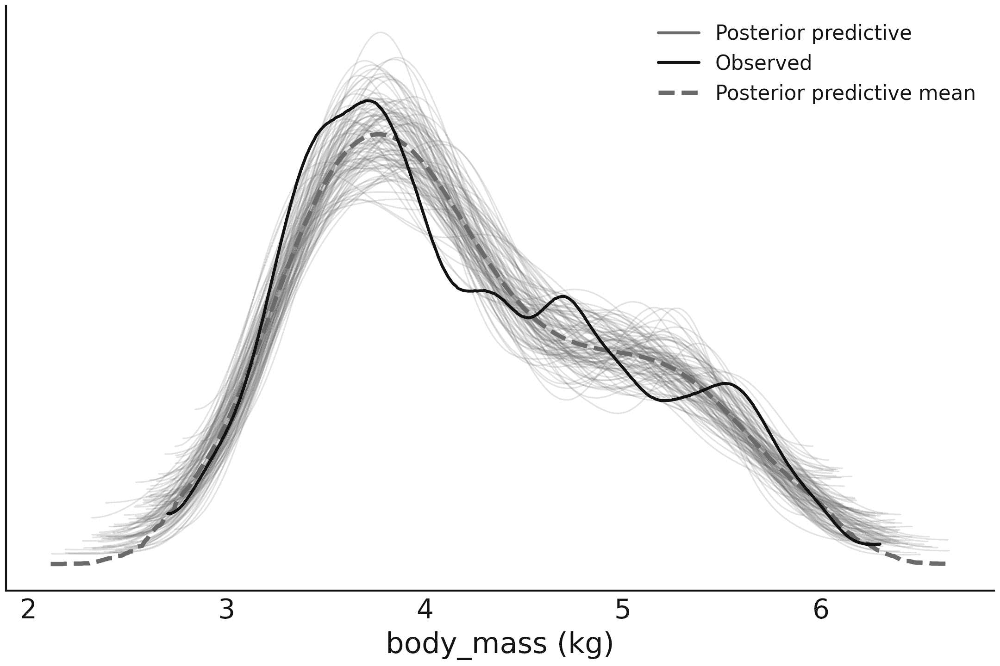
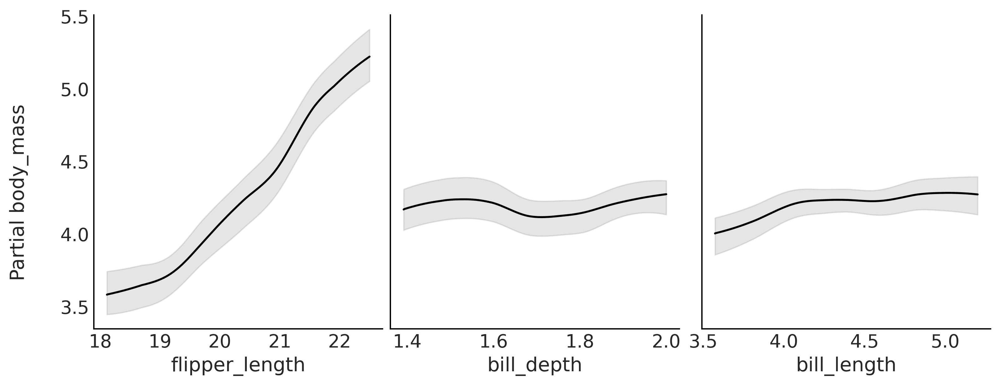
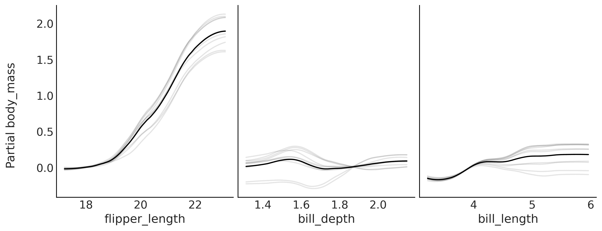
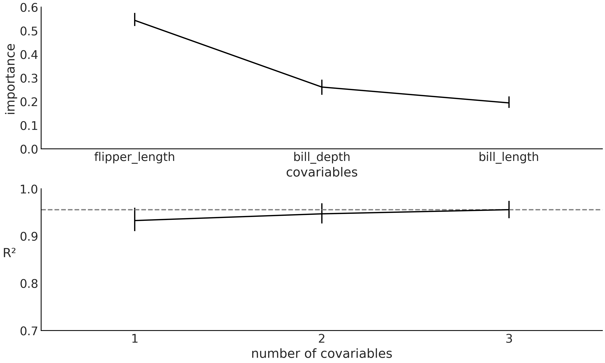
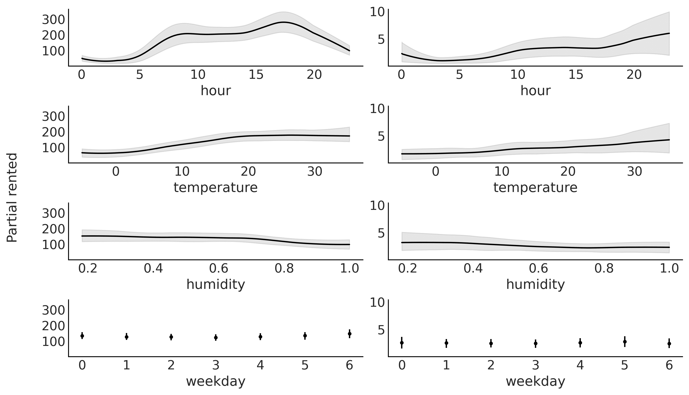
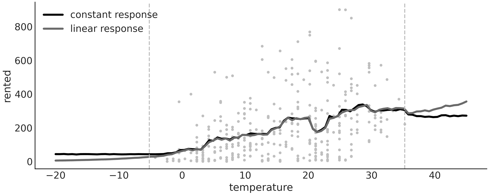

# 第九章

贝叶斯加法回归树

> 个人而言，我们是一个水滴。一起时，我们是海洋。—— 佐藤隆之

在上一章中，我们讨论了**高斯过程**（**GPs**），一种用于回归的非参数模型。在本章中，我们将学习另一种非参数回归模型，称为贝叶斯加法回归树，或者亲切地称为 BART。我们可以从多个不同的角度来看待 BART。它可以看作是决策树的一个集成，每棵树在整体数据理解中扮演着独特的角色和贡献。这些树在贝叶斯先验的指导下和谐工作，以捕捉数据的细微差别，避免个体过拟合的陷阱。通常，BART 作为一个独立的模型进行讨论，实施该模型的软件通常仅限于一个或少数几个模型。在本章中，我们将采用不同的方式，使用 PyMC-BART，这是一个允许在 PyMC 中使用 BART 模型的 Python 库。

在本章中，我们将讨论以下主题：

+   决策树

+   BART 模型

+   使用 BART 的灵活回归

+   部分依赖图

+   单个条件期望图

+   变量选择

## 9.1 决策树

在深入讨论 BART 模型之前，先花点时间了解一下什么是决策树。决策树就像一个流程图，指导你通过不同的问题，直到你做出最终选择。例如，假设你每天早上需要决定穿什么鞋子。为了做出决定，你可能会问自己一系列问题：“今天暖和吗？”如果是的话，你可能会问更具体的问题，比如“我需要去办公室吗？”最终，你会停止提问并得到一个输出值，比如拖鞋、运动鞋、靴子、莫卡辛鞋等。

该流程图可以方便地编码为树状结构，在树的根部放置更一般性的问题，然后沿着树结构向更具体的问题推进，最终到达树的叶子节点，输出不同类型鞋子的结果。树是计算机科学和数据分析中非常常见的数据结构。

更正式地说，树是节点和连接这些节点的顶点的集合。带有问题的节点称为决策节点，带有树的输出（如鞋子）的节点称为叶子节点。当答案是“是”或“否”时，我们就有了一个二叉树，因为每个节点最多可以有两个子节点。*图 9.1* 显示了一个决策树。圆角方块是叶子节点，普通方块是决策节点。



**图 9.1**：选择鞋类的决策树。

我们可以使用决策树进行分类，即返回离散类别，如运动鞋、拖鞋、凉鞋等。但我们也可以用它们进行回归，即返回连续结果，如 4.24 或 20.9（以及介于两者之间的任何值）。通常，这些树被称为回归树。*图 9.2*展示了左侧的回归树。我们还可以将回归树视为分段阶梯函数的表示，如*图 9.2*右侧所示。这与表示平滑函数（至少在某种程度上）的三次样条或高斯过程（GPs）不同。树可以足够灵活，以提供良好的平滑函数的实用近似。



**图 9.2**：左侧为回归树，右侧为对应的分段阶梯函数

树可以非常灵活；在极端情况下，我们可以有一棵树，其中的叶节点数量与观测值一样多，这棵树将完美拟合数据。正如我们在*第五章*中看到的，除非我们添加一些正则化，否则这可能不是一个好主意。在贝叶斯术语中，我们可以通过先验来实现这种正则化。例如，我们可以设置一个先验，使树较浅。通过这种方式，我们使得树的节点数与数据点数相等的情况非常不太可能发生。

## 9.2 BART 模型

**贝叶斯加性回归树**（**BART**）模型是*m*棵树的和，我们用它来逼近一个函数[Chipman et al.，2010]。为了完成模型，我们需要设置树的先验。这些先验的主要作用是防止过拟合，同时保留树所提供的灵活性。先验设计旨在使得每棵树相对较浅，并且叶节点的值相对较小。

PyMC 不直接支持 BART 模型，但我们可以使用 PyMC-BART，一个扩展 PyMC 功能以支持 BART 模型的 Python 模块。PyMC-BART 提供：

+   一个与 PyMC 中其他分布（如`pm.Normal`、`pm.Poisson`等）非常相似的 BART 随机变量。

+   一个名为 PGBART 的采样器，因为树不能使用 PyMC 的默认步进方法（如 NUTS 或 Metropolis）进行采样。

+   以下是一些帮助处理 BART 模型结果的实用函数：

    +   `pmb.plot_pdp`：用于生成部分依赖图的函数[Friedman，2001]。

    +   `pmb.plot_ice`：用于生成个体条件期望图的函数[Goldstein et al.，2013]。

    +   `pmb.plot_variable_importance`：用于估算变量重要性的函数。

    +   `pmb.plot_convergence`：一个绘制 BART 随机变量的有效样本大小的经验累积分布以及值的函数。

BART 是步进函数的先验

我们可以将 BART 看作是分段常数函数的先验。此外，当树的数量*m* → ∞时，BART 会收敛为一个处处不可微的高斯过程。

在接下来的部分，我们将重点讨论 BART 的应用部分，特别是如何使用 PyMC-BART。如果您有兴趣了解更多有关 BART 模型工作原理的细节，PyMC-BART 的实现细节，以及更改 PyMC-BART 的超参数如何影响结果，建议阅读 Quiroga 等人 [2022]。

### 9.2.1 巴特企鹅

假设出于某种原因，我们有兴趣将企鹅的体重作为其他身体指标的函数进行建模。下面的代码块展示了一个针对这种问题的 BART 模型。在这个示例中，`X = "flipper_length", "bill_depth", "bill_length"]`，而`Y`是`body_mass`：

**代码 9.1**

```py
with pm.Model() as model_pen: 

    σ = pm.HalfNormal("σ", 1) 

    μ = pmb.BART("μ", X, Y) 

    y = pm.Normal("y", mu=μ, sigma=σ, observed=Y) 

    idata_pen = pm.sample() 

    pm.sample_posterior_predictive(idata_pen, extend_inferencedata=True)
```

我们可以看到，使用 PyMC-BART 通过 PyMC 定义 BART 模型是很简单的。基本上，我们需要定义一个带有参数`X`（协变量）和`Y`（响应变量）的 BART 随机变量。除此之外，模型的其余部分应该与其他回归模型非常相似。像其他回归模型一样，*μ*的长度将与观察值的数量相同。

从理论上讲，这些树仅仅是`X`的函数，但 PyMC-BART 需要`Y`来获取树叶节点上方差初始值的估计。

一旦我们使用 BART 变量拟合了模型，剩余的工作流程就和通常一样。例如，我们可以通过调用`az.plot_ppc(.)`来计算后验预测检验，结果将类似于*图 9.3*。



**图 9.3**：`model_pen`的后验预测检验

*图 9.3*显示了一个合理的拟合。值得注意的是，即使我们使用正态似然，也没有得到负的质量。然而，使用 PyMC 和 PyMC-BART 时，尝试其他似然分布非常简单；只需将正态分布替换为其他分布（如 Gamma 分布或截断正态分布），就像在常规的 PyMC 模型中那样，就能顺利进行。然后，您可以使用后验预测检验和 LOO，如*第五章*中讨论的那样。

在接下来的几节中，我们将讨论如何使用和解释 PyMC-BART 提供的工具函数（`pmb.plot_convergence`除外，该函数将在*第十章*中与其他诊断方法一起讨论）。

### 9.2.2 部分依赖图

**部分依赖图**（**PDP**）是一种在 BART 文献中广泛使用的图形工具，但并非仅限于 BART。原则上，它可以与任何方法或模型一起使用。它的基本原理是绘制给定协变量 *X*[*i*] 下的预测响应，同时对其余协变量 *X*[−*i*] 进行平均。因此，实质上，我们是在绘制每个协变量对响应变量的贡献，同时保持其他变量不变。对于 BART 和其他基于树的方法，有一个特点是 PDP 的计算可以在不重新拟合模型到合成数据的情况下进行；相反，它可以通过已拟合的树高效地计算出来。这使得 BART 成为模型可解释性和理解单个特征对预测影响的一个有吸引力的选择。

一旦像 `model_pen` 这样的模型已经拟合，我们可以通过以下方式计算部分依赖图（PDP）：

**代码 9.2**

```py
pmb.plot_pdp(μ, X, Y)
```

请注意，我们传递了 BART 随机变量、协变量和响应变量。响应变量其实并非必需，但如果传递了且它是 pandas Series 类型，它将使用其名称作为 y 轴标签。

*图 9.4* 显示了来自 `model_pen` 的部分依赖图示例。我们可以看到，`flipper_length` 显示出最大的效应，呈线性关系，而另外两个变量则基本保持平坦的响应，表明它们对响应变量的部分贡献不大。对于对响应变量贡献为零的变量，其预期的 PDP 将是一个平坦的常数线，值为响应变量的平均值。



**图 9.4**：`model_pen` 的部分依赖图

在 *图 9.4* 中，我们可以看到，最大的贡献来自 `flipper_length`，但这并不意味着其他两个变量与 `body_mass` 没有关系。我们只能说，考虑到模型中已经包含了 `flipper_length`，其他两个变量的影响是最小的。

### 9.2.3 个体条件图

在计算部分依赖图时，我们假设变量 *X*[*i*] 和 *X*[−*i*] 之间没有相关性。在许多实际问题中，情况往往并非如此，部分依赖图可能会掩盖数据中的关系。然而，如果所选变量子集之间的依赖关系不太强，则部分依赖图仍然可以作为有用的总结工具 Friedman [2001]。

**个体条件期望**（**ICE**）图与部分依赖图（PDP）密切相关。不同之处在于，我们不是绘制目标协变量对预测响应的平均部分效应，而是在给定固定值（默认为 10）下，绘制 *n* 条条件期望曲线。也就是说，ICE 图中的每条曲线反映了在固定的 *X*[*i*] 值下，协变量 *X*[*i*] 对预测响应的部分影响。

一旦像 `model_pen` 这样的模型已经拟合，我们可以通过以下命令计算 ICE 图：

**代码 9.3**

```py
pmb.plot_ice(μ, X, Y)
```

这个签名与 PDP 相同。结果显示在*图 9.5*中。灰色曲线是不同值下的条件期望曲线。如果我们对它们取平均值，我们应该得到 PDP 曲线（黑色）。如果 ICE 图中的曲线大多平行，这意味着协变量对响应变量的贡献大多是独立的。这对于`flipper_length`和`bill_length`来说是成立的。在这种情况下，ICE 图和 PDP 图传达的是相同的信息。然而，如果曲线交叉，则表示贡献是非独立的。在这种情况下，PDP 会隐藏这些效应。我们可以在下图中看到`bill_depth`的例子：



**图 9.5**：`model_pen`的个体条件期望图

默认情况下，ICE 图是居中的，这意味着灰色曲线围绕在 x 轴最低值处计算的部分响应进行居中。这有助于解释图形：例如，可以更容易地看出线条是否交叉。这也解释了为什么*图 9.5*中的 y 轴刻度与*图 9.4*中的刻度不同。你可以通过参数`centered=False`来修改这一点。

### 9.2.4 使用 BART 进行变量选择

在*第 6*章中，我们已经讨论过变量选择，并解释了在某些场景下我们可能有兴趣选择一个变量子集。PyMC-BART 提供了一种非常简单、几乎不需要计算的启发式方法来估计变量重要性。它跟踪每个协变量作为分裂变量被使用的次数。对于 BART 模型，变量重要性是通过在*m*棵树和所有后验样本上取平均值来计算的。为了进一步简化解释，我们可以报告经过归一化的值，使每个值都位于区间[0, 1]内，且总重要性为 1。

在某些 BART 实现中，变量重要性的估计对树的数量*m*非常敏感。这些实现的作者建议，在进行变量选择时使用相对较少的树，而在进行模型拟合/预测时使用更多的树。PyMC-BART 不是这种情况，PyMC-BART 的变量重要性估计对树的数量具有鲁棒性。

一旦我们像`model_pen`这样拟合了一个模型来使用 PyMC-BART 进行变量选择，我们需要做如下操作：

**代码 9.4**

```py
pmb.plot_variable_importance(idata_pen, μ, X)
```

请注意，我们传递了推断数据、BART 随机变量和协变量。结果显示在*图 9.6*中：



**图 9.6**：`model_pen`的变量重要性图

从顶部面板，我们可以看到`flipper_length`具有最大的变量重要性值，其次是`bill_depth`和`fill_length`。请注意，这与部分依赖图和个体条件期望图在定性上是一致的。

计算一个变量在树中出现的次数这一简单启发式方法存在一些问题。其中一个问题涉及可解释性，因为缺乏一个明确的阈值来区分*重要*变量和*不重要*变量，这是一个问题。PyMC-BART 提供了一些帮助。*图 9.6*的底部面板显示了参考模型生成的预测与使用子模型生成的预测之间的皮尔逊相关系数的平方，参考模型是包含所有协变量的模型，子模型是包含较少协变量的模型。我们可以使用这个图来找到能够做出与参考模型尽可能接近的预测的最小模型。*图 9.6*告诉我们，只有`flipper_length`的模型，其预测性能几乎与包含所有三个变量的模型相同。请注意，通过加入`bill_depth`可能会稍微提高一点性能，但这可能是微不足道的。

现在，让我简要解释一下`pmb.plot_variable_importance`在背后做了什么。主要有两个近似过程：

+   它不会评估所有可能的协变量组合。相反，它一次添加一个变量，按照变量的重要性顺序进行（*图 9.6*中的上面子图）。

+   它并不会重新拟合从 1 到 n 个协变量的所有模型。相反，它通过遍历参考模型的后验分布中的树，近似估计去除一个变量的影响，并且剪枝去除没有兴趣变量的分支。这与计算部分依赖图的过程类似，不同之处在于，对于部分依赖图，我们排除了除了一个变量之外的所有变量，而对于变量重要性，我们首先排除除了最重要的一个变量之外的所有变量，然后排除除了最重要的两个变量之外的所有变量，依此类推，直到包括所有变量。

如果这个变量选择过程对你来说听起来很熟悉，那么很可能你一直在关注这一章，并且也看过*第六章*。这个过程在概念上类似于 Kulprit 所做的工作。在这里，我们也利用了参考模型的概念，并根据其预测分布来评估模型。但相似之处到此为止。PyMC-BART 并没有使用 ELPD，而是使用皮尔逊相关系数的平方，并通过修剪用参考模型拟合的树来估计子模型，而不是通过 Kullback-Liebler 散度投影。

在进入下一个话题之前，让我再补充几点提醒。正如我们在*第六章*中讨论的那样，使用 Kulprit 的输出时，我们不应过度解读变量的顺序。样本适用于通过`pmb.plot_variable_importance`生成的图形，如*图 9.6*。如果两个变量的重要性非常相似，当我们用不同的随机种子重新拟合模型，或数据发生轻微变化（如添加或删除一个数据点）时，顺序可能会发生变化。变量重要性的误差条可以提供帮助，但它们可能低估了真实的变异性。因此，要谨慎对待顺序，将其作为解决问题时的参考。

## 9.3 分布式 BART 模型

正如我们在*第六章*中看到的，对于广义线性模型，我们并不限于为均值或位置参数创建线性模型；我们还可以建模其他参数，例如高斯分布的标准差，甚至同时建模均值和标准差。BART 模型也适用同样的原则。

为了举例说明，让我们以自行车数据集为模型。我们将使用`rented`作为响应变量，`hour`、`temperature`、`humidity`和`workday`作为预测变量。正如我们之前所做的，我们将使用负二项分布作为似然函数。该分布有两个参数，*μ*和*alpha*。我们将为这两个参数使用树的和。以下代码块展示了模型：

**代码 9.5**

```py
with pm.Model() as model_bb: 
    μ = pmb.BART("μ", X, np.log(Y), shape=(2, 348), separate_trees=True) 
    pm.NegativeBinomial('yl', np.exp(μ[0]), np.exp(μ[1]), observed=Y) 
    idata_bb = pm.sample(2000, 
                         random_seed=123, 
                         pgbart={"batch":(0.05, 0.15)})
```

让我们花点时间确保理解这个模型。首先，注意我们传递了一个`shape`参数给`pmb.BART()`。当`separate_trees = True`时，这指示 PyMC-BART 拟合两组独立的树和。然后我们索引*μ*，以便使用第一维度作为负二项分布的*μ*参数，第二维度作为*α*参数。如果`separate_trees = False`，则告诉 PyMC-BART 拟合一组树和，但每棵树在每个叶节点返回 2 个值，而不是 1 个。这样做的好处是算法运行更快，内存使用更少，因为我们只拟合一组树。缺点是模型的灵活性较差。实际上，这两种选项都可以有用，因此你应该选择哪个，取决于你的建模决策。

`model_bb`的另一个重要方面是我们对*μ*取指数。这样做是为了确保 NegativeBinomial 分布的*μ*和*α*值都为正值。这与我们在广义线性模型中讨论的变换类型相同。PyMC-BART 的特殊之处在于，我们将其逆变换应用于传递给`pmb.BART()`的*Y*值。根据我的经验，这有助于 PyMC-BART 找到更好的解。对于具有二项分布或类别分布的模型，无需分别对逻辑回归或 softmax 应用逆变换。PyMC-BART 将二项分布作为特例处理，对于类别分布，我们通过经验发现即使没有逆变换，也能获得良好的结果。需要强调的是，我们传递给`pmb.BART()`的*Y*值仅用于初始化 BART 变量的采样。初始化似乎对我们传递的值具有鲁棒性，传递*Y*或其某种变换在大多数情况下都能很好地工作。

我希望你注意的第三个方面是，我们向`pm.sample`传递了一个新的参数，即`pgbart`。这个参数的值是字典`"batch":(0.05, 0.15)`。为什么要这么做呢？有时，为了获得高质量的样本，必须调整采样器的超参数。在之前的示例中，我们选择省略这一部分，以保持简单和专注。然而，正如我们在*第 10*章中更深入地讨论的那样，关注这些调整可能变得非常重要。对于 PGBART 采样器的特殊情况，我们可以改变两个超参数。其中一个是`num_particles`（默认为 10），粒子数量越大，BART 的采样越准确，但代价也越高。另一个是`batch`；默认值为元组`(0.1, 0.1)`，意味着在每一步中，采样器在调节阶段拟合 10%的`m`棵树，在采样阶段也是如此。对于`model_bb`模型，我们使用了`(0.05, 0.15)`，即在调节阶段使用 5%（2 棵树），在实际采样阶段使用 15%（7 棵树）。



**图 9.7**：`model_bb`的部分依赖图

我们可以像*图 9.7*中一样，探索协变量与响应之间的关系。请注意，变量出现了两次：第一列对应参数*μ*，第二列对应参数*α*。我们可以看到，`hour`对 NegativeBinomial 的两个参数的响应变量影响最大。

## 9.4 常数和线性响应

默认情况下，PyMC-BART 将拟合在每个叶节点返回单一值的树。这是一种通常非常有效的简单方法。然而，理解其影响是很重要的。例如，这意味着对于任何超出用于拟合模型的观察数据范围的值，预测将是常数。为了验证这一点，回去查看*图 9.2*。这棵树对于`c1`以下的任何值都将返回 1.9。请注意，即使我们将多棵树相加，这仍然是事实，因为加总一堆常数值仍然会得到另一个常数值。

这是否是一个问题，取决于你和你应用 BART 模型的上下文。尽管如此，PyMC-BART 提供了一个`response`参数，可以传递给 BART 随机变量。它的默认值是`"constant"`。你可以将其更改为`"linear"`，在这种情况下，PyMC-BART 将在每个叶节点返回一个线性拟合，或者更改为`"mix"`，这将在采样过程中提出具有常数或线性值的树。

为了举例说明差异，我们来拟合一个非常简单的例子：租赁自行车的数量与温度的关系。观察到的温度值从≈−5 到≈35。拟合此模型后，我们将要求范围为[-20, 45]的样本外后验预测值。因此，我们将设置一个具有可变变量的模型，如*第四章*所介绍的。

**代码 9.6**

```py
with pm.Model() as model_tmp1: 
    X_mut1 = pm.MutableData("X_mut1", X) 
    *α* = pm.HalfNormal('*α*', 1) 
    μ = pmb.BART("μ", X_mut1, np.log(Y), m=100, response="linear") 
    _ = pm.NegativeBinomial('yl', np.exp(μ), *α*, observed=Y, shape=μ.shape) 
    idata_tmp1 = pm.sample(random_seed=123)
```

注意我们将`shape=`*μ*`.shape`传递给了似然函数。这是我们需要做的，以便能够改变`X_mut1`的形状，这也是 PyMC 的要求，所以你在使用非 BART 模型（如线性回归）时也应该做这件事。

好的，继续这个例子，在随附的代码中，你将找到`model_tmp0`模型的代码，它与**model_tmp1**完全相同，只是它具有默认的常数响应。两个模型的结果显示在*图 9.8*中。



**图 9.8**：常数和线性响应的平均预测

请注意，在数据范围之外（虚线灰色线），具有常数响应的模型的预测确实是常数。哪个模型提供的预测更好？我不确定。我认为，在较低温度范围内，线性响应更好，因为它预测租赁自行车的数量将继续减少，直到最终降至 0。但在较高温度范围内，平台效应或甚至下降应该比上升更可能。我是说，我尝试过在 40 度甚至 42 度时骑自行车，那可不是一个超级愉快的体验。你怎么看？

## 9.5 选择树的数量

树的数量（`m`）控制 BART 函数的灵活性。一般来说，默认值 50 应该足以得到一个不错的近似。较大的值，比如 100 或 200，应当提供更精细的结果。通常，增加树的数量不会导致过拟合，因为树的数量越大，叶节点的值越小。

在实际应用中，你可能会担心 `m` 的值过大，因为 BART 的计算成本（无论是时间还是内存）会随之增加。调节 `m` 的一种方式是执行 K 折交叉验证，正如 Chipman et al. [2010] 所推荐的那样。另一种选择是通过使用 LOO 来近似交叉验证，正如在*第五章*中讨论的那样。我们已经观察到 LOO 确实能帮助提供合理的 `m` 值 [Quiroga et al., 2022]。

## 9.6 总结

BART 是一种灵活的非参数模型，通过树的总和来近似从数据中获得的未知函数。先验用于规范推理，主要是通过限制树的学习能力，使得没有单一的树能够解释数据，而是树的总和。PyMC-BART 是一个 Python 库，它扩展了 PyMC 以支持 BART 模型。

本章中我们构建了一些 BART 模型，并学习了如何执行变量选择，利用部分依赖图和个体条件图来解释 BART 模型的输出。

## 9.7 练习

1.  解释以下内容：

    +   BART 和线性回归、样条有什么不同？

    +   在什么情况下你可能会选择线性回归而非 BART？

    +   在什么情况下你可能会选择高斯过程而非 BART？

1.  用你自己的话解释为什么多个小树比一棵大树更能拟合模式。两者方法有什么区别？各自有什么权衡？

1.  以下是两个简单的合成数据集。对每个数据集拟合一个 m=50 的 BART 模型。绘制数据和均值拟合函数。描述拟合情况。

    +   x = np.linspace(-1, 1., 200) 和 y = np.random.normal(2*x, 0.25)

    +   x = np.linspace(-1, 1., 200) 和 y = np.random.normal(x**2, 0.25)

    +   创建你自己的合成数据集。

1.  创建以下数据集 *Y* = 10sin(*πX*[0]*X*[1])+20(*X*[2] −0*.*5)² +10*X*[3] +5*X*[4] + ，其中  ∼(0*,*1)，且 ***X***[0:9] ∼(0*,*1)。这就是所谓的 Friedman 的五维函数。注意，我们实际上有 10 个维度，但最后 5 个是纯噪声。

    +   将 BART 模型拟合到这个数据中。

    +   计算 PDP 和变量重要性（VI）。

    +   PDP 和 VI 是否在定性上相符？如何相符？

1.  使用 BART 模型和企鹅数据集。将`bill_length`、`flipper_length`、`bill_depth`、`bill_length`和`body_mass`作为协变量，物种`Adelie`和`Chistrap`作为响应变量。尝试不同的`m`值——10、20、50 和 100。使用 LOO 选择合适的值。

1.  查看前一个问题中模型的变量重要性。将结果与使用 Kulprit 构建的同一协变量和响应变量的广义线性模型的结果进行比较，该模型使用 Bambi 构建。

## 加入我们的社区 Discord 空间

加入我们的 Discord 社区，结识志同道合的人，并与超过 5000 名成员一起学习： [`packt.link/bayesian`](https://packt.link/bayesian)


